# Linux运维RHCSA+RHCE培训教程：1.1：云计算与Linux系统介绍

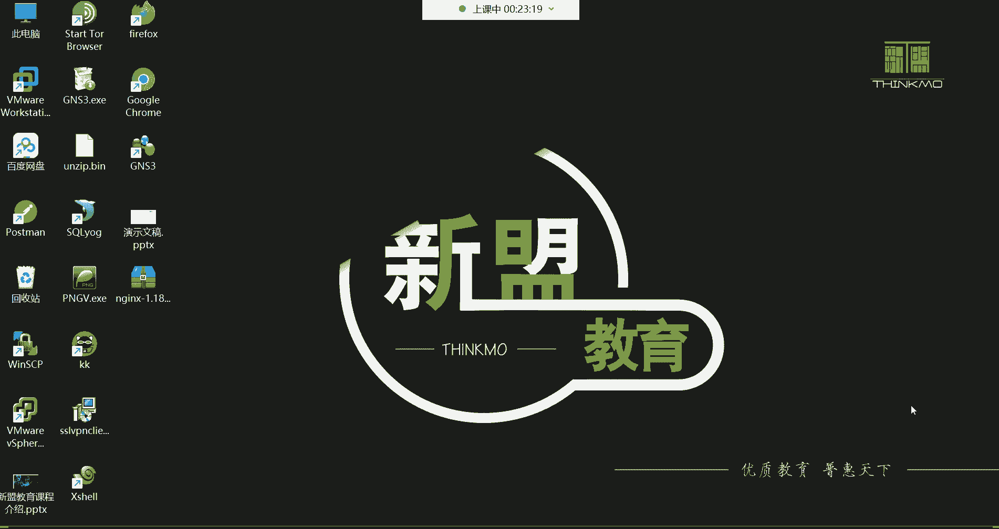

在本节课中，我们将学习云计算的基本概念、Linux系统的起源与核心，以及它们在现代IT行业中的角色和关系。课程旨在为初学者打下坚实的理论基础。

## 云计算介绍

上一节我们了解了课程的整体安排，本节中我们来看看什么是云计算。

云计算的本质是**网络资源出租**。云厂商（如阿里云、亚马逊AWS）建立并维护大型数据中心，用户无需自建机房和购买物理服务器，只需按需租用云平台上的虚拟资源（如云主机）来运行自己的业务（如网站、应用）。

### 云计算的发展历程

云计算概念在20年前还较为模糊。在2000年的一场IT领袖峰会上，当被问及云计算在中国的未来时，不同企业家给出了迥异的看法。马云对此充满信心，随后阿里巴巴持续投入，最终在2009年成立了阿里云。如今，阿里云已成为全球第三大云服务提供商。

### 主要云厂商排名

以下是全球主要的云服务提供商：
*   **亚马逊AWS**：全球市场份额第一。
*   **微软Azure**：全球市场份额第二。
*   **阿里云**：全球市场份额第三。
此外，国内市场还有华为云、腾讯云、百度云等众多服务商。

### 云计算的服务模式

云计算主要提供三种服务模式，以满足不同层次的需求：

1.  **IaaS（基础设施即服务）**
    为用户提供最基础的计算资源，如**CPU、内存、硬盘、网络**。这好比购买了一台“裸机”，用户需要自己安装操作系统并部署应用。
    *   **示例**：租用一台**云主机（ECS）**，获得其IP地址、root密码，然后自行安装系统环境。

2.  **PaaS（平台即服务）**
    在IaaS的基础上，进一步为用户提供现成的软件**开发和运行环境**，如数据库、中间件、运行框架。用户无需管理底层基础设施，可专注于业务逻辑开发。
    *   **示例**：直接使用云平台的**MySQL数据库服务（RDS）** 或**Web应用托管服务**，无需自行安装和维护数据库软件。

3.  **SaaS（软件即服务）**
    提供最完整的、可直接使用的软件应用。云服务商负责应用的一切前期部署和后期维护，用户只需“拎包入住”。
    *   **示例**：使用**在线办公软件（如钉钉、企业微信）**、**客户关系管理系统（CRM）** 等，无需关心服务器、软件安装和升级。

## Linux系统介绍

了解了云计算后，我们来看看支撑众多云服务的底层操作系统——Linux。

### Linux是什么？

**Linux** 是一个**类Unix的操作系统内核**。内核是操作系统的核心，如同人的大脑，负责管理计算机的所有硬件（如CPU、内存、磁盘）和软件资源（如文件、进程）。

### Linux的起源

Linux的诞生与Unix系统密切相关：
*   **Unix**：诞生于1970年，最初由贝尔实验室的肯·汤普森用汇编语言编写，后由C语言之父丹尼斯·里奇用C语言重写。Unix是商业操作系统。
*   **Linux**：由林纳斯·托瓦兹于1991年开发。他基于Unix的设计理念，但**独立编写**了Linux内核，并决定将其**开源、免费**。Linux的吉祥物是企鹅（Tux）。

一个完整的Linux操作系统发行版通常由 **Linux内核** + **GNU项目提供的软件工具** 构成，因此也被称为 **GNU/Linux**。

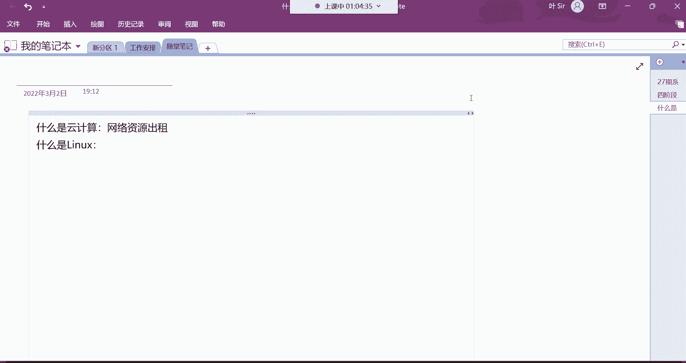

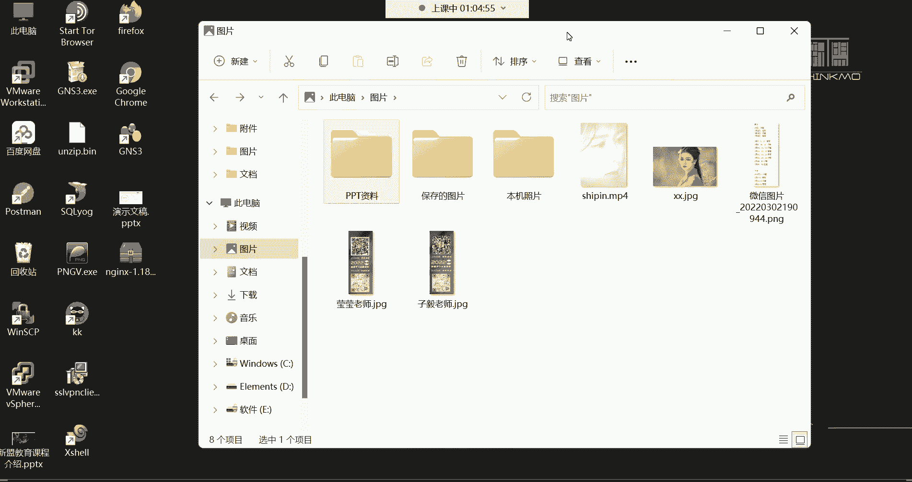

### 常见的Linux发行版

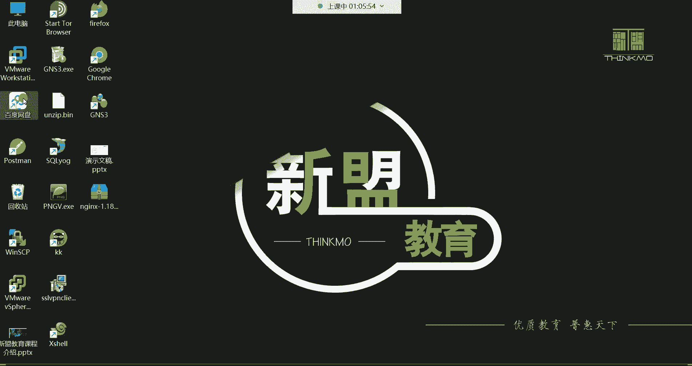

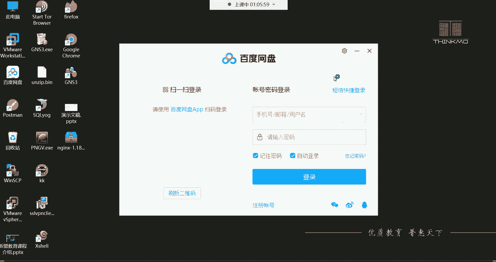

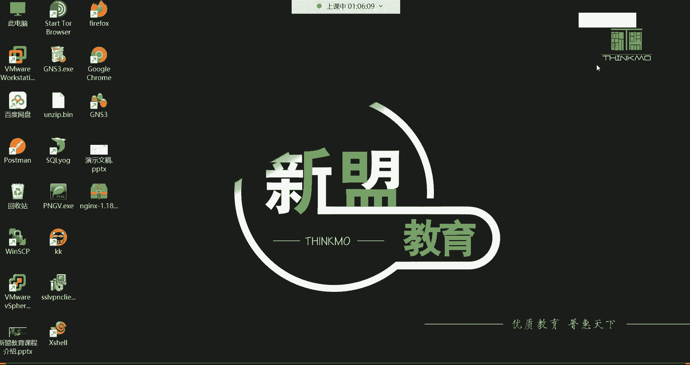

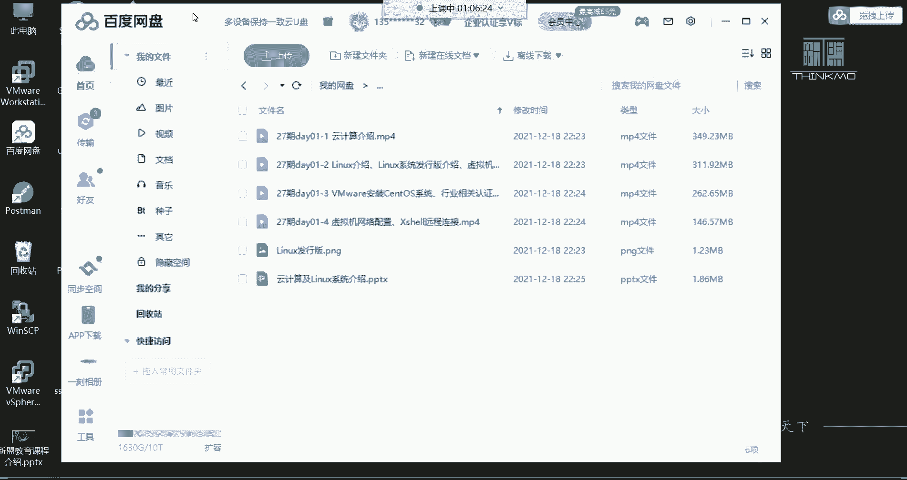

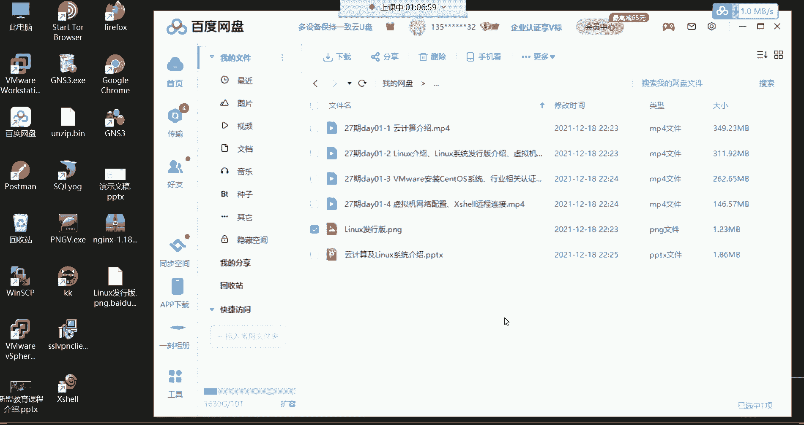

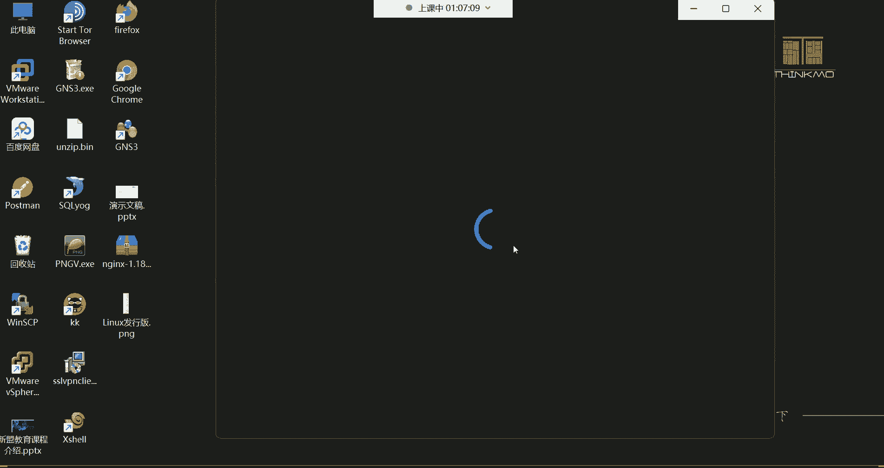

基于Linux内核，全球社区和公司开发了众多发行版。主要分为几个系列：

*   **Red Hat系列**：主要面向企业服务器领域，稳定性和商业支持是其特点。
    *   **RHEL（Red Hat Enterprise Linux）**：红帽企业版，需付费订阅以获得官方支持。
    *   **CentOS**：RHEL的免费克隆版，曾因高度兼容和免费而广受欢迎（注：CentOS 8之后策略已变）。
    *   **Fedora**：红帽社区版，用于测试新技术，更新激进。
*   **Debian系列**：以稳定性著称，拥有庞大的软件库。其衍生版多具有友好的桌面环境。
    *   **Ubuntu**：最流行的桌面Linux发行版之一，也提供服务器版，在开发者和云计算中常见。
    *   **Deepin**：中国开发的优秀桌面发行版。
*   **其他独立发行版**：
    *   **openSUSE**：在欧洲流行，兼顾桌面与服务器。
    *   **Arch Linux**：滚动更新，高度可定制，适合高级用户。
    *   **Kali Linux**：专为网络安全测试和渗透设计。

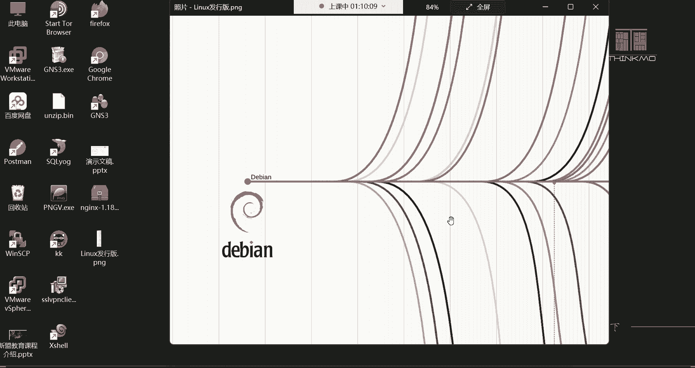

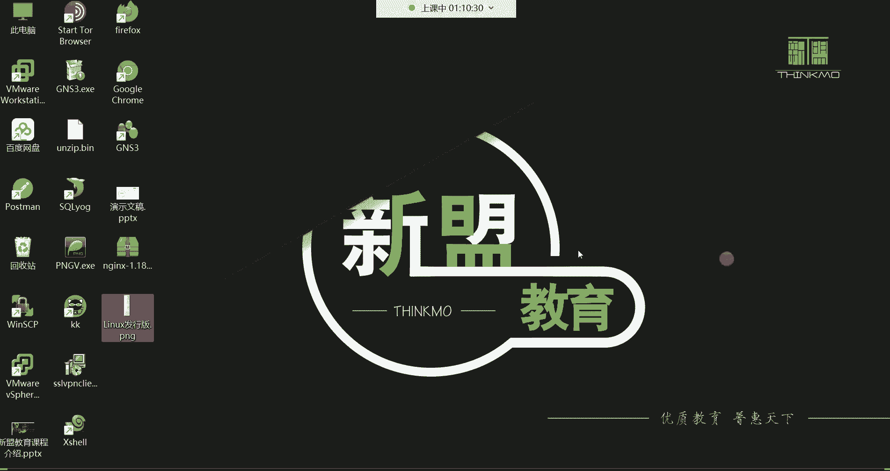

对于运维工程师而言，**RHEL/CentOS** 系列因其在企业市场的绝对主导地位，是学习的重点。

### Linux的应用领域

Linux因其稳定、高效、安全和开源的特点，被广泛应用于：
1.  **服务器领域**：超过90%的互联网服务器运行在Linux上，包括网站、数据库、云计算平台。
2.  **嵌入式系统**：智能家电、路由器、安卓手机（基于Linux内核）等。
3.  **超级计算机**：全球TOP500超级计算机几乎全部运行Linux。
4.  **开发环境**：程序员喜爱的开发平台。

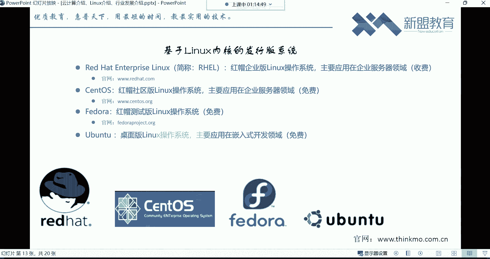

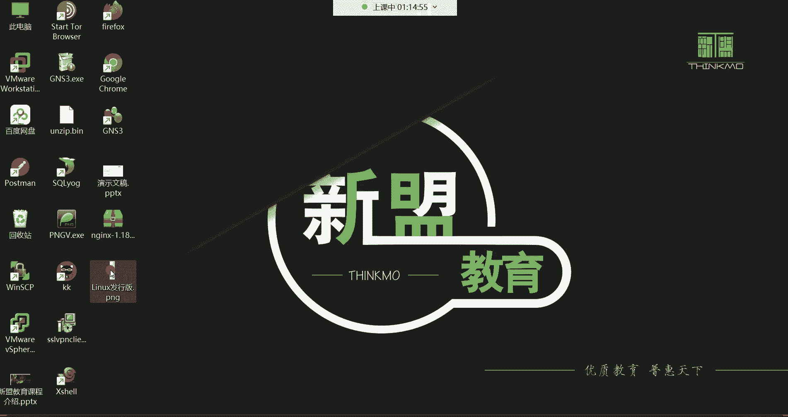

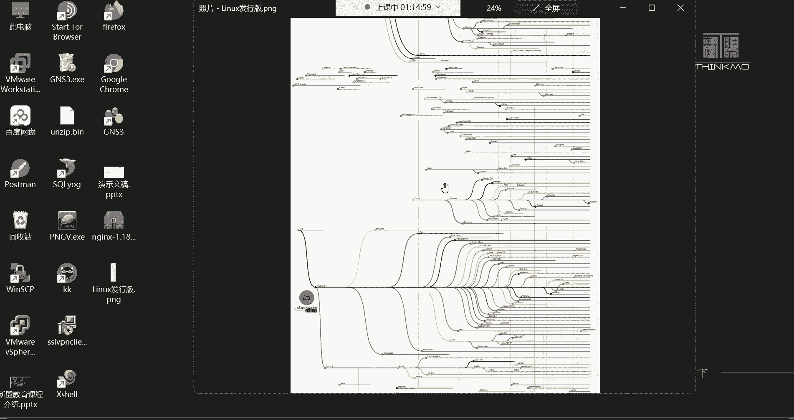

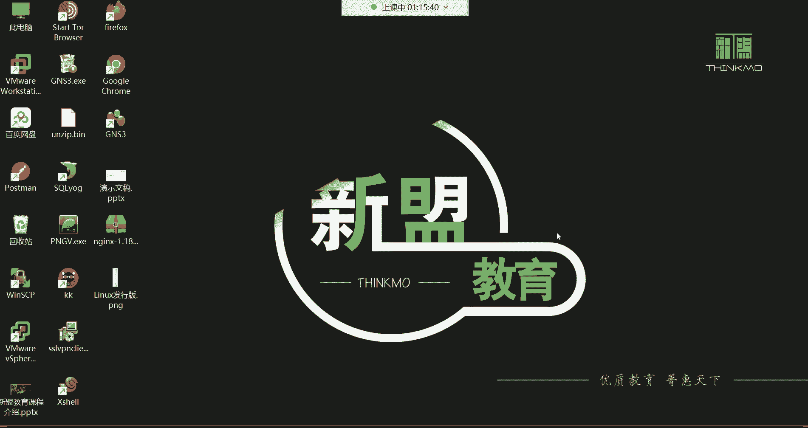

## 总结

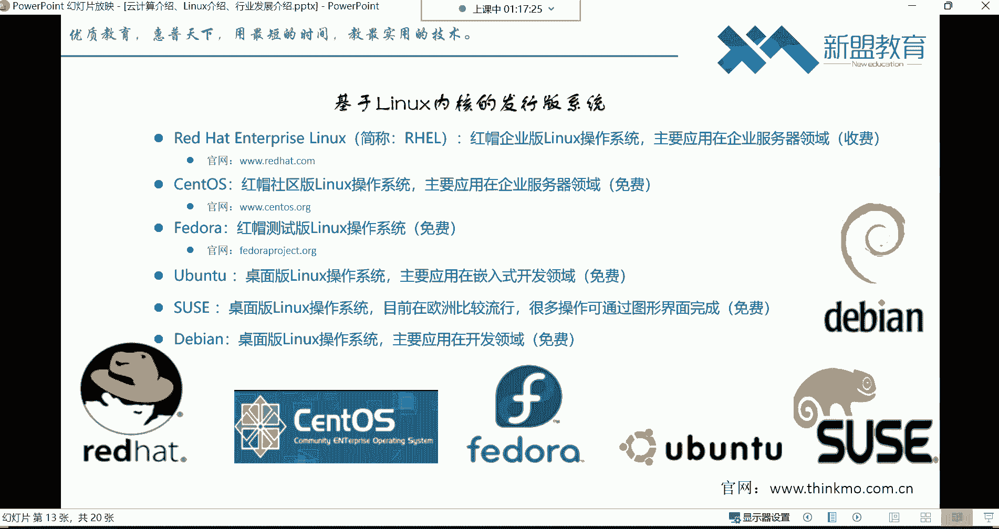

本节课中我们一起学习了：
1.  **云计算**的本质是资源出租，它有三种服务模式：**IaaS、PaaS、SaaS**，极大地降低了企业和个人使用IT资源的门槛。
2.  **Linux**是一个开源免费的操作系统内核，由林纳斯·托瓦兹创建。
3.  基于Linux内核有众多**发行版**，其中**Red Hat/CentOS**系列在企业服务器运维中占据核心地位。
4.  Linux与云计算紧密结合，是云数据中心底层最主要的操作系统。

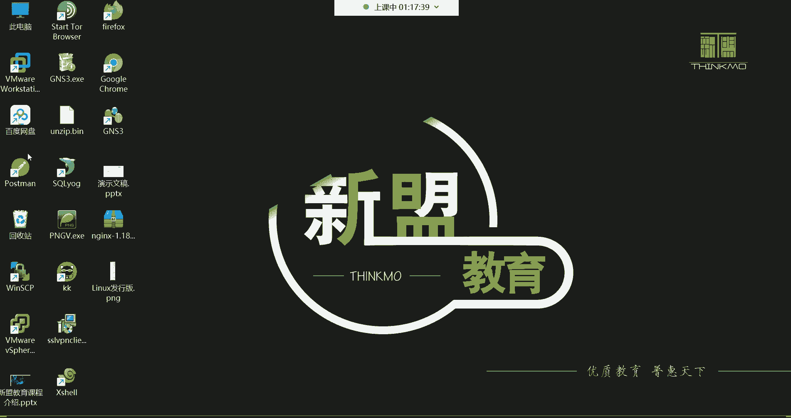

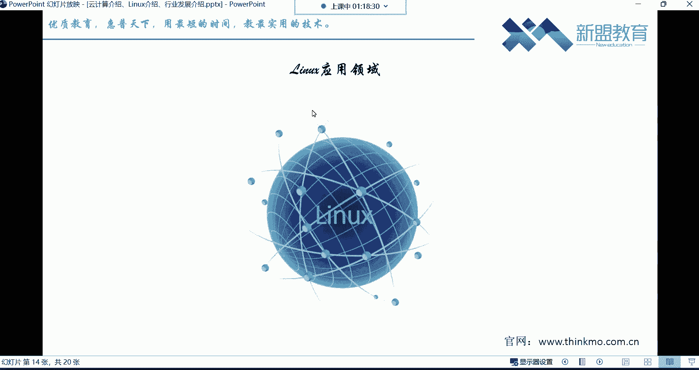

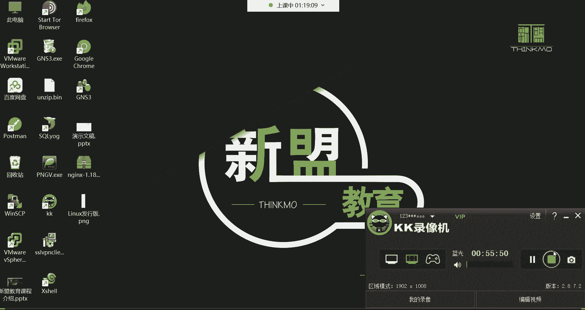

理解这些基础概念，将帮助我们更好地进入后续具体的运维技术学习。