# Linux运维RHCSA+RHC培训教程：P21：find文件查找命令详解 🗂️

在本节课中，我们将学习Linux系统中功能强大的`find`命令。`find`命令用于在指定目录下递归地查找符合特定条件的文件和目录。我们将从基本语法开始，逐步学习各种查找条件，并了解如何对查找结果进行后续处理。

## 命令格式与递归查找

`find`命令的基本格式是：`find [路径] [查找条件]`。你需要先指定一个查找的起始路径，然后给出查找条件。

**命令格式示例**：
```bash
find /var/log -type f
```

`find`命令的特点是**递归查找**。这意味着当你指定一个路径后，`find`不仅会搜索该路径下的文件，还会深入其所有子目录进行搜索，并将所有符合条件的文件都列出来。

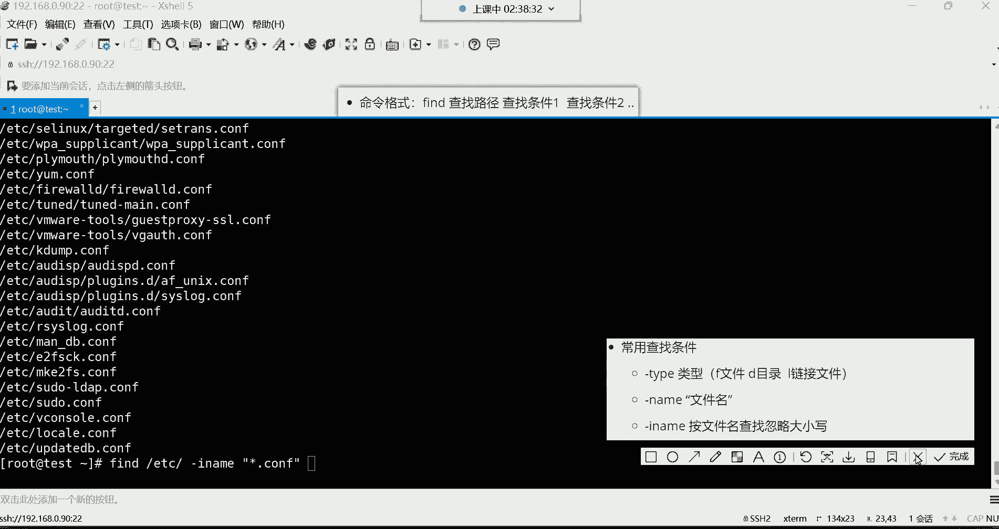

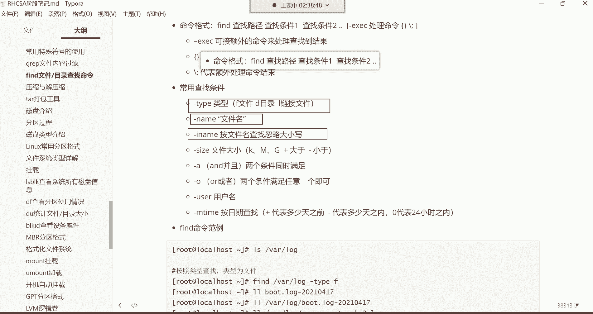

## 按类型查找

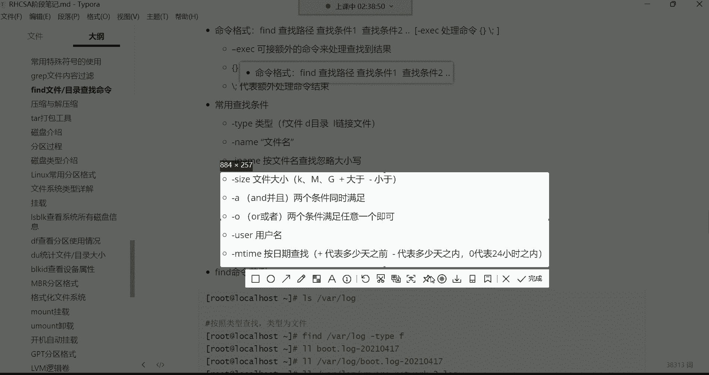

第一个常用的查找条件是按照文件类型进行查找，使用 `-type` 选项。

以下是按类型查找的几种常见选项：
*   **`-type f`**：查找普通文件。
*   **`-type d`**：查找目录。
*   **`-type l`**：查找符号链接文件。

例如，在 `/etc` 目录下查找所有符号链接文件：
```bash
find /etc -type l
```

## 按名称查找

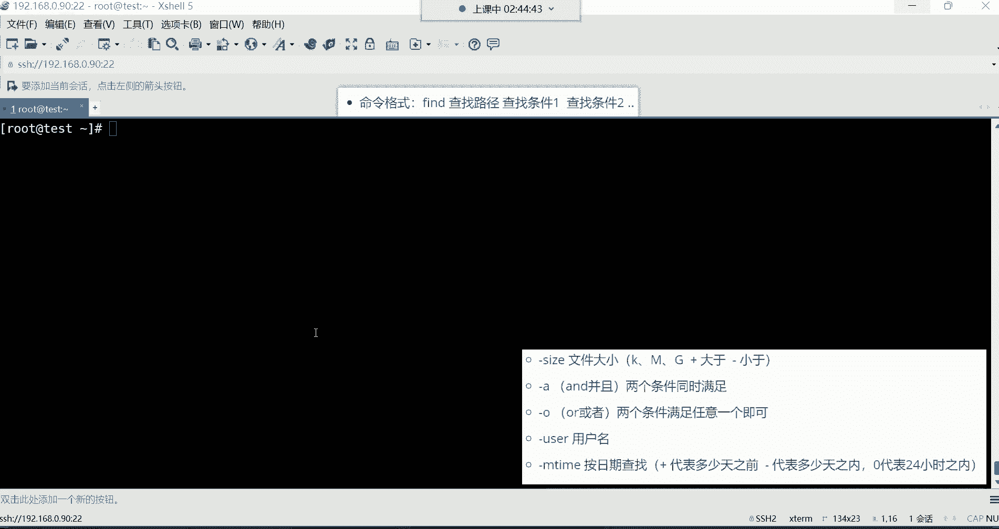

如果你记得文件名或部分文件名，可以使用 `-name` 选项进行精确或模糊查找。

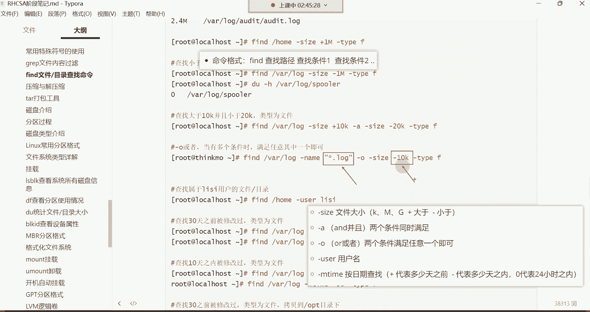

以下是按名称查找的相关选项：
*   **`-name “文件名”`**：精确查找指定名称的文件。可以使用通配符 `*` 进行模糊匹配，例如 `-name “*.log”` 查找所有以 `.log` 结尾的文件。
*   **`-iname “文件名”`**：功能与 `-name` 相同，但查找时忽略文件名的大小写。

**注意**：`find` 的按名称查找与 `grep` 命令不同。`grep` 是在文件**内容**中搜索特定字符串，而 `find` 是根据**文件名**在文件系统中定位文件。

## 按大小查找

你可以根据文件的大小来查找文件，使用 `-size` 选项，并配合 `+`（大于）或 `-`（小于）符号。

**命令格式**：
```bash
find [路径] -size [+/-]大小单位
```

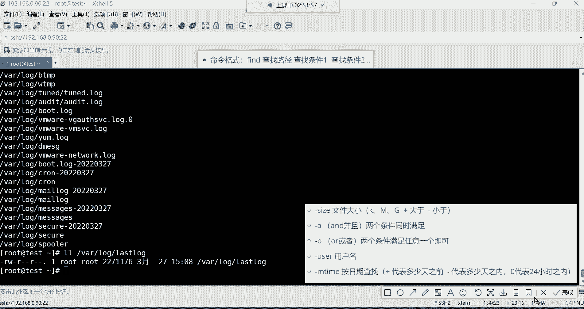

常用单位包括：
*   **`k`**：千字节 (KiB)
*   **`M`**：兆字节 (MiB)
*   **`G`**：吉字节 (GiB)

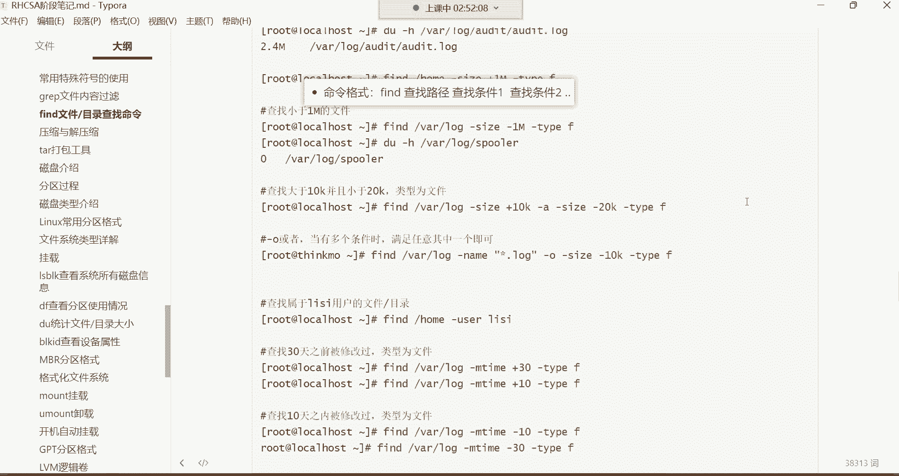


例如，查找 `/var/log` 目录下大于10KiB的文件：
```bash
find /var/log -size +10k -type f
```

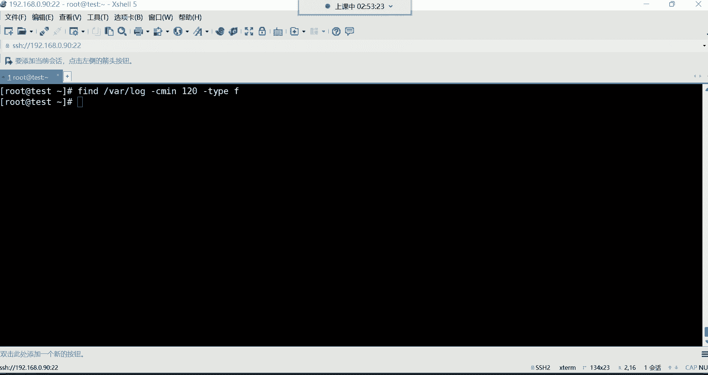


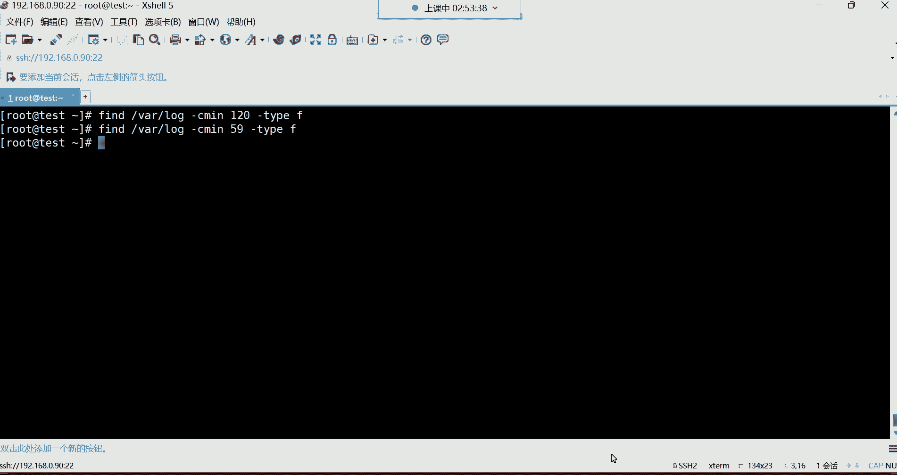


## 组合条件查找

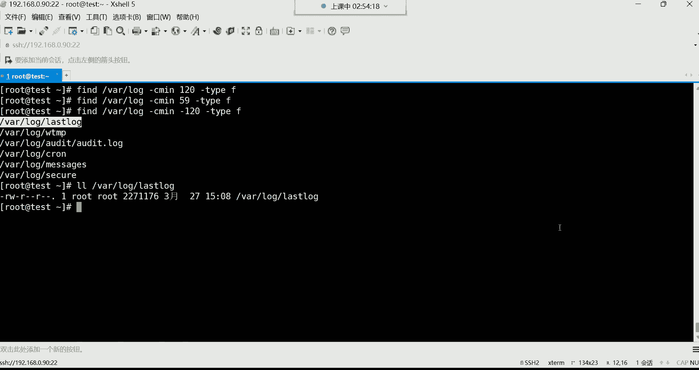


`find` 命令允许使用逻辑运算符组合多个查找条件，使查找更加精确。

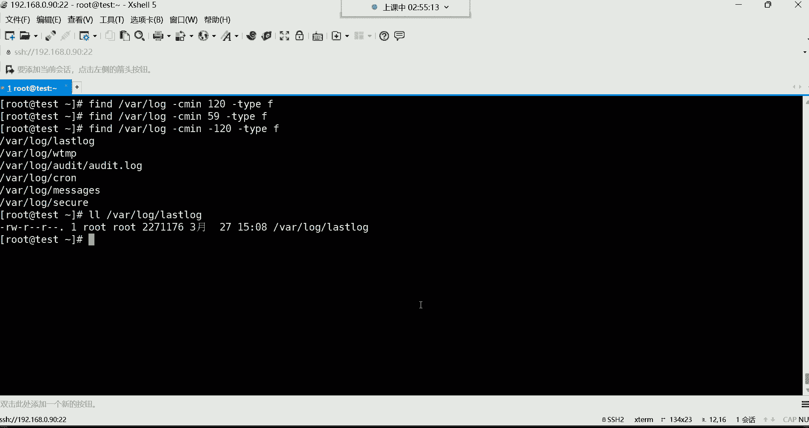

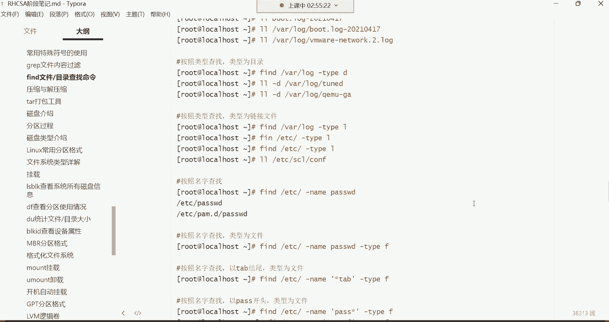

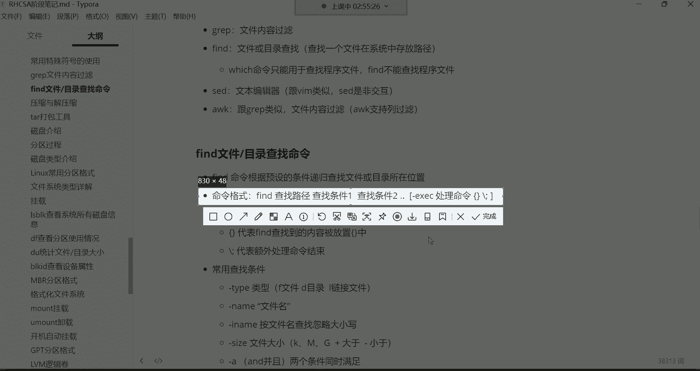

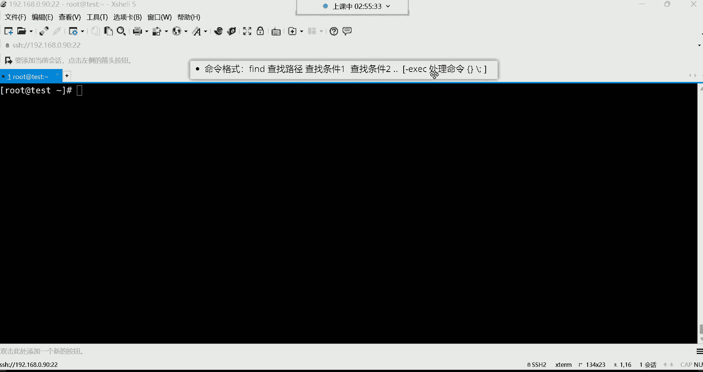

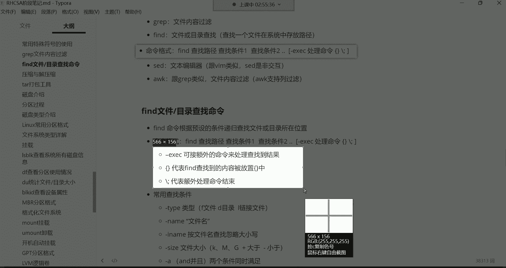

以下是组合条件查找的运算符：
*   **`-a` 或 `-and`**：逻辑“与”，表示两个条件必须同时满足。
*   **`-o` 或 `-or`**：逻辑“或”，表示满足任意一个条件即可。

例如，查找大小在10KiB到20KiB之间的文件：
```bash
find /var/log -size +10k -a -size -20k -type f
```

## 按用户和时间查找

除了上述条件，`find` 还可以根据文件属主或修改时间进行查找。

以下是按用户和时间查找的选项：
*   **`-user 用户名`**：查找属于指定用户的文件。
*   **`-mtime [+/-]天数`**：根据文件内容最后修改时间查找。
    *   `+n`：查找n天**之前**被修改过的文件。
    *   `-n`：查找n天**之内**被修改过的文件。
    *   `0`：查找24小时（即当天）内被修改过的文件。

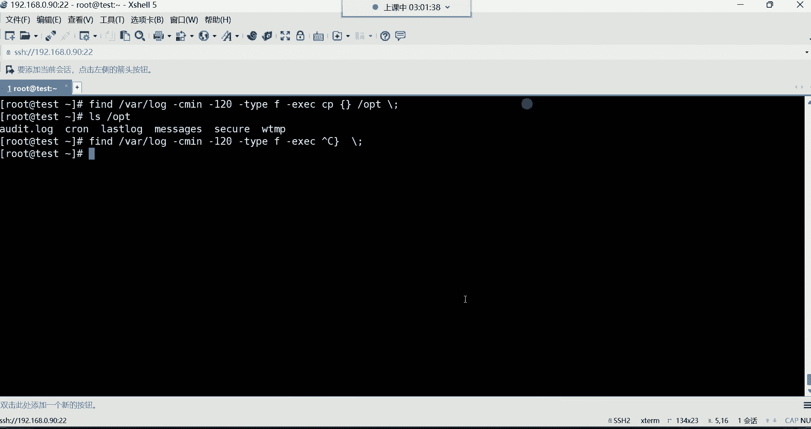

例如，查找用户 `tom` 在系统中的所有文件：
```bash
find / -user tom
```
查找 `/var/log` 目录下10天之内被修改过的文件：
```bash
find /var/log -mtime -10 -type f
```

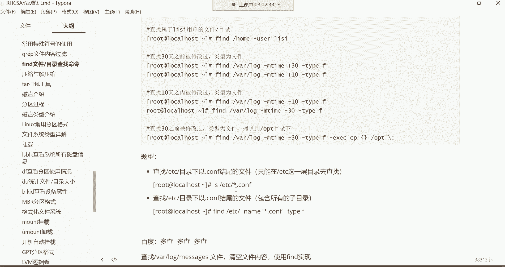

## 对查找结果执行操作

有时我们找到文件后，还需要对其进行操作（如复制、删除）。`find` 命令对管道 (`|`) 支持不友好，但它提供了 `-exec` 选项来直接处理查找结果。

**命令格式**：
```bash
find [路径] [条件] -exec 命令 {} \;
```
*   `{}` 是一个占位符，代表 `find` 找到的每一个文件。
*   `\;` 表示 `-exec` 参数的结束。

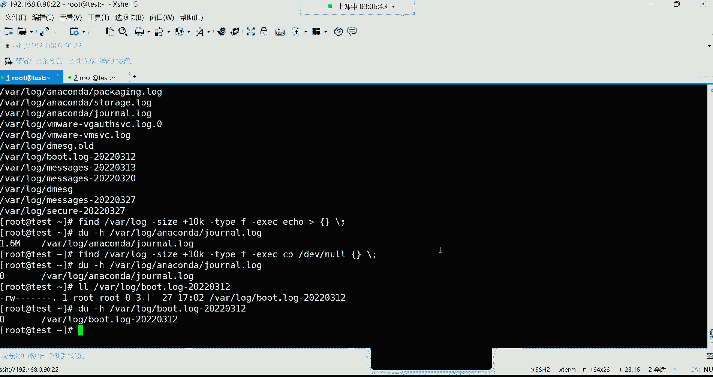

例如，将找到的所有 `.log` 文件备份到 `/opt/backup` 目录：
```bash
find /var/log -name “*.log” -type f -exec cp {} /opt/backup \;
```
**一个实用技巧**：清空找到的文件内容。可以利用 `/dev/null` 这个特殊的“黑洞”设备文件，它就像一个无底洞，所有写入它的数据都会消失。
```bash
find /var/log -name “*.log” -size +10k -exec cp /dev/null {} \;
```
这条命令用空内容（来自`/dev/null`）覆盖每个找到的日志文件，从而达到清空内容、释放空间的目的。

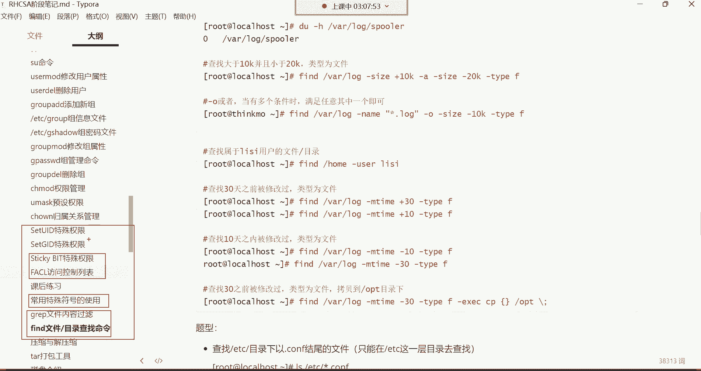

---

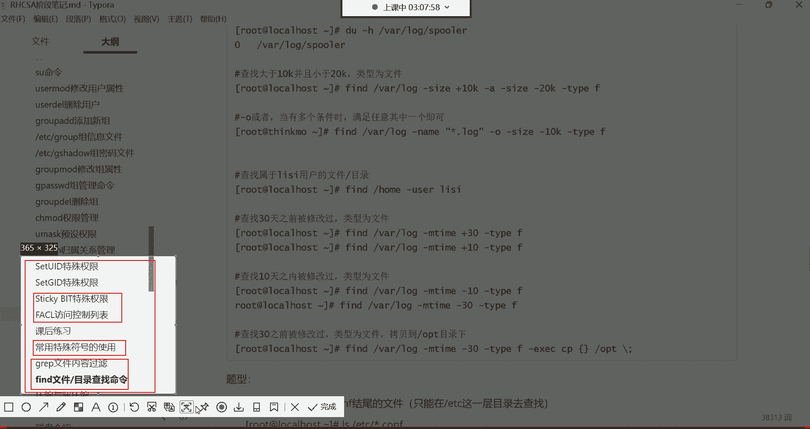


本节课中我们一起学习了 `find` 命令的强大功能。我们掌握了如何按类型、名称、大小、用户和时间等条件查找文件，并学会了使用 `-exec` 选项对查找结果执行后续操作，例如复制、移动或清空文件。`find` 是Linux系统管理和维护中不可或缺的工具，需要多加练习以熟练掌握。