# Linux运维RHCSA+RHC培训教程：P26：开机自动挂载、GPT分区、LVM逻辑卷

## 概述
在本节课中，我们将学习逻辑卷管理（LVM）的核心概念与操作。LVM是一种灵活的磁盘管理机制，它允许我们将多个物理硬盘或分区组合成一个大的“虚拟硬盘”（卷组），并可以动态地调整逻辑卷的大小，而无需格式化或移动数据。这对于需要灵活管理存储空间的场景至关重要。

## 逻辑卷管理（LVM）原理

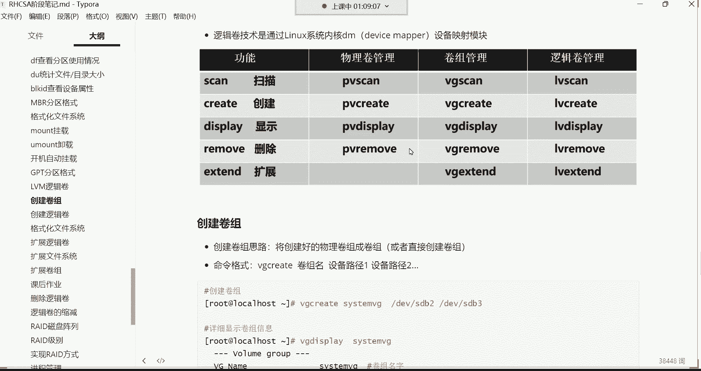

上一节我们介绍了分区的基本管理，本节中我们来看看更高级的存储管理方式——逻辑卷。

逻辑卷管理是一种虚拟化技术，它将底层的物理硬盘空间抽象出来，形成一个可以灵活分配和扩展的存储池。最终的数据存储仍然依赖于底层的物理硬盘，但LVM提供了在逻辑层进行动态管理的便利。

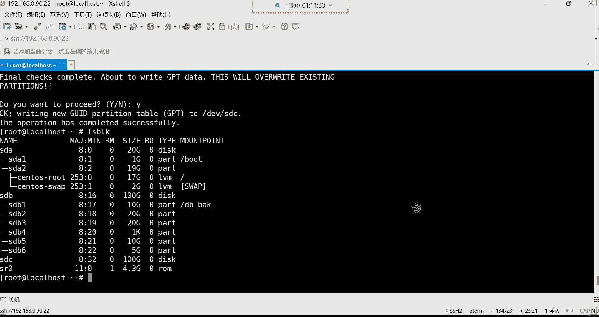

逻辑卷的空间可以不断扩展。但如果逻辑卷已经占满了其所在的卷组空间，就无法继续扩容了。因为逻辑卷的空间来源于其所在的卷组。因此，想要扩容逻辑卷，其所属的卷组必须有足够的可用空间。

如果卷组空间不足，我们可以通过向卷组中添加新的物理硬盘或分区来扩展卷组的容量。例如，我们可以将一块新的1TB硬盘直接加入卷组，这样卷组的可用空间就增加了，进而可以继续为逻辑卷扩容。

**核心优势**：在扩容过程中，**不需要格式化**已有的逻辑卷或数据分区。我们只需要在逻辑卷层面赋予其文件系统（如XFS或EXT4）即可。底层的物理硬盘或分区，只要能被系统识别并加入卷组，无论其原有格式如何，都可以为逻辑卷提供空间。

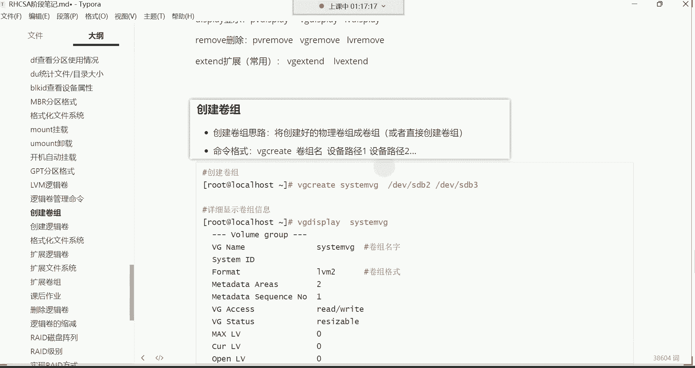

LVM的主要应用场景就是实现存储空间的动态扩展。它的操作并不复杂，关键在于理解其层次结构：**物理卷（PV） -> 卷组（VG） -> 逻辑卷（LV）**。

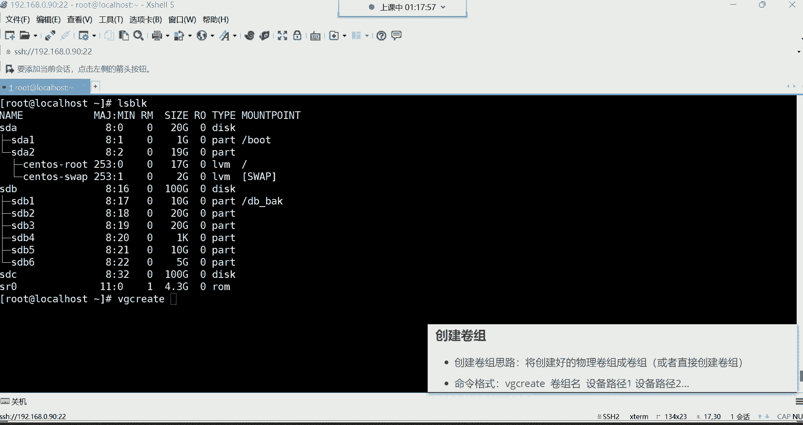

## LVM管理命令

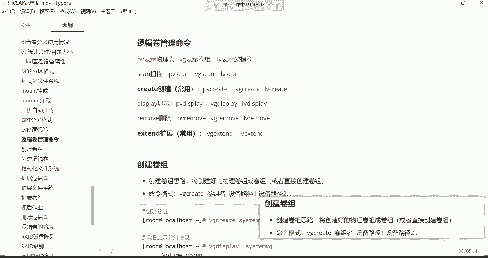

LVM的命令非常有规律，主要围绕物理卷（PV）、卷组（VG）和逻辑卷（LV）进行管理。

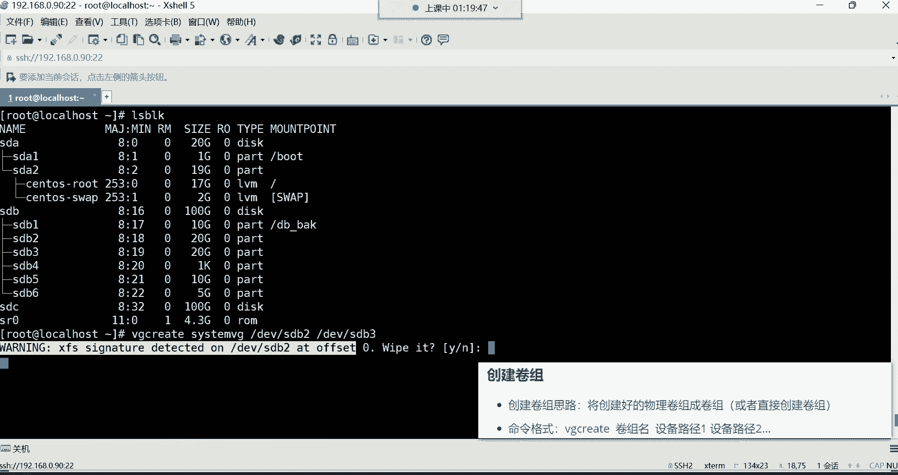

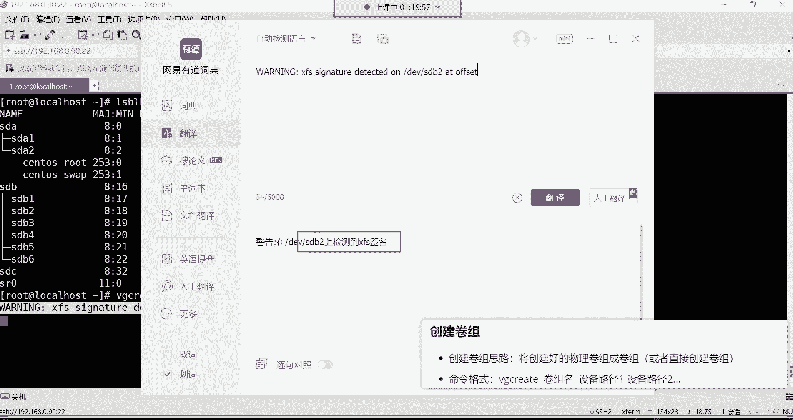

以下是常用的LVM命令分类：

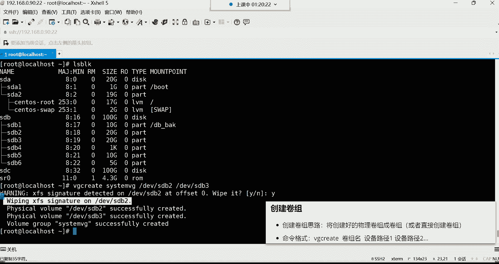

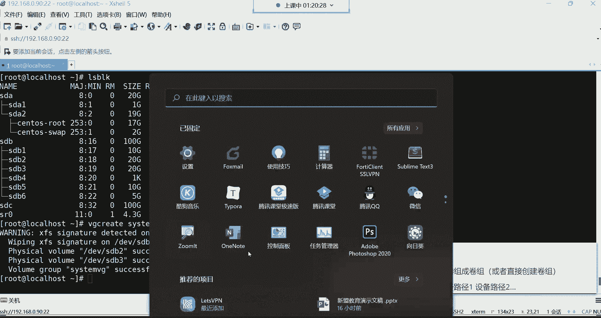

*   **创建类**：
    *   `pvcreate`：创建物理卷（在CentOS 7中通常可省略，系统会自动创建）。
    *   `vgcreate`：创建卷组。
    *   `lvcreate`：创建逻辑卷。
*   **显示类**：
    *   `pvs` / `pvdisplay`：简要/详细显示物理卷信息。
    *   `vgs` / `vgdisplay`：简要/详细显示卷组信息。
    *   `lvs` / `lvdisplay`：简要/详细显示逻辑卷信息。
*   **扩展类**：
    *   `vgextend`：扩展卷组（添加新的物理卷）。
    *   `lvextend`：扩展逻辑卷。
*   **删除类**：
    *   `pvremove`：删除物理卷。
    *   `vgremove`：删除卷组。
    *   `lvremove`：删除逻辑卷。

**命令规律**：所有命令都以管理对象（PV、VG、LV）开头，后跟操作（create, display, extend, remove）。例如，创建卷组就是 `vgcreate`。

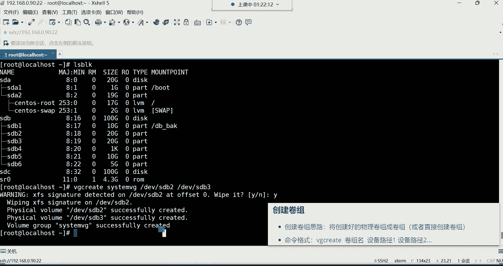

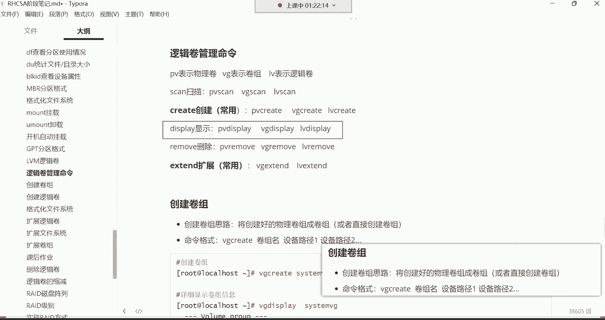

> **注意**：在CentOS 7及RHEL 7以后的版本中，创建卷组时，系统会自动将指定的分区初始化为物理卷（PV），因此通常不需要手动执行 `pvcreate` 命令。这简化了操作流程。

## 实战：创建并使用逻辑卷

了解了基本命令后，我们通过一个完整的例子来演示如何创建和使用逻辑卷。

### 第一步：准备环境
假设我们有两块空闲分区 `/dev/sdb2` 和 `/dev/sdb3`（各20GB），我们将它们组合成一个卷组。

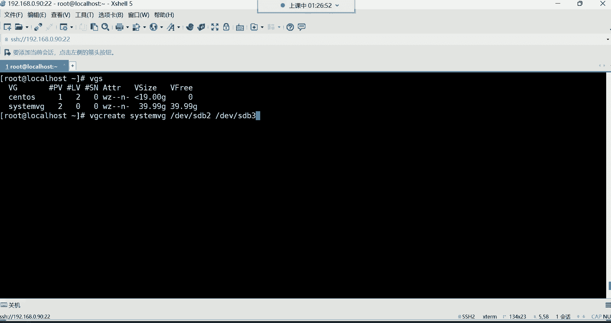

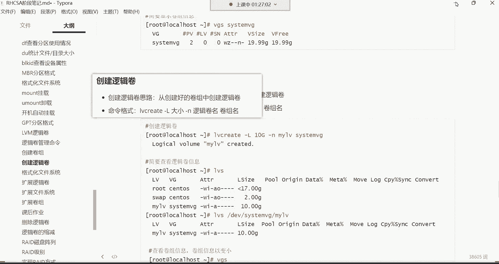

### 第二步：创建卷组（VG）
使用 `vgcreate` 命令创建卷组。命令格式为：`vgcreate <卷组名> <设备路径1> <设备路径2> ...`

```bash
vgcreate system_vg /dev/sdb2 /dev/sdb3
```
执行此命令时，系统可能会提示检测到分区上的文件系统签名并询问是否擦除。输入 `y` 确认即可，因为物理卷不需要文件系统。命令执行后，系统会自动将这两个分区初始化为物理卷（PV），并创建名为 `system_vg` 的卷组。

我们可以使用 `vgs` 命令简要查看卷组信息：
```bash
vgs
```
输出中会显示卷组名（VG）、包含的物理卷数量（#PV）、逻辑卷数量（#LV）、总大小（VSize）和剩余空间（VFree）。

### 第三步：创建逻辑卷（LV）
在卷组中创建逻辑卷。命令格式为：`lvcreate -L <大小> -n <逻辑卷名> <卷组名>`

```bash
lvcreate -L 20G -n my_lv system_vg
```
这条命令从 `system_vg` 卷组中划分出20GB的空间，创建一个名为 `my_lv` 的逻辑卷。

创建后，可以使用 `lvs` 查看：
```bash
lvs
```
逻辑卷的实际设备路径位于 `/dev/mapper/` 或 `/dev/<卷组名>/` 目录下，例如 `/dev/system_vg/my_lv`。

### 第四步：格式化并挂载逻辑卷
逻辑卷创建好后，就像一个普通分区一样，需要格式化和挂载才能使用。

1.  **格式化**：为其创建文件系统（例如XFS）。
    ```bash
    mkfs.xfs /dev/system_vg/my_lv
    ```
2.  **创建挂载点**（如果不存在）并挂载。
    ```bash
    mkdir -p /web_back
    mount /dev/system_vg/my_lv /web_back
    ```
3.  **验证挂载**：
    ```bash
    df -h /web_back
    ```
    此时应能看到 `/web_back` 目录已挂载，空间为20GB。

### 第五步：配置开机自动挂载
编辑 `/etc/fstab` 文件，添加一行配置以实现开机自动挂载。
```bash
vim /etc/fstab
```
在文件末尾添加：
```
/dev/system_vg/my_lv /web_back xfs defaults 0 0
```
保存退出后，可以执行 `mount -a` 测试配置是否正确（无报错即表示成功）。

## 逻辑卷的应用场景与总结

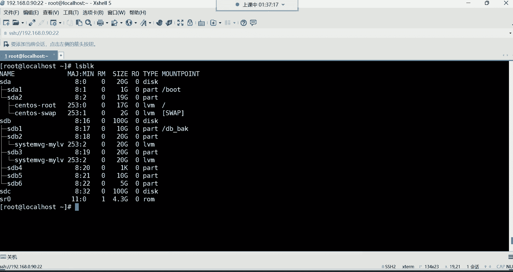

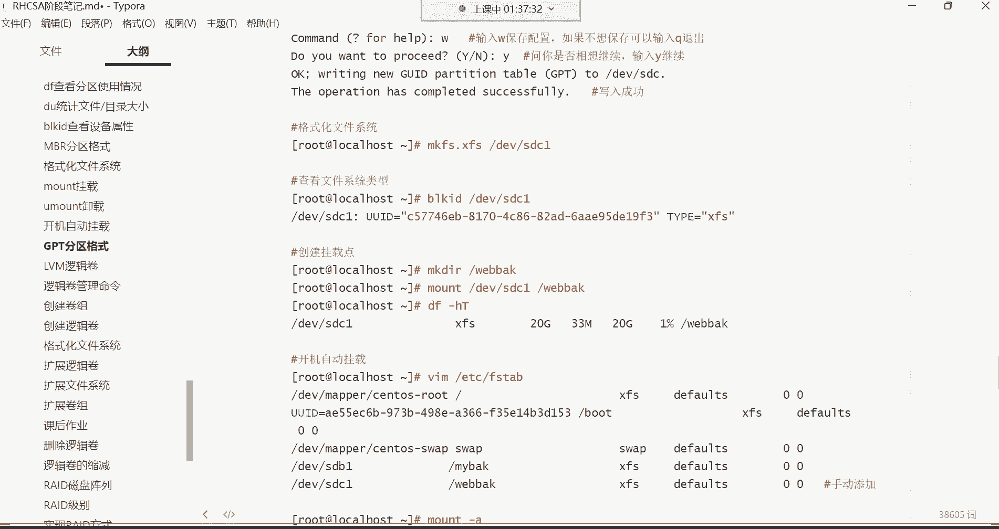

通过上面的操作，我们完成了逻辑卷的创建和使用。回顾整个过程，逻辑卷的管理命令规律性强，操作步骤清晰。

**为什么使用逻辑卷？**
以系统根分区（`/`）为例，它通常就建立在逻辑卷上。因为系统在运行中会产生大量数据，如果根分区是固定大小的普通分区，一旦空间用尽，系统将无法正常运行。而使用逻辑卷，则可以在空间不足时，通过向卷组添加硬盘或扩展逻辑卷来轻松扩容，无需迁移数据或重装系统。

**本节课中我们一起学习了：**
1.  **LVM的核心原理**：通过卷组（VG）聚合物理存储，逻辑卷（LV）动态分配空间，实现存储的灵活扩展。
2.  **LVM的命令规律**：命令结构为 `[pv|vg|lv] + [操作]`，如 `vgcreate`, `lvextend`。
3.  **逻辑卷的创建与使用流程**：准备物理分区 -> 创建卷组 (`vgcreate`) -> 创建逻辑卷 (`lvcreate`) -> 格式化 (`mkfs`) -> 挂载使用 (`mount`) -> 配置开机挂载 (`/etc/fstab`)。

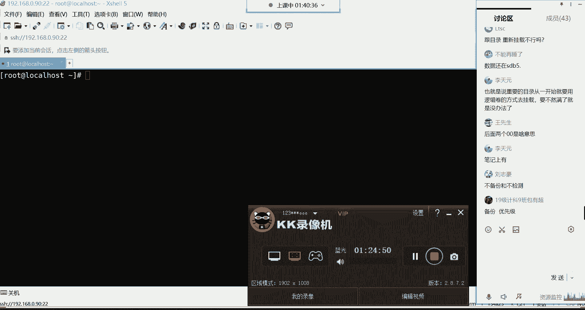

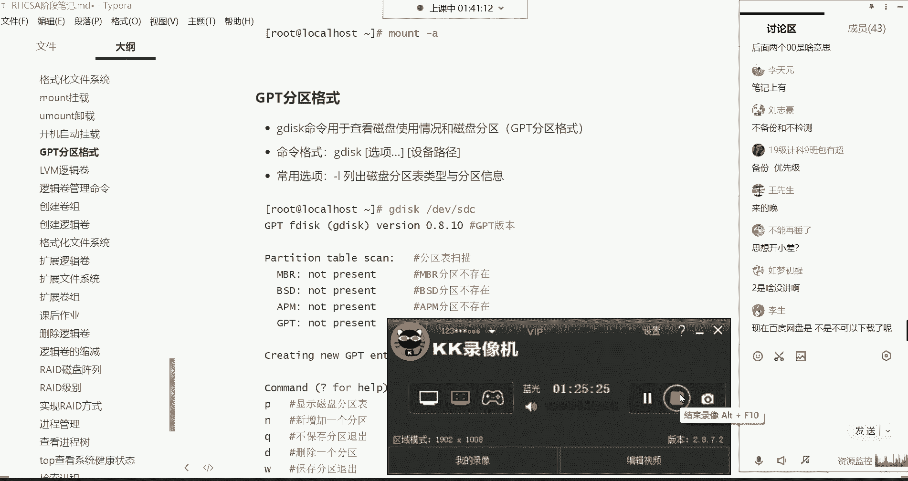

掌握LVM，你就能在企业级Linux运维中游刃有余地管理不断变化的存储需求。