# Linux运维RHCSA+RHCE培训教程：P28：RAID磁盘阵列详解

在本节课中，我们将要学习RAID（独立磁盘冗余阵列）技术。RAID是一种将多个物理磁盘组合成一个逻辑单元的技术，旨在提升数据存储的性能、可靠性和容量。我们将详细介绍几种常见的RAID级别，分析它们各自的优缺点，并了解在企业环境中如何实现RAID。

## RAID 0：条带化阵列

上一节我们介绍了磁盘管理的基础概念，本节中我们来看看RAID 0。RAID 0通过将数据分割成块，并**并行写入**到多个磁盘中，以此来提高读写速度。

其工作原理可以用以下方式描述：
*   一份文件被等量分割。
*   分割后的数据块同时（并行）写入不同的磁盘。

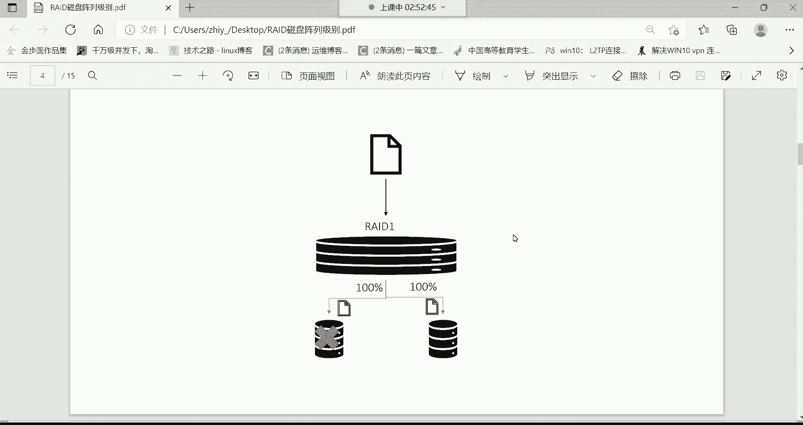

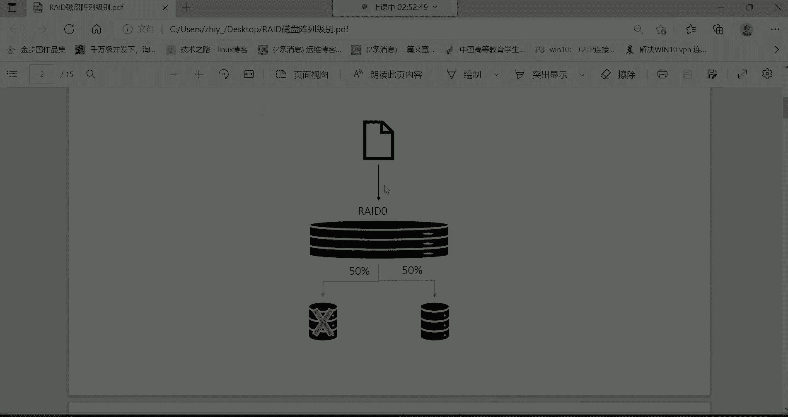

例如，一个10GB的文件，如果存入单块硬盘需要4分钟。在RAID 0中，文件被分成两半（各5GB），并同时写入两块硬盘。由于是并行操作，理论上存储时间会缩短一半，只需2分钟。

以下是RAID 0的主要特点：
*   **优点**：读写速度快，磁盘利用率100%。
*   **缺点**：**没有冗余备份功能**。如果阵列中任何一块磁盘损坏，所有数据都会丢失，因为数据是分散存储的。
*   **适用场景**：适用于对性能要求高，但对数据安全性要求不高的场景，例如视频编辑的缓存盘。

## RAID 1：镜像阵列

RAID 0虽然速度快但不安全，本节我们来看看提供完全备份的RAID 1。RAID 1通过**完全复制（镜像）** 数据到所有成员磁盘来实现数据冗余。

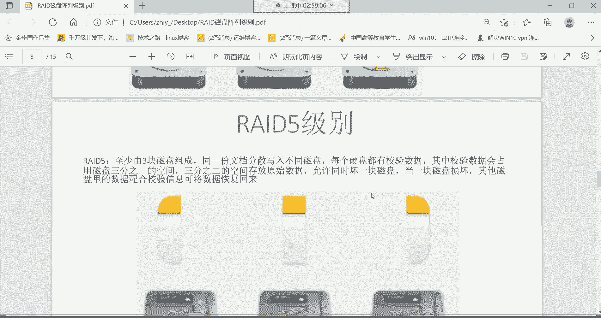

其工作原理如下：
*   同一份数据的完整副本被写入阵列中的每一块磁盘。

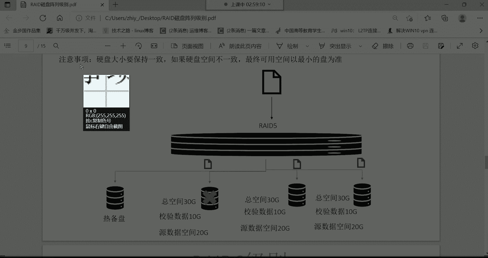

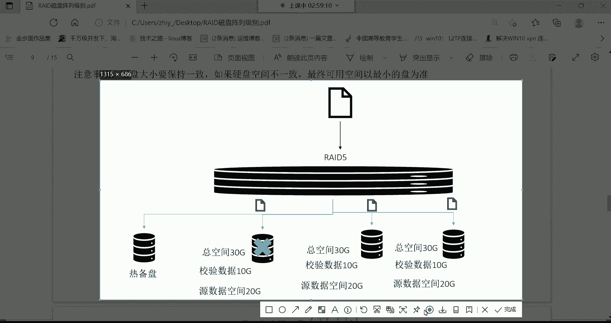

例如，一个10GB的文件写入由两块硬盘组成的RAID 1阵列时，系统会将该文件完整地写入第一块硬盘（耗时4分钟），然后再完整地写入第二块硬盘（再耗时4分钟），总耗时8分钟。

以下是RAID 1的主要特点：
*   **优点**：数据安全性极高。允许一块磁盘损坏而不丢失数据。
*   **缺点**：写入速度没有提升，反而可能下降；磁盘利用率低，仅为50%（N块磁盘的可用空间只有单块磁盘的容量）。
*   **适用场景**：适用于存储极其重要的数据，如操作系统、数据库日志文件等。

## RAID 5：分布式奇偶校验阵列

RAID 0速度快但不安全，RAID 1安全但速度慢且成本高。那么，有没有兼顾速度和安全性的方案呢？本节我们来看看折中的方案——RAID 5。RAID 5至少需要**3块磁盘**，它结合了条带化与奇偶校验信息。

其核心机制是：
*   数据被条带化分布存储在多个磁盘上。
*   **奇偶校验信息**被计算出来，并**轮流存储**在不同的磁盘上，而不是集中在某一块盘上。

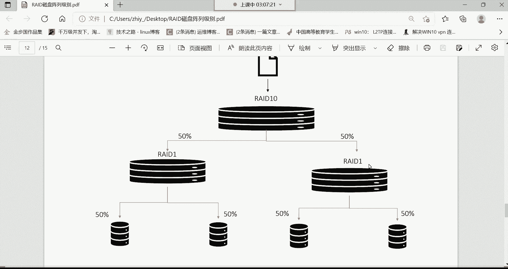

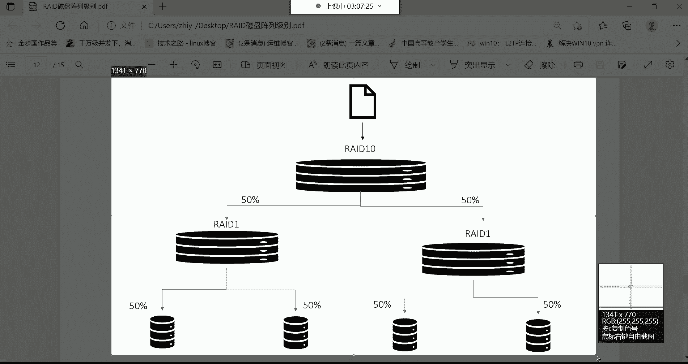

例如，一个文件被分割存储在三块磁盘上，同时系统会计算出一份校验数据。这块校验数据不单独占用一块磁盘，而是与其他数据块一起，平均分布在所有磁盘中。校验数据约占单盘容量的1/3。

当一块磁盘损坏时，系统可以利用剩余磁盘上的数据和校验信息，通过算法重建出损坏磁盘上的数据。

以下是RAID 5的主要特点：
*   **优点**：兼顾了读写性能和数据安全。允许损坏一块磁盘而不丢失数据；磁盘利用率较高，为 `(N-1)/N`（N为磁盘数）。
*   **缺点**：写入数据时需要计算校验位，会带来一定的性能开销；重建数据时系统负载较重。
*   **热备盘**：在企业中，常为RAID 5配置一块热备盘。当阵列中某块磁盘故障被踢出后，热备盘会自动加入并开始重建数据，保证阵列的完整性。
*   **适用场景**：是企业中最常用、性价比最高的RAID级别，广泛应用于文件服务器、应用服务器等。

## 其他RAID级别简介

除了上述级别，还有一些其他RAID级别作为了解。

**RAID 2/3/4**
这些级别在实际生产中很少使用，因为它们通常采用复杂的校验算法，导致硬件开销大、性能不佳。

**RAID 6**
RAID 6可以看作是RAID 5的增强版，它采用**双重奇偶校验**。
*   至少需要**4块磁盘**。
*   允许同时损坏**两块磁盘**而数据不丢失。
*   校验数据量是RAID 5的两倍，磁盘利用率为 `(N-2)/N`。
*   由于额外的校验计算，写入性能通常低于RAID 5。

**RAID 10 (RAID 1+0)**
RAID 10是RAID 1和RAID 0的结合，先做镜像（RAID 1），再做条带（RAID 0）。
*   至少需要**4块磁盘**。
*   先将磁盘两两组成RAID 1（镜像对），再将这两个RAID 1组合成一个RAID 0（条带集）。
*   **优点**：既提供了很高的读写速度（来自RAID 0），又提供了优秀的数据可靠性（来自RAID 1，允许每个镜像对中各坏一块盘）。
*   **缺点**：成本最高，磁盘利用率仅为50%。

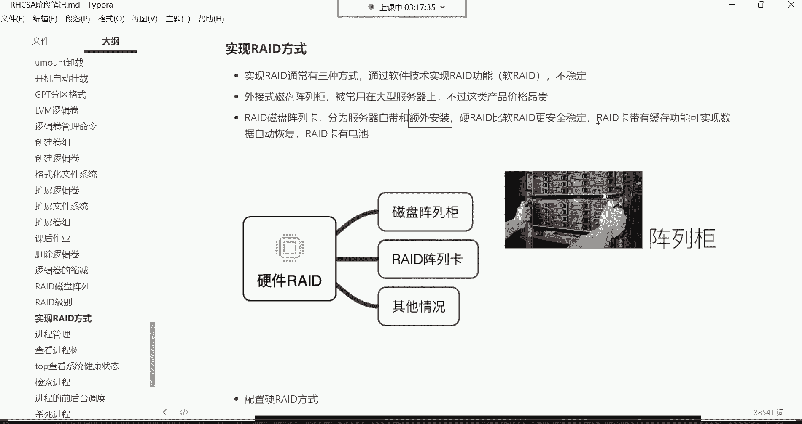

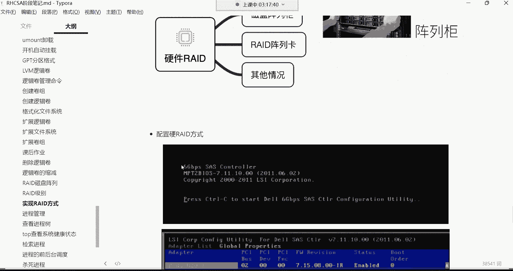

## RAID的实现方式

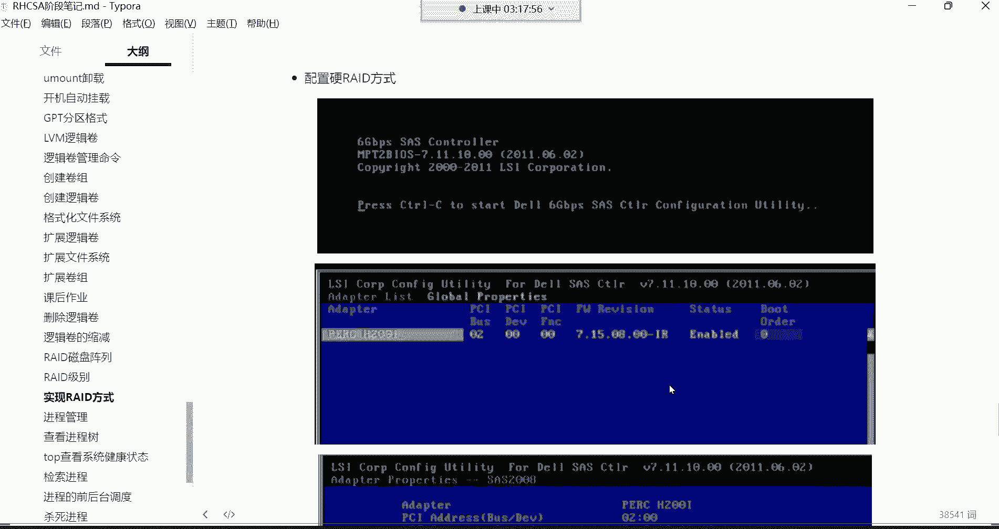

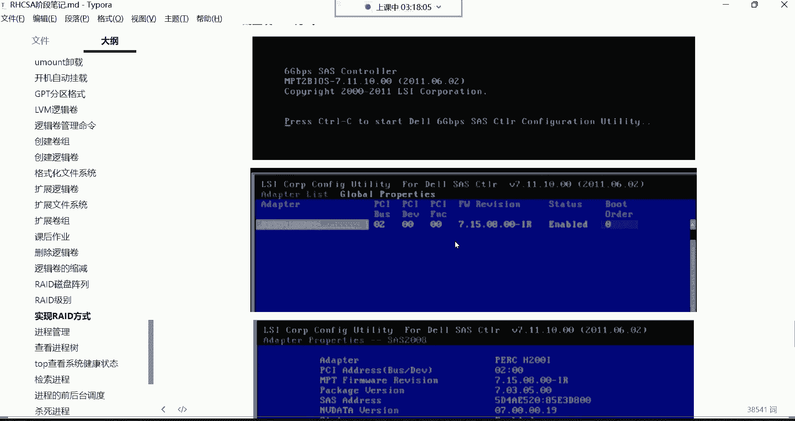

了解了各级别的原理后，我们来看看如何实现RAID。主要有三种实现方式：

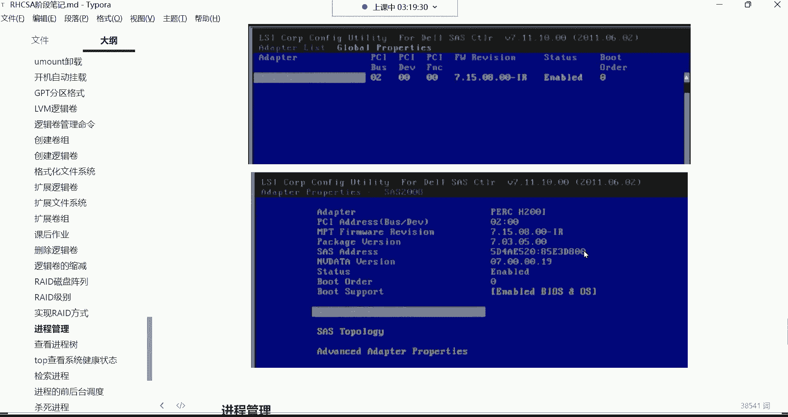

**1. 软件RAID**
通过操作系统层面的软件程序来实现RAID功能。
*   **优点**：成本低，无需额外硬件。
*   **缺点**：消耗主机CPU和内存资源；性能较差；稳定性依赖于主机操作系统。

**2. 硬件RAID（阵列卡）**
通过专用的RAID控制卡（阵列卡）来实现。这是企业中最主流的方式。
*   **优点**：性能好，不占用主机资源；稳定可靠；功能丰富（如缓存、电池保护，可在服务器断电时保护缓存中的数据）。
*   **缺点**：需要购买额外的硬件设备。

**3. 外置磁盘阵列柜**
一种独立的外部设备，包含磁盘、RAID控制器和缓存，通过高速接口（如SAS、光纤）连接到服务器。
*   **优点**：扩展性强，性能极高，管理集中。
*   **缺点**：价格非常昂贵。
*   **适用场景**：大型数据中心、高性能计算环境。

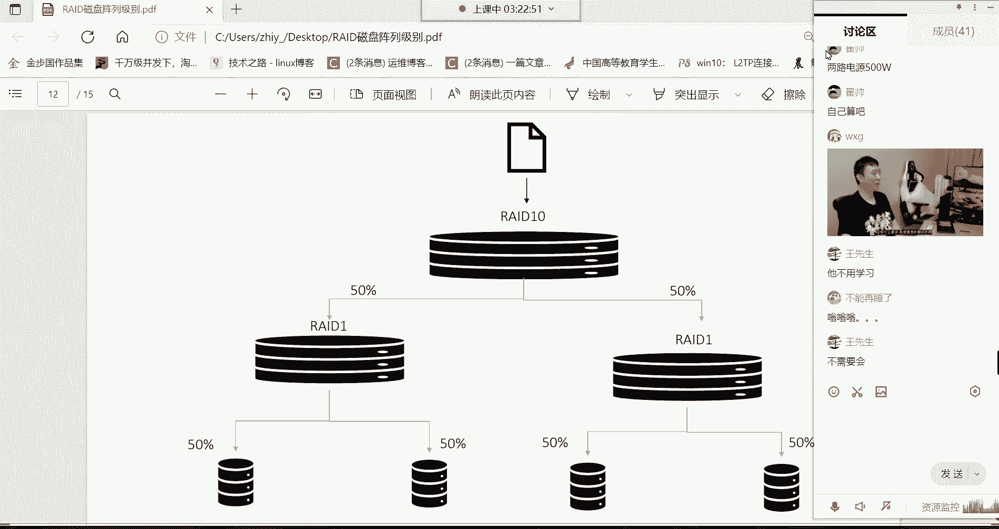

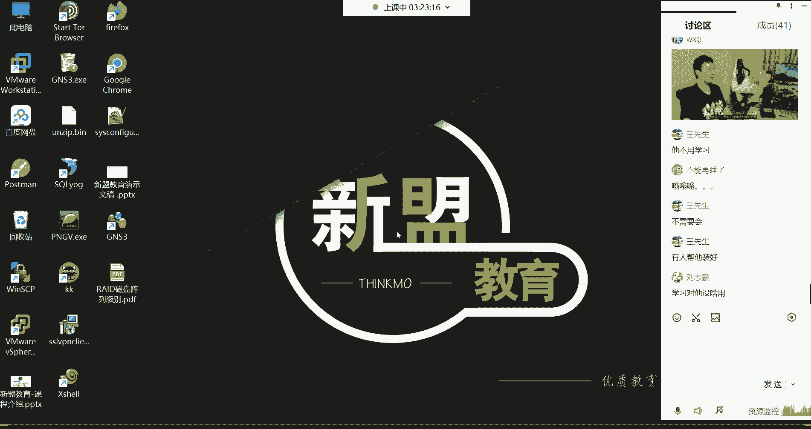

对于硬件RAID（阵列卡）的配置，通常在服务器开机时，根据阵列卡厂商的提示（如按 `Ctrl+R`）进入配置界面，按照图形化菜单选择磁盘和RAID级别即可完成创建。

## 总结

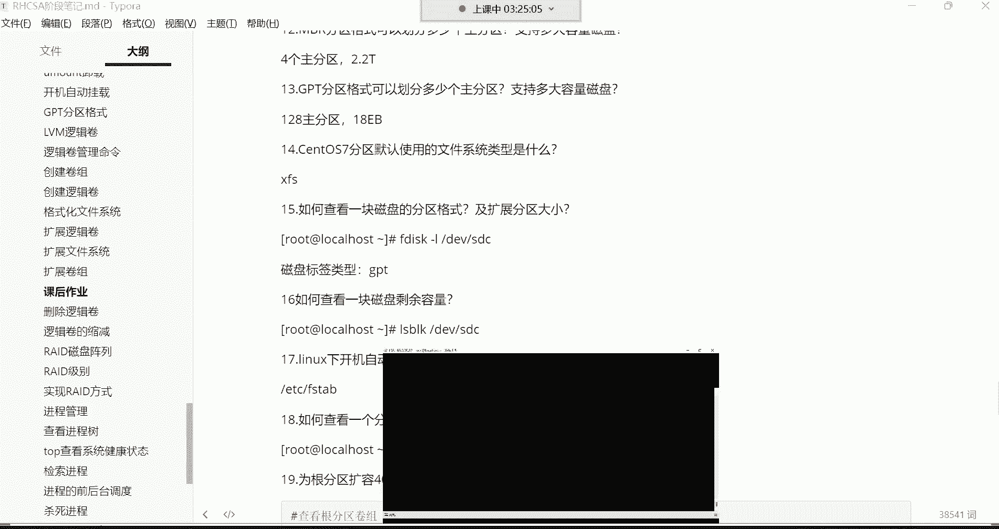

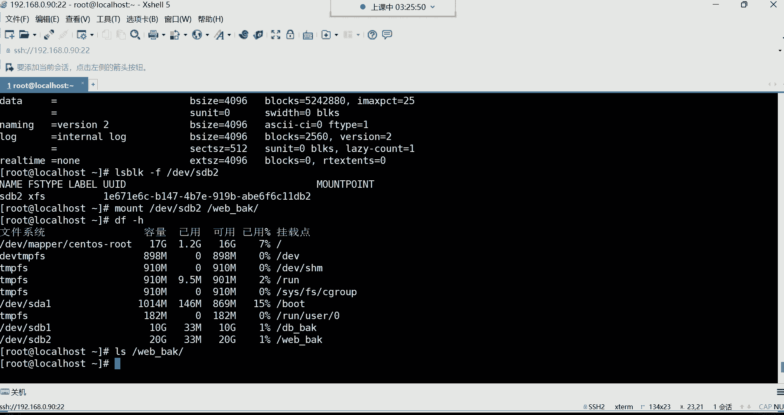

本节课中我们一起学习了RAID磁盘阵列技术。我们首先探讨了追求极致速度的RAID 0和追求绝对安全的RAID 1。接着，我们重点学习了在企业中应用最广泛的RAID 5，它通过奇偶校验在性能与安全之间取得了良好平衡。此外，我们还简要了解了RAID 6和RAID 10等其他级别。最后，我们介绍了软件RAID、硬件RAID卡和外置阵列柜这三种主要的RAID实现方式及其特点。理解这些RAID级别的原理和适用场景，对于规划企业存储架构、保障数据安全与性能至关重要。