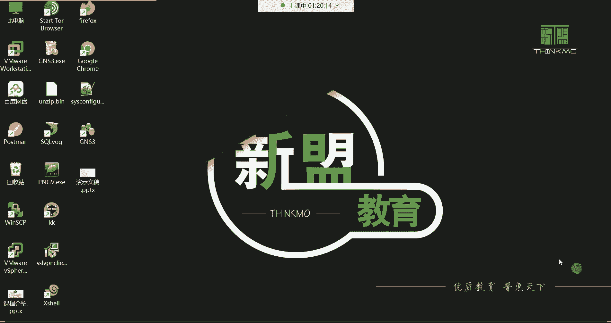
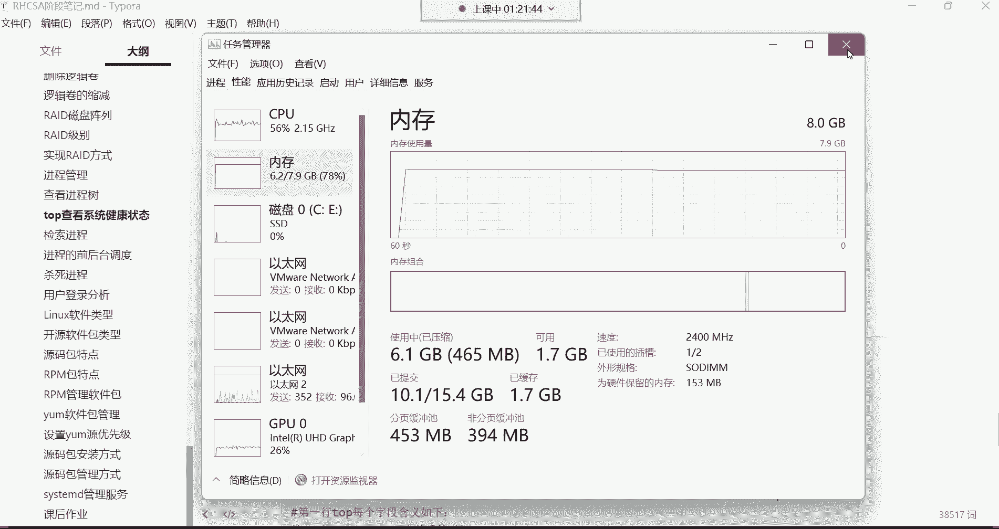
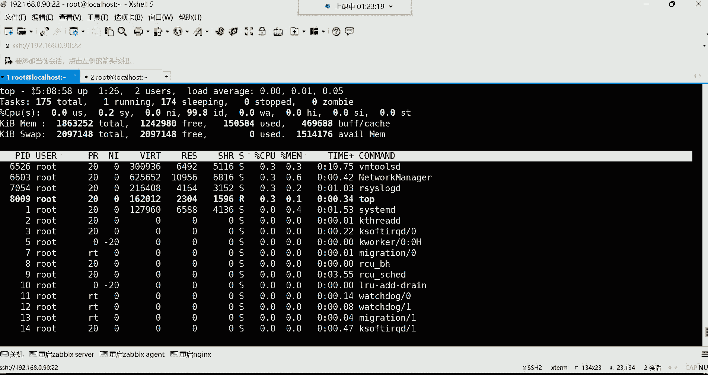
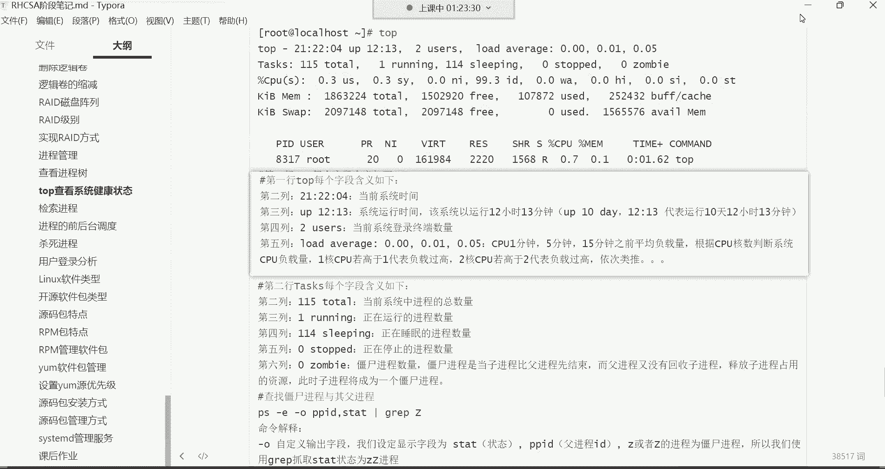
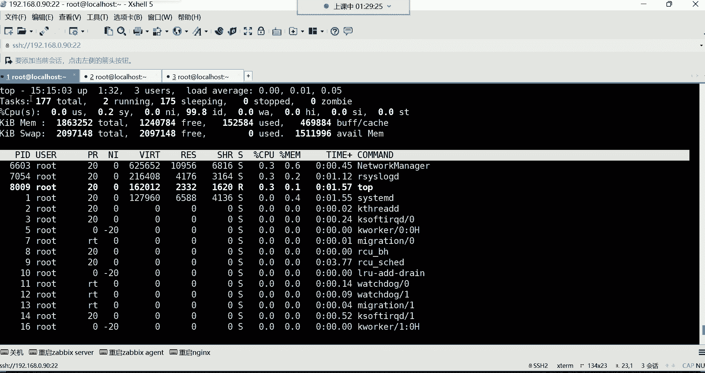
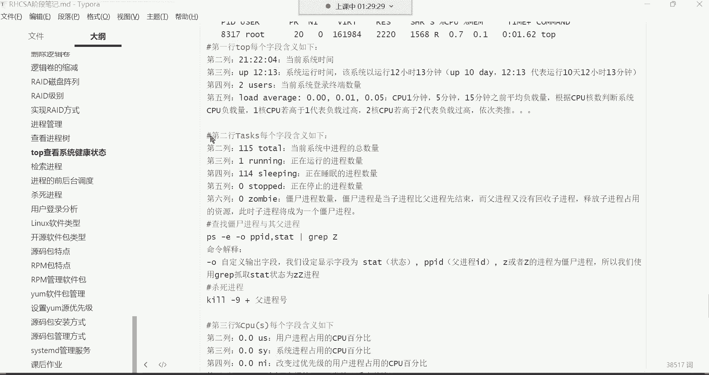
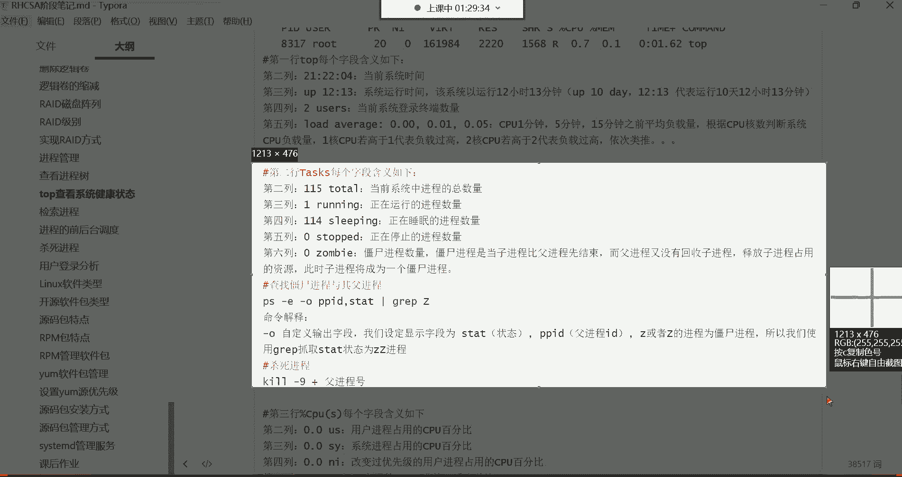
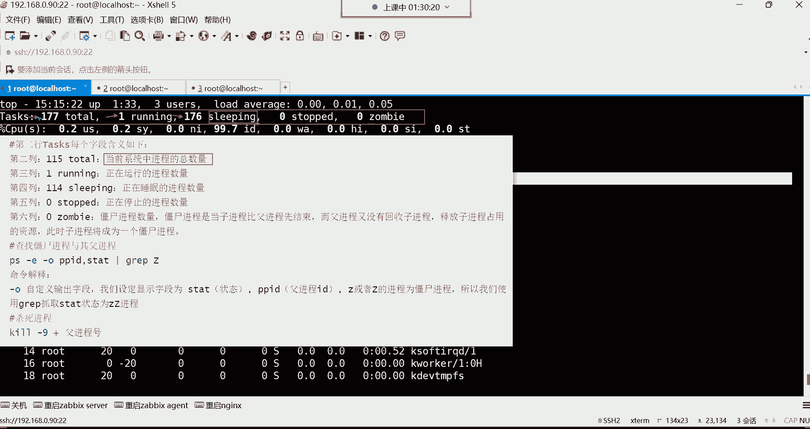
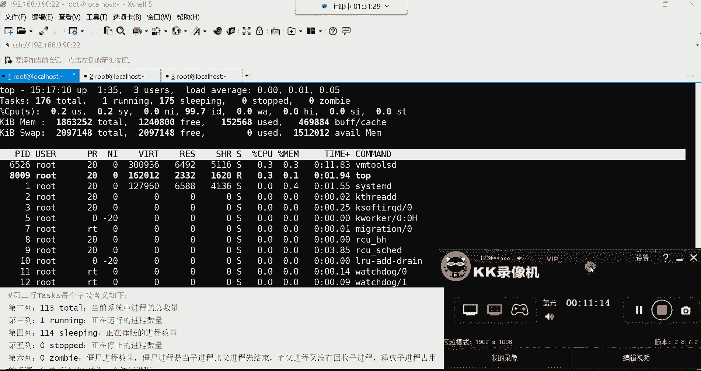

# Linux运维RHCSA+RHC培训教程：P29：top系统健康检查 📊

## 概述
在本节课中，我们将学习 `top` 命令。这是一个用于动态监控系统性能和运行状态的强大工具，类似于Windows系统中的任务管理器。我们将详细解析 `top` 命令输出界面中每一行的含义，帮助你理解如何实时查看CPU、内存、进程等关键系统信息。

---

## `top` 命令简介
`top` 命令的主要功能是动态查看系统性能与运行状态。与静态显示进程信息的 `ps` 命令不同，`top` 提供了一个实时更新的界面，可以展示更丰富的系统资源数据，如CPU使用率、内存占用、负载情况等。

直接输入 `top` 并回车，即可进入其动态监控界面。这个界面会持续刷新，而 `ps aux` 等命令仅提供执行瞬间的系统快照。

---

## 解读 `top` 命令输出界面
`top` 命令的输出分为多个信息行。下面，我们将逐行解析其含义。

### 第一行：系统概况
第一行显示了系统的概况信息，从左至右依次为：
*   **系统当前时间**：例如 `15:04:01`。
*   **系统运行时间**：`up` 后面的时间表示系统自启动后已运行的时间。格式通常为“天数+小时:分钟”，例如企业服务器可能显示 `365 days, 4:20`，表示已运行365天4小时20分钟。
*   **当前登录终端数**：`user` 后面的数字表示当前登录系统的终端会话数量，而非用户数量。
*   **系统平均负载**：`load average` 后面的三个数值，分别代表系统在过去1分钟、5分钟、15分钟内的平均负载。**负载值的解读需结合CPU核心数**：
    *   对于1个CPU核心，负载值1.0代表该核心已被100%利用。
    *   对于4个CPU核心，负载值4.0才代表所有核心均被100%利用。
    *   因此，负载值低于CPU核心数通常表示系统仍有空闲处理能力。

### 第二行：进程摘要
第二行 `Tasks` 显示了进程的总体状态信息：
*   **总进程数**：`total` 后面的数字代表系统当前进程总数。
*   **运行中进程数**：`running` 后面的数字表示正在CPU上运行或等待运行的进程数。
*   **休眠进程数**：`sleeping` 后面的数字表示处于休眠（等待事件）状态的进程数。
*   **已停止进程数**：`stopped` 后面的数字表示已被停止（如通过Ctrl+Z）的进程数。
*   **僵尸进程数**：`zombie` 后面的数字表示“僵尸”进程的数量。僵尸进程是已终止但未被其父进程清理的进程，少量存在是正常的，但数量过多可能表明有问题。

---

## 总结
本节课我们一起学习了 `top` 命令的基本用法。我们了解到，`top` 是一个强大的实时系统监控工具，其输出界面的前两行分别提供了系统的整体运行时间、负载情况以及进程的宏观状态摘要。掌握这些信息的解读，是进行系统健康检查和性能分析的基础。在后续课程中，我们将继续深入讲解 `top` 界面中关于CPU、内存等更详细的信息。