# Linux运维RHCSA+RHCE培训教程：P2：VMware安装CentOS系统 🖥️

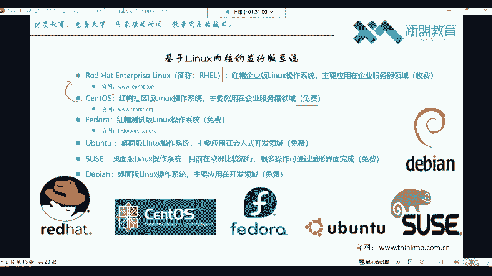

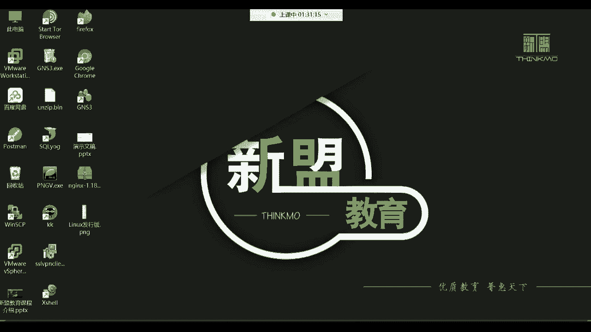

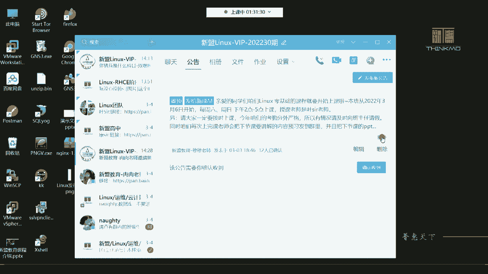

在本节课中，我们将学习如何在VMware虚拟机软件中安装CentOS操作系统。这是学习Linux运维的第一步，我们将从获取安装资源开始，逐步完成虚拟机的创建和系统的安装配置。

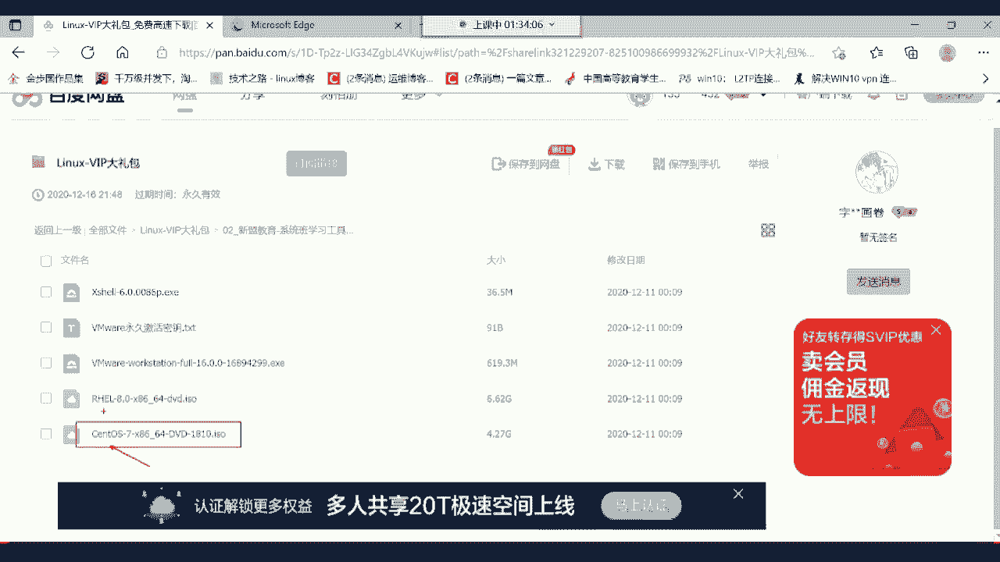

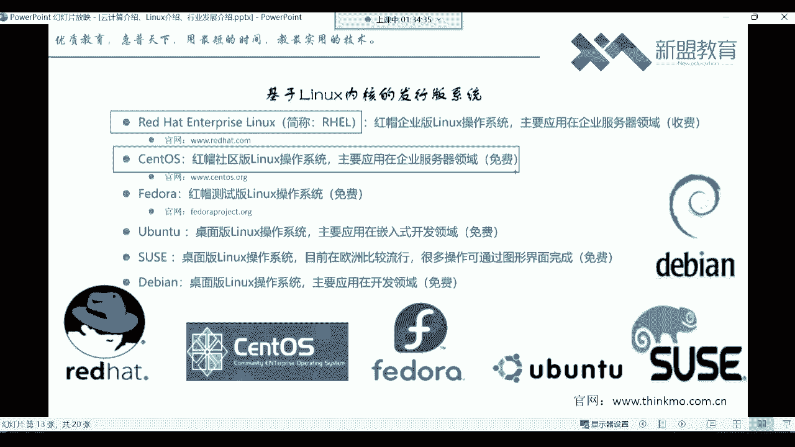

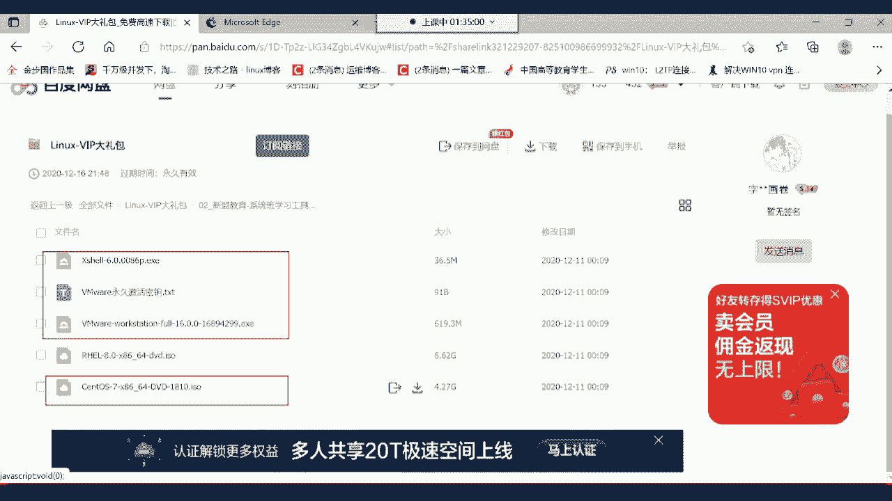

---

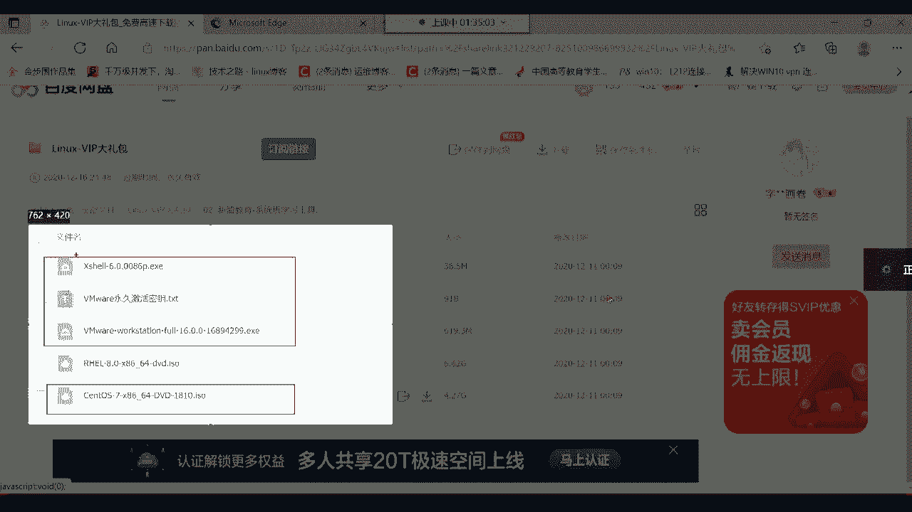

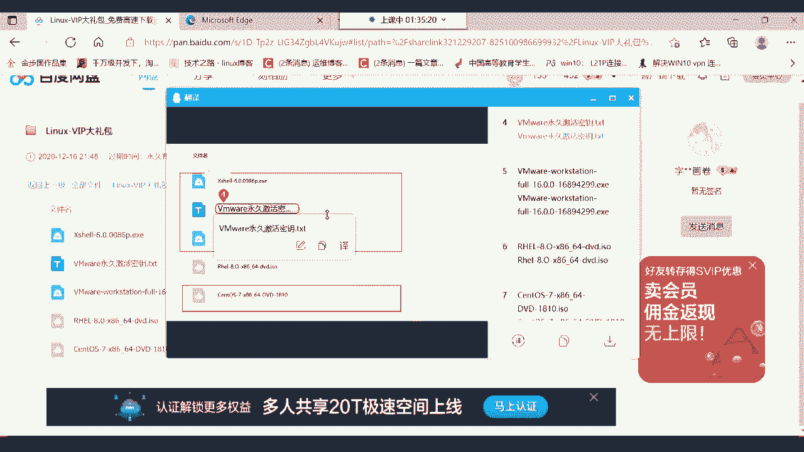

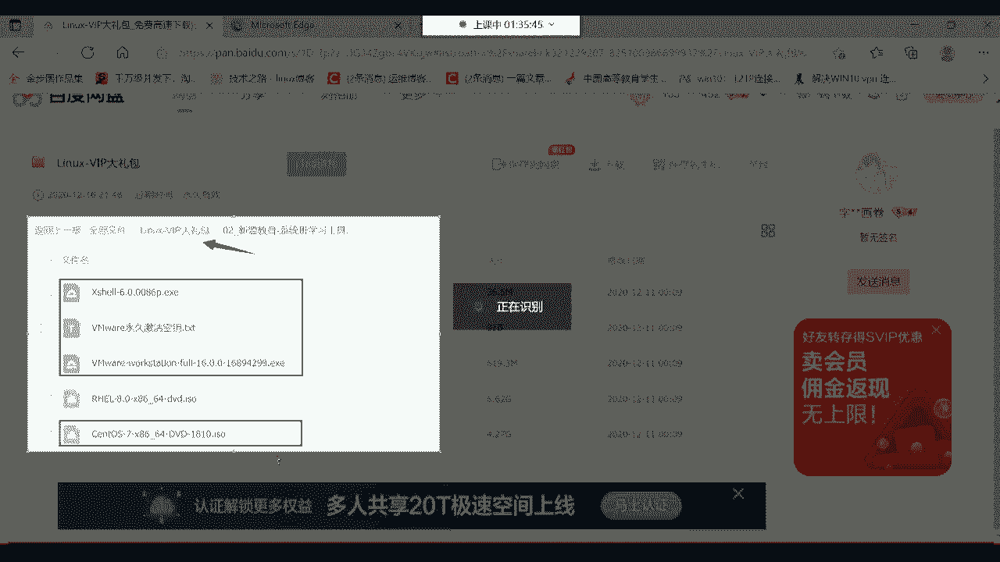

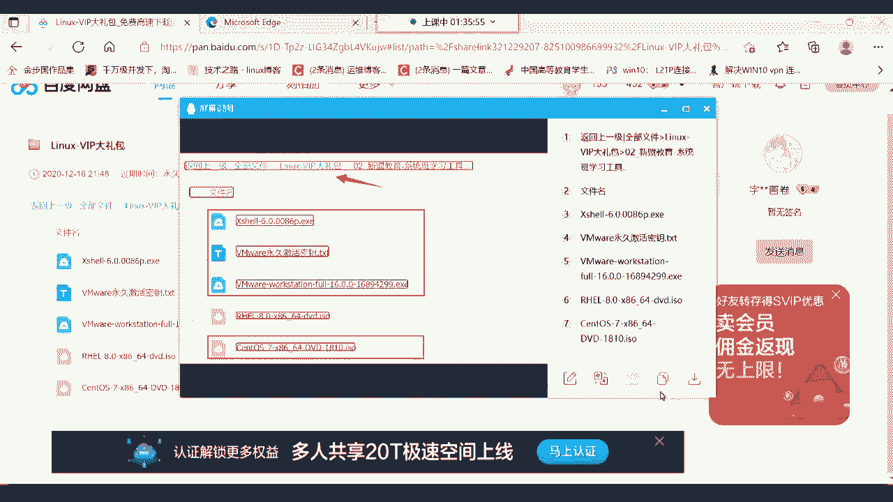

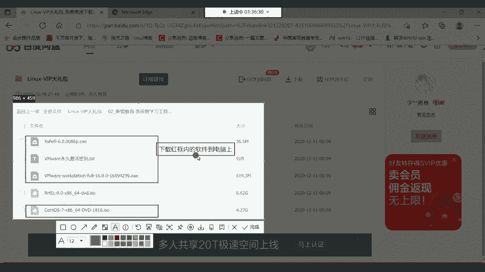

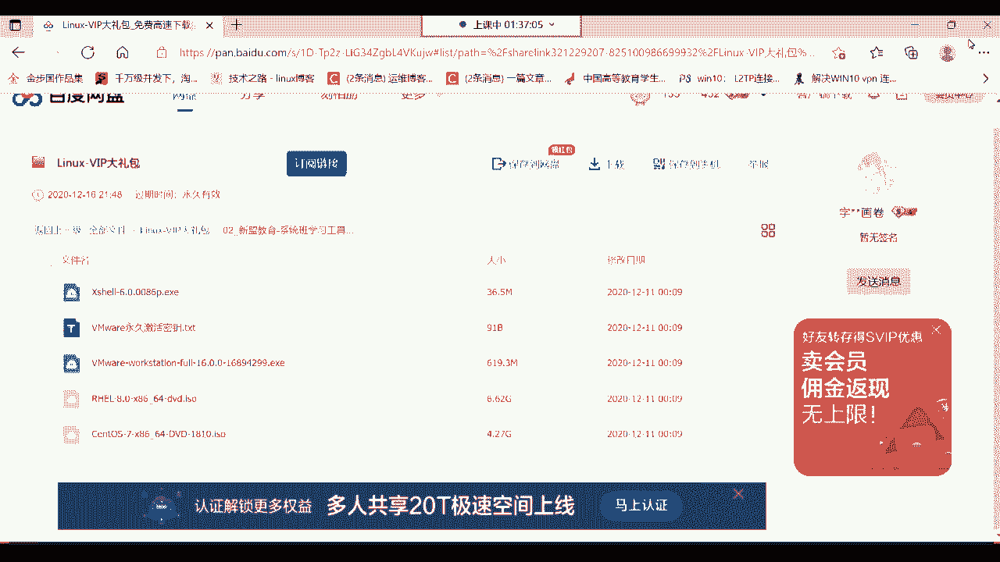

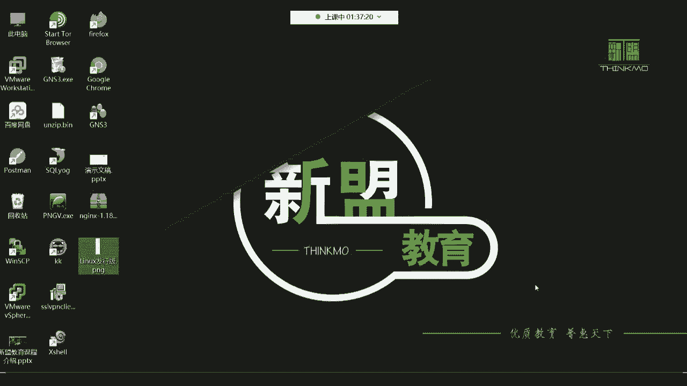

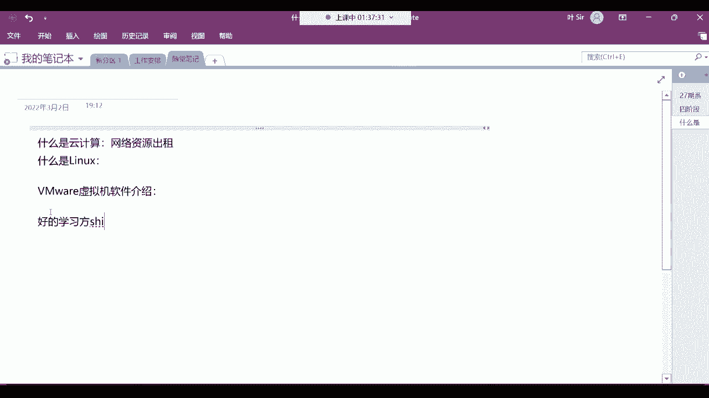

## 系统选择与资源准备 📦

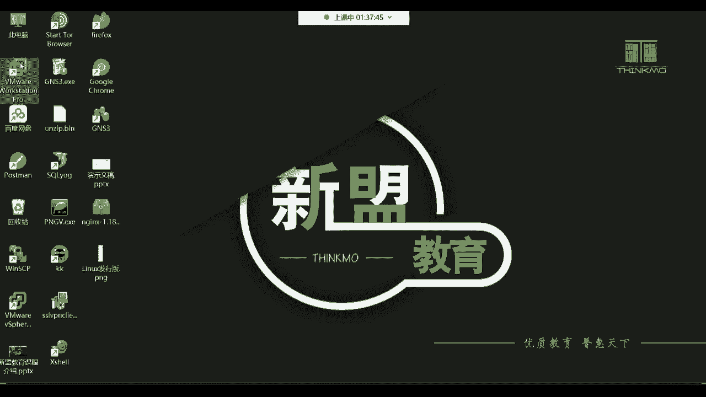

我们选择安装CentOS系统。在学习阶段，我们以CentOS为主。

CentOS和Red Hat Enterprise Linux（RHEL）之间的关系是，CentOS是从RHEL克隆过来的。这两个系统在操作和使用方面完全一样。学习CentOS后，在企业中如果遇到使用RHEL的环境，操作命令也是通用的。我们选择CentOS主要是因为它免费，并且在企业服务器领域应用广泛。

以下是安装前需要准备的资源，请从提供的VIP大礼包（学习工具）中下载以下文件到您的电脑：

*   VMware虚拟机软件及其激活密钥。
*   Xshell远程连接工具（如果您没有其他连接工具）。
*   CentOS 7的系统镜像文件（例如 CentOS-7-x86_64-DVD-XXXX.iso）。版本只要是7以上（如7.6或7.9）均可。

> **注意**：RHEL 8的镜像主要为需要参加红帽认证考试的学员准备，日常学习以CentOS 7为主。

---

## 创建新的虚拟机 🛠️

上一节我们准备好了安装所需的资源，本节中我们来看看如何使用VMware创建一台新的虚拟机。

1.  双击打开已安装的VMware Workstation软件。
2.  在软件主界面，选择“创建新的虚拟机”。
3.  在新建虚拟机向导中，选择“典型”配置，然后点击“下一步”。
4.  在“安装客户机操作系统”步骤，选择“稍后安装操作系统”，然后点击“下一步”。
5.  在“选择客户机操作系统”步骤，选择 **Linux**，版本选择 **CentOS 7 64位**，然后点击“下一步”。
6.  为虚拟机命名（例如“CentOS7-学习机”），并选择虚拟机的安装位置（建议放在固态硬盘且有充足空间的磁盘分区），然后点击“下一步”。
7.  指定磁盘容量，默认20GB即可。选择“将虚拟磁盘存储为单个文件”，然后点击“下一步”。
8.  在最后一步，点击“自定义硬件”以调整虚拟机配置。

---

## 自定义虚拟机硬件 ⚙️

虚拟机软件的本质是虚拟出一套完整的硬件平台（如CPU、内存、硬盘），以便在其上安装操作系统。在自定义硬件界面，我们需要进行以下关键设置：

*   **内存**：建议分配 **2048 MB（2GB）**。这能保证系统运行流畅。请注意，虚拟机只有在开机时才会占用真机的物理内存。
*   **处理器**：根据您真机的CPU核心数，为虚拟机分配处理器数量（例如1个）和每个处理器的核心数（例如2个）。分配过多无益，总量不应超过真机物理核心数。
*   **新CD/DVD**：这是安装系统的关键。点击“使用ISO映像文件”，然后浏览并选择您之前下载的CentOS 7镜像文件（.iso）。
*   **网络适配器**：选择网络连接模式。这里我们选择 **NAT模式**。该模式允许虚拟机通过真机的网络访问互联网，并且虚拟机与真机之间可以相互通信，无需担心IP地址网段频繁变化，非常适合笔记本等移动环境。
*   **移除无用硬件**：选中“USB控制器”、“声卡”、“打印机”等本次用不到的硬件，点击“移除”以节省资源。
*   完成所有设置后，点击“关闭”，然后点击向导页面的“完成”。

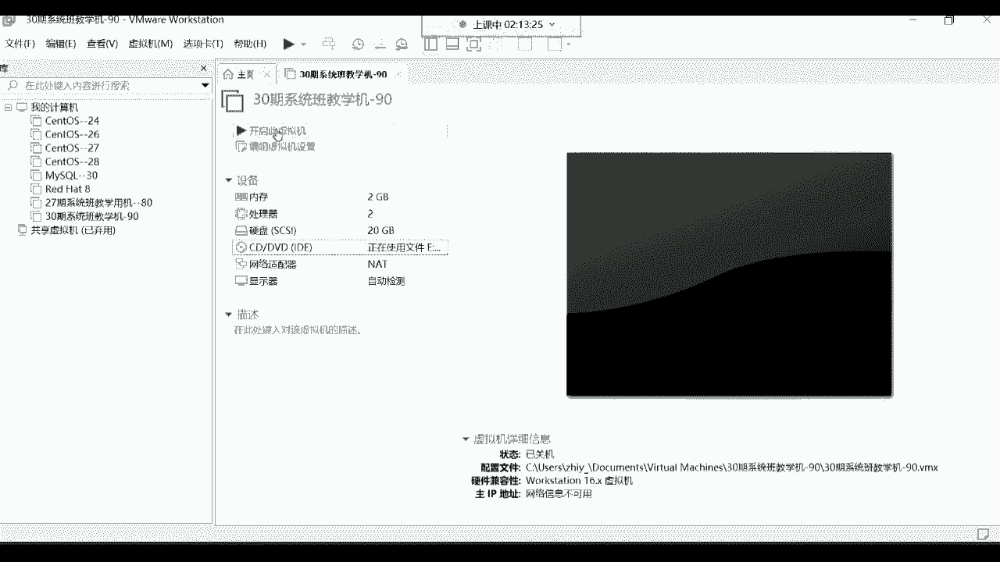

至此，一台空白虚拟机就创建好了。

---

## 安装CentOS操作系统 🚀

虚拟机创建完成后，我们就可以开始安装操作系统了。

1.  点击“开启此虚拟机”。
2.  虚拟机启动后会加载镜像，出现安装菜单。使用键盘上下键选择第一项 **“Install CentOS 7”**，然后按回车键。
3.  安装程序启动后，首先选择安装过程中的界面语言，建议选择 **中文（简体）**，然后点击“继续”。
4.  进入安装信息摘要界面，需要进行以下配置：
    *   **软件选择**：点击进入。对于初学者和企业环境，建议选择 **“最小安装”**，并勾选右侧的“兼容性程序库”和“开发工具”。然后点击“完成”。
    *   **安装位置**：点击进入。确认选中我们为虚拟机创建的20GB硬盘，分区方案选择自动即可，点击“完成”。
    *   **网络和主机名**：点击进入。
        *   可以在此修改主机名（如 `centos7`），也可以稍后通过命令修改。
        *   点击“配置”来设置网络。在“IPv4设置”中，将方法改为“手动”。
        *   点击“添加”按钮，依次填写以下信息：
            *   **地址**：`192.168.0.90` （IP最后一位可自定义，此处与虚拟机命名呼应）
            *   **子网掩码**：`255.255.255.0` 或 `24`
            *   **网关**：`192.168.0.254`
            *   **DNS服务器**：`223.5.5.5` （阿里云DNS）
        *   填写完成后，点击“保存”。回到上一界面，将网卡开关从“关闭”拨动到“开启”状态。
    *   **ROOT密码**：点击进入。为系统的超级管理员root用户设置一个密码（如 `123456`），点击两次“完成”。
    *   **创建用户**：可以点击进入创建一个普通用户（如用户名 `test`，密码 `123456`），这不是必须步骤，但建议创建。
5.  所有配置完成后，点击右下角的 **“开始安装”**。
6.  系统进入安装过程，此时您可以休息片刻。安装完成后，点击“重启”按钮。

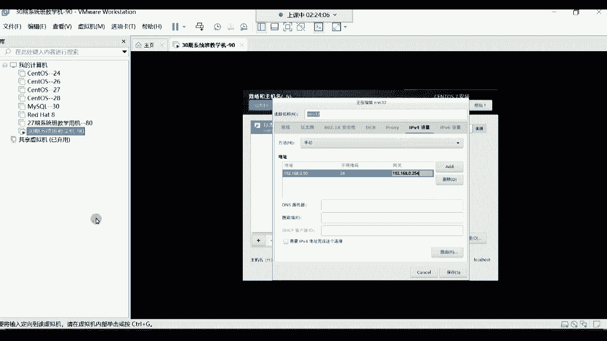

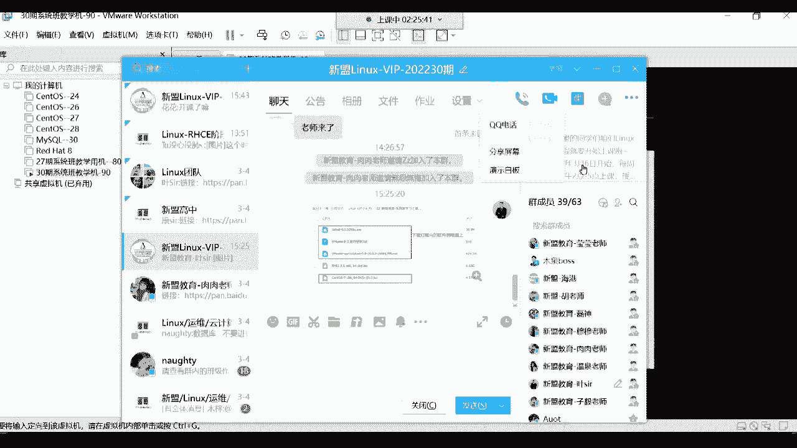

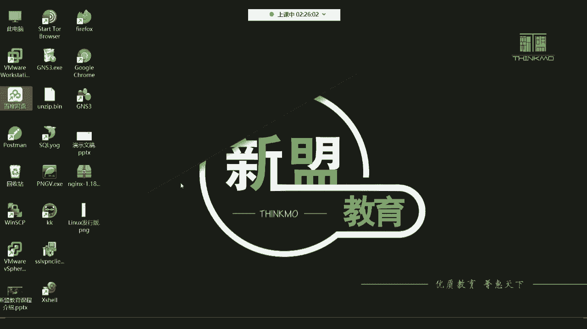

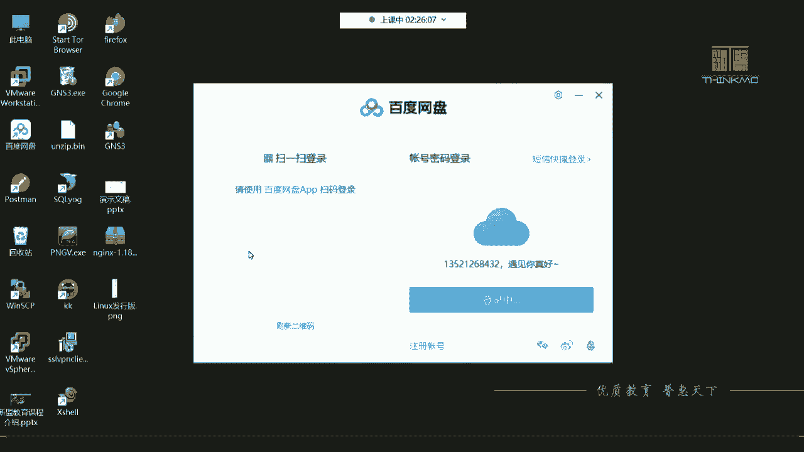

---

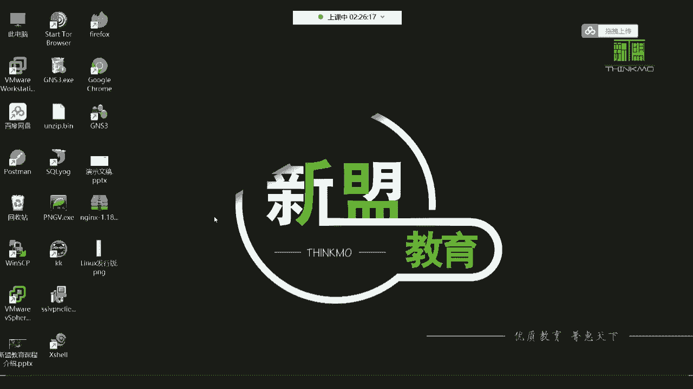

## 课程总结 📝

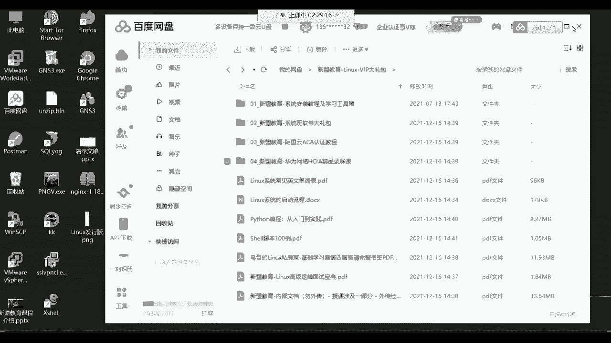

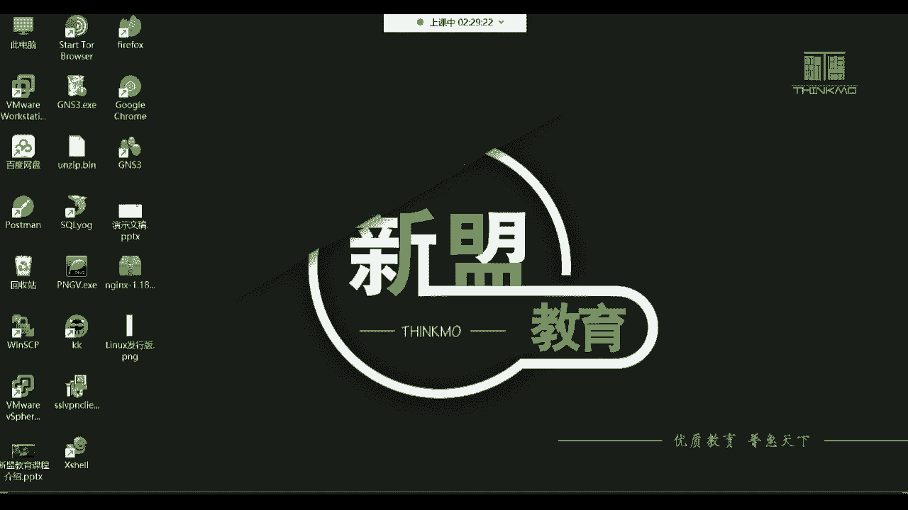

本节课中我们一起学习了在VMware中安装CentOS 7系统的完整流程。我们首先了解了CentOS与RHEL的关系并准备了安装镜像，然后逐步创建并配置了虚拟机硬件（内存、CPU、网络等），最后完成了CentOS系统的最小化安装及基本的网络配置。

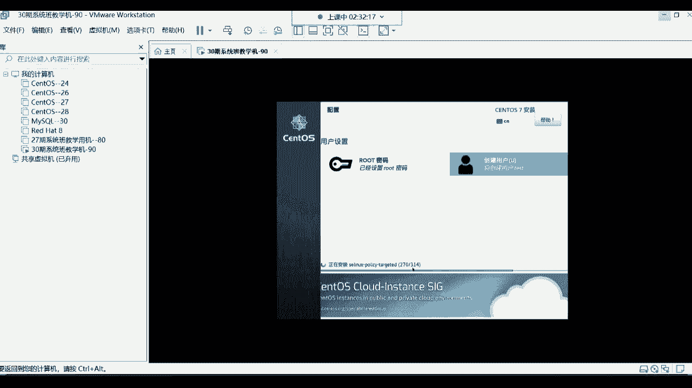

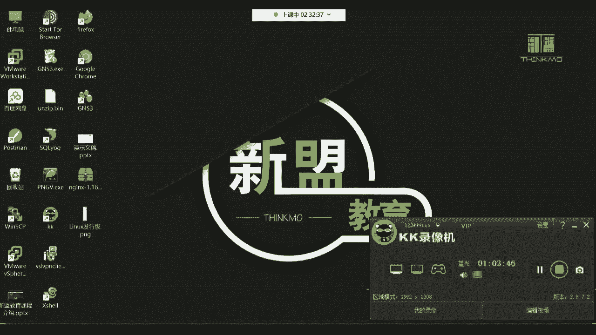

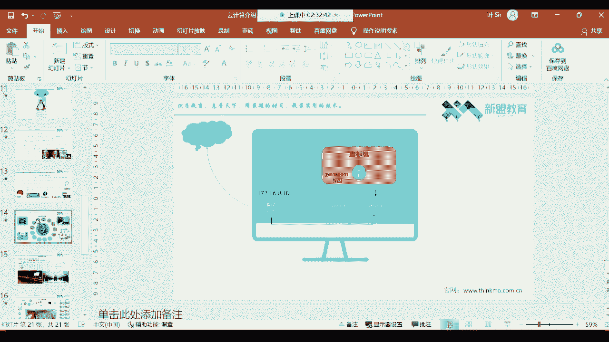

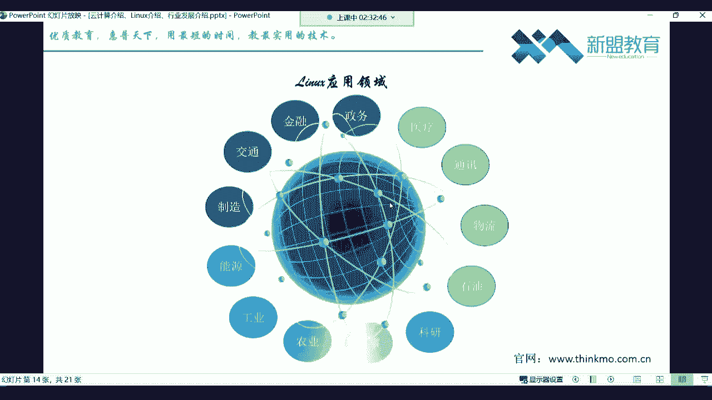

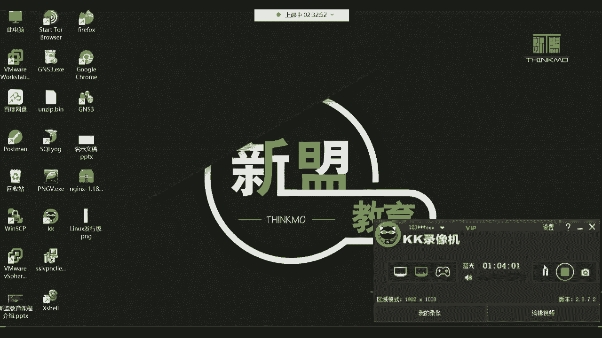

关键操作包括：选择NAT网络模式、配置静态IP地址（`192.168.0.90`）、设置root密码。现在，您已经拥有了一个可以用于后续学习的Linux实验环境。在接下来的课程中，我们将学习如何登录并开始使用这个新系统。