# Linux运维RHCSA+RHCE培训教程：P38：编写与执行Shell脚本


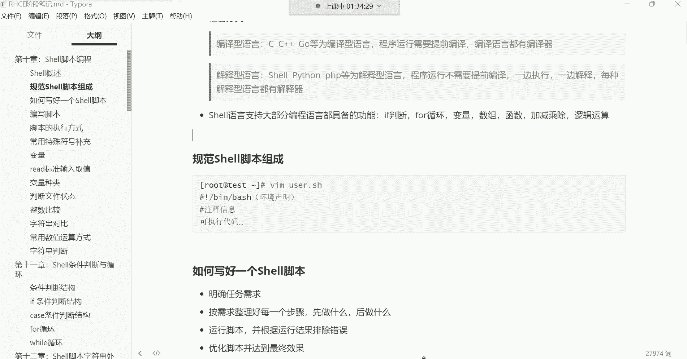

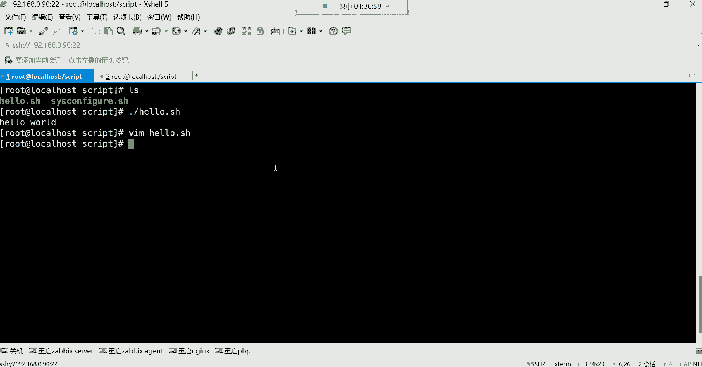

在本节课中，我们将学习如何编写和执行Shell脚本。这是自动化运维任务的基础，通过脚本，我们可以将一系列命令组合起来，实现更复杂的功能。

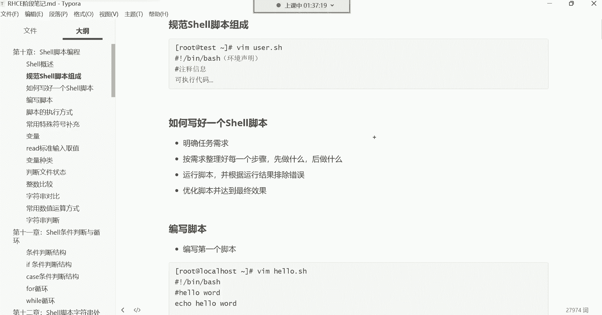

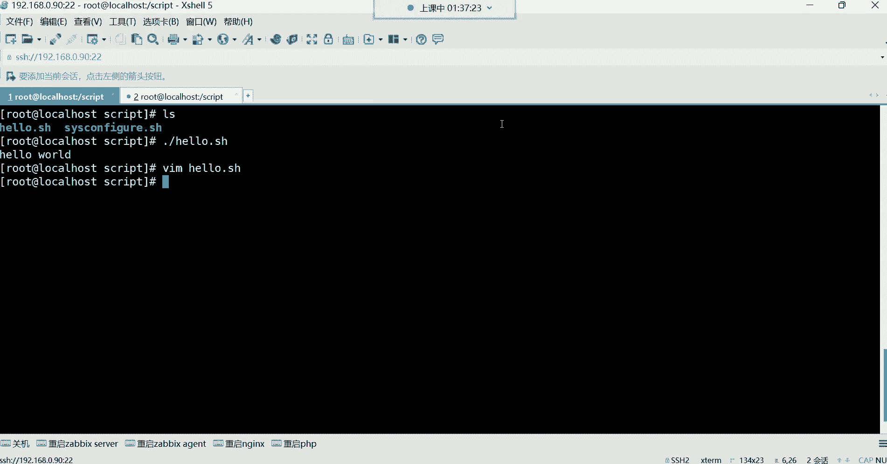


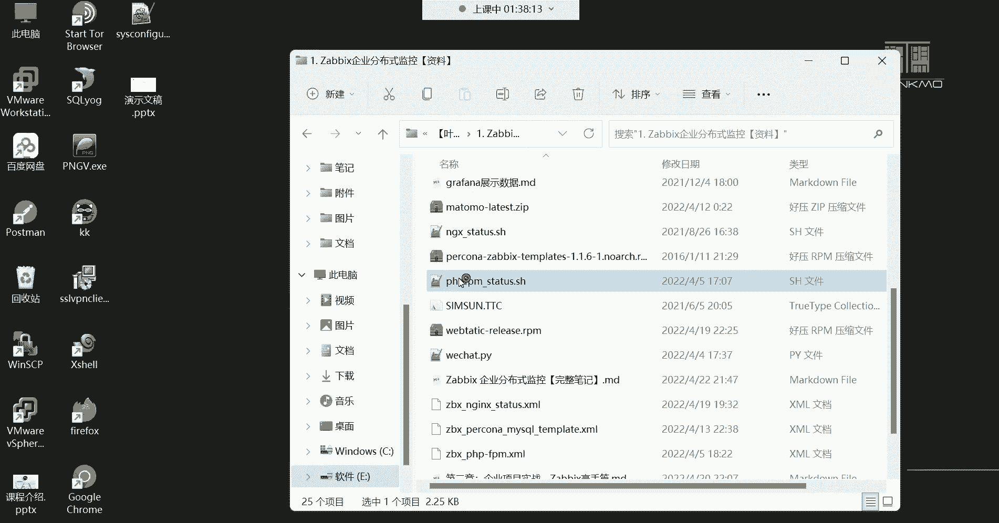

## 脚本的“Hello World”仪式

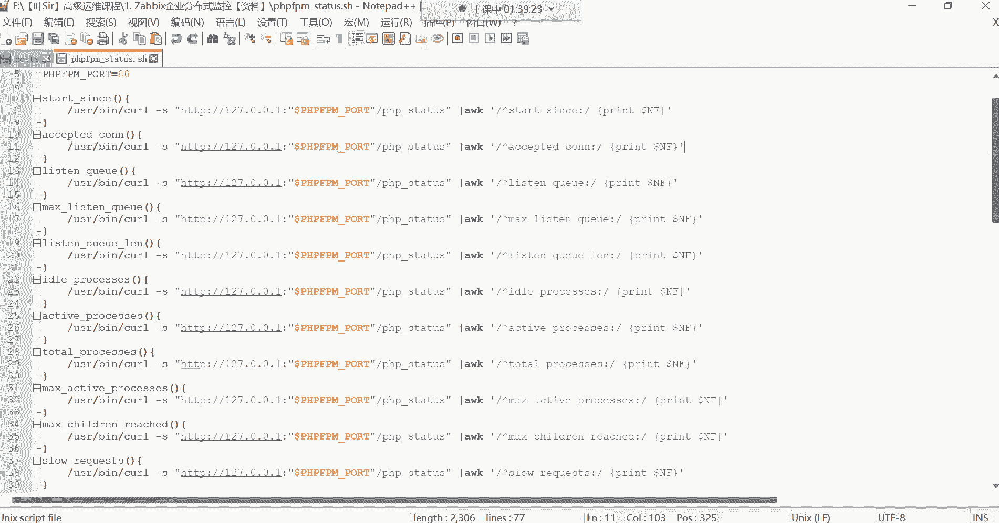

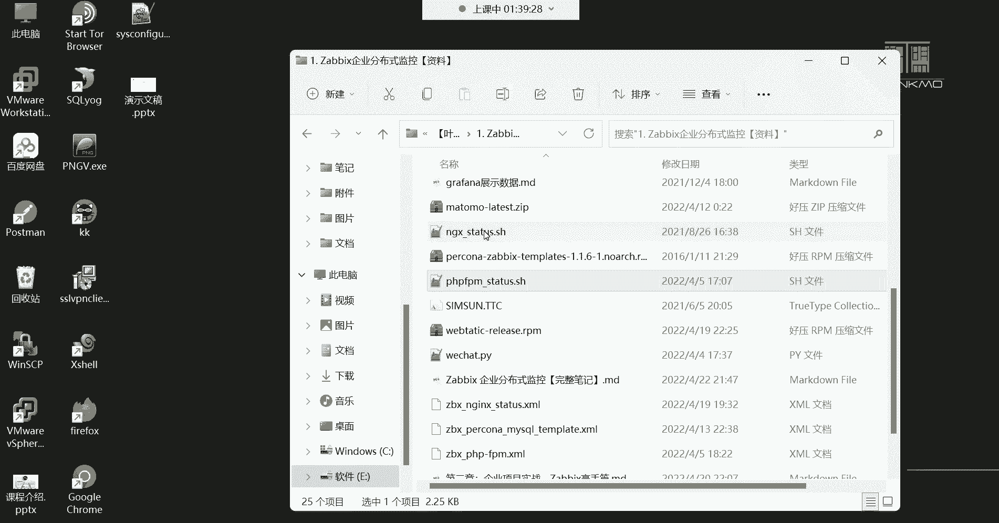

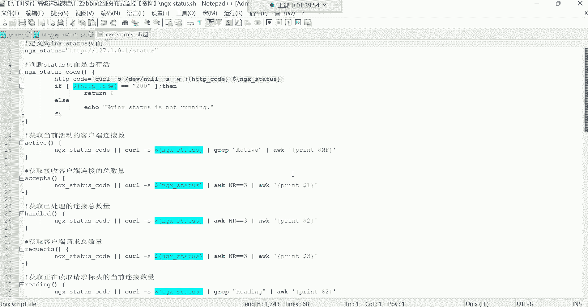

上一节我们介绍了脚本的基本概念，本节中我们来看看如何编写第一个脚本。在编程世界中，第一个程序通常是输出“Hello World”，这是一种传统。


创建一个简单的脚本，其功能是在屏幕上输出“Hello World”。

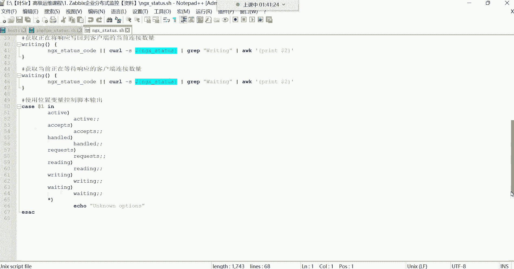

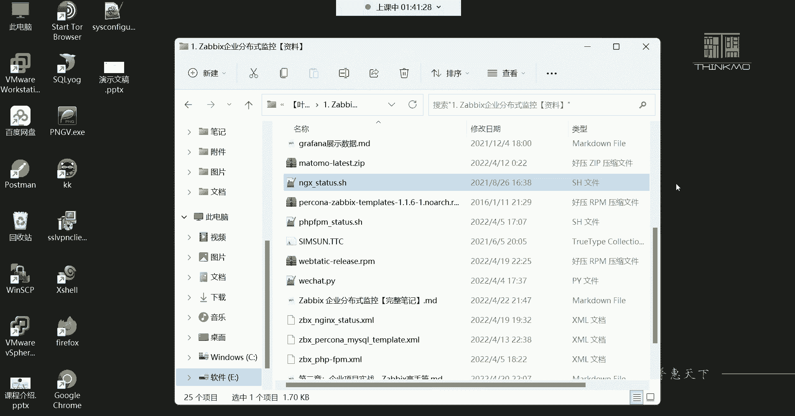

**步骤：**
1.  使用文本编辑器（如`vim`）创建一个新文件，例如 `hello.sh`。
2.  在文件的第一行指定脚本的解释器：`#!/bin/bash`。
3.  在下一行写入输出命令：`echo “Hello World”`。
4.  保存并退出编辑器。
5.  为脚本文件添加执行权限：`chmod +x hello.sh`。
6.  执行脚本：`./hello.sh`。

**代码示例：**
```bash
#!/bin/bash
echo “Hello World”
```
执行这个脚本后，终端将显示“Hello World”。这个简单的例子展示了脚本的本质：**将命令行中按顺序执行的命令写入一个文件**。

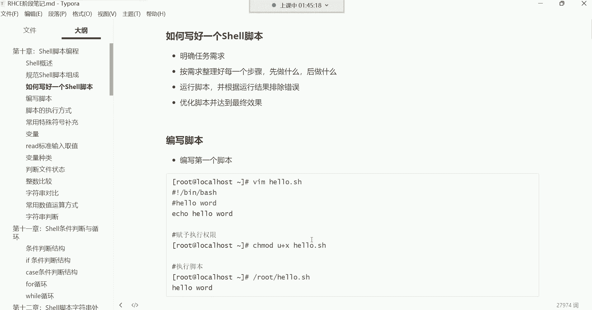

## 编写脚本的核心逻辑与注意事项

从简单的“Hello World”脚本，我们了解到脚本是命令的集合。但要编写实用、复杂的脚本，需要遵循清晰的逻辑。

一个有效的脚本编写流程包含以下步骤：
1.  **明确需求**：确定脚本最终要完成什么任务。
2.  **分解步骤**：将大任务拆解为一系列可顺序执行的小步骤。
3.  **编写与测试**：将每个步骤对应的命令写入脚本，然后运行测试。
4.  **调试与优化**：根据测试结果修改错误，并优化脚本逻辑和输出。

在编写过程中，有一个至关重要的原则：**脚本应避免交互式命令**。

交互式命令在执行时需要用户手动输入参数（如`passwd`命令设置密码，或`vim`命令编辑文件）。这类命令会使脚本执行“卡住”，等待输入，无法实现自动化。

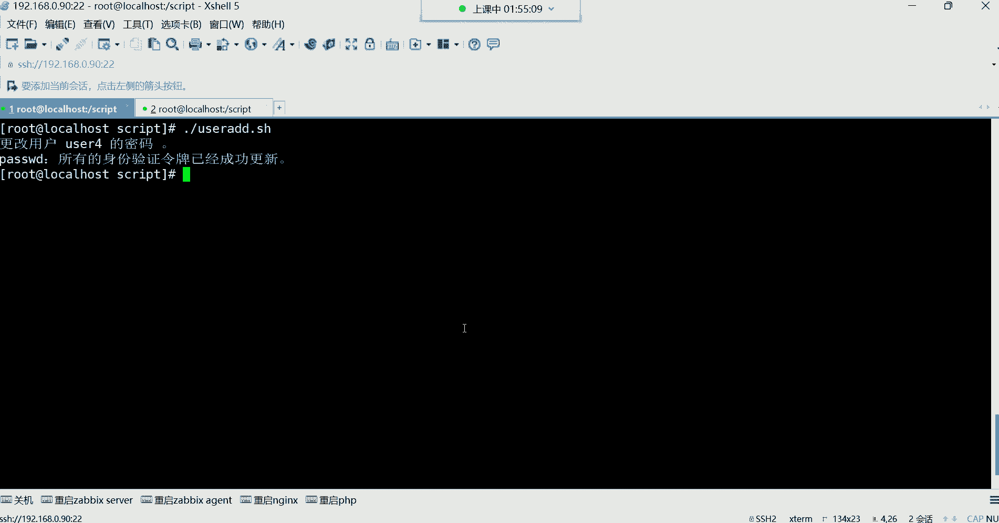

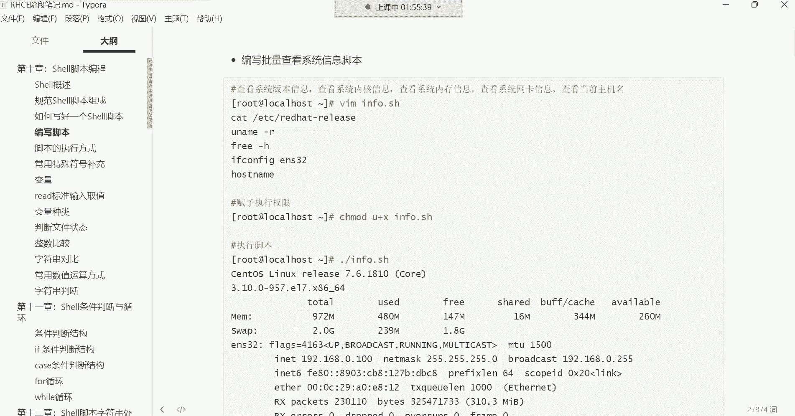

**解决方案**：使用非交互方式。例如，为用户设置密码可以使用以下命令组合：
```bash
echo “123456” | passwd --stdin username
```
这条命令通过管道将密码“123456”传递给`passwd`命令，实现了无需手动输入的非交互式密码设置。

## 实践：编写系统信息查看脚本

理解了基本逻辑后，我们来编写一个稍复杂的脚本。该脚本用于查看基本的系统信息。

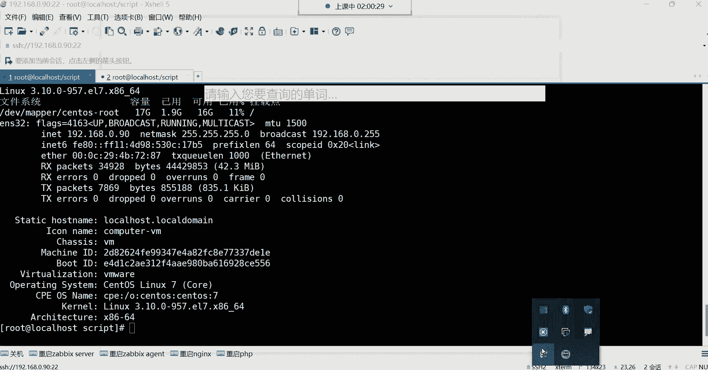

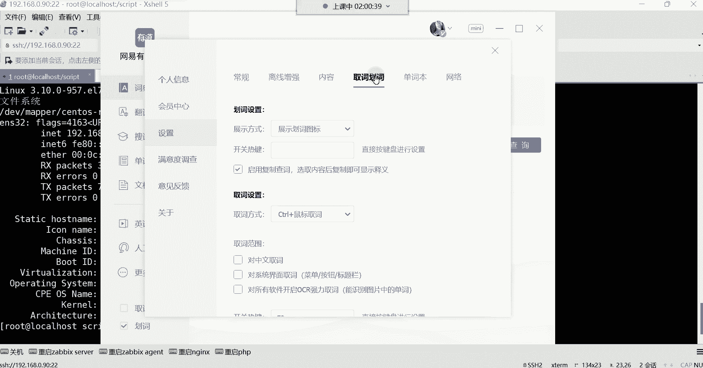

以下是脚本需要执行的命令列表：
*   查看系统版本：`cat /etc/redhat-release`
*   查看内核版本：`uname -r`
*   查看内存使用情况：`free -h`
*   查看根分区磁盘使用率：`df -h /`
*   查看网络配置：`ifconfig ens33` (或你的网卡名)
*   查看主机名：`hostname`

**编写脚本：**
1.  创建文件 `sys_info.sh`。
2.  按顺序将上述命令写入文件，并在命令前使用`echo`添加说明性文字，使输出更友好。
3.  可以使用 `sleep` 命令在步骤间加入短暂停顿，改善显示体验。

**代码示例：**
```bash
#!/bin/bash
echo “=== 开始检查系统信息 ==="
sleep 1
echo “1. 系统版本信息：”
cat /etc/redhat-release
sleep 1
echo “2. 内核版本信息：”
uname -r
sleep 1
echo “3. 内存使用情况：”
free -h
sleep 1
echo “4. 根分区磁盘使用率：”
df -h /
sleep 1
echo “5. 网络配置信息：”
ifconfig ens33
sleep 1
echo “6. 主机名信息：”
hostname
echo “=== 系统信息检查完毕 ==="
```
为脚本添加执行权限 (`chmod +x sys_info.sh`) 并运行 (`./sys_info.sh`)，它将按顺序输出清晰的系统信息。

**脚本存放位置**：如果脚本仅供自己使用，可以放在任何有权限的目录（如家目录）。若需要与其他用户共享，则应将其放在公共目录（如`/usr/local/bin`）并设置适当的权限，使其他用户可以执行但不能修改。

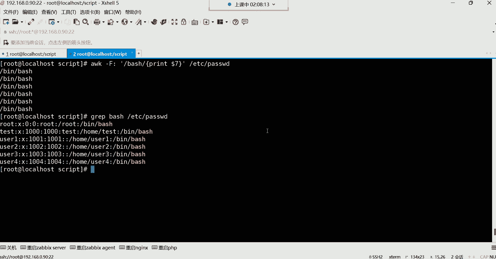

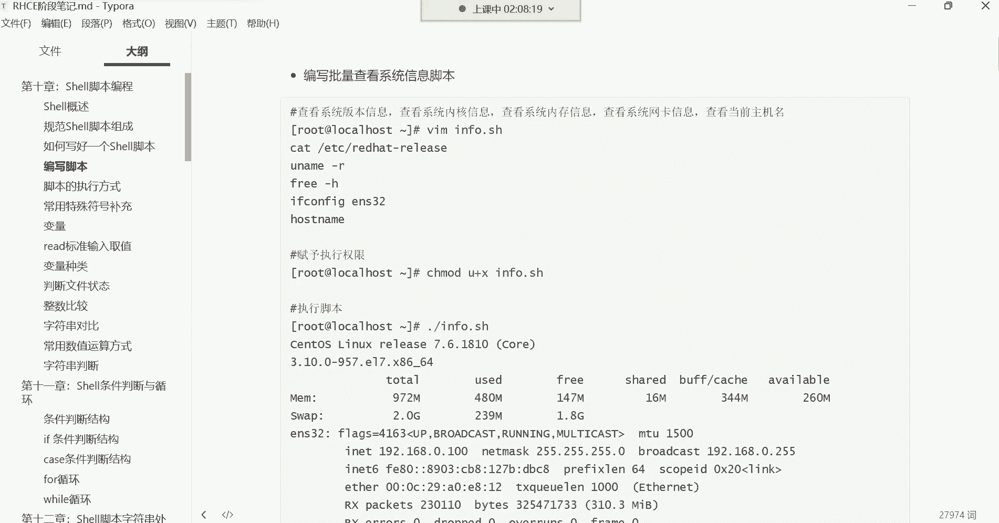

## 总结

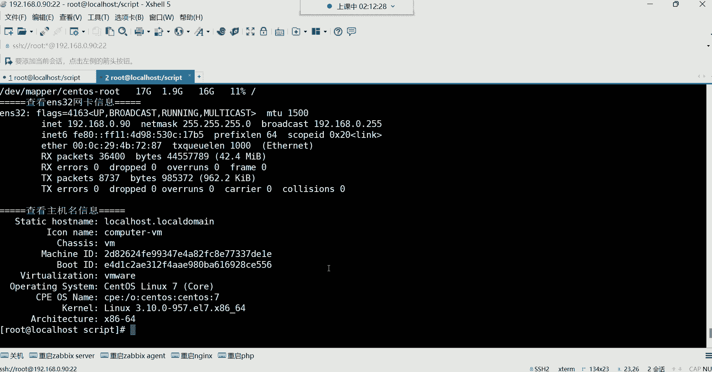

本节课中我们一起学习了Shell脚本编写与执行的核心知识。我们从一个具有仪式感的“Hello World”脚本入手，理解了脚本是命令的集合。进而探讨了编写实用脚本的思维逻辑：从明确需求、分解步骤到测试优化。我们特别强调了**避免在脚本中使用交互式命令**的原则，这是实现自动化的关键。最后，通过编写一个系统信息查看脚本，我们实践了如何组织命令、使用`echo`改善输出以及利用`sleep`控制执行节奏。记住，脚本的核心目标是提高效率，一切逻辑都应服务于清晰、自动地完成任务。