# Linux运维RHCSA+RHCE培训教程：P39：编写脚本与脚本执行方式 🖥️

在本节课中，我们将学习如何编写一个实用的Shell脚本，并探讨如何优化脚本，使其执行过程更清晰、更具可读性。我们将通过一个搭建本地YUM仓库的实例，来掌握脚本编写的基本流程、命令组合以及提升脚本“体验感”的技巧。

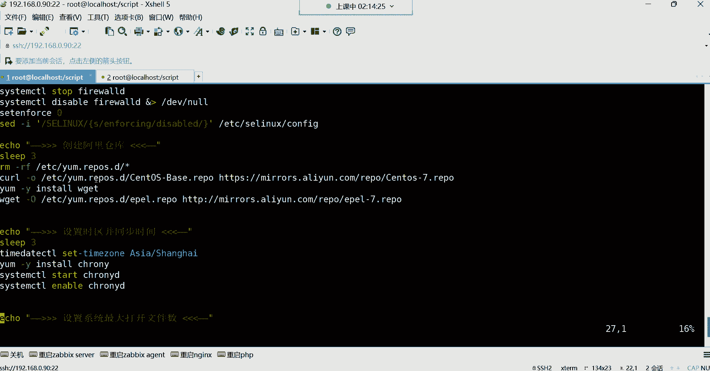


## 脚本的基本结构与执行 🚀

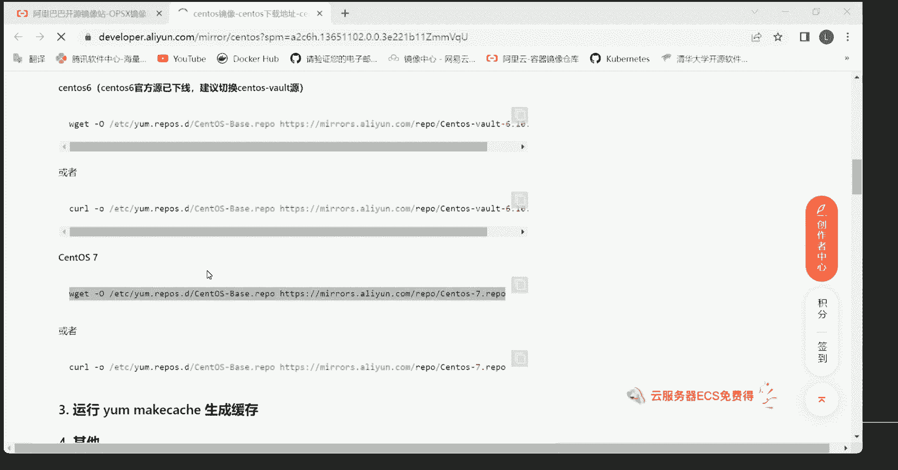

上一节我们介绍了脚本的基础概念，本节中我们来看看如何构建一个完整的脚本并执行它。

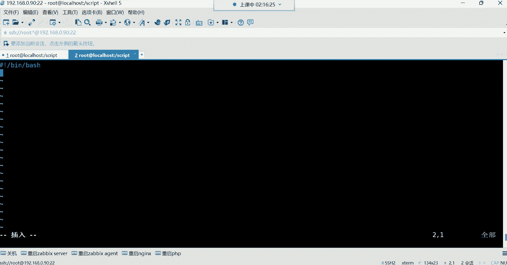

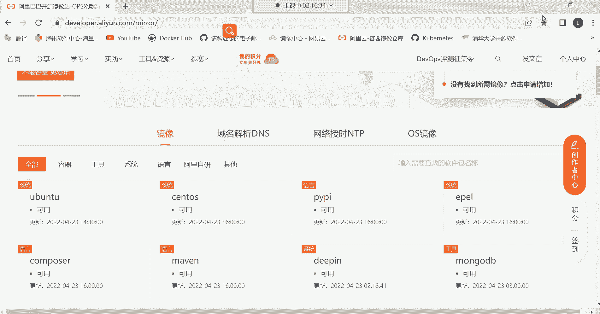

一个脚本本质上是一系列命令的集合。为了让脚本按顺序执行命令，我们需要使用 `#!/bin/bash` 指定解释器，并给脚本文件添加执行权限。

```bash
chmod +x script_name.sh
./script_name.sh
```

## 控制脚本执行速度与增强可读性 ⏳

如果脚本中的命令执行过快，用户可能无法看清每一步的输出。这时，我们可以使用 `sleep` 命令在命令之间添加等待时间。

`sleep` 命令的语法是 `sleep [秒数]`。它不是让命令执行变慢，而是让脚本在执行完一条语句后，暂停指定的秒数，再执行下一条。

```bash
echo "正在执行第一步..."
sleep 3
echo "第一步完成，开始第二步..."
```

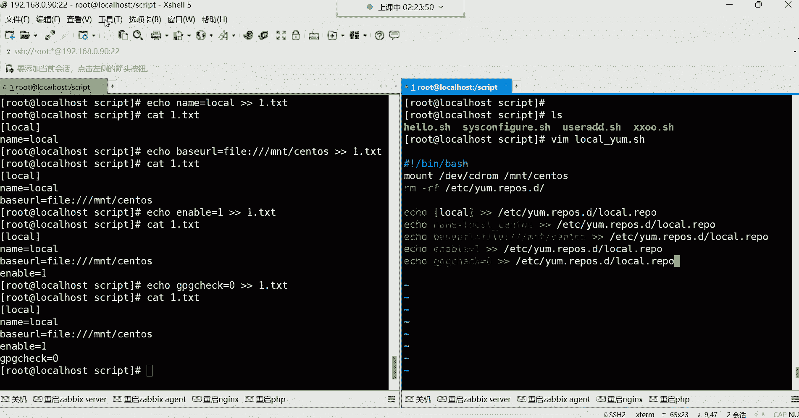

这样，用户就能清晰地看到脚本的每一步在做什么，提升了脚本的交互体验。

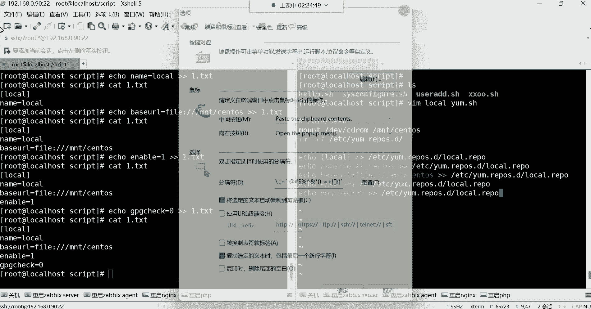

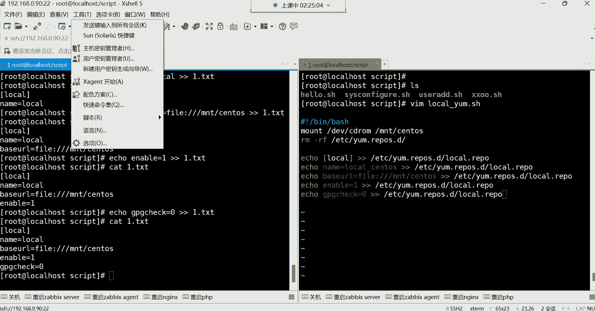

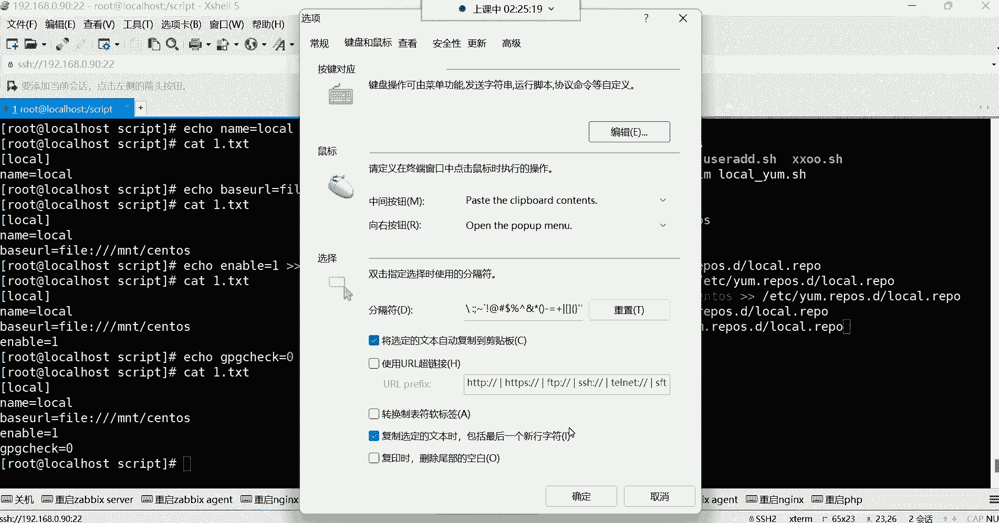

## 编写脚本：搭建本地YUM仓库案例 📦

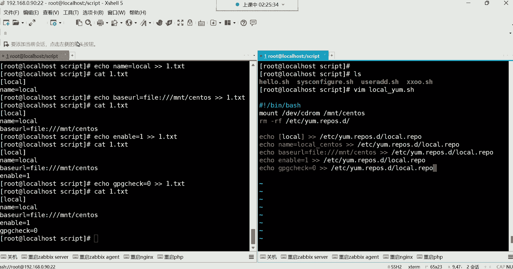


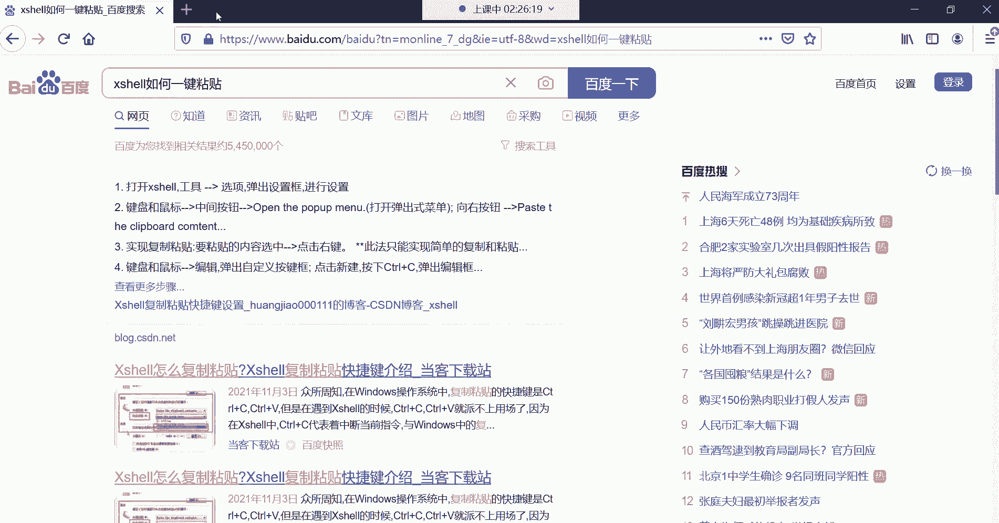

以下是创建一个搭建本地YUM仓库脚本的核心步骤。我们将命令写入一个文件，并使其可执行。


**脚本核心任务分解：**
1.  挂载光盘到指定目录。
2.  清理或准备YUM仓库配置文件目录。
3.  创建本地仓库的配置文件。
4.  验证仓库是否创建成功。

### 使用 `cat` 命令进行非交互式文件写入

在脚本中，我们不能使用交互式编辑器如 `vim`。我们需要使用非交互式的方法向文件写入内容，`cat` 命令结合 **Here Document** 语法是完美选择。

其基本格式如下：
```bash
cat > 文件名 << ‘EOF’
要写入文件的内容
EOF
```

例如，创建本地仓库配置文件：
```bash
cat > /etc/yum.repos.d/local.repo << EOF
[local]
name=local
baseurl=file:///mnt/centos
enabled=1
gpgcheck=0
EOF
```
这段代码会将 `EOF` 标记之间的所有内容写入到 `/etc/yum.repos.d/local.repo` 文件中。

### 完整的脚本示例

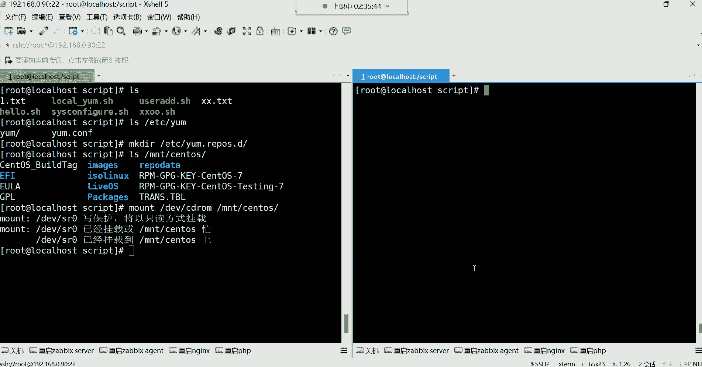

结合以上知识点，一个基础的搭建本地仓库的脚本如下：
```bash
#!/bin/bash
# 这是一个搭建本地YUM仓库的脚本


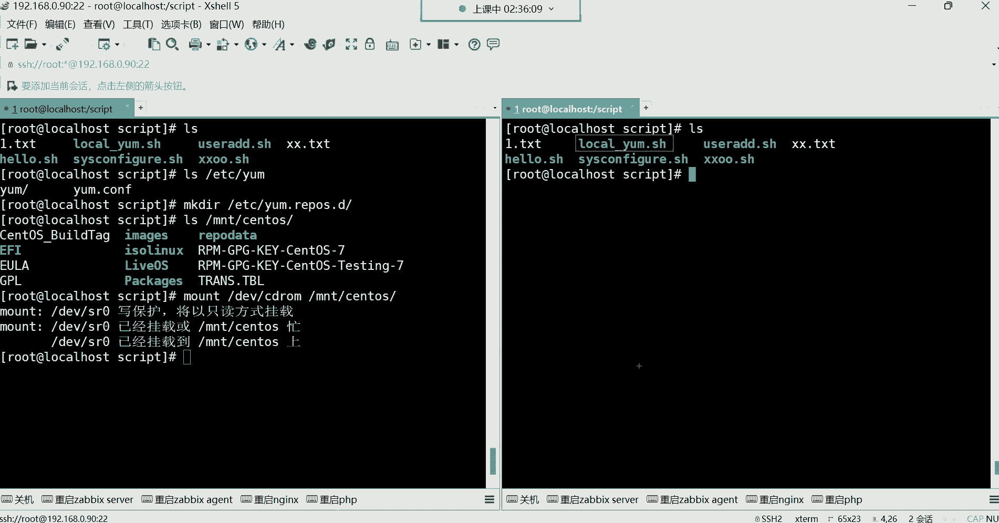

echo “脚本开始：正在搭建本地软件仓库...”
sleep 2

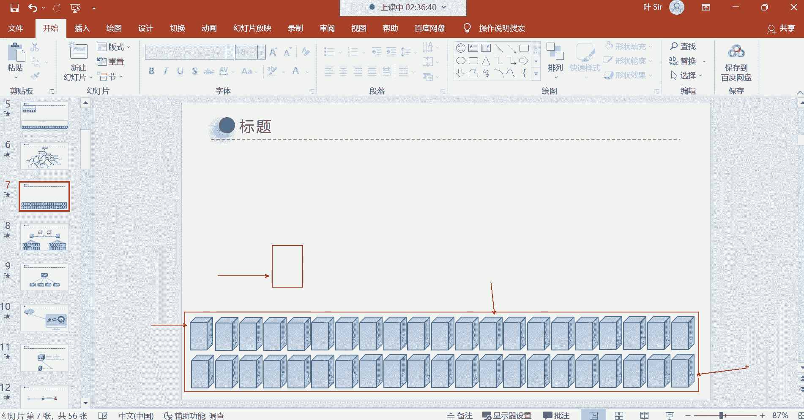

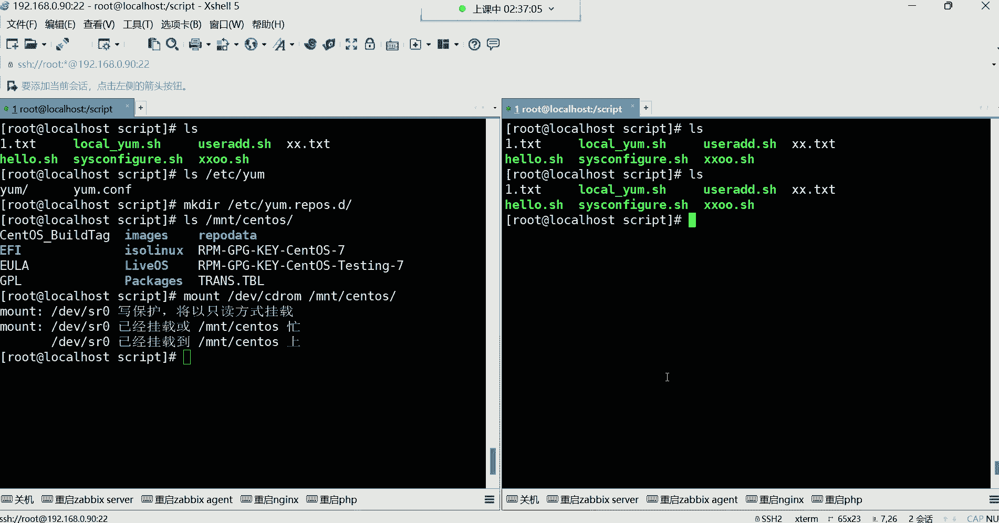

# 1. 挂载光盘
mount /dev/cdrom /mnt/centos 2>/dev/null


# 2. 确保仓库配置目录存在
mkdir -p /etc/yum.repos.d

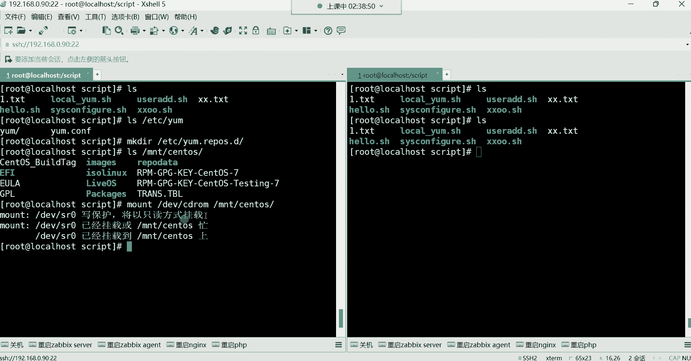

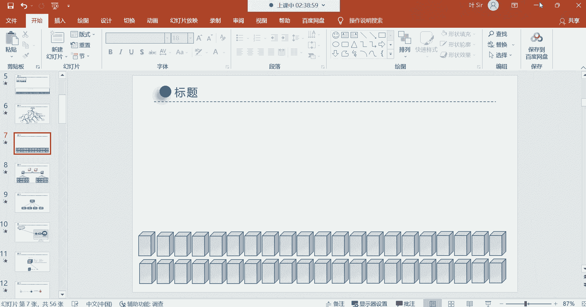


# 3. 备份并清空原有仓库配置
mv /etc/yum.repos.d/* /tmp/ 2>/dev/null

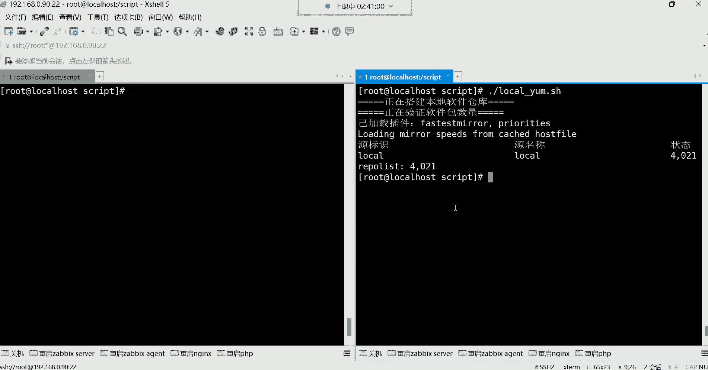

# 4. 创建本地仓库配置文件
cat > /etc/yum.repos.d/local.repo << EOF
[local]
name=local
baseurl=file:///mnt/centos
enabled=1
gpgcheck=0
EOF

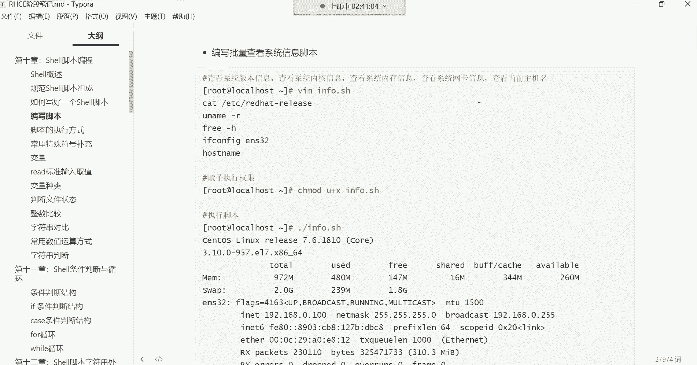

echo “仓库配置完成，正在验证软件包数量...”
sleep 2

# 5. 验证并显示仓库中的软件包数量
yum repolist | grep repolist
```

## 脚本优化与“体验感”提升 ✨

一个优秀的脚本不仅功能正确，还应输出清晰、友好。我们可以从以下几个方面优化：

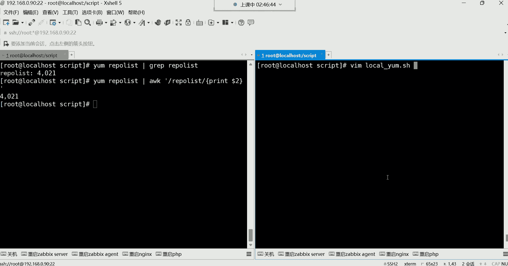

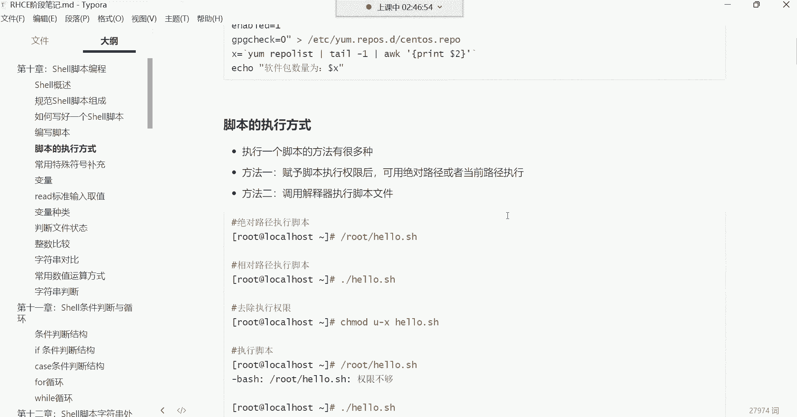

### 1. 精简输出信息
默认的 `yum repolist` 命令会输出多行信息。我们可以使用管道 (`|`) 和 `grep` 命令过滤，只显示我们需要的关键行。
```bash
yum repolist | grep repolist
```
这将只输出包含 “repolist” 的行，即软件包总数信息。

### 2. 使用变量和命令替换使输出更友好
我们可以将命令执行的结果保存到变量中，然后组合成更易懂的语句输出。
```bash
package_count=$(yum repolist | grep repolist | awk ‘{print $2}‘)
echo “本地仓库软件包总数量为：$package_count 个”
```
这里 `$(命令)` 可以将命令的输出结果赋值给变量 `package_count`。

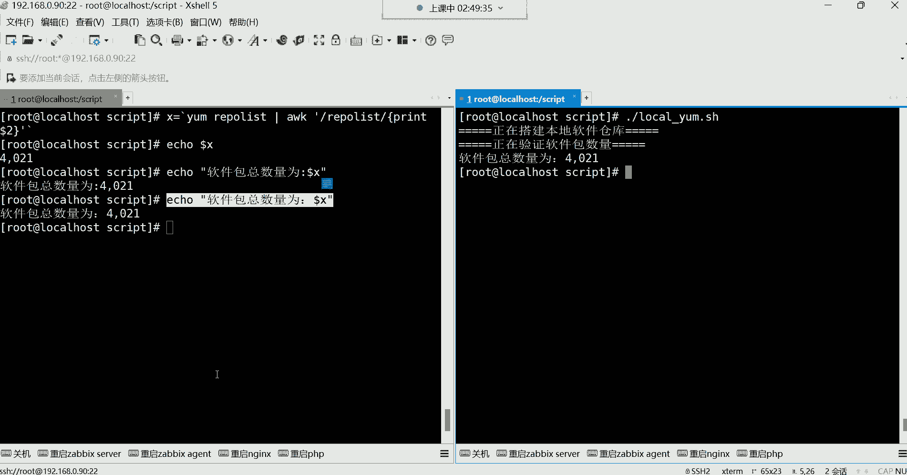

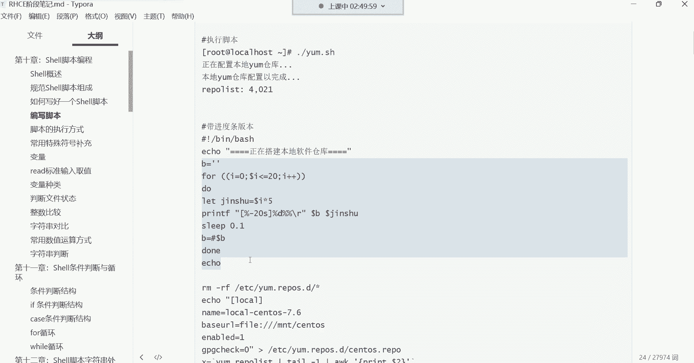

### 3. 添加“进度条”提升视觉效果（可选）
对于需要等待的操作，可以添加一个简单的动态效果来提升体验。以下是一个模拟进度条的循环：
```bash
echo -n “正在处理 [”
for i in {1..20}; do
    echo -n “#”
    sleep 0.1
done
echo “] 完成！”
```
这个循环会依次打印20个 “#” 字符，模拟进度增长。

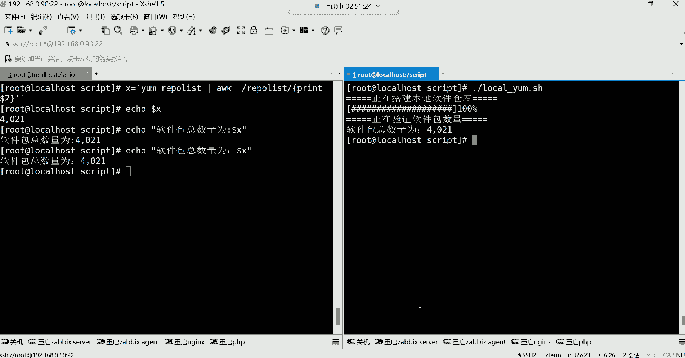

**请注意**：这只是一个视觉装饰，并非真实的进度指示。它让脚本执行看起来更生动。

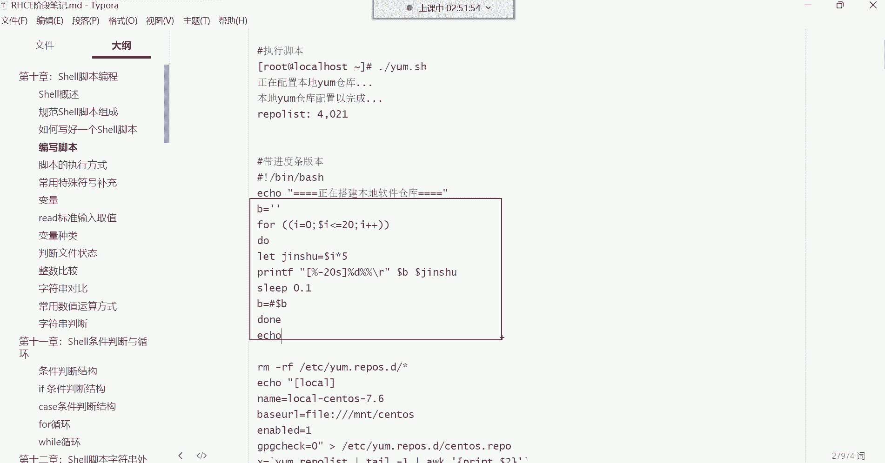

## 脚本的复用与自动化 🤖

脚本最大的优势在于可复用性。一旦编写完成，你可以：
*   **保存脚本**：将脚本文件保存下来。
*   **跨机器使用**：在其他需要执行相同操作的服务器上，只需上传并运行此脚本即可。
*   **批量执行**：后期学习自动化工具（如Ansible）后，可以在一台机器上控制成百上千台服务器同时运行此脚本，极大提升运维效率。

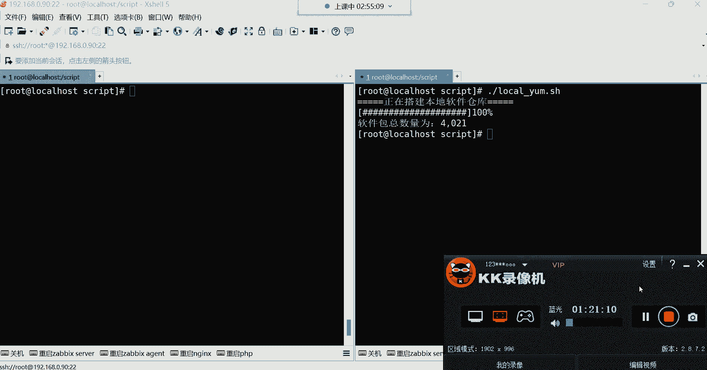

本节课中我们一起学习了如何从零开始编写一个Shell脚本，重点包括了使用 `sleep` 控制节奏、利用 `cat` 命令非交互式写文件、以及通过过滤输出、使用变量和添加动态效果来优化脚本的可读性和用户体验。记住，脚本的目的是将重复劳动自动化，并尽可能清晰地向执行者反馈信息。不断练习和优化，你的脚本会越来越实用和优雅。