# Linux运维入门：P3：虚拟机网络配置、远程连接与Linux岗位介绍 🖥️

在本节课中，我们将学习如何配置虚拟机的网络，使用远程连接工具连接到Linux系统，并了解Linux相关的职业岗位。课程内容从系统安装后的登录开始，逐步引导你完成网络设置，并介绍行业背景与学习建议。

---

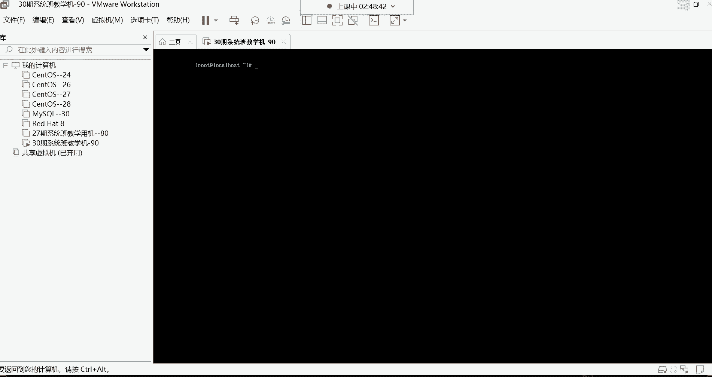

## 系统登录与初始配置

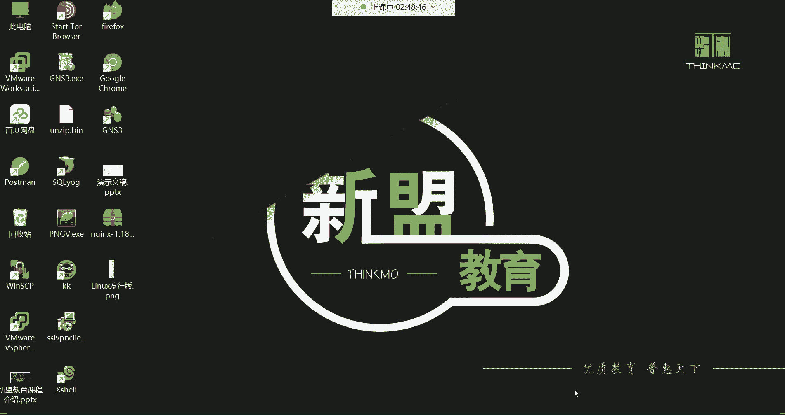

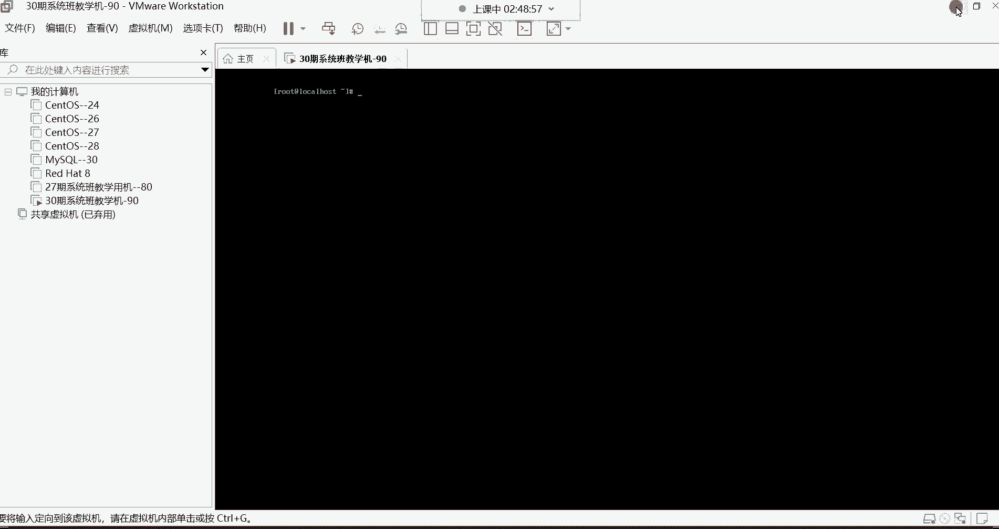

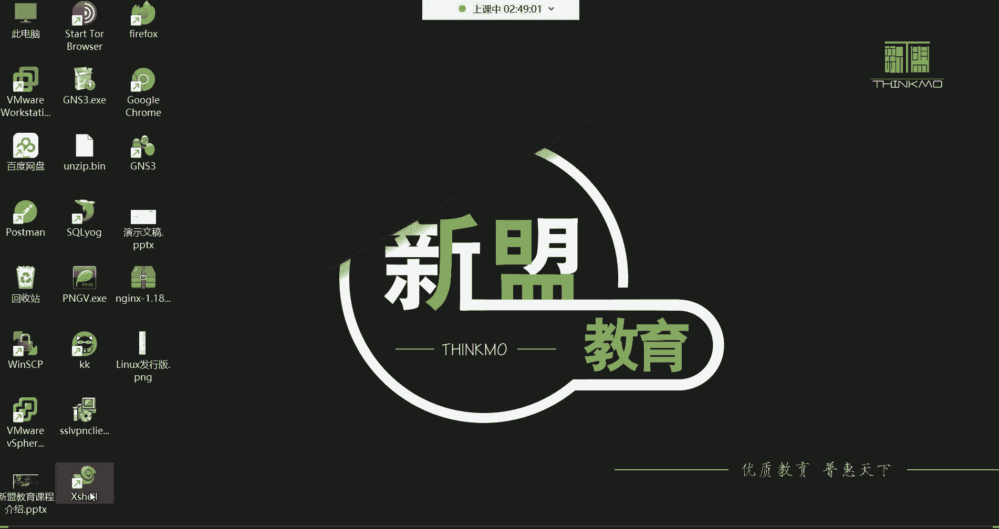

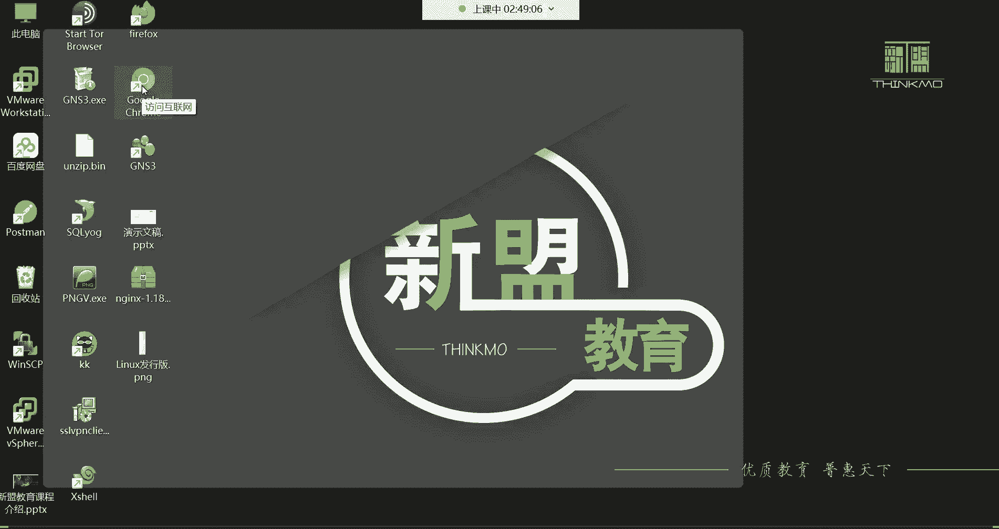

上一节我们完成了Linux系统的安装。系统重启后，我们将面对一个命令行登录界面。

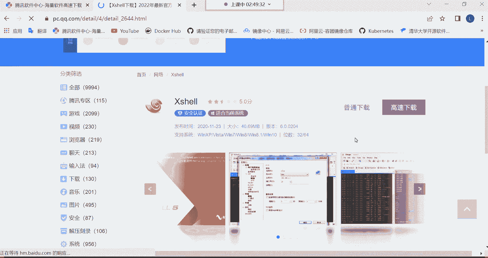

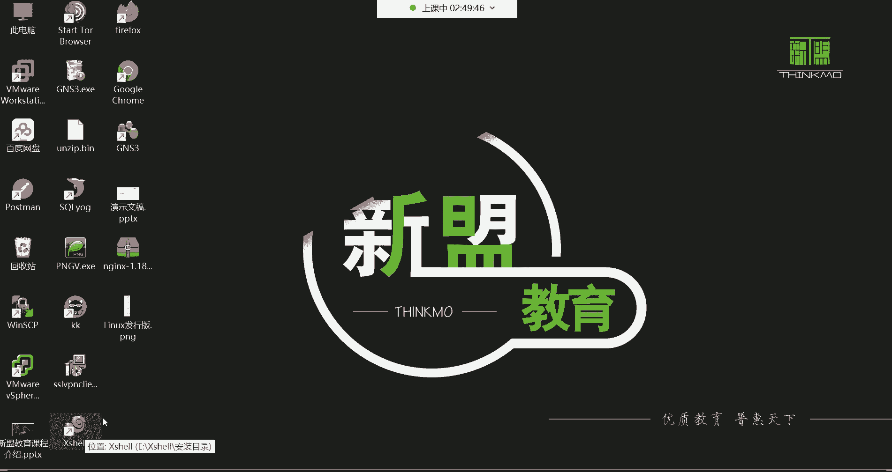

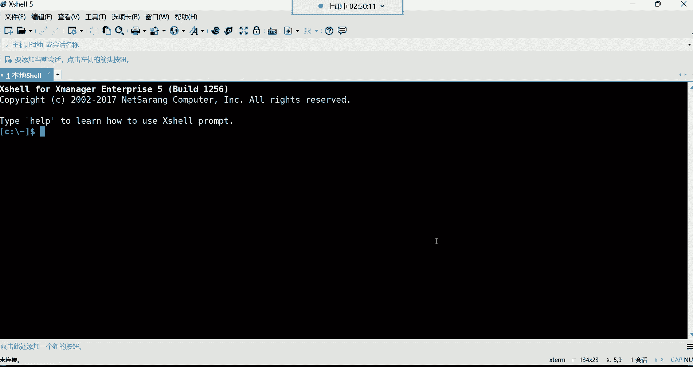

1.  在登录提示符 `localhost login:` 后，输入用户名 **`root`** 并按回车。
2.  系统会提示输入密码。输入安装时设置的密码（例如 `1`），输入时屏幕不会显示任何字符，这是出于安全考虑。输入完成后按回车。
3.  登录成功后，命令行提示符会变为 `[root@localhost ~]#`，这表示你已成功以root用户身份登录系统。

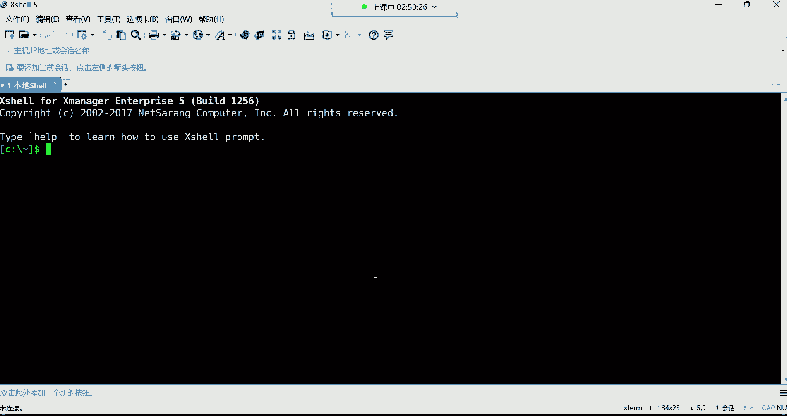

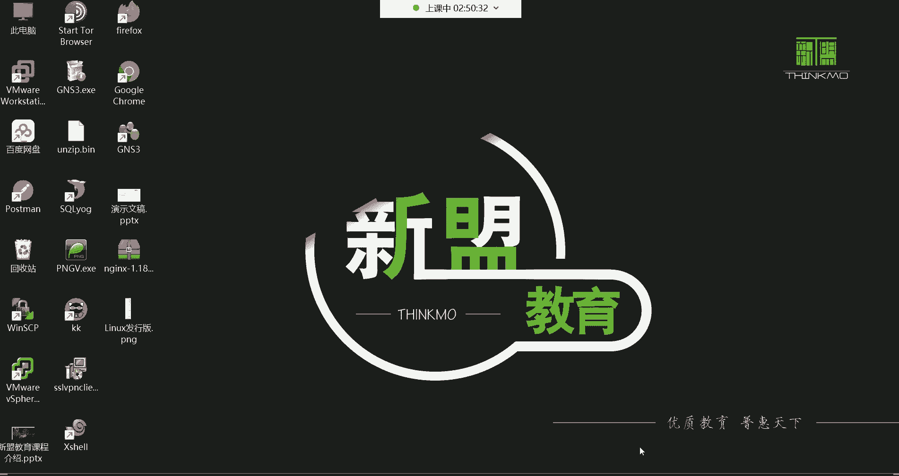

> **核心概念**：Root用户是Linux系统中的超级管理员，拥有最高权限。

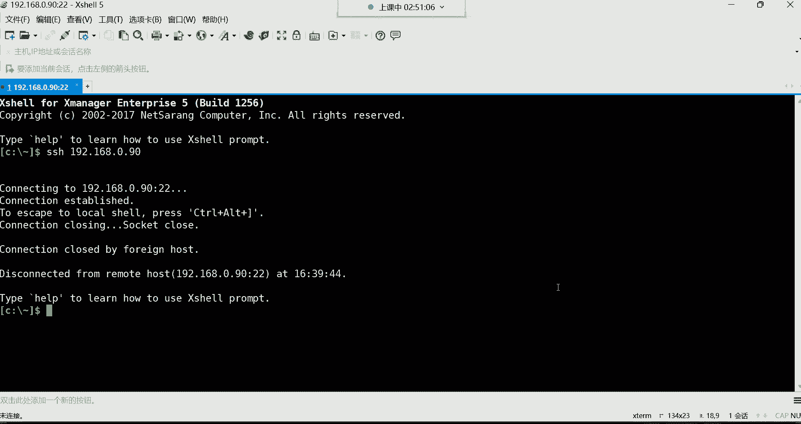

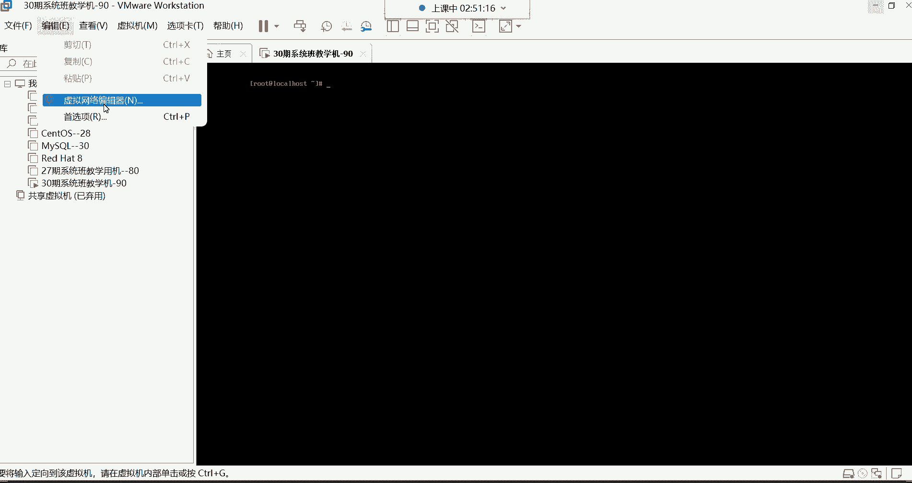

---

## 配置虚拟机网络

成功登录后，我们需要配置网络，以便能够从本地计算机远程连接到虚拟机。这个过程分为两步：配置虚拟网络编辑器，以及配置主机的VMnet8网卡。

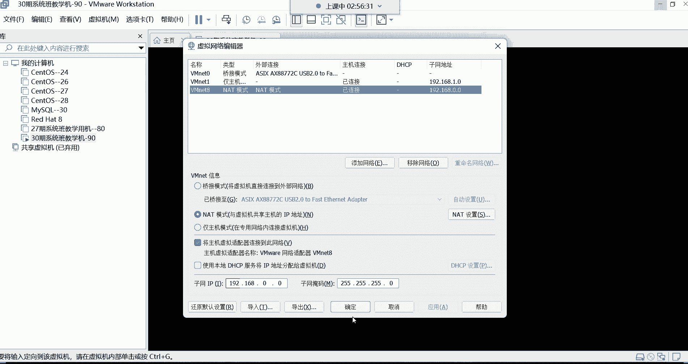

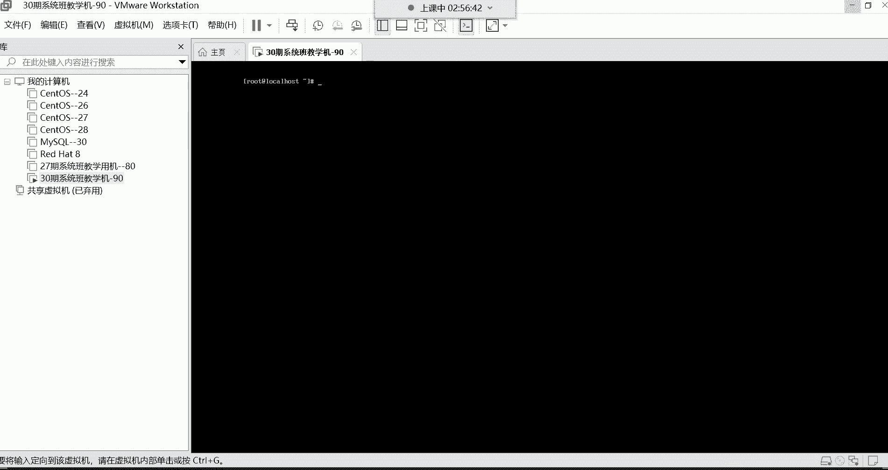

### 步骤一：配置虚拟网络编辑器

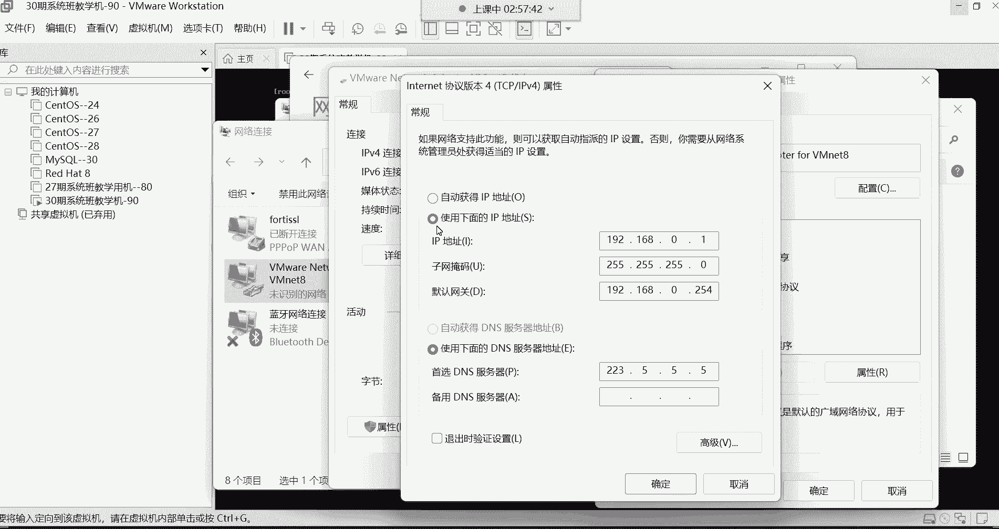

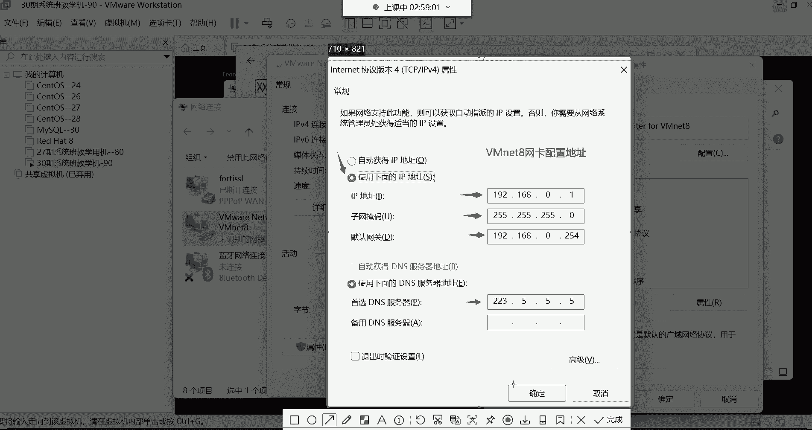

以下是配置VMware虚拟网络编辑器的具体步骤。

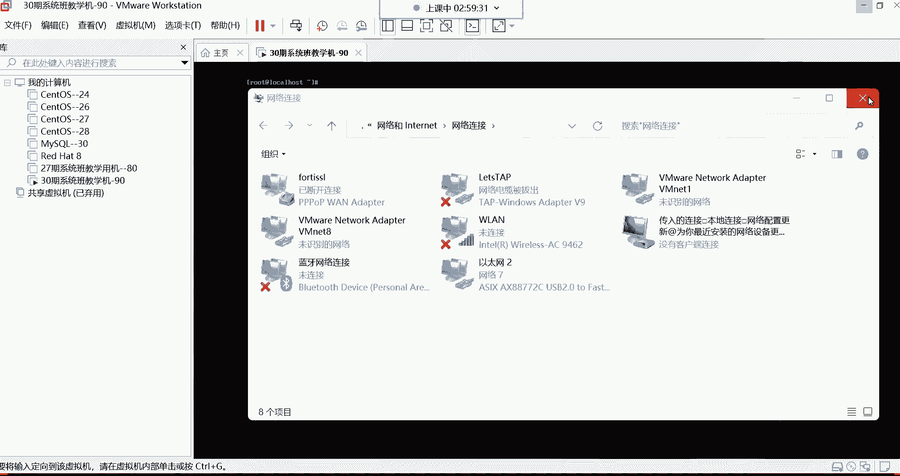

1.  在VMware主界面，点击菜单栏的 **`编辑`**，选择 **`虚拟网络编辑器`**。
2.  在弹出的窗口中，选中 **`VMnet8 (NAT模式)`**。
3.  取消勾选 **`使用本地DHCP服务将IP地址分配给虚拟机`**。这一步是为了使用我们手动设置的静态IP，避免IP地址变动导致无法连接。
4.  在 **`子网IP`** 字段中，设置为 `192.168.0.0`。
5.  在 **`子网掩码`** 字段中，设置为 `255.255.255.0`。
6.  点击 **`NAT设置`** 按钮，在 **`网关IP`** 字段中，设置为 `192.168.0.254`。
7.  依次点击 **`确定`** 保存所有设置。

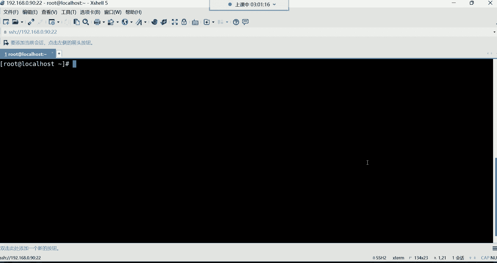

### 步骤二：配置主机VMnet8网卡

接下来，需要在你的Windows电脑上配置对应的虚拟网卡。

1.  打开Windows的 **`控制面板`** -> **`网络和 Internet`** -> **`网络和共享中心`** -> **`更改适配器设置`**。
2.  找到名为 **`VMware Network Adapter VMnet8`** 的网络连接，右键点击并选择 **`属性`**。
3.  在列表中找到并双击 **`Internet 协议版本 4 (TCP/IPv4)`**。
4.  选择 **`使用下面的IP地址`**，并进行如下配置：
    *   **IP地址**：`192.168.0.1`
    *   **子网掩码**：`255.255.255.0`
    *   **默认网关**：`192.168.0.254`
    *   **首选DNS服务器**：`223.5.5.5` (或 `114.114.114.114`)
5.  点击 **`确定`** 保存配置。

完成以上两步后，你的虚拟机与主机就处于同一个局域网段 (`192.168.0.0/24`)，并且可以互相通信了。

---

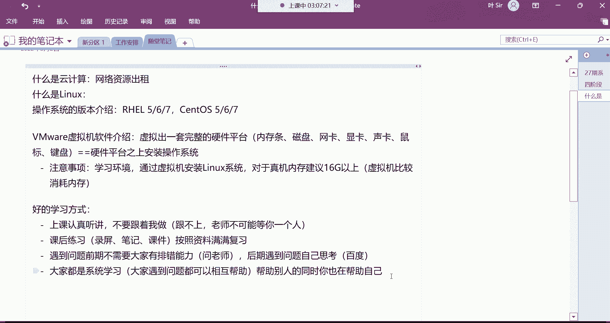

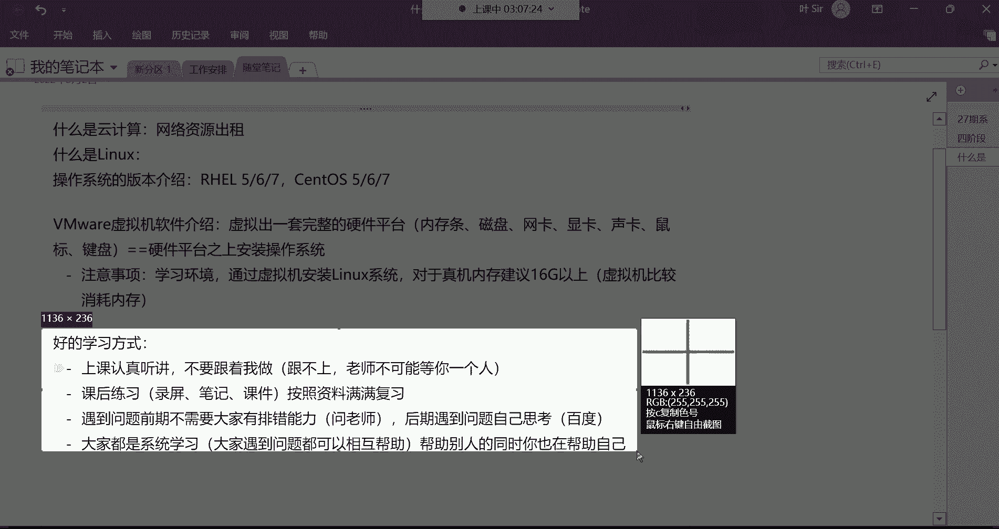

## 使用远程连接工具

在企业环境中，服务器通常不在本地，我们需要通过远程连接工具进行管理。这里我们使用 Xshell。

1.  **获取工具**：你可以从VIP资料包中获取Xshell，或从腾讯软件中心等网站搜索“Xshell”下载安装。
2.  **建立连接**：打开Xshell，点击 **`新建会话`**。
    *   在“主机”栏输入虚拟机的IP地址：`192.168.0.90`
    *   协议选择 **`SSH`**，端口保持 `22`。
3.  **首次连接**：首次连接时会弹出“SSH安全警告”，询问是否接受主机密钥，选择 **`接受并保存`**。
4.  **身份验证**：在登录提示中，输入用户名 **`root`** 和密码 **`1`**。
5.  **连接成功**：登录后，你将看到一个命令行界面。在此界面输入 `clear` 或按 **`Ctrl + L`** 可以清屏。

> **核心操作**：远程连接命令的基本格式是 `ssh 用户名@IP地址`，例如 `ssh root@192.168.0.90`。

至此，你已经可以通过Xshell远程操作Linux虚拟机，后续的所有学习和操作都将在这个命令行界面中进行。

---

## Linux学习建议与职业发展

掌握了基本的系统访问方法后，我们来了解一下如何有效学习Linux以及相关的职业前景。

### 高效学习方式

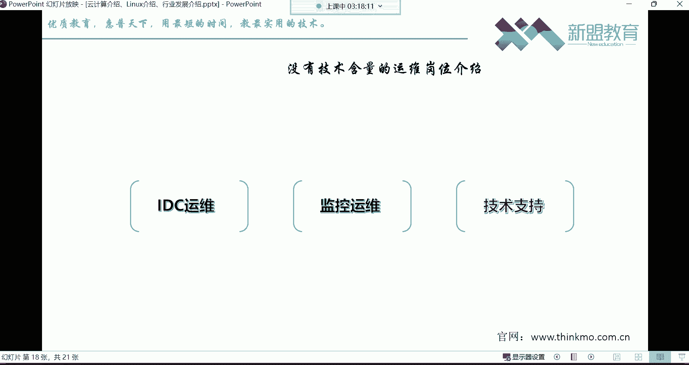

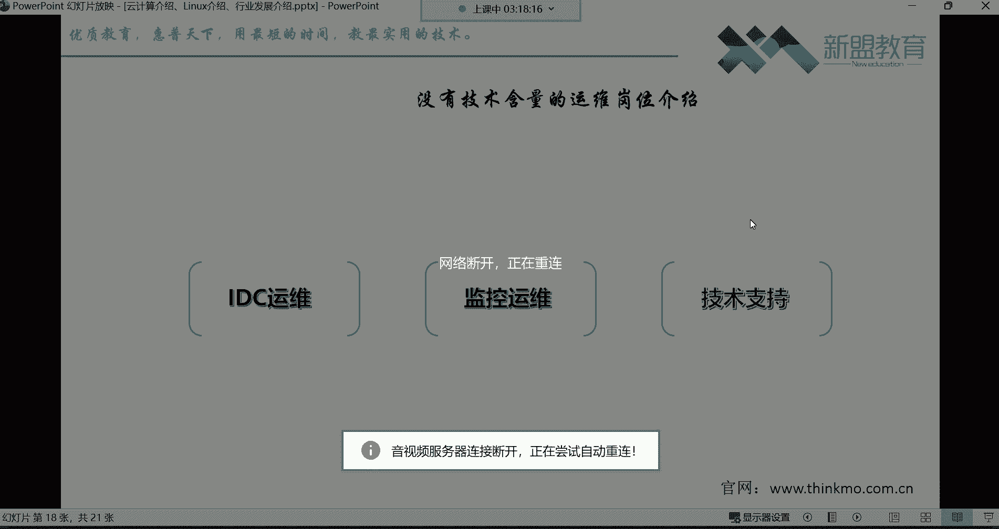

以下是一些帮助你顺利入门Linux运维的学习建议。

*   **听课与练习分离**：上课时以理解和听懂为主，不要急于同步操作，以免跟不上节奏。课后根据录屏、笔记和课件进行练习和复习。
*   **问题处理策略**：学习初期遇到问题，可以直接在课程群内提问。随着学习的深入，应尝试先自己思考、搜索（如使用百度、谷歌）解决问题，培养排错能力。
*   **保持坚持与互助**：学习技术会有疲劳期，贵在坚持。同学之间应积极互助，在帮助他人解决问题的同时，也能加深自己对知识的理解。

### Linux应用领域与岗位

Linux系统几乎无处不在，是互联网基础设施的核心。

*   **广泛应用**：从云计算、大数据、人工智能到金融、政务、医疗等传统行业，其服务器后台大多运行着Linux。全球超算500强中绝大多数也使用Linux。我们日常使用的安卓手机系统，其底层同样是Linux。
*   **就业岗位**：学习Linux后，可以从事多个方向的职位：
    *   **入门岗位**：系统运维工程师
    *   **发展岗位**：容器(K8s)运维工程师、数据库管理员(DBA)、云计算运维工程师、自动化运维工程师、系统架构师等。
*   **岗位特点**：运维岗位入门相对容易，对学历要求较为宽松（大专即可），职业生命周期长，岗位需求量大。

### 需要谨慎选择的岗位

在找工作时，请注意区分一些技术含量较低、发展空间有限的岗位。

*   **IDC运维**：主要负责机房巡检（温湿度、电力等），多为外包岗位，技术提升有限。
*   **监控运维**：主要工作是盯着监控系统，发送告警信息，技术含量低，通常需要倒班。
*   **技术支持**：类似客服，处理用户工单，将技术问题转交后端工程师，自身技术成长慢。

### 行业岗位对比

与其他IT岗位相比，运维有其独特优势。

*   **开发岗位**：薪资高，但门槛高（学历、专业、逻辑思维要求高），工作压力大，职业生命周期相对较短。
*   **测试岗位**：需要一定的编程能力开发测试工具，技术含量不低，且通常只有大公司才设有专门岗位。
*   **运维岗位**：可以零基础入门，对学历和编程基础要求相对较低，职业生命周期长，市场需求稳定，是转行进入IT领域的一个不错选择。

---

## 总结

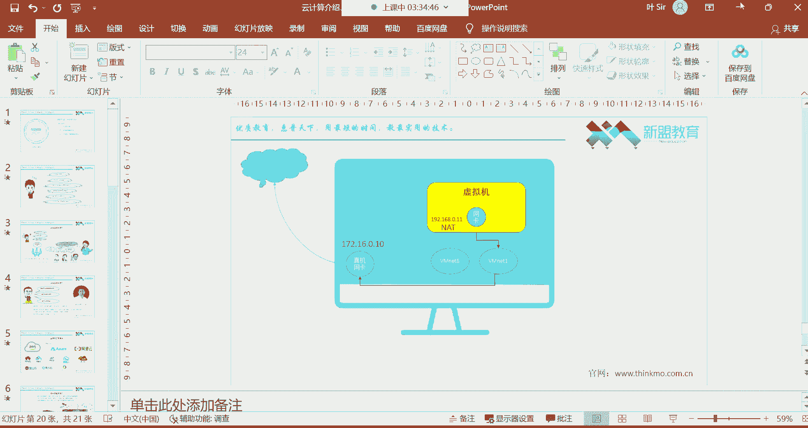

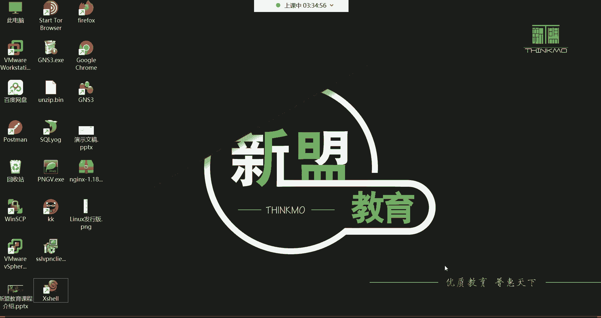

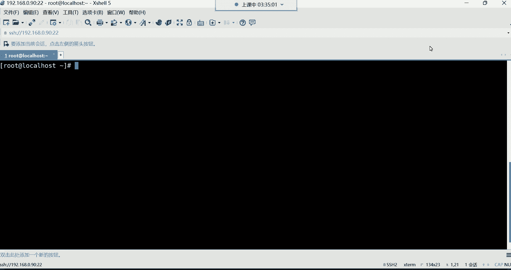

本节课中我们一起学习了以下内容：
1.  如何登录新安装的Linux系统。
2.  通过配置VMware虚拟网络编辑器和主机VMnet8网卡，搭建虚拟机网络环境。
3.  使用Xshell远程连接工具成功连接到Linux虚拟机，这是后续学习的操作基础。
4.  了解了高效学习Linux的方法，并系统认识了Linux广阔的应用领域、相关的职业发展路径以及不同IT岗位的特点。

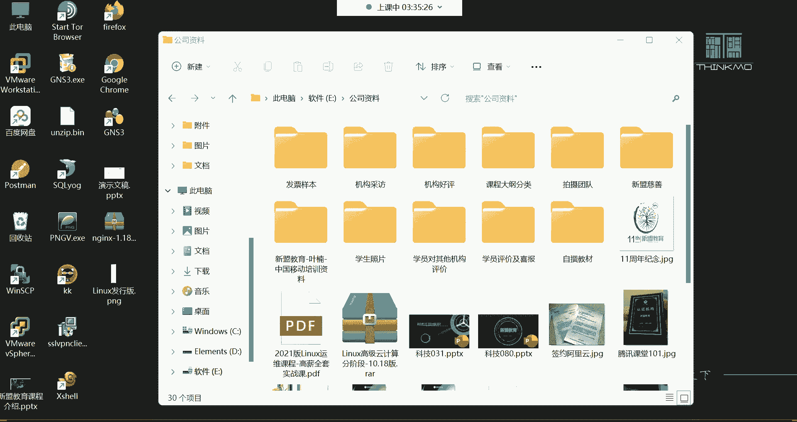

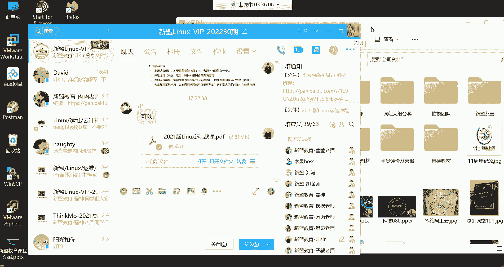

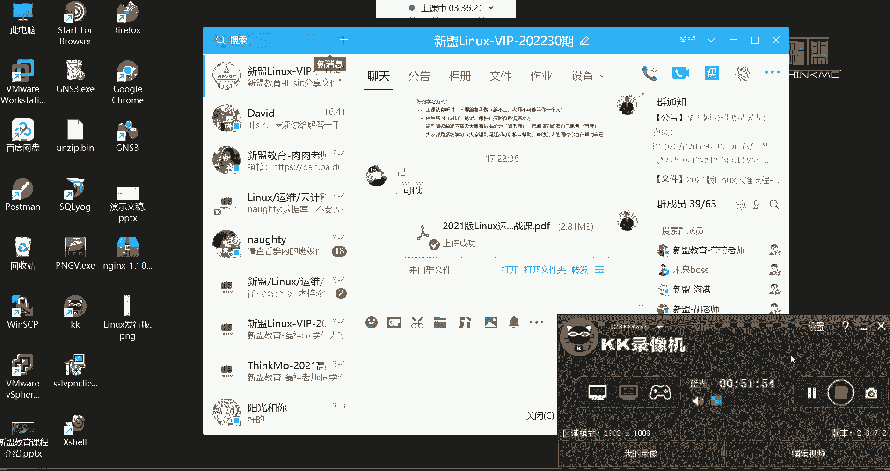

系统安装和网络配置是学习的基石，现在你已经拥有了一个可以随时练习的实验环境。从下节课开始，我们将正式进入Linux命令行的学习。