# Linux运维RHCSA+RHCE培训教程：P40：常用特殊符号补充 📚

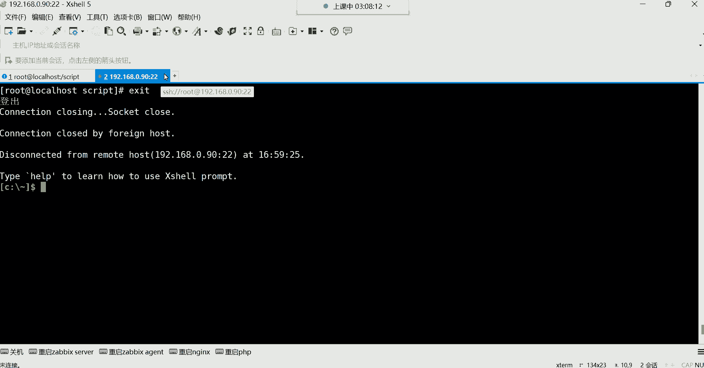

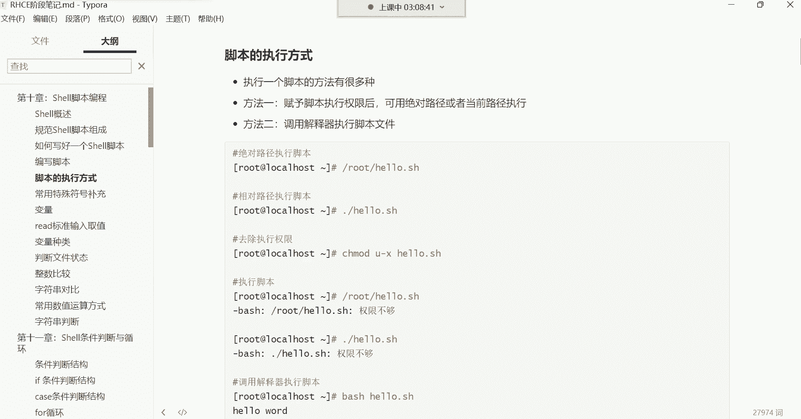

在本节课中，我们将要学习Shell脚本的两种执行方式，以及几个在脚本中常用的特殊符号。这些知识对于编写和理解Shell脚本至关重要。

## 脚本执行方式 🚀

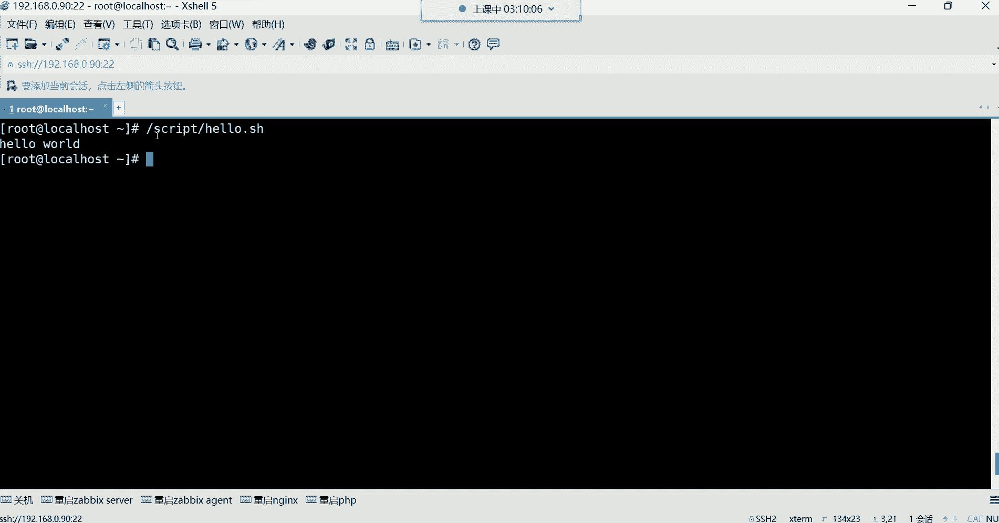

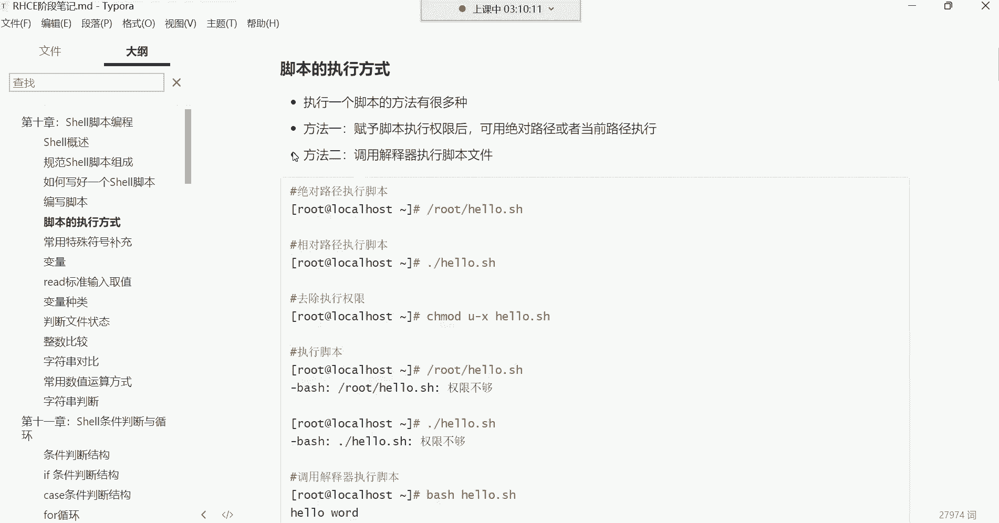

上一节我们介绍了如何编写Shell脚本，本节中我们来看看如何执行它。脚本的执行方式主要有两种。

### 赋予执行权限后执行

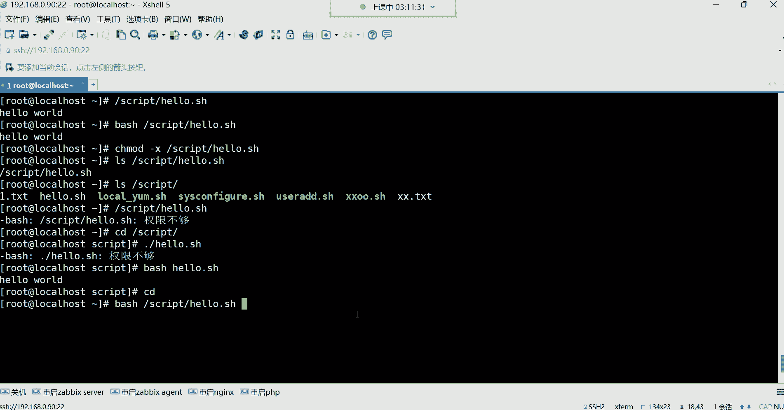

第一种方法是赋予脚本执行权限，然后使用绝对路径或相对路径去执行。这也是我们之前一直在使用的方法。

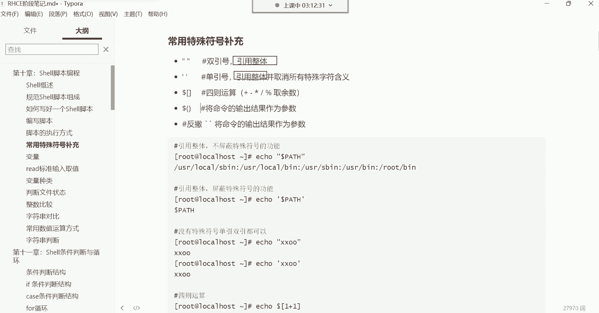

以下是具体步骤：

*   使用 `chmod +x` 命令为脚本文件添加执行权限。
*   使用相对路径执行时，必须在脚本名前加上 `./`，例如 `./hello.sh`。如果不加 `./`，系统会将其视为一条命令去查找，通常会提示“未找到命令”。
*   使用绝对路径执行时，直接指定脚本的完整路径即可，例如 `/root/hello.sh`。绝对路径前不需要加 `./`。

### 调用解释器执行

第二种方法是直接调用解释器（如bash）来执行脚本。这种方法即使脚本没有执行权限也可以运行。

以下是具体步骤：

*   使用 `bash` 命令后接脚本路径来执行，例如 `bash /root/hello.sh` 或 `bash ./hello.sh`。
*   这种方法不要求脚本文件本身具有执行权限。

常用的执行方式是第一种，即赋予权限后使用路径执行。调用解释器的方式一般使用较少。

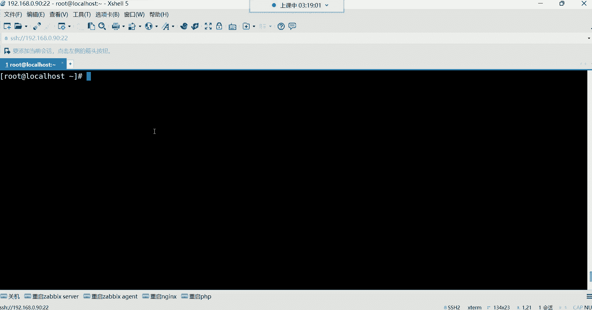

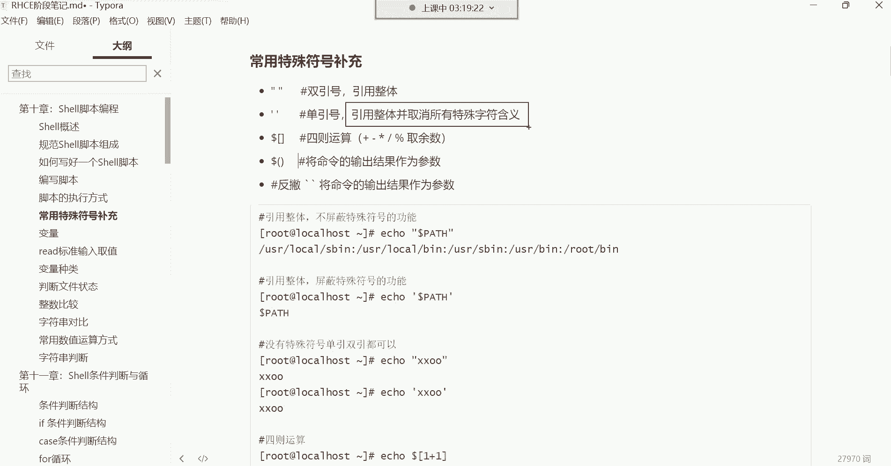

## 常用特殊符号：引号 🎯

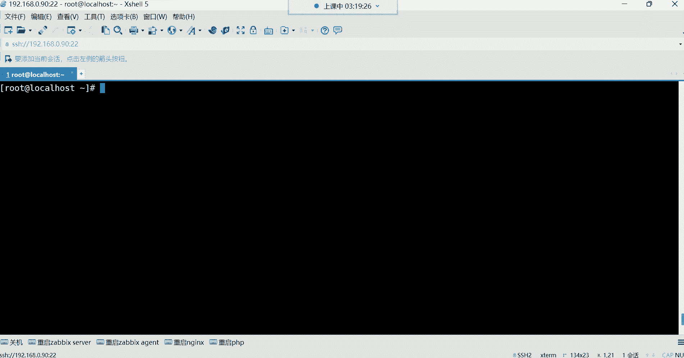

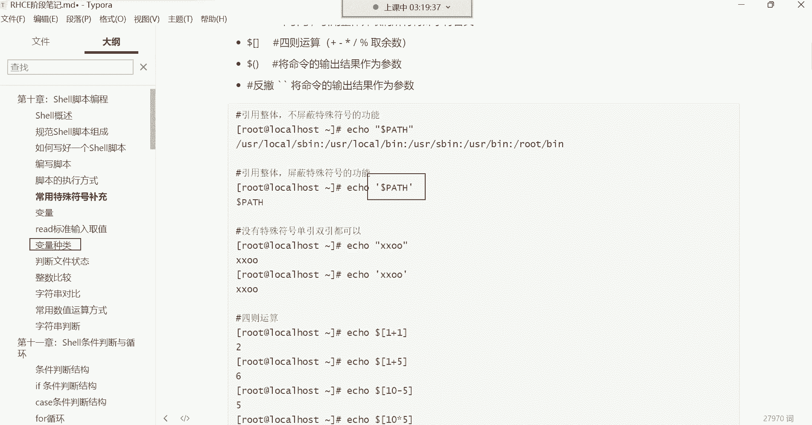

接下来，我们学习几个在Shell中非常重要的特殊符号。首先来看引号，包括双引号和单引号。

### 引号的核心功能：引用整体

引号的主要功能是将内容引用为一个“整体”。这意味着被引号包围的所有字符（包括空格、特殊符号）都会被系统视为一个单一的参数或字符串。

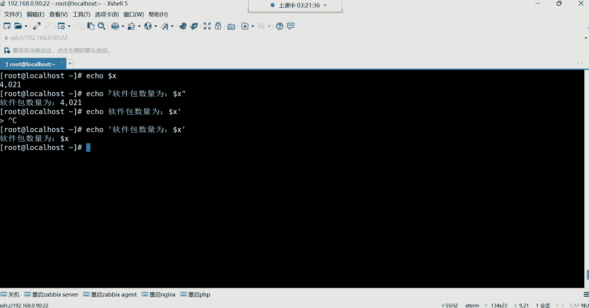

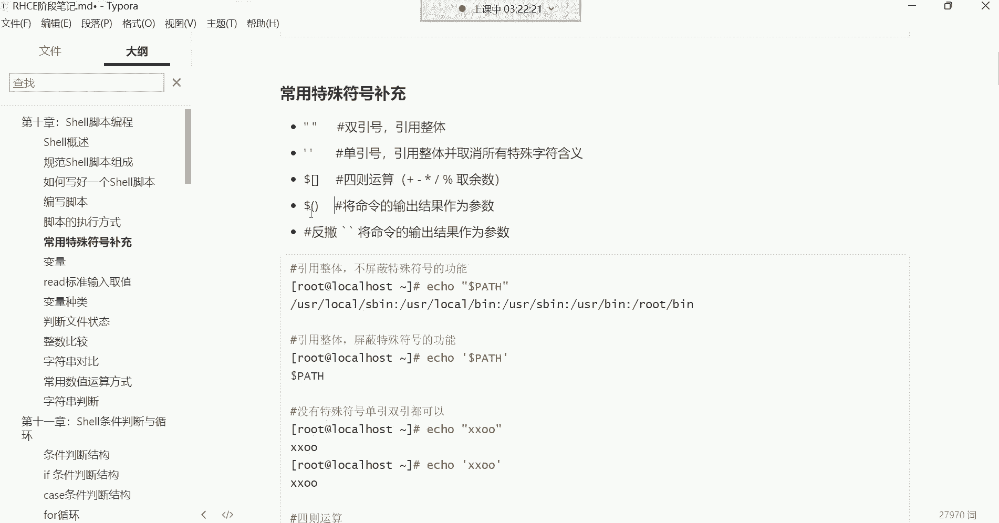

例如，在创建文件名包含空格的文件时，如果不使用引号，`touch A B` 会创建两个文件 `A` 和 `B`。而使用引号 `touch “A B”`，则会创建一个名为 `A B` 的文件。这个特性在删除此类文件时尤其需要注意，必须使用完整的带空格的文件名才能删除。

### 双引号与单引号的区别

虽然双引号和单引号都能引用整体，但它们有一个关键区别：**对特殊符号的处理方式不同**。

*   **双引号**：会保留大部分特殊符号（如 `$`， `\`， `!` 等）的原有含义。例如，`$变量名` 在双引号内会被解析为变量的值。
*   **单引号**：会取消所有特殊符号的含义，将其视为普通字符。例如，`$变量名` 在单引号内就是字面意义的“$变量名”这串字符。

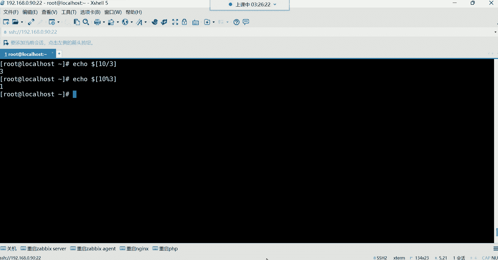

**公式/代码描述**：
```bash
name=“World”
echo “Hello $name”   # 输出：Hello World
echo ‘Hello $name‘   # 输出：Hello $name
```

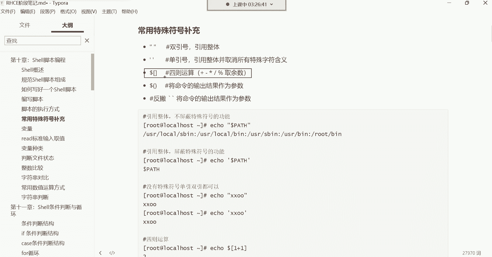

简单来说，当你需要变量或命令替换生效时，使用双引号；当你希望所有字符都原样输出时，使用单引号。

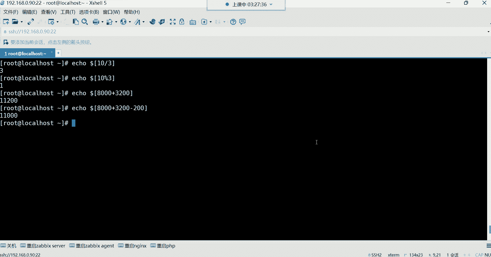

## 常用特殊符号：四则运算与取余 ➗

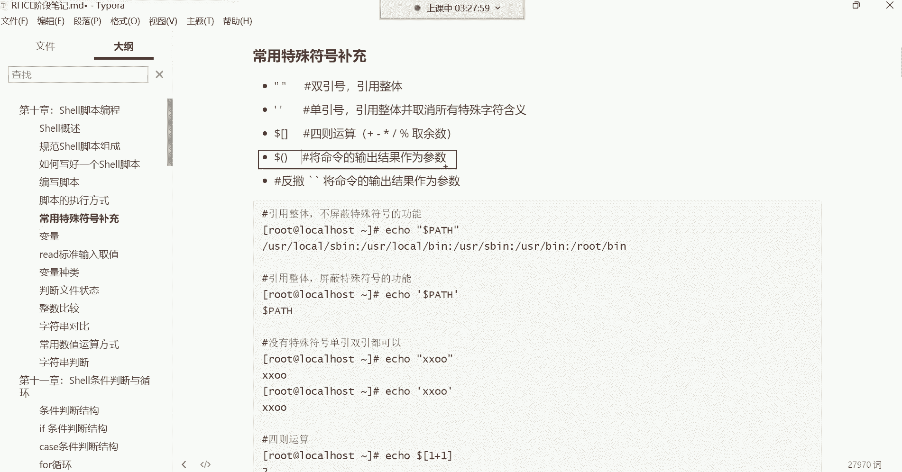

在Shell脚本中，我们也可以进行数学运算。本节中我们来看看如何进行基本的四则运算和取余操作。

### 使用 `$[]` 进行运算

我们可以使用 `$[]` 语法来进行算术运算，并通过 `echo` 命令输出结果。

**公式/代码描述**：
```bash
echo $[1 + 1]    # 加法，输出：2
echo $[5 - 2]    # 减法，输出：3
echo $[3 * 2]    # 乘法，输出：6 (注意：乘号是 *)
echo $[6 / 2]    # 除法，输出：3 (注意：除号是 /)
```

### 取余运算

取余运算使用百分号 `%`，它返回除法运算后的余数。

**公式/代码描述**：
```bash
echo $[10 % 3]   # 取余，输出：1 (因为10除以3等于3余1)
```
取余操作在后期编程中非常有用，例如可以用来控制数字的范围或判断奇偶性。

## 常用特殊符号：反引号与$() ⚙️

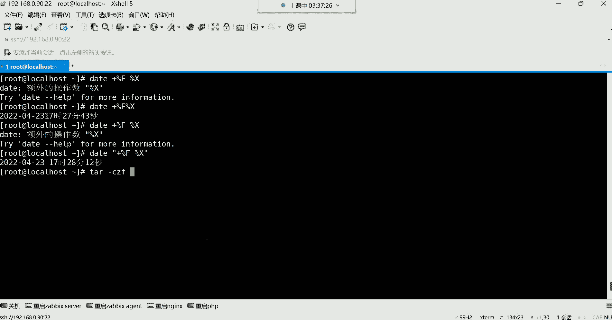

最后，我们学习一个非常强大且常用的符号，它能将命令的输出结果作为参数使用。

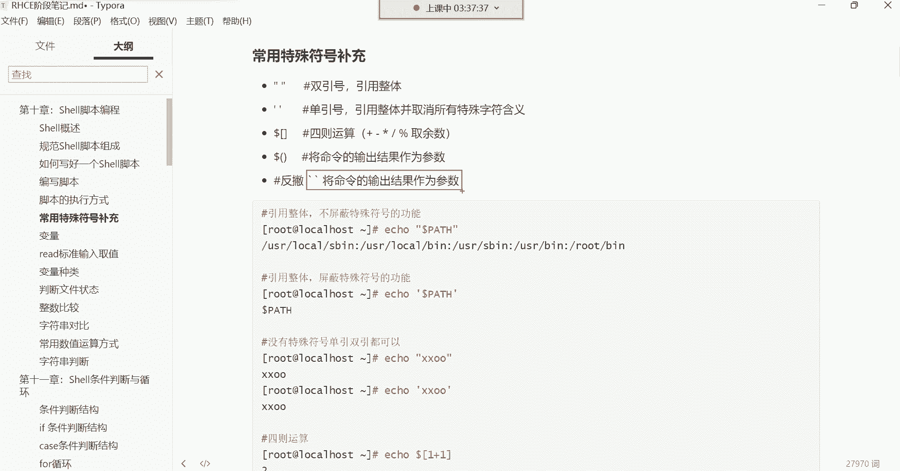

### 功能：命令替换

反引号 `` ` `` 和 `$()` 的功能完全相同，都是**命令替换**。它们的作用是：先执行反引号或 `$()` 内部的命令，然后将该命令的**标准输出结果**替换到当前位置。

这在需要动态生成文件名、路径或参数时极其有用。

**公式/代码描述**：
```bash
# 创建一个以当前日期时间为文件名的文件
touch report-`date +%F-%H-%M-%S`.txt
# 等价于
touch report-$(date +%F-%H-%M-%S).txt
```
执行后，会生成一个类似 `report-2023-10-27-14-30-15.txt` 的文件。

### 应用实例：备份文件

这个特性在自动化脚本中应用广泛，例如在备份文件时避免覆盖之前的备份。

**公式/代码描述**：
```bash
# 备份日志文件，并在备份文件名中加入时间戳
tar -czf /backup/log_backup_$(date +%Y%m%d_%H%M%S).tar.gz /var/log/*.log
```
这样，每次备份都会生成一个带有不同时间戳的文件名，如 `log_backup_20231027_143015.tar.gz`，从而完美避免了文件被覆盖的问题。

**注意**：如果命令替换的结果中包含空格，通常需要在外层用双引号引起来，将其作为一个整体参数。

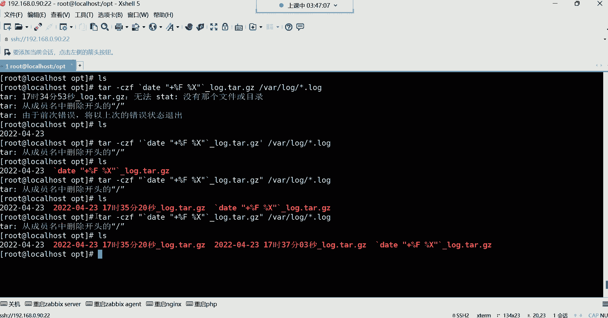

---

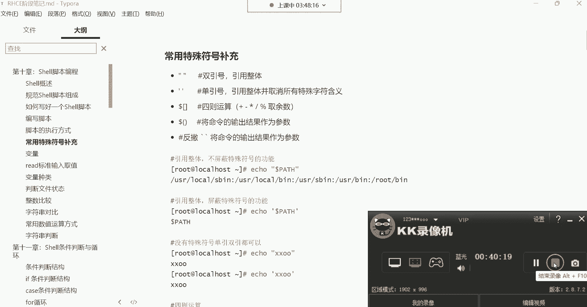

本节课中我们一起学习了Shell脚本的两种执行方式，以及双引号、单引号、四则运算和命令替换等关键的特殊符号。理解并熟练运用这些符号，是编写高效、健壮Shell脚本的基础。