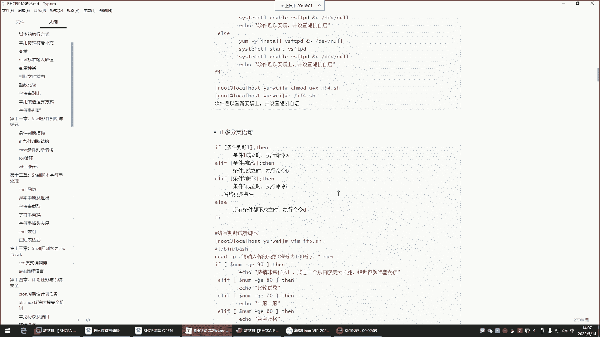
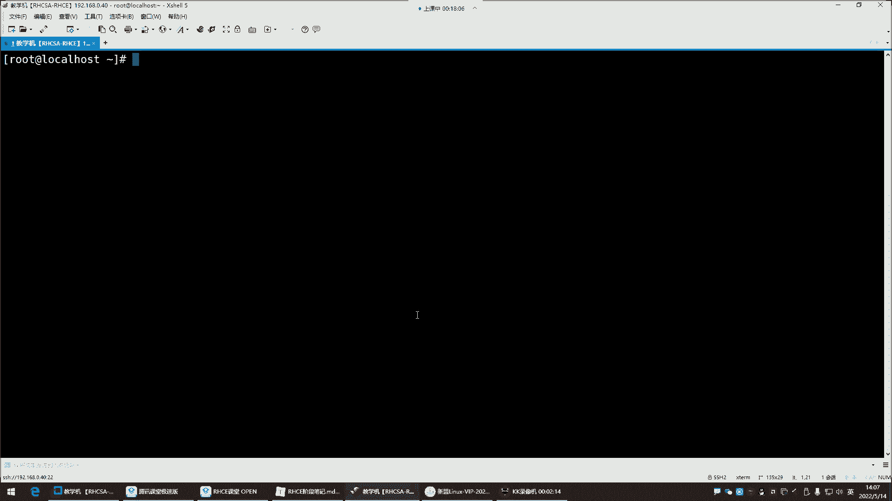
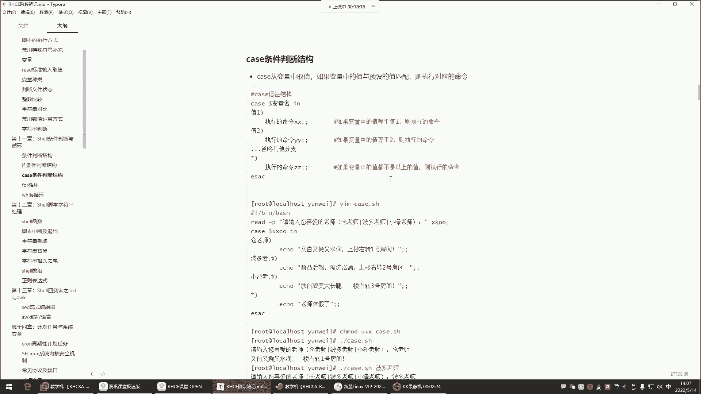
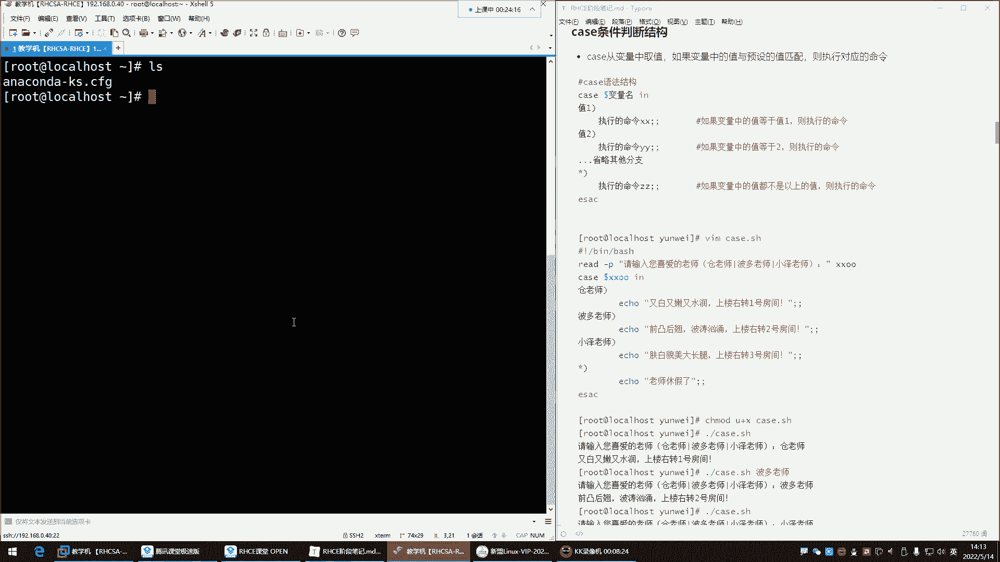
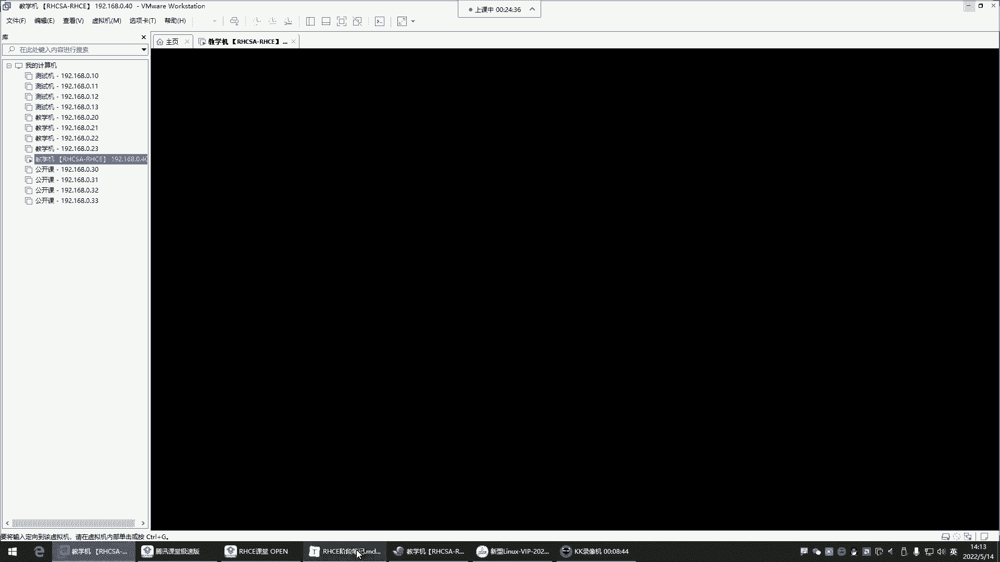
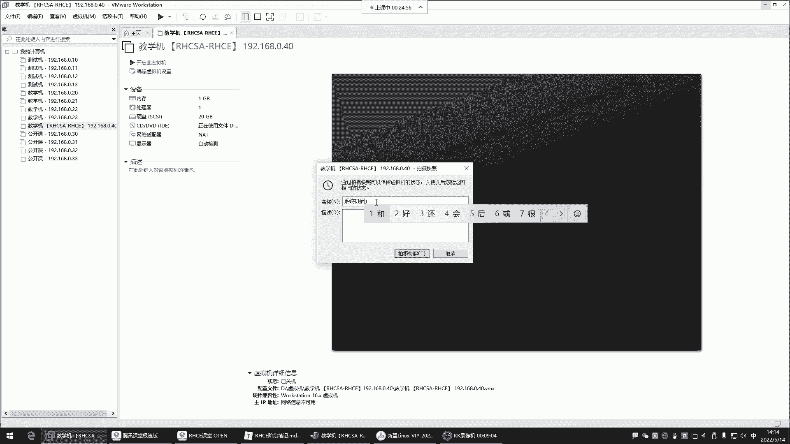
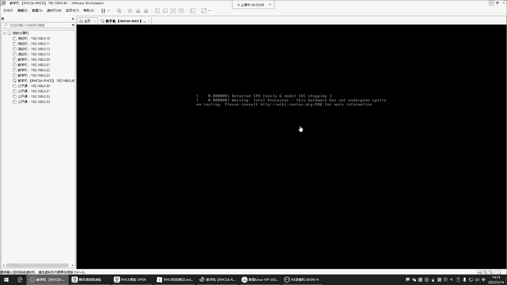
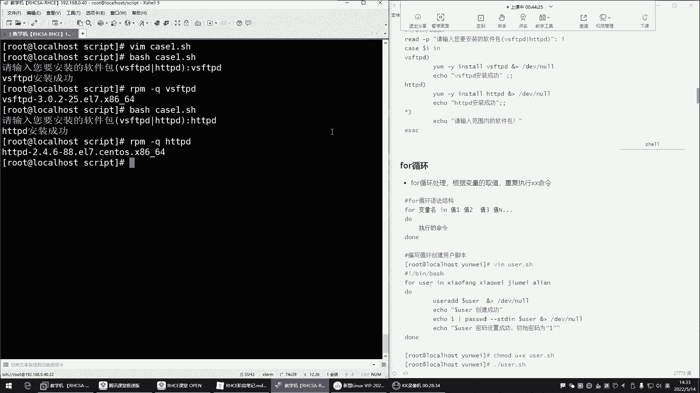
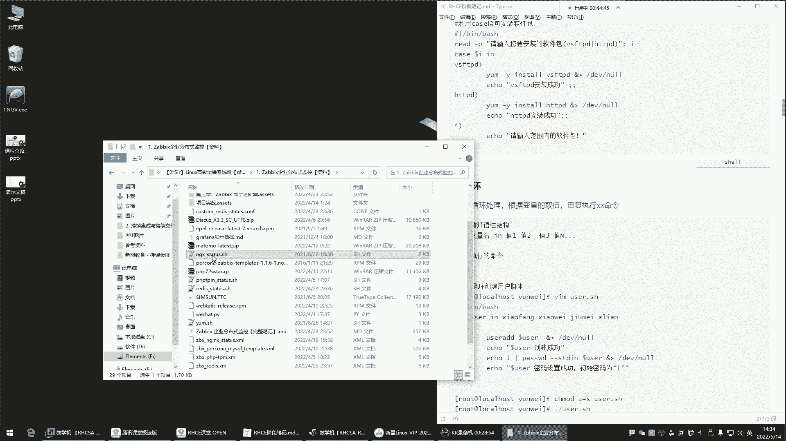
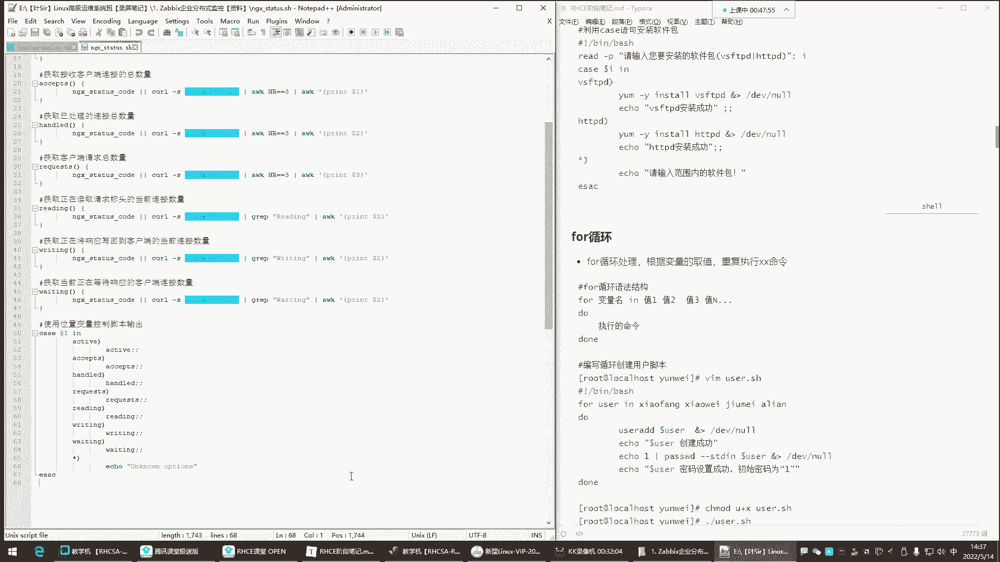

# Linux脚本编程：第7章：case条件判断与for循环







## 概述
在本节课中，我们将学习Shell脚本编程中的两个重要结构：`case`条件判断语句和`for`循环语句。我们将从`case`语句的语法和应用场景开始，理解它如何根据变量的值执行不同的命令分支。

---

## case条件判断

上一节我们介绍了`if`条件判断，本节中我们来看看另一种条件判断方式——`case`语句。`case`语句的功能相对`if`更简洁，它主要用于从变量中取值，并与预设的模式进行匹配，匹配成功则执行对应的命令。







其基本语法结构如下：
```bash
case 变量名 in
模式1)
    命令序列1
    ;;
模式2)
    命令序列2
    ;;
*)
    默认命令序列
    ;;
esac
```
在这个结构中，`case`会读取`变量名`中的值，并从上到下依次与`模式1`、`模式2`等进行匹配。一旦匹配成功，就会执行该模式对应的命令序列，然后结束整个`case`判断（匹配即停止）。如果所有模式都未匹配，则会执行星号`*`代表的默认命令序列。



以下是`case`语句的一个典型应用示例，它根据用户输入执行不同操作：
```bash
#!/bin/bash
read -p “请输入你喜欢的老师名字：” teacher
case $teacher in
    “苍老师”)
        echo “特点：又白又嫩又水润”
        echo “位置：上楼右转一号房间”
        ;;
    “波多老师”)
        echo “特点：前凸后翘，波涛汹涌”
        echo “位置：上楼右转二号房”
        ;;
    “小泽老师”)
        echo “特点：肤白貌美大长腿”
        echo “位置：上楼右转三号房”
        ;;
    *)
        echo “该老师今天休息。”
        ;;
esac
```
执行此脚本时，用户输入的值会被存入变量`teacher`。`case`语句将`$teacher`的值与各个模式进行匹配。例如，输入“小泽老师”会匹配第三个分支，输出对应的描述和位置。如果输入未列出的名字，则会匹配`*`分支，提示老师休息。

---

## for循环

掌握了`case`条件判断后，我们接下来学习`for`循环。`for`循环用于重复执行一系列命令，非常适合处理已知循环次数的任务。

`for`循环的基本语法是：
```bash
for 变量 in 值列表
do
    命令序列
done
```
执行时，变量会依次获取“值列表”中的每一个值，并执行一次`do`和`done`之间的命令序列。“值列表”可以是一组字符串，也可以是命令执行的结果。

以下是`for`循环的几种常见用法：

**1. 直接列出值**
```bash
for i in 1 2 3 4 5
do
    echo “数字是：$i”
done
```
这个循环会依次输出数字1到5。

**2. 使用命令生成值列表**
```bash
for file in $(ls /tmp)
do
    echo “/tmp目录下的文件：$file”
done
```
这个循环会列出`/tmp`目录下的所有文件名。

**3. 使用序列生成数字**
```bash
for i in {1..5}
do
    echo “循环次数：$i”
done
```
`{1..5}`会生成一个从1到5的数字序列。





**4. C语言风格的for循环**
```bash
for ((i=1; i<=5; i++))
do
    echo “这是第 $i 次循环”
done
```
这种写法更接近其他编程语言中的`for`循环，在括号内初始化变量、设置循环条件和更新变量。

---



## 总结
本节课中我们一起学习了Shell脚本中的`case`条件判断和`for`循环。
*   `case`语句根据变量的值进行模式匹配，语法简洁，适用于多分支选择场景。
*   `for`循环用于重复执行命令，可以通过多种方式（直接列表、命令输出、序列生成、C语言风格）定义循环范围。
结合使用这些结构，可以编写出功能更强大、更自动化的Shell脚本。