# Linux脚本编程：44：case条件判断与for循环

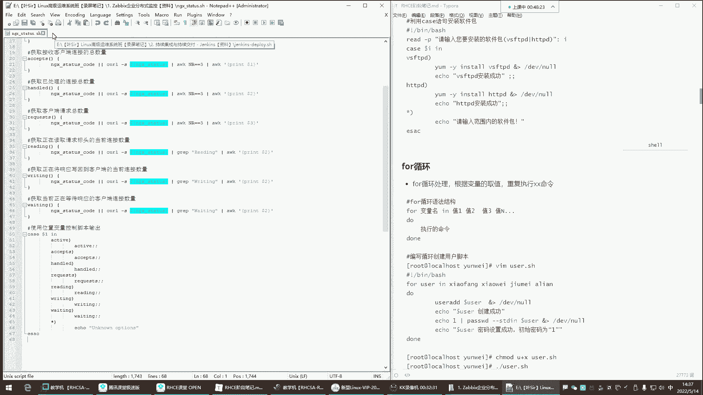


在本节课中，我们将学习Shell脚本编程中的两个重要结构：`case`条件判断语句和`for`循环语句。通过学习，你将能够理解它们的基本语法、应用场景，并能够编写简单的脚本来实现自动化任务。

## 概述：条件判断与循环处理

上一节我们介绍了基础的脚本编写和变量使用。本节中，我们来看看两种更强大的流程控制工具。`case`语句用于基于不同条件执行不同命令，而`for`循环则用于重复执行一系列命令，两者都是自动化运维脚本中的核心。

## case条件判断语句

`case`语句是一种多分支选择结构，它根据变量的值匹配不同的模式，并执行相应的命令块。其功能类似于多个`if-elif-else`语句的简化版，但在处理多个固定选项时更加清晰和高效。

### 基本语法

`case`语句的基本语法结构如下：
```bash
case 变量 in
模式1)
    命令序列1
    ;;
模式2)
    命令序列2
    ;;
*)
    默认命令序列
    ;;
esac
```
当`变量`的值与某个`模式`匹配时，就会执行该模式对应的命令序列。`;;`表示一个模式块的结束。`*)`是一个通配符模式，匹配所有其他情况，作为默认操作。

### 执行流程

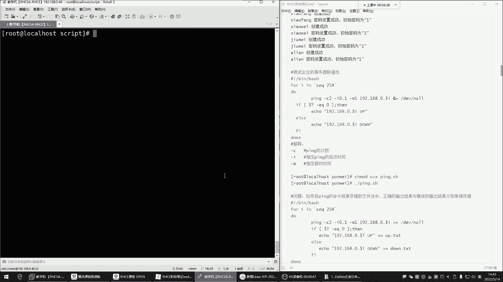

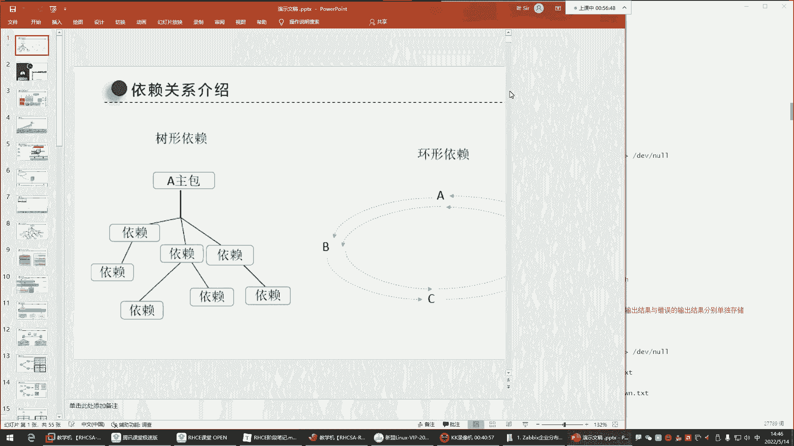


在执行脚本时，需要给`case`语句中的变量传递一个值。脚本会根据这个值去匹配各个模式。如果匹配成功，则执行该模式下的指令；如果所有模式都不匹配，则执行默认（`*）`）模式下的指令。

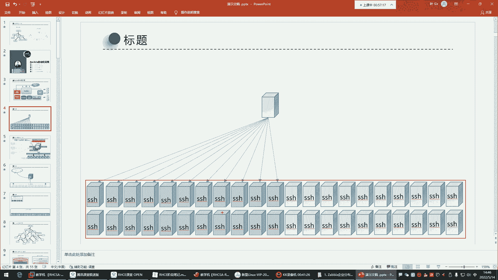

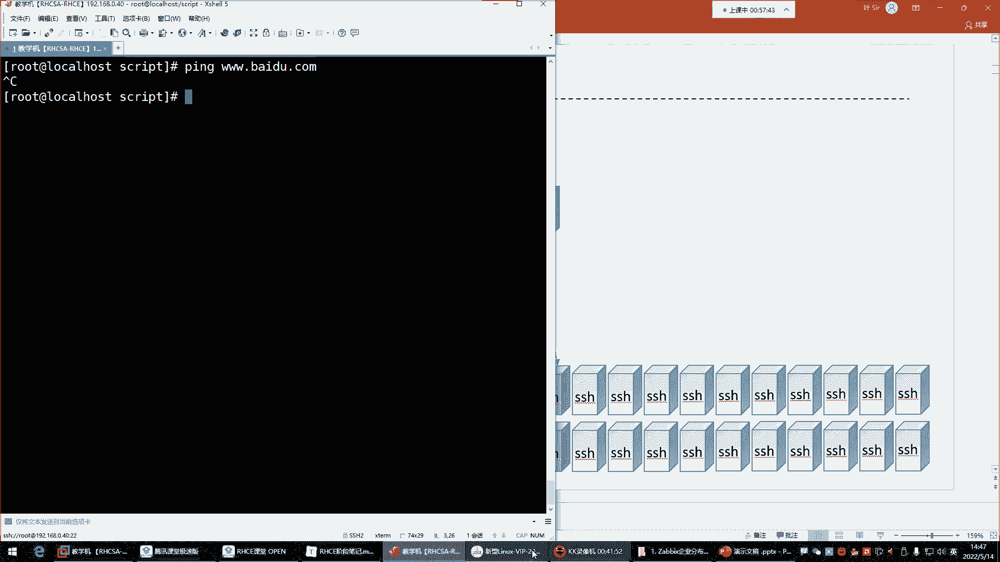

## 函数简介

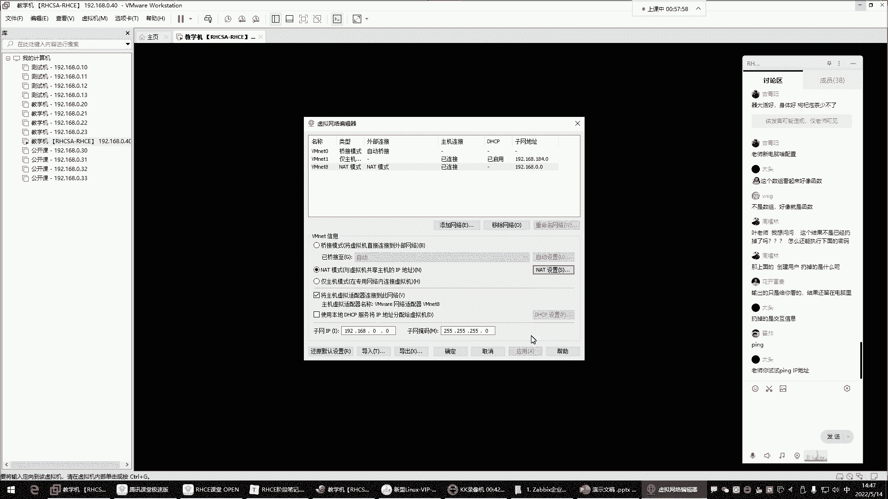

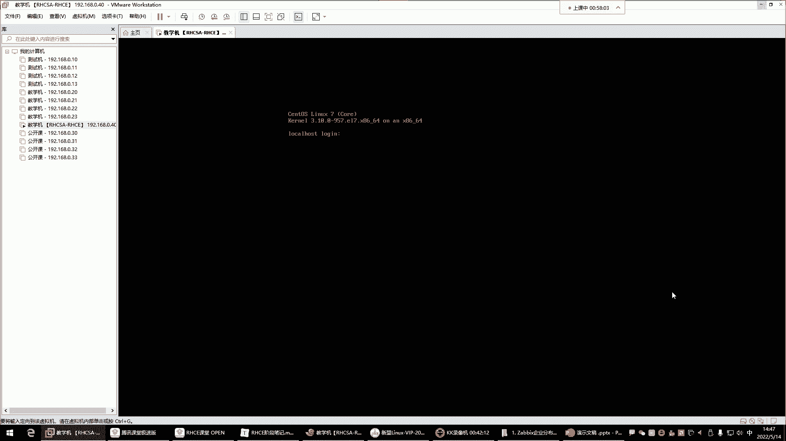

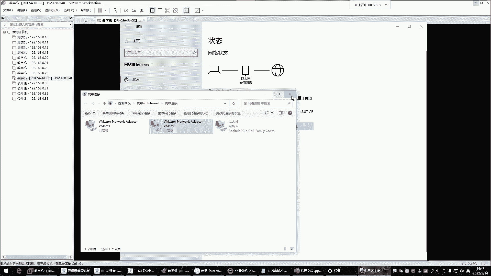

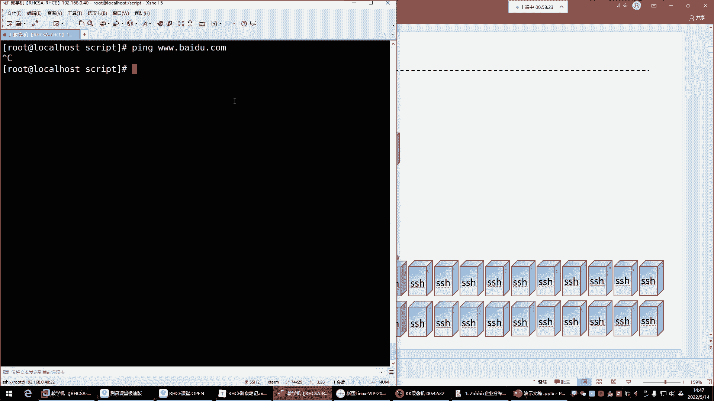

在继续学习循环之前，我们先简单了解一个相关概念：函数。函数用于给一组命令定义别名，以便重复调用。这有助于将脚本模块化，提高代码的复用性和可读性。我们将在后续课程中详细讲解。

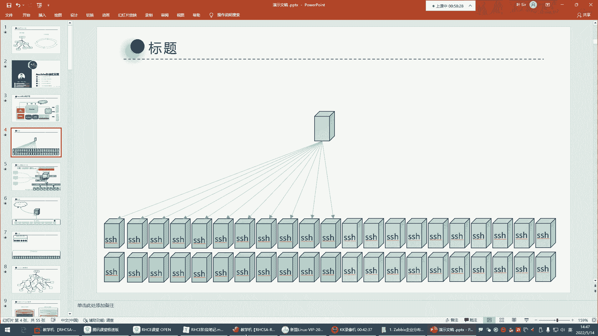

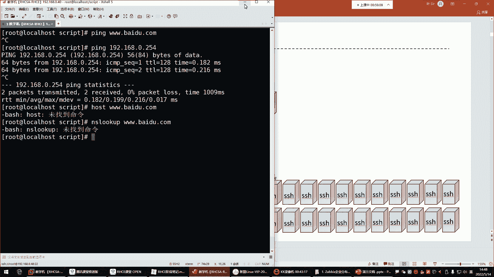

## for循环语句

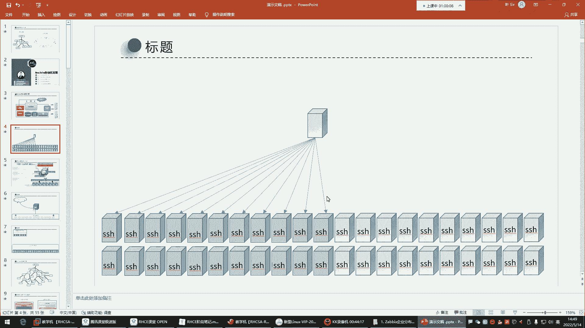

理解了`case`语句后，我们来看看`for`循环。`for`循环的核心功能是循环处理，即根据变量取值重复执行某些命令。这在需要批量操作时非常有用。


### 基本概念与语法

`for`循环对变量中的值进行遍历，每取一个值，就执行一次循环体中的命令。其基本语法为：
```bash
for 变量名 in 值列表
do
    命令序列
done
```
循环会依次将`值列表`中的每个值赋给`变量名`，然后执行`do`和`done`之间的命令序列。当列表中的所有值都被遍历后，循环结束。

### 实践演示：批量创建用户

以下是`for`循环的一个典型应用：批量创建用户。

1.  首先，我们创建一个脚本文件 `for_user.sh`。
2.  在脚本中写入以下内容：
    ```bash
    #!/bin/bash
    for user in xiaofang xiaowei jiumei alian
    do
        useradd $user 2>/dev/null
        echo "$user 创建成功。"
        echo "1" | passwd --stdin $user 2>/dev/null
        echo "$user 密码设置成功。"
    done
    ```
3.  给脚本添加执行权限并运行：
    ```bash
    chmod +x for_user.sh
    ./for_user.sh
    ```
    执行后，脚本会循环创建列表中的四个用户并为其设置密码。

### 循环执行过程详解

以上述脚本为例，循环的执行过程如下：
1.  第一次循环：变量`user`的值为`xiaofang`。执行循环体，创建用户`xiaofang`并设置密码。
2.  本次循环结束，回到`in`关键字后检查下一个值。
3.  第二次循环：变量`user`的值变为`xiaowei`。执行循环体，创建用户`xiaowei`并设置密码。
4.  如此反复，直到列表`xiaofang xiaowei jiumei alian`中的所有值都被处理完毕，整个`for`循环结束。

## for循环进阶应用：测试服务器连通性

`for`循环的另一个常见用途是批量测试网络中主机的连通性，这对于系统管理员监控服务器状态非常实用。

### 场景与思路

假设你需要维护一个网段（例如192.168.0.0/24）内的所有服务器。为了快速找出其中离线的主机，可以编写一个脚本，让`for`循环自动遍历该网段的所有IP地址，并使用`ping`命令进行测试。

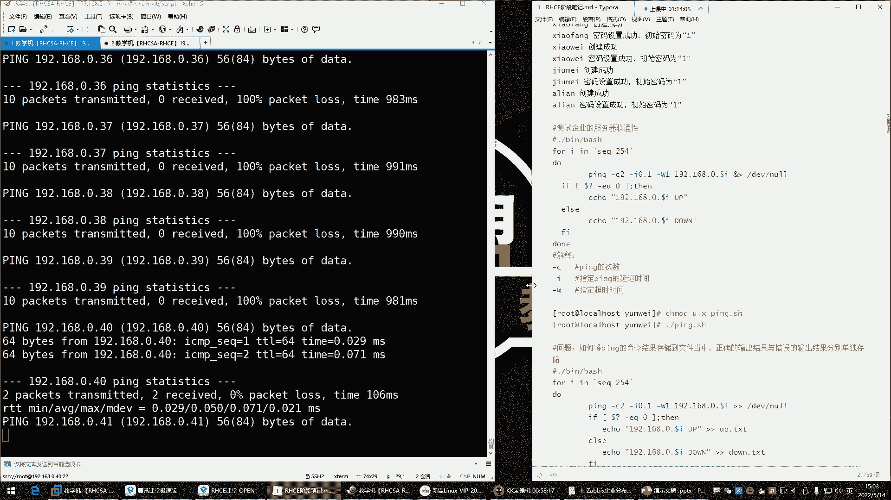

### 基础脚本与问题

一个初步的脚本可能如下所示：
```bash
#!/bin/bash
for ip in 192.168.0.{1..254}
do
    ping $ip
done
```
但直接运行此脚本会遇到问题：`ping`命令如果不加参数，会一直尝试连接，导致脚本卡住，无法自动遍历下一个IP。

### 优化脚本

为了解决上述问题，我们需要控制`ping`命令的行为，并优化输出结果。

以下是优化后的脚本 `ping_test.sh`：
```bash
#!/bin/bash
for ip in 192.168.0.{1..254}
do
    # 使用-c控制ping的次数，-i控制间隔，-w控制超时时间
    ping -c 2 -i 0.1 -w 1 $ip &>/dev/null
    # 判断上一条命令（ping）的返回值，0表示成功（主机在线）
    if [ $? -eq 0 ]; then
        echo "$ip is UP."
    else
        echo "$ip is DOWN."
    fi
done
```
**脚本解析：**
*   `ping -c 2 -i 0.1 -w 1 $ip &>/dev/null`：向目标IP发送2个探测包(`-c 2`)，间隔0.1秒(`-i 0.1`)，等待1秒超时(`-w 1`)。`&>/dev/null`将命令的所有输出（包括正确和错误）重定向到“黑洞”，不在屏幕显示。
*   `$?` 是一个特殊变量，代表上一条命令的退出状态。在Linux中，命令成功执行通常返回0，失败返回非0值。
*   `[ $? -eq 0 ]` 是一个条件测试，判断`ping`命令的返回值是否等于(`-eq`)0。
*   `if...then...else...fi` 根据判断结果输出相应主机的状态。

### 再次优化：结果分类保存

对于大量主机的测试，将结果直接输出到屏幕仍然不够清晰。更好的做法是将在线和离线的主机信息分别保存到文件中，并让脚本在后台运行。

最终优化脚本 `ping_final.sh`：
```bash
#!/bin/bash
for ip in 192.168.0.{1..254}
do
    ping -c 2 -i 0.1 -w 1 $ip &>/dev/null
    if [ $? -eq 0 ]; then
        echo "$ip" >> /opt/net_up.txt
    else
        echo "$ip" >> /opt/net_down.txt
    fi
done
```
**执行方式：**
```bash
# 添加执行权限
chmod +x ping_final.sh
# 在后台运行脚本
./ping_final.sh &
```
运行后，你可以通过查看 `/opt/net_up.txt` 和 `/opt/net_down.txt` 文件来快速了解所有服务器的在线状态。

### 值列表的另一种生成方式

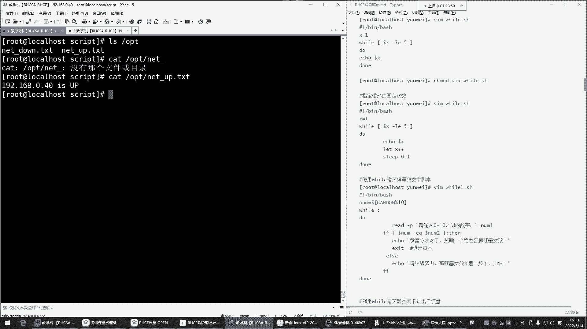

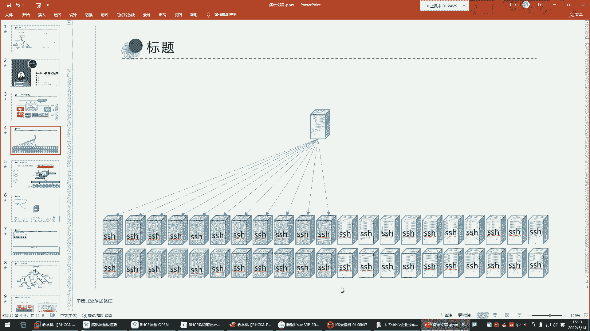

在定义要循环的IP列表时，除了使用`{1..254}`这种大括号展开的方式，还可以使用`seq`命令：
```bash
for i in $(seq 1 254)
do
    ping 192.168.0.$i ...
done
```
`$(seq 1 254)` 的作用是生成一个从1到254的数字序列，其效果与 `{1..254}` 相同。

## 总结

本节课中我们一起学习了Shell脚本中两个强大的流程控制结构。
1.  **case条件判断**：用于基于一个变量的不同取值来执行对应的命令序列，结构清晰，适合多分支选择。
2.  **for循环**：用于对一组值进行遍历，并重复执行循环体内的命令。我们通过**批量创建用户**和**测试服务器连通性**两个案例，详细探讨了`for`循环的语法、执行流程以及在实际运维中的典型应用和优化技巧。

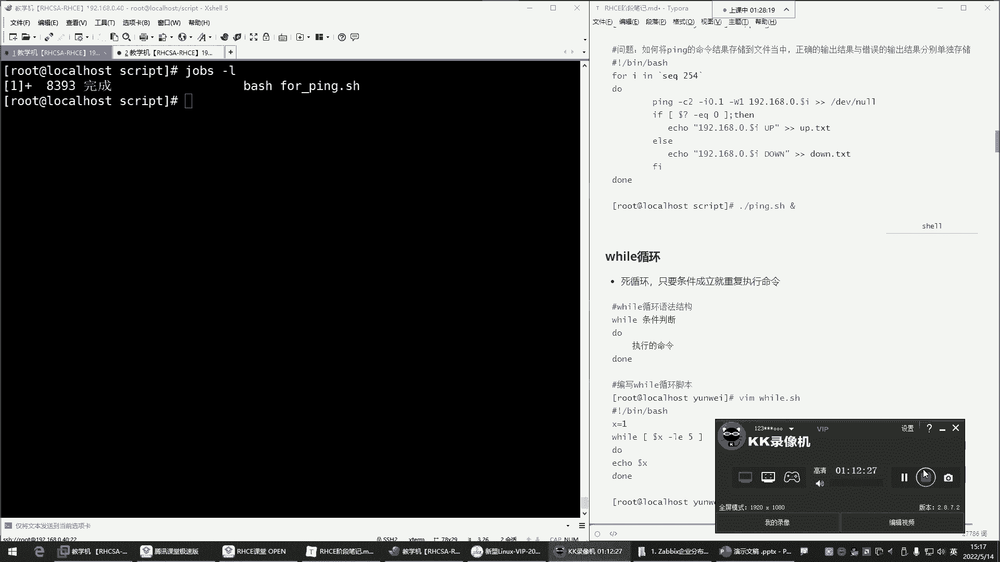

掌握这两种结构，将极大增强你编写自动化脚本的能力。下一节，我们将学习另一种循环——`while`循环。