# Linux运维：P46：Shell函数、脚本中断退出及字符串处理

在本节课中，我们将学习Shell脚本中的三个重要概念：**函数**、**脚本中断与退出控制**以及**字符串处理**。掌握这些知识能让你的脚本更加高效、灵活和易于维护。

## 循环的持续监控应用

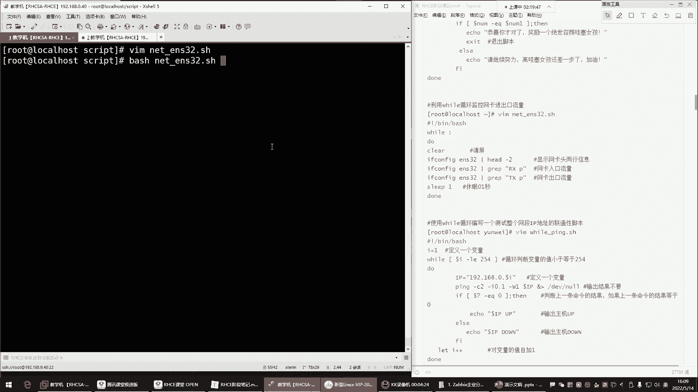

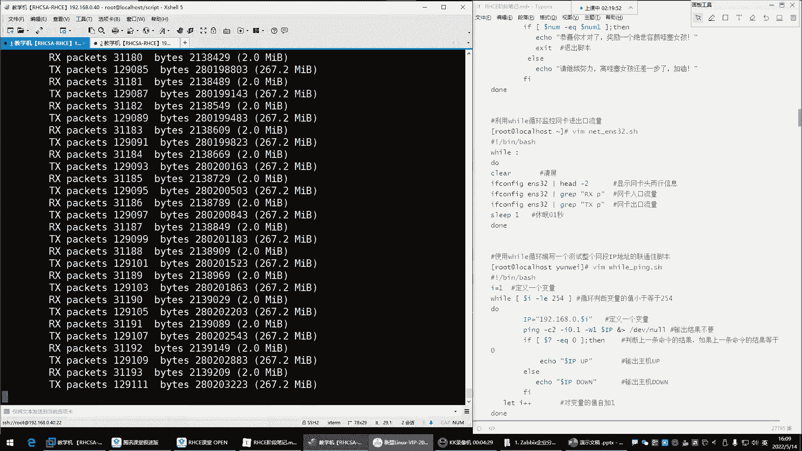

上一节我们介绍了循环的基本语法，本节中我们来看看如何利用`while`循环进行持续监控。

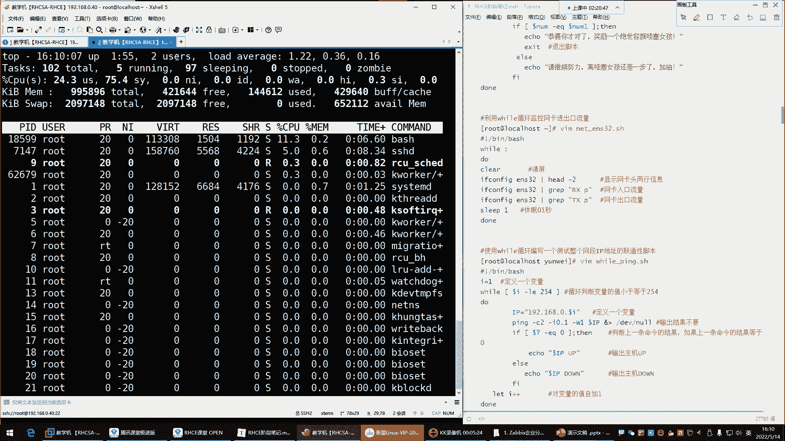

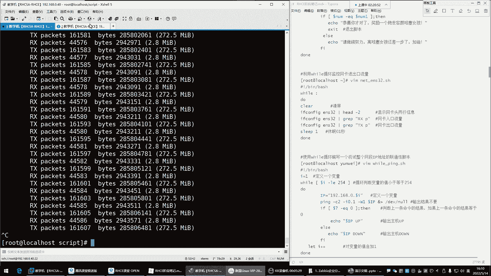

很多情况下，我们需要使用`while`循环来持续执行某些任务，例如监控网卡流量、内存或CPU使用率。这种监控通常没有明确的结束条件，因此需要使用死循环。

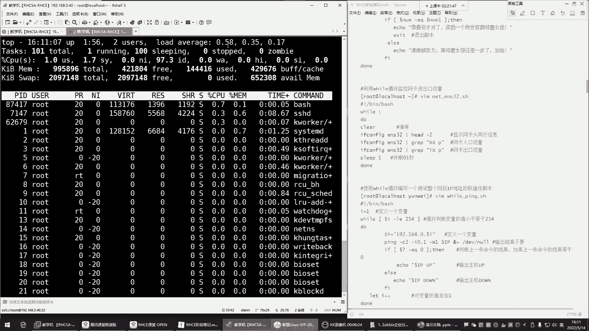

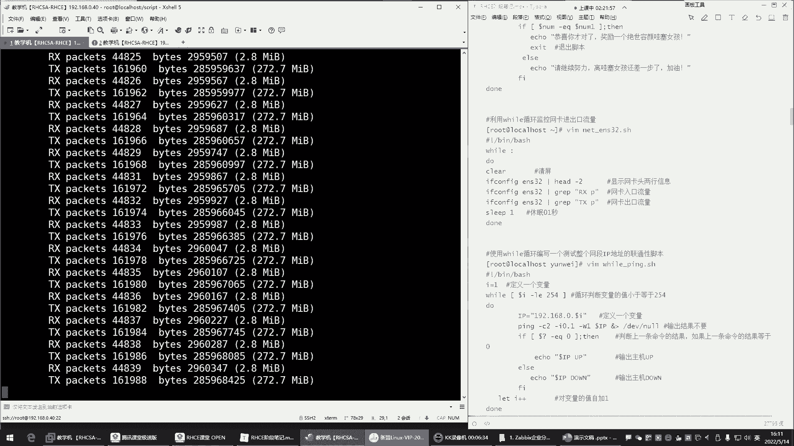

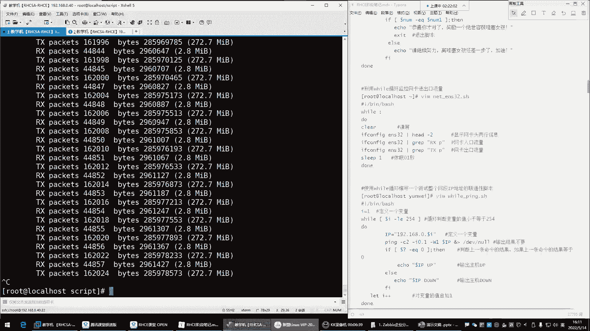

以下是编写一个监控脚本的基本步骤：

1.  **脚本开头**：使用`#!/bin/bash`指定解释器。
2.  **死循环语法**：可以使用`while :`、`while true`或`while ((1))`来创建死循环。
3.  **获取监控数据**：在循环体内，使用命令获取需要监控的数据。例如，使用`ifconfig`命令获取网卡流量信息。
4.  **提取关键信息**：通过管道`|`和`grep`命令过滤出所需的数据行，如接收流量`RX`和发送流量`TX`。
5.  **控制循环频率**：纯粹的`while`死循环会极度消耗CPU资源。使用`sleep`命令让脚本在每次循环后暂停一段时间（如0.2秒），可以显著降低CPU占用。
6.  **优化显示**：在循环开始时使用`clear`命令清屏，可以让每次的输出信息更清晰，便于观察。

**示例脚本核心结构**：
```bash
#!/bin/bash
while :
do
    clear
    # 获取并显示入口流量
    ifconfig ens33 | grep “RX”
    # 获取并显示出口流量
    ifconfig ens33 | grep “TX”
    sleep 0.2
done
```

**注意**：`while`循环也可用于实现类似`for`循环的计数功能，但通常更推荐使用`for`循环来处理有明确范围的任务。

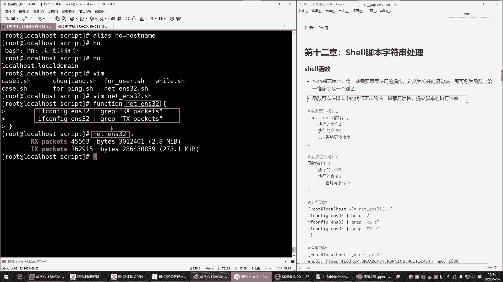

## 函数：代码复用的利器

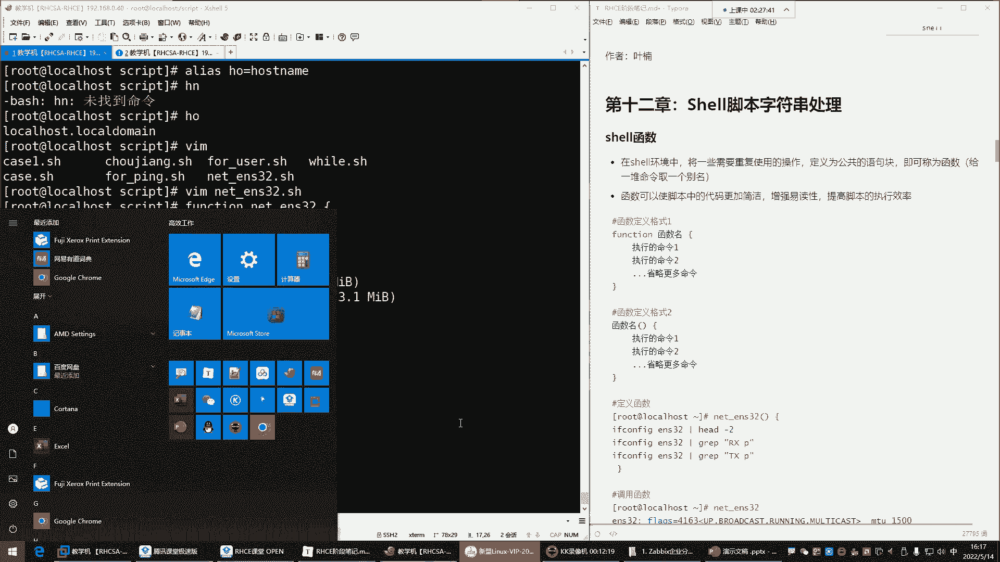

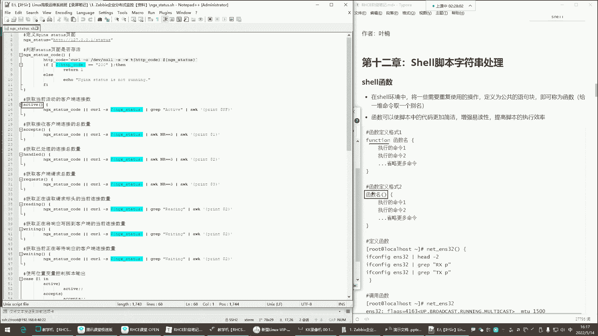

在Shell环境中，函数可以将一系列需要重复使用的操作封装成一个公共的语句块。你可以将其理解为**给一堆命令取一个别名**。

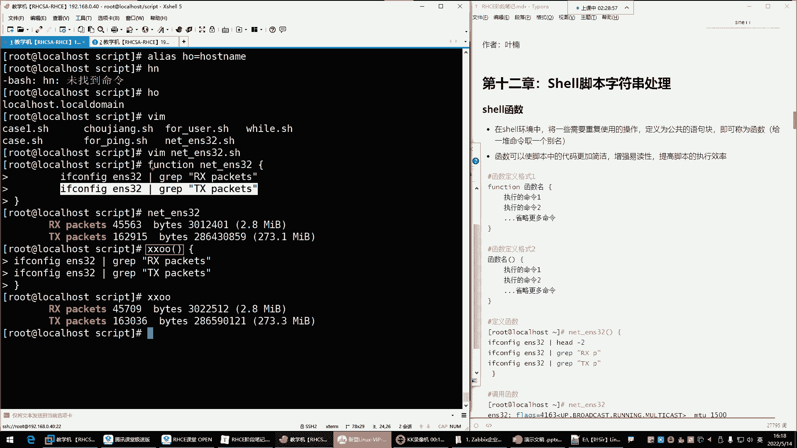

与之前学过的`alias`（为单条命令起别名）不同，函数可以封装多条命令。使用函数可以使脚本代码更加简洁，增强可读性，并提高执行效率。

函数有两种常见的定义格式：

1.  **使用 `function` 关键字**：
    ```bash
    function 函数名 {
        命令1
        命令2
        ...
    }
    ```

2.  **更简洁的格式（推荐）**：
    ```bash
    函数名() {
        命令1
        命令2
        ...
    }
    ```

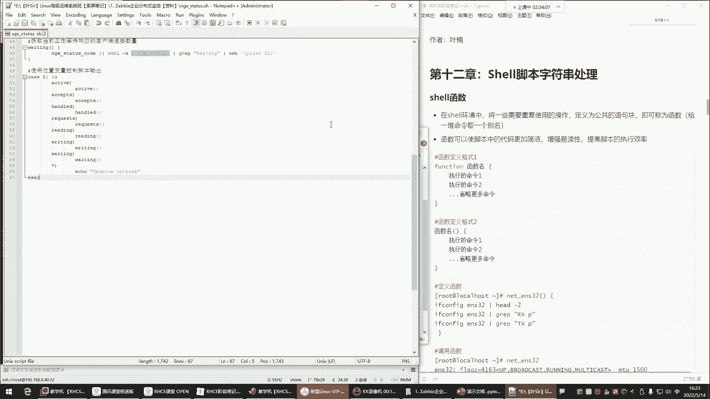

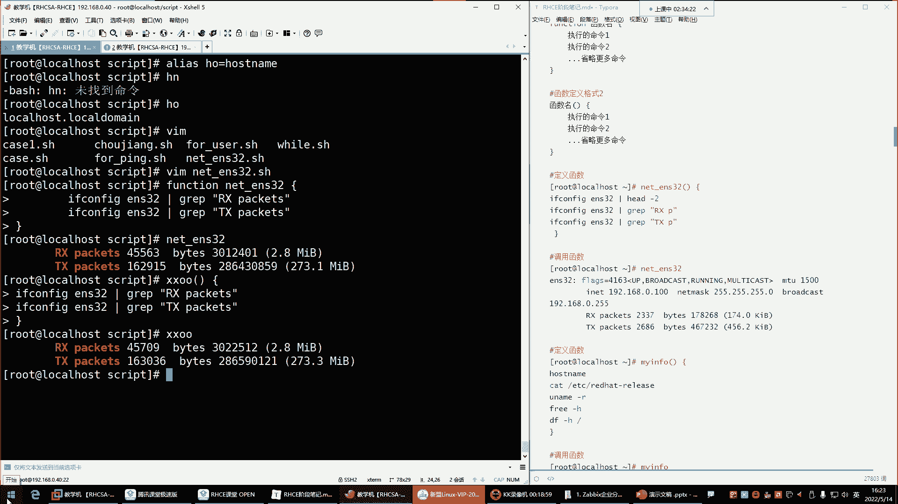

定义函数后，在脚本中需要执行这些命令时，只需调用函数名即可。

**示例**：定义一个显示系统信息的函数。
```bash
sys_info() {
    hostname
    cat /etc/redhat-release
    free -h
    df -h /
}
```
之后，执行`sys_info`命令，就会依次运行函数内的所有命令。

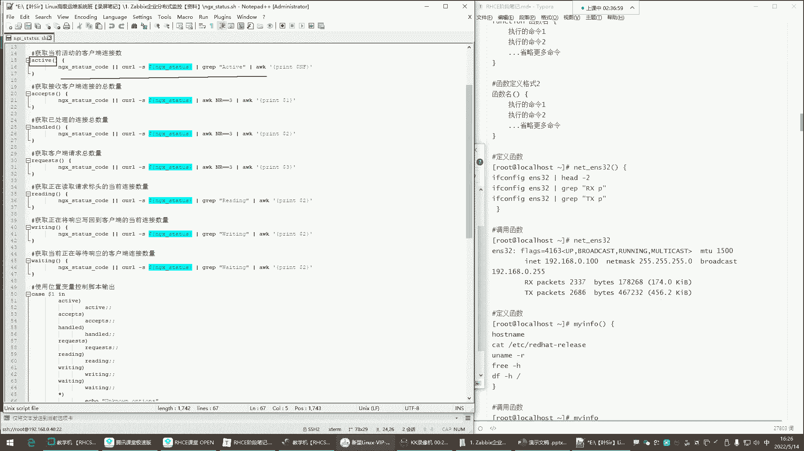

函数通常定义在脚本中，而不是直接在命令行中使用。在复杂的脚本里，函数可以被多次调用，甚至在一个函数内部调用另一个函数，这极大地提升了代码的模块化和可维护性。

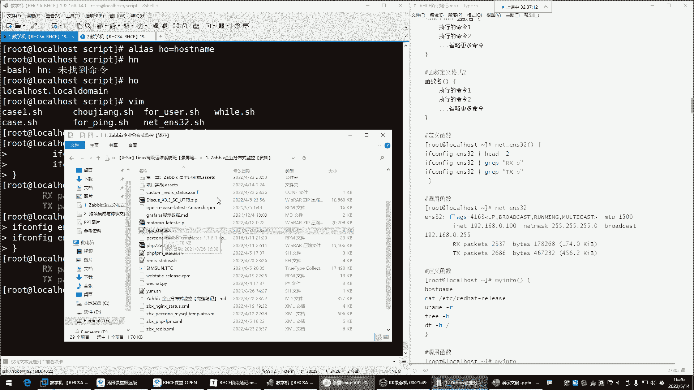

## 脚本的中断与退出控制

在脚本执行过程中，有时我们需要根据条件提前结束循环或整个脚本。这就需要用到流程控制命令：`continue`、`break`和`exit`。

以我们之前的一个抽奖脚本为例，即使用户猜对了，脚本也会继续运行，这是因为脚本没有在满足条件时被告知退出。

以下是三个控制命令的作用和区别：

*   **`continue`**：**结束本次循环**，跳过循环体内`continue`之后的所有命令，直接进入下一次循环。
*   **`break`**：**结束整个循环**，跳出当前所在的循环体，继续执行循环之后的命令。
*   **`exit`**：**退出整个脚本**，立即终止脚本的执行。

**示例场景**：在一个`for`循环中，当循环变量等于特定值（例如3）时，我们进行不同的控制。
```bash
for i in {1..5}
do
    if [ $i -eq 3 ]; then
        # 使用 continue, break 或 exit
        # continue # 跳过第三次循环，输出1 2 4 5
        # break    # 结束整个循环，输出1 2
        exit       # 退出整个脚本，输出1 2
    fi
    echo $i
done
echo “循环外的命令”
```
通过合理地使用这些命令，可以让脚本的逻辑更加清晰和智能。

## 字符串处理基础

在使用脚本进行任务处理时，经常需要对命令输出的字符串进行过滤和提取。字符串截取是其中一项基本操作。

虽然字符串处理功能强大，但在初学阶段，我们仅需了解其基本概念和简单用法。

**示例**：截取字符串中的一部分。
假设我们有一个变量存储了手机号：
```bash
phone=“13800138000”
```
我们可以使用`${变量名:起始位置:长度}`的格式来截取子串。**起始位置从0开始计算**。

*   获取前三位（区号）：
    ```bash
    echo ${phone:0:3} # 输出 138
    ```
*   从第4位开始，获取4位数字：
    ```bash
    echo ${phone:3:4} # 输出 0013
    ```
此外，`${#变量名}`可以获取字符串的长度。
```bash
echo ${#phone} # 输出 11
```
字符串处理还包含替换、删除等多种操作，在需要处理复杂文本时非常有用，初学者可先掌握基础截取方法。

## 课程总结

本节课中我们一起学习了Shell脚本编程中的三个核心进阶主题。

1.  我们探讨了如何利用**`while`死循环**结合`sleep`命令实现持续监控任务，并优化其显示效果。
2.  我们引入了**函数**的概念，学习了如何将多条命令封装成一个可复用的代码块，从而使脚本结构更清晰、更易于维护。
3.  我们掌握了**脚本中断与退出**的控制命令`continue`、`break`和`exit`，它们能帮助我们在满足特定条件时精确控制脚本的执行流程。
4.  最后，我们简单了解了**字符串处理**的基础操作，特别是字符串截取的方法，为后续处理文本输出打下了基础。

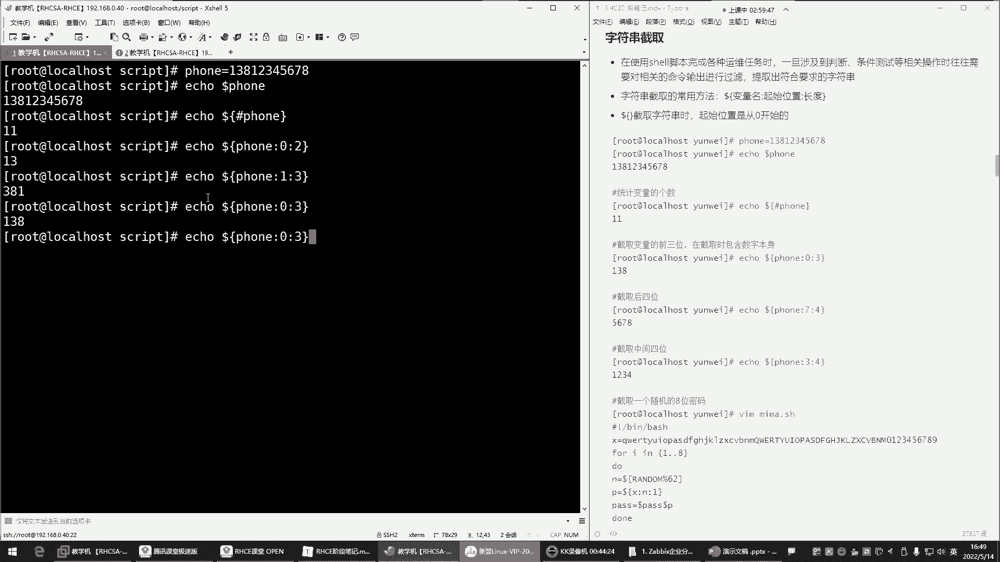

这些知识是编写高效、健壮Shell脚本的重要组成部分，建议结合实践进行练习以加深理解。