# Linux运维RHCSA+RHCE培训教程：P47：shell函数、脚本中断及退出、字符串处理 🐧

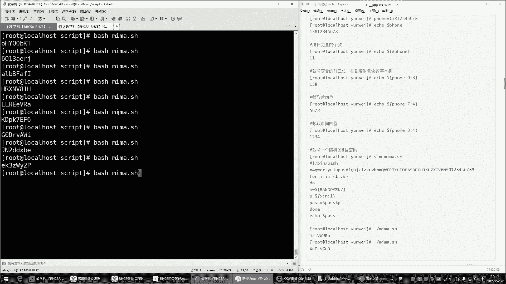

在本节课中，我们将学习Shell脚本中的字符串处理技巧，包括字符串截取、替换以及“掐头去尾”等操作。这些技巧在处理文本数据、批量修改文件名或生成随机内容时非常有用。我们还将探讨一个重要的学习理念：如何高效地利用现有资源解决问题。

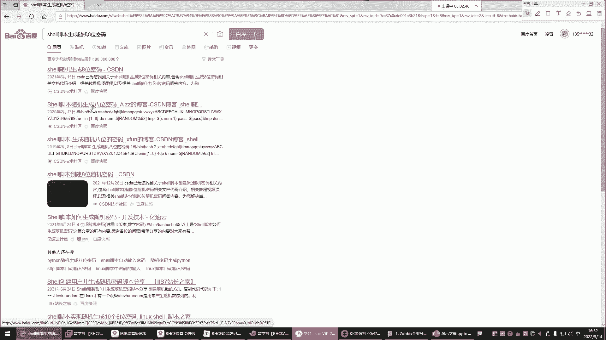

## 字符串截取 ✂️

字符串截取是指从一个字符串变量中提取指定位置和长度的子串。其基本语法格式为 `${变量名:起始位置:长度}`。起始位置从0开始计数。

例如，我们有一个变量 `phone="13812345678"`，想要截取后四位“5678”。

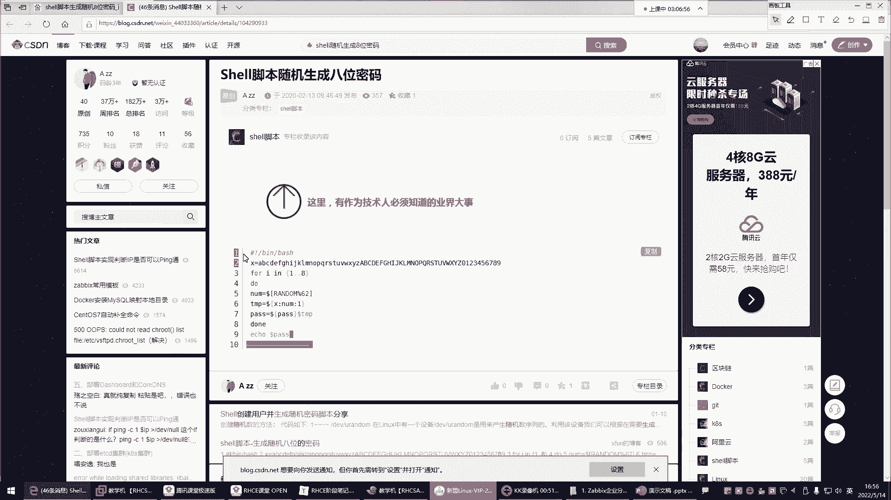

```bash
phone="13812345678"
echo ${phone:7:4}
```
执行上述命令，将从第7位（即数字‘5’）开始，截取4位字符，输出结果为“5678”。

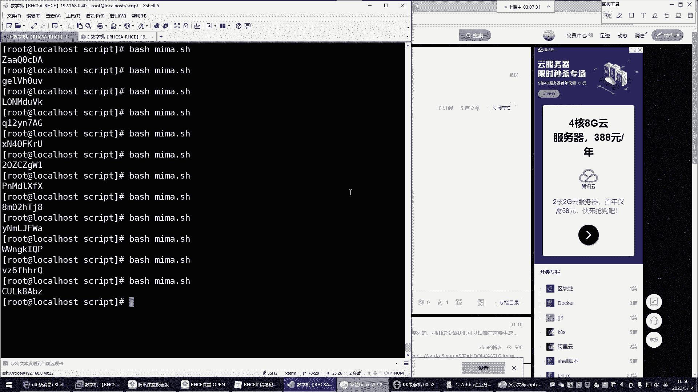

字符串截取功能非常灵活，不仅可以截取数字，也可以用于截取文件内容或其他文本数据。

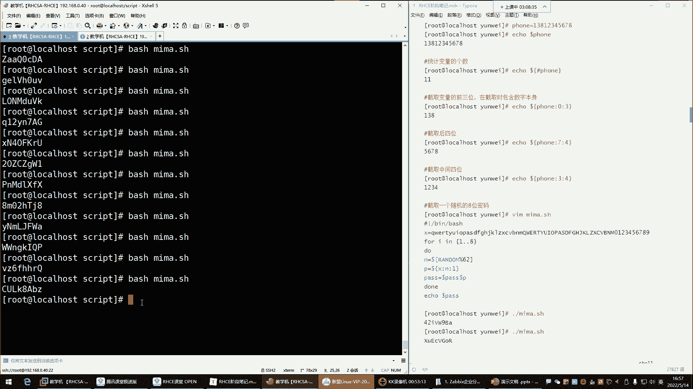

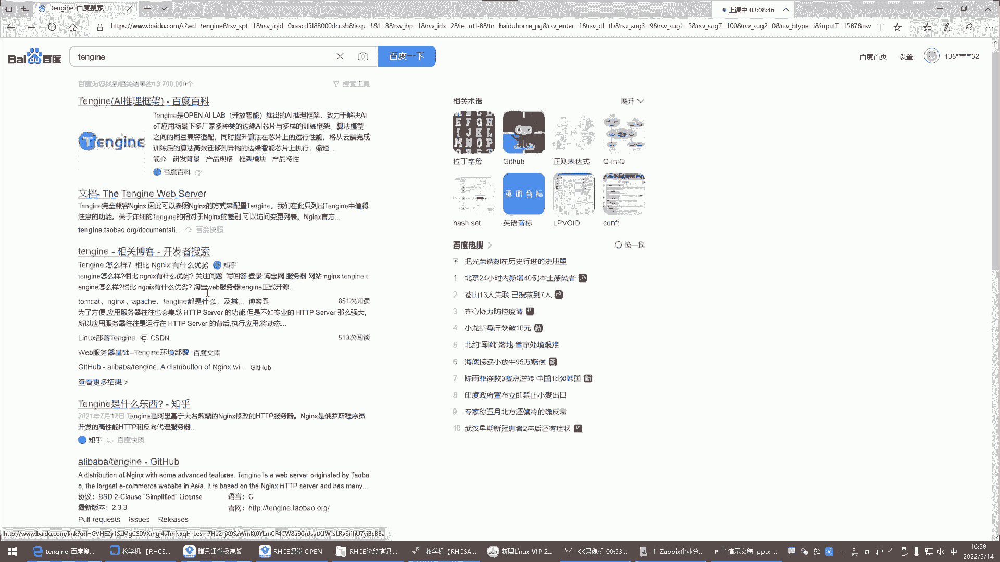

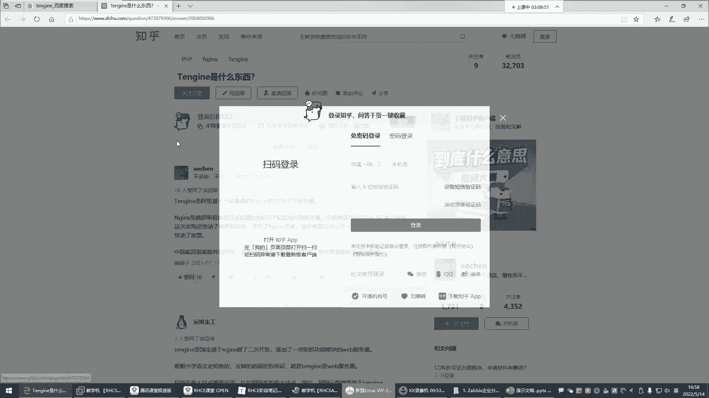

## 生成随机密码示例 🔐

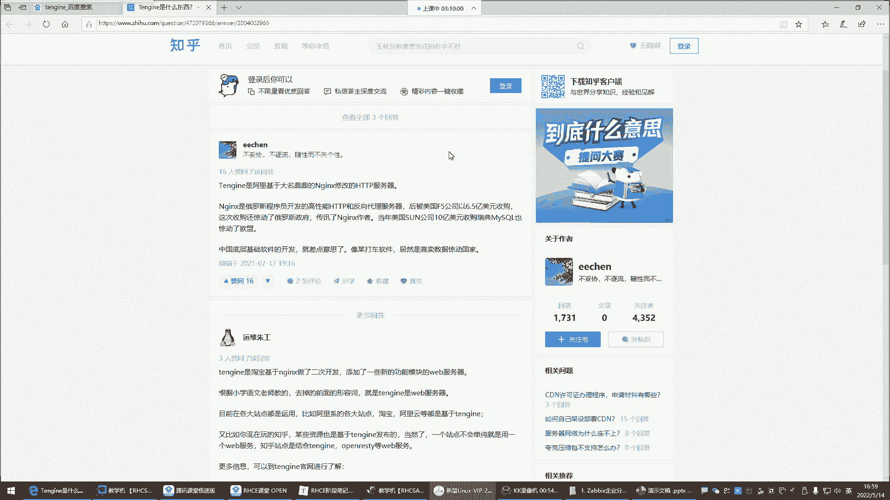

字符串截取的一个典型应用是生成随机密码。我们可以结合Shell的编程特性（如变量、循环和随机数）来实现。

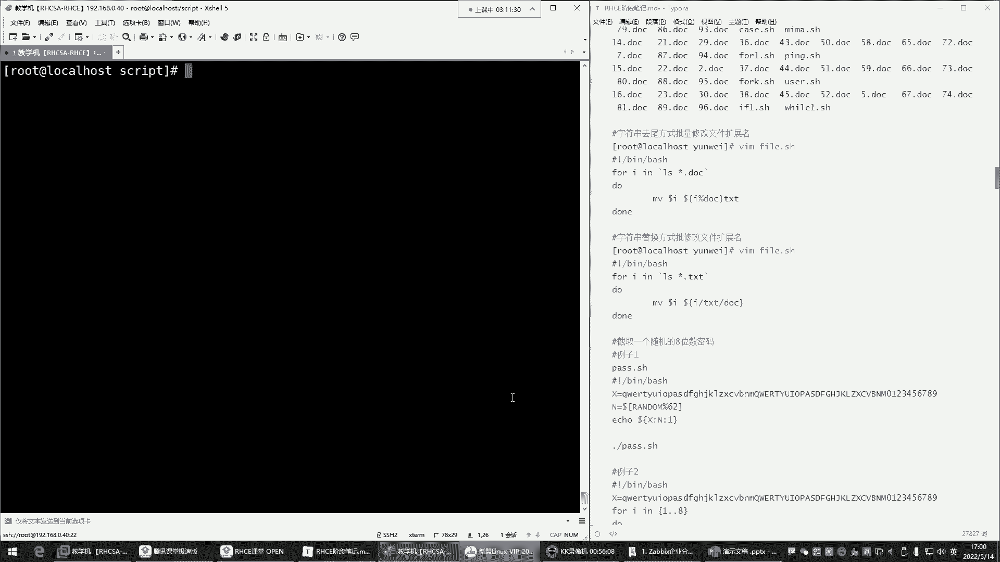

以下是一个生成随机8位密码的脚本示例 `password.sh`：

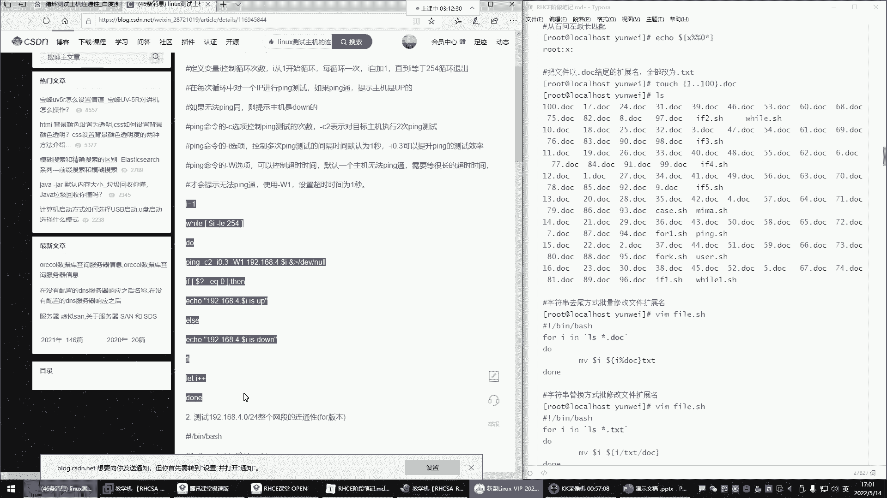

```bash
#!/bin/bash
# 定义包含大小写字母和数字的字符池
str="abcdefghijklmnopqrstuvwxyzABCDEFGHIJKLMNOPQRSTUVWXYZ0123456789"
pass=""
# 循环8次，每次从字符池中随机选取一位
for i in {1..8}
do
    num=$[RANDOM % ${#str}]
    tmp=${str:num:1}
    pass=${pass}${tmp}
done
echo $pass
```
脚本执行后，每次都会输出一个随机的8位字符串。

**核心思路解析：**
1.  定义一个包含62个字符（26小写字母+26大写字母+10数字）的变量 `str`。
2.  使用 `$RANDOM` 生成随机数，并通过 `% 62` 取余，确保随机数范围在0到61之间，对应字符池的下标。
3.  使用 `${str:num:1}` 从字符池中截取1位字符。
4.  循环8次，将每次截取的字符拼接起来，形成最终密码。

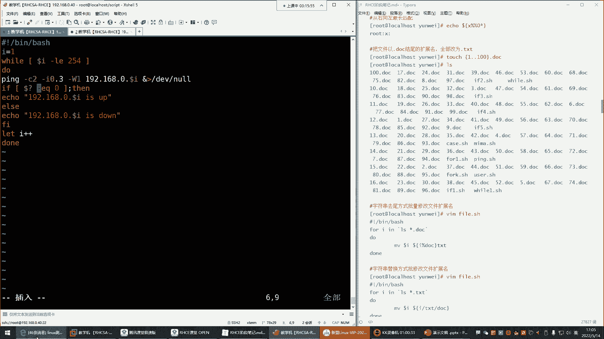

对于这类有明确需求的脚本，我们通常不需要从零开始编写。善于搜索并借鉴他人成熟的代码是更高效的方法。

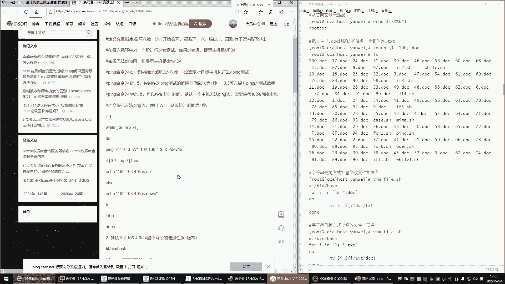

## 字符串替换 🔄

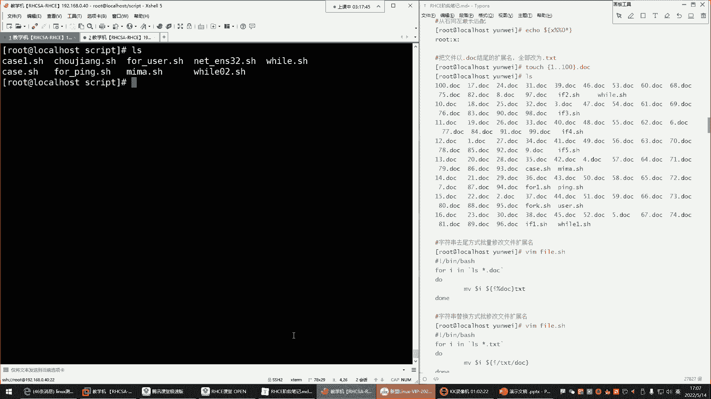

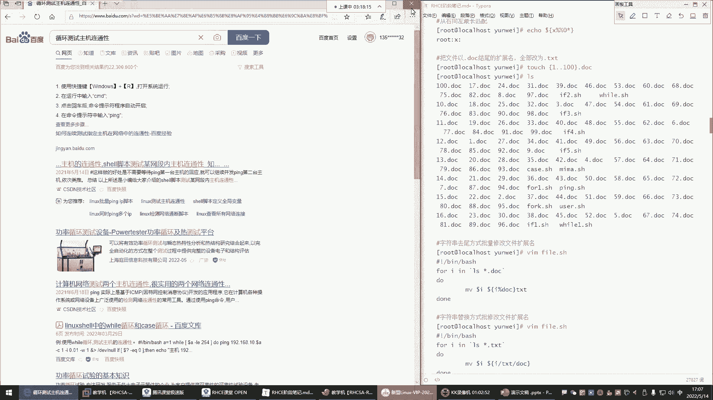

字符串替换用于将变量值中的部分旧内容替换为新内容。其语法格式为 `${变量名/旧字符串/新字符串}`。用双斜线 `//` 可替换所有匹配项，单斜线 `/` 仅替换第一个匹配项。

例如，我们有一个变量 `file="test1234.txt"`。

```bash
file="test1234.txt"
# 将 “1234” 替换为 “XXXX”
echo ${file/1234/XXXX}
# 输出：testXXXX.txt

# 将所有的数字 “3” 替换为 “*”，单斜线只替换第一个
num="313233"
echo ${num/3/*}
# 输出：*13233

# 双斜线替换所有 “3”
echo ${num//3/*}
# 输出：*12**3
```
字符串替换与文本编辑器（如Vim）中的替换操作逻辑相似，非常直观易懂。

## 字符串“掐头去尾” ✂️

“掐头去尾”是指删除字符串开头或结尾的指定部分。这在处理文件路径、批量修改扩展名时特别有用。
*   **掐头（删除开头）**：使用 `${变量名#匹配规则}`。`#` 表示从左向右最短匹配删除，`##` 表示最长匹配删除。
*   **去尾（删除结尾）**：使用 `${变量名%匹配规则}`。`%` 表示从右向左最短匹配删除，`%%` 表示最长匹配删除。

假设变量 `path="/usr/local/bin/app"`。

```bash
path="/usr/local/bin/app"
# 掐头：删除第一个 `/` 及其左边的部分（最短匹配）
echo ${path#*/}
# 输出：usr/local/bin/app

# 掐头：删除最后一个 `/` 及其左边的部分（最长匹配）
echo ${path##*/}
# 输出：app

# 去尾：删除从右向左第一个 `/` 及其右边的部分（最短匹配）
echo ${path%/*}
# 输出：/usr/local/bin

# 去尾：删除从右向左最后一个 `/` 及其右边的部分（最长匹配）
echo ${path%%/*}
# 输出：（空）
```

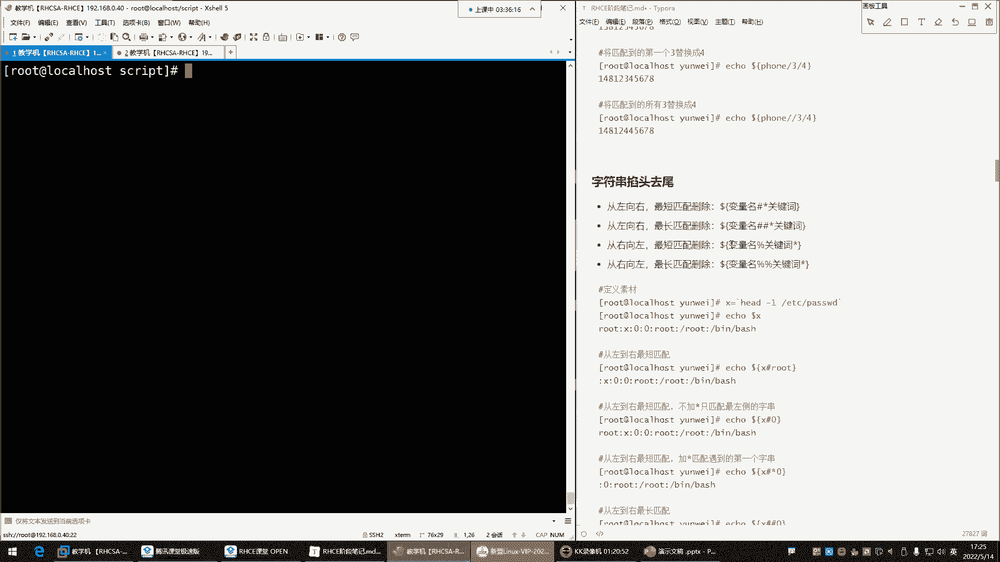

## 实践：批量修改文件扩展名 📁

下面我们利用字符串替换功能，编写一个批量修改当前目录下所有 `.txt` 文件扩展名为 `.doc` 的脚本。

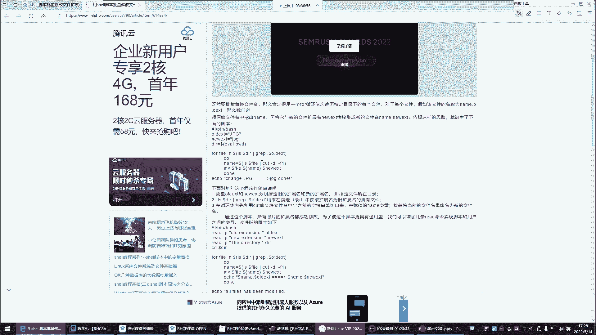

```bash
#!/bin/bash
for file in *.txt
do
    # 使用字符串替换，将 .txt 替换为 .doc
    newname=${file/.txt/.doc}
    mv "$file" "$newname"
done
echo “扩展名修改完成。”
```
执行此脚本，即可快速完成批量重命名工作。当需要反向操作或将 `.doc` 改回 `.txt` 时，只需调整替换规则即可。

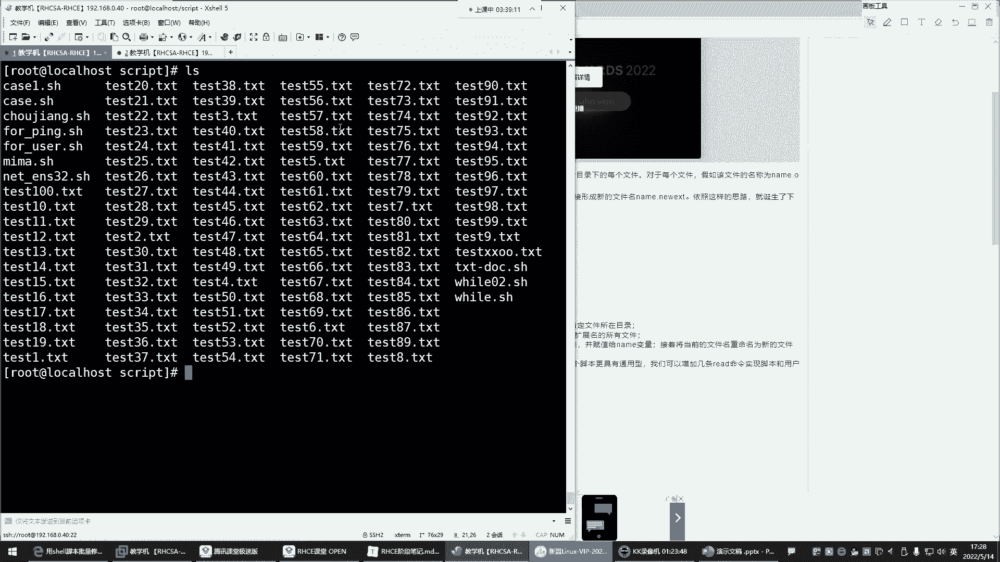

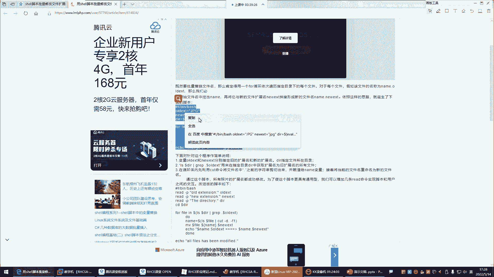

这个例子再次说明，许多实际问题已有成熟的解决方案。我们学习的重点是理解脚本的语法和逻辑，从而能够根据需要修改和应用这些现有脚本。

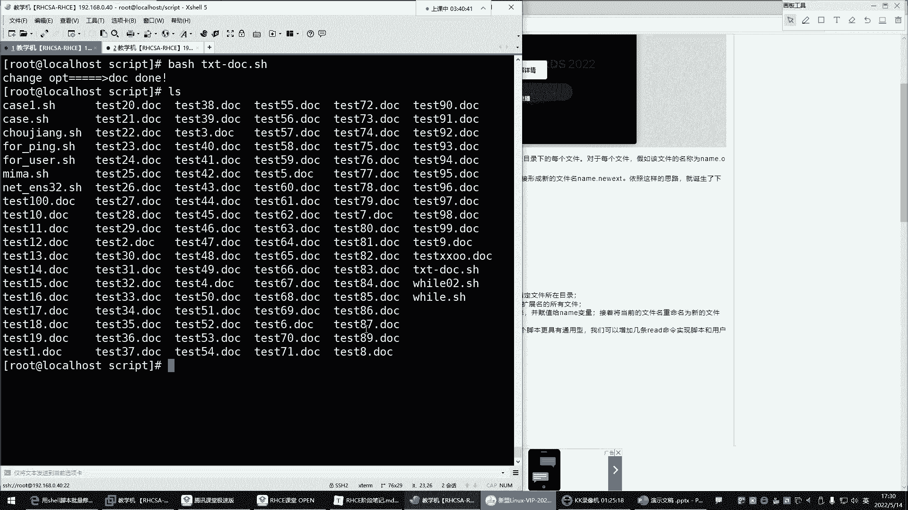

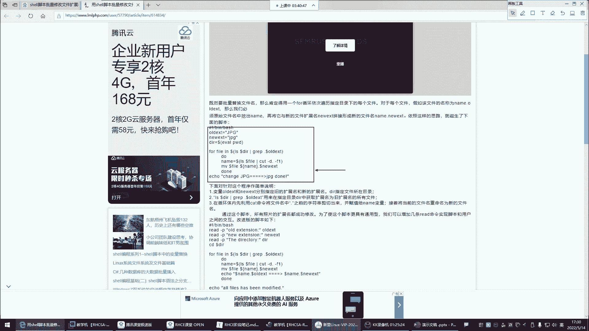

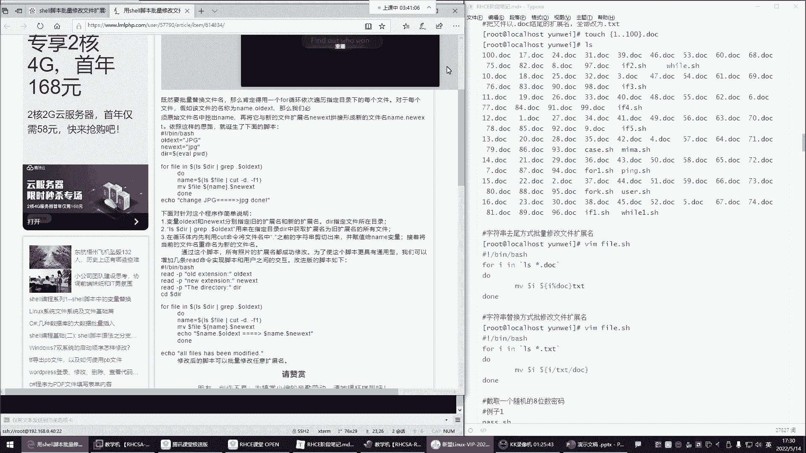

## 总结与学习之道 📚

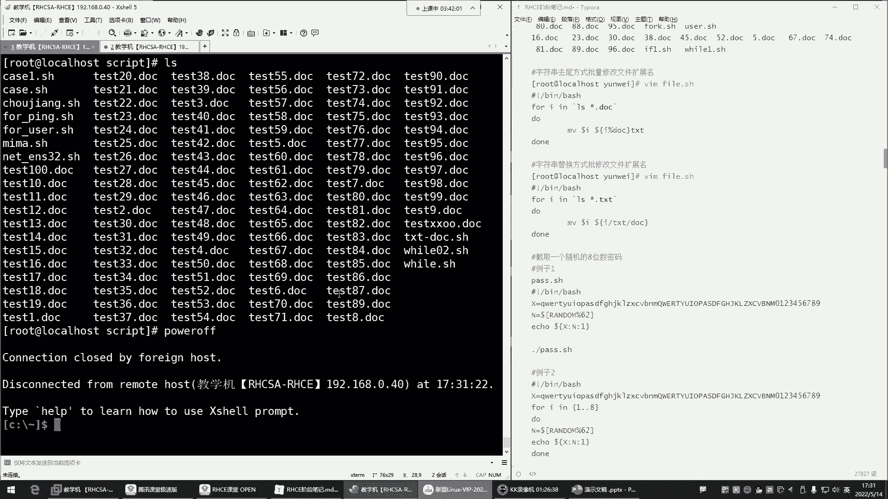

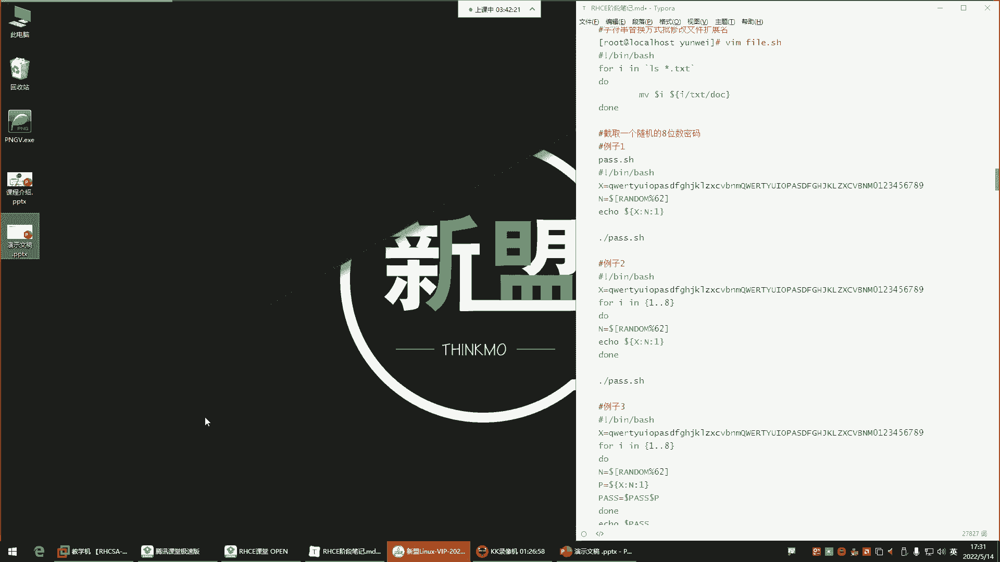

本节课我们一起学习了Shell脚本中的字符串处理技巧，包括：
1.  **字符串截取**：使用 `${var:start:length}` 格式提取子串。
2.  **字符串替换**：使用 `${var/old/new}` 或 `${var//old/new}` 进行局部或全局替换。
3.  **字符串掐头去尾**：使用 `#`, `##`, `%`, `%%` 删除字符串首尾的指定模式。

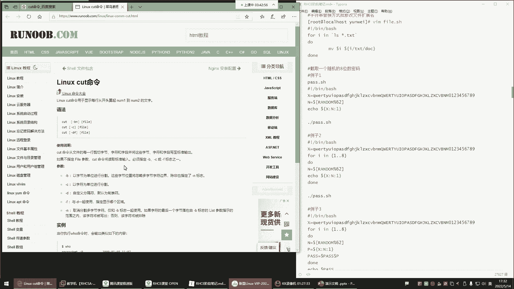

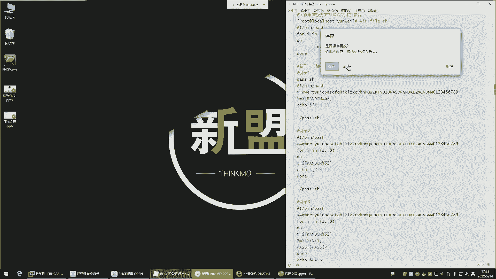

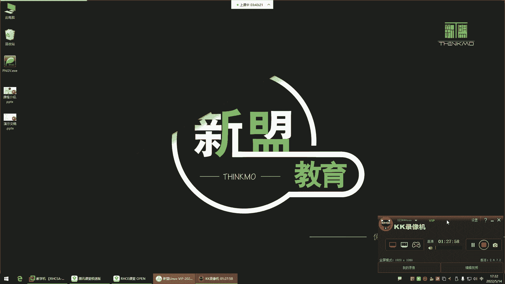

更重要的是，我们探讨了在运维和编程学习中的一种高效实践：**“借鉴与修改”**。在信息时代，完全从零开始创造并非总是最高效的路径。能够准确搜索需求、理解他人代码、并对其进行调试和修改以适应自己的环境，这是一种至关重要的能力。这要求我们掌握基础知识以看懂代码，同时保持开放心态，善于利用社区和网络上的丰富资源。记住，“前人栽树，后人乘凉”，站在巨人的肩膀上解决问题，是智慧的表现。