# Linux运维RHCSA+RHCE培训教程：P48：Shell数组与正则表达式

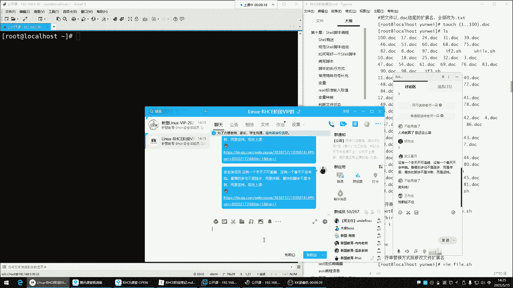

## 概述
在本节课中，我们将学习Shell脚本中的两个重要概念：数组和正则表达式。数组是变量的高级形式，允许在一个变量名中存储多个值。正则表达式则是一套用于匹配和处理文本的强大工具，通过一系列特殊符号来表达复杂的匹配规则。掌握这两者对于编写高效脚本和进行文本处理至关重要。

---

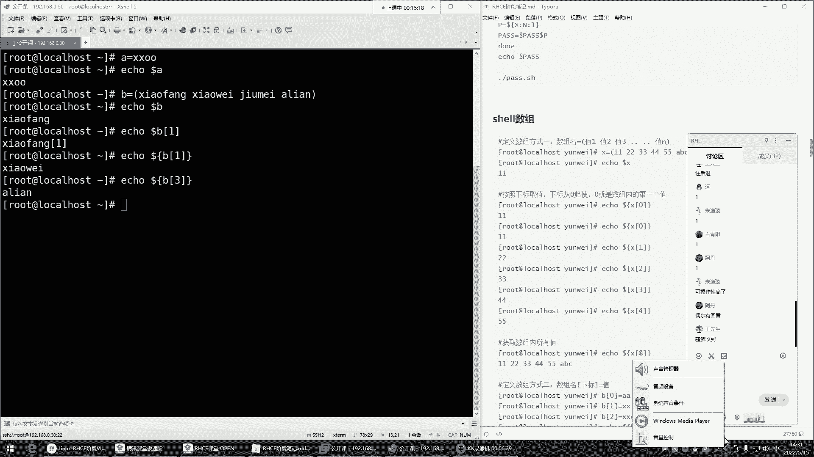

## Shell数组

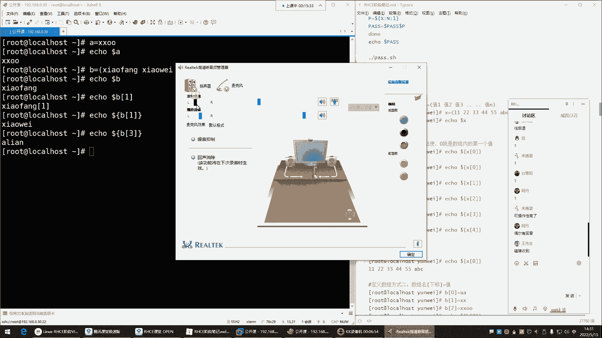

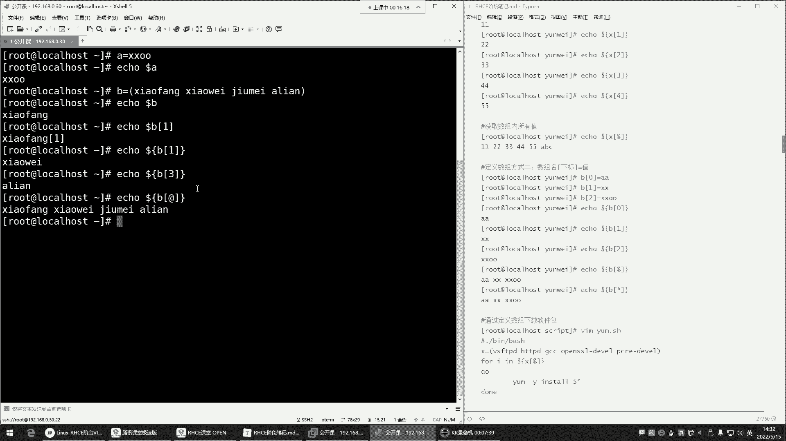

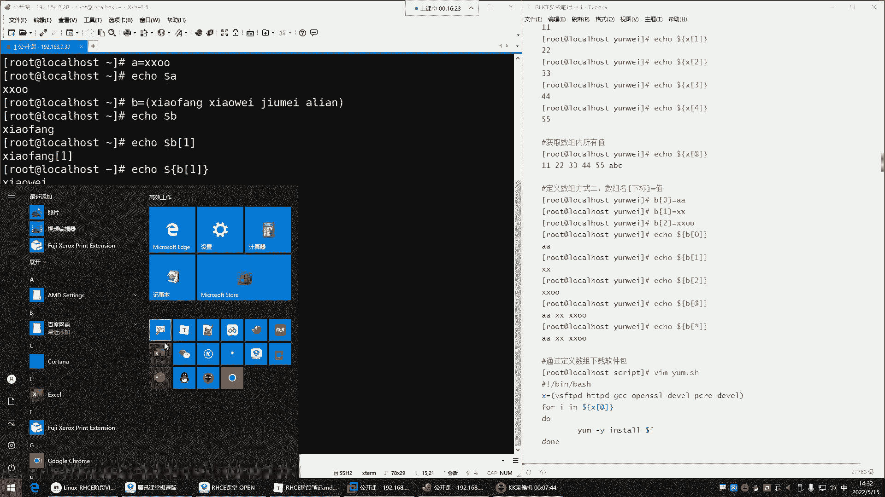

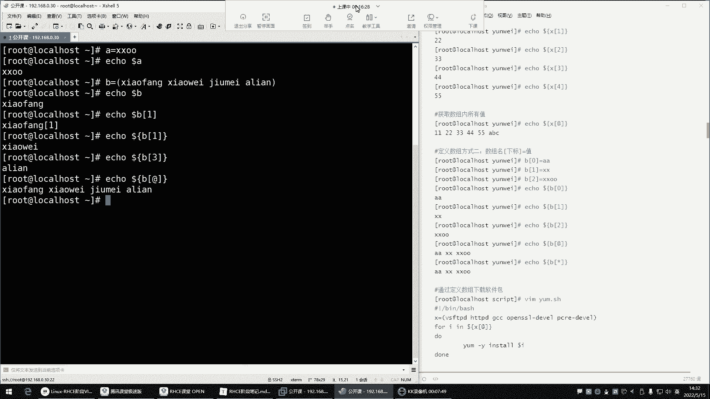

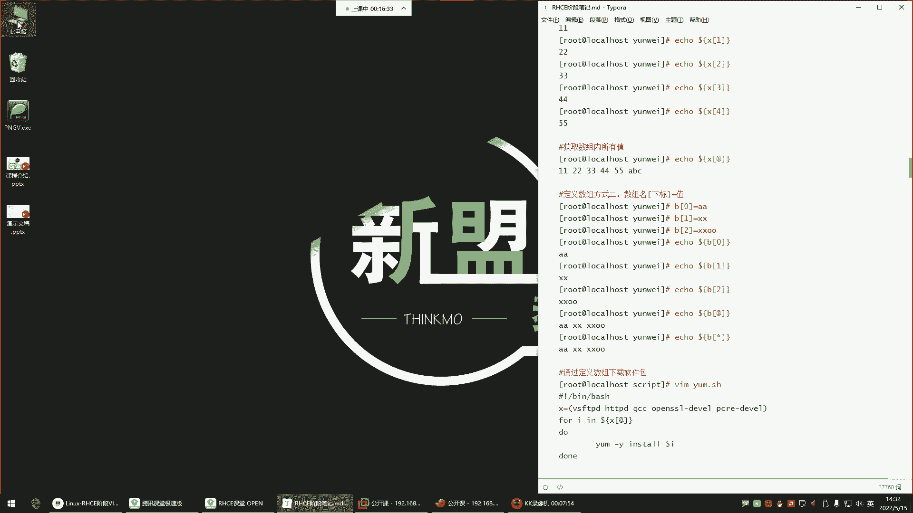

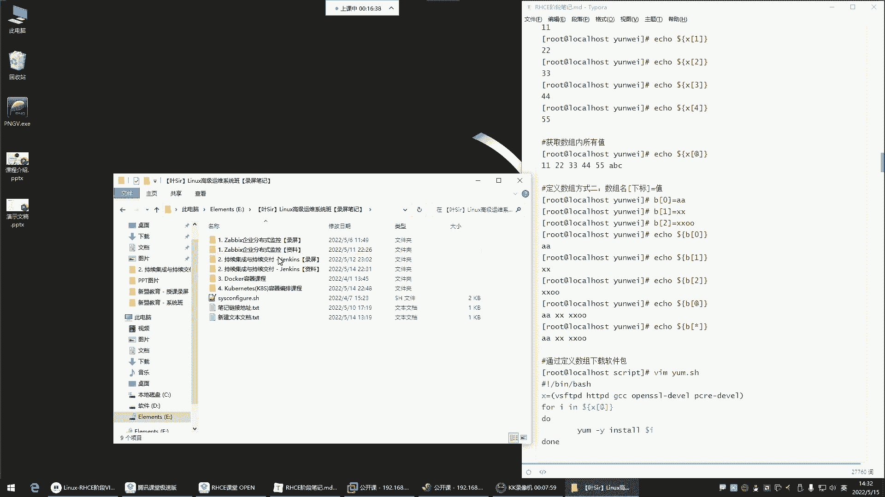

### 数组的基本概念
上一节我们介绍了变量，本节中我们来看看数组。数组本质上是变量的一种扩展形式，它允许在一个变量名下存储多个值，而普通变量只能存储一个值。当单个值无法满足需求时，数组就派上了用场。

### 定义与取值
定义数组的语法与定义变量类似，但值需要用括号括起来，值之间用空格分隔。

**代码示例：定义数组**
```bash
B=(小芳 小V 9妹 阿莲)
```

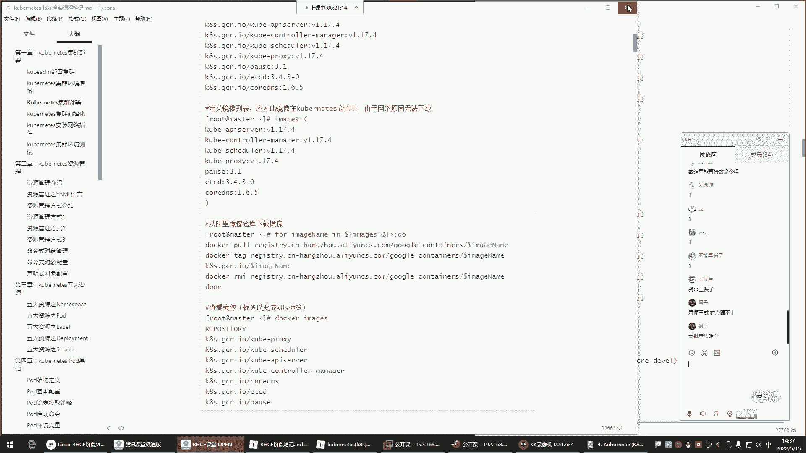

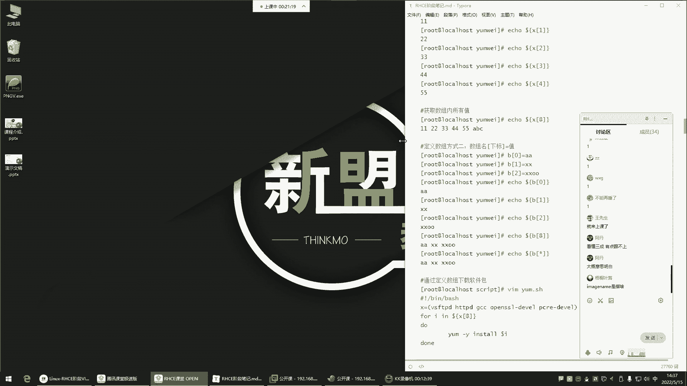

定义好后，使用 `echo $B` 命令默认只会输出数组中的第一个值。要访问特定的值，需要使用下标。**数组的下标从0开始计数**，即0代表第一个值，1代表第二个值，依此类推。

取值时，需要将数组名和下标用大括号括起来。

**代码示例：按下标取值**
```bash
echo ${B[0]}  # 输出：小芳
echo ${B[1]}  # 输出：小V
echo ${B[3]}  # 输出：阿莲
```

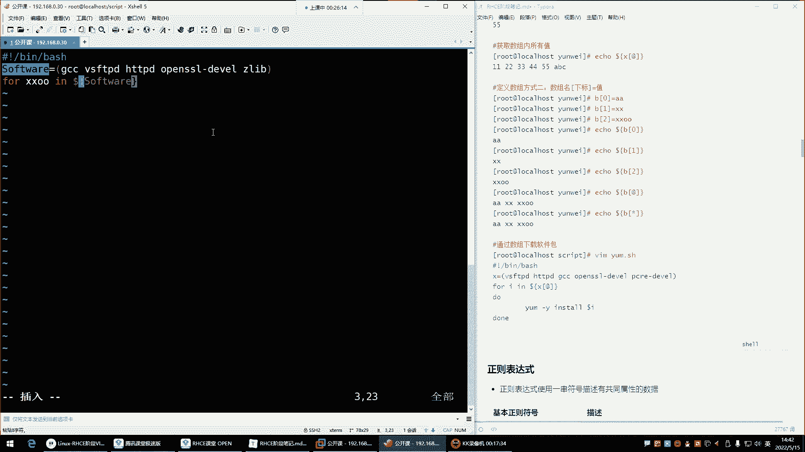

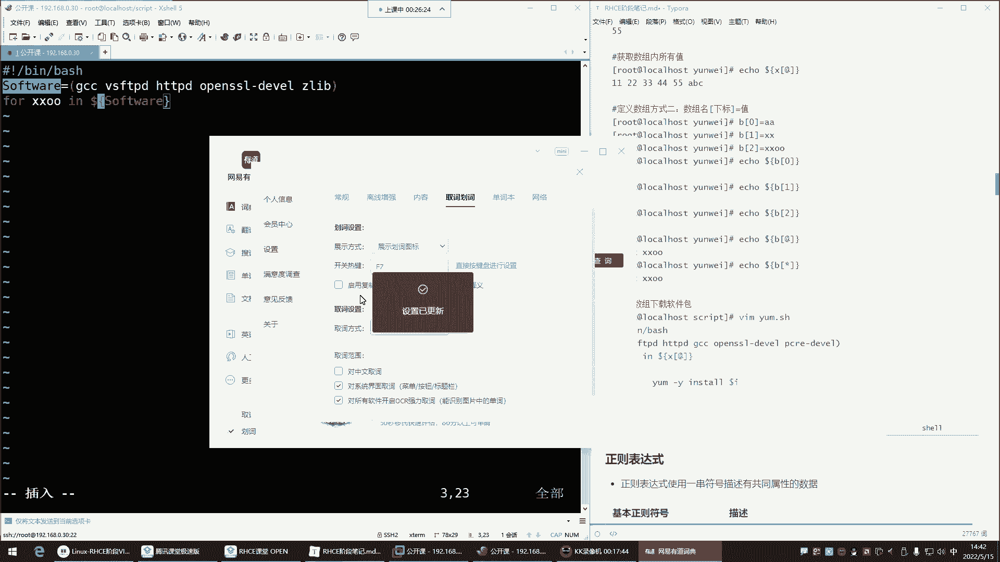

如果想取出数组中的所有值，可以使用 `@` 符号。

**代码示例：取所有值**
```bash
echo ${B[@]}  # 输出：小芳 小V 9妹 阿莲
```

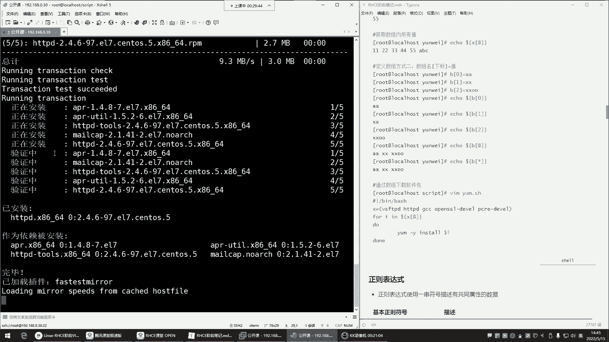

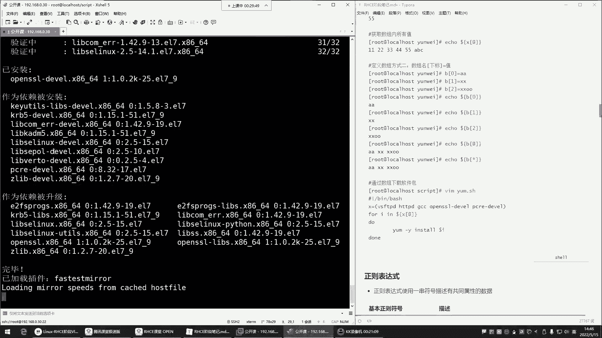

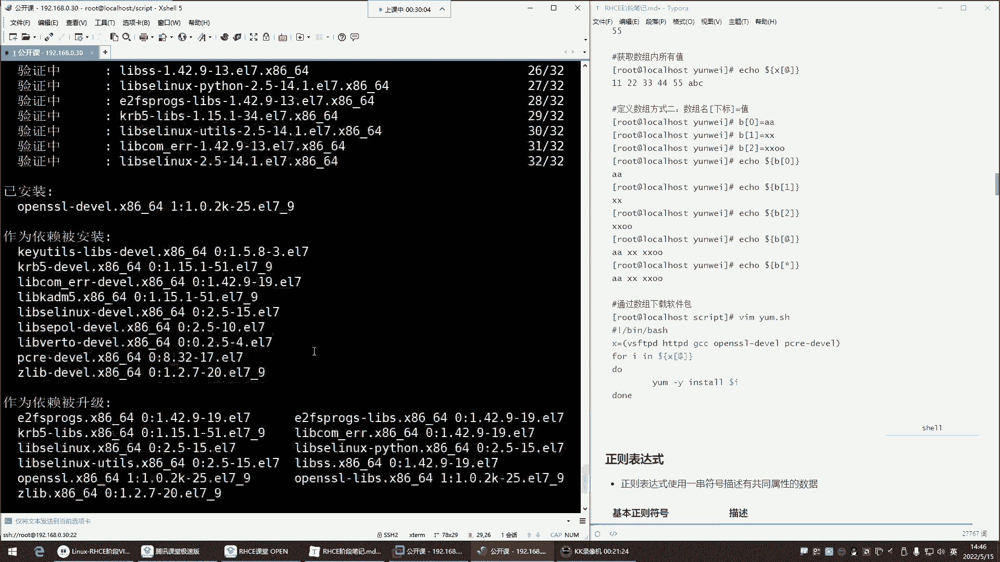

### 数组的实用场景
数组常与循环结合使用，用于批量处理任务。例如，在脚本中定义需要安装的软件包列表，然后通过循环自动安装。

以下是数组结合for循环的一个典型应用示例：

**代码示例：使用数组批量安装软件**
```bash
#!/bin/bash
# 定义软件包数组
software=(gcc vsftpd httpd)
# 循环安装数组中的所有软件包
for pkg in ${software[@]}
do
    yum -y install $pkg
done
```

### 向数组中添加值
数组定义后，可以随时向其中添加新值，通过指定新的下标即可。

**代码示例：向数组追加值**
```bash
B[4]="波多"
echo ${B[@]}  # 输出：小芳 小V 9妹 阿莲 波多
```
如果给已存在的下标赋值，则会覆盖该位置原来的值。

---

## 正则表达式

### 正则表达式简介
正则表达式是一种用于描述字符串模式的强大工具，它通过一系列特殊符号来定义搜索或匹配的规则。这些符号在大多数编程语言中通用，是文本处理的基石。

### 常用正则表达式符号
以下是正则表达式中最常用的一些符号及其功能：

**1. 匹配行首 (`^`)**
`^` 符号用于匹配以特定内容开头的行。
```bash
grep "^root" /etc/passwd  # 匹配以"root"开头的行
```

**2. 匹配行尾 (`$`)**
`$` 符号用于匹配以特定内容结尾的行。
```bash
grep "bash$" /etc/passwd   # 匹配以"bash"结尾的行
grep "nologin$" /etc/passwd # 匹配以"nologin"结尾的行
```

**3. 匹配集合中任意单个字符 (`[ ]`)**
`[ ]` 用于匹配括号内的任意一个字符。
```bash
grep "[123abc]" /etc/hosts  # 匹配包含1、2、3、a、b、c中任意一个字符的行
```
在`[ ]`内使用`^`表示取反，即匹配不在括号内的字符。
```bash
grep "[^abc]" file.txt  # 匹配不包含a、b、c中任意一个字符的行
```

**4. 匹配任意单个字符 (`.`)**
`.` 符号可以匹配任意一个字符（除了换行符）。
```bash
grep "r.t" /etc/passwd  # 匹配像"root"、"rat"这样的字符串，点代表一个任意字符
```

**5. 匹配前一个字符0次或多次 (`*`)**
`*` 表示其前面的字符可以出现任意次数（包括0次）。
```bash
grep "ro*t" /etc/passwd  # 匹配"rt"、"rot"、"root"等
```

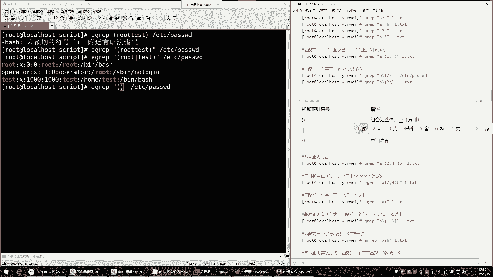

**6. 扩展正则表达式 (`-E` 或 `egrep`)**
某些更强大的符号（如`+`, `?`, `|`, `()`）属于“扩展正则表达式”，使用时需要添加 `-E` 选项或使用 `egrep` 命令。

*   **`|` 表示“或”**
    ```bash
    egrep "(root|test)" /etc/passwd  # 匹配包含"root"或"test"的行
    ```
*   **`()` 用于将模式分组为一个整体**
    ```bash
    egrep "(oo)+" /etc/passwd  # 匹配包含一个或多个"oo"的行
    ```

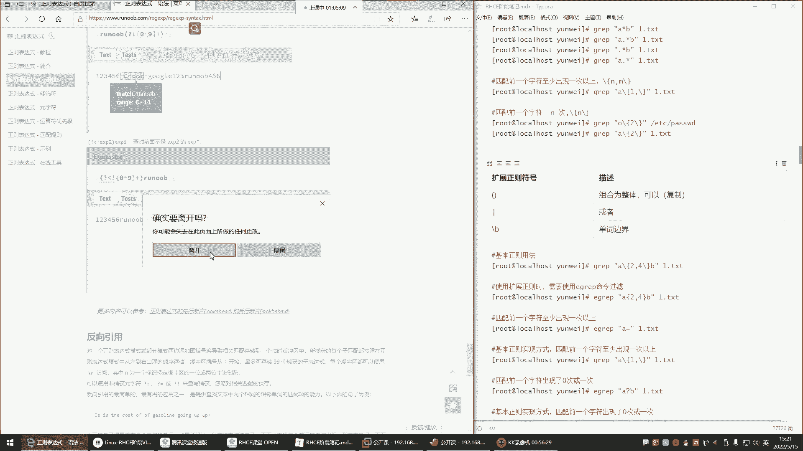

### 正则表达式的应用
正则表达式主要与 `grep`、`sed`、`awk` 等文本处理工具结合使用，用于搜索、过滤和替换文本内容。它在日志分析、数据提取和配置文件管理等方面非常有用。

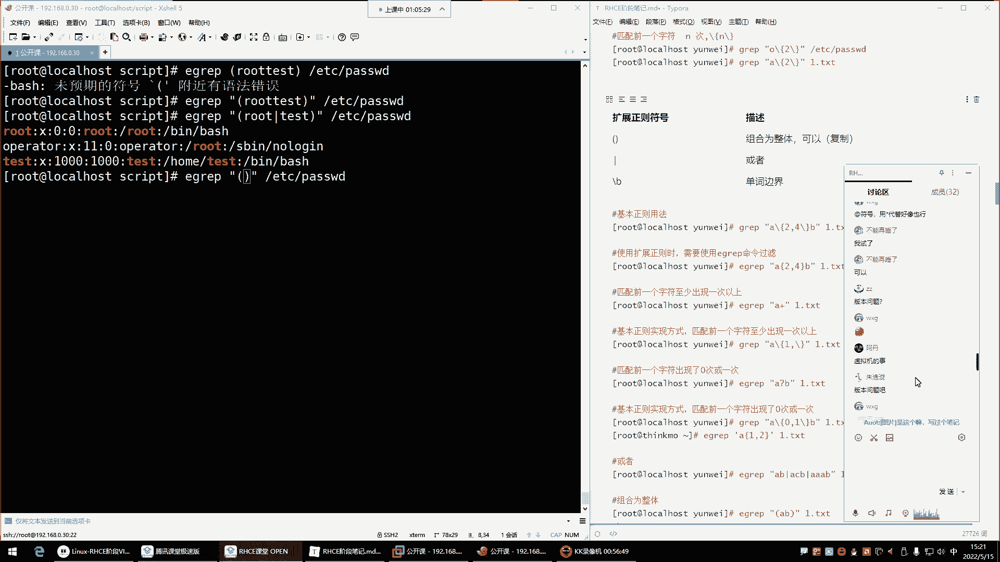

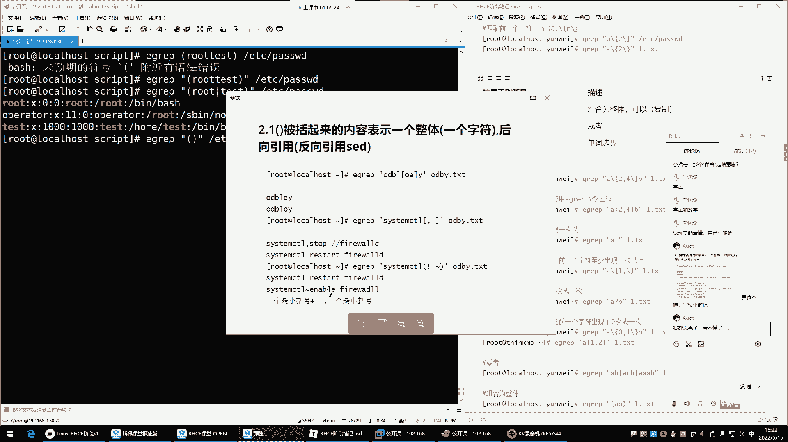

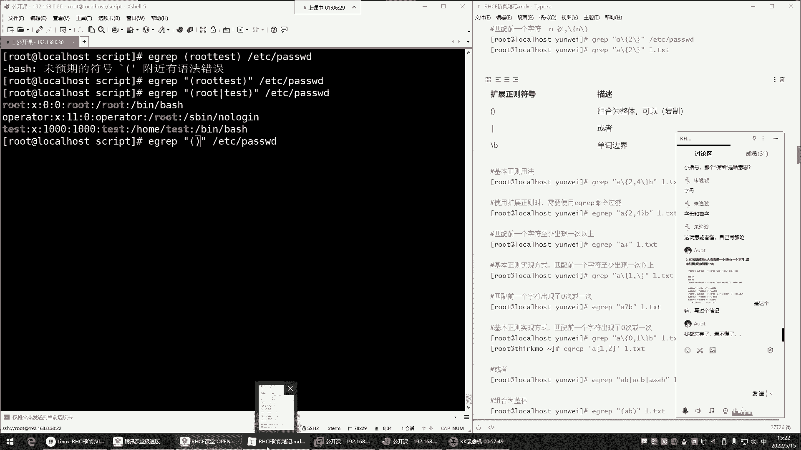

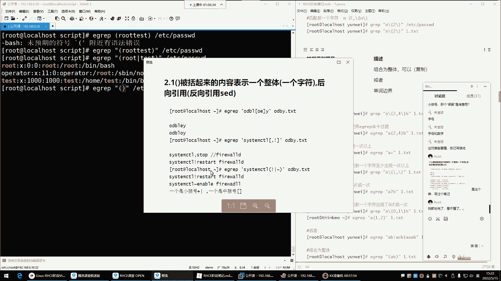

---

## 总结
本节课我们一起学习了Shell数组和正则表达式。
*   **数组** 是增强型的变量，可以存储多个值，并通过下标访问，常与循环结合实现批量操作。
*   **正则表达式** 是一套功能强大的文本匹配工具，通过 `^`、`$`、`[ ]`、`.`、`*` 等特殊符号，可以灵活地定义搜索模式，是Linux文本处理中不可或缺的技能。

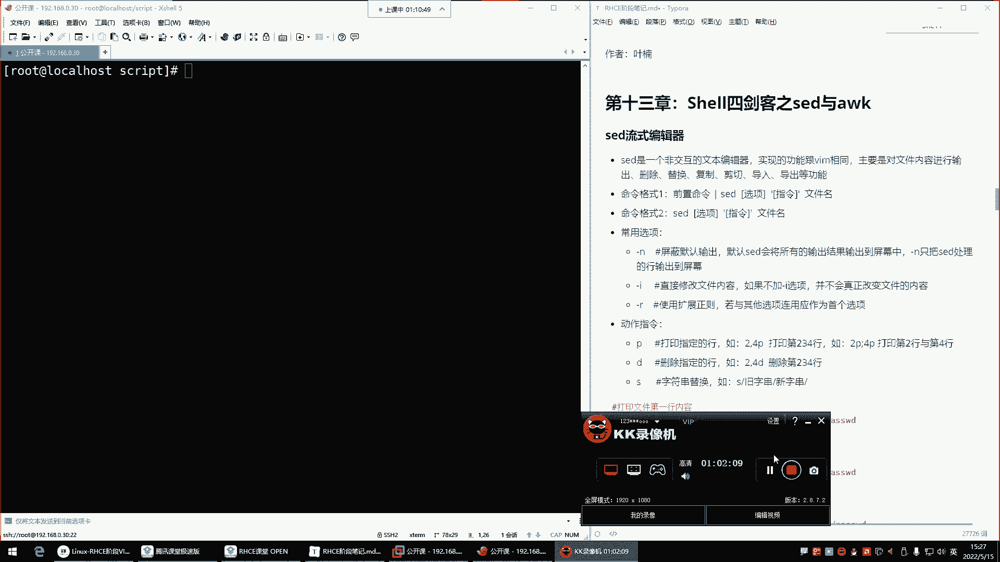

理解数组的结构和正则表达式的基本符号，将为后续学习更复杂的脚本编写和系统管理工作打下坚实的基础。