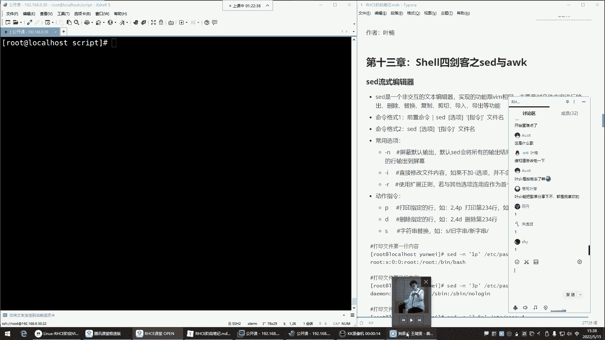
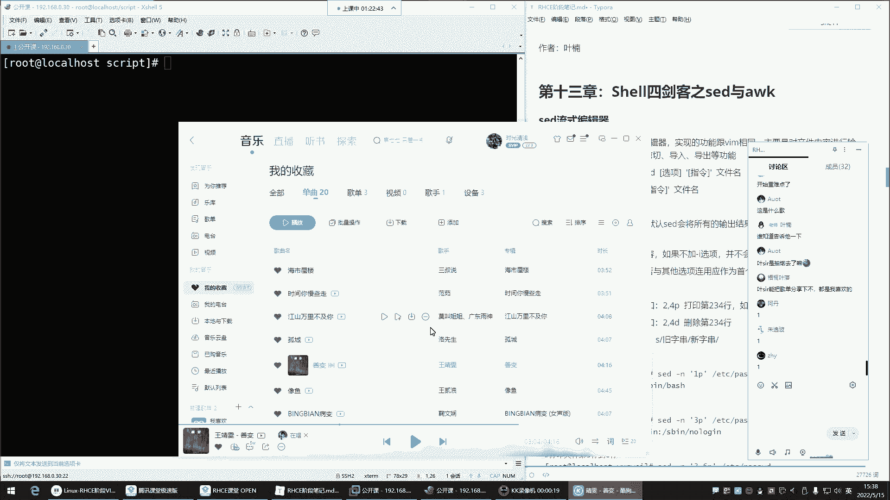
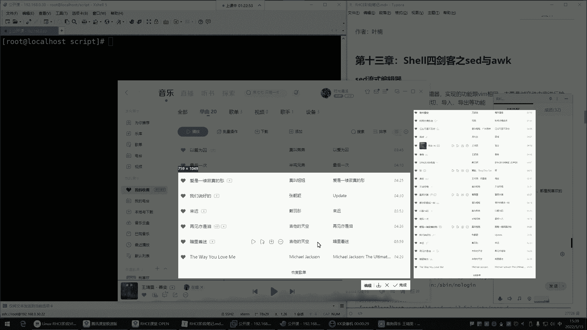
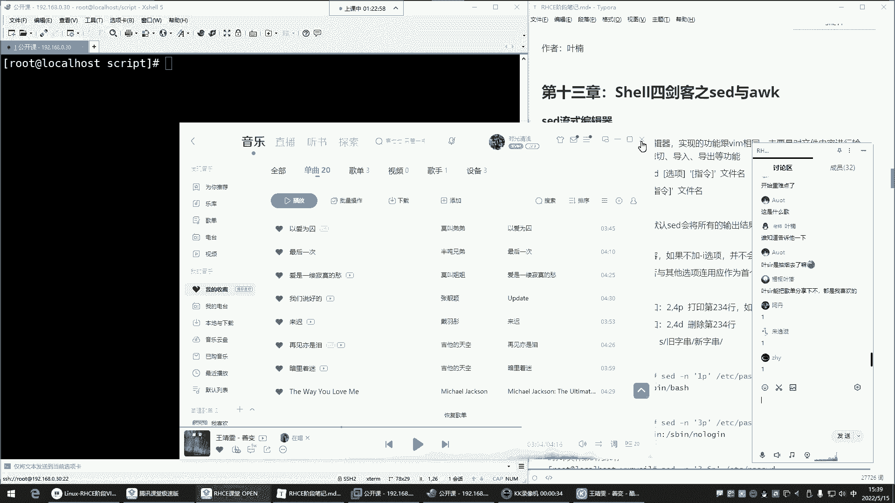
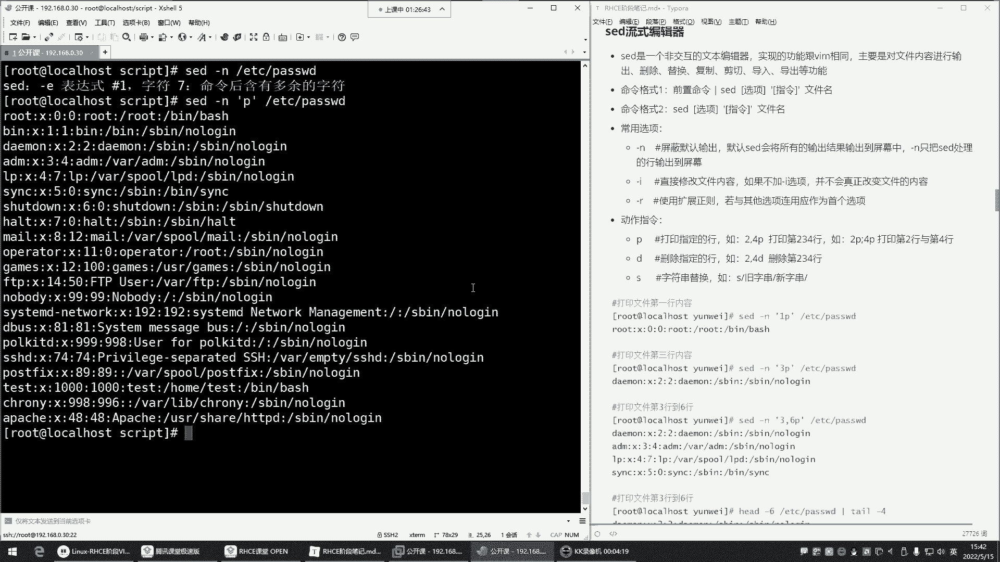
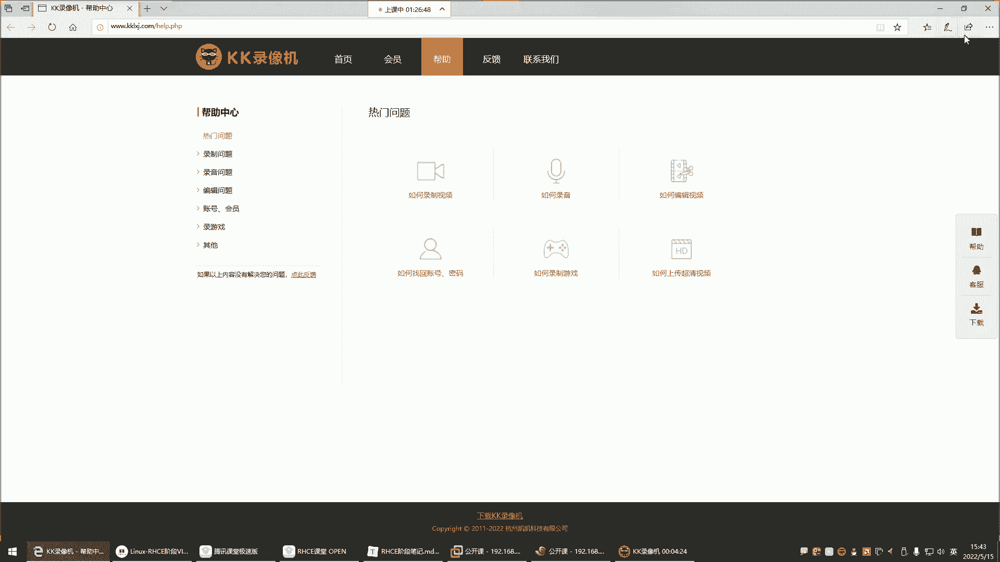
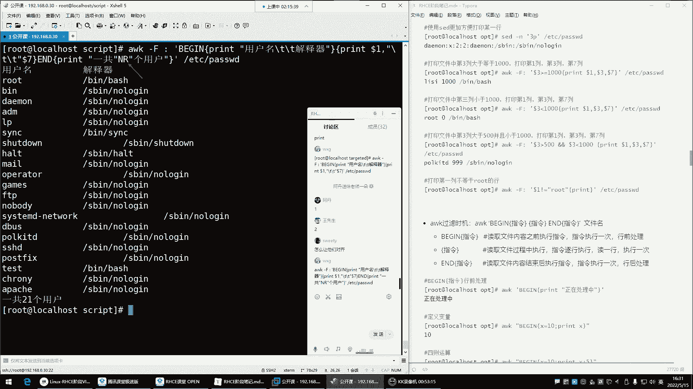
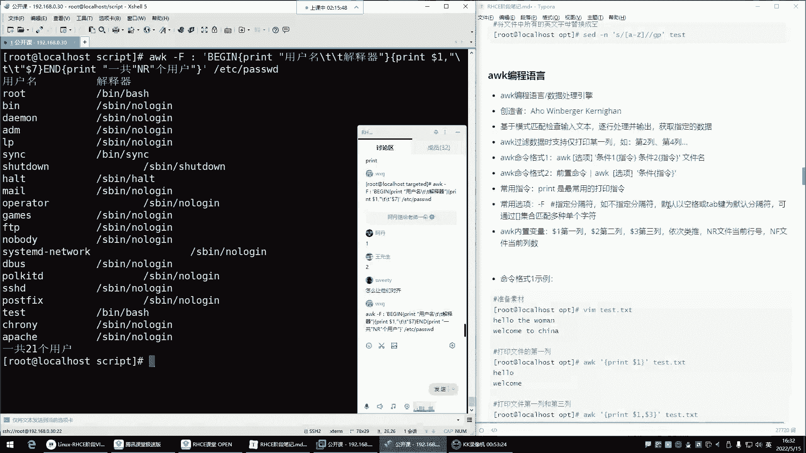
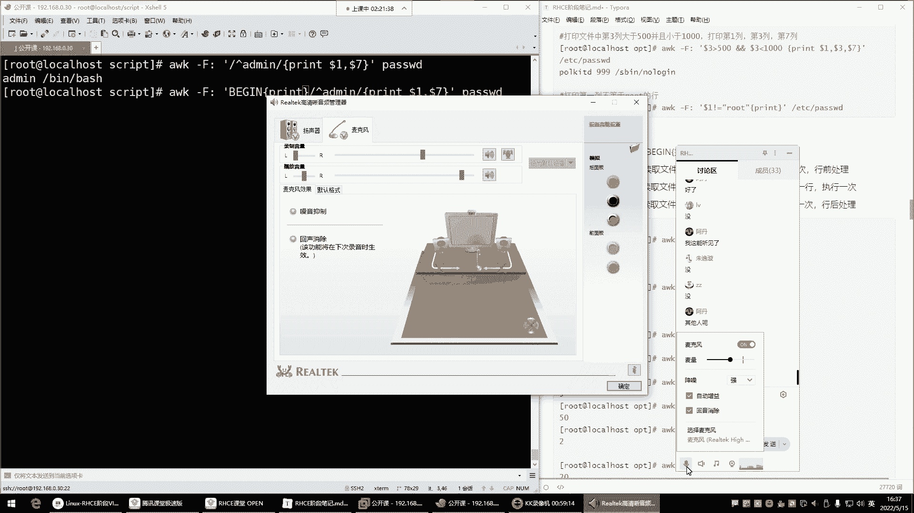
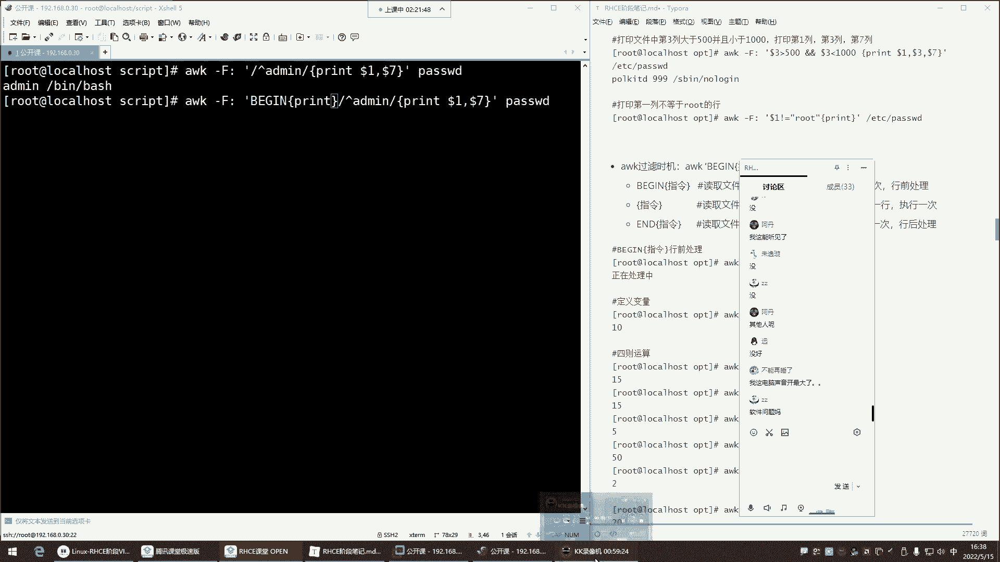

# Linux运维RHCSA+RHCE培训教程：P49：Shell四剑客之Sed与AWK编辑器 🛠️









在本节课中，我们将学习Shell文本处理中的两个强大工具：Sed流式编辑器和AWK编程语言。我们将重点掌握它们的基本语法、核心功能以及如何利用它们高效地处理文本文件，实现非交互式的查找、替换、删除和列过滤等操作。

---

## Sed流式编辑器 📝





上一节我们介绍了Shell四剑客的概念，本节中我们来看看其中的Sed编辑器。Sed，全称Stream Editor，即流式编辑器。通俗地讲，它是Vim编辑器的另一种非交互式实现方式。Vim是交互式的，需要手动操作，难以集成到脚本中。而Sed可以在命令行中直接对文件内容进行增、删、改、查，非常适合脚本自动化处理。

### Sed命令格式与核心选项

Sed命令主要有两种使用格式：
1.  前置命令通过管道（`|`）传递给Sed处理。
2.  直接使用Sed处理文件。

我们主要学习第二种格式。其基本语法结构为：
```bash
sed [选项] ‘指令’ 文件名
```

以下是Sed最常用的两个选项：
*   **`-n`**：屏蔽默认输出。默认情况下，Sed会输出所有处理过的行。使用`-n`后，只输出经过`指令`处理的行。
*   **`-i`**：直接修改原文件。不加此选项，所有操作仅为“演练”，不会真正改变文件内容。

### Sed核心指令：打印（p）

打印指令`p`用于查看文件内容，通常与`-n`选项结合使用，以精确控制输出。

以下是打印指令的几种常见用法：

*   **打印指定行**：`sed -n ‘行号p’ 文件名`
*   **打印连续行范围**：`sed -n ‘起始行号,结束行号p’ 文件名`
*   **打印不连续的多行**：`sed -n ‘行号1p; 行号2p’ 文件名` （注意使用分号分隔）

**示例**：查看`/etc/passwd`文件的第3行。
```bash
sed -n ‘3p’ /etc/passwd
```

### Sed核心指令：删除（d）

删除指令`d`用于删除文件中的行。**重要提示**：删除操作务必先预览，再使用`-i`选项实际执行。

以下是删除操作的标准流程：

1.  **预览要删除的行**：`sed -n ‘行号p’ 文件名`
2.  **确认无误后执行删除**：`sed -i ‘行号d’ 文件名`

**示例**：删除`demo.txt`文件的第5行。
```bash
# 1. 先预览第5行内容
sed -n ‘5p’ demo.txt
# 2. 确认后执行删除
sed -i ‘5d’ demo.txt
```

### Sed核心指令：替换（s）

替换指令`s`用于替换文本，其语法与Vim中的替换类似，格式为：`s/旧内容/新内容/修饰符`。

以下是替换指令的关键点：

*   **基本替换**：`sed ‘s/旧内容/新内容/’ 文件名`
*   **全局替换（添加g修饰符）**：`sed ‘s/旧内容/新内容/g’ 文件名`
*   **同样建议先预览**：使用`sed -n ‘s/.../.../p’ 文件名`预览替换效果，再使用`sed -i`实际修改。

**示例**：将文件`script.sh`中所有的“xiaofang”替换为“xiaozhe”。
```bash
# 1. 预览替换效果
sed -n ‘s/xiaofang/xiaozhe/gp’ script.sh
# 2. 执行替换
sed -i ‘s/xiaofang/xiaozhe/g’ script.sh
```

### Sed结合正则表达式

Sed的强大之处在于可以结合正则表达式进行模式匹配和操作。正则表达式需要放在两个斜线`//`之间。

**示例**：打印所有以“bash”结尾的行。
```bash
sed -n ‘/bash$/p’ /etc/passwd
```

---

## AWK文本分析工具 🔍

了解了Sed对行的编辑能力后，我们来看看AWK。AWK不仅仅是一个命令，它是一门专门用于文本数据处理的编程语言。我们主要利用它进行**数据过滤和报表生成**，其优势在于能够轻松地基于**列**来处理数据，这是`grep`命令难以实现的。

### AWK命令格式与核心概念

AWK的基本命令格式为：
```bash
awk [选项] ‘模式 {动作}’ 文件名
```

*   **模式**：用于过滤行的条件，例如`/root/`匹配包含root的行。如果省略模式，则对所有行执行动作。
*   **动作**：对匹配到的行要执行的操作，最常用的是`print`打印。
*   **选项 `-F`**：指定输入字段（列）的分隔符。默认分隔符是空格或制表符。

### AWK核心功能：列提取与输出

AWK最常用的功能是按列处理数据。它使用内置变量来引用列：
*   `$1`：代表第一列
*   `$2`：代表第二列
*   `$0`：代表整行
*   `NF`：代表当前行的字段总数（列数）
*   `NR`：代表当前处理的行号

**示例**：查看`/etc/passwd`文件的第一列（用户名）和第七列（用户Shell），该文件以冒号`:`分隔。
```bash
awk -F ‘:’ ‘{print $1, $7}’ /etc/passwd
```

### AWK编程结构：BEGIN与END

AWK支持更结构化的处理流程，包含两个特殊的模式块：
*   **`BEGIN{}`**：在处理任何输入行**之前**执行一次，常用于初始化或打印表头。
*   **`END{}`**：在处理完所有输入行**之后**执行一次，常用于打印汇总信息。

**示例**：打印`/etc/passwd`的用户名和Shell，并添加表头和总用户数统计。
```bash
awk -F ‘:’ ‘BEGIN {print “用户名\t\t解释器”} {print $1, “\t”, $7} END {print “总用户数:”, NR}’ /etc/passwd
```

### AWK结合条件判断

AWK可以在模式位置使用条件表达式，实现更精确的过滤。

**示例**：打印`/etc/passwd`中UID大于等于1000的普通用户的用户名。
```bash
awk -F ‘:’ ‘$3 >= 1000 {print $1}’ /etc/passwd
```

**示例**：打印以“admin”开头的行的第一列和最后一列（`$NF`代表最后一列）。
```bash
awk -F ‘:’ ‘/^admin/ {print $1, $NF}’ /etc/passwd
```





---

## 总结 📚

本节课中我们一起学习了Shell四剑客中的Sed和AWK。
*   **Sed**是一个**流式编辑器**，擅长对文本进行**非交互式**的按**行**处理，核心操作包括打印(`p`)、删除(`d`)、替换(`s`)。记住`-n`预览和`-i`生效的关键组合。
*   **AWK**是一门**文本分析编程语言**，强大之处在于能基于指定的分隔符对文本进行**按列**处理。我们掌握了使用`-F`指定分隔符、用`$1`、`$NF`等引用列，以及利用`BEGIN`和`END`块生成结构化报告的方法。





通过这两个工具，你可以在不打开文本编辑器的情况下，高效、精准地完成复杂的文本处理任务，极大地提升Shell脚本的自动化能力。课后请务必通过笔记中的示例进行练习，以熟练掌握其各种“花式”用法。