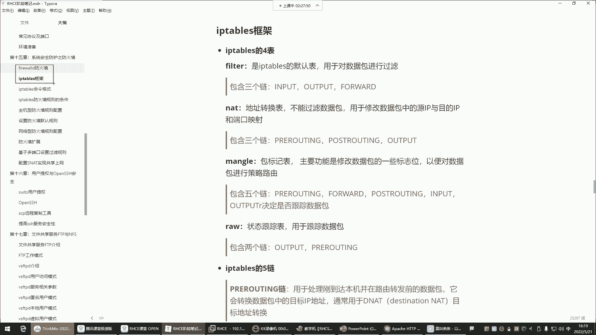
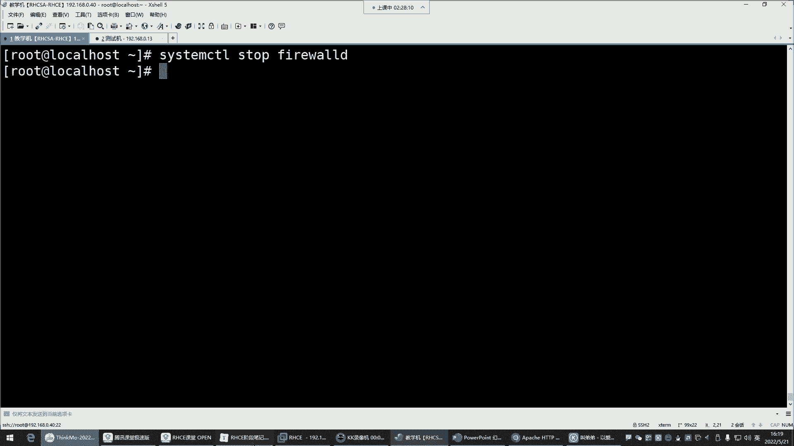
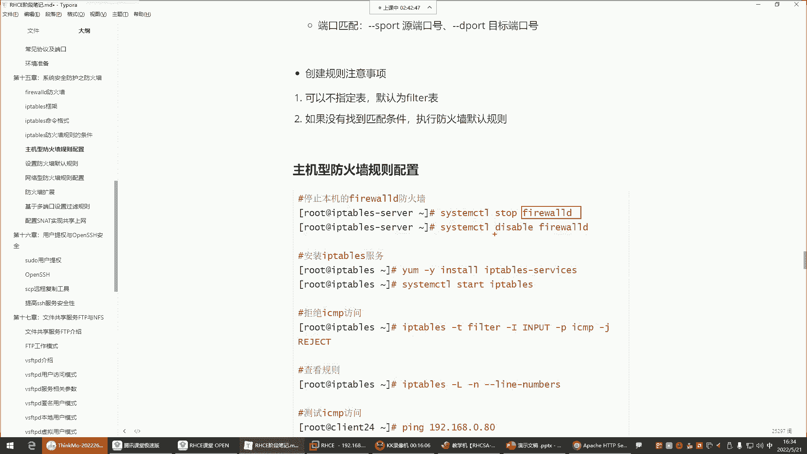
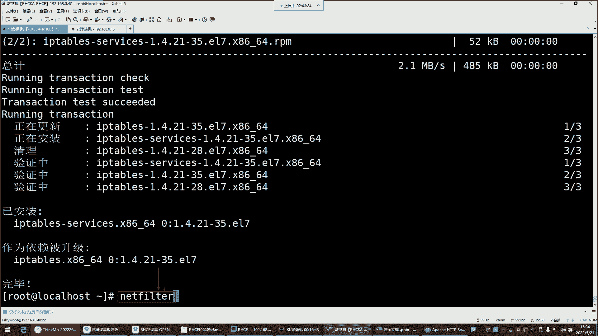
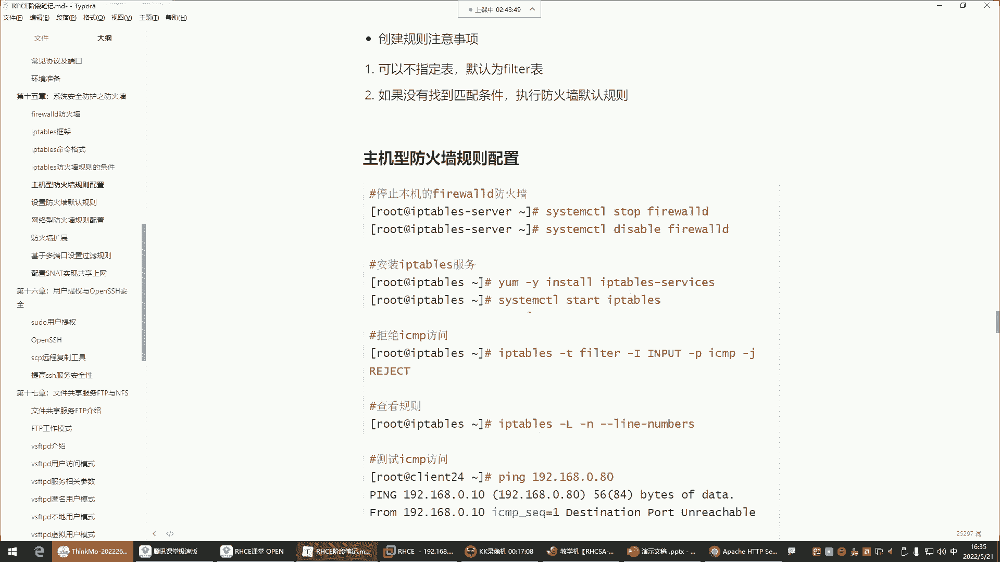
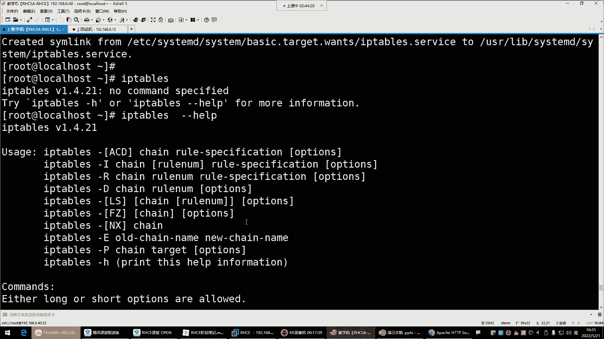
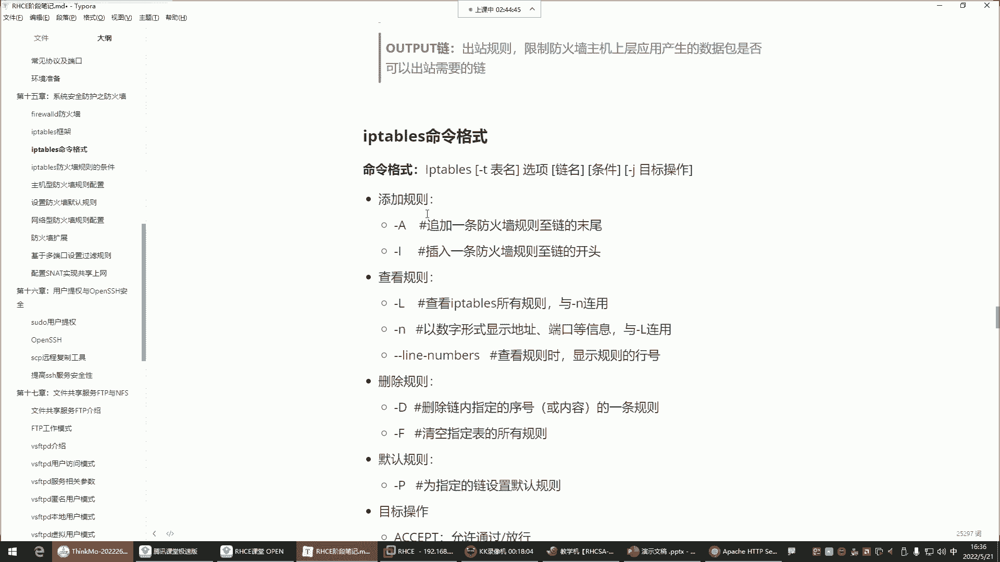
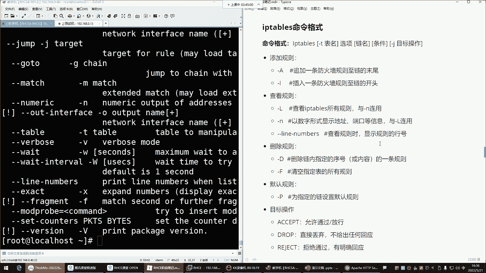

# Linux防火墙管理：P53：iptables四表五链详解 🔥

在本节课中，我们将要学习iptables防火墙的核心概念——四表五链。iptables是Linux系统中一个强大的防火墙管理工具，它通过定义不同的表和链来组织过滤规则，从而控制网络数据包的流动。理解四表五链是掌握iptables配置的基础。



## 防火墙工具的选择

上一节我们介绍了防火墙的基本概念，本节中我们来看看具体的管理工具。iptables和firewalld都是用于管理Linux内核中`netfilter`模块的防火墙工具。由于它们操控的是同一个内核模块，因此无法同时启用，否则会产生冲突。通常，我们根据需求选择其中一个使用即可。



为了学习iptables，我们需要先停止并禁用可能正在运行的firewalld服务。

```bash
systemctl stop firewalld
systemctl disable firewalld
```

## 核心概念：四表五链 🧩

与firewalld的“区域”概念不同，iptables通过“表”和“链”来组织规则。表是规则的容器，每种表有特定的功能。链则存放在表中，是我们实际配置规则的地方。

### 四张表的功能

以下是iptables中的四张表及其主要功能：

1.  **filter表**：这是iptables的默认表，核心功能是**对数据包进行过滤**。它就像地铁站的安检口，决定哪些数据包可以进入、离开或经过系统。我们配置的绝大多数防火墙规则都位于此表。
2.  **nat表**：此表用于**网络地址转换**，即修改数据包中的源IP地址、目标IP地址或端口。常用于实现共享上网、端口映射等功能。
3.  **mangle表**：此表主要用于**修改数据包的标志位**，进行更高级的策略路由。例如，可以指定数据包从哪块网卡进出。在实际运维中较少使用。
4.  **raw表**：此表用于**数据包的状态跟踪**。由于全程跟踪数据包会消耗大量系统资源，在企业生产环境中通常不启用此功能。

**核心规律**：一个表的功能决定了其内部所有链的功能。例如，filter表负责过滤，那么该表内的所有链都是用于过滤数据包的。

### 五条链的作用

链是规则生效的“检查点”。数据包在网络栈中流动时，会经过这些检查点，并匹配其中定义的规则。

以下是五条核心链及其作用：

*   **INPUT链**：处理**进入本机**的数据包。用于保护本机上的服务（如Web服务器、SSH服务）。这是配置主机型防火墙的关键链。
*   **OUTPUT链**：处理**从本机发出**的数据包。通常很少在此链配置拒绝规则，因为如果数据包不安全，在INPUT链就会被拒绝进入。
*   **FORWARD链**：处理**经过本机转发**的数据包。当你的Linux服务器作为网关或网络防火墙，保护内部其他服务器时，规则主要配置在此链。
*   **PREROUTING链**：在数据包进入路由决策**之前**进行处理。主要用于**目标地址转换**。
*   **POSTROUTING链**：在数据包离开路由决策**之后**进行处理。主要用于**源地址转换**。

### 表与链的对应关系

不同的链存在于不同的表中，承担着该表赋予的特定职责。理解它们的对应关系至关重要。

*   **filter表** 包含：`INPUT`, `OUTPUT`, `FORWARD`
*   **nat表** 包含：`PREROUTING`, `OUTPUT`, `POSTROUTING`
*   **mangle表** 包含：`PREROUTING`, `INPUT`, `FORWARD`, `OUTPUT`, `POSTROUTING`
*   **raw表** 包含：`PREROUTING`, `OUTPUT`

## 工作流程与应用场景 🛠️

上一节我们介绍了表和链的定义，本节中我们来看看它们如何协同工作。

### 主机防火墙 vs. 网络防火墙

*   **保护本机（主机防火墙）**：规则主要配置在 **filter表的INPUT链** 中。它检查所有目标是本机IP的数据包，决定是否允许其访问本机的服务。
*   **保护内部网络（网络防火墙）**：规则主要配置在 **filter表的FORWARD链** 中。当服务器作为网关时，它检查所有需要经过本机转发的数据包，决定是否允许其通往内部网络的其他服务器。

### 地址转换场景

*   **共享上网（SNAT）**：公司内网的私有IP电脑需要访问互联网。可以在网关服务器的 **nat表的POSTROUTING链** 配置规则，将内网电脑的源IP转换为网关的公网IP，从而实现上网。
*   **端口映射（DNAT）**：外部用户访问网关的公网IP和端口时，可以在网关服务器的 **nat表的PREROUTING链** 配置规则，将请求的目标IP和端口转换为内部某台服务器的私有IP和端口。

**重点提炼**：对于初学者和大多数运维场景，我们主要学习和使用 **filter表的INPUT和FORWARD链** 来实现访问控制，以及 **nat表的PREROUTING和POSTROUTING链** 来实现地址转换。

## 安装与基础命令 ⚙️

了解了核心概念后，我们开始进行实践操作。首先需要安装iptables服务。

以下是安装和启用iptables服务的步骤：



1.  停止并禁用firewalld（如果已安装）。
2.  安装iptables服务软件包：`yum install -y iptables-services`
3.  启动iptables服务并设置为开机自启：
    ```bash
    systemctl start iptables
    systemctl enable iptables
    ```
4.  查看iptables命令帮助：`iptables --help`



iptables的命令格式较为复杂，一个完整的规则通常包括：
*   指定表 (`-t`，如 `-t filter`)
*   指定链 (`-A` 追加, `-I` 插入等)
*   匹配条件 (`-s` 源IP, `-d` 目标IP, `-p` 协议, `--dport` 目标端口等)
*   处理动作 (`-j`，如 `ACCEPT` 接受, `DROP` 丢弃, `REJECT` 拒绝)



例如，查看filter表所有规则的命令是：
```bash
iptables -t filter -L -n
```



## 总结





本节课中我们一起学习了iptables防火墙的核心架构。我们明确了iptables与firewalld的关系，深入理解了**四表（filter, nat, mangle, raw）** 和**五链（INPUT, OUTPUT, FORWARD, PREROUTING, POSTROUTING）** 的功能与对应关系。我们知道了如何根据需求（保护本机或内部网络）在正确的表和链上配置规则，并完成了iptables服务的安装与基础命令的初探。掌握这些概念是后续灵活配置iptables防火墙规则的坚实基础。