# Linux运维RHCSA+RHCE培训教程：P57：FTP服务排错指南 🔧

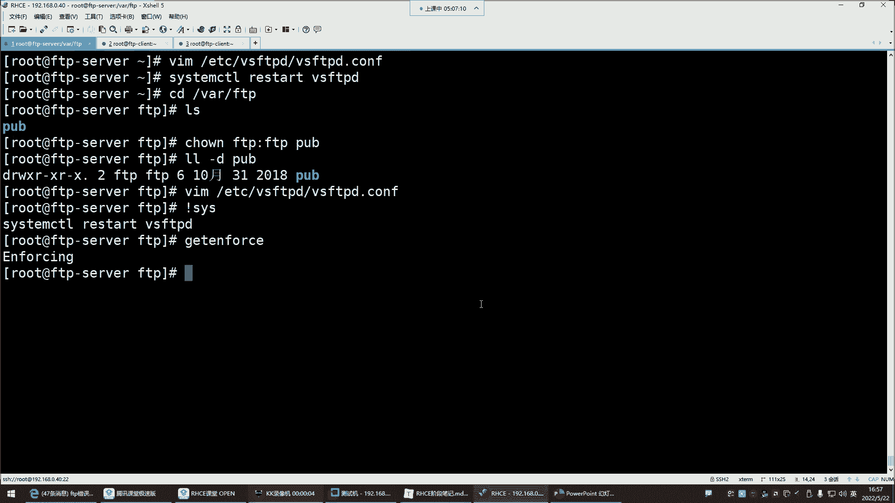

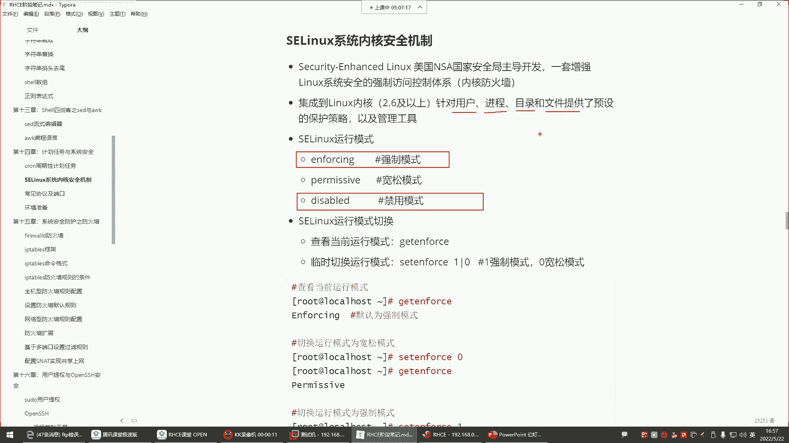

在本节课中，我们将学习如何排查FTP服务中常见的权限问题，特别是SELinux安全策略对FTP操作的影响。我们将通过实际操作，演示如何识别和解决因SELinux强制模式导致的文件创建失败等问题，并详细讲解FTP匿名用户的权限配置。

---

## SELinux强制模式的影响 🔒

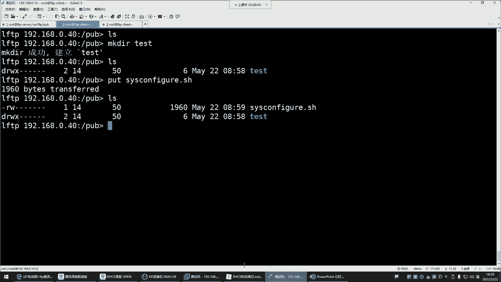

上一节我们介绍了FTP服务的基本配置，本节中我们来看看一个常见的“隐形”障碍——SELinux。

SELinux在强制模式下，会全面管理用户、进程、目录和文件的访问。这意味着，即使你为FTP用户配置了正确的文件系统权限，SELinux也可能阻止其执行某些操作，例如创建文件。

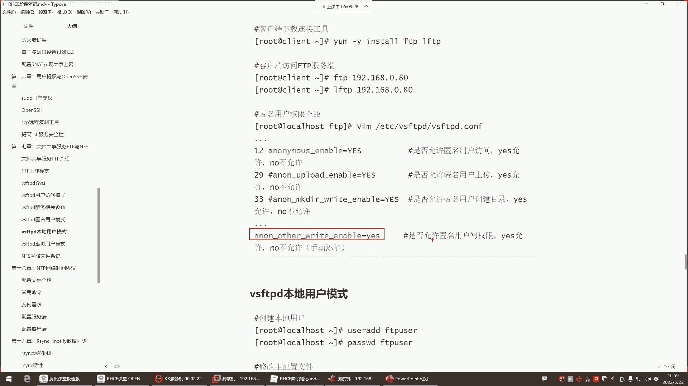

查看当前SELinux的运行模式，可以使用以下命令：
```bash
getenforce
```
如果输出是 **Enforcing**，则代表SELinux处于强制模式。在此模式下，FTP用户可能会遇到“权限不足”的错误，即使所有常规权限设置都正确。

要临时关闭SELinux的强制模式，可以将其设置为宽容模式：
```bash
setenforce 0
```
但这只是临时生效。若要永久禁用，需要修改其配置文件 `/etc/selinux/config`，将 `SELINUX=` 的值改为 `disabled`，然后重启系统。

**核心概念**：SELinux是一个**强制访问控制（MAC）** 安全模块，它通过策略规则来限制进程和用户的权限，独立于传统的**自主访问控制（DAC）** 权限（如rwx）。

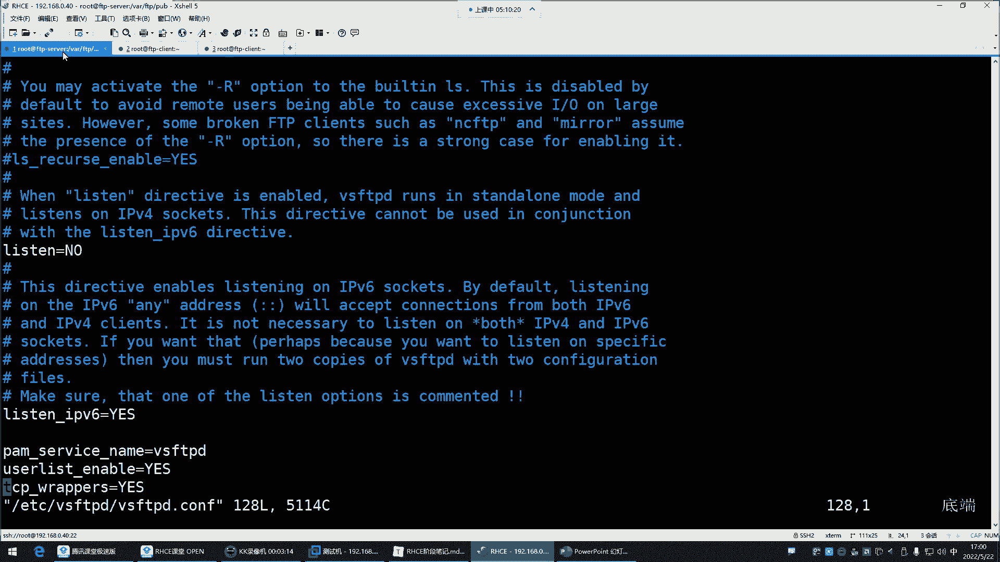

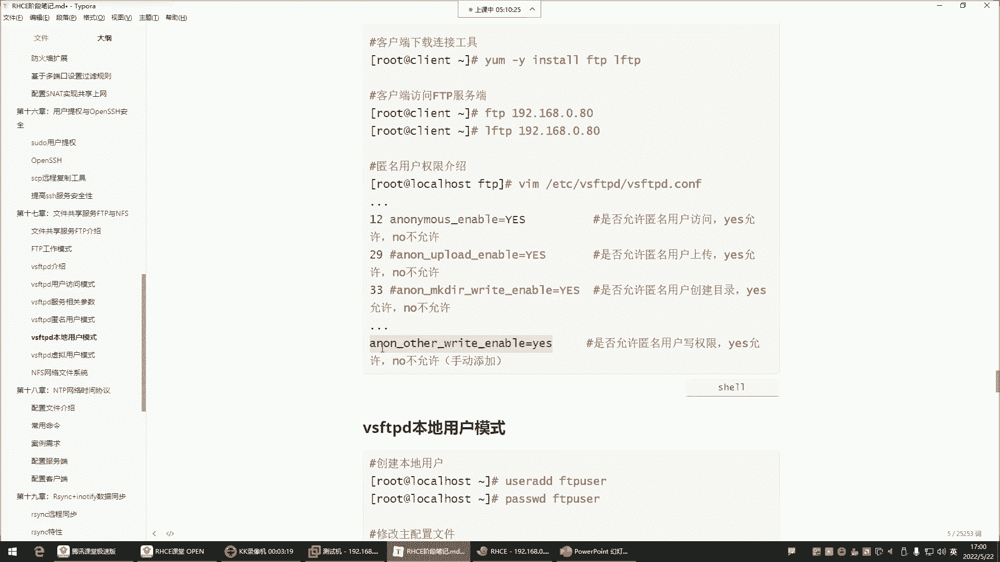

---

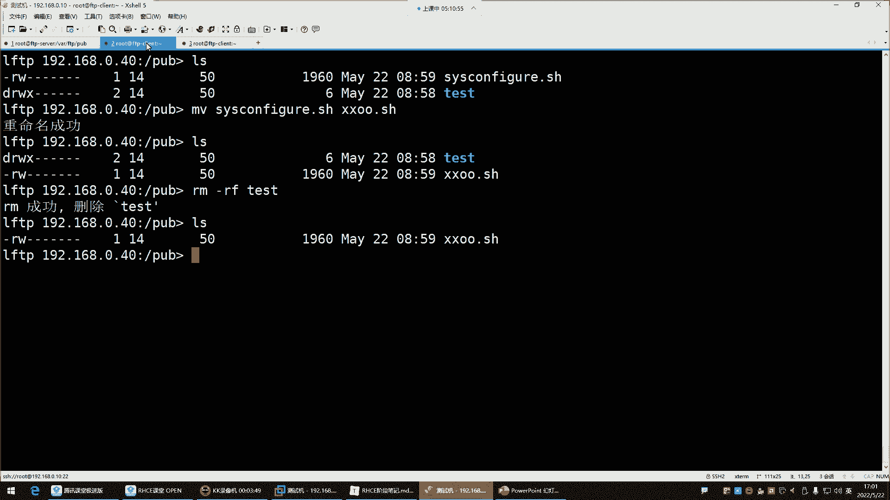

## FTP匿名用户权限配置详解 📁

解决了SELinux的干扰后，我们再来仔细看看FTP服务本身的权限配置。以下是针对匿名用户（通常映射为`ftp`系统用户）的关键配置参数，它们位于 `/etc/vsftpd/vsftpd.conf` 配置文件中。

以下是vsftpd.conf中控制匿名用户权限的主要参数：
*   **`anon_upload_enable=YES`**：允许匿名用户上传文件。
*   **`anon_mkdir_write_enable=YES`**：允许匿名用户创建目录。
*   **`anon_other_write_enable=YES`**：允许匿名用户执行其他写入操作，如**删除**或**重命名**文件。

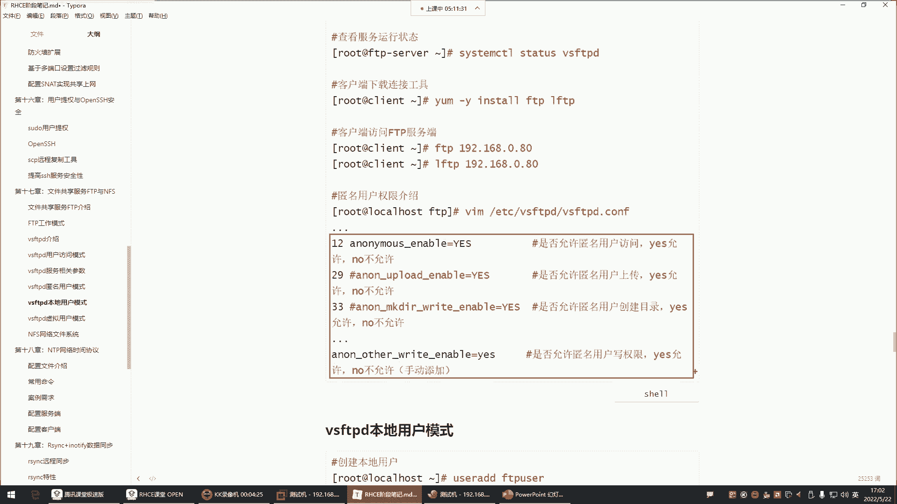

默认情况下，只有查看和下载文件的权限是开启的。如果需要匿名用户具备上传、创建或删除的权限，必须显式地在配置文件中添加或启用上述对应参数。

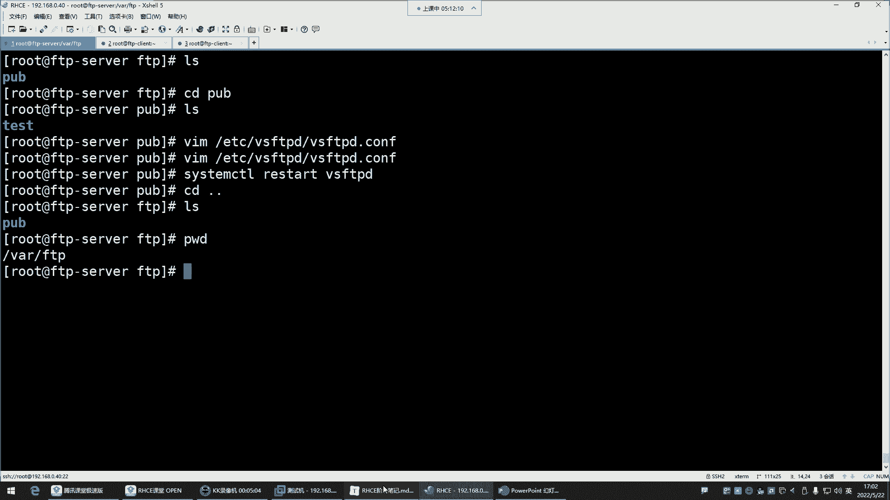

**重要提示**：修改配置文件后，必须重启vsftpd服务才能使更改生效：
```bash
systemctl restart vsftpd
```

---

## 企业级FTP权限管理实践 🏢

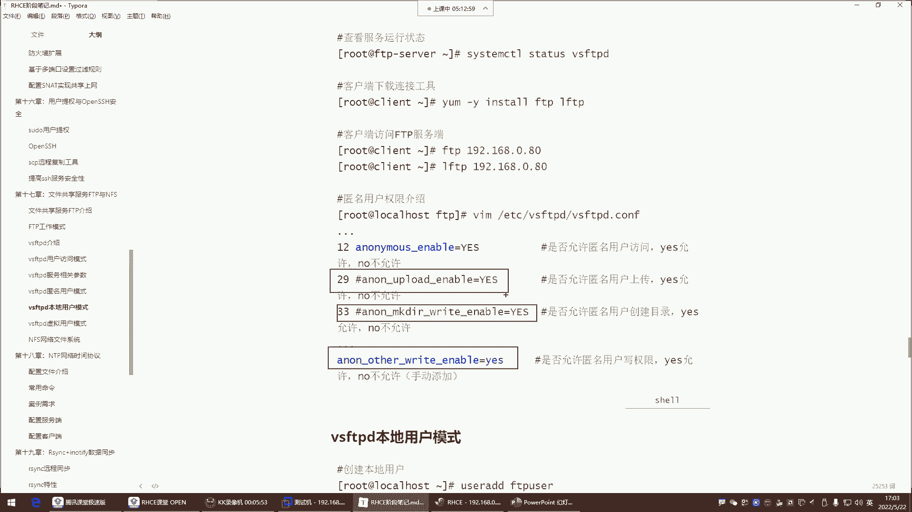

在企业生产环境中，出于安全考虑，我们通常会对FTP匿名用户的权限进行严格限制。

一般的安全实践是，在FTP的根目录（如`/var/ftp/pub`）下创建一个子目录（例如`/var/ftp/pub/share`）来存放共享文件。我们只对这个子目录进行灵活的权限设置，而保护根目录本身不被修改。

对于匿名用户，通常只赋予其**下载（读）** 权限，而**不会**开启上传、创建目录、删除或重命名文件的权限。这类似于公共网盘，你只希望用户来下载你提供的资源，而不是让他们随意修改你的存储空间。

因此，在配置文件中，类似 `anon_upload_enable`、`anon_mkdir_write_enable` 和 `anon_other_write_enable` 这样的参数通常会被**注释掉**或设置为 `NO`。

---

## 文件权限与FTP访问 🗂️

最后，我们还需要注意传统的Linux文件系统权限。即使FTP服务配置正确，如果共享文件本身的权限不允许其他用户读取，匿名用户也将无法下载。

例如，一个文件的权限是 `-rw-r-----`（所有者可读可写，所属组可读，其他人无权限），那么匿名用户就无法下载它。确保共享文件对“其他人”至少有读（r）权限：
```bash
chmod o+r filename
```
但请注意，通常不需要也不建议将文件权限设置为 `777`（所有人可读可写可执行）。遵循最小权限原则，只授予必要的访问权。

---

## 总结 📝

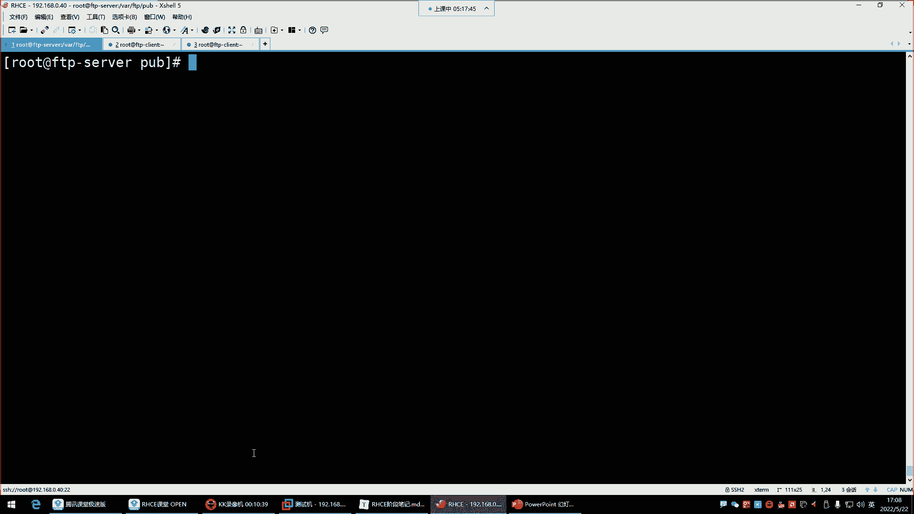

本节课中我们一起学习了FTP服务的核心排错方法与权限管理：
1.  **SELinux排查**：SELinux强制模式是导致权限问题的常见原因，可通过 `setenforce 0` 临时禁用或修改配置文件永久关闭来排查。
2.  **FTP权限配置**：匿名用户的额外权限（上传、创建、删除）需在 `vsftpd.conf` 中明确启用对应参数。
3.  **企业安全实践**：生产环境中应严格限制匿名用户权限，通常只开放下载功能，并在FTP根目录下使用子目录进行共享。
4.  **系统文件权限**：确保共享文件本身具有适当的“其他人读”权限，以保证FTP用户可以正常下载。

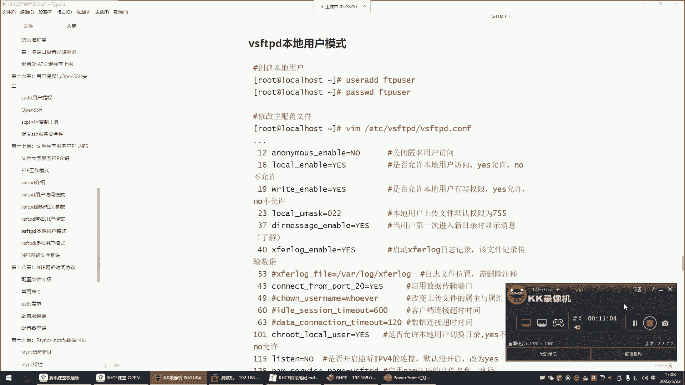

通过理解并协调好SELinux策略、FTP服务配置和基础文件权限这三层安全机制，你就能有效地搭建和管理一个既安全又实用的FTP服务器。