# Linux运维RHCSA+RHCE培训教程：P6：命令行编辑技巧与学习方法 📝

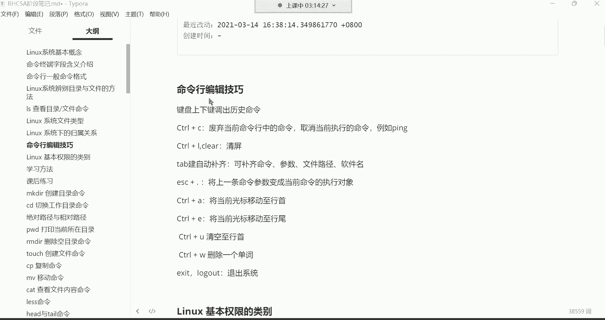

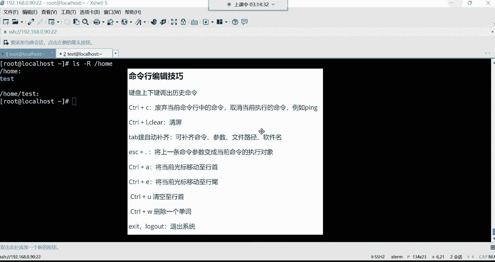

在本节课中，我们将要学习Linux命令行中的高效编辑技巧，以及一些重要的学习方法。掌握这些技巧能显著提升你的操作效率，而正确的学习方法则能帮助你更顺利地完成整个课程的学习旅程。

## 命令行编辑技巧 ⌨️

上一节我们介绍了`ls`命令的基本用法，本节中我们来看看如何更高效地在命令行中进行操作。以下是一些常用的命令行编辑技巧。

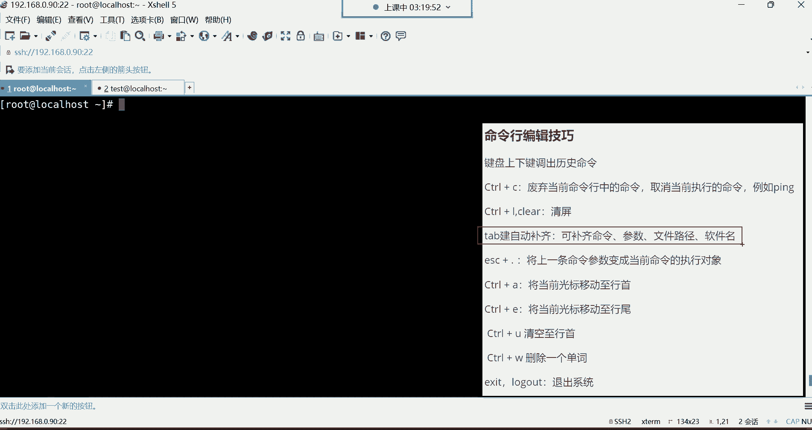

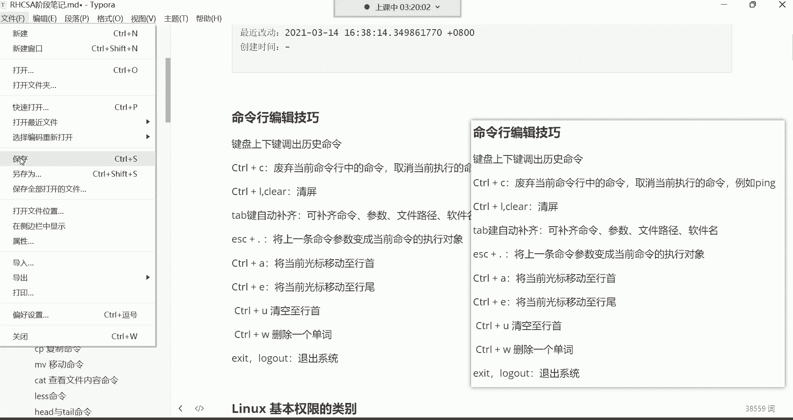

### 历史命令调取

键盘的上下方向键可以调出历史命令。例如，按上键可以翻出之前执行过的命令，按下键则可以往回翻。系统默认会保存最近1000条命令历史。

**注意**：在实际操作中，我们通常只翻阅最近的两三条命令。如果需要执行更早之前的命令，直接重新输入往往比一直翻找更高效。

### 命令控制与取消

`Ctrl + C` 组合键有两个主要功能：
1.  **废弃当前命令行中的命令**：当你在命令行中输入了命令但还未按回车执行时，按 `Ctrl + C` 可以取消该命令，光标会跳转到新的空行。
2.  **取消当前正在执行的命令**：对于某些会持续运行的程序（如 `ping` 命令），按 `Ctrl + C` 可以强制终止该程序的执行。

`Ctrl + L` 或输入 `clear` 命令可以清空当前终端屏幕，让界面变得整洁。

### 自动补齐功能

`Tab` 键是命令行中最实用的效率工具之一，它可以自动补齐命令、文件路径或软件包名。

**使用方法**：
*   输入命令或路径的开头部分。
*   按一次 `Tab` 键，如果系统能找到唯一匹配项，则会自动补齐。
*   如果按一次 `Tab` 键没有反应，说明有多个匹配项。此时按两次 `Tab` 键，系统会列出所有可能的选项供你选择。

**应用场景**：主要用于补齐**长文件路径**和**复杂的软件包名**。命令本身通常较短，无需补齐。

### 参数快速调用

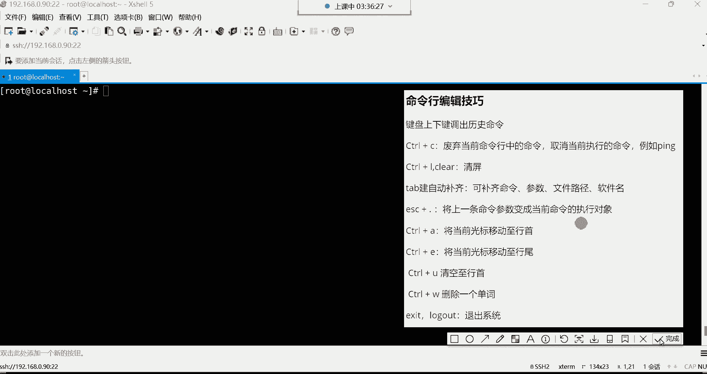

`Esc + .` （先按 `Esc` 键，再按 `.` 键）可以快速将**上一条命令的参数**粘贴到当前光标位置。这在需要重复使用复杂路径时非常方便。

### 光标移动与删除

*   `Ctrl + A`：将光标快速移动到**行首**。
*   `Ctrl + E`：将光标快速移动到**行尾**。
*   `Ctrl + U`：删除从当前光标位置到**行首**的所有内容。
*   `Ctrl + W`：删除光标前面的一个“单词”（以空格为分隔）。

### 退出系统

以下是退出当前登录会话的命令：
*   `exit`
*   `logout`

两者功能相同，任选其一即可。

---

## 核心技巧总结与学习方法 🧠

### 必须掌握的技巧

对于初学者，请优先熟练掌握以下技巧，它们将贯穿你的整个学习过程：
1.  上下方向键调取历史命令。
2.  `Ctrl + C` 取消命令。
3.  `Ctrl + L` 清屏。
4.  `Tab` 键自动补齐。
5.  `Esc + .` 调用上一条命令的参数。
6.  `exit` 退出系统。

### 高效学习方法

学习技术不仅需要努力，也需要正确的方法。以下是给你的几点建议：

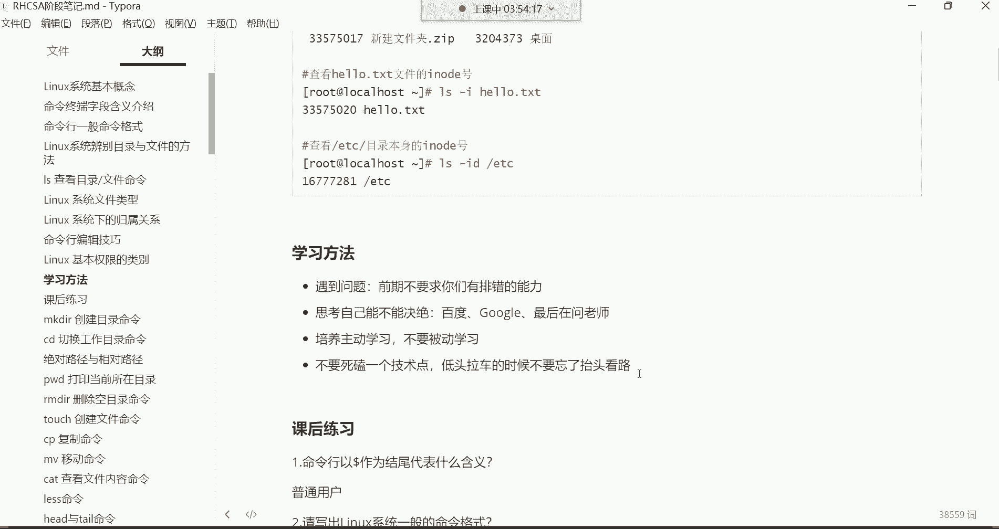

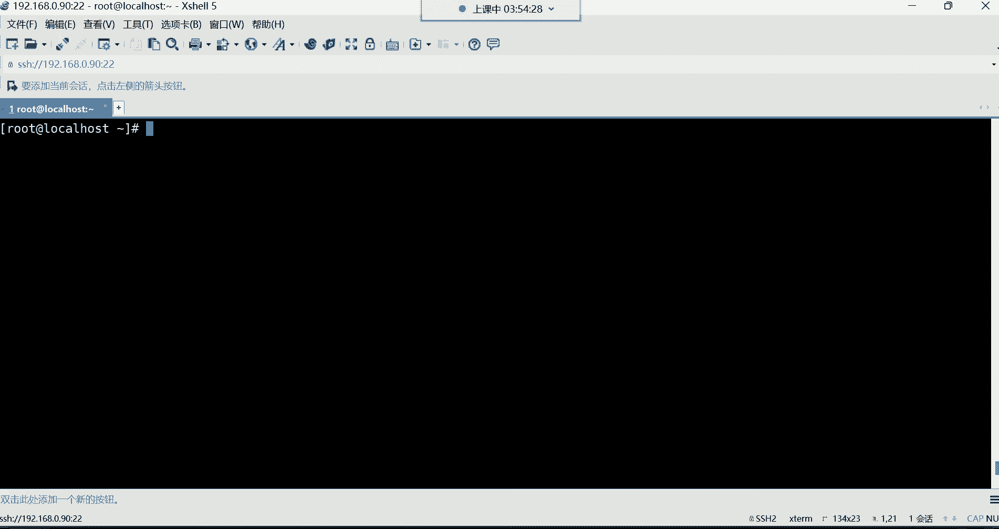

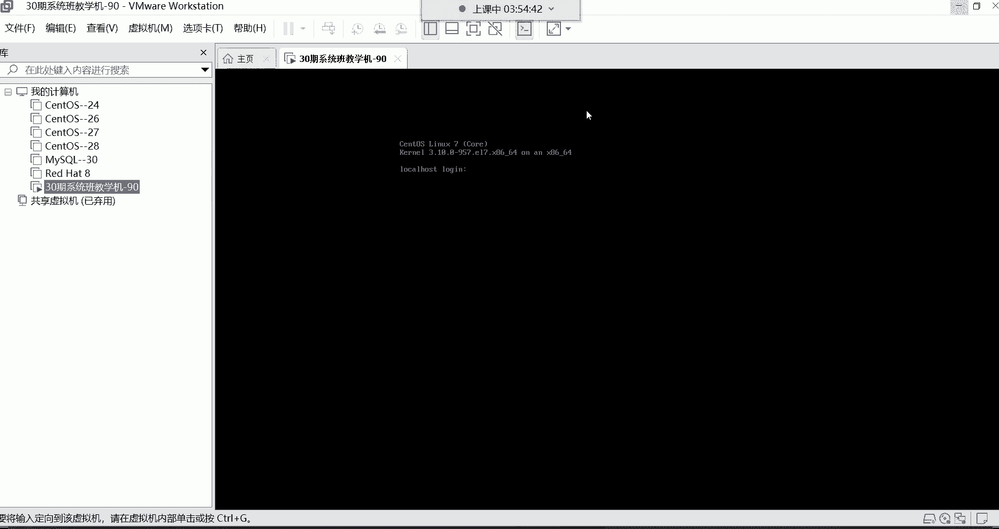

**遇到问题怎么办？**
*   **初期**：作为新手，遇到问题可直接在课程群内提问，有专门的答疑老师（如磊神老师）和班主任（木木老师）提供帮助。
*   **后期**：要有意识地培养自己解决问题的能力。尝试先通过搜索引擎（如百度、谷歌）寻找答案。**如何精准地描述问题**，是获取有效答案的关键技能。

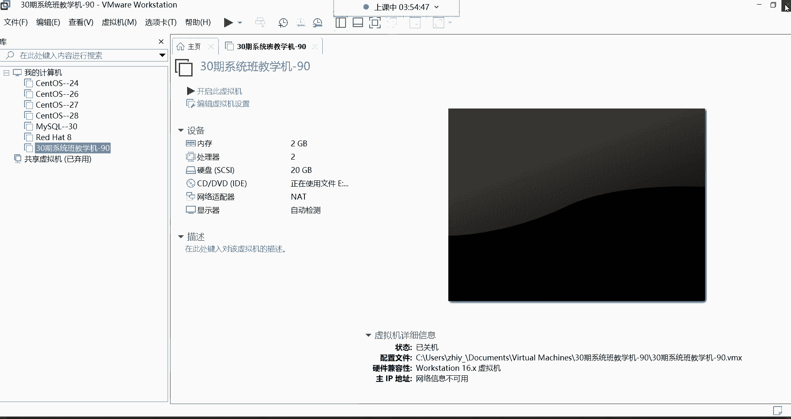

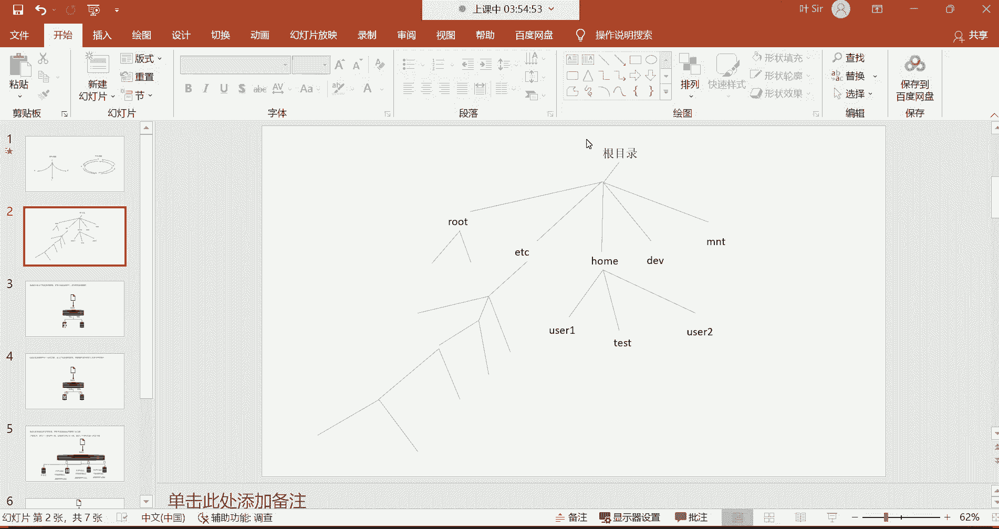

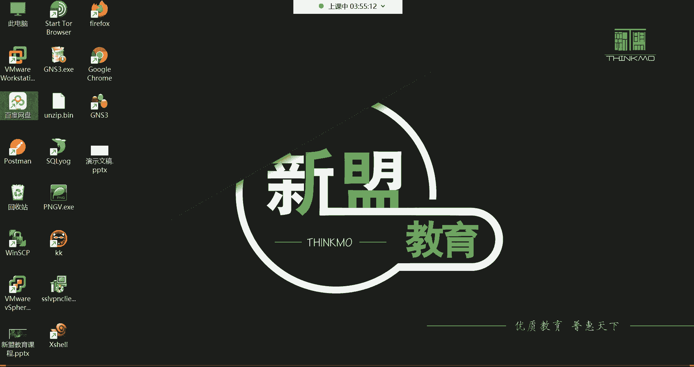

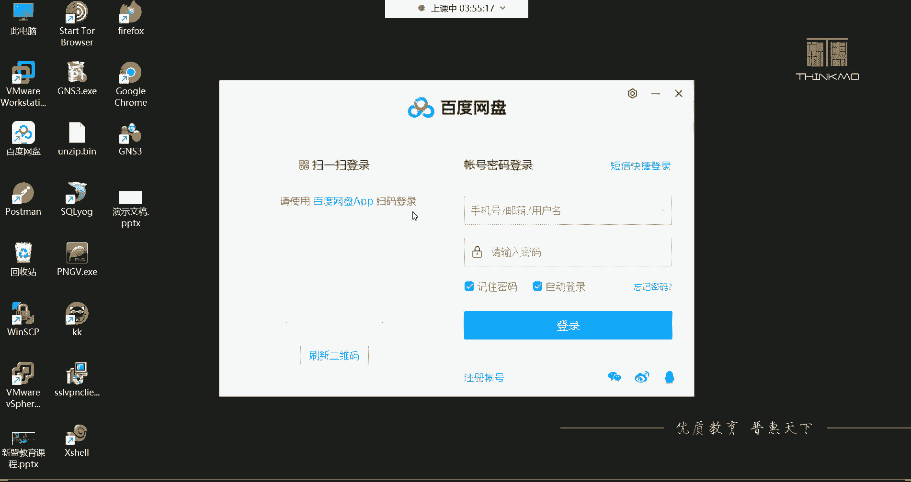

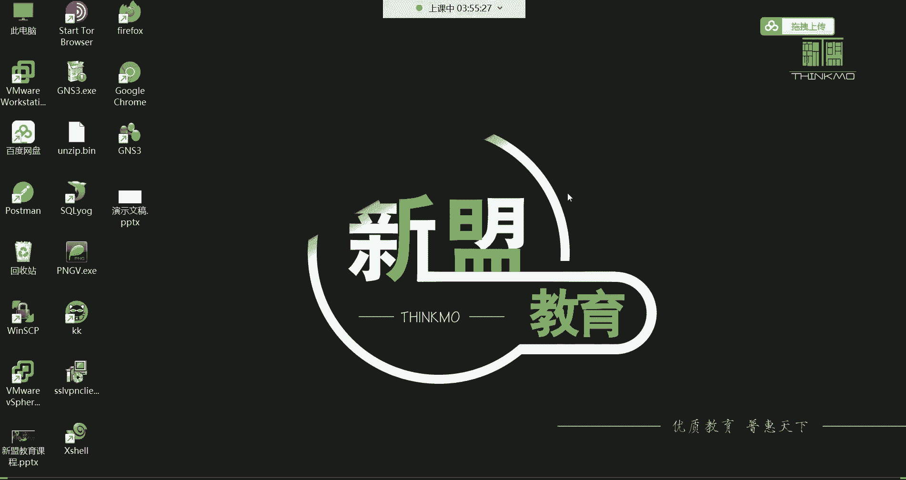

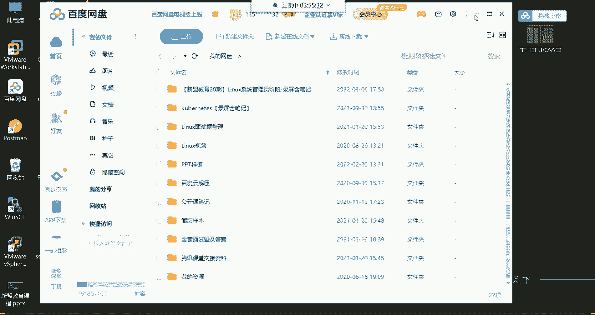

**学习态度与节奏**
*   **主动学习**：不要局限于课堂内容。对于讲过的命令，可以主动查阅资料，了解其更多选项和用法。
*   **坚持不懈**：整个课程周期约为五个半月。请将这段时间视为“闭关修炼期”，全力以赴。用短期的集中投入，换取长期的职业发展和高薪回报。
*   **不要钻牛角尖**：如果某个知识点暂时无法理解，不要过分纠结而停滞不前。可以先做标记，继续后续的学习。很多时候，学到后面的知识会自然解开前面的疑惑。这就是“低头拉车，也要抬头看路”。

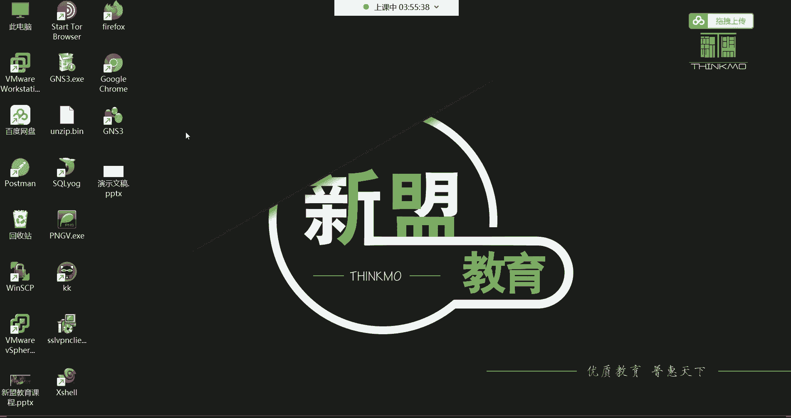

**资料使用**
*   课程笔记（MD源码和PDF版）和录屏会上传至网盘，可在群公告内查找链接。
*   推荐使用 `Typora` 软件打开和编辑MD格式的笔记。
*   课程资料包中还提供了《Linux系统常见英文单词表》，帮助不熟悉专业术语的同学学习。

---

本节课中我们一起学习了Linux命令行的核心编辑技巧，包括历史命令调取、命令控制、自动补齐、参数快速调用等，这些是提升操作效率的基础。同时，我们也探讨了持续学习的重要性以及遇到问题时的解决策略。记住，在五个半月的学习期内保持专注和主动，你将为自己未来的运维职业生涯打下坚实的基础。

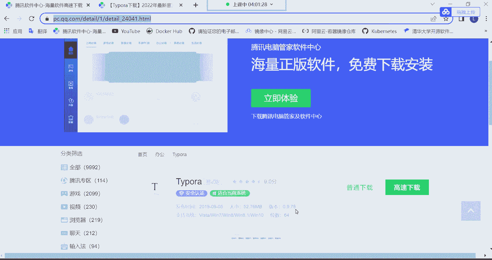

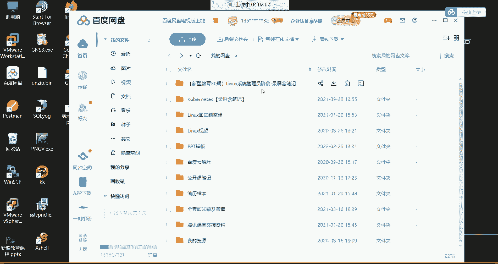

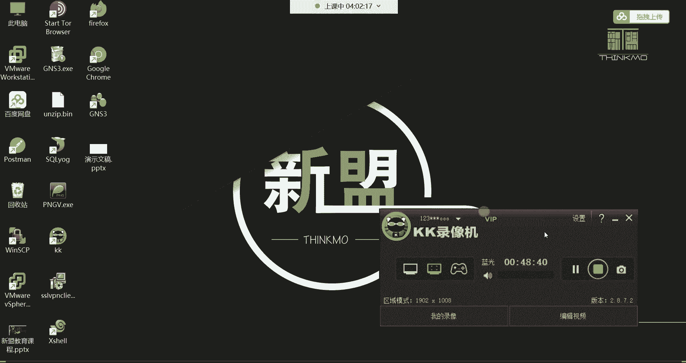

现在，你可以使用 `exit` 命令退出系统，或直接关闭终端。下节课我们将开始学习更多的Linux常用命令。