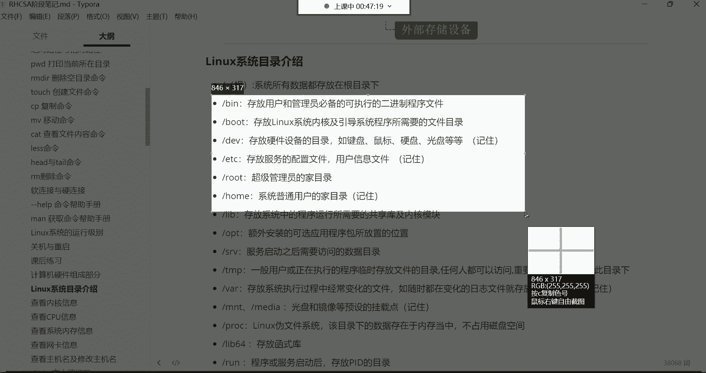
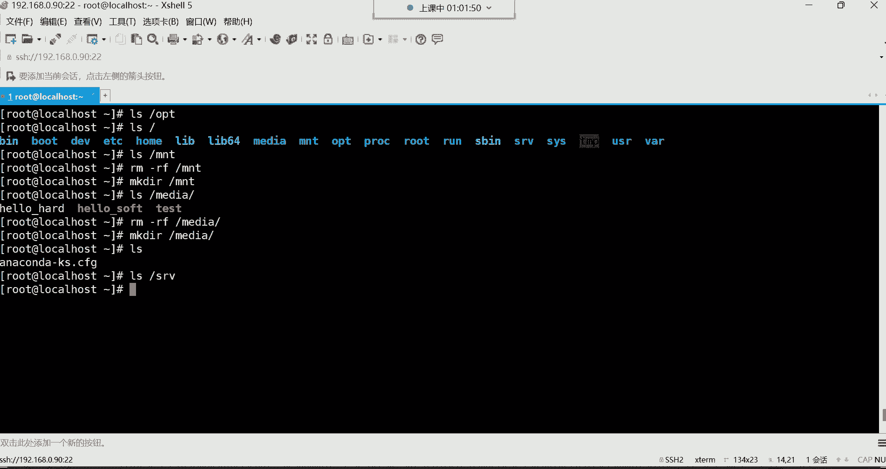
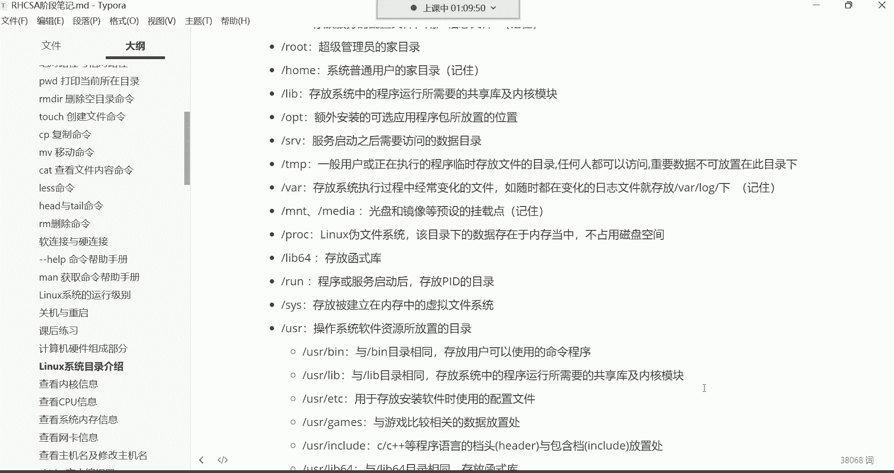

# 新盟教育-Linux运维RHCSA+RHC培训教程视频合集，全网最新最全最详细！ - P10：红帽RHCSA-10.计算机硬件组成介绍、Linux系统目录介绍 - 广厦千万- - BV1up4y1w729

喂喂喂，hello hello，大家能听到我这边的声音吗？啊，早啊。😊，我们这个时间过得有有点非正常了，是吧？我们这个在下午的时间段，我们在相互的互问这个早安，让如果被别人看到。

可能会感觉非常的奇怪是吧？这些这些人到底是干什么事的呢？是吧啊？😊，呃，但是。没有办法是吧？这这就是我们的生活嘛，时间好快，我们一一周过去了，我们又见面了是吧？嗯。时间过的就是这么快。

来也匆匆去也匆匆的一晃呢，可能说这个一个礼拜就过去了。再一晃呢，可能说我们这个学习这个整个阶段就已经过去了。再一晃呢就一年过去了。再一晃呢可能说。嗯，哼时间过得还是飞快的哈。

所以说呢有的时候我在前边的阶段的努力啊，你过一段时间以后，你再回过头来发现，哎，其实也就那么回事儿。😊，现在可能说大家在基础阶段阶段哎呀，我挺难的啊，接触这个东西呢感觉我特别的头疼啊非常非常的痛苦啊。

不适合人类去学习是吧？但是。😊，等你过了几个月以后，或者说你再过了1到2年之后，你再回过头来再去回顾一下自己当初那个状态。你发现哎，这当初这样东西怎么就学起来那么费劲呢？就不会有这种想法了。

所以说时间呢就是最好的什么呢？最好的一剂良药。好，那接下来呢我们就开始吧哈，我们这个机器我已经开机了，然后呢，我先连到我们的个机器上面去。😊。

我们是90。再晃就没了是吧？没错，再晃就没了。😊。

好，量了之后呢，我们。😊，来说一下我们上节课讲解的内容。我们呢就把这个课后练习做一做，就能够清楚的把我们前面学过的这基本命令基本上都能够复习个遍了啊来看一下这里面都有答案也不难。

请在TMP目录下创建一个dent目录，然后并在dent目录下面创建T1T2T3文件这个考研的是什么呢？不就是makeDR这个命令嘛？是吧？在TMP目录，你去建一个sdent然后呢。

你切换到sdent目录，我们考研的不就是CD这条命令吗？啊，前面是创建目录的命令，接下来呢是切换目录的命令接来之后呢，让你建T1T2T3文件。那考你的不就是touch这条命令吗？

建三个文件出来是不是啊啊这非常的简单。然后呢我们也可以用这种方式，这种方式是什么方式呢？这种方式就是以绝对路径的方式指定我要创建的这个文件所在位置，在哪呢在TMP目录的sdent下边建个。😊，T1。

然后呢T2T3啊，前面是呢是你直接切换到这个路径，然后呢，以相对路径的方式，就你已经你已经在这个目录里边了，咱们就直接去用to创建就行了，不需要指定前面的路径了。而这个呢是指定了前面的所在路径啊。

这种指的是如果你不在这个当前的路径下边哈。😊，啊，然后第二道题请在TMP目录下递归创建test一test2test3目录。其实这考验的是一个目录结构啊，就是你test一，然后呢。

t呃这个画的有些那个啥了哈，test2，然后呢，test3啊考研的是一个目录结构。那这个目录结构的话呢，你就得什么呢？😊。

一条命令如果想实现这个功能呢就是makeDRR加个杠P杠P呢不是可以帮我们实现递归创建吗？是吧？所以就可以帮我们把T一这个不存在的目录创建出来之后呢，再在这个目录下面建一个test2。

然后再在test2下面去建一个test3啊，这种是递归创建。然后第三题切换到TMP下边的这个ts3目录下，并打印当前所在目录。其实就是考验的就是1个PWD命令。

其实我前面这几个题给大家留的都是考验什么呢？就是你在进行路径切换的时候，呃，对于这种绝对路径，还有这种相对路径，容不容易犯糊涂啊，你要容易犯糊涂，你发现你切着切着哎，找不到这个路径了，就直接报错了。

说提示你说没有什么所没有什么这个目录。好。那我们看第四题，第四题，请同时在OPT跟media目录下创建upload的这个文件。那这一条命令就可以搞定了toashOPT下的upload。

然后media下的upload哎，这种比较简单，你只需要指定我要把这个文件建在哪个目录就可以了。因为这条命令可以帮我们同时在多个目录去创建文件。OK然后第五题，请在OPT目录下的upload文件移动至。

我们前面建的那个test3目录，并改个名叫upload点 bike。这个考验的是一个MV命令。因为你看就是将文件移动嘛，移动不是考验的就是你个改名吗？好，那就把这个文件给它移动到什么呢？

MV把OPT下的upload移动到。这个路径下面去，当然你要改名，你后边就得指定移动过去以后，它的新的名字叫什么了啊，所以这时候呢就后边路径后边指定新的名字就可以了。考验是MV命令。

然后请将ETC下的passW的文件拷贝至OPT目录下，并改名为passWD点并保持属性不变。好，那这个考验的是1个CP命令，然后呢，再结合它的一个杠P选项CP是做拷贝的。

然后杠P这个选项呢是在拷贝的时候，可以保持这个。文件的原属性不变啊，就是这个文件原型的属性是什么？拷贝过去之后呢，这个文件仍然是什么样的属性？然后第七题。

请将ETC下的FStable这个文件拷贝至OPT目录，并改个名叫FStable点啊，这个也是考验的是CP啊。但是呢这里边并没有指定说非得要保持属性不变是吧？所以这个杠P你可以加也可以不加啊，这无所谓了。

然后下边呃请将ETCC confinetwork杠 ifFG杠ENS32这个网卡，这是网卡文件拷贝到OP目录下，并改名为叫ENS32点。那这个呢也是考的是CP命令。然后呢这个主要是考什么呢？

考验大家对系统的，我们后边会学习的这些文件，你像什么这些文件都都是我们后期会经常用到的文件。也像ETC下的passWD，还有ETC下的FStable，还有这个网卡的文件在这个非常长的一个路径。

这些就是为了让大家能够什么呢？能够对这个文件的所在位置呢，能够多多的去熟悉的啊，因为后期呢我们这些文件会详细去讲它。所以到时候你别到时候说这个文件在哪你记不住了，这就有些尴尬了。好，第九题。

请将ET请删除ETCy么的re这个目录下所有的内容。呃，删除所有的话呢，我们前面在讲RM这条命令的时候，我们有了一个星号。哎，这个星号的话呢我们。只简单给大家介绍一下，我们说代表是任意所有没错吧。

所以说呢你如果说想清除一个目录下所有的时候，我们可以暂时用这个星号来表示啊，代表是任意所有的意思。OK。但是注意啊，这个位置你不要忘了加一个路径分割符哈，因为你要删除的是这个目录下边的所有数据。

所以一定要加一个目这个路径分割符。如果你不加路径分割符，它是不是就会认为yD。后边的任意所有啊。他认为你可能是要删除是这个目录的名字叫ymre在后边叫什么就无所谓了。只要是什么呢？前面以这个开头的。

那就被删除，那可能说你这个目录就被删了。啊，所以这边大家这根斜信哈，你一定要注意一下。😊，知道吧？O。然后第十题，请将ETC点repo demo下创建一个叫local点repo的文件。

那就考验的是一个touch这条命令。然后主要是这个路径呢，大家现在也熟悉一下这个路径呢后边也会详细的去讲解。还有第十一题，这个请查看网卡文件的末尾五行内容。这考研的不就是我们前面给大家讲解的叫t命令吗？

叫hand与t。那太阳命令是可以查看一个文件的末尾多少行的。然后后边呢你指定行数就可以了。你指定多少行，他就给你看末尾的多少行。好，OK然后两两种方法直接杠5或者说杠N5都可以，但效果是一样的。然后呢。

第十二题，请查看ETC下的passWD文件。第一行内容啊，就看头一行，那就焊了。杠一或者说杠N1就可以了。那这个考验的也是我们这个汉的与他有这两条命令。都是查看文件内容的。

然后下边请查看ETCho name这个文件的内容，那考验的是ca这条命令。然后请查看ho这个文件内容，考验的也是ca命令，以及这个对于这个文件的现在一个熟悉。然后下边对于软链接语硬链接的特点呢。

这个呢是一些理论性的东西。啊，请说说软链接与硬链接的特点。因为有有有的时候大家在比如说就是你在去面试的时候，有的面试官可能说他技术水平呢没有那么高啊，技术水平没有那么高啊呃。

他可能说就是呃懂一些基础的啊如果真的是问问出了这些比较基础的相关概念性的东西呢，没有什么实操的内容，有时候你说不出来吧，你感觉哎呀这基础不牢是吧？所以对于这种软链接与硬链接一般也是容易被问到。

那可能说别人会问这个在linux斯这个系统下边软链接的特点是什么呀？硬链接的特点又是什么呀？啊，他可能这么问你，所以这时候呢你要是说不出来吧，人家就会认为你这个人的对你这个基础太差了。😊，基础太差了哈。

所以你基础都这么差，他也不会认为你这个人对于这个比如说那些高大上的技术有多么的厉害。😊，所以有的时候这个基础性的东西呢还是非常非常重要的。OK所以有一句话叫什么叫基础不牢，地动山摇。什么意思呢？

就是说你基础如果打不好，后期学什么东西都都稀里糊涂的。哎，这玩意就跟盖房子一样，然后盖房子就跟你地基打不牢，你发现这房子它不抗风不抗雨的，是吧？摇摇晃晃的，也盖不了多高，其实是同一个意思。

那软链接跟硬链接，你只需要就是把我在课上在课件上给大家写的这些特点给它记下来，就几乎就没有任何问题嗯。对，基础好面试还有机会。嗯，软链接呢可以跨分区，嗯，然后呢可以对目录进行链接。原文件删除以后。

链接文件不可用。这个具体的含义呢都给大家讲过了，所以就不啰嗦了哈。你副基础是吧？没关系啊，副基础，你现在不是在打基础吗？然后硬链接不可以跨分区，不可以对目录进行链接。原文件删除以后。

链接文件就仍然可用啊，它是一个以文件的副本形式存在的，只不过它跟那种拷贝的区别就在于说它可以实现一个数据的相互同步啊，分区是什么意思呢？分区的话是不是上是不是没有听上节课的内容啊。😊。

啊，没有听上节课内容哈。这个分区呢就是你拿windows来讲，就是你的C盘跟你的D盘，这是不同的分区。然后跨分区呢，就是我想把C盘里的一个文件干嘛给它创建一个快捷方式，给它快创建到这个E盘里边。

其实就这意思啊，就跨分区了。😊，O。

好，然后我们再来看这个第十六题啊，这里面有新学员是吧？新学员就看看什么呢？看看前面讲过的内容，这些都讲过哈。😊，嗯。好，但是lin呃linux里面怎么分区呢？还没讲到分区的时候呢，所以先不要急。

我们现在还没到那个阶段。好，第十7题，请在OPT目录下创建1个hello点号的文件，然后并创建硬链接啊，并创建硬链接到TMP目录，然后查看文件的显示属性，这就是什么呢？就建个文件。

然后用LN创建一个硬链接。但是呢注意在硬链接，甭管是软链接还是硬链接的时候，一定要注意一下，要指定它的绝对路径哈。OK。然后第十八题，如何获取LS的命令的帮助？这考验的就是怎么说呢？

这个help命令帮助或者说慢命令帮助的方法啊，这种东西呢还是那句话能百度呢，尽量先百度。因为毕竟你去慢这个命令的帮助，他给你的反馈，大多数你也是看不懂的。所以你还不如直接去百度。

对于我们中国人来讲是还是比较符合我们的一个情况的。O最起码你能看得懂。好，那第十九题请说出linux系统的运行级别。这个运行级别呢总共是7个，然后从0到6啊，总共是7个级别。

这7个级别呢零就是关机的级别。一就是单用户级别。二呢就是多用户级别，三是是一个正常的标准运行级别。然后四呢，现在还没有被用上。第五呢也是一个标准运行级别。但是带图形。第六呢就是处于重启的一个级别。

Okay。好，然后第二十题如何重启类ux斯系统，那常用的命令就是reboot。啊，这是我们上节课讲的是要关机与重启。那你看我们花了将近14分钟的时间啊，零还算级别，你你系统关机就属于零级别了。好。

你看我们花了14分钟的时间，就把我们上节课给大家讲解的内容是吧？通过这些就是我给大家准备的这些练习题的方式，基本上。都给复习了一遍了，是不是？所以说这些东西就考验你前面那个东西呢。能不能够熟练的去掌握？

所以说就是敲敲这种练习题就可以对这个多练练就好了。基础命令没有什么太多呃，这个什么呢？太多的这种所谓的学习方法，只能多敲多练这种东西。就跟那个什么呢？就就跟老话说的好，叫熟能生巧。嗯，熟能生巧。

你敲一遍的时候，你发现这种东西特别不好记，你敲十遍，你看你感觉就不一样了。你敲它10遍，你发现这种东西你闭着眼睛你都能敲出来了啊，都已经形成记术记忆了，是不是？所以什么东西呢？你得多多的去实践它啊。

这样才可以啊是。😊，好，然后下边呢我们来给大家讲讲这个叫计算机的硬件组成。我们这个硬件组成主要是考虑到很多基础比较弱的同学。呃，这个基础比较弱，就是他没有计算机基础的同学，我们呢给大家来讲讲对于这个。

我们个人计算机以及在企业里面的这个服务器，它的这个具体的硬件啊，组成部分都有哪些？呃，计算机硬件组成呢就是你从外边买回来一台电脑。注意哈，你从外边买回一台电脑，那你这个电脑里边都有什么东西呢？

你这个电脑里边啊就是一堆的硬件。啊，这个硬件。它大体呢是分为就是叫做输入设备的硬件，还有叫主机设备的硬件，还有输出设备的硬件，还有一些外部的存储硬件。好，哎，包括这个CPU好。

那我们说说这个输入设备在计算机里面都有哪些呢？鼠标键盘啊，包括现在有的电脑都可以触屏了，是不是啊？哎，这些都属于叫做输入设备啊，就是我们通过鼠标键盘把我们的操作呢传递到计算机。OK这是输入。

那主机设备呢就是在你的机箱里边，你这个机箱里边都有什么东西啊？有主板是吧？这个主板连接的什么呀？连接的计算机的整个硬件，在这一个大主板里边，然后呢，这里边有你的CPU啊。然后呢，这个CPU呢。

我们叫中央处理器，叫中央处理器啊。然后主机存储器呢其实就是一个内存条啊，我们说的就是那内存条啊，跟CPU挨着。那网卡的话呢也是一个条啊，网卡嘛，然后声卡呢也是一个条，显卡也是一个条，能理解吧？

就是这就是计算机的硬件组成。你从外边买回一台电脑，你那个机箱里边就这些东西，还有什么风扇？还有什么风扇，还有什么这个什么。这个管那个管儿的等等等等哈。就是你如果去干嘛呢？你如果去花钱去配一台计算机的话。

其实这些硬件组成不用我说，那其实你们心里就应该都有数了。一台计算机呃，由硬件组成部分，其实也就是那么几个。嗯，我我给你们找一找哈，我曾经配过一台主机，然后这个我配的这台主机，我是自己定义的硬件。

找找那个人哈找找那个人。啊，这个。嗯，这个聊天记录好像被我给删了，等一下哈。这些东西都不难。嗯。我给你们搜一搜哈搜一搜。嗯。这个。时间有些长了，就是可能。跑哪儿去了？行，等我嗯等我下去再找吧。

找到我再给你们看吧。OK吧，因为确实是这个。嗯。确实是已经很长时间了哈。对。不搜了哈，没你们没事，可以自己去自己去网上去百度百度。如果对于计算机基础知识较弱的，自己去百度百度。其实这些东西呢都非常简单。

一堆硬件啊，在服务器里面也是这一堆硬件啊，然后那像输出设备都有哪些啊输出设备，那就像耳机耳机也是属于一个输出设备，屏幕也是输出设备，会把所有的结果返回给我们像打印机、投影仪，这些都属于输出设备。

一个计算机的组成部分。还有像这个外部存储，外部存储呢，就一些比如说我们的硬盘。😊，呃，硬盘、光盘、软盘、U盘那还有像这种光驱啊，都属于叫做外部的存储设备了啊，这些其实组成了就是一个什么呢？一个计算机。

然后呢，我们是在这一堆硬件之上去安装操作系统，然后在操作系统之上去安装各种各样的软件，然后你就可以去什么呢？呃，该干嘛干嘛了。比如说听歌看电影打游戏啊，聊天等等等等。这就是一个计算机的组成部分。

由一众多的硬件。组成的一个计算机。O。然后呢，对于CPU来讲呢，我们然后这位呢像什么CPU缓存呢，这个简单给大家说说为什么会有CPU缓存哈，就在计算机里边，对于硬件来讲呃，它是什么呢？就是。😊。

处理速度最快的其实就是CPU了。嗯然后其次就是内存，然后最慢的就是硬盘。然后你怎么去理解这三者之间关系呢？呃，你可以把CPU给它理解成它的速度，就像火箭一样啊，像火箭一样，这个内存的速度呢就像飞机一样。

然后这个最后那个硬盘啊，硬盘的速度呢就像。绿皮火车一样啊，所以说你可以让可以这样去理解他们三者之间的一个什么呢一个速度。因为这三个东西都是用来干嘛，都是用来帮我们用户去进行对数据去处理的。

比如说CPU做什么事情啊，CPU啊，它是帮我们去计算数据的。计算哪些数据？比如说我们在系统里边我们做一些操作的时候，或者说你想运行一个软件。你想运行一个软件，那这个软件的所有的数据得需要计算。

谁去计算呢？CPU帮你去计算啊，但是这个软件的运行呢又需要内存啊，这个内存是能够什么呢？支撑软件运行的一个非常重要的资源，没有内存软件也无法运行。所以说这个内存到时候呢会干嘛会让这个软件运行起来。

最后呢，数据往哪存呢？往这个硬盘里面存。所以为什么CPU有缓存呢？CPU缓存这个东西就是用来。可以什么提高用户对数据的一个处理速度。处理速度啊会速度会非常的快。比如说像一些电商平台啊。

或者说呃像一些这个什么呢游戏的软件啊，他们会把就是呃一些经常被用户访问的数据给它放到内存里边，甚至放到CPU缓存里边。这样呢用户经常去访问这些数据。然后呢。

这些数据返回给用户的速度也是非常非常非常的快的啊，提高了我们这个怎么说呢？😊，一个速度。好，然后对于CPU呢，我们不需要去深入研究它。因为CPU这种硬件设备大家改不了啊。

你只能是作为了解这种东西你只要花钱去买就可以了。然后你想要一个好点的CPU，你就花更多的钱就行了。如果你觉得我没有必要去要那么好的CPU，那你就没有必要去花那么贵去什么呢去买去买去买这种东西哈。

然后对CPU厂商呢，现在只有两家在全球只有两家，一个是AMD，一个是英特尔这两家公司，所以我们现在在市面上见到的大部分的CPU。😊，要么就是AMD他们家产的，要么就是英特尔公司产的。

但大多数可能是很多同学都是了解英特尔，是不是啊？因为英特尔它主要是应用在哪里呢？应在我们个人的这个PC机啊，就是我们个人的家用电脑上面，英特尔呢多一些。因为你去在外面去买电脑的时候。

你发现哎这个还是以英特尔为主，是不是啊？没错啊，呃，这个也可以理解，毕竟英特尔人家是CPU的一个鼻祖。那一个鼻祖。呃，这个世界上第一颗CPU就是英特尔公司研发出来的。嗯，就是英特尔公司研发出来的哈。对。

然后对于CPU来讲呢，呃它有自己的架构。这个架构呢给大家讲讲，避免后期我们谈到CPU说什么32位64位，大家听不懂。呃，CPU的架构呢最早期呢叫叉86的架构。什么叫架构？其实就是CPU的一个称号而已。

CP的称号。哎，这种东西什么东西研究出来，他得给这个东西取个名字，能理解吗？😡，得取个名字啊，所以这个什么叉86的这些你就可以把它理解成是什么它的一个称号而已啊，然后呢，最早叫叉86，后来呢叫8086。

后来呢叫什么8028680386，最后呢。就统称为叫叉86的架构了。啊，叫叉架构，其实就是一个称号而已。然后呢，对于CPU来讲呢，它有位数。这个CPU位数呢，现在几乎都是64位的。

但最早期有8位的、16位的、32位的那这种是什么意思呢？这种就是说呃CPU它一次可以处理的数据量啊，是通过位数来决定的那如果是32位的CPU呢，一次可以从内存中读取大约3。2G左右的数据。

因为内存里的数据得通通过CPU去计算，然后再给它从内存里面给它取出来。这样才可以。😊，然后64倍的CPU呢一次可以从内存中大约读取128G左右的数据量。啊，这个数据怎么说呢？你就有个概念就行哈。

因为现在CPU你甭管是我们个人电脑还是。😊，企业的服务器都是64位的了啊，都是叉8664位的CPU啊，所以这个大家知道一下就好。然后CPU呢还有核心，这个CPU核心呢，我们再给大家说说什么叫核心哈。

这个核心就是它的计算单元啊，就是计算单元哈。这个单核心呢啊就是一这个单核心就是只有一个计算单元，怎么去理解呢？你看比如说这是1个CPU这个CPU呢，它这里边。😊，呃。

你可以把这一个单元理解成是一个什么呢？是一个。一个真正干活的。然后呢，这个两个盒呢就是两个两个干活的，三个盒呢就是三个干活的。其实这个所谓的干活就帮你去计算数据的。然后四个盒呢就是四个干活的。

叫单元然后我们所的单核心，现在几乎没有单核心的CPU。😊，没有单核心的了哈，那早期有现在呢几乎起步都得是4个核的CPU了吧。如果是4个核CPU就是在这一颗CPU里边是有4个计算单元，反正你计算单元越多。

怕怕你计算的效率就越高，速度就越快。😊，对，现在起步就4个盒，然后动不动就8盒，是不是啊？没错哈没错。😊，啊，反正呢这个核心其实指的就是它的一个计算单元，但是都是在这同一个CPU里边。计算单元越多。

处理速度越快。啊，这是对于硬件的一些简单的介绍，大家知道一下就好哈，没有必要去深入去研究它啊。但然我主要是给大家讲的是对于CPU来讲，你们以后听别人说什么叉86的64位的，你们一定要明白是什么意思。

以及如果对硬件不了解的，还有什么CPU核心，这个一一定要清楚什么叫CPU核心OK吧啊，这些搞懂就行了。行。😊，啊，麒麒麒麟9000是吧？呃，这个麒麟的CPU确实是。非常非常不错的。好，那。

下边呢还有一些理论性的东西。这个理论性的东西呢就是我们前面再给大家讲lininux斯这个系统结构的时候，我不知道大家还记不记得哈。我说linux斯这个系统的结构啊是一个竖形的结构啊。

就像一个大树的分叉一样。😊。

那这个大数的分叉的话呢。他是他这个数的分叉吧。它这个数的分叉呢。到底有多少个分叉呀？或者说我们前面所看到的这些分叉，那它到底代表是就是都是用来存储哪些数据的啊，这个呢给大家讲一讲。树形结构是吧。

我们只说这个树形结构了，但是这个树形结构每一层目录到底是存储哪些收据的。所以接下来咱们给大家介绍一下。😊，啊，介绍一下。就像我们所看到的什么ETC目录。

在根下边看哈打开根目录所看到的什么ETC目录是存储什么数据的，或者说OPT目录存储数是什么数据的，以及这些目录都是用来存储什么数据的啊，这个呢我们就得给大家来今天哈就揭开你们的这些疑惑。😊。

我们先给大家说这个根目录，根目录呢是linux这个系统所有数据存放的一个目录。所有的数据都在根下边是吧？你看最顶层这个就叫做根目录啊，是一个倒挂的树形结构啊，根在上边啊，下面是它的一个一个小分叉。

OK好，那这个下边的每一个目录呢，到底是存储什么类型的数据啊啊，那这个时候我们就来看B这个目录。B这个目录呢。

我们把这几个都拿过来哈。

我先说这个bin这个目录。我们阿拉斯打开跟新的病。并这个目录呢，首先它是一个链接文件啊，因为你看颜色是吧，是一个浅蓝色的，是个链接文件。然后你可以这样LS杠LD后面呢再跟上并。

你看它真正指向的这个什么呢？😊，原文件是谁呀？是user下的 bin，哪个user就是这个userUSRR下的，还有一个B目录。所以说这个并里边的所有数据都是从这个USR下的并同步过来的啊。

因为它是链接嘛，你看你看USR下的 bin。是不是？也都是。你看像NM是吧，然后你再打开。你看是不是一模一样的，没错吧，我刚刚打开的是变目录啊，他们这两个目录的数据一模一样哈。那存储什么的呢？哎。

存放用户和管理员必备的可执行的二进制程序文件。注意哈呃，我先给大家讲讲这个。😊，什么叫必备的可执行的二进制程序文件？就是说我们敲的命令。注意哈，就是程序。文件给我们提供的。

因为这个系统的概念叫一切接文件。那包括我们敲的这些命令，也都是由文件来提供的。我敲1个LS。我敲1个LS，我告诉你LS最终它也是有一个真正的程序文件给我们提供这个真正的功能的。

不是说单独就敲两个字母的LS。这个功能就能实现。啊，真正实现功能呢最后都会有一个文件的。所以说我们敲的大部分的命令都是这些二进制程序文件啊，包括MV看到了吗？看到MV了吗？前面给大家讲过MV吧。

还记得吗？来还记得这条命令呢，给我刷个一。啊，还记得是吧。对，那这个命令就在这个目录下边存着呢，就在这个目录下边存着呢哈。对移动改名的命令，还有像我们敲的LS。😊，我给你们找找看能不能找到LS哈。😊。

因为这里面的命令非常的多。L2，那不说LS了RM。啊，这儿呢LS看到了吗？看到了吗？哎，是不是都在这个目录下边呢？所以这个目录嗯所以可以可以啊，所以这个目录存放的就是我们平时用的那些命令，但是那命令呢。

最终都得对应一个文件。所以我一敲LS其实真正给我们实现功能的是这个文件哈，这是一个文件O但是呢它都是二进制的形式，什么叫二进制啊，就是这种010101的二进制数。因为最终我们说计算机这个东西。

计算机只认识什么呀？计算机计算机只认识计算机语言。所以你想跟计算机打交道，你得说计算机能听得懂的语言。😊，那这个语言就是二进制语言，这个二进制就是零跟1。注意啊，就是零跟1，你跟计算机说一个2。

计算机都不认识。所以这些文件呢都是别人用各种编程语言啊，大多数都用C语言开发出来的这些什么呢这些应用程序。然后到时候我们就直接用就可以了啊，我们就我们是拿过来直接用的。

然后我一用呢啊我就可以实现功能了啊，只不过人家提前帮我们。把这个程序给它转换成了计算机认识的二进制了。Okay。好，然后bot目录。

我们来说说boott目录是存放linux斯系统内核以及引导程序所需的文件。啊，这时候啊是C语言，果然牛逼是对，大部分的程序都是C语言开发出来的。然后看一下跟新的这个bot目录。

bot目录其中这里面看到了吗？VM开头的就是我们的系统内核。这个的话就是我们的系统的内核。这儿。以及内核的版本3。10。0的版本。然后。就在这个根下的bo目录存放着呢。

你看系统内核以及引就是系统在启动的时候，它会有一些这个什么呢？各种各样的引导。比如说我应该先启动哪个程序，再启动哪个程序，我们叫引导菜单啊，都在这个里边放着呢。

包括graphgra这个程序有多少同学了解呀，嗯gra就是一个系统的引导程序啊，它就是干嘛呢？就是决定计算机的硬件，哪个硬件先运行，哪个硬件后运行。这就是所谓的graph啊叫系统的引导程序。

都在这个bo里边放着。但是对于我们来讲，你不需要去做任何的改动哈，不需要做任何改动。你只需要了解就可以啊。因为这个东西呢。😊，呃，我都是带领大家先认识一遍。那，后期呢我们再说哪些是常用的。

不可能说所有东西都给它记下来吧，是不是啊啊，还有这个DEV这个目录，DV是存放硬件设备的目录，比如像一些。键盘啊硬盘、CPU光盘等等都在这个目录。我们打开这个DV。那DV这个有很多的黄色的。

我们翻上来一把命令是吧？黄色的文件然后这个呢你得记住哈，这个目录，因为后期什么呢？因为后期我们会。比如说比如说我们后期学这个磁盘分区的时候，我们会给大家讲解这个DEV这个目录。因为硬盘你看啊就这个硬盘。

它也是以文件的形式存在于我们这个系统的这个DEV目录下编。呃，然后后期我们在想，比如说我对硬盘进行分区等等等等，我们都得去找到这个目录。啊，对，做挂载的时候都会给大家去讲这个目录下边的某些文件。

所以这个目录呢大家呃记住哈，D一V目录也是经常会用到的一个目录。啊，ETC这个也必须得记住ETC这个目录呢存放服务的配置文件以及这个用户的信息文件，这个也得记住ETC目录的数据非常的多。

看ETC这个目录啊，ETC的话呢，我们打开之后，你看当然我们现在只是打开了ETC这一层目录，而ETC。它下边还有很多的子目录，是不是啊？那每个子目录里面还有可能有什么呢？有很多的数据呢。

也有可能有子子目录呢。然后我们大多数非常重要的文件都在ETC这个目录下边。所以这个目录呢像后期我们会给大家讲解这个用户管理的时候，包括用户的信息。还有我们后期在学习软件包管理的时候。

像服务的配置文件都会去从这个目录里边去找它啊。Okay。呃，黄色文件是设备文件啊，硬件设备文件。然后下边呢我们再来说这个root目录，超级管理员的加。啊，这个在根下边这个root目录。在。

root目录呢？录他不录呢。嗯。啊，这呢哈这呢root目录。root目录呢是超级管理员的家，也就是root。这个超级管理员它的家呢就是在这个位置。然后呢，home这是普通用户的加。

那这两个一必须得记住啊，你加目录你得记你得能够记住。然后这个普通用户，普通用户的加目录呢是在home下边，在这个位置，在跟下有个叫home目录。后期我们在学用户管理的时候，我们会什么呢？

在深入去给大家讲解这个home目录啊，现在先有个概念啊，对他先混个眼熟就行。

然后呢，我们再来说下边这几个。

一直。从这开始吧。

好，然后我们再说这个lab呃，lab呢在这呢哈，它也是一个快捷方式。呃，像这个lab里边呢一般没有什么我们需要所改的哈。lab这里边存放的都是叫系统中的程序运行所需要的共享的库以及内核模块。呃。

就是系统在运行的时候，你要知道一台计算机啊，它想要运行。😊，必须呢啊得需要众多众多的什么各种各样的库，什么python的库，java的内库，C语源的库等等等等。那这个时候呢。

你说我们这个计算机里边有的程序呢就是可能说有很多个程序，比如我这个程序啊也需要一个什么呢？一个java的一个库啊，这个库干什么用的，你先先不用管啊，这个程比如说我很多程序呢都需要同一个库。

那这个时候呢这个库就可以共享了，怎么共享呢？啊，就是这个程序本身就不要去自带这个库了，我计算机里边呢给你提供一个现成的这个库。然后呢，每个程序在运行的时候都可以什么呢？哎来共享。就直接来调用就可以了。

这样可以什么呢？可以节约这个程序的一个重量。啊，程序里边不自带这个什么呢？不自带这个功能。其实这个所谓的库就是功能。功能。程序里边呢我不自带这个功能，但是我需要的时候怎么办呢？哎。

系统里边有提供这个功能，咱们就直接去共享它啊，调用它就可以了。所以这就所谓的叫做一些共享的东西啊，大家都可以共享，这玩意就像公交车一样啊。😊，啊，了解一下就行哈啊，都有很多程序都可以共享这同一个功能。

😊，然后呢，像这些东西呢。一般都在这个lab这个目录下边，以及这个lab64。啊，le64也一样，存放一些都是这个共享的库函数。都是功能。你记住啊，我所说的什么各种各样的库，什么内核模块都是功能。

但是具体哪些功能这非常多了哈。对一个系统里面，你想想它的功能，那可以说是你的数都数不过来。所以这个你没有必要去深入研究的哈，包括这个la啊这个lab64也一样，我们打开这个跟一下的lab64。😊。

你看这里边这基本上都是内核模块了。你看以这种点SO结尾的看到了吗？啊，这是它的快捷方式，点SO结尾的。😊，这个内核模块呃可以就是对内内核的进行内核的功能啊，后期可以进行一个调整啊。

因为毕竟有的功能可能说满足不了我们平时的一个需求。我们对它功能进行调整一下啊，到时候呢呃就需要调整它的模块，而且这些模块也都是某些程序运行的时候，它会自动自动跑到这个level64下面去什么呢？

去调用的。一些模块。好，这是这两个目录哈，给大家介绍一下。当然这两个目录不需要去你不需要你去记住的，你只需要了解就行啊，了解什么叫做共享的库，以及是什么叫做模块。甭管是库还是模块，都是帮我们实现功能的。

OK而且系统会自动调用，你不需要去管它，然后不要删。然后OPT目录OPT呢，我们前面经常拿它去练习是吧？我们来打开OPT。😊，跟下的OPTOPT呢我们前边在用这个目录的时候，这个目录是个空的。没错啊。

这个目录不是什么重要的目录，这个目录是叫额外安装的可选应用程序软件包的存放位置。后期比如说我们往系统里面安装一些软件包。那我们在安装这些软件包的时候，我可以自定义，我要把这个软件安装在OPT下边。

因为这个目录呢就是系统给我们单独准备用来。放一些我们自己安装的软件包的位置。能理解吧，所以这个目录就不是什么重要的目录。如果有一天你说我不小心把这个目录给删了，没关系啊。

你就说我不小心把这个OPT给删了，没了吧，是吧？你看跟是不没有OP了啊，没有OPT，你自己再创建一个就可以了。创建1个OPT啊，因为它就不压根就不是什么重要的目录能理解吧啊。😊，OK还有哪个呢？

还有这个MNTmedia，这些都不是什么重要的目录。看根。MNT我们前面也拿它经常做练习是吧？你看MNT空的。所以说像这种东西呢，你说我不小心都给他删了。😊，啊，没关系啊，你自己。创建出来一个就可以了。

再跟下创建1个MT还有这个media也一样。min亚目录呢也不是什么重要的目录。如果你也是不小心给它删掉的话呢，你也是之接。再给他创建出来就可以了。嗯，能理了吧，ho别删哈啊，我给你们讲的这些啊。

是你就是当然我说可以删，但是你们没事，别拿它去做练习哈，别去做练习哈。我是给你们演示一下，如果真的不小心有人。😊，可能说在练习的时候呢，比如说手抖啊，或者说呃这个一些误操作啊，或者这个命令没练明白。

真的给删了的话呢，没关系，你可以再给它创建出来。因为这不是什么重要的目录。不是什么重要的目录啊，因为我们现在还没有用呢，但是后期如果你真的是往这里面存储一些数据了，那你就别说删就删了，知道吧嗯。😡。

不要3。好，然后你像MT跟media这两个目录，这两个目录呢干什么用的呢？叫光盘和镜像等预设的挂载点。啊，这个。后期在学习这个什么呢？软件包管理的时候，到时候我们会涉及到一个叫挂载的操作。

到时候呢我们会给大家讲MT跟media这两个目录啊，叫做挂载点。我先有个大概的印象OPD呢是可以我们把软件安装在这个目录，然后。嗯，SRV这个目录。嗯，SRV在哪呢？啊，这儿哈SRV。呃，打开SRV。

这个不需要记了哈。😊，叫服务启动之后需要访问的一些数据目录。这个目录呢默认啊现在也没有什么数据，没有什么数据。后期比如我们在学习一些服务的时候，你可以把一些这个。数据啊给它存放在这个SRV这个目录里面。

但是这种东西都是不是什么必须要做的事情啊，只需要了解就行。SRV啊。TMP这个呢。

来看一下。这个没有截权是吧，TMP这个目录。

这两个目录。你看像TMP呢叫一般用户正在执行的程序，临时存放文件的目录，任何人都可以访问重要数据不要放在此目录下。打开TMPL4打开TMP。这个目录下边呢你发现呃什么V维尔是吧？

这好像是虚拟机相关的文件吧。没错，注意哈呃，如果是企业的物理服务器，这个目录下边默认是没有东西的。😊，如果是物理服务器啊，这个目录下面默认没有东西。

然后一般呢我们后期比如说某些程序是比如说我们后期往这个系统里面安装了一个软件。这个软件呢在运行的时候，它会产生一些叫做什么呢？叫临时的文件。哎，临时的文件就不是什么重要的文件。那这些不是重要的文件呢。

到时候呢它会自动生成在TMP这个目录。啊然后这个目录的话就不是什么重要的目录了哈啊一般不去存放一些重要的数据。啊，这个知道写，因为这个目录在工作当中，有的时候可能会被被别人给定时的去清理，能理吧啊。好。

然后下边还有这个one万这个目录呢，大家得记住得记住哈嗯设备重启呃，有的文件在有的文件不在。😊，有有有的文件在内存里边它就不在了。有的文件呢它会给你保存到硬盘里边啊，它就在。好。

然后我们再来说说这个va这个目录。那对于va这个目录呢，大家可以先读一遍哈，叫存放系统执行过程中经常变化的文件啊，那如随时都在变化的日志文件，什么文件会经常变化呢？就是日志日志会经常的变化。

这就像我们平时写日记一样啊，你每天写你这个日记呢，每天都在变化。所以说系统呢它也会自己去写这个日记，然后这个日记呢就放在这个va这个下边，但是在va下边又有非常多的什么呢？有非常多的内容。

你看在这个va目录下边。打开一下哈，打开跟一下的V20目录，你看这里面有非常多的目录是吧？然后在这里边哪个目录是存放日志的呢？叫log。😊，log这个目录看va的log下就是存放日志文件的。

所以你再在后边补一个log。打开以后，你发现这个log下面的文件呢，很多都是以这种点log作为结尾的，是吧？那这个点儿log作为结尾就告诉你是系统在告诉你。这个文件是我的日志文件。哎。

特点就是以点log作为结尾。啊，叫日志文件。那你说这些日志文件分别是哪些日志文件呢？呃，这个呢大家先不要去关心它那后期我们用到哪儿呢？我们再讲到哪儿，OK吧。其实这些日志文件大多数都是像虚拟机。

前面都是ware开头的，是不是啊哎，虚拟机的日志文件，然后还有像这个跟邮件相关的mail啊这种日志文件啊，这个last这种呢是后期给大家讲叫做用户登录的啊，去看看哪些用户登录过我的系统。

哪些用户登录失败了啊，这些呢我们后边会给大家讲这些系统都会记录，就对这个系统，你知道它记日志是非常详细的。比如我们呃这个系统安装好了之后，我们比如说用哪些用户登录过这个系统。

我们比如说就打开这个last这个last log这个文件，看一下啊。😊，我们这个last。log个下的。last log。啊，当然这个你如果这样看的话，它会出现这种怎么说呢？乱格式就乱了哈。

一般不会去这样看，就直接敲last。😊，啊，这种的话呢，它会记录就是我们看用哪些账号登录过系统啊，这个呢后期我们会讲终端啊，然后呢，从哪个终端登录的，然后是远端的IP地址是多少，然后在起始时间啊。

就是起始时间哈，什么时间登录的啊19号14点03分，然后结束时间就是在这个系统当中停留了多久，现在还没有结，现在一直在登录着呢啊，这是你看这些东西我们所有的登录信息在这个系统当中都有这个日志文件去记录。

但是得通过命令去看有的日志文件啊，你不能去什么呢？通过那个ca去看。你看如果我现在通过这种看你发现哎，不行，是吧啊，有专门的命令后面会讲。😊，啊，像这些啊你看或者说这种什么mail log。

叫日志log邮件log啊，还有这个message，这是系统的一些什么呢？就是在启动的过程中，如果说产生一些错误，也可以看这个message这个文件啊。😊，啊，那也先对这个va下的log这个目录。

先在有个大概的印象吧。好吧，因为毕竟现在不是讲日志的时候。好。好，然后我们再来什么呢？再来给大家这个说说别的目录。

我们说到哪儿了，说到这个va是吧？然后MNTmedia也讲过了，那POC。啊，没有卡哈没有卡。😊，POC呃。

这几个呢来给大家说一说PROC啊，来看一下哈。

我们。PLC这个目录。看一下哈，那么这个PLC呢是一个怎么呃PLC这个目录是一个怎么说呢？对于我们这个。😊，管理员来讲哈呃。😊，它比较特殊，打开跟一下这个PLCPROC这个目录。

这个PLC叫做伪文件系统啊，什么叫伪呢？就是假的啊，其实它不是假的，在这个目录下的数据都是在内存里边的。注意啊，我们内存里的文件。存在于系统的PLC目录呃，它是不占用磁盘空间的，因为它占用的是内存空间。

当然这个文件呢是有的时候系统一开机。那系统就会自动把这些内内存里的文件给它调取出来了啊，就让它运行。所以这些文件呢大家现在也不要去什么呢？没有必要去管它。后期呢有些文件，比如像一些CPU信息啊。

我们会带领大家去呃了解一下这里面的一些相关的文件啊，还有一些这个相关的密钥文件等等等等。O。好，这是还有一个哈，除了这个以外呢，还有一个。😊，ss啊ss呢也是叫做虚拟文件系统。

也是它这个里面的数据也是在内存里边。来跟一下是不是还有一个ss啊啊，它跟POC的性质是一样的。这里的数据呢都是存放在内存里边，跟一下的s。但是你不用去管他哈不用去管他，不需要你去做任何的改动。好。

然后这个run叫程序或服务启动以后的，存放PAAD文件，再跟下看一下这个rung这个目录。这儿呢run这个目录呢，你打开跟一下的run。在这里边呢就是有一些以点PAID结尾的文件看到了吗？

点PAID结尾。那这个文件呢就是进城的那个ID号。啊，它不是任务管理器，不是任务管理器啊。是什么呢？就是。有的时候我们系统的一些进程在运行的时候，它会产生ID号是吧？

然后有的ID号就会自动放到这个run这个目录里边。啊，但并不是全部哈并不是全部啊，这个也不需要你去做任何的改动，只需要知道就好知道就好哈。好了，然后USR叫操作系统软件资源所放置的目录。

操作系统软件资源。

呃，USR这个目录呢。这个下边其实呃它这个层级结构跟我们前面讲过的就大致类似了。

USR的一个目录来说一下哈。这个目录下面你发现有哪些呢？这个我们打开哈，先打开它。😊，打开USR那个目录，这里边你发现有ETC。有病看了吗？还有什么，还有libb，还有lab64，这前面都介绍了。

是不是啊啊，还有这个SRCTMP你说哎呀这好像。😊，怎么跟前面跟目录下边的好像一样呢，你看一下哈。😊，你看跟目录是不是好像也有很多相似的，有这个bin，是不是啊？有这个ETC还有什么。

还有lab labb64。但我告诉你哈。😊，呃，什么病呢？lib lab news都是从USR。创建的那种链接文件。那练到的根练到根目录下边去的能理解吧？啊。

所以说USR呢是一个我们这个系统里边的大多数的资源的存放的目录，包括所有的命令，其实都在USR这个目录下边。哎，这是他真正的什么呢？语言文件的所在位置。知道吧？然后。啊，不是硬链接。

软链接这不是颜色是软链接吗？颜色是软链接哈。😊，然后嗯还有这个TMP啊，当然不是了，这像什么TMP就不是了哈。因为大部分这个USR，你知道你我们后期可以干嘛呢？😊，对对这个USR这个目录。

我们后期可以比如说我自己在。😊，呃，安装一些软件的时候，在管理一些服务的时候，比如什么网站服务，或者说数据库服务，我们可以直己手动指定把软件安装在USRR下面。安装在USR下边，那USR下边。

你发现它好像又类似于一个什么小的一个室外桃源。什么叫失外桃源呢？就是它跟根目录下边的这些层级结构好像差不多，是不是？没错，这就是我们所说的一个小的室外桃源哈。然后在这里边你如果说有一些额外的安装程序。

你可以给它放在USR下边。比如说像相关的配置文件，你给它放在USR下的ETC目录。😊，因为ETC在跟目录下面不就放了一些什么服务的配置文件吗？😡，是吧所以这个USR下边你可以自己去干嘛呢？

去把你的服务的相关配置文件给它放到这个USR的ETC下边。还有像什么呃这个。😊，在这个里面像像什么SRC这些，你可以放一些软件的源代码。

在这个USR下的SRC你看这里面默认是当然哈这里面有这个内核的源代码哈，但是你先不用去管它。呃，像这种东西呢。😊，后期比如说你。当然针仅针对于了解哈，仅针对于了解呃，因为源代码这东西你不是学开发。

对于你来讲一点用都没有。啊，然后先知道一下就行哈。然后后期我们会给大家着重讲哪个目录呢？userloc这个目录user local在这里边是需要大家记住的。那这里边这么多目录，我这里面只写一个记录。

看到了吗？只写了一个记录哈，就要额外安装的软件存放目录，就是我们后期。😊，安装一些软件包，我可以手动指定把这个软件包安装在userlocal这个目录。local不是本地的意思吗？啊。

所以说你看我们再打开userloc这个目录，你发现这userloc下边怎么还有什么binETC这些东西啊？你发现这些层级结构怎么跟。这个层级结构好像是类似的呢。没错吧，是不是没错哈。

就是这样子的这个系统的层级结构。😊，回过头来，我们还是那句话。它为什么要叫什么呢？要做要叫做倒挂的树形结构啊，现在能够理解这句话了吗？这所谓的倒挂树形结构，你永远都不知道它的这个。分支。有多少？

你可能说一个小的分支上面还有非常多的小还有非常多的小分支呢，能理解吧啊，所以这就叫做树形结构。那这个分支你发现都是一层一层的，是吧？😊，啊，一层一层，所以这个大家知道一下就好啊。

但是常用的呢可能是给大家会什么呢？会给大家讲清楚的啊，你们讲清楚。所以在这个USR下面，我们最常用的，按照我们平时运维的一个工作习惯，最常用的就是userloc。

我们后期可以把一些软件包给它安装在userlo下面。好，然后别的目录呢也基本上没有什么太多可介绍的了。大家后期可以自己去了解了解啊，了解了解哈，没有什么太重要的了。😊。

好，那以上呢就给大家介绍的这个我们系统的这个目录的一个存放的一些。数据的类型啊，然后这里面记住呢，我后边都给大家标记上哪些是需要你记住的。你发现也没有太多需要我们去记住的是吧？啊。

而需要我们记住的都是什么呢？都是一些常用的东西，都是常用的。所以你们记，所以你们在学习的时候就记这些常用的就可以了。你毕竟一个操作系统，你换做windows来讲。😡。

即便就是换成windows。

你想一个windows的层级结构，那也是非常复杂的。windows的C盘在windows的文件夹里边，这个层级结构我告诉你。😊，这是非常非常复杂的，看到了吗？一个非常复杂的一个层级结构，这都不算什么哈。

呃，在这里边，如果你再去找什么program files那个。😊，这个哈叉86的这个。你点开以后，你发现这里边也是一个什么呢？也是一个非常复杂的层级结构。是不是非常复杂吧。然后你再看那个上面那个啊。😊。

program files没有叉8664的，你看这也是一个非常复杂的一个层接结构。没错吧，所以说对于一个系统来讲，层级结构非常的复杂。但是这么复杂的层层级结构。

你需要把每个层级结构都给它必须得给研究透了吗？不需要吧，是不是有些东西跟你无关？😊。

那有些东西跟你是没有任何关系的。所以我们对于任何一个学习呢，也都是学就学能我们能够用得着的啊。所以linux呢也一样啊，只不过linin我们接触的多一些，比windows要熟悉一些。

当然我说的是我啊，没有说大家可能有的同学一直接触windows，接触lins的比较少一些。所以看到这些层接结构，觉得哎呀非常的复杂，非常的暴记。我跟你讲，它比windows清晰多了。

比windows层接结构清晰多了哈。😊，嗯，行了，然后休息一下啊，休息一下，我们一会儿回来给大家开始讲讲查看系统的一些资源的命令嗯。有这个比喻就明白了，是不是？好。😊，行，休息一会儿吧哈，休息一会儿。

😊。

