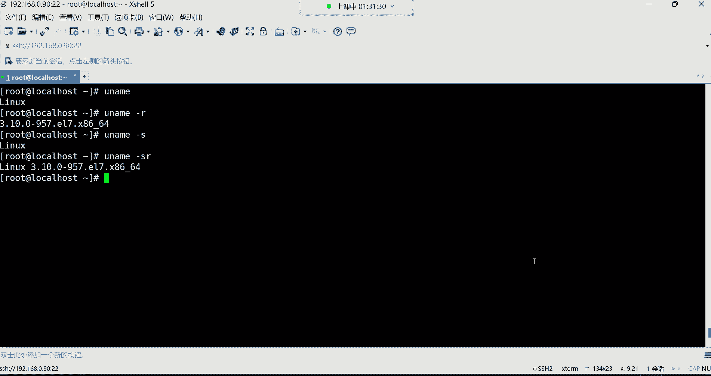
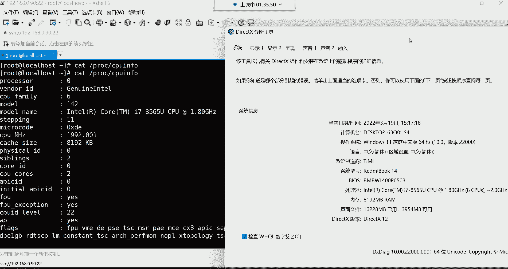
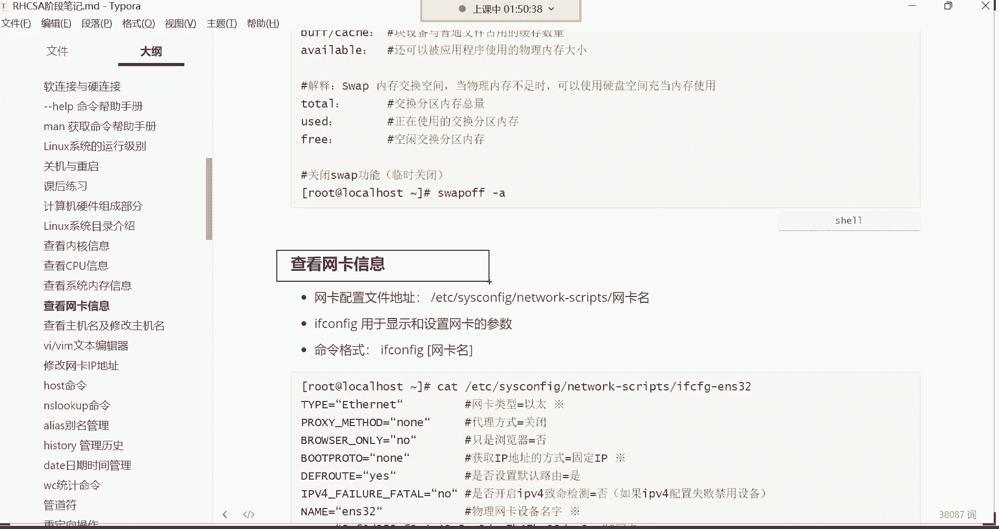

# 新盟教育-Linux运维RHCSA+RHC培训教程视频合集，全网最新最全最详细！ - P11：红帽RHCSA-11.查看内核、CPU、内存、网卡、主机名信息、修改主机名 - 广厦千万- - BV1up4y1w729

我们继续哈，我们接下来呢来给大家讲讲查看系统里的。比如说一些硬件的资源。啊，那看这些资源的话呢，我们先看第一个叫做内核的信息。那我们用的呢都是linux的内核。然后那怎么看内核的相关的版本信息啊。

用这条命令，我们来看一下这条命令，要查看内核的相关信息。这里面呢包括版本名字呢都可以看。

这条命令叫U name。好。直接敲由内幕回车看到了吗？那这条命令呢，你如果直接敲的话呢，它是直接把这个内核的名字呢给我们显示出来了。对吧只显示这个内核名了。但是你发现这显示内核名不行啊，为什么呢？

因为你显示内核名，我想看它的版本怎么办呢？啊，版本的话要加选项杠号杠R。但是如果我我们加加了这个R以后，你发现这个。确实是显示版本信息了啊。你看我们当前用的是3。10。0的版本是吧？然后。

后边呢是一个补丁次数啊，打了多少次补丁OK嗯。😊，但是呢。我想看它一个完整的，比如说名字再结合版本怎么办呢？啊，那这时候看有个杠S，就这样哈。😊，杠S杠杠S其实默认就是什么呢？默认就是杠S只显示名字。

所以这两个选项结合到一起RSOK了。告诉你这个内核是linux的内核，版本是3。10。0的一个版本，然后适合安装在红帽的67上边啊，适合的CPU架构是叉8664位的1个CPUCPUOK。😊。

这如何查看内核的版本，这时比较简单呢？然后内核的官网啊，这个前面我们第一天讲就给大家讲的说现在最新的内核是5点几的啊，是5点几的内核啊，但是三点几的呢就可以后期到企业里面如果有需求的话呢。

呃到时候再升级再说。😊。

啊，就看看内核的版本。

好，那下边呢看CPU信息，看CPU信息呢通常是有两种方法啊，我们一个一个来讲。

啊，来看第一种。第二种方法呢是在这个PROC下边。有一个文件，这个文件呢叫做。我们找一找它叫CP。好。有一个文件叫CPU info，看到了吗？这个文件里面存的就是CPU的相关信息啊，可以打开的。

然后后期还有一个叫做memmo info啊，那是内存的信息。我们一会儿再说，好吧。嗯。这呢啊这是后期在查看内存的时候，这里面有一个memory info啊，这是内存信息文件，这是CPU信息文件啊。

然后我们打开，当然这个信息文件，你想想它既然是文件里的内容非常多PROC下边PROC下边的。CPUCPU info啊，打开打开之后，那你说这个信息都有哪些啊啊，这里面显示的信息呢。😊，我们。啊。

从从这开始哈，然后给大家解释一下。😊。

你看这里面我是有非常多的中文解释的是吧？我们就说投几行就可以了哈啊我一直。😊，说到哪儿呢？嗯，缓存就算了吧。

啊，我们可以来给他说说。呃。这个哈process processcess呢后边是个零，是不是啊？你看这个代表是系统中逻辑处理盒的编号啊，然后对于单核处理器，则可认为是其CPU编号。然后对于多核处理器。

可以认为是叫物理盒或者说使用超线程虚拟技术的一个逻辑盒，你发现这有些听不太懂啊。是不是听不太懂啊。这有点不说人话的意思，其实就是你这个CPU的克数。😡，注意哈，就CPU的克数。

就你这个系统里面多少颗CPU？如果是一颗，这位置就显示零，如果是两颗CPU注意，我说的是棵数，不是核数哈，CPU分棵，然后每颗CPU里边分多少个核啊，这核就是所谓的叫计算单元。😊，啊。

如果说你的电脑里面只有一颗CPU的话，那这个位置就显示0。如果你电脑里面有两颗CPU的话，那这位置就显示一。如果有3颗CPU，那这位置就显示2啊，是这么回事。嗯，所以它是叫做棵树哈棵树。

然后那下边呢像什么CPU的制造厂商啊，英特尔的看到了吧？然后像CPU的一些啊相关的产品的系列代号啊，这个你就不用管了啊，什么代号之类的，不用管，因为我们是虚拟出来的，我们这个CPU是。😊。

跟我们的真机CPU是一样的对，所以如果你想看虚拟机的CPU，你还不如直接看你真机的CPU了。你比如说我们呃温佳尔把这个任务，把这个资源管理器给它调取出来，敲这条命令，在你的这个CMD里边注意啊。

在那CMD里面敲这个命令。😊，敲这个命令呢，可以帮我们把我当前的。物理的硬件信息呢给他调取出来。

好。在这个里边可以看我们当前的CPU的信息，看了吗？这个CPU信息你发现就是虚拟机里面这个信息一模一样的。😊。

你们看吧，是不是英特尔酷睿的。看到了吗？酷英英特尔酷睿的CPU。然后呢，是I7的嗯8565U的，然后赫兹呢是1。80赫兹的一模一样。看到了吗？为什么呢？因为我们这个CPU是通过虚拟化技术。

按照你的真机的型号去帮你虚拟出来的。所以说你看这个信息呢没有太大的帮助。在企业里边呢，你看这个文件呢啊其实你对于服务器的时候，你买这个CPU的时候，基本上大体你心里应该清楚你的CPU的一个型号。

如果真想看的话呢，也可以这样看，有一条命令。

有条命令叫LCPU啊，这条命令可以看CPU信息，你直接敲。

接桥LCPU回车。那这时候呢也可也可以帮我们显示一些这个跟CPU相关的信息。比如我们CPU的架构看到吗？然后CPU的位数支持32位，也支持64位然后。😊。

啊，当然这个信息呢，我们只给大家说一些，就是我们所关注的哈。😊。

使用这条命令。

没有麒麟，你不买，非得买麒麟的是吗？啊，还有这个啊这些CPUS代表CPU的棵数啊，其实看这你看。当然啊，这不是CPU科数，这CPU合数哈。😡，这个哈叫CP的合数。我我们当初在安装这个虚拟的时候。

我记得我给它分配的这两盒，两个核哈，它可不是棵数。😊。

因为我们这只有一颗CPU。啊，叫做核心数量。合数。

好，这是CPU合数。然后下边的话呢就是像什么CPU插槽啊，你看像这种还有什么CPU的插槽，这个大家就不用管了哈，这个都是按照你的物理机去什么去分配的。呃，但是如果要是像企业服务器的话呢。

呃它那个插槽就一般啊非常多。像我们的这种个人的电脑一一般就只有一个插槽。😊，啊，像什么CPU厂商。呃，型号厂商。这些呢都是参考着你的真机的CPU的。所以这里边就对于我们来讲没有太多的帮助啊。

包括什么缓存之类的一级缓存、二级缓存、三级缓存，这些呢啊都是你的真机的CPU的型号。所以对于这种东西，你就在买物理硬件的时候，你直接看你的这个CPU的那个手册就可以了。

你买个CPU一般呢它会有专门的CPU手册。哎，所以你比如说你你想看我这个CPU多少核的，多少个核心，然后呢呃多大赫兹的等等等等。这个你自己看就可以了哈。所以对于这种东西呃也可以看也可以看啊。

但我觉得没有太大的意义哈。😊。

所以这这这个呢大家简单知道一下就行。对于CPU信息，你改不了，内存信息你也改不了。那我们想看内存信息呢，也是两条命令。

第一个呢是直接看他的文件。啊，看文件呢也是在这个PROC下边，在PROC下边。有一个叫memmer info。打开这文件以后呢，啊这里面是跟内存相关的文件啊，只看。前两行就可以了哈，总内存剩余内存。

它这里边的信息呢，你看我这儿给大家准备的还是非常全的哈非常全的。😊。

我们在看内存的时候。这个也是硬件设备呢，都是你。

你们公司物理服务器上面提前都是花钱买好的这种东西，所以你们后期就没有必要去看的信息了。你我们所关注的是什么？就是我这个内存条是多大的内存的，然后现在还可以是还可以使用多少内存。这是我们平时最关注的。

为什么呢？这玩意就像我们平时用这个windows一样。我们在用windows这个电脑的时候，其实我们关心什么呀？就是关心我这个电脑的内存是总共是多大的。以及我现在还可以使用多少内存，这是我们最关心的。

没错吧，所以没事，你会发现大家会去看什么东西呢？哎，会从这个任务管理器里面会看我的内存信息。😊，我们在内存我我们在这个任务管理器里面，我们最关注的其实就是。你看我的内存。呃，现在还可以使用的空间是多大。

是不是啊？然后在性能里面呢可以看具体的信息。这里边我们当前可以看到什么呢？内存信息，看看。呃，内存使用中的内存是6。2个G。然后下边。呃，这些信息的话呢啊还可以使用1。6个G。

其实我们比较关注的就是其实就是已用多少还可以。剩余多少？这就是我们比较关注的哈，这其他的呢就并没有什么所谓这个我们可关注的了哈。态多就没有了。

所以大家看的话呢，可以看头两行就可以了。总内存剩余内存，别的没有太多可关注的。然后还有一条命令，命令的话呢，这个命令叫福瑞啊，这条命令我们后期会频繁的去使用它。这条命令在服务器当中是看内存的资源的。

然后这这条命令有一个长的选项叫杠H，我们这敲一下哈。😊。

福瑞回车呃，现在是显示我们当前系统看MEM就是memory，就是内存的意思。呃，咋不上16级呢？我也想上16级哈，但是我这个电脑这个后边这个盖子啊是怎么说呢？拆不开拆不开哈。😊，一体机，这叫一体机。

然后这是看内存，但是看内存的时候默认的你发现看的并不是很清晰是吧？所以这时候加一个杠H就可以了，以K兆器的方式给我们显示啊，常用选项杠H人以人类一读的方式显示它的大小，然后命令是福瑞。

后面跟个杠H就可以了。就查看系统内存的使用情况。然后这个看内存使用情况的话，我们关注的来给大家说一说。

这条命令执行完了之后。

我们所关注的信息呢还是就是总内存跟。

剩余内存。所以说呢我们看这个memory这一行哈。看嗯。来在这看这行信息。啊，这行信息的话呢，每一列代表什么意思呢？MEM代表是内存信息，然后swap代表是交换分区，交换分区，一会儿给大家讲一讲哈。

那么先说这个内存信息啊，看第一列啊，这可以这应该是第二列了哈。这个第二列。😊，代表的看后面那个哈，看这个看第二列。第二列呢。它代表是我的物理内存的总量，就是你这个系统里面总共的内存大小是多大？

然后我们当初在创建虚拟机的时候，我们是给它分配了是两个G内存，是不是？然后跑到这里面就是变成1。8个G了。因为系统在计算内存的时候，它不是按照1024这个单位去计算的，它是按照1000为单位去计算的。

所以我们在分配的时候，可能说我们给虚拟机分配的是1024，其实就是两个G的内存是吧？啊两两两个G的内存，但是呢你发现最终呢我们这个看到的效果是变成1。8个G的。

因为它这个信息跟我们的计算方法跟计算机的计算方法是不一样的哈。所以后期大家在买内存条的时候也一样。你比如说我当初我们我买内存条的时候，我明明说我买128个G的内存。😊，那后期呢。你插到服务器里边。

你发现它怎么少了点，并不是128个G呢？因为计算机计算的单位跟你买的时候，它是不一样的啊，会少那么一丢丢啊，但这个呢也很正常。😡，好。呃。然后。呃，今天这是学啥是吧？

今天是讲这个对哈计算机的一些硬件基础，以及系统里的一些资源的信息查看。这些东西得学啊，前期我看了服务器资源，这都是基础阶段需要掌握的内容。然后下边呢我们再来看这个第三列啊，第三列呢这叫。

已使用的内存的总量，就是我当前这台机器使用了多少内存。然后这个福瑞呢，这是我们所关注的这是什么？这是叫空闲的内存总量，就是还剩余的内存呗，还剩余1。5个G。然后后边像这个surere啊。

bar for catch，像这些呢。就没有必要太去深入去研究它了，像什么共享内存，还有什么这个块设备，就是那个硬件设备与普通文件占用的什么缓存数量。这个的话呢就没有必要去深入去研究它了。

因为这种东西占也占不了多少。所以一般呢都是系统呢，它自动分配的。我们所需要关注的其实就这个位置还我还可以用多少，就跟我们平常用windows其实是一个道理。windows我们平时谁会去关注什么这个缓存。

这个那个的不会关注吧，只会关注我还可以。使用的内存空间是多少？因为在企业服务器里面，服务器不缺内存。服务器的内存的话，一般都是轻少则32G。64G128G。都是这样去什么呢？去。给服务器去配内存的。

没有说像我们个人家用电脑，8个G内存，16个G内存没有哈，基本上都是32G起步。😊，所以服务器不缺内存。你只需要关注我这个服务器还剩余多少内存就可以了。然后如果发现服务器内存不够用了，加内存条。

那服务器里边内存条多了去了。服务器里边是呃不像我们个人的这种家用电脑哈，说只有呃最多两个内两个内存条的插槽是吧？不是服务器的内存条是轻则十几个一台服务器哈，不哈，有的服务器是十几个插槽的。😊，啊。

内存可以让你无线去扩容。所以对于这个服务器内存条，你在买的时候，你可以说我就专门买那种8G内存条，然后呢，往上去插，你可以插20多个。啊，可以插20多个插槽。😊，啊。O。行，这是对于内存。

所以大家看内存的时候，通过这条命令就看什么呢？看总内存，就看这三列就可以了哈，看这三列。😊，总内存已使用内存，剩余内存就可以了。然后下面给大家讲讲这个swipe呃，s呢这叫什么呢？这叫交换空间。

这个交换空间它作用就是什么呢？那当物理内存不足的时候，我们可以使用这个磁盘的空间充当内存使用。然后我这时候又涉及到我前面给大家讲解的一个概念，在计算机硬件里边最快的是CPU是吧？

然后其次是内存最慢的是硬盘。所以说但是呢呃由此可见，CPU可能是最贵的。然后其次是内存是吧，最便宜的就是硬盘了。啊，因为他这个性能在这摆着呢。所以有的企业呢在最初期他为了节约服务器的成本，他怎么干呢？

呃，他可以通过这种swa的这种技术。去干嘛呀？去拿我的。😡，磁盘空间因为磁盘便宜啊，哎它可以拿磁盘空间去模拟内存，充到内存去使用。这种东西你怎么去理解呢？😡。

就是比如说你给这个一台自行车套了一个摩托车的外壳。能理解我这意思吗？给自行车套了一个摩托车的外壳。但是你说你虽然说外壳让别人一看啊，这是一台摩托车，但是真正它里边的具体的结构还是自行车的结构？😡。

他跟摩托车没有办法比。那反而还影响了这个自行车的性能。没错吧，变沉了。😡，所以说这个s这个概念就是什么呢？拿磁盘去充当内存使用，会严重影响服务器的性能。但是它确实可以缓解内存不足的压力。

没有任何问题的啊，可以缓解内存不足的压力。但是呢降低了服务器的性能。所以现在的企业几乎是不会去这么去搞了。不会去拿磁盘空间去充到内存去使用。所以一般在企业里边呢。我们都会给它关掉。

把swa这个功能给它关掉，怎么关掉呢？这样关哈。叫福瑞杠A回车啊，不是呃，我看一下是福瑞杠杠什么来着？哦，我记得是杠A哈。嗯。啊，这样哈不是fr瑞港，是这是有一条命令叫swapSWAP然后of。😊。

O然后杠A回车。这条命令叫关闭swep的功能啊，但是它叫临时关闭。我们补充一条命令哈。

好好久没有用这条命令了。然后补充一个。对，默认是开启的哈，然后呢关闭。😊，叫。关闭。Swap。功能，但是呢这要临时关毕。临时关闭哈临时关闭这时候你再敲这条命令的时候，跟前面就不太一样了。

看哈你再敲福瑞杠H，你发现哎sp跟前面显示的不太一样，你看前面显示。😊。

就是swa是有两个G的空间的。默认开启系统是给他分配两个G的空间的，知道吧？所以呢你给它关掉。关掉哈。关掉以后它就变成零了。啊，就不会拿磁盘空间去充当内存去使用了，弄裂了吧，OK。呃。

然后这叫临时关闭是吧？呃后期呢临时关闭就马上生效，你它马上就变成零了。那后期如果你想永久关闭的话，我么们还得学习那个叫VIM这个文本编辑器啊，通过VIM呢修改它的相关的配置文件才可以。但是没关系啊。

先知道临时关闭啊，通过这条文件就可以了。😊。

好吧，我也给你们记录到这个笔记上边啊保存一下。OK临时关闭，马上生效，永久关闭呢，这个马上生效，就是当你服务器如果关机，下次重启，它又失效了。他又默认又开启了又开启了哈那开启怎么办？开启的话。

你再敲一条命令给它临时关掉。后期学习永久修改的时候，再给它永久关掉。😊，然后下边呢我们再来给大家说这个叫查看网卡的信息。看网卡信息呢，网卡有相关的配置文件。

Oh。呃，它的配置文件我们前面已经讲过很多遍了哈，在哪呢？前面一个最长的路径在ETC confinetwork杠。然后呢，这里边有一个文件叫if cFG啊，其实就if confi的意思。

然后杠ENS32这个文件就是我们的网卡的配置文件，然后我们的IP地址什么信息就在这个文件里面放着呢。然后呢我们。这个可以使用ca命令去看这个文件里的内容。ifCFG杠ENS32。啊，回车。嗯。

打开这个文件以后呢，咱们解释解释这个文件里的配置都代表什么意思哈。然后只说重要的哈，对于这个文件来讲。😊。

不重要的没有必要去研究他。好。我们说说这个第一行啊，第一行type代表是类型的意思。什么类型呢？就你这个网卡的类型，网卡的类型，后边如果是呃internet就代表是以太网啊，你为啥你的是ENS33是吧？

可能因为系统的原因吧，你的系统可能跟我们跟咱们这个系统版本不太一样吧。呃，不同的系统的版本略微是有有所差别。但没关系哈。呃，甭管叫什么名字，这都无所谓。一般在物理服务器上面网卡名叫叫什么叫ETH开头的。

然后后面呢什么0或者说ETH1ETH2。以此类推。嗯，以此类推啊，这是物理服务器的网卡名字。不能改改不了哈。😊，你改完以后，系统。他不认识这个文件了。😡，能列吧。没有必要改改它干嘛呀？

这玩意就一个名而已嘛？😡，你没有必要去改他呀，你为什么要改他呀？😡，就一个网卡的名字而已，最终你用的又不是他的名字，你用的是他能够帮我去访问互联网就可以了。好。啊，类型是internet。

就是以太网类型。这以太网类型其实说白了就是我们可以去连接公网的这种类型网卡。然后。那下边呢。看看注意我给你们后边标记了这种重点符号的。这种哈。大家呢去关注他。比如说获取IP地址的方式。

那获取IP地址的方式呢叫NONE是吧？这个NNE呢代表的是叫做。固定IP。我获取IP地址的方式叫固定的方式。那还有一种叫做DRCP。啊，如果这边你发现你的是DDHCP的话。

那就证明你的这个系统IP地址不是你自己去什么呢？呃，就每次它会发生变化，为什么呢？这第二CP叫做动态分配IP。啊，系统就是它会自动给你分配1个IP地址，每次都会发生变化。啊，这种是DRCP的方式。

然后还有一种方式叫做。tky啊这种方式嗯。TK这种方式呢也是这种固定的IP。啊，跟NVE呢这两种方式是一模一样的啊。好。反正呢只要不是这种D儿CP就可以哈。因为DCP每次IP地址发生变化呢。

你还得怎么说，你不知道这IP地址是多少，你连连不上去。然后下边呢再关注这个name。下边。啊，在这儿内幕呢这一行代表是你的物理网卡的设备名称。物理网卡。就你那个硬件的网卡名字。叫ENS32。

这就一个名而已哈，对应的文件名是一样的。😊，然后还有这个。对，这是物理网卡名字，下面就叫网卡的名字。物理网卡网卡它它有所区别，但是你不用去管它，都叫同一个名，都同一个名哈。😡，都是ENS32。然后呢。

下边。这个on boot这个就非常重要了。on boot一定要等于yes。只有等于yes，你这个机器在开机或者说重启的时候，这个网卡你才可以使用。如果是等于N的，如果是等于no的话。

你这网卡就证明没有开启。知道吧？没有开启，你就用不了。所以这位置呢一定是要让它等于这种。Yes。开启状态。然后下边那个呢啊我们一直从这开始哈。😊，从这开始，这都是非常重要的信息了。嗯。

IPAADDR这是什么呢？网卡的IP地址。IP地址哈，就是我们前面配过哈192。168。0。90。IP。然后子网掩码子网掩码呢，这个我们在配的时候是3个251个0255。255。255。0是吧？嗯。

然后这个换算以后呢，就可以是24，24位的掩码，这个需要这需要你去看看网络的内容。如果你不懂IP的话。呃，你得先看看那个网络内容哈，我前面不是给你们发过网络的课吗？到时候自己去看一看哈。

IP地址最起码得整明白了。😊，然后还有这个网关啊，网关我们指向的是192。168。0。254，这是我们自己配的啊，这代表是网关。其实也就是路由的意思。然后DS啊DS223，然后3个5这阿里的DS服务器。

然后这个4个8是谷歌的DS服务器地址，到时候可以帮我们去访问互联网做域名解析的。对然后在这个配置文件里面呢，你看还有一个什么DNS2是吧？这个呢后期我们可以再准备一个叫备用的DNS服务器地址。😊。

这个备用的话呢，就是当你的比如说前面那个地址不能用了，无法帮你做域名解析了，你访问不了互联网了。那到时候呢备用的就生效了，是这么回事。好，那这个就是网卡的IP地址，然后所需要关注的是什么？

其实我们平时所需要关注的一呢就是这个。获取IP地址的方式。那一定是这种固定的方式。然后呢，就是我这个网卡是否是启动的一个状态，onput等于等yes。然后下边就是IP地址子网掩码网关。

还有你的这个什么呢？还有你的DNS。这些地址。这是我这是我们后期关注的啊，如果想改到时候也可以去直接改这个文件啊，现在我们并没有学怎么去改是吧？所以先知道一下哈，这网卡的配置文件。

然后看网卡还可以使用命令去看。

比如我想看我的网卡的IP地址，你可以这样if付confi。

借条命令。if confi这条命令用于显示和设置网卡的IP地址。然后。

啊，你的电脑昂布的后面就没有了啊。安布的后边就没有了是吧？啊，从这往下没有是吧，从这往下没有呢你是不是没有IP地址啊，没有IP。😡，perfect get away这些都没有，是不是啊？没有没有关系啊。

没有自己可以添加进去。😊，可以往里面添加。啊，但是你我我们现在并没有学习这个叫VIM这个文本编辑器，是不是啊？所以。那你可能是在安装系统的时候，注意你在安装系统的时候，你可能就没有给这个机器配IP。

而我们这个为什么会出现这种情况？如果你是按照我们的方式安装的系统，我是在安装系统的时候，我就给他配一配好了IP地址了，所有的配置都已经。都已经什么呢？在前面的准备工作都配好了。所以你的配置IP的配置。

你安装系统的方式可能不是按照我的方式去安装的。啊，然后这里面还有一个网卡的UUID这个UID是怎么说呢？UUID是网卡的一个唯一的标识。唯的标识就是一个唯的编号。这个呢就是像人的身份证号一样吧。

来识别这个网卡的一种方式。Okay。呃，不自行安布的是y吗？不是是no。如果不自行的，就是no。好，然后义父康菲格。啊，衣服。嗯。不是不是麦克地址哈。😡。

啊，然后if飞格的话呢，我们来敲一遍哈，你可以直接敲这条命令回车。😊。

衣服抗飞格回车。if confi哎呦，没有这条命令。哎呦，没有这条命令。难受了。哎呦，没有这条命令，没没有这条命令，这我们现在没有学习软件包管理呀。这样哈来呃，没有学习软件包管理。

敲一条命令叫y姆杠外insta来net to。刚好。这样哈没关系啊，如果如果没有这条命令，对VM也没有是不是来，这条命令哈先敲一遍，知道吧？亚么杠外insall。😊，给你们发过去哈。直接敲回车。

这是我们后边会讲是属于安装一个软件包，那个软件包会给我们提供这一个命令。VIM也没有是吧？😡，对，后期再装吧。等用的时候再装吧。然后暂时呢我们还用不到它。没网情况下没用，没网情况下装不了哈，看了吗？

是不这个下面显示已安装啊OK嗯。😊，已安装之后呢，我们再敲这个名叫if康fi回车。好，这条命令就有了。

呃，有有了之后呢，咱们解释一下这条命令哈。😊。

这个信息非常多是吧？呃，我们。等一下啊。一直到这儿。

首先呢这条命令会显示我们当前的机器有多少块网卡啊，就是把所有的网卡都给我们显示出来了。呃，然后接下来呢。怎么回事啊？我看一下他他这个。哈。是这样子的，是。嗯。我们在做力嗯。我们在做练习的时候。

前面有一道题哈有一道题。哪道题呢？是删除这道题。如果你们把这道题做了之后呢，你发现你们安装就安装不上，是不是？对意呀，是因为我们清空了这个仓库路径吗。所以说你们会出现这种情况啊，那怎么办？😡，怎么办？

我们前面在学习软件包，我们。😡，啊，我们前面在学习RM命令的时候，我们是不是说给大家讲过一个快照啊？是不是啊？用你的快照恢复一下。如果你们做过练习的话，删除过这个那个路径上的文件的话，就恢复一下快照吧。

好吧，因为你把那个路径上的文件给删了。把这个路径下的文件是给删了的哈。对，快照恢复一下就可以了，然后就可以去安装这个包。😊。

这快照还是非常有用的，是不是啊？OK。😊，好，然后接下来呢咱们说说这个他你看。这是网卡的名字，一个叫ENS32，一个叫LO这两个网卡名。然后呢，对于这个。里边这些信息呢啊这个就非常的细致了哈。

你看一下啊flags，你看flags等于叫4163，这个叫什么呢？这个叫网卡的一个标志。这个不是什么重要的内容哈。那up这个位置呢，代表是什么呢？代表是我这个网卡现在处于一个叫做活跃的状态。😊。

叫活跃的状态。那后边这三个参数分别对应的是什么呢？你这个网卡支持广播，然后网线也接入了，而且也支持主播。然后包括MTU代表你网卡的最大的传输单元，但是它是以字节为单位哈。

最大可以一次传输1500个字节啊，一次可以传输当然哈啊1500个字节的数据包。啊，这是传输单元，然后。这个inter这个代表是你网卡的IP地址。啊，然后类型是IPV4类型的地址。

然后n mask是我的掩码，是3个255，1个0，看到了吗？然后。代表啊这个后边代表是广播地址。然后还有这个IPV6的地址，在这哈，这是IPV6的地址。你看in特6嘛，代表是IPV6。然后这个。哎。

IPV6现在先不用去管它了哈。然后我们主要给大家讲讲这儿啊，这个是我们的麦克地址。😊，这是麦克地址哈。对个网卡的麦克地址是怎么说呢？网卡的唯一的一个全球的唯一的地址。然后这个RS。

跟TX开头的这些参数啊这个。就我们比较关注了哈。嗯，我们先说这个RS。开头的。这一行。这叫什么呢？我们把这个拿过来哈。😊。

查看网卡信息。

看看这个RS呃，当然有2个RS4开头是吧？我们先说第一个第一行RS开头的，然后呢，第一行代表是接收正确的数据包，其实这叫网卡的入口流量。就叫做网卡的入口流量，就是你这网卡接收了。多少数据包？

然后我产生了多少流量，看到吗？21。8兆的流量啊叫入网卡的入口流量。然后这个呢TXP开头的。这个呢叫网卡的出口流量在这儿呢。你就发送的正确的数据包流量。一个是入。RSP开头的叫入，然后TXP开头的叫出。

叫出口流量，那都属于正确的流量哈。都是正确的流量。然后这个这个RSE开头的呢，这个RSE开头的。跟TXE开头的这种哈。但是我说这前面三个首字母哈。看了吗？三个首字母啊。呃，其实就是。

你看这个E义其实后边不是 error嘛？arrow不是错误的意思嘛，是不是？那它这里面除了arrow以后，还有什么jo over。😡，非常多是吧？你看你就可以这样，怎么说，我们说以最笨的方法去看。

你看因为这样比较好区分一些，比较好区分。你RSE开头的那在这里边你看的话就是代表什么意思呢？这个其实E就是对应的i叫做。接收的错误的数据包，就是你这个入口。你看反正代表都是入口流量，但我这个入口流量。

比如说我接收的错误的数据包多少个啊，你看这jo这这这个。😡，呢它代表是被丢弃的数据包，还有这over。你看这over呢，它代表是什么由于速度过快而丢失的数据包，速度太快了，没接住啊，丢了啊。

然后发生错误而丢失的数据包。那这些信息呢，你发现你看这是都是跟我这个入口流量相关的，是吧？只不过你看RSP开头的就代表都是正确的数据包。然后呢，RSXE开头的代表都是错误的数据包。😊。

然后这TT就代表出了嗯，那出口流量啊，这就是我出去的正确的数据包流量。然后下边呢都是错误的相关的。比如说我这个发出去的错误的数据包，然后呢被丢弃的数据包，由于速度过快，或者产生一些错误的等等等等。

那这个是怎么说呢？到时候你可以看一看，如果都是零，就代表是一切正常。如果是零代表一切正常哈。然后对应的信息呢，我都在这里面给大家写上了。但这种情况下几乎很少见哈啊非常少见。😊，啊。

这是我们对于这个ENS对于这条命令执行完了之后啊，我们可以获取的这些信息啊。当是这些信息呢大家关注的有哪些呢？你这个网卡叫什么名字？我这个网卡的IP地址。然后别的话呢，其实用的还真并不是很多。

剩下就看一看。这个入口流量有没有产生一些错误数据包，出口流量有没有产生错误的数据包，然后再看看什么呢？我这个网卡的进出口流量啊，总共产生了多少流量？别的也没有什么太多可关注的。

然后下面这个LO这个LO呢给大家讲讲LO叫做回还地址，它叫回还网卡，这网卡是假的。

啊，这边也写了。

由于我们是最小安装哈，我们只能看到1个LO。如果我们是安装了带图形化的界面的那种方式的系统，还有一个叫VIRBR0啊，这个叫虚拟网桥。啊，像这种LO跟那个VRB20先出LOOLO叫本地的回环网卡。

什么叫本地的回环网卡呀？首先它不是我们的物理网卡。啊，他是通过一种技术啊虚拟出来的。LO就是local的意思。😊，Local。就本地的回环网卡。啊，然后。他干嘛用的呢？

首先它的IP地址永远都是这个地址叫127。0。0。1。然后它是用于它可以用来测试本机的连通性。啊，对，look up哈look up。然后。这个L是local哈，这个L是local啊。

后边呢是loc up。然后呢，它这个。地址。就是你可以这样嗯。啊，对。就是本机的那个回环的接口。没错，就是那个回环接口哈。如果你们搞过路由的话呢，你可以再那样去理解回环接口永远代表本机。😊。

IP址永远是127。0。0。1。然后你可以这样有一条命令叫拼拼的话呢，是可以测试网络联通性的。你可以这样拼拼谁呢？127。0。0。1。能拼通啊。发送64个字节，然后呢可以看到啊接收了64字节，看到了吗？

啊，这网卡给你接收了。你发给这个地址，64个字节，然后呢，他就给你接收了64个字节啊，包括有没有time out那time有没有一些延迟。那像这种东西呢，就是永远都是1270，但我们平时用不到它哈。

几乎用不到，很少用它，知道一下就行。用的特别少呃，也查看王卡一般也不会查看LO我们看谁呢？😊，我们一般得看自己的这个物理网卡。很少会看这个回煌网卡，没什么用，用处不是很大哈，不是很大。然后呢。

还有这个VRB20，这个如果没有的话，就算了哈。😊，嗯，后期再讲虚拟化的时候，会讲这个VRB20啊，今天就不涉及了哈不涉及了。

啊，那以上呢就是什么呢？就是看网卡信息，然后怎么看啊，其实最常用的就是敲了这一条命令。然后还有一条命令叫这样哈，还有一条命令。

那这条面叫IPA回车，也可以看网卡，只不过你发现这样看网卡只看只显示什么呢？它显示信息没有什么入口流量跟出口流量，看到了吗？IPA也是一样，就IPADDR的意思，它全名叫I就IP。😡，IPADD。

IPad。所以你可以给它简写成IPA，你也可以给它简写成IPA。IP。AS。那就是其实它的全写就是IP address。IPA也可以，你IPAS也可以，其实效果是一模一样的。能列了吧，它是一个缩写。

是一个缩写哈。就是我看我的IP地址。那你看呃呃这个address不是地址的意思吗？是不是？然后呢，你前面补个IP。就是意思就是。我要看我的IP地址，全写就是这样，简写就是IPA哼能理解这意思了吧？

所以有的时候我会比较习惯性，我就看我就IPA就我就这样看。我只是看我的IP地址，别的我不看。如果你说我想看我的什么入口流量出口流量，你发现这条命令并没有给你显示，因为它只显示IP。😡。

IPV4的IPV6的没错吧。别的就并没有给你写是吧？😡。

O。啊，然后呃这是看网卡是吧？啊，接下还要看主机名啊，查看主机名这条命令。叫。有两种方式啊。第一种呢是有一个文件，ETC下的host name这个文件就存放主机名的。

我们打开这个文件ca ETC下的host name回车啊，这是我们的主机名。

全名叫做local host。loc动漫。全名哈，然后呢，我们这个命令行里面是不是显示local host呀？这不是我们当前的主机名吗？其实这个主机名对应的就是这个文件里的名字。😊。

这个文件里面存的就是我们当前的主机名，只不过它它在显示的时候，点儿前面的名字不显示。😡，不是点后面的不显示哈。只显示点前面的啊，但的全名呢是叫这个名字。然后还有一条命令叫host name。

这可以直接干嘛呀？哎，也可以看出页面，是通过命令行的方式去查看。这种是直接看文件都可以看出页面。那主页名可不可以改呢？可以改。你看你ho name，你翻上来，后面跟上一个，比如说呃叫什么呢？

比如说让它叫。😊，拍子的。太子回车。这就改了，这就把主页名给改了哈，就这条命令可以看主页名，你后面跟一个名字，就帮你把这个名字给它改了。😊，但是你说这个名字改了之后，它没有生效啊，是吧？先退出X的退出。

然后再登录一下。😡，哦，清个屏，你发现这个名字就变成太s了。没错吧，呃，测试的意思。哎，你看这样改就生效了，是吧？啊，你再改你说后色内蒙再给它改成什么叉叉叉叉叉叉叉都可以哈。比如说叫student。😊。

然后你再X退出。在登录。好了，你看又生效了，是不是？然后你再看那个文件。😊，哎，你直接敲命令吧哈，你hosse内幕回车，你的主机名就变成sttudent了是吧？嗯你再看那个文件。

看ETC下的hosse内幕回车。😊，啊，KETC。后送 name。好，诶。OK然后你看看，那你看这个文件的时候，你发现为什么这个名字没有变呢？😊，但是我们这样看的时候，发现名字已经发生变化了呀，是吧？

而且我当前的这个命令终端也变成suddent了呀。😊，但是为什么这个位置配置文件里并没有发生改变呢？因为这条命令在改名的时候叫临时修改。

对啊，这叫临时修改。你看hose name后边跟成一个主机名。那临时修改就是立刻生效，但是服务器重启之后呢，就失效了，就是临时的好处马上生效，下次重启就失效了。能列吧。

OK然后这这个这这这太荒唐了哈这个。那如果说我想让它永久生效怎么办呢？啊，在命令行里面也可以通通过这种方式命令行永久修改主机名。

咱们来看一下哈。永久修改。讲host name，然后呢。control臭。哦，set杠。后se的 name幕后面更上新的主机名，比如我要让他叫test。回车。然后你再退出，然后再重新登录。

对每次改为主机名，你想让它生效，就得重新登录一下。好，那你看我当前主机名变成t了是吧？那这时候你再看它的配置文件ETC。😊，后斯内幕你发现哎，这时候呢永久生效了，注意啊，你怎么才能验证它永久生效呢？

就是配置文件真，如果配置文件也跟着发生改变了，它才是真正的永久生效。能列解吧。O。然后呢，这个命令行永久修改主机名啊，立刻生效，不需要重启系统。你只要退出重新登录一下就可以，不需要对这个机器进行关机。

然后再开机啊，是这意思，不需要重新启动。这是永久修改主机名。比较简单是吧？太死了。

然后。其他的呢也。这查看信息是吧，我们在基础阶段嗯，大体知道怎么去查看系统内核CPU内存网卡以及主机名。嗯，这个呢差不多就暂时先够用了啊，后期我们再随着不断学习，再去学习，看看别的信息。

然后还有系统一些常用的目录结构啊，这些呢大家把那些就是我给你标注的需要记住的，你给它记住就可以了。然后硬件组成作为了解就可以。好嗯休息一下。对，我们休息一下。

然后一会儿回来给大家讲讲这个VIM文本编辑器，休息一下哈。😊。

