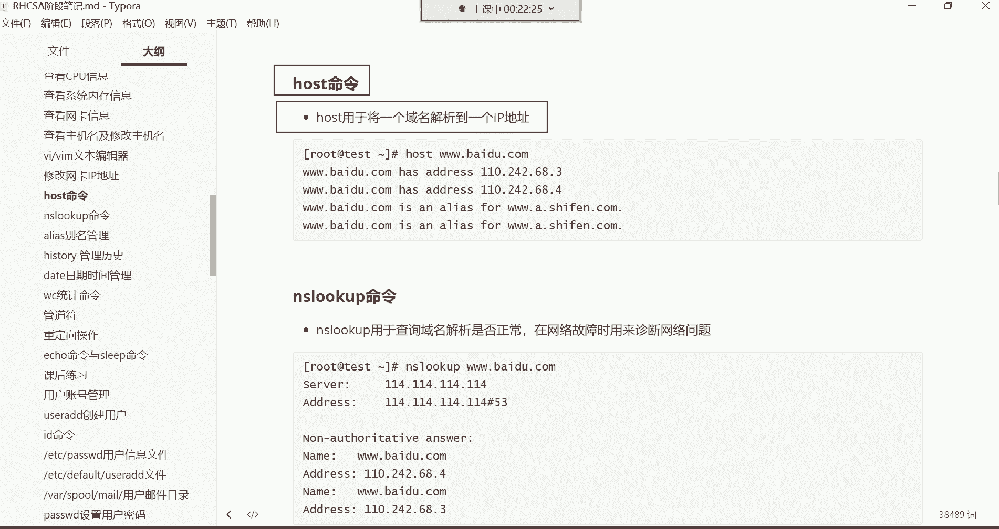

# 新盟教育-Linux运维RHCSA+RHC培训教程视频合集，全网最新最全最详细！ - P13：红帽RHCSA-13.修改网卡地址、host、nslookup命令、alias命令别名、history管理命令历史、date日期时间管理 - 广厦千万- - BV1up4y1w729

hello hello，兄弟们能听到我这边的声音吗？这声音怎么这么小呢？😊，喂喂喂，OK吗？呃，来听到声音的刷波一，我们开始上课。少了一些人是吧，这个一到周末呢啊特别是到这个礼拜天的时候。

这人就不知道干嘛去了。陪女朋友去了啊，反正是不闲的，是吧？呃，我们今天呢争取给大家再多讲点啊，因为我们今天确实是这个又是我们这周的这个最后一节课了。😊，所以你们接下来的一周的复习的时间呃，要什么呢？

要要给大家就是准备的这个知识点呢要充足哈。😊。

所以我们今天要加足马力哈，没有女朋友。对，没有女朋友就对了，没有女朋友就听课，就学习需要女朋友吗？不需要女朋友。😊，我们男人一男人的感觉一上来，就是靠什么呢？这个靠双手是吧？

靠技术再看看国外那些可爱的老师啊，什么苍老师啊、波多老师啊、小泽老师啊是吧，什么这个美奈子老师啊，那个老师的。分分钟不就解决了吗？还需要女朋友吗？😊，啊。呃，简单来呃。

这个VM没有办法简单给大家回顾了哈。这个VM呢。😊，你们只能去干嘛呢？去看我昨天给你们讲解的这个录屏就行了啊，因为这这个东西确实没有办法给你们回顾。对，不需要女朋友。

女女朋友只会影响我们男人拔刀的速度哼。好了看一下修改网卡的IP哈，就是我们前面已经学过VIM了。😊。

我们学过VNM以后啊，那我们接下来的课程这就好办了。比如说前面咱们修改主机名，修改主机名，我们是用命令是吧，ho name controll，然后set杠ho name去改的名字。

比如说我给它改成ABCD没错吧。😊，没弄错了哈。😊，是不是啊？这但是有的时候呢我们说这个我想直接改配置文件可以吗？可以啊，你就直接改配置文件VIMETC hosts name直接打开配置文件看到了吗？

然后在配置文件里面，是不是我们就直接插进去，然后在里面改就行了，比如给它改成local host。😊，这样是不是就可以了？然后保存退出。啊，当然我用的是快捷键哈，ZZ保存退出的这是不是就可以了。

有了VM以后啊，对，这是永久改名哈，永久改名。😊，那有了呃有了VM以后，那我们以后学习想打开配置文件，就用VM打就可以了。能理解吧？啊，以后修改这些。😊。

配置文件的时候都是通过VM包括我现在我想改我的网卡的IP。

我想改网卡的IP地址，我么说这个if。😊，confi命令可以查看我们当前的网卡是不是啊啊，可以看到我们当前的网卡啊，我们当前正在使用的是ENS32这块网卡，然后IP地址是192。168。0。80。

这是我的IP。😊，好，那接下来我想改一下这个IP地址可以改吗？可以改啊，是可以改的哈。你直接打开它的配置文件。我们说网卡的配置文件在哪儿？😊。

是不是在这个ETC configurefinetworkqui这个路径下边有一个叫ifCFG杠ENS32这个呀没错吧，那我现在想改它的地址VIM啊，把这个ESC加点儿，把上面的这个路径给它拿拿过来。

跟上EFCFGES32，然后打开这个文件，打开文件以后，哪一段是网卡的IP了？😊。

是不是IPAADDR这一行是网卡的IP地址。那我们现在想改IP地址，那你就找到IPAADDR这一行是不是啊？找到以后呢，你呃把光面往下移啊IPADDR。

然后我们可以干嘛的直接把这里面的东西给它删掉。插进去，然后呢把这个IP给它删掉。但是我们呃改的话呢，只改什么呢？只改这个还是零网段的地址哈，然后给它改成90啊，让它的地址是192。168。0。90。

原先不是80吗？啊，现在让它变成90然后其他其他的东西不用改，然后如果你需要改的话，你比如说我想改网关是吧？啊，或者说改我的DNS都一样哈，都一样。但是我现在不需要改。😊，好。

我们只需要改1个IP就行了。😊，然后接来呢。EC退回到这个命令模式，然后英文的冒号来到底线命令模式，WQ叹号保存退出okK。改完了。那改完以后呢，这时候这个网卡还没有生效啊，if嗯if con。😊。

或者我们直接IIS吧，好吧。这样IPAS。ENS32。你看这个IP地址现在还没有变化，因为还是80。改完以后你要干嘛呢？你要重启一下网络。

啊，重启一下网络哈，因为IP地址发生改变。啊，等一会儿啊，重启网络重启网络命令用这个哈，要。😊，ss controlre star network这是重network是网络的意思。

restar是重启的意思。然后system control呢是控制我们系统的一些程序的一个命令啊，所以我们通过这个system controlre star network把网络重新启动一下。

瑞死他。net work啊回车。那我们重启网络以后呢，我当前的我我我们当前这个终端就掉了哈，为什么呢？😊。

因为IP地址发生改变了，因为我们当前这个终端，你要知道我们连的是哪个地址，192。168。0。80。没错吧。但现在你IP地址一旦发生改变了，它变成90了，变成90以后。

你就得再开一个终端去连90去知道吧？啊，那就换成90回车好，那这个时候啊，你看是不是啊是不是能够连上来了呀。啊，第一次连接嘛，我们接受并保存然后输入用户名root密码一。😊。

好，又连上来了。哼是不是又连上来了？😊，啊，这主机名怎么变成ABCD了呢？我看一下啊。😊，核实的。内模哈。啊，local host。都靠好子。呃。啊。哇，好奇怪呀。改回来哈。看看配置文件。啊，回来了。

行。呃，来看一下这个网络充启以后呢，看它的IP就行了啊。IP。ASENS32，你看现在它的IP地址就变成多少了呢？192。168。0。90了是吧？你的s没有network服务，是。呃。

是那 worker manager哈。你的没有吗？不应该要。嗯。怎么可能没有那个服务呢？😊，如果没有的话，你这样哈，如果你没有那个，如果没那没有那个服务。😊。

你可以这样哈。一会儿我们。讲这个命令的时候，我跟你讲哈，你可以通过这个命令啊，通过这个NMCI这个命令。如果你是八的话，它确实没有那个network哈。😊，好，那这个呢是就是我们修改IP地址。啊。

修改IP地址，然后你可以试这个if down。注意哈看到了吗？把这个名字发给你哈。😊，你试这个命令，if服 down网卡名，然后再if up网卡名就关闭，又重新开启一下，这样也可以。好。

然后最后呢看APP是不是就发生改变了？好，那这就是修改网卡的一种方式，怎么改，是不是直接改它的配置文件呢？啊，这种就是比较简单一些哈那还有其他方法吗？有。😊。

下面那个方法呢。如果你不考红包认证。啊，ENS32网卡名，这个哈这是网卡的名字，就是我们改的这个不是这个ES32这块网卡吗？然后到时候呢我想把这个网卡给它关掉，然后用启动一下。😊。

你怎么知道你的网卡是多少？if confi个命令啊。啊，这个命令哈。昨儿昨儿是没来听课吗？😡，啊。昨儿来听课来了吗？没来是吗？啊，行。呃，这个命令哈一敲出来呢，就把你当前的网卡啊，今天第一天是吧啊。

那可那可以理解哈，可以理解啊，那这个先把前面的给它复习一上哈，毕竟我们说这个需要这个前面都是基础嘛啊，所以这个。😊，先先那个先把技础给他补一补哈。没事，那今天也可以跟着听啊。

你也可以直接去复习前面的内容都行都行哈。反正我们到时候你有一周时间去复习的，也可以跟着今天的课厅。那反正反正我们今天是直播嘛。😊，好，那这是网卡给他列出来了是吧？那接下来我们再说另外一种方式。

修改网卡的IP地址这个。😊。

我们也可以使用这个命令呢去改我们的网卡IP地址。那使用这个命令改网卡IP地址的话，我跟大家讲一下哈，这个命令呢它非常非常的不适合人类去记忆它。😊，因为什么呢？因为这个命令太他妈长了，你们看一下吧。

看到了吗？这命令这是一条命令哈，你改个网卡IP地址的。😊，然后。这个命令什么时候会用得到呢？我告诉你哈，这个命令是你如果考红帽认证，我们说考红帽考红帽那个RHCE认证的时候。😊。

那里面它会让你通过这条命令去改你的网卡的。但如果你说我压根我也不想考红包认证，那这个命令你就不要记了，因为我们很少会通过这个命令去改。那这个命令呢我我们也得给大家讲一讲是吧？

NMCLI这条命令呢在sentto8里边是专门用于去控制你的网络的一条命令啊，但是在7里面呢，我们可以用它去改一批地址，你看NMCLI。然后connection呃，connection呢就是。

我这都写了哈NMC2conect modify，这就是我要修改我的。😊，网络啊修改网络哈。对他自己补齐哈，他会补齐的。

你看这哈。在这儿。NMC你配不见，然后CONt不见看到吗？是不是可以补习了？😊。

对，已经补齐了哈。那补齐以后呢。看看，然后你敲mod地 Mofi他也可以帮你补齐。木地饭也补齐了。然后接下来在这儿。😊，你要修改哪块网卡，你跟上你的网卡名字。在这哈网卡名。

那网卡名的话呢呃考呃补齐补齐哈，考试的时候可以补齐的，你放心。所以这个你的不会补齐是啥原因？那我。都能补齐，为啥你的不能补齐呢？😡，哼。哎，不可能不能补齐的哈。😊，除非你用的这个。

不不可能出现这种情况的哈。看着好。后边呢跟上修改。modify就是modify是修改的意思哈，connection就是连接的意思。连接网卡NMCI是控制网络的一个程序。😊，能理解吧，然后那你修改网卡。

你得跟上你要修改哪块网卡吧。好，我们要修改这个ENS32这块网卡。然后后边这个那这块网卡它分为IPV4跟IPV6是吧？你得指定啊IPV4，然后menu。看到吗？呃。等会儿啊。

这个I你也得指定我要这个修改IPV4的地址。

后边。IPV4点儿。啊。这是修改IPV4的方法。那方法是什么呢？方法是手动在这儿哈我要手动去配着它。所以在这儿。men有。手动的意思，要手动改这个IPV置的地址，然后。

那接下来呢接来你后边就得跟上IP的dress。那IP地址是多少？你可以t键哈，在这儿IPV4点，然后ADD。😊。

手动IPV4点ADD。呃，我。我我看看啊。在这儿。都可以t不见哈都可以t不见。然后IPV4点ADDdress然后后边跟上IP地址就192点168。0。80，我再给它改回来，可以吧？可以后边斜杠24。

跟上的是它的掩码，在这哈，后边跟上掩码。

看IP地址跟掩码，然后最后呢，connneex。呃，就是要不要对凹 to就是自动的意思啊，自动连接看到了吗？就是你这块网卡开机以后要其实就是要不要启动的意思。然后面呢你跟上一个yes就行了，可能个是。

😊。

Connection啊凹 two。凹吐。connection，然后yes。其实我告诉你啊，在这个在这一堆命令里边。😊，这个呢是你要根据你当前的网卡名字去指定。

这个地址你要根据你当前要改的地址去指定其他的东西。全都是固定的。注意哈。其他的东西都是这个固定的哈，只就只有这两个地方是你可以指定的。能理解吧，回车那网卡就改好了，改好以后改好了以后呢。😊。

这个时候。得需要重启的吧。那重启的话，我们可以也可以通过NMCI这个命令哈。你可以这样，就是NMCNNMCII，然后connect up网卡名啊就是我要重新激活一下这块网卡。😊。

可以t键哈NM你如果不知道，如果你记不住的命令，NMC多摁下来啊，摁t键哈，看到了吗？😊，看到了吗？你多按两下t键，你如果记不住后边的，你就按t键。😡，这时候你就知道啊。

后边可以跟connection看到了吧？所以这时候你就跟CONt键。那connection后边可以可以跟什么呢？t不见。可莱可后边可以跟什么up。是不是啊？还有down啊，那我们要跟up。

那后边然后再跟什么呢？跟网卡名ENS32，我激活这块网卡好，那网卡一激活，我这个终端又掉了，为什么呢？因为我的地址又发生改变了嘛？没错吧。还记得吧。重呃，重启会不会失效？不会哈，它也是永久修改。

也是永久修改哈。

这个好像有点像思科了是吧？啊，是就是他可以让你推不见，帮可以让你列出来，就是这条命令，后边你可以接哪些参数啊，这样其实还是很方便，是不是？行，那这时候我们再干嘛再连80。因为IP址我们又改回到80了。

😊。

我们这种方式也是永久修改哈。然后最后你再看IPASENS326块网卡。你那IP地址又回来了，192。168。0。80，这就这两种方式都可以改你的网卡IP啊，改完以后呢，不要忘了激活一下。

那这条命令如果你不考红包认证，你没有必要去记它啊。

如果你考红门认证呢，那这个命令你就必须给他记下，你就必须给他记住，知道吧？因为红包认证里面有有这道题。好，那接下再给大家讲一个作为了解的命令，叫host的命令。

host命令用于将一个域名解析到1个IP地址。😊。

怎么玩儿呢？host将一个域名，比如说我想看看百度的IP3W点百度点com我回车。这就告诉你了，你看百度的域名。啊，百度点儿com域名。啊，当然他他这个域名是别名哈。

你看这百度啊is思als别名别名是多少呢？A啊，这是后边哈百度的别名，就是它域名的别名就跟外号一样，知道吗？外号一样。😊，呃，但是呢他的地址呢就是这两个地址，就是百度的地址。这两个地址就百度地址哈。

这个hot呢大家作为了解即可哈，我们一般用的很少一些很少，就是将一个域名给你解到1个IP。你说想看看京东啊，京东的地址是多少？京东。好，你看现在大多数的域名都是用别名，这就是京东的。域名的别名哈。

然后那他的名字呢，他的就是他这个IP地址是这个啊是京东的IP我想看看阿里我想看看淘宝的。😊，3W点淘宝点comM。啊，那淘宝的名字比较多了。啊，这是淘宝的IP地址哈。233232。

行呃。那接下来呢我们再来给大家讲另外一条命叫NSlookup。这条命令用于查询域名解析是否正常。域名解析是否正常啊，其实就是看看我的这个机器。

啊，比如说呃有的时候发现如果你的机你拼，你就拼3W点儿百度点com的时候，如果拼不通的话，如果拼不通的话，那就可能是你的什么呢？DNS出现问题了啊，DNS哈。

呃，所以如果你想验证一下你的DS，就是帮你帮你做域名解析的那个DS地址是否正常的话，你可以用这个NSlookup后面呢跟上一个域名来试验一下，怎么试验呢？就这样哈NS。

look up后面跟上比3W点百度点com回车。这时候这条命令他会干嘛呢？告诉你帮你做这个什么呢？做这个域名解析的是哪台服务器。啊，是这个服务器，就是这是域名解析的那个服务器的地址哈。

如果你能够看到这个地址，然后也能够看到他帮你解析到的这个百度的IP的话。😊，那就证明你当前的DS是正常的。如果不正常，会出现什么情况呢？比如说给你们改改哈。😊，你看我把这个DS地址。我给你们改成啊5。

5。7啊，压根儿这个地址就不存在了哈，然后保存退出，然后重启一下网络。重启网络了吧。好，重启网络以后呢，我这时候我再拼3W点儿百度点com。啊。我靠，还真有那个地址啊。😡，那就我换个233哈。

这个地址应该是没有的，再重启一下网络。😊，好，然后再拼3W点百度点。啊，这时拼不通了吧。你看是不是拼不通了吧，就DS地址不对哈。那这时候你在NS。😊，look up的时候，比是3W点百度点com的时候。

你看帮你没有办法做解析了。就说白了就是一般这种情况，你的机器。防不了外网。嗯。百百度的IP哈百度的IP。百那百度一个域名对应好几个IP它是很正常的啊。呃。这就是这就是反馈，无法连接那个cloud服务器。

看。连连接超时了哈连接超时了。所以一般情况下就是你的DS出现问题了，那怎么办？那一般就是。还是要。看看你自己的DS地址是不是指错了。所以这时候你要干嘛呢？呃，你要改一改哈，改一改。😊，223。5。5。

7啊，这个地址也能用。然后再看一下NSlook up。3W点百度点儿com。这种就可以啊，那百度它人家这一个域名对应多个IP是很正常的哈。基本上你像京东什么的，他们都是一个域名对应好几个IP的。

然后通过DNS给你做轮询，淘淘宝也一样，淘宝也是好几个IP地址。淘薄点看。啊淘宝也淘宝也是两个地址哈，这两个地址他是干嘛呢？他得做DS轮询的。

好，那就是这两条命令哈，主要用于在你无法访问外网的时候，诊断一下你的网络。好，那下面还有还有一个阿里斯叫别名管例。这个大家逐一了解即可。因为这个其实用的真不是很多呃这个。al它可以干嘛呢？

让我们给命令设置一个别名。什么叫别名？这别名就是外号的意思，你们知道吗？叫外号。呃，你就比如说这个我们在生生活当中哈，你比如说有的人的名字比较长。😊，啊呃。像我们中国那个。有些这个少数民族的人啊吧。

特别是内蒙古那边的人啊，什么这个名字啊，那滴哩嘟噜一大堆，是不是啊？还有一些这个像那个咱们这个中国那个一些少数民族那些女明星，那个叫热巴是吧？那热巴呢你看。很多人呢就管他叫热巴。

但是他的名字他的全名可不叫热巴，他的名字叫迪丽热巴迪丽莫拉提，你们知道吗？这名字老长了，迪丽热巴迪丽莫拉提去百度搜一搜。这但这名字你发现它不方便人呃，不方便人们记忆啊。😊，嗯。

不不方便不方便人人们记忆怎么办？简化一下啊，就叫热巴吧，感觉还挺好听的，是吧？叫起来也比较方便。那命令也一样，有的命令特别长。😊，有的命令特别长，我们就可以干嘛呢给命令给他起取个外号是吧？

那用户呢就我们就可以使用这个al给命令来取个外号，简化它的一个复杂度。这就是al里别名哈。然后怎么用呢？命令格式al。😊，别名名称，然后后边的跟命令。在这哈就先写你要你取的那个别名叫什么。

然后再指定你要给哪个命令取别名。然后你在定义别名的时候呢，这有个注意事项，就是你这个等号之间左右两边不能有空格哈，有空格不让你定义。然后呢现在我们来演示一下怎么定义。😊。

啊，或者我们先看一下吧，阿里斯阿里阿斯啊飞车。啊，你直接敲这条命令的是可以查看我们当前系统它自己定义的命令编名都有哪些都有哪些呢？呃，其实你发现这CP看到了吗？啊，这CP它其实就是一个别名CP知道吗？

兄弟们CP拷贝的是不是？😊，呃，看OPT啊，比如说我现在做一个拷贝CP。呃，拷贝什么文件呢？hello点TT啊，你看我现在CP我要把我自己加目录的hello点TT拷贝到OPT目录回车。😊。

你发现他这有个提示问你是否要覆盖，为什么它重名了？因为在OPT下面你看啊。在OPT下面是不是有一个文件叫hello点TIT呀，是不是？啊，然后呢在我的加目录呢，我要把这个文件再给它拷贝过去的话。

这就是重名了。所以他问我，你是否要覆盖掉OPT下的这个hello点TT这个文件。啊，这是第一个。啊，我再来说别的哪个呢？比如说这个。😊，L其实它也是个别名。啊，那一会儿一会儿再说哈。

我们再说这个MVMV你发现其实它也是一个别名。比如说我现在MV啊，我把hello点TATT给它移动到OPT目录徽州。哎，你看他又问我了，是否要覆盖。😊，为什么呢？也是重名了，是不是啊。

就是这两个路径下的文件名都一样。啊，我们再来看哪个呢RM删除。2M3hello点TIT回车，你看他问我是否要删除普通文件。你你们知道这提示是怎么来的吗？😡，啊，为什么说他都会有这种警告呢。

或者一些提示呢？😡，就是因为呀你在用这个命令的时候，其实就等于是你执行了一个什么呢？杠A选项啊，你后边就等于加了一个杠A选项的。只不过对于你来讲，你不需要，因为别名别名嘛，是不是这是它的全名。

你的只需要去执行它的别名就行了。😡，这是不是就简化了我们用户的操作了呀？😡，哎我一执行MV其实就等于执行MV后面加个选项杠杠I这个选项。😊，嗯。能理解吧。所以。这是系统自己配的啊，不是。

这是系统自己定义的哈。我。😊，系统自带的哈系统自带的。你把系统安装好以后啊，咱们这个就可以再用。看到了吧？然后那个还有这个L也一样，你看我们敲LS的时候。

其是L后面还有一个选项呢叫杠杠color等于凹 two。你知道这个选项其实它可以帮你实现什么功能吗？就是颜色。为什么我敲L莱斯的时候，你看我们可以感受到是吧这个颜色。为什么呢？是不是为什么会有这颜色呢？

其实。就是因为他有这个选项的存在。就就是因为有这个选项哈，所以呢它才会有颜色的。😊，我告你一个方法，左斜线你敲L。回车，你发现颜色没了。这左左斜线它是属于什么叫转移的意思？转移就是取消他的一些。

别名的功能啊，取消别名。这就是L本身。本身其实是没有颜色的哈，所以有颜色就是因为它后面有个选项能列吧。但是对于我们来讲，你你肯定是我希望它有颜色呀，是不是啊，所以这知道一下就行啊。啊。

那接下来你看系统它都会用到很多别名的那这时候我们想自己定义个别名，可以吗？可以哪个呢？就比如说啊我们。😊，前面有一条命令呃，修改主机名的吧。当然我们现在没有太长的命令哈没有太长的命令啊。

或者说这个LS这个命令，我想再给它基依据我们自己的使用习惯定一个别名。比如我想把LS这个杠，比如说什么LH还有这个那再加一个什么选项呢啊。😊，LH吧，我想把这两个选项给它再定义一个命令的别名，可以吗？

可以呀。可以哈。那这时候你就这样定义。啊，阿里4。然后先写别名的名字叫什么，就让它叫LH。等于然后定义别名的时候，如果你加选项的话，一定要放到引号里边哈，代表是一个整体。啊，LH等于LS空格杠LH。好。

这样就定义好了。以后你再敲LH的时候。就等于是执行了什么呢？就等于执行了LS杠LH。能列能理我说意思了吧，看到了吧？是不他是是不是首先你一敲LH，它就干嘛呢？

他就帮你把我把我当前路径下的这个文件的详细信息给我列出来了，而且还是以人性化的方式显示了文件的大小，是不是？K着机的方式去显示的。你看这不就一个命令别名的的定义吗？比较简单吧，这比较简单哈。然后你再看。

😊，你看一下，其实。我们在敲LS的时候啊，有有的时候我们只需要加一个杠L这个选项，没错吧。其实你加杠L选项，你就直接敲LL就可以了。LL。就等于就等于是LS杠L了。就比较省事儿。

然后以后一敲LH就等于说LS杠LH。这些比较常用的东西，你可以定一个别名。比较常用的哈，依据你自己的使用习惯没有任何问题。你看系统他自己定义的是不是啊，可以哈，可以啊，这是定义别名。然后定义别名的话呢。

有一些注意事项，你不要干嘛呢？你不要。😊。

嗯。我记得这个注意事项。可以。好，没有写啊，我没有写在这哈。

就是你定义别名，别跟系统命令发生冲突。你就比如说咱们定一个别名，这个LH是不是啊？你得你别到时候你说啊，我拿一个系统命令去定一个命令的别名吧，你们觉得这合适吗？它不合适哈。所以你在定别名的时候。

一定要注意一下。是没有被系统占用的一些。命令。啊，就压根儿不存在的东西，你这么叉叉。你看这些不是什么命令，OO也不是命令，什么叉叉OO都行。能理吧啊，这些你都可以定义。但是你像命令，你说CD这是命令。

你不能说我定一个别名，然后用CD当我的命令别名，那CD命令就失效了，能列吧？😊，啊，这定义别名的一些注意事项哈，知道一下才行。我觉得这个你稍微有点正常人的思维，你也不会拿系统的命令去定别的命令别名的。

没错吧。😊，呃，骇。还可以带颜色是吧？嗯。想加颜色就加颜色，然后这个这个重启之后还有吗？重启之后没了，我们这种方式叫临时定义。那如果你想实现永久定义的话。

它有一个文件啊，要点bechRC这个文件里面就是存放我们的一个命令别名的。

你看还有一个L点，你看到了吧？这有个L点，知道这L点是什么意思吗？你看它这儿LS杠D点星。😡，首先呢是有一个杠D选项，杠D是不是看目录本身呢？没错吧，点儿星代表什么？点星代表。隐藏文件。啊啊以点开头的。

任意所有。能列吧。所以你L点的时候，其实就等于干嘛呢？LS杠A。😊，啊，但是它不是你杠一的话呢，它是把不是隐藏的也给你列出来了。但如果你直接L点，它只看隐藏的。L点回车。不是隐藏的是没有的哈。

所以这种是只看隐藏的文件。😊，你发现比较好玩，是不是？😊，啊，然后在隐藏文件里面有个叫bittchRC这个文件。我们看一下这个文件，或者直接打开这个文件点。😊，Bch2C。

你看这个文件里面其实就是命令的别名。啊，这就是命令的别名。然后如果你希望我们前面自己定义那个别名生效的话，永久生效就按照这个格式。往里面写LH等于。LS。杠LH。然后呢，保存退出。写进去就可以了哈。

写呃用VM打开的哈呃写写进去以后呢，它就变成永久生效了。😊，永久身份证啊。VIM打开哈VM好。😊，看到了吧？是是不是这个。

比较简单的，所以这个别名的话呢，没没有什么难度啊，就看你后期的需求。如果你觉得某些命令你每天都在敲。然后你觉得比较烦的话，那你就可以干嘛呢？你就可以给他定一个别名。

但是这别名呢大家尽量刚开始在学习的阶段，你不要去干嘛呢？你不要去频繁的去使用这个别名，知道吧？因为你频繁使用别名的话，慢慢你容易把它的个本身的命令给忘了，能理解吧？好，那这就是别名。然后下面还有一个。

这个输入和保存退出是什么键来着，自己回去看笔记去啊。呃，我们再来说这个黑丝啊黑丝 tree，这叫管理历史命令的。就是我们前面的。

给大家讲过，就是你可以通过你键盘的上下键去翻什么呢？翻我们。曾经执行过的这些历史命令，没错吧。啊，这是上下键往往往回翻，没错吧。那这些历史命令其实是系是系统啊。

他帮你把这个东西给它保存下来了。而黑丝 tree呢，这条命令呢就是用于显示你历史执行过的命令的。

直接敲哈。黑子腿。看到了吧？这就是我们曾经历史执行过的命令，都在这个里边呢，都在这边都在这里边哈。我们从安装系统到现在。注意啊，我们从安装系统我们敲的第一条命令就是L没错吧？

然后一直到现在我们敲了敲过的所有的命令都在这里边记录着呢。那我们总共敲过多少条命令呢？我们总共好像也就敲过300多条，没错吧啊，总共执行过300多条命令。😊。

啊，这就是黑字锤，你直接敲呢，就帮你显示你曾经执行执行过的命令了。然后对于这个历史命令管理的话呢，我们说一下，就是它这个东西是怎么给你记录的呢？是这样的哈，就当我们登录系统的时候。登录系统。登录系统时。

然后呢系统会自动读取你当前加目录的那个叫bittch黑字锤这个历史文件。

你看一下在这里边还是。L点会车。有一个文件叫做bitch黑丝锤，看到了吗？这个文件其实就是帮记录了我们曾经执行过的历史命令打开它。第二。拜事。黑色锤。看到吗？

然后你也可以把行号显示出来set NU显示行号。然后大写的G跑到最后一行啊，这都是我们曾经执行过的历史命令吧，都在这文件里面记录着呢哈。然后呢，就是当我们登录系统的时候，系统就会自动读这个文件。😊。

读立文件读这文件干嘛呢？他读完以后，把这个文件里边的你曾经执行过的那些命令给你放到哪儿呢？😡，放到你的内存当中，放到系统的内存当中。放到系统内存当中以后，你在干嘛呢？你在叫黑字税的时候。

这时候呢其实你看到的这些东西就是在内存里面的啊，这些命令现在都在内存里面放着呢哈。😊。

啊，方便你调用呢。Okay。好，然后当你退出的时候呢，那你在这个当前终端里边，你曾经执行过的历史命令。比如说我现在敲个L，我敲个CD，我敲个。

呃，敲个host。你看啊我们当前在这个终端执行的命令是已经到了360条了吧。但是如果你要看那个文件的话呢，我们就直接tll。tailll看点儿。拜ch。黑子锤。呃。这样看不出来是不是我们。看他吧嗯。

看来不行。啊，行，开杠N。杠N看那个文件。你看这个文件它才帮我们记录了323条。而我们前面你直接敲黑字腿。这已经记到363条了，为什么说这文件里面少了好几十条命令呢？少了好几十条命令。

是因为你登录这个系统以后，注意哈，你敲到命令，它不会马上给你同步到这个文件里面去的。

不会马上同步的。当你什么时候它才会同步呢？当你退出这个终端的时候，退出就你登出的时候。就退出吧。当退出时。他会自动帮你。

把你执行过这操作再给你放到那个文件里边。那我们现在再退出哈X的退出。啊，然后退出再登录。在登录的时候，这时候你再看那个文件，cutt杠N点by黑 tree。那你看这是不是就379条379条了吧？哎，对。

就是反正我现在已经登录的话，我现在再敲到命令，它它也不会马上记录到文件里面去。知道吧？不会马上记录哈，退出才会把这个命令给你记录进去。然后这个历史命令我们呃你们。😊。

如果说老师我好像还没搞清这个历史命令到底干什么用的。就是算是一个记录。😡，系统会记录你在这个系统当中执行过的操作。啊，干什么用呢？啊，方便你回忆啊，如果你真的做一些，比如说嗯。什么危险的操作呀，是吧？

或者把系统的哪哪些东西给它删了呀。你比如说我现在我执行一个操作啊，我不是说我们现在执行吗，就是我们曾经删除过的所有的东西都在这里面记录着呢。我们记着我们前面在学习RM的时候。😊，你们应该还记得吧。RM。

啊，那那个我们恢复过快照是不是啊，没有了哈，没有了。你看我现在给你们删删除一些东西哈，比如RM杠2FOPT下的星。待会我退出。然后。又登录。你曾经做过哪些的操作，这里边是不是清清楚楚的。

你自己能够看得到啊？啊，你经营不好没关系，你可以翻这个叫做命令历史哼。

所以这个东西在企业当中呃，企业对于这个历史命令的管理的话呢，是其实是非常重要的。😊，呃，就怕你做一些什么危险操作，到时候呢人家抓不着你的证据。啊，这时候可以调取你的命令历史啊，人家是可以看得到的。

能理解吧？那你说这不行啊，这调取历史命令。那如果我们真的是做做一些什么误删的话，我们又不想被公司发现，那怎么办呢？我们可以销毁是不是啊啊销毁怎么销毁呢？你可以删。注意你可以删。

比如杠D就删除历史命令中的指定的命令。比如我们曾经是不是呃执行过这么1个RM杠F啊啊，我现在不想让别人看得到，那你可以删的。

嗯。黑字腿杠D后边跟上这个前面的编号383。回车。那就把这个命令给它删掉了啊，然后你再看的话。没了看到了吧，是不是没了？但是你把那条命令给它删掉以后，你这条命令又记录在里面了。

到时候别人也可以清楚的看到啊，你曾经删除过383条命。那他虽然说不知道这383条命令到底是执行了哪些操作，但是他肯定是知道你这人破坏现场了，是不是啊？😡，你破坏了你的曾经犯罪的那个证据。这还还是不行。

是不是啊，其实这没事儿，我告诉你。😡，呃，有一个操作叫杠C，叫清空历史命令列表，你直接杠C。

啊，再把这个383删除是吧，直接。杠C哈。没了。这所有的历史名令都被你清空了。啊，已经清空了，那这时候他是不是就抓不到证据了呀？没错，抓不到证据了哈。但是你这样的清空，我告诉你。

这只是把内存里的这些历史记录给它清空了。那文件里的你还没清空呢，点bach。😊，黑子腿。你看在这个文件里的命令仍然还在哈，你曾经做过哪些事儿？呃，你现在如果退出的话哈。你再登录。你干过的所有事儿。

又被你同步到那个文件里，又被系统同步到那个文件里面去了。看点儿。Wch黑 tree。那你曾经干的事情，人家在里面仍然记录着呢。能理解吧，让人记录着呢哈，所以你发现这种。😊，还是怎么销毁不了呢？是吧。

这个想销毁太难了。那怎么办？没关系，你可以直接把这文件给它干掉。把文件给它删掉是？你就直接RM杠RF点bach黑色锤文件干掉，文件没了，文件没了。那是不是就数据就全都被我给销毁了呀？没错哈。

确实被你给销毁了。那你说这文件删除以后，会不会对我们的系统运行有什么影响啊？没影响哈，这这东西你退出，你再登录的话，你放心，他自己又出来了。又出来了，看到了吧？这拜是黑字锤又出来了。

然后你看这个文件里的内容的时候。反正里边东西可能是没了。没了哈，但是呢他又记录了你曾经原来删除过这个文件。😊，😀呵呵。😊，你发现这这个基本上总会留下一些蛛丝马迹的，反正。不可能让你把这个。

消息清除的干干净净哈，所以这系统你发现还是。有点意思哈，你怎么删，我总总会给你留一些痕迹。

好，这就是历史命令。然后还有一个杠A杠A叫追加本次新执行的命令到文件当中。就是我们不是说你想让我们执行过的这个操作哦，马上同步到文件里边，得需要退出以后再重新登录吗？也不用。比如我现在LS你L的时候。

其实这这个命令，它现在并没有记录到那个文件里边。

它现在是在这个内存当中的那这时候你看文件里面是肯定没有那个命令哈。😊，B黑瓷。没有是不是，那这时候你可以这样。黑子腿杠A，这马上与你同步了。啊，这时候呢你再看那个文件的时候。半也是黑色腿。看到了吧？

这是你执行过这些操作，包括黑字水杠A，他都给你记录进去了，看到了吗？前面的ca命令都记录进去了哈，所以这个杠一呢可以。😊。

让你马上将你的操作同步到那个文件里面去。然后。这个呢还有一些快捷操作啊，这个历史命令呢我们给大家讲讲快捷操作吧，这个还是频繁会用得到的。嗯，频繁用得到哈呃可以加时间吗？不可以加时间。😊。

看一下哈这个叹号后边跟上一个编号的话，可以调用历史命令中的第N条。

其实有有有的时候这这个操作是频繁会应的到。比如我现在想改网卡信息，ETC6 configurefinetwork杠。翼幅CFGES32。啊，改了一些网卡的信息是吧？呃，或者说改了一些配置文件嘛。

当然啊我只是给你们演示一下，我并不真改哈，并不会真改，然后保存退出。然后后来呢我又执行了一些操作啊，比如说我又看了一些文件呢，ETC下的host name。然后我现在突然间又想干嘛呢？又想这个回过头来。

又想改一改这个配置文件啊，又需要改这个配置文件了怎么办？你可以这样叹号。他的号的话呢，你可以直接跟上那个命令编号。你看前面这个VM打开这个文件，前面这是命令的编号第13条呗，是不是啊，你可以这这样。

就直接叹号13。啊，回车。你直接叹号13的话，他就是帮你干嘛呢？帮你执行历史命令中的第13条。但是这种的话，你得先你得先把历史命令给它调出来，你得看到前面的编号才行，是不是？这样比较麻烦。

这样确实比较麻烦哈，但它并它但是它的准确率比较高啊，是不是如果说你前面还有很多VM呢，最起码你知道啊我要执行的这个VM命令，它的前面的编号是13。😊。

那还有一种方法，哪种方法呢？就是你别跟数字了，直接跟字符串啊。直接跟字符串。这调用历史命令中以某个字符串开头的命令。那这时候你比如说还是我要执行这个VM编辑这个网卡的文件，你直接叫叹号VIM。

嗯，叹号VM回车也一样。是不是？

这不就是。快捷操作吗？这不就快捷操作吗？让我们干嘛呢？可以方便快捷的去调用我曾经执行过的那条命令的那条命令。啊，那这时候问题来了，那如果有多个VIM呢，是吧？这时候我再来VMVMETC的后name。

是不是我又打开了这个文件呢，那这时候是不是历历史命令里面有两条VM呢？😡，好。两条VM我现在如果我再直接这样叹号VM的时候啊，你们觉得我应该是。执行的是第16个命令还是第17个命令啊？17个是吧嗯。

没错呃，如果说当你这个历史命令当中有多个以这个字符串开头的命令的话，那它以什么呢？以你最近执行过的这个命令为准。啊，最近执行过的。为准哈，所以这时候在叹号VM的时候，打开的就是你最近的那个。

VM这条规定。上面那个他不会给你打开哈。OK但是有的时候这种需求我们会频繁用得到的啊，我今后也会频繁用到这个叹号的。OK哈，所以这个时候我以后在调用的时候，你们可千万别问我说老师这叹号什么意思啊？😊。

是吧，所以这时候你们一定要记住哈，这种快捷操作能够帮我们提升我们的工作效率。可以啊，叹号V也可以。一样。

那前面它就是一个字符串，这就是一个字符串哈。😡。

这字符串只要是有就可以。啊，开头的。开头有就可以啊。看录播去是吧。对哈，这种东西呢我确实是反复强调的东西呢，你们到时候如果再再问我。

其实我就觉得你们是不学能理解吧。好了，那这就是叹号啊，可以跟数字，也可以跟字符串。然后我们再来说这个叹号叹号，这个叫重复执行上一条命令。

这个重复执行删条命令一般用的比较少一些哈。你比如说我现在RSS了，啊，这时候你叹号叹号啊，叹号叹号叹号叹号。😊，其实你发现这东西我还不如直接用键盘的上下键，我直接调用一下不就完事了吗，是吧？😡，没错吧。

所以这叹号叹号的用的并不是很多了。主要就是这个一个特号后面跟一些。字符串啊或者关键字，这个呢用的比较多一些。

好，那这就是历史命令哈呃，反正呢总之。可以让我们方便的去调用我们曾经执行执行过的命令。然后再来给大家说一下这个历史命令其实啊默认。是。最多帮你存储1000条。

然后这个你说我怎么知道存储今天或或者说这东西可以改吗？可以改哈，有一个文件ETC有个叫profile这个文件，这个文件可以让你去改它的历史命令的条数。😊。

VMETTC。profi的文件打开哈，打开文件以后呃，往下找这个文件里面总共也没有多少，没有总共也没有多少东西哈。这儿呢哈这有叫黑s size。😊。

这个黑 size这个位置就是帮你让你设置你的历史命令的。你比如我让他记住100条，那就删一个0X删个0。那以后你的历史命令最多只会记录100条。啊，保存退出。这就可以了。因为在企业当中。

我们根本就不会记录太多的命令哈。在企业当中怎么可能让你记录1000条。企业当中一般50条左右嗯，完美的犯罪。50条左右哈。记录太多没有用。所以给它改成100条也可以，改成50条也行，改成10条也行。呃。

改成十也行。O。改成零改成零也行，改成零就不记了，😊，好。但一般得会。一般得改呃一般别改成零啊，因最起码你得自己有的时候你还还得翻个键盘的上下键去看看你曾经执行过的这个命令吧，是不是？

有的时候你还自己方便叹号是吧？再调用我曾经执行过的那个VM呢，所以别改成零哈。😊，改成零就不方便了。好。

这是历史命令的管理。然后我们再来给大家讲讲这个时间啊时间。日期时间管理命令。啊，日期时间管理的话呢，这个首先date命令可以帮我们查看当前系统里的这个日期与时间，直接敲就行了。这个命令。

d回车。那么当前这个系统时间是一个标准时间啊，就那当前的时间啊，21年12月26号星期天14点53分44秒。然后后面这个CST是一个时区。CST是我们中国的。标准市区啊，也叫东八区吧，应该是。

中国标准时区哈。呃。这是时区，前面的是年月日1分秒。然后这是看时间是吧，通过dta命令，那么也可以设置时间。你如果说想呃，当然你看时间的时候。

它这个有两个命令格式，第一个命令格式是让我们查看系统日期与时间的。你查看的时候选项呢几乎用不到哈。然后后面又可以跟一些格式符。这个格式符就是下面这一堆格式符。比如说我在看的时候，我不想看这么多的信息。

我想看什么呢？我只想看年月日可以吗？年月日。😊。

可以哈，你就别如说。

我们这样哈，我们把这个东西给它。缩小一下。缩小一下。嗯。

好，看一下。比如说现在我只想看年啊，那你这时候你可以这样直接date空格，是后加号百分号Y。这样它就只显示年。那我想我我我这想看月份呢，那你就B。😡，B就只显示月份看到了吧？就这的哈，只给你显示月份。

那如果说我只想看天数呢，那就D。😊，啊，小D这是天数啊，就是几号嘛，26号。然后如果如我只想看小时呢，那就H。H就是小时。就只显示你当前的小时时4时。我要只想看分钟呢，那就M。啊，这是分钟。

那我如果说只想看秒呢，那就S。当然是小S哈。啊，是大S哈。秒OK然后这就是可以让你干嘛呢？通过这种格式符去单独查看。比如说年月日啊，十分秒都可以。那如果说我叫想看年月日呢？啊，你可以这样。

直接大F大F就是年月日。或者说你也直接像像我前面这样就Y。😡，BD给它放到一起呢也一样，这样哈加号百分号Y，然后再什么呢？百分号B再百分号D这样也一样看年月日。但是没有上面这种看起来规整一些，是不是啊？

所以一般的我们这种，如果你用年月日就这种比较方便一些，直接加号百，直接直接摆分号打F就可以了。好，然后如果说我只想看小时分钟秒呢，那就直接大X，或者说你也可以像我前面这样，比如说HMS这种也可以。

但是你发现这种没有下边这种方便，是么事，我就怎么方便怎么用啊，所以就直接什么呢？X大X这是小时分钟秒。😊，如果你直接敲data，那就是年月日10分秒加时区都给你显示出来。那这是查看。

那我如果说我想设置呢设置又第就用第二个命令格式。第二个命令格式通过杠S这个选项可以帮我们设置你当前的系统的日期与时间。那这个比较简单，你看data杠S呃，咱们当前的系统时间是2021年是不是啊。

我想给它改成多少呢？我想给它改成2022年。那就2022，但这个格式注意哈，它这个格式你在改的时候是用这个。行。那就这样吧。嗯。他这个格式你如果要是改的话，在这儿哈。嗯。我给你们找找那格式啊。

如果你要改的话，你看在这位置，你要中间要用横杠来表示。因为如果你这样敲，你根本就感受不到。你看他这年月日中间是空格，是不是？所以你再改的时候，你说我年月日。你不能加空格，你得用横杠来表示。你比如年。

然后现在9月份12月份是吧，比如说这个11月份日，比如说今天25随便改哈，这样不行，他报你一法错。所以你在改的时候，中间这位置一定是横杠。那么横杠。啊，这样就可以了，那就变成2022年了，是吧。

11月25号。我们瞎改的啊瞎改的。好，这是改年月日，然后再给他改回来da塔杠S当前2021年，然后杠。12月杠26号啊，现在又改回来了，看到了吧？然后这个小时分钟秒可以改吗？小时分钟秒也可以改呀。

你想改的话，其实都一样data杠S。那小时分钟秒的格式。是用这个英文的冒号来作为分格的啊，你用英文冒号一分隔它就知道了啊，你原来要改的是小时分钟表。😊，因为你前面这种年月日，它这个格式就是四位数的年。

两位数的月，两位数的日期的啊，一定要遵循这种格式啊。那四位数的年啊，两位数的月，两位数的日。那小时分钟秒呢，那这个格式就是两位数的小时，两位两位数的分钟，两位数的秒啊，然后中间用英文的冒号作为分割。

那这是我就给它改成，比如说多少呢？呃15点，然后。30分。然后00秒OK。那这样小时分钟秒就被我给改了。好了吧。这是如何修改？呃，是永久改变是哈是永久改变。然后你我这样给他改回来啊。

date杠S那现在是14时，然后59分00秒。啊，现在又改回来了，看到了吧？对，年月日小时分钟秒怎么改，就是这么改。😊，不会被NTP啊，我我们我我们现在还没配NTP呢，所以它现在不会覆盖。如果你配的话。

可定会被覆盖的。好，那接来呢。呃，我们来说一下，如果我希望同时修改年月日小时分钟表。dta然后杠S这时候你要加引号了哈，要用引号。这个引号呢，我们后边会详细给大家讲啊，单引跟双引。

单引呢单引跟双引都是引用整体。那它们那个区别就是单引号会屏蔽特殊符号的功能。因为在这个系统里面啊，我给大家讲过，你像什么星号啊是吧？还有什么美刀啊，这些都是具备一些特殊功能的。

所以呢这个单引号是可以帮你屏蔽一些特殊符号的功能，就让它就是一个普通符号啊，没有特殊功能。而双引呢也是引入整体啊，但是它不会屏蔽特殊 photo功能。什么叫引入整体啊？就在我这一个引号里边。

不管是有没有什么空格，这就是一个整体。比如我现在要改年月日10分秒啊，2022年啊，杠比12月杠呃23。😊，那这时候你改前面是年月日，后边小1分钟表，你这得留一个空格，作为分格你不留空格报你语法错。啊。

那留空格的话呢，正常来讲，对于系统来讲，它不认为这是一个整体。所以你给它放到引号里边，系统就知道啊，这是一个整体。所以后面呢我们来小10分钟秒，你再改，比说现在是这个150。😊，啊，01分啊，00秒。

你看这样改就可以了，看到了吧？如果你不加引号在这儿，你瞎搞的话，你看我把引号给你删掉哈，我给你改回来2021年是吧，12月26号小时分钟秒15。报错了是不是？因为没有引号。

他他根本就没有办法知道这是一个整体。😡，因为你中间有空格了，知道吧？有空格在系统里面这是一个分割符。吧，所以系统也不知道你这个data杠S前面要改这个东西到底是啥，后面这个东西到底是啥。😊。

所以这时候你加引号就可以。不管是双引还是单引都行。因为你这里面没有特殊符号，其实没什么区别，单也双也都无所谓。好，这就是引用整体。我们后面会详细讲哈，所以你现在先知道一下。😊。

这是如何修改系统的实现，是不也比较简单的啊比较简单哈。然后我接下来再给大家讲讲什么呢？les系统下边的这个时钟。😊。

这个时钟的话呢，我们这个分为其实在这个系统里面有系统时间跟硬件时间。嗯。呃，有人知道吗？呃，就是我们这个电脑分为系统时间，系统时间就是你安装那个系统，它有自己的时间。而硬件呢，它有自己的硬件时间。

所以这叫两种失踪哈。那你说我怎么看呢？啊，如果你想看硬件式中叫clock。

clocklock看的是硬件时间呃，硬件时间是显bi，对。哎，就那个。这硬件时间啊这我们当前系统的硬件时间哈，而系统时间data，这是系统时间。😊，所以你发现哎啊你看一下啊，这硬件时间其实告诉你了。

这系统时间跟硬件时间差了这么零点多少多少秒。啊，就差那么一丢丢啊，所以这两个时间它不是。他根本就不是同一个时间。那正常来讲，你说那我们到底是以系统时间为准，还是以硬件时间为准呢？因为你这一个系统。

你搞两个时间。😡，感觉他会不会有一些冲突是吧？我到底依据哪个时间呢啊，你可以做一个同步。😊。

你可以这样。就是我们可以通过这个叫HW clock这个命令。这个命令呢可以帮我们去设置系统呃，同步系统的时间的啊，它有两个选项，杠S是可以把系统时间给它设置成与硬件时间相同的。也就说我想让我的系统时间。

去。我想让我的系统时间。呃，去依照我的硬件时间为准的话，你可以用杠S。啊，或者说我想让我当前的系统。😡，那硬件时间。与呃与我的系统时间为准的话，你可以用杠W。啊，把硬件时间给它设置成与系统时间相同。

所以这就看你想用哪个时间了，你说我就要用系统时间，以系统时间为准。那就用杠W啊，我想以硬件时间为准，那就杠S就这意思哈。所以你就HW clock。😊。

HW clock。杠W。好，同步一下同步以后就好了。同步以后的话，我当前这个时间就是我的硬件时间啊，它就是跟我的系统时间是一样的。

知道吧。那其实你说这些东西设置它到底真的有意义吗？其实我跟你讲还没啥意义。😡。

没啥意义哈，那工程上怎么用啊？工程上其实我们都是干嘛呢？都是用一个叫NTP时间服务器。

嗯，就是在企业当中啊，我们这个服务器里的时间其实是不准确的。你就是改的再准，我告诉你他也不准。😡。

对因为我们我们不可能去手动去改他的时间的，你知道吗？所以在企业当中。😡，你说这是你企业的福气。这是你企业的服务器哈。那这些服务器你想想你这个时间你不可能把每个服务器的时间都设置的一模一样吧。没错吧。

那咱企业里边如果是集群环境的话，就是一群机器如果同时工作的话，你要让他们的时间要干嘛呢？要保持一致哈，要让让他们时间要必须是一模一样的，不然他们没有办法工作。你不能说这个机器活在2018年。

这个机器能活在2019年，这个机器活在2020年，这个机器活在2021年。这个机器它时间不同步，他们没有办法同时工作的。他们会掐价知道吗？会掐架就就不干活了，反正就是说哎你的时间不对，我的时间也不对啊。

咱谁的时间都不对，咱谁也别干活了。就这个意思哈，那怎么办？那你不能用手动去设置，你手动设置其实也不准，一般在工作当中我们要干嘛呢？叫同步人家什么呢？互联网当中的那个叫做NTP时间服器。😊，NTP。

这个服务器叫NTP干嘛呢？NTP服务器它给你提供一个标准的时间。注意要叫标准的时间。这个标准的时间标准到什么地步呢？据说它这个时间。标准到好几百年都不会差一秒钟的。所以你到时候让你企业的服务器干嘛呢？

来找这个NTP服务器。同步他的时间。你所有的服务器都同步它的时间。那是不是就能够保障你所有的服务器的时间都是一模一样的了呀，也不会出现掐价的情况了吧，也不需要你去手动去设置了吧。没错吧啊。

所以后期呢我们都是做NTP时间同步的。所以在这儿呢我们说这个dta命令，你也不要去研究它。哎，我这个一定要记住它怎么修改系统时间，你不用记，因为记也没用。我们不会去手动去设置的OK吧啊。

都得去同步别人的时间的，是这么个含义。好。他能够给你提供个标准时间。就可以了。然后下边我们再来说呃，同步的对同它同步的是系统时间哈，是系统时间。啊，所以这个你也不不需要做什么。

到底是把我的硬件时间同步的跟我系统时间一样啊，还是系统时间跟硬件时间一样啊，不用，到时候你的系统就会同步别人的时间了，以系统时间为准了。😊，然，接下来我们再来说一条了解的命令叫靠。靠。は。😊。

这靠这命令呢。😡。

它是写日它是写示日历的哈，日历的靠。😊，你直接敲啊，我们当前就是一个日历哈，2021年12月看到了吗？然后这个。😊，这个月总共有多少天，看到吧？这个哈。😊，日历哈。然后你还可以看指定的年份。

比如我要看2022年。啊，这就是2022年的12月，你看都给你显示出来了。了吧。就日历哈日历以后你发现哎呀，这学这个系统连日历也不用买了吗？不用买了哈，它里面给你带日历了。😊。

Oh。行了，那这就是。哎，我们你看这节课这一呃我们这一个小时讲的命令啊，其实。😊，修改网卡地址的这个方式一定要记住哈，修改网卡的hoss的命令呢是用的不是很多。IS路哈呢用的也不是很多。😊。

然后al里呢修改命令别名的命令呢，其实用的也不是很多。啊，黑字讯呢历史命令呢这个呢我们虽然说用的不多，但是你得知道啊，我们后期会频繁调用历史命令的data呢，这个用的其实很少的哈很少。😊。

所以这一个小时你发现讲的。对于你们来讲啊。你不知道还不行，但知道以后呢，用的还很少很少。行了。就跟啊就跟我们说，哎呀，这个东西好像讲了，又好像没讲一样。因为讲了以后呢，用不着是吧？不讲的话呢。

你又不知道。啊，歇会儿歇会儿歇会儿哈。😊。

