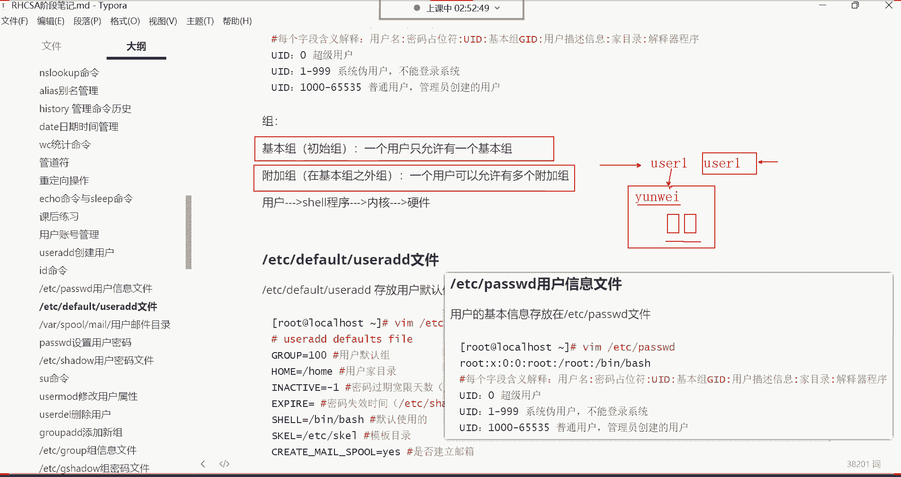
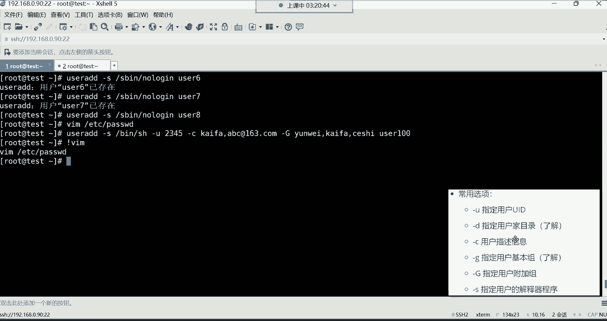

# 新盟教育-Linux运维RHCSA+RHC培训教程视频合集，全网最新最全最详细！ - P15：红帽RHCSA-15.用户管理、用户信息文件详解 - 广厦千万- - BV1up4y1w729

好，喂喂喂，OK。那下边呢我们来说说这个用户的管理啊，这个用户账号管理。我们先说这个用户账号吧，其实大家都不陌生，用户账号的作用呢，你们都知道可以用来登录系统的，是不是啊？我们想要登录这个系统。

我们首先得在系统当中有一个账号。然后呢，通过账号呢，我们去登录系统，OK啊，这是我们所说的这个叫做账号的作用。嗯，然后这个账号的话呢，我们前面就介绍了在这个系统当中有两类的用户，第一类呢是超级管理员。

然后是root用户是吧？权限最大的，我们叫老流氓。然后第二类用户呢就是系统里的普通用户啊，是管理员创建的那些用户。那在讲这个账号管理的话呢，我先给大家讲清楚。

就是在企业当中一台服务器上面这个root账号，这台服务器。啊，这服务器里面这个root。这个账号的话，我跟你讲在公司里面可并不是说所有人都会拥有这个root账号。的权限的为什么呢？因为root这个账号。

你想想它的权限非常的大，它的一条命令是不是可以直接把整个系统都给你删掉啊？😡，所以说这个就是因为权限太大，责任呢就越大，是不是？所以一般普通的员工呢，在企业里边。

是不会具备这个root超级管理员这个账号的。权限的哈就是一般不会给他分配这个root账号，一般就给他分配一些普通用户的账号去使用。然后他权限比较小，对系统呢也不会造成一些威胁。对。

所以这就是这个我们所说的个为什么会有这些普通用户的存在啊。😊，然后root呢一般都是公司的核心人物，比如说你们公司的部门的领导，或者说你们公司一些核心骨干的运维人员，他们才会有拥有root的权限啊。

因为人家你想想，对于服务器业来讲，已经是有非常丰富的经验了啊，所以说他们手握root权限呢，一般是怎怎么说呢？是不会出现任何问题的。你一个呃如果说你比如说你。经验也不多啊，技术水平呢也不怎么也不怎么地。

人家不可能给你入他权限的。😡，所以说呢我们要学习这个普通账号。那普通账号的话呢就是我们先来讲第一个啊叫用户的模板目录。这个目录大家作为了解即可哈。这个目录呢下边有一些文件。😊。

来看一下哈来看一下ETC的SKEL这个目录。这个目录你这样打开，你发现什么都没有是吧？没关系哈。😊，你这样加个杠A，把隐藏的文件给它列出来。那这个呢一些隐藏文件。是在哪呢？在这个ETCSKEL这个目录。

然后至于这个为什么叫模板目录，就是它这个目录下边这几个文件呢，其实跟用户的加目录那些文件其实。啊，我们回到自己的家L点，有些文件非常类似，你看了吗？什么点bitchlog out，这是灯，这是退出系统。

注意啊，退出系统我们会用到一个文件。这文件里面放的什么东西呢？你看一下。😊，bitch log out。啊，这这里面现在什么都没有是吧？😊，嗯。嗯。登录。

我记得这个文件以前会记录我我们是什么时候退出的系统。呃，如果没有在这个文件里面记录，就是在那个哪呢？就是在那个有一个日志文件里面记着，然后看一下啊cate。点儿拜尺。log out啊，确实没有记哈。

那这文件现在应该没有什么用了哈啊后还有像这个黑ory啊，像这些历史命令是不是啊？还有像什么呢？还有像这个点batch profile，还有像这个bitchRC这些文件。其实这些文件都是从哪来的。

都是从那个。😊，ETCSKEL这个目录啊，我们加个杠A哈。啊，价格杠A。你看像这种这个by叉RC这个文件，还有这个点bych profile这个文件。

像这些文件呢都是从ETCSKEL目录拷贝到每一个用户的家里边去的。包括这个拜是 log out。啊，都是拷贝到用户的家里面去的。然后这些文件干什么用呢？你想这个就是给这些用户。登录系统时提供一些。

比如说用户敲个命令，到时候我给你存到哪个文件里边，给你存到这个历史文件里边。没错吧。然后像这种拜插RC，我们前面讲过，这是存放命令别名的啊。比如说这个用户他自己定一些命令别名。😊。

那这时候啊这个命令别名，我给你记录到哪个文件里面，给你记录到这个拜RRC这个文件里面去。😊，啊，其实就是。叫用户的模板目录啊，就是把一些用户在系统当中啊所必备的文件给你拷虑到你的家里面去啊。

其实就这意思。所以这个目录呢大家没有必要去深入去研究它。你即便说你不知道这个目录的存在，其实也不会影响你对这个系统的一个使用的啊，知道一下就行。😡。

然后下边呢咱们就讲怎么去创建用户啊，用的命令是UCI的这条命令。那us side这条命令呢，也只有root超级管理员才可以使用这条命令哈。因为普通用户是没有资格使用这条命令的那命令呢也非常的见明之意啊。

us side首先你说user呢这个单词代表是用户ADD呢代表是添加，所以这个命令啊就用于去添加新的用户的啊，那命格也非常简单，就us side。😊。

后面的跟用户名比我创建一个us色E这个用户，用户名自定义哈叫什么都行，但是别取中文。你如我取一个，我创一个用户，这个用户叫什么叫叫张三啊，或者叫叫小芳。那无效的用户名。不支持中文哈。

所以呢就用英文来命名。比如创建一个什么呢？创建一个。优势一。用户一的意思哈，然后创建好之后呢，那这用户就存在于我这个系统里边了。但你说这用户创建好了之后，我怎么看用户的信息啊，你说这就感觉用户创建好了。

但是。😊，就跟没创建一样是吧，这用户怎么用啊？接下来有了这用户以后，我怎么用这个用户啊，是吧？😡，啊，那我们先了解他的信息，然后我们再讲这用户怎么用。呃，这个用户后期得给设置密码。

然后我们才可以使用这个账号去登录系统。但现在它没有密码，我们没有办法去登录。那对于用户的信息呢，我们想看的话，你说这用户创建以后，这用户在哪放着呀啊，这个文件。

就这个文件哈。

这个文件呢是这个叫用户信息文件，在ETC下边的passWD也是我们前面经常讲的一个文件。那接下来呢咱们就得深入去来说一下这个文件里的内容了。前面总拿这个文件去练习是吧？

那你看用户的基本信息就存放在这个文件当中。那接下来呢我们打开这个文件哈。ETC下的passWD掉。啊，接下来呢嗯看这个文件，我们这个内容比较少，总共多少行呢？咱们把行号打开吧，是吧？英文单号。

然后set none回车。😊，显示行号。那对于这个文件来讲呢，大家看一下哈，就是总共是20行。其实这个。😊，这个文件大家。给我们的感觉，如果是你是第一次打开这个文件，你发现这文件给我们的感觉就是乱。😡。

是吧虽然说有些什么颜色感觉这个花里胡哨的，但是呢就是乱。给我们的感觉就是错综的复杂，特别的乱，不知道怎么去看这个文件。呃，我先给大家讲讲这个文件是每一行注意哈。

你看总共20行是不是每一行都代表一个用户的基本信息。所以说你想知道你系统里面有多少个用户的话，或者说有多少个账号，你就看文件有多少行就行了。20行就20个账号。那你说每那你说这每一行分别怎么去解读呢？

😡，怎么解读呢？啊，这个就非常的重要了哈。这个文件啊，你甭管是这一行有多长，你看像第一行。😊，感觉比较短是吧？然后下面这行呢感觉比较长。😊，我告诉你哈呃，你甭管是比较短的行还是比较长的行。

他是以这个英文的冒号作为风格。以这个英文的冒号最风格哈，然后总共每一行有多少个字段呢？多个字段呢？以冒号这风格总共是有7个字段，或者说七列都行啊，我们以列来说吧，总共有7列。啊，遇到冒号就是一列。

然后呢，第二例。然后第三列。啊，第四列。第五列。第六列。第七列看到了吗？这是以冒号作风格，每一行总共有7列。那下边比较长的也一样，你看这个比较长。这是第一列。好，这是第二列。这是第三列。这是第四列。啊。

这是第五列。啊，一直到这儿。啊，这是第六列。然后这个是第七列，看到了吗？所以说这个文件呢是非常的有规律的哈，每行代表一个用户的信息。然后每行以冒号作为分割，总共是分为7列。那每一列代表什么意思啊？

这个就非常的重要了。啊第一列，我们先说第一列哈，就每一个字段的含义解释，就是每一列的含义解释。第一列叫用户名。😊，啊，就是这个最左侧的一列就是用户的名字了。那你看这个应该大家都认识。

比如说我们系统当中的这个root超级管理员的信息，它也在这个文件里面放着呢。所以这个文件的重要性呢不用我太多说，如果你把这个文件一删掉。好，那root的信息在这个系统里面也被你给删除了。

那以后你想使用root这个账号登录系统，你发现。你登录不上来，为什么呢？因为你在登录系统的时候，系统首先会跑到这个文件里面，看看你输入的用户名在这个文件里面，它有没有。😡，如果你输入的用户名。

那系统在调取这个文件的时候，发现哎这个文件不存在了。😡，所以你这个用户也没有办法登录了，能列解吧？所以这文件是不是非常的重要啊？O。好，那。也主要就是因为root它的信息也在这个文件里面呢。😊。

那第一列代表用户名，然后包括我们前面建的那个用户像usCE看到了吗？啊，也是在这个文件里面的最后一行啊。用户名。那第二列呢第二列呢叫做密码的站位服务。这什么叫密码占位符合？

其实它就类似于一个密码的标识一样。这个标识呢永远都是X，哪个用户的标识都是X来表示的哈。而这个S呢现在没有太大的实际的意义了，其实就是一个标识符而已。呃，因呃他不是用户的密码，因为用户有没有密码。

他这位置都是X，或者说这个用户的密码有多么的复杂，多么的简单，他这位置也永远都是X来表示。啊就是这个X。叫密码标识符。呃，所以呢不是什么重要的字段。那第三列呢，这个就非常重要了。第三列。

这个叫用户的UID。这个UID是干什么用的呢？UID叫。用户的身份证号啊，你怎么去理解，你看我们生活中啊每个人的唯一标识就是就是我们的身份的唯一标识啊，就是我们的身份证号。因为名字有很多都是重名的。

就你的名字在我们这个全中国可能说有很多人都叫同一个名字哈，可能你不知道而已。但你说如果真的是遇到同名的了，我们怎么去区分这两个人的唯一性啊，名字都一模一样，是吧？那我们就通过他的身份证号去区分。

因为身份证号肯定是不可能重复的。所以这个在系统里面他的特点也一样。每个用户哎都有一个属于自己的一个唯一的编号，这个编号就叫做UID。😊，啊，叫用户的ID号优就是优色I就是ID。用户的ID号。

但这个UID呢又有一些不同的含义。你看啊UID如果为零的呢，这个叫超级用户。就是那个root，你看只有root的UID才是为零的吧。那别的用户，你看它的第三列可都不是0啊，麦克地址可以这么理解可以哈。

可以这么理解。😊，呃，你看啊你看像我们刚刚自己建的这个U色E，它的这个UID是1001是吧？1001那只要不是零的，都不是超级用户。所以在这里边呢，我再给大家呃就是纠正一个问题。

这个问题呢是我们第一天给大家讲解的一个问题。就是说我说系统里的超级管理员叫root，是不是啊？但是我跟你讲，并不是说叫root的。就是超级管理员。而是。只有这个UID为0的人，才是真正的超级管理员。

如果后期你说我把UCE它的UID给它改成零的话，你知道吗？UCE它也是超级管理员。😡，不是说只有root是超级管理员哈，因为只看UID。😊，OK所以这个大家一定要搞清楚哈。😊，好。

那接来呢这个如果UID是从1到999范围内的呢，这叫系统的伪用户。这个伪用户一般就是这个伪。我们理也是假的意思是吧？伪。伪装假的。其实我跟你讲，它并不是假的哈，这个尾呢它是真实存在的用户，真实存在。

但是呢就是不能登录系统。😊，那所以说这个问题就来了。你说你像UID你看像这种一的是吧，B这个用户UID是一demo的用户UID是2是吧？的用户UID是3那LP这个用户的UID是4是吧？

这个SYNC的UID是5UID是6，你发现这UID。😊，一直到999，也就是说一直到哪儿，一直到哎呦，我们还没有那么多是吧，没有那么多，反正呢从1到999的都是这些不能登录系统的用户。😡。

那现在问题就在那儿说我们为什么会搞这些用户？存在他还不能登录系统的那要他干嘛呀？😡，我们说这用户的账号不就是用来登录系统的吗？但是你说他们不能登录系统是吧？😡，所以这个呢要给大家说清楚啊。

任何的系统的程序想运行，它都得需要一个用户的身份。

我们找到这个资源管理器。能找到这个任务管理器哈。

那在这个任务管理器里边呢，我给大家看一个信息，看哪个信息呢？看叫详细信息。在详细信息里面，大家可以看到哪些呢？首先左边是进程的名字，就是你程序运行以后呢，它会生成诸多的进程，看到了吗？

包括我们在用的腾讯课堂啊，起了很多的进程，包括我们用的这个酷狗音乐听歌的是吧？也起了很多进程。包括我们的浏览器是吧？嗯等等等，都有QQ非常多的进程，是不是啊？好。

那这时候我再给大家说一下这个每个程序运行，你就比如说像腾讯课堂这个程序，它运行的话，它起了这么多进程。那你知道这些进程都要以一个用户的身份去。😊，运行。就是我想运行。

我得必须得以你系统当中的某一个账号的身份才能够运行成功。以谁呢？啊，这是我给他建的一个普通的账号。所以呢到时候他们运行的时候，就以这个账号的身份去运行。

然后继承的权限就是这个账号在系统当中的这个身份的权限。就这意思，你包括你看这些，而且还有很多的账号能看到了吗？什么system这个用户，然后呢，你看某些程序在运行的时候。

就以这个sstem的身份在运行local这个用户的身份在运行的时候，你看就这个程序在运行的时候，就以local的身份在运行，看到了吗？啊，network这个程这个用户的身份。😊，看到了吗？啊。

就是给什么呢？给某些程序运行准备的这些账号。那如果你说你这没有这么多账号，那程序在运行的时候，它没有这个用户身份，它怎么运行无法运行？😡。

啊，所以这时候大家应该能够清楚。什么叫伪用户了吗？就是有的用户我根本就不需要他登录系统。😡。

但是呢我要给他干嘛呀？我还得让它存在，它存在的价值就是给某些程序运行而准备的一个账号。啊，某个程序运行它会自动调这个用户的身份，以他们的身份在运行就可以了，也不需要他登录系统。啊。

其实就这个就我们所说叫系统的伪用户。啊，不需要他登录系统。好，然后下边这个UID如果是从1000到65535的这个叫系统里面的普通用户。这普通用户就是我们管理员在系统当中创建的这些用户了啊。

我们叫普通的用户。啊，那你看我们前面在安装系统的时候，我们自己建了一个用户叫test是吧？你看他的UID是多少啊？他的UID就是1000。😊，是吧然后你看这个U41这个用户，他的UID就是1001啊。

这些就是都是我们管理员哈手动创建的。啊，这是UID啊，它就是不同的编号，还有不同的含义呢。好，那这是第三个字段，叫用户的UID。那第四个字段呢啊或者第四列，第四列叫基本组ID。我们看一下啊第四列。

基本组ID。第四列在这呢，换个颜色吧。啊，基本组的ID啊，什么叫基本组？这个基本组呢前边我们已经反复提过这个词了是吧？基本组基本组。所以说呢这个基本组呢，这时候再给大家说说这个基本组。

其实我们也管它叫做用户的初始组。什么叫初始啊？就是与生俱来的。

我们在系统里面，比如说我每见一个用户，这个系统就会自动给这个用户分配一个组。比如我前面建了一个UCE是吧？那系统呢也会给这个UCE这个账号自动再分配一个组。这个组呢也叫usCE的组。同名跟用户名同名。

让这一个用户呢只允许有一个基本组。那只允许有一个基本组。这，没有为什么，只能有一个哈。然后还有一个组叫做附加组。这个附加组是在基本组之外额外附加的。😊，比如UCE这个用户可能说啊他是什么呢？

他有一个自己的积分组是吧？那UCE这个账号以后我给谁用呢？我给运维部门的某一个员工使用啊，把这个账号发给那个员工，然后让那个员工呢使用这个账号登录系统。那这时候。😊。

这个账号可能说我还需要他对我们这个系统当中的某些文件具备一些权限。哪些文件呢？比如说有一堆文件啊，现在是有非常多的文件哈，这些文件呢呃是属于哪个部门的工作文件呢，是属于运维部门的工作文件。

那这时候呢我们会在系统里面再建一个组啊，这个组名叫做比如说就叫做运维组。😊，啊那这时候呢，这些文件。他的权限。对于运维组来讲，都可以进行增长改查。

那以后你想让UCE对这个文件也可以具备什么增删改查的操作，你就把UCE用户再加入到这个运维组里面就可以了。所以这个运维组就是属于用户在自己初始组以外。😊，额外附加的我们叫附加组。

然后以后这个用户呢就会继承这个运维组的权限。那继承什么权限呢？就是运维这个组对于文件的权限，它可以继承。

因为对于每个文件的详细属性，我们前面就给大家讲过文件有哪些详细属性啊？有所有者搜索组是吧？😊，我们建个文件哈，我们touch。一个hello点TAT然后我们来看这个hello这个文件，你看这个文件。

你看这所有者，然后呢，这是搜索组是吧？默认的这个文件的搜属组就是用户的基本组。就这意思哈，那后期比如说我希望这个文件属于谁的组呢？属于比如说我给他改个组，我给它改成运维组。😊，给它改成玉米组。

那接下来呢我希望这个运维组对这个文字的权限，那是不是在这儿？中间这三个字符是组权限啊，然默认是只读。那我希望这个组对这个文件的权限是什么权限呢？是这个比如说RWX能读能写能执行。😊。

那你就改这个权限就可以了。这权限我们后面再讲怎么改哈。那接下来你看这个组一旦对这个文件具备一个读写执行权限了，那以后我再把这个UCE这个用户加入到这个组里边，UCE用户往这个运维组里面一加。

那UCE呢就会继承这个组对这个文件的权限。那也说UCE对这个文件的权限，其实就是什么权限呢？就是这个读写执行的权限。😊，所以这个组就是UUCE用户在自己的这个UCE初始组以外额外附加的组。哎。

其实就这玩意儿，这就所谓的组的概念。😡，组嘛是吧，那以后你们公司里面，比如说我运维部门，还有别人呢，还有这个什么张三李四是吧？😡，你把张三也加入这个运维组里面，那张三就会继承这个运维组对这个文件的权限。

那你说我我们公司还有李四，那你把李四也加到这个运维组里边，那李四以后就会继承这个运维组对这个文件的权限，读写执行。那没有在这个组里面的权限呢，没有在这个组里面呢那就是被归类到了其他人了啊。

他们就会继承这个权限。只读。😡，啊，其实就这意思。所以说这个组啊这个组那组的话呢，每个组都会有1个ID号啊。然后我们现在看到看到这个叫组ID每个用户的基本组的ID跟用户的UID是相同的。看到了吗？

叫基本组的ID叫GID用户的UID是多少，它的GID就是多少啊，这种东西没有必要去改它。好，然后呢接下来呢用户的描述信息，这是第五个字段了啊，第五列描述信息哈这个描述信息。

你看为什么U4一它没有描述信息啊，是个空的，是吧？😊，那是因为啊这个描述信息，这个它其实不是什么重要的信息。你说我们怎么去理解这个描述信息呢？😡，你看这苗信息U41就没有是吧？其实这个描述信息。

大家可以把它理解成是一个用户的备注。这个备注单啊应该都不陌生。比如说你加一好友。你加一好友的话呢，就是加一个女孩子是吧？这个而且你还是频繁会加很多女孩子的好友啊，海王。然后你加这个女孩子呢。

可能说这个女这个太多了，是不是啊？可能说这个女孩子特点你一般呢是吧？你会加一个备注，比这个女孩子特点就腰细腿长是吧？然后再加别的女孩子再给加个备注，比如这个女孩子前凸后翘的。😊，是吧然后另外一个女孩子。

你说波涛汹涌的，然后她再是不是每个每个人都给他加个备注，这不就描述信息嘛，是吧？描述一下这个人的特征。😡，啊，或者说这个他只要你自己心里清楚就可以了啊。以后你说我就想我今天是吧，我这个心情愉悦。

我喜欢腰细腿长的。好，打开微信，一搜索腰细腿长。好一这全是腰细腿长的是吧？啊，然后啊我这个明天的心情是吧，这个也比较愉悦，我喜欢那些波涛汹涌的啊，想吃点荤的啊，一搜索。😊，波涛汹涌是吧？

这波涛汹涌就出来了是吧？啊，其实就这意思啊，所以说这什么叫什么叫做用户的描述信息呢？😊，这描述信息其实就是一个用户的备注信息，你知道吧？那你说放到我们这个系统里面，这个描述信息，我们怎么去理解啊？

就是呃每个用户你也可以给他加一个备注啊，比如说这个用户是哪个部门的，比如说运维部门的，还是开发部门的，就这个账号的使用者哈，我们说的是账号使用者是哪个部门的啊，你可以给他备注一下。

或者说这个人的联系邮箱，就这个账号你发给谁。这个人的联系方式，邮箱或者电话是吧？给他放到备注里边以后呢也好联系。😊，是不是啊嗯，你像你们平时加好友，你们一般不也是比如说这个人干什么工作的，是吧？

比如说呃这个。😡，这个人做什么职业的是吧，比如说送水的是吧，那个人呢充话费的是吧，那个人呢卖卡的等等等等，是吧？😡，你一般不得加个备注嘛，是吧以后方便去什么呢？去联系这个人。啊，其实就这意思哈。

所以说呢像这种描述信息呢不是什么重要的字段哈。所以这个我们自己创建的这种就没有没有哈。而前面都是我们系统自动给的，自动给的，知道一下就行。😊，啊，这是描述信息。然后第六个字段你啊68号。😀呵呵。😊。

68号是吧啊，什么68号10086是吧？啊，备注1个10086。😊，呵呵。😊，嗯。把自己的情人是吧？😊，备注成10086客服。😊，这波操作还是可以的是吧啊？😊，一一接电话，哎呀，客服打电话了。

就给我推荐什么套餐，算了算了，咱不接了是吧？吃饭啊，其实就这意思，10086背锅了。😊，Okay。688是吧？好，这是这个完了我们再说第第六个字段哈。😊，啊，这个套餐不便宜是吧？啊。

第六个多段叫加目录啊，这个加目录是什么意思呢？就是每个用户的加的位置哈。然后对加目录呢，在这里面你一看就知道root超级管理员的加在哪在根下边啊，在根下有个目录叫root目录啊，这是它的加。

然后呢这个us色一呢，它的加是在根下的home下边，然后有一个user一的目录啊，这是us色一的加。😊，哎，所以以后你想找每个用户的加目录，你就打开这个文件，就看第五第六个字段就可以了啊。

就告诉你每个用户的家在哪。然后第七个字段叫用户的解释器程序啊，解释器程序这个呢给大家讲讲哈。😊，在并下的拜并是一个目录啊，是我们跟下的这个并目录然打开这个跟下的并目录。然后在闭幕下边呢有很多的这个。

你看B下边有一个文件叫batch，这是一个程序文件，是不是啊啊，然后呢，这个就是说给这个用户解释命令的这个程序是bittch这个程序，然后所在的路径。在变这个目录里边。那这个b是是解释命令的？

什么叫解释命令的呢？给大家讲讲哈，解释命令的东西。😊，它叫解释器。

啊，叫97号在这儿。首先呢我们先说一说啊，对于这个计算机来讲，我们说计算机只认识这种二进制语言，也就是这个0101这些二进制是吧？然后我们在跟计算机打交道的时候，我们敲的都是命令。

你看我们敲的哪些命令啊，什么LS是吧？kite之类的CD这些命令等等等。但是最终计算机他不认识我们敲的这些命令的。😡，这就等于什么呢？这就等于说啊我们一个中国人在跟老外对话，你发现你们两个呀语言不通。

😡，是不是啊哎，就我们敲的这些命令，你们可以把它理解成是中文。而老外呢，他不认识中文，他只认识英语，那怎么办？😡，你还想跟他交流，我们一般会干嘛呀？😡，找个翻译是不是啊？哎，翻译呢在这给你翻译一下。

你说完以后呢，让那翻译翻译一遍，翻译给这个老外听，老外就懂了是吧？而计算机也一样，其实计算机压根也不认识我们敲的所有的命令的，知吧这些面子他都不认识，那怎么样？那为什么我敲的命令计算机。

他知道我要干什么呢？😡，最终啊得经过一个叫sha这么一个解释器的东西。注意啊，叫bitch解释器。😡，拜ch这个程序，这个程序呢是一个解释器程序。是一个解释器，这个程序就是解释命令的一个程序。然后呢。

他可以把我们用户的命令给它翻译成计算机认识的那个什么呢那个二进制啊，翻译给计算机的内核听，然后内核呢再去控制硬件。是这个意思。哈哈是这个意思啊，所以这个解示器呢，我们默认用的解热器。😊。

注意啊是系统哈自动分配的，或者说我们现在用的解示器都是这个bitch，这个better叫标准的警示器。😊，什么叫标准的呢？😡，啊，因为解释器有很多哈，在哪放着在ETC下面有个ss这个文件。

这个文件大家不用记哈，知道就行，看了吗？在这个文件里面放着我们当前的系统的解释器程序都有哪些有SH，还有这个bitch。😊，而这个SH是最早期的一个解示器，非常非常古老的。现在在那个。

那个系统里边仍然在使用这个SH作为这个un的解释器，帮unix系统去解释命令的。而现在呢我们用的是linux是吧？那linux系统呢，它用的是这个bitch这个解释器，解释的命令。

而我们现在登录系统所看到的这个终端。注意哈，终端就是bittch给我们提供的。那你说我想看SH解示器的风格，每个解示器风格不一样哈，你可以这样直接并一下的SH推车。😊。

我我们现在就切换到SH这个解示器了。注意啊，现在就是SH解示器的风格，你敲敲不定LL跟。😊，看到了吗？啊，这就是SH的风格。你发现跟bach好像确实不太一样。而你看bech呢我们用多了，用习惯以后呢。

可以看到我们当前登录系统的用户是吧？当前的主机名，当前的所在位置是不是啊？😊，但这个SH呢一般呢你切换路径，它也不告诉你，你看到了吗？不显示。😡，总之呢就是这么一个解释器的风格，非常的简约。低调。

看到了吧？啊，就这样哈，但是你敲命令呢，没有啊，他可以正常帮你解释。因为你想它毕竟叫解释器，是不是毕竟叫解释器，只要是解释器，它就肯定具备解释命令的功能。所以说呢？但是呢解释命令归解释命令。

就是有的时候可能说我们觉得它不是很好用。这玩意你怎么去理解，你就理解成这玩意可能说都叫车。但是呢这个。😊，长安跟宝马都叫车，是不是？但是可能说你开过了宝马，你再去开长安。

你发现就感觉从各个方面来讲都不是很舒服。😡，其实就这意思就这意思哈。所以SH这个解示器呢就是一个非常简陋的解示器，X的退出啊，退出这个解示器哈，又回到了我们这个拜警示器。😊，好，我们经习惯这个了。

嗯换个标是吧？😊，哎，所以说其实这这个解示器不同解示器有不同的风格哈啊后下面这两个呢是它的一个什么呢？就是你看B幕下面不都是快捷方式嘛，不都是链接嘛？啊这是它真正指向的这个什么呢？真正的原文件哈。😊。

真能原文件。呃，这就是我们所说的这个解释器啊，标准的就是这个拜ch解释器。但然解释器除了拜ch以外，还有很多呢，你像CSH。TCSHZSHKSH。非常多。嗯，那这么多警示器呢，怎么说呢？😊。

那像红帽子系统默认使用的就是这个bitch。你可以把它理解成，就是这个拜是融会了。大部分解释器的优势于一身的一个标准解示器。而有的企而有的解释器，你像这种KSH像KSH这都是需要花钱的解释器。😊。

而这个不需要花钱哈。下面两个是路径嘛，对，下面两个就是。他们都一样，这不是。😡，在B目录下面，咱们说B不是一个链接文件嘛？在B目录下面所有的东西都从哪儿链接过来的呀。

都是从这个user bin链接过来的。😡，啊，都是从user并连接过来的。你看根目录下面啊，等会儿啊。你看跟目录这个bin，这个 bin目录本身不就一个链接文件吗？😡，是吧。阿路杠B看到详信息。

你看它真正的原文件不都是对应的是user bin下面吗？是不是user bin。所以说你看这个在并下的SH其实对应的就是user并下的SH都是一个东西哈。

然后在并下的bitch对应的就是user并下的 batchch都是一个东西。😊，好，这是解示器程序给大家说清楚了是吧？所以说呢默认哈我们这个用户使用的解释器都是这个bitch标准解示器。😊，啊。

并一下的半是标准解水器。好了，那。但是呢还有一个比较特殊的警示器，我们看这个哈。😊，在SB下面有一个叫n log音的警示器。你看你发现这用户怎么都是S并行的nlog in呢？我告你。这个解示器功能。啊。

还有什么什么SYNC是吧？你看这个什么SYNC这些解释器。😊，我跟你讲，这些解释器都是不允许用户登录系统的。就是他们是不具备解释命令的功能的，知道吧？就包括这些哈什么sout down。😡。

他们是不具备解释命令的功能。他们具备什么功能呢？他们具备就是叫禁止用户登录系统。哎，他这个沙特杠具备解释命令功能，它解释哪个命令呢？叫沙特档那条命令叫关机的命令。你在一敲这条命令的时候。注意哈。

他就帮你通过这个解释器去解释这台微令，把你去关机了。好吧，而这个no log in呢是我们要给大家强调一下，这个叫禁止用户登录系统的一个解释器。就是它不具备解释命令的功能。啊，不解释命令。

所以说呢你看像这些我们说叫伪用户啊，就前面不能登录系统的用户。你看他们的解释信都是这个nlog。存在，但是不能登录系统，是因为这个警示器的原因。而这个解释器是可以正常登录系统，正常去帮你解释命令的。O。

好，这是。S并下的n了个 in这个就是行啊。

好了，那这个文件介绍好了是吧？记录清楚了。那介绍完了之后呢，嗯下边呢我们再来说一说改成be日，改成改成拜日就可以登录了就可以了哈。然后接下来呢我们。😊，在干嘛呢？

再来啊给大家说说一个Uside的这条命令。说一说哈。呃，UCI的这条命令呢。有些选项我们并没有给大家讲，是不是啊？然后把选项给大家说一说哈啊，前面创建用户的时候就直接Uside的。

然后面呢跟上的是用户名。那现在呢咱们说这个选项啊，选项都有哪些呢？非常多。😊。

非常多哈。

我们来看这一个一个的选项吧。第一个叫杠优这个选项就是杠U这个选项是用来指定用户的UID的。就是我们前面创建一个用户，你发现我们这个用户啊。你看他的UID是系统自动分配的是吧？像这些普通用户呢。

都是从1000往上系统会自动分配。那我现在比如说我想创建一个用户，我想自己手动去指定他的UID比如我想给他指定多少呢？6666可以吗？可以啊，因为这个UID最多可以存在多少呢？叫65535个呢。

我现在想创建一个用户，我想指定他的UID是6666。因为因为在这个文件里面没有，我可以随便指，只要没有，我就可以随便用哈。那这时候怎么办呢？哎，我不想让系统给我自动分配了，那就这样。😊。

UCI的杠U指定6666后面个人用户名，比如叫UC级的U46回车创建好了。而这个选项没有严格位注要求。你比如我再建一个用户，user艾先指定用户名，比如叫us色7啊，我指定他的UID叫7777。回车。

啊，杠U。杠U。回车可不可以呢？可以，然后咱们打开那个。passWD文件，你看一下啊。这个U46跟U47，你看它2个UID是不是都是变成了我自己手动指定的了呀？6666，还有7777。没错吧，啊。

这没有任何问题。手动指定它的UID，而且这个选项呢也没有一个严格的位置要求。你放前面放后面呢都不影响。都不影响哈OK这是手动指定用户的UID的。但这个需求呢。😊，也比较少见比较少见哈。

一般我们也很少会去指定用户的UID的。因为这种UID就是系统呢，它是以此类推是吧？你现在用户的UID比比如说最大的是1000，那以后呢，再创建用户就是1001，然后再创建用户呢就10021002哈。😊。

然后再创用户就是1003，我们一般也不会去随便去改变他的UID。而且这UID我们现在最高给它改成7777了。那以后你再见用户。注意哈呃。可以直接VM可以啊，可以，没有任何问题。我们可以直接VM是吧？

在这个。嗯，看我们打开这个文件。我们打开文件，我们可直接在这个文件里面改，比如把这个它的UID给它改成多少呢？😊，我们直接给他改成，比如说1234。可不可以啊左ID也给他改成1234，然后下面这个。

给他。给他改成多少呢？比如说这个1002。这个呢也是1002。1002。然后保存退出。WQ。保存退出了就可以啊，也可以改，没有任何问题。然后改完以后，你说我怎么看呢？😡。

那有一条命令叫ID命令ID用户名，比如优色6飞车。看到吧？就直接变成1234了哈。1234，然后ID命令给大家讲讲ID命令是看组信息的ID。

这个ID命令用于查看系统用户和用户所在的组的信息。

就是它主要是看组的信息的。所以这条命令呢它可以显示一个用户的。啊，首先呢有用户名字看到吗？然后以及这个用户对应的UID是多少？😊，然后呢，还有这个用户的组ID啊，就这个GID叫组ID哈。然后呢。

这个用户总共属于多少个组？😊，总共属于多少个组啊，但是你发现这个阻碍D有些不太对劲哈。这个主D怎么直接变成1234了，怎么没有组名啊，没有组名是吧？😡，其实这种就不是怎么说呢？直接通过VM改的话呢。

你得需要精力重启。😡，得需要经历一个重启哈，因为这个阻碍的印当初建的时候。它有一个文件存着呢，在哪个文件呢？啊ETC有个group的个文件，这个文件里面你找那个优色几啊，你看优46跟优色7。

你发现这个文件并没有变，看到了吗？这个文件里的信息你有有没看到优色6。😡，这是用户名，啊后这是他们的组ID啊，我们后面也会讲这个文件的哈。你看这个文件它并没有发生真正的改变。😊。

所以如果你还还想让他真正改变的话，你这文件也得改。改这个文件，这就有些麻烦了，多少呢？1234是吧，然后10021002保存退出。就是你的IDus6啊，这时就可以了，组名也出来了啊。

这是它的组ID就是比较麻烦一些哈，比较麻烦。啊，然后这用户总共属于多少个组，注意，这后面是用户总共属于多少个组啊，因为这个第一个是自己的初始组，那后边呢你比如我再给他加入到了什么。

这个组那个组的什么运维组是吧，又给他加入到开发组，又给他加入到测试组等等等等啊。好，这是ID命令。所以说呢我们一般改很少会通过VM去在文件里面直接改哈，很少直接通过命令去改。😊，好。

这是指定用户的UID这个UID呢一般如果需要的话，你可以知道通过杠U就可以指定。然后杠D指定用户的加目录。这加目录的话呢，每个用户的家在哪放着呢？我们说用户的家一般都是在这个根下的home下边是吧？

你建一个用户呢，系统就会把这个用户的家给它放到这个home里边了。跟用户名同名。然后有的时候我想创建一个用户，不喜欢它的加载home下面怎么办呢？啊，那这时候你就可以手动去指定了U ID。😊，我。

通过杠D这个选，当然选项没有前后的要求哈，对root可以改好。😊，别的用户改不了的哈。呃，比如说我现在希望他的家在哪儿呢？在这个根下边让它叫优色三啊。😊，注意啊，这个U43目录不存在的哈。

不存在不存在会自动创建的。😊，好，指定到优色3这个目录。然后用户名叫什么呢？用户名也让他叫U43吧啊，当然这个东西不一定非得都叫同一个名字哈。但是我们一般都不都是为了见名之意嘛，是吧？

都是给他取一个同一个名字，用户叫优43，他的加呢也叫优色3，然后回车，就是你看一下你的根目录，就多出来了一个优色3的目录，看到了吗？这就以后就作为它的加了。😊，他的价。

但是呢我后面写了一个叫了解什么意思？就是我们很少去改变一个用户的加目录。为什么呀？因为你看系统它这个机制给你准备的，就是所有的用户的家都在home里边。那以后呢，我在管理这个系统的时候。

其实就可以实现一个所有普通用户的加目录的统一管理。啊，叫统一管理哈，所以一般很少就改变一个用户的家。😊，能理解吧来。OK这是用户的加目录。然后呢知道一下就行哈，这种需求一般没有没有哈。

然后杠C叫用户的描述信息，描述信息什么意思呢？就是那个备注哈，我们前面见到所有用户，你们看一下ETC下的passWD。😊，每个用户他有描述信息吗？并没有。看到了吗？并没有都是空的吧，是吧？

那我想建一个用户，我也我也想给他加一个备注，可不可以？😊，好，可以，这时候你就us侧艾。杠C指定名信息，比如这个人是哪个部门的运维部门的电话号码，比如说他的电话或联系方式叉叉艾特163点com。

这是他的邮箱哈。然后用户名叫优色几呢，比在嗯叫优色2吧啊。然后如果你还需要指定他的什么UID你就后边去续指啊，比如UID是多少呢？比如说等等等等啊，随便想指想怎么指就可以哈，都不影响。

这个选项可以同时使用的。😊，Ot的为啥有啊t是我们安装系统的时候创建的一个用户。😊，然后右32这时候我们再干嘛？再打开这个文件再看一下。那你看它的这个什么呢？呃，描述信息AAA等等等等。杠C。

U呃UCI的。杠C。U色2。啊，这儿呢这儿呢在这哈看到吗？U42这个用户，你看他又多了一个描述信息在这呢。😊，是吧。所以说这个描述信息就不是什么重要的内容哈，不是什么重要内容，你可以写也可以不写。😊。

OK就是像我们生活中是吧加个好友给他添个备注一样，其实就这意思。OK然后还有这个小写的记叫指定用户的基本组啊，这个一般我们不会去改变一个用户的基本组啊。所以这个呢选项呢大家也不用去练习了啊。

几乎没有这种需求没有需求。然后如果你想改也行。比如说嗯如果想改变一个用户的基本组，你可以建一个用户，可以建一个组哈。😊，而这个命令我我们后面也会讲的哈，当是现在先知道一下叫创建组的命令。我建一个组。

这个组叫什么组呢？比如让它叫。😊，叫什么组呢？叫ABC吧，随便哈ABC然这会再建一个用户。😊，UCI杠小写的G指定组名叫ABC用户名呢？比叫优瑟斯。回车。那这是我们在IDU色4的时候，你看优色4的组。

就不是跟用户名同名了，而是什么呢？而是叫ABC了，这指定了用户的基本组。但是我们一般不会去改变用户的基本组的。因为基本组是与生俱来的，我们是不会去动它的哈。我们一般会干嘛它会动它的附加组。😊，附加组哈。

就是我们这个服务器可能说有很多的组，我们建几个哈。😊，建一个运维组。再建一个开发组拼音哈，用拼音来代表开发，然后测试。O。呃，然后呢，这三个组有了以后呢，我再建一个用户UCI的，我可以用大写的G指定。

我要把这个用户既加入到运维组，逗号隔开，又加入到开发组，逗号隔开，又加入到测试组，用户名叫UC5回撤。ID优5。看到了吧？那这时你看优C5，它总共属于多少个组啊，除了自己的基本组以外，然后还属于什么呢？

还属于运维组、开发组测试组，是不是？哎，这叫附加组了，这叫附加组哈。然后以后呢。😊，这个用户会继承这三个组对文件的权限的。当我后面后我们后面讲再讲权限的时候呃，然后我们再讲归属关系的时候。

怎么改一个文件的归属关系。那，我们后边再去带带领大家去详细去说这种东西怎么改啊，你先有个印象，一个用户可以同时加入到很多组里面。所以这个组呢就叫做附加组。怎么加入呢更大型的记。

然后还有一个杠S指定用户的解释器啊，解释器。比如说我现在想建一个用户。😊，我也不想让他登录系统了，那我就杠S指定指定为指向为叫S并下的no log in这个解释器用户名让它叫us色6回车啊。

已经存在了什么us色7回车也存在了优色8回车。好，那我们再打开ETC下的passWD文件。那以后这个us色8这个用户。它的解释器变成那个nlog in了，那它无法登录系统了以后就。啊。

这是所谓的长的选项。然后这里面有两个是大家不需要掌握的哈，这两个。这两个不需要掌握哈。其实在这里面大多数的选项。😊，你。不需要去背它。还是那句话不需要去背它，为什么呢？因为这个这些选项用的不多。

这些选项用的特别少。所以什么时候用的记不住呢，可以去搜一搜查一查。啊，这种记这种基本的东西记不住的时候，看看笔记，网上百度一搜就出来了，多的是哈，所以也没有太大的必要去把时间浪费在这个方面。

因为这种东西确实不是很常用。好，那以上就是这个优色爱的这条命令的常用选项。好了，那你看我们经过一顿操作是吧？然后这个所有的选项可以结合到一起哈。😊，比如说我指定用户的解释器是并下的SH。

然后再杠U指定它的UID是比如多少呢？这个2345，然后再指定它的描述信息描述信息。比如说这个人是这个开发部门的联系方式ABC艾特。163点儿com瞎写哈瞎写。然后呢，还有什么呢？

还有这个人的嗯我想想哈。😊，行了，就指这些吧，再再给它加入到一个附加组里边，加入到运维组，加入到开发组，加入到测试组，用户名叫UC100。😊，啊，创建好了是吧，创建好之后呢，然后我们再看这个文件。😊。

他优C100的个用户是吧？他的。ID号是2345描述信息是吧，然后解释器。这都没有任何问题啊。可以放到一起去使用的。

好。这是UC的条命令，然后。那今天就讲这么多吧，好吧，对于用户账号管理呢，给大家讲了UC ID以及这条命的一些常用的选项。然后这里面呢大家就是敲敲两遍，熟悉熟悉就行啊。

没有必要去非得把这个选项都给它背下来哈，没有必要。我们我我们今天讲的内容呢，大家需要我我看看我给你们总结一下哈，我们今天讲的内容。😊，对这个文件每每每一列的信息，大家得要记下来哈。因为这个文件怎么说呢？

😊，这个文件后期会频繁的用的会频繁的用啊。所以对于这文件每一列的信息呢，大家得知道，因为总共就七列，每一列是什么，是不是？你就说白了，没事看一看没事看一看。😡，然后剩下呢。

WC啊WC命令呢也是后边会频繁用到的命令，管道服也会频繁用频繁用到重定项。那重定项的话呢，大家只需要记哪个重定项呢？呃。收出重定项就可以了。然后呢，还有这些只收集。这个错误的输出的还有这收集正呃。

反正这个除了输入以外吧，除了这个输入不常用的话，其实别的都比较常用，能理解吧？就除了这个不太常用以外，其他都比较常用一些。然后管道服这三个啊都是比较常用的，而且ic sleep后边也比较常用。

然后右 side的命令呢只需要记着一个命令就行了。然后ID命令啊，这熟悉一下就行，看组的信息的。其他的话呢，像黑al里斯这些呢都不是很常用的命令哈。所以像这些的话呢，大家没有必要去深入去研究它了。😊。

这些呢我框起来的哈，用粉色框起来的，大家就熟一熟一就行哈。然后红色框起来的这个就着重去多练一练OK吧？啊，脑袋嗡嗡的是吧？可以理解可以理解哈，可以理解脑袋嗡嗡的。😊，啊，慢慢练啊，这种东西慢慢练吧。

我刚开始都是这样过来的，我也一样，我刚开始脑瓜也嗡嗡的就是。😡，我刚开始的状态可能跟你们是一模一样的，就是我前脚刚学完，后脚。😡，你再去让我去回忆，哎，刚刚老师讲什么了呀？你发现我的脑子里一片空白。

回忆不起来。你们现在也是这个状态。😡，你如果我现在注意注意啊，我现在就是把这个笔记关掉，然后我让你们回忆一下，我说我说哎，咱们今今天这节课讲了哪些东西啊，你们你们可能再过一会儿抽根烟的时间。

你自己脑子就一片空白了，你就想不起来了。😡。

是不是？刚开始都这样哈刚开始都这样，所以你怎么办呢？多敲多练。

没事呢，看一看，把这东西给它导成1个PDF啊，我我不是给你们发了1个PDF的格式的吗？是不是到时候把那个PDF放到手机里边，然后呢，没事扒张出来看一看，看一看就可以了，好吧。😊，没事，就扫一扫，注意哈。

我给你们看的时候，你们就扫一扫，扫一扫，看看这个目录就行了。大体了解这个命令，具体的详细操作。说白了哎呀，什么时候用，什么时候再去深入研究它的，百度一下不都是吗。😡，就刚开始也是刚开始会的都不多。😡。

我也不是天生就会这东西的，都得慢慢学。😊。

好了，录屏停掉。