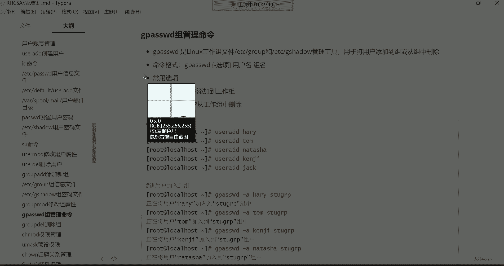
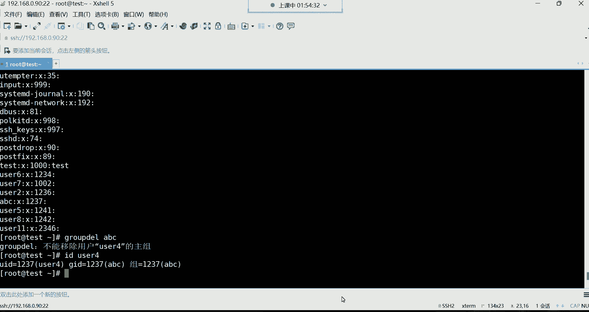

# 新盟教育-Linux运维RHCSA+RHC培训教程视频合集，全网最新最全最详细！ - P17：红帽RHCSA-17.组管理命令、组相关文件详解 - 广厦千万- - BV1up4y1w729

啊，来给我刷个一。啊，回来的话给我刷波一哈。OK。😊，好，那咱们继续哈。我们接下来呢讲讲这个修改用户的属性。😊，嗯。

为什么要修改这个用户的属性呢？主要就是考虑到这个用户如果已经存在了的话。啊，我们来看一看哈，看用户的信息，我们直接就tll看吧，看。😊，这个文件你看如果这用户已经存在了。

然后我想去把这个用户的一些信息给它改掉怎么办呢？比如我想改他的一些UID啊，或者说他的加目录，或者说给他加一个描述信息。比如这用户啊，我在建的时候，我忘给他添加这个描述信息了。哎呦或者说解释器什么的啊。

我都想改一改可不可以呢？可以啊，其实我们后期啊在这个。😊。

这个里边可以用user mode叫修改用户的属性的。然后呢，咱们来把这个命令呢拿过来哈，user mode。

嗯。拿过来。看下哈。那us mode这个mo是什么意思呢？就是modify modify啊，也不要好理解。😊，目地范呃。这个modified不就是修改的意思吗？然后简写成mod了。

然后我们就是用于修改已存在的用户的基本信息。注意啊，它是修改已经存在的。那命令格式呢跟user I的用法是一模一样的哈。user mode。然后呢我们可以通过众多的选项去修改。

最后呢再指定要改哪个用户的。比如说我现在想改谁呢？我现在想改usususerE啊啊，咱们拿usE来说。😊，我现在想改优色一的UID它的UID不是1001嘛，是吧？咱们来通过这条命令去改。😊。

user mode，然后呢杠优注意啊，这个选项跟我们前面学的都是一模一样的。就是换个命令而已。所以大家不要去什么呢？不要去犯这个头疼说哎呀，我还要去记众多的选项吗？不是啊。

这个跟前面那个UCI的选项都是一样的。在UC里边，你知道我们去指定UID的时候，是不是通过杠U啊，没错吧，指定它的描述信息的时候，通过杠C指定它的附加组等等等等，这选项都一样啊。

所以你不需要去再去重复去背这个东西。😊，好，那杠优我指定它的UID比如是多少呢？嗯，指定1个6666吧，6666给它改成6666哈UID。😊，然后呢，指定用户名是U色1回车啊，我看一下哈。嗯。

这个666是不是有人用了呀啊，好像是有人用了哈。😊，嗯。那换一个吧，换7777。7777维托。哎。嗯。有什么呢啊。不是哈不是啊，这个这个用户得退出哈，退出。然后才改哈。这样说呢再改。

给它改成6666回车，这时候就可以了。这时候呢我们再干嘛，我们再这个看再看那个。😊，直接te吧。还有。那现在看U色E，它的UID就变成6666了。

这是如何去改用户的UID啊加目录跟用户的基本组呢也可以改哈。但是呢这个咱们就不演示了，因为这种东西我们没有这种需求，所以呢这种东西几乎用不到。那杠小C修改用户的描述信息，咱们还是拿这个UCE来说。😊。

你看那个UCE哈。他没有描述信息是吧？我想给他加个描述信息。那这时候。😡，就换成杠小C。描述信息写什么呢？写什么都行。比如说这个人的邮箱叉叉。艾特163点com回车。

然后这时我们再去看他的这个描述信息来看哈，这是我刚刚执行的命令哈，然后看他的描述信息里面是不是有一个邮箱啊啊，这儿加了一个描述信息，还有这个指定附加组。

比如说我现在想把UCE这个用户给他加到别的组里边ID看一下UCE，它有几个组啊。😊，只有一个自己的默认组，我想给他加入到咱们系统里边啊，还有很多个组是吧嗯。😊，啊，描述信息可以用中午。什么叫中午？嗯。

不不能用中文哈啊不能用哈不能用。😊，好。这种东西。You know。哈我试一下啊我试一下。😊，我觉得是不可以哈。😊，哎呦哎呦，你们看哈哎好像还真行。😊，好像加中文还真。真行了哈呵呵。😊。

这可能真的不是什么重要的字段哈呃无所谓的，但是一般也没有用中文的哈嗯。😊，哼没有啊。😊，不呃，如果用中文不知道会不会对这个账号有所影响。所以我们一般不会用中文哈。

而这种东西一般就是就是写这个人的联系方式之类的。😊，好，然后我们再来说这个附加组附加组的话呢，我想给这个UCE加入到不同的组里面去啊，那这个时候我们就user mode，我们杠大写的记。

比如我要给它加入到运维组逗号开发组逗号测试组。当然这都是拼音啊，然后用户名usC一回车在IDUCE的时候，你发现你看UCE是不是就被我加入到了这么多的组里面去了呀？😊，没错吧。这是将用户加入到组里面去。

就是用户已存在了，我想给他加入到，我想给他添加到别的组里面，就通过这种方式就可以了啊。然后杠S修改它的解释器。比如说我希望UCE的解释器是别的解释器，那你就可以这样。

us mode杠S指定解示器是比如说并下的这个SH这个解释器啊，用户名usE啊，那这时候usE的解释器就是SH。UC在登录系统，它就是SH的解释器的风格。用户名U41密码多少了，是一吧，密码。123。

密码多少来着，忘了哈，密码给忘了啊，我们重新设置一下吧。U色1密码11。好。好再登录一下。有。呃，业无随意。U色一密码一上来了OK你看那这个风格就是SH的这个解示器的风格了，看到了吧？

那对于这种风格的话呢，怎么说呢？呃，我们不是很好用啊啊不是很好用，知道一下就行。怎么去修改用户的信息。好，然后下边呢我们再来说说别的。😊。

这个删除用户删除永远是最简单的。删除哈哈。那怎么删呢？user delete这个注意啊，后边只不过就是后边换成DEL了，这DL就是dele。删除的意思。啊。

user delete用于删除给定的用户以及用户的相关文件。什么意思呢？就是我想删用户，那跟这个用户相关的所有文件，他也可以把你删掉。因为你想想用户他登录系统以后，他肯定会比如说生成一些相关的文件吧。

😊。

这用户什么都不干，他在他的家里面都有一些文件隐藏起来的。😊，哎，这是这个U色3看到了吗？这是U色3哈，录屏了哈录屏了。😊，好，看到了吗？那如果说我想把这个us色3这个账号给它删掉。

然后以及跟us色3相关的这些文件也给它删掉的话呢，那user deleteele可以帮我们实现。好，这条命令呢是这样的哈，user deleteele它有个选项叫杠R杠R这个选项是删除用户的同时。

删除用户的加。😊。

但该命令如果不加选项，就仅把这个账号给它删掉，它不会删除用户的加目录里的一些相关文件的那所以我们先来第演示第一个user一啊，先删us色E。

退出一个终端哈，用不了这么多终端。我们现在X的啊，但是不是左边这个哈，左边这个我们要先删那个userE，那user delete后边跟上userE回车。那你就是你在IDuser一的时候。

你发现没有了是吧？那没有帮你搜索到user一，没有帮你搜索到这个用户。😊，那是呢但是呢你看他的家目录ho下边是不是他的家还在呀？UC一他的家还在哈那我想删除一个用户，连他的加目录，我都想同时给他删掉。

比如说usC100，那你就可以这样。😊，delete杠R跟上用户名，优色1呃优色100。回车这时候呢，你再去看home的时候，你发现那个他的家也没了，是不是啊U此100的家也没了，这就是删除用户的同时。

连他的家也同时给他删掉。😊，OK那以上就是2可以删呢。😊，可以删哈RM什RM什么都能删啊，但是我说的是目录跟文件哈，后期你比如说我把U色一删了，但是他的家还在，是不是啊？没关系。

你可以用RM给它删掉RM杠2Fhome下的us色一啊，这样也可以。😊，哦。啊，反了是吧？ho。homeOK这样说呢，你再再看home的时候，又那个他的家就没了。O。好，这是怎么去删除用户啊。

以及用户相关的文件。当然我再给大家说一下，如果这个用户比如说咱们拿U43来说，比如U43，我进到别的路径，进到哪个路径呢？比如说我进到TMP这个目录，我建个文件。TMP这个目录，我建了一个文件。

我在这touch一个，比如是touch一个。呃，hello。优色3。那这个时候如果说我然后呢，当然啊你想删他得先退出哈，退退出以后才能删。这是我想把us色3你给它删掉。

user deleteelete后边跟上杠Ruser3。好，那它的加肯定也跟着没了。你看它的这个加目录呢也是没了哈，但是它在其他路径键的文件TOP这个文件可仍然还在哈，能列吧？啊，这不会被删的哈。😊。

只会清除他的家。

O。好，那这是删除删除永远是最简单的。然后接下来呢咱们讲讲这个组管理啊，刚刚是用户管理。接下来呢组管理组管理的话呢。

这个组的概念呢，我们前面经常提。是吧它的作用我们也经常提，但是怎么创建组呢？group注意group ADgroup首先就是组的意思AD呢是添加，其实说白了就是用于添加一个新的组。

那新的组的信息将会存到一个组文件里面是ETCgroup这个文件里面。然后我先添加这个组吧group后边呢有选项，这个选项是一个杠小写的G指定组ID的呃，你在创建组的时候。😊，group艾。然后呢。

你如果不想指定组ID就系统自动分配。比如说我建一个组叫什么组呢？叫学习组S student。OK那这个组的信息就存放在这个文件里面了啊，ETCgroup这个文件，然后呢。

咱们来打开这个文件来给大家解释解释。😊。

主信息文件。

注意啊，你如果想看组信息。你只能看这个组的文件了哈，就看ETC。group这个文件就可以了啊，我们打开这啊不用打开啊，这文件没有太多需要改的。😊，我就说一说。嗯，对于这个文件来讲呢。

每一行代表一个组的信息。每一行哈，然后呢我们。k这个文件，我们管道给WC统计一下。多少行多少行呢？47行，那也就是说在我这个系统里面是有47个组的信息的啊，47个组，每一行都是一个组的信息。然后呢。

我们刚刚自己建的那个student那个组看到了吗？是不是在最后一行啊，但咱们还是打开这个文件嘛，是吧？总感觉打开的话呢，看起来清晰一些。😊，okK然后呢，把行号也给它展示一下。47行啊。

是我们这个刚刚建的这个student的组。然后上边的话呢，当然啊这个组文件是用户的基本组也在这个里边呢。你看看你往上翻，这里面是不是有个root呀？没没错吧，这是root用户的基本组。

然后每个用户都有一个自己的基本组，都在这个文件里面放着呢。好。😡，然后还有我们自己建的那些额外的组，像什么运维开发测试，这三个是我们自己建的。嗯，还有这个ABC这个组也是我们自己建的。好。

然后咱们解释解释这个文件里面的信息哈。😊，这个文件里边呢也是以冒号的作为风格，注意啊，都是以冒号作为风格。然后每一个字段代表什么含义呢？这个就内容比较少了，每个字段含义解释最左侧的叫组名。

这个没有什么太多可解释的了。就这个组叫什么student啊，就你在建的时候给以取的那个名字。😊，然后呢，这个第二个字段叫组的密码站位服务。组密码占位符，你发现也怎么也是个X呢？

跟那个用户的密码占位符好像是一样的呢？还有一个问题，为什么组也有这种密码占位符啊，难道这个组也有密码吗？没错，组也有密码啊，用户有密码，组也是有密码的哈。但这个组密码的，我们稍后再说。😊，好吧。

那我们稍后再说这个组这个密码哈。😊，然后呢，咱们先把这个什么，先把这几个字段给他说说清楚了。我们再来说这个。数字这是什么叫组ID。就是GID哈，就是这个组的ID号。然后最后这个字段呢是组里面的用户。

那我们如果要看这个就能够看得到了哈。比如我们拿这个运维组来说，你看运维这个组它呢组ID是1238，这是系统自动分配的哈。然后这个组里面有几个用户呢，有一个优C5这个账号啊。

它就属于这个运维这个组里的一个成员。😊，看到了吗？啊，这就是每个字段的含义解释。那你说这个我们有需要有需要改的吗？没有需要改的。保存退出就行了。没有你没有需要你改的哈，这是怎么创建组，创建组也比较简单。

那我们创建组为了什么呀？我们创建组是为了把这个用户加到组里面去。😊，注意哈。这是我们创建组的目的。因为组嘛，你想这组里边是我们要什么呀？这是一个组，我们要往里面添加成员的一个一个的成员。😡，能列吧。

哎添加一个一个的成员。

啊，所以这个时候呢咱们就来说说怎么往组里边添加啊，组属性修改是吧？呃，还有组密码啊，那我们先这样吧，咱们先说这个组相关的密码吧哈，既然刚刚已经提到了。😊。

咱们就把这个也给他解释解释。但是这个呢没有大家需要，这是需要了了解的了哈，还组的文件也需要你了解，这不需要做任何的改动了。所以就不需要你去花你的这个精力去背它了。😊。

呃，这个组也有密码。😡，在ETC下边。有一个叫Gse啊，就是组的密码Gse这文件打开以后呢，这个文件内容呢也比较少一些，看到了吗？啊，当然这个文件就跟刚刚那个谁呢？那个组文件他们俩是息息相关的了。😊。

呃，组的密码信息就存放在这个文件里边。然后对于对于这个文件的每个字段含义解释呢，咱们从最左侧开始说起组名啊，这没有什么太多可说的了哈。然后呢，这是组的密码。当然你发现这个组里面怎么没有密码啊？没错哈。

咱们没有设置密码，没有设置密码，它就是叹号，没有密码。😊，在早期呢，你可以给主设证密码。为为什么要给主设证密码啊？就是。😡，这个组啊你可以给他分配一个叫做组内的管理员。你可以把你可以把这个组。干嘛呢？

就是让你们系统里边的一个普通的账号去管理它啊，就赋予他一个管理员的权限。然后呢，再把这个组设置一个密码。那以后这个管理员可以干嘛呀？管理员可以往组里面，比如进行添加用户，删除用户。是这么回事儿。

但是这种的话呢没有这种需求。现在就是我们比如说想把用户加入到组里面，我们root直接加就行了。😊，而且而且那些普通用户，他们也没有办法自己主动要加入到某一个组，不能能列吧。😡，所以这个呢就没有这种需求。

大家知道一下就行。这些文件呢你也不需要太多去研究它啊，然后还有这个上面这个组的文件哈，你也不需要去深入研究它。你需要看的就是这个组信息啊，比如说组里边有哪些用户，因为我们看组的时候没有别的方法。

你只能去干嘛呢？你只能去看组文件。啊，这是。我们看组的时候。比如我想看我系统里面有多少个组啊，就跟你想看你系统里面有多少个用户一样，都得看文件看文件哈。好了，然后下边呢这个组属性修改也可以。

比如说我在这个。😊，组已经存在的情况下，我想把他的这什么ID号给他改一改，组名改一改也行，可以改名哈，可以改组名。

好，我们来看一下。呃。用到命令是group mode，哎，你看了吗？group。木的。嗯。moode是不是mod就是mod派呀修改的意思，然后group就组啊就修改组的一些信息。然后呢。

杠小纪是修改组ID的。后面你更上一个GID号，叫修改组的那个ID号。比如说我现在要改sdent， studentdent它的组是2347是吧？好，我要改啊，我要把它的信息改成多少呢？

我要给他改成5678。5678。指定。sdent这个组好，改好之后呢，我们再看这个group这个文件。你看student呢，他的这个组ID是不是就直接变成5678了呀？ok这是怎么去改，然后改名也一样。

改名的话呢，我想把这个st那组给它改掉，那就。😊，group mode，然后呢杠N先写新组名，比如我要让它叫STUGRP。啊，student组，然后后边呢再跟上原先的组名。原先的左名叫什么？

叫student。回车好，这时候我们再看ETCgroup的文件，你发现这个组名就被你给改了是吧？这是如何去修改组的相关的一些信息OK。好了。😊，嗯，好了，这就是啊SKT。这是组相关的创建修改。

那删除呢可不可以删除也可以哈，删除啊，我看我这里面有没有写删除，这哈删除组。😊。

叫哈。group delete就是删除组了。然后呢，我们一会儿再说哈啊，咱咱们先说这个叫组的管理名。😊，组的关理命令里面呢就是是G。passWD是对组的相关文件的内容进行修改的。啊。

然后呢是针对组文件跟这个什么呢？组的密码文件的一个管理工具，就这条命令可以。怎么说呢？主要就是可以改组的相关信息以及组的密码。因为这条面令可以给组设密码，但是现在没有这种需求了。😡。

以及用于以及将用户加入到组里边，或者说从组里面删除，用的都是这条命令。前边group。I创建组的group mode修改组的属性的。而GpasWD是将用户加入到组里边去的啊。

往组里面添加成员的这么这么一条命令。所以这时候呢咱们拿这条命令呢来说一说它的格式。

好，我们来看一下哈。好，我现在系统里面有非常多的用户，咱们看ETCTC下的pass。WD这边有非常多用户是不是？好，那现在呢我想干嘛呢？我想把用户加入到组里面去，而且咱们有很咱们也有很多的组啊。

刚刚建了一个sspdent组是吧？啊，那这个时候。😊，我现在就这样记。pasWD。如果说想将用户添加到组里面，就杠A杠A哈，然后就杠A就ADD的意思，其实添加。然后呢。后边跟上。用户名优色6。

我要给它加入到。student STUGRP这个组里面好啊，正在将用户加入到这个sstudent组里面去。这时候呢咱们看ETCgroup这个文件。啊，大家看到了吗？

是不是这个组里边现在就有一个用户叫优色6了呀？好，那我还想把谁呢？我想把前面那个优色7也给它加入到这个组里边，那就命令拿过来优色6换成优色7给它添加进去。就是你再看那个文件。好。

这里边是不是就是两个用户啊，优色6us色7，我再往里加呢，那就以此类推了哈，以此类推。😊，这是如何往组里边添加用户？那如果说我想把用户从组里面给他删掉呢，就杠D杠D是删除。将用户从组里面给他删掉，那就。

GpaW杠DD就是delay。delete的意思啊，简写成杠D，后边呢跟上用户名。比如说us色5啊，us色6哈，我要给它从这个stdent组里面给它删掉。回车，这就是把右色6从组里面给它删掉了。

而这时候你再去看这个文件的时候，你发现是不是？646就没了呀。啊，U侧6就没了。OK这是如何将用户添加到组里面，如何将用户从组里面给他删掉。O。

哈这个你发现这个用户管理的命令这么多吗？还有一个最后删除组删除组就最简单了。😊。

删除永远是最简单的，但是你想恢复，你发现它就难如登天。

哼。😀H。😊，好。哎呀，那接下来呢咱们删一下吧哈，咱们有很多的组k啊，我们看一下那个什么组文件哈。😊，不太懂这个组的作用是吧？你呃一会儿你就懂了哈，一会儿你就懂了。

很多同学在这边都现在呢是属于一个朦朦胧胧的状态，说我为什么要搞这个组啊，是不是啊为什么把用户加入到组里边啊，现在可能说是确实是不是很理解，这不是很理解这边操作，因为你还没有学权限呢，学权限你就明白了哈。

😊，看看我我现在想把组删掉，把student的组，还有这个哪些组呢？😊，什么运维开发测试给他删掉嗯。那这时候就是。group delete后边跟成组名。回车这个组就没了哈。😊，然后我再删再删谁呢？

运维啊，没有没有没有删没有没有没有对对对对对对对对对，我看一下啊。😊，等一下哈。他怎么没有个提示呢？哦，删了。嗯。我再把这个运维开发测试同时删掉。啊，加个逗号吧，我看看哈，是加逗号吗？

还是说不让通时删呢？啊，不让同时删，那就一个一个删吧。不让通知山，那没有办法运维。然后。开发。然后。测试。就是你再看那个组文件。哎，没了，这组全都被我杀了。ABCY我也想给他。😡，呃加空格也不行。

ABC我也想给它删掉，那就把组名换成ABC。啊，走你。啊，这时候你发现它有一个提示，什么提示呢？就是说不能移除用户优色4的主组。因为这个组是属于谁呢？是属于us色4的ID优色4。看U44它的主组。

不让删。那组的成员是不是也删了，不成员解散，你把组删了，成员解散了。😡，成员还在啊。OK。啊，这就是怎么去。删除这个组，而主组是不允许删的哈。因为每个用户必须要有一个自己的什么呢？初始组。

所以这个组不让你删。😊，这个大家知道一下。主组不允许删除。你删的时候呢，如果是主组的话，他就直接告诉你了，他不能移除。那如果是我们自己手动创建的无所谓。而，这以上就是怎么去删除一个组。

呃，其他的话呢。就是权限了。

呃，这个权限呢我们把录屏停一听一下听一下哈。