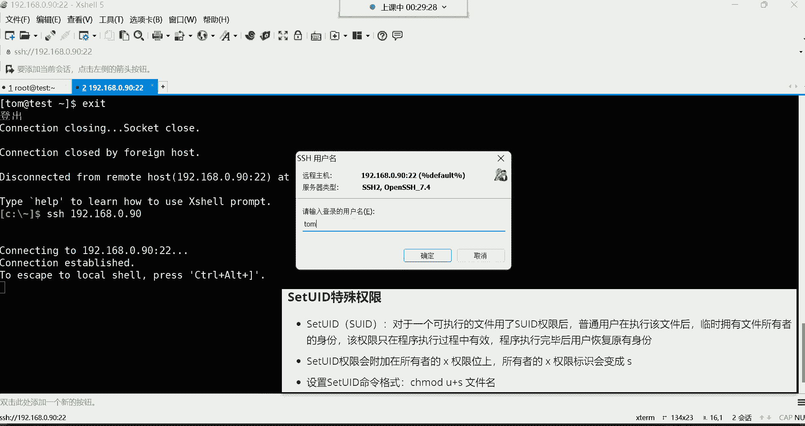

# 新盟教育-Linux运维RHCSA+RHC培训教程视频合集，全网最新最全最详细！ - P19：红帽RHCSA-19.特殊权限SUID、SGID、SBIT、ACL - 广厦千万- - BV1up4y1w729

OK那们把录屏呢打开，打开以后呢，我们来连上我们这个虚拟机嗯，连接一下。

90。嗯，如果是新进班的同学哈嗯。这样子的哈就是这个如果是新进班的呢。咱们那个。以前讲过的录屏，还有笔记呢，都在咱们这边的群公告里边啊，来给大家说一下哈。我们以前讲过的都在群公告里边。

如果是近期就是这两天新进班的同学啊，大家可以先干嘛呢？可以先从群公告，先从这个群公告里边，把我们这个以前讲过的这个录屏啊，先去复习一遍。OK吧。然后呢，包括我们上课用到的笔记软件，看到了吗？

也都在这里边，还有没有网络基础的同学，这里边呢也可以去抽空啊，去看一看网络相关的课程啊，补一补网络方面的知识。OK然后还有咱们的这个学习工具，都在哪里呢？都在我们这个第一个啊置顶的这个群公告。

这里边有一个什么呢？有一个VIP的学习大礼包。这里面有镜像，有系统安装教程，网络教程等等等等。

然后呢，大家可以去怎么说呢？去复习哈，把前面的课程给补一补，时间过得真快是吧？没错，又一天过去了，再一晃儿呢，这一个月就过去了，再一晃儿又到年底了，😊。

好了，那我们来说一说我们今天需要给大家讲解的课程内容都有哪些呢？我们今天先把这个特殊权限啊，设计四个特殊权限呢，先给大家讲一讲啊。然后这四个特殊权限呢，前两个特殊权限呢，大家不需要去太浪费脑细胞去。

必须要掌握啊，然后呢后边这两个呢，大家到时候在学的时候呢，是后期我们能够常用的啊，这个呢是必须要掌握的哈。所以前两个呢大家可以先作为一个什么一个了解啊，不是必须要掌握的内容哈。我们先来看第一个。

当然这也是权限啊，因为我们昨天是不是一直在给大家讲权限呢？沉末的这条命令啊，一直给大家讲权限，怎么去设置权限，以及用户的归属关系等等等等。😊，那这个权限呢，我们昨天给大家讲的叫什么权限呢？

我们昨天给大家讲的叫做基本权限。注意啊，这RWX啊，这些呢都属于基本权限啊，但基本权限就是最常用的权限。我们这个根本离不开这个基本权限的。但是呢在基本权限之外，也有一些什么呢？特殊的。😊。

这些权限我们就叫特殊权限。然后一般有一些特殊需求的情况下呢，哎我们会用到这个特殊权限。然后第一个特殊权限呢叫做set uID。这个特殊权限我们简称叫SUID注意哈，就简称叫SUID嗯。

那这个干什么用的呢？它这个set呢设置的意思。然后U呢是用户的意思。其实这个全名啊，就是我要设置1个优色的ID啊，就是用户的ID权限啊，其一个特殊权限啊，然后呢，它的功能啊主要看一下。

对于一个可执行的文件。如果我们用了SUID以后，那普通用户在执行该文件以后，临时拥有文件所有者的身份，该权限只在程序执行过程中有效程序执行完毕以后恢复原有的身份啊，这句话读了以后呢。

你发现跟没读没什么区别是吧？这个到底什么意思啊，也没听个12345来。😊，呃，没有感冒哈没有感冒，就是这个可能是那个。我也不知道为什么，可能就是这沧桑了是吧，这一过了一晚上哈。😊，然后呢。

我们说一说这个SUID它主要的功能干什么用的啊，或者说为什么会有这个权限的存在。首先呢它是对于一个可执行的文件去设置的一个特殊权限。然后这个权限一旦设置之后呢，那普通用户呢就可以去什么呢？

去执行这个文件了，去执行这个文件哈。那一执行的话呢，临时拥有文件所有者的一个身份。那我先给大家说一说，在这个系统当中，我们就看哪个文件，看哪个目录呢？看ETC这个目录。😊。

看ETC这个目录啊，就是你看到吗？其实这个文件啊在这个系统里边可以说是。99。999%的文件大部分都是谁的呀？都是root的啊，包括我们在这个bin这个目录看到的这些程序文件，看看我们看这程序文件。

看那个辩目录嗯。啊啊，这样啊，我们这样还不行。呃，我们直接这样吧，LLLL看user下的并好吧，哎，大家可以看一下，这里边是不是都是程序文件呢？就是说我们用的命令什么VIVIM看到了吧？

是不是是不是都都是在这个目录里边的呀啊，那其实这些命令呢也都是最终会有一个文件来给我们提供它的功能的好，那这个时候你就可以看一看这些文件，它的所有者是谁？😊，是谁呀？是root。

也就是说这些命令它的拥有者就是超级用户。而有的命令呢就是怎么说呢？你发现啊它有一个背景颜色，你看到吗？这种背景颜色，黄色的、红色的那这些是什么意思啊？哎。

其实这些就是我们要给大家讲的那个什么呢SUID这个特殊权限。😊。

特殊权限呢在系统当中会有一些特殊的颜色啊告诉我们。然后它主要的功能干什么用的啊，咱们给大家先嗯说哪条命令呢？啊，先说这个passWD这条命令，我们用普通用户登录系统，咱们说普通用户可以做什么事情啊？😊。

我们用U色E登录系统密码。还啊，我们系统里面有优色E这个用户吗？我看一下哈。😊，ID优色E没有优色E了是吧？ID汤姆有汤姆，那我们用汤姆登录系统。汤姆密码一好，你看汤姆现在是不是登录系统了呀？

那接下来呢咱们讲讲这个SUID它权限到底应用在哪里啊，把这个拿过来。

好，我们来看一下。呃。这条命令存在的意义呢就是普通用户是否可以使用passWD去改自己的密码啊。但是呢他需要知道自己当前的密码是多少，然后才能改新的密码。没错吧，那为什么普通用户他可以改密码呢？

这就是一个非常奇怪的事情。他奇怪在哪里呢？他奇怪在。😮，你每次改完密码，其实最终咱们说密码是不是有个文件存放着呢？哪个文件呢？我们上次给大家讲的时候，是不是说在ETC有个sow这个文件呢。

这个文件里面是不是存放用户的密码的呀？那你说这些普通用户他在使用passWD这条命令在改自己密码的时候，最终它的密码是不是会存放在这个文件里面去啊？但是。😊，奇怪的事情就是这个文件对于普通用户来讲。

他没有写权限。😮，他没有写权限，他怎么能够。😡，修改这个文件里边的那个自己的密码字段呢。因为你要知道他一改密码，就等于说改了谁呀。😡，🤧。是不是就等于改了这个第二个字段啊，没错吧，密码这个字段吧。😡。

但是你想象一下，他对这个文件他没有那个权限，他怎么改？嗯，这是不是一个很奇怪的事情啊？😮，所以说奇怪的事情就是因为对于passWD这条命令。我给你们搜一下。有一条命令叫位置。

位置这条命令呢是可以搜索什么呢？是可以搜索一个文件的。所在位置什么文件呢？注意啊是命令哈是命令所对应的文件，搜这个passWD这条命令所对应的文件在us色 bin下有一个命令叫passWD。

咱们来看看这个文件。首先你看它的颜色，颜色呢是有一个背注意，这是背景的红颜色哈，这是背景的红颜色。然后呢，我们再看它的权限位，它的权限位啊，注意啊，看所有者的。😊，什么呢？执行权限位哈，注意。

多了一个什么呀？小S。正常来讲，你说这个位置是什么呀？是吧X直行。哎，没错，正常是。😡，X那因为这是一个什么程序文件呢，它得拥有执行权限。但是你发现为什么变成一小S了呢？😡，是吧对。有些奇怪是吧？没错。

这SUID啊，它的权限就会附加在所有者的那个X执行权限位上面，它会让所有者的那个执行权限就变成小S了。那一旦变成小S。那这个时候普通用户在执行这个passWD这个文件的时候。

他就临时拥有了文件的所有者的身份。那这时候你看这文件所有者是谁呀？是root。哎，那汤姆他这个时候在使用passWD的时候，就等于说是谁在使用这条命令呢？root。😡，所以。

他才可以使用这条命令修改自己的密码，听懂了吗？听懂的给我刷个一。没听懂的刷杆。啊，没听懂的刷盖哈，没关系。😊，啊，这个。包泡。还是有些同学没有听懂，是不是啊？没关系哈嗯。😊，没关系。没有听懂呢也无所谓。

这样这种东西呢对于我们来讲呢，你不需要去深入去研究它。你可以在课后呢再多听两遍，你就怎么说呢？可能一遍不太好理解啊，下去多听两遍，看录屏的时候，然后你就能够理解我说的含义了。😊，就是对一个执行文件啊。

可以让注意啊，你这么去理解，就是正常来讲，这条命令只有谁可以用这条命令。😡，只有root超级管理员才可以用。但是为什么说普通用户可以改自己的密码？就是因为这条命令被设置了SUID了。

你说为什么这条命令只有只有超级用户可以用呢？因为只有超级用户才可以对ETCsha这个密码文件进行什么呢？😡，增山改差，没错吧。你看普通用户，咱们就拿汤姆来说，汤姆他对这文件他有权限吗？他的权限在这儿呢。

他没有任何的权限。😡，他想改密码，最终你想想那密码你改密码，密码得保存到一个文件里面，不就存在这个文件里了吗？你改自己的密码，说白了，你就等于说修改了这个文件里的内容了，知道吧？

你虽然说是通过命令去改的，但是你最终是等于通过命令改了这个文件里的内容，但这个文件，你发现汤姆他没权限。😡，他没权限。没权限，他怎么改呀？😡，但是你发现他能改。😡，他为什么能改呀？就是因为。

这条命令啊是passWD这条命令。汤姆在用的时候，他直接变成谁了呢？变成root的身份。😡，再去干嘛呀？再去改这个文件里的内容了。所以这个所谓的SUID就让普通用户临时拥有文件所有者的身份。

如果你再不理解。哎，我给你们再举个这个我们平时的看电视的一个例子啊，咱说这古代呢有一皇帝是吧，这是皇帝哈，对皇帝呢一般你可以把它列解成我们这个系统当中的root。😊，root啊，咱们画一个结构图吧。

好吧啊，咱们画一结构图，不然这事儿啊，我看很多同学不太好理解。😊，皇帝。皇上啊。皇帝OK皇上呢，你可以把它理解成我们系统里面的那个谁呀，那个root。😊，啊，一点不过分哈。然后接下来呢。

皇帝下面呢有很多的钦差大臣，是不是？😊，什么钦差大臣，还有什么那个这个那个的哈，咱们就。😊，就这样吧就这样吧哈。Yeah。皇帝。黄队下边有。咱们就拿这个人来说啊。他是谁呢？他是这个比如说钦差大臣嗯。

钦差。大臣。这个钦差大臣，你可以把它累解成那个谁呢？就是那个。😡，嗯。汤姆啊，就是那个汤姆。呵这个啊。😊，这个例子呀不太好举，这例子确实不太好举哈。OK。😊，然后。那下边呢就是一些小老百姓了。

我们说这个文武百官是吧，一个一个的小老百姓。😊，嗯，这小老百姓呢。一般。他看见大臣的时候，他一般不下跪，没错吧。😡，小老百姓。他一般看到这些钦差大臣呢，他不跪，他一般看到谁的时候，他下跪呢？

看到皇上的时候，他下跪。😊，是不是啊？哎，那这个SUID你把它理解成是什么呢？这个SUID你可以把它理解成皇上，他交给了这个钦太大臣一个什么呢？一个圣旨啊，或者说上方宝剑啊，这是一个圣旨哈。😊，甚至。

这这是一奏圣旨啊啊交给了这个钦差大臣。那钦差大臣。😊，他注意啊，这个盛旨你可以把它理解成那个就是SUID权限了，SUID这个权限OK。这个权限是什么意思呢？哎，就是告诉这个钦差大臣。

你现在拿着圣旨就等于什么呢？😡，拥有了我的身份了，知道吧？然后这钦财大臣拿着小圣旨直接就。😡，对着这个小老百姓在读的时候，那你想想这小老百姓是不是就等于。😊，皇帝亲临一样啊，但是你说他是皇帝吗？

他不是他是谁呀？他是汤姆，他是普通用户，他不是root。😡，但是呢由于啊皇帝希望他什么呢？拥有我的权限。😡，是不是那这时候怎么办呢？这时候我就赋予你一个权限。😊，哎，我复印你个权限哈。

在这时候你在执行的时候，是不是就临时变成了我的身份了呀？哎，注意，这是临时的哈，你要明白这个他这个你看这句话。😊，它是普通用户在执行这个文件的时候，你就等于普通用户在执行这个圣旨的时候。

他是临时拥有文件所有者入册的身份啊，临时拥有皇帝的身份。但是这个你执意执行完毕以后呢，是不是就恢复到自己原有的身份了呀？😡，啊，恢复到自己原有身份了哈那恢复到自己原有身份的话，嗯。

不就又恢复到普通身份了吗？是不是？那这个例子如果放到我们这个SUID里边来理解的话，那就是说。😊，这个呀汤姆。汤姆他想干嘛呀？他想改密码，哎，他想改自己的密码，他想改自己密码呢，他没那个权限，那怎么办？

哎，root呢我可以允许你。😡，该密码使用这条命令。啊，但是正常来讲呢，你说你还没没有办法对这个文件啊具备一个写。没关系，是吧？我给你设了1个SUID这样呢，你在用这个命令的时候。

就等于说是我root亲自在使用这条命令，再去帮你去改密码，对吧？嗯，就这意思哈。😊，行了，这个不能再解释太多了哈。然后对这个SUID这个权限呢，我们一般用不到，一般我们是用不到的哈。呃。

但是呢你如果一旦发现，比如说我们看B下边，你一旦看到，比如说像这些命令，一旦有个背景的红颜色。😊，看看一旦有一个背景红颜色，就证明这些命令，普通用户在用的时候都是什么呀？

都是临时变成了root超级管理员的身份去执行这些命令，看到了吗？就这些啊，一旦拥有这个背景的红颜色的。然后你说我们可不可以设置呢？比如说我现在咱们就拿这个。😡，我们取消掉哈。😊，k来说，k。

汤姆在使用ca的时候。那是以汤姆的身份在执行这条命令。注意哈，t姆是个普通用户，他使用ca想看这个文件。那他对这个文件呢没有任何权限啊，所以这个时候怎么办呢？啊。

这个时候如果我希望普通用户在使用ca这条命令的时候，也可以变成什么呢？😊，这个。文件的所有者文件所有者是谁呀？你看看ca，我们维持一下，当然我们得用root去维持哈这样。😊，位置开他。好。

看这条命令所对应的文件是在这个位置，然后咱们看一下哦哦，等一下啊等一下。OK。看到了吗？你看到了吗？这个k呢，首先这个程序文件。是属于root用户的，没错吧。但是普通用户呢也可以用，也可以执行它。

因为普通用户也需要使用这条命令去看文件呢。但是普通用户如果汤姆使用这条命令去看文件的话，那他就是汤姆的权限，能理解吧。所以汤姆呢他想看一些自己无法查看的这些文件，他就看不了。

那如果你希望所有的普通用户都可以使用cat，就等于是root在使用的话，那这时候你就这样称之 mode命令都一样啊，都是设置权限的命ing，然后呢就优加小S，后边跟上文件名。😊。

哪个文件名啊优色并下的看一下，这时候你再来看一下。好，是不是多了一个背景的红颜色呀。那你看多了一个背景红颜色，主要看它的执行权限，你发现变成一个小S了。😡，是吧。变成小S了吧，一旦变成小S。

那这时候t姆再使用ca命令。😡，哎，我问一下你们，他现在能不能看这个文件的内容？能不能觉得能的来给我刷个一，觉得不能的给我刷2。好，能了是吧嗯。O那能了之后呢，咱们。😊，看一下，哎，这就没有任何问题了。

为什么呀？因为k这条命令现在。😊，普通用户在使用的时候，他也不是以普通用户的身份去执行了，是以谁呢？是以root超级管理员的身份在执行了。对，有圣旨了，有圣旨了哈。

就现在你把cat就比喻成是一把上方宝剑了，是吧？谁拿着这把上方宝剑去执行，就等于是皇帝在什么呢？皇帝亲临。😊，就等于皇帝在执行，知道吧？就等于我现在要赋予开这条命令一个。😡，上方保健。啊，呵。O。

当然这只针对于那些可以执行的文件哈，哎是可执行的文件。对，懂了是吧？对，就是ca命令。我想让普通用户去使用。但是呢。让普通用户可以什么可以拥有我超级用户的身份，那我就给你赋予到圣旨。哎，他有了圣旨以后。

普通用户拿着。😡，这个就在使用这条命令的时候，就等于说是拥有圣旨哈，是这意思哈，拥有圣旨。😊，好了呃，但是呢不能瞎设置啊，我们就拿什么来说呢，我们就拿这个VNM来说啊，你看我们正常来讲，这个VNM啊。

我们维持一下啊。😊，为持这个VIM在user并下VM是吧？我们来看那个VNM。然后。这个V案啊，这个权限如果不去掉，是？对，一直能用哈一直能用。😊，我们来看这个VMVM正常来讲呢。

也没有这个被设置SUID这个权限是吧？啊，就是一个绿色的程序文件啊，那这时候呢如果你也想给它设置一下，也可以让普通用户通过VIM。可以什么呢？拥有root的身份的话。哪里时候你就。陈之mo就U加S。好。

这时候我们再来看的你发现。是不是多了一个小S啊？好，那VM现在普通用户在用的时候。也有圣旨了啊，我现在就给VNM命令给它赋予了一个圣旨。好，那这时候普通用户在用的时候就等于说我拥有圣旨的权限了。

拥有拥有这个root的身份了。那这个时候怎么办呢？这时候普通用户就可以干一件事情，打开ETC的passWD文件。这个时候你看正常来讲，他对这个文件，你看他自己的权限哈，ETC的passWD正常来讲。

他对这个文件是不是。😊，R指读权限呢？看哈不是临时的，永久的哈，他是不是只读权限？😊，好，但是。他现在想改想改这个文件，因为他什么呢？因为他现在在使用VIM的时候，就等于说是root在使用这条命令。

因为这条命令现在有圣旨了OK然后。😡，啊，对普通用户使用VM时拥有root用户的权限，是对所对，没错，是所有文件哈。😊，VM这条命令现在谁使用就等于是root在用，甭管谁用哈。😡，注意哈。

甭管谁用VAM现在都是等于root在执行，知道吧？那root。😡，打开这文件以后，是不是？哎，那想干嘛不就干嘛，不就是汤姆是吧？我做一个操作，什么操作呢？😊，我删一扇看看扇一扇。删什么呢？

就把自己的这个UID给它删一删，啊，让它变成0。好，那一旦变成0，这时候呢我们WQ保存退出。啊，你看这时候他说什么readon是吧，只读文件没关系啊，加一叹号WQ叹号哎。😊，写入成功，看这个文件内容。

好，自己的UID秒变成零了，是不是啊？好，缅变你说这改这东西有什么用啊是吧？好，是没什么用，但是我现在给你们退出系统，注意哈，看我现在是汤姆退出系统了。好，我再登录。😊。

但是你们看看我现在输入的用户名是谁呢？我现在输入的用户名是汤姆，注意哈，是不是汤姆看哈看清楚用户名是汤姆。好，确定密码，汤姆的密码一确定。😊。

好，你们看。这是还是汤姆吗？你们看这还是汤姆吗？你们看这还是汤姆吗啊。😡，Yeah。😊，你发现我说。😊，ね。这就是什么呀？造反了是不是造反了哈。😊，对，这就属于造反了哈。😊。

就是我们说汤姆直接变成root了。😡，看到了吧？就这效果哈，所以说对于SUID，你说你能瞎置，你能瞎设置吗？你不能瞎设置。😡，你说你再瞎疵，这系统还怎么管理呀，是不是？😡，嗯。啊。

root不能改成别的名吗，不能不能哈。不能，这是系统的一个机制。好，然后呢这个大家知道就行了，怎么取消呢？趁之后叫U减S，注意U减S就把它的这个SUID给它去除了，能理解吧？还有那个ca也一样。

你说那个ca我也想给它去除掉，那就U减S。😊，太的。然后你再看一下啊，这就去除了哈。O。那个test如何修改的呀，哪个test呀？嗯，哪个太子的呀？我们没有改太子郎。主名字吗？是主机名吗？😡，好。OK。

啊，主机名前面在学习这个修改主机名的时候，我们就已经改了哈，就已经改了用host name这台命令。😊，还有hot name control然后s。hose names杠hose name。嗯嗯。

后面跟上一个主机名，让它叫t就可以了啊，这是。对。这种哈。O。行了哈，那这个时候呢你还得干嘛，你还得去把那个。😊，他的这个什么呢UID给他改回来哈，把这个汤汤姆的UID再给他改回来。😊。

这哈是1001保存退出啊，这时候呢。汤姆再退出系统。再登录的话。汤姆看还是汤姆，然后密码。OK。OK这个可以了哈，这个可以了，又回到自己的普通的身份了嗯。😊，好。嗯，后面会讲给特定用户加一些使用命令吧。

呃，后边会有会会有一个提全的机制哈，给普通用户提全的。所以这这个呢大家知道一下就行这个SUID它主要的应用场景。那么SUID不要针对于普通文件去设置，没什么用啊。你比如我建一个文件。

比如咱就拿这hello这个文件来建，你说我给他设置1个SUID行吗？U加Shello点TIT。😊，也行也行啊，看到吗？是不是也变红了呀，但是这就是普通文件，不是什么程序。😡，你也不需要去执行它。

所以加也没用，能理解吧。但是加完以后呢，你发现这种东西哎变成什么呀？😡，变成大S了。是不是对。是吧。小S他姐姐变大了，是不是啊？小S他姐姐了，这为啥变成大S了是吧？为啥呢？能用到哪里没没啥用啊。

普通文件哈没什么用。😊，他是怎么回事呢？长大了是吧？就是因为他没有执行权限，我给你们去除，你们再看哈U减S。😊，你看这个文件，这文件它本身是没有那个X执行权限的。所以说呢你一旦说设置SUID。

他是不是就把所有者的那个X权限就给你盖上了呀？所以你没有办法判断这个文件到底有没有执行权限。所以他用小S跟大S就来告诉你，如果有执行权限，就是小S，如果没有执行权限，就是。😡，大S。是这么回事。

但是对于普通文件，我们没有必要设置哈，普通文件就不能让你执行你。😡，普通文件你就不需要执行的。😡，是不是又不需要让他给你带来功能，所以你这也没有必要设置哈。😊，没有标要设2证。对。

对这大S不是这个什么了吗？不是跟汪小飞最近不是离婚了嘛，是吧？😊。

好，然后这是。SUID哈，然后做一个简单小总结，主要呢是针对于可执行的文件。如果我们给它设置1个SUID就是给它赋予一道什么呢？圣旨，那普通用户在使用这个文件的时候，就会干嘛？临时拥有root的身份啊。

因为所有的文件都是root的。😊，而这个什么呢？而这个权限只在程序过程中执行有效。程序执行完毕以后呢，好就圣旨一旦执行完了。这个又恢复到自己的身份了，你不能一直变成皇上，是不是啊？

OK然后呢设置的命令呢，我们前面已经讲过了，就是陈志mo的这些命令O然后下边呢我们再来说这个，当然这个大家我们平时不需要去设置什么SUID你知道一下就行哈，用不上，我们没有这个需求，一般就是系统。😊。

他自己呢会给一些程序文件去设置一些，你知道一下就行好。第二个。这个s GID。啊，这个呢怎么去看呢？一个是UID是吧？U代表优色用户的意思G呢就是group组的意思啊，所以说这个呢是针对于组去设置的。

但都是针对于一些可执行的程序文件。你也是给他设置一个什么呢？SGID以后，那普通用户在执行这个文件的时候，临时拥有其所属组的权限。这个是针对于组的，针对组哈，然后都是。😊。

在执行过程中有效执行完毕以后呢，就失效了，恢复到自己的身份了。注意哈，前边是让那些普通用户能够变成谁呀，变成root。这个呢是能够让这些普通用户变成谁呀？变成我这个文件的。😊，组内成员注意哈。

前边是变成文件的所有者root。而这个是针对于什么呢？组可以让他临时拥有其组的权限。你怎么样才能拥有组的权限呢？就是你变成我组里的成务员。😡，你才能继承我组内的权限是吧？没错吧，哎。

你得变成我组里的成员，你才能。😡，继承我的权限。我们昨天讲权限的时候，怎么样才能让一个用户继承组的权限？我们昨天是不是说了，我们CD到跟一下的泰斯目录，这里边这个文件。😊。

咱们说这个我们是不是在讲组国理的时候，可以把一个文件的组改成某一个组。比如说我给它改成我们用称之owner，给它改成这个。嗯，运维组啊运维组。对，hello这个文件改好以后呢，你再看这个文件那。😊。

这个运维组。的成员对这个文件是不是就继承了我这个组的权限呢？没错吧，那这时候你还可以不希望其他人有权限的话，你趁着modode，你就O等于杠杠杠。好，那这时候。啊哈。只要在我这个组里边的用户。

就全可以继承我的组里的权限。没有在我组里的用户。😡，你也不是文件所有者的话，你的权限就什么都没有，是不是就在这框里面吗？😡，好，那这时候。我们就可以干嘛呀？就可以让一个。正常情况下。

他不是我组里成员的一个用户，可以临时变成我组里的成员。注意哈叫临时。而这个临时是什么临时呢？就是当他想执行这个文件的时候，我可以让他临时变成我组里的成员，继承我组对这个文件的权限。听懂了吗？

听懂的给我刷个一。啊，听懂了。啊，没听懂的说2。好，那接下来呢咱们说为什么也会有这样一个权限存在，是吧？😊，呃，这个有一条命令在这个系统当中，但是这个命令我不知道我们这样安装有没有哈，呃，叫做low开。

😊，楼看他们定。然后面你跟上一个路径，跟一个文件。啊，没有找到命令啊，这个有些尴尬哈没有找到命令，我搜索一下哈。😊，嗯，我安一个包啊，叫M楼ca。因为没有找到命令，我们要把这个包给它安上。

然后大家也是哈，你先把这个包给它安上啊，先安上我们啊这个哈加一个inst，把这个命令呢执行一下。😊，如果你们也没有的话，就安装这么一个包哈。只能执行一次，还是退出或者重启之后是呃，不是就是你想执行。

什么时候执行都行。啊，什么时候什么时候执行都可以哈，我们把这个包给它安装上哈。😊，安装上安装上以后呢，这时候就有有一条叫low cat命令了。low cat后边呢你跟上。

你比如说我想在ETC下面搜一个文件，这个文件名叫什么呢？比是叫passWD回车。嗯。啊，没有这个数据库文件。嗯，没有这个数据库文件，哎呦，这边操作。

哎呀，我得去。好久的事情了，我得去百度搜一搜哈，我得去搜一搜这个。

这个问题好像是得需要刷新一下，但具体的命令我记不住了。

我看这个提示哈。😊，呃，搂开的DB。

没有这个文件。嗯，搜一下哈嗯。没有。这是一个数据库文件。找不到啊，我看一下这个问题哈。呃，呃，up date DB我看一下啊，看up date。

apple。dateDB回车。OK然后再试一下哈。好，有了有了哈。好久了，这条命令我已经可能是好几年啊，都没有用这条命令了哈。😊。

嗯。

关掉哈关掉。然后我们主要是给大家讲讲楼开的这条命令是吧？百度这是个好东西，是吧？百度你一般。简单的东西你还可以搜出来嗯。😡，好，咱们接下来来说哈这条命令的普通用户也可以用。😊，locate它也可以搜。

我想在ETC下面搜个，比如说文件叫FS table的，可不可以？有没有有看到吧？就是做文件搜索的一条命令。😊，然后呢。他这个就跟什么呢，跟fin的 find的命称差不多， find的也一样。

 find的也是从这个系统中帮系从系统当中帮我们去搜索文件用的。然后呢。😡，呃，本质是一样的，只不过这个low cat这条命令啊，它会从一个数据库文件。哪个文件呢？就是刚刚我们说没有找到这个数据库文件。

大家可以看一下哈，我们看一下va the labM locate cat。😊，这个文件。你看这个数据库文件。他有一些特点，什么特点呢？对于。权限这个位置，其他人。啊，其他人呢你看到了吗？😡。

其他人是没有查看权限的，没有查看权限啊。而我刚刚使用low开命的时候，你看到了吗？我在ETC下面去搜索这个文件，他说没有那个文件和目录。😡，为什么它需要这个文件呢？因为这就是一个数据库文件。😡。

这个数据库库文件里面记录了我们当前系统里面的文件的所在位置。那我可以用lookat这条命令跑到这个数据库文件里面去搜索。啊，去搜索哈去搜索。然后他搜索的话呢。由于我们是刚刚安装啊。

所以说呢可能是数据库文件没有更新，然后我们自己手动更新了一下。但没关系哈。我们现在不说root，我们现在就说为什么tom也可以使用这条命令啊？😡，为什么汤姆也可以呀？而且汤姆搜的时候。

他也是从这个文件里面去搜的。😡，也是从这个数据库文件里面去搜的哈，但是汤姆他对这个文件没有查看的权限。😊，他没有查看的权限，他就无法搜索。他无法搜索。无法搜索，那怎么办呢？啊，你那里没有update。

没有upateDB是吧，你前面那个包按了吗？这包哈，这包按了吗？这包得按一下，不安不行啊。😊，一个包好。所以问题就出在这个low cat的这条命令，大家看一下，我们搜索一下哈。😊，维持一下。

Look at。在这儿吧。嗯。好，我们看颜色。看到颜色了吗？黄颜色的。黄色的背景刚刚是红色的这是黄色的，黄色就代表说这个文件拥有什么权限呢？SGID这个特殊权限。

S是GID哈。没有这个权限。而这个权限呢就是针对于这个什么呢？针对于组啊搜出组去设置一个权限。嗯，黄马甲是吧？嗯，好，这时候看看。😊，汤姆他在使用这条命令的时候，汤姆在使用这条命令的时候，然后呢。

他直接变成谁了呢？直接变成组里的成员了。注意下。你看就是普通用户在执行该文件时临时拥有些所有组的权限，你怎么才能拥有这个搜有组的权限呢？就是你直接变成我组里的成员就可以了。我让你变成我组里的成员。

你是不是就继承我的权限了呀？没错，OK。😡，然后那你一旦变成这个组的成员了。😡，那这个时候你看这个。数据库文件。他也是属于叫S楼开的组。你发现。都在同一个组里面。而且在我组里边的成员的权限是什么权限呢？

R杠杠首先。可以读。啊，可以读。所以。汤姆才可以使用这个low cat这条命令。去搜索谁呢？搜索一个文件的所在位置，并且是从这个数据库里面去搜索啊，这一个数据库文件去搜索，能理解吗？啊。

这就是让用户变成我组里的成员，可以继承我组。对。某些文件的权限。那其实这就是S建D。但是对我们来讲。这种东西呢我们几乎不我们自己是不会用的哈，你知道一下就行。跟SUID1样，我们自己不会用。然后呢。

它也会那S界地的权限会附加在所属组的执行权限位看这。看着了吗？这条命令哈，这条命令它的执行权限位你看正常来讲不是。😊，RWX吗？但是呢它没有读，也没有写，就一个。小S，但是这里面还有一个执行哈。

有一个执行，只不过被挡住了。OK然后搜出组的X标识会变成小S，那就证明它是有1个SGID的啊，对于我们来讲呢，没什么太大意义哈，我们不会去设置，知道一下就行，了解一下它的功能就行了。

就让一个用户可以临时变成我组里的成员，继承我组。😊，对某些文件的权限。啊，这就是SGID怎么设置呢？陈之茂的G加S，但我们一般用不上这种操作。啊，嗯这用不到用不到哈，我们用不到这种操作用不到。

所以了解一下就行，这种东西啊，没有什么太多可讲的。

那个黄色背景就是SGID黄色背景就是SGID红色背景就是SUID这两个特殊权限，一个是这是这这是红的啊。这个呢这是黄的。这是黄的哈，一个红的，一个黄的GAD是黄的。好，呃，文件你只有WX没有R。

能不能读呢？不能。没有。OK。然后我们再来说这个t BIT啊有黄色和红色背景，就是谁都能看呗。黄色呃。不是谁都能看。😡，是谁都能执行，谁都能执行，不是谁都能看啊。其实都可以用。

主要是让普通用户可以进行一个什么呢？类似于提全的这么一种机制。OK就等于钦差大臣是吧？我可以赋予你到圣旨啊，你用的时候呢，你就等于说这个权限变大了，就这意思。😊，啊。

然后接下呢我们再来说说这个tKBIT，我们简称叫SBIT。这个的话呢还蛮有用的哈。😊，该权限只针对于目录有效，而上面这两个呢都是针对于程序文件的，这个是针对目录的。呃，针对目录干什么用的？我们读一遍哈。

😊，你看。当普通用户对一个目录拥有读写执行的权限的时候，普通用户可以在此目录下拥有。增山改的权限。为什么呀？

这昨天已经讲过了，你给一个普通，你给一个目录，咱们就拿这个什么呢？😡，咱们就拿了一个太子的目录来说。我们LL看跟下的太字的目录。我们来看一下这个哈。😊。

我们如果说把这个太字目录的权限称之目的给它改成777。好，那以后这个目录是不是？谁都可以在这个目录里边去干嘛了呀，去进行增删改查了呀。😡，啊，主要是增删改，想删就删了，是不是？😡，想删就删，没错吧。

你看这个套姆想删除老王的文件RM杠2F。老王是不该删就删的，管谁的呢？创建也可以创建一个t5点。TIT是吧。然后我们看看还有哪些用户哈。啊，我们就不用拿太多用户演示了。我ID现有还有一个老王，我记得。

乐老王有咱么用老王登录系统。老王密码。然后老王呢CD到这个台词目录，进来以后呢，他也创建个文件叫老王点TIT建好了。你看那老王他现在。这文件是他自己的，是不是老王点TIT是他自己的。

然后这是文件是汤姆建的那老王现在能把汤姆的文件也给他删掉。😡。

你看是不是删了，是不是没了，为什么能删呢？就是因为呀他们。😡，普通因为普通用户对目录一旦具备RWS权限的时候。是可以删除目录下所有的文件的。包括root的，它都可以删。这我们昨天也给大家演示了。

讲权限的时候就是可以删。

那怎么办？那有的时候我们希望这一个目录，你看我们就拿哪个目录来讲呢？我们来看跟一下的有一个目录，有个叫TMP这个目录。TMP你看TMP目录。它跟别的目录啊不太一样。你看它的颜色是什么颜色啊？

这些颜色呢没有背景颜色。是吧名字是蓝色的，而这个呢。除了名字、蓝色以外，还有一个背景的。深绿色。是不是深绿色吧。知道这深绿色是代表什么意思吗？😡，这个深绿色就代表。这个目录的权限。有些大。

你看这个是不是也有一个背景的深绿色呀？😡，是不是也是深绿色，他们两个一样哈，都是深绿色。就是证明什么呢？就是证明这个目录啊。😡，拥有这个。W写权限。朱元航。因为W选型t也一样，你看t目录。用W写权限。

一旦用W写权限，就证明普通用户。就可以在这个目录下进行什么呢？增删改的操作，谁的文件都可以删了。😊，知道吧。所以系统呢。给你这么一个背景颜色，提示你一下，就是这个目录啊。这个权限有些太大，普通用户呢。

也可以进行增删改。那所以才会有这么一个背景颜色的。TOP也一样。那你看对于TLP来讲。😡，你看如果老王进到TLP。你看这里面是不是有个helloU43的，这文件谁的呀？😊，hello，优色3。啊。

这个已经不知道谁了，那个用户被我们给删了是吧？U43被我们给删了是吧？OK那他给他删掉，看可不可以。😊，你他不允许操作哎。老王不能删，那不对呀，那不对劲儿，怎么不对劲儿呢？😡，权限不对。

你看LL杠DTMP。老王对这个目录是拥有W权限的。拥有W权限那这W写权限呢，那它可以创建文件吗？老王点TIP哎，可以，你看它可以创建。😡，是吧。难道不可以删吗？老王点贴贴，哎，可以删呢。

说不是把自己的文件也给删了呀，但是他想删别人的呢？😡，哎，你发现不允许的操作是吧？不行。这为什么呀？就是因为这个这个什么呢？这个目录的权限啊有些特殊，有一个T权限。😊，这多个T看到了吗？多了一个T哈。

😊，这T权限就是限制什么呀？限制这这些用户。😡。

读一遍，如果对一个目录设置了这个SBAT，我们简称叫T权限。那除了root可以删除这个目录所有的文件以外，普通用户就算对这个目录具备一个完全的权限，他也只能删除自己建立的文件，不能删除其他用户的文件。

也就是说我可以限制你在这个目录对自己的文件，你想干嘛就干嘛，但是别的文件你是不能动的。虽然说我对这个目录的权限，我给了一个完全的权限。

不是。不是只有TIP可以删，而是什么呢？而是。对这个目录的权限。哪有什么TOP可以删的，没有什么TLP哈。😡，没有什么TIP。对于这个目录的权限哈，普通用户是可以在这里面创建修改删除的。

但它只能针对自己的文件。😊，只能针对自己的文件哈。😊，你就比如说咱们拿这个test目录，拿这个目录来说，正常来讲。😡，如果说你不加T权限。汤姆在这里边，你看汤姆见文件。汤姆点TIT。老王说删就删呢。😡。

是不是2M杠2F？汤姆说删就删。哼那汤姆一看哎，你把我文件删了是吧，而且你没事，还总上我家串门去。好，我也删你。😡，好，这以后这怎么管理呀？是不是没法管理？H。没错吧，这怎么管理呀，是不是？

所以我们就针对于这种目录啊，权限给的比较放肆。啊，你说的意思就是普通用户把TIP文件夹删不了删不了哈，删不了。😊，看不了。因为你如果想删TMP，你得看什么呀？😡，等说你想删TMP目录。

你得看TMP在哪个目录下边，TMP在根目录呢，在根目录下边是不是有1个TMP。😡，嗯，有一个。TMP那你说你想删TMP，你是不是得看看你对这个根目录有没有那个什么呀。😡，W权限呢。没错吧。

如果你对根目录没有W权限，你怎么可能删这个目录下的内容呢？😡，啊，那这个时候。

嗯。你怎么办？我们就直接这样啊，给他设置一个T权限就可以了。😊，针对这种情况哈。

是这个T权限。嗯，这样呃，村志茂的就O注意O啊就是。阿的意思啊，其他啊针对于其他人的O加一个T对根下的。t词目录设置好以后呢，我们再来看这个t词目录。哎，这颜色。你发现跟TLP一模一样的。

是不是跟T皮一样的呀？等会儿啊加一个钢D。是不是这两个文件夹的颜色是不是都一样了呀？😊，就是证明什么呀？证明他是有一个T权限的。踢权限。好了吗？那以后。对这个目录来讲。

你只能嗯对你自己的文件进行增删改的操作。你说这时候t姆再建个文件，touch1个t姆点TIT。是吧这时候老王呢也在建一个他uch一个老王点TATT。好，那老王一看啊，汤姆这小子刚刚删我文件是吧？好。

我现在也把他文件给他删掉。😊，哎，不允许操作了，看到了吗？你一旦加了T选项，它就他就不行了哈。汤姆这小子呢也一样是吧？你没事儿，总往我家跑是吧？总去我家串门，那我也看到你的文件，我必须得删，那这怎么办？

删不了了。😊，啊，看到了吗？是不是？😊，嗯，没办法是吧，邻居嘛，谁让住我家隔壁呢？是不是啊？OK这就是T权限哈。😊，提权限。呃，多个普通呃多个普通用户创建的文件是统一呈现在临词系统里，那设置T权限。

就是把对应目录下的各个文件。对，没错哈。嗯，是是没错哈。😊，可以的可以的哈。😊，嗯。这个可以用到不同的用户。不是就针对目录的哈，就针对目录。😊，只针对这个目录。

你在在目录下剩下谁想干嘛都会受我的T权员控制。啊，除了root以外哈，可以编辑嘛哈，不能编辑啊，当然不能编辑了。你比如说汤姆想编辑老王的文件。😊，你比如往里面写一个hello汤姆是吧啊，我是老王，是吧？

😊，当然我这个我这个中式加英式哈我是老王，然后保存退出。😊，没电啊。嗯，低配聊天WQ你看是不是说这是什么止读的呀，加叹号啊，那就是WQ叹号啊，这也不行，看到了吗？😊，在修管道呢，是不是？对我就去你家修。

就是去你家来修管道的，改不了哈改不了。😊，😀对，OK哈，这就。😊，Yeah。😊，哎，这没错，你这旧管套，你怎么只穿内裤啊，是吧？😊，要穿内裤就完蛋吗？😊，好了，这就是这就是这个这是我们所着一个T选项啊。

😊。

Okay。哎，你说这讲这讲个权限，我们这这也能也哎呀也能让我们这么的愉快，是不是？😊。

好了，那下面还有一个哈，还有一特殊显现，这是那个ACL嗯。😊，这个ACL呢它也不太一样啊，ACL特点是亮。😊，它呢全名叫做FACL啊。

其实呢就是一个你看叫fill system access controller list叫做文件系统访问控制列表。中文的名字。😊，然后呢。我们再读一遍哈，功能利用文件的扩展属性。保存一些额外的防问控制。

其实这个我给你们通俗翻译一下，就是可以单独为每一个用户啊去量身定制一个权限。你比如说呃我们系统当中有一些目录呢，可能说我不希望别人对它拥有权限。我们建一个目录mate克DRR，我们建一个运维这个目录啊。

刚刚那个为什么保存不了，能保存啊？嗯都怎么保存不了啊。😊。

OK哈，然后这时候呢我们这样哈，比如这个运维目录就是我自己运维部门的，是我自己部门的哈，让我干嘛呀？我一般呢我会嗯。😊，对于我这个目录来讲。我不希望别人对这个目录呢有任何的权限。嗯。那这个时候怎么办呢？

这时候我们一般会这样，就我自己部门的目录呢，我先。😡，把它这个组改成我自己部门的组，咱们这里面是不是有个运维组，那我就这样啊，称之O呢。😡，然后把这个组改成运维组，对跟一下的运维这个目录。

OK然后我们再来看这个目录。你看。这样哈再看这个目录，你看现在这个目录是不是就属于运维组的，它的组啊，就是它的这个属于的组是不是运维这个组了呀？那这时候呢，我是不是可以把我部门的员工加到这个组里面去？

😊，比如谁呀？老王啊，老王跟汤姆是我自己部门的。我就可以这样，我就这样这个记。passWD杠A。啊，汤姆给他加入到运维组里边去。OK老王也给他加入到运维组里边。老王okK都加进去了。

那是不是现在这两个人都属于这个组了呀？那这时候我们再来想一想。😊，那以后。汤姆跟老王这两个人是不是就可以继承我这个组对这个目录的权限了呀？汤姆跟老王。没错吧，就我这个组对这个目录是什么权限。

他们两个就是什么权限了。OK吧，那我这个权限是不是可以给他大一些呀？比如说RWX，那我就这样称之moode。😊，就是既等于RWX针对于运维这个目录。啊，这样我们再看。啊，这样的话再看，那你再看的话。

是不是所属组的权限非常放肆了呀？RWX。😊，那这时候呢，老王跟汤姆啊，当然由于是改变了归属关系，得退出一下，注意哈，改变归属关系得退出一下才能生效。登录一下汤姆密码。😊，老王，我们也退出一下。比如说。

什么意思呢？为什么要退出？就是你把一个用户重新加入到一个组里面了。😡，然后呢，你得退出，那他这个什么呢？他这个。成员才能生效啊，就才真正属于我这个组里的成员了。这时候呢，他们再进到这个运维这个目录的话。

他进来以后哈。😊，你看老王也一样CAD到这个运维这个目录。啊，运维这个目录进来以后的话呢呃他们由于对这个目录的权限是一个完全权限，所以他们可以里面进行增长改啊，自己部门的东西呢随便玩是吧？

建一个老网点儿。😊，脚本啊老王的脚本啊，当然没关系啊，先不用去管他这个点SH啊。随便进啊，它是一个t姆点呃什么呢？点儿PY啊python脚本就是他他们自己是吧，在自己的部门的工作目录里边啊。

自己写了一些脚本放在这，可以让大家去共享OK那这时候呢。😊，那别的部门的员工，比如说我们这服务器里面还有一些成员啊，有哪些呢？那我我记得有一个小芳是吧？😊，没有小方哈，那我们就建一个哈。😊，借一个小李。

建一小张吧，建一个小张小张同志，然后给他设置个密码。那阿莲一会儿我们一会儿再用阿莲哈，设置个密码。😊，那小张这个同志呢，他对这个。对于这个运维呢，他不是你们运维部门的成员。啊，小张。

那你就不希望他对于你这个部门的运维目录具备一定的权限是吧？首先他可以看。他可以看哈他都可以看这个目录下的这个文件内容。我看看老王的资料都可以看啊，只不过这里边是空的嘛。如果你往里面写一句话。😊，啊。

你VM打开老王的那个文件是吧？你写一个hello是吧？汤姆是吧？啊，今天去你家修管道修管道去了，然后你不在家是吧？然后嗯。😊，后边是我们说这个什么呢？叫此处，此处嗯，此处我要省略多少呢？省略一万字是吧？

省略一万字有点热是吧？保存结束啊，那这时候这小庄就能看是吧？😊，对对自己写了一个日记啊，但是自己的日记哈。😊，OK啊，那这时候其实我们不希望，但我们就简单举个例子啊，我们不希望这个小张能够干嘛呀。

能够针对我这个自己的运维部门这个目录，连查看我都不希望他查看，是不是啊？所以我们一般呢对于小张来讲，我把他权限给他要要给他毙掉啊啊把这个呃小张不是属于其他人嘛。所以这时候呢我们一般就这样，就陈支木的。

😊，就O等于O等于杠杠杠。然后指定运维这个目录。好，那接下来呢这这时候小张就不行了，没有权限了。你看他再打开啊，运维这个目录打不开了吧啊，进也进不去了。😊，切也切不进去了，是不是因为他不是我部门的呀。

是不是啊？不是我部门的，一般我就不不让他对我这个目录有权限行，但有的时候呢，你比如说我还希望什么呢？还希望某些用户，谁呢？比如说突然间你们部门运维部门来了一个比较特殊的成员。😡，有这个小V小微哈。

小微是个女孩子，上你们部门来实习了。那这时候呢？😊，你给人建了一个账号，又设个密码。那这时候小微呢，他登录他登录服务器。登录一下哈。小微密码OK那小微正常来讲，人家得对这个你们部门的运维目录。

人家可以具备相应权限，是吧？但你看他进不去。打也打不开，看到了吗？他打不开，这不行啊，是不是你这。😡，都是自己一家人。那我们应该让他具备一定的权限呢，是吧？但是呢对于这种呢，比如说这个人比较特殊。

身份比较特殊哈，就我还不希望他具备所有权限，我只希望他具备一部分权限，那怎么办？那你说我一不能给他。😡，加到我的组里边，为什么不能加到组里面呢？因为你一旦加到组里面以后啊，你发现这组里面的权太放肆。😡。

看了吗？组的权限太放肆了，这么放肆的权限你给他吧。😡，嗯，其实有些危险，有些危险一般不靠谱。那万一给你动不动就山库跑路，是不是，那怎么办？😡。

所以呢一般。我们干嘛用ACL可以把这事儿给他搞定。ACL这个东西呢可以单独。

为每一个用户量身定制一个权限。那你这时候你就可以用ACL就这样啊，我们就这样。

set FACL命令格式啊，set FACL然后选项呢杠M叫设置选项。所以这时候呢你就杠M。但设置权限的时候注意哈，要先指定归属关系。在归属关系里面呢，你可以指定用户，也可以指定组U代表用户。😊。

谁小微，用户叫小微的权限呢，能读能执行，就是我让你看也让你进去，但是我不给你写权限。😡，没有写权限，他是不是就。😡，不会做什么危险的操作呀，删也闪不了，删也删不了，改改不了是吧哎。😡，好。设儿好了。

设好之后，那我们。怎么看权限呢？叫get FACL跟这个目录名就行了。😊，这时候你可以看到文件的名字，这fi代表文代代表这目录名哈。然后这O呢就代表这个目录的所有者是谁啊。

是root group呢就代表这个所出组是谁，优色呢就。😊，代表所有者的权限，谁呀？就是root的权限哈，root的权限。然后这个group呢，它是代表所属组的权限。😊，就这个啊。

这个目录的组的权限是什么？而你看这儿多了一个优色，就这个这个优色是谁呀？就小芳的权限了。刚刚我们自己设置的单独针对于这个运维这个目录给他加了一个什么呢？读跟执行的权限。但是小芳这个人他跟我这个目录啊。

他可既不是目录的所有者，也没有在我的这个。目录的组里边的成员啊，也不属于他是一个其他人。但是呢由于我给他单独设置了一个权限，所以他现在就可以能读能执行了。知道吧，而其他人的权限你看这了吗？😡，能列吧。

其他人的权限哈没有任何权限啊，这是那个权限掩码哈musask。😊，好，那接下来咱们。就得验证一下小芳是吧，小芳现在刚刚是不能打开是吧？😊，但是呢小芳现在仍然是其他人的身份。

小芳哈针对于这个运维这个目录哈，仍然是其他人的身份。哎，你发现这后边多了个加号。😊，看到了吗？是不是多一加号，在这哈，这加号就证明了它有1个ACL权限这个目录。而小芳现在再打开这个目录，哎，没事了。😊。

切换进去也可以看到了吗？这时候可以正常看这里面的文件了。H。😊，😀。能裂了吧。😊，啊，这就是什么ACL权限啊，那如果你还希望别人有权限。😊，那方法是一样的是一样的哈。你比如我们再新建几个用户。😊。

us add我么建一个什么呢？Hurry。给哈ry设置个密码。😀哼小风，那你前几手吧。😊，嗯，好，那接下来呢嗯接下来呢我们这个再给这个谁呢？如何查看是吧？😊，啊，刚刚不说了吗？get FACL。😡。

干什目录名。要看哈。看看看到了。😊，看ACL，然后这时候呢你可以这样set FACL嗯，这时候呢在指定U。😊，啊杠M哈杠M然后指定用户是harry。权限能读能执行对根下的运维这个目录啊，我这个。

set哈sOK好，那这时候呢我们再看。😊，啊，我这个直接get了哈。😊，啊，这个。上面敲错了是吧，get FACL。指定。运维这个目录OK。那你看现在是不是有2个ACL权限的用户了呀，一个是小微啊。

一个是harry。嗯，😊，O嗯。😊，好了哈，这是怎么设置权限？因为修管道促成了一段因源是吧？这也挺好，也不错哈。😊，嗯。😊，好，那接下来呢我们想删除怎么办呢？比如说我现在想把这个小微的特殊权限给它删掉。

那就这样也一样哈，set FACL。😊，然后呢，杠X啊，这删除指定用户的权限杠X啊，比如我删除谁呢？那小微回车啊，sorry哈，对，不是这样玩的哈，U冒号小V权限不用指了，指定对哪个目录回车。好了。

这样就可以了。get FACL。😊，这样的小微的权限就被你给删了，现在只剩harry了，看到了吗？那小微就小微就没了啊。小微现在如果说他再验证的话，你发现它是不是就打不开了呀，切出去再切进去。😊。

切进去。也切不进去了，看到了吗？这就主要是权限没了哈，但是哈ry没有任何问题啊，哈ry没有问题。😊，好，然后他们还可以针对于某一个组去设置。你比如说。😡，我如果说有一种需求，你比如说我希望什么呢？

希望某一个组的成员都可以具备1个ACL权限，这也没什么问题。哪个组呢？我们看有嗯我们这样哈，我们k ETC group。😊，我看有哪些组哈。😊，啊，运维组是吧，这里面有三个用户。嗯。我们嗯我看么。

我们再建一个组哈。😊，group id建一个。啊，叫STODIRP这么一个组。然后呢，我们往里面加点成员我们。😊，把谁呢？啊，我们见几个用户哈。Uside建一个US色E。嗯。好，正的啊文件也存在啊。

那无所谓了哈。他说是邮箱文件哈，因为邮箱文件我们并没有删，给他设置密码，11好了，OK好，再建1个U2。😊，呃，U32号U42OK然后再给他设置密码。优色2。好了，那这样呢我再这样。😊。

我把这个优色一给它加入到。这个ST2DIRP这个组里面啊杠A。加进去U32呢，也给他加进去。加进去以后呢，我们再这样嗯直接把这个组给它设置成1个ACL方法一样，sFACL。就直接杠M。

然后记冒号哪个组STUGRT这个组好，权限能读能执行。针对哪个目录运维目录OK。这时候你在get FACL。在看这个目录的时候，你发现哎这里边也有一个组。啊，就这个组对于我这个目录也具备一个ACL权限。

啊，也时这个那以后组里的成员是不是就继承组针对这个目录的权限了呀？是一个含义哈是一个含义。然后呢，想删的话呢，杠X是删除指定用户的。如果想清除所有。就直接杠B。你说对于这个目录来讲。

我想把它的所有的ACL权限都给它清除。好，那就set FACL杠B不需要指定谁了，只只需要指定目录就行了。因为我要清除所有啊，我要把这个目录所有的ACL权限都删掉。

所以你就不需要指定什么啊这个像我前面杠X那种哈，什么哪个用户啊，或者说哪个组啊不需要了。能点吧，不需，全都清空了。这时候你再看的话。好，ACL权限就没了，看到了吗？没有了哈，没有ACL权限。😊。

那以上就是我们所说的这个特殊权限里边，我们常用的都有哪些呢？常用的就是。下面这两下面这两个啊。给单独用户去设置权限。这个呢是针对于什么呢？一个目录我可以实现。叫做用户的一个使用控制的啊这种机制。好了。

那这是。😊，特殊权限啊，以及前面的基本权限。那权限内容呢我们也就是讲到这儿了啊，上个厕所是吧？去吧，我们休息一下。😊，休息一下哈。😊，休息一下休息一下。我们休息个10分钟，然后呢，大家该干嘛干嘛去吧。

OK吧，然后我这边就放音乐啊，休息。😊。

