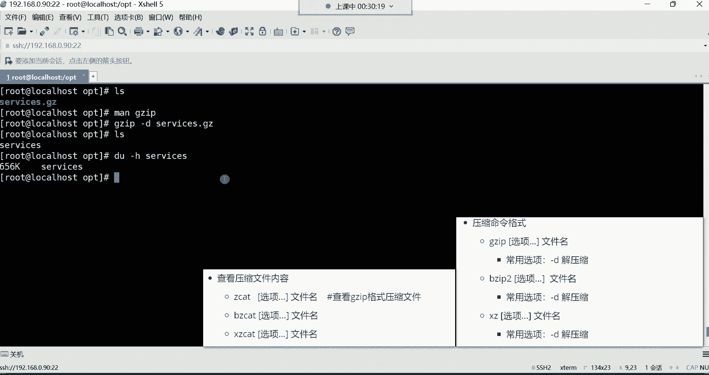
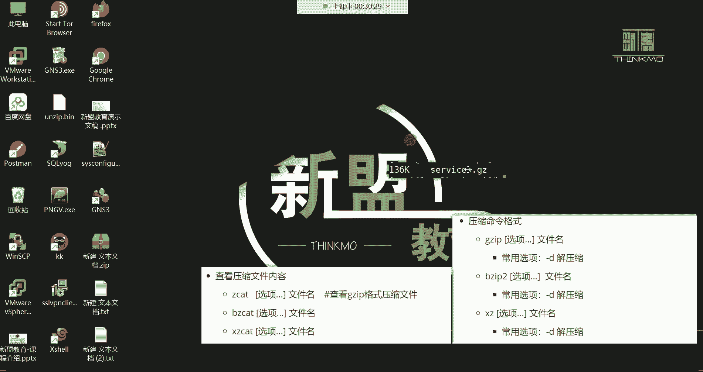
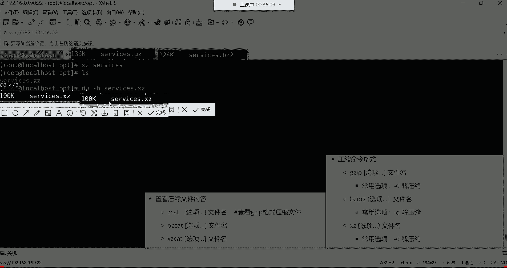

# 新盟教育-Linux运维RHCSA+RHC培训教程视频合集，全网最新最全最详细！ - P22：红帽RHCSA-22.gzip、bzip2、xz压缩、tar打包 - 广厦千万- - BV1up4y1w729

呃，听到我这边声音的同学给我刷播一，我们开始上课。有问题吗？没有问题是吧？好。我们是好久都没有见了，主要是一个清明节放的是吧？感觉哎呦我们这个啊十时间过得还很快是吗？好，其实我觉得这清明节放了呀。

我这特别的怀念大家哈啊特别的怀念大家，这真的是。😊，感觉一日不见如隔三秋，这种感觉马上要五一了是吧？哎呦，那我们这个真的是前半年呢过得他真就是快。所以说这个我们说这个干大事呢，一般都是在后半年。

为什么呀？因为前半年假期太多了，你看从过完年开始，什么三八妇女节，然后这个清明节，接下来呢马上就就要是这个五一劳动节了，然后六一儿童节。😊，嗯，剩下呢就是这个七夕啊，情人节之类的。

你发现这个前半年呢真的是。你想这个。好好去干点什么事儿啊，这有很多假期阻挠着你啊，因为你一到假期，你就按耐不住你自己内心的那种这个那种我们说这个呃本性啊，因为这个一到春天嘛，我们说叫万物交配的季节啊。

不是不是sorry哈，是这个春天是这个万物生长的季节，不是这个说错了哈，这万物生长的季节，你就想出去去看一看外面的花花世界是吧？所以说你这你有的时候这一放假呀，你就不想学习，一放假你就不想学习。

你说这怎么办吧，这怎么办？😊，😀は。😊，所以干大事都是在这个后半年哈，我们不能暴露本性是吧？什八万物交配，这什么我们说这什么虎狼之词啊。好了，那接下来呢我们这个就这个开始这个讲课吧哈。😊。

咱们这个上上节课我们是讲了哪些内容呢？我们简单带领大家这个回顾回顾哈嗯人与自然是吧？别看人与自然啊，我们学技术了，我们这个上节课呢是给大家讲解了常用的特殊符号。这个常用的特殊符号呢，主要是以这个星号啊。

大家是必须要掌握。因为它可以结合很多的过滤的命令或者说文件的搜索命令。😊，是有非常大的作用以及功能的。gra这个呢是一个文件内容过滤的一条命令。这个命令啊是我们今后啊在没有讲之前，你看我们有怎么用是吧？

但是讲了之后啊，我会频繁用gra这条命令，它功能强大之时，就是从文件里面帮我过滤啊某些关键词。fin的这条命令。fin的话呢是也是一个非常强大的命令。比如说你把一个文件放在系统的一个路径了。

但是呢你记不住，那怎么办呢？fin命令啊可以帮你去从这个系统当中去搜索啊，搜索这个文件的所在位置。好，那今天呢我们要给大家讲讲这个文件的压缩，还有这个磁盘管理。我们今天啊。

争取把这个磁盘管理以及这个逻辑卷给大家讲完就可以。我们今天是准备从这个压缩开始，一直到哪儿呢？一直到这个逻辑卷，到逻辑卷的删除，能够讲完。我们今天这个课就算是完美的收官。好，那咱们先来看看这个压缩。呃。

对于压缩来讲啊，其实。比较好理解，我们经常用windows windowsdows里边呢大家会经常做一些文件的压缩与解压，这个就没有什么太多可介绍的了哈。那为什么要压缩？这压缩的功能是什么？

这大家应该比较清楚压缩呀，你比如说我现在有一堆文件，我们新建了很多的文件。😊。

那这些文件呢我想发给别人，那最好的方法是，比如说这文件比较大哈，我们建这文件是空的是吧？没关系哈啊，咱们就假设这两个文件呢特别的大好几个G，然后我想发给别人，发给别人呢？

你怎么样才能让它的传输速度变快呀？😊，注意啊，我们说这个压缩。😡，他可以把这个文件变小，是让文件的内容变小。变小以后呢，你再把这个压缩包发给别人。哎，那这个传输速度是不是就快了呀？

所以压缩主要就是可以节约我们系统的磁盘空间。那对于一些这个文件的传输来讲呢，也可以提高文件的传输速度。我跟你讲哈，我们生活中。有哪些文件是压缩格式呢？比如说那些MP3的这是音，这是音频文件。

还有那些MP4的。还有那些点击PG的、点拼机的，还有什么点G。GIF的，还有什么那个。啊，就这些吧哈就这些呢其实都是压缩格式。😊，像什么MP3MP4啊，它呢为什么要压缩呢？因为它太大了。

你看现在一个高清无码的视频，好，动不动就好几个G，最少也得是这个几百兆是吧？😡，那你说你去看这视频的时候，你的浏览器在访问那个网站，你点这视频为什么瞬间就能打开呢？速度特别快呢？😡。

因为这个文件是经过压缩的，就是你在点击这视频的时候。😡，啊，那个服务器啊，他得把这视频传给你，你能理解吗？他他得把这个视频传给你哈，传到你的这个浏览器的时候，你的浏览器还有一个解压缩的功能。

这浏览器呢就直接把这个压缩格式的文件给你解压了。解压以后，你在本地打开速度就非常快。哎，所以说这压缩呢是在互联网当中非常重要的一个手段啊，可以提高数据的传输速度。😊，包括图片也一样，你去访问一些图片。

也嗯IM3U8。这个M3U8是什么呀？就是我们在这个网络当中在浏览一些图片的时候，这图片也都是压缩格式。你打开快，是因为它传传递的速度比较快，传到你的手里面的时候，你直接就打开了啊，流媒体啊，对。

都得压缩哈都得压缩。😊，啊，所以压缩的好处呢，一是一是节约我的磁盘空间。比如说我这个电脑里面，我的磁盘呢不够用了。

有很多的文件呢非常大占用我的磁盘空间。但是这些文件呢我还不经常使用怎么办呢？哎，你就可以把它给它压缩一下，压缩一下哈，所以这就是压缩的好处。其实。😊。

如果通俗点来理解，就是把一个我们说就是一个那种。丰满的馒头，哎，你给他。捏小了一样。啊，当然我们说这这馒头一般也不丰满是吧？但就啊就类似于这种感觉哈啊，让它变实了啊，就这意思哈，你们自己体会就好。

就压缩哈。😊。

好，那我们来说说这个在linux里边，它压缩格式都有哪些windows没有什么太多可解释的吧。在windows里边压缩格式。😊。

那windows你直接下载一个压缩工具，你看一下哈，嗯比如拿这个7Z来说。😊，为了添加到压缩包，那这压缩格式都有哪些有ZIP的，还有这个ta的。

啊，它这里边还有七类格式的比较少哈，还有像什么压缩等级。压缩等级的话呢，这里边你看有急速压缩，快速压缩标准压缩。😊，这里边的压缩等级它主要体现在哪里呢？就是速度快与慢。😡，如果我们那个比如说等级比较低。

你比如说就像这种那个急速压缩。😡，那这种速度肯定是最快的，是吧？😡，那你说速度快好不好呢？好。😡，但是啊速度快，它的这个我们说叫压缩的比例。😡，他肯能会相对的差一点。什么叫压缩比例呢？

比如我现在有一个文件，这个文件大小是多大的呢？我现在有一个。😊，5个G的文件好，我现在要对这个文件进行压缩。如果我选择这个急速压缩，那它的速度肯定是最快的。它是以它会在最短的时间把这文件呢给你压缩一下。

😡，但是由于压缩压缩速度快，但是比例肯定是相对较差。压缩以后呢，可能这个文件它大小能够变多少呢？能够变成，比如说三个G。😡，好。压啊压缩了两个G的空间。那如果我选择这种，比如说这种那个。

极限压缩呢啊我们就拿这个极限压缩来做个对比哈，这极限压缩。😊，你看它都已经达到极限了，是什么意思呢？就是我能够把你这个文件的大小给它争取压缩到极限。比如我能够把5个G的大小给你压缩成一个G，可不可以呢？

😡，哎，我们就假设哈它非常极限呢啊变成一个G了。但是它速度上来讲呢，肯定没有这个急速的快。你比如说这个极速我用多少，我用一秒钟。😊，ES我用一秒钟，那这个。这个极速哈跟极限哈这个极速比如说我用一秒钟。

那这个极限呢我有可能得用3秒钟。这个。得用3秒钟才能把它。给它压缩完成。所以说我们说这个压缩速度跟压缩比例，其实这两个东西啊都息息相关。如果我希望把这个东西压的精致一些啊，体积变小一些，那速度就慢一些。

但如果说我希望啊速度快一些，但是它的这个体积呢肯定就没有我们想象的那么小。啊，这就是我们所说的这个压缩的等级。为什么会有压缩等级？就取决于说这个东西你到底是要求速度还是要求它的体积，能理解吧？好。

压缩方法呢，这有很多种压缩格式啊，这是它自带的压缩格式哈。然后有比如说什么BZIPwo的，这里面压缩格式并不是很多哈，有windows里面有很多的压缩工具。

你比如说像什么呃12345那种专门压缩的那种工具，他们呢像什么压缩的格式啊都非常的多，而像我用这个7Z吧呢，它这个压缩格式。😊，有种压缩方法哈一般都比较少一些，还有压缩格式。

你发现也并不是很多并不是很多哈。😊，那这是windows，我们就不过多介绍了。我们主要就是带领大家了解一下像什么压缩等级是什么意思，还有压缩方法是什么意思哈。大家了解一下。

那我们接下来就主要以这个linux下边的这个压缩来给大家讲讲，在linux下边呢，它也有很多种压缩方法。😊。

有哪些呢？有这种叫GZber压缩方法啊，但是我们叫做压缩格式，还有这种BZIP two的压缩格式，还有XZ的压缩格式。那像这每种压缩格式呢。他们压缩以后的文件的大小不一样。但是压缩的速度也不一样。

我们就拿这个什么呢？😡，拿这三种压缩格式来讲，我们来演示演示他们到底哪种压缩格式速度比较快，哪种压缩格式压缩的比例比较高一些。

我们进到系统的OPT目录，来到这目录以后呢，把这目录清空一下RM杠2F星删除目录下的所有好LS看一下这目录干净了是吧？我们拷贝一个文件过来，拷贝哪个文件呢？ETC有个service这个文件。

这个文件是不是很大呀？拷贝到我们的当前目录是不是点就可以了代表当前推车好，这文件拷贝过来了。😊，拷贝过来以后呢，我们来看看这文件的大小。😊，嗯。这样哈有一条命令叫做杜杠H。

这个命令是专门统计文件的大小的。我们来后边跟上那个文件名s。这个文件的大小呢它是656K。当然这条命令我们后面会讲，大家没有必要去记哈。我们在讲磁盘管理的时候，就讲这条命令。😊。

你看这个文件大小是656K是吧？在没压缩之前，它就以普通文件吧。好，那我现在用这三种压缩格式去压缩它。那这三种压缩格式怎么用？

非常简单，命令格式啊非常的简单。我们先来说第一种压缩格式。这个GZ的压缩格式。好。调一下啊OK。像这种GZ的压缩格式呢，它的命令格式是GZ，可以根选项。这选项在压缩的时候呢，一般呢没有标志。

我们后边直接跟文件名就可以。😊，那这个时候就这样哈GZIP。跟上文件名sice。回车它压缩完了以后啊，它压缩完的这个文件，它是以这种点GZ作为结尾。所以我们看这个文件的时候呢。

你发现它就自动有一个扩展名点GZ。

看到了吧？好，那这个时候我们来做个对比，压缩以后跟没压缩之前，它们两个的区别到底差了多少。你看我们我们记一下啊，咱没在没压缩之前，大小是不是656K啊？好。😊，咱们把这个截个图啊。

没有压缩之前哈是656K放到这儿。咱们就拿这文件来做对比哈。那压缩完了之后呢，首先。😊，这个文件哈就直接变成一个压缩格式了。那现在我们来看它大小们度。杠H统计一下。哎呦，你们看一下哈。

有有没有注意到这个大小看到了吗？变成多少了呀，是不是变成136K了呀？这种格式。😡，是GZ把压缩格式。啊，这是GZ表的压缩格式，我们来拿过来压缩以后。我们放到哪儿呢？哎呦，我感觉他无处安放了哈。

放到这儿吧哈，放到这儿。😊，好，这是GZ的压缩格式点GZ结尾，这样我们就能够明显的认出这个文件是用哪种格式压缩的是吧？你看这大小差了多少呢？😊，656跟136是不是差了将近5倍呀，5倍的大小。

对这就是那你说像这种文件也并不是很大。如果要是好几个G的文件呢，如果是好几个G的文件，我们就能够明显看出差别了。😊，啊，如果这文件你传给别人，你发现这传输速度它也不一样。对吧你就像在企业里面。

为什么那些开发人员，他们开发好一个项目了，他为什么要把这文件给它压缩一下，然后再交给运维呢？😡，哼为什么呀？因为不压缩那一个项目文件非常的大。😡，有可能是几十个G的一个。有可能是加到一起是几十个G。

但它得压缩啊，压缩以后呢，这个项目可能就变成几个G了。那到时候他把这项目直接传给运维人员，运维人员拿到本地再解压缩的时候，哎，这就非常的速度就非常的快，能理解吧？😡，啊，这是第一种压缩格式。好。

那压缩完以后呢，我们怎么看压缩文件里的内容啊，这时候你不能用ca了。如果这时候你用ca看这个压缩文件的内容来看看。😊，就乱码了，看到了吗？乱码了吧，为什么呀？因为压缩格式的文件。

你得用它独有的方式去查看，不能用普通命令。那这样怎么看呢？😡。

嗯，我我记得我有这个选项哈。😊。

在这哈查看压缩文件的内容。

这三种格式啊命令都不太一样。如果是这个GZ的压缩格式呢，我们用的是这个叫ZK这条命令。这条命令呢可以查看GZIP的压缩格式的文件。那这时候我们就这样Z开。后面呢跟上文件名就可以了。回车。

你看这时候是不是帮我们打开这个文件来呀？由于这文件内容非常多，所以说呢这我们一屏也显示不下。因为这个文件我记得哈是好几万行这里边，但是不是打开了呀，没有乱码吧。好，这如何查看这种压缩格式的文件内容。

不能用普通命令看哈。😊，好，那这是第一种压缩格式。那接下来想解压缩怎么办呢？想解压缩，它有一个选项叫杠D这个选项。这个选项呢可以帮我们把这个压缩文件给它解压。然后对于这条命令。

我们可以慢一下慢一下这个GZIP它有很多的帮助，看到了吗？那这时候呢，你说老师这英文呢看不懂啊，没关系啊，咱们不是有翻译吗？这你英英语水平不好呢，咱们可以借助一些翻译工具。我们就比如说这个网易有道词典。

这个网有道词典呢？它有个功能，什么功能呢？我给你们说一下这一个非常牛逼的功能哈。😊。

在这里边呢，你看啊找找到设置。😡，这设置里边呢。他有一个。功能叫做滑它叫曲词跟滑磁。什么叫曲词跟华词呢？啊？当然这属于课外的这属于课外知识点了哈，这我就不是很专业了哈，但是呢非常实用。😊。

所以呢你们呢就就主要是很实用哈。😊，它有一个功能看到了吗？叫做启用复制查词。什么叫复制查词啊？就是选取内容以后，你一复制，它就给你翻译了。😡，你把这个选项。一勾上，接下来呢这在叉里面还有一个功能。

当然这个就给它最小化就可以了啊。叉el里面有哪个功能呢？😡。

有工具在工具里边有个选项，这个选项里边呢有一个叫做。键盘跟鼠标。这个里边你看它也有一个非常牛逼的功能。这儿呢。将选定的选定的文本自动复制到简题版。就说白了你把这个功能一勾选的话，这个时候。

你看我这个是不是翻译也开了呀？比如说我现在我读不懂我读不懂这个什么呢？它的这个英英文的含义了。😡，好，你就划就行了。划看到吗？滑完以后。诶。看到了吗？这波操作是不是可以啊，直接给你翻译了吧。

告诉你这压缩或扩展文件的。😊，就这条命令是吧？那接下来呢这这英文是什么意思？你说看不懂啊，告诉你这叫简介啊，这是介绍你的介绍他的命令格式了，这我也看不懂。好，划一下，告诉你这是一些描述，看到了吗？😡。

描述什么呀？描述一下他这个命令的一些介绍。花。告诉你是使用什么编码，减少命名文件的大小的，只要可能每个文件都能替换成一个文件扩展名为GZ的，看到了吗？告诉你是不是这就一些介绍吧，没有什么太多。

这玩意儿就跟我们说这玩意就跟大马路上的那个英文广告一样，那你有必要翻译吗？那大马路上的英文广告你还得必须翻译翻译去看一看吗？没有必要了吧，这介绍吗？不就是。😡，所以说这就略过就行了哈。😊。

你可以看看它的选项。你比如说哪个选项呢？我们就前面不是说有一叫杠D选项是吧？杠D这里边我们可以看这杠D选项是干什么用的。😊。

啊，看叫解压缩，看到吗？就是告诉你这个选项是解压缩用的呀。然后别的选项呢，你比如说像这个杠A的选项啊，你都可以如果感兴趣啊，都可以看一看啊，什么使用本地的什么转换行伪的词选项。

在一些什么非un系统支持啊，就是转换它的这个。😊，转可能是转换他的这个扩展名的哈，但是没有必要哈没有必要，还要获取帮助等等等等。杠L选项。😊，好了哈，我们就就是给大家演示一下啊。

就如果说你想具体了解这个命令，它的其他的功能的话，我就是把方法教给大家。😊。

了解方法以后呢，这种东西你们就自己去应用就可以了。好吧，因为毕竟我给大家讲，我只会给你们讲我们常用的一些就是功能啊选项啊，就是这样呢你们只要有了方法之后，你们自己再去自己去查。

这样我觉得比我直接这样教你们可能帮助会。

更好一些，好吧。那下边呢我们就来说这个杠D哈，杠D是解压缩怎么用，那你就直接记z，然后杠D后边跟上文件名回撤。你再看的话，这文件就。又恢复到一个普通的文件格式了，就不是压缩格式了。好。

那这时候你再看大小的话呢，那肯定又恢复到最初的那个大小了，又是656K啊，这个大小哈又恢复去了。我刚刚那几个啊在这儿呢。😊。

656K，然后这个GZ我们得说一说哈，它是压缩完以后，是不是这个136K啊？😊。

从156K变成了136K。那接下来我们再换再换第二种压缩格式，这个叫BZIP two的压缩格式。那这个压缩格式呢用法都一样。BZIP two。就是压缩格式，为什么叫这个名，你别纠结。😡。

这名字是人家开发者，人人家在开发的时候，人家就。😡，说白了就是一般就是他们取的名字，你不要去纠结这名字，你就知道它的功能就可以。然后后边直接跟文件名对它进行压缩。嗯，没有这个BZIB two这条命令吗？

啊，那确实就没有了。那没有怎么办？没有，我们自己搜一下吧。😡，嗯，叫BZIP two。看看这条命令哈，由哪个包提供。对，我们自己下。如果没有的话，咱们自己下。这条命令不是这这条命令是不是讲过呀。

前面干什么用的来着？😡，叫搜索一个命令的软件包。我敲的这条命令，在我的系统里面没有，我想搜一搜是由哪个包提供的。好，告诉你了，就是由这个包看到吗？叫BZIP two的这个包提供的吧。好。

那接下来我们是不是就安它不就可以了吗？么杠外ins。😊，报名呢？叫BZB to。BZIP to安装的。好，安装好了之后呢，我们就再压缩，把那个命令翻上来。😊，回撤。阿莱S斯看一下。

那像这个BZIPwo的压缩格式，压缩以后，这文件名啊，它的后缀就是以这种点BZ two结尾的。

来看一下，是是点BZ two结尾啊，那这并不是什么我们所关注的，我们要关注什么呢？我们要关注它大小。😊。

度杠H看一下它大小。好，124K。我们跟前面对比一下。

对比一下哈。前边呢那个GZ8的压缩格式压缩完以后啊，是136K是吧？然后这个BZIB two呢压缩完以后啊，是124K。那这两个压缩格式。大家是否能够明显感受到。其实这个BZIP two的压缩格式。

它压缩后的文件。会更加的小一些。就是我们所说叫压缩比例更高一些呀。好，而这个GZ呢，它的压缩比例呢没有这个BZB two的压缩比例要高。但是。😊，从速度上来讲，你不用想，肯定是他要比他快，速度会快。

因为是因为压缩比例没有那么精细化，所以说呢速度就快一些。😊，好，这是第二种压缩格式。那压缩完以后，我想看压缩文件怎么办？也不能用ca，用这条命令叫BZca。😊，后面跟文件名。

这时候就BZK跟上这个文件名。好，这也一样哈，就是看文件里的内容了。好，那我想解压缩怎么办？想解压缩。😊，也是那个杠D选项，它这个所有的解压缩选项都一样，看到了吗？

常用的选项杠D这时候呢我们就这样有BZIPwo，然后杠D跟上文件名。回撤。再看一下。好，简说了吧。啊，这就是我们所说的这个怎么压缩，怎么查看压缩文件内容，怎么加压缩。当然这是BZIP two的压缩格式。

那接下来我们再讲第三种这个叫做XZ的压缩格式。这个压缩格式来吧。看一下哈他们到底区别在哪里。XZ跟上文件名回车。😊，注意哈，你们有没有你们有没有发现一个细节，他在压缩文件的时候，好像稍稍停顿了一下。😡。

有注意到吗？注意到的给我刷个一，没有注意到就算了哈。😊，有注意到了是吧？哎，是就感觉稍稍卡了一下。😡，好，那没关系，我们看一下它为什么会卡一下哈，我们度杠H统计一下。😊，哎。

你发现啊它压缩文的文，它压缩后的这个文件的大小啊。😡。

最小看到了吗？它压缩以后，这文件直接变成100K了。从最初到多少呢？从最初的655K直接压缩到100K的阵。😡，翻翻了6倍还要多一些，是不是？对，应该是更小了。但是呢虽然说压缩的体积是最小的，哎。

我们这就压缩比例比较高了是吧？非常的细致了。但是呢速度是不是相对就较慢了呀？😊，没错哈，速度就相对的较慢一些。所以这压这三种压缩格式，现在大家应该心里都清楚哪种压缩格式压缩比例比较高。

哪种压缩格式压缩速度比较快了吧。GZ呢压缩速度最快，但是比例最差。😊，XZ呢压缩速度最慢，但是比例最高，它压完以后文件最小是不是它压缩完它压缩以后呢，文件呢呃只能说是一般吧啊体积没有变得最小。

但是速度是最快的。那在企业里边，那比如说你们公司呃在做一些文件备份的时候。你如果希望啊让这个文件更加节约磁盘空间的话。那是不是我们可以选择一个压缩比例最高的呀XXZ。但如果我希望什么呢？

这个东西压缩以后啊，我要什么呢？😡，把这个东西呢传给别人。传给别人，其实那就不要没有必要去考虑什么呢？没有必要考呃，或者说让别人访问的一些格式的文件，就没有必要考虑比例太高的。😡，为什么呢？

咱们就拿这个视频文件来说，这种点儿MP4的这种文件来说。这种格式文件它需要。压缩比例非常高吗？不需要，为什么呢？你想想你访问一个网站服务器，这个视频是在人家网站服务器上面呢？

点MP4是在人家服务器上面的。而我们作为一个用户来讲，我们在嗯我这图啊，这图我这个不用他画了哈，这图画不好。😊。

好。我们来说一下，你看就这服务器，这服务器啊是人家公司的服务器。那我们作为一个用户来讲，我们是。😊，要访问人家服务器，我我们去看一些，比如说这个。视频，那比如说这就是一个视频文件点MP4的。

MP4的视频。好，这个文件哈，你想想。😊，我们用户访问这个服务器，我是为了来看这个视频，是不是啊？那是不是这服务器是不是得把视频它给我呀？😡，我要打开这个视频的时候，我是是不是在我们用户的浏览器。

我们就能够看到这个视频呢。😡，好，那这时候这个服务器啊，它会把这个视频干嘛呀？传给你。传给你把这文件得传给你。他传给你呢是得传给你的流，他得把这个文件传传传传到你的浏览器上边。比就说这时候你的浏览器。

它本身有个功能，什么功能呢？叫解压缩的功能。浏览器。你是通过浏览器去访问人家。然后这时候呢他得把这文件呢通过浏览器再传给你。那这文件是不是得来来回回传输啊？😡，是不是得传输啊得传输哈。啊。

那这时候你想他把文件传输给你，怎么样，我怎么样才能保证我这个文件在传输的时候，这速度会更快一些呢？😊，怎么样才能保证呢？你说是更小吗？😡，不是。如果更小的话，我告诉你哈，这个文件传到浏览器的时候。

浏览器是不是得解压缩？😊，它得解压速解压速。比如说我压一个视频的时候，我需要多久呢？比如我需要一分钟。😡，好。然后。他再把这个视频再传给你，你解压缩再需要一分钟，来来回回。啊，可能你再加上传输速度。

这你点开一个视频得需要耗费个3分钟左右。那我们访问一个网站，你在点个视频3分钟，连视频的这个影还没看着呢。你说对用户来讲，他能等得起吗？他等不起。😡，是不是啊？所以一般都有那个。有些文件格式来讲。

它不要求压求压缩的特别的精细。你反而我好我简单压一下，然后传给你传给你的时候呢，哎只要你的带宽别太慢，只要网络别受影响。这文件传输速度呢不会受到太大影响。然后传到这个用户手里边的时候呢。

我解压缩速度快一些，这视频看的就快。😡，是这么回事，而有的文件呢，如果不需要被用户访问的一些文件，就没有必要。咱们说这个压的特别粗糙。你比如说我们做备份的时候啊，你可以选择压的精细一些啊。

所以这种压缩格式呢大家搞清楚。😡，每种压缩格式一般应用场景不一样。好，那这三种压缩格式的话呢，他们都可以对文件进行压缩，让大文件变小。但是呢。它有一个缺陷，什么缺陷呢？就他呀没有办法对目录进行压缩。

也比如说我现在有很多文件都在一个目录里面，咱们就拿这OPT来说吧。😡，我们先先把这个给它减压缩哈，咱们现在这个命令呢还没有讲完，减压缩的话呢也是杠D选项。😊，XZ然后杠D跟上文件名这记。嗯。嗯，XZ哈。

😊，XZ。啊，XZ。港地。这就解压速了，这就嗯都一样哈，选项都一样。然后我们来说说，现在比如我有一些文件，我把ETC下的。😊，passWD给他还有ETC下的FS table都给他拷贝过来。

现在这里边有三个文件是吧？好，那我现在想干嘛呢？我现在想同时对我这个目录做个压缩。😊，OP天目录或者说这目录里面有非常多的文件。我进去再建100个文件出来，我再踏个。泰斯。1点点100。第二。Log。

啊，好，比如说现在我要对这么多文件压缩，那怎么办呢？你不能说一个一个压吧，这些文件都在一个目录里面。😡，好，那这个时候。我们怎么办呢？我们是不是对目录压缩最省事儿啊？😡，啊，那接下来我想对目录压缩。

那我就这样呗，那个比如说GZ吧。后面呢跟上那个OPT的目录，我们看这样可以吗哈，不成哎，你发现。😊，他。报道什么，我看一下哈，是不是这个他说这是一个目录啊。😊，他这个目录不让应该是不让你压缩。

可能说格式不是很支持。

被忽略了是吧，被忽略了。那。像这种情况下，他就不允许我们对这个目录进行压缩的话，那怎么办呢？那你说我这目录里那么多的文件，我不能一个一个手动去压缩吧，这也太浪费时间了呀，那怎么办呢？😡。

像这种情况下呢，就。

等一下啊，我把这个取消掉，我觉得这个。

鼠标键盘。就这个程序有的时候。

注意下啊。

那如果他不让我对这个目录进行压缩，那我就没有办法把那些文件给他压缩到一起了，这肯定不行啊。那在企业里边，人家在做项目的时候，人家一个项目可能他很多文件都会放在同一个目录。那，那你说别的格式应该可以吧。

比如说那个BZIP two的格式可不可以呢？那也是被忽略了，也不允许是吧？这就。让我们有些尴尬了，你说这是一个目录被忽略了。那XZ呢？再跟上那个OPT呢。好，跳过了，看到吗？告诉你说。这是一个目录。

我呢直接给你跳过了。哈。这就不合理这就不合理哈。所以说对于这种压缩格式，他们不支持对目录做压缩，那怎么办？😊。

所以接下来啊这个塔这个工具就变得非常的实用了。塔它是什么呢？塔它本身是一个打包工具。你看t命令是用在linux下边，用于对文件目录做打包的。我们在使用ta程序打包出来的这个包，我们称之为踏包。

然后踏包文件通常是以种点踏作为结尾。

他怎么玩的？套呀，我们把这个命令格式呢拿过来给大家演示一下。

啊。这样Gz是吧，然后OPT下的，然后pasist这样。1点点100是吧啊，我就就是说我要对这个所有的文件做一个压缩。😊，是吧。呃，没有这样的文件和目录是吧，我们来看一下OPD可呃。

这个目录有没有那文件有没有被压缩哈。😊，没有吧。是不是是不是不行啊？也不允许。所以说呢像这种压缩格式啊，它还是有一些。只能适合那种，比如说单个文件的压缩。所以这个t这个东西呢，它就很好用，怎么用呢？

我们把这选项给大家拿过来哈。😊。

他有一个。他的选项非常多。😊。

当然有有些是常用的，有些它就不是常用的。我现在可以用t结合它这个杠C跟这个F这个选项。C是什么呢？叫做创建打包文件。就是你要。把一个文件。打包的话。你得必须指定这个杠C这个选项创建的意思。而杠F呢。

这也是必须要指定的一个选项，叫指定打包以后，这文件啊叫什么名字？这个杠F也是必须要加的选项，就这两个选项哈，在创建的时候。😊，我要算一个压缩包。那这时候呢我们指定1个OPT。但是他这格式啊有些反人类哈。

他这个命令啊，你得先指定压缩以后，这压缩包叫什么名字？😡，能理解吧。嗯。得先指定压缩以后这个叫什么名字。比如说我要呃我压缩以后，我让他叫什么呢？让他叫这个。😊，OPT。第二套。可以哈。

然后再把你要打包的这个目录。最后呢给他指定上啊，注意啊，先指定打包以后叫什么名，然后再指定你要对谁打包回车。这时候他提示一个说什么从成员名中删除开头的根啊，这个我们一会儿再解释哈，那打包好了吗？

打包好了。😊，这儿你看啊这是不是有一个什么呢？有一个叫OPT点他的呀。好，这个是打包以后啊，这它叫。OPT点大，那你知道他现在是一个什么格式吗？😡，我们来看一下哈。你发现这OPT点它它变成什么格式。

这个小横杠还认识吗？这小横杠代表什么意思啊？😡，还记得吗？嗯。哎，文件是吧？对，文件哈。😊，对，文件哈，你看他把一个目录打包成一个什么格式了，文件的格式了。😊，没错，那一旦打包成文件格式了，那接下来。

😡，我们是不是就可以调用那个压缩工具了呀？比如说Gz。😡，我可以对这个OPT点它做一个压缩。回撤。好，那你看现在。是不是就可以了呀？也就是说套呢它是一个打包工具。但他打包以后，这他这个注意啊。

大小是并没有实际改变的。就原先这个目录下的文件是多大，他只是给你打一个包，就给你。😡，归纳到一起了，但这文件大小没有实际的改变呢。😡，但是我想什么呢？我想压缩。😡，它本身是不具备压缩功能的。

它就是一打包的。所以你想压缩的话呢，那它一旦变成文件格式的话，那我们说这各种压缩工具是不是就可以对它们进行压缩了呀？😡，对。啊，打包大小不变啊，我们再演示一下哈，我现在给他这个什么呢？咱们给它删掉哈。

直接把这个给它删删掉。😊，我们还是这个把没有用的都给它删掉哈。我我觉得我这里面怎么这么多什么test呀，test2t星啊都删掉。😊，嗯。太死的星。还有这个。什么新建这个也给它删掉。那就点ZIP的吧。

星点ZIP。删掉哈。好，OK。然后我们再来演示一遍哈，我们现在先统计一下，我度杠H我统计OPT目录录的文件大小。😊，好，总共是668K是吧？你看在没打包之前，这个目录的大小是668K。

我现在打包杠CF我直接把OPT目录给他打个包，但是叫什么名字呢？就让它叫OPT点它。😊，C啊C好。打包好了是吧，然后看看打包以后，它的大小有没有变化啊，我们还是度杠H统计这个OPT点它。哎。

你看这怎么变大了呢？😡，你看这个很奇怪哈，没打包之前，你发现它是668K。😊，是吧打包以后呢，怎么变成712K了呀？😡，所以这个还有一个核心的思想是什么呢？就甭管是打包还是压缩。小文件。

就别打包，也别压缩了，为什么呢？在windows里面，我给你们举一个最简单的例子。😡，我们就拿着一个普通的文件来说。我们来看它的属性。你看啊看它大小哈，在没有压缩之前，它大小是多大呢？

是零个字节占用空间零字节是吧？就一个空文件嘛。好，我现在对它做一个压缩的操作。😊，压缩为z文件。压缩了吧。本身呢这个文件呢是占用零字节，压缩以后，我们再看它的属性的时候。好，大小变成132字节了。

所以这小文件呢就别压缩越压越大。能裂吧，因为它毕竟里边会有一些这个压缩的属性，这属性也会占一些空间。对，属性哈，它里边是是有一些它的格式的属性的。所以这小文件呢它会明显的感觉到它大文件啊。

人家那属性就感觉不到了。大文件呢压缩是很正常的。好，所以说这个小文件就别压缩了哈。所以这为什么说我们这个打包以后，它这个大小变得更大了？😊。

这应该能理解了是吧？啊，也就是因为我们这个文件有些小，你至少咱说打包压缩得得是个1024K以上的，你才有必要对它做一个打包跟压缩。😡，如果是1是1024K以下的啊，就没有必要了，就一一兆啊。

我们说这个最起码得是一个兆以上的文件才能有必要对它做个压缩或打包。好，那现在明显感觉到是不是大小没有变化呀。😡，他并没有变小啊。😡，那这时候呢啊我们再压一下就可以了啊，压一下。

用这个Gz对这个OPT点它做一个压缩。好，变成压缩格式了吧。好，那这时候我们再看大小，它就变小了。😊，啊，变成136平了。这时候应该明显能够感受到，是不是就是。它他这个工具啊。

可以帮我们把一个目录给你打包成一个文件的格式。一旦变成文件格式了，我再调用其他的压缩工具，我对它做压缩就可以了。所以t这个东西呢，是不是就非常的实用了呀？那以后你比如说我们对什么呢？我要对我这个系统的。

😊，某些文件做一个备份，哪些文件呢，咱们就拿一个系统的va下的log这个路径下边的这些文件做一个备份。你那这些什么点log作为结尾的，还有什么带有日期的这些东西，其实都是日志文件。好。

我想对他们做一个备份的话，那怎么办？😊，那这不打包压缩就可以了呀。😡，正常来讲，我们先统计一下这个路径下的文件现在是多大。嗯，再加个S哈，统计一个总数。总共是3。4兆。好，那现在我们就拿这个目录来讲。

我现在用t杠CF。指定以后打包以后叫什么名字呢？就让它叫这个log点儿怕。好。啊，sorry哈sor。打包好了。统计一下大小呢应该没什么变化。啊，还是3。6兆，没有什么变化是吧？那这时候呢我在压缩。

比如说用这个Gz。在指定这个log点它压缩压缩以后呢，我们再看到的大小的时候。嗯。啊。就别调用了哈，杜杠H就推不见补齐吧。啊，变成396K了，看到了吗？各位，你发现这变化还是蛮大的，原先是3。6兆。😡。

但压缩以后呢，变成396K了是吧？这差了多少啊，这差了将近10倍。😊，啊，差了近10倍的大小。所以说这是不是还是蛮有必要的呀？没有必要的哈，这大的话呢，你压缩能够感感受到明显是变小了吧。😊，好。

那以后这个。压缩包里边放的是不是就是我的系统的日志的备份文件了呀？并且它也没有占用我系统多少磁盘空间吧。非常的实用哈非常的实用。Okay。好，那下边呢我们再给大家讲讲其他的选项哈。其实套呀。

你在打包的时候，如果说我既希望打包又希望压缩的话，没有像没有必要像我们刚刚那样费事。我来给大家演示一下，把这个给它删掉哈，删掉。😊，我们可以直接在打包的时候，就调用它众多的压缩工具。他格式呢也是。

用这个C跟F啊杠CCF，然后你在这个后边可以直接加。加一个选项，但是这选项呢得看你要调用哪种压缩格式。解包能调用吗？能能调用，我们一会儿再讲解杠Z呢叫做调用这种GZ把它压缩格式。然后杠大写的Z。

可以不加杠C不行啊，杠C是创建的时候必须得加的哈。😊，不能不加。然后杠大写的Z呢，这是。调用这种XZ的压缩格式，然后这个小写的这也是调用BZIB two的压缩格式。好，那我们现在想调用哪种呢？

我想调用这种GZ，我就CFZ。这样哈。然后后面呢再指定我对谁打包，但是你也先指定名字，就让它叫log点他自己补一个点儿GZ。好，然后下边呢。注意啊，这位置这个后缀名给谁看的呀，是不是给我们自己看的呀？

😡，我们可以不加杠F不行哈，我我一会儿给你们演示一下这F啊。😊，他非常重要。我们来说一下哈这个后缀名是不是给我们自己看的呀？我一看这个文件的后缀名是点t点GZ结尾的。😊，我这样就知道了这个。

是踏的压缩格式啊，是踏的。打包格式用GZ的压缩格式，这不一看就知道是什么含义了呀。所以这名字你自己指定一下就可以了。最后再指定我要对哇下的。log整个目录做打包并压缩。回撤。嗯，我看一下哈那什么。

这时候他报错了他报错了哈，我看有没有成功，你发现这怎么没成功呢？😊，那他说什么这个无无法star是吧？没有那个文件和目录，什么前字错误是吧？哎呦，这报了一系列错，那我们这是我们格式不对吗？

我们这格式应该也对呀，你看压缩以后的名字。😡，然后对谁进行压缩是吧？这没什么毛病啊。😡，没有毛病哈。差在哪儿呢？看哈把命令翻上来。把这个F这个选项。放到后边。你看这就没报错。成功了吗？是不是成功了？

呵是不是？😊，所以说F这个选项呢，你比如说我们再拿过来，我不加它可不可以？😡，咱们再把这个给它删掉哈，演示一下。😊，还有一个Z也给它删掉啊，比如说我把这命令翻上来，我这个F选项我都不加了。😊。

就C跟Z可不可以？是不是还是刚刚那个报错呀？你看他的这个提示主要提示的是。他说机呃压缩后的数据不写入终端，使用杠F来强制压缩。就是你没有加那个杠F。😡，没有加杠F，他不允许。

而让你这个获取这个帮助的信息，获取这个GZ的帮助信息。对，那F呢它是改名的，它是改名的啊。他在压缩的时候是帮你指定名称的。你说你不加，他怎么知道？😡，要叫这个名字呢？是吧还有这个C，你说我不加C可以吗？

我这样Z跟F可不可以呢？😡，好，又报错了是吧，也也没有打包压缩成功。因为C是创建。你们他没有办法帮你创建，你说你怎么打包压缩呀，所以这选项哈对它没创建压没创建打包。

所以这时候呢第三个选项你是不是一个都不能少啊，t杠CCZF而且F顺序是不是还得有个要求啊？😡，这个F你还不能放到中间，也不也不能放到开头，只能放到结尾。注意哈，对于这个ta命令来讲，所有的选项。

都要加F是指定。你那个压缩包文件名的。你甭管是压缩还是解压。😡，你都得要加这个F选项。😡，你不加的话，他不知道应该对哪个文件进行操作。你甭管是是压缩还是解压哈，就这F。

而且必须得放在所有的选项的右最右侧才可以。😊，所以这时候我们再指定让它叫log点儿他点GZ对袜下的log这个目录进行打包并压缩，哎，这样就可以了。能领了吧，这样就可以了哈。好。

那接下来呢我们打包压缩成功以后呢，我们说我想看这个压缩包里的内容怎么办？也不能用普通命令看。你比如我用logg可不可以可不可以乱码哈？😊，不允许哈不允许。对。不允许这样看。

所以说呢你在看这个压缩包的时候，你就可以这样。你说我可以我可以用这个Z cat吗？Z cat跟上这个log点它点就Z也乱码。😡，也乱码看到了吗？他也不容易你直接用那个压缩的命令去看他。😡，那怎么办呢？

用它。他也可以帮你把这个压缩包给你打开。😡，这时候呢它有个杠T这个选项，杠T是帮我们列出打包文档。当是你不要忘了哈，你也得加个F。如果你不加F，你比我直接log个点他点GZ。😊，诶。他卡到这儿了。

他为什么卡到这儿呢？😡，你不加F，他不知道你应该对谁进行列出啊，他也不知道你要查看哪个压缩文件，看了吧？所以这是不是就卡到这儿这。😡，他不知道该干嘛了。😡，所以这时候呢F也不能少。回车这样就可以了。

这样就是把这个压缩包里的文件呢给我们列出来了。那这是这个查看压缩包里的内容。那还有一个就是解压啊，当然还有一个杠V给大家说说杠V的话呢，这是一个。可选的杠V，就是你在压缩的时候，你可以这样。😡。

我们这样哈，我们给它删掉，把这个文件给它删掉。删点以后呢，这个杠V选项是这样的，t杠你可以加上那个一个V叫VC。ZF这个V就没有位置要求了哈，但是你只要别把F调整位置就可以。

前面的这些都没有都没有没有严格的位置要求，只有这个F。所以前三个顺序呢。😡，没有什么顺序可言。然后后边的话呢，你再指定让它叫log点儿怕点GZ啊，文件名字，最后再指能对va下的log这个目录打包变压缩。

你看这个区别啊，主要是加了杠V以后飞车哎。哪些不太一样呢？注意到了吧？就是他告诉你我对哪些文件做了打包压缩。😡，而你如果不加杠位的话，他直接就。😡，不会给你显示这些文件名字的。删掉哈。

你看我们再把那个V给它去掉。😊，你看他会告诉你我到底对哪些东西进行了打包压缩吗？没有直接就显示这么一个信息是吧，没错吧。😊，好。这就是一个杠V啊，就是显示详细信息的。

然后我们再来给大家说这个什么从从成员名中删除开头的根。这时候你在列出打包文件的时候，你可以看得到有一个问题。看看这时候我们把这个袜下的log这个压缩包哈给它打开。😊，你发现啊这个每个。

这个压缩后的文件格式，它前面少了一个什么呀？是不是少了一个那个。绝对录径呢。有没有发现那个根目录？😡，并没有被记录在这个压缩文件里面。看到了吗？就是这你看这个路径前面没有这根斜线。😡，没有这根斜线。

没错吧，是不是没有这个人显现呢？😡，所以说这个它的提示就是什么呢？就是说他帮你把你这个他帮你在打包的时候，把你这个打包文件前面的那个根目录给你去掉了，给你删掉了。为什么会删呢？😡，因为你在解压缩的时候。

😡，你想想，如果说咱们就拿这个文件来说，我们后期想给它解压缩。如果它的一个解压缩的这个在这个里边，它的文件名是这样的哇下的。😡，唠个下子。叫这个名字。那大家有没有想过你解压的时候。

是不是就直接解压到你系统的这个根下的Y下的log这个路径下面了呀？😡，没错吧。但是我不想给他解解压到这个我系统的这个路径啊，我想给我想给他解了我系统的OPT目录怎么办呢？😡，没用啊。

因为人人人家这个文件里面的名字就是从根开始啊，你想加到OPD没用，他不会去帮你把这个文件夹到OPD目录的。😡，那怎么办呢？哎，他会帮你把这个压缩以后的文件啊跟目录给你删掉。能理解吧？

他把这根部录易删以后，哎，我指定我要把它给它夹到OPT那夹以后，那是不是？😡，它就在OPD下边就变成这个路径了，然后前面是个OPT呀。😡，是不是这个意思？能理解吗？能理解我说意思？

他所以说为什么会有那个提示哈那接下来咱说说假说。😊，呃，我们把OPT目录给他清控一下RM杠RFOPT下的性。然后呢，我们。他。杠X。这个X呢是解压缩的意思，然后解压缩的时候也不要忘了跟名字。

这个F哈指定这个名字，我要对这个log点它点EZ做加缩。然后在夹的时候呢，如果说你不指定路径，你直接回车，它就夹在你当前的。😊，路径了。夹在你当前目录，你看这半目录是不是直接生成在我的当前目录了？😡。

没错吧。哼那如果要不删除开头的根的话，在这位置如果不把你每个路径前面那个根删掉，那你知道这个路径解压以后，它是不是又回到自己原先的那个根下的洼下的那个路径下面去了呀？😊，这样就没有办法解压到指定路径了。

他是这么回事。好，那这时候呢。甲以后呢。你再打开这个va目录，这va目录就在你的加目录了，看到了吗？这里面有众多的目录了。log这里面有你打包的文件啊，它是这么回事。啊，这是夹压到自己当前的路径了。

那如果说我想给他解到别的路径怎么办呢？杠XF还是选项不变，但是后边要加一个杠大写的C，叫指定指定解压路径。这时候呢我就杠大写的C指定我要给它解压到哪里呢？解压到我的OPT目录。回撤。

这时候你直接看OPT的时候，你发现OPT下面多了一个哇。这时候呢哎我们再看这个万目录里边的内容的什么，看到了吗？这里边。是不是就夹过去了？所以你它只有在帮你把这个目录前面的那个根删掉的时候。

你才能够指定我要给它解到哪个路径下面去啊，我不知道这个位置，大家能不能理解啊，因为他说这个删除开头的根。那个信息它不是报错，它是一个就一个提示而已，能理解吗？能理解给我刷个二上来。😡，就刚刚那个提示哈。

好。理解是吧。哦。好，那以上就是我们所说这个通过ta命令怎么去创建打包文件。但这两个选这个F选项，甭管你是创建打包还是查看压缩文件还是解压缩，都要有这个选项吧，而且是不是都得在所有选项的最后边呢？啊。

剩下就看你自己的情况，调用哪种压缩格式，那你就结合选项不就可以了吗？反正就是看你的需求，因为每种压缩格式压缩的比例不一样，就结合这个这几个选项去调用就可以。然后我给大家演示的是不是杠这这个选项啊。

调用1个GZ的压缩工具啊啊，它是属于它压缩比例比较偏中等一些。速度呢也是偏中的。好。那以上呢就是这个他。这个打包工具。啊，解压缩不用哈，解压缩不用解压缩，你看我是不是并没有调用啊？😡，没有哈。

直接我就叉F。就是它甭管是哪种压缩格式，你比如说不管是这个点GZ的还是那个点BZ two的。别兔的还那个点XZ的。在解压的时候都用这杠X就可以了。通用的。

通用。啊，那这是他。没什么问题了吧，你要这种压压缩的话呢，我们通过命令的话呢，大家主要是。😊，得去记它的这个选项，小小的命令三个字母没有什么难度系数。包括选项的话呢，你只需要记一下它这个顺序啊。

跟我们平时使用的命令不太一样。就是你得先指定这个文件打包以后，它叫什么名，然后你再告诉他对谁进行打包或者说压缩，这样才可以。就这顺序颠倒了。😡，能裂害吧。就是因为老外嘛老外的习惯跟我们中国人他不一样。

好，下边我们就给大家讲讲磁盘管理。然后下边大家可以去多多去。😊，呃，这个练习哈休息一下休息一下，我们一会儿一会儿回来讲讲这个磁盘的管理，好吧，休息一下吧，把录屏也听一下。😊。

啊，一个小时。