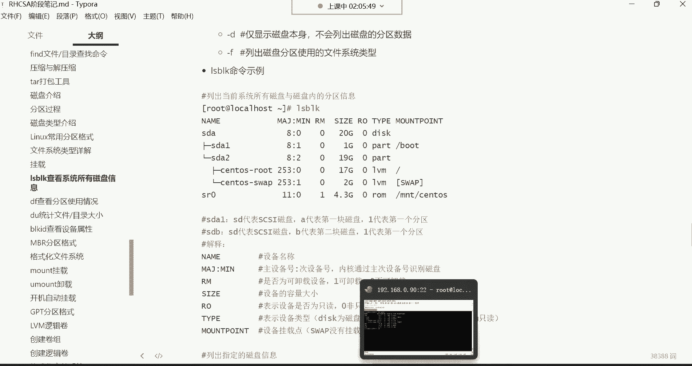
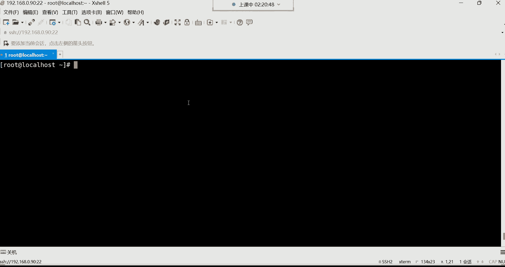

# 新盟教育-Linux运维RHCSA+RHC培训教程视频合集，全网最新最全最详细！ - P23：红帽RHCSA-23.磁盘管理、分区格式介绍、磁盘管理常用命令 - 广厦千万- - BV1up4y1w729

嗯，继续啊。呵呵。😊，接下来呢我们这个来讲讲这个磁盘管理。其实对于磁盘呢。现在在企业当中啊。如果要是你们公司用的是这个云主机的话。

一般这个。嗯。怎么说呢？对于这种硬盘，你都。

看你都不知道他长什么样子。😡，这硬盘的长相在传统物理服务器上面呢，我给大家去搜一个服务器的图哈，我给你们找找。😊。

那个。服务器。服务器硬盘。找这种图片。图片。来看一下啊这个。这个呢就是这个服务器的硬盘图片，就长这个样子哈，就长这样子。嗯。就长这样子哈，然后这服务器硬盘，我们说这就像一个这就像一块砖头一样，看到了吗？

跟一块板砖一样。然后对于这种硬盘的话呢。😊，现在在物理服务器上面哈，它在哪儿放着呢？😊，你看这不是服务器吗？看到吗？哎，这就是它的一块一块硬盘的插口，看到吧？这些都是硬盘插口哈，你像一个服务器。

像这种服务器的话，一个服务器上面的硬盘插口有可能有这个好好几十个插口啊，有12个的，还有这个16个的插口的。当然这要取决于不同的服务器。😊，非常多。

而像这种你看他们都是相互匹配的这硬盘直接能够插到这个插口上面。但是你得它这有一个什么有个开关，你一摁小按钮，它叭下就给你弹出一个什么呢？一个这个小开关，然后你把这硬盘给它插进去。

然后把把这个东西给它关上就可以了。这就是插硬盘的。😡，然后对于现在很多硬盘呢啊是支持热插拔哈嗯热插拔什么叫热插拔呀？😊，这热插拔就是我们拿着个U盘来说吧，这U盘应该都知道吧，就是你这电脑正开机呢。😡。

你把你的U盘插到你的电脑上面，你电脑马上就识别了。😡，这叫热插瓦，就不需要关机。😡，呃，现在这个热插拔就跟我们平时用那个U盘一样，U盘不就热插拔吗？😡，是不是叫在线插拔。好。所以在以前的服务器哈。

以前的服务器，这想换硬盘，它确实不支持这种。比如我服务器正在开机呢，我想把硬盘给它添加一块新的服务器识别不出来。😊，你想让它识别，你得把这个机器关机。然后再开机它就能识别到有新的硬盘了。

而现在很多硬盘就不用了哈，就跟插U盘一样，一插进去它就是能够识别出来了。这叫热插吧。好，然后这长相的话呢，里边长它这个硬盘里边的结构是什么样子的呢？我们来看一下啊，这里边。😊，嗯。

它这里边的结构就是大体组成，有这个这这我们叫主轴马达。叫周洲马达哈。对呃，这服务器用不用固态，一般看情况啊，得看情况哈。对，这就是应这就是对对对，就这样哈啊，就这个如如梦苏醒发这图哈。😊。

就把这硬盘直接插进去就可以了。然后我们说一说啊，像这种这个就像那个它里边的内部结构呢，这个我们叫做主轴，这叫主轴哈，就主轴马达干嘛的呢？转的。😊，然后这个硬盘里边呢有盘片啊，有盘片，现场拍照是吧？

这就是这个硬盘里的盘片。那数据往哪存呢？数据就往这个盘片上面存。就这盘片啊就跟光盘一样好，然后呢。它这个是什么呢？这个我们叫机械手臂，看到了吧？这个机械手臂，然后机械手臂上面这叫读写词头。😡。

那当硬盘就当你的电脑一开机，首先这主轴马达它就开始嗡嗡的转起来了。😡，它一转的话呢，那这个GJB上面的这个读写词头，你看它一转，这盘片不就跟着转起来了吗？那这个当你在往硬盘里边存储数据的时候。

它这个上面这个读写词头啊，就开始摩擦这个盘片啊，就那种摩擦摩擦摩擦就往里边就开始写数据了，或者说读数据啊，就开始动起来了哈嗯。😡，它就是大体这么一个过程，这是内部结构。然后这种硬盘呢，我给大家说啊，呃。

它这是里边是真空的。硬盘呢。呃，拆开个学习学习是吧，这硬盘你一旦拆开了，你就比如像这硬盘拆开了吧，我跟你讲这硬盘呢。😡，就用不了了，为什么呀？它里边是真空的。😡，真空。嗯，就不能进空气。不能进灰尘。

能理解吧，一旦进灰尘了。😡，它这个什么呢？一旦说进了灰尘了，就有可能导致这个盘片受损。一受损，数据就丢失了。😡，所以对于这种硬盘来讲呢。他都是这种真空的，一拆开，净空器好用不了了。能力吧。

就这种非常非常的这个。我们说怎么说呢？就非常矫情这种东西。😡，哎，因为毕竟这里边放的都是数据嘛，这盘片上面存的都是数据，都是企业里面的重要数据。啊，像银行里边，比如你的银行卡号。

一这个银行卡的余额都存在这个盘片里面的，能理解吧。当然那是数据哈，存到这盘片里面的。😊，中国造不出来是吧？这不有吗？联想的吗？这不联想的吗？但是联联想它这也不是他自己造的，它贴标。😡。

联想最擅长干的事儿不就贴标嘛？是吧，别人别人生产，他贴个标，这东西就变成他的了是吧？我们说叫柳传志是吧？这是柳传志，我们说叫柳大师最适合干的事情，就我们说就是就。😊，各种组合，然后贴个标。啊。

这是磁盘的大体组成嗯。然后这个磁盘呢，我们给大家说说这个有一些概念哈，这概念就是这个扇区这个概念嗯。他这个扇区的概念就是。怎么存数据呢？你看这一块硬盘。😡，它这一块硬盘我们是不是得分区呀？😊。

在这一块硬盘上面是划分一片一片的小区域啊，然后数据呢就往这一个一个的小区域里面去存。你比如说我要在这个硬盘上面，我划分一个10个G的空间。好，那这10个G的空间呢，硬盘在划分的时候，它怎么划分呢？啊。

他以善区为单位帮你去划分。就类似于这个一个小空格，这一个小格哈，你就把它列成是一个扇区。然后数据呢就往这一个一个的扇区里面存。所以说这个扇区它是磁盘在存储数据的一个最小的单元。

那这个东西你现在没有必要去了解的哈，你简单知道一下就行。那默认一个扇区可以存多少数据呢？512个字节。也就是说比如这就是一个扇区。好，那在这一个扇区里面可以存储512个字节的数据。

那我现在比如说我想划分一个10个G的。😊，空间出来啊，一个10个G的分区。那计算机它在帮你划分这10个G的空间的时候，它可不是说啊像我们人的思想一样啊，我直接给你划分10个G啊。

这一片空间就是10个G了，不是它得干嘛呀，它得这样去计算。哎，这10个G的空间由多少个扇区组成的。😡，他是这样帮你算的。😡，那对于扇区它怎么计算呢？啊，就是我是512个字节组成一个扇区。

然后多少个扇区能够。😡，组成10个G的空间。计算机他是量给你计算的。那是对于我们来讲，我们可能说我在划分分区的时候，我得算一下，哎呦这10个G的分区得由多少个扇区组成啊。

那你是不是还得计算一下这多少个字节才能组成10个10这么10个G的空间呢。然后你再去做各种换算呢，这非常麻烦吧。😡，啊，没有人这样算哈，如果这样算，那运维估计也就早都死光了。

所以我们一般在划对磁盘划分分居的时候，我们就自己指定我要划分一个10个G，我要划分20个G。100个G。嗯。柱面是啥是吧？呃，柱面在其实在就是支撑光盘的那个叫柱面啊。

其实你们现在看到这个什么这个我们说这个柱面，现在看到这个面就叫柱面。😡，它这个分两面，磁盘分两面，这这它分正反面，正面也能存数据，正面也能存数据，反面也能存数据。啊，这就叫柱面。Ha。😊，啊。

但是对于这个内部结构，大家没有必要去深入研究的。你说你又你又不是这个。😡，发烧友你研你研究它也没有用啊，因为这种东西你研究不了这种东西，你就花钱买就可以了。啊，买现成的。然后对于买磁盘的话呢。

现在有很多种磁盘的类型了，你像早期的有这种IDE接口的磁盘。对。😡，ID接口的磁盘注意我们说就是这个你在。😡，往服务器里面插这硬盘的时候，注意啊，这服务器对硬盘它有不同的接口型号，能理解吧。😡。

这服务器哈，它分它这个插硬盘的时候，的这它这个接口分不同种型号的，有ID型号的，还有哪些型号的呢？还有像这种啊什么ska型号的接口。😊，所以这每种接口你就得去买它能够对得上的那种硬盘。

你不能说果服务器的接口是这种sca接口的，你买硬盘是IDE接口的，它对不上就驴唇不对马嘴，能理解吧哈？而现在服务器里边你看不到这种IDE接口磁盘。在IDE接口磁盘，那在多少年前呢？可以说在。😡，嗯。

在09年的时候，这种在服务器领域就已经淘汰了，为什么呢？数据传输速度慢。😡，但是呢价格便宜，所以说这种接口啊不适合对叉P年代09年的时候，你想那时候哎呦，那时候就已经在服务器领域淘汰了啊。

所以那时候就已经主要应用于个人的家家庭计算机领域了。但。😡，注意是在那个年代应用在家庭计算机领域，哎，还可以。因为我们个人电脑呢也不是对外提供服务是吧？也没有呃什么对这个数据的读取速度啊。

或者说存储速度啊要求特别苛刻啊，必须得非常的快，那没有自己用嘛，无所谓。😡，那像早期呢，还有像这种sca接口的那是这sca接口的是。😡，从2013年的时候到201几年的。

是到2016到17年的时候是非常流行的4ca接口。呃，这早期主要用在服务器领域优点呢数据传输速度快。然后从那个时候哎从那个时候是从2013年到201617年的时候。

那时候scary那个接口的磁番就已经支持，我们说叫。热插拔了，就你服务器，你想你想添加硬盘，你不需要关机，直接把硬盘怼进去，它就能识别。😡，啊，但是现在你说这服务器还用skys吗？

现在这skys现在你也看不到它身影了，现在什么呢？哎，对，我们叫叫ss，这ss接口的。😊，这sars呢它现在是比较在服务器领域比较流行了。😡，对，还有什么这个ser接口的啊。

这种的话呢啊这个sta接口现在主要是个人家庭计算机领域用的比较多一些。那服务器呢偶尔也用。😊，主要都是什么呢？数据传输速度快。😡，啊，数据传速度快，还有这种SSD接口的。这种是固态的。

你像我们现在个人买电脑，你发现。😡，对哈，我们这个个人买电脑呢，现在普遍都是那种SSD这种。😊，这种类型的硬盘，为什么呀？固态呀价格贵。价格贵的话呢，一般它数据传输速度快，为什么快呀？😡。

它的特点是利用内存去帮你存储数据的这内存你想想。他这个。我们说在计算机硬件里边呢，最快的是CPU这CPU就像火箭一样。😊，而其次呢就是内存，这内存就像飞机一样。最慢的呢硬盘是吧？硬盘就像绿皮火车一样。

😡，那你想想。现在我们个人家用电脑。😡，就比如说在我的硬盘里边，我的电脑都是固态硬盘。😡，是5呃500多G固态硬盘。它其实就是利用内存的机制去报削存储数据，或者说读取数据的。所以速度要比这种。

那种这个像这种哈，我们叫传统硬盘。它比机械硬盘也快。😡，比机械的还要快，这种固态的，因为内存嘛。然还有这种像这个嗯还有这种这个NVME的，这种是一个协议哈啊，这是协议。对，像这种协议的话呢。

一般都是固态硬盘的一个协议啊，就是你的硬盘是固态硬盘，那传输速度可以走这种协议。NVME的啊，这是新流行的协议。数据传输速度快，都是利用内存帮你去传输数据。然后很多硬盘它就遵循这个协议。

遵循这个协议的话呢，数据传输。但是这种一般都是固态硬盘哈，遵循这种NVME接口的这种协议。然后它呢传输速度就非常快。😊，啊，那以上对于这种东西呢，你现在去买硬盘，你也看不到这种什么呃。scar跟ID的。

如果是服务器领域哈，你看不到。你卖硬盘时候，他就告诉你了，哎，哪个接口比较好，总之你这么去理解吧。😡，你说这个王思聪，人家有一台服务器，王思聪那那个服务器的配置是上百万。就王思聪打游戏的时候。

人家是用服务器打，人家不是用我们个人家的电脑能理解吧？人家是用服务器花100多万，自己配了一台服务器。你看他玩什么吃鸡什么的那从从来不会不会出现什么卡顿的情况是吧，为什么呀？人家配置高啊？😡。

所以说这个王思聪最经典一句话是什么呢？他说我对于我的服务器的要求就是所有的硬件都买最好的。😡，啊，对，所有的硬件我都买最好的。为什么呢？就是都买最贵的，他说最贵的，就证明他是有价值，他最好的。有钱人嘛。

人家就以贵来评判这个东西的好是吧？不差钱，对吧？所以人家佩胎服务器上百万啊。😡，H。😊，打游戏用哈打游戏用。嗯，各种博主上门安装是吧？没错哈，确实是上门安装哈，那确实是非常非常的给力哈，没你启动快是吧？

😊，啊，这是这个我们所说的这个硬件，只要你舍得花钱，你们公司舍得花钱，你放心，这硬件他肯定能够上得去啊，这玩意就跟你自己。去外外边组装电脑一样，你自己去外边组装电脑。😡，你只要把这钱花到位了。

你这电脑性能肯定不带差的。😡，所以这个东西不是你能决定的了的哈，公司只要舍得花钱。😊，那速度肯定就快。好，那这是硬盘的类型。那下边呢给大家讲讲这个分区格式。这个分区格式啊，就是有了硬盘以后。

你甭管是哪种硬盘，你都得对它分区才可以。你不分区，这东西它用不了啊。哼他没有办法帮你从手数据呀。😊，好，那接下来分区的话呢，我们来说一说用什么格式去对它进行分区。那分区格式呢像比较古老的。

有这种MBR的分区格式。MBR的分球格式啊，它最初只能划分4个主分区。注意，这要分区格式。就我有了硬硬，我有了一块硬盘了。😡，这块硬盘呢，你甭管。他是这个什么类型的，我现在得对他做分区吧，这一块硬盘。

好。那我们假设啊这块硬盘它的大小是多大的呢？那它的空间。他的空间是。一个T的吧一个T的。一个T的空间的硬盘。好，那接下来我就得对它去分区。那分区的话呢。如果说我选择的是MBR的分区格式。分居格式。

叫做MBR，这是非常古老的一种分区格式了。非常的古老哈。O。好，那古老的话呢。它的特点就是分区的数量会有限制，它允许我们划分多少个分区呢？它允许我们对这一块硬盘啊，只能划分四个主分区。这是一个分区。啊。

往上点哈往上点。好，这是一个分区，然后这是两个分区，这是三个分区。再网上的。对我windows电脑就是MBR哈。😊，三个分局了吧。再来一个哈。啊，这是四个分区。一个。Liangge。3个。好。

四个空白的分区。那得。我们来说一下哈这MBR它为什么只能划分4个分区呢？还有一个问题，就是这四个分区到底够用不够用啊？😊，到底够不够用呢？这是个问题是吧？😡，啊这四个分区呢如果换作我们个人呢。

他肯定够用了。你像我的电脑，我电脑里边。😡，他总共也没有多少个分区啊，所以我对于我来讲，我电脑就俩分区。😡，所以我我是够用哈。😊，嗯，但是你像。很多的这个我们说这个个人现在每个人的需求不一样，有的人呢。

😡，可能说这个爱好比较多，一般呢搞一个分区放一些，比如说我的C盘啊，这这就是你的windowsC盘。比如说我放什么呢？我放一些学习资料啊，这C盘一般不放学习资料，放什么，放你的系统相关的数据。

因为你在安装系统的时候，你所有的数据都在你的C盘。😊，啊，那一般的C盘就放系统了，别的呢也不放了。因为你的C盘如果说空间被占满了以后，你在启动系统的时候，你的速度会非常的慢。

因为毕竟你像你系统所有的启动的文件都在你的C盘装着呢，就你的整个系统都在你的C盘呢。😡，所以这C盘呢一般呢我们一般就装系统。那别的盘呢，比如说我这个C盘，还有我的这个E盘。哎，那E盘呢一般。😊。

放点什么学习的资料是吧？啊，学习资料。比如说这个上课的视频，学习的工具啊放在一盘了。那这可能说连如果说没有别的爱好的同学，这两个就够用了两个分区其实就是啊直接其实就两个分区哈。😊。

但有的同学呢他不一样啊，有的同学他爱好比较广泛呢。你比如说他喜欢打游戏，听歌、看电影，哎，这时候呢还得搞一个盘，比如我的这个F盘存一些。😊，F盘存一些这个什么那个。娱乐相关的软件是吧？对。

还有一些盘呢那比如说还有同学你像单身的、空虚寂寞冷的。比较喜欢看一些视频的一些同学，那还得专门搞一个盘，放一些老师的相关资料是吧？比如什么那个。波多老师，什么这个小泽老师。

还有什么这个最近比较流行的那些什么老师来着啊，那那叫。忘了哈啊是不是比较流行的老师啊，那叫什么来着啊，具体这个忘了放我的视频上。那你看这四个分区就没了是吧？这四个分区够用吗？可能对于个人来讲啊。

也不太够用。😊，那对于企业来讲呢，企业他放的数据呢，他也有不同的分类，也也也也是有不同的分类的。你比如一些备份数据的话。😡，那这个时候好变态是吧？那这时候呢四个分区不够用，不够用的话呢。

一般我们就得什么呢？想办法再去划分更多的分区吧。你说你这一块硬盘，你这一个T空间呢，你这一个T的空间，咱们就划分四个分区。😊，那感觉满足不了我的需求啊。😡，是不是满足不了非满满足不了非需求，那不行。

我们就得继续去想办法。所以这个MBR它后期啊。😊，他就觉得确实是分区数量有些少，哎，那我们就干嘛呀？增加扩展分区吧。这什么叫扩展分区呢？这扩展分区啊，它叫一个容器，我把它比喻成一个容器。😡。

那什么叫容器？这容器啊。也不难理解，这锅碗瓢盆瓶瓶罐罐的，这些都属于容器，就装东西的嘛。😡，你每天用的什么呃杯子。碗装东西的这都叫容器哈。所以也不陌生。那这个扩展分区它就是装东西的，装什么的呢？

我们就可以在这个扩展分区里边去划分更多的叫逻辑分区。那这个逻辑分区跟我们前面所说这个主分区。是一样的。就是。存数据的，而扩展分区它不是哎它是装东西的，装逻辑分区的。所以。他们之间的关系是什么呢？

就是他现在允许你划分更多的分区了。但是现在你这个。😡，你如果想要划分更多的分区。我这个数量还是只能划分4个，注意哈，它数量没变，还是只能划分4个。但是呢。什么变了呢？你的这个。

第四个分区就不要划分成主分区的这前三个都是主分区，都是主主一。主2。主3。都可以去用来存储数据哈，这主分区都是用来存储数据的。好，那第四个分区怎么划分什么呢？叫扩展。😊，就业容器。豁然分居。

扩展那它是不是编号是4啊，因为你它最终数量没变哈，总共就还是四个分区。但是。😡，但一旦有了这个扩展分区，这个容器了，那这个容器里边。可以让你干嘛呢？容器里边可以让我们去划分更多的分区。他这个容器。

你在这个容器里边，你再去，比如说我还需要划分多少个分区啊啊，我需要很多的分区。那这时候咱们就在这个容器里面去划分了。把这个容器换个颜色，不能跟主分区是一个颜色。换个蓝色吧。然后这个呢我们换成这个颜色。

这个就是。扩展。扩展了哈扩展几呢？扩展五了，这就扩展5了哈。😊，嗯，然后那这个呢因为它这个编号哈，它这编号是不允许重复的，能理解吧，不允许重复的哈。对，123，然后扩展是4，然后这是5。😊，啊。

这就不是扩展，这叫什么？这叫逻辑，这叫逻辑分区。😡，逻辑哈逻辑。😊，喊口号呢是吧？我这个。😊，我们说叫什么？这叫精神食粮，懂不懂？什么叫精神食粮呢？😡，啊，逻辑6。然后罗辑恩。罗继恩哈。

我把这个呢给他拿走哈。😊，放到这儿。好，这是扩展分区了哈。😊，对磁盘空间。磁房空间一个T。那这儿我们来看一下啊，这时候就是说。有了这种。功能以后，我们就可以继续去划分更多的分期去存储数据了啊。

逻辑多少逻辑N。那这个N到底N到多少个呢？也就说最多它允许你划分多少个这个逻辑分区。啊，这个呢看磁盘类型。最终他这个特点就是这样子的。你看我现在可以有多少个分区去存储数据了，这个你要搞清楚。

主分区跟逻辑分区都是用来去存帮你存储数据的。就是现在他允许你拥有更多的分区了，允许你划分更多分区了。啊，只不过这个更多的分区是从扩展之上划分的。那首先你得明白是不扩展分区空间越多。

逻辑分区划分的就越多呀。没错吧，哎，因为它是容器嘛，你容器越大，在里面装的东西不就越多吗？😡，好，那接下来那到底可以划分多少个逻辑分区，有没有数量限制？有这一般呢看磁盘类型。磁盘类型，这里边呢我写了。

呃，如果是IDE的，当是这个已经是非常古老的了，我们现在已经淘汰了，最多可以划分59个逻辑分区。如果是scary的。那像这种的最多可以划分11个。那如果你说老师如果是别的接口的呢，差不多也是1个。😡。

差不差不多也是11个哈。😊，那这个呢总之现在他允许你划分更多的分区了，这一块硬盘其实11个分区足够你用了。你想注意，我们说的是一块硬盘。😡，咱们说的是一块硬盘哈，而在企业服务器上面。

它不可能说只有一块硬盘吧。没错吧，咱可能说是很多块硬盘。😊，是很多块硬盘哈。而我前面给大家讲的是一块硬盘，它允许你划分。😊，非常多的分区。能列害吧。一块硬盘是现在允许你划分10多个。十多个了。

那也够用了吧。好，好，那接下来呢我们再来说什么呢？再说说它这个空间，现在分区现在数量可能是变多了。但是它有个致命缺点，致命缺点是什么呢？就在这儿。😊，这个致命的缺点最大支持2。2T以内的一个磁盘容量。

也就是说，我如果用MBR这个分区格式去划分这块硬盘的话。你的这块硬盘的空间一定要是在多少呢？在2。2T以内。2。2T。以内的话，我才能够。支持对他划分。能列吧啊，是这样子。那你说那在企业里边。

那企业服务器硬盘有可能是比如说我三个T的，5个T的，8个T的怎么办呢？咱们就拿右边这个硬盘来说，比如我右边这个硬盘，我是8个T的。😡，8个T的。H。8个T硬盘，那你用MBR，你分区格式，它就不支持。😡。

他没有那个能力，你你就这么想，他没有那个能力，主要是。😡，那怎么办呢？那难难道说我这买买一块大硬盘，我还没有办法对它进行分区了呢？😡，这也不行是吧？那怎么办？哎，这个时候我们可以用什么呢？

用叫GPT的分区格式GPT。他呢。比较适合划分大容量的磁盘。啊，这个扩展容器KPS是吧？这今天不行啊，我们这这KPS跟容器不能放在基础阶段库去给给大家说这些事情，这同学都懵了嗯。😊，嗯。嗯。

你你如果说想了解容器跟KPS这个翟帅同学哈，你可以干嘛呢？咱们这边啊。😊，是这样，就是我们这个机构呢，现在正在准备一些什么呢？就是对学生做一些这个一对一辅导的内容。你们知道什么叫一对一辅导吗？

就比如说你说老师啊，哎我想这个了解了解哪一部分的内容。😡，但是呢我想让老师给我做一个一对一的辅导，你说看咱们机构现在能不能。啊，一般呢这个现在我们正在规划这种一对一的辅导。

就是比如说你学习某一个阶段的技术点的时候，你说老师这个阶段技术点我没有掌握的太明白。到时候你可以跟谁呢？跟对应的班主任，你去问问你说老师，我这个这个这块位置的技术点，我没有。😡，理解的太明白啊。

能不能啊这个老师给我做一节一对一的辅导。啊，不花钱哈不花钱补课哈。这不都交学费了吗？你们不都交学费了吗？😡，教学费还花什么钱补课呀？就是只要是这个老师在这个。

有这个时间的范围内哈啊都可以哈啊都可以给大家做这种辅导啊。但是现在还没落实呢，这个具体还没落实，到时候你们得去咨询这个木木老师。😡，嗯。好。😊，嗯，行了哈，这当是这个具体能不能实行啊。

这个是我们昨天经过开会啊，探讨了一下啊，准备要尝试一下啊啊，对，非常银性是，准备要尝试一下。😊，😀哈哈。😊，只要目前没时间是吧嗯。😊，好，那咱们继续啊，我们继续说。那这时候我们怎么办？

我们如果说有1块8个t的硬盘，这个就得用GPT的这个分区格式。这个GPT的分区格式，它的特点是什么呢？就是看哈。😊，可划分128个主分区，128个主分区。也就是说，如果你用GPT去划分一块硬盘的话。

就这样玩哈就这样玩儿。😊，这是不是都是主分区啊？😡，这都是主分去吧。你就这样。对主分区N了哈主分区N了哈。😊，就这样，就是总之就是网上以此类推去。划分就可以了，能列了吧，准问句N。换个多少个呢。

看你的需求呗。😡，只要你有这种需求，你就划分就可以了。所以说这个GPT的话，对啊，可以任性划分。你想划分多少个，这个呢看你自己的需求。所以说这个对于此你也不需要像左边的这个MBR一样啊。

你说我还得去搞什么扩展分区。😊，然后在扩展分区里面再去搞什么逻辑分区，这听名字就不适合人类去理解的名字，是不是啊，这什么名字，这适合人类去听吗？😡，呵。啊，所以说像这个GPT呢就比较简单粗暴一些。

你就划分就可以了啊，我支持你这么划分。😡，简单粗暴一下。所以对于这个GPT分区格式呢还是蛮不错的蛮不错哈。😊，好，那。对于GPT呢，它也是除了这个空这个分区可以划分的非常多以外，容量呢也非常的给力哈。

😊，对，肉头啊，什么还有什么逻逻辑卷哈。😡，这个我们再说说这个空间。像这个GPT这个分区格式啊，它最大支持18EB的磁盘容量。哎呦，这18EB的磁盘容量，我们说这到底多大呀？😡，磁盘空间18亿币。

我得给大家来说一说哈，哎呦它这个空间是这样换算的。首先呢。😊，1024个字节。字节哈等于多少呢？啊，但会我就简写哈，字节是等于这个。😊，1K。10就1000多个字节是等于K的。那下边是还有什么呢？

还有就是那个。1024K如果是1024K的话。啊，但是这个我们用中文吧哈字节。我觉得我写的好像不是很准确哈，那个。😊，这个哈呃等于K，然后1024K呢等于多少呢？等于一兆。😊，一照。然后1024兆呢。

1024兆等于。一个G。1024兆等于一个G的空间。一个G的空间。那接下来以此类推的话，那如果是1024个G呢？好，如果是1024个G的话呢。就等于是一个T。你个屁哈。好，那如果是1024T呢。

那要是1024T的话呢。这中间还有一个单位呢。叫P。有叫PB的单位TBGB。他是这样子的哈，你看。也就是说在这个E币这个单位之间，比如我这个磁盘空间啊，18E币的话。18亿B的话。

那你想这空间得多恐怖啊。得多么的恐怖啊，你想象一下是不是？哎呦你看这。😡，一个就1000多个T。😡，才等于1PB。那你说这EB的单位。😡，怎么怎么换算呢？是1024PB。1024PB等于。1亿笔。哎呦。

你想想这空间，我们说我们说就这个空间啊，你如果真是有一块18亿币的磁盘，我可以这么说吧哈。😡，能放好多视频是吧？对呃，咱甭说能放好啊，这放好多视频，那得放多少视频呢？

你就这就比如说你这人可能说你爱好比较广泛，那他可以帮你把这个比如什么这个全球，那都得是各个国家。😡，各个地区，那不是各个种族，各种肤色的。😡，嗯那些老师啊，而且都得是那种高清五码4K的。😡。

都能存得下了。你像这18EB就非常恐怖了吧，是吧？当然我们说这虽然说我们不会去存那些啊什么。😡，高清无码的视频是吧呃，但是我们就。😊，简单就是给大家这个形容一下，就这空间非常的恐怖。

但如果你真的是能把这些视频都给它收集过来。那我相信对于你来讲。那你这我相信你的经验哈，那可以说是非常之丰富了哈。对你这你的经验我可以说是那那什么这个姿势什么那个动作的是吧？

我相信对于你来讲那都不算什么哈，因为你懂得太多了是吧？对知识非常的广泛啊，知识非常的渊博是吧？啊，恐怖是吧？对啊，😊，好了，这我们就简单描述一下啊，这对于我们来讲呢，我说这简单形容一下啊。

对这空间非常之恐怖哈。但是呢他可以帮你去划分啊，能划分啊，是不是啊？😊，好了，那两种分区格式啊，所以说对于这两种分区格式，我们就得说一说到底用哪种呢？咱们两种都学啊，我们是两种都学啊。

然后最终呢你在企业里边，如果说哎咱磁盘容量比较小的话，哎，你就可以选择用这种MBR的分区格式，但如果遇到大磁盘，咱们俩咱们就啊选那种GP的分区格式不就可以了？是吧？哎，这就看看个看一个具体情况就好了哈。

这些东西没有什么绝对性可言。😊，好了，那下边呢我们就来这个再来给大家讲讲什么呢？再来讲讲那个我们知道用哪种分区格式去划分了是吧？那分区格式怎么用？😊。

啊，怎么用？咱们呢来给这个机器添加一块硬盘哈。😊，我们添加一块硬盘。

但我们这个添加硬盘得关机，这虚拟机啊好像不支持这种什么呃。😡，什么在开机的时候添加硬盘，我试试哈，我看看允不允许吧。如果允许的话，就最好。

哎，等一下啊。啊，对我们看我我这个机器能不能实现一个热插拔的功能。这虚拟机有的时候好像不太支持这功能。

右击。设置。啊。啊，医医一疗这种事情就都不困了，是吧？😊，医到这种事情倍兴奋。😊。

为什么倍兴奋呢？就感觉好像跟我有什么关系一样是吧？我们添加一块哈设置啊。😊，不支持是吧，添加硬盘下一步。scarity啊SATA但是我得给大家说一下，你看咱们虚拟集里边是不是很多种磁盘类型啊？😊。

这很多种磁盘类型啊，这个我们当初啊注意啊，是不是默认就是sca类型的呀？那你这时候就不要再选择这种sta类型的了。如果你再选择sta类型的。😡，他可能说就是出现一些不兼容的情况。😡，我们来试一下哈。啊。

它提示只有在虚拟机电源处于关闭状态，才能添加这种磁盘ID的啊，那我们添撒ta的sta看可不可不可以啊，下一步创建虚拟硬盘是吧？😊，嗯，下一步。多少G呢？100个G。100哈就写100就可以了。

然后将磁盘存储为单个文件下一步。😊，名字啊叫这名字。完成。确定。正在还原虚拟机状态。

好哎，好像可以了哈，好像是可以了。我上去看一眼瞄眼哈。

用这条命令叫L拉4block。回车。哎，同学们哈来看一下哈。😊，可以哈可以。😊，呃，而且我们添加的类型好像也不太一样，是不是？咱们说一下，我刚刚敲这条命令叫LS。😊。

BLK这条命令。这条命令干什么用的呢？😡，这条命令来看一下哈，它的全名对，热茶拔是吧，可以了哈，它的全名叫做leaase block。😊。

这类子就列出block就块的意思，用于列出当前系统所有的磁盘信息的。列出来了吧，就是我们刚刚添加一块硬盘，是不是就直接热插玩就没有关机就添加上去了。你看识别上了吧，磁盘名字叫SDB这SDB怎么由来的呢？

😡。

这个SDB啊是磁盘的名字。什么名字我给大家讲讲他这个名字怎怎么个由来法哈，看看我这边写了。😊，这个S呢，它这个前面哈它既代表是这个scary啊，又代表s塔这种类型的。😊。

所以S呢这得看你当因为你当初买磁方时候，你自己应该知道你买的是什么类型的。所以这个S呢它如果是ss的呢，它也是用S来表示s塔它也是用S来表示的。所以这个S就代表示你的磁盘的接口类型是什么类型的。😡。

啊，磁盘类型。那后边你看我们这个磁盘，你发现这后边什么什么什么SD，这到底是什么东西啊？这D是什么呀？😡。

这D啊代表你的这个第几块磁盘，如果是A的话，就代表你这是你的这个。第一块磁盘，如果是B的话，那就代表是第2块盘。😡。

但是我们这种我觉得我这机器啊啊SDASDB是不是啊？那你看一下这个A的话呢，就是第一块盘。这个B就是第2块盘啊，等会儿啊，这D啊这D哈，我们说这个D哈，这D。😡。

对SD。它代表是这个sca的哈，这前面两个字母哈，少说一个SD哈，代表是它的磁盘类型啊，是接口类型啊，它也不是卡，就是它的那个接口类型SD。😊，那后边那个A呢就代表你是第几块盘了。

然后你看我们现在看到这个是什么呀？是不是SDSD就是我这个磁盘类型啊啊，但有可能是沙法，也有可能是。

这个肯定是第一块盘是scar的，我们第二盘是sta的，自己添加的是吧？😊，然后后边这个A我们就可以清楚的看到这个A就是你的第几块盘，我的第一块盘。那这个呢B呢就是第二块盘。那如果再添加一块呢。😡。

你比如我们现在再添加一块啊，咱们把这机器再来一块。😊，右击设置。对我们看他这顺序它是怎么怎么排序的。

哦，选择你看我们这硬盘是s发类型的了呀。好，然后我们再选择添加一块硬盘。😊，好，下一步。啊，杀他类型的。这时候呢下一步注意啊，这IDE它告诉你了IDE的不能。😡，是热插吧哈。只能关机，然后下一步。啊。

这儿。呃，是啊，这不用管哈，就新建虚拟磁盘。我们是不是得选择我们是不是得选择新建磁盘呢？不能使用现有磁盘吗？哎，下一步。😊，好，接下来呢存储为单个文件就行了，再来100个G空间。😊，100。下一步。

完成。好。确定。

呃，不会变哈，你删除的话，名字它不会变。没事儿，我们到时候都可以试一试。因为我这个虚拟机啊，我还真是我以前净添加scar了，撒他的话呢我还没添加，所以这还真是我们说这大姑娘上吊头一次啊。😊，嗯。

那我们就看看在使用方面到底有没有区别，好吧，嗯，反正都是头一次。

这样我们再来看有没有识别LS4变了K。变成多少了，是不是变成C了呀？所以它这个顺序就是什么呢？就是ABC就代表。😊，第几块盘A就是第一块，B就第2块，C就是第3块。

然后它这个SDSD就代表你的磁盘类型啊，有可能是scarted的，也有可能是s的啊。这S哈SD只要是S开头的。那这就你得看你自己哈，因为因为你在花钱买硬盘的时候，你还自己心里还没数吗？😡。

然后其实哪种接口类型啊，其实也不是很重要。呃，别的话呢我们再说说像早期的那种IDE接口的。😊。

那像早期IDE接口的磁盘呢，呃它是什么开头的呢？有有人知道吗？以前那个IDE接口的磁盘，我去搜一搜哈，我也忘了。因为真的是你想09年就在服务器里面淘汰了，我都。😊。

哎呀。我都我都几乎没用过那个IDE的磁盘。😡，我们搜这个叫磁盘。名称。09年你还在玩玩泥巴是吧？😡，啊，你是你是NVME是不是？不是哈，你那个你那个NVME。NVNVME它想什么呀？😡，SD呃，然后。

分区编号嘎这SDSD。嗯。他这个。啊，哎，以以前早算了，我们不搜了哈，他爱叫什么叫什么，跟本也没有太大关系的啊。总之你就知道它这个S啊代表什么意思就行，能理解吧？啊，SD开头的代表你这个磁盘的类型啊。

就你的磁盘类型，后边就是你的磁盘的一个编号好，那这个编号里面的一是什么意思呢？这下面这怎么还有个一啊，是不是啊一跟2啊。😊。

这代表分区，这是分区编号。这个分区编号。就是你这个硬盘上面有几个分区，你看然后它是以此类推，1234。那我们看我们这个机器里边这个SDA这块盘有几个分区啊，有两个分区，是不是？

两个分区哈SDB跟SDC这2块盘呢没有分区。😊。

没有分区。然后接下呢，这个对于这个LS。

block这个命令啊，它还有一些选项。把这长的选项。

我们把这个选项拿过来。第一个杠D，那么阿拉斯block杠D你跟上。当然这磁盘我们添加好以后，你知道它在哪个路径吗？在系统D一V下边。DV这个路径就是存放所有的硬件的一个路径。

在这里边你你就直接输入SDB就可以了。回车。看到了吗？这个时候它就给你显示出来了这个SDB它本身的信息。😊，然后这个里边呢这是磁盘的名字吧，然后这size sizeize是磁盘的大小100个G类型。

DISK代表着磁盘。这DSK啊它类型是磁盘类型。

那前面这些是什么东西呢？我这笔记里边也写了，大家没有必要去研究它哈。😡，啊，就是什么主设备号跟次设备号。但这种东西呢，你就没有必要去深入研究它了。内核识别的内核通过这个设备号去识别这块硬盘。

而后这个RMRM呢代表是否为可卸载的设备，一是可以卸载，零是不可以卸载，能不能卸载我们这个。😊。

不可以卸载，因为你还没用呢，你还没用，你还你卸个毛啊，是不是？😡。

好。啊，我这个00是一是可卸载，零是不可卸载哈，在这儿。

不可卸载。然后这个RO代表是它的一个权限啊，权限的话呢在这里边表示设备是否为只读，零是非只读设备，一是只读设备。像这种硬件设备的话呢，我们说这个非只读跟只读的话。

你像这个。他定的是零是吧，这非止读设备。

就这东西你可以往里面去嗯非止读啊，这个词汇怎么去怎么给你们解释这个词汇呢？非止读。😡，呃，就是。除了读以外，可能说啊你还可以往里面存储数据啊，可能是应该能能这样去解释哈，但你没有必要去理会这些东西哈。

这些东西的话呢，对于我们来讲也不是什么重要的信息啊，你就。😊，对哈，就是你可以往里面存嗯。😊，对以这种类型的话呢，你就看它是磁盘类型的。然后下边的话呢，F呢我们再加F哈，再用F去看一看。😊。

这F现在它没有文件系统啊，当然这是分区是列分区的这你得比如说我们拿这个SDAE来说啊，我看这个SDESDAE，你想看看它哎，这个时候呢我们可以清楚的看得到它的一些什么。SDE这个什么呢？

它的一个文件系统类型，这个叫FS。type就是它的文件系统。我们一会儿再给大家讲讲什么叫文件系统是吧？然后这个UUID这UUID就是这个设备的一个身份的一个ID号唯一标识。然后这就是它的一个挂载点。

就是这个分区在给哪个目录在存储数据，我们叫挂载点。我一会儿也会给你讲什么叫挂载好吧，先知道这个LSblock这条命令的功能，主要我们最常用的就是直接这样LS block。😊。

直接看看我当前系统里面有多少块硬盘，还有多少个分区。这是看硬盘。然后看分区能列吧，然后每个分区它在为哪个目录在存储数据。可以看到有根分区，有bo分区。呃，分别是用哪一个？这个根目录跟不同目录啊。

分别是为是用哪一个分区在存储的这个数据。那其他的话呢，我们到时候再讲啊，然后接下来我们再来说说这个叫DF这条命令。DF命令用于查看文件系统的一个使用情况。哎呦，这文件系统我们现在还没有涉及，是不是啊？

没关系啊，这条命令呢主要就是看我正在使用中的分区DF直接敲回车。

他现在可以帮我们看我正在使用中的这个分区，而没有使用的那个磁盘信息，它列不出来。他并你他并没有告诉你这个系统里面有多少块硬盘吧。😡，所以它这里面呢可以帮你列出，就是你这个不同的分区在用的文件系统类型。

是什么类型的文件系统？但是文件系统我现在还没有讲。😡，所以这个位置呢，大家先简单知道一下DF这条命令。😊，它主要是看文件系统的那可以看到这个根分区。他在用哪个文件系统在存储数据啊。

别的分区它具体的文件系统类型是什么啊，这一会儿再说哈，你先不用现在先不用去管了DF命令。

然后我们再说这个。叫BLKID这个名叫查看设备的属性。哎呦这个看block IDD这命令怎么用呢？这个你直接。😡。

跟上设备的名字就可以。block IDD，我要看DV下的SDB。S是DA吧。

好。那它这个属性的话呢。我们说一下哈，它能够列出设备的名字，设备UID还有这个文件系统类型。但是我们现在看的是什么呢？是。😊。

这个硬盘，但如果你要看分区的话。SDAE哈，你看它的功能啊跟前边的那个什么呢？呃，我前面讲一个那个叫做。

被告。LS。它加一个这个杠F这个选项的功能其实是一样的。

那。LSb啊，杠F跟上DV下的SDISSDAE你看这效果好像一样是吧，都有哪些呢？呃，block ID呢它列出这个分区的。首先它的UID那这UID呢，我们用这个选项杠F也可以列出来。

是不是一模一样的呀啊，然后以及它的文件系统类型。😊，这儿呢文件系统类型，还有这个分区的名字。但是呢它唯一没有列出来，就是它的挂载点，就是这个分区在给哪个目录存储数据，这是它的唯一的区别了。

所以在这个里边呢，大家在记的话呢，嗯我告诉你们这几条命令我们怎么记哈。😊。

如果说。你想看你系统里面总共有多少块硬盘。有多少块硬盘就敲这条命令。泥鳅。

好，清楚的看到我系统里面总共多少块盘。包括没有分区的硬盘，他都给你列出来了。看到了吗？这是不是没有分区的2块硬盘呢，以及已经分区了正在使用的。包括分区的信息，是不是都给都都是不是都给我们列出来了呀？好。

就是说想看所有的硬盘，就敲这条命令。那我想看具体的。每个分区它的空间的大小。

给大家补充一下哈，在这儿这条命令。😊，我们说这个。通俗。通俗的解释。然或。通俗呃通常的用法吧。通常的用法。这样可以哈，通常用法。对，是查看。系统中。硬盘的信息。啊，包括。有多少。块硬盘。以及每个。

硬盘的。分区数量哎，这时候比较好理解了呀啊，有多少块盘，以及每个硬盘有多少个分区是吧？就敲这条命alless block直接敲就行。😡，好，那这DF命令呢，它可以查看文件系统的使用情况是吧？

这个命令你这样，比如说我现在我想看看我的根分区，这根分区不是在使用。😡。

这根目录不是在使用这个分区在存储数据吗？好，我想看看我根分区的一个使用空间。哎，DF回车。😡，看不懂啊，加个选项DF杠H。这个时候你看啊它会帮我们列出呃，当然也包含根分区。

只要是正在使用的分区都给你列出来了。我的这个根目录正在使用这个分区，它的一个什么呢？它的一个容量。😡，总共的容量17个G，已经使用多少容量了，1。2个G还可以使用多少容量16G，然后它们的一个百分比。

这个是已用的百分比哈。好，那你说DF这个命令是不是就比较适合查看我正在使用的分区的一个容量信息啊？

所以说。这个命令我们是叫。通俗嗯，我们前面是怎么标记的哈？叫通常用法。通常的用法。是用于查看具体的。分区的一个使用。情况。这样能理解吧，每个分区它的一个空间利用率啊，我们就简称叫空间利用率吧。空间的。

一个资源使用率。这这应该是比较好理解了是吧？通常的用法。然后这个度命令呢这个度命令我们前面用了是吧，但是它现在了来详细说一说，叫统计磁盘下目录文件大小。我想看一个文件有多大。😡。

那杜。杠H这个选项杠H这个选项主要是以人类一读的方式去显示文件大小，以怎么人类一读呢？K召记的方式，就还是拿我们前面那个文件来说，ETC那个service这文件。

如果你这样统计的话呢。他这个6656是吧，你加个杠H。杠H656什么呀？哎，656K，不然他不告诉你656什么没有单位，所以加H啊，它以什么呢？K着G的方式给你写上这文件大小。😡。

那你说那LSLL不也可以吗？你如LL跟上那文件是不是也一样啊？😡，再补1个H。补1个H选项。你说它是不是也可以正常显示这个文件大小啊，什么655K啊，你说那这两个命令有什么区别吗？😡，有区别哈。呃。

如果你在统计一个目录的时候，我们来看啊LL路我们杠DH。D是只显示目录本身是吧？H是显人性化的显示大小。比如说我统一ETC的目录。😊，你看8。0K。是不8。0K啊，那如果你换成度呢，度杠H。

那他还有个选项叫S。S是只统计每个参数的总数，什么意思呢？就是我直接把整个ETC下边的所有数据都给我统计出来。😡。

就直接加个S就可以了。那咱们看一下啊，你看这明明都是可以看一个文件的大小。为什么LS它看到大小是8。0K怎么这么小呢？是吧？你回忆一下。😊，就我们刚刚看的那个s那文件，是不是都在ETC目录啊？😡。

是不是理文件？光它的大小是不是就655K呀？但是我现在统计整个ETC目录，为什么它才8。0K啊？😡，怎么这么小？而下面度统计完以后是31兆呢，这个应该比较靠谱一些是吧？就是它统计整个ETC目录的大小。

所有文件哈。😊，做文件。那如果你不加S的话呢，你不加S，它就什么呢？直接把所有东西都给你显示出来了，看到吗？你ETC你这个ETC目录下面的每一个文件大小是不是都给你统计出来了呀啊，但是加S以后呢。

主要就是哎值给我统计个总数就行了。我就看总数。😡，哎，这时候你说这差在哪儿呢？你LL杠DH。这就不一样。哎，里面文件内容不统一吗？没错。😡，这L啊，他在统计一个。目录的时候。

他可不会统计目录里的文件的数据的。因为文件的数据。他不管。😡，那它统计是什么呢？在ETC目录下边，每个文件的名儿注意啊是这个文件名儿。总共占我这个目录的空间是多大的？所以这就是它的区别。能理解吧。

他不统一文件内容哈，所以你这要明白，你说老师我们前面学过LS命令，这还学do干嘛呀？😊。

这你得搞清楚哈，这度跟LS的。区别在哪里？啊，这度是统计文件大小的而block IDD呢这个命令我们后期看什么呢？我们后期主要是用它看一个。😡，嗯，分区的。文件系统类型，分区的文件系统类型。

其实这个你也。不一定非得干嘛呢？不一定非得用它，就是阿拉b也可以。😊，查看多少个硬盘是吧。以及。呃，分区的。具体信息对杠F就可以了。所以block呢大家可以记，也可以不记。

因为毕竟功能都差不多，是不是啊？杠F。跟上DV下的SDADAE。好，是不是都一样啊？文件系统类型啊，所以这个呢就看情况哈。看情况，然后不呃这个。KID block ID。跟上。效果也是一样的啊。

只不过它的类型呢显示在这了显示在这儿了哈。😊。

其他呢就没有什么区别了，没有什么区别啊。所以在这里边再做一个小做总结。😊，这时候你们应该能够清清楚了哈。😊，我想看我系统中有多少个硬盘，以及每个硬盘有多少个分区，我就记这个命令阿拉斯别拉K。好。

我想看我想看我具体的每个分区的一个，比如说它的一个使用率，分区的使用率。😡，我有哪个DF。哎，查看具体的分区的使用情况。我就DF。啊，通常加杠H哈。杠T呢是显示每个分区的文件系统也可以。

那我要统计文件或目录的大小，我就用度。😡，不用度。那不这个block ID呢就看情况了哈，这就一个可选的了，能列了吧。那现在我们说这条命令跟这条命令，还有这条命令，就是对于磁盘管理的。😊。

财务命令现在搞清楚了吧。OK了吗？O给我刷个一上来这三条命令哈，现在是不是捋顺了呀，分别能干什么事了呀。😊，好，OK是吧。😊，好，行了，那接来呢这个MBR怎么分区？因为我们已经添加硬盘了呀。

咱们这个添加是s硬盘是吧？我们LSLS block列出来了，我们这有2块硬盘。好。😊。

那这时候我要对他分区。那一会儿呢我们来说说MBR分区啊怎么分行吧。我觉得应该休息了。啊，一个小时是吧，我们时间掐的还蛮准的是吧？我们休息一下，回来呢，再讲讲怎么分区，好吧，休息一下哈。😊。

