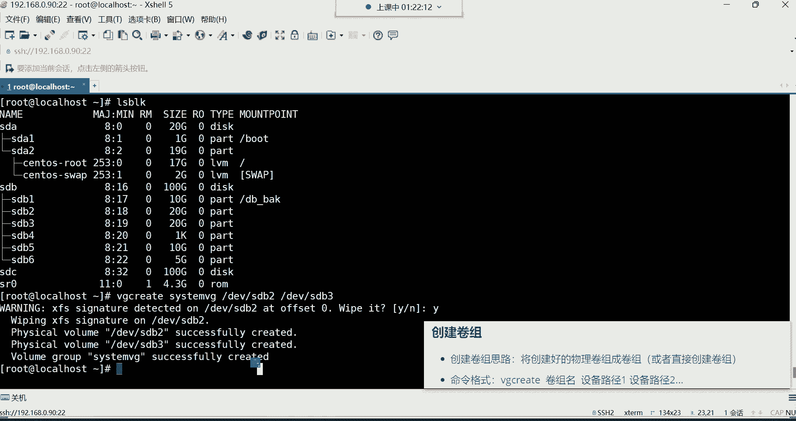

# 新盟教育-Linux运维RHCSA+RHC培训教程视频合集，全网最新最全最详细！ - P26：红帽RHCSA-26.开机自动挂载、GPT分区、LVM逻辑卷 - 广厦千万- - BV1up4y1w729

比说一个叫虚拟技术，虚拟技术，而最终的数据还得需要这底层物理硬盘来支撑。但没关系，后期可以有办法解决，能理解吧。那，你先先不用去关心这个物理硬盘的事情。我们现在就说这逻辑卷的空间可以不断变大。

那如果有一天你说这个。增加增加增加已经增加400个G了，那这时候还能增加吗？😡，好像不能了，为什么呢？因为你要知道逻辑卷的空间从哪来呀？逻辑卷的空间是从这个物理硬盘这400个G的空间里面来的。能列吧。

就是说我们如果想扩容它的空间的话，是可以扩容。但是你得知道这空间从哪儿来的。扩容的这个空间呢，它是从这个。虚拟硬盘里面来的。所以如果我们想要对这个逻辑卷的空间进行扩容的话，你的虚拟硬盘空间必须得。

够用才可以。那虚拟硬盘如果不够用呢？虚拟硬盘如果不够用，没关系，咱们还可以怎么玩呢？就是我们可以直接。搞一会儿。大的硬盘。啊，如果你有需求的话，这是一块物理硬盘。如果我们要真的是有这种需求。

比如说这这块硬盘空间多少呢？比如说一个T1个T的空间哈。😊，这是物理硬盘。空间U个T。好。那你还可以直注意，我们可以直接把这一个T的空间给它扩容到这个。虚拟硬盘里面也就是说它不一定非得是一个分区。

一个分区的往里面扩容，它是可以支持整块硬盘的那你把这一个T的空间，如果一旦扩容到这个虚拟硬盘里面，它的空间是不是变大了？是不是他就不是一个T了吧，他就不是1024G了吧，是不是是多少呢？是。

是1064G了。是不是啊那空间他就变大了哈。好，那他的空间一旦变大了，那我再想对罗玉娟的空间扩容，比如我再给你加500个G可以吗？😊，可不可以非常容易。是不是？对。不需要格式化，注意啊。

这些东西都不需要格式化。什么时候格式化呢？逻辑卷需要格式化。也就是说，如果说你一个分区，一个分区往里面增加，没关系，你这个分区用什么？😡，用什么分区格式格式的都无所谓。

因为最终我们要在这这个位置赋予逻辑卷。一个文件系统。啊，他需要文件系统哈他需要一个文件系统。所以这物理硬盘你什么都不用做，你只要把硬盘给它放上去。让服务器一识别。

我们就可以把这个物理硬盘或者说分区这分区就是你只要给它分了区了就可以了。啊，一分区我就给它增加进去就可以。他是这么回事。好，这就是我们所说的逻辑卷。你们记住哈，这个没有什么乱不乱的。

你就记住它主要的特点就是可以实现空间的扩容就可以了。他主要的因为场景就是空间扩容，知道吧？好，那怎么做逻辑认非常简单。呃，这里面有一些命令。

啊。不是14。啊，是对，14哈1424哈嗯1424。原先是原原先是原先是400个G是吧，不是哈。😊，啊，是是142G。没错，你这账算的没毛病哈。😊，那怎么做这个逻辑卷？好来哈。第一步我们用什么呢？

咱们这样吧。😡，呃，我们怎么给大家演示呢？咱们直接搞一块硬盘，然后再搞几个分区，行吗？😊，我们把前面的这这些哈这个挂载给它卸掉卸掉。把配置文件改一改ETC下的FS table打开文件以后呢。

咱们把这个哈把这个给它删掉X啊，直接DD吧删掉，然后保存退出。退了以后呢，给它卸载掉Umount把web。back给它卸掉。好，这时候在DF杠H看一下。好，被我们卸了。卸了以后的话呢。

我咱们把这块硬盘这几个分区给它删掉，删掉哈。我们一会儿把这一整块硬盘给它添加进去。所以我们现在就GD4K。😊，对指定第一文线的SDC。怎么删呢？删是不是啊获取一下帮助吧哈，他有个D。😊，D这个选项。

他就是删除的。像我这个。算了，那我就直接给你们解释吧，你看叫deele分区啊，就删除分区用的那这时候我们就D，然后回车删除第几个呀删除第三个，然后再D删除第二个。在D好删除第一个好，W保存YOK。

这时候L。block看一下，那现在这个SDC这个分区是不是就。又恢复到这个最初的状态了呀，没有分区了啊，就一块硬盘。好，那接下来呢前面这几个SD2SD3SD5SD6，这是四个分区是吧？

SD4不是了S因为SD4它是扩展分区，是那个X ten的啊，所以我们现在可以有4个分区加一块硬盘可以去做这个逻辑卷。那命令格式呢呃在这个图里边哈来大家说一下这个图里边的命令呢。

这个图片呢到时候没有办法永久保存下来。所以我这个命令啊，咱别用这图了，好吧，我们不用这图了哈。逻辑卷的管理命令。像这么像什么扫描这些哈都用不到。可瑞特。创建。啊，display是显示。啊，蕊木。是删除。

接下来扩展。还是烫的。这是扩展。对没令。嗯，我们说说啊这个常用的命令呢，我给大家做一个备注，这是常用的。这也是常用的。创建跟扩展是常用的。然后我们来说一说哈，当然这里边呢。什么PV扫描。嗯。

当然这一步呢，我们说这个。还有这个。微纪扫描。微机扫描。LV扫描。然后c瑞叫PV。Cate。违纪。Cate。LV。C。然后显示叫PV display。VGdiplay。LV。di四play。

然后在这个这是删除，这是PV蕊目。嗯，微G蕊木。LV remove木。然后扩展这里边有VG。X10的LV。还个是 ten的。这就用不到了哈。这个图的话是什么呢？这个因为因为这个图片哈。😊，这个图片。

他保存不了到这个笔记里面，所以图片不用了删掉。这是逻辑卷的管理命令。然后在这个里边呢，我给大家说一说啊，他这里面的命令的话呢，是分为不同种类型。这里边啊。分为这个。再标啊，在你们标记一下这个。

PV是表示物理卷。然后VG表示卷组。LV表示逻辑卷。好，那这个我们怎么去理解？只要你们但凡看到是PV开头的，都是物理卷的管理命令。但凡看到VG开头的都是卷组的管理命令。

但凡看到LV开头的都是逻辑卷的管理命令。所以这里边看我们说这个。比如说cate这是创建的命令是吧？那如果你看到是PVcate，那就是创建物理卷的命令。如果看到是VGc，那VG开头VG代表是卷组。

那后边跟的是cate，那就代表是卷组的创建命令，创建卷组的。如果看到是LVc。那LV开头，后面跟c，那就是创建逻辑卷的。所以在这个里边显示呢这个显示不是很常用哈，我一会再跟你说为什么。😊。

那我们常用的有创建，有扩展。那咱们先说这个PV前面好像并没有涉及，是不是这PV是什么呢？这PV呀。在这个图里边。我们如果说想要把这些物理分区给它组合成一个虚拟的硬盘。这个虚拟的硬盘其实就是。

我们所说那个危G卷组。卷组叫willlam group的意思。有规律呀有规律哈有规律。像这些物理分区。正常来讲啊，我想给它组合成一个虚拟的硬盘的话，得需要经历什么步骤呢？

把得给他们的格式创建成一个叫做PV的格式。这样才可以。但这个为什么前面没有给大家说这个PV这个概念呢？是因为呀在渗透S7里边。437这个系统里边的时候，我们是不需要去手动自己创建这个PV的啊。

不需要去自己去创建这个物理卷的。为什么呢？因为系统会自动帮我们创建，所以这条命令大家不用记。能列吧，不用记哈。我们就直接干嘛呀？就VG可。😡，所以这个逻辑卷呢也非常的简单。我们来看创就直接上上去。

有分区就创建卷组。

不需要给他们手动创建成物理卷格式了，所以这个就相对来讲就容易了一些。看一下哈，咱们现在有有几个分区呢？我们现在先拿前面这几个分区SDB2SDB3这两个分区来说，我想把这两个分区。

他们总共SDB2的空间是多少呢？SDB2是20个GSDB3也是20个G，总共40个G是吧？好，我想把这4两个分区的空间给它组合成一个。😊，卷组那就直接VG，然后后面跟c。这个命令我跟你们讲非常有规律。

你们千万不要觉得命令有些多，常用的，我是不是给你们画是不是给你们画出来了，常用的命令再给你们标个重点加深一下。😡。

加粗一下，常用的常用的。他这命令非常有规律，你咱们就拿这个创建来说，create创建，你看你想创建什么，我想创建卷组就VGcreate。我想创建逻辑卷就LVc。你看那后边命令永远都是cre。😊。

所以这就有规律哈。对，如果是圣特46物理卷需要提前创建。😊，没错哈，需要提前创建的。所以我们用的是47，所以大家就直接省呃，少计一条命令就可以了，这也是一个比较幸福的事情。😊。

就直接Vgcate指定。当然啊它这格式这样子得先取个名叫卷组名。我们现在不是要创建卷组嘛？哎，给他取个名名字自定义。比如说我就让他叫什么呢？就让它叫买微G啊，我的卷组。啊，叫什么都行。

或者让他叫C目VG系统卷组都行，叫什么都可以哈。sst微机吧，好吧。然后最后边呢再指定你这个设备路径，这个设备路径就是你的分区的路径。第一V线的SDB2SDB1别创架了。

为什么SDB1是不是有挂载点了呀？是不是已经被这个目录所用了呀？所以这就不就不能再去把它创建成卷组了啊，然后后边指定第一V型的SDB3。回撤。啊，我看一下啊，这里边我们格式化了一下哈。

哪个呢SDBR它有文件系统，你看了吗？它这个提示就是说。😊。

大体的含义就是说你那个SDBR的文件系统看到了吗？在你的SDBR上面检测到了那个叉FS的签名了。😊。

那检测这个签名的话，就是他要给你抹掉。他要给你抹掉哈，要不要抹掉呢？歪抹掉就可以了。好了。😊，因为这个它不需要格式化的，你这个物理分区，它不需要这里面有文件系统。因为后期我们在给它创建成逻辑卷的时候。

我们会再去格式化的。所以这一步大家可以给它忽略掉就可以了。好，然后这一步提示。

等一下哈。这翻译官呢这翻译官不是很好用啊。

看他这个提示哈。他首先呢帮我们把那个SDB2那个分区上的叉FS文件系统给我们删掉了。然后接下来呢，下边这这些命令大体含业就是他帮我们创建了。两个物理卷看哈。嗯。可能这个有人看不懂是吧？

你就看这就可以了啊，看PV这个位置PV这叫什么呀？这叫物理卷，这叫物理卷哈。因为我们创建卷组的思路是将创建好的物理卷组成卷组的，但是我们没创建物理卷吧。没创建物理娟不行。😡。

所以说他得需要那个物理卷的格式才可以。而你没创建没关系，系统自动先帮我们把这两个分区给我们创建成这个PV格式了。是s克s斯f create就创建成功了。看到吗？就已经给你创建成功了。啊，已经成功了哈。

就创建成功的意思。那创建成功以后呢，下边这条命令下边这个提示就告诉你你的willlam group。创建成功了，你的卷组成功创建了，这是我们的卷组名字是吧，叫sstem VG。啊，也是成功创建。啊。

s克s斯f成功create创建成功创建了啊，然后它这个呢就是前面的首字母，为什么要叫VG呀，看到吗？VG就是威拉姆格。创业成功了。那串越成功以后呢。我们现在是不是有了一个卷组，我怎么看呢？

咱说这前面有一个叫做显示。我我看你们刚才说老师这显示也是常用吧。😡。

显示的话呢，一。得看你要干嘛，你看你比如说。我想想什么呢？我想显示这个卷组的信息，那叫VGdiplay。然后后面跟上卷组名C systemVG。这时候他给我们显示好的啊，是看一眼是肯定看哈。

但是它有一个简要的命令，我们一会儿再说哈，这里面它有什么呢？有这个名字，你这个VG的名称，还有的ID号是吧？没有ID然后这是它的一个格式LVM2的格式，这是逻辑卷它自己独有的格式，这你不用管哈。😊，好。

嗯，然后大体呃原数据区啊，其实就是说你的这个sstem危机这个卷组有几个分区组成的，有两个啊。嗯，还有哪些是值得我们关注的呢？嗯，这儿。啊，这哈咱么说这你看啊。😊，大小VG的大小是39。99个G。

这正常来讲是40个G是吧，正常来讲是40个G哈，那为什么少那么一丢丢呢？哎，这里边也是有一些原数据的，所以这你就别纠结哈，有一些原数据。😊，然后他这下面有个PE大小，这个PE这东西是什么的？

这个PE我跟你们讲，它这个其实是PV的格式。PV的格式，为什么我们要为什么系统要求我们要把那个分区创建成这种PV的物理卷格式。因为他是得按照这个PE的大小去帮你去划分这个什么呢？逻辑卷子。

但这大家不用去纠结，你不用去纠结哈，因为这种东西我我们没有人去通过这种方式去计算的系统，它会。按照PE的大小，你看1个PE是4兆，所以他得算算啊，你这两个分区里边，就你的SDB1跟SDB2这两个分区。

如果说给它组合成PV的话。如果给他组合合成这种物理卷的话，那总共这里面有多少个P？然后再去给你算大小啊，这就非常麻烦。能理解吧，所以这点的信息其实对我们来讲。还有1个UUID啊。

还能看到他1个UID但对对我们来讲都没有什么用没有什么用。所以我们一般看这个信息怎么看呢？不用display。有一个叫简要的查看命令，比如说叫VGS。回撤。这时候他会帮我们显示哪些信息呢？

VG这一列代表是你的卷组的名字，这里面怎么有个s托S呢？这个sintoS怎么来的？这个sintoS是我们安装系统的时候，系统它自动创建的。而下面这个是我们自己创建的，叫CVG。好。

然后PV这一列代表的是我们的这个。卷组下边的逻辑呃，这个物理卷，就那个PV的数量。然后在4斯这个卷组里面是有一个物理卷的，在我们这个里面是有两个，其实就是你的分区数量。它一个分区就是一个物理卷。

所以我们就最好的理解方法就是这里面有几个分区，两个分区组成的一个卷组。好，然后LV这一列下边代表的是你逻辑卷的数量。在你这个卷组里面有几个逻辑卷。二就是两个零，就是一个没有。能列吧。

然后后边这个是它的大小，这大小的话啊Vs就是你的总空间是卷组的总空间。然后威普瑞呢就是你的剩余空间。好了，那这个卷组就生成了，卷组有了卷组有了以后呢，那接下来是比较简单创建。其实你发现这格式啊。

多么的简单呢？我想创建一个卷组，VGcateVG代表卷组cate是创建，给他取个名。然后最后再指定，我要把哪个物理分区给它组合成这个卷组就可以了。嗯，已经给他创建卷组，是不是就不能挂在呃？

已经给他创建卷组，是不是就不能挂载了？这话我有点没我有点没太理解哈，不是我有点没太理解这意思。啊，SDB2吗？SDB2。啊，对哈，就不能再挂载了哈。因为他已经被占用了，就不能再用了哈。

嗯它的空它现在空间都已经没了，它的空间已经划分出去了。你这么去理解吧，SDB2的空间现在已经属于这个卷组了啊。😊，好，那卷宗有了以后呢，也比较简单是吧？那下边我们就直接创建逻辑卷。

这个逻辑卷的创建也非常的简单。

看一下哈，命令呢是LV可。哎，你发现啊创建是不是非常有规律啊？那现在LV。Cate。但是这时候在创建的时候，需要通过杠大L指定一个大小。因为我们现在要给它划分空间，现在我们要创建这个逻辑卷了。

逻辑卷最终是要挂载目录存储数据的。所以你得指定我要给他分配一个多大的空间去存储这个数据。会丢失会丢失哈，SDBR里的数据就没了。因为毕竟他把你的文件系统都给你格式化了吗？😊。

就等于说你对一块硬盘格式化一样，是一个道理啊，数据是没了。所以我们一般在组逻辑卷的时候，这些底层物理分区一般都是空的。如果不空，你说这里的数据我也不想要了啊，没关系。你不想要了哈。

你就咱们就直接给他组成卷组啊，这都可以。都可以哈。好，那接下来我们要创建这个逻辑卷。好，那现在我要创建逻辑卷的话，命令格式。😊，通过杠大，我要指定给他分配多少呢？我们是总共是将近40个G是吧。

那我们就再给他分配20个G吧，给这个逻辑卷哈分分配20个G的空间，这不用通过，不用用，不不需要加号哈，就直接指定20就可以了。然后杠N杠N这个选项是指定逻辑卷的名称的，这个逻辑卷叫什么名字。

你也是得给他取个名。比如说我就让它叫myLV。我的逻辑卷。可以哈。最后呢再指定这个逻辑卷的空间，从哪个卷组里面去划分哪个卷组啊，这个sstem危G这个卷组。好，回车。那看了吗？现在一个什么呢？

现在一个叫logic微栏姆。就是1个LV1个LV现在呢创建成功了。啊，判院通过了。好，这就是逻辑卷的一个创建，是不是也比较容易？就是创建卷组跟创建逻辑卷，大家只要记只需要记什么呀，记命令格式就行。

只有命令格式，你记住了其余的。你比如说我的逻辑卷叫什么名字，空间来源于哪个卷组，这些难吗？就不难了。还有你在创建卷组的时候，你想想，你只要把命令格式记住了，先指定卷组名，再指定给哪个分区组成一个卷组。

剩下这不就比较简单了吗？所以说对于逻辑卷这位置需要大家理解的是什么呢？就是这个我们为什么要用这个逻辑卷。它的原理是什么？它的功能是什么？因为在企业里边对于一个其实这逻辑卷最终就一个分区，你这么去理解。

逻辑卷最终就一个分区，你别纠结他的名字。你纠结他的名字是你就容易蒙，你可能会想他为什么要叫逻辑卷。而且你还你还有可能会会想前边我们这个位置为什么要叫逻辑分区呢？是不是啊呵呵。😊。

所以就不要去纠结这些东西，名字最终就是咱们说这玩意就像我们这个每这个这名字这玩意儿就是很多就是想怎么起就怎么起。就比如说你妈给你取名的时候，为什么你叫这个名字？😡，可能会有一定的含义，但重要吗？不重要。

就一个名而已。是不是他能决定你的一生吗？他决他决定不了，他能决定你以后能干嘛吗？他也决定不了。所以说我们对于名字来讲不要纠结就。😡，即他主要的功能是什么就行。那逻辑卷创建好以后怎么看呢？

你可以用这个叫LV displayplay。回车这样呢，他会把所有你当前系统里的逻辑卷都给你列出来。那如果说我们想看具体我自我我们刚刚自己建的那个逻辑卷。那怎么看呢？啊，这时候指定它的所在位置就行了。

它创建好以后在哪儿都在DV下边，然后逻辑卷是会生成在那个卷组的目录里边，有时说会在DV下边生成一个跟卷组同名的目录，叫stemVG。然后在这里边你就能够找到你那个那个逻辑卷了。啊。

这样呢就是可以看我们自己逻辑卷的信息了，有逻辑卷的名字看了吗？这是逻辑卷的名称。然后你的逻辑卷来源于哪个卷组？呃，剩下这个罗依军的UUID。嗯，然后他这个对于一些瑞的格式呢，这个你先不用修管哈。

我们没有没有创建瑞的。还有创建的时间看到吗？可read后的time时间什么时候创建的啊，下边还有它的大小，20个G的空间。嗯。其他的话呢没什么了，其他没没什么。还有一个简要命令叫LVS。哎，LVS回车。

你看他会简要的帮我们查出这个系统当中所有逻辑卷的信息。这里边呢。你看LV这一列代表你逻辑卷的名字。这个前面这两个是系统自己创建的，我们一会儿再给大家介绍哈。😊，然后下面那个买LV是我们自己创建的呀。

然后微G这一列代表的是你这个逻辑卷是从哪个卷组里边创建出来的？可以看到了吧，然后在这位置它的大小，这是它的大小哈。😊，啊，其实这位置是逻辑卷的权限，权限的话呢默认就行，都是允许他读写的。允许读写权限。

好，那现在逻辑卷就有了。逻辑卷有了以后。大家看一下哈，你这个时候再看你的分区的时候，你发现哎。😊，我这个SDP2啊，跟我这个SDP3下边怎么就多了一个什么C systemVG杠买LV啊。这什么意思呢？

你发现这个怎么跟前面似曾相识啊？SDB2这个分区下面怎么有一个什么s透S杠root杠s呀？是不是非常的相似啊？哎，这个就是系统的逻辑卷，系统的根分区。你看其实它。系统的根目录。

它其实就是用这个逻辑卷这个格式在存储数据的。你看它的类型。类型这个D4K代表的是什么呢？D4K代表的是硬盘。然后partterpart代表是分区，你看SDB这个分区SDB2是不是都是part呀？

但是你发现这个s透S杠root，这就是LYM这其实就告诉你这是逻辑卷的格式。这个也一样，是不是都是罗一娟的格式？而我们建的这个，你看怎么是不是都一模一样啊？哎LYM逻辑卷的格式。

然后这个逻辑卷创建好以后，创建好了以后，它的名字就是卷组的名字，再结合逻辑卷的名字。那么为什么根分区这根目录，它怎么再用这个逻辑卷再去存储数据呢？因为可以扩容啊。你想想这根分区，如果你不用逻辑卷的话。

再说如果它换成一个普通的物理分区，比如拿这个SDB5这个分区去。挂载到根分区拿SDB5这个分区挂载到根目录的话，你们有没有想过什么后果呢？如果有一天你的数据存满了怎么办呢？如果你的如果你的数据存满了。

你你想想你的系统还能用了吗？😡，是所有数据大部分数据都在这个根目录下面存着的呀。😡，没错吧，对呀，那如果有一天你说你的根分区，随着随着你系统不断的运行，它产生的数据大部分都在根目录下边呢。😡。

那空间早晚有一天会存满吗，我们要不要对它扩容10个G怎么够啊，你100个G也不一定够啊，所以说怎么办呢？所以你看这根目录，它就得用这种逻辑卷的机制去存储数去。因为什么呢？因为如果有一天不够用的话。

我可以对我的这个根根目录挂的这个分区啊进行一个扩容。😊，117个G如果不够用的话，没关系，我再给你增加。看到了吗？好，所以这就是逻辑卷创建好以后呢，它这个格式重新挂载不行吗？嗯。重新挂载这。

最不是这东西你怎么你挂载的话，你没方你没没没没有办法挂载呀。😡，它它最终是个目录，目录是个通道，数据最终在这个分区里面存着呢，分区空间是固定的，你再怎么重新挂在分区空间。

你比如说最初你就十你就十9个G是吧？那原先的数据怎么办？原先数据找不到。你想想咱说咱们就拿了一个根目录，最初你比如说我我我我就直接给它挂载到哪个目录呢？挂载到哪个分区呢，挂载到SDB5吧。

是不是随着不断的存储满了。😡，好，满了满了以后怎么办呢？你说我再重新挂载不行吗？我把我的根目录挂载到SDB6可以吗？可以。😊，是不可以再重新挂载一下。那数据呢，数据原先在SDB5里面放着的呀。😡。

你数据在在SDB5里面呢？是吧。这两个分局是相互独立的，没有任何关系的。所以这不行，这就不行。对，重要的目录一开始就得用逻辑卷，就特别是根目录，要不然满了就没没有办法。你说重新挂载重新挂载数据。

他原先的分区满了，你数据现在。他也没有办法直接给你放到新分区里面，除非你给他迁移过去吧，那特别费劲。所以像这种目录，一开始我们就得用啊，像就拿登目录来说，一开始他就是什么？一开始它就是逻辑卷。啊。

就像这种。都可以。啊，这就是怎么创建录叶卷，说比较简单呢。其实我觉得这种东西你只要把命令格式记住就可以。串越好了，串建好以后，你说我怎么用啊，这逻辑卷是有了，我怎么用啊？😡。

那就跟我们前面学的这个分区，你有了一个分区以后，比如说我这个甭管用什么格式，什么GPT啊，还是MBR我划分好一个分区之后，我接下来要干嘛呀？哎格式化文件系统，然后呢，挂载点创建挂载点开做挂载就可以了。

所以这时候我们就这样。

格式化文件系统MKFS点叉FS把它格式化成叉FS类型的文件系统。后边指定对谁呢？DV下的C systemVG下的买LV这不就是你的逻辑卷吗？好，回车。个式化以后呢。LS block杠F看一下。

文件系统是插FS类型的是吧？那接下来创建挂载点。啊，我们不用创建挂载点了吧，我记得在根下边有一个叫web back是吧？啊，咱们就这样直接就mount把这个逻辑卷挂载到根下的这个。外吧拜这个门挂的上去。

在DF杠H看一下。好，那你看这个目录以后。就用这个逻辑卷在存储数据了空间。总容量20个G。看到了吗？以后你在这个目录创建的所有的文件都会存到这个逻辑卷空间里边。OK然后。这就可以了。然后开机自动挂载呢。

那是不是就ETC的FS table啊写进去。指定第一V系的。systemVG下的买LV这个逻辑券挂载到根下的web back这个目录。然后文件系统类型插FS的挂载参数。Defa。不备份文件系统就是零。

不检测文件系统顺序也是零不保存退出。然后你mont杠A看一下。如果没有发现任何的信息的话，就证明挂载成功了，开机动挂载也成了。如果你写错了，比如你比如说你瞎写，你比如说我这样写。

我写一个DV下的C systemtV接下的买叉叉。我们来看一下哈，比如说买叉叉。😊，这时候你在梦他杠一的时候。你发现他说什么你的这个设备它不存在，为什么呀？因为他挂载的时候。

他得去这个路径去看看这个设备有没有。如果有的话，再往这个目录给你去挂。😡，如果你瞎写的话呢，它挂不上能理解吧，它挂不上哈。所以这个。在这哈是不是就不能瞎写了呀？😊，买。LV。嗯。

这时候我们在mount他刚一。那这样就没有报错，这样就对了。这个逻辑卷怎么创建？行歇会儿歇会儿，然后呢。歇会儿哈。歇会儿你们缓一缓，然后看看哪里有这个不明白的是吧，到时候可以这个。去看看笔记。

这笔记不都你们手里面不都有吗？我前面这笔里面都有都给你们记录了。

后面两个零是啥意思是吧？0前面不都讲过了吗？这一看就是没注意听课。在讲这个挂载的时候，是开机自动挂载的时候，我说给你们说，我说这个呃第五个跟第六个一个是是否对文件系统进行备份，零是不备份。第六个呢。

是否检测文件系统的顺序。然后零呢就是不检测顺序，这前面都讲了，每每每次不注意听课都得回过来，在这个反复的问。好。那我们就歇会儿哈行。

