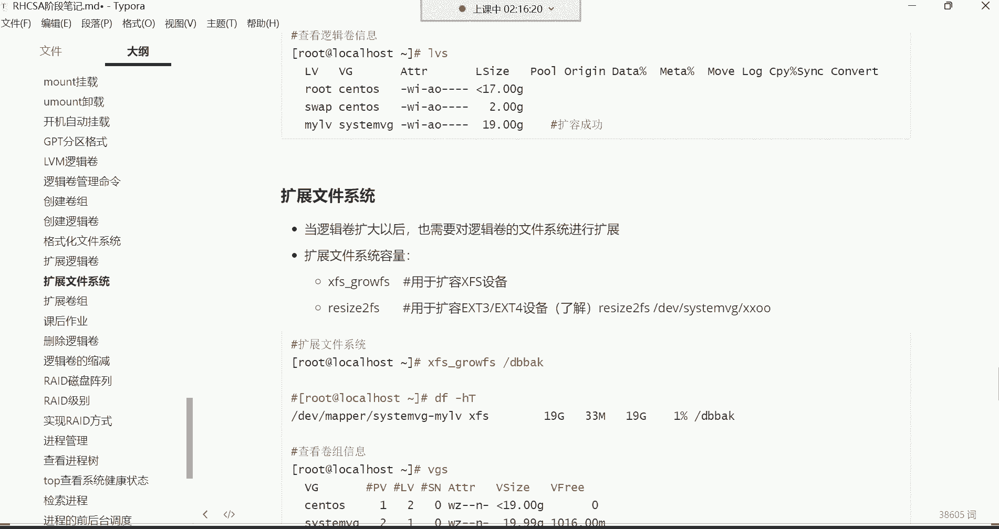

# 新盟教育-Linux运维RHCSA+RHC培训教程视频合集，全网最新最全最详细！ - P27：红帽RHCSA-27.逻辑卷扩容、RAID磁盘阵列 - 广厦千万- - BV1up4y1w729

喂喂喂，都回来了吗？回来的话给我刷个一，我们继续。好，都回来了是吧？好。那，接下来呢我们。要。再讲讲后续的这个逻辑卷的相关内容。前面呢是创建了卷组，创建了逻辑卷，然后命令的话呢也都比较简单是吧？

这个我们创建卷组逻辑卷，然后这边是标记一下，叫做逻辑卷的管理命令。管理命令啊，这些呢都不是什么难的技术哈。难的话就是你得把这个东西给他理解了。你说我们为什么会用这个东西？😊，因为像这种事情在企业里边啊。

你说对于一个数据来讲。

你当初在划分分区的时候，你敢保证你说你能够预估这个数据的增长量吗？这玩意就像咱们拿这个根分区来说，你能够预估你的根分区。它多大的空间才够用吗？随着服务器不断的运行，你根本就预估不了。

所以为什么根分区会使用逻辑卷去存储数据呢？就是因为根分区它需要扩容。而你刚开始你也不需要给他分配多大的空间。等不够用的时候呢，咱们就对它扩容不就可以了吗。所以核心思想就是理解它可以不断的扩容。知道吧？

那你说老师我最终我可以给他扩容多大的空间。😡，这空间要取决于什么呢？你的一个使用量，而这个使用量最初你说我们当初在这个划分的时候。当初啊咱们是给他分了一个什么文件系统啊，是不是叉FS类型的文件系统啊？

😊，我不知道大家还记不记得哈这个叉FS这种类型的文件系统，这单个分区最大允许你。支持多少空间呢？叉FS类型的文件系统最大是不是允许你支持？那个。是8亿B的空间。8EB哈。8EB的空间。

所以说咱们说这空间我最大我可以给它扩容到多大呢？哎，只要你有这个需求，这一个逻辑卷允许你扩容这么大的空间。你对根文区的逻辑扩容又缩减，然后系统崩了，这个怎么救救不了了，数据丢了。😀。嗯。

我一会儿给你们讲讲啊，这个为为什么会导致数据丢失？😊，啊，你是。😊，很少会缩容的，你扩容可以，但是哪有几个会对逻辑线进行缩减的呀？😀是吧。😊，所以顺序丢了就没了。因为这系统它没有回收站。😊，哈哈。😊。

好，接下来呢我们再说说这个怎么去扩容。现在是不是该挂载了呀，现在还没有挂载呢吧。啊，我们那个我写开机自动挂载配置了吗？我看一下哈，看下ETC下的FS table。😊，好，我我得慢他杠一下。

mount杠A挂载一下，然后DF杠A是看一下。OK那现在是不是已经成功挂载了呀？好，那我们现在就假设现在这个逻辑卷的空间20个G，随着不断的使用，它的空间满了。满了以后，我是不是得对它扩容啊？

因为它的核心的功能就是对扩容啊。😊。

好，接下来扩容的命令X ten。X是用来扩展逻辑卷的，当然这个呢得看你想扩展什么呀。因为它有卷组的管理跟逻辑卷的管理。你如果说想扩容卷组，你就得VGX ten。如果你想扩展逻辑卷，那就得LVX能理解吧？

所以这个呀就得看你想扩展什么。那我我们现在就想扩容逻辑卷，那前提是得先VGS看看这个卷组有没有空间上的扩容。然后再LVS。

那现在这个逻辑认的空间是20个G，然后卷组呢现在还剩余19。99个G，就将近20个G吧。好，那我现在如果对它扩容的话，是不是就可以了呀？那就是。LV。X ten的。

那具体的命令格式，你在扩容的时候扩展逻辑卷哈，也得需要指定大小。

来看下这格式哈。

扩展的命令。

逻辑卷在扩容的时候，首先它支持这种线上的扩容。这个线上的扩容就是我们所说的，你这个服务器不需要关机。不需要关机啊，其实关机也没有办法扩容是吧？那就是说白了你就直接就对它的空间扩容就可以LVX1的杠大L。

不要忘了杠大L哈，指定它的大小。然后这位置我给再家给大家补充一下。😊。

LVX1的还得需要通过杠大L指定加。多少空间，比如说多少兆啊。多少G。当然多少K啊，K比较少见一些，就K着记啊，指定大小加大小。然后最后呢再指定具体的这个逻辑卷的。名称。嗯。具体路径吧。

具体路径。所以我们现在就杠大L，我要给他加多少呢？比如我给他加19个G。注意啊，我们现在是扩容，所以得通过加号来指定要添加空间了。首次创建的时候是不没有这个加号啊，首次创建不需要。

所以第二次的时候扩容的时候就通过加号来指定添加空间啊，加多少加19个G。因为你加的时候，你得要根据你卷组的空间去。具体指定给他加多少空间，你不能瞎加，你如果给他加100个G可以吗？

卷组压根都没有那么多空间。所以他就添加不了哈，所以这个得先看卷组还剩余多少。好，给他加19G。😊，然后接下来呢，再指定你对谁对DV下的C systemVG下的myLV进行扩容。注意哈。

在扩容的时候不需要指定卷组名了，为什么呢？因为你在扩容的时候，比如说我要对这个逻辑卷进行扩容是吧？这个逻辑卷它会自动去干嘛呢？自动去找。当初是有哪个卷组给我分配的空间。

或者说我当初是从哪个卷组里面创建出来的，他就自动去找这个卷组去要空间了。他不会去找别的卷组。你比如说我这个逻辑卷是从这个CVG这个卷组里面创建出来的那他会找这个这个卷组去要空间吗？

他不会啊就是D找DM猫点8是吧？这谁谁生的孩子。他就找谁啊，这孩子就跟谁要奶喝，所以这时候我们就不用指哈。所以这时候大家看一下啊，这大小发生变化了。😊，啊，具体的含义就是你的你的这个逻辑卷，它的大小。

啊，就你这个C4呃这个哎买LV的这个逻辑帧的大小从多少呢？这不这吗？from从20个G，原先是20个G哈，就这个你原先的空间20个G，现在变成多少呢？to啊现在变成了39个G了。也就是说。

从原先的20个G，我给它加了19个G的空间，它现在就变成20加19，变成39，20加19哎，变成39个G的空间了。空间变大了吧。好，然后这个。告诉你说你的这个卷组啊已经成功的调整了大小，看到了吗？

不是你这个逻辑卷哈，成功调整了调整了大小。好，那大小变了，我们再这样LVS自己看一下是不是变成39G了呀，空间变成39G了。能加百分比吗？百分比加不了哈，这加不了百分比。😊，因为他百分比是他自己计算的。

他根据你这个空间计算的哈。好，那接下来呢39个G的。😊，是不是空间变大了呀？有如说我们这个逻辑卷啊。咱们这样哈，咱们按照实际的使用情况哈，我们是最初的时候，咱们这个逻辑卷。是从原先的多少呢？

原先的19个G。19个G我用呢给他加了。啊，是从原先的20个G20个G，我又给他加了19个G，然后它现在变成39个G。没错吧啊，335G哈没有那么大。😊，39G，然后我们这个虚拟硬盘有这个卷组的空间。

卷组是多少呢？将近40个G40个G的空间。好。那我们现在来想象一下呃，我这个逻辑卷空间变成39个G了。我们在看正在使用中的情况，DF杠H。嗯。下午好哈下午好。

这怎么这个怎么着这个突然间给我来一句下午的问候啊，这想这是干嘛呀？😊，好，我们来看一下哈。😊，嗯，他不是刚来哈，他不是刚来来看一下啊。😊，逻辑圈的大小就这个你看LV。这个逻辑券买LV的这个大小。

现在是不是39个G啊？但是你发现正在使用中的这个情况，就正在使用中的这个情况哈，为什么它的容量仍然是20个G啊？仍然是20个G，这为什么呀？😡，这有些奇怪吧。也就是说，这空间呢好像没真正的扩容成功。

有没有感觉这空间好像确实没有真正空中成功啊。😡，是不是？你看我把这图啊再给你们来。这样哈。嗯。这个图呢，他是这样子的。我给你们分一下这个图的这个情况哈。咱们这个图啊，原先是你们这样看哈这样看。

我们把左边这边空间呢给它理解成是这个原先的20个G空间。原先的20个G。然后右边的这个这一部分空间呢，我们给它换个颜色。好，然后这一份空间呢，我们可以把它列成。

我们可以把它写成是我们刚刚增加的那一片空间。是19个G的空间。啊，这个部分是我们后加的哈，19个G的空间。那现在这个问题出在哪儿呢？现在这问题就出在。好像是。没有实质性的变化。

就是说这个逻辑院它整体的空间，现在我们看的是39个G，总共是39个G哈。但是呢。😊，为什么正在使用中呢？还是原先的20个G要重新挂载是吧？它没有挂载上吗？哎，不是我跟你们讲哈。

当初咱们这一片空间我们做了哪些事情呢？我们做了一步就是。

我们给的格式化文件系统了，插FS的文件系统。没错吧，是不是他是是不是这一片空间是有文件系统的呀？😡，那他的这个文件系统啊，它其实有大小。也就是说这个文件系统的大小啊，它其实也是20个G。

文件系统也有大小。这个叉FS的大小也是20个G。然后呢，我们后边啊又给他增加了空间了。我们新增加的那个空间呢，它少了什么呢？少了什么呀？咱们说这文件系统啊，它是不是叫文件管理系统啊。

帮我们管理这个分区里的这个文件的。那当初你这个逻辑卷在格式化的时候，它就会给你20个G的文件系统，大小也是20个G，能理解吧，然后他就只会管理这20个G的。空间的文件。哎。

那我们后来又给他增加这19个G的空间，这19个G的空间差在什么呢？这19个G的空间就差在他。没有文件系统。没有文件系统。不是。不是哈，没有文件系统哈，没有文件系统，那系统根本就识别不到啊。😊。

你没有文件系统，他没有办法帮你去管理呀，所以说差就差在他没有文件系统。😡，你怎么样呢？你得给他格式化文件系统。就是说把这个文件系统再给它格式化一遍。哎，把这个。19G的空间也给他增加一个文件系统。

就可以了。比如说现在最后一步哈最后一步扩容最重要的一步就是在这儿。扩展文件系统。对哈，当逻辑卷变大以后啊，也需要对逻辑对它的文件系统进行扩展。那扩展文件系统容量两条命令。第一条呢叫叉FS growth。

这是用于扩展叉FS类型的设备的。然后下边这条命令叫resize to fS这是扩展EST系列设备的那这个呢我们也没给它格化成EST系列的文件系统，所以是不是就不需要了呀？所以我们就只需要干嘛呀？

使用叉FS growth。

就可以了，这样就插FS下划线。格这你在格式化的时候，你可以直接指定它的挂载点目录，也可以直接指定逻辑卷的目录都行。指定挂载点目录比较省事一些。回车好，这时候你再直接DF杠H再看的话。

它的空间才真正的变大变成39个G了，为什么呢？因为增加的这一片空间也有文件系统了。所以这时候这空间才算是真正的什么呢？真正的变大了。

20个G加19个G。能列了哎，这样才算真正变当哈。其实这样是可以什么呢？嗯。是可以裁剪的，等一下啊。好，行，理解就行哈，理解就行，应该不难理解吧，是吧？知道为什么说他会出现这种情况了。

空间没有实质性变大，就是因为。他没有文件系统。好，现在就等于39个G。空间变大了。那以后我再想对他扩容，是不是就比较容易了呀？😡。

没有影响。之前的问题他是扩容，它是扩容哈。他是扩容，他不是重新赋予。所以我们看这个。外包这个外包拜科目录里面也没有东西，是不是啊没有没有文件，主要是没有文件。没有这个我们没有在那里面建文件。

我们进去建点文件哈，他是。多少呢？叉叉叉叉。10个文件吧。建设0个文件1点点10。建了10个文件是吧？然后一会我们再扩容哈，再看会不会受到影响。好，那这样我们再来分析一个问题，什么问题呢？😊，看一下哈。

它现在空间是不是变成39个G了？那我们假设这空间又不够用了，随着文件不断的存储啊，这39个G也不够用了怎么办呢？😊，39G现在也不够我使的了。现在文件系统也变成39个G了。好。那不够用。

我是不是还可以继续对他进行扩容啊，是不是还可以继续扩容，没错吧。😡，好，那这时候。如果你再扩容的话，我们再分析分析卷组还有空间吗？现在这卷组没空间了，你看到吗？还剩余多少1016。

赵你现在最多还能给他控容不到一个G的空间。那这不行啊，这够干嘛的呀？😡，这不够用哈不够用。所以我们现在要干嘛呢？要开始扩容这个卷组了。这卷组现在主要是它没没它没有空间了。而卷组的扩容我们可以怎么玩呢？

啊，alas block列出所有的磁盘以及分区。我们现在是不是还有这两个分区加一块硬盘呢？我现在可不可以都给它扩容到这个。😊。

卷组里面去啊，可不可以呢？可以。可以。所以这时候咱们就直接这块硬盘的空间是100个G。然后我还有什么呢？我还有两个分区。我都给他扩容进去。那怎么怎么扩容卷组呢？命令格式VG。Xten扩展卷组的命令哈。

VGX ten。

跟创建的时候呢差不多。我先说一下，我们创建的时候，是不是这个VG createate。然后后边呢给卷组取个名，让他叫C systemVG啊，然后后边再指定设备路径，比第一V下的SDB1。

还有啊SDB2跟这个第一V下的SDB3呢。没错吧，是这样创建的是吧？那我告诉你扩容的时候，把V把这个create换成X ten。那命令格式也是要指定卷子名，你要对着扩容路径。

也要指定你要把哪些分区或者说硬盘给它扩容进去。那是不是SD5SDB5跟SDB6啊，好，那SDB5，还有SDB6，还有吗？有还有一个第一V下的SSDC这是一块硬盘吧。这一块硬盘空间100个G，也如我现在。

两个分区。两个分区哈加起来是15个G，再加一块硬盘，总共是115个G。走你。啊，少一个D是吧，少个D。好。嗯。提出什么呀？被过滤器排除的SDC。嗯嗯嗯。SSD那这样吧，我们SDC先不扩容。

先把它俩扩容进去。然后我这时候我再这样VG。Xend指定对sstemVG这个卷组进行扩容，把DV线的SDC扩容进去。嗯。啊，这硬盘我看看哈，这硬盘前面分过区，我这样哈嗯。否定s刻杠L，我看一下这个硬盘。

还有。啊，也也不是，这跟分区格式呢没有什么太大关系。嗯，那这样吧，我看看PV create。我把这个DV下的SDC。我觉得这块硬盘好像是不能用了。好像是不能用了哈，这样吧，我们给它移除掉，再添加一块吧。

把它删掉吧。添加一块新的。

哈不用，我们就把它这个SDC。😊，是。沙塔的第2块这个哈。给他移除掉。然后再添重新添加一会。那硬盘我前面让我给霍坏了，应该是。嗯，s他的。下一步。下一步我们空间变小点吧，让它就让它是20个G吧。

确定。不在公司也没事，你那新硬盘。😊，你那是新他不是不支持GPT啊，他支持哈，你那是新硬盘无所谓的。😡。

那新用盘说白了，你重新这个插拔一下不很正常吗？SDD是吧？好，SDD20个G哎哈。😊，呃，VG createate。systemVG这个卷组指定把低V下的SDD。好。嗯。啊，不是c。

sorry哈X ten的哈。😊，走你是不是可以了呀，是不是扩进去了呀，嗯，是不是成功了呀？😊，啊，这。你的这个物理卷可瑞啊创建成功了，他把这个东西先给你创建成物理卷的格式，然后再把他给你。

组合呃给你扩容到这个卷宗里边。那这时候我们再这样VGS的时候。你看这里面有几个呀，是不是变成5了呀？主要是四个分区，一块硬盘。四个分区一块硬盘，然后空间现在还剩余35个G。

就是说你想拿一块物理硬盘直接往卷子里面扩容也是可以的。直接一整块硬盘都不需要去做任何的配置，直接就给它扩容进去。啊，那是不是空间变大了，变大以后，我还想再对逻辑卷进行扩容。那LYS逻辑卷现在31口计。

我现在就。LV。X ten杠大L加多少，给他加30个G。30个G哈，然后再指定对DV下的CA systemV机下的马海洛V进行扩容。好，从39个G变成69个G了，是不是？又增加了30个G啊。

那但是你这时候你这样看的话。不行，正在使用中的容量没有发生改变。所以最后呢不要忘了扩展一下，那就是。哎。叉FS growth。指定对webback这个目录进行。扩展文件系统，这时候在DF杠H看一下好。

空间变成69个G了。那变成69个G以后，我们看里面的文件有没有受到影响啊，web back目录，你看这里面还是10个文件是吧？从1到10，所以文件呢也并没有消失。😊，也并没有损坏啊，就是他就扩容的话呢。

不会影响原有的文件的。啊，这就是我们说所出来这个逻辑卷，是不是又加了30个G。20个G加19G又加了30个G，所以最终呢变成69个G。69个G。啊，空间呢就变大了。好。

那这就文件系统是不是现在也变成69个G的文件系统了呀啊，这样就可以了哈。所以说逻辑卷你发现它最大优势就首先这个东西它就是帮你去存储数据的。😊，只不过呢它在存储数据的时候。

跟这些物理分区存储数据的唯一的优势就是说它可以扩容。他是可以扩容的。嗯。那这时候很多人说老师，那我能不能空间能变大，我能不能给它缩小啊，我让它变小了可以吗？😡，可以可以缩容。但是大家要想想。缩容的话呢。

这个危险系数是非常之高的。缩容得先缩容文件系统。比如我想把这个空间再缩小30个G，你得先让文件系统少30个G的文件系统，让文件系统先变成39个G，然后再去缩容这个空间，再把这个30个G的空间再给它去掉。

去掉。能理解吧。这样才可以。但是。这个危险系数啊。这个不不建议大家在企业里面这么去缩容哈，但因为在企业里面一般也不可能去缩容的，除非数据不想要了。

除非除非不想要了哈。如果想缩容的话呢，有一条命令缩减的命令。等一下哈，那个逻辑卷的缩减在这哈。如果想缩容的话，用这条命令叫LV蕊度这条命令可以缩容。宋荣浩。好。呃，没有没有静音哈没有静音。

你们能听到我的声音吧？如果听不到声音，应该早都查了。😊，对吧。啊，没有经营。嗯刷新一下这个。没有听到声音，那个你你们给他发个消息，让他刷新一下哈。对，没声音，退出重进一下。😊，嗯。然后再给大家说一下。

如果你想缩减的话，就不允许连机了。什么叫不允许连击呢？得把那个卸掉。😊，你得把这个挂载点给它卸掉。

把挂载点卸掉，然后才能对它的空间进行缩容。但是你在扩容的时候，你发现可以连机，是不是啊？

啊，是这样子的。所以这里面我给大家写了缩减的一些注意事项，但具体的格式并没有写吧。啊，这个如果大家需要的话，可以自行百度搜一搜，这都比较简单了，这都非常之简单哈。😊，那下边呢我们这个逻辑卷哈。

这个内容呢到此为止就结束了。然后我上边呢是给大家留了一些作业。😊，嗯，而逻辑军的删除的话呢，这个其实在企业里面也用不到。如果想删除的话，这里面我有一些详细的例子，大家可以去看一看。然后如果想删除逻辑卷。

也不允许联机，先卸载再删除。在删除的时候呢，顺序的话呢，首先删除逻辑卷，然后再删除卷组，最后删除物理卷，物理卷也需要删。也需要上物理卷哈。我给大家演示一下吧。嗯，比如说我现在逻辑卷我不想用了。

不想用的话，你得先删除你的这个逻辑卷。DF杠H杠你得先把这个逻辑件给它删掉，但删的时候呢，你得先卸U梦把这个关点给它卸掉，外b拜科目录，然后开机自动挂载也给它卸掉。这个哈删掉滴滴。啊，这个时候呢。

我们再去删，那就是。RM啊，sorry哈LV remove。这时候呢你指定要删谁，我要删DV下的那个C4特目VG下的买LV好。这时候呢你在删的时候，他肯定得干嘛呀？他肯定给你确认呢。

他说你真的要删除活动的逻辑卷吗？要不要呢？Y就是y的意思，你就输入Y。如果你要删就输入Y。好，那没了。这时候你在LYS的时候，你发现你自己建的那个逻辑就没了吧。好，那逻辑认没了以后，你说那卷组呢。

我也想删VGS，我想把我们自己的这个卷组给它删掉。s toVG这卷组。好，那这个命令就是VG蕊木。😊，后面跟上卷子名就行了。C systemVG推车。直接就给你删除了好吧？直接移除成功。

卷组已被成功移除。好，那移除以后，我们这时候再LSb，那它是不是就没有那些逻辑卷的格式了呀，这是不是都回不到自己普通的物理分区了呀？包括这个SDD这块盘是不是也一样了呀？

那这盘我现我我们现在可以直接用吗？你比如说我现在给它格式化，它不就普通物理分区吗？我们拿SDBR来说哈，我给它格式化啊MKFS点XFS。😊，对第一V下的SDB2。哎，你看他提示了。他提示什么呢？

大体的意思就是说你这里面的格式不对。对，你看他说你这里面似乎包含一个现有的文件系统，什么文件系统呢？LYM的文件系统。哼，所以说你得如果想。真的可的话，你可以加一个杠F选项，强制覆盖也行。

如果你不想强制覆盖，你就把它的这个给它删掉。那我们看看可不可以啊，强制覆盖。但我们一般都建议什么呢？都建议。把他的PV给他删掉呃，把物理卷格给他删掉。能理解吧，那你想覆盖也行。

那就MKFS点XY加一个杠F强制执行。好，这样也可以，这样也可以。这时候我们再来看呢，那我们用LSLblock加1个杠F选项。在看那个SDB2。那这个就是一个普通的分区了，就可以正常使用了。

对他不会自动帮你删除。因为他他那里面有文件系统。他那里面主要是文件系统，他没有给你删没有给你删哈。所以说最终你如果想删的话，就这个步骤先删逻辑卷，再删卷子。最后如果想用的话，它已经恢复到一个普通分区了。

你要么就把它的个PV给它删掉，要么就直接强制也可以在格式化的时候，强制那这就是一个普通物理分区。那以后再用的话，我就可以mon把第V下的SDB2挂载到某一个目录。比如外。DF杠H好。

那它就是一个普通的分区就可以正常使用了。就是这样子的。呃，卖的哪一串？后面那个串儿啊，我怎么没有看到那个后面那串儿。啊，这个是吗？不是UUIDUUID哈，这不是麦克地址。

就是这个逻辑卷他自己的那个UUID。😊，这些数据还在吗？肯定没了呀，你都删了，他肯定没了。你看外边外目录是没有用的。外 back目录不会帮你去存储任何的数据的。因为数据在逻辑卷里面被你删了。

你都格式化了。你想想你都已经格式化了，就等于说你在windows里边，如果你对你的windows那个盘格式化的话，你那数据还能在吗？😡。

你想是不是？如果你对你如果你对你的windows C盘，你说我想给它格式化一下，你可以这样，你右击。😡，这里边啊右击，然后更多选项。😊，比如说我如果把我的C盘格式化了，你觉得他这数据还在吗？😊。

这数据还能在吗？是不是？😊。

就没了哈啊就没了。😊。

对，如果你们不信，你们下去可以自己试一试啊啊，OK删除缩减，就删除一般也不会删哈啊，然后接下来咱们给大家讲讲这个什么呢？讲讲这个readd。😊，磁班争立。图片不要了啊。哎，有些卡呀有些卡。

这笔记的内容啊属实有些多。有些多啊。嗯。到这个了是吧，没错，到这个了。瑞德呢我们现在就是主要还是以理还是以这个理论为主。不知道呢，还不行。知道的话呢，还没有什么实操。嗯，每样还不一样是。

行了，就这样吧哈，就这样。然后我们讲讲这个read这个到底干嘛用的。行了，我课后再整理吧哈。readd呢叫做磁盘阵列，然后它的全名叫做独立的磁盘冗余阵列，我们简称叫磁盘阵列。这个东西可以干嘛用。

它磁盘阵列阵列，虚拟机能做readd吗？能做，但是通过软件做哈那这个readd。他嗯看好我们可以通过一些软件或者硬这个硬件，就是readd卡，将多个独立的磁盘整合成一个巨大容量的一个叫逻辑盘来使用。好。

这个我们得需要涂了哈，得需要图。这个图我就不给你们，我就不现化了，现化太浪费时间了。我记得我曾经在上一个班儿。

这个今天要讲完，当然要讲完了。

我记得我在上一个班画过图，所以我就把那个图呢拿过来来直接用啊，给大家讲讲这个瑞的这个。不现画，画起来特别的麻烦。

是27期的时候。磁盘管理的时候。read磁盘阵列。哎，这里边我有一个哈，给它下载下来。来看一下这个。好，瑞的哈。嗯。嗯，瑞的呢他是怎么玩的呢？就是说我们说在企业里边呢，我们怎么才能保障这个数据的安全？

啊，我们怎么才能保障这个数据的一个安全性？很多人说老师那数据安全，我做备份不就行了吗？😡，做备份没错哈，在企业里面确实是呃比较好的方式，就是对这个数据呢，你要定期给他做备份。这做备份。

有的企业就是会有那种单独的服务器。😊，啊，这企业里的一个那种单独服务器啊，这服务器呢就可以让你做专门做备份的，把你们企业里边生产环境的服务器里面产生的一些数据。

比如这是你们的企业的生产环境的服务器在这儿。他呢？产生的一些数据。你就可以给他定期的。通过一些手段。给它备份到哪儿呢？备份到这个专门的备份服务器上面去。啊，这样可以。这是这是一种手段哈。

但是我们怎么能保证你说我的备份服务器数据它不会丢失呢？即便说咱们说这个已经做双重保障了是吧？在这个服务器里面也有，然后在这个备份服务器里面也有，但你怎么敢保证你比如说我这个。😊。

备份的服务器数据他也不丢失呢。哎，这个我们说这个就可以做一个叫做readread这个东西啊，它后期可以结合什么呢？结合这个逻辑卷来一起使用。逻辑卷的功能不是扩容嘛。

是不是啊啊read的呢他是把磁盘给它整合的，就像前面你们有人问我说老师，那如果我的物理分区坏了以后怎么办呢？那物理分区坏了，是不是你逻辑卷再扩容也没用啊，因为你最终数据它得需要物理分区的空间呢。

物理分区，比如说我坏我坏了两个分区，好，数据又没了，数据又丢了，那怎么办呢？哎，锐的这个东西就非常的好，怎么好呢？😡，他呀比如说我现在有几块硬盘。然后我这几个硬盘，我想做逻辑卷。

但是我又不敢保证我这个逻辑券这个。如果说你硬盘换了逻辑卷，它也并不是很安全。啊，那这个最好的方法是什么呢？就是你让这个硬盘它的安全系数提高一些就可以了。提高硬盘的安全系数。硬盘的安全系数怎么样才能提高？

比如这是我的这个第一块硬盘。硬盘硬盘一，这是我的第二块硬盘。嗯，这是我的第三块硬盘。好，我现在有3块硬盘。键盘2键盘3。我讲，最终他是可以怎么结合着用呢？这3块硬盘。各空间啊，比如我这每块硬盘呢多少呢？

呃一个T。一个T哈。一个T。这也是一个T。readd可以整合read它可以帮你把这3块硬盘给你整合成一个大的。一个整体。啊，当然这个我们就叫做锐道真列了。他把你这三块硬盘啊哎给你整合到一起。

就就这技术哼。整合一下，你说老师这好像跟逻辑卷差不多呢。它跟逻旋呢它还不太一样，他是先把这硬盘呢给你整合了。整合以后干嘛呀？哎，整合以后我们可以注意啊，这就要这就叫做read的了。这叫瑞的了。叫瑞的盘。

叫瑞的盘。但是他也是硬盘。这整合的话呢，它可以把很多个盘呢给你相互整合啊，比如我这左边3块小硬盘。这个好们让它变小点哈，让它变小点。😊，没的判。别的判。约的判。拿过来。3。好，那这种方法还能干嘛？

还能还能再来一套。知道吗？就是还能再来一套哈。😊，变小点哈。2块瑞的盘注意哈，这是不是2块ra的盘了，那空间多少呢？这个瑞的盘的空间是不是我们就三个T呀？三个T这个瑞塔房空间是不是也是3个T呀？啊。

三个题。好，接下来。LYM可以把这2块盘给你整合到一起。组合成一个叫做虚拟硬盘。虚拟硬盘。多少呢？6个T。6个T哈，这叫虚拟硬盘了。接下来咱们在虚拟硬盘里面干嘛呀，是不是去创建逻辑卷了呀？哎，逻辑卷。

创建。串建多少个，看需求。这就是。我记交了。没意见。那这样呢像这种方法它有什么优势呢？这种方法的优势就是它允许你坏掉几块盘。你比如说由于这个硬盘损坏了啊，我现在总共是6块硬盘是吧？

底层比如说我现在由于这个。硬盘损坏，左边呢这个readd坏掉一块盘，右边readd也坏掉一块盘，没关系，数据不丢。坏掉其中任何一块盘，就这3块盘里面坏掉任何一块，没关系。数据不会丢的啊。

然后右边这个re的。坏掉任何其中一块，它也不会丢，所以这样就可以达到一个数据的安全可靠。然后再能够实现一个什么呢？叫数据的叫做空间的无限的扩容。是这么回事。能理害吧。啊，主要是一组会那不行了。

一组会2块就不行了哈。但是你没有你不能那么点儿背吧，哪有那么点背的呀。😊，啊，一般不会出现这种情况，在企业里边。好，那下边呢我们就来了解了read的功能了，就是它主要是可以提提供一个什么功能呢？

提供一个叫这个数据的一个安全可靠的功能。啊，数据安全可靠。所以这个read的。而对于ra的我咱们呢是没有任何的实操的，为什么没有实操呢？啊，这个听我给你细细的道来哈。因为瑞的这个这项技术啊。呃。

曾经在企业里边呢是分为我们叫软件技术跟硬件技术。软件跟硬件。总之呢，甭管是软件还是硬件，都是将多个独立的磁盘整合成一个巨大容量的一个磁盘去使用。优点是什么呢？可以提高数据的读写速度跟数据的容一功能。

那对这个瑞的来讲。看好。我们说它分级别，就是这个怎么提高读野速度跟冗余，这得看不同的级别才可以。我们就拿这个，咱们看这个哈。我们看说这个readd0这个几地readd零叫做等量的存储。什么叫等量存储呢？

它是由2块盘组成的一个read叫阵列啊，2块盘组成一个readd的阵列。这不是两你看这不是2块盘吗？这是2块盘啊，然后它可以组成一个瑞的阵列。我下面这是看有一个图哈，这是底层的2块盘。

