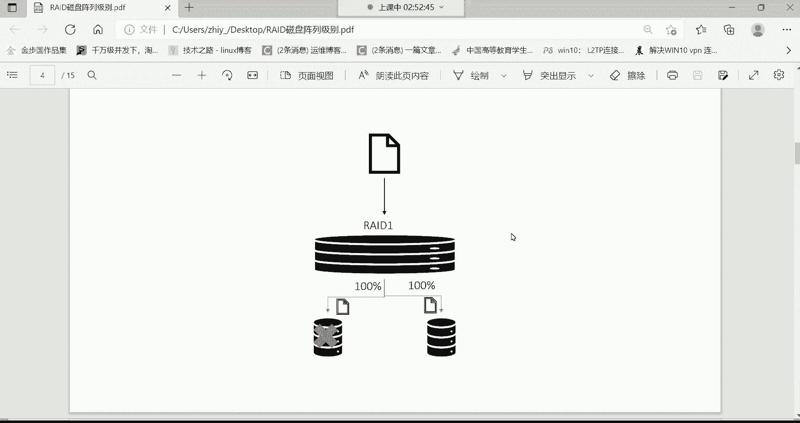

# 新盟教育-Linux运维RHCSA+RHC培训教程视频合集，全网最新最全最详细！ - P28：红帽RHCSA-28.逻辑卷扩容、RAID磁盘阵列 - 广厦千万- - BV1up4y1w729

组成了一个read的零这么一个阵列了。好，组成read的阵列以后，数据怎么存呢？看看这是一份文件吧，这一份文件它往左边盘里边存50，往右边盘里边存50。这效果有点像什么呀？这效果有点像我们说这个叫做。

并行写入。注意哈叫并行写入，它的特点是什么呢？看看这个red0。它是同一份文档等量存放在不同的磁盘，并行写入来提高读写的速度。就说这一你们想象一下啊，这一份文件。比如说这一份文件是多少呢？是10个G。

10个G哈的文件。这10个G的文件如果说存到一块盘里边，这一块盘里边存10个G的话。正常来讲，我们就假设需要多久呢？需要这个4分钟的时间，4分钟时间去存。好。但是如果我现在可以干嘛呢？

可以将你把这一份文件分成两份，劈成两半。哎，撇成两半以后呢，我左边存50%，右边存50%。那是不是就说左边存了5个G。是不是啊右边再存5个G，但是它是并行存储的呀，优点是什么呀？啊，各位优点是什么呀？

是不速度就翻倍了呀，原先用4分钟。能够把这10个G的文件存到硬盘里面，那我现在是不是就直接两分钟就完事了呀？没错吧，因为他是病情写入啊，但病情写入，你想想是吧？速度提升了呀，速速度提升一倍了呀。

翻倍了吧。啊，这辈子应该都能理解吧。因为你看原先你一份文件10个G存一个硬盘需要4分钟，但现在呢我并行写入，我两块盘同时帮你存，是不翻倍了呀？哎，翻倍了哈，啥是冗余功能，冗余冗余就是多余。

多余就是备份了，知道吧？什么叫冗余不就多余了吗？是吧这多余是什么呀？不就备份吗？啊，这时候就说read0它的特点是什么呢？read0。可以帮我们来提高数据的读写速度。读写速度。

但是呢它只是单纯提高了读写速度，并没有这个叫冗余的备份功能。为什么呀？如果其中一块盘故障了，数据丢不丢？我们就假设现在你看这个图。在这图里边，我这个数据是左边50%，右边50%啊。哎。分散存储。

那如果说我的左边盘坏掉以后怎么办呢？那是不是这左边盘里的数据就丢了呀？那就时剩数据10个G的数据只剩左右边这个盘子5个G了。丢了5个G的数据。不可靠，有点危险是吧？对，不安全啊，这个哈不安全。

所以说red零呢，它就不适合存储一些什么呢？重要的数据。在整个read的级别里面，但是它的读写效率是最高的，速度最快。数据这个速度翻倍了哈，速度快，但是呢不安全。但有的时候呢，我们说在企业里边。

我希望什么呀？😡，速度还要快，然后呢还要给我有这种备份的功能。可不可以呢？其实也行。啊，我们再看看别的级别哈。还有一个叫readd一这个级别。readd一呢叫做。完全的备份。但这个完全备份呢。

他也是由至少得2块盘。但他是这样子啊，他是同一个文档复制成多份，存储在不同的磁盘，来提高可靠性。要的。来看这个图哈看这个图。因为这个图是我从网上截的这图从网上截的哈，而这图是自是我自己画的。

所以我觉得从网上截那图啊看起来并不是很清晰，能理解吧。所以咱们就干嘛，咱们自己画一个哈。然后自己画的话呢，怎么说呢嗯。我这样吧哈。嗯。我觉得这个。算了吧，我觉得这已经很不错了，我觉得这图已经很不错了哈。

就这样吧哈，挺好。😊，咱看这个readd一这个级别哈，readd一特点是什么呢？这同一份文件哎，它叫完全备份。这完全备份的特点是体现在什么呢？比如我现在还有一份文件，我这文件10个G。10个G的大小哈。

那这10个G大小的文件，我现在如果说往readd一这个阵列里面存的话，那readd一这个阵列的话，那它至少是不是有2块盘组成啊，左边一块，右边一块2块盘组成。然后呢，他存的时候他叫完全备份。

就他会把这个文件呢。百分百的这个一份文件存到左边这个盘里面存一份，然后再干嘛呢？再把这个百分百的数据量再完全存到这个右边这个盘里边一份，这叫做什么呢？完全的备份级别。这完全备分级别特点是什么呀？安全呢。

你想想这文件是不是我一共是比如这1个叉叉点TIT。叉叉的贴贴啊10个G的文件。那是不是re一它的特点就是我左边有一个叉叉点TIT。大小10个G，右边我是不是还有一个叉叉点TT呀？

叉叉点TT大小是不是还是10个G？那我问一下安不安全呢？左边这块盘，如果有一天坏了。数据会丢吗？他不会，为什么呀？哎，右边这块盘里面还有一个一模一样的文件呢。这是什么呀？

read一这种具有数据完全冗余的功能，就是冗余就是备份的意思，完全冗余的功能。适合存储重要的数据。为什么？因为他允许你换一块盘，对同步备份存的时候哎，左边跟右边。给你同时往里面存，但速度什么呢？

速度怎么样？来给大家来说一下，比如说这文件10个G10个G大小哈。正常来讲，如果我往一块盘里面存速度4分钟。4分钟哈。啊，但是他的特点是什么呀？他的特点是。虽然说安全性比较高了。

你看左边这块盘得用4分钟去存吧，是不是右边这块盘是不是还得用4分钟啊？效率呢？在数据的读写效率上没有任何提升，反而下降的。是不是反而下降了？没错吧。😊，就是这样子的哈。

就整体如果说我想把这一份文件存到read德一里边，得需要8分钟。这边能听懂吗？听懂给我刷个一上来哈，就说他读写效率没有任何提提升，反而什么呢？速度还变慢了。😡，但是呢安不安全？冗余了吧，说给你备份了哎。

没错。你传一半坏坏一块盘怎么办？嗯。那他就没有办法再继续往里面传了，他只能往另外一块盘里面传。嗯。嗯，只能往另外一块盘里面传了，那没有办法，你坏了，它确实是没有办法往里面写了呀。

所以说这个读写速度肯定是没有任何提升哈，没有任何提升，反而下降了，但是确实是安全，非常的安全。所以我就像这种的，我这样吧哈，我把这个图啊。

我觉得这个。还是自己画的呀，比较符合什么呢？啊，比较符合我们的一个理解。能力。是吧看瑞的0。re的一。别的一。但这图呢，我们也没有办法给他干嘛，给他这个。算了，不往这里放了哈，因为往往这里面放的话。

再放上吧，放上的话，到时候我把PPT发给你们，好吧，PPT发给你们。因为放这图确实是对于你们来讲，你们看不到。呃，没有影响没有影响哈。然后接下来我们再来给大家分析一下，再来分析一下哈。

就是你说这个readd一啊，它这个虽然说是非常的安全。😊，非常安全，是不是？这空间呢我们来假设，比如我这个左右2块盘。不是左边一个T。一个T哈，右边也是一个T。也是U个T。

那你知道最终可以使用的空间是多少吗？最终可以用的空间。就是一个T。就这个readd一对，最终可以让你用的空间就是一个T，就是它的一半。为什么呀？因为另外一半空间是备份了。退。你看正常来讲，我左边一个T。

右边一呃，右边一个T合到一起，应该这个锐的一应该是两个T吧。没错吧，是按照我们的逻辑应该是这样子的。但是我告诉你没有。3块1个T的是吧？他不允许瑞的一没有办法用3块盘。😡，read一用不了3块盘哈。

😀呵呵。😊，所以说呢像这种情况下，我们就是。最终可用的空间还是一个T，另外一个T的空间就是备份啊，这大家搞清楚哈。所以咱们说你做对的一，你说老师啊，我这个多搞几块盘可以吗？你多少块盘。

最终可用的空间都是它的一半。😊，对，4块盘可以。如果4块盘，我组睿的一可不可以，但是它最终可能空间还是一半。嗯，还是一半哈。那接下来你说这个还有没有别的read的级别。

有read2至少由3块盘组成数据分散存储在不同的磁盘。在读写时这个需要。检查到的数据的实时校验。当然啊这个read2这级别啊，read234都很少用哈。read2read3，还有这个read4。

这都非常的少见了。而且。很多的。比如说什么readd卡呀，还有像什么那个什么软件的方式去配read都不支持，都做不了这种readd234能理解吧。所以这大家作为了解就行。

你就比方说这个readd2至好由3块盘组成，数据分散存储在不同的磁盘。在读写数据时呢，需要对数据进行校验，由于采用的校验算法比较复杂，数据量比原来的数据增大，而且导致硬件开销比较大，什么意思呢？呃。

如果是readd2的话呢，大家说一下啊，3块盘组成一个readd2，然后一份文件同时存储在这3个盘里面。啊，可以说一呃一份盘存个30%多一些吧百分之。30。啊，当然这就不具体去细算了哈。

我们就假设啊一这个一个盘里面的存储个30%左右。右边也一样，30%左右。好，分散存储了。然后呢，他在往里面存的时候注意啊，他存的时候，这盘里面是有一部分是校验数据的，就这个数据里面啊是。有一部分空间。

这一部分空间是存储的是他这个数据的校验值。校验值哈，然后他这卷值由于采用的这个校验算法比较复杂，数据量比原来增大了，什么意思呢？就你看我这个比如说是30%的数据，这里边可能说还会附带多少呢？

10%的一个校验数据。整体来讲就是这份数据是存到里面就变成40%。数据量比原来增大。那你说比原来增大无所谓啊，这增大就增大呗，是吧，咱说这个。也没增大多少空间40%。但我跟你讲，他每次在读写的时候。

都得去干嘛，去查他的那个10%的校验数据。每次查的时候，就会导致这个硬盘。的这个我们说这个就是这个工作量要加大，硬件开销比较大的话，就导致硬盘容易损坏。哎，性能下降，硬盘也容易损坏。

所以这red234这个没有人用，在企业里面是不用的。知道吧？所以我们就不过多去解释它234。然后这里面大家下去可以具体看一下234。第三个，那就在企业里边，我们到底用哪个呀？

你发现我们前面给大家讲的什么read零readd1read零特点是什么呢？readd零高效。速度快是么？提高效率了。但是呢。没有冗余功能。完全是提速，不安全。readd一呢非常之安全，完全悲愤。

但是呢速度没有任何提升，反而下降了。我们再补充一句话哈，速这个速度没有提升，反而是下降了。反而是下降。是，但是适合存储中的数据，是不是这这俩你发现他就于极端。你就用过15是吧。

对你发现这red0跟re德一他俩真的是极端，一个是非常快，一个是非常安全。那能不能把他俩结合到一起呢？就是既能提高速度。又能保证数据的安全，可不可以呢？有啊，还真有哈red5。

rid5哈re5的话呢是至少由3块盘子组成。我们把这个图拿过来。所以大家记呢，我直接给你们去干嘛呀？

放一些重要的一些这个图哈，这是red5的这个图了。

咱们来说说ra德5先读一遍哈。了解一下他的特点。至少由3块磁盘组成。然后同一份文档分散写入不同的磁盘，这是这个3块盘啊，当然哈这是一。233块盘呢，我组成一个readd5的阵列。

然后接下来呢每一个盘里边啊它在存储数据的时候，这同一份文档分散存储，这一份文档是这样子的哈。你看这一份文档呢，它这三个盘里面呢，你也你也可以这样理解，比如这个里边的30%多一点点哈就不细算了，30%。

这个里边呢也是30%。😊，然后另外呢也是30%。啊，总共呢把这一份文件呢分散存到这三块盘里面。那这每一个盘里面它在存储的时候注意啊。他也有校验收据。

校验数据哈那其中这个校验数据会占用磁盘的3分之1的空间。假设我的这块盘总空间30个G。最终这文件往里面存的时候，注意哈。这总空间总空间30个G，但是这有10个G的空间是用来放校验数据了。

就最终你可用空间，原数据的空间是20个G。呃，另外1个金呢是校验了。那什么叫校验呢？这个校验有什么用？就业数据就是他允许你同时坏掉一块硬盘。比如在我这3块盘里面，我的这个。这块盘集中坏了哈。

这块盘损坏了。这块盘坏了以后呢，没关系，其他盘里边是不是有交验数据啊？那其他这两块盘有怎么呢？有这个分别是有10个G的校验数据。😊，没关系，这校验数据可以帮你把数据给它恢复回来。

就是这个盘里的数据全都丢失了，没关系。没关系哈，那其他这2块盘里的，它可以基于校验数据的算法，算法你不用管哈，它会帮你干嘛呢？把其余的这块盘里面丢失的数据给你恢复回来，给你推算回来。

那你说那我这个至少由3块盘组成，我坏掉一块盘，我剩2块盘还可以吗？不行，这阵列就散了。😡，真列散了。所以在企业里面呢，你想做re的5还要准备一个热备盘。还有准备一个热备盘。

这个热位盘就是当你这个坏掉一块盘以后。这个热背盘呢就是这个read，就是我们说这个做readd的时候，read的有个功能，它会帮你把坏掉这块盘给你踢出这个阵列。这盘一旦坏了，好，给你踢出去。

然后接下来呢，热背盘加入到我的整个阵列里面，然后恢复的时候，把这个数据恢复到这个热备盘里边。所以最终我还是有什么呢？3块盘。这里没有散。他把招丢了，就在调取的时候，你比如这个数据。

我你想想他在读取的时候，比如说我得从这个盘里面往出读数据吧，是不是啊？你想他读数据的时候，他发现数据读不出来，查不到数据好，丢了，是不是是不是丢了。你比如说你们家里边你找一个东西。

你发现这东西找不到了一啊，你比如说你走大门时候，你发现我这兜里有50块钱一摸啊，没了。😡，你说你咋知道丢的呢？他不在了呗，是不是他不在了哈，所以怎么办呢？所以这时候他就开始干嘛把他踢出阵列，踢出阵列哈。

踢出阵列以后呢，热备盘加入阵列，然后把数据恢复到这个热备盘里面。😊，所以这个readd5呢，首先这一份文件是不是并行写入啊？3号盘这一个盘里面30%是吧，一个盘里面的30%速度有没有提升呢？

并行写入是不是就速度提升了呀？没错吧。那接下来呢？啊，接下来这个有没有备份功能呢？有啊，就说3号盘里边这个数据啊都有一些校验值，允许你坏掉一块盘。坏掉一块盘以后呢，数据也不丢失。

是不是也达到了一个备份功能啊？所以这个read5啊，它就是类似于什么，既能提高你的数据的读写速度。又给你提高一个冗余功能了。啊，是这么回事。啊，可以多个read5共用一个热备盘吗？

这个没试过这个真没试过哈。因为你在准备热备盘的时候，你得指定这个热备盘绑给哪个red5。但你说多个re5绑定一个热备盘，这个我还真没试过，但是一般也不会这么干。😡，不会这么干哈。啊，你们这个问的问题呢。

可能是有的时候是遇到过这种情况，还是怎么回事啊啊，因为问他这种问题啊，简直让我有些呃，是我思考的少啊，还是这个这个没有遇到过这种情况啊。啊。一般不会出现这种情况啊不会出现这种情况啊。

然后还有red6呢啊这个red6的话呢，是至少由4款盘组成。啊，思想比较活跃是吧？对呃，red6是由4块盘组成，然后同一份文档呢分散写入到不同磁盘。还有一个red6。red6他长得这个样子哈，就是。

同一份文档呢，4号版组成。只不过呢一份文档呢分散存储在这字会盘里面，然后每个盘里面也都有自己的校验数据，只不过采它采用是校双校验算法。所以它的校验数据量是readd5的两倍。什么意思呢？

就是比如说我这个这个read5是。采用这个3分之1啊，我们说就是这个3分之1哈。去干嘛呢？去存放我的校验数据。那他呢两倍。两倍就是。6分之2。就是它的6分之2的哈。所以说对于这个校验数据量呢非常大。

所以他至少需要占2块八的空间来存储这些校验数据。就是我总共4块盘，这4块盘，比如说我这个空间。啊，对，无数个red5都可以哈。比为我这4号盘，我每个空间都是多少呢？都是一个T。一个替的。一个厅。一个T。

一个听。嗯。好。那你们知道最终可以用的空间是多少吗？两个黑。两个T哈，为什么呀？因为这2块盘的空间存储校验数据了。存储校验数据了哈。啊，可以说6分之3吧啊，我刚刚比喻错了6分之3。

readd5它会用3分之1的空间存储间数据，而readd6就是6分之3。或者说3分之1。5，这样可能比较好理解一些。re6就是直接是翻倍3分之1。5哈。所以red6的话呢，就是。它性价比来讲吧。

没有red5要高一些。没有red5高哈，性性价比最高的还是red5。对red6在钱里面用的也比较少，因为太费磁盘了。太给磁拔了，但是他允许你同时换2块。哼你想想他这个4块盘里边，我用2块盘。

至少2块盘的空间存储交易数据了。没关系。啊你这四号盘里面，你其中比如说这块盘跟这块盘坏了没关系啊，我这两块盘里的教验数据，我还能给你推算出来。嗯，冗余性非常之高，但是速度呢没有锐的5快了就。6有6块哈。

双校验算法嘛。所以readd6呢用的也不多，哎，还有一个readd10，哎呦这readd10啊，来，我把这图拿过来哈，这red10。😊。

还有red7呢还有red7呢哈这个red7的话呢，对于嗯对于这个很多企业来讲呢，一般不会用，因为它是需要花钱的，是一个美国叫SCC公司的一个专利。😊，啊，还是公司一个专利哈。

然后这个下面还有一个叫red10的readd10啊，readd50readd50我没用过哈。这个阿丹呢这个readdre50我确实没用过。如果大家感兴趣的话，你可以去网上去搜一搜相关的资料。OK吧啊。

这个我没用过，不能跟你瞎说。好，那咱们说说这个readd10吧，read10就是readdread10等于readd一加readd02和2为1了。就是说他怎么玩的呢？

首先得咱们说read一跟readd0是不是都是最少需要2块盘组成啊？那red10就是你至少得需要4块盘。4号盘哈，然后这4号盘怎么用呢？啊，左边。你就可以这样哈，左边这个两块盘。

我先组成一个readd一。右边这两个盘呢，我也再组成一个readd一。然后那这是不是又变成2块盘了呀？两个瑞责一也是也是2块盘，注意哈。但是readdread的10是什么呢？

就是我再把这两个readd一给它组合成一个readd的0。这就叫做read的10，就是read0加read的1。先将4块盘。两两组成一个readd一，再将那两个readd一组合成一个readd0。

就这效果啊，4号盘组成两个readd的一，然后呢再把这两个readd一组成一个readd0。那这时候数据怎么往里面存？它是可以提高数据读写速度的。存的时候，咱们说readd零什么机制？

readd零是一份文件撇成两半，是不是啊左边存50，右边存50，速度数之间翻倍了呀。好，没关系。哎，这个存的时候翻倍是不是数数据存进去了。然后存到readd一的时候，readd一什么特点呢？哎。

read一它有备份的功能啊，哎，readd一会把你的这个50%这文件存到左边盘里面一份，再存到右边那个盘里边一份。哎，就是说这个数据我又给你做了一个完全备份了。啊，那右边那50%的也一样，哎，瑞也一样。

我再把这个右边50%的文件给你存到这个一份，再存再往这里面存一份。就说这个文件最终。有一个完全的备份了，就这一份文件在read一里边有一个文有有一个什么一模一样的文件。

然后在readd在右边这个readd一里面还有一个一模一样的文件。不是，但他这特点是什么呢？就是。这里边到这儿来就是25%了。25%哈。啊，等会我看一下，我这我应该怎么怎么给你们解释这个东西哈。

我觉得25%它不是很对哈，它是这样子，50%存到read一里面以后。啊，然后这50%5%存一下，然后这也是50%跟50%啊，他这个不是25%，就是50%。就50%哈。你就这么去理解这一份文件。

他这个分散存储在这个瑞德一里边以后呢，左边50%，右边50%。但他允许你什么呢？允许你坏掉哪些盘子，左边坏一块没事儿，右边坏一块也没事儿。能列解吧，由4块盘组成，它允许你同时坏掉2块盘呢，像这种。😡。

你如我坏掉2块盘，我这数据不丢吗？不丢。你咱想想哈，你说你这2块盘里面是不是都是这一半的数据啊，一个完整的备份呢。😡，哎，那不行哈，他不如与你同时坏哈，他不如你这样坏。你说我如果左边两块都坏了，可以吗？

那不行。😊，它就是你两边都坏了，就说就等于说你数据丢一半了嘛？这样就不行。但是他允许你什么呢？哎，各换一块盘，你想换一块盘没事，这里面是不是有一个50%的一个完整的备份。

右边这个是不是又是一个完整的50%，这两个组合到一起，是不是就一个百分百百分百的一个完整的文件了呀？所以这个它允许你同时换4块盘。然后数据呢读写速度呢又快了，又达到一个数据的冗余备份。

缺点就是可用容量是总容量一半。这可以理解，因为它底下有一个完全备份嘛，re德一有一个完全备份。所以最终你这个盘，比如说我都是每个盘一个T。这也是一个T。啊，对油梯哈。一个屁。一个T。

那么说最终我们可以用的空间是多少呢？就两个题。最终啊这就两个贴的空间可以用哈。呵就两个题。😊，为什么呀？那就另外那两个T呢，另外那两个T给你备份了，这两个T至少得有一半的空间是给你做备份了。啊，对。

这个大阵裂了哈也大阵裂。所以对这种情况呢。😊，很多企业呢玩不起。太贵了，成本太高。成本太高了哈。唉。😔，其实也差不多嗯，一般看情况吧哈，一般看情况。所以在企业里边，如果你说我们用的话呢，其实。

还是比较喜欢用这个readd5，这个呢对于企业来讲呢是比较喜欢的一种red级别。readd5。😀哈哈。😊，嗯，对。所以那你说老师这个read我怎我们怎么做呀？这个怎么才能实现这个readd的这功能啊。

是吧？啊，这个功能的话呢，我们怎么实现呢？就是这个。呵呵。😊，以后发明一个瑞的50是吗？讲实现readd的方式呢有三种。你看我们说一下啊，通常呢啊可以通过软件技术实现这个readd。

就是我们通过软件软件的话呢，就是你下载一个软件。但软件不不稳定，软件不是很稳定哈，为什么不稳定呢？因为这个软件你想想我们是不是得把这软件下载到我们这个服务器上面呢？😡，这是我这个服务器。

然后咱们往里面下载一个这个可以帮我们去绑定readd的一款软件。但是他有个缺点，缺点是什么呢？就是如果你的服务器出现问题了，这软件不也就关闭了吗？

软件功能也就关闭了哈那软件功能一你比如说你服务器出现故障，一关机，软件功能就关闭了。是不是啊？而且呃很多软件也不稳定，很其实在这个市面上没有一些好的。软件的锐乐技术的。所以很多人不喜欢用这种软坠的。嗯。

而硬坠子它不一样，硬坠子呢。我们通过瑞的卡。还有一这种叫外接式磁盘振列柜。这种哈这种是在大型的服务器上边。可以，就比如一些这个。那服务器不是分型号吗啊，有这个小型服务器，中型服务器、大型服务器。

还有超级服务器。一般的大型服务器领域呢，还有或者说超级计算机领域，他们会用到这种叫做磁盘蒸列柜。这个阵列柜啊非常之昂贵哈，一般企业是用不起的。所以一般很多企业就为了节约成本。性价比比较高的瑞德这类卡。

这这类卡有的服务器哈是你直接买服务器的时候，那个服务器就直接给你带那种这类卡，它就是在服务器主板上面有个小卡片。就一卡片啊，硬件卡片。嗯。

它分为服务器自带跟额外安装的服务器自带的是在服务器主板上面自带的，而额外安装的是你花钱买一个那个小卡片，直接自己给它插到服务器里面。你说有什么区别吗？主板上面呢一般没有额外安装的要稳定一些。主板的。

而且有很多功能也不健全，所以我们一般喜欢自己去额外安装的，花钱买一个阵列卡。对。这个。额外的这列卡呢，你花钱买完以后呢，它呢比较稳定啊，它比如说软件要稳定，为什么呢？很多readd卡带有一些缓存功能。

知道什么叫缓存吗？就会帮你存储一些数据。瑞的卡里面啊，就像内存条一样啊，会帮你缓存一些数据。那缓存数据而且还有带有电池功能。什么叫电池啊？你比如说我这个服务器啊意外宕机了。一般断电了哈，关机了。

关机以后呢，那个readdreadd帧列卡，它是不是有缓存功能啊？好，缓存功能再加电池，它能够一般帮你这个卡片呢会帮你再继续工作多久呢？工作个24小时，就一天的时间吧，那电池也就能维续能维持个一天时间。

在这一天时间里边，在readd卡的缓存里的数据不丢失。就他会保证你数据不会丢失。啊，而且它也会给于缓存功能，帮你把帮你把这个数据啊给你及时的存储在硬盘里边。因为你想咱说服务器一断电，服务器马上就关机。

一关机内存里的数据不可能被及时写入到你底层的硬盘的内存里的数据就丢了。但瑞d卡呢，它有缓存功能，它会帮你把这个数据啊缓存到我的这个什么呢？小卡片里面。哎，然后呢你服务器关机没事，我小卡片可以正常工作呀。

哎，我再把这个什么呢？再把这个数据给你往硬盘里面写。哎，直到完全写进去啊，或者我再或者说我可以帮你帮帮你保留一天，保留24小时啊，当你服务器在开机呢，数据还在。😊，它不会丢失，能理解吧？

所以一般的企业喜欢什么呢？这种。额外安装那种这叠卡。可以买个二手的。可以买个二手的，用不了多少钱。

那说老师readd卡我怎么用？哎，一般的硬read的就我硬ra，我们叫readd卡哈，怎么用呢？它那小卡片，你在服务器开机的时候，有很多的快捷操作，比如说什么ctrl加R。

一般的每种瑞的卡它这个都是由不同的厂商研发出来的。然后到时候呢它有具体的说明书，然后你看说明书，它有一个快捷键，你摁那个快捷键啊，它就有点类似于进入到一个什么呢？叫gra那个界面。在g那个界面里边啊。

UPS是吧？嗯，在那个界面里面，你可以去用你的鼠标上下左右去选择了。选完以后呢，你比如说我要配个readd啊，这个时候看到吧？哎，就你可以选择readd级别在这里边你可以选择我要配readd几的级别了。

但具体时候到底哪个快捷键呢？啊，这个快捷键你得问人家那个什么呢？就是他们那个买瑞的卡的时候，他有说明书。这玩意就像你买一个电饭锅一样，你买个电饭锅，他会告诉你我这电饭锅智能电饭锅是吧。

怎么样能够让你定时啊等等等等，是吧？😊，嗯。就这样子的哈啊一般都是ctrl加R是吧？对，差不多啊，差不多都是。😊，ctrl加就看到这个界面了，看到界面以后，你就按照说明书鼠标上下左右键。你说老师。

那我这。说明书我都看不懂怎么办？说明书看不懂，你就收拾回家种地去吧，这行业就不太适合你了，知道吧？😡，😀Yeah。😊，嗯。所以说这个这种东西都比较简单哈嗯，如果实在不行，你就给厂家客服打电话。

你给厂家客服打电话，你说这个这个你们家这个瑞的到底怎么配的，是吧？你说能不能给我派一个这个呃技术支持来帮我配一配。😊，也可以。😊，也可以哈也可以，所以这就是瑞的怎么配哈。😊，那比较简单。

那说明书都中文的，中文的那玩那玩意儿还不会配吗？😊。

所以最常用的就是额外安装的这种。那有的企业，你说老师这个有有这有的企业不舍得花钱怎么办？不舍得花钱就用服务器自带的。也可以。好吧也可以。都行哈。啊，这是瑞的，所以没有什么实操，因为软件在前面用的比较少。

标少一些。呃。行，这是我们这个两两天我们两天光讲光给大家讲磁盘了，是吧？呃，我们这两天是从这个打包开始啊，从压缩开始。从压缩，然后再到打包，一直到哪儿，一直到。逻其实有实操的就是一直到这儿逻辑卷。

那read呢就是没有什么实操，主要大家就是作为理解就好，你得知道它的级别啊，然后知道每种readd的一个特性就行，记不住没关系，记不住，到时候看一看啊，看一看就可以。我你就知道最常用的就是readd5。

😡，能列吧，就觉得5。嗯。多少讲税是吧啊，讲税有得。快了。快了哈，我估计啊我们。下周能下周两节课能把这些给它结束掉，然后就讲室有交本编程了。下周两节课哈。去哪找个服务器玩玩，这服务器有什么可玩的。

你可以去哪儿？你想买服务器的话，如果你是自己家的话，你可以去闲鱼上买一买。闲鱼上你花个1000多块钱，你能买一个配置不错的服务器，那内存至少都得是32个G的内存都得是32个G的服务器哈。

或者说64G的硬盘都得几个T的CPU那基本上都得是呃多少核呢？啊，那至少得是这个。😊，CPU怎么也也得是个8核8核以上的哈。交不起电费是候，用不了多少电哈，那种东西。😊，就那种服务器买回来以后。

你说老师我安装什么系统，安装一个windows。那服务器就跟就跟我们的一个电脑一样，你买买个服务器，它只不过配置就高一些呗。然后往里面安装一个windows系统，然后剩下安虚拟机，安软件。

接个显示屏不就完事了吗？😡，可以哈。😀呵呵呵呵呵。😊，啊，就是电费比较贵是吧？对你要你说我说你没看人家这个谁呢？你就是你没看人家王思聪，人王思聪人打游戏，人从来不用这种普通的这种小小电脑。

人家都是花钱买这种物理服务器。买一台物理服器。这物理服务器自己再额外接个显示器。接个那种高清的显示器就完事了。里只只不过里边的CPU内存条磁盘配置非常高。😀呵呵。没有办法跟人家比是不是啊。

是我不能跟人家比是吧？但是我们你说老师我就想体验体验服务器这东西怎么用，是吧？😊，那如就想体验体验服务器，这东西它到底咋用啊，这玩意儿。😊，啊，这没关系啊。

这玩意儿这个你可以去这个买一个二手的1000多块钱儿，1000多块钱，这个应应该没啥问题，是不是？😊。

嗯。

对啊，他打游戏确实他这个。看看。

你看它就是直接有一个显示器嘛，但是它连的是服务器，它连的是服务器哈，它可不是我们普通的那种显程机哈啊。😊。

Mh。😊，は。好。嗯，行了，那么今天就讲这么多吧，好吧，然后你们这周呢，我来我来跟你们总结一下，你们这周哪些需要掌握。😊。

这个压缩的话呢，一般不需要去额外去学习了，只需要去什么呢？学习这个t就可以了。因为塔的话呢是在打包的过程中，我们直接调用各种压缩工具。你们呢就不需要去再去额外去记这些什么这个具体的压缩了哈。

所以就记这个t命令啊，要着重掌握。然后剩下呢理论性的东西，什么这个文件系统啊，分区格式啊，还有挂载呀，这些理论性的东西呢，只要知道就行，不需要去额外去。😊，怎么说呢？去浪费脑脑细胞去备它。

你只要知道我们为什么要给它格式化文件系统，为什么要挂载就可以了啊，以及磁盘类型都有哪些分区格式都有哪些，这只只需要了解的哈，剩下就常的命令，就这几个命令L blockDF do统计这些命令啊。

常用的给它多敲敲多练练，剩下就是MBR分区格式，还有这个GPT的分区格式，剩下就怎么格式化，怎么挂载。😊，这些呢都得掌握。然后剩下就是对于LYMLYM逻辑卷的操作，这个呢要也要掌握。

然后怎么去创建逻怎么创建卷组，怎么创建逻辑卷，怎么格式化，然后怎么去扩展怎么扩展卷组，怎么扩展逻辑卷，扩展文件系统，这些都要掌握。然后在这个课后作业里面，大家下去多练习练习就可以了。啊。

多练习练习就可以了哈嗯。😊，嗯，然后接下来呢，我们这个在这个里边，我是给大家留了一道题哈。这道题是什么呢？是为根分区扩容。注意哈，你看咱们这个根分区是不是就是逻辑卷呢？

根峰区。根分区是不是就逻辑卷呢空间是不是17个G啊？那现在就假设根分区不够用了，我让你给他加40个G的空间。你你现在学完逻辑卷了，你现在自己能不能看看把这个空间给它扩容了。😀呵哈。😊，好了。😊，行了。

那接来呢我们今天就讲这么多，OK吧。😊，啊。看看还有什么问题，没有什么问题，给我刷波6啊，我对今天笔记我重新上传一下啊，然后我会把PDF也更新一下。啊，没有什没有什么问题是吧？嗯，没有什么问题。

录平给大家听到了哈。😊。

