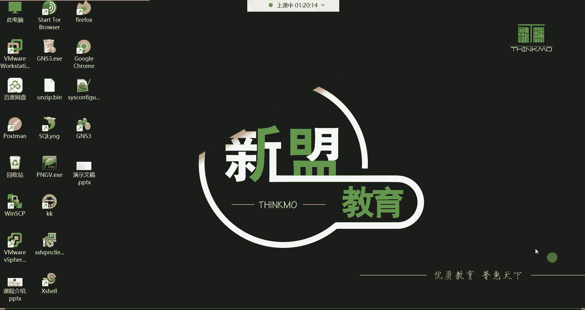
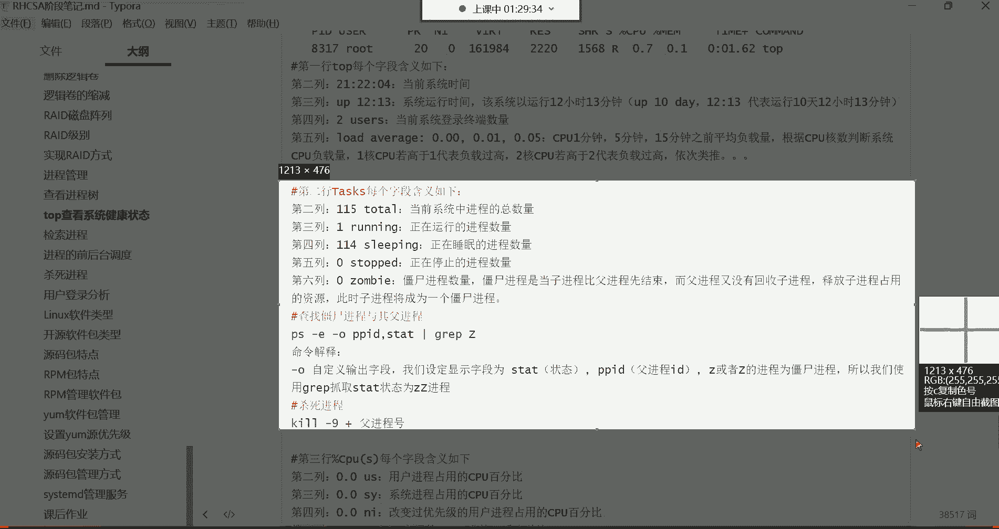

# 新盟教育-Linux运维RHCSA+RHC培训教程视频合集，全网最新最全最详细！ - P29：红帽RHCSA-29.top系统健康检查 - 广厦千万- - BV1up4y1w729

好，都回来了吗？各位，我们继续吧。😊，喂喂喂，好，都回来了是吧？好，那下面呢我们来给大家讲解一个top泡命令。😊，topop命令。它主要功能是用来叫动态查看系统的性能跟系统的运行状态的。

类似于windows里的那个资源管理器。也就是说我们在用windows的时候，我想看我系统里边的一些资源的话，可以通过资源管理器啊这个任务管理器来看哈。😊，PS是静态的PS是静态哈，它是动态的。

而且呀还有还有很多信息PS显示不出来。所以top命令呢它就像一个资源管理器一样，它可以帮你分析你系统当前的一个。比如说我的一个性能。😊，这个性能里边可以有哪些呢？

比如说我当前的一个系统的一个内存CPU看到了吗？有内存的，有磁盘的，有网络的，有CPU的，看到了吗？哎，这些信息呢都可以从这里面看。这是不是就top命令啊？啊，不是这是不是叫做这个任务管理器啊？

那top命令干的事跟他是一样的那他是不是比PS要强大？😡，PS你能够分析出来，比如说我这个当前什么什么网络之类的，可这可以吗？😡，分析不出来是吧？啊，就是top也top也分析不出来。

但是一般他也不用分析网络。😊，但是它是动态的，他可以实时的观测我当前的CPU内存，还有这个。嗯，其他的进程信息都可以。

所以这样面令你直接敲的话呢。来看啊top回车。他就给你显示这样的效果了，但是它是动态的，你看了吗？这个界面当前是不是就已经被套号命令给占用了呀？而且你看它是不是一直在动啊，你看到吗？一直在动啊。

而PS呢，这PS你看我们说这个我们再开一个终端哈，在这儿。😊，啊，不用安包哈，不用安包，本这种东西系统自带，这玩意就跟windows里那个任务管理器一样。

那windows的任务管理器需要你自己额外安装吗？😊，不需要你安装系统的时候他就给你安装上。然后这是PSAU你发现它就不一样嘛。这PSAUS它主要就是给你看系统里面的一些进程信息。看到吗？

他可以帮你列出每个进程占用多少CPU占用多少内存。但是有很多信息他列不出来哪些信息呢？你比如说我们在top里边多少行呢？看看。😊，一行两行、三行、四行、五行，再加上下面这个六行。

第六行才是那个PSAAUS那个命令列出来的是PS。AUX你敲一下，他会帮我们列出来每个进程的PID然后用户是谁啊，包括进程的状态看到了吗？占用CPU百分比。

占用内存百分比哪条命令产生的第六条第六条数据才是。第六条哈才是PSUS这个命令呢，给我可以帮我们列出来。但是上边1到5，你发现PS这条命令列不出来，能理解吧？那第一行到第五行，这个代表是什么意思呢？

这每一行啊，这信息啊都非常非常的多。😊。

我先来说第一行哈。

每次讲到这儿啊，哎呀我都感觉哎呀。能都能把自己给讲混了哼。这几乎没有操作啊，你只需要去知道每一行的每一列代表什么意思就行了。我们来从。第一行开始啊，就从第一行开始说。好。第一行看到了吗？

就top mini这一行，然后第一行呢第一列代表什么意思呢？就这儿。第一列。这个代表当前的系统时间。那么当前系统现在是几点呢？15点04分。看到了吗？然后后面这up是什么意思呢？对up。😊。

它代表是你系统已经运行了多久了，系统的运行时间。那这个位置啊，如果是一冒号27，就一小时27分钟。这个位置啊，一冒号27就是1小时27分钟。但是在生产环境下的，企业服务器它可能运行的时间要比这个要长。

好，那企业服务器一般它怎么表示呢？一般呢用天数来表示。比如说我这个服务器我已经运行一年了。那运行一年的话，它怎么表示呢？叫365D。365D后边呢再跟上具体的，比如说多少个小时，比如说4小时。

然后冒号多少分钟，4小时20分钟，它是这么表示的。所以在这个行业里边，就很多人喜欢干嘛呢？把自己服务器的这个运行时间给它发布到网络当中去做一个炫耀。比如说我这服务器已经运行了多久了呢？啊。

这服务器现在已经运行了这个，比如说你看他那天数哈，它天数，比如说。😊，哎，1000多天了1000多天了，就是嗯我们说这一年365天。一呃一年365天不是20多年，没有那么夸张哈。😊。

那个两年多没有关机很正常的，对一个服务器来讲，两年多不关机不重启。所以这位置呢它的天数应该是1000多天。就证明说他维护的好，我这服务器都没有重启过，能理解吧啊，这作为一个炫耀哈。😊。

然后还有一个用户2这个2us瑟代表的意思是当前登录系统的终端数量，它是终端哈，就是你当前有几个终端在登录这个系统，它就显示几它不是用户数量哈。我现在如果说同一个用户再开再开一个终端，他这数它也变。

现在三个终端了吧，你看那这个位置时候就变成三了呀，就是当前几个终端在登录，它就显示几。然后右边这个low。嗯。这个呢叫做平均负载量。那叫这个。CPU的155的平均负载量。这个155是从左往右哈。

这是一分钟的负载，这是5分钟的负载，这是15分钟的负载。那对于这些负载量的话呢，也是我们衡量一个服务器忙与不忙的一些非常重要的数据了。比如我当前服务器如果比较忙的话，你怎么才能知道他忙啊，你不能听声。

你说哎呦我这服务器这风扇转的转的太快了，这声音太大了。我这服务器当前是不是太忙了呀，你不能通过风扇的转速去判断它忙不忙。你得看CPU。所以怎么判断呢？哎，就看这三个值。对，就是说在最近一分钟之内。

我的CPU的负载达到什么程度了。在最近5分钟的时间内，我的CPU负载达到什么程度，但是它永远都是最近的时间。注意哈，永远都是最近时间。😊，然后呢，最近15分钟我的CPU负载达到一个什么的程度啊。

但是它这个数怎么我们去怎么去计算呢哈？这样算。它得根据CPU的合数来判断系统的CPU负载量。你比如说我这CPU多少核，我CPU4核的。如果CPU四核心的话。四颗星哈。如果CPU四核心的话。

那这个位置如果说。达到一的话。它代表是一个核心的负载量等于百分百。他是这么计算的。能列害吧。啊，所以说它这个数的，如果是比如说是这个1。0了，在这位置哈，如果变成1。0的话。1。

0它是代表说一核心的CPU是百分百的状态。那如果这边变成2。0呢，那如果是2。0的话，那它这位置就代表两个核心。两个核心的CPU当前是属于百分百。那如果你说我电脑里面我一共4个核心。

那如果说我一共4个核心的话，唉，那这个位置我应该怎么判断我CPU的这个什么呢？负载已经是超负荷了呢？哎，4。0。如果这边是4。0的话，就证明你这个CPU现在已经是严重超负荷了。但如果是2。0没事。

还有两个核心。因为CPU它因为这个CPU它得用的时候呢，它怎么用的一个核心，一个核心去用。比如我一个核心用满了，我再用第二个核心，第二个核心满了，再用第三个，第三个满了，再用第四个。😊，他是这么回事儿。

能力吧，如果你发现这位置，哎才2。0，没事，我还有很多个核心可以用，是这么回事哈。😊，好，然后这是具体的时间，他永远都是最近最近一分钟，最近5分钟，最近15分钟。啊，这是CPU的一个平均负载量。好。

那这是第一行给大家说清楚了吧，是不是当前的系统的本地时间，当前系统已经运行了多久了，然后有多少个终端在登录，然后CPU的一个平均负载量。Our rent and load our rent。啊。

那第二行代表什么意思啊？这第二行。

叫tas克斯。对他这个是啊。

这是代表进程信息的。第二行。然后。在这个第二行里边呢，我们。从左往右给大家说每一个列哈，第一列177。偷他啊，这。代表什么意思呢？这代表。当前系统中的进程的总数量。就是我当前系统里面有多少个进程。

这个位置177个就是总共的进程数量。好，那多少个进程在运行，一个进程在运行。只有一个在运行。我这一那也就说我现在有176个进程干嘛呀？在sleep看到吗？在休眠呢，在睡觉呢，在后台睡觉啊。😊。

现在只有一个进程在运行，哪个进程啊，我通过下面可以看得到吗？哦，手机的问题是吗？我把手机拿。😮，现在还有电流程吗？我把手机。放远了。正电流声。还有是吗？怎么会有这种电流声？

那我们现在我那我们现在不能乱动啊，它是不是一阵一阵儿的呀？😡，是一阵一阵的呢？如如果说这个是一阵一阵的呢，我们得这个先坚持一下。等下课以后呢，我把这个麦克风哈重新插一遍。不知道我现在不能动，现在一动。

😡，我们那个这一节课的录屏就。没声音了。又来了是吗？我看一下哈。

还有是吧，暂停一下啊。