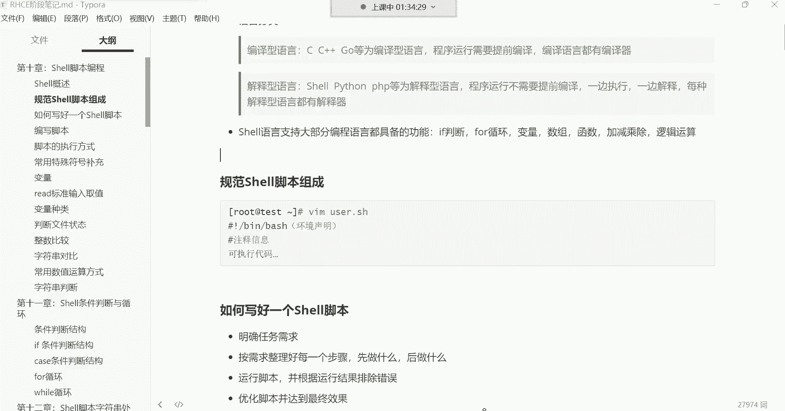

# 新盟教育-Linux运维RHCSA+RHC培训教程视频合集，全网最新最全最详细！ - P38：红帽RHCE-2.编写脚本、脚本执行方式 - 广厦千万- - BV1up4y1w729

好，各位都回来了吗？回来的话，我们继续开始哈。😊，回来的话给我刷波一，我们继续沿着上节课的内容去讲解，我们去分享。好。

那接下来呢我们来说说这个。继续说这个事有脚本哈，这个私有脚本。好，喂喂喂OK这个se脚本呢，我们这个前面已经实现了一个非常非常可以说是简单的脚本的功能。就是通过脚本。

我们输出一个hello word简单吧，是是把命令往脚本里面写，然后给脚本加上执行权限一执行就可以了呀啊，非常的简单哈啊，没有什么难度系数可言，你只要知道这个命令怎么用就行了。

那我们为什么要写一个这么简单的脚本呢，因为这个主要就是如果是第一次接触se的同学呀。

如果你是第一次接触摄的那其实我们的这个入门的脚本。啊，就是hello world，这个大家必须要什么呢？啊，必须要我们说要走个过程，为什么呢？因为这个编程。始于hello world啊。

如果大家学学呃学习过计算机专业的话。它是这样子的。比如说你在这个学习C语言的时候，那你在C语言里面干的第一件事儿就是什么呢？请用C语言在屏幕给我输出一个hello word。那你说你要是学习pys了呢？

😡，啊，那你如果是学习python的也一样啊，请用python语言给我在屏幕输出一个。hello world好那你说我是学习java的啊，你学习java的也不例外啊。

请java语言给我在屏幕输出一句hello。😡，Word。啊，那我们学习se的那我们也不能坏了人家的规矩是吧？我们用s语言在屏幕输出一句hello world。Hello word。对，这是一种仪式。

叫做编程始于hello world。呃，这个仪式是谁流传下来的呢？这个仪式啊是C语言的老祖宗，就是那个叫丹尼斯里奇，丹尼斯里奇他呢哎给我们就是流传下来的这种仪式啊，你只要是学习编程的。干到第一件事儿哎。

咱们就输出一个hello world。能理解吧啊，但是如果你你如果想用C语言输出句hello world。😡，哼可没有这么简单。你想用C语言说出一个hello world，哼你自己写一个ic的命令去。

😡，你自己写一个ic命令去，然后你再用ic命令给我输出一个hello world。😡，能美奖吗？😊，嗯。😊，好。那接下来我们这个对于设有语言，我们没有必要搞得那么麻烦，直接就用别人现成的就行了啊。

用icle输出一个hello word好，那基本的流程大家了解了之后呢，下边我们对于脚本呢就是。😊。

怎么样才能写好一个脚本？想写好脚本呢，你像。我们前面的那个没有没有任何的难度系数哈。你就像如果我们真的是遇到一些复杂的脚本需要写的话。😊。

非常复杂哈。你比如说我给大家看一个哈。😊。

脚本呢有很多的这个思维逻辑，这个大家就是一定要什么呢？一定要掌握它的规律。你要把它的规律给它摸透了，这种东西啊，你写的时候就不会。

被逻辑搞得特别的混乱。嗯。我在讲。讲什么的时候呢？这儿有一个。在讲jaice的时候啊，在讲jab的时候会用到很多脚本。这里边啊大家可以看一下嗯有python的脚本，看哈。

这里边有涉及到python的脚本。你看你看点PY结尾的好python脚本。好，点SH结尾的好，设有脚本。那有很多脚本，还有这种大家可以看一下哈。😊。

很多脚本呢。你们看一下哈，就是对这种东西上来井号叹号做个环境的说明。然后下边像这种事情哈就是。😊，你说如果一旦涉及到我们这个脚本里边，你看大家看一下这里边多少行代码啊，看到了吗？😡，看。非常多吧。

上百行。看到吧？没有啊，770多行没了，下编啊70多行差不多吧。那你想想这一堆。代码如果你的逻辑稍微混乱的话，比如说你在写着写着，突然间就是逻辑乱了啊，这行代码可能说跟接下来的所要做的那些代码。😡。

他这个逻辑上说不过去了。好，那接下来就报错就报错哈。所以想写这种脚本，你就得明白它的逻辑。先干什么再干什么，他们之间不能冲突，能理吧？这都是啥？这这个你们现在没有必要去研究的，你就知道这种东西哎。

逻辑很重要。😡，我们刚刚写的那个脚本，那需要逻辑吗？你只需要知道icical命令就可以了，是不是啊？但这个呢你发现啊除了这个以外，还有像一些其他的脚本。比如像这个脚本，这脚本也一样，都得需要有逻辑。

看到了吗？😡。

看但是这个甲板里面我是加注释了，我加注释了哈那每一行都加注释了，但这甲板也内容也非常多，看到吗？😊，内容非常多哈。看到吗？将近70多行。所以这种东西如果你一旦有一行逻辑混乱。好，那你这脚本就。

就我们说就全都完蛋啊。

宣都完了，没关系啊，后期你们也可以洗。其实这种东西你们也不有没有必要去洗。对于现在的运维来讲啊。你们知道吗？一个在运维在这个行业当中可不是说这个一年两年了。

好多的这个现成的东西呢嗯好多的现成东西大家是可以直接拿过来借鉴的。😊，啊，我们是直接拿过来，别人写好的，你拿过来借鉴就可以了。不需要你能够像这个这个牛逼的大神一样。

能够噼里啪啦的能够自己写出这么一个脚本。但是你只需要能够看懂别人的脚本，能够改一改就可以。哎，这是我们我们现在学脚本的一个目的，能理解吧？😊，你看我们这个脚本。

你说我们怎么样才能写出像人家那样的一个好的脚本呢？😡。

你看人家这这个啊当然这脚本也是我自己写的哈。当然你就像这种脚本的话呢，你说我我们怎么样才能这个写出来这样的脚本呢？而且最终功能能够帮我们实现呢。😊，啊啊，并没有自夸。其实这脚本非常简单。

这个脚本非常非常的简单哈。只要如果大家学到后边。😊，那你们学到你看这里面有很多什么gra AWK。如果大家后期学到的时候啊，其实你们再看这个脚本就没有任何的难度系数了。

可能现在你会觉得你说哎呦老师这脚本我看起来简直就是非常的高大上是吧？这个也非常的规整等等等等之类的那只是现在你们刚开始接触。当你们接触时间长了，你们就会觉得哎这种东西真的很简单啊，非常的简单。😊。

呃，但是怎么样才能写出来呢？这这种东西它有一个思维逻辑。这个思维逻辑就是你像我下面给给大家准备了一些这个啊如何编写也好，一个适有脚本的一个一个流程啊，这个流程非常的简单，就是第一步。

我们得明确一个任务的需求。😊。

就最终我想干嘛？😡，你比如说最终我想是呃我想搭建一个L平台，叫LNLP的一个主流的网站平台。好，这是你最终的一个需求吧。😡，好，这边意就跟做项目一样，做项目。

我们这个项目最终要达成一个什么样的目一个目的。哎，得先有这个什么呢？得先有这个需求。那接下来呢有了需求之后呢，咱们就开始去干嘛呀？去整理好每个步骤。哎，我们应该呃这个想达成这个目标，我们应该先干什么？

就是我的第一步哎，我的第一步我应该先干什么？然后我的第二步在干什么？我的第三步。😊，啊，第三步、第四步第五步。第六步等等等，我应该。怎么实现这个功能能理解吧？那那一旦这个脚本写好了。

那你要对你的脚本做一个什么呢？做一个测试啊，要运行它看看啊这里边有没有一些报错。如果有报错，你得去看看到底是哪里不对劲儿，得去修改啊。最后呢再经过一系列的优化达成最终的一个效果。

这是一个写脚本的一个最简单的思维逻辑。这种逻辑非常的。嗯嗯。非常跟我们的生活中的一些事情非常相似。那生活中哪些事情呢？你比如说你在生活中你遇到一个女孩子。嗯，你看到一个女孩子长得特别漂亮。

你说这女孩子啊哎特别符合你的择偶标准，嗯，就是我们说肤白貌美大长腿的啊，反正呢特别符合你的审美标准。你然后你就起反应了。那接下来你的需求不就上来了吗？好，你的需求上来之后，你不能上去就去这个。

去这个抱人家去上去就亲人家，你这这是肯定不行的，你得干嘛呢？你是不是得。😡，开始去想一想我应该先做什么事情。我第一步我应该去，比如说要个联系方式是吧？第二步我再去跟人家。

比如说这个做一些这个情感上的沟通啊，做一些情感上的沟通。然后这个聊着聊着呢，可能说哎觉得他确实是我的那个。心中所想的那个他，然后接下来。你是不是就开始跟人家约出来吃饭呢，吃饭看电影。

然后看电影呢还不能看太早的电影。你如果看太早的电影，一般七八点钟结束，人家可以正常回宿舍啊，那一般你这个最终可能你的目标还达不成呢？所以一般得看那种完整的电影一般12点以后的啊，宿舍也关门了。

这时候呢你说这个哎呀宿舍也回不去了，是不是啊，这时候你就开始谋划谋划。你说哎呦这附近有一家什么小宾馆，这小宾馆呢，非常的不错，里面有什么这个主题的大床房啊。

里边什么各种什么鞭子什么手铐什么什么这个那个的这都工具非常的齐全是吧？这个这个这女孩子一听哇塞这么刺激吗？是不是对非常刺激的时候，那行了，那宿舍也不回了是吧？我们就去外面去住一宿吧，是吧？啊。

那你这最终不就你的目标就不要达不就达到了吗？所以我们说对这种一。😊，非常简单的思维逻辑，你知道吗？一个非常简单的思维逻辑，就是你你先有需求，然后你再整理你的每部需求，你不能上去就。😡，是不是啊。

这就是我们所说的一个简单的思维逻辑哈。😊，好，那接下来呢咱们继续编写脚本哈。第一个脚本没有任何的难度可言哈。😊。

啊，怕解释不清楚嗯，那接下来呢我们这个脚本开始写哈，我们开始写，再写一个入门级别的脚本。😊，比如说我想创建个账号啊，创建账号的话呢，正常在面行里面怎么创建呢？us ID比如我创建个usE。好。

那这个账号是不是就创建好了呀，然后再给它设置个密码。😡，密码11好，12号了，这时候那接下来换做脚本怎么写？看看各位换作脚本是不是。打开一个文件，比如说那么叫us色爱点SH。

然后在里边井号叹号做个环境的声明。我的解释器是并下的拜事。那要不要写注释呢？注释看情况，你想写就写，不想写就算了，是吧创建系统账号是不可以？然后接下来。😀No。万花丛中过，片叶不沾身，然后那个命令呗。

那Uide在命行里面怎么写的，是不是就Uide给我建一个UC2。😊，然后接下来给他它设置个密码，passWDU2。那我问一下大家，那你即便是把命令写到文件里面了，你能这样吗？

你比如说我能直接都给他命令写在一行吗？😡，嗯，多了个地是吧。注意啊，即便是我们往文件里面写，你也不能写到一行，能理解吧？这玩意儿在文件里边的每一行就像命令行是一样的啊，就就像命令行是一样的，能理解吧？

😡，好，你能在命令行里边，你比如说你能在命令行里面这样吗？比如UCI然后建个UC2，然后再这样passWDU32，你能这样玩吗？你肯定不行吧，是不是？所以写脚本也一样，每一行就是你的一条命令，知道吧？

每一行就是你的一条命令。如果你说我就不想折行，你这样写到时候就报错了。😡，知道吧？就这样就报错啊，就没有这样干的。所以接下来我们一般就是这样。嗯，在这儿折个行就可以了。啊，这时候创建用户设置密码。

给UC2设置密码是吧？对。就是把顺序的命令放到一个文档里。那接下来呢我们保存退出，这时候我们是不是可以执行的去尝试试，看看能不能去创建用户设置密码了呀。啊，那趁着modode加个X，加个执行权限。好。

有了执行权限之后，我们就点杠当前路径执行这个脚本。注意看啊，回车。哎。这问题出来了。你们有没有发现他现在这个问题是什么问题呢？就是。😡，我当前的终端呢。卡住了。卡住了哈。

这个终端卡住的原因好像是得需要我给这个账号设置密码。看到了吗？更改账号的密码。那如果说我不更改我如果我不输入密码呢，是不是我当前的终端，也就说这个脚本就无法正常去执行结束啊。😡，没错吧，我不输入密码。

是不是他就一直卡在这儿啊，那这个用户是不是就一直没有正常的创建出来呀？😡，折本并没有真正的结束。那也就说最终目标无法达成。那这脚本就不治呢，为什么呢？😡，如果这脚本我们想象换换成这个备份的脚本怎么办呢？

如果它是一个备份的脚本，那大家想象一下。好，凌晨3点备份是吧啊，凌晨3点备份。然后脚本呢。执行的突然间卡住了。哎，这脚本执行一半的时候。比如这个条本里面哈有那个几十行命令。啊，1234。567啊。

突然间执行到第几条啊，执行到第四条的时候，哎，卡住了。那这脚本还能正常往下执行吗？你说它会跳过第四条命令吗？😡，不会，那你这个备份脚本，等你第二天早晨你到公司里边，你一看啊。

我想看看我昨天晚上的备份数据。好，一看发现哎，这没有啊，为什么呢？哎，这脚本还在这卡着呢？😡，能裂吧？这脚板一直卡在这了。😡，不知情了，为什么呢？他得需要我们给他输入一些。参数。嗯，对，就完犊子了。

这脚本就需要你往得必须像这种得需要我们用户给他输入参数才行，他才能正常继续再往下执行。😡，是不是啊不能不能哈，没关系，只不过这个进程一直什么呢？这个脚本会起起个进程，只不过这个进程一直在什么呢？

在运行着呗。😊，你一占不了多少占不了多少资源的。那像这种情况，关键他没结束啊，没结束，你不能啊，那我等着第二天早上去，我再给他输入一个参数，然后他再去帮我备份吧，有这么干的吗？没没没有这么干的。😡。

是吧。那这时候我就得必须得给它输入参数了。比如E灰车一这样脚本才正常的结束了。这脚本就不智能。不是呢。是不是？那你也不能说好啊，这个我回家里边，我这个定个闹钟啊，这脚本三点之行，我打车去公司啊。

我再给脚本输入个参数。输完参数呢，脚本执行成功了，我再怎么再打个车回家继续睡觉，是不是？所以这脚板里边。大家有一些注意事项，什么注意事项呢？就是很多在命令行里边，我们可以正常使用的命令。

就比如像这种设置密码的命令，在命令行里也没有任何问题啊，我们设置密码是吧？然后给它输入密码，这没有任没有任何问题。但是一旦写到原本里面了。他就不适合。啊，我们只能说他就不适合。为什么不适合呢？

因为脚本我们是希望脚本它在自己执行的时候，你就该干嘛干嘛去了，我不能在这看着脚本，再给脚本输一些参数。😡，那你的脚本就不是能。😡，啊，就不叫就不叫什么呢这个人工智能了，这就半叫半智能，是不是？😡。

所以像有有些命令，比如说像passWD这种命令，你看一下对这种命令，比如我给一个账号设份密码回车。你就得给他输入参数才行，你不输入参数好，不好意思，我就不执行，是不是？😡，所以有的命令啊。

你还不能直接往教本里面写。对，这种叫交互式的命令了，它得于需要用户跟他交互。这种就这种就是我们所说的叫交互式。得需要我跟他交互才行啊，我得我得告诉他密码是多少啊，他再继续执行。😡。

所以脚本呢要避免非交互啊，就不要让我去参与你自己能够执行独立执行成功就可以了。而有的命令是而有的命令在这个系统里面，就是确实是这种交互式的命令，而有的命令就不是交互式命令。比如创建用户这个命令。

它是交互吗？你比如说我建一个账号U43。😡，这个账号不存在，是不是直接创建出来了呀？😡，跟你交互了吗？没有，是不是你给他个用户名创建什么，他给你创建了。😡，那如果用户已经存在了，没关系。😡。

存在也不影响啊，是吧？他就告诉你用户已存在呗。😡，但也不需要你给他输入什么参数啊，也不需要给你交互。他自己能够独立的执行成功。而像passWD这些。😡，还有1个VIMVIM对VIM这种命令，我跟你讲。

也不能往这本里面写。比如说我比如说我我我想去啊这个脚本里边啊，我想通过脚本去改一些文件。😡，你想通过脚本改文件，那怎么改？你说我用VM改好，VM打开一个文件，你看什么效果，ETC的FStable回车。

😡，你看如果你把VNM写到脚本里面了，它就这样。😡，看到吗？他就这样哈。嗯，课堂直接给你提的。嗯。看到了吗？那VIM如果说你这样直接写。😡，那你想一下，我们是不是对VM各种操作。

是不是得需要我们手动去参与？没错吧。啊，得需要我们手动去参与哈。啊，多次违规发送啊，你这看到了吗？啊，课堂被强制退出，已累计多次违规发送。😊，啊，你是被检测出来了，是不是嗯？😊，啊。

所以说对对呀对于这种东西啊看到吗？就是VM也不能写在脚本里边。😊，VIM也不行。知道吧？也不允许的。所以像这种情况下，你想解决其实比较简单啊，你得了解怎么样才能实现非交互设置密码。那比较简单。

比如说见个用户一无所及啊。user4给us侧4设置密码是吧？那怎么样才能实现非交互式是的设置密码呢？这是不icle啊，ic密码比如1234。

然后管道给passWD再加个那个选项杠杠STDIN吧对我不打字，我我我不打字，它检测不出来。😊，😀再说了。😊，再说我也没做什么违法乱纪的事情，是不是？😊，看好。😊，看到了吗？是不是这样可以啊。

然后保存退出。这时候我们点儿杠。再执行这个脚板看一下回收哎。这样可以吧。这样说不可以？用户也创建成功了，密码也设置成功了。哎，这样可以。这样就可以了。所以脚本有个核心思想叫什么呢？

不能出现这种交互式的命令。不能出现交互车哈OK啊，在这里边有些例子哈，接下来下边还有一些就是查看系统信息的一个脚本。😊，呃，查看系统信息的脚本的话呢，在这个里边呃。比如说我想通过脚本去查看系统的版本。

查看内核的版本，查看内存，查看网卡，查看磁盘，查看主机名。这时候如果说通过脚本的话，我们怎么实现？这非常简单。

你说我们原先在面行里边，比如我我要看什么呢？我要看我的操作系统是不是看看文件呢，ETCs透S releasease看系统的版本信息啊，我要看内核，是不是U name杠RS看内核。好。

我想看我的内存福瑞杠H。是吧这里边总的内存。也使用的内存。然后剩余的内存。好，都可以看好，我想看我的根分区的磁盘空间的利用率DF杠H后边加个根啊。

这是我的根分区总容量以使用容量还可以用的容量挂载点是根目录是吧？啊，我还想看什么呢？我还想看我的网卡，那if服康飞哥看ENS326号网卡。好，网卡名字IP地址是吧？然后网卡的入口流量。网卡的出口流量。

是不是啊都可以看好。我看看我的主籍名字。Host name。好，再加个cttrol信息会更多一些。啊，加个cttrol直接连内核也给你显示出来了，看到吗？你的主机名字叫什么？然后你的内核。

你的操作系统看到了吧？嗯，你的系统的版本。啊，这个是你的虚拟机。Vvo威尔的熏机，这里边哈显显示信息会更加详细一些。好，那现在我想看这些信息怎么办？亚马下的软件包有不是。

亚马逊的软件包跟脚本没什么关系哈，没什么关系。😊，啊，那接下来。我要干嘛呢？我要把这些命令写到脚本里边，那叫VM。比如说让它叫ss info点SH这前边叫什么名字重要吗？各位。这叫什么名字重要吗？

不重要，只要你自己看懂，只要你自己知道这里边的命令是啥就行，这也不是给别人看的。脚本怎么写，完全是我们自己用。你也不是为了给别人写，我们又不是做慈善的，是不是？😡，噼里啪啦的写了好几百行脚本，熬夜加班。

头发都他妈的这个掉了这个好几十根儿。然后呢，这脚本是为了给别人用是吧？让别人去干嘛呢？让别人去。获取你的。享受你的劳动成果。这不现实是吧？所以。这种东西叫啥都行，我让他叫。叉叉O啊。

我也不是为了给给别人看，我以后我自己知道啊，这个脚本里边是什么，我就可以了。然，接下来呢？井号叹号杠并且的外省。然后接下来呢，这里面就写呗。😊，看。看系统的版本ETC渗透S杠。release看这文件。

但这里面就没有t键了哈。如果你说老师，那我这没有t键，我非常痛苦啊，你可以在命令行里面先这样ETC托S releaselease，然后复制。😊，没关系。拿过来复制。这是不是也也是一种比较笨的方法呀？

是不是啊啊，你如我想看内核啊，U name。杠RS是不是也行？对，然后我还想看什么？我还想看那个磁盘，那DF杠H跟我还想看我的网卡if副康菲哥。ENS32。嗯，感觉不是个长的方法是吧？啊，可以哈。

然后这个我还想看别的信息，看我的主机名，hos的name幕啊，加个cttrol信息会更加详细一些。然后还想看别的是。😊，是不都可以啊？保存退出。那接下来。陈志默的加个执行权限。然后呢。

执行点杠当前路径执行这个脚本会撤。那是不是就直接干嘛呀？直接。把脚本里的命令都给我们输出了一遍呢。主要是他把结白里的命令都给我们执行了一遍。😡，看了吗？你看他做了哪些事情。

是不是帮我们查看了系统的版本呢？然后查看了内核。查看了根分区，它的一个磁盘利用率，查看了网卡的名字，这一部分是查查看网卡名字的是吧？哎，没有任何问题，看到了吗？下面是查看主机名以及。更加详细的信息了。

都可以都可以啊。所以像这种东西是不是就比较不错呀？啊，写脚本在那个文件夹在哪对在哪个文件夹都行，这也没有严格要求哈。因为毕竟这种东西就是。😊。

他这个。我们写写这种东西啊，你如果你是超级管理员的话，你写在哪个文件夹都行。😡。

但是。如果。这个脚本你想让别的普通用户也可以用的话。如果这个脚本，你想让比如说你系统里面还有一些普通账号。普通账号的话，你想让他们也可以用这个脚本。那你能把这个脚本放在root。管理员的加目录吗？

肯定不能。为什么呢？如果你放到管理员的加目录，管理员的加目录，别人能进得去吗？管理员的加目录。其他人有权限吗？是不是连进都进不去，所以你把所以你到时候你是写一个脚本。

然后你告诉你们公司的这个其他的人员了啊，我给你们写了一个脚本，这脚本呢，这个可以做什么什么事情，然后呢你们到时候到服务器里面可以直接用了啊，然后这个你告诉别人了。

然后别人呢到时候登录服务器说哎那这脚本在哪放呢？你说啊在我的加目录里面放呢，你自己去执行吧，啊，你自己去执行吧，然后别人说啊在你的加目录里边是不是啊？那别人说那我能进得去你的root的加目录吗？

是不是这不太现实啊，所以这我们一般脚本，如果你希望别人也可以执行，就给他单独在跟目录创建个目录就行了。你像我们自己进的那个这个目录。😊，我们自己建定目录。是不是他的权限，对于这个。其他用户来讲。

是不是他们也能够也能够查看，也能够进去啊。呃，他们进去，如果你希望他们可以执行，你在给这些脚本权限的时候，是不是？就是给其他人也加一个执行权限呢，但是他们可以改嘛，说不可以改。哎，我们也不希望他改嘛。

对，这就比较简单比较简单哈。所以你看我们这个前面这个脚本是不是能够感受到本质就是一个命令的堆积呀。然后脚本里面避免出现这种非交互式的命令，一旦出现交互了哈，这脚本就卡住了。好，然后还有一个核心思想。

就是这脚本是给自己用的。啊，你怎么写，只要功能能够实现就行。好，那接下来我们再写个脚本，什么脚本呢？比如说我现在想通过脚本干嘛呀？😊，呃，把我们前面的那个。亚么仓库什么的，我想给他通过脚本来搭建一下。

通过脚本哈。搭建一个仓库。那这个怎么来实现呢？这时候啊，我们先把这个我们仓库路径的文件给它删掉哈，ETCE点reD这里边呢是这个有我刚刚跑的那个脚本呢。😊，有一些文件给它删掉。好，然后呢。

我记着我还做了开机自动挂载了嗯，开机自动挂载。嗯，这个先不用管啊，开机开机自动挂载。我是前咱们前面学软件包管理的时候，是不是在ETC的FStable这个文件里边。

我们是写了这个开机自动挂载的这个配置了呀。那第一位的CD room挂载到MT的S啊好，那这个就不用管了啊，这一步我们先不用去管它那接下来。😊，比如我现在就想通过脚本啊做一些这个什么呢？

要比如说搭建个软件仓库，主点是搭建本地仓库哈，然后他再安装一些软件包。那这个功能通过脚本怎么实现呢？嗯，对，功能非常简单，配个仓库安安一些常用的软件。就像我我写的这个脚本一样，是吧？

就是对服务器做初始化的。只不过这这个脚本现在你们有很多的这个。呃，技术点还没学，所以呢我我们不能参考这个脚本，这个这个脚本里面会涉及到很多的一些什么呢？这个。我看一下哈。其实也没啥，这个脚本也没啥。好。

我们就拿这个脚本为例来给大家说一说这个脚本啊这个脚本其实还有很多我们现在没有设计的。比如说像这种C的这种东西啊，没有设计。😊，C的这种东西后期可以替代什么呢？VIM。VIM不能往在么里面写。😡。

是吧因为你用把VM往节目里面写VME打开一个文件好卡住了。所以这种东西不能往脚本里面写。所以后面呢我们会学习这个C啊，s在sha脚本里边，我们称之为叫做。S的四剑客。这四节课有。group啊有grab。

做对文件内容进行过滤的。还有范的。对文件或目录进行一个查找的，还有C的C的。就是。可以替代VIM。VNM是交互式的命令，而s的是非交互的，可以对文件的内容进行增删改查。还有一个叫AWK。

它跟它跟这个gra呢是一样的功能，干嘛呀？对文件内容进行过滤的，他们俩干的事儿是一样的事儿。过滤。但是AWK会更加的精确一些，它支持列过滤。比如说这一行里边。我只想过滤某一列。过滤某一列这一行里边啊。

比如说它是我们就拿哪个文件来说呢？嗯，换个文件哈，ETC下的。😊，passWD。这个文件比如说我就想过滤每一行的。每个账号的解释器是哪一个？注意啊，这个文件是不是存放系统用户信息的呀？

然后这里边看如果以冒号作为风格，是不是每一行有七列呀？是不是以冒号作分格有7列。第一列用户的名字。第二列密码战位符。第三列用户的UIDGID描述信息加目录。然后解释器啊。好，我想过滤这个文件里边。

每一个用户的解释器。但是别的。列我不想看，我就想看它的最后一列grape不行，grape直接把整个这每这一行都给你显示出来。能理解吧？但是AWK。非常牛逼grape，你说我想过滤包含什么呢？

包含bech的这个解释器的用户都有哪些？你从这个文件里面过滤，你发现。前面这些信息。我不想要。AWK可不可以呢？可以。AWK。我这样。当然很多操作你们先不用去管哈。看了吗？哎，你看了吗？他只看什么呢啊。

但然这我们还可以匹配一下。还可以匹配一下哈。😊，看到了吗？这就是区别graap可以实现吗？不可以graap，你说我就想看哪些账号用的是balash节释器。用的是半日页写。grape直接就干嘛呀？😡。

只要包含backbitch的这一行都给你列出来了，前面我不想要啊。😡，我不想要这东西。我就想看有多少个数。我就想看这个数，最后我想统计一下多少个，是不是？这个好是吧？没错哈。

所以很多东西呢后期随着不断的学习啊哎。😊。

你们在看这种脚本的时候就不难了哈就不难了。

像这种东西。就这些呢就没什么了，eical echo这种东西大家能看懂吗？😡，这种东西应该能看懂吧，因为什么呢？你挨le什么，他就输出什么呀。就比如说我们前面那个自己写的那脚本。😡。

我们写的这个哪个脚本呢？比如这个叉叉O，我们自己挨口点东西，比如上来。我能不能这样就挨过一个。哎，当然用引号引起来哈，引号引起来代表一个整体啊，我们后期会讲这个引号。这样呢里边怎么写。

随便我为了它的美观，我想怎么写就怎么写，是不是啊？哎，等号也行，比如说第一步。😊，是查看什么呢？写中文嗯，查看。系统版本信息可不可以？12345好，可以。那下面这条命令。是不是就看系统版本的呀？

那接下来这块留几个空格哈，为了让我们自己看icical。😊，5个。好，查看内核信息可不可以？12345。是不是下面这个命令就是查看内核的呀。好，那下边这条命令干嘛呢？12345。查看。跟分区。使用情况。

可不可以是不可以？然后再来一个ic口。查看。ENS。32网卡信息。是不可以？然后icical。这是查看主机名。主机名信息。能看懂吗？接下来再执行的话。看到了吗？这玩意儿就是什么呢？再执行上来呢。

它就先执行icle里的命令呗。你icle什么就输出什么呀？😡，是不是你让他挨过啥，他就给你，你挨过后面跟什么，他给你输出什么呀？😡，没错吧。哎，就这样哈，第一步查看系统信息，第二步呢查看内容信息。

长安根文居。下面查看网卡。是不可以。嗯。所以这种东西。我们效果不就一样了吗？是吧？第一步我先告诉别人，这个先做了一个什么呢？啊，就这个脚本是做系统环境初始化的。😡，然后呢，这sleep3什么意思？😡。

就是这脚本呢，它执行太快了。执行太快，对于别人来讲，可能说哎呦看起来有些。刷一下子给人的感觉就是。😡，没有体验感。啊，没有体验感，我们可以这样让它变慢一些。哎，比如第一步看到吗？先挨口查看系统版本信息。

然后执行这条命令是吧，那接在这儿，你让他哎就这条命令执行完以后干嘛让他歇会儿？😊，sleep歇几秒呢，比如说歇。3名。可不可以啊，接下来切3秒之后再执行这条命令。那sle不就休眠吗？

执行完这条命令给我休眠3秒钟，然后再去执行下面的这条命令啊。😡，再休眠3秒钟是不可以？这呢。sleep再休眠3秒钟。sleep在下面审秒钟，那下面就不需要了。在执行。来看哈哎看。第一步，查看系统版本。

接下来查看内核。哎，你发这就有点体验感了是吧？那查看根分区是吧？哎，查看网卡嗯，看哎查看主机名。对这种东西是什么呢？这种东西。

