# 新盟教育-Linux运维RHCSA+RHC培训教程视频合集，全网最新最全最详细！ - P39：红帽RHCE-3.编写脚本、脚本执行方式 - 广厦千万- - BV1up4y1w729

就是。让他执行的慢一点。这样慢一点啊哎。这样是不是可以啊？你不然像这种命令执行很快的。😡，这种命令执行的非常快，唰一下子就给你显示出来。那你要刷一下显示出来，你这这种东西。😡。

你可都不知道从哪儿开始看了。😡，是不是啊哎都不知道从哪看起了啊，自己得回去翻一翻啊，这个这个脚本能做到什么事情，是吧？😊，啊，可以哈，他这注释不区分英文跟中文。注释不不区分哈不区分，中文也是可以的。嗯。

时接慢加sleep就加这种东西哈，sleep让它休眠就执行完这条语句给我休眠。几秒钟然再执行下面的语句，sleep就是休眠，它不是慢，它不是执行慢，是执行完这个语句。等待3秒钟休眠嘛，等待3秒钟。

然后再去干嘛呢？使用下面的语句。执行完以后再等待。哎，这样让别人看起来的时候呢，就是能够有一个什么呢？有一个停停顿的这种。时间。啊，别人知道这个事情呢，别人知道这脚本哎，他的每一步在干嘛，在干嘛？对。

不然毫无体验。处上。那这时候嗯。这时候大家就可以能够看得懂这些命令了吧。当然很多命令呢像什么防火墙的呢，我们现在没必我很多防火墙我们现在还没有讲呢。😊，防火墙的命令还没有讲。

所以这个位置呢大家在这个脚本里边可能说呃会有很多看不懂的，那没关系。😊，挑能看得懂的看。下边这种。干嘛呀？创建个阿里仓库，创建阿里仓库。这里边我们第一步2M杠2F清空了一下这个路径是吧？啊。

接来呢怎么创建阿里仓库啊，就是你只需要能够把那个阿里仓库的文件下载下来不就行了吗？这命令复制粘贴进去不就行了吗？阿里仓库的地址。😊。

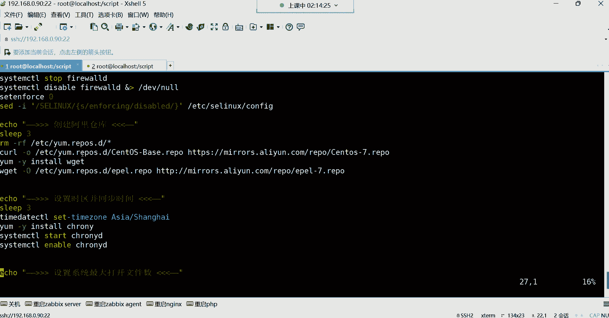

是我前面都给你们看了呀，阿里仓库你想去找阿里的地址。

你想找阿里的地址。啊，不是这哈。客户看了说太慢是吧，然后花钱优化sle石。😊，啊，可以啊，阿里的地址是不是点进去？😊，这是不是这是地址，你拿过来复制粘贴就可以了呀，是不是啊我们前面讲网络仓库的时候。

就这种东西。比如说我希望创建阿里仓库，是不是复制粘贴呀？😊，没错吧。啊，这种东西是复制粘贴过来的，你只要把这个命令放到脚本里面就可以了。复制复制粘贴到脚本里边。😊。

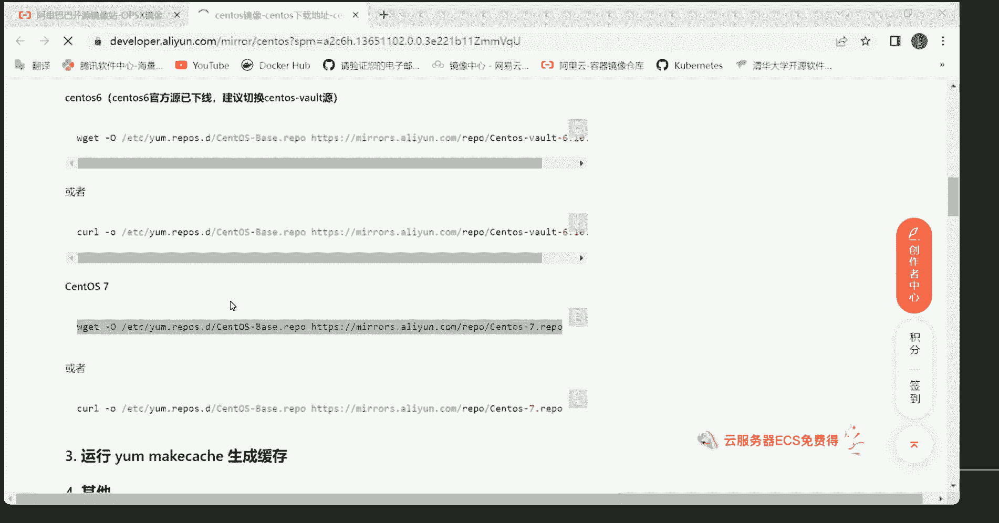

是不是不需要你做什么事情吧，然后你看亚么刚外in此安装一个包，安装一个Wge。因为接下来它需要Wge呀，我们没有没有的话，然后就用接下来先下一个，下一个之后呢，然后再去下载阿里的另外一个仓库。

然后接下来再设置时区域这些东西我们还没有讲呢，还没有讲，没关系。啊，这东西你们先不用管。接下来呢包括系统的内核一些优化等等等等这些。其实现在这些大家大多数也都能看得懂。😡，也都能看得懂。

那如果让我们自己写搭建本地仓库，我们脚本怎么写？VM就让它叫什么呢？叫local点儿。啊，local，然后呢什么y点SH可不可以啊，叫本地的ym。是不可以名字叫什么？是不是完全靠我自己的心情啊？

然后接下来。文件里面。井号叹号杠变一下的白。你可以试一下，你可以看看那个扣可不可以哈。因为这个我一般还真没有那样尝试过，但应该是没有问题，应该用扣也可以。

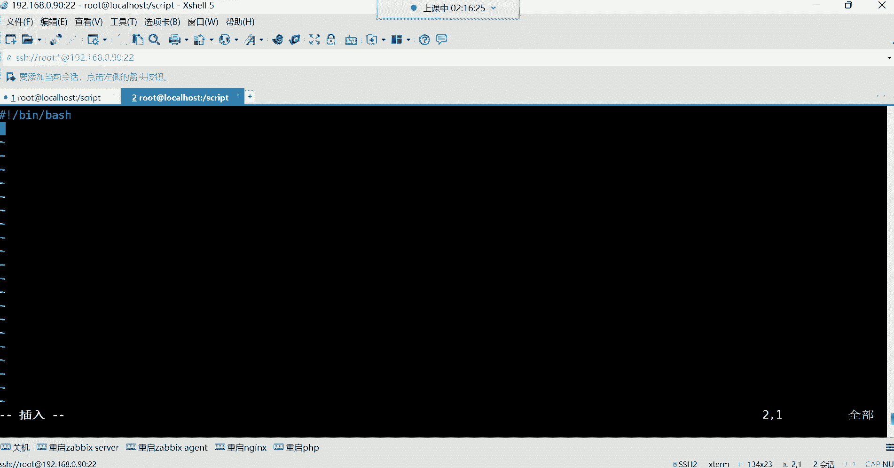

可以哈。

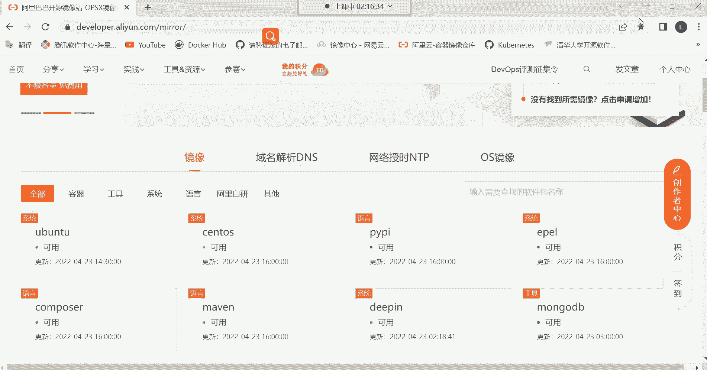

好，那接下来我们第一步干什么事情呢？呃，如果没有挂载，是不是应该先挂载呀？mount是不把DV的CDroom挂载一下呀。但是我们前面好像挂载过呃，我们看MNT的sin目录说挂载过呀。

我先给它卸掉Umount。卸掉哈。卸了以后干净了吧。好，接下来我们放到脚本里面，让他自己帮我挂，把第一位的CD room挂在了MNT的渗头S目录。😊，做个挂载。接下来正常来讲，我们会清空一下。

亚么仓库的路径的，把这里的文件都给它删掉。如果是本地的哈，如果是本地，我们会给它删掉。因为如果你服务器在局域网里边。你搞那些这个网络仓库是没有意义的。所以一般如果我们是自建这种局域网的仓库的话。

我们会把这个路径的那些文件给它什么呢来给它删掉。所以一般还会量RM杠2FETCER点reD。如果记不住，也不想记。是不是可以复制啊？是不是啊在面行里边。复制。是不可以？那像这种叉筛我都比常比比较简单。

你比如说我选择这种叫瓷砖排列。瓷砖排列是吧，左边用于什么呢？用于我的这个一些演示啊，一些这个左边用于t键，右边呢啊我就写脚本呗。好，那接下来在干嘛呢？再开始去。创建这种仓库文件。

创建仓库文件是不是应该这样啊？VM在ETC的re地下面编写一个仓库文件呢，要loc点repo啊。是吧。然后把仓库的配置往里面写是这样的，仓库的名字。Local。仓库的描述local。随便写哈。

渗透S描述嘛？贝URL这就不能乱写了吧。等于本地的话就是用fi冒号两个斜号来指定。在哪呢？本地是不是在MT的斯南斯目录啊，软件包。哎，拿过去。然后接下来GPGcheake等于0，不检测签名。啊。

那Enable呢也得写一个Enable等于启用仓库不仅的签名，是不是啊？那接下来这个是不是可以。粘贴到这里面呢。是不是？当然我们是写脚本啊，这种东西就是为了给大家演示这边我不保存。是吧好。

那现在问题来了。😊，如果换到脚本里边，我不用VNM，我怎么把这个仓库里的内容给它放到这个文件里面呢？如果换到脚本。第一，可以使用icical。Ile可以实现内功能。嗯。不是这种一般不用C的。😡。

是不是太麻烦哈。Ile可以。ele结合这种重定箱的方法，你看你ele什么，比如eleABCD。重定向到一个文件里面，比如1点TAT。你看一点TT。是不是进去了？好，那你说我现在是不是可以挨le什么呢？

ele仓库的这些配置啊。O这Iical。中国号仓库的名称。放到1点TATT里面。1点TATT那边。是不可以，那这个一点TT是不是就有仓库的名字啊，接下来我再ecle一个。仓库的描述。Local。

然后也也给他放到这个1点TATT里边，我再看1点TATT好，原先的没了。是吧原先挨Q没了，所以怎么办？😊，还得用两个大于号，因为一一个大于号是覆盖，两个大于号是追加，是不是啊。

所以这时候我们得先得先这样。先把这里的内容给它清空一下，怎么清空呢？就icical。直接定。1点TAT可不可以呢？可以。那里边的内容就空了，为什么空了呢？为什么会空啊？因为我什么都没挨口。

我什么都没有挨口。那这里面就是一个空行。这一个空行。ele是啥意思？嗯，ele是一个输出的命令。这些前面不都讲过吗？前面都讲过哈。在IHCSA笔记里面有。好，然后那我还还就得这样呗。

icical是不是啊？比如说ele一个仓库的名称，那就是中括号。然后。追加到哪呢？当是你第一次你不需要追加。如果是第一行的话，你可以这样覆盖也无所谓。因为毕竟是第一行嘛。好。当然一般情况下。

我们对于这种文件来讲，它里面有空行也不行。有空行也不行。所以把文件给它删掉，我们再重新演示一下。Iical。好，仓库的名称local放到1点TATT好，这个1点TT里面是不是就有仓库的名字了？

接下来icical。仓库的描述。local追加到一点铁T里面，那这时候一点铁T里面就两行了啊，在icical。仓库的软件包的位置。在哪儿啊？是本地的MT的信托S啊。啊，追加到这个文件里面。

那这时候这个文件是不是就三行了呀？软件方的位置也进去了，是不是啊呃，在icle。以nbel等于一启用仓库的配置也给他追加到这个文件里边。是不是也可以啊？啊，那几行了。123。4。

再ic口GPGcheck等于0，再追加到这个文件里面，是不是也可以啊？好，五行，那我可以这样写吗？我是不是可以按照这种方法，按照命航这种方法一行一行给的挨括过去。但是。太low了。

如果这样写一点水平都谈不上了。啊，如果这样写，这脚本千万别拿给别人看。如果你这样写的话，你这我告诉你哈，你这里边什么效果呢？icical啊，仓库的名字。😡，是吧追加到。哪个路径啊。

是不是ETCE点repo点D下边，然后让它放到local点reple文件里面。好，那接下来是不是还得继续iccle没错吧，啊，e，然后再这样追加文件名。路径是不是还得放上去，接下再挨口。

是吧然后再追加放这文件里边，然后再这样。在icical。在追加。是不是。这样在I口。在追加。你们。你们知道我咋粘贴的吗？😡，粘贴在插烧里边有一个功能，在工具里边。

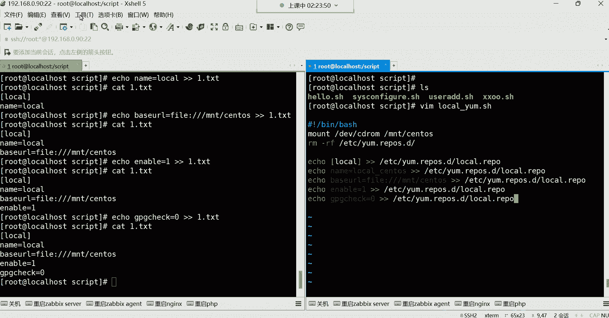

选项。水外跟键盘看到吗？嗯，我的附手粘贴都是都是插销里的一些。那个快捷键哈，比如说我复制，为什么我一划可以复制呢？因为啊里边就有个功能叫将选定的文本自动复制到剪贴板。我一勾选这个我划。

只要是我划中的任何的内容都被自动复制。那我粘贴的时候，我怎么粘的呢？看看。嗯。有个粘贴的操作。不是我粘贴是摁鼠标的那个滚轮一摁就可以粘贴。啊，鼠标滚轮。这是在哪个里边来着？

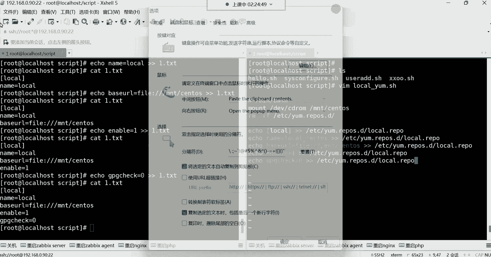

好像是在。编辑吗？嗯。啊，对对对，中啊，对中间按钮哈。对对对啊，就这哈工具选项。😊。

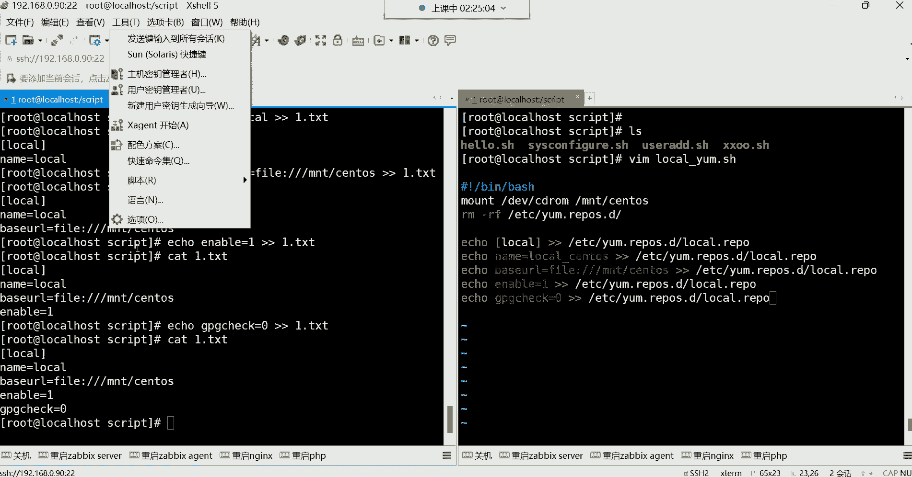

看到吗？中间按钮。这就是一个粘贴的操作。就就是一个粘贴啊，哎，这是嗯向右按钮。是粘贴是吧？

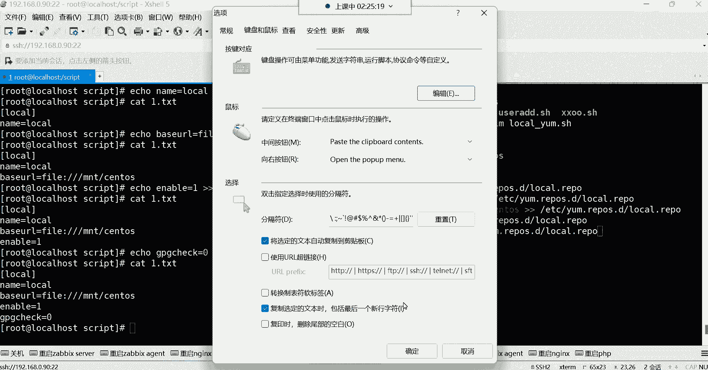

中间按钮。对，就是就是那样的哈。😊，所以说这种东西可以让我更加方便的去在在在这里面进行复制粘贴啊，你们可以自己研究研究这种东西可以百度搜。你比如说叉 sale。

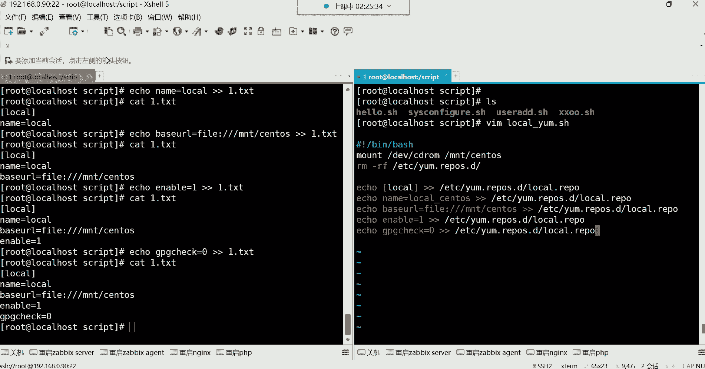

如果说你你们哈你们不知道的话，这种东西啊可以去问百度。

简单的问题，百度还是蛮实用的。你比如说这样叉cel。如何。自动。嗯。啊，如何。叫做一键。粘贴。看到吗？这里边打开叉C选项弹出设置框进行设置。这里边鼠呃键盘和鼠标中键按钮。啊。

这呃什么实现复制粘贴要粘贴的内容，点击右键。然后这边可以自己去搜哈啊，这种方法告诉你们，你们自己去研究就可以了哈，自己研究哈。😊。

是，然后。

你们别到时候说我在这边操作呢，然后你说这老你说这老师怎么这个操作这么溜啊，然后他也不教我，你这狗逼老师是吧？😡，别在背后骂我哈。这种东西是不是都跟你们前还有前面很多东西都跟你们说过。啊，对对对。

就是这个很多东西哈。这种快捷操作啊，包括我快速调用的时候，是不是我都是跟你们讲过ESC加点儿，是不是EIC加点，是不是快快速调用上一条命令的执行对象呢？没错吧，前面都讲过哈。啊，那你说我们这样写可以吗？

我们如果这样写的话。😡，可以啊可以哈。对都跟你们讲过哈，可以，但是。当然什么呢？这种脚本不能拿给别人看，如果别人一看，你这脚本简直一点水平都没有一点水平都没有哈。😡，所以。我们一般。像这种方法呀。

就别这么玩了，删掉。呃，几行123455DD。就这种东西，一旦我们有了思路了。k是不是可以实现这个功能啊，k。是不是？开是不是重定可以结合这种重定向的输入符号啊？没错吧。

前面给大家讲过ca这种重定向输入，你可以直接把内容输入到一个文件里面去。然后他这语法是怎么样用的呢？你看我这个。我在这个脚本里面就用了。太。看到吗？k。这种重电要输入的方法就可以。对。

所以我们就这样哎在这边就这样ca。这种重电输入方法是得先结合重定向输出，然后呢再指定输出到哪个文件去啊，ETC点repo点D下边放到local点repo文件里边，然后再输入输入什么呀？哎。

这时候你要输入内容了。这时候他就会把它就会把我们接下来写的内容给给我们输出到这个路径下的这个文件里面。所以这时候你要输入什么哎，EOF。开始写写什么呢？仓库的名字。仓库的描述。软件包的位置。

是否MT下的。渗托S啊接下来。Enable等于一。G别tck等于0。然后呢，EOF。结束了。这时候他就会把我在EOF开头跟EOF结尾的这些内容干嘛呀？给我输入到这个文件里面。然后保存退出。啊。

我们可以在命令行里面先实验一下，可不可以是吧？k。然后指定随便写个文件哈，比如说这个叉叉点铁体。然后接着呢。充定收入。EOF。接来呢，仓库的名字。仓库的描述。软件包的位置。MT的渗透S，然后启用仓库。

G为T等于0。接来EOF结尾回车。好，看这个文件叉叉点贴IT。叉叉点TATT。是不可以啊？是不是直接我一条命令结合一些这种，比如说重定向输入哎。嗯。EOF是固定的语法哎，EOF是固定的语法。

就是我在使用这种重量输入的时候。要在EOF里边写我要输入的内容。能列解吧，这EOF是固定的语法，没有为什么，这样就像你说。他为什么他的父母会给他取名叫老王？为什么你一听到一听到老王这个名字。

你就觉得他住的离你家不远。这没有为什么。就是一个格式而已。你就知道这个格式可以让我们把我想往文件里面写的内容给给我输入进去就行。能列吧。嗯。好，那有了这个机制了，我们是不是就可以。对于脚本来讲。

比如说我想往文件里面写内容，cat是不是就可以替换VIM了呀？没错吧，是不是ca我就可以拿来替换VM了。对，没错，不是不是输入到脚本里，是输入到文件里面。我现在是想把仓库的内容。对。

这几行不是仓库的配置吗？我想把这些内容给它写入到这个文件里面。但是由于VIM不能往脚本里面写，所以我只能用这种方法，这种方法是非交互的。开。他会把EOF里面的内容给我。重定向到这个文件里面去。

是这么回事。好，那接下来呢我们最后再这样。list验证一下到底有没有软件包，是不可以了啊。保存退出。接下来来试验一下哈。给他个执行权限。Loal点。要么点IC是。加个执行权限。脚本里没有回车没有回车啊。

他一行一行帮你执行。然后我们就直接看看执行它。那是local。回撤。好，报错了，看到吧？啊，下面写嗯low第五行没有那个文件号目录嗯。ETC。repoDloc点repo没有那个文件和目录。嗯。

我看一下哪里的问题哈。😊，看到吗？报错了吧。ETCEM点。Repo their D。啊，这个写错了吗？啊。不是啊。呃。嗯。嗯啊嗯。那也不是这个哈。他和这个没有关系啊，就是没有文件。不啊。

他这个可以创建文件呢。他可以创建文件的哈。这个文件压根儿也不存在，它这种重定向是可以创建文件的。呃，我看一下第五行。嗯，他给我提示。开。ETCy点儿。Report the D。

 local the ripple。啊，我们看有没有那文件哈。😊，啊。😮，没有这个目录啊。不是哈。哎呦哎呦。你们看这儿哈各位呀。看到了吗？不是哈，跟那没关系啊。是这目录被我给删了。😡，它可以创建文件。

但它不能创建目录。我这删除的操作有些大意了哈，是不是应该加个星啊？😊，如果不加星，是不是上面目录直接删了呀？所以你看我这边我推不见的时候，发现没有推不出来没有推不出来哈。😊，所以建个目录去。

目录被我给删了ETC建1个EM点repoerD这个目录啊，这样就好了。啊，所以这个删除是删除这个目录下的内容，你不能把整个目录删了吧，是不是啊你删目录。好。

那他怎么载一个不存在的目录去给你创建一个文件呢，是不是不太现实嘛？所以这时候。再执行就可以了。local点E点IH唉，走你。哎，可以了，看了吗？是不是也可以看到软件包的数量了呀。

那前面说什么挂载这个什么忙之类的，没关系，由于它已经挂载上了，又重复挂。你看现在在那个MT目录，是不是有内容了。那如果你再重复挂载，你看MN把DV的CD。如果再挂载到这个目录的话，它就提这个。

它就提示说你已经挂载了，已经有了，就不要再重复挂载了。😊，因为这个目录已经是在忙碌的状态了，就不要再重复挂载。所以这步不算报错，能列吧啊，所以这个脚本已经挂载了，是不是这步可以删掉了呀？哎，删掉。啊啊。

是不是脚本现在可以了呀？那这个脚本。😊。

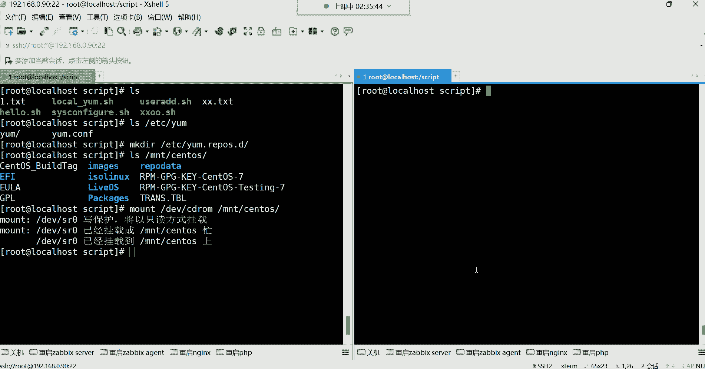

如果说我们想搭建一个本地仓库。如果说以后。我要给所有的机器都建一个本地仓库。那这脚本一旦写好了，我能不能把这脚本给它保留下来？

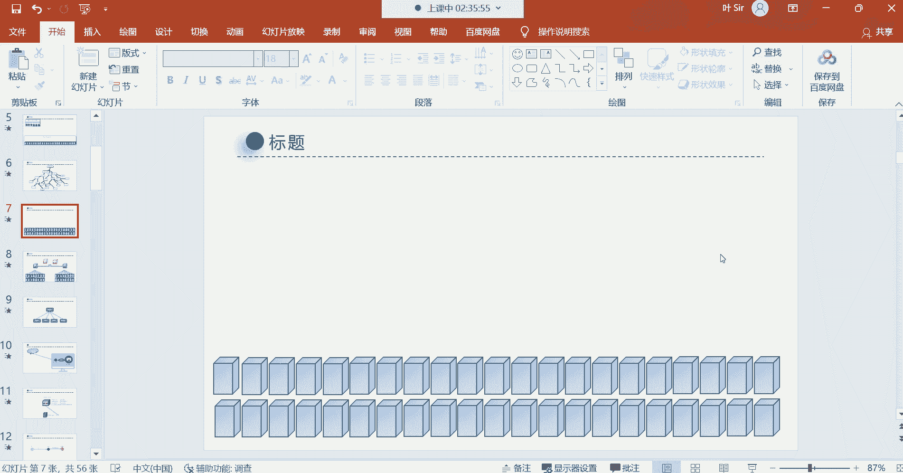

保留下来之后，我哪个机器需要的话，我是不是就给它传到哪个机器，是不是就可以了？没错吧。我不需要再去手动去敲一遍吧。😡，200个机器。

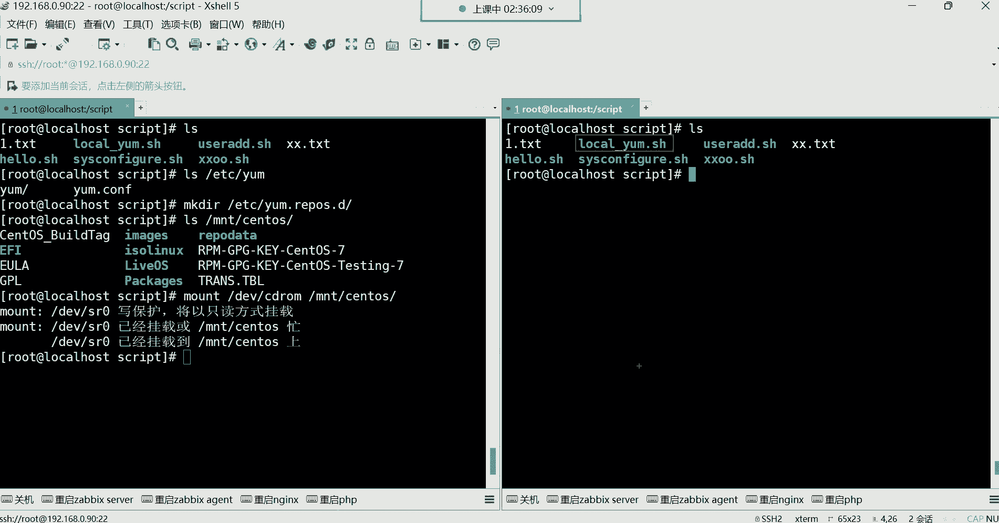

200个机器都需要你做这种同样的操作啊，我们先说我我我们先不说我们那个脚本的那种同样的操作，就哪怕有一些需要你经常做的事情，你感觉很烦，浪费你的时间，而且还没有必要，你是不是都可以给它写到一个脚本里边？

以后再需要做这种事情的时候，把脚本拿上去跑一遍啊，把脚本拿上去，跑一遍，把脚本拿上去跑一遍。是不可以？我干嘛每次都得重复去敲啊？😡。

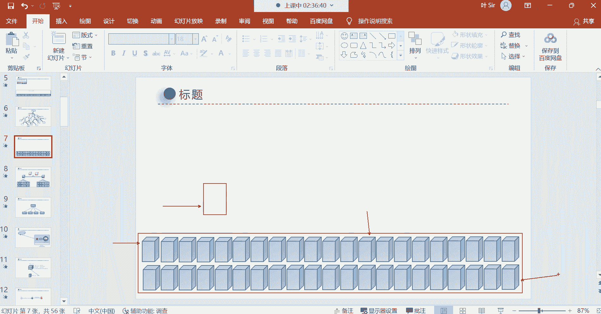

没有必要吗。所以像这种东西呢，一旦写好了，哎，我就可以什么时候有需求。什么时候我就拿过去。能有那么多福气吗？很少见啊，当然有了，很正常哈，200多个基怎么同时执行这脚本，不然还是重复240是吧啊。

这个后期会有方法的哈。😊，后期呢我们会学会学一些自动化的手段啊，自动化的手段只需要你去干嘛呀？

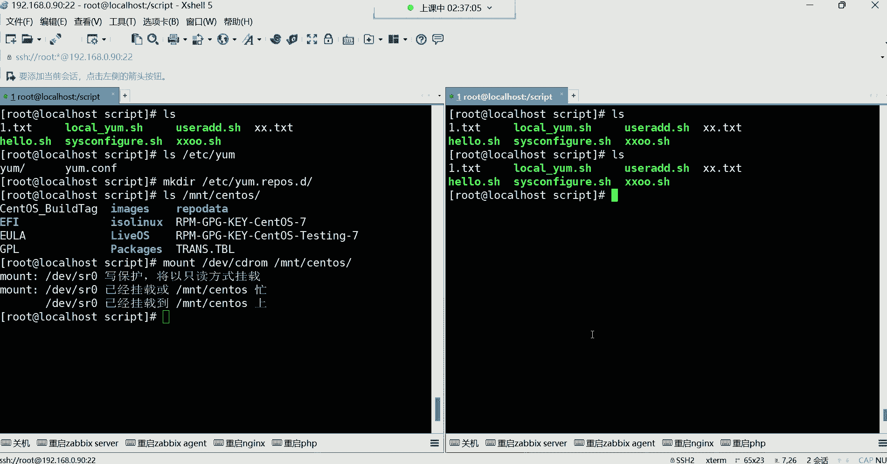

只需你。一个脚本你都不需要拿到这200台机器上面去，你都不需要拷贝过去。😡，你只需要有一份脚本，然后呢你去执行一遍，它可以同时对这200台机器。批量的执行。哎，安保护期可以实现这个功能。按子不可以哈。

不是。安ible后期可以帮我们去干嘛呢？执行这个脚本，但是我只需要去敲一条命令。我敲一条命令执行这个摇本。好，他对所有的继器生效，你都不需要拷贝。你都不需要说。

哎呦我还要把每个脚本拷贝到这个机器上面去吗？哎且这种事情都不需要，不用。😡，不用。能列吧。能列吧。哎，对。不不是开多个窗口。😡，跟窗口没关系，你就是你如果是200个机器，我开我你能开200个窗口吗？😡。

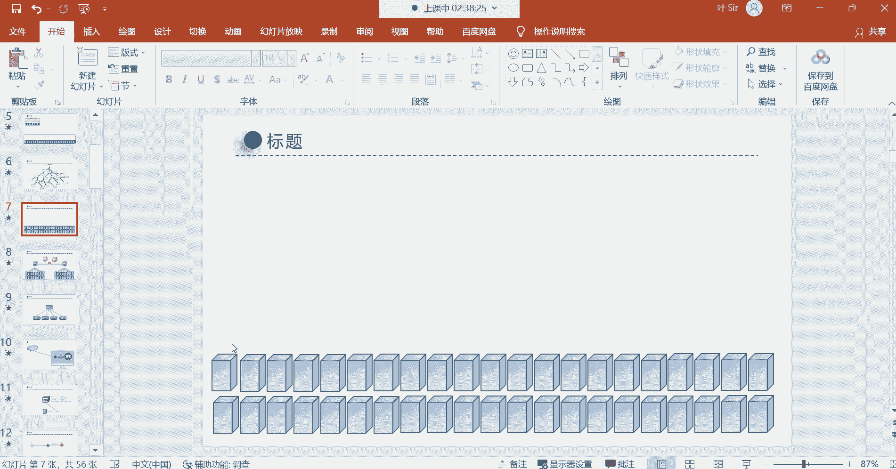

是不是你不可能去开200个窗口吧。😡，你看爱式窗口，你想想这现实吗？现实吗？啊，最多你的界面它能容下几个，它能容容下几个终端的，关键是是不是？你再开吗？还能开吗？也能开是吧？也能开。

但是你再开的话就没有必要了，是不是？😡，啊，咱们不需要不需要。

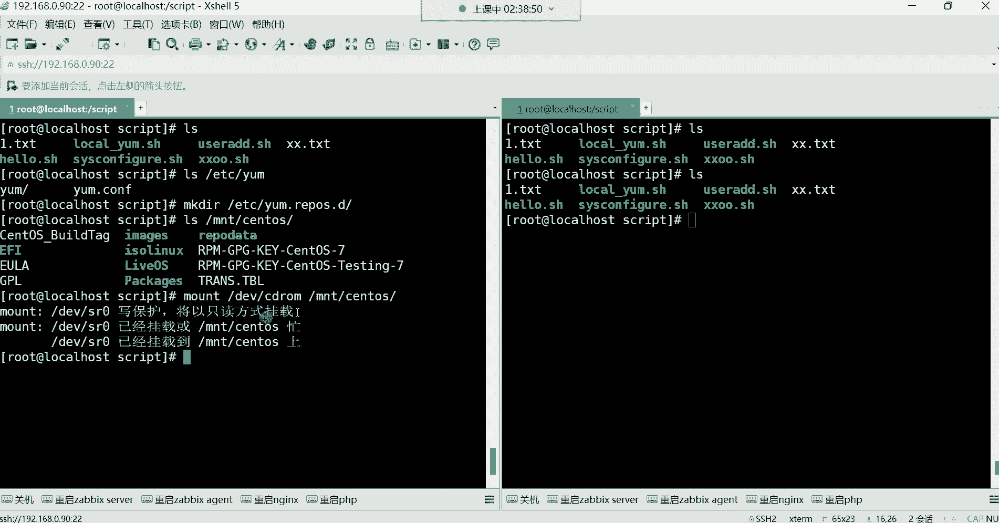

啊，有那后期再说哈，那后期我们再说后期学学到的时候，你自然而然就知道了。这种东西非常的简单。非常的简单啊。

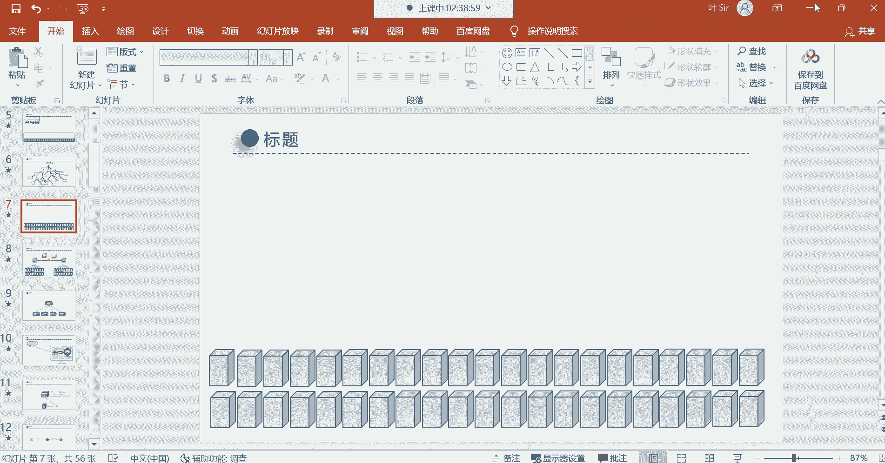

Mh。现在。你说我们想写一个脚本是不是非常简单呢？哎，我想干什么事情？😡，你发现我们用到的知识。都是哪些知识？都是我们前边学过的知识。这只是新的吗？他不是。都学过。啊。

那你说这个脚本我想让他更加人性化一些，可不可以？😡，啊，都认识。对我想变得更加人性化一些。那你是不是可以加一些？元素在里边呢，什么元素呢？上来告诉别人这脚本在干嘛？所以你艾一个ele什么呀？比如说。

这个脚本。正在搭建。本地的软件仓库。是不可以？好，下面。当执行到这里的时候。再这样挨口一个。什么呢？正在。验证软件包的。数量。可不可以？但是停一下这停一下啊，不然它特别快特别快哈。

sleep3秒钟是不可以？保存退出。然后再执行看看哈。哎。你发现这脚尾一直行啊，我知道他我知道在干嘛。😡，哎，是否可以了？嗯，是不是啊哎你搭建完成也行，怎么着都行。

最起码是不是最起码你能够知道他干了什么事情呢？😡，那你说。

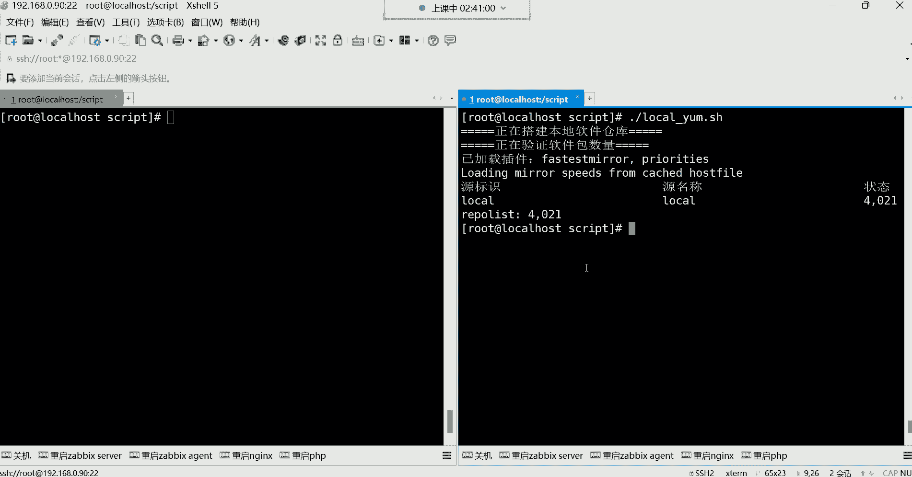

我能不能再去优化优化这脚本？我们说脚本这些东西都是得去不断的优化。你比如说就对于这这个脚本来讲，我想优化优化，我怎么优化呢？我觉得这脚本呢有很多东西我觉得没有必要，你什么已加载插件这些东西。

我要它干嘛呀？😡。

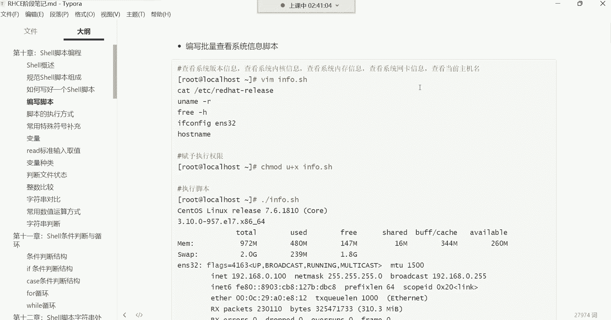

我有必要留他吗？😡，我是不是就想看总共有多少个包就行了呀？😡，是不可以？所以怎么办？这玩意儿再优化一下。但是优化的时候，你得你得知道我应该优化谁。这个输出怎么来的？就这个输出是怎么来的，哪条命令产生的。

你才能有具体的优化。哪开命定啊，是不是yre，就这玩意儿啊，已加载插件。是不是啊，那怎么办？好，我不想看所有的，我就想看最后一行。走吧，管道给。还有杠1。可不可以？是否可以？呵呵。😊，啊，对啊。

gra也行，我用grab是不也可以。😊，gap，我只过滤。包含reple list的行。是不可以？好，那下边这9万我是不是就是可以亮了呀，让他信息输出的更加。这个简洁。准确一些，无用的就不要了，那就。

Grape。replease直过过滤包含这个关键词的行保存退出。这时候我再执行。回头。哎。诶。嗯哼。这时候就感觉就不太一样了。😡，是不是感觉又。😡，高大上那么一点点。没错吧。哎，这最起码这脚本拿给别人。

可以用了。啊，你这个脚本现在你让别人看哎，别人也知道这脚本干了什么事儿了。😡，是吧。啊，那如果后期。呃，EOF符号没有空格要求，没有空格的要求哈。EOF没有空格要求。这个EOF。在这哈。

他们两个之间没有空格要求。但是。这个符号跟这个之间要不要要不要加空格，这一般加空格。一般加空格哈，不加空格，是不是他们两个变变成一个整体了呀，那不行。所以这个位置呢UF跟他们之间有没有空格无所谓哈。

讲也行不加也行。好，保存退出。呃，需要加这个吗？能知道是本地仓库还是亚么仓库呃，不用加。不用加加那种东西干嘛呀？不用讲。这就是我们所说的这个脚本。是不是现在给我们的感觉就不一样了。

那后期如果那后期如果我们再学AWK呢，如果再学AWK，我还可以这样玩呢。前边过滤之后。是不是我能不能。只过滤这个数啊。grap不行。g rap没有办法。所以我还可以量。我用AWK是不是这也可以。AWK。

不用grap。然后这时候。当然这些操作呢，你们先不用去管哈，因为我们还没有学AWK，所以这时候我还可以这样。打印他的。第二例。可不可以？我只过滤这个数，前面这个我都我我都不要了。你说前面这个我都不要了。

那怎么办？😡，那你让光让别人看这个数行吗？其实也行，正在验证软件模的数量。😡，是吧。哎，那我还可以这样，哎，就告诉别人有多少个包不就行了吗？😡，所以这时候我们还可以如果想玩的更加的。人性化的时候。

是不可以这样呢？一行也周行。这时候如果再看的话。嗯。来看哈回车。哎，可不可以呢？嘿嘿是不是可以？😊，当然AWK我们现在还没有讲，所以这一步可能说你们无法理解它的一个格式。这步你们可能无法理解它的格式哈。

但是这样是不是也可以了呀？是不是？啊，这样也可以了哈，就是我们不学AWK，你说。😊，我们学grape是不是gra也可以啊。😡，也不一定非得用A也不一定非得用AWK吗，我就个app不就行了吗？😡。

我就过滤，只要自己我能看懂就行，这玩意也不是给别人看。是吧我自己能看懂，我自己知道这个代表什么意思就行了啊，软件包的数量。那如果你说我觉得这个还不够再还不够人用的话，我再想优化一下可不可以呢？

那这个就复杂了。

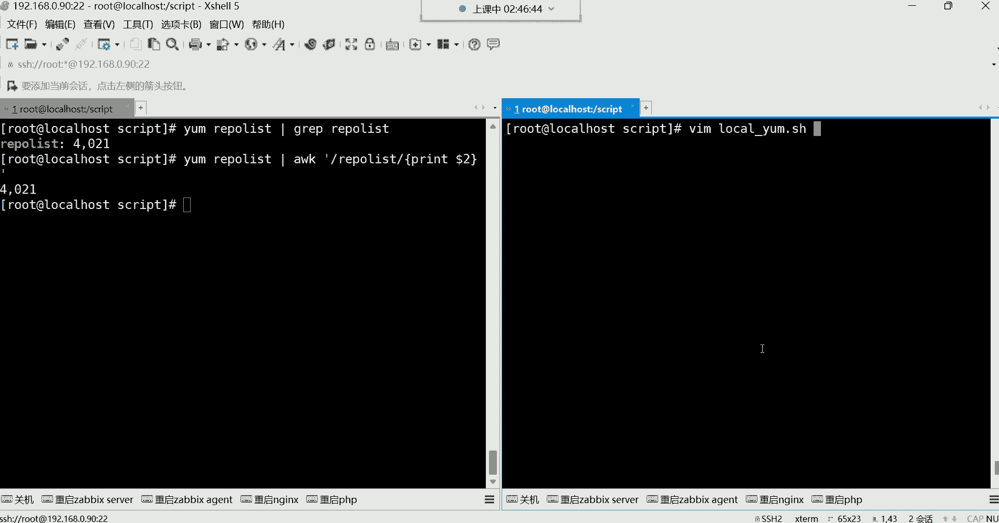

如果你这样优化，我这个。笔记里边有一段配置。嗯。太简洁了，不了解的是不是看到这些面会蒙圈。

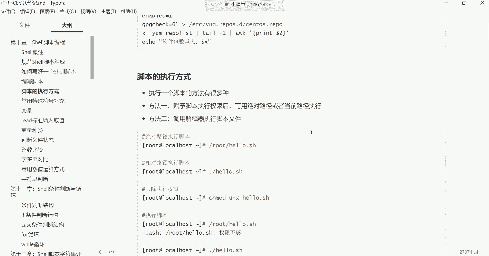

不这简洁的输出都是有用的输出。除非他不认识中文。除非他不认识中文。他看不懂这几个字的含义。能列吧。呵呵。😊，他只要但凡能能能他只要但凡识字儿的话，我觉得这些东西应该都理解的是什么含义吧。是不是？没错吧。

那如果你说他真的不理解好，后期我们还可以想方设法。我们可以想方设法给它搞得更加简洁一些啊啊不能说更加简洁，是更加的。人性化。你说好，老板，这人呢，他除了瞎以外呢，他还不愿动脑子。啊。

那这时候我们可以这样啊，我们后期学一个叫变量的东西，我们可以把我们这个命令给它定义成一个变量。啊，但结合一个叫反品号的东西，这时候亚姆。Repo list。管道给。AWK这个时候。我们还可以这样玩。

啊他不看不懂吗？是吧？好，没关系。那这时候。定一个变量好，变量定完了之后干嘛呢？好，给大家看，但是这操作你们先不用管哈。好，这个这个X里面存的就是我的软件包的数量，是通过这条命令取出来的这个值。😊，啊。

通过这条命令把我的软件包的数量取出来，存到这个X里边了，存进去了，存进去之后干嘛ic口你不看不懂吗？是吧？😡，软件包。总数量为。看不懂是吧？好，这回我必须能让你看懂。这样能看懂吗？这样能看懂吗？嗯。

那如果这样的话，我们就。就这样。定一变量，然后把这个命令拿过来。我就问你，如果这样去执行脚本的话。能不能看懂？除非他真的是没文化，除非他连。除非他连阿拉他除非他连这个我们中国的这个字儿他都不认识。😡。

这时候应该能看懂了吧。

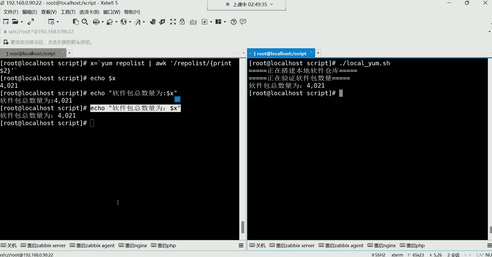

是不是如果你说好，老板还要求点体验感，说你这脚板写的太low啊，说你这脚板写的太low了。好，没关系，干嘛呢？啊，我们再来来个这个。😡，叫给你增加个体验感。你不是嫌没有体验感是吧？好。

那这还有个带进度条的呢。下面给你来个小进度条，让你感受一下它的安装过程。

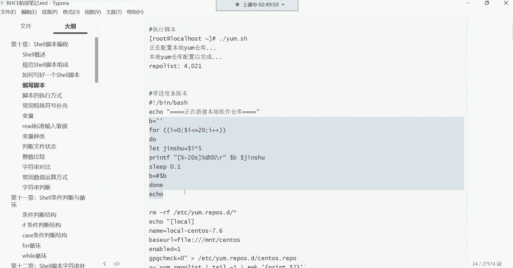

上边在这儿。先告诉你我这脚本在干嘛，然后呢，我给你来个体验感。这时候。嗯。再执行。好，这样哎哎，看到了吧？嗯，是不可以？或者说。うへ。😊，这这是不是就可以了？你说哎是吧，给你来个小进度条。

让你感受它的安装过程。😡，嗯。这老板觉得哎可以啊，这还嗯还有个小进度条是吧？是吧啊，所以说这种东西呢嗯。😊，你可以。不断的去什么呢？不断的去优化它。老板说这玩花里胡哨的是吧？😊，你说你这花里胡哨的。

你说他妈大爷不伺候你了嗯，你说你自己干去吧，是不是这也不行，那也不行的，天天。😡，找茬是不是，你说你自己干吧。😊，Yeah。😊，对。这这这就可以了，是不是哎，这就可以了。但是这进度条这里边涉及的内容啊。

这里边有变量啊，有负循环。

还有一些这个判断之类的。这个呢我我们现在没有办法给大家去讲。能列吧，所以你们呢先不用去纠结，但是这东西它是一个固定的格式，对呀？你们如果后期需要，比如说我要来一个进度条。如果你后期需要来一个精度条的话。

那这个是可以直接拿回去用的。任何的脚本，如果你想加一个精度条，都可以直接调用。啊，这没有任何问题，它是个固定的格式，它它的主要的功能就是给你干嘛呢？

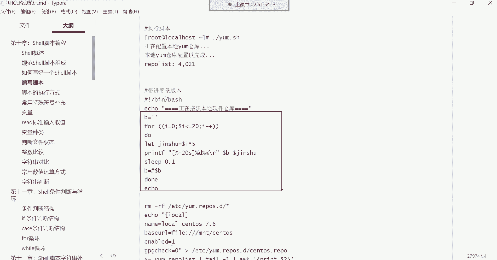

就是给你来一个这个。就是给你增加个这个东西。能解吧。对，我们说叫装逼利器。H。好，那。这就是脚本。虚拟的。虚拟的哈，它不会根据你那个整体的一个一个这个比如说。

这个代码真的是这个具体的执行进度去给你显示这金字条的，不会的，他就是上去，我先给你先给你来个体验感，假的。假的，我上去先给你走走一个进度条，下边呢我再执行下边的命令。😊，能列了吧。

因为它里面并没有涉及到一些判断之类的。并没有哈。假的。Yeah。😊，但是没关系。嗯。但是没有关系，这种东西哎，其实我们可以这样。这种东西你如果想让它变得更加简洁。😡，嗯，这种东西你可以给它删掉。

删掉就直接。一执行。你看就这样。搭建仓库。是吧。软件包数量是不可以？Mhm。对，这种东西给别人看的哈，花里胡哨的东西嘛，花里胡哨的东西是给别人看的。是不是？那别让他喜欢呢。😡，是不是啊？嗯。

那你没有办法呀。你就跟现在那个啥似的，就是。你找那个女孩子一样，你找女孩子，人家都喜欢那种嗲嗲的，是不是？张口闭口管你叫哥哥，那是不是？那谁喜欢那种那个。😡，走路带风，谁都不屌一股老爷们儿的呀，是吧？

人喜欢的不就这感觉嘛？是不是要的是这种感觉。那你说如果你找女朋友，你就为了用，我操我就为了用。😡，那你那你还在乎什么体验感吗？是吧你还你你还在乎他长什么样。

你还在乎他体重那那个到底是90斤还是190斤嘛，你为了不就是用嘛，是吧？把灯一关，脸一蒙是吧，你这。😡，其实最终不也一样吗？是不是啊？但是你不就是为了一个那个体验感嘛，是吧你想找那种。😊，啊。

温柔体贴的。说呃那个说话呢还得是这个黏声细语的，是不是啊？然后。你们要的不就是这个感觉吗？😡，是不是所以说这叫体验感。😊，啊，这叫体验感。😀。😊，对体验感很重要啊，这体验感是非常的重要哈。😊。

😀Yeah。好了，歇会儿吧，歇会儿。😊，要是20分钟了是吧，歇会儿。

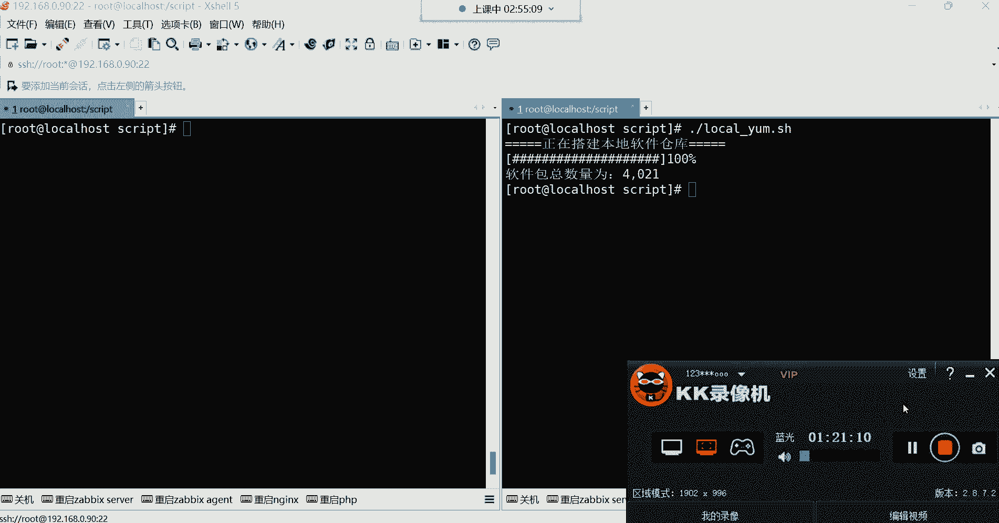