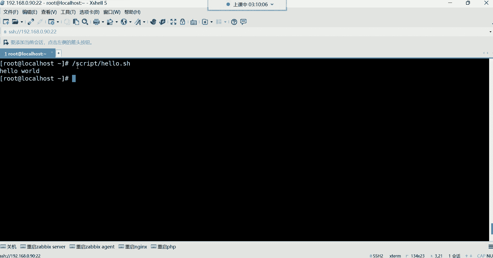
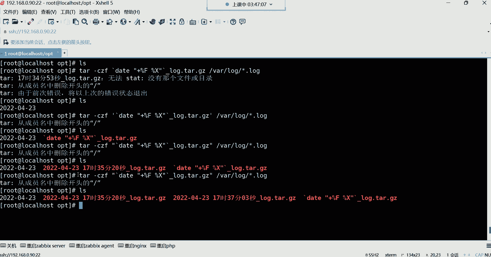

# 新盟教育-Linux运维RHCSA+RHC培训教程视频合集，全网最新最全最详细！ - P40：红帽RHCE-4.常用特殊符号补充 - 广厦千万- - BV1up4y1w729

好，各位同学，我们。继续吧，都回来了吗？回来的话给我刷波一。好，可以是吧，行。那咱们继续讲解哈，我们这个实有脚本。我们接下来呢要学习几个在设脚本当中，我们经常会用到的一些什么呢？这个我们先讲执行方式。

一会儿再讲几个特殊符号。这个脚本的执行方式就是我们前边我们写好脚本了，我想去运行它，让他帮我们去执行里边的命令。

那这时候执行方式，第一呢赋予脚本的执行权限，这也是我们前面一直在用的。赋予执行权限之后呢，我们就可以用这种绝对路径或者相对路径去执行了。好，那这个给大家演示一下相对路径。

一定要什么呢？加这种点杠，不加点杠，你写这样。你比如说我要执行的系统不会认为这是一个脚本文件，他会认为这是一条命令。所以你看他给你提出什么，他说未找到命令。能列解吧，所以你怎么让系统知道这是一个脚本呢？

哎，点杠。点代表当前路径，斜杠代表当前路径下的什么呢？这个文件回车这样就可以了。那系统就知道啊，原来你想运行的是这个路径下的这个文件呢。是这么回事。好，那这是第一种。那这是相对路径，得有执行权限啊。

那绝对路径呢，比如说我没有在这个脚本路径怎么办呢？好，那就指定这个脚本的所在位置，在哪呢，在跟一下的qui下边有一个文件名叫hello点SH我想执行它回车，这样也可以。那绝对路径还需要加点吗？😊。

如果你要加点儿，你就是回家种地去吧。绝对路径加点干嘛？绝对路径，那你加点就就代表当前路径了，能列吧，就不能加点了哈。所以绝对路径就直接指定脚本的所在位置。😊，啊，这点这点思考如果都没有的话。

那我就建议你。别往这个方向发展啊。😀は。😊，嗯啊，这是执行方式啊，绝对路径怎么执行，相对路径怎么执行？

那接下来第二种方法，调用解释器去执行脚本。这种调用解释器啊一般用的比较少。

呃，调节器我们可以。直接这样用拜事解释信去帮我执行的。嗯。对，种地都不是认苗。如果调节释器，我们来给大家演示一下哈啊，解热器bitch直接指定。😊，啊，这样也可以。

但这种呢一般如果这个脚本你不给他执行权限。如果你不得执行权限，那解释器也可以执行。那我给你们演示一下，比如说我现在趁着mod。😡，我把他的执行权给他去除掉。现在这个脚本是没有执行权限的，看到了吗？

看了他现在是不没有执行权限呢？没有执行权限。如果我这样甭管是绝对路径。还是相对路径，或者我进到这个进到这个进到这个目录，我以相对路径的方式去执行的，你发现都提示权限不够。都不行。好，那怎么办？

我还不想给他执行权限，我还想执行的。我既不想给他执行权限，我还想执行他，那bitch就可以帮你实现这种需求啊，不需要执行权限，用bitch直接指定。这是可以的。那这种呢也是绝对路径，相对路径都通用。

你就拜事指定。这个录音下载。这个脚本。

这种都可以能理解吧。所以对于这种东西的话，就是执行方法有很多种，但是常用的肯定是赋予脚本执行权限。剩下呢就是绝对路径跟相对路径，看你自己的需求。调用解释性呢一般比较少一些啊，所以这是执行方式。

那下边呢常用的特殊符号。常用to符号引号，我们接下来要给大家讲讲这引号。双眼跟单眼。跟单眼哈双眼跟单眼。这都是叫特殊符号。那这种特殊符号，它在系统当中的功能到底是什么呢？这个我们先来给大家说说他们的。

功能都可以引整体叫引用整体。

什么要引用整体呢？就比如说。嗯，我在ecle一些内容的时候。就拿那个仓库来讲哈，我们前边是不是icle有仓库的名称啊？好，然后呢放到这个文件里面去。但是我想同时eical。很多行的话。那怎么实现呢？

这种一次只能挨扣一行。是吧我想同时挨le很多行。我想让它变成一个整体。😡，什么叫整体呢？引号双引。开头。然后回车，这是第二行了，注意啊。这是我icical的第一行。啊，但是呢由于我这个整体呢有很多行。

我这个整体是很多行哈。所以这时候怎么办呢？哎，我回车没关系，你发现这命令行没有结束。😊，他还在干嘛呢？还在等着我输入内容呢，所以这时候我在name等于。仓库的名字。再回车。

你说我能够一直回收到什么时候呢？😡，只要是他没有看到他的另一半。好，你可以一直去写。你写的所有东西，只要在这个中括号里边啊，在这个单引号，在这个引号里边都叫一个整体。啊，这这啥，然后当你写完了，好。

引号扩回。他是不是看到他的另一半了呀？啊，那这时候。这就是一个整体你回车看，他给我输出这个引号里边的这几行。这个整体还有什么呢？还有我在建文件的时候，我建个文件，我希望这个文件的名字叫A空格B。

可不可以？如果你这样建不行，这样建它就是两个文件，就是A跟B。你这样看的时候，你看。你看一下他就是两个文件，A跟B。是吧好，我想让它变成一个文件，可不可以？A跟B是一个整体，我不想让他分开。好。

那踏uch。😡，引号引起来。A空格B。回撤。你发现哎，这怎么看不出来效果呢？是吧是吧你如果对于你来讲，你这样看，你发现哎这怎么同名了呢？你看有两个文件叫A。😊，两个文件叫B。啊，这不太现实啊。

这文件同名还能同时存在吗？😡，是不是啊？或者我再讲个文件。踏实引起来。空格hello点儿TT哎，你再看哎呦很奇怪。奇怪在哪里呢？这同一个目录下怎么可能有两个同名的文件呢？😡，是不是啊？

这引号它可以帮你干嘛呢？引整体就空格也是属于我的这个整体里的一部分。能理解吧。这叫整体。那你删的时候，你发现好，我想删。hello点TIT可以删啊，我再想删hello点TIT，你看哎。

这怎么推不出来了呢？😊，你发现我这里边明明有一个文件，你看明明有个文件叫hello点TIT。但是我在删的时候RM杠Fhello。😊，第二，铁金芬。哎，没删掉。看到了吗？这不对啊，你发现。

这明明这文件名他就叫这名字，为什么我就删不掉它呢？这很奇怪呀。😡，是吧。😊，嗯，还有这A类文件也一样。好，我想删A。啊，回托。好，A没了。哎，不对，这还有一个A是吧，我这样删2M杠2FA哎，不对。

这删了半天怎么还在呢？是不是我想删B。😡，好啊，少了一个B，那我再删我再删那个A。回车你发现删不掉。哎，怀疑人生了是吧？哎，这不对劲儿啊，这文件都删不掉是吧？😡，那你如果这样看一看呢。😡，哎。

你这样看你发现就是如果你不仔细看的话，你你是发现不了这种问题的，你是发现不了这前面还有个空格的，知道吗？😡，你不会在意谁会在意这种东西。😡，是不是？但是他就删不掉。啊，就是这种。啊，这种还算是什么呢？

哎，你那你说我加个空格删它。😡，这样可以吗？不行，哎，你看你说你看你看我光标，我加个空格，hello点。😡，KT。删得了吗？删不了。删不了，为什么呢？你这个空格系统可不会认为跟这个文件名是个整体的。😡。

能理解吗？啊，这种比较搞心态是吧？再来给你搞再给你说一个更搞心态的，他是一个。hello点儿TIT。这样搞不好心态？你这更看你这根本就看不出来。😡，你这更看不出来呢。其实他后面还有两个空格呢。

他后面还有两个空格哈。😀呵呵呵呵。😊，啊，看到了吗？哎，你推不见的时候，哎退不出来了。这后边啊两根斜杠告诉你这有两个空格。😡，啊，这样可以。😊，这样可以哈。嗯，但是这种搞心态你是一般不会发现的。

这种搞心态你一般发不现。没有办法发现。是不是？谁会去仔细看，哎，这前面还有个空格，为什么它不对齐呢？😡，所以是什么什么叫整体，这就叫整体。只要在我这个引号里的东西，你甭管它设个啥。😡，他就是一个整体。

啊，甭管它是个啥，你是空格也好，还是什么特殊字符也好，它都是整体。😡，知道吧？都是整体。如果有一天你发现这文件删不掉，哎，你就得好好看看这文件啊是不是有些猫腻。😊，因为你删了半天，你发现删不掉啊。😊。

好。

比整体哈。整体。然后单引号也是一样，效果都一样，都一样，都可以引整体啊，所以单引号就不显示了，但是区别就在于说。这个单引号啊，它在引用整体的时候可以取消所有特殊字符的含义。嗯。

哎，它可以取消一些特殊字符。呃，在这个系统当中有很多的特殊字符，我看你那我看我这里面有没有好的例子哈。😊。

啊，就拿这个我们后边会学会学习一些变量。我们后期会学一些变量哈，这个是什么叫变量，后边也再给大家解释啊，就是什么呢？一个名字里面可以存一些东西啊，就比如说我们前面定义的那个什么呢那个X。😊。

看了吗？这个X里边这个字母里边呢，我们前面是存了软件包的数量了。啊，软硬门的数量哈。然后这个软软件包的数量存到这个里边之后。我可以这样。我是不是可以这样。软件包。数量为。美到X。是不可以？

但如果我把这引号换成单引号，不好意思，他没有办法识别美刀。没有办法识别刀了符，你看他成什么了？啊，等会儿。如果我换成单引号的话。大家看效果吧。软件包的数量就是每到X。

他并不会认为这个刀乐福是具有特殊功能的。他给你屏蔽掉了他的特殊功能。能列吗？啊，然后你就记住这两个的区别都是引用整体，只要是在我这个引号里边的。他是一个整体。啊，他们是一起的，说白了对他们是一起的。

但是呢如果你这个整体里面包含一些特殊符号的话，你想让它发挥自己本身的特殊功能。就不能用单引号，因为单引号就给你屏蔽掉了这个特殊的功能了。而双引号。他就不会给你屏蔽它的特殊功能。

双引号会让这个特殊符号发挥它本身的特殊功效。所以这就是他们的区别，但是都可以让他们变成一个整体。变成整体。好，这是我们所说的双眼跟单眼的区别啊，后期会频繁用的，你就知道他们两个都是引征体。

但是呢具体的区别是什么就行了啊，一个是不取消特殊符号的功能，一个是取消特殊符号的功能。

下面四则运算。四则运算。什么叫四额运算呢？就是。计算器里边的加减乘除。在计算器里边，比如说我想做一些看哈加减乘除，这叫四则运算。那这个四则运算在lin里边怎么用？哎，很多种方法。第一种每刀中括号。

就可以帮我们做这种加减乘除。

怎么玩儿呢？非常简单。美刀中国号。1加1。啊，他没识别到，为什么呢？因为他认为这是一条命令，看了吗？但是压根儿也没有一个这么奇葩的命令啊，所我怎么样才能让他帮我去做计算呢？哎。

输出icicle在脚本领域是非常牛逼的这条命令。😡，你别看他说挨le什么就给你输出什么，感觉他没什么意义。😡，但是在脚本里面没有他这脚本呢。就不行。哎，这时候我想做个加减乘除的运算。好。

这时候eical把它的结果给我说出出来，这时候就。再做1加1等于。一加一等于几呀，等于2。Yeah。好，那接下来这是加法吧，比较简单减。啊，我这2减1。2减1等于几？对一。是吧然后我在做乘法。啊。

2乘以2。星号代表成注意哈。这个在这个命令行里边，星号代表成它不像我们计算器里边，你说那个乘号不一样哈不一样，这里边星号就是代表成2乘2。开是。好，那除呢除怎么样？除它也不是我们在那个。

在那个计算器里边那种方法这样。他不是这样。他是斜杠。哎。就是根目录的那个什么呢？那个斜杠这除，比如说10除以3。33得9是吧。10除以3还得3啊，10除以2。都。2510。5除以0试试。你你你怎么算。

看你自己怎么让他能帮你算。5除以0这错嗯。😊，嗯。这凑符号是吧，这零这零咋除啊，这零除不了啊，但是你说5除以一可以一5得5，这零怎么除啊？😊，哪有这种逻辑啊。😊，啊，这就直接给计算机整蒙了哈。😊，啊。

这这直接给计算机整蒙了哈，对这零能被除吗？😊，好，这是加减乘除，这比较简单吧。小学里边的10以内的加减乘除啊，这没有什么太多可介绍的了哈，没有什么太多可介绍的。好，那接下来我们说说这个。😊。

还有一个叫取。取百分号叫取。什么叫取？你看啊我们说10除以3。😡，这10除以3等于3是吧？😡，那就33得9，其实它有个余数。余几呢？余一没除开嘛，余一的。所以我想看一些除法的余数啊，就它没除开的余数。

我想看一下10除以3余几呀，回车余一。😡，哎，你看就我想看一下除不开的情况下，10除以3，正常来讲，它肯定除不开，那它余了几了呢？😡，哎，娱乐一了啊，那你说我取于干嘛呀？哎，这取于后边。现在没什么用。

但是后期呢我们对于它的用处是非常非常大的。可以控制一些数字的范围。你先知道怎么取。用百分号就可以取除法没除开的那个余数啊，没除开的余数用百分号给它取出来。

那你不能光这样自己去除，然后自己去算吧啊，那最好的方法就是用这种符号去取它的余数就可以了。好，然后下边。呃，这个四的运算的话呢，我们后期还会讲啊，先知道一下每到中国号。四作运算。

加减乘除比较简单。你比如说我们后期想你在学习这个系统的时候，哎，比如说遇到一些这个算数算不开了。比如说我的薪资啊，我算一算这这个月HR怎么给我算的薪资不太对呢？啊，明明是这个我的这个。

明明是这个8000块钱啊，然后我的再加上我的加班费是多少呢？我的明明是3200的加班费是吧？但是明明少了一些啊，你可以自己算一算。😡，是是。这明明应该开这么多钱，但是少二少200块钱啊。

那你说这这不考验我的加减法了吗？是不是可以算一算嗯。😊，那你说这种东西我能不能后面再接呀，比如三啊这8000加3200是吧，我再去这个减一些可不可以呢？😊，啊，可以，你可以无限算下去啊。

大可不必的说口算就行。😊。

嗯ん。然后这种东西呢，我们那个。当然啊这这种东西我是没有去这么玩的哈，我只是给大家举个例子哈举个例子，大可不必啊嗯。😊，Yeahは。😊，然后接下来呢还有这个。😊，一算工资扣社保2500是吧？

越算越难受啊，还有这个每刀小括号，将命令的输出结果作为参数。什么意思呢？将命令的结果作为参数。😊。

啊，结果作为参数，比如说。我想建个文件。啊，我建个文件呢，我想让这个文件呢附带一下当前的系统时间啊，我当前的系统时间是这个什么呢？啊，比如说我加一个daate。😊，摆分号大写的F那前面还有个加号哈。

你看我当前我想建个文件附在我当前的系统时间。啊，甚至是连比如说小时分钟秒都给我附带一下。啊，就再来一个百分号的配置。可不可以呢？4月。4月2号，然后。这是。嗯，几点啊，是这个。嗯，4月23号17点。

那这样哈，我们就是加个杠，然后再来一个白分号小时。再来个杠。分钟嗯，在分号M秒。杠。百分号S啊，我记着有我记着有一个大X哈，小时分钟秒大X。😊，喂。是嗯。是大X吗？是大X是吧，加号百分号。大个。嗯。

他怎么没有识别呢？嘿，写了门了哈嗯，4月23号小时分钟秒，是我输错了吗？😊，这不用加号，我记着他们两个之间。不需要用加号的呀。不需要加号哈。啊，这样可以这样可以哈。哎，那前面为什么同样的命令。

他这个你看一下啊，那百分号大F百分号大X。为什么这个位置你看百啊多多了一个百分号是吧？啊，我说的嘛，我说这这系统怎么还有些不太开心吗？不应该呀，是吧？😊，这样可以哈，我想建个文件啊。

我就想让文件给我附带一下当前那个年月日小时分钟表。😊，怎么办呢？怎么样才能附带呢？Pauch。这时候。比如文件名叫ABC点。铁体。那我能直接这样吗？把这个拿过来。放到后边。这成啥了呀？这成啥了，你看呃。

他他认为你想建一个文件名叫ABC点TATTda。是不是出来了？啊，另外一个文件叫什么？叫叫这个名字呢，是不是也出来了，他认为这是两个文件。😊，他认为这是两个文件哈。那你说那不行啊，这是一个文件呢。

我给他用引号引起来。😡，可不可以呢？引起来哎，让它变成一个整体。回车，那他确实变成一个整体了。那就说这个文件的名字确实叫这个名字了。没错，一点毛病没有看到了吗？变成整体了，但是这不对呀，时间呢。😡。

这时间呢我要的是时间呢，我想取这个。😡，他的结果。你说我要这东西干嘛呀？什么百分号F百分号X，我要它干嘛呀？我要的是里面的结果。😡，里面再加个引号。嗯。不行，你看加引号也没用。

加引号也不是我想要的这个结果。你就比如说好，我要做数据备份。我要做税备份哈，现在。我做数据备份的话。这个备份的操作是什么时间备份的？我想去记录一下。我这样我套杠C。CZF我对。呃，备份以后呢。

比如我让他叫这个log点他点儿GZ。但是我想。标记一下这个时间，对谁呢？对袜下的。唠我一下的。星点logg作备份。好，那你说我怎么样才能让他把我刚刚现在的这条命令。给我记录下来。

我什么我什么时间做的这个备份操作。这个就拿了。这个就难了哈。你说我把这个命令直接对他。对呀，加个引号是吗？能这样玩吗data加号百分号。F。白分号X。可以吗？不可以。不可以。没用。单引号是吧？好，单引。

你啥眼也没用。有有这么玩的吗？关键是有有这么玩的吗？😡，嗯。H。😊，有这么玩的吗？他确实给我背了，看到了吗？什么log点ta点GZ，然后data加这这确实给我背了。😡，这是背了。但时间呢。取不出来。

我最终我想取他的时间。😡，这引号它的功能只是引整体。注意啊，你甭管双引号是单引，它只是为了引整体告诉你，这是一个整体。但是我要的是。它的结果我要的是date这条命令的结果取不出来。那怎么办？

这就无法满足我的需求，是不是？所以这个时候。看哈。我建个文件。返品。然后。干嘛呢？就是文件名叫什么呢？文件名比如让他叫。😡，嗯，叉叉店儿。TST。然后后边。跟上什么呢？文这前面是文件名吧，后面是什么呀？

😡，对的。加号。百分号大F百分号大X。没撤。看。文件名是不是还是还是叫这名字呀，但是后边。是什么呀？是不是这条命令的结果？😡，取没取出来取出来。没错吧。把他的结果给他取出来。结果看到了吗？我们要的是啥？

最终是不是我们要的是它的结果呀？那如果你说我觉得这结果不行。中间我要加一个小声证。可不可以可以。那这个文件名字。这个看到吗？中间就多了一个小黄格。但总之是不是把结果取出来。哎，取出来了。

那我如果有了这种方法，我做备份。套杠CZF。啊，我要对什么呢？对那个文件作备文，叫什么名字？让他叫log点他点儿GZ，但是后边附带系统时间什么时间备份的给我记录一下。什么时间呢，不知道哎。

反正是什么时间，您给我就取本地的时间就行了。date加。😡，百2大F。嗯。加个空格行吗？哎，加个空格的时候就得用引号引起来了。哎，然后百分号。あえます。如果你不加空格，这个位置。😡，注意啊。

如果你加空格了，但是你不引起来它这个效果。😡，可以吗？不可以。先演示一下哈。😊，这时候如果不配合这个引号的话。啊，我直接加空格。我们就先不备份，我们就直接把这个命令直接拿过来执行一遍，你看什么效果。嗯。

看到吗？你d你加。😡，百分号大F没毛病，但是如果你贴上也没毛病。他能识别。但是你一旦加了空格了。他认为什么呢？后边的这个他无法识别了。它无法识别后面这个百分号X是个啥？是因为什么？

因为前面没有dta命令，因为dta命令后边只跟了什么呢？这个。😡，F所以你这样。他就识别不了。你怎么样怎么样能让它识别呢？😡，引起来。哎。可不可以告诉他告诉这条命令，这是一个整体。他俩是一个整体。

都帮我去执行。那这时候是不是就中间多了一个空格啊？没错吧，你看这就比较细节了吧，就非常细节了哈，这就得看你自己去。😊，用思考咱得去思考下。那现在有了这种方法，我再做备份的时候，我太杠C。ZF。

我在取命令结果的时候。反品号注意哈。叫。将命令的输出结果作为参数了。

说白了就是将命令结果给他取出来。取出来以后，作为我的这条命令的参数。我这条命令做备份，那那个结果就是我的这条命令的备份的那个参数。啊，我要对那个命令的结果去执行。所以这时候。再加个引号。

这里边是不不能用单眼的？各位。能用单眼吗？就不能用单眼的？如果用单眼。他是不把这个什么百分号这个特殊功能都给他屏蔽掉了呀。如果你用单眼的话。啊，也没事儿。也没有屏蔽。啊。

那可能是这个有些部分的符号它屏蔽。但是尽量一旦涉及到一些Q殊符号的话，就别用单印，能列吧，不用担印。双眼就行。那这时候。踏杠CZF然后先把命令结果取出来。我这个命令结果就是。对的。加号百分号大F。

主要这里面有空格，我才用引号的哈，没有空格就没有必要了。然后再百分号X。好，那叫什么名字？叫logg。点儿踏点GZ后边。附带时间。加个下滑线。作为一个风格，比方说前面是我的文件名字。

后面就是我的备份的时间。对谁备份对va下的log下的。星点log个文件。懂你。啊，没找到命。看一下啊。嗯，data。嗯。他没有找到哪个命令呢？百分X吗？黑。不让这样取吗？我看一下哈。我先清空一下哈。

不是哈，他取结果放里边。非常麻烦吧。这我跟你讲，这都算啥呀，这都这都不算啥。不能删这个哈。嗯，我们换个目录吧，各位我觉得这个目录已经被我们给祸害的不行了。把当前路径上的删删掉。然后。他。当。

首先这个命的没有问题，我们先演示一下哈dta。😊，加号。百分号大F。百分号X没有问题。好，接下来。刚。我现在建个文件也没有问题。然后我现在t杠CZF。然后。先把结啊名字叫log点儿。踏点GZ啊，后边。

把结果取出来。这个命令我直接粘进去啊。啊，我知道了，我前面那个格式错错在哪，错在这儿了。我把daate也放到那个引号里面了。😊，我前面的格式错在这儿了哈，我发现了我把data也引起来了，看到了吗？

data不能引哈，嗯，这太细节了，你们看到了吗？有没有发现。😊，啊，对data要放双引号外面。这样就可以哈，那就很细节。然后下边。名字后边对谁对哇下的。log下的轻点log。好。可以了。啊，什么意思？

嗯。小时分钟秒无法。star没有那个文件和目录。嗯。杠这是这是年月日嗯，但是小1分钟秒并没有给我。去什么呢？啊，去记录是吧，那我这样。可不可以啊？L点他点GZ。嗯，这样可以，但是一般我们怎么玩呢？

你发现如果这样做不行。格式啊。好像不是一个压缩格式。看一下哈。你看它格式不像是一个压缩格式啊，是压缩格式。就是没有颜色而已。是压缩格式，这里面确实有很多的压缩文件。有哈。有。但是如果我我希望它这个颜色。

是一眼，我就知道是个压缩包的话。我们怎么办呢？我们是不是？让他这个名字放在后边呢，时间放在前边呢。可不可以呢？前面是时间。对。然后。加号百分号F。空格。百分号X。名字。log个点踏点。鸡子。哎，不行。

啊，这样哎有。这不行啊这不行。这得用双眼。各种套啊，我试验一下啊，各种套。这样可以。这样可以哈，看到了吗？这样就识别了。各种套。麻烦吗？我备份需要时间哈。备份的话，如果你不加时间。

你想想他会出现什么问题？比如说好，我们今天。需要对这个一些日志文件做个备份。啊，如果你不加时间的话，比如说第一天你备份的时候。就是这个名字呢，一般我就让它叫点talog点ta点GZ了。

我们通过脚本备份是吧？通过脚本备份没关系，第一天备份脚本自动帮你执行，然后备份文件的名字叫这个名字。好，第二天。比如说又帮你没份。那第二天备份的时候呢，脚本呢没有变呢，是吧，一直帮你备份。

那第二天文件名字叫什么呀？😡，第一天叫log点踏点GZ。第二天又备份了，又叫log点踏点GZ。第三天又备份了，又叫log点踏点GZ。手动加时间，你手动加时间，哪有系统时间准确呀。啊。那你没有必要啊。

你这样去加个如如果我们通过脚本的话，我如果我们通过脚本脚本会更会更加智能一些呀。你放到脚本里面，让脚本自动给你备份。😡，那你脚本里边只要写好了这条命令，是不是他每次帮你备份的时候？😡，这文件没人会重吗？

不会重。不会重复，为什么呀？时间在变呢，你看我现在我备份的文件叫这个名字是吧？😡，我再备份。看到了吗？差在哪呢？小时分钟秒。小时分钟秒精确不？精确我现在如果再备份，放心。

这每每一个备份的文件都不会被重被重复覆盖的。但如果你同一个名字。嗯，所有的文件名字都叫什么log点他点GZ好。第一天背第二天背，第三天背背了一个礼拜啊。从第二天34567好，背了一个礼拜，回头一看，哎。

这压缩包文件只有第几天的备份呢，只有。最后一天呢前面的呢好被覆盖了。是不是这样情况啊，你想你都是叫同一个名字。😡，你今天备份了豪，你觉得这事儿你干了。😡，啊，你心里挺踏实，第二天好，他又给你执行脚本了。

好又备份了。好，那第二天呢被覆盖了。😊，那第二天备份的内容都没了。😡，好，那第第三天你也觉得你备份了哈，那又开始备份。那第四天呢好，又把第三天那给你覆盖了。啊，以此类推，到第七天。

你想看看第二天的备份数据，发现没了，只有第七天的备份数据了。😊，是不是名字一直在重复。是不是？怎么样才能让名字不重复这个语法。这个语法啊。

不得不说。不得不说那个语法。😀哈。😊，啊，不得不说这个语法哈还是非常变态的。😊，是不是。你看这个语法。变态吧。怎么会有这么变态的语法呀，是吧？完事儿了，今天就讲到特殊符号。😊，嗯，不讲了不讲了哈。绕吗？

其实也还行也还行哈。主要是你得理解。对，双引号跟反撇号。那每道小括号呢也一样，他们俩功能都一样。对，这是人能想出来的东西吗？不是。不是。啊，行了，各位就讲这么多吧，再讲我估计你们呢行。

可能对生活都会失去信心。😀H。😊，再讲的话，你们就觉得这个。😊，看外面的看外面的天气都是暗淡无光的，看不到希望了，是不是？😊。

啊，就就讲那么多哈。😊。