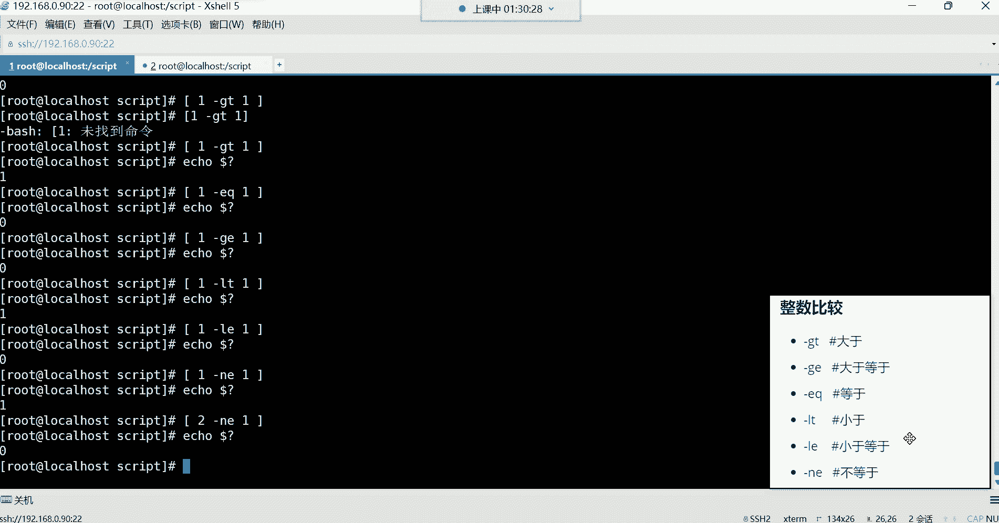
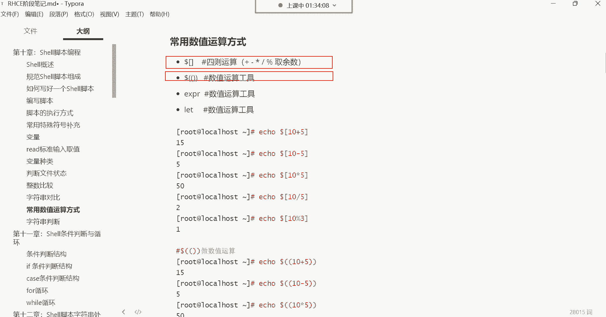

# 新盟教育-Linux运维RHCSA+RHC培训教程视频合集，全网最新最全最详细！ - P41：红帽RHCE-5.判断文件状态、整数比较、字符串对比、常用数值运算方式、字符串判断 - 广厦千万- - BV1up4y1w729

那接下来呢我们给大家讲讲这个判断文件状态的几条命令。那这些命令呢非常的好记，大家可以看一下，都是单个字母，什么杠E杠D杠F杠2杠W之类的这些东西的话呢，就是比较有意思哈。

它是判断文件的状态的这种东西它怎么用。😊。

它的格式来看一下哈，首先要在中括号里面判断哈，在中括号里面判断。😊。

好，来第一个。嗯。好，第一个哈，我现在想判断一个文件是否存在啊，然后这里边就这样中括号，然后这时候呢跟上杠E。😊，杠E哈后边空格跟上ETC的passWD回车，你发现它怎么报错了呢？

什么杠E说未找到命令是吧？空格。啊，空格这样就可以了。这样的话我就可以判断ETC下的passWD这个文件存不存在了。那存不存在呢？他也不告诉你，那怎么办呢？😡。

你得问他eical每到问啊上调命令的执行结果。啊，如果是零的话，就证明它存在了吧？就是它执行完以后，他不告诉你的。所以你看这每道问好是不是就蛮实用的呀？啊，你执行完以后好，你没有任何的反复信息，没关系。

我自己问一下你就可以了啊，这样我就知道啊，这个文件是存在的，能理解吧。所以杠E就是判断它是否存在的。甭管是文件还是目录，只要存在。😊，它就是真的啊，或者说就是对的。好，那如果说我只想判断目录呢。

杠D啊Ddirecty就是目录的意思。所以这时候我想判断一个目录的话，你用杠D，你发现你再问他那这个时候。它叫返回值不是零，为什么呢？因为它不是一个目录，是不是它是文件啊？那如果你换换哎。

我就换放ETC就行了。那这时候你再问，你发现这就是对的，没错吧，为什么呢？因为它确实是个目录，这个ETC确实是个目录啊，那还有F。😊，嗯，如果我想判断文件的话，那就用F啊，这个文件存在嘛？回车。

那这时候如果你再问的话，你发现它怎么返回值不是零呢？是因为它压根儿也不是一个文件，是不是啊它是个目录？那如果你这样的话，你跟上一个passWD，你让他去判断这个文件的话，那这时候它的返回值就是0。

因为它确实是个文件。😊，啊，这是判断文件是否存在的。然后那我想看看这个文件我可以读吗？我能读吗？我具具备这个读权限吗？好，杠R。那你还得问他能读吗？好，可以读。如果是反回值是零，就是可以读啊，录屏了。

然后接下来那我能不能写呢？那就W。就我对这文件有没有写权限，然后你再问他。啊，如果是零就可以写。然后那我可以执行这个文件吗？X那这时候你再问他，哎，你不能执行它看到了吗？哎，一那一。没有忘哈。

录录着呢哈录着呢。😊，看到吗？这录屏哈开着呢啊已经3分钟了。这就是判断文件状态的，先有个印象吧。好吧，这种东西就是我们现在只是什么呢？只是对它有一个大概的了解。现在还没有这个应用的话。

你现在就知道我们可以怎么判断这个什么杠一杠D这些之类的。那你说有没有必要给他记住呢？其实啊你可能说让你现在记这些东西，你肯定记不住，其实我也不会去记它啊，我也不会去记它。但是呢我看到它的时候。

我能够认识它就可以了。😊。

注意哈。对。只要我知道它代表什么含义就可以了。我以后看到别人的脚本里边，哎，如果有一个杠E，我就知道啊，原来他想判断这个文件是否存在。能理解吧？如果看见别人的脚本里边，哎，有一个杠X啊。

我我原来是呃原来他是想判断他可以执行这个文件嘛，能理解吧？所以这里边就是干嘛呢？啊，就是我们所说的就是你先认识的，不需要你能够给他记得住。好。那呃接下来呢我们还有一些整数的比较。

整数的比较这里边就有点这个什么呢？反人类了哈，怎么反人类呢？😊。

他比较的这些东西啊，整数比较他比较这些东西。就做这个数字对比嘛。比如说啊我想判断一下这个呃一等于一嘛，那就候怎么比呢？😊，就这样。那它是怎么比呢？得这样哈，你用ele比eal。😊，到了福中国号在这里边。

不用，那你也啊这样问他也行，这样问他哈，直接在中文号里面比。😊。

中括号跟前面那个判断一样，中括号。然后比如说我想判断一。等于一嘛，那你不能这样不能用等于号能理解吧？你也你比如说我这样。😡，看哈中文号里边一等于一吗？他认为这是一条命令。看到了吗？那这样的话。

如果你这样空格隔开，每一部分都要加空格。哎，这样好像可以，然后你再icical。干嘛还问他。一等于一吗？反馈值是0是吧，一等于1，没错吧，但是我告诉你。你这样的话，系统不会认为它是一个数字。

系统是认为它是字符。能列吧，就等于像A等于A嘛。比如说A等于A嘛。看了吗？这是不是都是返围值为零啊？因为系统认为这个一是一个字符。对他不会认为他是个数字的。他把它当成一个字符去做对比。

因为你想在这个阿拉伯里边，这个123456789都包含在字符里边了。啊，都包含在ABCD这些字符里面了。但有的时候我想做一些计算的话，那你就得用什么呢？你就得。😡，或者说我就是做数字对比的话。

你得用这种方法才可以。啊，你等于号啊，稍后后我们会讲到哈，我们会讲到。😊，如果我想就是想让系统知道我这是在做数字对比，不是在做字符对比。那这时候你就得这样啊一空格杠GT。这个代表是数字对比。啊。

而且是整数对比。那GT呢是大于的意思。比如说一大于一吗？注意，如果你不加每一部分，你不加空格的话。😡，系统认为这是一条命令。能理解吧，但是我们系统里面又没有一条命令是长得这么奇葩，是不是啊？

所以你得让系统识别我是在做一些什么呢？哎，做一些对比啊，实现一些特殊功能。所以这时候icical每到问。😊，哎，这返回不太一样吗？是吧你看他返回的是什么呀？他返回的怎么是一呀？也就说在这里边。

你看它返回的值是一，那这个一是什么意思呢？😡，就是假的，是不是就是这一啊它不大于一。😡，那一跟一之间的关系是什么呀？一跟一之间的关系，它们是相等的关系。没错吧，你这一它不能大于一啊。😊。

它是相等的关系哈。所以你如果想判断等于的话，你不能用GT用什么呢？用EQ啊，EQ在这里边是等于的意思。😊，对，回车。那这会你再问。哎，这时候就是真的了，一确实等于一，这是真的。啊，一不大于一一等于一。

好，那这是这个什么呢？这是大于跟等于看到了吗？用分别用这个哪些字母来表示。然后那还有一个大于等于呢，那这里边我们再来比一个啊，我如果把它换成什么呢？换成记E呢？一大于等于一吗？回车。😊，那这时候。哎。

它返回的也是0啊，那这零是什么意思呢？是真的是吧，一大于等于一吗？😊，哎，这里面包含就算它不大于，但是它等于。因为它这里面包含一个等于，是不是啊啊，那也可以啊，也是真的。好。

这是判断大于等于的那小于的话呢，比如说我再判断一个判断什么呢？比如说一小于一吗？那LT代表小于回车小于吗？😊，啊，问一下。啊，哎，假的是不是？你看它反回值是一假的就是说一不小于一，那没错。

一确实不小于一一是跟一是相等的关系。所以这时候哎你比如说我想看看小于等于一吗？这样啊，如果小于等于一的话。😊，你看看他对不对啊，这是对。这是真的，为什么呢？因为这里面也包含一个叫做等于啊，这做数字对比。

你就得用这种啊，他给你指定的这些这个特殊的这些这个奇奇怪怪的这些这个功能啊，或者说这个字母，你去什么呢？去使用才可以。还有不等于，比如说一不等于一吗？嘿。😊，哎。

那你说我如果这样判断他给我返回的到底是零还是一啊，你们觉得是零还是一呀嗯。😡，你们可以发到讨论区。如果我这样判断，我说一不等于一吗？Ling。是吧。哈哈。😀呵呵。😊，啊，看结果哈。嘿哎，一不等于一吗？

😊，是不是？H。😊，一不等于一。啊，对哈，你看有人蒙了，是不是啊？哎，他返回的肯定是非零，因为一不等于不是因为一是等于一的，你不等于，那是不是就不对了呀？😊，啊，这不对了哈，所以在这里边一是等于一的。

所以你搞个不等于，那它肯定是什么呀？非零。那如果你换一个2，你比如说二不等于一吗？那这个肯定是返回值是0。没错，那二就是不等于一呀。😊，是不是？Yeah。😊，好，对。

这里边你发现我们这个现在还没涉及到这个一以外的这些这个什么呢？这些对比呢，我们都是在这个一在一跟二之间在什么呢？在在在玩2这我们说这都是小学的十0以内的加减法，是不是啊嗯。😊。

啊，这是做一些对比是吧？啊，后期会用得到哈，你先先不要觉得这些东西呃这个有些杂啊，没事，现在就是学一些杂乱无序的东西，嗯，智商受到了侮辱。😊，好，那接下来就像你们所问的，那你说等号在系统里边它干嘛用啊。

是不是哎？😊，做字符串对比的。注意哈，他是做字符对比。

这个字符对比可以用这两个。

他这里边。字符对比。方法都一样，注意啊，中括号里边做对比，比如说A。两个等于号代表是相等的意思等于B吗？这肯定是假的A不等于B，是不是？那A等于A嘛？这肯定是真的，A等于A是吧？

或者说我想判断一下哎这个。这里面可以放变量哈，比如当前我登录的这个用户。哎，用环境变量来代表是我当前登录的用户是吧，等于谁呢？等于root嘛。😊，哎，你看就是零是不是是不是不是真的呀？

就是说我当前的用户确实是等于root。对。不。不行哈，那样不能啊，那个等于等于是做字符对比的啊，它不是数字对比。但是呢呃咱们阿拉伯里边12345678也在字符里边也是包含的，它也算字符。好。

那这个时候我们怎么这个那这种东西啊，我们后期用的时候再说，你先了解它的语法。对，这个然后不等于啊，或者说我们再来一个，比如说不等于。怎么不等于呢？就就这个哈。😊。

root rootot rootot rootot呢哎。怎么没了呢？这哈这个比如说每刀优色。每到us它如果说我想判断不等于的话，就这个叹号，叹号加等号不等于root嘛，那肯定是假的，是不是啊？

因为它等于root，所以这个叹号跟等于是代表不相等的意思。啊，那其实如果在数字里边就是什么呀？就是NE是不是啊，就是杠NE不等于。然后那这就是做一些简单的字符串对比，大家先了解一下哈。

这种东西你现在你只需要知道它有这个功能就行了。你现在只需要认识这些东西可以干嘛用，你就现在你可能记不住，因为东西太多了是吧？你现在看到这些东西哎呦，这GTGE什么之类的，干嘛用的呀啊。

做整数对比的整数比较的啊，然后那你再看到这些什么等于等于啊，这个是做字符对比的啊，叹号等于这是啊也是做字符对比的，它判断的是不相等。😊。

啊，然后。下面还有一些这个常用的数值运算。这个数值运算我们前面已经讲过了，在这个常用特殊符号里边，我们讲过一个每刀中括号，做加减乘除取域的是吧？那这个位置还有一些。常用的运算方法。

每道中括号只是其中的一个而已。啊，还有下边什么每刀两个小括号，这也是常用的数值运算，只需要换个符号而已。看我们前边做数值运算，加减乘除ecle是不是每刀中括号在里边比如1加1。

回车等于2是吧？然后那如果说我换另外一种方法，那，就是每道小括号。那这个小号你要多套多套一个，再来一个。再来一个。回车阵种也可以。然后比如说。那5加1得6啊，然后5减1得45乘1。5乘1得5是吧，5。

我，然后10除以3。啊，得三，这个就是我们所说的这个。那个那个叫做。加减乘除，你看你用中括号也可以实现，用这种每刀两个小括号也可以实现。但这种是什么风格的呢？这种是C语风格的。做加减乘除运算的。

这种哈就比较麻烦一些是不是啊啊，而这个呢是室有风格的，就比较简洁一些简洁一些。然后那除了这以外，还有一个叫EXPR。

这个ESPR它也是做数值运算的，这个东西怎么用呢？icical EXPR然后。

后边比如说一加一回车。你发现这不对劲儿啊。看到吗？你看他不对，他直接给你挨高一个什么一加一是吧是？😡，嗯，那你说这东西是放到。这个没到中国号里边。是吗你发现这也不对呀，语法不对呀。是不是啊？

那这玩意咋用啊，这玩意儿。然后非常奇葩哈，你发现我跟你讲sell里边很多东西都非常奇葩，你得怎么玩呢？空格空格。😊。

啊，这空格也不行啊。😡，😀呵。😊，Yeah。我也忘了哈我也忘了。啊，得取结果啊，我我记得是取啊得取结果哈，这样得取结果。😊。

取名的结果。这ESP2。对这样。反撇儿啊，取它的结果啊，回车这样可以。如果你取结果，你中间不加空格，你看哈，你如果不加空格，哎，你发现不对劲儿，是不是还不行？😊，所以你这位置你得用空格，这样才可以啊。

1加1啊，或者说这个5加1。😊，5加1啊，这样可以啊，5减1减号可以啊，5乘1。啊，5乘以1。哎，等会儿啊。啊，5乘1空格回撤。哎，你发现这怎么还又报语法错了呢？

我刚刚呃是我这个确实有一个减号加一个星这个乘法的符号，他报我语法错，这可以理解是我多敲了一个是吧？那为什么我现在一个星，这是乘法的运算符啊，为什么它也报错了呢？😊，你看是吧语法错误。这啥意思啊？哎。

这个就是你得给他转移一下。加个左撇儿。加个左撇。看了吗？H。😊，这种啊得转移一下，因为这个型号在系统里面它有很多的特殊含义。所以你如果这样的话，用反撇儿给它引起来的时候。

其实系统它无法理解你这个星号到底想表达什么意思知道吧？想表达什么意思。所以这样你看如果你用这样运算的话，还不行呢，啊，就这样可以得转译才可以哈啊，就是告诉这个ESPR，我这个东西就是一个乘法的符号。

你帮我去以乘法的功能去什么呢？去执行就行了啊然后那除法呢除法是不是就是5除一啊啊，这样啊，不是哈。😊，啊，10。除以3。回车这样可以啊，就信号需要转移，取余呢就都一样了，百分号取余这样可以。啊。

十取十对三取鱼一。

这样可以。啊，还有吗？还有。还有一个叫letlet这种数值运算，它用起来。

也非常的奇葩。eical。let，然后比如说一加一回车，你发现也不太也不太对劲儿是吧？嗯，那怎么办啊，转移就是干嘛呢？😊，就是把它的额外的功能给它屏蔽掉啊，转移其实就是屏蔽的意思。

屏蔽星号的一些特殊功能啊，因为这个信号在系统里边呃，它代表的特殊含义非常的多。就其实转移就是屏蔽的意思。好，那或者说转变它的含义都可以啊转译嘛，转变含义。好，那这个light你看回车，那我们加个反撇。

看可不可以哈，回车哎，不对呀。😊，你看啊我们icicallet，那你说难道它也是像ESPR一样，需要有空格吗？然有空格与语法不对，你看它跟ESPR好像。😊。

哎，用起来不太一样是吧？

看。那这玩意怎么用呢？😡，这个light非常的奇葩，怎么奇葩呢？就是let，如果你想用的话，你得搞个变量。😊，你得搞个变量，比如说。A等于。嗯，赖他。啊，后边一加1。啊，这也不对是吧？😊。

这let老难用了，我告诉你啊。😊，啊这样啊是这样的啊就是light看到了吗？😊，搞一个变量。这个变量叫什么名字，然后这样。

在里面在做运算，这老奇葩了。也就说这个你是。😊，是这样用的，就是let，然后变代名啊后运算。那运算以后，这里边你想取值怎么取？你说我能这样eical，然后这样吗？let。这样吗？你发现那不行。

你说我引起来呢？😡，啊，这又啥都没有了，是不是啊，啥都没有了。😊，所以他这东西怎么用呢？就是你得像我刚刚那样的let。😡，啊，定一个变量名，然后你把所有的运算在这个变量里面去做什么呢？

做你的运算就可以了。嗯，let就知道了啊，就是。我把我的这个运算的结果存到这个变量里面了。啊，所以接下来我想取他的值，你像他把运算的结果存到变量里面了，是吧，那就每到A呀。看到了吗？没到A。

然后那如果我还想做，还想继续做运算，那你就还是这样。你比如说哎呦5加1。等会啊别错了哈。耐5加1。然后icical。到了A。这样可以啊5减1。好啊，ecle点到A。L口5乘1。Iical do了。嗯。

嗯。再算哈5呃十我们用十。除。3。I到了A，这样可以取于啊十对三取于。

I口到A余一，这样可以，你发现这怎么我就做个加减乘除运算，怎么就这么难呢？是不是搞这么多有必要吗？啊，其实你记哪个呢？记第一个跟。最难用的这个。Let他。那你说这let这么难用，我们还用它呀，还记它呀。

let它不是难，它不是难用，是怎么说呢？它有些简写，它在脚本里边，你想想它把你运算的结果存到变量里面了，我们在脚本里面是不是可以调用变量啊？😊。

是不是啊？啊，我们可以调用变量。所以这个let在后期写脚本的时候用的比较多一些，然后它有一些简写。这些简写的话，我们来演示一下，你如果觉得前面那种比较麻烦的话，那你可以这样啊，正常来讲。

那比如说light。😊。

5。加1。好，那简写我可以怎么写呢？啊，就是light。嗯，啊，当然这个A加加是不行的哈这个。😊，赖。嗯，A。啊，是这个A等于嗯啊，不是是这个A加。一。这样可以eical到 a。啊，这个等于6了。

看到了吧？这样其是你也可以不用直接呃，但是这种方法如果你不定义的话，那上来这里面的A的值是几啊，是一是吧？你比如说我这样letI。😊，加一。那是不是就是。看看效果哈。到了哎。哎。letI加不对劲儿是吧？

它不太哎I加加，这样可以。😊，啊，这样可以。那你比如说我现在I加几I加10。可以吗？这样不行，语法不对哈。你看它这里边的表达式，比如说我这个letI等于I加一，是不是就等于说我对自己本身加一啊。

那这种加以后是不是就是2啊？简写就是I加加，对自身加一就行了。letI加加。嗯，I口它的值。就等于2。然后那减法呢啊对自身减一呢？I检减。很好。如果是减法，我想对自自身的值减一，那你就减减。

因为这种东西你可以上来先定一个变量啊，比如说I等于5。好，是不是这里边有有一个值是5啊？那接下来我再想去做运算的话，我就let啊，比如说I加加。I口I你到I，那它的值就是6啊，我再做减法，I减减。

那就对自身减一，那它现在就是4。啊，就是嗯。I减减啊6啊加加完以以后变6，然后再减就是5。啊，那现在比如说乘呢啊那就I乘。乘几啊啊乘以2。

这乘法是这么玩的吗？这种东西这简写老奇葩了哈啊，是是这样玩的哈，是这样玩的啊，不是I乘等于2。😊。

老奇葩了哈。I城。I乘等于2。这样可以。那就是5乘以2呗，等于10是不是啊？这里边啊，老奇葩了。然后它这个简写，如果你一旦数字不是对自身，比如说加一减一的话。

那它这个格式就是啊比如我想对自身的值加一以上的那就I加等于2，那其实就是I等于I加2。我发现这种东西啊，看你们自己的情况啊。如果你说老师我觉得这简写呀我有点无法理解是吧？那你就既完整的表达式。

这种完整的表达式可能说更加适合这个初学者一些是吧？但是以后你可能看到别人脚本的时候，可能会出现这种什么I加加。😊，那你就知道他是对自身加一的。啊，对，责任加一，那你说这东用在哪儿啊？哎。

等后期哎在有脚本的时候，我们会用得到。😊，啊，等到时候你先我们先过一下，到时候我们写脚本的时候，把这些东西给它结合起来。用的时候，我们再回过回过头来再去什么呢？再回顾一下，你就知道了。

然后接下来字符串判断嗯，这种东西呢一就是。😊。

他可以判断变量，可以判断文件这玩意儿。

前面是对比哈，注意，我们前面是对比，你们别搞错了啊，前面叫做字符对比，是不是？比如说这个A。😊，等于A嘛，这是不是字符对比啊？是吧这叫判断判断什么呢？哎，判断一个变量或者说一个文件到底是不是空的。😊。

那这样我可以这样啊，杠Z我判断ETC下的passWD文件是空的吗？那他也不告诉你问他。假的。假的是什么意思呢？就不是空的，是不是？😡，你看它只有是空的时候才是真的。所以说如果再返回到零的话。

就证明它是空的。如果不是零呢，就这文件它不是空的啊，这杠Z是只有是空的时候才会返回0。那如果你换个杠N。它就不一样了。哎，杠N杠N就是飞空啊，如果是有数据的那就是真的那这时候它的返回值就是0。看到了吗？

那我可以判断变量吗？可以，我我们刚刚说定一个变量啊，哎，那个刀了I回车，那你再问他。😊，哎，哎，这这变量是飞空，有这里面有值是不是啊？没错，有值哈，所以它返围值是0。😊。

这是。做判断的。判断好，那做完判断了，接下来我们再来给大家说说这个。😊，呃，我们前面学的那东的那些东西就可以用得到了。前面噼里啪啦的，我们强制灌输了一堆那些这个比较杂乱无序的一些这个诡异的符号是吧？

那接下来那些东西怎么用啊？好，来在这个判断里边，我们可以用一点点啊，这个什么叫条件判断呢？😊，来看一下，在设里边，这个条件判断就是当条件满足的时候，我们执行什么样的操作。

当条件不满足的时候执行什么样的操作。那这里边我下面给你们举了一些例子啊。比如说我现在想去干嘛呢？想建一些文件啊，或者想安装一些软件包，这个吧比较典型一些。这个比较典型一些。

比如说我现在我想安装一些软件包，但是我不知道这个软件包它有没有在系统里边安装过。那这时怎么办呢？我是不是可以判断一下呀？是不是啊条件判断一下这个包如果安装上了，如果已经在系统里面存在了。

就不要再重复安装了，是不是？如果不存在呢，再给我安装它是不可以？好，那这就这就是我们所说叫条件满足的时候，执行什么操作，条件不满足的时候再执行什么操作。那接下来这位置，那条件判断这个东西啊。他有很多种。

第一种，两个按的符叫并且的意思叫并且。嗯，这个逻辑语的话不太好理解，你就知道这个两个按符，它叫并且。什么叫并且呢？并且啊比如说拿A跟B这两条命令来说啊，我们把它连成两条命令啊。如果是并且的话。

就是当A命令执行成功以后才会执行。B这个命令。这就是并且嗯A并且B。那如果换或者呢，是不是或者就不一样了吧。或者如果说你看看A命令执行失败以后，那我再去执行B，这是或者关系了啊，他们之间。😡。

他逻辑不太一样。逻辑货吗啊，这或者。那接下来我们来演示一下这个，并且它怎么用这东西啊，比如我现在就想安装软件包，那我也不知道这包到底在系统里面有没有啊，是吧？哎，我先这样RPM杠Q。

我先干嘛查一下查谁呢？VSFTPD。😊。

啊，查他。那插完之后呢。他是不是给我返回结果呀？😡，啊，看一下是不是这包有啊，那有的话，这时候我如果用，并且这样y杠外in此套。看效果。哈好。嗯。啊，不是啊VVSFTPD。你看呃我看一下RPM杠Q。

然后并且EMin到这是先。

嗯。我也对不对哈？

不是这个逻辑不行。嗯，这个逻辑不行哈，这个逻辑有些有些冲突。😊，或者说这个从逻辑上说不过去。

从逻辑上说不过去哈，它里边不，这不需要判断这里边这这个东西不需要它没有什么判断可言哈。我现在我想查这个包。😊。

啊，查这个包这条命令。😊，前面命令执行成功了是吧？😊，啊，我看下这个哈。前面命令如果执行成功，如果这包存在给我安装这个包，然后。给我启动服务。嗯。这个我应该怎啊应该怎么样的哈，y姆ins。啊。

就是RPM杠Q，然后VSFTPD。先查这个包，这包如果在的话，然后。后边就不要安了啊，我看看哈。嗯。嗯。一样吗？岗外。VSFTBD。不行。这个判断不是很准确呀。但是他可以怎么玩呢？可以这样玩。

我们不是安特。嗯。这样st。很臭啊，然后。star VSFTPD。我们这样试试哈。你看我这个条件是什么呢？就是如果说。我的这个前边查的查询的这条命令，如果查出来了，有这个包。那后边这个命令就给我起伏。

这样是不可以看看。来试试效果哈。回头。查出来了是不是啊那服务起没起呢？😡，起来了，看到了吧？哎，那现在我把它卸掉。😡，卸掉哈RPM杠EVSFTVD。卸了之后，我再这样玩。再这样。前边查这个包是吧。

查完以后给我启动服务。那这个时候如果我们在执行的话，回车哎，你看。他现在是什么呢？就是。前边命令执行失败了。看到了吗？他没有查询。😡，他没有查到这个包，那没有查询的话，那并且就不会执行了。

就后面这个就不会执行了。所以你们可以这样去理解，这个就是A命令。啊，这个呢就是B命令。所以他们之间的关系就是并且的关系，只有前边命令能够执行成功。然后那后边的命令才可以执行。那前面问你一查询，哎呦。

没有包。那后面明天就不要执行了。因为你想想这种东西你包都不存在，你说你起什么服务啊，是不是？😡，那我后边是不是就可以这样啊？如果包不存在。你给我安装这个包可以吗？😡，VSFTVD。是不是啊？

回车你发现哎，不执行，为什么呢？因为前面失败了，没错吧，失败了，那怎么办呢？那这时候我还可以换成或者把这个并且换或者，或者他就是你前面命令如果执行失败了，我才能轮到后边去执行。如果前面执行成功了。

后边就不执行了。😊，这样可以回车，哎，前面只失败了。好，你看他查询没有这个包。好，接下来马上给我安这个包。😊，能列吧，你看这样可以。

啊，所以说像这种条件判断，我就是什么呢？就是当我的条件满足的时候，我去做什么事情，条件不满足的时候，做什么事情。你看只有条件满足的时候。😊，干嘛呀？你去干嘛去，比如说我前边如果前面的条件满足了。

这哈这前面是安装是安装一个包哈，那这个应该上来先干嘛呢？先查一下。😊，RPM。杠Q查询一下VSFTBD。是如果这个位置失败了是吧，你再去给我执行后边的安包是不是啊？安完包以后，并且启动服务是吧？

并且把服务设成随机自起，并且看服务状态。没错吧。那如果第一条命令。😡，执营成功了呢。执行成功的话，后边所有命令都不执行。因为你成功的话，就证明这个包已经有了，是不是？😡，已经有了，那后面就不要执行了。

好，那这时候来看一下效果哈，我们现在再演示一下，给它卸掉。😊，RPM杠EVSFTPD。然后这时候我们再这样RPM杠Q卸了是不是，然后先查VSFTPD啊后如果前面命令查询的时候，发现这包不存在。

你给我y杠外ins到VSFTPD。好，那这时候我就得并且了，是吧？你包安装完之后干嘛起伏务？s VSFTPD取完服务以后，给我设置成随机自起。这样可以是吧啊，最后呢再给我看服务状态。看一下啊。

这噼里啪啦的是吧，敲了好多命令，我跟你讲这都是有关联的，你不要以为这个非常简单哈，你得了解啊。如果我的因为他们间的关系，你得知道对，什么条件下，他才会执行后边的这一堆命令。

什么条件下他不会执行后面那一堆命令，能理解吧？😊，啊，如果这包现在已经存在了，我现在。我干嘛呢？我给这位置换成并且。你看。嗯，并且。啊，并且啊那那这个不行哈，这个并且他就是因为前面命令查出来有。

那后边才执行，是不是啊？他这逻辑也对，因为前面他查了查出来啊，这包存在，那那存在的话，并且干嘛呢？啊，并且执行后边的命令是吧？那这时候你就不应该去安了。我们这时候应该干嘛呀？应该。😊，就起服务了是不是？

如果查询出来了，咱就起服务呗，是不是啊？😊，如果查询出来，咱就起服务。如果没查出来，那这个命令后边就不要执行了。所以他这个就是我们可以干嘛呢？预判一些，就是有些命令之间是可以相互关联的。

你看这个就是是不是就相互关联了呀？就是如果说前面一步错，后边你如果再执行，是不是也没有意义呀？😊，啊，就不要执行了啊，只有前面这一步成功的情况下，哎，后边执行才有意义。所以我们说这并且就是。

并且的关系啊，只有前面执行成功了，后面才能继续执行。而或者是不是或者就是只有前面执行失败了，后面才执行。所以他这个就是可以让我们做一些什么呢？叫做逻辑性的判断。😊。

判断你的命令。那还有一个还有这个叫做。😊，分号这分号啊，它就比较有意思了，它是没有任何的逻辑关系的。这个你怎么玩都行。你比如说我现在。😡。

我想在这个命令行里面同时执行很多条命令啊，touch在OPD下面建一个叉叉点TATT啊，接下来分号隔开后边那我RPM杠QVSFTVD。啊，分号隔开。然后接下来LS看root目录，分号隔开。好。

接下来这个嗯CD切换到OPT目录。😊，回撤。你看了吗？他这玩意儿就给你干了好多事儿就。😊，在一个什么呢？在一个。不换行的情况下，我可以敲很多条命，可以敲很多条命令。

所以他现在就是帮我在OPT建了一个什么呢？那个叉叉的贴梯吧。😊，查查的TT文件呢。啊，这儿。叉叉点TATT呢。这这怎么有时间呢？是这不是我们建的哈。😊，啊，我现在在OPD吗？叉叉点贴T呢。啊，这呢哈。

我说怎么感觉不太对劲呢？叉叉点贴T是不是出来了？然后RPM杠Q是不是也给你查询这个软件包了呀？然后用LS看root的目录是吧，这是ro，这是内容是root目录的哈，然后用CD到OPT了。😊，COPD。

你再给我干嘛？再给我来1个LS。回车啊，这样看的就是OPT看到了吗？所以它这个嗯它这个就是什么呢？就是没有任何关系，你的前面命令跟你的后面命令没有什么逻辑，而上面这个不是上面这个都是前面命令跟后面命令。

都是可以什么呢具有关系的。😊。

啊，前面命令执行成功，然后后面命令应该怎么办？前面命令执行失败，后面命令应该怎么办？这就是我们所说的条件判断然后这里边。😊，啊这种东西不是说只可以应用于命令哈。你像前面比如说我们前面学的那些杠F。

我判断这个路径下边的文件在不在啊。如果你看杠F是不是判断文件的呀，存在就为真吧，是不是啊？😊，如果存在的话，后面干嘛给我拷贝？给我拷贝拷贝到哪里呢？拷贝到某一个目录。所以你看前面加一个判断之后，哎。

后边做什么事情。你比如我现在想拷贝一些文件，但是我不知道这文件在不在呀。😊。

我们就拿了个。哦，那个。ETC的passWD哈，我现在上上来先判断一下。😊，杠F这个文件在不在？如果存在的话，是不是就为帧呢？那如果为帧的话，干嘛拷贝呀，拷贝到哪儿OPT目录。拷贝谁呀？

拷贝ETC下的passWD到OPT。回车。直接看OPP。是不是拷贝过来了？没错吧。那如果你瞎判断，你判断一个不存在的文件。叉叉叉叉叉。那你看OP的时候，他能有吗？是吧。因为什么呢？

因为后面命令压根就没执行，这个CP压根就没执行。😊，啊，我们换一个哈。😊，不拷贝这个passWD的FStable。你在看OPT。说没有那文件，是没有那个FS table，为什么呢？因为前面就直接失败了。

看到了吗？😊，我先判断一下，然后再做什么事情，先判断一下再做什么事情。

他是这样玩的。这是并且还有或者还有这个没有任何关系这些特殊符号。那前面的判断其实好用吗？嗯，一般般吧，简单的逻简单的逻辑可以用。那一些复杂的话呢，这个就得用这个if判断了啊，那这个if判断。

我看一下需不需要休息一下哈，44分钟啊，我们可以先稍稍休息一下，然后我们再回过头来讲讲这个义务判断行吧？不然我们这个可能说这个时间太长啊，大家hold不住啊，我们休息一下。😊。

