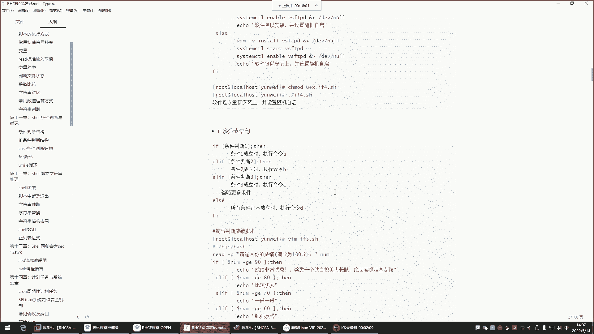
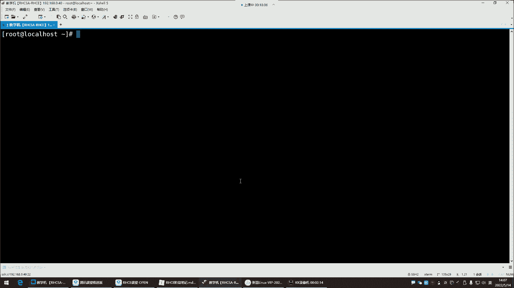
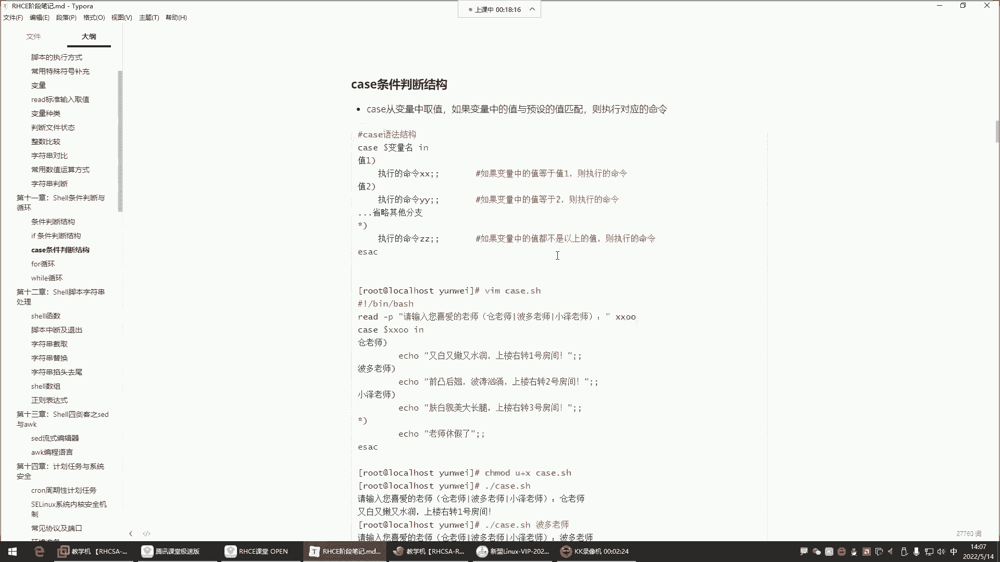
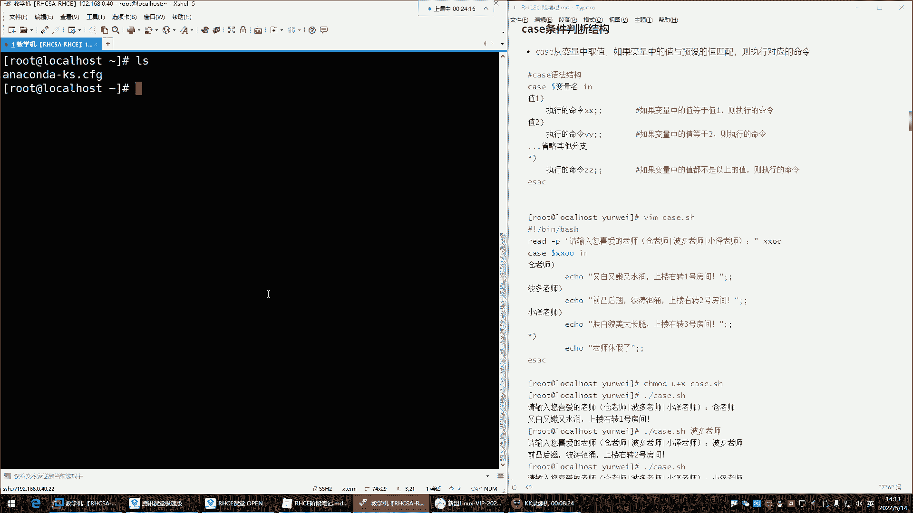
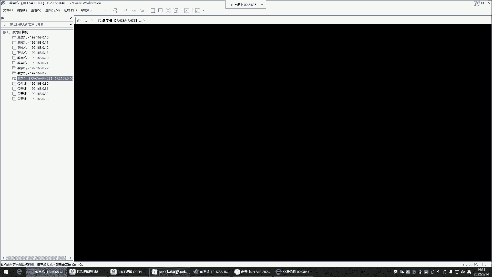
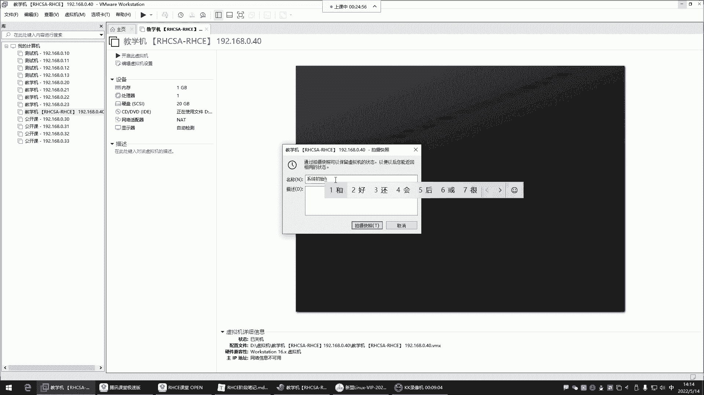
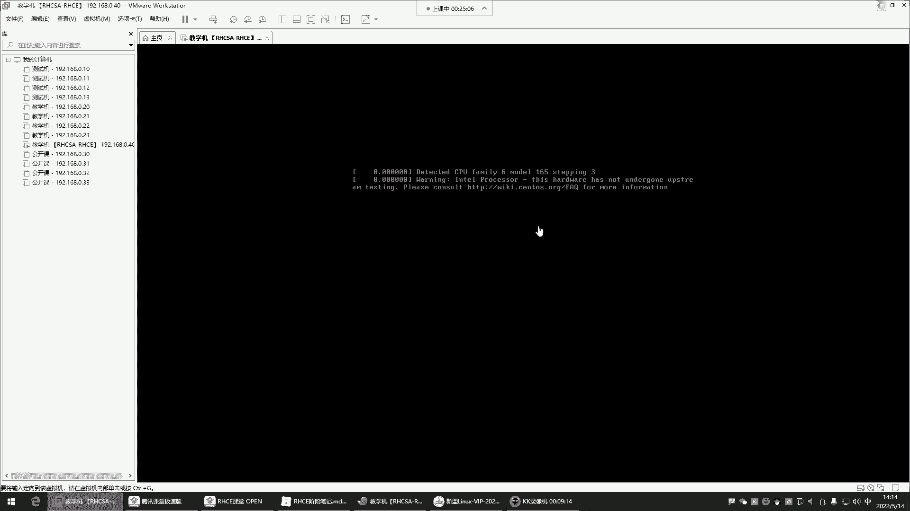
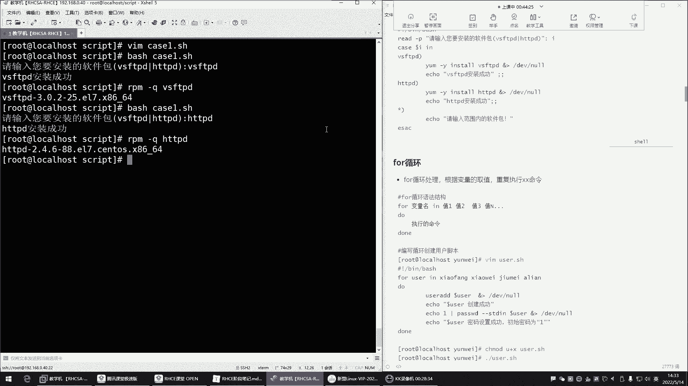
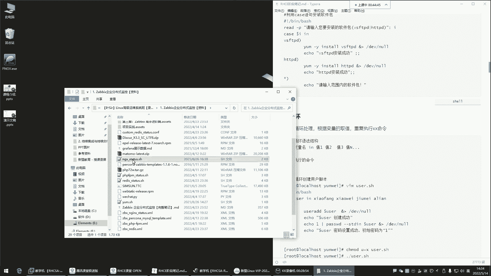
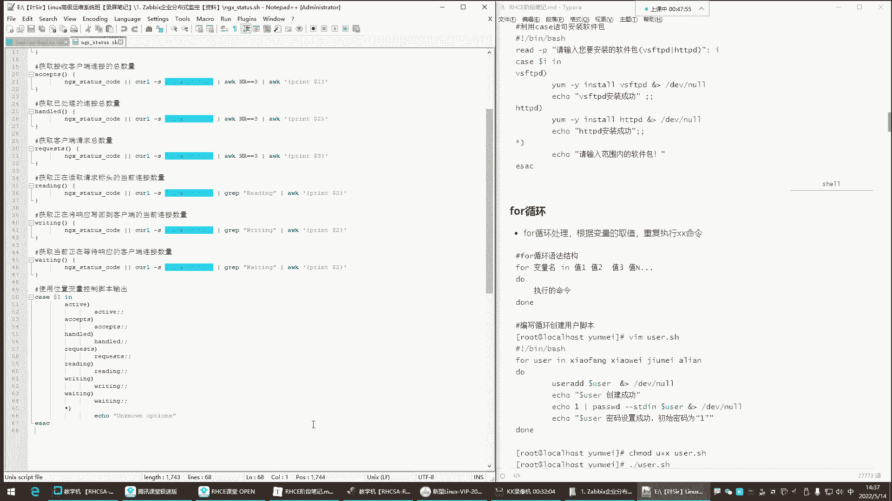

# 新盟教育-Linux运维RHCSA+RHC培训教程视频合集，全网最新最全最详细！ - P43：红帽RHCE-7.case条件判断、for循环 - 广厦千万- - BV1up4y1w729

喂喂喂喂喂喂喂。好了，各位啊，我们这个麦克风也OK了。那接下来呢我们就开始我们今天的课程了。😊，好。是不是都很清晰啊？嗯，来如果清晰没有问题的，再给我刷个衣裳来。我这边是都调好了哈，为什么呢？

主要是我这个换了个电脑，所以这电脑的话呢，我得适应适应哈，我们别到时候讲课，讲着讲着没有录屏。😊，好，O。那就话不多说，正式开始了哈。😊，哎呀。又赶上这个一个周末过去了是吧？我们又在这个业余时间啊。

是大家的休息时间相遇了，但是没有办法是吧？作为我们正在努力中的一个一些这个人呢，那就是我们没有休息的时间。我们没有需余时间啊，我们就是呃只有两个季节是吧？你只有是努力的时候就是旺季，不努力的时候。

你就是淡季啊。所以现在年轻人啊有句话说的好，什么呢？就是20岁的姑娘风华正茂是吧？20岁的小伙呢穷困潦倒。但是这姑娘呢她不可能永远风华正茂啊，你呢也不可能永远穷困潦倒。所以我们你现在不努力的话。

你以后也是穷困潦倒。你现在努力，你以后能够永远都遇到20岁的姑娘是不是啊啊？我们说没有20岁的姑娘，但是啊没有姑娘或永远20岁，但永远都会有20岁的姑娘，所以我们就是为了那个20岁的姑娘。

现在也要努力啊，拼了命的要努力。今天可以讲完是个什么看情况啊，看情况。那接下来呢咱们。😊，上节课讲到了哪里了？是衣服的分支是吧？😊，课前毒鸡汤没错，课前毒鸡汤，这样我们能够这个这个塌下心来来学习，是吧？

对你可以18岁，但你不可能永远18岁。没错，我现在比较穷，但我也不可能永远都是这么穷，是不是？😊，那接下来咱们就这个开始啊。😊。

我们那个。讲到哪儿了呢？是。

条件判断多分支我们也讲完了，是不是啊？然后多分支讲完了之后，我们这边开始给大家讲讲这个case条件判断。那case条件判断这边。😊。

我这样哈我们这样。哎，这样看哎，这样看就比较清晰一些，是不是？哎，然后这个呢这样调，这样调，哎，这样大家可以既看笔记，然后又看呢，我给你们实操是吧？然后我们边操作，边给大家讲讲这个思路就可以了嗯。好。

那这个时候我们先来说说这个case条件判断。哎呀，这个case条件判断跟我们前面讲的if条件判断，它们之间其实呢也是这个干的事是同一个事儿，都是做条件判断的啊，条件成立了，我帮你做什么事情，条件失败了。

我再帮你做什么事情能理解吧啊，对，那么多老师啊，那接下来我们呢就给大家说说这个case它跟if之间的区别到底在于哪里呢？case啊它的功能比较简单一些。它比较简洁一些，没有if功能强大。

但是它的应用场景呢啊一般呢。😊，是怎么说呢？就是没有if会多一些。但是呢以后你看到if看到case这种条件判断的语法，你应该要清楚哎，这是它是干什么用的，能理解吧？那它的风格是怎么用的呢？

case是从变量里边取值如果说变量中的值与预定的匹配的话，则执行对应的命令好，那这个呀我们来看一看它下面的这个语法结构case开头呢是CASE开头，然后呢，我们啊要从变量里边取值。

这时候呢你得定义一个变量名了。然后接下来呢in啊in的话呢，就是如果这个变量里的值跟我这个定义的这个值，如果匹配的话，也就是说那变量中的值与预设的值，一旦匹配成功了。

那这时候呢我就给你执行这里边的命令的啊，那如果变量中的值啊，等于值一它我们提前预定好的那个值则执行命令。那这个命令可以执行多少条，这个呢。看你自己的情况能理解吧？好，那如果第一个值没有匹配怎么办呢？啊。

也就说下边那个你看啊比如说我通过case干嘛呢？写了一个我们大家比较喜爱的一个判断，这个判断就是case我定义了一个变量。那这个变量看看到时候呢这个变量里的值从哪来呢？好。

我们可以从命令行里边去让用户自己去输入，也可以提前干嘛呢？定义好这个值，但是呢比较典型的就是我们可以让用户啊你看你这个干什么用的哈。比如说我们就随便了解这个语法，简单顺应适应这个语法的话。

我们就可以这样来一个read杠P，让用户呢自己输入这个值，然后我给它存到这个变量里边啊，那这时候case里边我就得定义这个变量名了。也就说在语法里边，我们通过变量名去干嘛呢？去匹配。

那这时候用户输入的值是不是在read会被read存到这个叉叉O这个变量里边啊。那这时候case呢就会取这个变量。😊，里的值接下来呢它会拿变量里的值跟我们提前预设的这个小括号里的值去进行一个匹配。啊。

那如果用户输入的值匹配成功了，比如说用户输入什么呢？输入一个苍老师，那我这个里边啊，我这个预设的我预定的这个值也是苍老师，那是不是就匹配上了呀？那匹配上以后呢，我就给你执行这里面的命令了啊。

苍老师特点又白又嫩又水润是吧？啊，在哪呢？上楼右转一号房间那如果这个人他没有输入苍老师呢？那是不是就没有匹配的呀？那这条命令就不执行啊，那如果这个人他比如输入谁呢？哎，他比较喜欢波多老师。

那他输的是波多老师的话，那这时候那我们看啊再给他来个波多老师，那如果你看他输波多老师跟波多老师也匹配匹配上了，那我就执行哎这个值里的指令。波导老师的特点是不是啊？然后在哪到哪儿啊，你去找他就行了。

那如果说他输入的这个值也没有跟我们预设的这个波导老师匹配，那怎么办啊，比如说他喜欢小泽老师，那人家输入小泽老师了，那这个时候哎我们就让他跟小泽老师去匹配，能理解吧？这个时候一匹配上了。

我们就挨这里的指令。能列吧。那如果说这个人呢他并没有输入我们预设的这个值怎么办呢？啊，他输入一个，比如说。那个谁呢？啊，比如输这个莹莹老师，哎，她输入莹莹老师，那这个时候嗯。

那输入莹莹老师这时候怎么办呢？那莹老师没有在我这个预设里边，是不是啊？我没有指定莹莹老师啊？哎，那这时候这有个星，这个星代表任意所有。那也就说这时候就跟我这星匹配了。

他输入什么都跟星匹配那这时候我就执行这个星里面的命令，我告诉你哎这老师休息啊，今天没上班然后结束怎么办？结束就是ESAC你发现他跟if语法差不多，if是if开头结尾呢是FI结尾是吧？

中间就是我们写指令了，而这个呢是什么呢？就是CAS开头，然后ESAC结尾中间就是你要干什么事啊，这个边有意思是吧？那咱们来啊莹老师makeR建一个的目录进到这个目录之后干嘛呀？我们来写个脚本啊。

让他叫什么呢？啊就是这个。😊，这个呃叫ki。😊，K4点SH。啊啊，没有VIM我这个机器是新安装的系统哈，我们新安装的系统。😊，先装系统的话呢。这样。先拍个快照吧。先拍个快照啊，这个新安装的系统。

我先把那目录也给它删掉RM杠RF把那个跟下的。qui的目录也给它删掉，这是新系统，啥都没干呢，刚刚安装好，然后呢，我给他拍个快照。

おば。先给它关机电源。关闭。中间空格会匹配吗？空格不匹配哈。你这这鱼。

当然哈你这里边你搞空格，它有可能会报你语法一些问题，所以别搞一些空格。拍个拍照。叫做。系统初始环境。

初始环境。拍摄啊，再开机。给他等一下，让他快点快点开机。

OK然后我再重新连一下，重新连接还没开机呢哈。你看这样看起来比较清晰是吧？你看我们右边我们右边就是直接看笔记。左边呢哎大家我在敲的时候，你也能明白是什么意思了是吧。

不然你有的时候呢哎我也不知道这东西你记不记得住，是不是啊？我要不跟你说的话，可能你也不知道这个东西到底代表什么意思。哎，所以这样哎我们右边看笔记。😊，🎼左边呢我给你们演示进到这个路径，然后呢。

我得按个包行ym杠Yins VIM我这里边没有VM。你包准的。然后你们如果有的同学啊可能是近视眼，你近视眼的话呢，你把眼镜戴上好吧，你别到时候你这老师这字儿太小了，我看不清我这字儿啊是很大了哈。

所以有近视的同学哈，你把眼镜戴好。😊，哎，这怎么失败了呢？失败了是吧。那我们这个。我这里边难道没有软件仓库吗？啊，有仓库拼3W点儿百度点com。🎼啊，我这网卡好像有问题啊。

ETCs configurefinetwork杠。🎼一副CF9NS。呃。看一下啊。onput is0。40241加2等168。0。24223。5。5。5嗯。🎼那没有问题呀，为什么？为什么连？喂。

有点意思哈。12意4。Yeah。没事啊。DNS我看是不是DNS问题哈嗯再来1个114。🎼点1114。114。114。好，拼。看过。哎，不是DNS问题，这坏了。下不了包了呢，嗯，没事，自己搭一个吧。

🎼是不是啊我们用不到它，说白了。然后呃mon他。把DV的CD入。挂载到MT啊啊，自己搭一个。🎼ETC亚么的repoorD。lopo点微po。🎼好，安一个哈。多轮噶。不是我我是NET模式NET模式哈。😊。

没事儿，这个网络问题，我下我下一再搞他吧。我们课程先不管他。接下来呢我们来开始啊VRM。😊，呃，case。点SH在里边井号叹号杠定一下的bit，然后咱们直接把这个来拿过来放进去。啊。

然后在这里边大家看一下哈，这语法的话呢比较简单。😊，呃，像这种东西的话呢，你看啊我们说这个前面readd杠P我们都知道怎么用，是不是啊杠P加一些描述，然后呢定一个变量。然后这个我们一般不是有中文了吗？

是吧，给它放到引号里边，啊后这是我们放一个变量，这个变量里呢，就是存的是用户在键盘上输入的那个值。接下来我们这个变量里边有值以后，我case开始判断了，判断什么呢？哎判断这个变量里的值。

如果跟我预定的这个值匹配了，这个时候就开始ecle这里的命令啊，那如果没有匹配，那就开始继续往下匹配，它是也是从上到下去逐条匹配哈。😊，第一条失败了才会去匹配下一条，第一条成功了，下边的就不匹配了。

能列了吧？啊，它是匹配即停止，一旦匹配上了，下边就不会再去匹配了，就停了就去执行这里的指令，然后整个判断结束啊，它是这样子的啊，只有是前面失败的时候才会继续往下匹配。一旦哪一条匹配成功了，那也是就停了。

比如说第二条匹配成功了。好，执行第二条指令。接下来下边不会再匹配了。所以这是判断的一些什么的特点叫匹配及停止。好，那如果这个谁都没匹配，接下来呢就执行心理的指令了。ok那咱们来演示一下这个操作好吧。

那执行了一个脚本，我们。😊，不加执行权限了，外ch。K点SSH回车。这时候呢你看我们是不是提前告诉他了呀？哎，你喜欢的老师都有哪些什么苍老师波导老师小泽老师是吧？那等一下你们还有喜欢的老师吗？

你们如果有的话，来，我们也可以往里面加一加，是不是啊？你们有没有喜你们有没有喜欢的呀？啊，可以给我发出来哈，最近有没有这个啊？😊，这我就别往里写了哈嗯，三胜老师。😊，嗯。😀呵呵。😊，三上三上老师。

但这名字咋这么怪呢？我我我听这个。😊，最近好像有个老师叫深田。😊，啊，这个名字我觉得也比较不错，是吧？申田老师啊说也比较出名啊啊，三上优雅是吧？哎呦，三上优雅，那又。三上。三上优雅老师是吧？

三上优雅深田老师。这么能老实的吗？啊。龙泽，还有龙泽老师呢，哎呀。龙泽。哪个龙啊，三点水的龙是吧？你看日本人的名字一般都带个三点水，是不是啊？嗯，你看你看人家日你看人家日本老师的名字。

一般前面都有个三点水是吧，什么波多小泽是吧？还有什么龙泽之类的，是不是啊？你看这两有点意思是吧表示什么意思呢？啊？😊，好，那接下来我们是不是那老师增加了？😊，啊，那是不是就得啥呀？啊就得继续往写呀啊。

那谁呀唉申田老师。😊，🎼嗯，深田深田深田老师啊，括号接下来，如果有人喜欢森田老师，我eical是不是啊？eical那深田老师特点是啥呀？嗯嗯，是不是可能是靠海是吧？对，这靠海可能说这个对。Okay。

靠海都有个三点水。那这啊对，这特点是啥呀？这申田老师啥特点呢？我不知道我不是很不是很清楚，是哪哪方面比较优秀一些呀。😊，嗯，然后那你们先想着哈，然后你们因为我不知道我没看过呀，然后我下面再写一个啊。

叫山上优雅啊，老师，然后这特点都是啥，到时候你们给我发过来哈，不然我不知道啊。😊，嗯，啊还有谁呢？还有那个。这个是龙泽。公子童泽老师。然后。爱ical啊，这老师的特点是不是孙森天老师。😀What。

申田老师是吧？😊，功夫叫。😊，😀这我觉得这这词汇有点。😊，太傻了，是不是？嗯，对这虎狼之词啊啊铁杵墨成针。😊，这虎狼之词是不是铁杵磨成这样，你这这这行吗？这别给人吓坏了啊。

这别人一看这老师是不是这太可怕了？😊，🎼不敢选了对玉儿老师是吧，性格温柔哎，性格温柔。😊，🎼嗯，性格温柔，然后呢，这个这个。声音甜美对声音啊，不是不是这这怎么呻吟了，呻音甜美不是。😊，🎼这不是呻吟哈。

是声音甜美，打错了。😊，是。声音甜美啊。😊，然后这个还有什么龙泽是吧？那龙泽啥呀？啊龙泽就是这个体贴温啊，这个细心是吧？哎，细心嗯嗯细心。😊，那那什么呃声音甜美啊，也是。声音甜美，然后哎细心。细心。

然后这个温柔行吧啊，温润啊。算了，温柔吧啊，这温润这种词儿我我觉得太傻了，是吧？😊，温柔好，ok就这样行吧？😊，嗯。😊，打错了，还呻吟温柔，呻吟甜美是吧？这这词儿怎么能出现呢？接下来我们来演示一下哈。

来看一下这个执行脚本了哈，bit车，然后执行这个kiss回车他说哎这一看哎呦这这么多老师是吧？那我们感觉瞬间就幸福太多了嗯啊，龙泽老师打错了啊，龙泽，我看一眼哈。😊，龙泽老师错了吗？啊，这个不行。

少了三点水，那没有灵魂。😊，那不行哈，那没有灵魂龙。龙三点水，对，这个龙哈。🎼对，声音甜美。然后呢，这个。细心温柔。然后还什么呢？还水润。还雪润。还い。水润是吧，唉水润。OK对。ok对。太幸福了。

执行一下ki点SH回车。那这时候一眼望去，哇塞，这么多老师是吧，都不知道不知道如何选择了。那不知道如何选择怎么办呢？啊，我看一下吧，是吧？我们这个输一输这个哪个呢？这个小泽老师是吧？比如说喜欢小泽老师。

那我就输入是不是那那按住ctrl再按回删键。😊，输中文哈，conttrorl回删中文。中文好conttrol。龟山。🎼好，小泽老师。好，回车哎呦，他说哎啊他说什么呢？他说好像什么语法有错误是吧？

那我看一眼哈，这怎么能语法错呢？😊，它是第十四行左右。看一下第十四行啊，他说龙泽老师这儿。好像有点错是吧？那我们看看哪儿错了哈啊，这中国号变成中文的了，看到吗？中国号啊，别搞错了，这是英文的啊。😊。

然后。嗯，其他应该都没啥了哈，这些三上优雅是吧？英这是英文的啊，这也是英文的OK保存，然后执行。回车啊，这会再选小泽老师。嗯。回车啊，他说语法有错误是吧？他什么三上优雅错了。😊，这为什么呢？错了。啊。

这里面来注意一个细节哈。嗯，对，这时候你们又开始问了，这两个分号干嘛的。哎，我告诉你，这两个分号代表你的语句结束了啊，所以我们这个位置呢，他说语法有错误，是因为我们没有这个双分号，没有双分号。

它不会认为你的语法是什么呢？是结束了。😊，哎，所以这里边不要忘了双分号，看到吗？哎，你命令结束要双分号。那你说我这里面要有很多条命令呢，很多条命令只有最后一条命令才加双分号，知道吧？哎。

比如说我这里边啊好多条命令。😊，好多条命令哈，你比如说上面那个我把这命令给它拆成两条，可以吗？可以。😊，Eical。但引号在这儿啊。O。但是你看了吗？比如说我有很多条命令。

那这时候只有最后一条命令才能放这个双分号，代表啊我这个里的语句结束了，知道吧？OK然后下边我们没有双份号，所以他说你的语法有问题，这也是大家刚开始在写这个脚本的时候，你们错的还不是逻辑呢，是啥呢？哎。

是语法啊，你会。😊，写着写着你就记不住了。这语法这个它的具体的格式。好，接下来再来执行。😊，回车啊，这时候再选小的老师，然后这是我们选择申田老师吧。😊，最近新出道的是吧，照顾一下回车啊。

申天老师贴出陌生人，哇塞，这太可怕了。算了，还是不要选择这个深天老师了，这太吓人了是吧？换个老师吧，这个这谁敢选呢？是不是还是小泽老师吧，一看这名字就挺不错的是吧？回车啊。

小德老师你看哎小泽老师特点是什么呀？肤白貌美大长腿是吧？上楼右转三号房啊再看看别的啊看看这时候兴致突然间上来了是吧？想看看其他老师波涛老师啊，这种回车啊，波涛老师前凸后翘是吧，波涛汹涌，二号房。

上楼右转二号房，那对被中德老师蒙蔽到双眼了，现在已经哈你看现在已经疯狂选择了，三上优扬老师啊，回车性格温柔，声音甜美是不是啊？哎，这个还差点没写错了，呻吟甜美，这呻吟不行哈，然后再选啊龙泽老师是吧？

龙泽老师们看怎么样。😊，啊，龙子老师会撤，哎呦，写是声音甜美，细心温柔，还水润啊这个。😊，这个真的是太幸福了哈。我们觉得那如果我们选择一个其他老师呢，唉有的人比如说喜欢莹莹老师。😊，唉。

这可能说唉暗恋莹莹老师已久了哎，看看莹莹老师在没在里边是吧？规车。哎，那这时候你发现哎这个怎么输出一个什么老师休假了是吧？为什么呀？因为呀他跟星匹配了，在这里边哈他他以上他发现啊唉这用户输入的这个值啊。

就或者说这个变量里的值，他呀没有在我预定的这个括号里边找到，他没有找到，没有找到怎么办呢？哎，没有找到，那我就干嘛呢？跟星匹配了。哎，星可以匹配所有。那这个里边啊我们就可以随便写看到了吧？

星假休息老师先休息。那比如说哎呦还有人喜欢谁呢？喜欢木木老师哎木木老师也是那走路带风的那种哈。😊，回车哎，这一木老师今天也休息。😊，对啊，没有没有描述是吧？这。算了，别描述了别描述了哈。😊，啊。

那下边那你说我们除了可以这样玩，还可以怎么玩啊啊，还可以这样。比如说啊我们想安装软件包，那这时候可以利用kis语句。比如说想做你想做的事情。那这时候比如说我们。😊，case点儿case。

然后这个1点SH接下来干嘛呢？来看一下这里面哈，这里边井号叹号杠变一下的bitch。唉，这里边可以玩什么呢？安包看到吗？安包这个跟前面其实是套路是一样的。注意哈，在这边我们来看一下上来我先干嘛呢？

先让用户请输入你要安装的包。那这个包你得先告诉人家，我可以帮你安装哪些包，看到了吧？啊，我可以帮你安装这些包。😊，啊，什么VSFTPDHTTP我都可以帮你安。

那这时候啊用户比如说我想安装VSFTPD那是不是他就得输入那个VSFTPD呀，是不是啊啊，那这个时候我们呢哎把它的这个输入的值存到这个变量里面，接下来我就开始case判断，那K判断干嘛呢？

判断这个变量里的值，如果是VSFTPD干嘛呢？我就给你执行这个里的语句了，是吧？😊，这有什么呀？哎，亚姆杠外ins，我给你安这个包啊啊，安完以后呢，输出结果我也不让你看，我就直接告诉你这个包啊。

安装成功了。😡，好，然后那如果用户他没有输入VSFTPD呢啊，用户他想安装的是这个包HTDPD那这个时候哎我们就跟这个预设的值匹配了。这时候我就帮你安这个包，是不是啊？安了以后呢，我也不让你看结果。

我就告诉你这个包安装成功了啊，那如果用户输入一个包不存在啊，随便输入一个什么ABCD那这个时候没有是不是啊啊，那我们这时候就干嘛哎，告诉你跟星匹配了，你输入的啊，请输入范围内的软件包。

我可以帮你安那这时候比较有意思啊，来看一下。😊，那现在执行一下啊，这个脚本灰车请输入你要安装的软件包。比如说我要安装VSFTPD好，灰车。VSFTP安装成功，真的安装成功了吗？2RPM杠Q。

QVSFTVD回车这样就成功了是吧？好，那我想安装的不是这个包了，我想安装谁呢？我想安装HTPVD回车。唉，HTTPD安装成功是不是啊？唉，那我看看真的安装成功了吗？杠E杠Q杠QHTTPD哎。

真的安装成功。😊，是不是啊？唉，对，有点意思，是不是啊？啊，这就是kis语句。那这个ki语句，这个如果后期大家在什么时候还能看得到它的身影呢？😊，啊，我给大家找找这个kiss语句的一些脚本哈。😊，啊。

把这拿走哈，这东西太碍事儿了。

第二好。嗯。好。啊，在后期呢在讲jabi的时候，大家也会看到他的身影。jabi。这里边呃有很多的脚本，这里边来给大家看一下。

这个脚本的话呢，是后期呢我们在学习这个监控的时候，我也会发给大家。这脚本啊，这个脚本是判断什么呢？判断它的状态页面的。判断状态页面。那判断状态页面上边的话呢也是这个位置啊。

我们现在还没学这是一个什么格式呢？叫数组叫数组哈，数组是什么呢？后期在讲的时候，就是它就是一个给一堆命令定义一个别名啊，然后这里边可以定义命令，可以定义异副判断啊，这主要就是访问页面啊，看页面的状态。

访完以后呢，干嘛呢？我就开始去获取访问那个状态页面的一些结果里的一些指定的关键字。😊，啊，这都是数组哈，然后下边啊这叫数组名，看到了吗？唉，这是一个名字是吧？那这个名字后期可以干嘛用呢？😊。

你看这个名字里边是一条命令，是不是啊？那也就说哎以后我想要去执行这条命令，我可以直接干嘛呀？直接调用这个名字就可以了。哎，我一调用这个名字，它就帮我执行这个名字里边的这个指令了，是不是啊？

那下边哎那我这个名字定义好了之后，我怎么用呢？哎，这个名字啊，我可以给它附到哪儿呢？哎，附到这个case里边去哎，case看到吗？然后每到一哎这每到一是什么呀？位置变量。😊，是吧位置变量。

那这个位置变量里边存的是不是就是我们在执行脚本的时候，在脚本后边输入的那个值啊，没错吧，😡，我们在我们后边，比如说我这一个脚本，这个什么叉叉点SH那。😊。

这个脚本里边这个每到一是不是就是我们在脚本后边输入那个值什么值呢？哎，比如说我输入一个A，那这个A是不是就会附到这个每到一里面去啊？但是我们现在输入不能输入这个A了，输入什么呢？

输入前边的这个数组的这个名字，这个名字我一输入它就帮我执行这里的指令是不是啊？那这时候没关系，那case判断，它会帮我把我在这个执行脚本的时候输入的这个值，比如我输入一个那就跑到变量里面去了啊。

那接下来它会通过什么呢？它会通过这个变量里的值跟小括号里的预定义的值去给我干嘛？去给我去判断，那这个判断如果一旦是真的是匹配了，我输入的也是那我这个里边定义的也是就帮我执行这里的语句那是什呢？

就是上边这个数组名那我一调用数组名，就。😊，执行这里的指令了。唉，这玩意儿你看。在后期能用得到。能用得到哈。😀呵呵。😊，能用得到哈，就是就是获取从变量里取值做判断啊，判断成功以，我就帮你执行什么命令啊。

结合后期学的数组可以结合使用。所以这种东西你看到别人的脚本，你看到这个东西的时候。😊。

