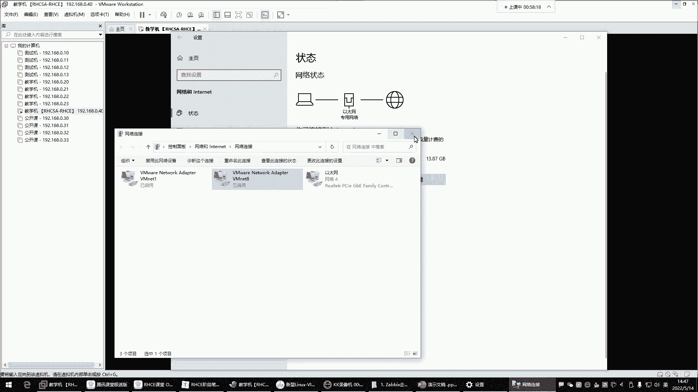

# 新盟教育-Linux运维RHCSA+RHC培训教程视频合集，全网最新最全最详细！ - P44：红帽RHCE-8.case条件判断、for循环 - 广厦千万- - BV1up4y1w729

你是不是应该能够大体的理解啊，这是一个case语句啊，case判断啊，然后你看到没到一的时候，你应该知道啊，这个没到一是什么呢？啊是。😊，在执行脚本的时候，应该给它一个值啊，给它值了以后的话呢。

他干嘛呢？哎他就可以帮我去。执行我的这个里边的指令。啊，对先简单作为了解哈，这种东西呢是什么时候用，咱们什么时候再梳它。

这个数组看起来好像函数。啊，sorry好，我我说错了，刚刚就是函数，不是数组哈。啊，对，就是函数哈。嗯，刚刚那就是函数，不是数组，函数是给一堆命命令定义别名。😊。

O。好，那接下来呢我们了解了这个case了，是不是后期也可以用得到啊？所以你到时候你能够看得懂别人的脚本的时候，你就知道他可以干嘛用做判断的，就是做判断，条件成功，帮你执行命令，条件失败。

就不帮不帮你执行这个命令，能理解吧？好，那下边。😡，负循环负循环的话呢是什么叫负循环呢？负循环就是帮你重复去做一些事情。负循环叫循环处理，根据变量取值重复执行某些命令。那这个东西的话呢。

我们啊对于负循环呢，我们先来演示一下，演示什么呢？来先写个小脚本。这个写一个优色点SH，这是创建用户的脚本。把这个拿过来，咱们先不讲它的一些功能，我们就来看一看这东西可以怎么玩，好吧，现在。哦。

或者是我们。来看啊，我要只用这个脚本了，这个脚本叫啊是优色点SH改个名。😊，把优色点SH给它改成叫fo，然后优色点SH啊，标记一下，这是复循环的一个创建用户的脚本。什么意思呢？

就是循环帮我去创建用户来执行看看效果哈。哎，ch for优色点SH回车。😊，哎。😊，看到效果了吗？这个效果是什么呢？哎，他帮我创建了好多用户，然后就给这用户啊设置密码是吧？小芳创建成功。

小芳密码设置成功，小微创建成功，小微密码设置成功是吧？这是九妹，这都是拼音哈，九妹创建成功了。阿里这我们中国的四大村花都创建好了。唉，那你发现这东西有点意思是吧？😊，那这个东西啊就是循环。什么叫循环呢？

就是帮你重复去执行某些命令。那这个怎么执行命令的呢？它的语法是这样子的for，然后呢变代名。一。然后注意啊，它这个里边负循环对谁循环，对变量名里的值做循环。然后那这个值从哪来啊。

是在in后边你给它定义的。所以你看我这里边的语法就是什么呢？fo，然后我这个变量名随便取，让它叫us瑟。好，那它是对变量名里的值去循环。只要你变量里边，只要你这个变量名里面有值，它就帮你执行什么呢？

度跟档里的语句，也就是说这一步的语句是你具体执行的命令，但是它帮你重复执行。那怎么样重复执行，或者说它会执行多少次呢？要看你的变量名里边什么时候没有值了。那这里的命令它就不执行了。

所以说你这个值是定义在这个印后边的，你写多少个值，那它每次循环的时候，第一次循环，它会把小方给我复到这个变量里面去。然后附到变量里面的小这个变量名是不是里面就有值了呀？有值之后。

它就执行度跟档里的这个语句。好，那这个语句。你想干嘛，你就写什么命令就行了啊，我想创建用户，那这时候你就us IDus ID谁呀？U ID这个变量名，这个变量名里面存的是小方，是不是啊？那我就创建小方。

然后呢，这个时候我结果不要扔掉，因为这条命令啊，它甭管是成功还是失败，总之它都能给我创建出来，是不是啊？不存在就创建呗，如果存在呢，存在，是不是就是它也不会报错呀。😡，所以结果不要。

那接下来那创建用户以后，我呢直接挨一个，告诉我这个用户创建成功了，是不是啊啊变量名，因为变量名里面不就是小芳吗？啊，接下来那给他设置密码，密码的话，我是ecle一个一，然后呢。

通过这条命令给他设置密码给谁呀，给变量名里的值设置密码，这里的值就是小芳是不是啊？那这时候给他设置密码，但是结果也不要。接下来呢，我告诉用户哎，我的你的这个用户啊密码设置成功了，密码是一。😊。

那这是第一次循环。第一次循环就是因为这个里的值是存的是小方，是不是啊？那只要这里有值，他就帮我执行这里的指令。那下边看看在下边。嗯，怎么还能执行下面的密码啊，不是这个。注意哈。我们执行命令是输出结果。

注意哈，我们扔的是输出的结果。😡，可不是把密码扔掉了。😡，啊，就是你执行命令，你执行命令以后，比如说我us爱的，我现在再建一个小芳回车，这是不是一个命令的输出结果呀？他告诉你什么用户已存在，是不是啊。

这叫输出结果，我不要啊，输出结果扔掉哈，不是说把密码扔掉了。😊，这密码你扔不掉的。😡，🎼所以这位置别搞混了哈啊就是这个你设置密码，它不是有些输出嘛？你挨一个密码，123给这个管道。

给passWD给呃杠杠杠杠STDIN。给小方设密码回车，你看这不是有一些输出嘛，是不是告诉你什么更改这些输出，这些输出我不关注，不关注的话，我就不要了，扔掉了。啊啊。

把输出结果给它重定向到这个黑洞设备里边啊，它是这样子的OK然后那这个里边有值的时候，是不是就开始执行这里的语句啊？那第一次循环他把s命令给你执行完毕之后，嗯，注意哈，他注意哈，他把s命令给你执行完以后。

那这个循环。😊，他干嘛呢？它结束了吗？哎，是本次循环结束了，注意啊，是本次循环结束了。那接下来他还要再回过来，再看什么呢？再看这个印后边还有没有值。第一次他已经把小芳。给他干嘛呢？

给它传递到这个变量里面了，然后开始执行语句是吧？那第二次他还要回来干嘛呢？还要回来看小方后边还有值吗？有小V，如果有小V，他把小V也要干嘛呢？传到这个变量里面去。传到变量里面以后。

那这个变量里面是不是又又有值了呀？那只要这个变量里面又有值的话，它就又开始执行这里的语句了。哎，开始帮你创建谁呀？创建小芳啊，然后执行这里的语句。那这个是不是就是帮我们重复执行了这些命令了呀？没错吧。

啊，那第二次循环结束之后。😊，接下来那这个循环也是本次循环结束了。那接下来他还要再回过头来再看啊，那这个小芳后边还有值吗？一看还有一个九妹，那接下来干嘛，把九妹再往这个边量里面传哎，扔到变量里面。

那这变量里面又值了，又值又开始执行这里的语句，又重复执行这里的命令了是吧？好，那接下来这个命令执完以后，他再回过头来，再看谁呢？哎再看这个九妹后边还有值吗？有阿莲把阿莲再往这个变量里面传好。

那一看这里又值了，又循环好，那循环完了之后呢，他再回过头来看，看什么呢？看阿莲后边还有值吗？一看阿莲后边没了啊，那接下来整个循环结束了。😊，脚本就退出了，它是这样子的。😡，能列吧。

所以现在我说这重复执行某些命令。😡，哎，我现在有一堆命令要执行。那你通过复选案才可以帮你干这个活。能列吧。那能不能了解这个思路呢？没关系，不了解的话，大家可以下去自己演示演示。啊，自己演查一下。好。

那接下来下边有一个。小例子来，大家看一下。这个负循环可以干嘛用？这个负循环可以帮你测试企业服务器的一个联通性啊，这个联通性就是你们企业现在有一排服务器。

有一堆福气哈那这一堆福气呢，对于你来讲呢，你是一个维护者。😊。

嗯。嘿啊只能这样吗？好吧，那就这样吧啊，你是这一群服务器的一个维护者。

达腰了。好了。好，那现在要干嘛呢？现在比如说我们啊发现我这一群服务器里边呢，有有其中有几台机器呢，它宕机了，关机了。但是我现在无法判断是哪台机器，那怎么办？哎，我让你给我去测试一下。

到底是哪台机器关机了，那怎么测呀？😡，嗯，我怎么样才能知道这个机器到底是开机的还是关机的呢？是吧？😊。

就比如说我想看看百度服务器。它的状态是吧？我可以拼3W点百百度点com。但是我这个机器网络有点问题哈，网络有点问题。我现在先不管它哈，下去我到时候看一看虚拟机的问题啊，应该是在编辑器里边有点问题。

嗯。那254也没啥毛病。把这个。

だ基分な。そななね。没啥毛病哈，等会儿哈看看。

道们。呃，今天呢。40啊40行细行行，0。1。

算了，我先不管它了哈，先不排了，拼不通就拼不通吧。你们知道我想测试服务器的联动性，我先拼拼自己哈，我先拼拼拼拼自己的网关吧，拼192。168。0。0。254回车啊，这能拼通，那可能是我的。😊。

呃，网络问题哈网络问题。😊，先不用管他。先不用管这些哈。不是啊。🎼host3W点儿百度点儿com啊，为了大命令。然后。Nす。U。没有没定，那算了，不玩了哈，先不管它先不管哈。

你就知道我们自己在自己环境里面能拼通就可以啊，能拼通这个地址，我们一会儿就可以给大家演示了。那接下来。😊。

我们现在。就要需要你干嘛呢？测试这一群服务器的联动性。那怎么测就拼它。哎，哪个机器能拼通，就证明哪个机器是开机的，哪个机器拼不同，就证明哪个机器是关机的那接下来啊接下来我现在就干嘛呢？😊，嗯。

我现在就可以用拼去测试。但是如果拼测试，你说我们机器啊这么多，是不是我不能说在命令行里面这样一台一台拼吧啊，拼192。168。0。1啊，拼完这个呢再拼再拼A92。168。0。2。然后再拼192。168。

0。3，我能这样一直拼下去吗？拼到254。这不太现实。是不是啊这不太现实哈，所以怎么办呢？所以哎咱们通过负循环让它循环帮我去拼。😊，让它自动的循环冒拼是吧，一直拼到254，哎，这样就好了。

所以负循环它可以帮你重复去干一些事儿。

啊，那这时候来看一下怎么玩这东西啊，这东西啊有点不好理解了哈，我们先来搞个脚本，叫拼点儿。😊。

SH。就拼点SH吧，在里边井号叹号杠并下的外置。然后我们上来要拼别人了，那要拼边人的话呢，我现在要做哪些事情呢？就是f I in把语法先写出来do当。这是语法是吧？这里面是写命令的。好，那接下来。

来看一下我这个这是啊这个比如说变列名叫拼okK那接下来我这个值怎么定义，我怎么给它值。不房不准。这值怎么给呢？我要拼120啊，要一直拼到254，他的货款扣。嗯。啊，是不是啊啊，没事，一会儿改个名。

那接下来。我现在就得干嘛呢？我现在就得定义数字了，这数字怎么定义？😊，不一样我。他这两个。现在问题来了，这啊对，有人说了，大括号是吧，可以帮你匹配1点点254啊，可以没错，可以哈，1点。

254是不是从1到254啊，那接下了我的命令干嘛呀，就拼拼谁呀，是不是拼这个拼变量啊？😊，平面亮。🎼哎，就就这样玩是不是啊，就拼它嘛？回车来哈，直行这脚本哈，改个名，将拼点SH给它改成fo。

然后拼点SH。😊，改名了，然后接下来呢执行它。😊，fo拼点SH会车。😊，你看这怎么报错了呢？是不是这怎么成这样了？什么无效的参数是吧？啊。

打开那这时候你看我们这样定义是不是啊你这它是帮你拼12345678啊，它怎么玩呢？你看这变量里的值是啥呀？变量里的值第一次应该是一是吧？然后他进来呢就帮你拼拼一去。😊。

是不是啊哎帮你拼一那这你这他帮这一不是IP地址啊，这数字啊，是不是啊？所以他说这无效的参数啊啊，这拼命令他不认识啊，这啥呀，是不是这拼了一辈子，这怎么会有突然间一个数字了呢？是不是啊啊这很很奇葩。

他不认识了，无法理解了，他超出他的认知范围了？😊，所以你这边在定义的时候怎么定义？😊，我们是不是可以上来那个什么呀？😡，嗯。啊，哎。对，我们可以这样玩，只就这样看192。168。0。1到254是不可以？

哎，或者说你定个变量也行。是不是？分的。怎么着都行。那最好就是这样比较鲜明之一，哎，192。18。0点，然后11。点254。那这样他第一次拼的时候是拼谁呢？来看一下效果，执行它哈。😊，直行回车，哎。

你看这样就对了。哎，他第一次拼拼谁呀？192。168。0。1是不是啊？哎，你看这样是对的，没错吧，好。😊，对。然后我们。哎，这怎么不动了呢？你发现他他怎么卡在这儿了？😡，啊。安装。死刑完了是吧，死了。

没错，这拼的命令啊，他就这样。😊，对于拼这条命令，它的特点是啥呀？就是哎呦。😡，我一旦你看我一旦拼上拼某个主机，我告诉你哈，一旦拼某个主机，你看了吧？他现在拼谁呀啊，怎么拼到192。168。0。

40去了呢？拼自己去了，现在。😡，你看看取消掉哈啊又变成0。3了。哎呀，0。4，你看我每次contrl C。😊，也就是说呀，每次一旦他拼不通某台主机的话。你看他变成这个样子了，我觉得有点问题啊。

他一直拼，他停不下来，看到吗？停不下来，一直在拼0。40，他拼着他拼自己呢。😡，拼自己哈。这有问题看到了吗？我ctrl C的时候，它再结束本次的拼，然后再进入下一次的拼拼谁呢？你看我一结束拼0。10。

再结束0。11。那你说我能这样一直我能每次都ctrl C，是不是能这不太现实吧。😊，啊，这有问题哈，我们得给它结束掉，现在正常结束已经无法结束了，这进程已经无法结束了。我觉得这机器有点问题。

我这机器哈这机器有点问题。😊，连接倍儿费劲自己。倍费劲，这机器有点故障，我觉得。这我是哪人。啊，连上来了，那接下来干嘛呢？这个进程一直在什么呢？一直在进程，在运行上呢，我得给它结束掉，它有问题。

现在啊他这问题我们这样哈，我安个包啊，主要是没有这条命令，没有PS。😊，脆这条命令，我看有没有啊杠AP，然后。过滤这个拼。啊，你看没有找到命令，是不是啊，他说未找到。😊，🎼亚母杠外ins到PS脆好。

那是PS。SIMPS。MISC这个包好像是。是这个报名吧。🎼还是PSPS啊，是叫这个名字PSMISC啊，PS脆。杠AP过滤谁呢？过滤拼。啊，也不是这样过滤的。嗯，那我是。PSAUX。过滤。偏。

这什么玩意啊？呃。PS。AUX管道给gra拼啊，有问题是吧？是我的语法有问题是吧？没有gra好，现在啊这个在运行着呢哈，这不行，得给它结束掉哈。Pgra。那叫E e吧， e graph然后。

我想找他的ID哈。一个 rap。啊，不是是这个Pgraph哈Pgraph。😊，过滤进程的，把这进程号给它杀掉哈。Q。😊，僕ら？啊，Q2吧，直接杀叫拼的进城徽州，所有这边看杀死了吗？啊，已已终止了是吧。

没有杀死。Pgraph法过滤拼，这还活着呢，这不行啊。Q日。多顽强啊。先刷ID号在。Q日。🎼奥片。上好了吗？还没杀死，我的天哪。😡，だから你は。🎼嗯，PS吹杠AP管道给gra新。啊，还运行着呢。

你看到吗？哪个是他的ID号啊，这个现当于相当于啊，我们把这脚本直接给它结束吧。😡，是吧啊，把这个脚本。因为这个结束的进程没用，脚本一直运行着呢，看到了吗？不是杠9，是这样哈，这样我们把这脚本给它结束掉。

你看是不是啊你把脚本ID号给它删掉，应该就可以了。😊，Q咱加个杠9强杀飞车。杀死了吗？啊，可以了，杀死了哈。哎呦这太完哎呀。😊，你看你们看看哈这。好了吗？还不行呢，那杀完脚本再杀进程。😡，今日。

Q日 out。进成名儿。拼你看看到了？这个拼哈。杀他。🎼太顽强了。好了，哎呦这算好了。这算好了哈，唉，终于给他杀死了。😊，这脚本写的有问题，这脚本不能这样玩哈，病毒一样，没错，你看。😊。

得杀个进程倍费劲。那接下来这脚本我们应该干嘛呢啊，应该不能那样玩哈。所以你们看写个脚本呢，你得思考，你不思考的话，你上去就是说哎呦那我就这样写完。这简单的思路可以啊，没没毛病啊，是吧你发现不行。

你要了解这个命令，它的一些什么呢？那执行后的一些特点，你发现这个特点就是一直把你拼死啊，要么就是把你拼死，要么就是我自己拼死。😊，只要甭管是通还是不通，它不停，它是不会停下来的，就是一个风格。😡，啊。

所以这时候呢我们干嘛呀？哎，你得控制它的次数了。所以这时候我们在这儿哈哎杠C指定拼的次数。那这时候拼几次，哎，杠在这儿哈，在这边我们来。😊，控制次数。来杠C拼几次呢呃我们拼两拼两次有点多吗？就拼一次吧。

速度快点是吧？哎，就拼一次，杠C后边不用加空格。然后那下面还有一些这个可以提提升拼速度的杠I啊，指定拼的延迟时间啊，默认的话它延迟也有点高。杠I延迟呢我们给它改成多少呢？这0。1给它改成0。1。😊，0。

1延迟，然后杠W指定超时时间啊，就它拼完以后拼不通啊，它一直卡在那儿，它超时能理解吧？一直卡在那儿它不动。😡，没关系，哎，杠W别超时干嘛？就超时的话也是一秒钟就结束了，知道吧？啊，然后这里边拼几次。

拼一次啊，延迟时间0。1秒，超时时间1秒。好okK啊，拼谁就拼这个地址。那这个时候。我们再看下效果，好吧。lash four拼回车，哎，看到吗？这样说可以啊，你看它现在是一个一个拼的，是不是很快呀。

你发现你看。😊，P谁一92。18点0哪，是不是啊？你看10111213，这样你是不是就可以清楚的知道哎，哪个机器是通的，哪个机器是不通的呀？😡，是不是啊？いっぱい。我不是识人。但是这是通还是没通啊？😡。

这通了吗。😊，で。感受不到是吧，拼一次这拼一次好像不行啊，我们再给它杀掉哈。😊，杀掉，这不行啊。过滤一下进程。P grape。嗯，然后。杠AP。这P rap。是不是过滤进程了呀？Cp。拼啊，不是哈。

是撇子脆哈。🎼PS子 tree用PS tree看进程数。啊，AP。A是过滤整个什么呢？整个哪条命令产生的进程，P是显示它的PAID然后再什么呢？再过滤哎，包含较拼的这个进程回车。

那现在是这条命令产生的进程是不是啊？然后这个进程，它现在PAID是多少？那接下来。对，这不行啊，一次不行一次不行，我们要改改次数，一次太啥了。一次频率太快了哈。😊，所以现在给它杀掉。今日。呃。

然后杠9先把这个脚本给它结束掉，脚本的PAID先给它杀掉，然后再Q2。再把叫拼的健常名给它干掉。回车。哎，没了结束了哈，应该是杀死了，看到吗？还是这个狠是吧？你看直接就杀死了，直接把脚本一杀死停了。😊。

改一下哈，改form拼，这一次不行了哈，得拼两次。😊，拼两次OK那拼两次。我们来看一下啊，其实你现在我们已经能够感受到了，感受到什么呢？😊，你在执营这个脚本的时候。あど们。我。他到底是成功还是失败了呀？

肯定失败了，肯定是失败了啊。他成功它不是这样的，成功它会有什么呢？有数据包，这里面没有数据包。😡，所以。那。大多数都是拼不通的，但是也很快了是吧？

你看20、21、22、23、24是不是是不是就已经很快了呀？已经很快了，哈这里边。然后那快归快，但是这样的话呢，我们让他在屏幕上面太乱了呀，我们能这样看吗？太乱了。😊，是不是啊？

多乱呢，你发现搞得满屏都是。所以我们一般也不这样玩也不这样玩哈。所以现在再把它尽头杀掉。😊，们的啊这时候他的ID号叫8164了。Q-9枪杀8164回车死了吗？死了好，死了哈，已杀死。

那接下来这个脚本还要改还要改哈。改。F拼。这样怎么改呢？这时候我们对于它的输出结果做一些处理。😡，结果太多了，不要了啊，输出结果太乱了。😡，是吧扔掉扔到DV的黑洞设备里边。好，那你说你把结果扔了。

我怎么知道它是通还是没通啊，是不是啊？你看那本来我们是通过输出结果可以看到，那这个机器到底有没有拼通，是不是啊？好，那你说你结果扔了，我怎么知道通还是没通啊，没关系，哎，我们判断。😡，知道吧？

if我做条件判断。穿的什么呢？上来你看我那右边哈，每到问每到问问谁呀？哎，问上一条命令通了嘛，是不是啊？所以说就问他，如果他的结果杠EQEQ是不是就是等于的意思啊？如果它的结果等于0，那然后干嘛呢？哎。

然后我就eicale谁呀，e192。168点0点每刀拼。😊，啊，其实不应该用拼啊，应该是IP哈，这位是。😊，IP。拼谁呀？拼IP。被边话。🎼对，IP。我就挨这个IP的什么呢？它的状态是什么呀？

当然用引号引起来，这里面我要看啊引起来，代表说这个整体啊，它是意思叫做up的。up就这个。活跃的状态好。那这种是这个拼通的情况下，我们做了一个判断是吧？比如说条件成立了，那这个主机如果是活跃的状态。

我就挨ical这个机是up。那如果这个机器它不是活跃的状态呢，那这又怎么办呢？是不是还得来一个否则呀啊。😊，还有是。否则干嘛呀？哎，否则我再艾一个。告诉你一下这个机器192。168。

0点每刀IP它是意思。淡的。啊，也就是说如果他的数如果上一条命令的返回的结果不等于0，那这个机器肯定是没拼通，是不是啊？哎那这个时候。你写块。这怎么它怎么红了呢？你们看到了吗？嗯。😊，他怎么红了呀。

为什么红啊？😡，哎，你的语法里边少一个什么呢？少一个FI。😡，啊，还少一个人是不是？你看这里边你这语法写的是不是哎，少一个还少个FI哎，你看你补上它就什么呢？就颜色就对了。😊。

对你要这里边你但凡少一个语法，他给你检测到了，不对，你的语法有问题，看到吗？所以你们写的时候，你们如果语法错，你看颜色也行。😡，哎，FI是吧？如果你说我这儿不加蓝。哎，这你发现它检测不到啊。😮。

检测不到是吧？所以说这也不是太智能。😊，不是太智能哈。😊，好。okK保存退出。那这时候我们来看一下。回车。哎，当你看01唉，不对啊，一就是的。有点问题哈，这怎么输出有问题呢？杀掉哈。😊。

你们发现啊你看了吗？他这IP地址什么192。198。0点什么，是不是啊？😡，过滤一下。这是我们鞋的问题了啊。嗯这个。🎼Q-9强杀他杀这个PAAD的回车。好，杀死了是吧？脚本有问题哈。😊，脚板哪有问题呢？

是这儿192。18。0。5的IP吗？呃。一点2等于168。0。1，没错啊。WE啊，不是这儿。美到IP啊，也对，没毛病。icical啊就不要icle加这个了，就没到IP了。啊。

这个哈因为这个这个变量名里面存的就是一个完整的IP地址，是不是啊？所以这位置。😊，来保存退出。那你发现我这个写的跟我的笔记里面有它有些不太一样，是不是啊不太一样？🎼four拼回车。哎，这样就对了。

告诉你这个地址是down的当都是当是吧？没错，我们这个环境里边确实在这个范围内的，在我这个机器里面都是down的嗯。对，杠1Q杠1Q是什么呢？做比较的，不是判断，是做数字比较的数字之间的对比。嗯。

前面的话呢我们在讲众多的。数字对比的时候叫做整数比较，这个EQ是用来做等于的。等于所以我们这个位置就是在负循环的时候。啊，我就得问问什么呢？哎，上边的命令的返回结果它等于0吗？问他一下，嗯，对。

是否等于是否等于0。好。那你看这里边是不是我我唉不对啊，四十是up的看到吗？这是谁呀？四十是up的啊，这四0是谁呀？四0是我自己本机。😊，嗯，这是我自己唉这是我自己本机是up的哈啊。

所以你看是不是啊哎他对他是不是拼自己发现自己通的呀，拼自己自己不通那就成僵尸了，是不是自己都是一个死机状态啊，但是别的机器都是当的哈啊，那演示一下就可以了，他会一直拼到多少啊，是不是他一直拼到254啊。

😊，一人拼到254啊，那一直拼到254的话，那这时候我们就别让他拼太久了哈，杀掉它。😊，杀掉他。演示一下，能看到效果就行，它会一直配到254。那现在就是我们对于这个输出结果。

我们一般的不让它显示在屏幕里面。注意啊，就这个输出不要让它在屏幕显示太多了。😊，太多了，我们一般干嘛呢？唉，放到一个文件里面去，这种输出结果这么多，先把镜头杀掉哈，杀掉。你像这一堆输出结果。😊。

你在屏幕里面显示你的屏幕也非常乱呢。我们虽然说感感觉在屏幕里面看的也比较清晰是吧？但是我们是不是可以这样啊？😊，我们可以是我们可不可以这样玩，哎，把什么呢？把up的。如果说这个。我只关注哪些主机是当的。

我是不是可以直接把那些当的主机把它的结果给它输出到一个文件里啊。比如OPT的什么呢？啊，叫做这个网络，嗯，叫net，然后当。第二TIT里面。是不可以？那up呢，如果你想收集。是不是啊？耐特。

代表网络的意思。up就是这个机器是。开启的状态是不是啊？哎，如果这个机器是up的状态，就收集到这个文件里面。如果这个机器它是关机的状态。就收集到这个文件里面，是不是啊？😡，这样是不是可以啊？哎，没错。

哎，这样然后呢，那我们在执行脚本的时候怎么执行啊？哎，我不知让他在前台了，干嘛呀？😊，让他在后台执行，扔到后台规车。哎，那你看我前台不影响是吧？对。

你看他现在在后台是不是啊我们这样啊啊GOBS杠L看一眼，这时候看后台进程啊啊，规车哎，你看他在后台运行中是不是运行中的啊，脚本的名字是吧，叫这个名字。😊，反这方家都。

运行的那他现在不就在后台默默的拼的吗？是不是啊？那你现在他默默的拼，你现在看OPT就可以看到文件了，现在都是当的文件，是不是？你现在看文件里的内容也都是net当点TT，你看这都是当的。

是不是以后你说我想看哪些主机是关机的，打开这文件就行了。你不打开。😊，说白了我们用。它过滤的时候也可以啊。啊，但一般我们都是看一看哈，看一看哪些主题是脏的那生产环境可能说有那么多有那么多主席都是脏的吗？

不可能吧，是不是？😊，啊，up也出来了啊，那我现在看看哪些主意是up的状态是吧？就打开这文件。😊，啊net不是net了哈，是啊是net，然后up回车，只有自己是up的，是不是啊？哎，那你看那有了这脚本。

你写完以后，你们公司说去给我看一下咱们公司哪个服务器现在是被雷给劈了是吧？现在都关机了，那这时候你一拼发现，哎，这个机器是不是这个机器是处于关机状态，那你就你告诉你们领导，你说这个机器是吧？

昨昨天晚上下雨是吧，被雷给劈了，那没有办法是吧？那这你不能怪我维护不当，是不是啊啊换服务器。😊。

再比如这个怎么去拼他们嘛啊拼他们。

好，这是那个。通过这个什么呢？通过循环啊写了一个脚本。是不是比较简单的？比较简单哈，然后我这里面写的这里面不太一样。你看我我是这样写的，我说上面的是来1个SEQSEQ是什么呀？SEQ啊其实就是什么呢？

就是这个大括号的另外一种实验方式。大括号我们是11。254，是不是啊？那SEQ呢？😊，🎼你不用大括号，你直接反撇引结果嗯SSEQ。他们也是干嘛呢？你给他1个254，他就干嘛呢？帮你。😡。

去从一开始拼到254。你说我不想拼到254，比如说我想从100拼，那就100-254啊，他就从100开始帮你什么呢？帮你执行。那跟大括号是不是一样啊？你说我大括号我想干嘛呢？

从1001直给我拼到254是不是100点点254啊。能列吧，就以他们两个的实验方程是一样的。是一样的哈，所以用哪个都行。我这里面是用SCQ啊。我主要是为了给大家讲一下。

就是我们如果说这个你看到以后有人通过这种方式去什么呢？定一些数字的话啊，它就是大括号的另外一种实验方式。然后我这里边是干嘛呢？在拼的时候啊，我是干嘛呢？直接把IP地址写到这个什么呢？拼这个命令的后边了。

然后再调用变量名，那这时候变量名里面第一次循环，它的数字是一是不是啊？那我就拼192。168。0。1那第二次循环，这里的值就是2是吧？那我就拼谁192。168。0。2。😊，啊，他是这样子的。

它是这样子的啊。一到外好。那其实如果像我刚刚写的，不就是192点是吧，192点168点0点儿，那你这块就直接不能用IP了。是不是啊？就直接干嘛？哎，就直接拼这个变量名就行了。

那这个变量名里面是不是就是什么？就是192。168。0。然后1到254啊，那下边你在挨go的时候，是不是也就直接像我那样。icle这个编代名人就行了呀。效果是不是一样的？没错哈嗯。你咋放不到后台嗯。

你放不到后台吗？😡，那为啥我能呢？你看他说他放不到后台。😊，哈呵。😊，好你看到。他说他放不到后台。😊，啊，自己跳出来了是吧？😡，Yeah。😊，那你这你这啥系统啊，跟咱们系统一样吗？😡，嗯。

你那咋这么诡异呢？你看你看。😡，是不是啊？😀这你说你这啥玩意儿吧啊。😊，对，很奇怪是吧？😊，啊，一样的那一样的，你看我我这他就他就得后台运行啊。😡，你看完成了，执行完了。😡，回知道。😊。

这不很这不很很奇怪嘛，是不是？那你看是不是和我这里面写的有点不太一样啊？😊，嗯。好。啊，这是怎么把它的输出结果给它追加走啊，追加到文件里边。啊，这是副循环啊，歇会儿歇会儿回来给大家讲讲什么呢？

讲讲下面的这个will循环，这是一个死循环。一会儿回来讲哈，歇会儿吧。😊。

