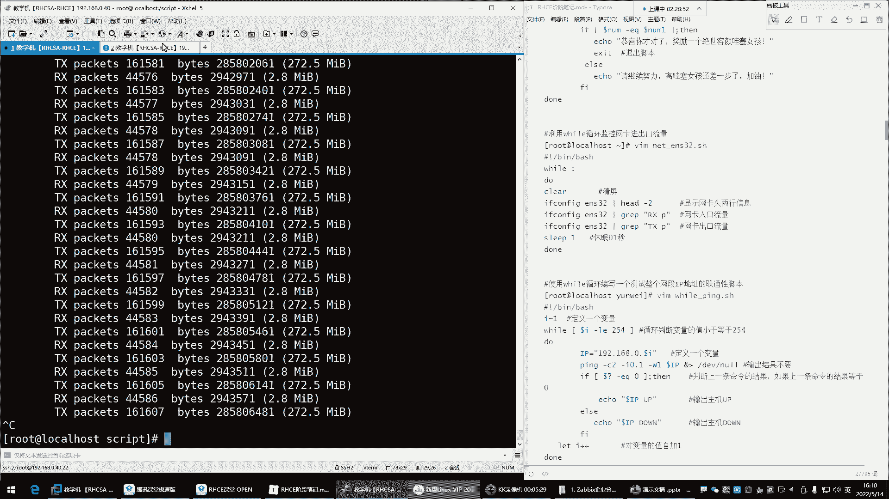
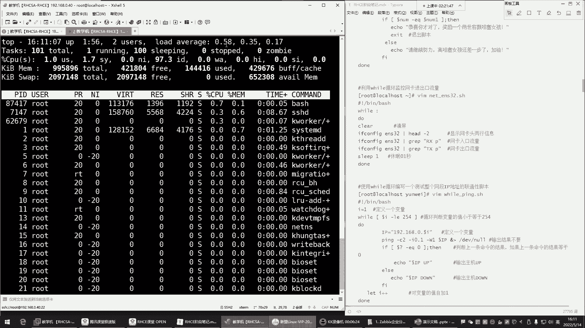
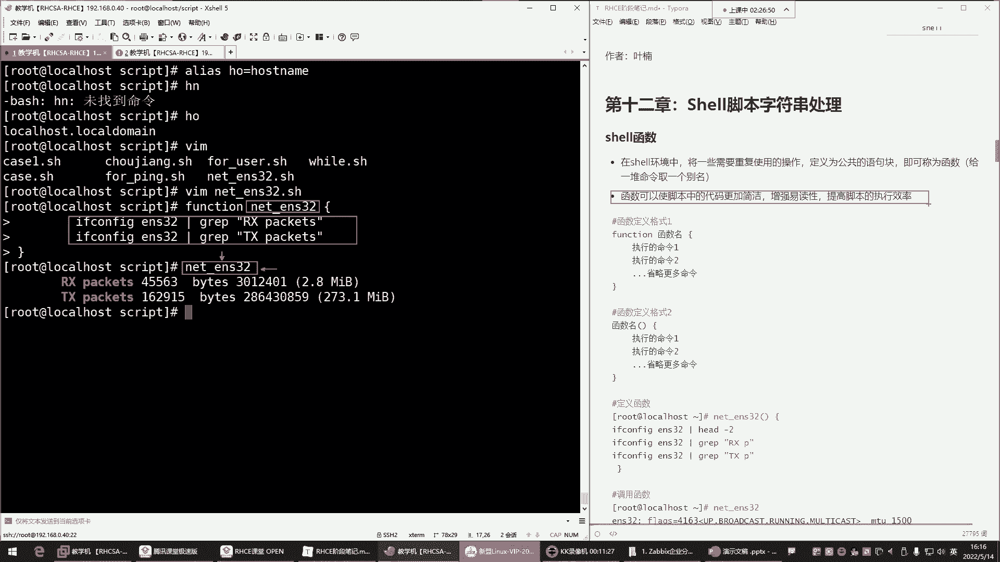
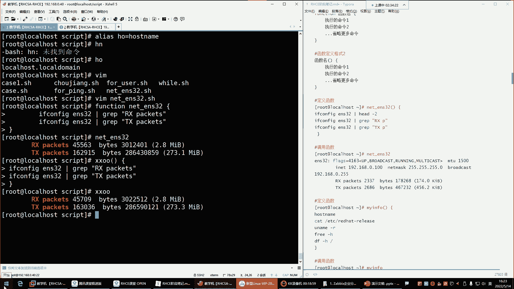

# 新盟教育-Linux运维RHCSA+RHC培训教程视频合集，全网最新最全最详细！ - P46：红帽RHCE-10.shell函数、脚本中断及退出、字符串处理 - 广厦千万- - BV1up4y1w729

喂喂喂，O。好，那正式开始了哈，我们来说说这个我们怎么利用这个vi循环。就是我们有的时候会需要这种vi循环去持续的去帮我们做一些事情。注意啊就是。😊，我们是就是很多的情况下就是用了这种未有循环。

比如说对于网卡的流量的监控，我的内存CPU的监控，那这些我是要持续监控它的那持续监控的话，是不是就没有头啊？好，那这个时候。啊，井号叹号在这里边来井号叹号。井号叹号杠并下的白。那这个怎么写？

我想监控的网卡流量，先把语法写出来will冒号啊，还有一个叫t。t的话也是will循环的里边的一种语法格式，处也一样，will true也是死循环。然后冒号也一样，所以冒号比较简单一些。

你们以后看到别人什么处的话。你就知道它也是未有循环里边的一个死循环的表示方法。好，然后接下来do。当里边的语句，我现在想监控的网卡流量，我怎么样才能监控啊。

我是不是得先知道我的网我是不是得先获取我的网卡流量啊？😊，好，那下边这个获取的话呢。来看一眼。这个机器好慢呐，我这个机器我觉得它有点问题哈，192。18。0。40。😊，0。40。这个机器一会儿不能用了。

下课以后给它删掉。好，来啊，看ifconfi哥，然后ENS32看网卡是吧？好，没有命令，ym杠Yins那个命令那个包叫什么来着？那个网卡就是if服康菲的那条命令记不住是吧，自己搜一下。😊，搜谁呢？

搜if configurefi。哎，这怎么没搜出来呢？没有搜出来是吧，没有搜出来呃，y么。这有点尴尬了是吧？他说没有找到，那y姆杠外insal那个包叫net杠兔s。是不是叫这个名字好像是。对，就这个哈。

然后。😊，这个时候呢，你看他没有搜到，这很怪异，是不是再敲衣服fi哥。回车这样就有了，但是我只看ENS326个网卡，那现在就只显示ENS32。好，那接下来这块网卡现在显示出来了哪些是入口男是出口？

前面讲过是不是RXP的这个位置代表是入口的流量啊，是不是啊？😊，好，然后这个TXP的代表是出口流量。那下面这些呢是什么一些错误的。😡，啊，这个呢我们不用管。

我们就看正确的我的入口流量跟正确的出口流量的数据。好，那这时候我现在通过ifcompfi可以获取到了。那接下来。😊，我怎么把这个数给它取出来呀？😡，是不是啊？好，那这时候。啊，干嘛管道给。g rap。

我过滤过滤什么呢？过滤RX。过滤它。啊，哎，怎么没有呢？gra啊。加引号。回车这就可以了哈。哎，这事。😊，这是入口流量啊，那这个数出来了，是不是啊？你看这入口流量呢那出口流量，那是不是也是同样方法呀。

那就换成。😊，TX回车，这出口流量。好，那两条命令来拿过来。这是入口流量，这是出口流量。出个流量okK那接下来我是不是就可以干嘛呀？去看一下死循环，它给我指行的效果呀啊，外齿。回车。

唉，你看一直循环着呢，一直给你输出这个网卡的流量。是吧？但是我告诉你，这个死循环特别消耗你的CPU如果它一直循环下去，你top看一下。

你的CPU这个值一会就标上去了。😡，它是非常吃CPU的。啊，现在0。52了吧。如果前面这个数达到一，是不是就一个盒的CPU负载就百分百了呀？啊，你看已经0。82了，看这哈就看这儿就行。😊，0。91了。

看到了吗？马上了1。0，你的这个CPU就超负荷。是一个盒的CPU就超符了好，完了哎，出现一个僵尸进程看到吗？哎，刚刚这一。0的是吧，你看一达一达一达到1。0，他说出现一个什么僵尸进程了。😊。

因为你的资源不够用了。资源不够用，你的某些进程没有没有CPU资源，那它就变成僵尸进程。😡。

ctrl C结束掉，哎呦结束不了了哈好了，可以了哈。😊。

这时候能够明显感受到是不是死循环特别消耗你的CPU啊。😊，啊，现在一点点下来了哈，马上下来了。😊，は。好，所以说对于死循环的话呢，我们一般啊让它慢点，别执行太快了，太快了，不行，干嘛呢？唉。

在这个循环里边加一个。😊，sleep让他睡一会儿，睡多久呢？睡个0。2秒。睡个0。2秒，可能对于我们来讲，跟没睡一样，不就是眨个眼的功夫嘛，是不是？但是对于CPU来讲，你看这速度就慢了。😊，看到了吗？

这速度就慢了，你这边再通过top观察一点影响没有。一点影响都不会有的。好，这就是我们所说的。使用卡，你看这CPU降下来了吧。一直在往下降哈。

但是这种的话也不行啊，搞得屏幕满屏都是你这说白了我们怎么看呢？😡，是不是啊？这没法看。

呵。😊，う。所以这个脚本现在不完善。😊。

它是我们这个一直在什么呢？在循环输出我这个网卡的入口流量跟出口流量。但是光这样是不行的。光这样不行哈，我们要干嘛呢？😊，我们要。就是让他清晰明了的展示给我。这有点难度了哈，这不清晰啊。是不是啊？

你看就像我这种方法，你这样。你这不清晰呀，显示的玩意儿。那怎么玩呢？哎，上边清个屏。上来我先干嘛呢？先cle。clear叫清屏啊，这时候我们再看。拜lash。哎。这样就可以了。哎，它每次只显示什么呢？

哎，就是每次循环的时候清个屏，清完屏，我再给你去过滤啊，每次过滤之前清屏哎，然后显示完以后再清屏，这样我就可以持续的关注啊，我当前的网卡的入口流量跟出口流量了。😊，看。看到了吧？啊，看后面就行。

我的入口流量2。8兆出口流量。270多兆是不是啊？唉，这样可以哈这样可以。O。这是未有循环。呃，然后接下来的话呢，我们得对vi循环后期还要完善哈，现在先大概有个了解就行。有些东西你需要持续监控的东西。

可以用vivo循环来帮实现。😊，V有循环，一直帮你去什么呢？去循环你这一堆命令啊，你给什么命令，他给你循环什么命令，这样适合一些持续的一些这个工作。好。那接下来。我们呢再来说说下边的这个will循环。

也可以像负循环一样，实现一个什么呢？叫做测试整个网络上的IP的联通性。那这时候测试网段灵动性，如果说你用死循环的话，你是一定要干嘛呢？要控制它的数字的。但一般我们对于will循环来讲，没有必要去什么呢？

去用它去实现一个什么呢？就是一个负循环的功能。因为它们两个你如果真的是想是去这个拼网段的话，咱们就不用will循环了，用复循环。所以这个大家可以作为自己的一个什么呢？一个参考啊，了解一下。开了啊。

录屏开了哈。嗯。好，ok。😊，呃，这是这个will循环，所以大家简单聊解一下就行哈。😊，然，下边呢我们再来这个给大家说说这个脚本的一些字符串的处理。什么叫字符串处理？这第一个就是脚本里的函数了。

函数在设有环境当中将一些需要重复使用的操作定为一个叫公共的语句块，即可称之为函数。所以我给大家一个通俗的解释，就是给一堆命令取一个别名。我们前面学过阿里斯。阿里阿斯。呃。

阿利斯这条命令呢就是给命令起别名的。HN等于hose name。H。哎。阿里十4。HN等于hose name啊HO。HO回车是吧？那以后我敲HO是不是就是看我的主机名了，就等于执行这个命令了呀。😊。

但是阿里斯他一次只能给一条命令定义一个别名。而我现在需要很多命令。比如说。就拿刚刚那个脚本里的那一堆命令来说。VIM我们刚刚是那个脚本叫什么来着？是netES32。好，我现在想给这几条命令。

就这两条命令定个别名可不可以？拿过来可以怎么玩呢？看看。😊，两种定义方法。第一种你要记一个单词叫方。啊，单词后边呢加一个名字。这就是函数名，给你的函数取个名。接下来就是你这里边的具体的命令了。

这命令你可以写多少条，看你自己的需求。function函数名，比如说nENS32。然后大括号开头回车，这里边写命令。大括号结尾回车定好了，接来nENS32回车。哎。你们现在感受到它的功能了吗？😡，啊。

你们现在理解这个函数它的具体作用了吗？😊，这就是函数名儿。我以后我再想看我网卡的入口流量跟出口流量的时候，我执行谁呢？我执行我的函数名。😡，functionson定义的那个函数名字。

函数名字里面是什么呢？嗯，就是一堆的命令。你这命令是什么？没关系啊，是什么都行。只要你想实现的那个目的，你就写什么命令。那接下来你在需要什么呢？需要调用的时候，哎，你就干嘛呀，你就来。😡。

直接输入函数名，他就知道了啊，原来你要调用我这个函数里的命令了，所以就是。什么呢？函数可以使脚本中的代码更加简洁，增强易读性，提高脚本的执行效率。

就像我前面给大家看的那个脚本一样，那个脚本不就是什么呢？不就是。

里边用到了函数了吗？这个里边。但是我们现在也没有学习N这个，所以也没学什么服务。所以这个东西呢我们现在了解一下就行。这里面就一堆函数。韩叔的名字。看到吗？函数名字。

那说他的函数名怎么跟我们的函数名不一样呢？😡，喊出名字。怎么函数名后面怎么是一个小括号呢？哎，这是第二种定义格式，函数名小括号。这种你不用记这个单词了，所以一般呢我们比较喜欢第二种语法格式，函数名。

只要你就知道名字后边来个小号就行了。😡。

你看像他这种。哎，函数名，比如叉叉OO，这是名字哈，小括号，然后空格再来个大括号，把密令往里面写。这是我要执行的两条命令。第一条。写进去。第二条。写进去是大括号扩回注意啊。

你的命令是写在这个大括号里边的，所以这个括号是成对的，你不能是一个大括号能理吧？你大括号扩回的时候，你一拍回车，他就知道。😊，你要定函数了，然后你再敲叉叉。哦，样。所以哪种更加方便一些呢？😊。

肯定是第二种，你不用记这个单词了，是不是啊，然后下边在这儿。

你看他不就这么玩的吗？😡，它就是什么呢？哎，它上边。在这个位置哈那这是一个函数名。😊，函数名里面这一堆命令有异付判断，是不是啊？😡，干嘛呢啊，用这个Q是命令行的浏览器去访问什么呢？访问。

他自己的这个变量名里的这个什么呢？这个地址。这里边引了一个一个变量名，叫N这个看到了吗？访问这个变量名里的地址，就等于说上面这一堆命令是干嘛呢？访问这个地址的啊，访问这个地址，然后看这个地址。

它的状态是不是什么呢？是不是这个可以正常访问的啊，如果是如果是running的话，那下边啊就干嘛呢？这也是一堆函数函数名是吧？函数名里边是命令那命令的时候，它调用了什么呢？又调用了函数了？😊。

那这个函数里边你看也就说他以后再需要去执行这里面的一堆命令的话。它不需要在每个函数里边都去敲一遍这么复杂的命令了，干嘛呢？哎，我以后通过函数的名字就可以直接调用这里边的这一堆命令。

所以说它直接哎在函数里边又调用了函数的名字。那也就等于说哎调用了我这个函数里的众多的什么呢？命令了。看到了吧？哎，我就调用那个函数，然后这或者是吧，不或者吗？两根竖线或者啊也就是说这个命令。😊。

如果执行失败的话，上边在干嘛呢？哎，再去访问这个页面。或者嘛两根竖线或者前面命令执行失败了，后边Q杠S就访问谁呢？访问这个地址。换这个地址。啊，这判断页面是否存活。然后接下来后边过滤啊。

从这里边各种过滤啊，但里边还会涉及到一些AWK哈那这你先不用管，你就知道函数你一旦定义好了之后，哎，我就干嘛呢？把所有的命令定义到这个函数里边。然后接下来我需要用的时候，我下边调用就行了。

你看它每它每一条命令里边都调用了什么呢？那个函数了。那如果说你不调用函数，你这脚本是不是你需要这一堆命令的时候，你都得去在下边去敲一遍呢？麻烦。😊，非常之麻烦，是不是啊？😡，嗯。

所以的话呢呃对于这种的话呢，我们一般就是它可以让你的脚本变得更加简洁啊，这样你看起来唉感觉人家脚本写的挺不错是吧？啊，没错。😊，这就是我们说函数，它就是让你的代码啊更加的简洁了啊，增强了我们的易读性。

就是你不用看起来感觉乱乱的。😡，提高脚本的执行效率。那在这里边你就知道，然后函数以后呢，定义好了函数之后，想调用函数里的命令，你直接在函数里面也可以调用。然后下边也可以干嘛呢？一旦定义好了以后。

在这个判断里面也可以调用，看case语句里边，我也调用了什么呢？啊，也调用了这个函数名在这呢，看到吗？函数名一调用这个函数名，它干嘛他是给我执行这里的命令啊，那这里的命令，其中有这个函数。

是不是它也会去帮我执行这个函数里的上面的这部分命令啊，没错吧。😊，所以这里边很多东西。函数就是让你的脚本变得更加简洁，就像变量一样。说白了就像变量一样。如果变量，你在定义的时候。

你这一个变量里边你只能定义什么呢？定义一个值是不是啊？那这里边你可以放命令，反撇里边可以写命令是吧是？但只能定一个呀，而函数不一样，函数下边你可以定义无限个。😊，只要有一种需求。啊。

这是我们所说的函数啊，这种东西你只要以后你看别的东西你能看懂就行。现在不需要说你自己能够写出这个就是这样的脚本，因为根本不可能，你只要能够看得懂这里边啊，这是函数，函数里边呢有一对命令啊。

然后下边这一对命令，它干嘛呢？哎，它下面又定了一个函数，然后这函数里面呢又调用了上面的那个函数，一调用它就执行上面这个命令，能列吧？😊，一执行而执行完以后呢，那这个。😊，就执行里面这个语句呗。

这里面的一堆语句啊，下边你看这个函数里面又调用了上面的函数，又调用了它，那它里面的命令就会再在这个函数里面再执行一遍，是这样的。好，这是函数，所以大家呢知道一下哈哎。😊，知道一下哈。

ok那了解了它的功能了吧。了解了吧。这个现在不需要你自己能够写出来那么一个怎么说呢？非常规整的一个脚本，能看懂就行啊。那我问你们，你们现在能看懂吗？😊。

啊，就刚刚我跟你们说的这个能看懂吗？就大体这个结构能看懂吗？看懂的给我刷个一，看不懂的刷个上来。😡，你能不能看懂它这里边，比如说每一部分这是在干嘛？😡，这是在干嘛？这是在干嘛？嗯，有的能看懂。

有的看不懂是吧？😊，啊，现在我现在也不希望你能够写出来，你就能看懂就行，是不是？😡，嗯。没关系哈。没关系。这玩意有啥不好理解的呀，没有啥不好理解的。😡，我们前面学过这些或者。

是不是啊或者或者就只有前面命只有前面那个命令失败的时候，才会执行后面命令。那这样多好理解啊？😊，就是说你看这个函数里边定了这个这个函数，这个函数里边干嘛呀？不就是去不就是这个里边的命令吗？

这个里边的命令去给你访问。😊，这个地址。这个地址是谁呀？就上面的那个这个地址，然后防完以后呢，那主要是干嘛呢？如果它失败了，注意哈，如果它执行失败的话，下边呢我们自己再去扣杠S。

再去直接不通过函数访问了，干嘛呢？我自己去访问这个变量。第二次我自己去访问了，因为怕前面访问失败，所以说呢这里边来个或者。😊，哪里吧。来个或者，那如果你看他如果他失败的话，哎，后边再去我们自己访问。

访问的话呢，直直接后边这个命令给我管道嘛？是吧？过滤这个页面里的一些关键字。啊，结合AWK做过滤。嗯ん。是不是啊？对。这里面就是众多的函数啊，对，这就众多各种调用哈，各种调用。所以这个需要什么呢？

需要你慢慢去研究研究，看一看这里面无非就是各种变量名，函数名是吧？函数名这里边然后下面case语句。😊，Ps一句。啊，case语句里边，这不就是我们的自己的定义的值嘛，是不是啊，这这里边的值是什么呀？

哎，如果值匹配成功就执行函数，一执行函数就等于调用了上边的这个什么函数里的命令。😊。

是这样子的。下期可以自己多看看哈。没关系，这脚本到时候发给你们。😡，现在用不到现在用不到啊，现在用不到，后期用得到，到时候呢发给你们看一看。😊。

好，这是函数。那对于我们现在来讲呢，你就知道就是一堆命令的一个什么呢？一个别名，给一堆命令取个别名是放在脚本里的哈。我们一般在命令行里面不定义行，这玩意儿不是在命令行里面定义的。

在命令行里面定义没有任何的意义。😊，命令法里面定义有啥用啊，是不是？都是放在脚本里边的，能够让脚本变得更加简洁的。但是你最主要要理解它就是什么呢？就是可以帮你给一堆命令取个别名。

拿脚本里边各种调用就行了。各种调用okK然后没啥了。你比如说像这个啊，我想看我的主机名，看系统的版本，这比较简单。这个函数名那它叫什么呢？买in啊，或者说系统s info系统信息。

然后小括号这是固定格式哈，小括号是固定格式，前面这名字随便起大括号固定格式，大括号里边我想看我的主机名，后词的name好，这是第一条命令，第二条命令，我想看我的内存啊，或者看我的什么呢？

看我的这个系统的版本ETC。😊，还可以推不荐的，在这边渗透S releasease看我的内存。福瑞杠H看5的根分区DF杠H根。大号快回啊，我就执行这么多命令，回车定好了，定好以后。

我再想看这些信息的时候，那怎么玩啊，ss info回车。😊，是不是看主机名了吧，看我的内核了吧。😊，是吧看我的内存了吧，是不是内存信息？😊，看我的根分区了吧。😡，哎，这玩意儿就是给一堆命令取个别名。

这样有啥难理解的呀？那阿里斯你都理解了是吧？阿里斯是给一个命令取一个别名，那函数是给一堆命令取个别名。😊，是那这玩意儿还有难有啥难理解的，是不是？😡，这个复荷炸弹复复复荷炸弹，大家可以下去自己试一试。

你干嘛呢？写个脚本，写个脚本啊，然后呢，名字叫啥都行。然后你把这点东西粘进去，粘进去之后，你执行脚本，你看看你的电脑会出现啥情况，实在不行，就关机啊。😊，如果你发现你的电脑越来越卡了。

你就把你的虚拟机关掉，能理解吧？啊。😡，自己体验一下这玩意儿感受一下哈，自己玩玩。但是工作中工作中不能用哈，这玩意儿你可以感受一下，你就知道了为啥为啥工作中不能用。😊，好，那接下来呢我们这个。😊，对。

也就是函数可以设置命令。对，甚置。嗯，设置变量最多只能是取结果，嗯，试试就去世。😊，好。不是函数，就是给一对命令取个别名啊，我这解释的还不清晰吗？阿里尔斯给一个命令取别名，是不是啊？😡。

别别名称HN等于host的内某以后敲HN就等于说执行了这条命令了，是吧？那函数不就是我们前面给一堆命令定一个别名吗，以后我一敲那个买 infos info哈。

s info不就等于说执行了这个里边定义的那一堆命令了吗？这玩意儿还有啥难理解的呀。😊，是吧。取个外号取个外号还能理解。啊，那下边我们来看看这个脚本的中断跟退出。什么叫脚本脚本的中断跟退出在这个里边。

我们前面啊有一个脚本，哪个脚本呢？是这个vivo循环。抽奖抽奖哈。抽奖的这个脚本，这个脚本有个特点，什么特点呢？就是我们前面在这个执行的时候，如果你不加X。😊，它是什么呢？它是一直你猜对了，他也让你猜。

是不是看一眼。😡，1234567啊，7是吧，猜对了，猜对了。为什么还惨呀？😡，看到吗？上面已经猜对了呀，是吧哇塞女孩已经到手了呀，为什么还猜呀？😊，脚本不智能脚本不智能哈，因为它没有什么呢？😊。

他这个不知道猜对以后应该退出，他不知道哈。😊，调用调用这种别名叫地址吗？不需要地址。不需要地址哈。那。接下来呢我们来看一看哈。😊，就是。我们现在这个脚本拆对了以后，它不退出，主要的原因是什么呀？

主要原因是你没有告诉他应该在哪退出。所以接下来脚本的中文跟推出就是可以告诉我们。嗯，可以告诉脚本，你应该在什么时候退出。能理解吧？好，那接下来我们来不能拿这个实验了，这个实验不出来了。比如说这个什么呢？

这个。😊，嗯。VIM。嗯。vivo02点SH。来这个我们用什么呢？用这个。用哪个循环都行哈。不要循环。🎼と？到。啊，不行，这个我看vi有循环，能演示这个东西吗哈？啊，没有循环。一。也能演实。

🎼那么等于一。啊，不行，未有循环，无法掩饰这玩意儿。啊，vivo循环。嗯。一I口啊。算了，别搞这么复杂了，vi有修号，我怕你们乱。丰胸也行。没有循环还得定一变量。

本来简单的简本来很简单的东西搞得还麻烦了。😊，Yeah。SQSQ。5。1到5，然后度。好。Eical。嗯。I口没到。啊，把在循环外面加条命令哈，注意精髓式循环外面的这条命令啊over。😊，保存地图。

直营的。一直行，你发现。他是干嘛呢？给我执行你的命令了是吧？因为那个负循环，我是让他循环了5次嗯。😊，做拼也行吧，拼通4轮以后啊，可以啊。不，但那太慢了哈太慢了，我们那拼40次，我还得等着看哈。😊。

我们就我们前前面擦加里面不是已经放了这几个这个放了一个X的嘛。所以我们现在用这个循环来给大家演示一下这个。😊，如果说我现在希望这个脚本。就是它在循环第几次的时候，我希望呢就是他给我中断一下或者退出。

可不可以呢？可以，现在这个里边是循会循环5次，然后循环以外呢会执行那个over命令啊，接下来。这个脚本我现在想让它循环第几次呢？循环第三次的时候，第一个。结束本次循环，进入下次循环。

先来第一个叫continue。啊，咋玩呢？啊，就是我希望这个循环呢别什么呢？别循环完整的5次，你在循环第三次的时候，你不要循环跳过去。😡，就跳过本次循环，那这玩意儿放在哪儿？好，这玩意儿位置非常重要。

Continue。continue你放在这儿，然后回车我们去执行一下。😊，哎。😊，不对劲儿。看哈哎，你看这样他有点意思啊，回车。😊，这怎么只输出一个over啊？😡，Over。然后你看。这个位置很重要。

位置为什么重要呢？因为我把continue放在这儿了，continue它是表示什么呢？叫做结束本次循环，进入下次循环。😊，啊，我循环第一次的时候，I里的值是一是吧？因为总共是1到5嘛，I里的值是一好。

那。😊，它开始循环执行这里面的语句，但是他一执行语句发现哎，这语句是什么呀？continue。😡，continue是什么呢？结束本次循环，进入下次循环，也就是说跳过本次循环，不要执行。😡，能理解吧。哎。

也就是我这个度根当里的语句，你不要执行了。😡，啊，结束本次优化制杜根当里的语句哈，不包含外边的语句。😊，好，那结束了，本次循环结束了是吧？好，那结束以后呢，那是不是第一次循环完事了呀啊。

那第二次循环它还得回过头再干嘛呢？再继续循环，它循环5次啊，因为你数给的是5啊，所以接下来它又循环了，第二次循环，第二次循环，他又发现哎又是contin。那多根当里的语句又不执行了，跳过去了，是吧？

那他又回过头哎，哎以此类推，一直到5次的时候，你发现每次循环都跳过，每次循环都跳过，最终。😊，给你输出一个overer，为什么over输出了呢？因为overer没有在循环里边，是在循环外边的命令。

它不会跳过的。对，都给跳过了。所以最后呢他输了一个over。哈。😊，那我现在想控制啊，不是拳头跳过，只跳过第三次。只跳过第三次循环。有点意思吧，哎，或者说哎我们把前面的那个什么呢那个有一个拼脚本。

我们VM负。拼脚本改不改吧啊，咱们别让他拼254了，1点点5。一。😊，1到5是吧，咱短点是吧，就1到5。那现在。我们来看一下。啊，外面再加个再加加一个哈。😊，啊，我们。这样的话我们不要让他干嘛呢？

不要让它给我追加到文件里面了。这个我让它给我输出出来，注意哈，输出出来。循环外边加个命令，ic口一个。Over。12345。好，over是吧？那这时候比如说哎呦我们公司啊这个IP地址0。

3的IP是什么呢？哎，这个这个地址呢是你们公司的一个啊是就比如说你不用拼它，你不用拼它。是你本机，假设这是你自己本机，你不用拼。😡，是你本机地址，你拼他干嘛，是不是？😡，啊，比如我的本金就是0。3。

你不要拼了。😡，跳过去。那这怎么办怎么办？嗯，假设哈我就然让他给我跳过第三次循环。😊，那你上面不能直接上来contin，是不是哎，加个判断，没错，哎，加个判断就行了。你加个判断怎么判呢？😊。

复杂了这里面。这边有些复杂哈。😊，它得循环是吧？哎这个。第一次。是吧上面。来个判断，判断什么呀？中括号是吧，做判断。如果说。这个。哎呦这不好判断哪，你看这个IP是。嗯。看一下哈。第三次循环，那这里的值。

啊，IPE啊00。3的时候。嗯。123。对。这个不好判断。对。这个不好判断哈，这个你想想它的输出。可是什么呢？可是1个IP地址啊。😡，是吧。那这个IP。哎，不好判断了，是不是啊？所以这个你要改一改。

怎么改呢？就这样。😊，如果说我的每刀IP哎，它等于多少呢？192。168。0。3，就时不能用数字判断了。是不是啊这时候不能用数字啊，数字的话它无法识别这点儿。😊，不能用数字做对比了。就是这样，哎。

如果IP里的值是192。168。0。3的时候。做个对比是吧，然后。哎，加个并且怎么呢？来，contin。CNTINUE啊，contin，然后你给我跳过，没错吧。那都不要拼了，是不是啊等于三都不要拼它了。

😊，唉，来看效果哈。😊，回车。1245哎可以吧？是不可以？😊，那你看。这是不是就跳过了那个循环了呀？😡，哎，那个循环我不想拼它那个地址我就知道啊，它是我的本机IP，不要拼跳过去。😡，是不可以啊，可以哈。

😊，好，那可以这样玩一玩。好，那如果说啊就这玩意儿，我想让它结束整个循环呢。比如我就想判断嗯。看看，或者说我就要让他拼到第三次的时候，下边不要再拼了。😡，那是不是就换。把这个continue换成什么呀？

换成break BREAK。breakrick叫结束整个循环。哎，我们看效果哈，看看它的区别，前边是跳过了三，是不是那1245 over。😊，这时候我们再看效果推车。12Aover。哎。

你发现四跟5他没执行。是吧直接12，然后呢到第三次的时候就over了，为什么呢？因为结束整个循环了。哎，这个。就是说你在循环的时候啊，我就希望。😊，当我的这个循环到某一个条件的时候。

那这就是我想要的那个条件。那下边我就不想要了，那这时候我就没有必要去干嘛呢？没有必要去再去循环了。😊，啊，那就。一旦到0。3的时候，它里边再有值他也不看了。啊，这是结束整个循环。那循环外的命令不影响。

它循环里面命令不执行，循环外面继续执行。那我们再换一个什么呢？X。EXIT。来看效果哈。😊，ESIT你看前面是还给你说出个over是吧？😡，这时候呢12哎over呢。over没了。果没了。

所以有的时候你像我们前面那猜奖那脚本一样，那猜奖那脚本是吧，人家都已经猜对了，你还能结束本次循环吗？😊，嗯，是不是啊没是不是啊？你要我前面的菜想脚本，人家猜对了，脚本就不要再往下执行了吧。

什么命令都不要执行了，是吧？你就告诉人家。😡，你就什么呢？哎，你就去什么呢？去这个。你已经中奖了，是不是啊？😡，脚本就退出就行了。像这种。啊，可以用X的猜对以后，下边面的都标要执行。

你也可以用X的让脚本直接退出。这一些胶本的终断及退出。嗯，对，脚本就结束了哈。嗯这是。😊，我们这个脚本啊脚本的中端退出，然后下面还有一些这个字符串的截取。

哎有这种东西其实我觉得呃对于我们来讲啊呃大家简单了解就行啊，因为这种东西太啥，嗯，怎么说呢？有点。有点儿那个啥哈。有点不太什么呢？不太好记忆搜串截取这种东西。嗯。

这都是像我们前边在数组里面学的那些可以干嘛呢？唉，可以做一些四部分处理的操作。那这个字符串截取就是对字符串做截取的。这种东西的话呢。啊，一般我们用的比较少一些。在使用脚本完成各项任务的时候。

一旦涉及到什么判断测试。啊，往往需要对相关的命令的结果进行过滤啊，提取出符合条件的字符串。那这时候你需要截取一下。那这个操作的话，我们来简单演示一下吧，定个变量名凤。😊，啊，或者说就直接。那个。

这不是电话的意思吗？是吧，电话号码。😡，定一个电话号码。好，放到边量里了，艾一个。没到。好。那这个里边长度多少啊，这就有点儿。啥了哈，中末井号统计个数，统计谁呀？统统计。11位井号。哎。

这井号它干嘛用的呀？这井号前面讲过啊，可能大家忘了。😊，응。讲变量的时候讲过。给亮。变量种类的时候，这有个井叫显示有多少个参数啊，以数字的形式给你显示出来。所以。

这个井就是显示你这个编量里边有多少个参数。嗯。111个11个哈11个数。好，接下来呢我们在这位置。字符串截取，然后字符串截取的话呢。大家简单了解一下就行哈。😊，简单了解一下这个对于你们来讲，几乎用不到。

不能说几乎吧，反正大部分情况是用不到的。好，这个来看一看啊，它这玩意儿怎么玩儿。😊，我现在有一个什么呢？有一个这个。有一个变量，我现在想截取它里面的一些数，那这玩意儿。你可以用它的语法。它的语法就是。

每刀然后里边呢跟上变量名，然后起始长度啊，起始位置加长度。但是你得什么呢？你得ele啊，不然它崩你输出ele每刀加编了名，然后。指定。变列名其始它这个用什么表示呢？

英文单冒号在里边英文单冒号后边指定7始位置，起始位止，它从零开始哈，你在截取的时候，起始位置是从零开始的那在里边我要截取这个前三位，那1到2啊，是不是是0。😊，从零开始起截几位。截两位推车，哎。

不是接三位哈，从零开始012啊，012。🎼我看一下啊，一。到3。你看它确实是哈从零开始。然后如果你指定一的话，就是什么呀？就是第二位了。啊，那截几位结三位，那就是381是吧？包含3381。

所以这时候从零开始截。截几位截三位，那从那开始截，一就是什么呢？一就是那个第一位是吧？截三位就是138飞车出来了。😊，你说这玩意儿是不是啊嗯对于我们来讲没啥用没啥用啊，这玩意儿。😊。

