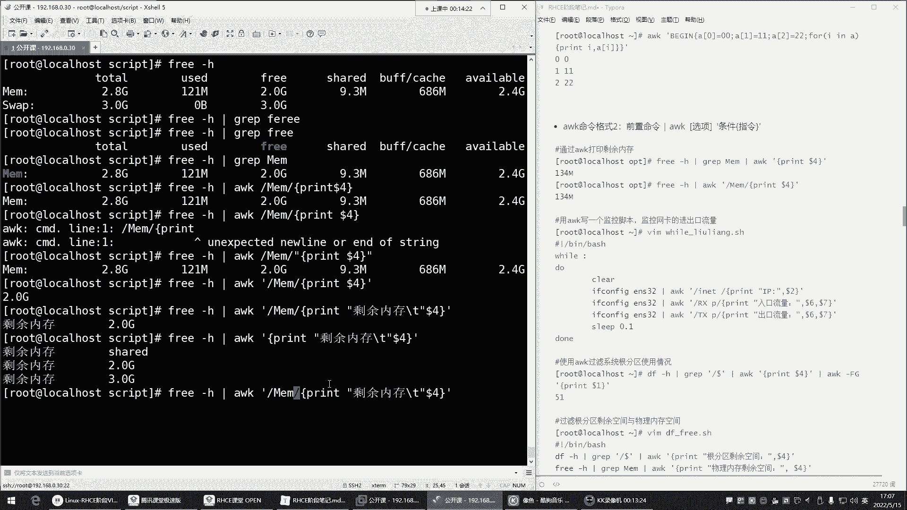
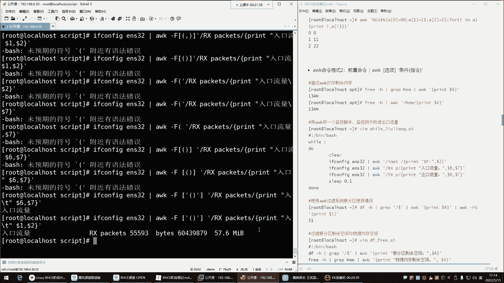
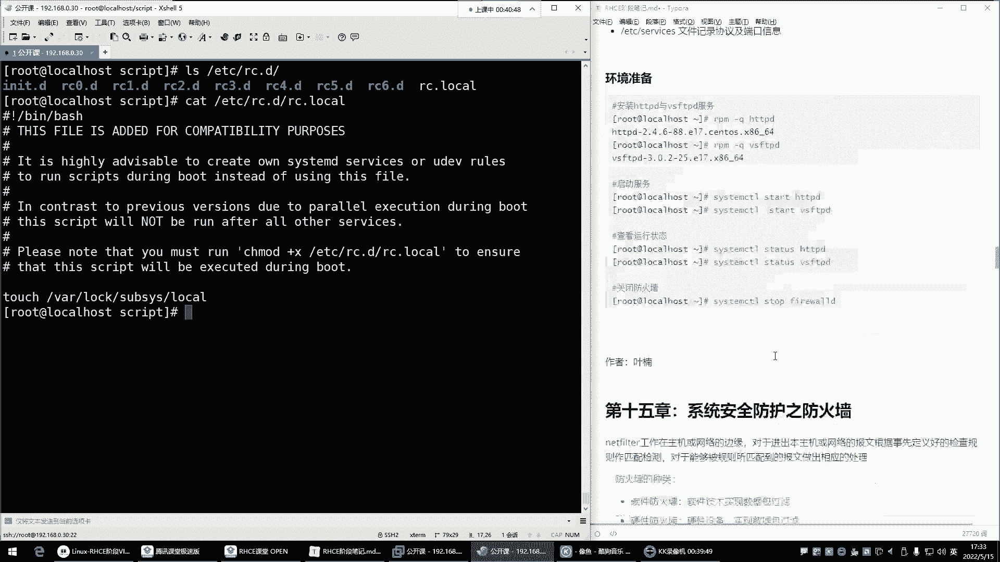

# 新盟教育-Linux运维RHCSA+RHC培训教程视频合集，全网最新最全最详细！ - P50：红帽RHCE-14.Shell四剑客之awk数据库过滤 - 广厦千万- - BV1up4y1w729

开启录屏。喂喂喂。Okay。好，那接下来呢。我们趁着这个声音这么清晰的时候，把这个AWK。啊，讲讲到这儿的时候，我们再来。所以说哈。Yeah。现在呢是。要用比g，我们呢自己往里边输出点内容，输出什么呢？

哎。用户名儿。用户名上，然后。这个。那。嗯，看啊用户名。然后他是啊我们也来两个推不进。也来我们也来两个推播间哈。😊，PT。然后跟什么呢？跟这个节释器。解释器。O。回撤。不是哈。中间正的表达式不认。呃。

printntprint用户名。我们先先先这样哈好，可以，然后再来。别根。这中文得引起来。用户名。然后。TT。因为你写中文，它无法识别。然后他以为是指令呢，所以他报你，他说他说啊叫st，他说语法错。

然后。解释器。哎。啥情况？放到一起。

看到吗？就是不是就这玩意儿。啊用户名。解释器。然后但是。我们如果想让它对齐的话，是不是这一跟七之间是不也是就别用逗号风格了。这一个逗号在这儿表示一个空格。你不加的话，它就贴上了，看到了吧？😡，所以。

咱们就推不见杠T杠T。杠T杠T推不见。回车。呃。啥情况呢？看看啊。17。他怎么又说我的语法错呢？一。没毛病。那就引起来吧。TT。好哎不对劲儿。😊，这个。这玩意儿一。语法不错了，但是我们想要的呢。

没了是吧？17。TT。

哎，那玩意儿。啊，TT是吧。TT需要引起来。

😀Yeah。这样。😊，这样不演的话，我看不演。如果嗯。不隐不行啊，因为这个语法不是它的内置语法。这个哈所以它不识别，像我们前面这个也是放到引号了，引起来了。不然AWK他不认识这东西是啥呀，是不是啊？

这不是我自带的语法呀。😊，所以这样就可以了。这里面主要注意的就是很多东西啊，我们就是觉得没啥是吧？但是呢它就是不识别。所以计算机这东西就是一码是一码。😡，は。比个。然后前置没前置没令。

是不是啊他在帮你去。对这个文件做过滤之前，咱们呢先帮你执行这里的命令，给你输出用户名跟解释器。然后接下来呢再执行什么呢？再执行后面的命令啊，过滤啊，我要过滤我的命令开头的，然后print给我打印。

打印什么呀？哎，给我打印他的。第一列跟第七列。然后从这个文件里面打印。那end我们也可以来一个end。咱们再加个摁的ED。阴蒂好，我在这再给大家说一下。😊，AWK的命令啊，它对于空格来讲。要求不高。

就是你的每一部分不加空格也没事。你比如说我print。😡，不加空格。可不可以？可以。然后。你看我这里边每一部分是没有空格的。是不是啊没有空格？

这命令太长了哈，一行已经放不下了。行，那就这样。回车。诶啊。这不行哈，这得加空格哈，就是它的哪儿呢？print哎，它print在打印的时候，你发现我是不是就直接。

在后边就printnt跟它的内置变量的时候，这些是没有什么严格要求。但是最好为了美观啊，我们加空格，你看这位置就没有空格，是不是啊？也没事儿？诶。这怎么又错了呢？😡，Yeah。哪哪一部分的问题呢？啊。

摁的摁的啊。就这儿可以不用加空格。我记着没毛病，看到了吗？是不是啊这位置你都不用加空格哈，没事儿。他对空格要求不是很严谨。摁的。再来一个。打印就每一部分都不用加空格。Print。再打印什么呢？啊。

我们再打印。它的行号。谁呀？哎NR。NR啊行号。然后你前面自己加个输出。Iical中文。什么呢？嗯。其实不用了。不用了哈。不用加中文了。因为。你加中文也没有意义了。这样就是把这个文件的第十呃。

这个总共有多少行给你输出出来了，总共有14行。就这玩意儿就这玩意儿。这玩意纸。执行一次文件。处理完了。好，我再给你。输出一下这里的指令。这就是AWK的完整的命令，看到吗？前置命令。

执行一次中间命令足行执行。end里的命令也只执行一次，但是是最后执行。好。这里边还可以。做一些什么。加减乘除。看到printent10加1010间5乘除去余都可以。感兴趣可以自己练一练哈，这玩意儿。😊。

还有异务判断呢，但是我们几乎用不到在AWG里面，我们我们用不到异务判断，我们就用它做数据的处理，我们用不到。所以这个大家简单了解一下就行。你看它这里边什么if单分支、if双分支，还有循环呢。

这里面支持数组。支持循环。这个。哎呦，我跟你讲，这AWK里边意啊。它是一门编程语言，任何编程语言里边是不都支持什么判断数组循环加变量都可以。

都可以哈。那有了AWK啊，当这些我们你不需要去什么呢？不需要去研究的哈。因为这就这玩意儿是什么呢？😊，就是。他的语法。有点反人类。嗯。对，啥都支持就行了。😡。

反正我们用不到那么多这样我我们会用它的循环判断吗？是不是用不到，所以简单了解一下，然后。😡，下边看看还可以结合。这个前置命令管道给它去过滤前置命令。比如说我想看内存。frreee杠H。看内存。

但是我想看我的内存的什么呢？剩余的。这个。还剩余内存。那这个时候你看的话。如果用grape过滤怎么实现呢？啊，用用gra过滤。那这个时候glab在过滤的时候。我们就过滤谁呀，能过滤free吗？过滤fr。

但是free。杠H管道给。G。过滤。没有啊。Yeah。😊，敲错了是吧？听错了，过滤出来了吗？过滤了，包含fr瑞的给你显示出来了。那这这是你想要的吗？是吗？不是。

是不是不是我要的是下边的这个哎这个数是不是那咋过滤啊？过滤汤哎MEM。哎，没错，这是我想要的是吧？总内存剩余内存。啊，已使用内存还剩余内存。那这个时候。我这样过滤。不清晰。是不是啊不清晰呀？那怎么办呢？

哎，这个时候我就想看这个。别的什么总内存这些我不感兴趣。那graap是不是无法实现了呀？哎，这时候别用graap了，换成AWK。AWK。えだル日？俺。匹配一下。匹配。然后给我print。打印第几列。

1234第四列。没到死。没错。哎，不对呀。不对啊哎引起来。😊，嗯，不是啊，MEM快下AWKMEM。Printter。也没毛病吧，我这个。是我哪的语法错了吗？我语发有毛病吗？这里边没没毛病啊。

正则无法识别了。啊，他可能是。这则表达式。无法识别证，如果不加引号。还无法识别。好。你看。这样的话是不是就是完成了graapp无法实无无法完成的工作呀？直接把这个剩余啊，就是你想看的这个剩余的给你。

过滤出来了grape不行。gra。这啥呀，是不是啥呀，不行。😡，那你在过滤的时候，我们是不是前面还可以自己来一些，比如说这个输出啊。你在打印的时候，你就可以在里边加一些中文指定按剩余。内存。

来一个推不见。来个来个推不见。是不可以。能把这一列都过滤出来吗？可以可以哈。那你就别加正责了。😡，不加证则了。回车。是吧。这不就是。直接就把这一列都过虑出来了。😡，就不匹配呗。😡，就也可以。

但如果我想匹配就看剩余的哎，就先给我匹配这一行MEM。

然后。对，不加F默认就是空格。这样可以，你看但是是不是如果我们这样。如果你这样的话，它默认这就是它是t键，它这边是就是中间用t键做的风格，看到了吧？那是不是它默认就是可以识别这个t键跟空格啊。

所以你就不用指了，不加杠F了，没有必要了就。😡，嗯，就默认即可。所以这样就是我们只看什么呢？只看这一行的第四列。剩余内存。啊，剩余内存2。0G。看起来清晰明了吧。是非常清晰明亮啊。可以。

过滤网卡可不可以？过滤我的网卡if。腾飞哥ENS32。grara过滤怎么过滤的呀？老low了，graap啊，过滤谁呀嗯。😡，これ这个入口だ。是吧谢是。衣服抗fi。ENS32。是不是啊这我就想看谁。

就想看这个。是不是啊？最好看这个。那这时候。gra不行，干嘛？AWK。AWK。先正则匹配一下。整个匹配。然后。printnt答案第几列，12345第五列。第五列，你说第五列看不懂啊，那干嘛呀？哎5。😡。

逗号。6。5到6粒。诶。这怎么不对呀，这怎么少了一个后边这个是不是啊，你看它也识别啥了呢？😡，嗯，它也识别这里边有个空格了。对，所以这也是一列567列啊，然后。😊，啊那就不不看第五列了是吧？

就看第六列第七列。第七列回撤。是吧是不可以？然后前面输出一个。说什么呢？自己来一个。叫做。啊，就这个是入口流量。入口。

流量。然后来个推不见。

Good job。哎，回车。面料太长了。

是吧。开车哎，ro口流量ro口流量入口流量是不是啊？

去掉小括号。

去掉小括号啊。去掉小号。去掉小括号的吧。好，去掉小扣，是不是？那。我们想去掉小号应该怎么办呢？把小肉给它去掉。这时候。想想哈怎么样才能把小号给它去掉呢？有方法吗？呃。应该去不了。好像去不了。

因为它是贴着的。它是贴着的哈。那怎么办呢？啊。在广东给AWK。😊，是吗？no。No。哎，我们。这样。杠F指定分割符是谁呀？是。中国号放里边，中国号可以匹配很多个分格符。以这个。小括号做分割。或者。

这个做风格。我看看行不行，打印它的第几列呢？看一看啊，它在第几列。如果是小号的话，那这就是第一列。😊。

小号这。小号的话，这是第一列。这是第二点。

呃，打印的打印1到2列。试试啊。哎，不行。え？这个。哪里错了呢？1到2。看看啊。是67。

啊，这个小号不行。放到中国号里边，中国号可以帮你匹配的呀，这没毛病啊，中国号啊。这咋不识别呢？

无法识别呀。

这不行这不行啊。引起来是吧？哎，小号给得引起来。

呵呵。😊，对，试试。

哎。嗯。呃，入口流量。

那不是六跟7了，那就是一。

呃。可以是可以。

但是小号是没了。是吧。

入口流量前面的出来了。前面出来了哈。那前面呢。看看可以可以是可以。但是我们呃以小号最风割啊，前面的。但这些也输出出来了啊，是吧小是。哎呦这个有点啥了，有点难度了这个。是不是啊？有难度了哈有难度。

有难度啊这个。😊，然后。那我们怎么样才能给他搞没呢？好像嗯这不行，这下去如果这个你们可以研究研究哈，我下去我也研究研究啊，看这种功能可不可以实现，肯定是能实现的。

肯定是可以实现的哈。😊，但是主要是这种。但是主要是这种。这个。😊。

5呃，是六跟7哈6。嗯。7。可以实现。哎，那这时候过滤出来之后，咱们干嘛呀？再对再来个管道行不行？对，在管道。再管道给谁呢？再管道给AWK。这时候。我再去。或者说用用格Y形，gr杠V取反。那不行。

g瑞不行啊。嗯。再滚到给AWK。好，这时候。我们在哎呦这也不行，这得好好好研究研究，到时候哈你们可以下去好好研一研看看。这里边我们过滤的话。就是可以你看过滤网卡的入口流量，出口流量看到了吗？

就像我像我刚刚这样写到脚本里边。通过vi循环。像刚刚那样VM。呃，是可以的哈，其实是可以的。但是呢这个。vi点SH。把这个拿过来。看看效果哈看效果。执行他们。啊，入口流量出口流量IP是吧？

IP怎么取出来的呀？😡，哎，也是打印它的。第二列。I p。这条命令。它显示出来以后，第二列就是他的IP地址。你看一下。If服和 figure。是不是？过滤谁呀？过滤。卖这个INET。

然后打印第二列就是他的IP。但是我们想想法，到时候把这个小号给它去掉。可以自己看一看怎么给它搞掉哈。啊，过滤跟分区。哎，我问一下你们哈。这个能看懂吗？就是通过AWK后面这部分命令能看懂吗？

看懂的给我刷波一。😊，看不懂的刷盖儿。嗯。有有有看不懂的了吧，看。

他没看懂。这不就是。我们刚刚在面令行里面敲的那个命令嘛，if服confi哥看这个网卡管道给AWK是吧？AWK。干嘛呀？正则啊，就就是放到斜线里面匹配了，给我匹配这个关键词，匹配以后。

它的关键词是不是是这一行，但是我不要这个一个完整的这个行干嘛呢？要第二列。然后就打印他的店里。啊，自己艾一个艾一个哈IP那它就是这样IP。然后列就这个。就是IP地址。里面的第二例。看懂sleep。

看不懂clear，你不clear。

对，这个位置有个6，你这个位置用空格区分，所以你我过滤的时候，这个位置你发现这儿有个空格。不然。他这个这两个都满足。知道吧。

对，所以怎么样区分呢？用它们之间细节在这儿，这是有个你加个空格就行了。所以我们在过滤的时候，这边也是多了一个空格。你不加空格数，那它也是包含INET的呀。啊，所以用空格。看懂sleep了。

sleep是为了让死循环循环的更慢一些。sleepcle。干嘛呢？清屏啊，你不加克尔。😡，它的效果是什么效果呀？

你想想。哼你不清屏，搞得满屏都是。看保存地住。看到了吗？就就这样是不是啊就这样。😊。

啊，那如果你不清，如果说你清了屏呢，是不是每次它输出完以后，把这个屏幕给你清空一下呀？

是不是？在这儿。cleear清个屏。哎，你看每次给你清清一下。这样看起来就是清晰一些。啊，就这样。sleep是为了让死循环循环的更慢一些，别太快，太耗CPU。对，这就是。呃。

过滤我网卡的入口流量出口流量。啊，也对，就是监视。但是一般呢我们不用自己去写这样脚本。后期不都得学习那些监控软件吗？对，监控软件。嗯，监控软件我们自己去什么呢？哎，通过监控软件去监控，就是不会写。

但是能看明白，哎，能看明白就可以了，也不需要你自己去写，是不吧？你现在你写不出来，现在这现在这水平你想想哎，你们能看懂都不错了。😊。

能看懂就能改编的脚本。我告诉你哈，这是我像我昨天所说的，大家现在就是能看懂就行，不需要你去自己有能力写。😊，对，知道他能干嘛，知道它里边每一部分是干嘛用的。然后后期有需要你知道怎么改就可以了。好。然后。

这是怎么过滤跟分区。怎么过虑根分区啊？DF杠H。这是根分区的使用情况是吧？我想看谁，我想看我的。还可以使用的空间，这不就是剩余吗？是不是啊啊看可用空间，那管道给AWK。

AWK然后默认是不是他们之间就是空格作为风格了呀。好，那就不用管了，不用指定风格符。然后接下来哎开始。これ。过滤谁？啊，这个其实不用过滤了哈啊我看要不要过滤呢？啊，要不要过滤一下呢？没有过滤啊，就看。

嗯。过嗯还是过滤一下吧。我看一下啊，过不过滤呢。嗯。过不过滤呢？大一遍。还是过一下吧。我就看。这一行不然他把上面的这个也给你显示出来了，那不行。所以AWK。先在这儿。把这个。第二行取出来。就看第二行好。

那怎么取第二行呢？在里面。就。呃，指定。在这里边哈以根结尾的。完了。这语法这能识别吗？😡，啊，看了吗？这可能说他不知道我这语法里边是什么意思了。我们来看一眼啊，看这样行不行。😡，然后。再去print。

给我打印打印第几列呢？1234第四列。看识别不了怎么办？转个亿。转移也不行。以根结尾了看到吗？转移也不行。那就没辙了。不能这样玩了，就干嘛呢？Gb。Com。grape过滤以根结尾的。再管道给AWK。哎。

这时候。就不用正则匹配了。看到吗？前面啊直接过滤。那这位置直接过滤以根结尾。是吧。你跟结尾吗？那这行不就不要了吗？那这时候。或者说哎我们直接。太要也行。t杠1。也可以。

也可以。都行这种方法是吧？就看最最后一行管道给AWK。滚到嘅 a w k。然后再打印。打印打印谁第几列呢？1234第四列是吧，1234第四列。没打死。回头。H。显示最后一行过滤print第四列。AWK。

是哪里错了吗？没错呀。呃，1234。一print。AWK第四列。这怎么没生效呢？第四列。啊，引号问题有可能。他有的时候。哎，你看双引就不行。是吧引号问题。不是杠恩。这个里面没有杠N哈A。AWK不是C的。

C的有钢案，这里面没有钢案。引号问题。你看这有的时候还必须得用单眼。是不是？然后接下来呢，那过滤出来之后。😊，25啊还剩余是不是啊，还剩余。那后期的话，如果你想判断的话，你可以写个义务判断啊，我的磁盘。

如果它的剩余空间小于多少的话。你给我做什么事情？那这玩意儿如果写应该怎么写？怎判能？

是吧。这玩意儿是不是放在一个变量里面呢？放到别站里面。变量叫什么都行，X等于。取别的结果。然后义务判断。感键判断。好，那这里的条件是什么呢？就是变量。X如果小于是吧？小于是LT。小于多少？

比如小于5的时候。给我。执行一个什么操作，是不是？给我app一话。还有什么呀？A口磁盘空间啊叫做根。根分区。空间还剩余。还剩余。或者不足。空间不足。是不可以？当然我们这个。有没有问题呢？这脚本。有问题。

为啥？这个位置。有个英文字母。这个英文字母。在这儿。他。不能对通过这种方式去给你做什么呢？去做。他的一个。对比。因为它只能做数字对比，你加英文的话。是不行的。所以这条命令是不是还有问题啊。

它取出来有个G啊，他没有办法去给你做对比啊。

有问题。有问题哈，什么问题呢？就是不能有那个G。

等于5G。等于等于5G。嗯。也行啊，那样可以。如果你要是说哎我不能做数字判断，那行，哎，我们通过那种字符串去做一个什么呢？做一个对比，那里边可以用那种方法来实现。那种可以。那就别用那种这个什么了。

别用这种方法了，就。哎等于等于。这种是字物串。做对比等于5G的时候。给我哀哭一会。是不是？但是这脚本咋执行呢？啊。这脚本咋执行啊？加循环。啊，效率。等于5G的时候。条件成立就执行命令啊。咱不就一个。

是吧条件成立就执行命令。那这搅拌咋执行啊，加循环。来一个死循环。と。但是不能循环太快是吧？sleep呃，一秒钟修复一次。哎，一秒钟循环一次。啊，当然我们就给大家演示一下哈。

对于这种事情你以为真需要你自己去写这玩意儿呢？不用后期有什么呢？有监控软件，监控软件会自动监控你的各个磁盘分区的。我们就是给大家演示一下这玩意啊，就是。😊，它可以怎么写，怎么结合will循环。

结合业务判断，结合AWK。去。判断。那开机执行。啊，如果有这种需要你开机执行的怎么办呢？哎，放到一个就是有一个叫做开机会帮你执行那个脚本的一个文件，载ETC叫RC点DRC啊，RC点D下边有个文件。

叫阿RC点loc。这个文件里边儿。RC点loc。这个文件里边就会帮你去看到吗？它里边是不是有一条命令，叫touch。这个文件局啊。你看它这里边就是告诉你了，这个文件是干嘛的呢？翻一下哈哎。

看一下上面的介绍。添加此文件，为了什么兼容是吧？不用管哈。啊，强烈建议自己。

的CsMD服务什么规则？他不用管。什么版本相比啊，不用管。这个。请注意必须执行甚之modode加X。命令当地保证。该脚本将在什么期间执行？发现翻译了一堆也没理解是吧？干嘛的呢？

就是你想让他帮你执行什么摇本。😡，你呢？注意哈，给那个脚本加个执行权限，加个执行权限以后，你把你要执行的那个命令放到这个文件里面就行了。就是把你的那个命令往这个文件里面写，怎么写呢？就写脚本。

用指定用bitch给我执行这个叉叉点。叉叉点SH这个脚本就行。他就帮你执行。但最好是指定这个解释器的绝对路径，并且的拜指给我执行叉叉哪个路径啊啊就是。cpped下载叉叉点IE直接问。

一开机给你执行的脚本，一开机给你执行脚本。但是不要忘了提前给执行权限，他告诉你了。给谁执行权限呢？给这个文件执行权限。注意啊，是给这文件加执行权限，然后开机他去执行这文件，这文件里的命令他就帮你执行了。

先给这先给这文件执行权限，然后呢再给你的脚本给执行权限。一开机，他把你执行这个文件。那这个文件里面是什么命令，他就帮你去按照命令给你去执行，帮你执行这脚本。😊，能裂吧。是这意思。好。然后。

他说啊那样记就没了是吧，怎么没呢？啊，对你可以指定分隔符，这样杠F以G作为分格的话，那就只取数。追求书。不要那个。英文组。いたべけ。好了，就讲那么多吧，今天。啊，今天就讲这么多。然后下边的内容。嗯。

下面的计划任务。计划任务。防火墙。

行，就这么多。差不多了，饿了是吧？对，饿了。

