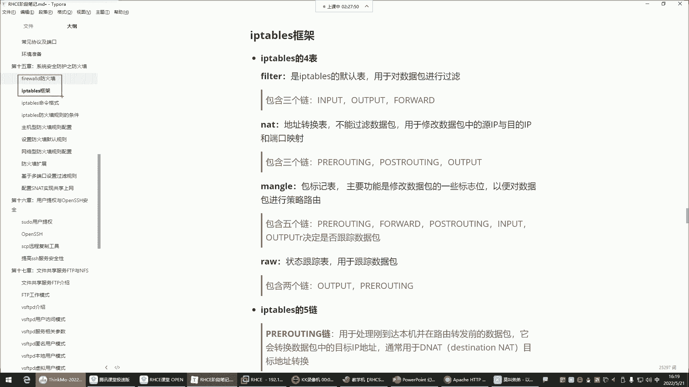
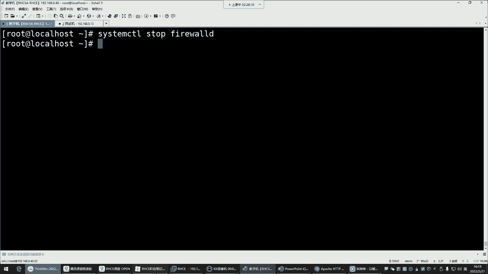
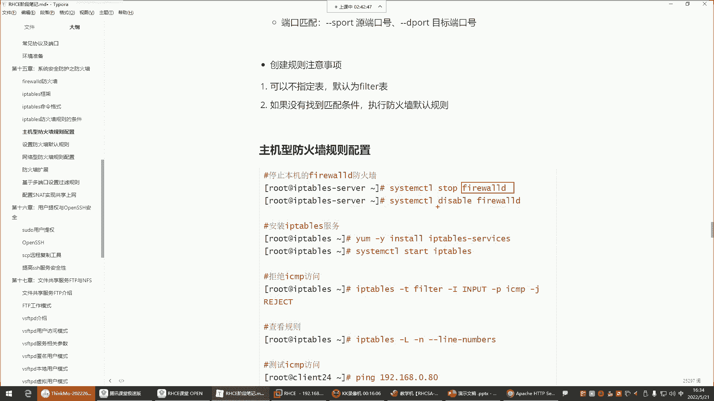
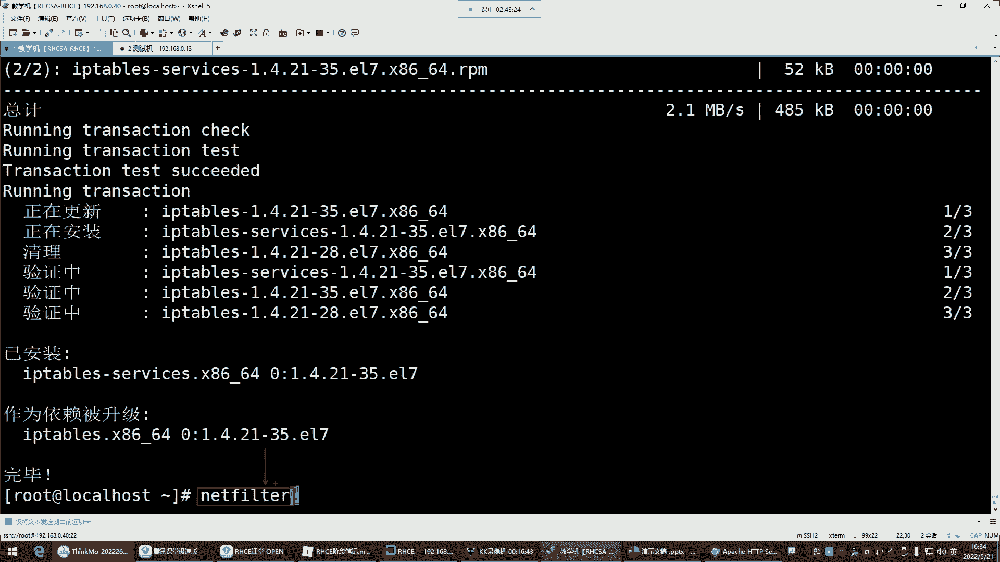
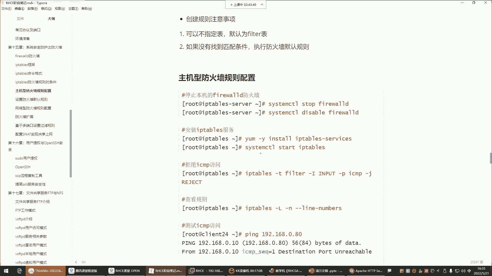
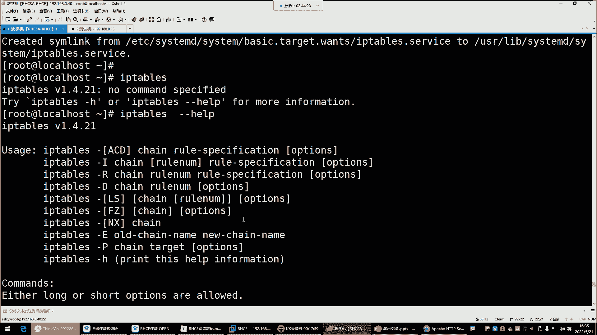
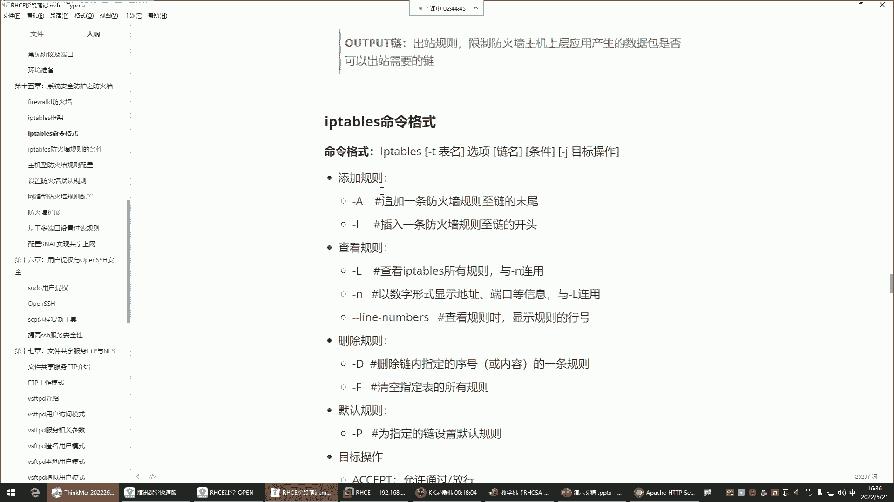

# 新盟教育-Linux运维RHCSA+RHC培训教程视频合集，全网最新最全最详细！ - P53：红帽RHCE-17.iptables防火墙四表五链 - 广厦千万- - BV1up4y1w729

哎啊，喂喂喂，都回来了吗？回来的话给我刷波一，我们来学习这个IP tables啊。那IP tables确实比那个fa尔沃有难度，这个毋庸置疑啊，这也是怎么说呢？😊，对于大家来讲啊，也是。这个一个挑战。

但是有什么说什么哈，IPD对于大家掌握的内容呢，就是没有没有，就是说把所有的防火墙都给都得需要掌握哈。不是就是我们只掌握我们用得到的也是比较常用的那部分就可以了。

那后期你比如说你们企业里边有一些额外的需求。那大家呢可以在基于我们现有的基础上，你自己呢再去什么呢？再去挖掘挖掘啊，这个就有你先入门，后期呢什么都好好。😊，啊，接下来呢来IP tables呢。

它跟fwo呢同样都是防火墙的管理工具。这两个工具都是用来管理谁的呢？都是管理那个net filter这个内核的模块的啊，所以这两个工具用哪个呀，也都差不多，能解吧？所以我们现在呢要讲IP tables。

你想想这两款工具都是操控着同一个模块，那是不是。😊，这两个工具你用一个就行了呀，他们没有办法同时存在吧，所以关掉一个把。

feair world给它关掉。死套吧。Herere我。把fa沃停掉了之后呢，然后我们再来说说IP tables。那IP tables它呢你看前面那个fa沃是分区域，它那个叫区域。

但是在IP tables里面，它不叫区域，它叫什么呢？它叫四个表跟5个链，IP tables的四个表跟IP tables的5个链。哎哎，它这里面叫表跟链。

叫法不一样，但我们说说这个表跟链之间，它们的关系是什么啊？首先这个表里边是存放诸多的链儿的，然后这个链儿里边是干嘛的呢？这链儿里边是让我们配规则的。好，那表儿的功能。每种表呢，它功能不一样。

我们先说说这个四个表都哪4个。第一个叫feltfelt是IP tape的默认表，用于对数据包进行过滤的那也就说felt它就像那个地铁站的那个安检口一样，安检口好，这个安检口就是干嘛呢？去检测。

你每个人是否携带一些安全物品啊，有没有一些危险行为之类的啊，所以felt在IP tables这个防火墙里面，就是那个什么呢？那个数据过滤的那个安检口。好，那既然是安检口在安检口里面是不是有人是搜身的。

有人是检测你携带的物品啊，比如说检测你的饮品什么的，你得喝一口是不是啊？哎，不同的这个什么呢？不同的安检。有很多种或者说有很多种安检方式啊，所以说对于这个安检来讲。

那felt它既然是一个数据过滤的这个表，那里边它也有很多种数据过滤的方式。那这个数据的过滤方式。有什么呢？有这些我们稍后再介绍，这里面就是链儿了。这链儿的话呢，我们一会儿要往这个不同的链儿里面配规则。

好，先知道一下。在这个felt表里边，他注意你们注意这个IPd一个规律哈，什么规律呢？就是只要是这个表是对数据包进行过滤的那在这个表里边的这个列儿就全都是对数据包过滤的。啊。

所以这个要记住它的规则就行了。那下面这个表，这个表是做地址转换的，它不是过滤数据包的，然后用于修改数据包中的什么云IP跟VIP跟端网映测。好，那这个时候你看这个表它既然是叫地址转换的表，我告诉你。

那这里边的链全都是。给你什么呢？做地址转换的链。能理解吧，这个表是数据过滤的那这个表里的这些链全都是数据过滤的链。所以这是它的一个规律。好，那这个地轮转换，我们稍后呢用的时候再说，先有个印象。

mango叫包标记表，主要的功能是修改什么数据包的一些标志位，以便于对数据包进行策略路由。这个的话呢啊一般用的比较少，策略路由对于这个防火墙设备来讲。就是这个策略路由啊，如果我这个防火墙设备呃。

比如说接到这个包以后啊，我们这个可以选择有哪块网卡去接收，有哪块网卡去发送这个数据包。因为这个防火墙设备，有有的企业可能说这一个服务器啊，好几块网卡，好几块网卡啊，那我有哪个网卡去接收这个请求啊啊。

或者说我我在给用户返回数据的时候，我通过哪块网卡去把数据发送给客户啊，可以选择叫策略路由。嗯，然后这四个表里边有一样的链，配置一个表里的链，别的表不会同步不同步哈。然后下边这里边就是用于策略路由的。

一般我们用不到。然后下边ro叫状态跟踪表，用于跟踪数据包。好，那这个跟踪数据包更用不到了，为什么呢？消耗资源，在企业里边，比如说一个用户他的请求到达了我们这个防火墙设备以后，那我允许他访问的情况下。

那这个时候你如果全程跟踪他，就是这个数据包，他从访问你以后，然后在你的整个的这个什么呢？整个服务器里边做了哪些访问操作，你到要全程跟踪，特别消耗服务器的资源，能理解吧？消耗资源的事儿。

一般在企业里面他不干。😊，嗯。所以一般像这种情况下呢，我们也不会去关注这种什么状态跟踪。最主要的是我只要是在这儿。f我对你的数据包做了过滤了，我觉得你这个数据包是安全的数据包，我就放行就行了。

其他的你在我的这个服务器里面做任何的访问，我就不管了。就像我们去地铁站，只要是人家安检口给你做了安检了，你一进去，人家还关心你在我的地铁站里面上几趟厕所吗？或者说你坐到哪个站点吗？我还派个人跟踪你吗？

不会是不是啊？哎，没有那功夫去跟踪你，所以安监口你没什么危险物品，你在进到里面以后，你爱坐哪一站就坐哪一站，你爱上哪就上哪，是不是啊？所以说对防火墙也一样，最主要的就是这个大门，它就是防火墙的大门。

把大门看好了，其他的什么修改数据包的标志位，什么肉状态跟踪，这都不用管。😊，所以对IPts来讲，大家主要学习的是谁呀？felt数据过滤。😊，啊，那NAT呢我们也会讲啊。

因为在企业里面也会有一些NAT的一些应用场景。那到时候用到再说好吧，所以我们对于这个fel表是非常重要的表。因为它这个表里面的这些链都是对数据过滤的。好，那接下来来看这五个链，那。😊。

这5个链里边我们先说什么呢？先说input链跟output链。这两个链它首先都存在于felt表里边。fel表fa表里面是包含三个链，一个是input inputput叫入站链，output叫出站链。

for叫转发链。好，那这个我们先说input跟output这两个链怎么工作的？来看这图就行了。首先注意防火墙我给大家讲过分为主机防火墙跟网络防火墙。好，那如果我做的是主机防火墙的话。

这个时候用的是哪两个链呢？叫input链，input入站链，用户请求，注意它到达我这个防火墙设备的时候，首先。得先经由谁去对这个数据去处理呢？首先就是fel表的这个input链。这个input链里边。

比如说我配了两条规则，第一条允许所有客户端访问本机的网站。第二条拒绝所有客户端访问本机的网站，注意我的规则配到input链里面了。那这个链里的规则只保护我这台服务器的应用。我的网站应用我的其他的应用。

所以这叫主机型的防火墙。我会用到input作为我的入站链。入站的数据包过滤的。啊，这个位置，然后你的规则就配到这个音put的链里面。OK。入链。那output呢它叫出站链，出站链就是用户访问你。

那你网站要不要给用户返回页面呢？要返回，是不是？或者说人家从你的网站下载一些东西，你要不要把数据传递给人家呢？要那这个output它是干嘛呢？它就是决定我的这个主机里边的这些应用。

它产生的数据包能否出去。这叫出站链，但是这个链一般不配，为什么呢？就像你进地铁站一样，你进地铁站，人家钱面给你做安检了。那你在出地铁口的时候，人家还会再安检吗？😡，不会了，是不是啊？啊。

就是我只要是允许你访问我，那我就允许我的应用给你返回数据。😡，如果我觉得你这个你这个数据包压根有危险，我就直接给你拒绝就完事了，是不是？我进都不让你进来。所以出去的一般我们是不会配规则的。在这里边。

那你看我们现在又什么呢？又提取了一些精华的部分。就是对于IPtables来讲，我们看哈如果说想保护自己本机的一些应用的话，那这时候规则是配在。

那个数据过滤表的input链里面的那你说如果我想做网络防火墙呢，我想保护的是谁呀？是我企业内部的其他的服务器呢？那这个时候你要用谁呢？叫forward叫流量转发链了。但这个流量转发链也在哪儿呢？

也在这个。fi表里面，因为它是做数据过滤的呀。它既然是做数据过滤，我说过，只要这个表，它的功能是数据过滤的那在这个表里的所有的链都是数据过滤的。第一个过滤入站的数据包的链。第二个过滤出站的数据包的链。

第三个过滤转发的数据包。所以这个时候我们在这个图里边forward的叫流量转发，也在那个fieldt表里边。那转发的话就是。我想我后边有一个集群，用户的请求到达我这个防火墙设备，我就专门去干嘛呢？

去过滤它的数据包。然后呢，如果这个数据包没有任何问题，我就可以干嘛呢？在否的量里边把这个数据包转发到我企业的其他的服务器了。所以说这个流量转发里面是可以配允许跟拒绝的。如果我这个里面是允许。

用户访问我的网站的话，那这时候用户的请求就会什么呢？被转发到你的这个集群的内部的网站服务器。如果我这个否里面配的是拒绝好，那这个用户的请求就进不来，能理解吧？啊，就是我到底是转发还是不转发。

全看我的否这的规则，到底是允许还是拒绝了OK那。注意。😡，那现在大家记住。input入站规则是。看哈限制客户端数据包的目的地址是防火墙主机的。你就记住它是指干嘛呢？只去过滤防火墙主机的。什么呢？

叫上层应用，或者说本机内的应用，防火墙主机的内部应用都可以。就在这个图里面，我防火墙主机里面这个应用。但是我在我的内部其他服务器的应用呢，那这个input链是管不了的啊，你就得用fo的链了。

所以主机型防火墙用input链保护其他的机器用fo链，这个已经给大家啰嗦好几遍了哈，应该都听明白了。好，那接下来再来说上边的这个什么playrooting跟posrooting这两个链分别干嘛的呢？

这两个链是做转发的，它是在NET这个表里边的。好，那NET表里边。😊，AT在网络里边叫做地址转换。那。既然它叫做地址转换表。好，那在这个表里面的链都可以帮你实现叫做地址转换。

但为什么output也在里也在这里边呢？啊，这个我们一会儿再说，因为转换的话会涉及到一些出口的数据包，所以这时候也会有一个output。那这个时候。来看啊。

在这个里边我们先说这个preruuting preruuting它是在这个里边角色。他的角色preuting叫做客户端目标地址转换链。这一般什么时候会用呢？一般啊在学容器的时候。在学容器的时候。

我们会用到这东西做一些什么呢？做一些叫做这个端口映射的时候。啊，一般我们会干嘛呢？啊，就是把客户端的那个什么呢？那个请求。把扣能的请求直接给它映射到干嘛呢？映射到我的。内部去。但这个。

现在我们还没有应用，所以大家也没有什么印象。那另外一个叫做posroing。这个呢在企业里边呢也有它的应用场景，叫内部原地址转换啊，这个一般什么时候会用得到呢？

这个就不太适合放在我们这个企业的集群里面用了。企业集群其实不会用到这两个东西哈，不会用到这两个。嗯，那这个这两个里边一般用在公司的内网，想要去访问互联网的时候，会用到这玩意儿。哪个呢？就这个。

这个哈比如说你们公司啊有一群PC机。😊，有一有有一群办公电脑，这些办公电脑想访问淘宝，想访问百度。那这时候你看你们公司内部啊，它是一个什么呢？都是私有地址的那些PC机，那些电脑。

但是呢你发现你你插上你们公司的网线，为什么你就可以访问互联网了呢？😡，但是你的地址明明是私有地址啊，是因为你们公司就有一个设备。有可能是路由器，大多数都是路由器。那个路由器上边它自带一个什么呢？

叫做路由转啊，那个叫做SNAT叫地址转换的功能。这个SNATS是s叫圆，谁是圆呢？就是。你的内部服务器的IP就是原，那谁是目标呢？他们想访问谁谁就是目标，他们想访问淘宝，淘宝就是他的目标。

所以SAT就是s叫原地址转换。转换什么呢？就是把这些原地址转换成外网的地址，你只有有了外网地址才可以去访问外部的网络。所以这叫把他们的原地址转换成我的这个什么呢？转换成我这个外网网卡的地址去访问互联网。

所以叫原地址转换。那还有一种叫目标地址转换。目标地址转换，一般就是干嘛呢？就是呃这个用用的比较少，一般就是别人访问你的时候，别人访问你的时候，你可以把他的地址给它转换成我的企业内部的地址。

这一般比较少哈，一般都是怎么说呢？😊，就主要是这个在企业里边用一些内部网络相访问外网的时候，一般在路由器里边网工会配哈，这种功能一般网工干，不是不是我们干的。所以我们在防火墙里边那两个链也几乎不怎么用。

所以这里边我们对于防火墙来讲，学主要学什么呢？哎，input跟for的转发链，其他的用不到用不到哈。所以这两个链都在哪个表里面呢？都在这个表里面fiel表，其他的你能用得到吗？用不到是不是啊啊。

就这两个保护我本机的，保护我其他的机器的就可以了。嗯，那接来对，接下来的话呢咱们来说说IPdIPd呢它有一个。😊，他呃这个我们来说说他这个命令格式怎么玩哈。😊，嗯。啊，他的这个命令格式。

我们第一呢要安装那个IPt的服务，IP tape软件包叫什么呢？叫IP tape杠serv把它安装上，然后停掉你本机的菲尔沃，然后再给它设置成随机不自起。它是一个注意啊，菲尔沃是一个随机自起的服务。

所以给它停掉。

停掉以后呢，给它设置成底ze一下。😊，dable，然后接下来呢再安装1个IP tape。杠。IPT是serv。Okay。会冲突啊，他们两个都是。呃。Ntter。fil注意那两个工具都是操控同一个内核。

所以两个工具操控同一个内核，这内核不知道听谁的会冲突哈，那一般只用一个。

那接下来的话呢，我们是不是就给大家已经说明白了我们学防火墙学谁呀，是不是就是fael表里的input跟for的这两个链，其他的都几乎用不到。啊，然后下边哎安装好以后。

把服务给他起来starI table。

starIP tables。回车。事成随机自写。好，一内下OK然后对IPCIP tables命令是IP tables，然后回车。😊，杠杠 help杠杠 help回车，这是他的命令的帮助。

那对于命令的帮助的话呢，你看它的命令格式非常多，是不是啊？这么多命令格式没关系，一点点学啊，在学习命令之前，还有一些内容给大家说一说，对IP tape来讲，它的命令格式非常的复杂哈。

然后这里边我们一步一步拆解。😊。

我现在想看规则，就是我对IP tape来讲，我们是用它配规则的，是不是啊啊，那它配规则的时候啊，我们是IPt是命令本身，然后呢命令格式杠T指定表明。😊，我们来把这个东西啊，这样哈不行。

这个防火墙讲的时候必须得这样的，不然很多东西。

在这哈很多东西你们看看不到就忘了。

来看病令格式。这样操作哈。