# 新盟教育-Linux运维RHCSA+RHC培训教程视频合集，全网最新最全最详细！ - P57：红帽RHCE-21.FTP排错 - 广厦千万- - BV1up4y1w729

我们来看看这问题哈。对。这个东西啊就像我前面给你们所讲的，我说SElin这东西为啥在企业里边都给它禁用掉呢？

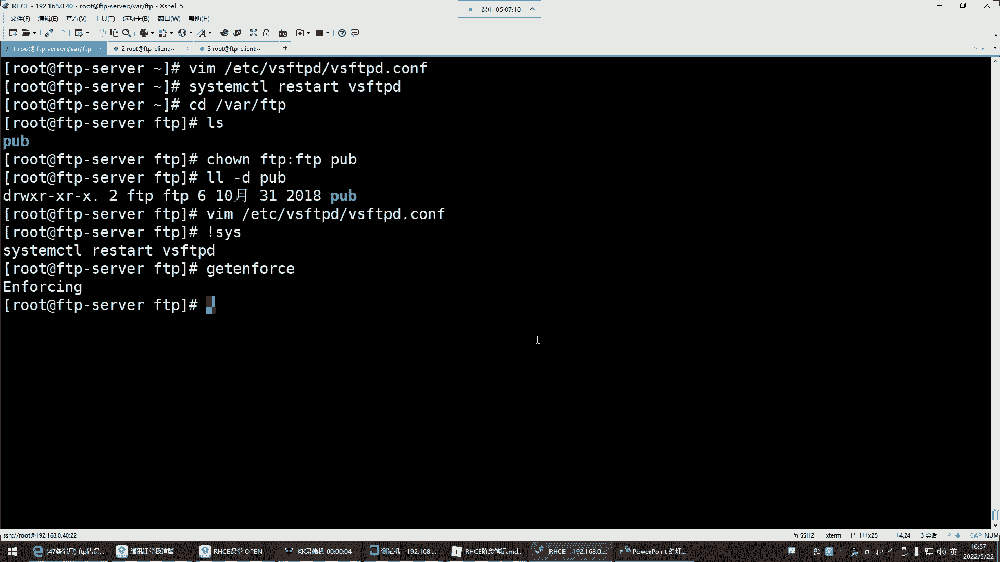

他在强制模式下，我告诉你，他什么都管用户进程目录文件，没有他不管的。所以。

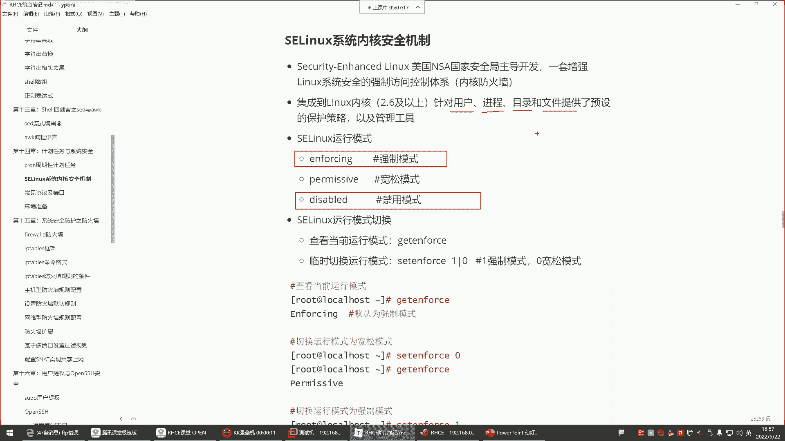

你看它现在是什么模式，叫inforcinginforcing是强制模式。强制模式就是好，你虽然说权限什么都给足了，但是啊我也不让你建文件。告诉你，你没有创建文件的，就是说白了你创建失败。😡，看到了吗？

所以这玩意儿他倍坑人，看到吧？关掉。🎼改成零，改配置文件。特别静调。所以。你看这东西是不是就是无形之中，你都不知道问题出在哪儿。是不是？哎。那你说这我闷这时候你再见没有任何毛病，你看是不是？

所以说这配置没问题的时候，还是得多看看防火墙，看看SE0。🎼进去给它共享个文件，怕g。先上传能创建了，上传put。上传了。是吧就是。

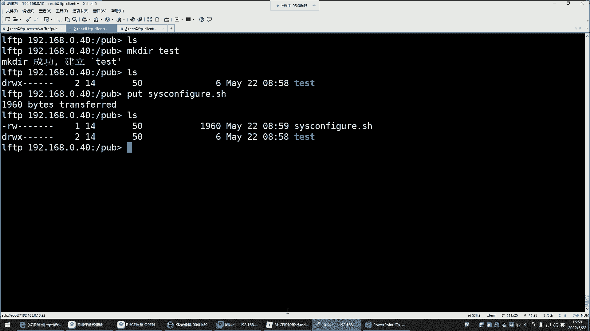

现在。感受到这个感受到它的一个什么呢？它的一个这个存在的时候的一些这个功它的功能了吗？嗯，也都帮同学们排错了，是吧？好。从来没有想过他的问题。我这S104，我记得我都给关掉了。好，接下来呢看看。

就是如果说你想去。这个上传那就得开启upload权限，想让它创建就开启makeDR这个权限啊，这个也可以创建目录，也可以创建文件都可以哈。然后还有一个，如果你想让它具备写权限，要把这个给它加进去。

默认是没有写权限的。这个写权限就是对一些删除的操作。😊。

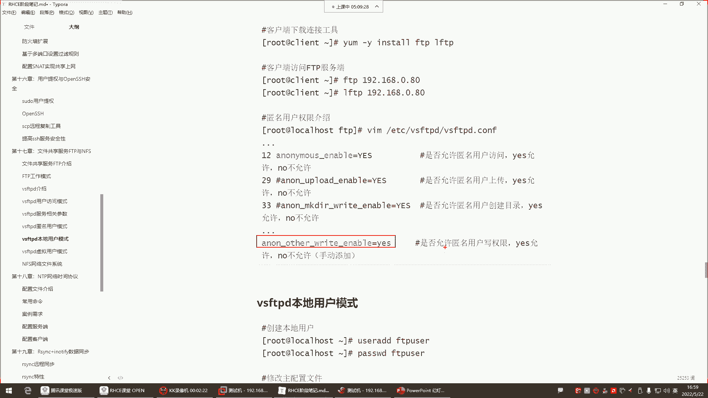

删除哈IMQRF。注意啊，你看我们那个配文件，我添加了一个。啊，我好像没有添加那个血权限。最后没有写权限哈，没有加没有加呢，他比如说现在他想做一些删除的操作，比如RM跟RF。😊，删不了，看到了吗？

你以为他真的删了吗？没有，还在呢。改个名，比如把这个名字改成叉州点SH。啊，他说你权限不足。看到吗？说你的权限不足是吧？改也改不了。删也删不了。但如果你希望他具备这些权限，你怎么办呢？那你就。

在这个配置文件里面。跑到最后一行，然后再另起一行，把这个参数给它写进去。

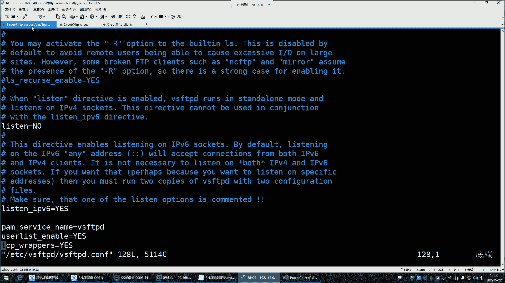

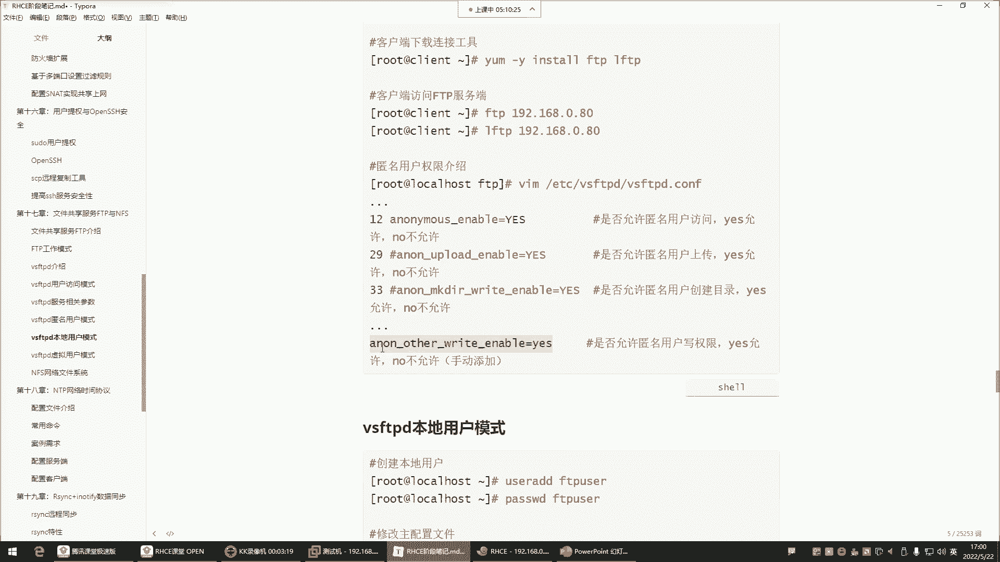

放到这个文件里面写进去，写进以后保存退出，重启服务。好，这时候他在做，比如说他想改名MV把这个改成叉叉O叉叉O点SH应该叫重命名成功知道吧？对，这是FTP服务哈。FTP。🎼想删也可以了，删太的回撤删了。

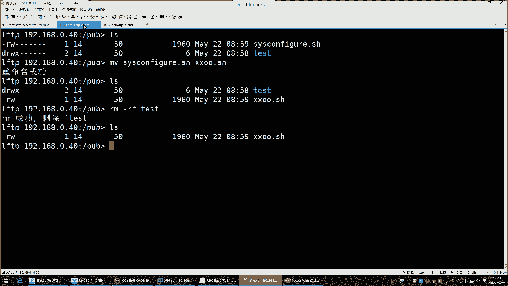

所以呢我们经过一系列的总结。对于这个FTP服务器。FTP不进默认呢它启用的是匿名用户的返问模式。那这个所谓的匿名还真还不是真正的匿名，是什么呢？默认是用这个FTP那个账号。去访问的FTP服务。然后呢。

访问以后的话呢，呃权限的话呢默认都有哪些呢？查看下载是可以的。但如果你想让他具备一些比如说修改删除创建的操作，那或者说上传你都要去在配文件里面去给它开启这些权限。但是开启权限之前也不要忘了。

针对于它的一个什么呢一个共享目录，我们一般都是什么呢？

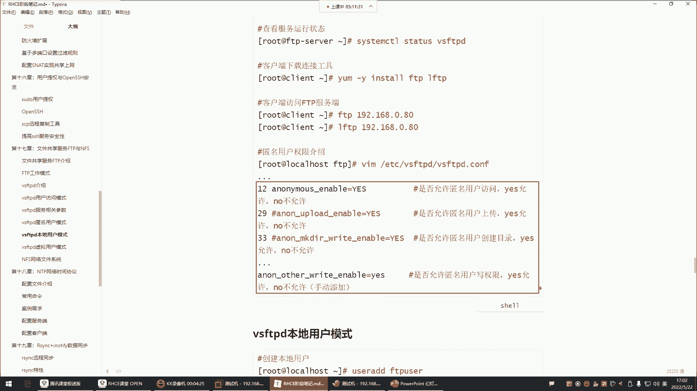

我们一般啊是不会直接。把它的这个FTP这个共享目录给它打开权限的，都是在这个目录下去给它单独建一个目录。作为所有的账号的这个什么呢？是所有匿名账号的一个共享数据的一个地方。在这里边你想怎么做都行。

但是在这个目录你别动能列吧，你别动。OK这就是我们所说的什么呢？哎，我们所说的这个叫做。FTP啊以上给大家讲解的权限都是针对于谁的呢？

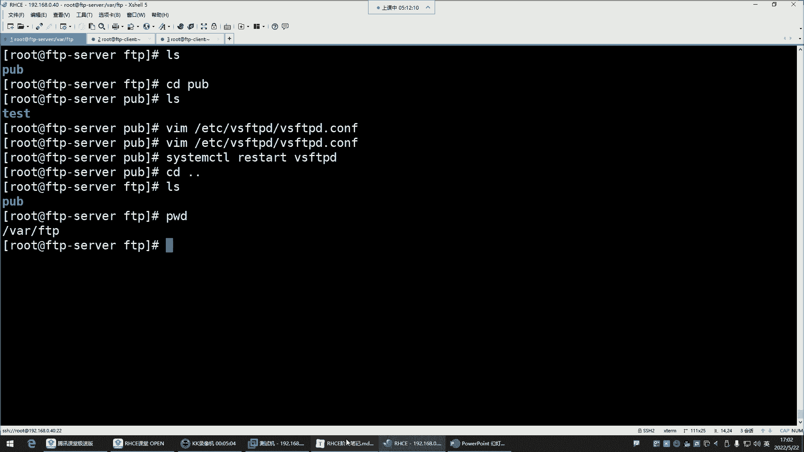

匿名账号匿名账号是不是可以具备增增删改查了呀？啊，但咱企业里边一般不给这么大权限啊，在企业里边就是让他下载，所以这些删除的权限不给。创建的权限也不给。还有这个上传的权限也不给。为什么不让上传呢？😡。

你比如说你一个百度网盘账号，你希望别人往你的百度网盘里边能够随便上传东西吗？是不是也不希望啊。😡，那我们用网盘干嘛呀？就是我想把什么东西共享给你，你来我这下载就可以了，是不是怎么你还能往我这里面上传呢？

是不是啊那就更别说什么修改删除了，这是坚决不允许的嘛，所以这个也一样。我们这边也是哈都是这个对于他们来讲，就不给他们修改删除，也不给他们创建的，也不给他们上传的权限，就让他干嘛呢？就让他默认权限就行。

😊。

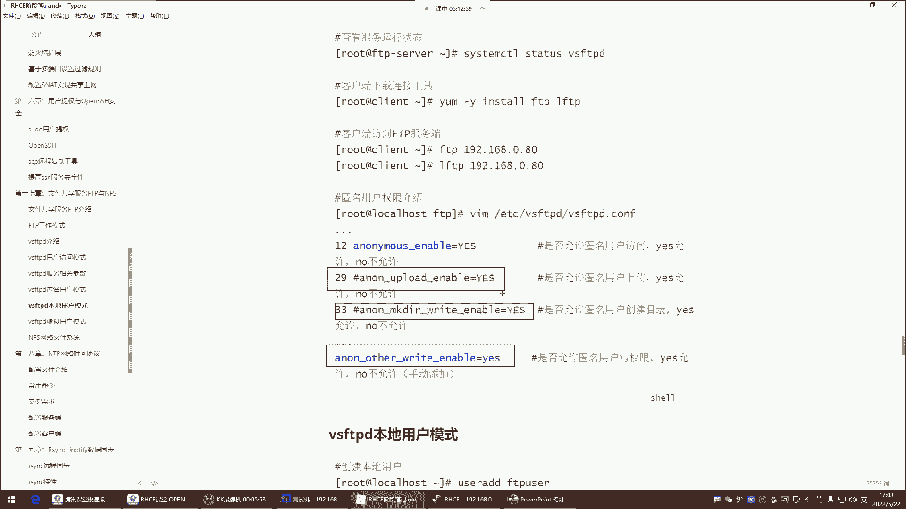

所以一般我们对于这个匿名账号的权限不给那么大哈不给那么大。😊，注视掉。注着点。这种修改删除的注释掉前边这种。什么makeDR。这些都是针对于匿名账号的。你看前面只要是带个带这种安y，就是匿名账号的。

权限注射掉。再重启。好，那他们就不能做这些操作了。那他现在再想改名。🎼改成ABC点SH它没有权限了，它想删除。🎼你看删不了了，还在是吧？他想上传事。哎。嗯嗯 put哈。put回车权限不足是吧？

但它俩下载没有任何问题啊，get。下在。啊，有这个因为文件名是一样的哈，所以重复了失败了，看了吗？他说嗯。删掉哈。唉，下来怎么又没了呢？Get。失败了。无法对打开文件，无法打开文件。啊，权限的问题。

这个文件权限改变了哈。hel浪浪看怕不下蛋。叉头。读写FTP读写。我看是不是这个问题啊，陈着mod。U等于777。对，啪吧小的直播间。啊，sorry哈，这哪个怎么玩的呀，是吧？😊，😀ふふふ。😊。

这拿他么玩的就是U等于哈U等于什么呢？RWX哈。😊，好，接下来再试试哈。😊，街头。哎。🎼有点意思了哈，那陈志梦的777。😊，试试。啊，这可以了，个权权限的问题啊。😊，嗯。其实它不是重复。

我刚刚以为是我刚刚认为是这个可能说换个名字，它识识可能识别到了这个光是名字换了。可能说这个文件它的类型可能是重复的吧。我以为是会出现这种情况，但不是权限问题啊，你改成77呃，它就可以了。啊。

但是一般正常来讲，这个文件是他自己改的名儿，一般是会出现这种情况，能理解吧？就是我们如果给他共享文件，他是没有权限去改这东西的。🎼没没有删除。你比如说我现在正样来讲啊，对于这种文件。

你说我们会会会给他7一7权限文，其实也不会。你比如说你把这东西给它删删了。我们比如我我想给他共享什么东西，我touch1个hello点TATT。😊，好，那在他本地好像也有一个文件。删掉哈。

因比如我想给他共享什么东西，那这个时候你都是你放到这儿就行了。这文件什么权限？😊，正常啊就是可能说他得需要其他人具备读权限才可以。然后这边。他一看什么呢？他可以看。退出全登录。ZD到p它就可以看了。

这儿的get就可以了。😊，默认权限呢就可以下载。😊，能裂吧，你看。我让他就可以下载。hello再天听。只不过由于他改文件名，权限就发生变化了，就没有那个那两个读了，没有两个读，他就下载不了。😡。

所以正常的使用的话呢，是你是不需要特殊去改这个文件权限，给它改成什么777哈，不用。正常来讲，他们是可以是都是可以正常去下载去查看的。啊，这是FTP的什么模式呢？叫做本地用户模式啊，不是不是啊。

这个叫做匿名用户模式。我发现我们现在可能说由于这个课程讲的太久，是不是有点已经这个头脑。

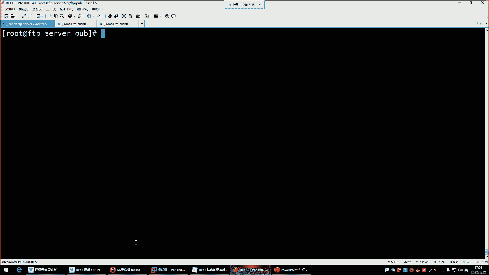

你是不是已经有点这个思维混乱了呀？那我发现我说的话好像都已经有点这个这什么呢？有点这个没有头绪了，歇会儿吧，我们稍微休息一下哈。

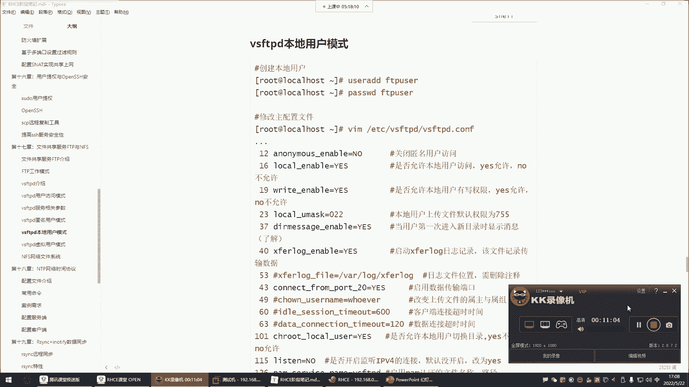