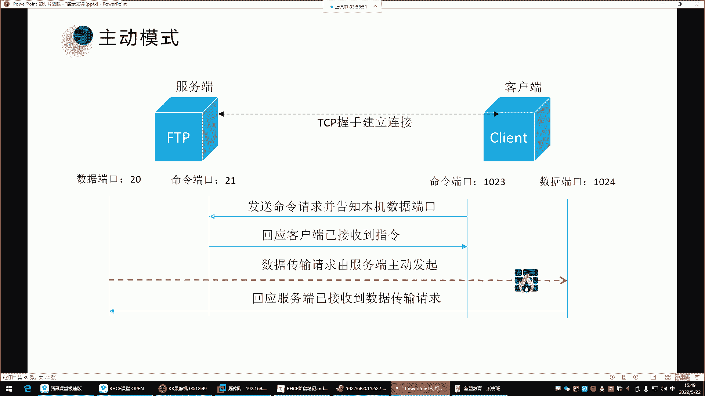
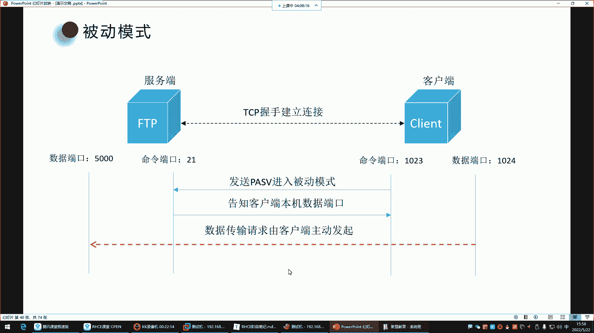
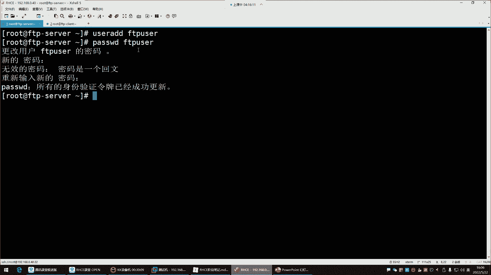
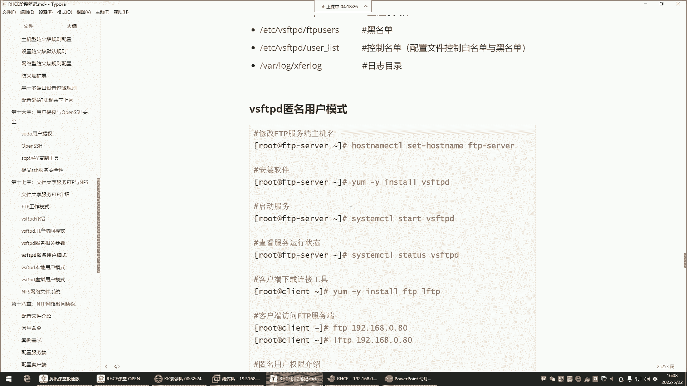
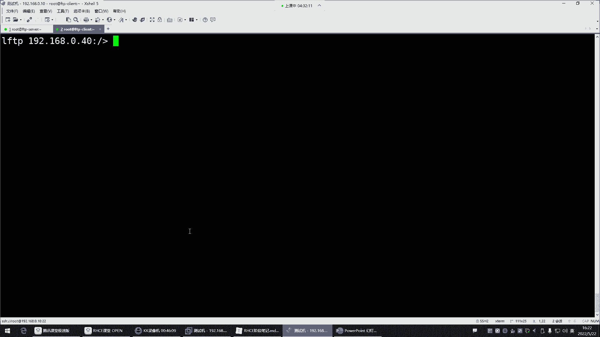
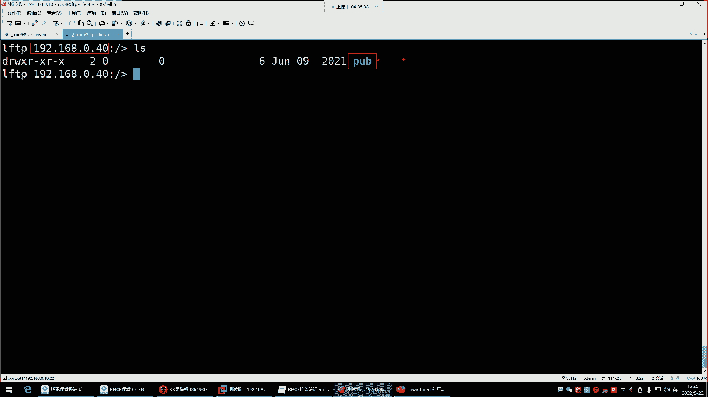

# 新盟教育-Linux运维RHCSA+RHC培训教程视频合集，全网最新最全最详细！ - P58：红帽RHCE-21.文件共享服务FTP、vsftpd安装与使用 - 广厦千万- - BV1up4y1w729

喂喂喂，好，这样就可以了哈，这声音就变大了。刚刚声音确实有点小了嗯。😊，你今天就是上课晚了是吧，不到12点开课，我昨天就发群里通知了，想干饭是吧？你这么一说。你这么一说，我也有点饿了，其实。但是饿归饿。

那我们现在这现在也不是吃饭的点啊，关键是你现在吃饭，那一会儿你是不是啊？得坚持哈，我们就是干嘛呢？叫苦其心志，劳其筋骨。对这得克服一下什么困难，我们得就是要什么要咬牙坚持，你什么东西你矫情吧唧的啊。

今天头疼，明天屁股疼，后天天儿太热，是不是啊？那你这还能学习吗？嗯。😊，所以呢我们要什么？要克服我们一切在学习的阶段，我们所遇到的问题。对，就像这个这位同学一样，课间泡个面啊，我们把这问题给它解决掉。

是不是？😀呵。😊，来接下来呢继续哈讲讲FTP文件共享。好，那文件共享服务FTP跟NFS这个呢是比较什么呢？比较古老的一种文件的传输的一种方式了。注意啊，它叫做文件共享。

它就是像我们平时生活中用的什么的呢？用的那个百度网盘没啥区别。百度网盘，我们用了平时自己用来给别人共享一些文件啊，共享录屏等等等等。这个感觉个人比较方便是吧？那在企业里边呢，企业里边不会用网盘。

为什么呢？因为这个网盘这东西啊，你像我们其实可能会觉得这网盘对于我们来讲多方便呢？呃，传输数据什么的挺好是吧？共享数据。

但是你们要知道网盘这东西啊，就拿百度来说，就这百度网盘你用的时候，它是最终啊。数据是存在了百度的服务器了。而企业里边呢，有些数据啊，它不适合放在公网环境下。它呢比较保密啊呢，这时候怎么办呢？

这时候我们就自己在企业里边搭建一个叫做企业内部的一个文件共享服务器。其实功能就是跟这个百度网盘没啥区别。哎，就是在企业内部呢共享数据。你把这个东西。他搭建到企业里边了。然后呢。

那这个服务器是你们企业的内部服务器。也就是说这个数据是存在自己家里面的，没有存在别人家，能理解吧？那这个呢是企业里面现在所需要的啊内部共享。所以这是FTP了解了它的功能之后呢。

我们对于FTP啊它是什么呢？再给大家说一说。

FTP它的全名叫做fi transfer protocol。这个英文呢大家也不用去记它，你就知道。它是一个文件的传输协议，这个文件传输协议就帮你传文件，哪些文件呢？只要是文件都能帮你传什么。

MP3这种音乐文件MP4这种视频。还有脚本，还有GPG图片，还有这种PN机图片，还有GNF动图。等等等等。什么点TIT的文本文件，还有一什么这个一些java类型的啊。

GSP的什么叉ML的叉ML的这些文件，什么jason的。这种格式的文件它都能帮你传。对，什么HTM的什么PP的啊PY的都能帮你传。所以说这不就是传文件的嘛，是不是？那传文件呢就跟百度网盘一样。

所以这就是企业内部的一个百度网盘啊，那接着呢。😊，就是注意哈，为什么说FTP它叫一个文件传输协议呢？因为呀就是。我们在企业内部想传文件，传文件的话，这个是走这个协议的。就像我们访问网站。

你访问网站它不走FTP它走的是HTTP。能理解吧？HTTP看到了吗？你甭管是HTTPSHHTTP这个协议是用于访问网站走的一个协议。而你想数据传输，注意想数据传输就不适合用这个协议了，用什么呢？

就用FTP在企业内部，所以他们之间都是协议只不过不同的协议，它给你实现的功能，或者说它的应用场景，它不一样。这个协议的应用场景就在企业内部做数据传输的。😊。

所以说FTP呢它是一种在互联网当中基于TCP协议进行端到端的数据传输协议。什么叫TCP协议呢？就是这种底层的链接。客户端跟服务端之间建立链接的时候，它是需要经过TCP这种握手这种机制去建立链接的。啊。

TTP里面有三次握手，4次断开。所以说呢它底层链接是走TCP。那数据传输呢数据传输上层就是FTP了，知道吧？通过FTP来来回回传文件啊，底层建立链接是TCP是这么回事。所以对于FTP的话呢。

我们了解了解它的架构跟端口，它本身是这种CS架构C是什么呢？C就是cl的这个什么呢？这个首字母clant就是客户端的意思。那S是什么呢？S就是s的缩写。😊，它的全名叫server，就是服务的意思啊。

其实说的就是这个服务器服务端。这个服务端干嘛的呢？服务端是给别人共享数据的，客户端呢是来我这儿下载数据的，所以这就是叫CS架构啊，那这个CS架构里边，它有这个对于FTP这个协议啊，它有两个端口。

末日熊20跟21这两个端口。那这两个端口怎么工作呢？就这一个服务，就这一个协议，他走两个端口。这两个端口20号端口呢叫数据端口，用于啊数据传输啊，21号呢是命令端口，用于接收客户端的命令。来看这图。

在服务端有两个端口，服务端是20跟21，这两个端口，一个是数据端口，一个是命令端口。好，那客户端它也会起端口。注意哈，它这个位置也要起命令端口跟数据端口干嘛呢？所一说就是这个客户机注意。

我们说在企业里边，这玩意它是在企业内部嘛，给谁用啊，给linux服务器用。所以说甭管是客户端还是服务端，他们之间都是相同的系统。那相同的系统之间，我们想要去建立链接干嘛呀？我们一般得下载那些工具啊。

通过命令去访问这个服务器能理解吧？是通过命令去访问的哈。那通过命令访问呢，我们一般这个一些工具呢，它会干嘛呢给你提供一些端口。然后呢，你去访问的时候，他也给你起这种命令端口。

那命令端口就跟命令端口去建立链接，能理解吧。然后数据传输的时候呢，那就是数据端口跟数据端口之间去建立链接。进行数据传输，它是这么回事。所以说对FTP来讲，它这种CS架构就是你服务端有服务端的端口。

客户端的有客户端的端口。哎，不同的端口呢就干不同的活，命令端口我就向你发送命令。比如说我要干嘛呢？我要下载文件，嗯，我要get1个叉叉O点TATT。哎，那我的命令就交给你的命令端口去接收。好。

那我要get一个文件，那文件你传给我的时候，就得通过数据端口发给我，知道吧？发给我。那你的你是通过数据端口给我发送数据。那我也得通过我的数据端口去接收你的数据请求，而不是通过命令请求。

不是不是通过命令端口了。还是这样的。所以接下来呢我们说说它这个端口啊啊哈如果想详细说它这个端口得说说它的工作模式啊，FTP这个协议呢，它有两种工作模式，第一种叫主动模式。第二种呢叫被动模式。

这工作模式呢我就直接通过图形给大家说哈，这样呢就别读那些字儿了，读字的话呢有点不太好理解。😊，啊，我们说说默这个主动模式是什么意思？这个有能有可能会被问到哈，就为有有些人呢他可能说闲的比较蛋疼啊。

他就想看你到底懂不懂这种他的一些底层的原理。他问你啊，FTP的工作模式都有哪些啊，能说一说吗？啊，就这种这个就吃饱了撑的会问你这些东西。其实这种东西对于我们来讲呢，也没有太大的必要。😊，那如果他问你。

你怎么说呢？那主动模式是怎么工作的呢？主动模式是看看客户端用自己的命令端口发送命令请求，注意是命令端口连接命令端口向他发送指令了。那发送指令这个指令有可能是下载文件。下载文件。也有可能是什么呢？

呃上传文件push上传文件。好，那这个时候命令呢我们一会儿再说，你就知道命令端口向命令端口发起请求。而主动模式下就是客户端它发送的这个命令请求里边呢也会干嘛呢？也会告诉这个服务端本机的数据端口是多少。

然后呢，当这个服务端接收到客户端的请求以后啊，他还得给客户端回应一个包。回应包就是告诉这个客户端啊，我已经接收到你的指令了。啊，比如说你我们告诉这个服务端，我要下载个文件，那服务端也得给他回应一个包。

好，我知道了，我已经收到你的指令了，告诉他啊，他们这一种应答机制，一问一答的机制。好，那回应包以后呢。😊，这个时候啊这个服务端他就获取到了客户端的数据端口是多少了？那这个时候数据端口是怎么来的呢？

为什么是101321跟1014呢？随机起注意哈，这种端口是随机起。您比如说我们下载一些工具的话，那个工具会随机起端口。这个范围你也不用管，一般都是1023，还有1023以上的端口。

一般就是没有被其他应用所占用的。没有被占用的啊，它就随机起。因为端口的话呢，一般是你想想那从一一直到多少呢？一直到65535呢。他只要看你这个机器哪些端口没有被占用，它就骑哪个端口随机起能列吧，然后呢。

这个时候服务端他就知道了啊，在这个客户端有个端口是1024，是作为数据传输的啊，那这时候主动模式就体现在这个数据传输，数据传输是由服务端主动向客户端发起。这个数据传输是谁呢？哎。

服务端用自己的数据端口主动去干嘛呢？连接客户端的数据端口。连接成功就是告诉你我要给你发送数据了，你准备好了吗？啊，如果说这个数据请求能够成功建立，那客户端就能够给他回应一个包，告诉他啊。

我已经接受到你的数据传输请求了。接下来咱俩可以进行数据传输了。能列吧。所以说主动模式体现在是数据传输是由谁主动发起，由谁呢？服务端。主动发起，并不是说命令请求由谁主动发起。

命令请求永远都是客户端主动向服务端发起命令请求。就像我们平时访问淘宝一样。你可以这样去理解，我们是客户端，淘宝服务器是服务端，我们永远都是主动去向淘宝服务器去发送什么呢？指令啊，我点这个页面是吧？

你给我打开，你啥时候见过淘宝主动给你推个页面到你的机器里面呢？没有吧啊，所以说命令请求永远都是客户端向服务端发起。然后服务端呢接收你的指令，就帮你去实现这个功能。而这个它不一样，我们说的是数据请求。哎。

甭管是主动模式还是被动模式，是数据传输是由谁发起。主动模式就数据传输式由服务端主动发起。那这个有什么关系吗？有关系啊，有的时候你这个客户机如果起防火墙，你这请求就被防火墙拦截。能理解吧，为什么呢？😡。

我们今天是不学过防火墙啊啊，那个特别是那个菲尔沃防火墙啊，如果是菲尔沃防火墙哈，那默认是不是只允许少量服务访问呢？😊，ferework杠7D杠杠get杠defa。啊，就直接看区域吧，杠杠。送。等于。

Public。杠杠list杠host。啊，这防火箱关掉了是吧？😊，嗯。杠杠list啊，杠杠2。哦啊，防火墙关掉了啊，没关系，我们把给它开启看看哈。😊，아이패 태버스。把IPT给它停掉。toptop。

IPT。再给它设成随机不自体。给内不下。抵在我一下啊，因为我们前面给它设置成随机自起了，再给它取消掉。取掉取消就他给你rem了，删除了它的那个什么呢？那个随机自启的文件。

就把这个路径下的这个文件给它删掉了，删了以后它就不会随机自启了。好，然后接着呢把菲尔沃给它起来。他的。5起来以后再看它的区域。好，你看这区域默认的时候只允许少量服务访问呢？没有FTP。没有FTP哈。

那我们接下来把这个机器环境给它搞一下，让这个机器当客户端。他当客户端，那我们这样对于这个机器来讲啊。嗯，他的IP地址我们就。就让他是这个IP吗？嗯，就就这个IP吧，但是名字改一改。さえた。很痛。さえた。

让他叫什么呢？让他叫。可烂他。clant杠112，这是他的IP地址，现在他的IP地址现在是112了。密码一。我觉得这个机器啊。现在他有点毛病，什么毛病呢？我们前面噼啦啪啦搞了很多事情。😊。

搞了一大堆实验，是不是？我们给他还原一下吧，还原一下啊。回言的话就是。搞了一堆实验，没有必要。嗯。接下来的实验的话呢，我们。把这个鸡恢复一下。

测试机让它恢复到他最初的那个状态。快照以初始化系统环境。

1011也一样快照。这个机器这个机器的话呢无所谓了，也恢复一下吧。拍照没行。基础环境。

开启。嗯，然后从10开始。

就拿这几做实验啊。就直接给它忽个快照。

重新连接。连。这是这时候得连连连上也连10了。然后咱们做个规划，主机名改一改。🎼然后它叫FTP杠serv啊，我的FTP服务器。重新连接一下。这个呢。让那当客户端。让他这FTP杠。그런。也是重新连接一下。

那接下来两台机器剑鸣之翼了吧。借名之意之后。这样水平排列。

好，下边。啊，我们刚刚是给大家讲解的这种主动模式是吧？然后就给大家来直接看防火墙你就知道了。防火墙它不允许FTP访问的。

就是说我们主要是说客户端哈，就谁起防火墙，是客户端起防火墙。客户端，如果他开防火墙的话，你想想那防火墙。😊，fa沃杠3D杠杠。重。然后。等于public杠杠。刚刚立死他。港。啊，这防火墙被我关了啊。

那我们说一下啊，如果你这个在企业内部环境下，防火箱关闭的状态，如果是防火箱没有起哈，那这位置不会受到影响。😊。

所以这个呢这还是看情况。就是他主要会问你原理，问的原理，你就是说如果是主动模式是数据传输请求，是由服务端向我客户端发起就行了，能列吧就可以了。那那他有可能还问你，那如果主动模式下。

那会不会存在一些问题呢？那其实它指的就是这个防火墙，你就说啊，那如果说这个客这个客客户机开防火墙的话，这个这个要把这个什么要把FTP的这个规则给它放行就可以了。啊，这样可以哈，所以在这里边默认情况下。

你可以要么把防火墙关掉，要么就放行FTP也行，能理解吧啊，那你如但是我们是关闭状态，是不是啊？那如果是开启状态呢，你就。

Sタ。嗯。你比如说我们把方向枪开启，开启以后，我们是不是就直接设置方向枪规则不就行了吗？😊，啊，public PO PLIC。是不是啊我们就直接往往往里边。feer world杠7D，然后呢set。

是杠杠。赛杠。🎼default，然后杠。嗯。设置怎么呢？重等于。嗯。🎼public是PUBLIC，然后杠杠ADD添加一个杠杠ADD杠。🎼s等于FTP好。哦，我估计我是命我是命令敲错了。

是不是斯瑞斯杠杠ADD呀？

回顾一下吧哈，这费尔沃。A， P。Tanya。规则。Fear war。哦，就直接没有那个set了哈。

直送。看到就是杠杠纵等于public BDD。啊，回车这就可以了，然后再看。那如果说我们这个主机注意，这是客户机哈，你们要注意看看，这是客户机。如果客户机我放行了FTP的话，哎。

那这个请求是不会被拦截的。

所以说在这里边就是担心它起防火墙，那起防火墙默认你也知道public区域，那就是允许不允许FTP访问的。所以解决方法要么放行防火墙，要么呢就是把防火墙直接给它关掉关掉。

🎼就可以了stop。关掉关掉省事儿，是不是？

停到就可以了。管他那些呢。啊，这主动模式主要存在的问题就是怕起防火墙。那还有一种就是被动模式，被动模式你。防火墙不用管防火墙跟客户端没啥关系。被动模式是怎么回事呢？第一，客户端还是向服务端发送指令。

但是呢这个指令里面呢啊。是有一个叫pass的指令，这个指令呢就是进入被动模式。啊，这个如果一旦进入被动模式。好，那这个时候它这个指令要获取服务端的数据端口，这个端口就不是20了，原先是20。

现在变成随机的这是是多少，它随机起。比如说起了1个5000。那这时候服务端就把自己的。本机的这个数据端口告诉客户端，那客户端现在知道了啊，你的端口是5000啊，是数据端口。

那这时候呢他主动去注意他主动去连接服务端的数据端口。那服务端一般我们作为1个FTP的服务器，我们也是放行FTP要么就把方向墙关掉都可以都能解决。总之这两这两个节点，你的防火墙。

要么就关掉，要么就是放行规则都可以能理解吧。啊，如果对于服务端来讲，你把FTB的规则给它放行了。哎，那这个数据传输就没有任何问题。那，就是有就是怕防火墙拦截哈。所以这问题呢默认情况下，FTP是被动模式。

😊，是被动模式啊。所以针对于服务端来讲，一般就是改方向规则，客户端不用动。这是主动与被动。你就知道这个被动模式数据传输请求是由谁呢？由客户端主动向服务端发起，那他是不是就被动了呀？他是主动方。

我是被动方。这是我们所说的这个叫做这个被动模式。一些简单的原理哈，大家知道一下。然后接着呢我们就。😊，来说说这个。FTP。就是我们了解了工作模式以后的话呢。

接下来我们说说可以实现FTP功能的软件都有哪些。我们想在企业里边搭建这么一台FTP服务器，就给别人共享数据啊，那这时候你可以用这用以下这些软件去搭建什么WUFTPD这非常古老的一款软件了。😊，嗯。

proFTPD叫专业的FTP软件pFTP纯粹的VSFTD非常安全的FTP然后那以上这些都是安装在linux系统里面的对，这些哈包括下面的VSFTPD。也都是安装在lininux系统里面的。

就是我们如果想在linux里面搭建一个文件共享，那就选择这些软件。好，那下面这两个呢serv这两个serv u呢就是在windows里边去搭建呢搭建FTP的优款软件。那我们跟我们没啥关系啊。

也是windows里面的一款FTP软件。但是它在linux里面也也有，也有也有linux类型的软件包也可以用啊。那我们今天给大家讲这个非常安全的这在其里面用的比较多一些。嗯。

然后下边呢对于这个FTV的客户端访问工具在这里边访问工具呢就是注意啊上面这些软件。是，就是说我们一会儿给大家主要讲这个这个软件要安装在服务端。这个软件就是基于FTP的协议去进行数据传输的。

那客户端他想访问我这个服务端，他得需要一些访问工具。啊，那这时候下边这个部分的工具是安装在这个客户端的。他安装客户客户端的访问工具，然后通过工具呢访问我去下载文件。能理解吧？

所以这个时候这一部分是客户端的访问工具，最古老的FTP升级版LFTPLFTPge这些都是什么Wge这些windows里的迅雷。从互联网当中下载文件的l密令上浏览器fi这windows的客户端工具。

这也可以直接从软件商店里面下载。这f了在windows的软件商店里面就有。你跑到软件商店。嗯。软件是。上天。你 so烦 they了。还好。看到吗？告诉你一款免费的FTP客户端软件。但是别从这下。为啥呢？

这里边有一些。病毒。因为我曾经想从那下，后来被检被检测出他那个里面有病毒。所以呢我就没没从他那下哈，你可以从这里面直接找到他的官方，你直接去他的官方去下载。😊，看了吗？官方下载就行了。

这是服务端下载的包，这是客户端下载的包。当然这是在windows里面的安装方式哈。😊，好，这是fi z了，制造一下就行啊，我们用不到用不到。然后。那我们接下来呢给大家详细的讲讲VSFTPD这款软件。

因为我们不是准备用它来搭建1个FTP服务器嘛，所以这个软件的话呢，它的全名叫varicurFTPdemo叫非常安全的FTP首付进程。我们前面安装过这个软件。我们前面拿这个软件做过好多个练习。

我不知道你们还记不记得。

我们今天是是在学习yM软件包管理的时候，ym杠外。因此呢竟用这个VSFTBD去练习了呀。然后这个包我可以用RPM杠QI看它的详细信息。它的服务名就叫VSFTPD跟包名一样。回车。啊。

然后这里面有它的一些介绍告诉你了，我这个东西是一个是一个非常安全的FTB守护进程，它完全是从头编写的。然后这是它的全名啊，叫verycur FTPdemo全名是。什么运行效率也很高。啊。

这是他的官方地址，看到吗？官网前面都讲过是吧？嗯，这个包就比较好系，它就不像前面那个SSH你看我们前面那个。那个open SSH那个包。🎼它的服务名叫SSAHD。SSHD。

你看人家这个VSFTVD的包名叫这个名，服务名也叫VSFTVD是不是就比较好记啊？就是差别哈，有的包就是比较奇葩。好，那接下来呢我们就。

来对于这个。软件是不是有一个简单的介绍呀？一款运行在linux操作系统上面开源免费的FTP服务程序。那这个软件的话呢，它有三种用户访问模式。这个访问模式呢我们呃。简单给大家介绍一下三种房模式。

第一种叫本地用户，第二种叫匿名用户，第三种叫虚拟用户来看看房模式。本地用户访问模式，我靠，怎么自动切换了呢？嗯。还好。它的这个访问模式啊三种。第一种呢叫做本地用户。本地用户是什么意思呢？就是这个。

比如说我这个FTP服务器啊，有人想连接我。想要去从我这下载一些东西，那连接者就是这个客户机，他想连接我，他得输入我本本地的用户名跟那个用户的密码才行。这是什么意思呢？就是说本地用户你连接我可以。

但是你得输入在我本地服务器里面存在的一个账号的名字。才可以输入正确的密码才能够连接。

啊，这个比较好理解，就是比如说别人想连接你这个FTP服务器，你给他建个账号，user add。用户名叫FTPuser给这个账号设个密码。密码11好，那这个账号以后。

别人就可以用这个账号连接到你这个机器的那个FTP那个服务上。是这么回事？啊，就是用户得在这个本机存在才行。第二种呢。

匿名用户匿名用户比较好理理解，无需用户认证直接访问。如果我这个。启用的是匿名用户的话，你就直接连就可以了啊，没有什么认认证方式。第三种呢叫虚拟用户。虚拟用户的话，这里边。呃，他有一些难度。

得需要安装数据库。安装数据库的话呢。什么my circlecleDB都行哈。你安装数据库以后，那到时候呢这个用户啊。

并不是在我们的这个。服务器里边去给他建账号，不是这样建哈，你这样建，这叫系统账号能理解吧？系统里边建出来账号。那如果是虚拟用户呢，是你安装一个数据库，在数据库里边给他去创建一个用户。

对这用户是在数据库里边的。

然后呢，这个客户端输入数据库里的用户名跟密码，然后呢才可以连接到你这个FTP服务去一种映射方式。访问数据库，我呢再把给你映射到FTP服务，这样就是增加了一层数据库的认证。能列吧。

这种安全性呢是相对较高一些，但是在企业内部呢也用不到企业内部的话呢，哪个比比较多一些呢？哎，匿名用户比较多一些，其次就是本地本地太局限了。你希望谁可以连接啊，你这个账号还得在本地给他建一个。

这个比有太局限性。所以匿名用户是用的比较多一些。OK那这是三种用户访问模式。那了解了三种访问模式呢，接下来咱们就。

来开始去。安装了哈安装的话，主机名咱们改它改成FTP思路。啊，下边呢我们啊这些搭建仓库哈，这些操作。😊，这些前面咱们都讲了，这就在这里边就没什么太多可说的了哈，检测什么仓库之类的。😊，什么关防火墙这些。

什么SElin临时关闭这些，我觉得这个就没有什么太多需要介绍的了，就直接安装包就行了，改个名安个包。改个名安个包以后呢。

接下来呢当然哈我们说说，就是作为服务端来讲，这防火墙开与不开。😊，这个都无所谓。如果说你要是开防火墙，咱就添加规则。能理解吧？如果咱不开防火墙，那你就。这个直接就是什么都不用管了，咱直接安包。

直接去这个起服务就行了，别人就可以直接访问。

然后接下来呢，我们这个包安装好了之后呢，那直接给它浮起来，还没有起伏哈。😊。

star VSFTPD。啊，看状态。好。🎼好，看状态呢，在企业里面给它设置成随机自起哈。如果是企业里边以内部行。😊，OK学习环境呢这无所谓哈，学习环境不用起，不用随机自起。

不然你每次虚拟机还占用你资源能理解吧？学习环境你就什么时候用，什么时候自己手起就行了，所以再给它beze一下。😊，把他的随机日期给他删掉。你发现没随机自起，他就是给你干嘛呢？给你link了一个文件。😡。

这link就是链接的意思。给你链接了一个文件啊，叫链接。他是把这个路径下的，他那个什么呢？他那个服务文件给你吐到了这个路径。这个路径就是一个系统的叫做随机自起的一个路径。任何的文件在这个路径下。

系统都会去帮他什么呢？自动去执行文件里的那些指令。那这些指令就是启动服务的指令。所以在这里边它这个你看你一旦设置enableable，它就帮你create创建了一个链接文件。那你一旦dcable的话呢。

他就帮你干嘛呢？remo删除了一个这个链接文件，其实就这意思。然后接下来呢，我们这个位置安装包起伏，然后呢看状态，接下来呢就可以了就可以用了。那对于客户端来讲，这个客户机哈他现在可以做什么事情呢？

瓷砖排列。它现在这个节点哈，它就可以直接去安装一个访问工具。FTP安两个LFTP。回头。是有点饿了是吧？我们这12点12点开讲的，12点到现在4个小时了。我们连续干了4个小时了，是吧？也挺猛的哈。😊。

安装好了安装好了之后，两个工具。那接下来干嘛呢？接下来就访问了哈，这工具没什么服务哈，直接第1个FTP访问怎么访问呢？就输入IP就行了。那个机器的IP。😊，我觉得这样排列。命令行有点短。

这样哈FDP192。168。0点。你多少呢？给它往上调一调哈。😊，因为这个我们的客户端的操作用的比较多一些，客户端的放大一些啊，FTP192。168。0。40，这是它的IP地址回车。啊。

没有到主义的路由。192。168。0。40。是不是他没有配？🎼拼。🎼192。168。0。40。啊，推出X的。拼192。168。0。40。FTP。🎼FPB192的168。0。40。诶。哎，神奇了哈。😊。

哎。你们看看是不是。呵呵。😊，这个有点意思哈，LFTP。2。B。诶。是不是防火墙的问题啊，我看看不应该呀。防火枪我们都给关掉了。再说就算这防火枪我们也放行了呀，放行了哈。😊，哦，看到了吗？😮，看到吗？

没没有IPT关了。IPT里面没有规则的。我们试试把fa沃关掉。再来一下哈再来一下。可以了。K了哈，服务端防火墙蓝了，为什么呢？😊，嗯。因为我们。防火墙没有配规则，服务端防火墙我们没有配规则哈。

没有放行FTP吧。刚刚是在客户端配的，客户端没用，对，服务端方箱也得过来，要么就要要么就给它放行。那接下来呢我们就。现在可以连了哈。😊，连上来之后，我是用这个工具啊，FTP这个工具。

最古老的这个。非常古老。这个。然后我们又下载了一个这个升级版。

那，接下来对于这种工具，我们连了以后，现在真正的连接上去了吗？没有现在他跟你。要用户名，这用户名看我们现在要连接192192。168。0。40。就是他让你输入。这个是谁呢？是root的这个用户吗？不是。

这个位置哈。FTP是不允许root登录的。root你输入ot。没用看到了吗？你输入root是登录不上去的，它默认就是禁止root登录。所以这位着X的推出。好，那这个用户名是谁？

那你说那这位置难道他要的是密码吗？😡，不是密码，注意哈不是密码。看了吗？他以为你输这一是用户名呢，所以这个位置。干嘛呢？退出？不对了哈，也不对劲儿。所以退出。现在这个连接用谁连呢？FTP。回车。

FTV的密码没有回撤。FDP是允许空密码登录的。那现在才提示说什么log in success叫登录成功，看了吗？那这个FTP是谁呢？FTP是在服务端有一个账号。看一下grape。

FTPETCpassWD。在服务端是默认哈，这是我们自己建的，不用管你看上面这个FTP这怎么来的呀？😊，这个用户就是系统自动创建的，专门就是给FTP这个服务运行的时候。所准备的一个用户。

你看这个用户low了个印，不能登录系统。所以FTP在运行的时候。看一下它的进程brarap吧。SS看服务的端口跟进程。看谁呢？FTP。你看。啊，但是这样看不是很清楚PS。AUX。过滤过滤谁过滤。FTP。

啊，这时候你看。FTP这个应程其中有一个。用户名就是FTP。看到吗？所以他。在运行的时候。在接收请求的时候，是以FTB的用户去接收用户请求的。那管理的时候是用谁管理呢？

是用root去管理root管理什么呀？比如说去起服务关服务，这得都有因为root权限大，哎，得由root去控制它的服务的一些这个维护。而接收请求是FTP去接收请求。所以这个用户我们在连的时候。

这个位置是用FTP登录的。然FTP呢它没有密码，所以就空密码就登录成功了。那登录成功以后没关系，连上了是吧，敲天命令。😊，那切割命令这时候大家看一下，你看我敲割命令以后呢，我可以获得获取到哪些信息哈。

😊，获取到的这些信息呢，就是首先他告诉你了。我启用的模式啊就是进入了被动模式了。就默认情况下，它是进入了被动模式。😡，被动模式就是。服务端主动把数据干嘛呢？可以说是服务端主动去向客户端去连接请求啊。

发送数据。你就知道默认情的是被动模式。然后。还有什么呢？什么下面是目录列表，就告诉你你敲到L这条命令，然后它的这个目录列表叫pub。下面这提示太多了是吧？这提示什么目录发送好了。

我告你这提示都不是什么很不是什么重要的提示。那这个时候。我告诉你对于这个。工具啊，我们不用这个工具访问啊，退出用谁呢？LFTP这工具好用。回车拉4，你看它还有颜色。比说这个工具啊它非常古老。

而这个工具呢是它的升级版。而且你在用这个工具的时候，你也不用输你你也你都不用输入这个什么FTP的用户名，这个工具太老了。😡，这个工具是它升级版哈，你发现你用这个工具就得输入用户名。

而这个工具不用输入用户名，为什么呢？因为这个工具默认就是以FTP的用户去连接的去登录的。所以这个的时候比较省事啊。这也是一个非常不错的地方。然后接下来呢接下来我们要说什么呢？

接下来我们要说就是这个这个工具，大家了解一下，我为什么那我为什么还要给大家演示这个工具呢？因为。😊，就是为了让你们看看他的工作模式，默认就是被动的。啊，其他的呢还有什么呢？

还有一个就是为什么在这位置需要输入用户呢？

就是他不是有三种模式吗？这三种模式。那对于VSFTBD来讲，它到底是本地用户还是匿名用户还是虚拟户的访问模式？这种反问模式是一种认证机制，就别人访问你，我提供一种认证机制。

这种认证机制可以是输入入用户名跟密码的，也可以说什么认证都没有这种机制。能理解吧。IP tape怎么放行服务？放行服务就是加息议也一样，加协议加端口都一样。

嗯。那这边哈。在 thedider。默认情况下。注意哈，我输入用户名，那可能给我们的感觉应该是本地用户是吧？输入用户名才能连上去。但是呢由于换了一个工具以后，我们又觉得这没有输入用户名，也可以连接。

啊，所以接下来呢我们现在要搞清楚搞清楚的事情是它到底是启用的哪种访问模式啊，用户访问模式。我告诉你啊默认情况下呢，它是叫做这个。

匿名的方案模式。匿名用过反模式哈。那你怎么知道他是匿名的呢？

就是。FTP啊，它这个有个特点，它的特点就是呃那个用户。就这个。FTP这个账号，这个账号它是就是给所有的。那个用户如果说他没有输入用户名和密码的话，默认是以这个FTP这个账号去访问的FTP服务。

所以这时候呢我们要筛到它的配准文件，它的配准文件在哪儿呢？在这儿。😊，大多数评种件都在ETCVSFTPD这个目录。

这个目录的话呢，我们。🎼打开现的是ETCVSFTPD啊，这个目录大家看一下，有一些文件是吧？其中有一个文件叫VSFTPD点com哎，其他文件先不用管这个文件呢打开。这个文件里面会告诉你他启用了哪些模式。

啊，这里面连个VF都没有吗？算了，那就VI吧。我们也不再有什么体验感。来看一下这文件哈，这文件在多少行呢？😊，啊，但是不行，如果这个文件哈。我们要不用VM，你发现这也看起来真的是一点毫无体验。

🤧嗯。接下来VIM。打开文件。啊，这样就可以看到哪些是没有被注释的。看了吗？上来多少行呢？这儿第十二行。允许匿名FTP吗？yes是允许。就是允许匿名用户访问FTP吗？那这个。

那叫anon must enable enable等于yes。就是匿名用户已经启用了访问了，yes就是允许的意思。那吗啊，如果注释掉，如果注释掉它默认是允许的。就是说这个东西默认就是允许匿名用户访问。

好，那匿名用户访问的话。这文件看一眼就行啊，你知道默认他请的是匿名用户。所以说我们现在通过这种方式访问，我没有输入用户名。就是以匿名的身份在访问他。匿门的身份，那匿名的身份在访问这个FTP的话。

那我现在敲的命令，你看我敲到L，我现在看的这个目录是在哪儿啊？首先你看的这个目录肯定不是你本机的，而是谁的呢？而是你连接的这个服务端的。😊，以后看到的是这个机器里面的目录。

那这个目录在这个机在那个服务端哪存在的呢？

在它的这个共享，它有一个叫共享目录，而且是匿名用户的共享目录va的FTP。

这个棒上去的FTP严格意义上来讲是谁的呢？是FTP这个用户的加目录。V现在还有TP。其实啊这种匿名用户，他以FTP这个账号的身份。登录到我这个服务器的FTP里边以后，它其实就是进到了自己的加目录了。

所以你看在他的加目录里边就有一个叫pub的目录。这个pub目录就是我现在在客户端看到这个pub，他们一模一样的，能理解吧？所以这就是我们所说的什么呢？就是匿名用户，他在访问服务端的时候。

是以这个FTP的账号身份访问的。然后他访问进来以后是进到了自己的家。那经过这个结论，我们就可以得出以后我想给那些匿名账号共享数据，我就把文件扔到这就行了。hello点TATT建个文件。建个文件之后呢。

那他现在看看不了，退出再重新登录。看了吗？是不是文件就进来了呀？啊，所以这样不就是你想给这些匿名账号共享什么，你就把文件放到这个路径就可以了。va下的FTP就可以了，就这么简单。就这么简单。然后呢。

还有什么呢？啊，还有就是。就是对于它的权限啊，还有这些访问工具的命令，我们得给大家说一说。我们现在要学习的是什么呢？就是命令。对这个LFTP。😊，就是我们使用这个工具的时候，我们可以执行哪些命令呢？

你可以这样获取它的帮助。怎么获取帮助呢？就是杠啊一般就是呃什么杠杠help，可不可以呢？未知的命令，那就杠H。未知的命令，那叫help回车，可以挨个试。那这时候我们来看一下哈。😊，这时候他告诉你了。

叫做sha的命令。什么意思呢？就是你在你现在使用我这个工具，我这个工具支持的sll命令有这么多。看到了吗？这一排是s命令，那s命令我们常用的什么ca plus你都可以用makeDR好了吧？都可以用。

都可以哈好。😊，那这一部分呢就是他自己的内部命令了啊，其实也设用命令里面也有什么CD是不是啊PWD这不都有吗？反正这些命令都可以用，你就知道就行什么杀进程的。😊。

软链接的MV移动改名的这里边RM删除的都可以啊，都支持。所以你想获取帮助呢，就help获取和帮助。那在这里边呢，我们说几个，那简单的命令就不说了，我们说几个我们常用的。我们说白了用这东西干嘛。

不就是下载跟上传嘛？😊，啊啊，这时他的问题啊，他说这个就是。IPT怎么放行服务是吧？IPT也一样。IPT不死。杠大I。Input。杠P杠P。然后指定什么呢？指定我的FTP。

能列吧FTP不一定非得是TCP。嗯，FTP。然后。杠G。啊，他我看看啊。更。🎼杠P杠PTCP然后。杠杠Dport。我想想哈。啊，这个是。20号端口21肯定是放行的。然后。还有一个。啊。

他那个数据端口随机起是不是啊？你的意思就是说他那个随机的端口是不是啊？对，没放行，那怎么办嗯。那我们这样咱们把这个防火墙给它起来试试，行吧，把IP给它起来。🎼starIP tables。啊。

我们没有安装IPT，这个被我恢复快照了。🎼模港外insta。IPTbo杠。S。S， E V V， I C E， S。咩。哎。T我死杠。VICE。VICS。啊。安装好了，扶务起来。

🎼starIP tables。然后接着呢。防火墙起了是吧？其实IPT如果是IPT这个问题你都不用关心。因为他是默认放行。就是fa沃的话，fa沃的话它默认是不允许那种什么访问的FTP你默认你看它的规则。

你就知道。上来这些的话呢，基本上都是什么呢？都是这个允许放行。🎼但是如果说别人访问你的FTP，那没有跟这个规则匹配到是吧？那就默认就这个规则能理解吧？你如果直接把这规则一清空。嗯，杠大F。🎼哎。

你清空以后，如果是IPQ，你都不用关心这个事情。那IPd我们一起，你看这边你退出，你再连，它不影响。看到吧？不影响哈，就菲尔沃不行。你如果用菲尔沃，你看我把IP地址给你关掉。嗯，4套吧。🎼I피티웠어。

啊，把最弱起。是他的。你飞入一起的话。那如果你没有放行。看到吗？能列了吧。肥肉不行。但是它默认那默认这个机器，它并不是用IPT，它默认是fa沃。所以这里面指的就是对分沃来讲，你得处理它的规则。

IPT不则说不用。能列吧。🎼所以菲尔沃方下，你就把它的要不给它关掉，要不就是不用它。停掉就可以了。然后再连。这。这样就可以了。那接来呢我们。哎，那我问一下这位置说清楚了吗？这个防火墙这位置。

能就是对IPT来讲，你用的话。你就不用只不用去针对于FTP做一些什么策略了，默认就是允许。う。好。

那接下来呢我们就。再继续说说它的这个命令哈，这样help。

我们说说长命令啊，长命令哪个呢？有无非就是下载。下载的话。Get。下载文件，然后上传上传的话呢是put。这个put上传。然后在这里面呢，还有一些这个批量的操作。你比如说还有一个是叫MG。

M get跑哪儿去了？这呢M getM get加一些选项，可以就是同时上传很多个文件。呃，M foot。啊，不是同时下载很多文件哈啊Mput是叫做同时上传很多文件。给る。好，那我们用到哪儿讲到哪儿。

反正密工具这东西呢，我们主要还是用于下载。因为一般就是我们连它，就是为了从它这下载东西啊，所以现在呢我们先演示第一个什么呢？查看什么的，不用说了，没有任何问题，演示下载get。

我把这个hello点TT给它下载下来。这里面可以t键哈，看了吗？我现在用t键。😊，补习了。啊，除了推荐以外呢，还可以干嘛呢？就是我如果想下载的话，我你直接回车就行了。😊，下载到哪儿了呢？我们再开终端哈。

客户端开终端。下载到你的加目录了，看到了吗？下载你的加目录了哈。😊，🎼我们再删掉哈，默认这不是刚刚下载过来的吗？删了没了吧，你再来一遍。😊，回句话，你再看你的节目录啊，看到吗？是不是？hello点天T。

所以这就是。怎么下载，用get就行了啊，这下载没有任何问题。那除了下单以外，还能干嘛呢？我现在想上传可不可以呢？比如说我现在想把我自己本地的这个什么ss confi点SH这个脚本上传给服务端。

可不可以呢？哎put。😊，上传。然后如果这个文件直接在你加目录，你也直接退不进。好，它默认就能够识别到。上传加目录的文件到哪儿啊？你看对FTV来讲。这个就是它的根，你量上以后。

这位置是显示的根就是你在它的根目录，它的根目录就是服务端的那个共享目录，就这哇下的FTP只只不过对于客户端来讲。他没有办法看到他的一个完整的路径。哎，它的根就是Y下FTP，然后在这就显示一个根。上传。

但在上传的时候，你发现他提示了，他说啊失败了啊，他说f失败了。😊，怎么失败了呢？他说。😊，这报错叫做什么拒绝访问，看到了吗？主要是你权限不足。权限不足了哈那权限不足是什么原因呢？😊，这个我们要说一说。

如果说我们想把自己本机的文件上传到服务端，那它的这个上传位置是上传在哪的呢？是服务端的这个mar的FTP目录。而这个b的FTP目录，我们得看看它的权限杠D。下载FTP。

你看问上去的FTP这个目录是属于谁的呀？属于root的是吧？然后呢，root的权限是能读能写能执行。但是我们这个客户端，我们在连接FTP的时候。我们是以谁的身份连接呀？😡。

是不是以这个FTP那个身份再连接它呀？也就说候我们现在连到服务端，我是以FTV的身份在做这些操作。那FTP这个用户，他对这个目录的身份是什么身份呢？那首先不是所有者，所有者是root。

那FTP在root组里面了吗？没有root组里面也没有用户。那FTP就属于谁了呢？属于其他人的权限了，是不是啊能读能执行？那也就是说为什么我们能够查看，能够下载呢？是因为人家压根儿对目录的权限。

你就是可以具备R跟X的权限的。所以我们可以在这里面执行一些查看的操作，什么LSK之类的，看文件都可以。只不文件这空的吗？但是你想做一些，比如说我想makeDR接个目录可以吗？你发现不行，我想删除可以吗？

RM杠RFhello点TATT回车。哎。这怎么删除的时候好像成功了呢？啊，并没有。没有哈，文姬还在。😊，人家还在啊，因为你压根儿没有那个权限，你想你对目录，你就是一个能读能执行的权限。

你怎么可能具备一些什么修改删除啊，创建的操作呢？所以我们说在这个里边。是插在哪儿呢？就是目录的权限不对。那目录权限我们一般啊怎么办呢？就是要要么你就给这个va下的FTP这个目录加个W就可以了。

但是一般呢。对于这种共享目录呢，我们不能直接对这个共享目录操作。在企里面怎么玩呢？就是你看人家已经给你准备好一个叫pub pub的目录了，就是public公共的意思。所以呢你想给别人共享什么？

你把这文件啊放到pub里边。然后对于帕泡公撸呢，你给他开判克权限。那泡泡木是不是所有者是root呀？啊，你把这所有人给他改成FTP就行了。对啊，不用别直接改这个共享目录哈。

在这目录下去用这个paop目录去给别人共享。😊，趁着modode哎把这个777，或者不用抻着modode直接干嘛呢？抻着O呢。陈欧呢。改他的归属FTPFTP所有者所有组都是FTP对泡泡目录。

你再看这个目录是不是啊我直接把他的所有者所有组给它改成FTP这个账号，那是不是权限就自然而然就跑到FTP这个账号身上去了呀？那以后那些匿名用户再连到我这个服务端的时候，他们所有的操作在这个目录里面去。

什么下载之类的不就行了吗？是吧？别动我这个共享目录，这个我给你用。那这时候呢他们就可以干嘛了呀？当然得退出再重新连。凉了以后哎CD的p。好吧，这时候的话呢，所有的操作在这里面做就行了。权限也给了。

主要他拥有什么呢？拥有这个W权限了，现在W就可以创建修改删除。好，那接下来呢我们来验证一下哈他可不可以做这些操作。😊，怎么验证呢？我现在就这样，比如说。啊。现在上传扑腾。哎，为什么上传这个文件的时候。

你发现怎么又是刚刚那个提示啊，什么拒绝访问没有权限呢？😡，但是我目录权限已经给了呀，给了W了呀。😡，不行，光给拿出来还不行。他需要什么呢？他需要配置文件的权限也要打开。

所以接下来你要去找它的配置文件ETC。VSFTVDVSFTVD。点c它的主配文件打开。然后接下来说说跟这种匿名用户相关的权限。打开好。看那个。看这个哈看上边的这个解释就行了。他说。

取消注释已允许匿名FTP用户上传文件。没有了吧。如果上面的全局，这个不用管哈，你就知道。他现在这段配置是允不允许匿名用户什么的upload，让你取消注释，取消谁呀？就这个。井号删掉。删那以后。

你看它叫an内 upload enable等于y思就是匿名上传启用。保存退出。保存的时候要重启服务哈。VSFTPD。好，这边。他刚刚是不能上传。授权以后回车。啊，他又说什么呢？什么。😊，没有创建权限吗？

无法创建文件。退出一下哈。再连一下。CD到怕吧。这权限已经给打开了哈。阿克load10。P。🎼footセか个。啊，没有穿建权限。嗯。看看目录选限哈。感定。RWX。没有这种创建权限，这个创建权。

这该给的都给了呀，这么诡异呢。是因为没有写权限吗？那我给他个写权限哈。

哎呀，试试一下。或者说我先开开一个其他权限试试。先开个其他选项，哪个呢？下面那个mDR。这m电R看一眼。他说，如果你希望匿名FTP用户能够创建，请取消入释，取消了吧。好，取消就等于yes。叫创建目录。

啊，新加加入新文件和新目录。加入新文件跟新目录都可以。然后。重启服。🎼靠如果这样不行，那我就觉得这真是有问题了哈，makeDR test。说啊不行，他说你没有创建的权限。读写执行。FTPFTP啊。

没毛病。然后这边那我再加个权限哈，没有创建权限。我真的是见了鬼了。

跑到最后另起一行加一个。

难道我下的版本比较新吗？再重写服。再试一下。我靠。哼厉害了哈。😊，我告诉你们。这种操作是史无前例的啊，mDR。P他了。他说没有创建权限。看到了。这边。该给的都给了。套。あく。W。哼。西了门了。

这锅整不会了呀，怎没有出现过这种情况啊？呃，以内部而上传创建。

FTP。🎼嗯，这从从来没有出现过这种情况啊，我看一下P杠QVSFTBD。3。0这版本也没变啊，一模一样的。起了门了哈。嗯，这种歇会儿，可能他有点累了。歇会儿。歇会儿哈。

