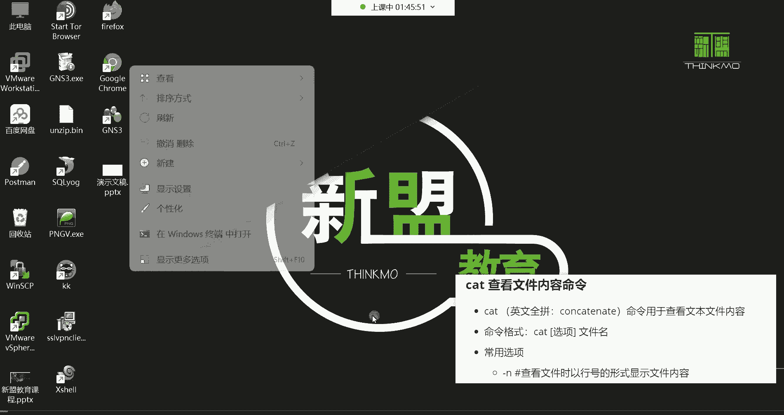

# 新盟教育-Linux运维RHCSA+RHC培训教程视频合集，全网最新最全最详细！ - P8：红帽RHCSA-8.mv、cat、less、head、tail、rm命令学习 - 广厦千万- - BV1up4y1w729

hello hello hello，大家能听到我这边的声音吗？啊，我回来了。😊，然后耽误了几分钟时间是吧？啊，没关系哈。😊，嗯。回来的话给我啊都回来的话，来给我刷个衣生来哈，我们继续。😊。

嗯，CP命令讲的也差不多了。然后下边呢我这里边注意啊，这个笔记里边是有非常多的这个案例的哈。然后这里边有一个啊小操作啊，什么操作呢？啊，可以使用点儿配合CP命令啊，但这个操作的话呢，可用可不用哈。

因为前面讲点的话呢，我们并没有说到这个这个点它的应用场景是吧？那这时候呢，比如我想做一件事，什么事呢？😊。

我想这样我想把那个网卡的配置文件啊给它拷贝一份CP哎，我要把ETC下的C。听不见。confit键，然后呢，night workt键杠t键那个网卡配置文件叫什么呀？是不是叫。ifCFG啊啊。

你两下t键就把这个目录下所有内容都给你列出来了哈好，接来呢我要把这个ifFGt键ENSt键。😊，卡不到哪儿呢？拷贝到我当前的所在目录。啊，那我就直接什么呢？点儿。回撤。阿拉斯。啊。

你看这个文件就被我给拷贝过来了，看到了吗？是不是就拷是不是就拷贝到了哪儿了？哎，当前了，就是你当前在哪，这个点就代表是。😊，哪里啊，所以说这个点儿呢你可以用作拷贝啊，这样也可以能理了吧啊。

这点儿你就知道它代表是当前的意思。

行，那下面还有一个还有这个。这个呢来给大家说一下。

这有两个操作。哼这两个操作。好，现在针对这个哈罗这个文件哈来看一下哈。😊，啊，不能说针对于文件，针对于目录啊，这个这个太字这个目录，我现在这样。我看一下OPT目录好，我现在这样CP杠2好，我要把。

test啊就是我当前加目录的这个test怎么呢？拷贝到OPT目录回车。注意哈，我现在再来一遍回车。你发现。这两条命令在拷贝的时候。正常来讲。应该是第二次，应该是重复拷贝的吧。

你第一次拷贝过去是不是有一个同名的了？第二次拷贝是不是重复拷贝了呀？那重复拷贝的话应该会有提示吧。是因为重复拷贝，他会问你要不要覆盖，我告诉你。但是没有那个提示。那你们能够理解这两次操作，为什么说。

没有出现任何的报错呢。不不。细节来了细节来了哈。来，你看我第一次拷贝。😊，看OPT目录。啊，是不拷贝过去了呀，这是第一次拷贝吧。没错吧。啊，拷贝到这个test，把这个test目录拷贝到OPT下面的。

然后第二次我又做了一个拷贝。嗯。这样哈。我我这样吧。这样吧。我第二次如果这样做的话呢，他会出现一个什么样的情况呢？啊，就是。这两次拷贝第一次拷贝过去了。第二次呢就是注意啊看第一次由于这个OPT啊。

它压根儿没有这个太字目录啊，我就拷贝过去了。那第二次再拷贝的时候，那这时候呢，如果你不指定这个默认情况下，如果重复拷贝哈呃，我这个操作我他么。😊。

我看一下我看一下啊，第一次。

哦，是这个操作哈这个操作。

这两个操作呀。还不太一样。还不太一样。我前面这两种操作是属于重复拷贝了是吧？那重复拷贝的话，正常来讲它会有一些这个什么呢？有些这个覆盖提示的。因为同名了嘛，他问你要不要覆盖。

那为什么说这个没有出现这种覆盖提示呢？是因为这两个目录都是空的啊，这里边没有没有什么东西，所以他没有这种提示。而我们这个操作跟前面还不太一样。你看如果这样做，我CP。咱拷贝目录，还是把这个。拿哪个目录。

拿那个test一来说吧。那我这个台词一。太词一这个目录啊，拷贝到OPT下边。让他叫什么呢？让他叫这个。嗯。叫叉叉叉。好，然后第二次呢，我展命令再给它拿过来翻一遍。注意啊，这种操作就是重复的操作。

重复的操作做了两遍。这两个操作第一次第一次操作呢是OPT本身就没有那个什么呢？没有这个t字一这个目录。然后我给他拷贝过去，给他改了个名是吧？那第二次拷贝呢。你看我是这样拷贝的。

还是拷贝这个test一这个目录，还是拷贝的OPT目录。那这个时候。由于啊OPT下边已经存在这个叉叉叉叉了，所以我再重复执行的时候。他是属于拷贝到叉叉叉叉下面去了。看到吗？啊，所以这个你要理解的话。

就主要是理解它有个改名功能。主要是有个改名功能，你别到是拷贝的时候，呃，你后面指个名字，完了呢，你到时候你自己记不清啊，搞得一头雾水啊，这就不行。

主要是说他这个改名功能。一旦改名了，到时候呢你再拷贝，就是肯定是拷贝到他的这个什么的新的名字里边去了。好了，那下面说说这个MV吧，MV移动啊。

这个移动在windows里面叫什么？叫剪切。啊，右击剪切。嗯，看啊剪切剪切。

在这儿。比如我给它剪切到哪里呢？我给它剪切到。我的这个。C盘啊，比如说这个用户。好，右击。粘贴过来。所以这就属于剪切的操作了啊，这剪切是什么意思呢？你看就是原文件就消失了，对不对？原文件没了啊。

被你直接剪过来了，它跟拷贝不一样，拷贝的话。😊，它是什么呢？是以一个副本的形式存在的，原文件不消失啊，再给你多一个副本。所以这就是他们两个具体的区别。

好了，那下面来说说这个MV啊，只不过我们这个里边它不叫剪切，人家叫移动。然后命令呢功能用于移动文件或目录到其他的位置的，其实就是剪切的功能哈。然后它也可以修改目录或文件的名字。

命令格式跟拷贝是一模一样的。所以命令格式我们就不过多啰嗦了哈。那现在我要做个操作，什么操作呢？我要把这个hello这个文件，我要给它移动到我系统的哪个文件呢，哪个路径的OPT啊，这有同名的不行。😊。

给它移动到T1这个目录吧。OPT下的T1。啊，这里面没有透明的那现在MV指定hello移动到OPT下的T1，然后我们打开这个T1，看到了吗？这个hello这个文件就过来了啊，这就是移动很简单吗？啊。

很简单，这没有什么太多可讲的。然后如果你想移动多个也可以。比如我想把当前下的T6T7T8这个目录移动到哪里呢？啊，移动到。这个OPT下的test目录，那就指定OPT下的。太斯的目录好，移过去了pl拉4。

然后，看一下太字目录是不是T6T7T8就被我们给移动过来了呀。嗯，讲到哪儿了？讲到MV动了。

好。那这个移动就比较简单哈，就是跟前面的那个拷贝呢没什么差别啊，指定原文件，然后再指定给它移动到哪里。OK这不就剪切嘛，是不是？所以这个没有什么太多可讲的，它有个改名功能，改名功能怎么改呢？

就跟拷贝一样，拷贝怎么改名，移动就怎么改名。比如我现在这样我MV啊，我要把这个。😊。

我把谁呢？我把这个t。这个目录移动到哪里呢？移动到根下边，让它叫叉叉叉叉叉叉叉。注意哈，你看我现在是指定了什么呢太词的目录移动到跟下面以后叫叉叉叉叉，看根目录。那你看是不是有一个目录名字叫叉叉叉叉叉呀？

😊，没错吧啊，对，就是。移动的时候呢啊顺便改了个名字。但如果你不想改名。那你就你比如说我像MV把pa子一移动到根目录下边回车。那他原先叫什么名字，就移过去以后还叫什么名字？能力吧啊，这就是移动。

O一动。好了，那下边呢这个命令k。

叫查看文件内容的命令。

这条命令呢非常的非常的好理解，怎么好理解呢？怎么查看文件内容啊，在windows里边怎么查看呢？windows里边我新建一个文件，我想看看这个文件是吧？双击我就打开了。😊。

没错吧，就打开它了哈。但是呢。😊，这个连接斯这个系统呢，它也没有这个双击的功能，那你只能用命令去看文件的内容。所以这个cat用于查看。

文件的内容的命令格式kt。文件名就可以了。有一个选项是杠N，一会儿再说。好，我们查看哪些文件呢？这时候我们要看的文件就比较多了，cat比如说我要看ETC下边有一个文件叫passWD回车。😊。

那他现在就帮我把这个文件打开了，然后你们现在也不要纠结，你说这文件里边嗯这些数据代表是什么意思，或者说这个文件的功能是什么功能，先不要去纠结这些。你现在就知道怎么打开这个文件就可以了啊。

用cate命令去打开啊，然后再打开的时候呢，可能说我们看起来感觉有些乱，是吧？这个文件。😊，或者说这个文件到底多少行呢？😡，这个文件里的内容多少行啊，不知道，还可以这样ca杠N。

再把文件件给它调取过来回车。那这时候呢，他就帮你把这个文件里的每一行的前面都给你加了一个行号啊，这个文件总共19行，所以这个ca这个命呢最常用的选项就是一个杠N了。查看文件时。

以行号的形式显示文件的内容。说非常简单，t是命令，后边呢跟上你要看的文件就可以了，指定它的路径。😊，嗯。什么显示隐藏符号，没有没有什么隐藏符号。好，然后。再看哪个文件呢。

cutETC下边的FStable这个文件打开它啊，加个补个杠N也行。补个杠N好，这样以行号的形式呢来看这个文件里的内容，然后再caETC下的。呃，哪个文件呢？host name这个文件。

这个文件是存放我们当前这个主机名的。我们的主机名为什么叫local host呀？是因为在这个文件里边指定了啊，你这个主机名叫local host，然后点儿后边呢并没有显示哈，你看我我们这个主机名。😊。

它是不显示这个文件里的点后面的内容呢，只显示点前面的，所以那前面就是local host。然后再看ETC下边，ETC下边有个文件叫stoOS杠release。回车。对。这个文件是什么文件呢？

就是我们当前的。系统的。版本的一个文件，就是我想看我当前系统用的是几版本的，看到吗？这文件里面放着呢，就s透 slinux releasease7。6的版本的。是存放系统的。还有一个文件。

如果你用的是红帽的那个red hat，那就。R。headide杠 releasease回车。啊，但是是一样子的哈是一样。😊，都是存放的是你当前系统的版本。那还有哪些文件呢？

还有这个ETC下的个group这个文件里面我们加个行号，这个文件里面放的是什么呢？放的是我们系统的所有的用户的相关组的信息。而前面那个。ETC下的passWD的文件放的是所有的用户信息啊。

其中包括root超级管理员的信息也在这个文件里边放着呢啊，后期我们会详细讲这个文件的，现在先知道一下。然后对cat这条命令呢。

就是打开文件嘛是吧？然后还有这个文件叫网卡的文件。那这个路径呢我们已经频繁讲过很多次了，ETC configurefi nightwork script下边有一个ifF tape键补齐ENS补齐回撤啊。

这个就是我们网卡的配置文件。就当前我们这个机器的IP地址，看到了吗？😊。

啊，IPAADDR这位置就是我们当前的机器的IP地址啊，掩码24位啊，当前的网关。还有DNS地址都在这个文件里面存着的。后期我们会详细讲这个文件，以及怎么去修改网卡IP的啊，后期我们会讲先知道一下啊。

然后这里面呢有有一些常见的文件哈，看到了吗？我这里面都有中文的。😊。

一个讲解，到时候呢啊自己去看一看，看到吗？就使用看的这个命令，主要就是啊多敲多练啊。

OK这是ca，然后ca这个命令啊有一个小缺点，什么缺点呢？如果我想看一个大文件，哪个大文件呢？你看ETC下面是不是有个s瑞斯啊，SERt键补惜是不是有个斯瑞斯这个文件。😊，我再加一。

即便我加一个杠N的话，杠N显示行号回车。这个文件由于内容太多，你看总共多少行呢？1万多行。1万多行啊到。k它是把这个所有的内容都给我。显示在我当前的那个屏幕上了。啊，显示在我这个屏幕上边，那我想干嘛？

我想往上翻啊，翻到最上边。你看啊，我现在已经翻到最上边了，在这儿，但是我。😊，也就能够看到什么呢？哎，前面的100131行，那我再想往前看就看不了了，划不上去了。看到吗？滑不上去了哈，那怎么办呢？

我想看看前面的内容。😊，那ca就不太合适。cate这条命令啊只适合查看一些小文件。文件内容比较小，哎，ca呢一次性把内容都给你显示到屏幕上面了。😡，啊，这样可以，那有的文件呢？

比如说内容量比较大，我也不希望它给我显示到屏幕上边。😡。

它一显示屏幕上面把我们前面所有操作的，你看都给顶没了，是不是？有的时候我想往前翻一翻，然后看看我们前面的命令的执行后的结果，你看看不到了，看到吗？看不到了哈。所以呢有的时候呢如果你遇到这种需求。

就是我不希望给我屏幕搞的，就是什么呢？那全都是这个文件的内容。😊。

那你可以用这个命令叫lessice。啊，lesss这条命令。就比较有意思了。

啊，ctrorl L清个屏哈。你看less呢它也是对文件的内容输出啊进行一个分页显示的工具。啊，这句话不太好理解是吧？你就看后面那话，就是用于看内容量较大的文件的less。也是帮你打开文件的。

但是呢打开的是比较适合打开那种内容量较大的文件，它就像什么叫像看书一样，可以帮你进行分页的显示，看书知道吧？一页一页去看啊，一本书好几千页。那怎么看呢？哎，分页一页一页去看。那如果这本书一股脑的是吧。

都给你。😡，就像那个ca一样，都跟你这个。😊，都给你铺出来了，你发现你不好看。😡，啊，所以说这个less。命令格式Lice，然后t有个常用的选项。杠N啊，对杠N的话也是以行号的形式显示。

所以但是这个N是大写的N。😊，后边呢跟上文件名，那就ETC下的service啊。😊，给他调取过来推车。好，那这时候你看这个less这个命，它的特点是什么？就是从第一行给你显示，看到吗？

这是文件的第一行是吧？然后这一页最多显示多少行呢？显示22行。😊，没错吧啊，从第一行显示。啊，这就是一页。然后在这里边有一些使用技巧，键盘的上下键可以进行翻行啊，你键盘往下翻看到了吗？哎。

就一行一行的去给你显示了，往回翻啊，键盘上键就往回翻，下键就往下翻。然后那如果你说我想一页一页的看怎么办呢？😊，你看这是一页是吧？啊，我想翻到下一页，那这时候呢。😊，就是叫拍个档啊，向下翻一页。

那如果是笔记本键盘，就是FN加你的下键。如果是大键盘，就拍个档。因为笔记本键盘没有那个拍个档啊，只有那个FN，然后呢再再加上你键盘的下键啊，那你看啊FN，然后呢拍个档好了，那你看就翻页了，看到了吗？

就你看上一页的结束是22行。那这一页的起始就是23行。😊，那这一页的结束是44行是吧？那我再拍个趟，那那一下一页的起始就是45行，没错吧，哎，一页一页的去看那往回翻呢哦，那就拍个up。

就是你的上键FN加上键就往回翻一行一行的一页一页的去翻，看到了吗？哎，来回翻一页，是不是就挺好了呀啊，那现在问题来了，比如我那这个文件总共一万多行，我想直接跳到文件最后怎么办呢？😊。

大写的记直接跳到文件的最后一行。按你键盘大写的记好，看了吗？要摁的。最后了。结尾了。这是最后一样。好，那我现在又想跳转回去怎么办呢？😊，两个小写的G直接跳转到文件行首，那就GG哎，回来了吧？😊。

那你说我想精准的定位到某一行怎么办呢？我想精准的定位到1000行。😡，因为这样翻也挺慢的，我就想看一千行。看好。冒号英文的冒号。那默认就是英文的冒号是吧，那你后面就跟1000就行了。😡，拍个回车。好。

看到吧？但是它默认是分页显示是吧，你往上翻一翻就行了，看到吧？哎，1000行。😊，从1000往下。把这一页都给你显示出来了。OK所以这可以帮你精准的去定位。那我想退出那Q就退出了。你看它退出后的效果哈。

Q。😊，好。你发现哎。真的像看书一样，是不是啊就把书一合上了，哎，我的屏幕呢也非常的干净，是不是？那看就不一样，看是把所有东西都给你显示出来了啊，所以如果你想看文件的话呢唉。😊，2000就2000。

你就指定2000。

好，那你看这个less还是挺好用的，是不是？哎看大文件的时候，用这个less命令哈。😊。

然后除了less以外，还有哪些命令呢？啊？像这个hand与t这个命令，它也可以帮我们去干嘛呀，去显示文件的内容。来看一下它怎么显示的，先说hand，hand呢是用来显示文件的开头的啊多少行内容。

默认显示多少行呢？默认显示文件的开头十行。😊。

那怎么玩哈？这玩意儿你看比如说现在这44的文件，我想看到头十行。😊，就看前十行，那你就。hander后边呢跟上这个文件回车。多少行啊，是不是十行啊？他肯定是十行。4十行哈。这就是前十行。嗯。

那你说哎呀能不能显示个行号什么的呀？😊，看加个杠N啊，但是这杠N可不是说是以行号的形式给你显示它的内容。这个杠N是让你指定。😊，显示的。行数什么意思呢？你看它默认是文件的头十行是吧？我现在不想看头十行。

我想看头二十行可以吗？哎，杠N来指定的啊，我们ctrl A把光标调整一下，然后杠。N后边。空格指定多少呢？比如说20好回车，那这就是这个文件的。开头二十行。知道吧？我想看开头三十行呢，啊，我们清个屏。

好，ctrol L清个屏，那就换成30。回车，那这就是30。啊，投三十行，你如果想看投300行呢啊，那你就三00回车。那这这就是这文件的头300行吧？所以说总之它会从文件的第一行往下给你显示。

能理解吧啊，然后通过杠N呢这个选项来调整啊，你要看。比如说啊这个文件的开头多少行，那这个你也可以这样，你不需要加杠N。你比如说你这样啊，就直接杠300。卡了一下是吧？卡了一下。挪一下。

你比如说我我不加杠恩的话，你直接杠300也行。😡，哎，它效果是一样的。所以你比如说我杠20。哎，你看也行，但是你如果这样用的话呢，就是什么呢？就是你这个杠跟20之间。就不能有空格。看到吧？啊。

不能有空格，有空格，你看它就出现这种情况，什么标准输入。😊，ctrol C给它结束掉。啊，这不行，所以必须呢。如果你不想加N的话，你就给它放到一起就可以了啊，这种格式他也认识能理吧。ctlC废弃6。

好了，那。呃，如果你加N的话，就不能有加N的话，必须得有空格了。啊，如如果你要是比如说我加N杠N。那你后边就得保留一个空格。你如果不保留空格，你说给它贴上。啊，也行。那也行。这个我还没这个我还没试过。

但是呢我我一般就喜欢什么呢？就直接杠20。就直接杠20就可以了。当然是。好了，那这是这个汉的这条命令，上显示文件的开头多少行呢，是不比较简单呢啊。

那你下去你是不是可以针对我们前面给大家就是列举的一些常见的文件都可以去练一练呢？没错吧，啊，看这些文件的开头多少行是吧？😊。

OK然后下边还有一个叫t这个命令。t meaning令呢跟汉呢是相反啊，t是尾的意思。

尾是什么意思呢？就是。用来显示文件末尾的多少行内容，那默认呢是显示尾十行，什么意思呢？你看这一个文件，汉的是从上往焊的是从上往下给你显示，能列吧。那有的时候我想看文件，比如末尾多少行啊，能列吧。

那tll就是从下往上给你显示，它是这个关系。啊，如我想看文件的末尾的时行，那你用tll。你焊的没有办法帮你实现这个功能，能理解吧？焊的只是开头，它有什末尾啊，所以这时候。我们就。

pall指定ETC下的table键啊service。回车。这是多少行呢？那就是尾十行了，这是末尾十行内容。好，然后那你说我想看末尾二十行呢，那你就这样。他有杠20。啊，然后EIC加点儿。

把这个文件给它调取过来回车。是吧那这是末尾20行，你说20行可以吗？当然可以了呀，就看你的需求呗。啊，也可以，你说那2千0行可以吗？也可以，总之呢从下往上给你显示啊，就是这样子的哈，这是tal。

所以这是不是也没有这个如果你有这种需求的话，你比如说啊我想看一个文件，但是我不想看它的全部，我想看它某一部分。😊，那就hall比如说杠5好，看哪个文件呢？

ETETCs configurefinetwork NETWt键杠t键if C。听不见。ENT不见啊，我就要看这个网卡的文件的末尾五行。你看那关键的信息就都给我显示出来了，哪些信息呢？哎。

IP我的我网卡的IP地址是吧，掩码网关，还有这个DNS这些地址都给我显示出来了啊，所以有这种需求呢可以用。嗯，行数超出文件总数的话会怎么样？那就不显示。你比如说啊我们就直接tll。

看ETC的FStable。这文件这文件总共多少行啊？1234567，我们换一个文件啊，换一个host的 name幕。看主机名文件回车。那它要默认显示这个末尾十行，但是你看它这文件没有那么多啊。

没有那么多，就有多少显示多少。是这么回事。能理解是吧啊，这太然后还有一个杠F啊，杠F这个选项是叫动态显示。杠F啊，我想看一个文件，哪个文件呢啊比如说。嗯。啊，看OPT下边吧。特别键两下好呃。

这个哪个文件呢，这些都不是文件。文件呢注意啊，如果是目录的话，它后面有个小后边是有斜线的哈，代表是目录。如果是文件呢，后面是没有斜线的，咱们就拿这个t一这个文件来说。😊，拍子的一类文件，我动态看他。

注意哈，动态。知道什么动态吗？就是他一直盯着这个文件，只要这文件有什么任何的风吹草动啊。他就给你显示出来了。那就是我们右边再复制一个终端，这个复制终端就是。再开一个一模一样的终端。

那就说现在我这个系统里面啊是两个root账号。那这边呢我们干嘛呢？演示一下演示什么呢？我通过一条命令哈，这个命令呢，我们后面会讲ele，比如ele一个hello啊，给它放到哪儿呢？

OPT下的test哪个文件，我看一下哈，test一类文件一回车。😊，哎，你看这时候就显示出来了吧，这个太词一这个文件里边多了一句hello。那这个杠F选项可以干嘛？就可以让我们去观察一些日志。

有的时候比如说呃像一些重要的日志文件。你想进行一个排错啊，然后呢你就需要实时去关注它。比如这个日志啊会产生哪些数据啊，你可以去动态去观察它杠F选项就可以帮你动态的观察。那怎么结束呢？怎么取消呢？

contrl C。就可以了。就。取消当前正在执行的这个命令。秦和平。清个屏ctrl L清个屏OK那以上就是这个。

hand与tail啊，然后接下来呢我们再来给大家讲讲大家非常感兴趣的一条命令啊RM这个嗯。删除的。

啊，删除的哈。那在讲删除之前呢。我先给大家补充一个。

呃。VM呃VMV尔这个虚拟机。

它的一个功能啊，虚拟机里面有个非常好的功能，什么功能呢？找到我们这个虚拟机右机有一个叫快照的功能。然后你选择拍摄快照。然后呢给你这个快照取个名字，快照一是吧，就让它叫什么呢？叫系统。的一个。嗯，初始。

环境。描述想写就写，不想写就算了。啊，选择拍摄快照。好，这个拍摄快照这个功能它有什么用呢？就是我刚刚的那个快照啊，右击选择。这个快照，然后呢，你看我们选择快照管理哈，快照。😊，快照管理器。

那这里面是不是有个快照啊？😊，这个快照里面保留的是什么呢？就是我当前这个时间。这个系统的一个所有的环境就等于说我现在是对我这个系统做了一个什么呢？一个备份。这是你的备份的时间。

那如果随着后期呢我们不断的练习，不断的使用。然后这个系统有一天被你给什么呢？被你给。呃，玩崩溃了。可能说开机都无法开机了。那你到时候可以干嘛呀？可以通过这个快照。帮你恢复一下。你点击这个快照。

然后选择转到，到时候呢你看。他提示你了，如果你想恢复此快照。当前状态将丢失。什么叫当前状态呀？就是。你在拍快照的这个时间之后。所有的状态。比如说你见到文件呢，所有的操作呀，它不会给你保留的。

那他会帮你恢复到什么时候呢？就是恢复到你拍快照的。这个时间段的系统环境能理解吧？哎，能听懂吗？听懂给我刷个衣上来。这就是这个快照。嗯，今天命令都讲了是吗？OK然后呢，我们选择是的话呢。哎，那现在我们就。

在什么环境呢？他现在就帮我恢复哈恢复。😊，OK那现在我当前系统的环境就是我当初拍快照的那个环境。

那你当初拍快照的时候，如果我的系统是一个正常的正常运转的健康的状态。那他就恢复到当初的那个状态了。所以说这个快照是个好功能。那以后大家在做在学习的时候，比如说我们呃后期做一些什么实验。

你们想把这个实验的环境给它保留下来，你就可以对于你这个实验环境拍个快照以后呢，又想用那个环境了啊，恢通过快照恢复到那个环境里面去就可以了。😊。

不需要去重新配。啊，这是快照。好。那接下来呢我们了解了快照功能了，下边咱们就给大家说说什么呢？

但我这终端已经掉了哈，因为你拍拍照，这个终端你还得重新登录。😊，90。root密码。清个平。这终断掉了，关掉吧。因为你一个快照一恢复，就等于你这个机器又重新什么呢？啊，又重新开了机一样。

所以说那你想想你机器关机跟开机，你终端是不是肯定掉啊啊，再重新登录一下。然后下边呢我们来开始给大家讲一讲，讲讲什么呢？讲讲这个RM1个从入门到入狱的一条命令。

借条命令啊。哎呦，可是非常的给力啊，也是大家非常感兴趣的一条命令RM。呃，就是用于删除文件跟目录的啊，反正呢命令也非常的好记，跟LS似的啊，就两个字母RM命令格式呢也非常的简单啊，非常的简单哈。

RM你想删谁，你就跟上目录跟文件名就行了。那我们前面创建了那么多的文件。比如我现在想把这个t2t3太4都给它删掉，那就RM。😊，指定test2test3，t4回车，你发现报错了。

LS打开没删没有删除成功是吧，为什么呢？因为他们是一个目录，他告诉你，他无法删除，因为他们是目录。目录是什么意思呢？就是你想删目录默认它不行得加选项啊。如果针对目录删除加一个杠R选项。

所以这时候我们就让RM杠R跟上t2空格，t3啊，如果你想一个一个删呢，就比如说我想删t2回车。那这时候呢，由于啊我们前面给大家讲基本概念的时候，我们就说lin斯这个系统没有回收站。那没有回收站。

我们在做一些删除的时候，你就得小心谨慎。所以系统的话呢，它也是会给你一个提示，问你是否删除这个目录。那这里边你有两个选择，第一个选择就是回答一个Y。Y就是yes，就是删回车，那就删了。那如果你不想删。

比如RM杠R。啊，我删这个t3的时候回车，他也问你，如果不想删，我就N回车，那就并没有删除，看到了吗？但是t2肯定是被删了。所以这就是。他会给你一个提示啊，怕你真的是。这个。不小心啊或者说手抖啊误删。

所以说呢呃还有一个确认啊，确认的这个步骤。然后一次删一个是吧，那我想删杠2test3。空格t4推车。回答Y回车Y回车，因为你是删两个文件嘛，所以它每个文件都得给你确认一遍。

这就是删除OK然后想删文件是不需要加杠R的。这有个压缩是吧，那2M杠不用啊，它是一个压缩文件。中文的新建。退不见补漆。补习一下。回车。这时候是否删除普通文件Y回撤啊，删了。没了，看到了吧？

OK然后看看别的路径，在别的路径OPT非常多是吧？好，我现在想把OPT目录下面所有都给它删掉。😊，对呀，我现在想删除所有这里边有目录，有文件是吧，你可以2M杠。R啊一个一个去删。但是呢。嗯。

这样哈你可以这样OPT指定OPT。下边的。行。哈这个星呢它是系统当中的一个特殊字符。这个特殊字符是系统里面非常常用的字符，可以用来代表任意所有。😊，啊，注意哈。叫任意所有。什么叫任意所有啊？就是说。

甭管是ABCD的英文字母，还是12345678的数字。这个星都能够表示。啊，都能表示他。所以呢这时候我用星放在这个OPT目录下边了。那是什么意思呢？就是说我要把OPT目录下边的任意所有。拳都。干掉。

那这时候回车。喂。好，喂。喂。Y每删一个都得确认一遍是吧？YYYYY哇这。感觉有些麻烦了是吧？你看哎呦嗯啊这个。😊，你看你看哎呦，这这可够麻烦的了，看到了吗？啊这。😊，哎呦哎呦哎呦哎呦啊，没了山没了。

阿拉斯看OPT。啊，这算是被我给扇干净了。啊，不要给伤干净了是吧，把鞋线去掉呢，是吧？学的叫学生。😊，嗯，星肯定是要慎用的哈，你不能说星慎用，是你删除的时候，你都要慎你都要慎用。😊。

那我们如果这样删的话，你发现这OPD目录有很多的数据，这每次都得回答一个Y，这可是有些费劲是吧？😡，所以说还有一个杠F选项叫强制删除。那这时候呢我们。打开比如说MT目录。啊。

我现在就想把整个MT目录下的都给它删除。但是MT下边你想想它有s透S目录，在sin里边还有很多的文件的是吧？那每次如果说嗯你都回答一个Y的话，感觉也挺麻烦的。所以你可以这样RM杠RF。😊，啊。

选项放在一起，把这两个选项放在一起。那F的话呢是叫强制删除，强制删除就是不会再跟你确认了。不会有那个确认的这一步了，就直接帮你删掉了，不会再问你了。😡，啊，所以这时候你看效果哈，杠2F。😊，IMT。行。

回车。这时候再打开MT，你发现干净了。是不是呃，在这个目录下的所有呢都被你给删掉了。所以这个星号代表。任意所有是什么都行，我都能够表示的。H。所所以呢对于这个删除的操作呢，如果你想删文件。

你也不需要加杠2，就想删文件哈。你看我们前面在这个media在。在这个根目录下面是不是有个media目录啊，这里面也有一些文件。打开跟一下的。mediaium目录回车，你看如果你就想上门进2M。

那就media下的，比如说test1点TATT回车。回答个Y删了，没有加杠2吧。如果你也是你删文件的时候，你不不不你不需要什么呢？你不需要这个呃再次跟你确认，你就可以这样RM杠F杠F。

指定我要删media下面的t词2这个文件。台词的2。回车啊，再看那个米。你发现t32就没了，是不是啊？那么想同时删除很多个呢，2M杠2F啊杠F哈就删文件。😊，media下边的test3。

然后再指定media下边的test4。在指定media下面的。pa点TATT然后回车再看这个media目录。调取。没了是吧，只剩1个T2目录，被我们给删的干干净净。这就是RM嘛。

它跟前面我们学的那个瑞木DRR这个哈RMR。RMDR这个命令啊。不太一样。因为RMDR只能删除空的。而啊而这个呢。2M这个命令啊，你甭管是不是空的，只要你不想要，我都能把你删掉。所以这个命令就非常给力。

那给力就是因为你会经常看到别人说RM杠RF斜线下的星。那这时候你能够理解这条命令的含义了吗？这个星是个特殊字符，代表任意所有这个斜线是什么呀？这个斜线是系统的根目录，而RM杠RF呢就是。

跟下的甭管是目录还是文件，我都强制给它删掉。所以这就是什么呢？三库跑路吗？啊，把整个系统都给删掉了。嗯。对呀，因为你每次删除的时候，你想想你你删你当前在自己的家目录，然后你现在你想删的是谁呢？

media目录下边的文件，所以你每次删的时候，你都要指定它的一个所在路径才行。啊，你不指定路径是不行的。你不指定路径的话，你想想他怎么知道这个文件就在media下面呢？

默认它会从你的加目录去找这个文件的。但你加目录就没有这个文件，他也没有办法把你删除，是吧？是这么回事，就指定他所在的路径。要么就是你直接切换到这个目录。😡，啊，也行。对，要么你就直接切换到这个目录。

然后呢就不需要每次都指定路径了，都可以哈，都可以。😊，没什么影响。然后跟下边我看还有哪哪些目录我们可以去清理清理了呀，比如太词一目录叉叉叉叉。2M杠2F根下的派1。回车阿拉斯打开根。

再删RM杠RF跟下的叉叉叉叉退不见。啊，再把这物给它干掉。委托。阿莱斯看根目录，好，被我给删除了。然后再来给大家强调一下，就是我们这样删，你们可能有的人会担心说啊，那根目录不会被删除吗？

根目录会不会被删呢？不会，为什么呢？😡，注意哈，我们所有的命令。他的特点是什么呢？最后一个参数作为我命令的执行对象。知道吧？而前面它它能识别出来这是路径。😡，是路径哈。而真正我这个命令的执行对象是什？

是这个路径下边的。他。啊，包括前面那个也一样，你看。这个命令他知道系统的知道啊这个命令我应该对太词一执行，而不是对于跟目录也执行。如果要对，如果我们这样指的话，你比如我像我们前面删我要删OPT这样哈。

我们前面2M杠2F我删除OPT下边的，比如说什么呃T下边的什么XE之类的这些文件哈。😊，他会把X1。作为我这个命令的一个执行对象，也是永远都是最后一个参数。作为我命令的执行对象。而前面的都能够识别出来。

这是一个路径。知道了吧。好，这是RM行了，主要就是删除删除。啊，然后再来给大家说一下啊，就是我们在这个进行，比如说路径切换呢啊，或者在查看的时候呢，你看我现在给你们做两个操作。

我现在touch在OPT下边建个文件。建一个太子的。要TATT。plus打开OPT。S4打开OPT。你们看一下啊。嗯，如果我真想删除这个目录下的所有目录而不删除文件呢那没有办法实现。没有办法实现。好呃。

我们来看一下哈，就是。现在我这两条命令啊。你发现。它有什么区别吗？都是LSOPT是吧？😡，啊，都是LOPT。那一个是后边跟了一根斜线，你看这是后边有一根斜线。而第一条命令呢是没有这根斜线。

所以现在我说的是这根斜线的问题。这根斜线的问题，这根斜线就是什么时候。可以有这根斜线，什么时候呢？可以不需要加这根斜线。你看我这条命令就没有加个对轮斜线，而这条命令加了，但是效果一样。

都是打开了OPT目录，是不是？我告诉你什么时候可以有可以没有呢？就是。你的命令。针对的是目录的时候。而且是。一个目录。是单个目录的时候。那后边可以。有这个斜线也可以没有。但是你这个命令如果说干嘛呢？

后别边。我要看OPD下边的。比如说哎某一个目录，那这时候比如我看这个，比如这时候就这样了，LS杠L是吧？我要看OPD下边的这个test的贴T，看到的详细信息。回车。那这根斜线就是你的路径之间的分割符。

啊，叫路径分割符。那还有。那这个时候我我如果单纯看文件的话呢。注意啊，我后面如果在文件，后面再补上斜线。回车就不允许，为什么呢？因为它提示你了，说这不是一个目录。那也说我们如果针对于文件操作的话。

文件后边是不能有这根斜线的。而而目录后边可以有这个斜线，也可以没有，那都不影响。但是文件后边坚决不能有这个斜线。如果有的话。他会识别为这是一个目录。知道吧。因为你自己在配配件补齐的时候，你看。😡。

你看我按t键补齐了吧。那如果我再创建一个目录呢，makeDR在OPD下面比如我创建一个叉叉叉叉目录。这时候我们在L杠L，我要补齐这个叉叉t键，你看它自动给你补齐一个斜线。看到吗？所以说对目录来讲呢。

后边。得有这个斜线啊，对于文件来讲，就不能有这根斜线。而如果说你想针对这个目录下边的内容操作，那这根斜线就是路径分割符，知道吧？好。这是给大家讲解的一些这个细微方面的内容哈。OK说清楚RM命令了吧。

说清楚了是吧？呃，说清楚之后呢，我们休息一下，好吧。😊。

休息一下，然后回回过头来给大家讲讲这个软链接硬链接啊，我们今天啊差不多能讲到这儿。第二节课的课后练习。不删裤吗？不删酷哈，删裤干嘛？我们今天呃。😊，从这开始啊，争取把这些常用的命令呢啊都给他讲完。

然后呢，你们这一周你就会有一个充足的什么呢？这个命令啊，可以去互选了啊，要么你卷他，要么他卷你好，歇歇会儿歇会儿把录屏停掉。

