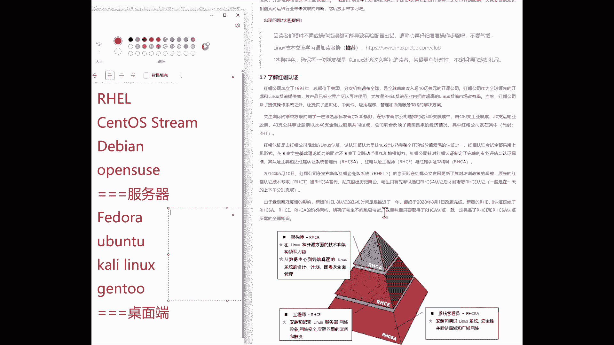
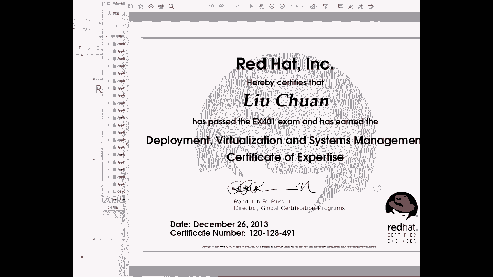
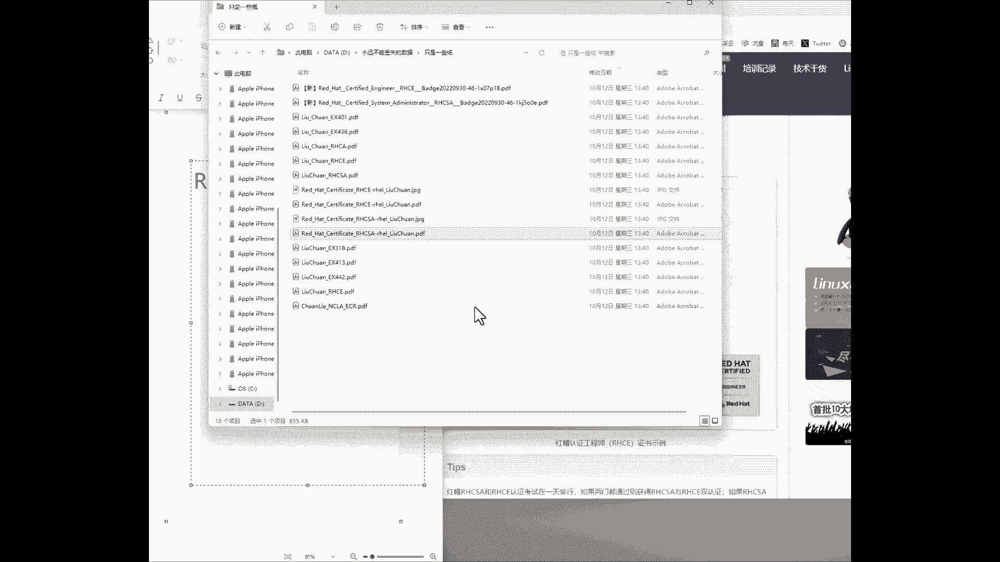

# 第0章 咱们先来谈谈为什么要学习Linux系统（Linux就该这么学） - P1 - 老刘努力不废话 - BV1qL411x785

Hello，狗学诶，欢迎大家来到咱们这个第二天的红木HC认证，九版本的视频课程，今天继续来给大家讲一下理论知识啊，我们做一些简单的科普，你去了解一下什么是开源行业，什么是开源精神，什么是开源许可。

去了解一下常见的这个LINUX操作系统，它有哪些对比，windows它有哪些优势，我们这个课程学习的是什么，学完之后能够去做什么，以及红包公司的现状，以及红包公司这个HC认证，考完之后是否有什么用处。

对我们有什么好处，能够找到什么样的工作，大概的一个现状，我们进行一个了解，同时会对一些术语进行简单的介绍啊，同学们学完了之后有这么一个底子，后面再去学习的课程的时候，相对来说就会很轻松了。

总之今天不涉及到任何跟技术相关的内容，同学们放轻松啊，还是完全就是当做是一个音频听就可以了，简单去了解一下，为以后打好基础吗，从明天开始就安装LINUX的操作系统。

就可以开始正式的这个学习技术相关的内容了，好首先简单自我介绍一下啊，我叫刘传，是在2015年开始创建咱们这家培训机构，同年开始去编写书籍，2017年第一本书LINUX就该这么学，上市了啊。

22018年和二二和2019年这两年开始，我们每年的书籍的销量都在10万本以上啊，因为在IT书记如果大家了解的话，应该知道超过1万册就是畅销书，我们18年一九年我们两年我们卖了20万册，每年卖10万册。

把出版社都吓坏了啊，这个也能够看得出来读者们对我们的喜爱，后来在2020年的时候写了这个第二本书，出版了第二本书，LINUX就该这么学第二版，那现在的话呢每年的销量也在八到10万册左右，可以看得出来。

同学们是很认可我们这套书籍编写的时候，创造的一个理念呢，就是在去学习的时候，应该去学习那些最实用的东西，稍等会跟大家去聊聊，我们在创作过程当中的一个小经历，然后接下来的话呢就是在2023年的时候。

我们出版了全新的一个系列，叫做LINUX常用命令自学手册啊，他是把常用的200条命令加上165条，这个算是扩展命令，我们总结到一起，乘365条命令的一些参数和介绍，总结成了一个工作啊。

总结成一个工具书或者在案头书，非常方便，大家进行一个查阅这本书的话，那目前销量也是非常不错的，我们啊对于这个市场来讲，这三本书就已经奠定了在这行业内的一些人气，其实从18年一九年开始。

但这个人气就已经非常的火爆了，那现在我们可以看得出来，现在的这个学生也是越来越多，然后在2024年的话呢，我们会出版这个LINUX又该怎么学第三版，那这个也话也是基于鸿毛real9的一套新的，这个书籍。

那这就是我们在这行业内做过的一些事情，这2015年到现在10年时间，也一直在从事LINUX运维行业的这个培训，同学们应该知道，我们这家培训机构只做LINUX培训啊，客户来讲就是RHCE培训，只做红帽。

相对来说是非常的专业的啊，而且这是我们养家糊口吃饭的一个家伙事儿啊，非常的这个有自信能把它给做好，好废话不多说，因为能听到我们这个视频，都已经是我们的老学员了啊，都是都都跟啊，都是已经付费了的。

所以这个收钱的这些我就不再多说了啊。

但是同学们对我们一定要有所了解了啊，我们就往后了，虽然是视频课程啊，但是也不需要那么水啊，希望有点干货，但是会不会可以听到的，我其其实讲课也非常的轻松嗯，这是因为咱们没有这种在线培训的压力了。

咱们这个课可以讲一个半小时，加两个小时都没有关系啊，和学习也会在这个基础之上的话，来进行一个扩展，接下来再说一下，就是我在2015年去写书的时候，实际上也是进入到了一个黑暗的一个，这么一个时期吧。

因为当时对于未来非常的迷茫，不知道我们这本书能不能写完啊，不知道我们这个培训能不能做好，非常昏暗的一个时期，后来偶尔间读到了一本书，稻盛和夫先生的一本叫做合法的书，诶，读完了之后感觉很有感触。

而且里面一段话对我很受用，嗯也是一直在支持我，在2015年，2017年去编写书籍，最黑暗的那个时期的这么一个动力，后来的话呢我从2015年开始做培训，也开始去为咱们的学员去转赠，这句话。

希望能够给同学们一些激励，我现在来给大家去念一下，也是我们的一个传承的10年了，每一期都会给大家去讲一讲，如果说这段话对您也有帮助，能够激发起大家学习的这个兴趣来，那就啊那么就是最好的了，来是这样的。

在工作时马马虎虎，那只将在兴趣和游戏中寻觅快活，那么充其量也只能够获得的是一时的快感，绝不能够尝到从心底里面涌出的惊喜与快乐，但来自工作的喜悦并不会像糖果那样，刚放进嘴里时就甜味十足。

而是需要从劳苦与艰辛中慢慢渗透出来，因此当我们聚精会神，孜孜不倦，克服艰辛后达到的这个成就感，世界上没有那种喜悦能与之类比，更何况人类生活当中，工作占据了较大的比重，如果不能从工作中啊。

呃劳动中获得充实感，那么即使从别的地方获得了快乐，最终我们也感觉到空虚和缺憾是这样的，我们想给大家表达的就是，既然已经选择了这个去学习这个技术，同时我们认为大家是很幸运的，能够得到我们这家培训机构。

目前在数据的销量和学生数量上来讲，那都是行业的第一名，还是有一定道理的，同时我们只去做LINUX，而且很在意自己的这个口碑啊，自认为是在这个行业内嗯，呃可以算是第一名，那就是非常的专业。

既然大家很幸运的选择到了我们，那我们就有义务把这个课程来给大家讲好，同学们的话呢也希望能够鼓足真呃，那么也能够鼓足呃斗志吧，然后我们鼓足劲儿，我们一起把这个课程给大家学好，经过咱们这套视频课程。

以及在线培训的这个学习，能够让您去从入门到精通LINUX啊。

走完就走完，这个全程就在讲这个视频课程的时候，我没有想到居然就是在比这个讲在线培训，还是有一些稍微紧张的，紧张的点在于我不知道哎呀，这个感觉很奇妙，因为我看不到同学们的互动。

我不知道大家可能可能现在再有什么疑虑，或者在想什么，并没有这样的一个互动的机会了，所以我的话呢也会尽可能的，在这个书以外进行扩展，从15年做培训到现在10年了，也多多少少记住了同学们常提的一些问题。

所以大家可以看到今天这个屏幕很奇怪啊，可能有点小，第一天的话呢是有这么一个教案的，以后就会大家看到我这个屏幕的实验界面了，所以今天这个屏幕稍微小一点，没关系，大家可以看到了，右边是咱们的书。

左边我会进行扩展，会把往期10年同学们提到一些常见问题，回来给大家进行扩展，读一些书上没有的东西，然后大家可以进行一个扩展的吧，进行一个知识的扩展，来我把语速也稍微的降慢一点。

如果同学们觉得呃有点慢了啊，那会开两倍速，三倍速啊都没有关系，但是尽量不要跳过，跳过的话，可能会让自己这个知识一下就跳了好多，出现这个欠缺了，我稍微慢一点好吧，我稍微慢一点，为我们的这个零基础的同学。

我们不要那么大压力，首先讲一下什么是开源，同学们会提到说什么是开源，开源是闭源的反义词，诶它们相辅相成对，没有问题啊，开源是闭源的反义词，首先慢慢给大家捋一下这个思路啊，开源和闭源是两个反义词。

这没问题啊，那么这有什么用呢，就要讲到开源的本质了，什么是开源，开源是一个呃，那么开源是一个词汇，它是一个中国词，我们给它扩展出来，它就是叫做开放源代码，开放源代码的一个缩写叫做开源。

开放源代码子稍微大一点啊，开放源代码实际上就指的是，让程序的编写者会提供程序的本身的，同时唉，让提供程序的同时也去提供程序的源代码，这样的服务的模式叫做开放源代码，同学们可以举个例子，什么是开源软件。

比如说LINUX它就是一个开源软件，它不仅提供了这个程序，是不是还提供了源代码，好它就是一个开源程序，同学大家可以大家可以再举几个例子嗯，可以一起来说一说，您所见过的开源软件还有哪些，比如说阿帕奇啊。

巴拉巴拉，我们可以举很多啊，比如说还有这个GIT分布式办公统，它都是开源的，它的特点就是不仅是提供了程序，是不是还提供了源代码呢，好它有什么好处，我们接下来再给大家聊，那必然举个例子有哪些。

有windows，这是大家最常见的闭源软件，有windows有QQ，有微信，有抖音，我们常见的这些软件它都是必然的，毕业软件的话呢，它只提供了这个程序，它并没有去提供这个程序所对应的一个源代码。

我们并不知道windows代码是什么样子的好，这是它的一个本质，那么它有什么样的一个好处，我今天会给大家提问题，2017年的时候，我们当时招到第19期，当时我开始第一次提这个问题。

我就问大家为什么要去学习LINUX啊，同学们有人就啊，大家的普遍的就聊到了这个呃，原因就是说是因为它是开源的，其实这个想法是错误的，开源软件有千千万，为什么要去学习LINUX呢。

今天下午老刘也可以写出一个软件来，也可以是一个开源程序，我把程序和源代码一起给大家没关系，但是过两个月他依然不会很火爆，就是因为它并没有去提供很好的功能，而LINUX它很好的去提供了好。

那我们要给大家去提到，就是说叫做开放啊，源代码里面的开源许可了，我们要想让这个程序变得好，我们首先要干嘛，制度啊，制度很重要，那么就要有一个东西来去约数用户的行为，以及去保障用啊。

以及去保障程序作者的这么一个权利，这叫做开放源代码的开源许可，大家可以看到最常用的就是这个GPL了，我们现在去使用的LINUX操作系统，就是使用的GPL许可，举个例子好，不用举例子，直接说这个干货了。

再讲到，那么到底什么是开放源代码，它的这个呃跟B软件最大的这个区别呢，它实际上是提供了五个自由，这是我们再去使用B的软件，从来没有过的一些体验，大家再捋一下思路，就是开放源那边。

他之所以在上个世纪70年代开始，到现在50年了这么的火爆，而且50年了半个世纪了，依然有着非常强烈的这个呃生命力，就是因为它提供了我们原先毕业软件，从来没有过的一些体验和权利，才让他有这么强的生命力。

第一点就是它赋予了用户使用的这个自由，这个其实并没有跟毕业软件加以区分，因为闭源软件也可以进行使用，微信可以使用QQ时，抖音可以使windows也可以使使用，它并不是一个最关键的一个区别，第二点。

那么就是复制自由，复制自由的话呢，其实在西方的，就比如说维基百科里面，它是加以区分了，它叫做复制自由，也叫做传播自由，它加以区分了复制自由和传播自由，在西方的文献当中指的是复制自由。

是通过小范围的U盘和光盘，传递给朋友的一个过程，传播自由指的是搭建网站或者论坛，大批量的为用户进行分发的一个行为，这个的话呢也并不是区分，我们这个开源软件跟B软件的一个，本质性的区别。

因为闭源软件实际上也是可以进行一些呃，复制的，比如说一些免费的软件QQ啊，我们把QQ的这个安装包通过U盘复制给我的，朋友们，可不可以通过，现在可以通过微信传播一些文件或者软件包，发送给我的朋友们去使用。

如果是免费的情况下也没有问题啊，甚至我们可以去传递这个啊操作系统，那么去啊，可以来去传播这个啊windows的这个操作系统，只要对方没有激活码，我们并没有提供盗版软件这么一个序列号，也没有法律风险啊。

所以前两点实际上是这个开源软件和闭源软件，共有的特点，同学们就可以记一下，如果有一些同学们还是在这个呃上大学，可能你们老师会问啊，说这个啊开源软件有几个自由，其中更别软件有哪些区别，以及有哪些共同点。

这时候前两点就是它这个相同点没有区别，它没有给我们获得更额外的体验，但是第三点就要来了，第三点叫做修改CEO，当你使用了GPL协议，以及大部分这个开源许可之后，我们能够对软件进行深度化的定制。

这个太牛了，大家想一下什么叫做修改自由，修改自由仅仅是windows里面去设置一个主机名称吗，或者我们去建立一个用户吗，这些属于设置上面的，就是使用这个软件功能的，它并不属于修改。

比如说我现在打开这个windows，我随便我那我就随随便便，我想把这个给它卸载掉，我想把这个设置给它卸载掉，那我们能把它卸载掉吗，不可以，我只能去卸载一些他让我去卸载掉的东西，比如画图可以这些无所谓。

但如果啊，但是假如说我现在我确实并不需要这个设置，这个功能，我并不能够把它给卸载掉，或者说啊这可能比较极端啊，或者说有些功能我是没有办法把它卸载掉了，或者说我今啊或者我想要进行一个深度化定制。

把它点击过后直接打开QQ可不可以啊，这都做不到的嗯，那如果说我现在在去省一台windows的11的，这个电脑当做我的服务器，我想把图形化界面卸载掉，它非常消耗内存，我能做得到吗，做不到的好。

它这个深度化的定制，能够让用户更好地让软件贴合于工作需求，这个叫做修改自由，这是开放源代码的一个特点，因为我们已经将这个源代码给了用户了，用户就可以根据他的呃呃呃，那么就可以根据他这个生态环境进行定啊。

它进行一个深度化的一个定制，这叫做修改自由，它是一个非常好的一个呃权利，或者叫做这个特性，第四的话呢我们叫做衍生自由，衍生自由呃，同学们第一次去听会有点类似于盗版软件，其实它并不是的。

它是将一个软件来进行修改，修改过后变成了一个软件，B由A变B的一个过程，叫做衍生版，这是开源软件给我们的这个自由，然后最后叫做这个收费自由，我们不仅可以进行改，还可以进行卖钱，这个过程我们叫做收费自由。

后面的三点是闭着眼睛完全不具备的，我来给大家讲一下后面的三点，举一个小案例啊，小案例我们画图来说话，首先有一个软件A这个软件A啊，特别的好用，我喜欢用，那好了，我是不是对他有什么自由使用跟复制。

自由没毛病吧，那我可以去使用跟复制，我对它进行了稍等，我把它写下来吧，我们尽量全面一点来，哎有点细啊，好我对它进行了使用，我的话呢产生了喜欢啊这种情绪，我对我对它进行了这个使用，但我并且很喜欢。

但是这个软件的话，它并没有完全符合于工作需要，能不能进行一个深度化定制呢，可以啊，我们有源代码，我们也可以修改，有这个权利，于是进行了修改这个操作，修改过后产生出来了一个新的软件，这个软件叫做软件B。

这个软件B实际上就是软件A的一个，叫做衍生版，同学们就要记一下这个专业术语了，以后我们在后面聊到的时候说，衍生版什么意思呢，就是经过一个软件的修改过程，它变成一个新的软件了，这个过程叫做啊。

这个的话我们叫做衍生品，所以大家可以记一下，衍生品就变成了这个软件啊，衍生品就是这个软件B，那么现在我们经过了几个自由呢，就是经过了三个自由，第一使用自由括弧也可以有这个传播自由，然后以及修改自由。

以及这个啊剩下这个衍生品的这个自由，那么还有问题了，如果说有一个用户，他发现软件A不是那么的好用，而我们经过了修改过后的软件B的话呢，反而更加好用了，这个时候如果有一个用户诶，假如说有这么一个用户。

他去使用了我们的软件B，并且他发现有一些功能需要一些软件的作者，进行定制化，或者提供一些第三方的服务了，那么它可以向这个软件B来去付费，那么付的费用全啊完全是由我们来接收的，也就是说。

我们不仅可以基于一个软件来进行修改，修改过后变成自己的一个软件，我们还可以去招揽新的客户，然后来进行一个盈利，这个就是开源软件的一大特点，同学们，但是一定要去记清楚，它绝不是盗版软件。

因为这些是你的权利，你基于你的权利，法律允许的范围内可以去做一些事情，那么这就是你的应得啊，这个就是开源软件一大特点，然后我们可以看到就是开源软件的话，它有很多啊，它有很多比较常见的。

就是这个GPL以及这个LGPL啊，这个比较常见，但是我们不用太去细看，因为只有您去写了程序的，您自己再去选择一个自己喜欢的，或者说自己合适的一个开放源代码计划里面，这个开源许可了，到时候再去细抠一下。

大概知道就行了，因为他们的都是大同小异的，他们都是基于不同的公司，自己的组织发布出来的这个许可，有些这个许可只是为了给自己的这个公司，或者自己的这个产品来进行一个冠名，然后进行一个保护。

实际上跟GPI没有太大的区别，细微的这个区别待会给大家具体说，比如说这个阿帕奇呀，还有这个啊，火狐浏览器等等的，这个对吧，他们都是这样的，这个情况不用去细看，大概知道就可以了啊。

第三个的话呢就是这个BSD，B s d，就是美国加利福尼亚大学伯克利分校，自己发布的这个开放源代码计划，里面的开放许可，他们这个学校很厉害啊，我们后面会给大家讲到他有三个产品。

第一就是free bs d啊，就是现在当前免费的这个UNIX的操作系统，第二的话呢是这个开放源代码计划啊，这个许可，第三就是现在95%以上DNS服务器，域名解析服务，正在使用的软件BIND办的都是家啊。

学校发布的特别厉害，这也是这个整个开发行业当中的一个佼佼者啊，有时候同学们在聊天，我也会在群里面看啊，有时候过春节的时候，有人问说啊，还有咱俩上学呀，有的同学就比较厉害啊，清华北大啊，再厉害一点的话。

就是哈佛，耶鲁好像就是西方学校只有这几个顶尖学校，但是呃确实没毛病啊，因为这个如果是哈佛的话，比较喜欢的，比较容易出总统，然后如果耶鲁的话，比较喜欢出经济学家，但是您一定要知道，我们既然作为开发行业。

从今天开始在聊天的时候多提几句，这个啊叫做美国加利福尼亚大学伯克利分校，他对于整个开源行业的贡献，完全超过了哈佛和耶鲁，因为他们工，因为他们学校的这个呃，整个的推动就是围绕着这个开源行业来进行的。

非常厉害，这就这个学校非常厉害，它是在我们这个它是在整个这个IT行业内的，这个知名度超过MIT的非常厉害，这家学校接下来第四个就是阿帕奇，同学们听到阿帕奇比较耳熟，有三个途径听到过。

第一就是阿帕奇基金会啊，它有一个基金会的名字，也是我们这个啊发布许可证的一个公司的名字，第二的话呢就是阿帕奇软件的名称，如果您要搭建过网站服务的话啊，就是这个呃大学网站服务的话。

应该也会去使用这个阿帕奇的软件去搭建过，第三是什么呢，就是一个美国代表这个战斗直升机叫阿帕奇啊，战斗无装直升机也是这个名字，我们现在所提到的这个阿帕奇许可，实际上就是阿帕奇基金会给自己加的。

这个网站服务，然后去啊单独去等于说去来进行一个规范啊，这么一个许可，他的话呢好处就是看到没有，我们呃，如果说自己去修改这个程序的这个源代码，则需要在文件当中进行一个声明，然后的话呢继续去沿用这个啊。

开放源代码的一个许可，待会会给大家有一张表格啊，去细聊一下，简单知道就可以了，他就是不同公司，不同组织为自己加工啊，为自己家的产品简单修改出来，这么一个这么一个开源许可，没有太多的区别啊。

没有太多的区别，接下来是MIT了啊，不用多说，这一帮小极客疯子们，然后弄出来的对吧，因为这个mi t这个麻省理工学院特别厉害，在这个整个it行业内都是数一数二的，大家以前有看过一个美剧叫生活大爆炸。

里面的谢尔顿，他就是这个mi it毕业的啊，就他就是一帮呃非常崇尚于自由分享，然后种饥渴精神的一帮学生们啊，这个学员非常的厉害，他们在自己需要内部呃，去呃设定了这么一个呃许可吧。

这个许可用啊用了就跟没用，也就是用了就跟没有用一样，他去极大的去约束了软件作者的这个权利，然后极大地赋予了用户使用的这个自由，如果说举例来讲，就是我们就是举例来讲，就是说当我们去编写出来一个软件。

如果说你要想稍微正规一点，有这么一个相关的许可证，然后来保护自己的权利，但是你又不想太多保护自己的权利，想更多跟人分享和交流的情况下，那么你就用mt就好了，有跟没有一样，但是也是有一定保护的，就这样的。

接下来啊马子了，同学们看这个图标有点像是什么呢，举手诶，火狐对不对，火狐浏览器的公司还自己发发布的一个产品，火狐浏览器就只能是这个maria啊。

其实也没有太大的区别，大大同小异，同学们大同小异，不要去细抠，不要去细抠，如果说一定要想要去选择一个自己合适的，开放源代码的这么一个啊。

这么大的他这么一个许可，有一张表供大家参考，咦呃以后写的程序可以过来细细看啊，我先简单给大家过一下，假如说我写了一个程序，这个程序我很满意，我想把它变成开源软件，跟大家一起交流学习啊，传播出名挣钱呃。

呃然后去买别墅好，总之嗯哎就又引到一个话题啊，怎么去赚钱啊，这个开源源代码的这个进行一个盈利模式，也非常有意思的一个话题，待会给大家讲，接下来说一下，就是我写出了一个程序来。

我想要去选择一个合适的源代码计划啊，怎么办呢，这个许可那么就看啊，说当别人修改过后，这个源代码了是否可以进行闭源，也就是说其他人基于我的这个软件进行了修改，然后以及创建出来的衍生品了。

那么他是否可以进行闭源操作，诶我一拍大腿一想，别介吧对吧，咱不地道啊，这个道德上来说说不过去啊，你基于我的软件改完了之后，不仅改了名了，收了钱了，你还把它闭源了，别人不能基于你这个软件进行二次创造了。

不合适吧，兄弟然后我就想，那我就选择是不可以对吧，哎哎哎看啊是否可以避免，那我选择就是啊不可以嗯，好那我那我希望你基于我这个软件，我也是基于别人的软件去写出来的，我希望我们的这个啊开源之术可以常青。

可以一直有名啊，可以啊快啊，可以健康地发展下去，所以我觉得不可以，他说新增的代码是否需要使用相同的许可，我在当前假如说使用的是JP了，那我希望你阿帕奇基金会，你使用的软件改了我的代码了。

变成你的浏览器里面的一个功能了，希望你能够继续保持GPI了，而不是变成你们公司自己的阿帕奇认证了好了，那我就选择嗯，是的，那于是就变成了这个JP了，JPL是最常用的许可证，如果说我们现在不想看一张图。

就闭眼睛去选，选择GPI了，没毛病，因为现在的那个呃呃因为现在这个呃呃，当前我们这个操作系统，它都是使用的这个GPL许可啊，当前我们的这个LINUX操作系统也是使用的JPL啊，没有毛病，再来说说。

如果说我呃另外一种情况想要啊，让别人可以进行避免了，我自己写出来的这个程序，我希望啊对方可以闭园，就是他的自由，那么好了，我就会选择是可以，但是我希望虽然你避免了，但是你修改过的那个内容。

你最好能给他总结成一份文档，说明一下你的修改的内容，保留一下我之前的名称，这样的话呢就去选择。

是的啊，接下来变成了一个阿帕奇认证，总之这个先不用再去深究，到时候大家如果你以后写出来的程序，有了机会了，按照这张表格去选择一个合适的许可啊，不想选就选择GPI了啊，那没毛病。

这个的话在这个中国的话呢，实践起来有一些难度啊，在国外的话，你要是侵了权了，我可以告诉你，在国内的话呢是有一定难度的，比如说在拼多多上，有时候看着就一边就就有时候就看生气啊。

拼多多上面我的盗版书卖的比正本书还要多，就看着特别的生气，这个对于版权保护的话呢，国内还是这个任重而道远的好，接下来说说一下这个开源许可不，接下来说一下这个开源行业和这个开源软件，他如何进行盈利的。

虽然我们大部分的同学都是些呃，那么现在都是基于兴趣呃，然后来进行学习的，也基于兴趣可以去写一些简单的软件，但是最好能有一个盈利模式，让我们的这个收入和我们的行业能够稳定下来，它有一定的这个回报对吧。

那它有哪些方式可以进行一个盈利呢，它就首先排除了windows这样的一个模式，我们是不能够通过激活码的方式来进行呃，收费的，大家应该回忆一下，安装windows的时候，只需要输入一个激活码。

点击下一步进入大操作系统当中这个过程，但如果说我已经将程序的源代码，都提供给用户了，它不仅可以破解我的这个软件对吧，从理论上来说，windows其实也被人破解过它，而且它还是一个必然软件。

如果说我现在作为一个开源软件，它其实很简单，就可以去破解我这个程序，甚至可以把我这个收费模块都给它去掉了，它可以完全去掉我这个收费的模块，然后还有然然后他再去进行一个使用，这条路是行不通的。

通过付费的方式它是行不通的，那我怎么去盈利呢，第一来说就是这个多条产品线的这个思路，我们给它总结成了五条，这也是我们来给大家独家总结出来的啊，网上都大，因为网上大多数同学们都给大家去看到的文章。

写的是基于兴趣，基于爱好，其实这并不一定是准确的，还有五个方式可以盈利的，而且是五个很关键的点，第一就是免费的这个软件，跟收费软件并行的方式，例如说MYSQL数据库，它提供一个免费版。

免费版一些呃基本的功能你可以去使用，也没有太大毛病，如果说你需要高级的这个服务，以及这比较及时的更新和打补丁的话，那么可以去付费去买一些高阶版，就是免费版和收费版进行并行的一个，我是这个是可以追起啊。

这个是他啊，这个是开源软件它比较常见的一个盈利模式，第二个是技术服务型一个软件它很好，如果大家都用可以啊，没有毛病啊，因为我们有五个使用自由对吧，因为我们有五个自由，第一使用自由，第二复制自由。

第三修改自由，第四衍生品自由，第五收费自由，第一来讲就是使用自由一个软件它很好，我们大家就用没任何毛病，但如果这个软件我不会用的情况下，但是我又需要用的情况下，那么则需要这个厂家为我提供一些服务了。

那么就要对它进行一个付费了，这个叫做技术服务型的，例如说现在红帽公司这个软件啊，包括我们这个操作系统，当前在讲课程当中，老刘会给大家去讲，讲完之后大家就会用了，没毛病，这个过程当中不用给红包去付啊。

那么呃不用去给红包来付，这个任何的费用都没有任何的问题，但是如果说您没有听过我们这个课，公司，又突然间又需要使用红包的这么一个服务了，那么就要去买红包的订阅服务，来进行一个收费了，他来为大家通过电话呀。

通过这个呃邮件啊，或者说他需要去现场为大家提供服务的时候，就要来去进行一个收费了，第三我们的盈利模式就是软硬结合，比如说IBM这个小相机ax，他就是这样的软硬搭着手嗯，再举个例子，苹果手机。

苹果手机跟他这个IOS系统搭着手嗯，我们买了这个手机，它里面自带一个以进行一个深度优化的一个啊，这这么一个系统使用起来体验非常的好，那么这两个可以搭着时，是不是对于这个软件来讲。

你想啊是不是进行一个溢价的，它它就它会这么一个出售呢，原来这个软件如果没有苹果手机这个系统，我感觉没有人没有太大市场，因为它可能没有人去使用它吧，但如果有苹果手机，如果有了这个呃。

某一台服务器进行一个呃定制化，这么一个优化出来的产品，使用体验又非常的好的情况下，那么会有人会这个软件进行付费的，它会有一个溢价，它会非常好，第一次就是技术出版物，这个软件很好诶，我写一本书啊。

给大家进行介绍，甚至这本书并啊，甚至这个软件并不是我自己写出来的，但是我依然可以写一个LINUX，就该这么学这本书来去介绍这个软件来去赚钱，技术技术出版物在国外还是很赚钱的一本书。

我常见的啊啊在加拿大那边60刀起啊，很正常，一本技术的书50刀，60刀合人民币的话，300多块钱嗯，会很多，结果看到我这本书啊，还有盗版书，非常的心痛，就是说这个，但是这也是，当然这也是一条路。

就是可以通过出版啊，还可以啊，它可以通过一些出版物或者资料，或者视频或者音频，总之他都可以去盈利，这个也是可以的，第五的话就是口碑和这个品牌，微软公司也有一些嗯积累的一些开源软件啊，它的主要目的的话呢。

是招揽口碑以及增加知名度，用的人多了，哎，我这口碑好了，后面我再出来啊，后来我再出几个设备的软件，大家也不会见外嗯，就这么一个情况，大家也不会再去过多的去吐槽了，开源软件跟B软件并行的一个方式。

开源软件打出口碑来，懒了人气了，B软件上啊，收割就是这样的一个方式，总之就是开源软件，这个呃现在我们这个社区是这个生态嘛，非常的这个健康和健全的，他大家可以放心，有一个非常合理的以及完善的闭环的。

这么一套生态环境，已经有了非常好啊，所以这个我们可以继续往后50年，去享受它带来给我们的红利。

嗯是这样的，来继续往后面去说啊，心里的话呢还是希望这个开源行业越来越好吧。

因为现在这个确实在这个当前桌面环境背景下，windows1家独大，还是看起来有点痛心的来，那我们就来去啊，那我们就来去来去看一下，这个windows常见的一些问题，哎呀。

然后再看一下我们这个当前LINUX，系统的一些优势啊，如果有一天我写了一本windows该怎么学，这本书还在跟windows道歉吧，但是既然我们去学习LINUX，那今天就第一节课先来吹一吹啊。

看看到底哪好，首先来来去黑一下这个windows啊，来去这个日常黑一下，看看这张蓝屏图，大家有没有见过啊，没见过好，你们现在见到了，在这个日常生活当中啊，桌面版确实存在一些不稳定的一些情况。

不能说天天呃，那么呃不能说天天蓝屏，每个月每两天啊，每两个月才蓝屏一次，有这种可能，这个有时候重启就好了，有时候会造成数据的丢失，有些情况下吧，主要他他特别恶心，但因为在车上当中，如果你一旦死机了。

或者说打开一个软件，它老是显示说软件啊没有响应，特别的恶心，有些就有时候你关吧，砸到数据的损失，而且有些服务器环境下，我们不能老这么重启服务器，不知道大家有没有遇到过一个情况。

在这个服务器运行几年的一个情况下，很正常啊，一旦重启了之后起不来了，咔咔咔就起不来了，很就是非常讨厌，我们在生产环境当中是不敢老去重启服务器的，那比如说我这个呃。

反正我见过最长的windows没有重启的记录，也就大概有两年，但是以我来说啊，我们当前的网站服务器是从2019年到现在，一次没有重启过，大概算一下几年了，就是我们自己的一个小的网站的服务器。

使用的是一个LINUX，现在使用的是3DS6啊，2019年到现在，我们一次没有重启过，就是这么稳定，几年时间如一日啊，咔咔就就是非常的稳定，确实如果说我们追求的是一个稳定和有效率，那么你再去使用呃啊。

那么你去使用LINUX肯定没毛病啊，如果换句话来说，再去黑一下，如果你再去使用了windows的话，那么你就是对于稳定性和效率。

你一定是一个损失，来说一下是怎么回事，具体来夸一夸。

具体来夸一夸，具体怎么好啊，看一下，首先啊对比如说这个windows的话呢，LINUX系统更加稳定且有效率。

这个不用多说，就是它的从底层的这个逻辑上来讲，这是它的核心优势。

不用多说，第二点来讲就是免费且少许费用，这个太好理解了，因为代码都给了我们啦，同学们，那不用啊，特别的紧张，你可以根据你自己的需要来进行选择的情况下，你一定会选择免费的版本对吧。

甚至他有收费的功能的情况下，我们都有可能把它跳过，所以免费是开源行业的呃，比较显著的一个特点，大多数的软件都是免费的，特别好特别好，但如果说我需要他提供服务了，我只需要付少许的服务费用即可使用。

这个一点比windows要好1万倍，windows的安装的时候是需要安啊，它是需要一个激活码，输入过后再点击下一步的，很讨厌啊，这个软件我没有去使用过，但是我也不知道它好不好的情况下，我就要先付费。

但活啊，但是这种开源软件的话，他则是让你先去体验，先去时，直到你需要一些呃他提供的服务了，比如说红包的订阅服务啊，他需要一些第三方的一些维护了，他们才需要付费，并且费用确实是比较少，现在据我了解。

红毛二公司对于一台服务器，每年的这个订阅服务的费用，就是349美元，那但是是有服务的，windows没有任何的服务，你需要激活码，激活这个软件去使用它，没有任何的服务，你要软件画的话，去找一下苹果。

去找一下这个呃，店里面他们应该也是不管的，除非软件升级打补丁，他们这个他们管，但是红宝公司收了你的钱是真管事儿，如果这个服务器出了问题，人家会有电话和邮件，起码会有一个基础的支撑。

如果你要买那个1000多块钱的，每刀的那个服务的话，那他们可能会在你报销机票的情况下，还可能会去现场去解决你的问题，这个是很好的，因此免费的服务以及少许的费用，这个是比较常见的一个情况。

也是它的一个特点之一，第三就是免呃呃，第三就是漏洞少且快速修补，由于windows我们现在因为对标的是windows啊，可能故意黑一下，假如说windows出现了漏洞了，怎么办呢，只能等。

那么就只能等着在微软公司进行修复，因为它里面的源代码没有任何人知道，即便从第三方，比如360啊，或者说版啊，或者说从百度上下载到的一些补丁，也都是从微软公司啊给它发布出来的。

我们并不知道这个程序的代码怎么去写的，因此也无法打补丁，只能用一些兼容性的方式来进行一个，简单的维护，但是LINUX的代码是公开出去的，所有人都可以看得到这个漏洞在没有爆发之前。

大家要理解什么是爆发之前呢，爆发之前就指的是我再去，因为这个代码过程当中发现这个漏洞，就可以把它修补上了，而windows是只有他爆发了，他出现这个漏洞，出现一个零，得到黑客手里面了。

才能够被社会所关注到啊，这是一点，因为它程序这有漏洞了，我们才能够知道，而并不能够提前的进行修复，除非他们内部啊，他们就是他们出了内部，来进行这么一个审阅的时候，才有可能修补了，第三啊，就是快速修补。

如果出现一个漏洞了，怎么办呢，只能干着急，等着微软去打补丁，但是现在这个开源行业内并不值得代码，全世界人都能看，那么所有人都可以看得到，如果说我有办法把这个漏洞给它修补上，我有看过这个代码。

我就可以把它给修补上，就这么简单吧，好那我就可以发布这个补丁，我就可以发布这个补丁，然后别人就会打我的补丁，甚至我可以再去收费啊，虽然不太道德啊，人家这么着急啊的这么一个情况下呃，进行盈利啊。

但是这是行得通的，因此快速修补跟漏洞少，这是呃他的第一个第三个优势啊之一第三啊，第四就是多任务和多用户，它来自于上个世纪70年代这个程序啊，待会给大家讲历史啊，产生出来的一个问题。

在上个世70年代的时候，并没有说每个人一台电脑啊，像现在似的，同学们在路上走，看到有网吧啊，现在网吧都现在被现在已经被淘汰掉了，现在叫网咖，现在现有啊，现在你进了网卡了之后，它会有用啊，专业的座椅啊。

非常的舒适，还会有这种啊小吃啊等等等等，这环境非常的好，但是大家想1970年的时候只有军队和高呃，就是那些呃非常呃非常高级的公司，我们我们可能类似于就是比如说像这个IBM，微软这种公司。

或者一些高校里面，可能才会有一两台这样的这个服务器，每个人一台根本就不现实的，怎么办呢，多个人通过一个终端去颠倒那台服务器，然后去共享里面的资源，大家理解啊，就是有一台服务器。

我们每个人拿一个终端去连到里面去，来去获取自己所需的这个呃资料也好，然后进行计算也好，那么就有一个问题了，我们如何来去规范用户的行为，来以及去合理的去分配系统的这个资源，它就是多用户跟多任务。

可以让多个用户同时去去啊，他要去使用这个系统，这个是一个很显著的一个区别，IPHONE手机啊，每个人啊，现在这个呃我们每个人拿着个手机，每个人都是一个独立的个体，我去使用我自己的手机。

女朋友看我都不爱上啊，那我可能那就让他看的时候，我就觉得很烦啊，可能都不让让让这个呃其他人来去看，同样的道理，现在这个呃再去使用的笔记本电脑，再去使用的windows，也都是。

我们基本上来说就是一对一来进行一个使用，别人再去使的时候，我就会觉得很讨厌啊，所以这种系统，它设计的初衷就是给一个人去使用的，没有毛病吧，但是服务器并不是的，它需要同时去响应，可能四五个管理员同时在线。

上百人同时去访问这样的这个情况，他要求什么，他需要对于系统的这个资源有一个合理的分配，这个就是上个世纪的一个，算是一个算是一个问题啊，但是现在成了一个优势这么一个过程来，第五点啊。

第五节今天给大家讲透了啊，再有人问说为什么再去学习LINUX，不要光啊，单纯知道它是一个开源的，1234567，咱说出几个他的优势来啊，能压得住对方，下面一点就是说更加安全的用户以及。

文件权限的这个策略，大家知道这个LINUX的这个作者的话呢，实际上是叫这个LINUX托马斯，他是一个芬兰赫尔辛基人，后来移民到了美国，美国人，我个人的这个感觉啊，就是有一帮被迫害妄想症。

从美国国父华盛顿开始，从富兰克林开始，你最大能够去做什么，然后去把这个权利让渡成为了法律，他们去约束人，他们认为总统是坏人呃，他们继续来去约束别人的行为啊，然后产生这么一套制度。

这套LINUX系统也是这样的，他会去严格的去限制每个人的权利，每个用户的权利以及文件上面的读写，执行非常的细，以及最后会在读写执行上面再去做，FSL以及SLINUX等等。

一套一套一套的这样的这个规则加到上面去，严格的限制，你的这个用户只能够获取你所需的资源，你这个程序只能去获取你所需的资源，就是它会是这样的一个限制，后面第六章的时候呃，第五章，第六章的时候会给大家讲到。

权限以及这个文件的时候，同学们会觉得很痛苦，但是痛苦的这个结果就是很安全啊，继续来啊，相信同学们也会听到过，有人说说LINUX很安全啊，他就是怎么来的呢，他来他来自U的痛苦好，第六点是第六点吗。

不能瞎说啊，对第六点，第六点，它是比较适合于小内核程序的嵌入式系统，您大学的时候如果学的是电子专业，或者您学习的是计算机专业，应该学习过单片机啊，有时候我们会鼓捣鼓捣做一个小汽车。

或者做一个小玩具什么的，这种情况下就要去使用的LINUX，举个例来讲，举个例来讲嗯，空调遥控器，空调遥控器我们按完之后，空调就开了，它需要安装一台windows吗。

它需要安装windows的这个图形化界面吗，它需要安装上小程序吗，它不需要的，如果安装上了windows，在这个啊，我当时这个例子举的非常的夸张啊，同学们不要杠，我只是举一个非常夸张的例子。

因为世界上没有任何一家公司这么做，如果说我们给空调遥控器安了一台windows，从开机到启动到我们启动空调，可能要23分钟时间，我们肯定受不了的，但如果它是一个呃，但他如果使用的是一个最经典的一个。

LINUX内核的话，可能啊开机只需要一秒钟，它最小的程序可能需要几兆，就可以把它给跑起来了，因此LINUX系统更加适合于嵌入式的小程序，没毛病啊，特别好，最后第八点，那它是相对来说不耗费资源的。

这个从两方面了解，第一方面了解是，因为我们可以根据自己的需要来进行一个，删减程序，例如说还是windows这个图形化界面，我在使用的是windows11。

我有办法把windows11这个图形化界面卸载掉吗，没有办法卸载不掉，那这个时候他就会一直消耗着。

我系统的这个内存，当我不需要的时候，我可以把LINUX里面这个图形化界面卸载掉，没毛病，非常简单，就一条命令的事就会把它卸载掉了，因此我可以进行一个精简，第二我既然有了程序的源代码。

我就可以进行一个深度化的定，让它更加适合于当前的工作场景，是不是进行一个深度化的一个优化呢，深度的优化让他也相对来说更稳定，以及不耗费资源，这个就是整体的LINUX的一大优势啊。

之七啊，这个七个就出来了。

那我们具体再来给大家再去翻来覆去，再来讲一讲啊，他到底总结一下这七个特点，常聊的有哪些显著的区别呢，低来讲就是这个低风险，你看这就是咱们这个在线啊，这个这就是咱们视频课程对比，在线培训的一大优势。

在线培训当中我是不敢这么讲，哎呀这讲着讲着课已经40多分钟了，我们总共这个课啊才一两个小时，证明讲着讲着才讲一章，已经40多分钟了，这也就是视频课程一直想给大家做一个原因啊，当然了。

我这个语速也尽量控制一下，自己稍微慢一点，为我们的这个新手同学入门不要那么大压力，我们在视频课程当中会讲到很多，书上和我们这个在线培训当中，原本不该有的内容，我们会给大家加到里面去。

因此视频课程诶确实是具有这个不可替代性的，请同学们一定要至少听一遍吧，嗯总结来说它是具有了这个开源软件啊，它是具有了这个较低风险的较低风险的，如果这个程序的源代码，我们不知道里面有没有漏洞啊。

按照咱们国按照咱们国家当前所讲的，里面有没有一些间谍程序。

这是对吧，但是程序源代码开放出去的有点像是什么呢，有点像是哎呀，最近最呃最近去吃了一家饭馆，叫做这个西贝莜面村啊，不知道大家有没有去吃过啊，他首先提出的一个理念叫做明初酿造，他怎么样呢。

他是把他那个后厨给他拆掉了，完全换成了玻璃板，你站在这个店在门口，或者你在吃饭的时候，就可以看到后厨里面制作的一个过程，你是不是觉得很放心呢，以前如果要是有食材掉到了地上，那个厨师绝对把它洗一洗。

就继续做菜了，现在他敢吗，他不敢了，同样的源代码都开放出去了，那还谁会往里面去做一些不好的事情呢，我们也更放心了，而且这个程序，如果说一旦被这个某一个公司抛弃掉了，例如说windows xp啊。

这个我记错，如果没有记错的话啊，他是在2014年的时候就已经提示维护了，但是大多数的银行，国内的银行，实际上现在还都用的是windows xp的这个操作系统，甚至北京的地铁我看也是windows啊。

现在也都是使用的这个windows xp的这个操作系统，问题就来了，现在在现在没有出现漏洞，假如此时此刻他报了一个大漏洞，这时候谁给他修补呢，微软公司已经把他给抛弃了，他不管这事了，那么谁来修复呢。

只能是这个程序的运维人员，想想怎么解决的办法，选一种妥协式的兼容性的补丁，然后我们打一打或者关闭某些功能，来保证这个服务器的安全，除此之外没有办法了，因为我们没有办法自己去发布这个补丁，这就是低风险。

第二的话就是高品质，高品质指的是，如果说我已经把程序代码都给用户了，我这个代码就不会显得特别的差，举个小例子，我在上高职的时候，我也在学习计算机网络安全，当时有一门课叫C语言。

C语言老师要求我们去使用一个for循环语句，从一输出到100，今天这节课两呃，他应该是两节课，一上午两节课去写完，然后就交作业，最后他会开一个FTP给它上传上去，从一输出到100，我有两个方式去做。

第一个方式就是我听两个小时啊，这个课我学会了，使用for循环写出一个这个程序来，他从一输出100，我把它给它写出一个程序，然后发布程序，这是其一，其二我用手写，从1~100，我就用手写。

我写一遍来去输出这个内容也是一样的，如果老师只让我去上呃，呃那么如果老师只让我去上传这个程序，我上传这两个程序他都看不出来任何的区别的，但是如果他要求我去上传这个源代码的话。

我敢把我第二个代码给他写啊啊，那么我肯定不敢把我第二个程序代码给它，上升上去的，他因为他明显就可以看得出来我没有去听课，我是用另外一种方式去完成的，代码写的非常的臭，于是我不敢往上去传。

因此开放源代码的程序，一般会比毕业软件的程序写得更好一点，当然了，这是相对来说，不要用我写程序跟微软公司去对比，但是相对来说是这样的，第三低成本，那没毛病了，开源程序的这个作者很多人是基于兴趣的。

不给钱我也乐意看，就像志愿者一样，因此它成本更低，我们用户使用起来的话呢，也可以，相对来说大概率会免费，但这是一个非常好的一个良性的这么一次呃，循环以及商业的模式非常好嗯，来第四就是更加透明啊。

这就不用多说了，没有傻子啊，会把自己的这个木马放到开源程序里面，他疯了他疯了心了，我把这个木马，然后我写到代码里面，然后我还把代码给你看，好像目前我没有看到这么傻的啊。

就是这这个相对来说它透明度会更高一点，还会更好一点，好接下来往下去看一看啊，刚刚聊到了很多词，比如说UNIX操作系统，比如说开放源代码计划，我还提到了GPI了啊。

包括说我们再去使用的这个LINUX这个操作系统，他怎么回事，大概一个历史进行一个简单的串讲啊，超啊超啊，超级快一点，还提到了上个世纪70年代的一个，小额的一些小经历啊，不是啊不是啊，不是小经历啊。

老刘那会儿还没有出生，但是一些小的一些小故事，我们简单啊技能简单的串讲，这个时间不会特别的长，首先啊1965年啊，1965年当时还有一个贝尔实验室啊，1965年，1965年，当时的话呢由贝尔实验室。

麻省理工学院MIT，老他们几个的事啊，还有这个通用电气之一，这三家现在都在还是都是顶尖的啊，他们三个的话呢打的就是他们家三个公司，1965年的时候，打造出来一个叫做呃呃，MOTX这么一个操作系统。

MOTX这么一个操作系统，他的话呢当时因为一些原因，主要是因为经费啊，缺钱了，大家这三家都不爱出钱了，于是就啊也算是中断了，但是当时有过这么一个操作系统，它实现了一个跨平台的这么一个信息传输，是有的。

后来的话呢4年之后贝尔实验室不出钱了，1969年他见不到经济利益吧，贝尔实验室他这个退出了，他的话呢也被终止掉了，但是其中这个项目当中有一个这个啊，开发人员叫做肯冲啊，叫叫做啊呃汤姆森汤姆斯肯。

他用汇编语言在他离职了之后，写出了一个新的操作系统，叫做UNIX诶，这个操作系统，这也是等于说他在上班期间的一些经历，和他的这个科研成果，他没有去啊剽窃，他是又给他重新改编了一次，叫做这个UNIX。

他自己去写出来的，有点像是嗯，举个例子啊，这个没有道德上的约束，有点像是呃，刘慈欣写三体的时候，他是在公务员期间，他利用上班时间好像也写过一段对吧，就这也没有太多的这个呃，其实也没有太多的道德问题。

主要就是确实他也吸取了一些，当时工作当中的一些经验吧，以及确实有一部分利用了这个呃，他们公司的科研成果，但是他总之他是自己写出的一个操作系统，没毛病啊，这个人的话呢写完了之后，在1973年的时候发。

然后有一个人哎，这人是谁呢，这人是丹尼尔，那他是C语言之父，他看到了这个操作系统，他觉得这个操作系统吧好是好，但是我是谁呢，我是C语言之父，我能让他更好，于是我又把他又去写了一下。

这个操作系统叫做UNIX，就这么来的，1973年的时候，上升至70年代，在美苏冷战期间，这款产品就开始爆炸性的产生了，又过了6年，1979年的时候，ATT公司，美国一家电气公司啊，又看上了诶。

这个厉害啊，这个东西很厉害啊，于是当时是一个开源的一个软件，它经过商业的运作，ATNT公司把这个软件给他收购了，通过商业性的行为把它收购了，原先是开放源代码，并且免费的，现在我把它进行收购了。

收购过后我继续对它进行一个运营，结果运营的不是很好啊，结果的话运营的不是很好，后来给他卖出去了，待会我会给大家去说，大概是在又到了56年之后的事儿了，它变成了一个收费的一个闭源软件了，之后的话呢。

后来到了我看一下啊，到了1983年的时候，有一个大胡子啊，他看到了说我们原呃，因为呃到1983年的时候，又过了好几年，当时的这个开放源代码，这个环境基本上就荡然无存了，好不容易有几个好的产品呢。

刚有机物就被收购，刚好就被收购，也是很让人寒心的，当时有一个大胡子啊，叫做理查德，是吧，他看到这么一个美国的一个软件，创造环境很不好，他就提出了一个项目，说我们能不能让几个小伙伴啊。

让我们几个老哥们儿们啊，再把这个大旗扛起来，重新再组建出来一个社区，继续的让这些喜欢呃编程，喜欢计算机的这个呃人们啊能够自由的，然后去分享自己的这个代码，然后去更好的去交流学习的心得呢。

于是他扛起了一个大吉啊，理查德一个，他一大胡子啊，当然已经去世了啊，他是1983年的时候提出来了，他是在渐渐去世的啊，他其中一个叫做这个开放源代码计划之人，优项目叫做开放源代码计划啊，开放源代码计划。

我们老，那我们几个老哥几个啊，继续倡议大家，继续把这个自己代码来给他共享出去，营造出来一个好的交流环境，我们一呃我们来一起共同学习和进步，但是1983年的时候，他就只是一个idea，一个想法。

我说诶从老刘开始，我今天减肥嗯，我女朋友老这么说，那我现在要开始减肥，你只是一个想法，你有没有去实施落地呢，没有1987年的时候，终于你这个想法，你有个东西你让人看到了这什么呢，GCC编译器。

它是一个C语言的编译器，也就是说天时地利都有了，我有这么一个计划被大家所认可的，我有一个工具，他是C语言呃，呃然后呃然后他也是一个CV，它是一个C语言的编译器嘛，我就可以在这个框架内开放源代码。

这个框架内基于GCC的这个编译器，去编写出来什么呢，我自己的开放源代码的程序了，以前我想支持你，我怎么支持我，我那我给你钱呀，那我给你代码啊，呃这个环境我要给大家解释一下，跟当前是不一样的。

您现在谷歌上一搜说C语言编辑器上百款，他们是争着想让您去使，然后增大自己的市场份额，198啊，呃85年的时候，当时的的这么一个C语言编译器啊，卖到上百美元，就是你想自己去写一个程序，你先付钱付上百美元。

你去买一个编译器，然后你才能够自己去洗啊啊呃，然后你才能够去死，这是87年的时候，终于有一款免费的开源的程序出来了，我们自己也能去试了，小朋友们自己动手也能去写代码了，这个是一个里程碑。

终于我们也可以自己去写了，有这么一个好想法。

有没有人去写呢，哎按照时间线给大家捋啊，按照时间线给大家捋，1984年的时候插一句话，诶，不好意思啊，插句话，1984年的时候记得吗，79年的时候，ATT公司收购了UNIX，后来没玩明白，赔了诶。

我看一下啊，啊不对不对不对，不好意思啊，虽然讲了好多次了，这个时间点还是这个老是特别乱，继续继续继续呃，当时的话呢1984年的时候要有啊，有一个大学教授，那有一个叫大学教授叫做安德鲁。

他的话呢看到说这个用的系统吧，被人家给收购了，他也很痛心啊，他想我能不能自己去写出一个科家，来给我的学生去使呢，就相当于就是现在去做一些程序，让同学们去练练手。

这个系统叫做呃呃LINUX操作系统就出来了，这个大学老师啊，写出来这个程序，他没有啥太多的野心啊，并不是眼光是野心，他写出来这个小的程序，只适用于他的班级里面的同学去练手啊，他是来进行一个练手啊。

平时都可以动手啊，敲敲DOS命令啊，敲敲这个LINUX的命令啊，学习一下电核什么的，这个老师很厉害，你想一个大学老师，他并没有去混吃等死，他并没有去等着逢年过节啊去领米面粮油。

他写出一个操作系统的这个很厉害的，这个老师很值得尊敬，但是他没有任何的野心，他只是说我给只给我的学生去使用，并且不能啊，它是没有任何商业化的这个呃打算的，但是好在他的学生们很争气。

有一个学生叫做李纳斯托瓦茨，他在1991年的时候，写出了一个自己的操作系统，叫做LINUX啊，他就是基于JCC编译器，在开放源代码的计划下，基于这个唉，他老师上课使用的这个操作系统，Mx，基于这三项。

自己去写出来一个LINUX的这个操作系统，这个就是我们LINUX系统的一个由来，1993年的时候。

LINUX系统由此产生，大家可以看到这边有一个LINUX，最开始他发到这个网站上面的一篇公告，就是说我这边写了一个小内核，同学们如果感兴趣的话，可以一起来去实操，来去体验一下。

这个就是LINUX系统的一个发展史，就他这个最好，这是我们最开始梦的起点，这没有完，1993年的时候，同学们看到这个书上面写的，毕竟是1994年啊，怎么九三了呢，没毛病，有一个富二代叫做bob一样。

这个富二代和啊非常的他非常的富二代，他在1993年的时候，家里人赞助他爸出的钱收购了一家公司啊，这个人叫做bob y，他是一个美国出生的，后来入了加拿大籍的一个老头儿啊。

然后他呃家里人出钱给他收购一家公司，这家it公司做什么呢，做电脑集成啊，这家公司做电脑集成，他想诶那我是不是就可以把LINUX的这个内核，因为有两年过去了，看到他很有潜力。

把LINUX的内核加上一些常用的软件打包到一起，我发布自己的一个操作系统，可不可以啊啊作为作为一个跨平台的一个产品，可以啊，于是1994年的时候，bob样把这家公司改个名叫做红帽软件。

公司叫red hat，并且把LINUX内核加上一些软件打包到一起，变成了这个当前所常见的红软件的这个产品，就出现了red hat，因此这个在这个市面上有两个说法，就是红包公司成立于193和94年。

都是可以的，实际上它就是收购来的嘛，93年收购了，94年改个名，所以红包公司94年正式成立，没毛病啊，反正就这么回，就大概这么一个经历，也是一个富二代啊，后来这个呃抱不样的话呢。

嗯哎呀因为可能也是太有钱了，对于这个利益的追求，没有那么的没有呃那么的看重钱，大概赚了几百亿了之后就走了，嗯大概就走了啊，大概赚了基本一周就走了，当然把这个股票套现了，然后收购了一家。

收购了两家加拿大的球队，然后就去管球队去了啊，但是也非但是也非常有传奇经历，这么一个人嘛，到了1998年的时候，当时也是一家小公司，没什么赚，也没说他也没赚什么钱，98年的时候开始GNU啊。

这个开放源代码计划主要的话也是战队赢了啊，这个由英特尔和IBM开始，以及惠普公司带头去支持这个LINUX，所以98年开始，实际上是作为一个火热画箭头了啊，的意思就是开始火爆起来了，开始火爆起来了。

以前这个LINUX只是游击队，后来现在变成了哎，等一下变成了这个算是正规军啊，开始这个慢慢的发展了，欢迎向上箭头啊的意思就是开始蓬勃发展了，有了这个大产支持的，等于是个大厂支持的。

类似于老刘讲LINUX讲了10年了啊，不温不火，也没太多人知道，突然间被央视报道了，你看这感觉一下就睡不着觉了，非常的开心，哎这时间点就能气死人啊，接下来是2012年的时候，2012年的时候啊。

红包公司的话呢，他这个呃收入也达到了这个10亿美元，也是这个全球第一家盈利的，超过10亿美元的这个公司，他赚了十个亿嘛，但是他这就是他赚的啊，他这个股票里面早就赚了多少多少了。

因为后贸公司的这个啊如果你要炒股的话，应该知道啊，他的这个股票代码啊，然后他一直是标普500里面的其中之一，美国的股票啊，他这个啊美国的这个股市里面有选了，有500只股，其中有400只工业股吧。

我记得是如果我没有记错的话啊，有二只，然后有400只工业股，有有20只这个信息股，其中后面公司就属于那个信息股市中的一员啊，他等于说在五1%，是让股民们看到美国整体的一个股市波动的。

所以这个公司的影响力非常的大，美国人特别看重这家公司，证券公司涨了，它在一定程度上就影响标普500指数这个涨跌，有时候我们说美国股市好不好，他就是五1%之一，他就很他他这个公司很赚钱，非常赚钱。

看股票里面的五1%了，等于说好，然后的话他这个不用多，这个不用多说了啊，到了我们现在这个这个系统的话呢，就开始蓬勃发展，我们的转折点就认为是98年，98年是一个转折，它是一个转折点。

12年开始他成为一个啊垄断性的行业，不叫垄断性，它就是一个呃行业的一个领军人物啊，就这么一个产生的一个经历，同学们大概了解一下，今天的话呢大概了解一下这个历史，知道怎么回事。

这个历史可以聊到上个世纪70年代，以及从98年开始变得一个火热的一个过程，到了现在地位已经是毋庸置疑了，那已经是毋庸置疑了，好下面来继续聊一下常见的那个LINUX系统，它有哪些。

我们首先来点到就是红帽公司，红帽这个right hard这个LINUX，这个系统叫做全称叫做red hat enterprise linux，这时候就有同学提问了。

说老师我这个嗯死去的记忆又开始回忆起来了，我怎么记得你现在讲的这个红包real9，我在我初中的时候就好像就学过啊，比如说我上初中的时候，实际上我就学过这个九版本，但是你一定要记住。

你学习那个九版本是bob一样，他当时成立一家公司之后，做了一个叫做红猫个人版，那个叫做red hat linux9，这是一个个人版，他是这么着，红帽公司又bob样创建之后开始去发布，123456789。

完了这是个人版就结束了，结束之后他改名了，他叫做fedora了，又开始123456789啊，然后现在应该是三四十了啊，跟另外一个版本了，现在我们所学习的这个叫做red hat enterprise啊。

enter enterprise红帽企业版LINUX现在最新版本是为九，大家理解一下这个事情，也就是说现在的这个九是企业版酒，同学们之前学的是个人版的酒，这个是在10年前就发布过，但它并不是这个东西。

一定要加以区分啊，加以区分，红帽公司简单介绍一下，红帽公司成立于1991993年，94年也行，他98年的时候纳斯达克上市了，因为有大厂支持的嘛，央视报道了，我也能支棱起来了。

我也能在这个整个it行业内有了一席之地，嗯他的话呢后面也买了很多温，后面买了又收购了很多公司，比如说这个啊，相关这个中间件啊，还有三次啊，还有这个ENSIBLE等等，都有钱了嘛。

后来再进一步被IBM收购之后，有了钱了，收购了很多，比如说还有这个啊云计算啊，还有这个RHEV呀，还有这个红包，微信网络RHN呀，后来收购了很多这个软件啊，开始蓬勃发展。

世界500强公司里面很可惜没有红包公司，但是世界500强公司里面，99%都使用了红包公司的产品，这个很尴尬啊，自己不是世界500强，但是世界500强公司都使用我的产品，百分百的航空股，百分百的工业股。

百分百的信息股的公司，全都使用的红包公司的产品啊，非常有限，非常的这个呃市场份额很大，而且的话呢有这个很大的潜力，但是由于这个知名度很高，就被一家小公司盯上了，这家公司叫做三重OS，哈喽同学。

我们来继续聊一下这个三抽拉的系统啊，刚刚去喝了口水啊，倒了杯茶，喘了口气，稍微休整了一下，哎呀这种感觉好奇妙啊，也讲了一个多小时了，如果同学们已经感觉到了这个疲倦了啊，您可以先暂停一下视频。

稍微休息一下，待会儿回来之后更好的去听课，更好吸收，当然记得回来啊，不要一暂停视频之后就忘了这茬了啊，后面的这个知识还是很精彩的好，接下来给大家聊一下这个3toy系统，A3头I系统特别爱聊。

那三头I系统实际上就是real系统，一个免费版real系统是什么呢，就是所谓的我们上面聊到的叫做red hat linux啊，red hat enterprise linux取代这个首字母RHELL。

于是叫做real系统，real系统，它有点像是百味鸡尾酒那个呃发音啊叫real型，同学们可以念一下real，那以后同学们在聊到说real系统的时候，并不是聊酒的牌子，并不是让大家去酒吧。

路由系统是一个操作系统，叫做red hat enterprise linux，红帽企业版的LINUX，来继续来去说一下这个3TOS特别爱聊，三次系统就是real系统的一个免费版，那免费版。

虽然我们可以在企业当中免费去使用路由系统，但是如果说你依然担心版权问题的话啊，比较小啊，那么换啊，那么你就可以去使用到这个3TOI系统，3toy系统，2014年之前。

一直在跟红帽公司以及红帽公司的real系统，发生着不清不楚的关系，他会把路由系统里面的一些收费的模块，比如说RHRHEV给它去掉，再改一个logo，彻底的变成一个全新的产品，叫做三错。

等于说他就是把这些设备的模块给它去掉了，因为我们没有去呃，那如果说没有去付费去使用这个real系统的，比如说HEV这样的一个集群啊，或者订阅这样的服务，那么把这些设备的模块，平时放到我们的服务器里面。

看着也烦啊，他老是在，因为他如果这些费收费模块，在它会消耗一定的这个系统资源啊，同时我们看主要是看着烦啊，他老是在提醒我们没有付费啊，所以干脆把它给去掉了，叫central linux。

在2014年之前，红包公司啊，各找各种的理由啊，跟他碰瓷，跟他打官司啊，跟他进行诉讼，但是司法体系没有去惯着红包公司啊，他因为红帽公司以及红帽公司的real，这个产品，实际上也是由开源社区这棵树上面。

长出来的果子，你也从开源社区当中受益了，你的日系统也从开源社区当中获取的代码了，根据前面所讲的JPL协议开放源代码许可，讲到了诶什么呢，你如果使用了GPL协议的代码，那么你也要继续沿用什么GP的代码。

那么环保公司在法理上和道义上，对啊来说都没有站得住脚，所以感谢这个西方的司法体系，还是比较尊重版权的，那么红包公司怎么办呢，那如果说我那不能够超越你，我也不能把你告下来，那么我就把你给卖掉了啊。

突然间想到前段时间看这个破产的恒大集团啊，需要也要造车，他的这个战略就是买买买大大大和和和啊，那我当我觉得这个产品很好，或者说我可能把你啊短时间内超越不掉的时候，或者说你卡了一个哎，就是这不叫卡bug。

就是你那就是如果说你在法理上来说，你能够很站得住脚的话，那我把你买下就好了，在2014年1月份的时候，红包公司正式收购了三艘S，但是官方的文件里面从来没有提到过，收购这个词，它叫做收编。

或者说我们叫做合作吧，当然他这个区别就是红包公司啊，现在直接对于3DS工这个社团，以及这个组织进行直接的管理，这是其一，第二所有的原先的3TOOS的成员，现在都归红帽公司所有。

名义上来说是红帽公司的成在现在已经是啊，现在已经是变成了红包公司的员工，就是第二点，第三点，原先3TOS公司他做的盈利，包装广告等等的，全都是接上交红包，因为我把你收购了嘛。

然后你们所有的员工的工资由我红帽去开，等于说我成你的老板了，那你一定听话了，你员工的工资是由我来开，并且我可以随时去招聘，和这个开出一定的这个成员啊，非常的这个霸权主义啊，但是但是资本就是这么玩的。

在2014年之后，在1月份啊，这个正式对它进行了一个收编了，带一个引号啊，收编了之后，大家也再也看不到10年了，再也看不到红包公司，跟三头S公司产生任何的冲突了，因为都是自己家的。

这个产品都是自己亲戚了，没有必要再去打架了，但是有没有发现，2014年1月份到2020年，实际上三次系统还是保留了这么一个形象，就是免费的啊，这么一个版本，它是一个免费的服务器版啊，到2020年的时候。

突然间，红毛发现自己在6年之前投资的这么一个系统，一拍大腿发现诶忘了，然后发现这个产品的话呢，还一直是一个免费版的real系统，这么一个形象出现的，并且也是在实际上来说确实是直接改了。

就呃再重新去发布的一个免费版，这样的话呢，实际上也是或多或少去打了这个红帽，这个产品线，虽然说赚了口碑，赚了人气，但是我们还更想赚钱啊，所以换红包公司在2020年的时候开始。

正式把这个3SOS项目给砍掉了，变成了3tos stream，原先三叉S他就是一个红帽的一个免费版，他把红帽公司的这个企业版系统改不改吧，变成一个免费版了，现在好了，你不能这么去做了，你打我产品线了。

那么怎么办呢，变成这个sensual stream了，这样的一个stream的意思就是，他重新是一个下游产品，它是作为一个下游的一个产品线吗，它现在变成一个上游产品了。

我会往里面加入一些比较新的一些技术啊，完了然后等这个技术成熟之后，再会变成real系统，那这个时候就面临着一个问题，就是稳定性和安全性的问题，一些新鲜的功能在企业当中是不敢用的。

因为企业当中追求的是一个稳定性和安全性，是第一，然后你才说是效率啊，更何用啊，然后你再说什么功能上的这个创新，大家举一个例子啊，去银行取钱，ATM机我要求的是功能吗，扫点支付啊，还是什么呀。

还是说去扫指纹没有吧，要求的是稳定，你首先你要不要给我多吐钱，你卡一点慢一点，没关系的啊，你只要不要给我啊，这个在呃当我们当有人去取钱去存钱的时候，不要给我算错账，就好了，大企业当中就不太敢用这个了。

因为它有一些新鲜的技术，它没有经过市场的这一个检验，我一在生产环境当中追求的是稳定性啊，那稳定下去加到一切的和安全性，那么在企业当中，可能就会有更多的人去选择去使用real系统，这笔钱在6年之后啊。

黄毛终于把这个钱揣到我兜里了，这个叫做三错dream，就这么一回事啊，所以这个两个系统吧，我们讲到实际上也是一个红包，自己家产品的一个服务器端，带一个服务器产品，它对标的就是windows里面的。

比如说2013，2018和2022这种服务器版，它对于原来是windows的服务器服务器版，那么红包公司也有这个桌面版的环境，服务器版，他的话也有这个桌面环境，叫做PDI红帽公司的logo。

它就是一个红颜色的帽子，这个大家比较眼熟，这个fedora的话呢，它的这个呃翻译过来就是浅的那种尼龙帽，所以您可以看得出来，他也是一个红帽公司的产品啊，它变成一个尼龙帽了，什么意思呢。

它就是一个桌面版了，它对标的是windows xp啊，然后windows7windows11，windows12这种桌面环境，我们有点像是平时自己用的这样的一个桌面端，这样的操作系统。

有时候我们要想强迫自己，多去接触一些LINUX的这样的一个啊环境，多去敲一敲LINUX命令，平时配一配LINUX服务的话，那么你也可以把桌面版换成FDA去来去尝试一下，其实有时候我们学不好操作系统啊。

就跟学英语是一样的，因为没有环境，我每天说10万句中文，我可能说两句英文，但我数学不好，所以我需要找一个搭子啊，找一个英文呃比较好的人，或者找一个外国人啊，平时陪我聊天，有这样一个语言环境之后。

我觉得就就更快了啊，那么您如果有这种呃希望自己进步更快的话，也可以把桌面版换成fedora啊，这样的话平时去敲一敲命令什么的，而且都是我们自己家的产品啊，啊它里面所有的这个服务跟命令。

跟环保公司是一模一样，他就是想让大家提前体验啊，这个大家可以去尝试一下，但是括弧我们讲现在这个桌面版你要跟windows12，跟windows11比，否则还有很大的距离要走。

还有点啊距离主要的距离是差在不是安全性，不是稳定性，主要差的是软件的兼容性，然后你安装好了之后，你会发现自己变成了一个呃从来播的，就是您安装好这个软件之后，基本上就跟玩游戏就就啊就没有啊。

其实就没什么缘分了，因为大多数的游戏，比如说什么王者荣耀啊，比如说什么一些主流的游戏，实际上在LINUX平台下是跑不了的，因为我们LINUX主要做服务器端，有一款桌面版，也没有太上心。

也没有太多的兼容性，毕竟使用到这个fedora去玩什么的，大型游戏的人也比较少，那第二的话呢就是一些软件的兼容性，比如说QQ和微信啊，它这个更新频率肯定不如windows，有一些新鲜的功能。

比如说传文件什么的，可能是要等一段时间才能有这样的功能，比较麻烦啊，但是总之如果说你有两个电脑以上的话，那么你就可以把另外一台备用机安装上flower，平时去敲一敲啊，给自己营造出来一个去呃。

工作和生活的一个环境，更好的去记住相关的命令也好，去熟悉这个环境也好，总之就这啊，呃呃总之这三个都是红包公司自家这个产品，也叫做这个呃，这个的话也是叫做这个红毛系产品啊，接下来叫debug系统。

debug系统是一个老老是一个非常老牌的，它是一个服务器端的操作系统，我们这没人可说他自己加了不同的产品吧，现在这是另外一个除了红毛系以外啊，如果我们不想用红包系LINUX。

那么你就可以去选择debug的，它也是一个非常好用的，LINUX的一个服务器端的这个操作系统好，接下来是乌班图，乌班图是由debug系统衍生出来的，它是一个桌面版的一个操作系统，它也有服务器的。

那他有服务器的，但用的并不多，还有服务器版，还有这个桌面版，我们更多用的这个桌面版，它是由debug系统也衍生出来的，同学们其实发现了整个类似这个圈子内啊，其实挺乱的啊，有点像呃，就是反正就挺乱的。

他总是有呃，他其实很多这个系统，它都是由某一个指定的系统来衍生出来的，比如乌班图是有debug的，而中国的话呢一些所谓的国产操作系统，比如说中标麒麟，比如说啊还有这个红旗统信深度，还有啊对。

就是一些操作系统吧，它实际上也都是很多是从乌班图过来的啊，这个所谓的国产操作系统，它都是有一些呃根据GPL协议，然后我们进行一个衍生出来的这么一个产品啊，没有太多可说啊，接下来就是一个open s。

这个的话是一个服务器端的LINUX操作系统，它是主要在欧洲市场去使用的，它的它是一个德国的操作系统，我使用的并不多，非常少，我跟他的唯一交集是在2020年的时候，ELLCC大会上面。

那有他们有一个展台啊，我去领了一个呃非常可爱的一个玩偶，然后他们是一个蜥蜴嘛，是个绿色大的一个大蜥蜴，我跟他们这个操作系统，唯一的交集就是那意思啊，现在那个呃现在那个玩偶还在家里摆着呢，我跟他们没有啊。

就没有任何的交集，我也没有用过这个操作系统啊，这个在国内确实使用的比较少，呃或许您的公司用过，那也就安装到一两台商量环境也就这样了啊，非常的少，接下来叫做这个KELLYLINUX。

它是一个桌面版的一个操作系统，Ky linux，如果您没有听说过的话，你可能听说过叫做backtrack，有没有听说过backtrack，如果没有听说过的话，没关系，我给大家聊一聊，早几年之前啊。

Long long ago，当时啊唉嗯有一些小朋友们，国内的这些所谓的骇客们啊，他们会用这个软件叫做backtrack，后来的话呢里面会啊，他啊就是这个操作系统里面它会集成的一些，当然没有0day啊。

大家所知道的这个呃0day是一种非常高级的嗯，然后非常的有呃，非常厉害的新爆发出来这种漏洞的利用工具啊，这个没有，这个里边的话呢会包含一些比较基础的，比如说这种扫描工具啊等等的。

它可以对于这个网站来进行渗透，它可以对于这个服务器来进行扫描，它可以对于一个主机来进行检测啊，这样的这个工作，然后就会有一些国内的小朋友们，嗨客们，他们会对一些网站啊，然后进行入侵进行渗透工作。

然后还有的话呢，如果啊，然后还有一些小朋友们，他们会用这个呃操作系统的一个扫描功能，然后进行一个暴力破解，暴力破解邻居家的WIFI密码，然后来去蹭网，就是呃当时早10年之前，这个呃操作系统就该这个使的。

等于说这个软件里面包含了一些啊，呃这个常用的黑客工具啊，对这个很多人如果您是做网络安全的话，您也可能会用过，后来这个话这个声明时代有点狼藉啊，就是不太很好，这个形象总是跟负面的人。

就是跟人家入侵什么的啊，挂钩不是很好，后来一想，那我们就不要当黑客了，我们当白毛好了，我们啊作为一款网络安全软件，可不可以啊，哎可以啊，来了，这就叫做KYLINUX，改了个名字，重新开始。

这就是原来那个backtrack里边啊，带有了很多安全相关的扫描工具，然后以及渗透工具，如果说想要检测一下自己的网站是否安全，或者说对于这个网络安全审计，有一些呃兴趣的话，那么可以去试一试。

接下来啊GENTO这个我们稍微快一点说啊，因为这是一个非常高级的操作系统，如果说前面那些软件大家看到了各有特色，要么就是安全这个他们这个噱头也好，这就是安全，知道吗，呃那呃那么我们如果说这前面两款。

它是追求的是稳定性这些，那么这个软件它里面有一些特色嗯，然后这个的话呢就是桌面版，它这个环境很好看，就是我们这个所有的这个软件吧，LINUX的这个环境下体系下它都各有特色啊。

那么这个软件它没有任何的特色，它是一个完全灵活定制化的操作系统，也就是说我自己不带任何的特色，我就一张白纸，你可以根据你的需要来进行一个灵活的调整，它难度非它它这个难度非常的高啊，非常的大。

它允许用户对于这个操作系统进行一个，完全的定制化的操作，你想要我什么样子，我就什么样子啊，非常的舔狗是吧啊，就说我们如果说这个LINUX基础已经非常的扎实了，那么您就可以动手去安装上它。

然后根据自己的这个想法，定制出来这么一套操作系统出来，好这个我们就先大概说这么多啊，比较常见的LINUX，我们大概过一下，先把红帽系的LINUX给大家玩明白，主流市场我们给他占下了。

后面我们慢慢给大家去说啊，接下来是说一下呃，统一去说一下吧，啊我们统一说一下所谓的国产LINUX操作系统，LINUX的内核啊，肯定是LINUX托马斯他在维护的，然后的话呢现在国产所谓的这个LINUX。

实际上它都是由大多数都是由debug的，或者乌班图衍生出来的，比如说麒麟红旗呃，统计OS的深度等等等等，唉这四个等字就等出了，大概就是有很多个那国产操作系统，这些国产操作系统的话呢。

呃目前跟国际主流的这个LINUX的行业，和这个呃社群有一定的差异啊，以及有一定的这个距离，目前的话呢在可预见的未来嗯，无法撼动LINUX的的主流市场的这个份额，也无法超越红帽公司嗯。

还是有很长的路去走的，反正我可能赶不上了啊，同学们，如果要是年呃，如果您要年轻的话啊，或许有机会啊，有生之年可能会看到国产的LINUX在行业内有一，在国际上吧，能有一席之地。

但是目前还是有很长的距离去走的啊，反正我反正我是这么看的啊，我们是这么看的，但是如果要是从政治正确上，或者说从普及国产LINUX这个角度上来说啊，那就当我没说过啊，他总反正总反正就总总就是总之吧。

我们学习的是红帽系的LINUX，还是学习一下主流啊，然后现在嗯市场份额谁就是我们市场份额谁大，我们就听谁的，而且确实嗯国产操作系统目前没有核心技术啊，继续来说一下这个红毛REO9，的这个操作系统啊。

这篇文章实际上是我在2017年的时候写的，当然是写给红毛REO7的，因为当时我讲课的时候就有人了，当时老师嗯，为什么我们企业里面还用的是红包REO5，红包ROO6，为什么你要讲红包ROO7。

现在红包REO9发布了，也有小朋友在问说，为什么我企业里用的是红包ROO6，红包ROO7，红魔六八以为没讲real9，real9是不是没有人用啊，我们学完了之后是不是没有用，我们学它干啥。

那我们学红毛热巴可不可以啊，我想给大家说一下啊，这个千万不要有这种想法，因为企业里面追求的是一个稳定的性，呃刚给大家聊到了，先有稳定，然后才有高可用，然后再有一个高性能，然后再有一个呃。

对于这个啊新鲜的功能上的一个要求，所以稳定和安全性是压倒一切的，在企业里面生长环境，就像我们之前给大家聊到的，2019年，我们的服务器用了这个三次I系统部署好了，到现在我们没有一次重启过。

要求是一个稳定性，你不能说打开这个网站，我老是就是啊速度特别慢也好，或者说我们这个网站老是打不开也好，虽然说这个服务器越来越新，我们老去打补丁怎么样的，但是它不稳定的不行，那我最后写了一篇文章的意思。

就是企业当中去变更生产环境，是需要一定周期的，但是我们去学习的时候，可一定要学习那个最新的，因为替换是早晚的事，并且红包公司这个产品它是每3年发布一次，他呃，这个基本上也会在2026年左右就大量普及。

红包row酒的，我们需要提前做好准备工作啊，这就这个其实还是一个小呃，这个其实是一个很，其实它就是一个它就是一个很小的道理，那就是学新不学旧，买新不买旧，出发啊，发了新款的IPHONE了，先去买一个。

先去买一个新款的啊，这样的话呢我们啊方便以后进行扩展，也可以去使用，这个我们就不再多说了，同学们就按照我们这个课程去学习就可以了啊。

红帽real9，因为他这个变更是早晚的事啊，我们要为他以后做好这个准备工作，其实再退1万步去说啊，就是哪怕您学的是红毛real9，然后再去使用到678的时候没有任何问题，他这里面的命令都是一样的啊。

就嗯他并不会说换了一个IPHONE16之后，这IPHONE15就不会使了，那不会使，可以送给我啊，没有这样的问题，同学没有这样的问题啊，不要去纠结啊，然后接下来就说一下红毛体系啊，红帽公司怎么回事啊。

红包公司的话呢，它并不是世界500强啊，但是世界500强公司都用它，他的话呢是美国，如果你要炒股的话，应该知道他是标普500里面的其中一员，标普500吧，就是他美国选了500只股票啊，他在这个大啊。

他是选择了500只股票，完事的话有400只工业股，二只这个呃传输股，然后40支啊，呃这个还有这个四肢，这个弓还有四只公，如果你要炒股的话，应该知道啊，美国实际上是选了500只股票，标普500。

他作为这个美国股票涨跌的这么一个晴雨表，其中有400只工业股和二支，这个呃纯属股40只呃，公共事业股以及40只金融股，其中的话，那这个工业股当中就包括了红帽啊，它代码叫RHT啊，如果你要炒股的话。

如果你要炒美股的话，应该知道啊，它在一定影响力上，能够影响美国这个股票的一个涨跌，就是他这个形象上来讲啊，他就可以做去做到了，所以美国公司和美国人民都非常看重这家公司，他也算是一个IT领域的一个领导者。

他是一个非常有代表性的这么一家公司啊，多的不说啊，因为大家现在可以看到了这个市场份额在这了，并且目前不要说黑马黑天鹅黑大象了，就是现在没有人能够撼动他的地位，如果你要去学习网络的话。

可能要去纠结一下是思科呀还是中国的华为啊，都是很好的，那么可能会去那么可能会去进行一个纠结，但是在如果学习运维或者学习LINUX的话，就没有什么可纠结了，没有能打的对手。

现在还有一个认证是欧洲的LPI认证，我考过纯笔试，没有啥意义，就是一张A4纸，然后让你去写这个就是呃监考程度也不是很好，所以目前来说，短时间内10年20年，红包公司这个嗯地位是无法撼动的。

就像老刘一样啊，也是从业了十多年再去，就是我们在讲课都已经十多年了啊，我们只做红帽，这也是有一定道理的，确实他这个市场份额是最大，而且他这个没有什么竞争对手，没有能打的对手啊，这个钱赚的很开心好。

那我们来给大家说一下红包公司这个呃，认证体系的话，它是分为了三个的，第一话就是RH3C，大家可以看一下最底下H3C的话，它指的是系统管理员啊，不对他这个啊对这个话叫这个系统管理员，系统管理员。

它主要是考核的是，我们对于系统的一个管理能力，比如说我们系统的开机关机，对于服务器启动关闭卸载，对于我们的这个用户的创建修改删除，对于我们的这个硬盘的分区，格式化挂载等等等等。

我们对于我们系统的一些管理能力，然后对话，这是最基础的啊。

也是我们上午如果你要考试的话，上午去考ZS，下午去考RHCE啊，这是上午去考的呃，然后是RHCRHC，原先啊在这个2022哎呀，0年吧，那之前，它实际上是考核对于服务的一个管理能力，也是我们常见的。

在红毛REO6当中的一个考试内容，它主要是考核的是比如说对于搭建网站呀，那么去搭建一个文件传输服务啊，去搭建一个时间服务器，它会让我们去搭建七八个啊相关的这个服务，这是我们常见的对于RHC的一个印象啊。

他总共有十多道考题，让你安装上七八个服务，然后再对系统进行一个简单的调优，就这么一回事，但是在2020年鸿茅REO7发布之后，7893个考试，他还那他已经完全变了。

他现在变成了一个对于ANSIBLE的考试内容了，这个我们会在考试当中啊，我们会在考前辅导里面来给大家去细聊，它的一个变化，但是总之他的这个考试内容对比说，红毛666和五来讲有了很大的变化啊。

这要以最新的为准，接下来说一下HC，HC的话就是虹膜最顶级的一个认证了，也是人数最少的啊，老刘那会是2015年就考完了五门认证唉，考完了这个话呢，我就像凑楼这个实际上像凑这个啊七龙珠一样。

这个是下午考的啊，也就是说上午考h cc，下午考试C您就凑了两门认证了，如果通过的话，那么就凑了两门认证了，如果说要想再去获得HC，那么您需要再凑五门，现在的RHC总共是有13个方向。

您需要从13个方向当中去选择五五个方向，然后去考，并且五个方向都凑够了，那么那么就是5+2对吧，因为啊这是一个，然后这是一个再凑五门h ca，那么就是总共是七门，七颗龙珠都凑够了啊。

并且要在有效期内3年内都凑够了，那么才能够获得的RHC认证，我是在2015年1月份的时候就已经考完了，这七门哎，就已经凑到这七个龙珠，成为了这个国内最早的这个也是最啊，你当时是年纪最小的啊。

最年轻的这RHC呃，这个的话是一个任重而道远的事情，我们到时候再给大家去细聊，那HC总是13个方向，只要你考过五个就可以了，难度比较大啊，我当时考的是RH442系统调优，RH33340安全H401啊。

红包卫星网络RH423啊，系统这个集群吧，那我们当时考了那么五门啊，然后还有一个这个呃，我我我我当时考了一个436啊，系统集群啊，反正就考了这么几门。

这个的话呢我们先考一下h cc和RHC，这两门考下来我们就有一个RHC认证了，RHC认证考试费也比较贵啊，现在考试费的话应该是在2万块钱左右了，非常的贵，我们只要考下HC了，基本上找工作没有太大问题了。

我们的目标薪资在一线城市工作一年之后，在1万5以上，问题不大啊，问题不大。

然后我继续来给大家去说啊，就是这个考试编码的问题呃，我们每个人考下编码之后的话呢。

它会有一个唯一的一个这么一个编号，大家如果您要是学机构网络方面，如果考虑过思科认证的话，您应该知道一个叫做这个刷版本，或者叫做这个先去考一个编号，这怎么回事啊，给大家细聊一下，因为我说考试狂魔。

我得上学期间就是就考了很多这个认证啊，实际上也是考过这个关于思科这个认证的，是这样的，这个思科的话呢也有这么一个阶梯的体系，也有点像是甲骨文公司，也会有这么一个对于数据库的一个认证体系，大家应该知道吧。

对于网络方面，思科认证，它是有CCNACCNP和CCIE的，这个能不能跳级去考呢，可以跳级去考啊，但是红帽公司不可以的，红帽公司要求我们必须要先去考啊，这cs在啊下午再去考HTC，如果上下午都过了。

那么就给你发两张证书，那么就既有了HCICU的HCE，如果说我们上午的没有过，下午的反而过了，那么呃我们什么都没有，那么您需要补考一下HCC，然后才能够继续获得这样这两个认证，如果说上午的H3C过了。

下午的HCE没过，那么你就可以获得一张HCE认证，知道您不考了HCE，然后才能够继续获得HCE证书，那也就是这样的一个情况，然后我们这两个认证在有效期3年内去考，其中一门RRCA的这个认证。

就可以把这个认成呃这个呃呃呃，有效期继续延续3年，就这么一回事，他是不能够跳级去考的，为什么呢，因为他的考试内容没有任何的交集，只要我rh cc考过内容，我的RCE就绝不会再考一遍，包括设置呃。

包呃就呃包括设置网卡的这么一个IP地址也好，包括说去啊，包括我说去设置主机名称也好，只要我考过了，我就绝不再考，就像我们上大学的时候，就默认你已经会了初中高中所有的知识了，我绝不再考你一遍啊。

到了RTC的时候就绝不再考RHC考核，但是这个所有东西了啊，所以它是一个阶梯性的，我认为是非常的合理的，这样的一个设定，考的东西总是新的，这样考试内容也是最多的，但是思科就不是了，思思啊。

那这个大家应该知道啊，这个思科cc i e的话呢是可以跳级的，我可以没有NA，我也没有可以啊，那我也可以啊，就是我我就是之前没有考过任何思科认证，没有N啊，我那么那么我也没有NP。

但它是可以进行跳级考试的，我之前没有NA，我也没有NP，我可以直接考IE，那么这个IE里面就会有很多的，之前啊没有考过啊，就是啊它那么它里面就会有之前有啊，肯定有之前考过的内容了。

它分为它只需要考两次就可以了，他一个分lab，那一个分lab，一个分笔试，他就会有国内的这个学生们先去把笔试刷题，刷完题之后先去抢占一个编号，然后再过两年之后再去考一个lab，这就是因为编码的问题。

可能您因为刚刚从业啊，就是不知道我们it行业里面的一个潜规则，就是编码超级重要，就会有人先交2万块钱，我就先去考一个，就是我先交考试费，我先把这个笔试过了，然后给我分配了一个编码，编码证明。

我是2019年开始考的，比如说啊，然后我过两年之后202，然后我的话我在我过两年之后，我在2011年的时候呃，2021年的时候再去考一个lab，这样的话我的编码还是2019年的。

我可以去跟这个我的面试官诶，大概能够忽悠一下，能多两年工作经验是差不多，就这大会有这样的一个情况，我给大家聊一下啊，这个是IT行业内，我不知道其他行业，我不知道其他行业。

但是it行业那真的是很看重这个超看重，但是很多新手光学技术的不缺这些啊，不谙世事真的是不行，比如我老刘的编号就是二，那么就是120杠128杠491，这是我的红帽编号呃，前面的三维就是年份。

所以只要人家一看我就知道了，哎我的编码，如果当然啊，他就是看我编码就知道了，我的编码是2012年考的，所以说我的这个认证发证时间是2012年啊，2012年，那么我去找工作的时候。

人家起码知道我大概有15年的工作经验了，这没有什么太大没有，就基本上没有什么太大问题，没有什么太多的顾虑，因为我在15年之前，我就已经考下这个认证了，大概这个15年啊，因为包括了12年吧。

然后那么同学们如果考完之后，比如说250啊，然后这个编码不太好啊，啊当然啊，然后他这个后面是三位随，它后面是六位随机数字，这样的话就代表的就是，您是2025年考下来的，如果说您是一个面试官啊。

有两个人可以去选择的情况下，哎这个条件也都差不多，您会去选哪一个呢，我肯定选一个老师傅对吧，他不论这有没有这个从业，这10年内他干的是什么，但是起码他证明10年，他这个十多年之前就已经具备了这个能力了。

而且大概率他也是在10年当中，他也是从业的，而2025这个250同学啊，这250同学明显就是一个，今年新考下来的学生，那就你在就是你，哪怕你是2025年1月1号考下来的，这个认证，那么就会在2025年。

整个一年都会让您当做你是新手，就是你今天刚开的这个认证的一个新同学，让你去做实习，但如果说你在2024年的12月31号，就考的这个人啊，呃这个证书，那么就是240刚叉叉叉叉，那就好了对吧。

我们可以在2025年第二天，就可以把这个证书拿得出来，证明自己有一定工作经验了，所以这个证书的话呢，我们给大家的建议就是越早考越好，拿这个请这个编码去越早考越好，哪怕两门都没过，但是我们请了一个编码。

但是这个比较极端啊，我觉得比较极端啊，啊相信我们培训机构通过率很高的，但是有这么一回事，希望大家要知道这是行业，就是IT行业内比较比较还比较，大家都大家都大家都知道的。

以及面试官特别看重的这么一个潜规则啊，既然要考就早点考好，下面给大家说一下，就是这个证书，同学们考完之后的话，大概就是这么一个样子啊，然后这就是有你的名字，然后上面还有一个编码，大概这么一个样子的证书。

到时候我会把这个证书替换成红包real9的，他现在版本正在更新，到时候给大家发一个新版本，在下面的话呢就是RHC的一个证书啊，是这样的，同学们考完之后也是这样的，然后还有的话呢就是HC证书。

如果有机会同学们考完之后就是这个样子的啊，除了名字和编码不一样，其他都是一样的，红包公司在2022年开始，是要求所有的考生在这个呃考试之前，需要注册一个叫做RHNID的一个东西。

叫做RHID叫做红包卫星网络id号码，他是为了避免重名的情况出现，这个到时候你考试之前我会给大家发一个表。

这个表里面就会有相关的这个呃注册方式，我给大家看一下啊。

呃我们在考试之前我会给您发嗯这么几个表，首先就是您的考试表。

当然就是我们需要您注册RHND里面有的，这为避免说出名的情况，我们怎么样去获取h ca认证呢，我们有两个方法，第一个方法就是凑齐七颗龙珠。

第二个方法就是改个名字叫流传，就可以拿我的证书去找工作了。

这个不那么这个在2022年之后啊，这个在2020年之后，在6月1号以后就不可以了，因为现在要求每个人都绑定自己，一个独立的账号，当有时候面试的时候也需要进行验证的。

重名的情况终究避免掉了，这个到时候会给大家去发，那么同时啊具体的流程以及注意事项。

我们都会给大家去发，那么以及的话呢，注册红包RCNID一个流程啊。

这个也都有，到时候同学们报名考试的时候，我会给大家提供这这这个就叫专业啊。

这啊这就叫专业，来，下面还给大家去看一下吧，我们还有一些认证啊，您可以来大概过一下，如果要是有机会嗯，呃如果您要是有机会去考RC的话，那么也可以来供参考啊。

这是老板的一个401，这是老板的一个436啊。

这啊这是一个新版43620，我是在2014年的时候考下的啊。

当时已经是新版了，然后这个是一个红帽RO6的一个认证啊，也是一个老板，这是一个23442的认证，大大过一下就有个印象。

大概有印象，这是我的C13认证，然后这是318啊，这是在考一个虚拟化，该想半天，我说考我还考虑啥来着啊，5年之前啊，不是啊，我在2015年的时候考了一个虚拟化。

然后这个的话呢是一个红包，row8的一个认证啊，到时候我会去更新鸿蒙row9好。

大概就是这么一个情况，同学们的话呢也知道了啊，问题不大，好的那我们今天就先讲这么多，同学们今天大概进行一个理论的讲解，进行了一个简单的科普，了解了一下什么是开源LINUX。

我们再讲了一下我们这个培训会去讲到什么，我们的课程怎么安排的，我那我们以及这个红帽公司的这个呃现状啊，我们这个红包公司的这个认证相关的一个情况，还有就是常见的这个LINUX简单进行了一个介绍。

那今天就简单讲了这么多，从下节课开始，我们就要去学习安装LINUX，去带入一些实际的工作了，那么如果说您已经准备好了，开始下面的这个课程，请先提前下载一下这个相关的工具，然后就可以点开下一节课了。

你需要下载两个，第一个就是这个虚拟的这个软件下载一下啊，然后第二的话呢下载一下这个啊，红包REO9的操作系统啊。

