# 第1章 动手部署一台Linux操作系统（Linux就该这么学） - P1 - 老刘努力不废话 - BV17q4y1f7XJ

Hello，同学诶，欢迎大家来到咱们这个第三节的，红马HC认证九视频课程，今天我们来继续去学习一定的理论基础，学习一下，我们该如何在这个电脑当中去安装虚拟机软件，以及在虚拟机软件里面。

如何安装这个LINUX的这个操作平台，那怎么样能够在这个LINUX当中去安装软件，以及去学习一下，红魔六九跟老版本的这个LINUX服务器啊，包括说呃，那我们的这个红包系统的八九版本，跟五六版本来讲。

它有哪些显著的区别，这样学习完了之后，我们不仅能够为以后的这个课程，准备出来一个实验平台，那以后的话呢在生产环境当中，如果遇到的是一个老版本的一个LINUX服务器，哪怕是红包256版本，那么也不用。

那么也不用慌张，我们只需要简单的适应就可以了，因为我们今天给大家提到，在基于这个服务管理方面，它的一些显著的区别，以及呃这些命令的差异，因为它这个呃命令来讲它都是一样的。

只不过对于服务的这个管理方式来讲，可能有一些差异，所以我们今天这个课程的话呢，会有一定的这个承上启下的一个作用，好这我们回忆一下上节课讲的啥，那以及我们最后的结尾的时候，是不是让大家下载了两个软件。

那我们将理论基础之后，又将大家下载两个软件，第一个软件叫做vm ware workstation，这个叫做虚拟机软件，我给大家打开画图板啊，我一边去说，一边给大家去打出来。

这样你就知道我现在所说的是什么了，第一个软件叫做vm ware workstation，让大家下载的一个虚拟机软件，这个我们在网站上提供的，这个版本是17版本啊，然后这个的话现在最新版本应该是19吧。

我记得是好，这个的话呢不一不重要，就是以后还会二十二十一，我们的建议就是这个虚拟机的这个软件，那么您去选一个最新版本就好了，那么您现在可以去百度或谷歌，去搜索一下这个最新版本。

如果现在已经发布了20和21，那么就选择那个全新版本，如果没有的话，那么就选择十七十八岁的他们都可以的，这个版本的话，但是最低不要超过啊，但是最低不要低于17，因为在17版本以前。

红包REO9系统没有发布，他可能这个兼容性上来讲有一些问题，但是越新的版本理论上来讲，他肯定这个功能更加丰富了，而且它更加稳定了，并且他会修复了很多这个bug，兼容性来讲，理论上来讲它也会越来越好。

所以我们来给大家讲虚拟机软件的版本，最低就是17，高了不限，那么你可以选择一个最新版本，如果说愿意跟我们保持一致的话，也可以选择17这个关系，没有任何问题，我们玩的是里面的操作系统。

这个虚拟机的软件只是一个平台而已啊，并不重要啊，接下来就是我们要给大家去说的这个红包，real9在这个系统镜像了，同学们也需要红包，这个RHEL9版本的系统镜像文件，它后缀是什么呢。

这个文件的后缀是点O结尾的，同学们应该已经下载好了，如果没有下载好的话，那么您现在可以打开咱们的网站，选择下载S，选择随书配套工具，点它一下子那把这两个软件同步的下载着，我现在来给大家讲着。

同学们就会把它给下载着，等我把理论讲完了，待会儿您也下载好了，可以同步进行操作了，就可以安装上自己的操作系统了，同步进行啊，很有意思，我先来给大家讲一下什么叫虚拟机软件，以及虚拟机软件的一个目的是什么。

那我们该怎么样来进行使用，首先来讲虚拟机的这个软件的目的是，它实际上是为了能够，让我们在这个物理机里面去模拟出来，多个虚拟的这个操作系统啊，这是它的一个核心的一个功能，这也就是说我们在以后做实验的时候。

并不需要再去买一台物理机，然后那我们只有一台电脑在里面，就可以模拟出来多个LINUX的系统了，那这个时候有学问到说老刘啊，如果说我要是呃很有钱，那我可不可以再去买一台电脑，专门去做这个实验呢。

理论上来说是可以的，但是并不推荐，因为我们当第一次去学习的时候，这个过程实际上是对于这个LINUX系统的一个，破坏的过程，我们会去学习很多很多有这个呃，比如说我们会去删除软件。

我们会去删除掉系统当中的某些配置文件，然后来进行一个尝试恢复等等的，就是我们第一次去学习的时候，实际上是一个破坏的过程，那么如果说你买一台物理机，就是你买了一个电脑或者一台服务器也好。

那么您每一次做完这个实验之后，到第二个实验了，那么您是不是都要再去重新去做一下，这个操作系统呢，就是很麻烦，但是如果我们使用这个虚拟机软件，我们只需要3~5秒的时间就可以快速还原，快照。

超级的节省生命啊，就是这个啊效率非常啊，这换的这个效率是非常高的，第二来讲就是我们再去做这个实验的时候，对于硬件它不仅仅是一台物理机，可能是有多台物理机，比如说我们会在第九章节的时候。

会去实现这个SSH，这可能是需要三台电脑，然后后来就是做这个实验的，那么您没有必要为了一个实验去买三台电脑吧，但是土豪随意啊，但是这种情况下还有一种情况，就比如我们的这个呃。

呃那比如说我们这边第六章和第七章的时候，去学习，对于这个硬盘的这个分区格式化挂载，第七章节里面要去呃，呃那我们是需要去使用到REID和LVM的，那那个实验的时候，我们需要去就为了抓。

那我们要为那个实验啊再去准备抽下六块硬盘，那么你也没有为这么一个，那你也没有必要为这么一个小实验，再去买六个硬盘的一啊就打，那就是也好，其实也毫无意义，那也就是说，我们建议大家就是全都是使用虚拟机去做。

我们往后的这个实验，不要再去用物理机，但就是很耽误生命，而且这个效率很低好吧，我们要给大家说清楚好，接下来我们去安装一下这个虚拟机的这个软件，同学们可以看一下右边这个小教案啊，这是一个红包呃。

这个的话是一个16版本的虚拟机，软件的安装过程嗯，然后我们可以看到，那就选择一步一步往后安装就好了，非常简单，就是就是你可以只需要点击下一步，把这个软件安装上就可以了，如果您感兴趣的话。

您可以看一看里面的某，它里面的每一个选项的这个呃，他的一些介绍苹果啊，不过还真是还真是还真是不重要啊，因为还真不重要，他这个呃不论你选不选这个虚拟软件，它都可以把它安装出来，是因为这个超级简单。

只要您会安装QQ，这就没有问题，你就把这个虚拟软件给大家模拟出来就好了，其实这个我们就给大家跳过了，因为这个呃并不重要，因为它只是一个硬件平台，我们在里面玩的是操作系统呃，最后一点比较关键。

就是他需要去安装它，需要有一个激活的密钥文件啊，当然我们也可以选择试用30天，如果说你不想花钱，你也不想试用，那么您可以去百度或者谷歌，去搜一下这个虚拟机的这个序列号啊，或许有惊喜啊。

这个话只能说到这了啊，这个虚拟机的这个序列号，这个同学们可以自行解决一下，安装好这个虚拟机的之后，就可以正式开始咱们今天这个课程啊，虚拟机软件超级简单啊，我就直接跳过了，到了啊。

安装好了这个虚拟机的软件之后，会有这么一个界面，这个界面是什么呢，就是呃类似于我们要去配置一台电脑出来了，很多同学说哎为什么我们安装好这个系统之后，那我们为什么安装好虚拟机了之后。

我们没有看到红包ROO9的这么一个系统呢，就是因为还差一步呢，需要先去模拟出来硬件，假设说我现在我讲就我讲的稍微细一点的同学，我讲的稍微细一点，第一节课嘛，我们因为这个报名的学员，可能有一些不太熟悉啊。

我要给大家讲一讲，其实我们看到这个界面了啊，这个就一哎，这个话就很类似于，我们现在正在站在这个中关村或者一个呃呃，或者某一个电脑城的门口，现在要做第一步事情，不是去安装上这个软件，是要去买一台电脑。

需要先处理一个叫做装机配置单，先去选一个配置，对不对，好这个时候我就要告我的老板啊，那我现在就要告诉老板，是我需要的这个CPU是什么，硬盘是什么，内存是什么，先去模拟出来一个硬件架构，模拟硬件架构出来。

硬件架构出来，待会就可以在这个硬件架构之上来，去安装上这个操作系统了，所以第一步先去模拟出来硬件，那什么是高手啊，高手啊，就是我们要对这个硬件特别的熟悉，我们点击一下这个新建，打开呃，我这个界面之后啊。

选择这个高级，不要选择这个推荐，因为我们既然作为一个高手嘛，就从零基础开始把每一个硬件都给他过一遍，因为选择推荐的话，选择这个典型，可能他的这个像我们询问的点比较少啊，我一般不太喜欢去中关村。

然后去让老板直接帮我们出一套方案，那个估计会呃，那么呃那么呃，那么也是有大概率可能会坑我们的，所以我们选择亲自呃，那我们选择亲力亲为，选择高级，把每一个老板推荐给我们的硬件，都进行一个审核。

这样的话以后再去做这个实验的时候，看到每个硬件都不觉得陌生了啊，总之点击一下下一步，选择高级，选择一下下一步，第一节课嘛讲细一点，接下来看一下这个硬件兼容性啊，选择最新的就可以了，选择这个17版本。

如果您安装的是十八十九二十二一，那我就选择一个最新版本，这个不用改，它只有一种情况下需要改，就是您现在是一个新版本的虚拟机软件，但是您有一台老版本的虚拟软件，这个呃操作系统需要打开它。

这种情况下可能是需要选择一下这个兼容性，但是您现在不存在这个问题，第一次去学习，哪有这么多呃，老软件需要打开呢，那就选择一下最新版本就可以了，接下来选择一下这个稍后安装操作系统，同学们举手了。

那我看是谁啊，同学们说说我们这边已经下载好了，这个系统镜像了，刚才不是最后一节课，让我们下载好了吗，啊说下载好这个红包real9的这个系统镜像了，为什么此时不选择呢，啊就是要给大家讲一下。

此时千万万万不能，那是绝不能选择，因为你呃如果把它选择上的话，可以看到底下有句话说，该操作系统将以简易方式安装，也就是说，虚拟机会按照一个最简易的方式来去安装上，这个操作系统。

那么会是一个黑屏白字的一个界面，并不是我们所需要的，所以选择稍后安装操作系统，一切的一切都要在我们的眼睛底下来去进行，所有的仪器，不要让虚拟机去做主，好吧，同学们啊，这个就是很多同学在去安装的时候。

选择的是典型，然后去选择就是这个结果，发现在做这个实验的时候，老有硬件说老师这个这个硬件哪来的啊，这就是你安装软件的时候，你没有仔细看，他帮你决定了，它可能会多一些硬件出来，或者多一些软件出来。

所以我们就是啊所有的一切选择稍后安装，那自己决定选择下一步，接下来选择一下操作系统，这没有什么可说的，red hat enterprise linux啊，红毛real9系统64位可以看到的。

是不是从红毛real7开始，他就不再提供32位的系统了，就必须是怎么样，就是呃64位了，不过这也没有太大问题，选择下一步再选择一下，然后再去输一下虚拟机的名称，这个就更好了，随便写好，比如说你可以说啊。

老刘跟老刘学习LINUX的第一节课随便去写吧，跟老刘学习LINUX的啊，第一节课或者说我的这个第一个试验机啊，第一个实验环境你就随便去写一个名字，为了以后去做好铺垫嘛，他说我们就是我们能够找到它就好了。

然后我们知道它干嘛用的，接下来去选择一下安装的这个位置，安装位置可以随便去选，但是我们现在有两点，第一点，如果你有这个固态硬盘，安装到您的这个固态硬盘里面，速度更快啊，第二点。

这个硬盘的这个孔容量一定要超过40个GB，不要太少了好了，你就去选择一个就行了，基于这两点我就选了啊，我选择这个我电脑选择D盘，我在里面我新建出来一个文件夹，我好比说我叫做这个LINUX。

然后嗯我超级想回车，这个硬盘它既是一个固态，它又是一个大于40个G比，满足我该两点建议好了，选择一下，下一步再来说说我们这个处理器的这个数量，这个处理器的数量就是您有呃，那么就是呃指的是您的这个电脑。

当前的这个物理机有几个CPU，那么我一般情况下，咱们家用的电脑除了服务器以外，是不是就只有一个呀，好那么就一个，然后说一下这个处理器的核心数，那么就您可以去找一下，您当时买这个电脑的时候的一个界面。

你可以找到它有多少个核心数，找不到没关系，下载一些软件，比如说像这个鲁大师啊，或者叫这个驱动精灵这样的软件，打开之后，它会给您做系统的检测吗，他也会告诉您啊，说您有几个内核。

如果这两点这三点您都没有找到，那没关系，还有一个方法就是您可以去选择一下右键，在这个开始菜单当中选择任务管理器，在这个任务管理器当中选择系统性能，您可以看到了哎，选择一下CPU啊。

CPU了之后可以告诉我们内核数量有16个，你看这个啊，老刘这个电脑是因为是I9的，所以这也凡尔赛一下，我可以选择16个好，这就是我们第四个方法找到您的系统内核，如果说你还是没有找到，没关系。

同学们瞎选啊，怎么瞎选呢，直接选最大它，那我们可以看到了，当超过了实际已有的内核数量之后，它会给我们报错了，直到您去网上去选诶，选到了这个16，他才没有报错，就这么一个呃方式诶。

怎么选择24也没有报错啊，啊看来是啊，那他可能是这个呃高估了我也脑性能了，不过也不重要啊，去选择一下您对应的就可以了，然后用前面几种方法，这样的话虚拟机的性能会更好，它可以充分的把我们这个硬件的资源。

给虚拟机里面的这个系统去使用，接下来就是内存了，内存给多，那么给它多大呢，这一个小口诀诶，是这么回事，首先当我们的嗯怎么这样了啊，是不让讲了吗，怎么怎么怎么没有画面了，稍等一下啊，好。

嗯怎么现在像PHOTOSHOP一样，然后一下子就被这还有还有图层了，好吧，那你厉害，我给他改一下，好吧我就往下写吧，结果讲了一辈子LINUX，结果死在windows上面了。

结果这个windows的画图工具不会是很尴尬啊，好那我来说一下这个内存的一个呃小口诀，我们该怎么去说呢，当您的这个真实物理机，那这个内存小于2GB的话，大家记一下，如果说您的真实的物理机。

那这个内存小于两个GB的话呢，那么我们建议您为您的虚拟机里面设置成啊，不要超过一个GB，那就是啊，那我们有这么一个小口诀，就是设备，那么把这个设备稍微小一点啊，那么如果说您的这个物理内存。

您在这个真机里面大于等于四个GB的话呢，那么如果是四个GB的话，那我们建议您在虚拟机里面给他有两个GB好吧，那么如果说您的这个物理内存像老刘一样，还比较大，我还有32个G啊，那好吧。

如果说是大于四个GB的话呢，就是四个GB往上的话呢，那我们依然建议大家给他两个GB，就是说当年的物理内存比较小，那么呃那么呃那么就给虚拟机里面啊，给他一个稍微小一点，但不要超过一个GB的一个啊内存。

但是如果说你的物理内存只要超过了四个GB，那么就全都给他两个GB，因为再大的话没有任何意义了啊，他就是足够用了，因为LINUX系统需要的这个系统性能是比较低的，两个GB就足够了，那好了。

我选择了两个GB，虽然我的物理内存很大，但是我依然给他两个GB，因为够用吗，因为我们真正的高手，总是啊能够在这个需求的这么一个前提之下，尽可能的少花钱，那接下来再来就是选择一下网络的连接方式。

这个我们会在第八章节的时候给大家细聊一下，每个连接方式的区别，那我们此时此刻统一选择仅主机模式，选择第三个啊，他要干嘛用的，以及它这个连接方式有哪些区别，不重要，那我们会在第八章的时候给大家细聊。

我其实很讨厌在第一节课的时候，都往这个课里面去塞啊，然后开始去讲，然后讲怎么分区啊什么的，因为我当时去学习这个操作系统，我先点下一步了啊，因为我当时去学习这个操作系统的时候，就是啊就是我看了很多书。

这就是在这个第一节课，再去安装操作系统的时候，总是让我们去分区，不知道同学们有没有这个印象，总是让你们去分一个这个boot区，然后再去分一个这个swap区等等的，就总要让你们去分区，到最后我也没有明白。

这就是这个呃，就是呃就这个心结，已经在我心里有大有15年了啊，我到现在我都不明白，你手动分区比你自动化分区哪个优势，你没有优势，你纯粹是往里面填课程，所以我们会建议把它放到第六章节，把它拆到后面去学习。

所以第一节课的话呢，就只讲我们第一节课该讲的不往里面去填填了，大家其实也不能理解啊，只是按照我这个操作做出同样的效果，也没有意义好，接下来我们选择一下我们这个啊，输入输出控制啊。

控制器我们去选择一下默认就可以了，选择下一步，选择一下我们的这个磁盘有哪些种类啊，我们选择这个setup吧，在这个服务器同学们，你们使用的比较多的是什么呀，是sci还是这个setup。

但是一定不是ID对不对，因为ID就是那种插排比较大的那种，老式的这种服务器才会去时，当时我家里第一台电脑，还是那种大鼓包的那种显示器的，那就是IDE接口特别老了，反正你不可能用这个，反正我就随便选了。

选择SA，但是同学们请以我为准啊，不要去选择这个这个有什么区别呢，就是待会在第六章节，根据我们的这个呃硬件协议来讲，它的这个名称是DV里面的，它是DV里面的这个NVME开头的。

这个会跟我们待会做这个实验不一样，所以我们选择theta，它还会是DV目录里面的那个SD开头的文件，保持一致的，所以我们选择一下，尽量跟我们保持一致啊，尽量每一个选项在第一次学习的时候保持一致。

否则比如说这个选项到时候第六章的时候，如果你选择了这个，到时候你找，那就找不到文件了，来我们选择一下下一步，不过啊后面给大家讲吧，再来选择一下创建一个新的磁盘吗，那当然选择一个新的磁盘。

让我们选择一个现有的也没有啊，啊没有选择，下一步来，他说呃是否给你的硬盘大大小设成20个GB，20GB足够了，那20个GB足够了，然后他说是否立即分配所有的这个资源，分配过后可以提高一定的这个性能。

但是会立即占用20GB的这个空间，土豪随意，我就不勾了，那接下来说呃，如果说你需要在多个这个呃计算机之间，老频繁的移动虚拟机，那么你可以选择它为呃多个文件，这样的话呢这个移动速度更快。

如果说你要是没有在这个计算机之间频繁移动，虚拟机的这样一个需求，那么就选择单个文件，这个两个无所谓，我选择多个文件吧，因为我可能会去老去拷贝我的这个虚拟机啊，选择下一步，他说请设置一下你的这个磁盘名啊。

磁盘名称无所谓啊，无所谓，记住这啊，记住这一刻嗯，到最后我们这个实验这个做完这的这一刻啊，三个月之后这个课学完了，这个名称对我们来讲都没有任何影响，我们也再也看不到他了。

只是在这个物理硬盘里面给它一个名称而已啊，给他一个名分而已，来都做完了之后选择完成。

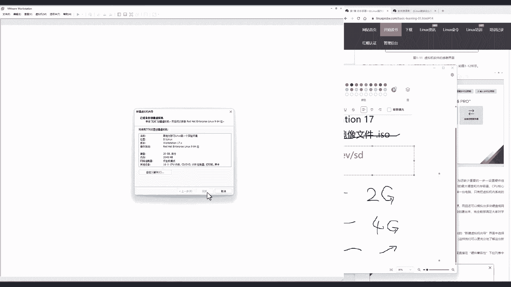

这个时候相当于什么呢，相当于我们走进了中关村，在电脑城里面一个老板说哎这个好这个好，这个好，给我们一个装机配置单，最后我们再一看张啊，最后我们来看啊，最后我们看一下这个账单啊，发现可能是上万了啊。

这个里边一定有这个老板加带了一些私货，怎么办呢，在开机之前，在正式安装LINUX，我之前不要直接下单啊，不要点击确认，点击一下编辑虚拟机设置，看看老板他最终都给了我什么了，就即便是我选择的是高级模式。

选择的是一个自定义，但是老板一定往里面加私货了，行不行啊，我们往下啊，那么那我们去过一遍，第一来讲就是这个内存，一切都在我们的掌控之下，在做这个实验的时候，把这个系统的性能发挥到极致来。

首先来说内存两个GB格够不够用呢，够用了哈，不要听什么叫忽悠啊，两个GB就够用了，他说嗯，然后我们的CPU啊，就是我们有单个的CPU是六个核心，够不够用啊，够用了好了够用了，那么这个以您实际为准啊。

接下来说硬盘大小20个GB没问题，我们自己选的哦，哦那我心里有数，接下来就是CD跟DVD，我们的光驱光驱需要安装系统镜像，这个时候就该选了，把它选择ISO系统镜像，找到我们下载好的系统镜像文件。

红毛real99。2版本，选中它好了，接下来继续网络连接，网络连接方式为金主机模式，没毛病，选择USBUSB不是我选的呀，USB谁要的呀，啊不是我是不是好，我选择一下移除。

因为USB do u的他这个选啊，因为它这个硬件对于我们来讲没有任何意义，它可能会导致我们开机速度慢，因为它会判断我们有没有这个，通过U盘来就安装系统，就呃就是因为我们后面会给大家去学习一下。

叫做这个PX1加k star，来就安装上这个操作系统，它会导致每一次开机的时候去检测这个U盘，反正也是也稍微慢一点啊，凡是我不需要的，我都把它给删掉，我选择一下移除诶，你看就立省200块钱。

再来看一下这个声卡，声卡建议把它移除掉，因为不知道同学们有没有之前操作LINUX的经验啊，特别的烦，就是当你去每一次去敲错某一个字符之后，或者点一下回车键，或者点一下这个退格键。

它总会有叮叮叮叮叮叮叮叮这样的这个声音，特别的让人烦躁，而且我这人去想事的时候，特别的需要安静，稍微有点这种声音，我这个思路就被打断了，所以声卡我就把它给移除了，立成200打印机，谁给我的，不要啊。

选择移除，OK那这个的话这个显示器还是要的啊，这个显示器要没有的话，那我们就那我们就看不到这画面了，好这一切的一切硬件就算是准备妥当了。

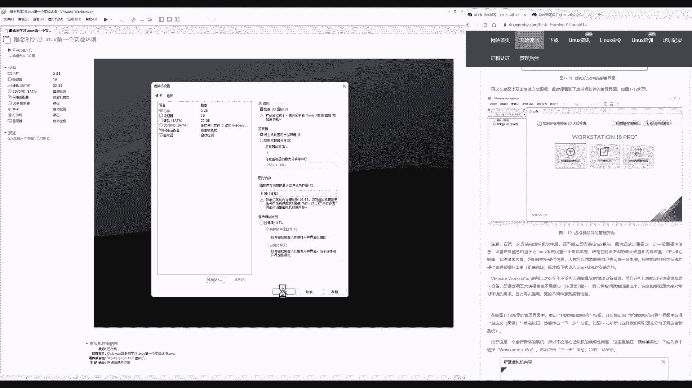

下单给老板，给老板钱，抱着电脑开开心心回家就可以来，怎么样呢，第二步了，安装上我们的红帽real9操作系统，可以安装了安装LINUX的操作系统。

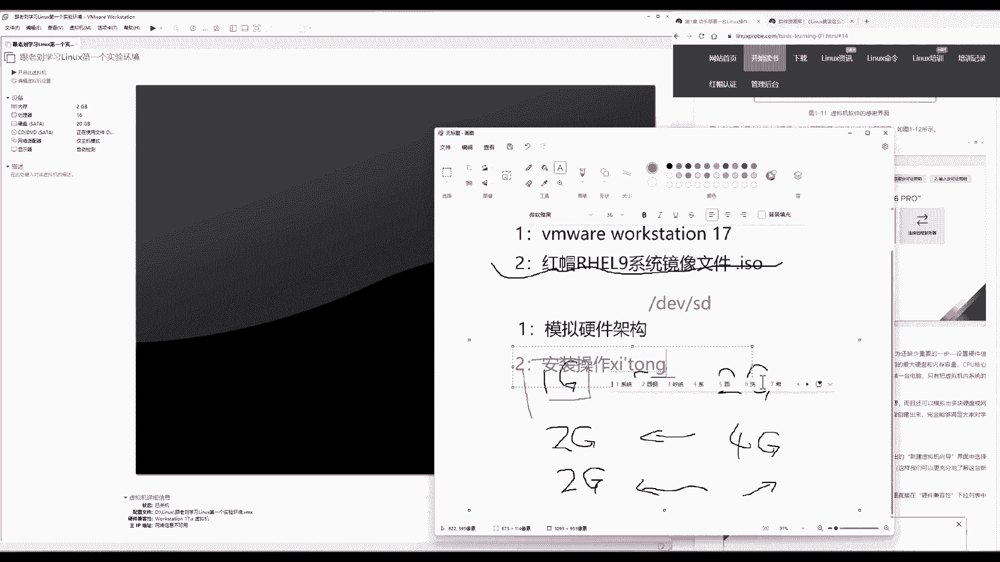

来选择一下开启此虚拟机，当然如果说您开机了之后，跟我看到的画面不一样看看，那么您就要看一看有哪些呃做错的地方好，看到这么一个界面，通过方向键可以来控制什么是方向键，就是您玩那个啊，就是啊。

就是我们可以看到在这个键盘的右下方，是不是有一个上下左右啊，就是我们去玩游戏的时候，常用的那个四个啊键啊，上下左右可以控制它，第一个选项叫做安装鸿毛real99。2系统。

第二个叫做测试红毛real9的这个系统，有没有被人修改过，并且安装上红魔ROO9的这个系统，第三叫做trouble shooting啊，这个我们放到最后给大家讲啊。

来我们放到我们这个呃课程最后给大家讲啊，可能会在最后的嗯第十集章节才为大家讲，那我们先去选择第一个叫做安装红帽，real9的这个系统。

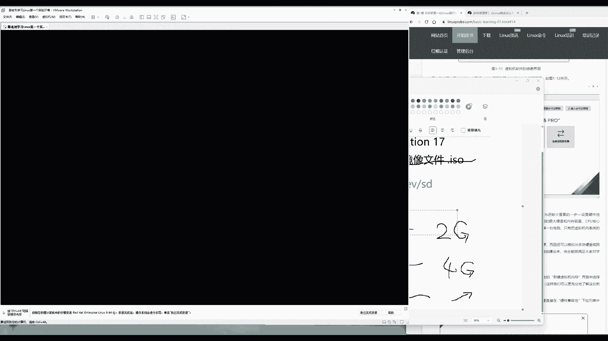

第一次看到这个界面的时候，我是很兴奋的，因为这个老早之前就有人聊到过，说黑客都用LINUX，然后以及的话那这个界面完美的去可以。

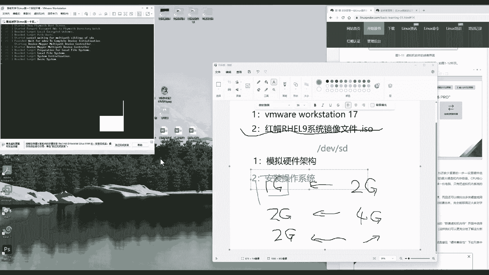

大家可以看一下这种感受啊，完美就是完美的贴合于当时我对于黑客的这种，嗯畅想或者叫做幻想，哎呀就是一个人，然后在这个电脑的面前，然后一顿再去输出，然后在这个电脑当中也是啊，也他也在不断为我们去输出很多。

这样的一个字符，就特别的酷啊，是不是来等待一段时间等等啊，等了一段时间，这个时候就可以看到homo reo9，的一个安装界面了，还是非常好看的啊，一个红包669的安装界面，我们选择下一步。

这个就是语言了，我们选择一下，下一步建议选择英文啊，因为中文的话呢，可能因因为我们就是，我们现在虽然可以选择这个，它是为呃中文啊，他们都可以的，但是你考试的时候他不都是英文嘛，所以现在先去适应一下嘛。

来下面有几个选项，不要嫌烦啊，大家有没有觉得第一节课我们讲的超级细啊，第一节课就要超级细啊，就是要超级细，觉得快的话可以八倍速，但是我们要讲的稍微细一点来，首先第一点就是键盘，键盘的话。

它都是这个英式的啊，我没有见过其他键盘，那么就是选择英式就好了，然后接下来语言的支持，如果说我们的系统都已经是，那那那都已经选择英文了，那您如果说您非得要愿意说，这个提示不包括报错之类的。

愿意中文的一个支持好吧，你可以选择上中文，没有关系，然后选择一下下一步，接下来选择一下系统的这个时间以及日期，那么你就可以选择中国啊，可以看到我们中国地区不论点哪儿，好像都是上海啊。

看一下好像都是上海对吧，看来这个外国人啊，西方人对于中国的认识还是上海啊，可能他们会认可的比较多一点，连北京都没有啊，这个话好看，那那那那那没有关系，反正中国也不分市区来选择上海。

接下来选择一下这个完成说，是否连接到这个红帽，这个就是红帽的RHN啊，收费的同学们不要管它，接下来据说这个啊安装的来源，那我们就选择本地的光盘已经默认选好了，我们只是看一眼而已啊，这个不用点。

然后接下来叫做这个software selection，就是我们需要安装什么软件啊，我们可以看到选择第一个叫做service之外，带有图形化界面的这么一套服务器的，这个好安装方式。

同学们会看到右边的话呢，所有的这个选项都没有去勾，都不要去勾，因为我们只需要这么一个框架就好了，里面这些选项，每一个比如这是我们的这个第13章，这是我们的文件传输服务的这个章节，还有我们后面每个章节好。

包括说呃来去部署邮件啊等等等等等，每一个这个服务都是我们对应的一个章节，不要把它提前勾选上啊，去享受这个快乐，后面会给大家去讲啊，会给大家讲每一个选项，然后到时候我们再去配置去享受这个过程。

如果说你把它都给它勾上，那么后面就没有什么可做的，特别就是就是那种超级超级超，就是啊超级傻瓜化了，超级简单啊，没有啥意义了，选择那就选择完成就好了，我们只需要一个框架，其他我们自己去发挥啊。

接下来叫做呃installation destination，就是安装到哪里去，其实他已经知道他是让我们再确认一下啊，全篇唯一一个需要我们去点一下这个红颜色的，看一下。

他说当前检测到的一个20GB的硬盘，你是否安装到哪里去啊，那不然呢就只有这么一个硬盘，我们刚才跟老板手里买的还记得吗啊，没有其他的了，选择一下完成好，接下来一个叫这个key dumb的服务。

我们选择把它给关闭掉，这干嘛用的啊，这个的话呢是系统如果崩溃了，那么我们的系统内核叫kernel，那么他会把这个信用内核里面的报错信息，然后收集到一起，然后接下来的话呢会给用户进行一个排错。

当前我们不涉及到它，所以我们因此把它给关闭掉，它会节省我们的512兆内存，多大一笔财富呢，所以把它给删除掉，如果说以后您需要了，可以再把它给安装上，没关系，但是这个期间您都是啊非常的这个呃勤俭持家。

来接下来说一下这个网络和主机名称，这个我们就无所谓了啊，先动手配一配吧，那首先来说主机的名称，我们就叫做linux prop downtom，那随便写下一个主机名称，点击一下应用，主机名称就变了。

同学们，我们建议大家此时都去修改一下，因为在第五章第六章的时候，会去使用到这个这个啊对应的名称，如果说您此处不想去使用我们的域名，没关系，你可以改成QQ啊，百度什么的也可以，但是你千万要记住了。

我们在第五章和第六章的时候，如果使用到这个复名称，包括说再用到这个邮件服务的时候，有一个叫做pose加double call的一个服务，再去使用到主机名称的时候。

您也一定要把主机名称给它改成百度或者QQ，如果您不能确定说到时候还能记得住的话，就把这个先给它改成linux pro，保持一致，来接下来呃配置网卡名称吗，以及配置网卡的一些参数可以配可以不配。

点一下配置，然后我们就可以在里面配置IPV4级别的，这个呃我们的这个地址参数了，不过不配他啊，我们不要配他，这个会在我们的这个第八章，第七章的时候会给大家去细聊，我们会给大家讲四种方法配置网卡参数。

此时不用陪他享受以后的过这个快乐的过程啊，现在不用第一天就把都给他享受了，那接下来叫做security perfect，就是我们的这个安全策略，不用管它，这个也是会给大家继续讲SLINUX啊。

会讲防火墙等等的，也会有，不用管，大概看一下就可以了，他说设置一下我们的管理员的密码好，那我给他设置一个密码就好了，设置叫做red hat，我顺手怎么了，叫红帽帽red hat。

这个就是我们管理员的密码，那么您可以自己去设置一下这个账号叫做root，密码叫做red hat，就是您自己去设置啊，不要以我这个呃，也也也反正也可以以我这个为准，然后选择一下完成选择一下两次确认。

他说这个有点超级啊，这个密码有点太简单了，那么您如果再确认的话，那么就再点击一下啊啊double check进行双次确认好，双子确认没有问题，那么到这个界面了，就心理上就可以踏实一半了啊。

选择一下这个lines begin installation，开始安装到这个界面，就没有什么能够阻止我们去使用LINUX了，来这个安装的过程大概需要10分钟，我呢先去喝口水，回来之后给大家去讲一下理论。

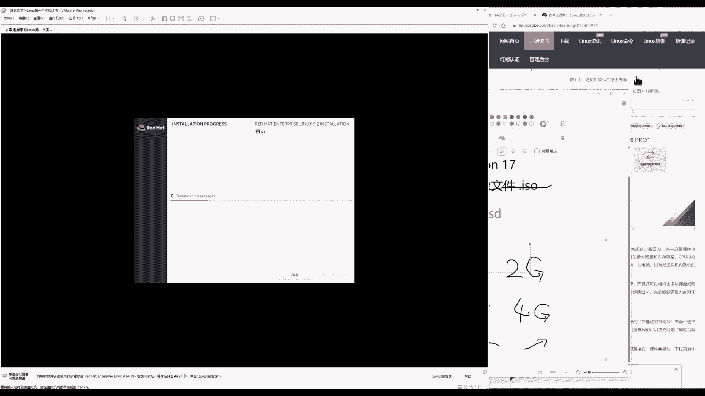

一边讲理论，一边看它安装，那我们就先来说一下这个第一个理论知识啊，就是如何在LINUX当中取代安卓软件，这个说起来就时间内比较早，在1970年的时候，根据gnu开放源代码计划。

以及这个GP呃黑发源代码许可，那么那我们根据许可证，什么叫开源程序，开源程序，你不就是说把这个程序的这个程序本身，以及程序的源代码来一起去提供给用户，这种服务方式嘛。

但是那也就是说gnu以及GPR的规范了，这个程序的作者有义务，必须要提供这个程序以及程序的源代码，但是你没有提供其他的我们，那我们也不能强求，比如说快捷安装方式等等，那所以在上个纪70年代的时候。

1970年的时候，要想去安装上一个软件会特别的麻烦，你只能拿到这个成或者这个程序的源代码，你要想通过源代码来进行编译的话，你就很麻烦，对不对，那你需要在你的本地部署出来那个程序作者。

他现在使用那个编译环境，大家能理解什么叫编译环境吗，我这个程序的作者是通过C语言去写的，这个程序的好，你要想使用这个软件，你也需要你在你的本地去呃，来呃呃，那么你需要在你的本地先不说去部署这个软件。

你需要先去部署出来这个C语言的编译环境，而且我可能利用了很多函数库，那么你都要自己去解决，那么这个是一个非常复杂的事情，那么你要想要想通过这个源代码来进行，编译的话，你需要有两个很难的这个问题。

需要给他突破一下，那你需要自己去解决，第一就是宾语环境问题，你需要有一个极其强大复杂的啊，以及是能够适合于我们这个源代码的，一个编译环境，说起来好像简单，实际上特别的复杂。

他这个在包括当中去寻找这个呃问题啊，是一个很痛苦的一个经历，如果您之前通过这个源代码进行，编译过程序的话，那您应该知道它分为几个步骤，比如说我们需要先下载解压，第二步来啊，那第二步我们需要进行编译。

然后第三步我们来进行生成，第四步来进行安装，就第二步他这个编译过程它老是报错，极其的复杂，它程序的作者利用了哪些函数库，他要是讲清楚在文档里面说明了更好，他没有说明的话，我们自己去解决这个问题。

然后批量的去排错，那个满屏就全都是那种报错符，哎哟妈呀，想想都有点头疼啊，第二个就是这个啊，需要自行去解决这个依赖关系问题，我来给大家讲一下这个时间线，同学们就明白了这个事，为什么程序的作者啊。

或者说我们这个再去使用到的那个系统去呃，来进行这个呃工作吧，他这个门槛是来它实际上也是在越来越低的，但是每一个嗯技术的创新，实际上也都是为了去解决上一个痛点，来给大家讲一下这个历史啊。

这个依赖关系也是一个很恶心的事情，就像我们现在使用那个微信群对吧，那假如说我要是没有微信这个主程序的话，我能用微信群吗，不可以对吧，那好了，那如果说我第一次去使用这个程序。

我怎么知道前面有一个微信这个主程序呢，在大型的软件当中，它这个相互的依赖关系是极其复杂的，它可能毫不夸张来讲，它可能依赖于几十十个软件，那么你需要把那个几十个软件都先给它装上，然后你才能安装这个主程序。

那就那就很恶心的事情，我怎么能知道呢，所以在上个世纪70年代至上个世纪的末尾，199几年的时候，安装了一个软件是特别麻烦的事情，所以再去使用它这个LINUX的，这个人实际上是不多的，很恶心。

就是这个很麻烦的事情很麻烦，可能你一天最后到头来啊，然后到那可能早到啊，那可能就是你早上起来下一个程序，到了晚上都没有把它给啊，就是你都没有给他安装上，就是到这种痛苦的程度，真的是毫不夸张。

如果您要是编译过源代码的话，应该知道啊，它分为四个步骤，第一先是下载和解压，这没得说，第二就是编译，第三的话就是进行生成，叫做Mac操作对吧，第四叫做这个安装操作。

然后第五我们可以先去清一下这个里面的垃圾，第二个步骤，这个呃呃再去使用到make的时候，经常会说是出错，我们需要去自行去解决这个依赖关系，以及这个编译环境很麻烦，那好那这样呢，那么既然有一个痛点。

那么就要有人去解决这个问题，那么是谁呢啊，首先第一个举手的就是这个红帽公司啊，红帽公司嗯，他想了一个办法，那既然来讲为什么痛苦，不，就是，因为我们每个人都需要在自己的这个电脑上面，去解决这套安装的环境。

然后我们进行一个啊，比如说他呃呃或者他利用了哪些函数库，我们需要自行按照这个顺序来进行安装吗，那好我能不能把这个程序的源代码好，大家听到这个思路非常的好，那我们将这个程序的源代码，加上一套安装的规则。

我把这个程序我们先啊在我的本地，然后呃呃呃，那也就是说，我们先在我们的本地去安装上这个程序，但我知道大概安装这个流程了，我把这个流程给他写出来啊，变成一套安装规则，把这套安装规则以及嗯。

我看一下画框框是用哪一个，那是你吧，嗯来，那也就是说我们将这个程序的源代码，以及这套安装的规则，我们打包到一起，这个就叫做rpm的这红包公司自己啊，先去提出来的这么一个技术，叫做红帽软件包管理器。

叫做red hat package manager，我们把它叫做红帽软件包管理器，这个技术非常的好，哎同学们一定要听明白了啊，而且到了这一步，实际上安装软件就没有那么痛苦了，它是可以让我们怎么样啊。

只要你下载好这个呃，那么呃那么你只要下载好了这rpm之后，你只需要去执行这个软件包，它就像是一个批处理一样，然后然后他就会帮你根据这套安装规则，然后来去对于这个源代码来进行安装。

所以rpm解决的第一个问题是啥啊，就是我们为什么要去省rpm呢，实际上他是为了降低软件的安装难度，它怎么样去降低的软件安装难度呢，它就是解决的第一个问题，就是它能够根据安装规则。

自动的去安装这个程序的源代码，这个是rpm的一大好处，这个还没有完哦对了，同学们可能会问到说老师，那这个呃能够举个例子吗，就是这个是什么样的一个场景，如果您要在百度上面下载过一些软件的话，你应该知道啊。

反正我刚刚去世，我在百度上面我下载了一个远程连接工具，那个远程啊那个啊远程连接工具特别小，因为我从谷歌上下载过大概才几兆，结果我从百度上下载了一个几十兆的，我也很奇怪诶，为什么呀，这是这个中国定制版吗。

里面加入了一些啊特殊功能，后来我安装上之后，发现里面居然还打包了一个游戏啊，就类似于这种东西，就是当一个压缩包，我们双击了之后，它里面它会自动的帮你去做很多很多事情，他不论好或坏，反正他总之他会根据呃。

它里面下好了这个规则帮你自动进行安装，那当然我们确实可能，这个运维人员对于这个就没有太多的监管了，但是这个很方便的一点，那好接下来再来给大家聊啊，这个软件的安装，那接下来还有什么呢。

就是这个em和DNF了，这个就解决了第一个编译环境的问题，诶那用户只需要去双击鼠标，拿动动发财的小手，那么好了，如果说我现在有一套依赖关系呢，我现在要去使用微信群里面那个群聊功能，那我现在要去解决。

首先我需要有这个微信，第二我要有这个微信群，第三我要有这个聊天功能，第四我还有输入法这些怎么去解决呢，那好了，红帽公司又想了一个折，那既然我们这个是一个零，既然我们在这个行业内有一个啊。

非常重要的一个地位，所以我们也也是有义务啊，然后我们为大家去谋求更多的福利啊，有点像是那个抖音里面卖货了啊，所以怎么样呢，他自己去拉高了这个行业的门槛，他又去写出了一个新的技术。

这个技术就叫做em技术来画出一个小框框啊，他的话呢，这个方式是把大量的常用的rpm软件包，也就是说把大量的独立的个体的这个软件包，比如说这个软件包它是微信主程序，这个软件包是微信群，这个软件是输入法。

这个软件是Q啊，这个里边是微信的群聊，好比如说他把一些功能的话呢，它给它放到一个大的仓库里面，这个大的仓库就叫做YM仓库，YM仓库跟rpm的关系，大家就了解了，rpm里面是一个一个的个体。

YM仓库是一个软件仓库，里面包含的是大量的常用的rpm软件包，这个时候用户你不需要再去说，你安装上什么程序了，你只需要去说出你的需求来，它会帮你自动去做，我想要用到这啊，我想要吃呃，宫爆鸡丁好了。

首先第一步诶，冷锅放油，然后第二步的话怎么样呢，炒花生米，第三步放鸡丁，第四放葱段，而根据顺序自动帮你去做啊，这个是两他这个有两点特别的好，他通过RPM自动的进行一个安装，它每一个环节会帮你去完成。

第二我们原本不知道他这个安装的顺序，我们要向啊，直接去使用这个微信群是不可以的，你先要先微信叫微信群，叫数法，怎么样的，这个顺序你也不管了，你只需要去说出自己的需求来自动帮你去完成，这就是YM的好处。

YM的技术，它又一步去降低了软件的安装的难do啊，它通过什么方式呢，通过的是自动解决软件包的依赖关系，来给大家写出来啊，这个特别好，咱们这个历史一下就讲明白了，原先是使用的源代码，特别的痛苦啊。

就是啊就是看完了之后，就瞬间让你就是对于这个LINUX毫无兴趣了，而且特别的恐惧啊，就像呃就像是一，他是因为这个确实，原先要想让我在这个LINUX里面安装上一个程序，就像讲一个鬼故事一样啊。

这个活儿我一般是不敢接的，如果要是没有一个详尽的文档的话，后来的话有一个rpm的红包软件包管理器诶，进一步降低软件的安装难度，他记住了，他是为了去降低软件包的安装难度，它的方式是怎么样的。

就是啊自动的根据安装规则来进行安装的，第三就是这个em em的话呢，后来他发展了它发展了1233个版本，它是从上个世纪呃9年代开始，1993年的时候发布了红毛瑞呃，呃他当时是在1993年的时候发布的。

red h9版本，后来到了这个2015年的时候，到了红毛REO6系统发布，到最后他一共发布了三个版本，特别的好使啊，但是他有两个致命的问题，他也就是说他分配了三，它进行了它进行进化了三个版本啊。

啊这进化了三个版本啊，他也当然他也呃他非常的好使，但是他也同时有两个问题，就是非常致命的问题，他是无法解决的，第一的话呢就是debug系统的这个用户，经常嘲讽我们LINUX系的这个呃呃技术什么的。

就是它非常的臃肿，他总会去安装一些没有必要的一些东西，比如说我想吃宫保鸡丁，你非得给我撒点芝麻这种感觉，我想去安装一个程序，它总会把一些程序不相关的软件也会安装上，我认为它它它就它这是一个算法的问题嗯。

但是呢他确实比较臃肿，第二的话他是不能够同时多人进行安装的，我想吃宫保鸡丁，他想吃啊，鸡小果司，这两个人虽然你有十个厨子，但是你只能同时炒一个菜，这特别的麻烦啊，这是非常致命的一个缺点，效率很低。

我再去使用这个YM的时候，我的同事同时在登录这台服务器，他再去使用YM的时候，他用不了了，这是一个很还我，我也不知道为什么，这个问题就是到最后都没有解决，后来怎么解决呢，后来变成了DNF。

DNF实际上就是YM它的一个D4版本，我们可以看到了红包的这个文件里面，实际上DNF就是YM的V4版本，后来改了个名哎这么来的DNF的话呢，它也可以理解成就是一个软件仓库，它就是YM的第四个版本。

它里面依然包含是大量的常用的rpm软件包，你只需要去说出你的需求了，他就会帮你自动去进行安装，特别的方便，大概给大家聊一下，大概大家聊一下，这个的话呢，就是我们再去呃呃安装软件，我们去使用软件包呃。

今天安装的三个方法，第一就是原代码，第二就是rpm，第三就是YM或者DNF，在红包六九当中，我们使用的是DNF软件包的安装方式，它解决了EMV3版本的两个问题，第一就是安装比较臃肿。

所以哎呀说起来有点呃呃有点就是没有，其实没有没有太多感觉到，因为我们也是从红毛瑞五开始去使了啊，所以实际上他说解决的这个臃肿的问题，但是说实话我们没有并没有感知到，明显的安装软件包的速度。

都有有有有多大提升啊，这确实没有，然后但是它确实能够支持多人同时安装了啊，以及的话这是一个不可逆的进程，因为红包6O9人就支持DNF，那我们就用就好了，好这就是我们给大家给大家说一下。

这在LINUX里面安装软件包的三个方式啊，三个方式主要是为了这个，等待我们LINUX系统的安装完成嘛，所以我这个理论给大家简单普及一下就可以了，简单普及一下，这个不用去记命令，不用去管命令。

等到下一回我们去使用的时候，这三个都会给大家讲，三个方式都会给大家去讲，来大家看一下，就是这个呃去使用到YM也好，DNF也好，大家可以看到了，你只需要配置出来一个软件仓库，这样的话呢。

每一个人都可以去连接到这个软件仓库，然后来进行软件包的获取以及安装，去使用YM或者叫DNF吧，那它有三种，它有三种提供方式，第一种就是网站的HTTP，第二就是文件传输服务器的FTP。

然后的话呢我们每个人就像去饭馆一样，每个人都可以去饭馆哈，那我们现在有四个客户，1234，然后去吃饭去了，去办劳了，是不是我们如果要是足够有钱的话，也可以请一个厨子去自己家里面。

然后像保姆一样为我们做饭呢，自己家，那我们自己在家里吃啊，自己给自己吃，然后这个的话呢叫做本地提供方式，叫做file提供方式，这个到时候都给大家聊，都会给大家聊哦，好继续啊，说一下这个下面一个理论基础。

今天打理论基础啊，主要的目的还是为了以后听课就轻松了啊，然后今天正好把LINUX东西给它安装上了，两全其美，哎挺好理论啊，还有这个实操，我们基本上每天都会有啊，也是一半一半吧，一般上来会先讲理论。

然后再讲实操，这样的话知道呃为什么这样去做啊，这样会更好，来接下来讲一下这个初始化进程，初始化进程也有的聊，但我稍微快一点，因为这个同学们嗯理论基础嗯，不用太就嗯不这个也不用去背。

当然啊对应的命令可以背一背，就是这个实际上这个出来进程啊，他在红毛456里面是啥呀，红毛456里面也就是在截止到2025年啊，不呸啊，他是在2015年之前的话呢，在红包456里面这个叫做INIT啊。

大家可以记一下笔记，红帽456里面的初始化进程叫做INIT啊，什么叫初始化进程的初始化进程是啊，当我们有一台这个服务器，然后按下这个开机键之后，直到我们用户看到的这个登录界面，它这个呃过程当中。

他所做的所有的事情都叫抽出化进程啊，这个红毛润这个是在红包real系统当中的，456都使用的是一个NIT，那为什么要聊这个呢，这么多的程序为什么要聊这个呢，因为在这个对比红帽七跟八九啊。

这个三个这个版本的话呢，跟老版本的这个呃，real系统456最大的区别就是初始化进程，因为命令来讲实际上是没有什么变化的，就是在我们这个随便找一台服务器，然后去执行某一个命令，比如说IOS啊什么的。

去查看一下文件什么的，都没有什么变化，同学们你们感知不到的，但是在红包七开始，789开始初始化进程的变化，导致了很多命令的变化，它的这个根啊就是这个抽查进程变成什么呢，红包REO7在2015年之后。

他变成了3月份啊，他发布了红包REO，其具体时间应该是3月31号，发布了这个红包路由器了，之后，由INIT这个初始化进程变成了CSMD，这就变就变了呗，对吧，大家可能想那不就是一个开机过程的问题。

他不但是他并不是的，因为我们去搜了一下呃，看了一下文档，2015年3月份的时候，查了一下文档，这个cs m d它不仅是初始化进程了，他从你按下开机键到了这个，看到了界面还没有结束。

这个初始化进程会一直伴随你，到这个系统的关闭，这个技术一直用到了789结束，那么想他一直会驻扎在我们这个系统当中，作为叫做守护进程，我们叫做demand，叫做守护进程，那他干什么事了呢。

他那么他就一个幽灵一样看着我们，他并没有，他去接管了我们的服务的一个管理方式，所以就给大家总结一下，就是红帽的789版本，对比说456版本最大的变化，就是对于服务的管理方式的变化，它的根或者它的这个呃。

发起者或者他这个变化的，但它变化的一个根源就在于，说实话进程我们可以看到的，如果要是一个早哦，我给大家总结一个笔记吧，总结一个笔记不能光说啊，456456版本，然后还有那个789版本。

它的一个对于服务的管理方式的一个变化，首先嗯速六版本要想去起一个服务，那使用的什么命令呢，叫做service，然后后面我加了一个服务的名称，比如说嗯就是SH吧，就反正有这么一个服务，然后是start。

这是去启动一个服务的方式，在789里面的话呢，就变成了system，不是cm d了，cs m d是我们的这个进程的名称，也是我们的服务的名称，它用来控制的话叫做control Ctrl。

接下来去启启动一个服务，大概就是这么一个方式，好大家可以来啊，我们应该叫做SHD啊，因为SH是一个协议名称，SSHD才是一个这个SH是协议的名称，SHD才是一个服务的名称，不好意思啊，生疏了。

感觉这不是手的问题啊，这是感觉脑子的问题哎，反正一个小错误来，同学们可以记一下笔记，然后同时的话呢我来去后面写下它的这个功能，这是代表的是启动某个服务的一个功能，我就这样吧。

大概给大家总结个六七条常用的命令，今天的话呢既然刚刚安装上LINUX，但是以后的每节课当中都要去管理到这个服务，我就干脆啊，就是有点嗯也是有点提前，我就来给大家讲一下，对于负的管理命令，它对应的有哪些。

同学们先混个脸熟，等到后面再用的时候，大概能够猜得出来它这个功能就可以了，嗯今天这个理论知识吧，利用这个安装系统的时间，给大家简单普及一下好，第二个就是去关闭一个服务。

那么就是service来一起来说吧，在service那就确实很简单，它不就是后面那个词改了一下吗，you stop变成它由start变成stop了，后来要想去关闭一个服务。

在红包789里面那才叫做staff SSH d，就因为有同学就是老师在问我说了啊，是那个老师，如果说我拿到了一台老版本的服务器，那如果有一天我不会用怎么办呢，不会的，因为它命令都是通用的变化。

就这么点东西，除了这个以外，我还真的很难再给你找出更多的来，他们用的都是通用的，就这么点变化啊，所以我今天就是用这么10分钟的时间给同学们，把这20年的变化总结出来了，但是这个有点不太严谨啊。

有一些小变化，到时候再慢慢细聊，那s h d restart代表的是重启一个服务，我把它写完，同学们可以照抄到书上面，到时候如果要用到的话，比如说我现在突然间说需要去重启某个服务了，那么赶紧嘎嘎嘎一查。

特别的方便啊，代表就是去重启一个服务，另外在这个红包路由器开始，RJC的这个考题的变化，同学们应该也看到了，因为你可以在学员页面里面看到那个考题嘛，我给大家聊一下，在这个红包2567里面。

嗯啊不在红包456里面，他的RTC考核的数据与服务的一个管理能力，它的这个难度的话呢是比较还是比较大的，它也不存在说刷题这种可能性，但是在红帽789里面它是存在的，因为它主要是考INCIBLE。

然后它会考到一些呃固定的服务，这样的话呢我们是有一些技巧可循的，这个先给大家聊聊啊，这也是一大变化之一嘛，既然聊到变化，还有我我我，那我再想一想啊，接下来是说叫做重新加载啊，叫叫做重载服务。

大家能理解什么叫重新启动或者叫重载吗，我其实一开始我也不太理解什么叫重新加载，Restar，什么叫重新加载reload，Restar，Reload，重新加载有什么区别呢，我给大家讲啊。

如果你要想在那里啊，就是你当你再去配置一个服务，然后你要想在这个LINUX里面，然后它能够让这个配置好的参数立即生效的话，那么你就要需要去重启，或者需要去重新加载一下这个程序，然后才能够让它配置出来的。

这个新的参数能够生效，这个是在windows里面，好像是没有吧啊，或者可能比较少，那么就面对这两个问题了，那如果说你在重启的过程当中，你需要一秒钟重启，还没太大问题，如果我一旦重启。

比如像我这个服务器的MYSQL可能就需要十多秒啊，可能就是从关闭到启动十多秒，十多秒啊，十秒钟可能也嗯做不完，那好了，那么就会导致这个服务的一个中断，那么好了，我那么当我想要让这个参数能够立即生效。

但是又不想让这个服务中断，那么就可以使用到reload啊，这是在这个哦功能上的一些区别，那么从这个体验上来讲的话呢，就是每个程序它都会有一个PID的值，叫做程序的进程id，那么我们当句重启的时候。

它实际上就是一个关闭在开启的一个状态，程序的p id会发生变化，如果说想固定一下程序的pad值，让这个程序的pad值也不要发生变化，第二个好处就是去使用到reload，他不会去重启程序的PID啊。

等于说这个值也不会发生变化，因为它程序没有重启嘛，好接下来再给大家继续聊哦，star啊，开启关闭啊，我看一下开启关闭好，这个好，这最后一个最后一个今天上来先让大家背，先让大家背一背命令啊。

当然同学们放心，老刘有讲课，从来不让大家背命令，这种情况是非常少见的，这种情况是非常唉少见地啊，让大家去背诵东西的这种情况来，现在大家可以截张图了，这是非常准确的，这代表的是查看服务的一个状态。

如果一个服务我们你怎么知道他有没有启动呢，啊还是已经关闭了呢，那么这个时候你就可以执行这个命令，就来进行一个查看啊，查看一下负责这个状态，那另外的话我们看一下书上面的第一章节。

还给大家讲了一下该如何重置一下用户密码，这个我们就直接跳过了，这是按照这个啊章节内容来进行划分的，怕大家找不着，所以才放到第一章，但是这个里面由于涉及到了一些命令的执行，我们现在就不给大家去讲了。

我们会在这个红毛的H3C可行辅导章节，会讲到如何去重置用户密码。

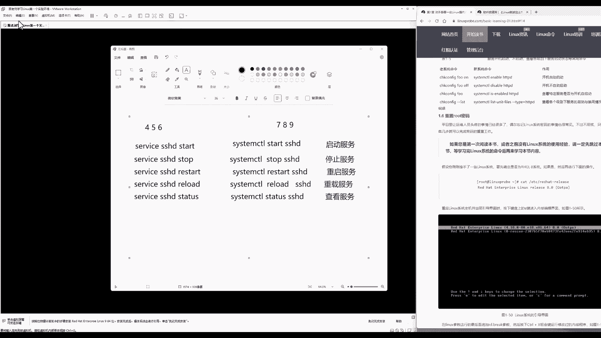

那我们就直接把它跳过来看一下，这个操作系统就应该已经安装好了诶，非常好嗯，接下来重新启动一下这个程序，它可以看到了程序已经安装啊，complete完全成功呃，完成了，只需要去重启一下。

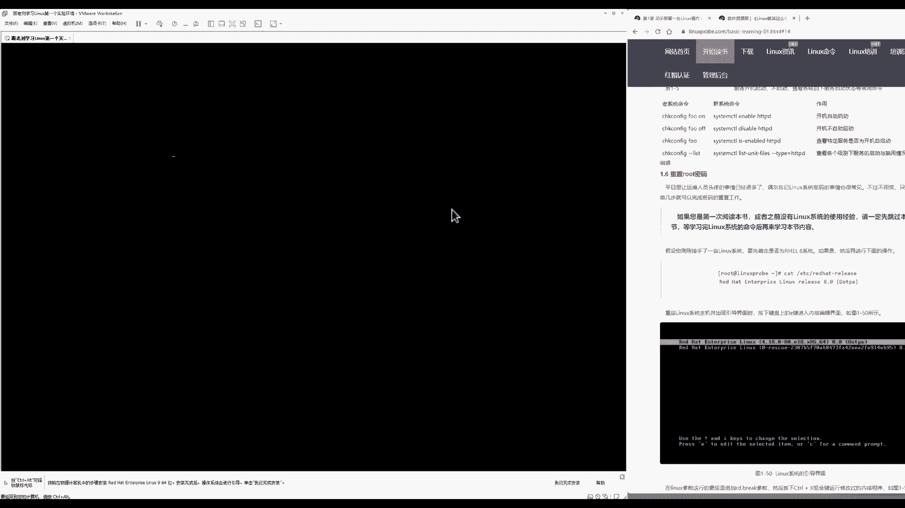

大概还需要再重启两次吧，我们这个系统就算是正式的安装成功了，一点都不难，一点都不难，在安装红帽real5的时候，哎呦我心情特别的激动，当时还是一个红颜色的界面，就感觉激动的跳哎。

就感觉就感觉心脏都要跳出来了，在这个红包六九这个界面做的是非常的美观啊，感觉一切都在近，就在就是呃尽在红毛的掌控当中一样，就是给人一种特别的舒适的感觉啊，在红包热舞那个阶段。

为什么会很紧张的心脏都要出来呢。

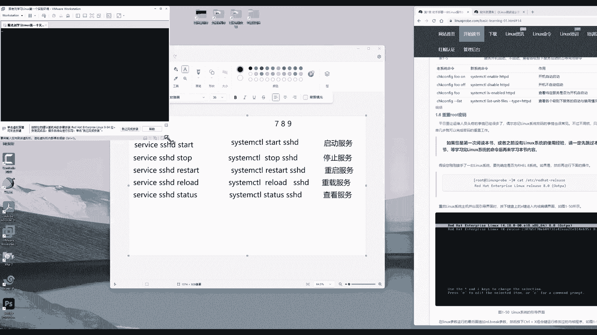

因为老报错，老会出现问题，哎当时是通过光盘去安装的。

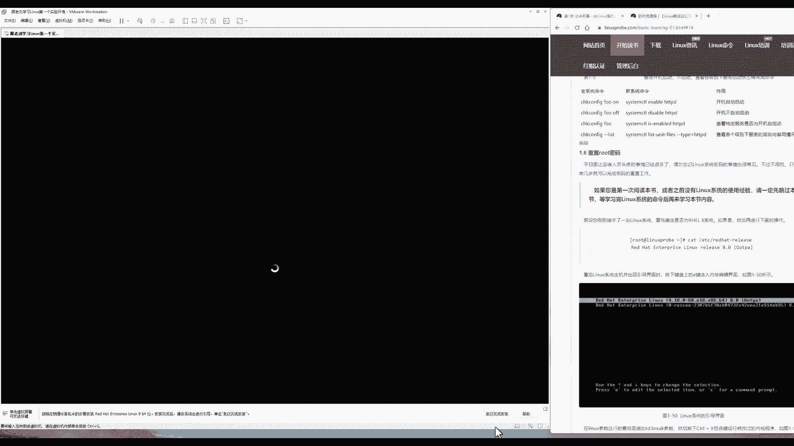

我第一次安装鸿毛real啊，我是想011年，如果没有记错的话。

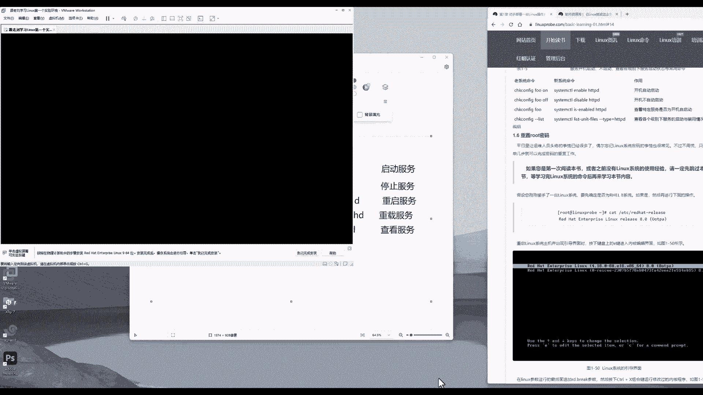

当时呃去安装了一个红包REO5，再往前走，应该是2008年的时候，那会儿还在上学嗯，当时的话呢去买了七张光盘，叫做呃呃red hat linux9的啊，那就是最开始那个bob样，他发布的个人版。

他的这个LINUX当初买了七张光盘，怎么装都装不上去，不跟大家开玩笑，那个系统我装了一年啊，后来我就没再学了，我也就没有兴趣再去做了，因为系统都装不上，那还学个毛啊，后来发现啊，就是那个光盘被划掉了。

所以才没有安装上，如果要是那会儿早学的话，那估计可能现在唉可能接触的就会更早了，可能会早三呃，还有可能会两三年，这个是这就感觉这个命运非常的这个啊奇妙啊，好呃，废话不多说，就启动好了，又启动好了。

我们现在的话呢需要做的这个事情，就是点一下这个看到一个欢迎界面。

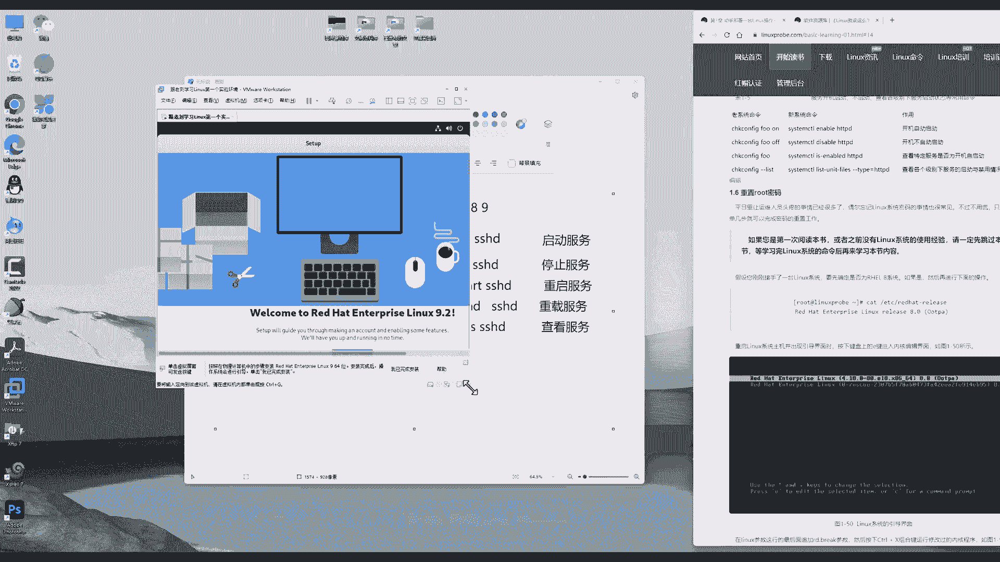

他说欢迎你去使用一下这个red hat enterprise linux，欢迎你去使用一下红包real9的这个系统，可以看到的话呢，实际上这个还是有点bug的，大家发现了吗，就是这个呃17版本的虚拟机。

你看到它其实好像哦。

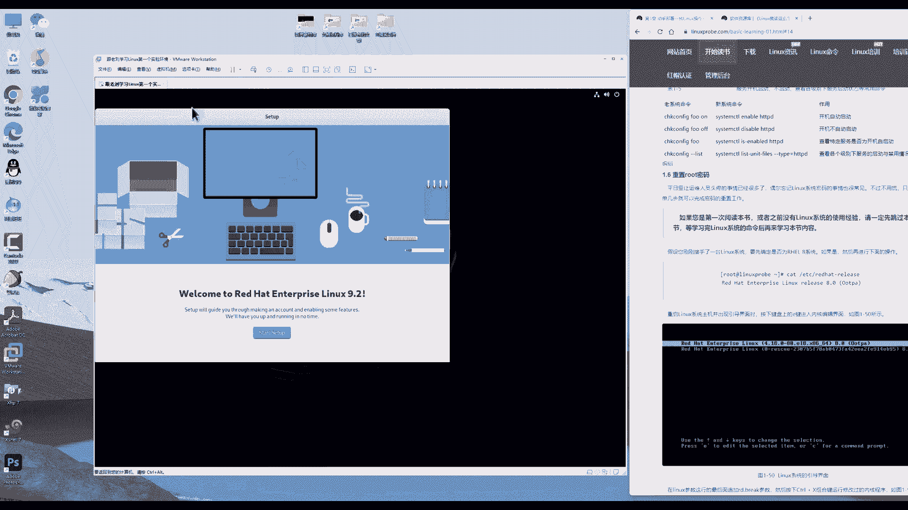

不好意思啊，这是我的那个呃呃呃这是我的问题啊，OK啊他看来没有问题，因为我还以为他就只有这么小的窗口呢，原来他这个背景是黑颜色的好，那我们就点一下启动啊，然后看一下，他说有一个隐私啊。

他说我们尊重你的隐私，然后你是否启用这个本地的地址服务呢，就是如果你要是想让大家知道你在哪的话，你就选上它，其实这也无所谓，因为我们没有联网啊，这个叫做金主机模式，没有网，我们选择下一步。

他说请输入一下你的这个姓名，以及你这个用户名，这个无所谓了好吧，那我就叫做linux from1，你要是不输的话，他不然你的下一步啊啊就是叫做linux pro吧，那OK我们选择下一步。

他说请设置一下你这个普通用户的密码嗯，我突然间想到这是不对呀，我们不是有管理员吗，为什么要有一个普通用户呢，因为在去按照理论上来讲，长期使用管理员啊，它可能会导致这个系统的不安全。

他推荐你使用一个普通用户的身份，来去管理这个服务器，但是也有一个反向的问题，就是他为什么安全呢，不就是因为权限不足吗，那如果说我们去使用到这个普通用户，去管理这个服务器。

那么就导致有一些服务如果要是报错的话，我们第一次学习的同学，你们根本就不知道到底是命令执行错了，还是你的权限不足，所以好，我们待会儿先把这个用户，先把这个用户给他创建出来，他既然必须要我们创建出来吗。

那么账号就是linux problem，密码就是red hat，好我们点一下，下一步，他说呃所有的一切就都已经是配置妥当了，那么接下来你就可以去享受你的这个，LINUX之旅了啊。

这个还给了一段欢迎的话啊，就是说啊当你要想去学习LINUX的时候，你可以去找一下这个老刘去参加一下这个培训，如果说你要这是一个盗版视频啊，那你最好支持一下正版啊，去找老刘交2400块钱好。

我们点击一下付款。

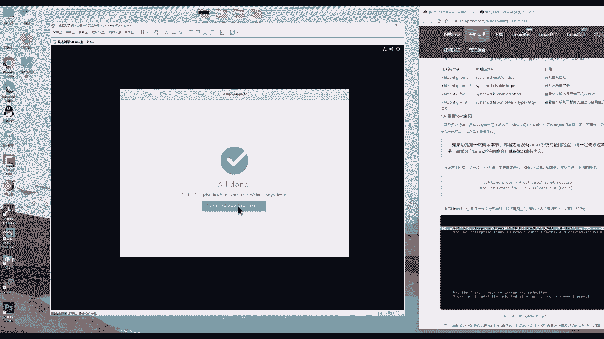

就可以进入到这个界面当中了，见面之后，我刚才给大家聊到了啊，这是一个普通用户身份。

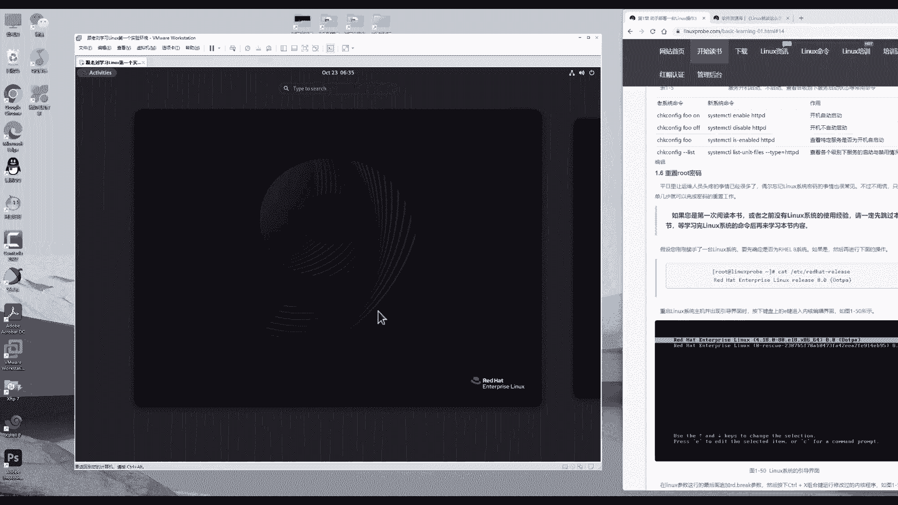

如果要是以后出了错了，那到时候还有什么啊，开启你的什么啊，反正就是它有一些嗯非常简单的一些介绍吧，并且这个功能不就是那个苹果电脑里面有一种，三指触控吗，好吧，这是总之现在这个呃红帽公司做这个LINUX。

做的图形化界面做的是越来越好了，好那我们接下来聊啊。

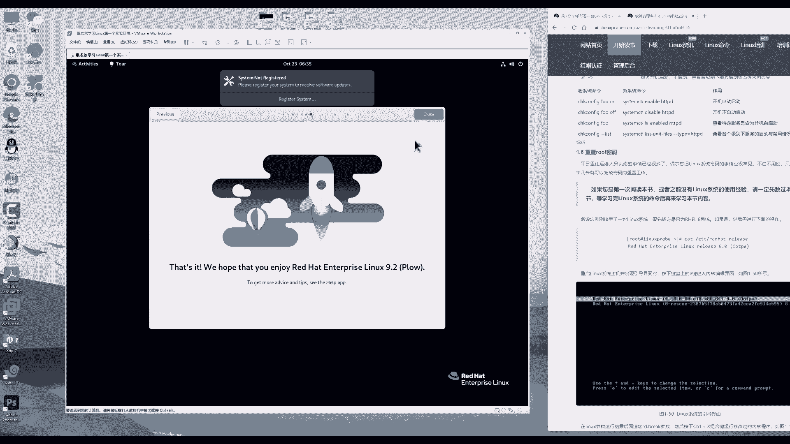

就是现在刚刚讲到了这个权限的问题，所以我们推荐大家，第一来讲就是管理员密码的话呢，没有必要那么复杂，因为你虚拟机都没有联网，第二虚拟机里面它都没有重要数据无所谓，第三个来讲。

就是我们推荐大家去使用一个普通用户，呃，呃哦不，第三就是我们推荐大家使用管理员，登录这个服务器，这样的话呢以后到时候要是出了错了，我们知道肯定是自己配错了，不会说是这个权限的问题。

来我们选择一下这个power of或者这个lock out，就是选择这个退出。

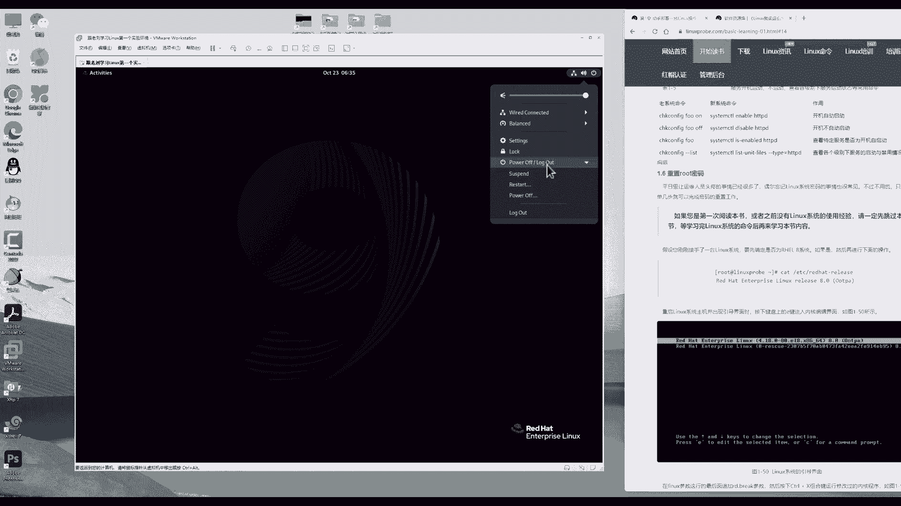

然后选择log out，就是选择一下这个退出，看到没，我们先登前登录的是普通用户。

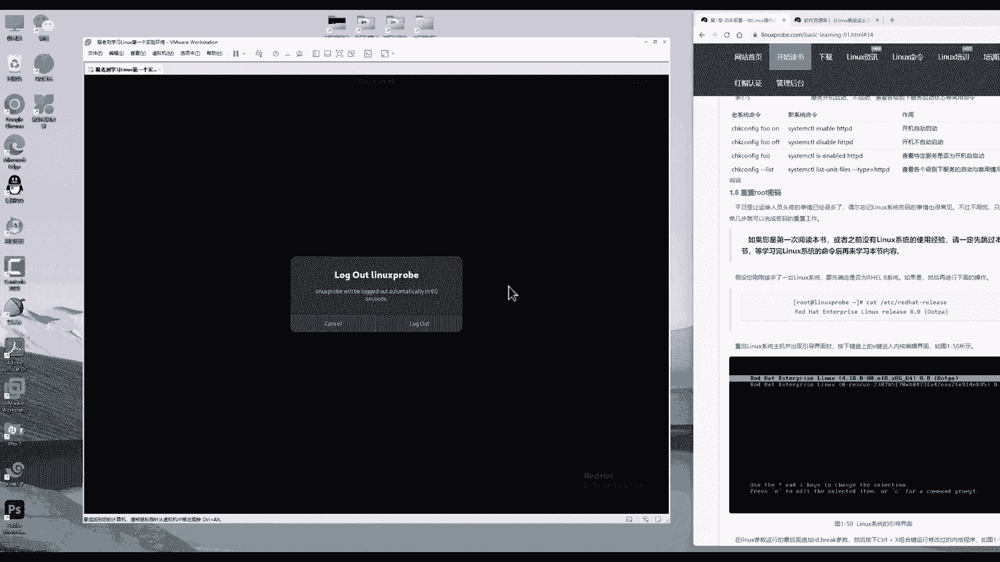

我们选择log out，同学们一起来操作，这点很重要，从今往后，从今往后的任何一个这个实验，从今往后的任何一个实验，在默认情况下我们全都不使用普通用户，选择这个没有被列出好了，我不再强调了啊，好吧。

就是在此输入账号，root密码是你安装的时候所输入的密码叫做哎，等一下啊，按一下回车好，密码的话就是ride heat，按一下回车，密码是我们安装系统的时候所使用的，使用这个管理员的身份。

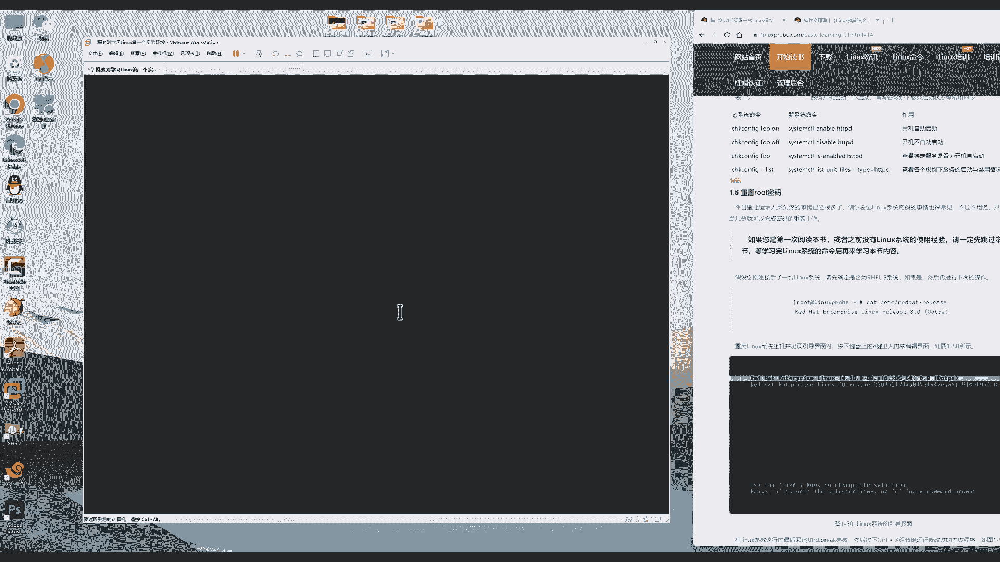

再去重新的登录到这个系统当中。

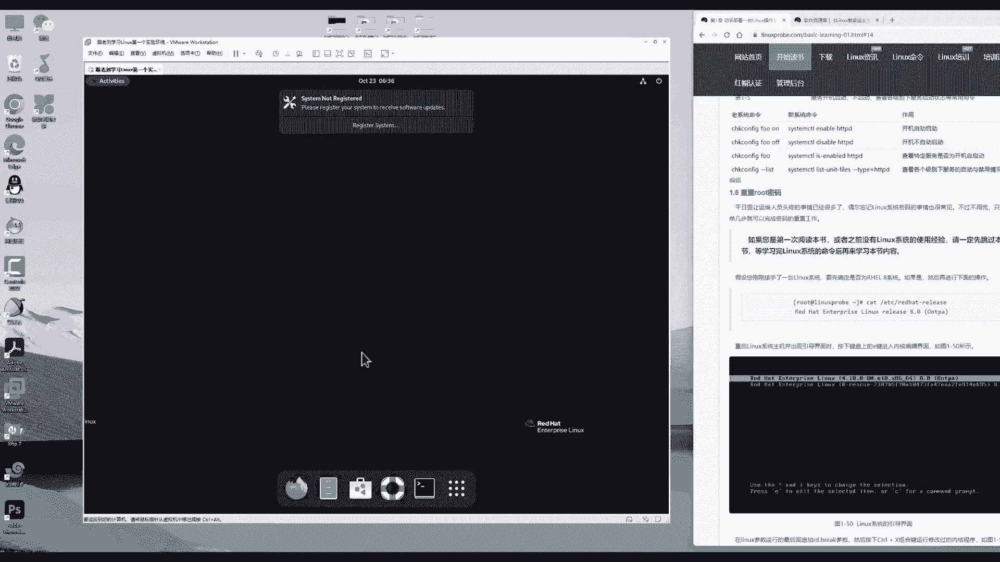

接下来去完成我们接下来的这个实验，但是同学们也不用担心说老师，那你现在教我们去使用管理员去完成这些实验，那到时候我们在工作的时候，如果不安全怎么办呢，没有这个问题，工作的时候你使用不难啊。

那么呃那么你在工作的时候，可以去使用这个普通用户的这个身份，不就完了吗啊，因为你到时候工作的时候，你愿意用什么身份就用，那么就可以用什么身份呃，你也不会太去依赖于管理员这个身份。

因为我们会在第五章节时候，学习一个叫做这个速度的一个命令，也可以让我们在这个用户的普通用户，这个身份下去执行管理员的这个命令，是可以去实现的啊，但是首先我们要先学，还没有学到之前。

还是啊去使用管理员的身份去完成。

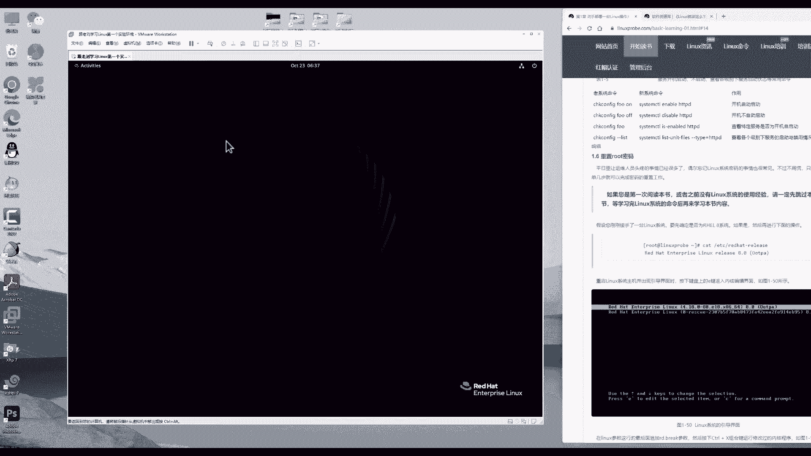

来给大家总结一下我们今天的一些问题啊，首先就是必须要去今天这个课总结一下，就是必须要安装上这个LINUX的操作系统，我们具体来讲就是RHELL，就是我们的红帽耳呃，企业版九版本。

这个是必须要安装上这个操作系统的好，再往前一步就是必须要安装上这个虚拟机，虚拟机的这个版本，刚才讲到的一个原则，就是它可以稍微的嗯版本需要新一点，但是千万不要低于17版本，可能会造成不兼容的这个可能性。

我们推荐大家使用的是这个威廉威尔workstation，虚拟机，如果说你想要哎呀，比如说嗯你想要去使用叫virtual box可不可以啊，啊也可以啊，然后如果你要想去K，比如说要想去使用KVM。

可以可以，那可不可以呢，也可以，虚拟化的平台无所谓，虚拟化的这个版本的话呢，最好是17以上就完了，然后您去安装的时候，只要能够安装上我们这个红包，这个REO9的系统无所谓，您使用什么平台。

任何平台都是可以的，好吧，同学们第三点去登录到您的这个系统当中，去使用管理员的这个身份给大家留一写作业，找到终端功能这个窗口找到诶，使用管理员，找到terminal。

如果你是因为如果大家安装系统叫做这个啊，没有中文的话，那么如果是英文的话，找到这个终端terminal，那么它会叫terminal，在这么一个终端找到它，马上我们就要给大家讲到。

如何去使用到LINUX的命令，以及什么是终端，下节课给大家来细聊一下，好就这样，同学们可以先休息一下，正好一个小时时间管理大师来，大家也可以休息一下了。

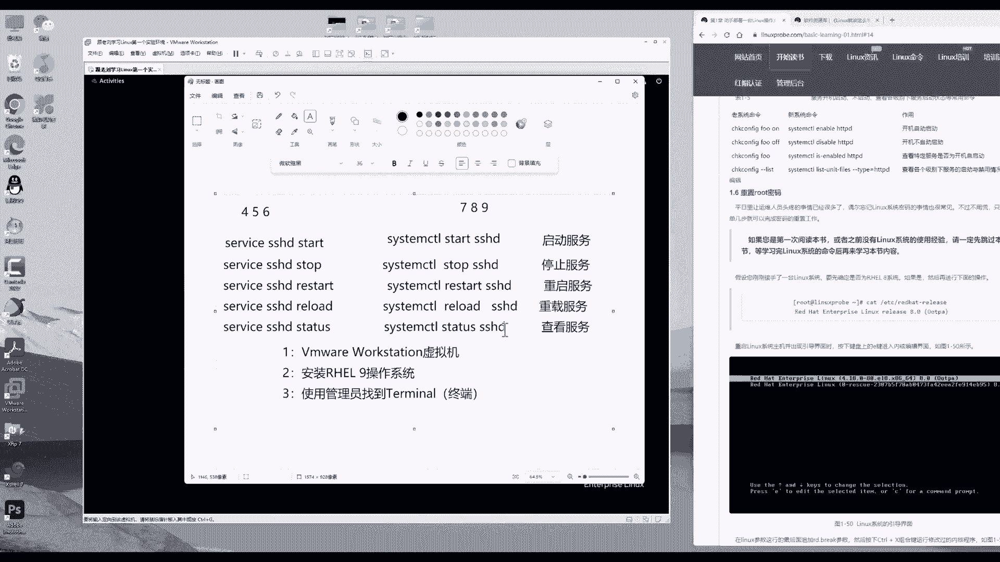