# Linux就该这么学：第1章：动手部署一台Linux操作系统 🖥️

在本节课中，我们将学习如何在电脑中安装虚拟机软件，并在虚拟机内安装Linux操作系统。同时，我们也会了解如何在Linux中安装软件，并对比红帽RHEL 9与老版本系统在服务管理方面的主要区别。学完本章后，你不仅能准备好后续课程的实验平台，也能从容应对生产环境中可能遇到的老版本Linux服务器。

## 虚拟机软件介绍与安装

上一节我们介绍了课程目标，本节中我们来看看如何准备实验环境。首先，我们需要安装虚拟机软件。

虚拟机软件的核心功能是在一台物理电脑中模拟出多个独立的虚拟操作系统。这样做的好处是，我们无需为每个实验购买多台物理设备，并且可以快速创建、还原实验环境，极大地提高学习效率。

以下是安装虚拟机软件的具体步骤：
1.  下载虚拟机软件。我们推荐使用VMware Workstation，版本建议不低于17。
2.  运行安装程序，按照向导提示完成安装。过程非常简单，类似于安装普通软件。
3.  安装完成后，可能需要输入序列号激活。你可以选择试用，或自行搜索有效的序列号。

安装好虚拟机软件后，我们就有了创建虚拟机的平台。

## 创建虚拟机硬件环境

安装好虚拟机软件后，我们并未看到Linux系统。这是因为我们还需要模拟出一套虚拟的电脑硬件，就像去电脑城装机前要先确定配置单一样。

以下是创建虚拟机硬件的详细步骤：
1.  在VMware中点击“新建虚拟机”。
2.  选择“自定义（高级）”配置，以便详细了解每个硬件选项。
3.  “硬件兼容性”选择最新版本（如Workstation 17.x）。
4.  在“安装客户机操作系统”时，**务必选择“稍后安装操作系统”**。如果选择使用镜像文件安装，虚拟机可能会采用简易安装模式，导致后续实验环境不一致。
5.  客户机操作系统选择“Red Hat Enterprise Linux 9 64位”。
6.  为虚拟机命名（例如“我的第一个Linux实验机”），并选择一个安装位置。建议安装在固态硬盘上，且所在分区剩余空间大于40GB。
7.  处理器配置：根据你物理机的CPU核心数进行设置。可以通过任务管理器查看“内核”数量。
8.  内存分配：遵循一个小口诀。若物理内存小于2GB，为虚拟机分配不超过1GB；若物理内存大于等于4GB，为虚拟机分配2GB即可。
9.  网络连接：暂时选择“仅主机模式”，具体区别将在后续网络章节详解。
10. I/O控制器类型选择“LSI Logic”。
11. 虚拟磁盘类型选择“SCSI”。
12. 选择“创建新虚拟磁盘”，大小设置为20GB，选择“将虚拟磁盘拆分成多个文件”。

配置完成后，先不要启动虚拟机。点击“编辑虚拟机设置”，像检查装机配置单一样，移除不必要的硬件以优化性能：
*   **CD/DVD**：在此处加载你下载好的RHEL 9系统镜像文件（.iso后缀）。
*   **USB控制器**、**声卡**、**打印机**：这些硬件对当前实验非必需，可以移除，以避免不必要的系统检测和干扰。

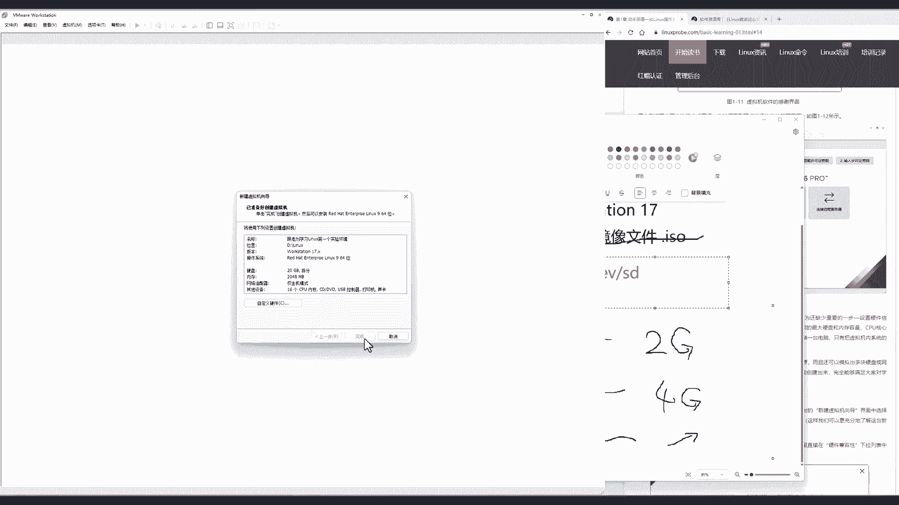

至此，虚拟机的“硬件”就配置妥当了。

## 安装RHEL 9操作系统

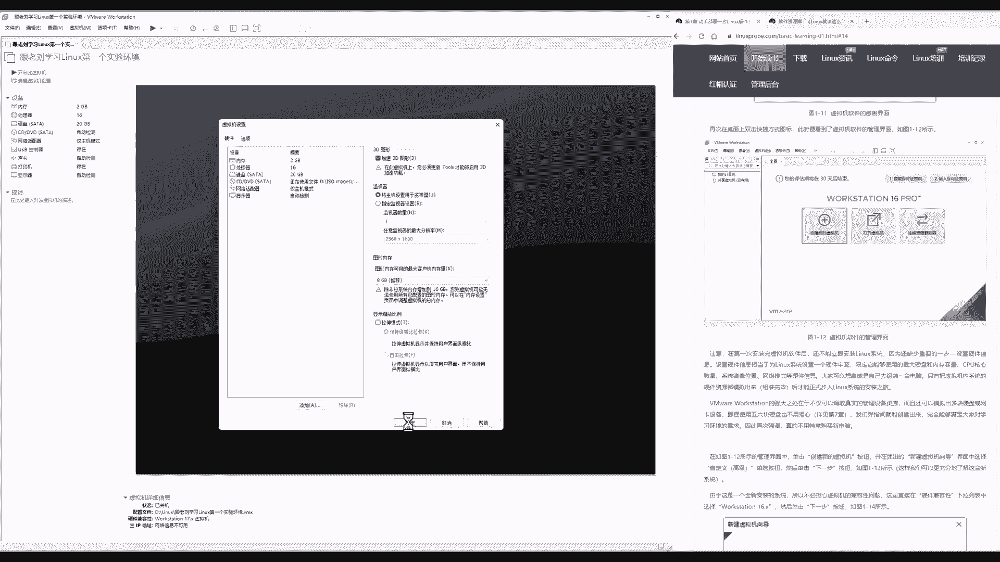

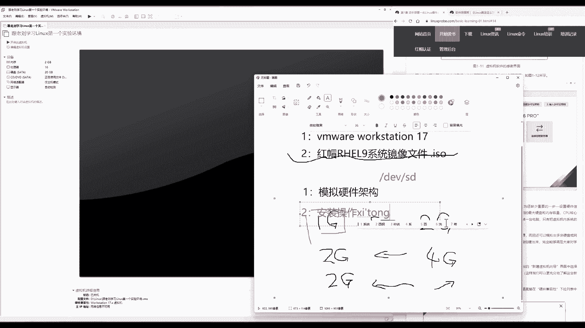

硬件准备就绪后，本节我们开始安装Linux操作系统。

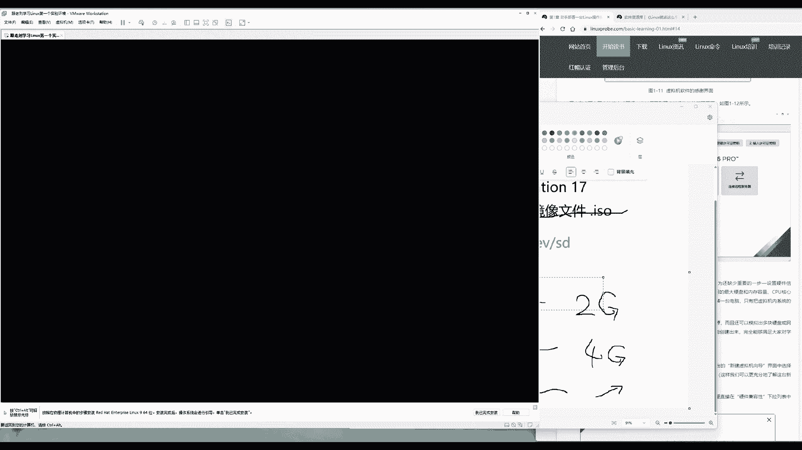

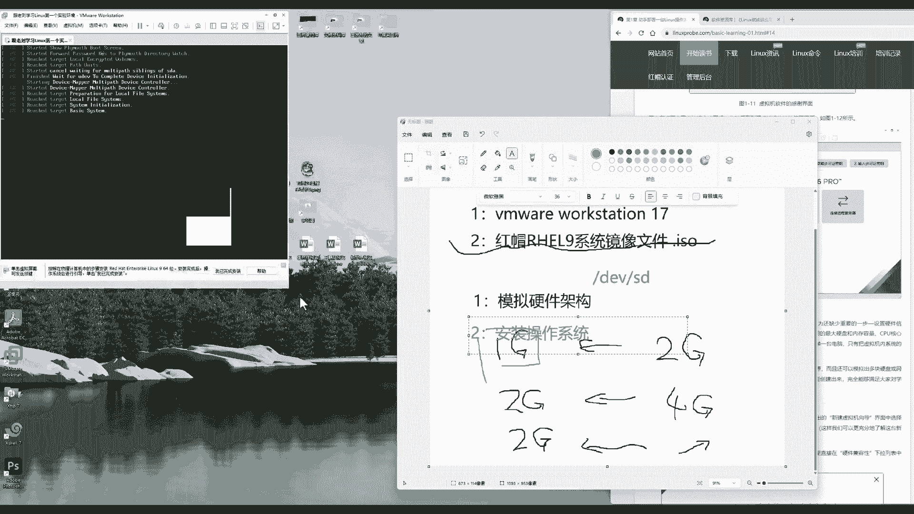

1.  开启虚拟机，你会看到安装引导界面。使用键盘方向键选择第一项“Install Red Hat Enterprise Linux 9.2”。
2.  等待加载后，进入图形化安装界面。
3.  **语言选择**：建议选择“English”，以便提前适应英文环境。
4.  **键盘与语言支持**：键盘选择“English (US)”。语言支持可以额外添加中文。
5.  **时间与日期**：地区选择“Asia”，城市选择“Shanghai”。
6.  **安装源**：默认已选中本地介质（光盘镜像），无需更改。
7.  **软件选择**：选择“Server with GUI”以获得带图形界面的服务器环境。右侧的附加服务暂时**不要勾选**，我们将在后续章节手动安装和配置，以加深理解。
8.  **安装目标**：点击进入，确认安装到我们创建的20GB虚拟磁盘上，然后点击“Done”。
9.  **Kdump**：这是一个内核崩溃转储工具，会占用内存。可以将其**取消勾选**以节省资源，需要时再安装。
10. **网络与主机名**：将主机名修改为 `linuxprobe`（后续章节会用到），点击“Apply”。网络IP地址暂时不配置。
11. **安全策略**：暂时保持默认，后续章节会学习SELinux和防火墙。
12. **设置root密码**：为管理员账户root设置密码，例如 `redhat`。系统若提示密码简单，需点击两次确认。
13. 点击“Begin Installation”开始安装。安装过程大约需要10分钟。

在系统安装的等待时间里，我们来学习一些重要的理论基础。

## Linux软件管理基础 📦

系统正在安装，我们利用这段时间了解一下在Linux中安装软件的演进历史，这有助于理解不同管理方式的由来。

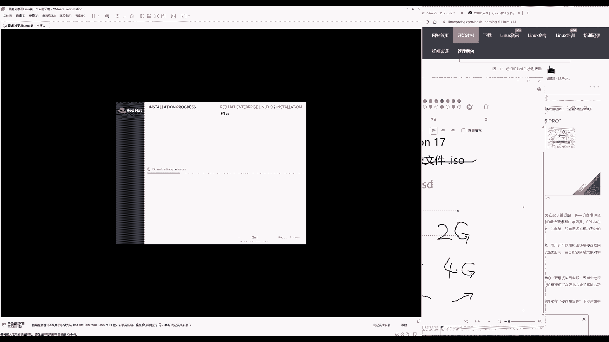

最初，安装软件需要通过源代码编译，用户需要自行解决复杂的编译环境和软件依赖关系，过程非常繁琐。

为了降低安装难度，红帽公司提出了 **RPM** 技术。
*   **核心**：RPM (Red Hat Package Manager) 红帽软件包管理器。
*   **作用**：将软件的**源代码**和一套**安装规则**打包在一起。
*   **优势**：执行RPM包时，它能根据内嵌的规则自动完成编译和安装，解决了手动编译的难题。

但RPM包本身是独立的，如果软件A依赖于软件B和C，用户仍需手动按顺序安装所有依赖。为此，红帽推出了 **YUM** 技术。
*   **核心**：YUM (Yellowdog Updater, Modified) 软件仓库。
*   **作用**：建立一个仓库，里面存放了大量常用的RPM包及其依赖关系信息。
*   **优势**：用户只需说出需求（如安装软件A），YUM会自动从仓库中下载软件A及其所有依赖包（B和C），并自动按顺序安装，解决了依赖关系问题。

YUM发展到第三个版本（YUM v3）时，存在无法多人同时安装、软件解析算法稍显臃肿等问题。因此在RHEL 8/9中，其继承者 **DNF** 成为了默认的软件包管理器。
*   **核心**：DNF (Dandified YUM) 可看作是YUM v4。
*   **作用**：同样是软件仓库，管理RPM包及依赖。
*   **优势**：解决了YUM v3的痛点，性能更优，支持并发操作，是RHEL 8/9的默认工具。

YUM/DNF仓库可以通过HTTP、FTP或本地文件（file）三种方式提供。

## 系统初始化进程与服务管理 🔄

另一个从RHEL 6到RHEL 7/8/9的重大变化是系统的初始化进程，这直接导致了服务管理命令的不同。

*   **初始化进程**：指从按下电源到看到登录界面，系统所做的所有准备工作。它之后会常驻内存，成为守护进程。
*   **RHEL 5/6**：初始化进程是 `init`。
*   **RHEL 7/8/9**：初始化进程变为 `systemd`。

`systemd` 不仅负责初始化，还接管了系统服务的管理。因此，管理服务（如启动、停止）的命令发生了变化。

以下是新旧版本服务管理命令的对比，对于初学者，可以先熟悉RHEL 7/8/9（即 `systemctl`）的命令：

| 操作 | RHEL 5/6 (使用 `service` 命令) | RHEL 7/8/9 (使用 `systemctl` 命令) |
| :--- | :--- | :--- |
| **启动服务** | `service sshd start` | `systemctl start sshd` |
| **停止服务** | `service sshd stop` | `systemctl stop sshd` |
| **重启服务** | `service sshd restart` | `systemctl restart sshd` |
| **重载服务** | `service sshd reload` | `systemctl reload sshd` |
| **查看服务状态** | `service sshd status` | `systemctl status sshd` |
| **设置开机自启** | `chkconfig sshd on` | `systemctl enable sshd` |
| **禁用开机自启** | `chkconfig sshd off` | `systemctl disable sshd` |

**说明**：
*   `restart`：先关闭再启动服务，会中断服务，进程ID会改变。
*   `reload`：重新加载配置文件，服务不中断，进程ID不变，适用于让新配置生效而不影响服务。

## 系统初始化设置与登录

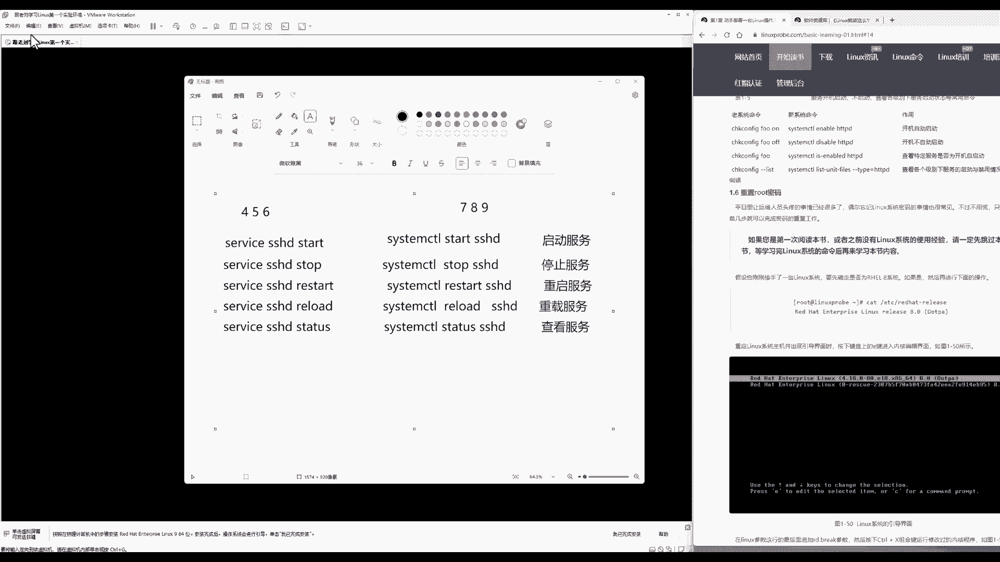

回到我们的安装过程。系统安装完成后，点击“Reboot”重启。

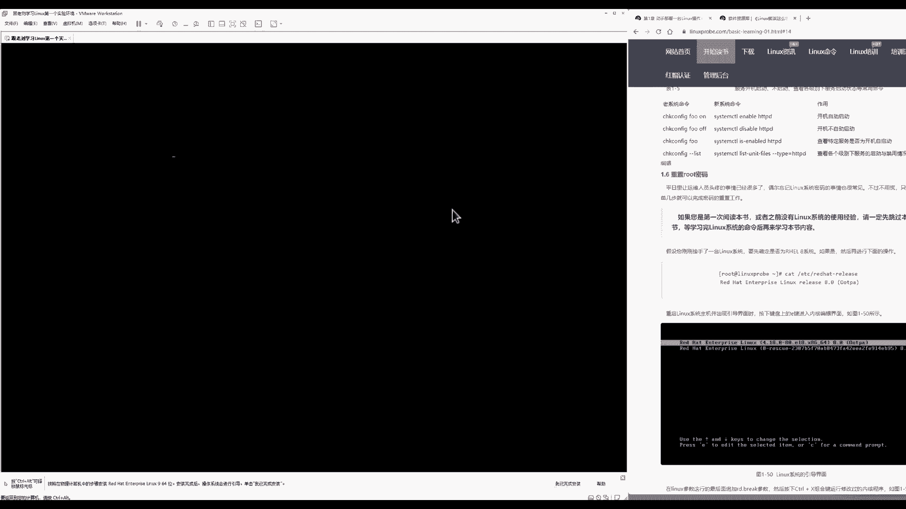

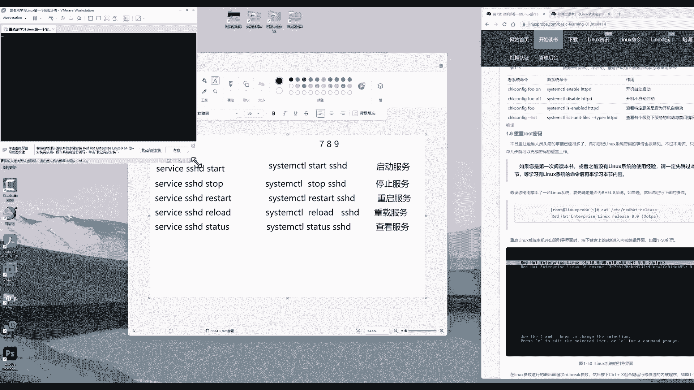

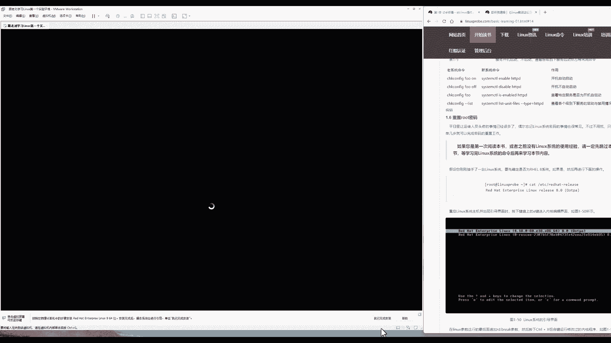

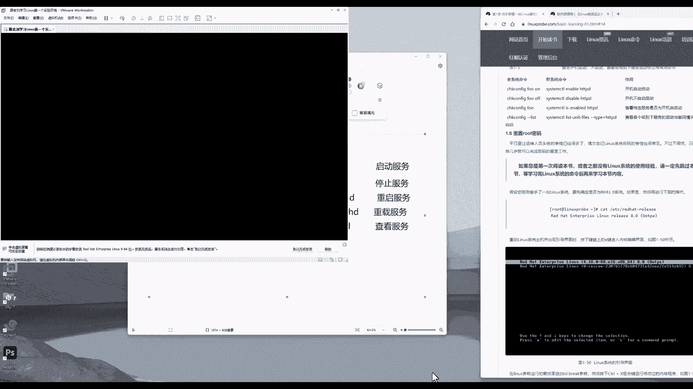

首次启动会进入初始化设置向导：
1.  接受许可证协议。
2.  在“隐私设置”中，可以禁用位置服务。
3.  创建普通用户。系统出于安全考虑，建议创建并使用普通用户。但**为了学习阶段排除权限干扰**，我们按向导创建一个普通用户（如用户名 `linuxprobe`，密码 `redhat`）后，会立即注销。
4.  在登录界面，点击“Not listed?”，然后使用 **root** 管理员账号和之前设置的密码（如 `redhat`）登录。**在后续所有实验中，如无特殊说明，我们都默认使用root身份进行操作**。

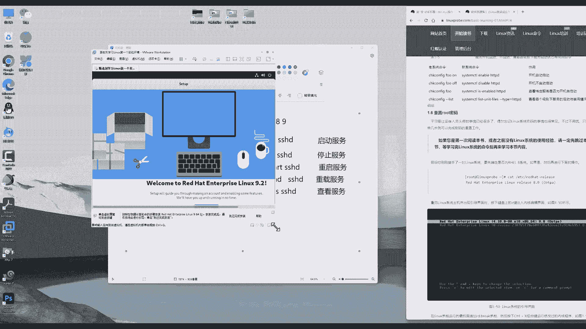

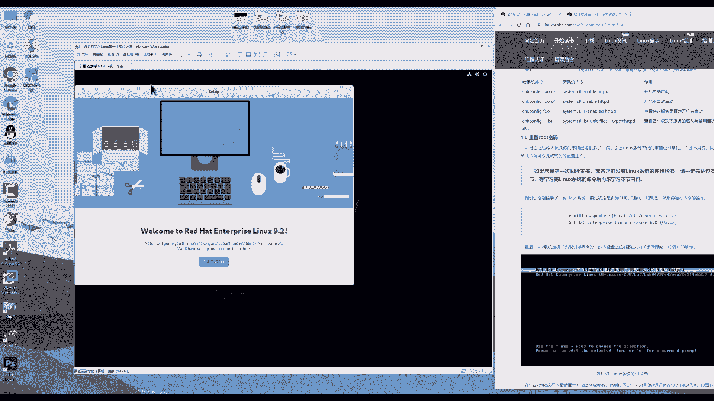

登录成功后，你就进入了RHEL 9的图形化桌面环境。

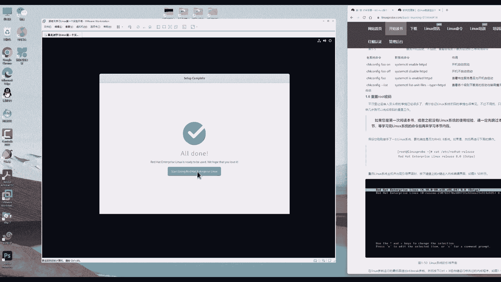

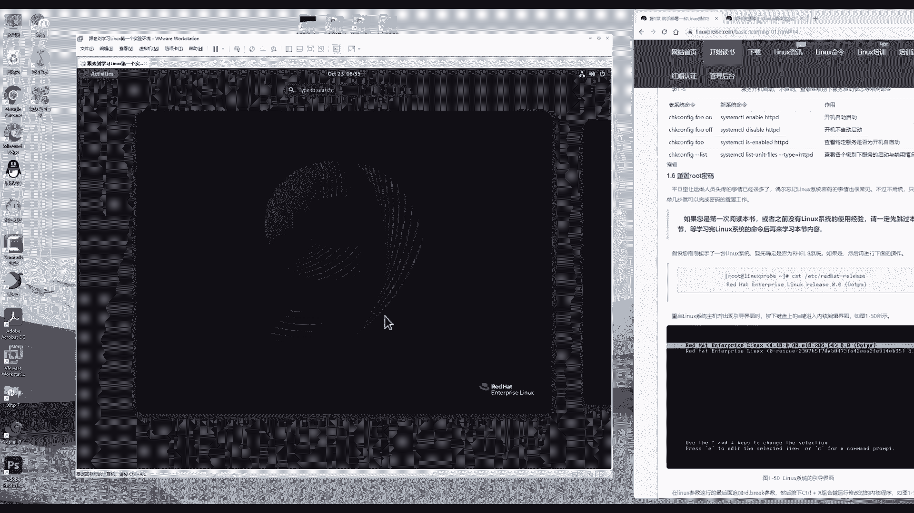

## 本章总结 🎯

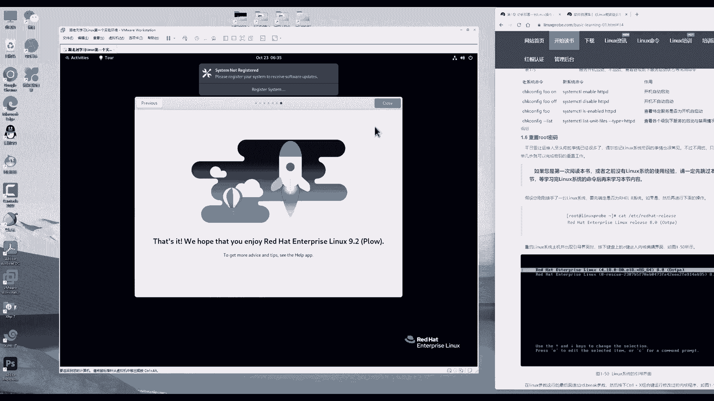

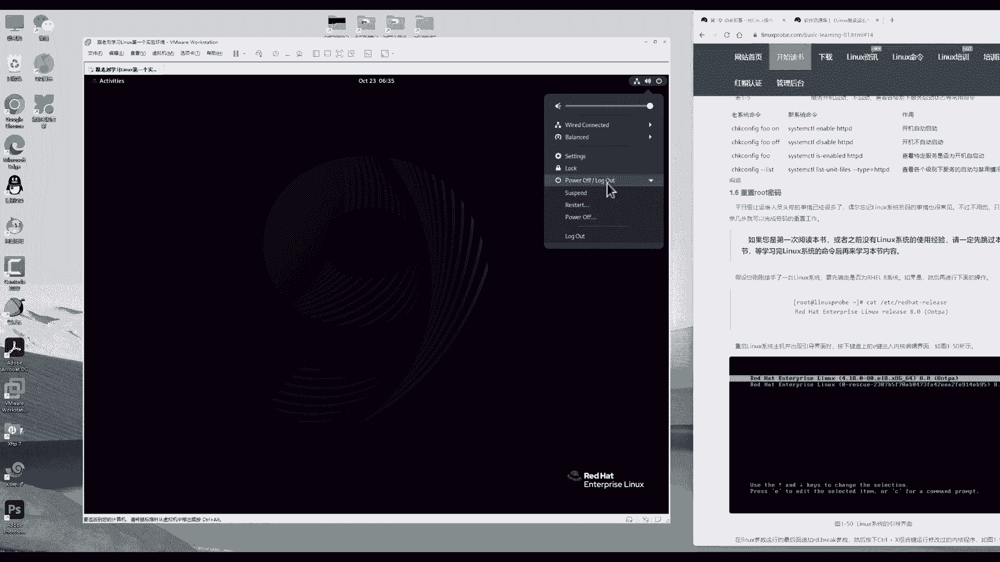

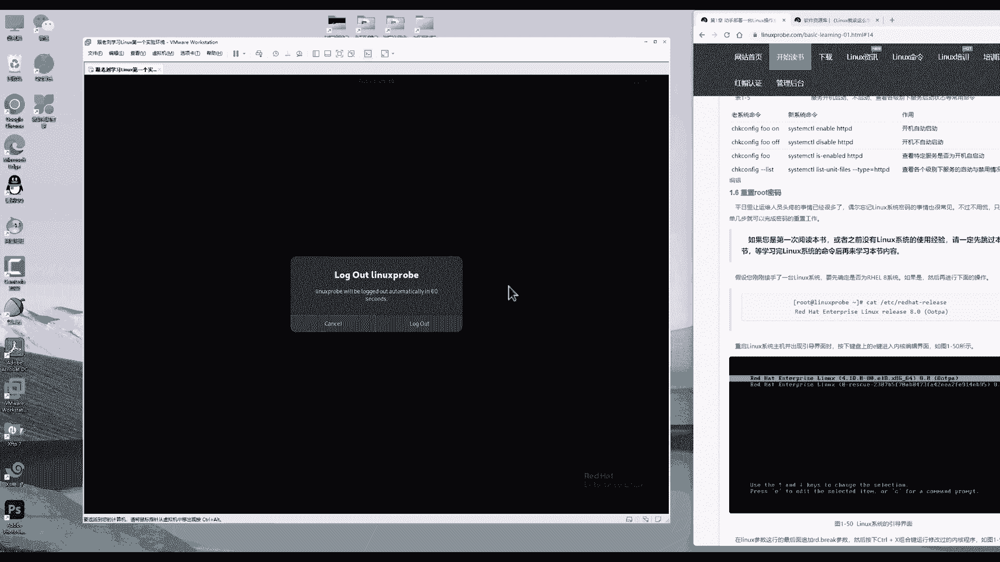

本节课中我们一起学习了如何从零开始部署一个Linux实验环境：
1.  **安装虚拟机软件**：我们了解了虚拟机的作用，并安装了VMware Workstation。
2.  **配置虚拟机**：我们详细模拟了一套虚拟电脑硬件，并优化了配置。
3.  **安装RHEL 9**：我们一步步完成了红帽企业版Linux 9操作系统的安装。
4.  **理论基础**：我们学习了Linux软件包的安装方式（源代码、RPM、YUM/DNF）的演进，以及从RHEL 6到RHEL 7/8/9在初始化进程（`init` -> `systemd`）和服务管理命令上的核心变化。
5.  **初始登录**：我们完成了系统首次设置，并强调在初学阶段使用root身份登录以便实验。

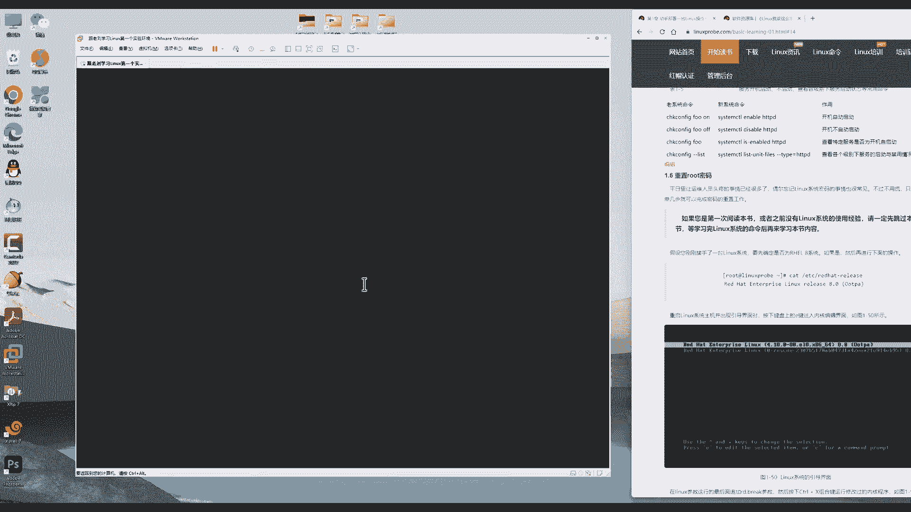

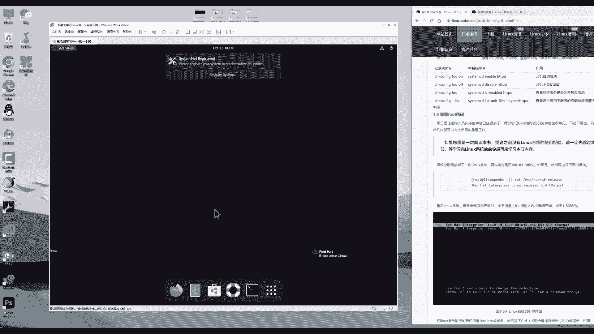

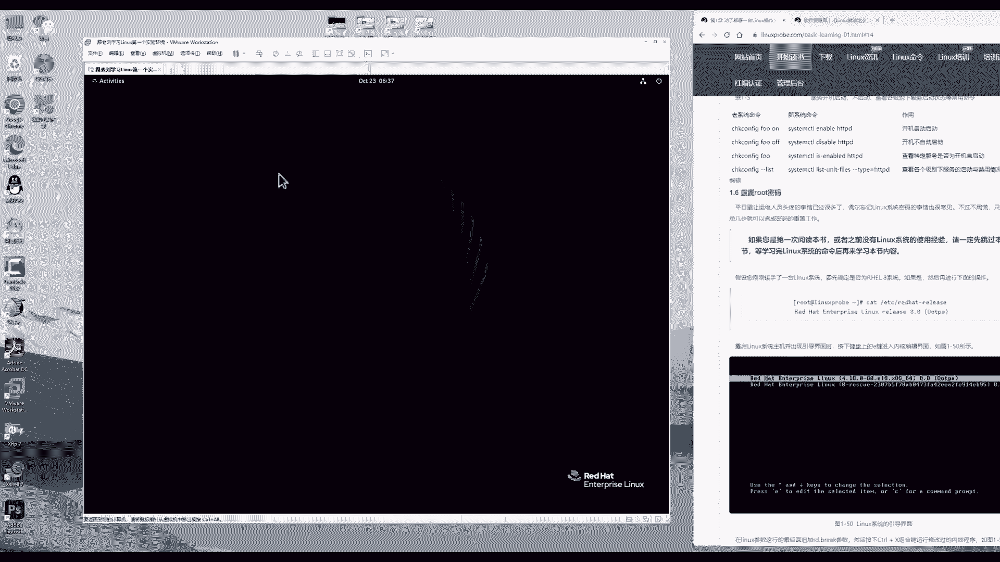

**课后作业**：请在桌面环境中找到并打开“终端”（Terminal）应用程序。下节课，我们将正式在这个终端里开始学习Linux命令。

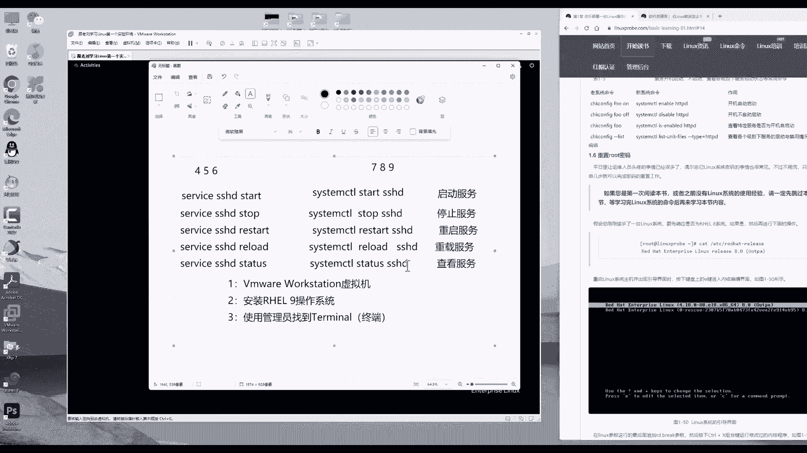

现在，你的Linux实验平台已经准备就绪，可以休息一下，准备迎接后续的命令行之旅了。