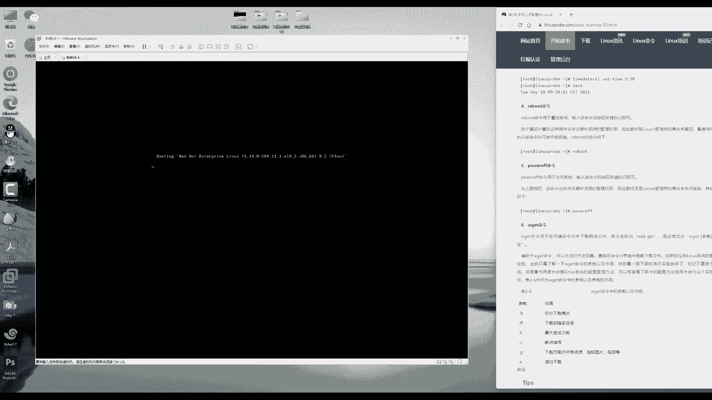
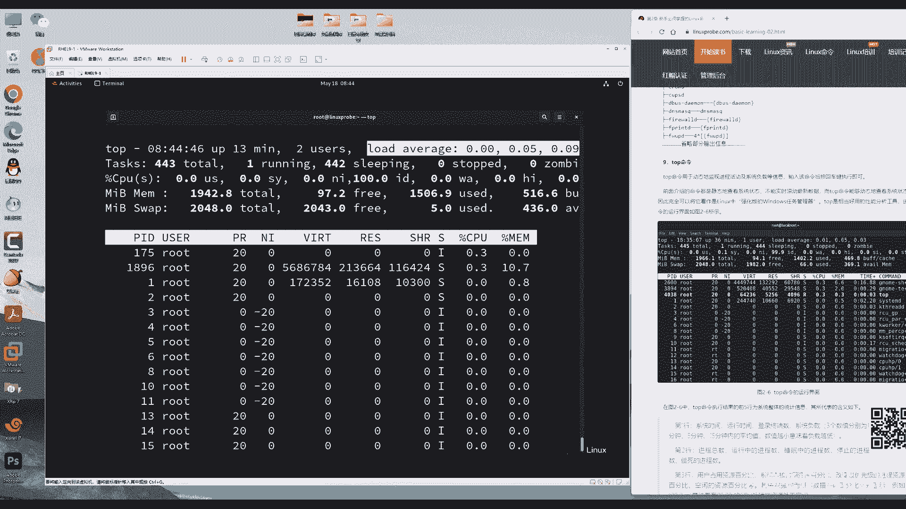

# 第2章 新手必须掌握的Linux命令（上）（Linux就该这么学） - P1 - 老刘努力不废话 - BV19e411Z77R

hello同学大家好，哎，欢迎来到这个第四天的红C认证9视频课程。今天我们来去学习一下什么是linux的命令，什么是参数，什么是对象，怎么样在lin当中来进行这个命令的执行。

去了解一下命令参数对象这三者之间有哪些关系，以及如何进行搭配使用，更好去怎么样贴合于工作的生产环境啊，那么更好为我们去进行一个服务，以及我们会把第二章节大概会拆分成三段。

这样每次的这个课程学习20多条命令，时间控制在一小时左右。这样的同学们听起来也没有太大这个压力了啊。好，现在讲一下啊，其实先作一下理论讲解啊，是这样的，其实我们电脑的这个硬件它都是由一些元素组成的。

还有一些金属元素组成的。比如说体验归啊等等的。电脑的硬件它是无法直接去处理用户的请求的。比如说我们现在想要去直接写信息，然后来存储信息到硬盘里面是不可以的。我们需要一个操作系统。

然后来为我们进行一个数据的传输。😊，我们对于硬盘的一个吞吐的控制。那么电脑的硬件是无法直接被人控制的，但是它的这一个价格可以看到了，它是很贵的，是明是它有这个实用性。那我们该怎么对它进行控制呢？

为来给大家画张图，同学们来去理解一下。首先电脑的硬件也是最底层呢？它是一个不能够直接被人所控制的设备，我们再给大家举一个例子啊，可能同学们说那不对呀，但是我可以控制我的这个手机或者控制我的电脑呢。

其实这其实这两个概念，因为它里面有操作系统，假如说我们现在把电给它断掉了，或者说您现在接着电，但是只拿一个硬盘，那么您可以往里面去写入信息吗？但是这个硬件并不特指说硬盘，可以是鼠标可以是键盘。

您对着键盘说话啊，这个应该来讲是呃处理不了这个请求的。那么硬件它之所以能够去来进行一个呃工作为我们所使用。

实际上它的这个硬件的外面还有一层什么东西呢叫做这个 kernel叫做内核系统的内核他们啊它里边会去完成一些非常基本的工作。例如说啊我们可以调用某一个内核里面的功能，然后来。😊，去对这个呃硬件来进行调试。

就有些时候在linux当中，有些新手会上来去调这个内核参数，就有可能导致你的这个硬件损坏。比如说你对于这个呃CPU的这个呃，那比如说我我那我们这个CPU这个温度控制对？如果说你把它调错了。

那么可能会造成一些硬件的伤害。内核就是在这个包裹在硬件外边的一层程序，我们可以这么来去理解啊，这个我们叫做内核在linux当中也叫做 kernel叫就是呃KEREL叫做这个内核也叫核心。那么唉等一下啊。

又变成一个透明色，不知道为什么这个windows1这个画图板总是那么的啊奇奇怪怪，稍等一下啊，有点像是photoshop了，还需要给它填充个背景色，我也不知道使不对没关系，先使着来稍等一下啊。

我把这个内核给它放上来。也就是说要想去使用这个硬件。那么就要通过一个基本的程序来对它进行控制，也就叫内核，但是内核也非常的这个复杂。😊，刚才讲到了，如果说稍有不慎啊，直接调整到内核里面的参数。

又有可能导致硬件的损坏。唉，那要想去使用这个硬件，真的是好麻烦的事情啊，它既麻烦又危险。那么我们该如何进行使用呢？那么这个时候就有了第三个东西出来了，也叫做API同学们如果要编写过程序的话。

或者上大学的时候，是不是学习过C语言啊。C语言里边上来怎么样呢？先去include，然后去加载一些函数库，这些就叫做API的这些接口，通过调用程序的这个接口就可以来去完成一些基本的功能。

例如说我上这一个大学的时候学习过C语言啊，通过调用某个接口可以让你的主机里面这个蜂鸣器，然后他去想一下，就是这样的这种接口，它是一个程序最底层的这样的一个功能。

我们这个程序就是基于这样的一个API的接口来去编写出来的。如果说您之前编写过程序的话，应该更好能够去理解。也就是说叫做这个API它使用内核去提供的，然后我们可以通过调用这个API来让。😊。

我们的内核去控制我们的硬件，这样的话呢更加安全一点了。因为它提供出来的API是允许我们做的一些操作。这样相对来说更加的安全以及高效。但又来了一个问题，如果说今天晚上我想因为一个女生出去吃饭。

那么我要去发送这个信息。那么网络根据这个呃那么这个网络有7层，而且我们要有这个相应的程序给大家去发送数据，那么可能光调用API就要调用几十个，这个是很不现实的。

那这让我们这个用户去这个调用API的接口就要累死了。这个时候他还载的这个最外层的话呢，还有一层应用程序，这个应用程序来给大家写一下应用程序应用程序，比如说是微信QQ抖音这样的这个程序。

它都是调用大量的API来去完成的。他通过调用了一个一个的API后加上他这个程序本身的一些特点和功能，然后就有这么一套程序，用户只需要去通过这个应用程序就可以去实现对于硬件的控制以及逐层的。😊。

来去完成我们想要去做的这个事情。大家能够理解的，就是我们的硬件是最底层，人是不能够直接跟硬件来进行一个数据交互的。我们需要有一个应用程序。这个应用程序的外边还可以有一个叫做这个操作系统。

我们统称叫做软件啊，软件软件里面分为了系统那么它里面分为了操作系统也分为了这个应用程序。呃比如说我们所讲的这个windowslin它就属于叫做操作系统层面的软件。而如呃例如说微信QQ这样的这个软件。

它则是叫做这个呃应用程序，或者我们把它叫做常用软件。那总之人是那么那么人是呃那么需要通过软件来对硬件来进行控制的。那么在lin里边这个应用程序的这个呃名词，我们把它叫做shall。

那大家看一下叫做shall。可能第一次您听到这个词的时候，可能百思不得其解。为什么叫 shellll这个词的话，好像有一个嗯就是我们听过最多的，就是一个加油站叫壳牌啊是是呃反正是个呃是一个。😊。

非常知名的这么一家企业。除此之外，好像没有听到过其他地方用这个shall这个词了。shall这个词它实际上来自于英文单词的壳的意思。它的话呢的意思就是我们能够通过这样的一个程序，对于硬件来进行一个控制。

大家记一下这个英文单词的中文叫做壳，它的功能是能够让用户通过shall终端来对于这个操作系统来进行一个交互，我们要想去执行某套命令，就是在这个shall里面去敲就好了。那么这个he怎么来的啊。

我们为什么画张图呢？画张图的目的就是要给大家讲一下，其实shall它就是一个非常形象的一个词来描绘了这样的一个过程啊我给大家再画一个，比如说这是一个壳，我再画一只小蜗牛，哎。

我现在画了一只画了一只小蜗牛看到没？一只小蜗牛画两个小触角，我们对于硬件的这么一个控制的过程，是不是就是一层一层一层呢？这样像不像就是一个蜗牛的壳呢？大家也比较好理解了啊，在英文上面来讲，它是壳。

在这个生物上。😊，讲它就像是一个蜗牛的壳。从lins这个角度上来讲，它就是用来去控制系统硬件的这样一个应用程序。大首先我们知道啊什么叫做 shellll。嗯，大家就能明白了。

我这张话呃这张图可能有点潦草啊，没关系，看一下这张图啊，这张图就可以看到了人是通过了这样的一个hell的一个机制啊，通过shall的一个机制，对于硬件来进行了控制。

那么我们可不可以理解成就是 shellll实际上是什么呢？它是什么一个职业呢？他就是一个人与硬件的一个交互的翻译官。有一个人我跟他说啊，他听不懂，没关系，我请一个翻译，帮我翻译一下这个信息。

他就是一个人与硬件的翻译官，把人的需求告诉硬件硬件进行处理过后，再返回来他的处理结果，翻译成人能够听到语呃，那么翻译然后再把这个呃处理过的信息翻译成人能够听得懂这样的一个语言。

这个就是叫做翻译官叫 shellll。好，总之。😊，就是待会儿我会在这个sha里面去说出我的需求，然后由呃硬件来进行处理。接下来就可以进行响应了。那接下来再来给大家捋一下思路啊。既然来讲他是一个翻译官。

翻译官是一个人吗？他翻译官永远不是个人，对吧？他是一个职业，就像教师啊，作者一样怎么样，他总是一个职业。在这个里面它是一个统称。那么我们再去红茅re9当中使用的这个翻译官是谁呢？

这个其实就是一个试错成本非常高的一个东西了，就像去医院看病啊，我们可能不会去找三五个二流的或者三流的大夫帮我们去看病。你心里想着呢肯定是找这个行业里面最顶尖的这样的话，他这个呃看来他也是最准确的。

所以shall在使用的时候，你不会同时去使用三五个sha的，你只会一啊那么你只会去使用一个你认为最好的shall终端来进行工作。这个在红茅re9当中有很多可以去选。比如说CSHSH啊。

比如说这个对本身它也是一个这个终端的名称，还有什么呢？就是这个我们。😊，在所使用的就叫做bash呃，为什么在红猫re9当中使用的是bsh呢？它主要有四个好处。哎，同学们思路不要打乱啊。

我现在给大家捋一下这个思路，就是shall是一个软件，或者叫做这个终端的统称，其中里面包括了很多很多个，我们现在选用的在红re那么现在在红猫re9当中默认使用的是叫做bsh解释器。好，大家理解这个意思。

它是一个包含的关系。那么为什么要去使用这个b解释器呢，它有四个好处。第一个好处就是它能够通过这个方向键来调取我们呃呃之前执行过的一些命令。比如说我现在再去执行命令，1234往下执行。

如果说想要再去重复执行一下上面的上面第二条执行过能命令，那我只需要按两下方向键向上箭头就可以帮我们找到它了，特别的方便，再去重复去执行某条命令的时候，如说去查看系统状态呀，怎么样呢？

可能老去执行某个命令，这个功能就特别的方便了，节省了我们的这个呃输入量啊，这个非常的好。也就是说第一它的好处就是可以通过这个方向键。😊，来对于这个呃历史执间国的命令来进行调取，这个挺方便的。

第二的话呢就是它特别方便的一点在于，它可以通过这个table键来补它来进行补齐。例如有一个命令，它的很长，可能二三十个字母。那我们只需要输入前面的一部分。既来摁一下table键自动补齐了啊，比如说老刘。

其实不其实话呢并不叫老刘，我可能是叫很长的一串名字，那么你只需要输入老刘，然后后面只要你摁一下table键，这个时候后面自动补齐啊，叫巴拉巴拉巴拉，然后帮我们给它自动补齐了，就这样的一个效果。

你只需要去输入命令参数文件的名称的前面的一部分自动帮你补齐它啊，只需要去输入一部分特别的好，有点像是思科里面，我们再去计换机路由器里面只需要输入一部分，然后摁一下这个补全就可以去补齐了。

但是如果说你之前学习过这样的一个交算机路由器设备这个同学的话呢，一定要注意啊。就是在这个我们在执间过当就是我们在就是我们在这个操。😊，用里面如果要再去使用linux的话呢，它是可以进行命令补齐的。

但是它并不能够进行命令的省略。因为如果说您再去学习网络的同学，可能会去比如说呃查看一下我们的IP地址，可能就会这样去执行就好了，对吧？啊，那么您不需要去写一个完整的名称。

但是在但是如果说您在这个lin里要想去查看IP地址的信息，您就必须要首先那您可以没有写全。那么您只需要写一部分，对吧？但是您一定要按到这个table键把它自动给它补全了，千万不能够缩写。

就是说它允许补齐，但它不允许缩写，好吧，好，这是我们的第二点非常好的优势。第三就是非常有啊，第三就是它有一个强大的批助理脚本的支持，这个我们会在第四章节的时候会给大家说就是脚本功能特别的强啊。

我们以些自动化的这些工作的话呢，只需要编写成脚本，都用不着thon啊，都用不着一些C语言，直接通过sha脚本的功能，就可以实现一个自动化的处理了，这个很强悍的第章。😊，当节绍会大家据说。

并且会给大家讲到循环以及判断语句。😊，等等的这个功能。好，第四个是什么呢？还有一个非常强大的环境变量的支持啊，这个也就提到了在上个世纪70年代，1970年的时候，当呃当时的这个操作系统。

它是有很多个用户通过终端共同去使用的。那每个用户登录之后都要有相对独立一套工作环境。那么是不是它就有相应的一个环境变量的一个支持呢？每个人登录之后，虽然登录都是一台服务器。

但是每个人看到这样的一个场景是不一样的。这样的一个效果，它一个环境变量的一个支持。这是4点比较显著的优势。然后巴拉巴拉巴拉那它它可能还会有很多个这个的话呢就需要您去开发了啊。

您去呃在这个呃那我们学完了之后，您在工作当中啊，未来两三年，您认为这个软件它有哪些好处来进行补充。也许这一个上面4点您也不认同啊，没关系，因为这个呃在红猫日9当中，我们默认使用的解释器就是拜。

它是一个怎么样，它是一个默认的这么一个解释器的程序。它不论我们喜欢不喜欢，都要去使用它。😊，他等于说这样的一个地位非常的高的那我们只是给大家去简单去说了一下bsh解释器它可能有哪些好处。

我们在过作当中您可以留意一下啊，主要是这四点特别的方便。好，下面我们来给大家继续来聊一下啊，这个理论东西很多，他也发现了老刘说着说着说着这个语速都快了，为什么呢？理论东西太多了。

我们今天讲理论估叫讲40分钟。今天第一天那今天第一节课就甭干别了。就成实理论呢很着急啊，很着急，不想让我们这个课那么水下去。😊，好，我继续来给大家聊啊，理论中边特这个理论东西特别的多。

其实有时候不讲也行。嗯，但是最好学一学吧。呃，因为但但是这个东西学的确实没有太大用处。因为它嗯我们学不学它解释其它都是b，然后我们有用就好了。嗯，但是学完之后您知道大概的一个它有什么样的一个好处。

反正有是有帮助吧。好，总之啊开始这个第二段理论基础了，不要太抵触，第二个理论基础的话呢，就是什么是命令，什么是参数，什么是对象。哎，刚才大家说到理由不对啊。刚才你们跟好像刚说了一个命令。

怎么又多了个参数，多了个对象呢？命令是什么呢？按照英语单词里面来讲，按照这个英语语法上来讲啊，实际上就是动词动作，我们要做什么样的一个事情，就把它叫做命令，好了，我给大家写一下啊，命令参数对象。

它三者之间是通过这个空格来进行间隔的。比如说命令，然后空格，然后接下来参数，然后再来空格对象来进行一个间隔的命令参数对象，三者之间至少要有一个空格。😊，以及参数跟参数之间要有一个空格。好。

那么什么是命令？命令的话呢，它的这个呃定义实际上就是动词了，它叫英语动词一样，我要去做什么样的一个事情，就去执行什么样的命令，命令放到最呃，那么我们把这个命令放到最前面。😊，例如说我打了小刚，那好了。

我那么我打了这个打这个词就是这个动词啊啊，主谓宾嘛，那我就是这个主语呃，谓语就是这个打，然后的话呢这个宾语就是这个对象。我打了呃小刚好了，我打这个打就是这个动词。

对应的就是命令对象的话呢就是命令的承受方，我创建了一个文件，这个文件就是一个对象，我去打了呃，小刚小刚就是命令的承受方，小刚就是对象，我去新建了一个用户，用户就是这个对象，我打了小刚小刚就是对象，好。

能理解吗？好，动词宾语有了，还有什么呢？还有一个叫做这个修饰词啊，对于名词的修饰词，我们叫做形容词，对吧？那我们对于呃动词的修饰词的话呢，应该是叫做。😊。

应该是叫做副词。好，那么我们这个参数的这个。应该是副词啊，刚才特以去查了一下啊。然后那么我们要想去描述说这个动词呃，那么以及宾语，要想去更好的去来去呃对于这个动词来进行描述，那么就要加上一个副词。

那么把它叫做狠狠狠地吧。比如说啊狠狠地打了小刚。那么这样的一个效果，狠狠的打了小刚。那么这个狠狠地是什么呢？它就是一个对于动词的这么一个形容，或者叫做这个修饰，它可以更好去贴合于工作需要，说我打了小刚。

感觉哎呀轻描淡写，并没有那么的使劲，没有没有那么的用力，并没有那么的恨啊，要想上啊那么啊但是如果要变成一个文学作品，那我就要是我恶狠狠的使劲的打了小刚。那么这个呃词汇就变得非常的呃美丽跟动听啊。

以及让人家一个记忆深刻。那好了，大家看一下这个狠狠地就是一个对于打的这个词的一个呃的这么一个补充，让他更好去贴合于工作场景。例如说我现在想去创建出来一个用户。😊，那好了，我现在去创建出来一个用户。

用啊创建用户的命令有了。然后接下来要写上一个用户的名称，例如说叫张三完了，但是我们没有更好去贴合于工作需要。如果说我要想让我呃这个用户他的这个起始UID号码是一个什么什么什么。

比如说定义一下他这个身份证号码。所以他创建的时候就帮大家给定义好了，那么就可以加上这么一个参数，参数可以让我们的这个动作更好去贴合于工作需要这样的一个效果。好。

可能您这个呃我们同学大多数应该都已经能够明白了啊。但是我还但是我还是有点担心啊，毕竟是一个啊这个视频课程，同学们如果要反馈的话呢，可能不是他么那么方便啊，干脆给大家再讲一个例子吧。😊，呃。

同学们喜不喜欢吃寿司啊？就是这个我们在东北来讲的叫这个紫菜包饭啊，就是你有没有关注我人在切这个饭团的时候，他们那个刀是不是它不是一般的刀啊，我给大家画张图啊，就更好能够驴取啊。咱最后再举一个例子。

更好来举理解。😊，命令参数对象它之间的这个关系了。首先啊先画一坨坨，比如说这是一个饭团，然后再画一把刀。那么请请问同学们一起来说啊，咱们虽然是一个视频课程，但是也可以互动嘛？来看一下，请问这把刀是什么？

一起说出来。😊，这是一个命令。好，没有问题啊。它是我们要去做这个动作，或者您可以认为刀切的这个动作叫做呃命令也可以。好，刀是我们的命令。这个饭团是什么呢？它是命令的承受方，它是我们菜刀的斩落者，这吧？

它那么它需要被切，那么因此它是一个宾语，它是我们的对象。好，刀是命令呃饭团是对象。那么什么是参数呢，参数是更好去贴合去工作需求。如果在切饭团的时候呃，直接去切就会呃让这个刀和者案板上面全都是米饭粒。

这个时候怎么样，大家可以去网上搜一下这种呃寿司刀，上面怎么样呢？它会去打一些孔去透气，并且切的之前，它会撒一些水，这样的话，它进行润滑，它在切完了之后啊。

这个米饭就不会站在哪都是的它它会写一个润滑跟透气这样的一个效果。你有没有发现就是说我们直接用刀去切啊，没有任何问题。但是有了这两个东西之后，有个孔和水的之后，是不是更好的去贴合这个工。😊。

作需求呢让工作完成的更完美了，这个就是参数的作用。哎，好了。😊，接下来给大家讲命令参数对象，那什么那么什么是最难呢？实际上就是命令和参数最难对象只是一个命令的承受方，其中参数又极其的。😊，呃。

有点呃门道，需要给大家来去聊一聊参数分为两种，一种叫做长格式，一种叫做短格式。长格式跟短格式。哎，长格式跟短格式，它代表的是两种不同输入参数的方式。长格式一般情况下是两个减号。

加上一个单词这样的一个形式，短格式是一个减号加上一个字母的形式，举个例子来讲，呃，什么是长格式，两个减减，然后加一个词，这个用来代表长格式呃，它如果单个字母的话，就是一个减号加一个字母这样的一个方式。

长短格式，大家记一下理论是这样的，长格式跟短格式，只要二选七就可以。一般来讲功能是相同的。第二来讲。😊，并不是每个命令，它都会同时去支持长格式跟短格式啊，要看具体的命令。然后他提供哪种这样的一个方式。

第三，推荐大家去使用短格式啊，这个话呢效率这个呃特别更高一点，我们可以将多个短格式来进行合并。第三点就是短格式跟短格式之间是可以进行呃合并的。比如说我现在有三个短格式杠A杠呃P好，那么以及杠一个消息L。

假如说有三个短格式可以合并合并的结果是有三个选择啊。同学们如果要是做好预习的话，您应该能够猜得出来。请问我合并之后。😊，是什么样子？这个三个选择。同呃同学们可以打一下123，您看着哪个更顺眼呢？

或者之前见过呢啊，我们看完了之后，大家可以猜出来啊，我去公布答案了。答案是这个是正确的。也就是说短第三点，短格式和短格式之间可以和进行合并，只保留其中的一个减号。然后短格式。

然后我们把所有的这个字母都写到后面就可以了。一般来讲顺序是没有关系的。好，第四点，短格式跟长格式之间不能够互相合并，短格式就是短格式，短格式之间可以合并，短格式跟长格式之间是不能够合并的。然后第五点。

长格式跟长格式之间不能够合并。好，这是第五点，第六点需要注意的就是在没有合并之前，短格式跟短格式，短格式跟长格式参数的任何参数之间，都用的空格去做间隔，也就是说它即便是参数它也之间要有空格去间隔。

你的命令和你的参数和参数之间以及对象，它都要有空格去做间隔，它至少要。😊，一个空格可以有两个或3个，但是他至少要有一个空格。好。哎，通过这一啊通过老留这么一顿输出，大家就应该对于这个是有一点概念了。

我来举一个小例子，有这么一个命令，它正来去查看我们的目录内，它有哪些文件以及文件所对应的权限呢呃，是一个小写的LOS嗯，它是一个命令。它有两个参数，它第一个呃它有两它有两个执行参数的方式。

第一种叫做查格式。第一个代表的是查看我们这个目录内所有的文件，括弧包含隐藏文件。第二，它是查看我们的目录。它呃，其中所有的文件以及文件所对应的这个权限属性信息。好，它有两种的执行方式。😊。

我来给大家提几个小问题，嗯，同学们可以回答一下啊，互动回答一下。首先第一个问题。😊，我给大家写一种做法，您看看对还是不对。首先啊这边呃那么首先来说上面两个肯定是对的啊，我再给大家写一种做法。

大家看看对不对。😊，LOS很难啊，我不会给大家放水的杠A，然后杠杠list。这个可不可以去这样去做？也就是说。我如果要是直接问大家1个杠AI杠L，那肯定大家都知道这是可以的，这种可不可以呢？

有短格式有长格式，长短格式之间合并搭配一起去使用，这个可不可以呢？首先来讲，这是可以的。😊，短格式跟长格式之间，我们可以二选7，每个参数上面都可以啊去二选7，可以自己搭配去使用，没有任何问题啊。

没有任何问题。来，接下来第二个问题，请听题。是不是老刘这个题出的很呃出其不意啊，刚才没讲过呀，啊，超纲了啊，没关系，来看一下啊，请问一下这个对还是不对。😊，这个对不对呢？嗯，咱们一眼看。

好像跟上面的很像，有不太像。😊，它不对，为什么呢？短格式跟短格式之间，要不然你就要空格去做间隔，要不然你就给我合并了。它有两个改法，怎么改呢？要不然改成杠A杠L中间加个空格，两个分别去写。

要不然你就给我杠AL同学们看好了，这是第二个可能性，也是大家常犯的错误。好，第三个。😊，IOS。想一想啊，给大家一个难点的，出其意不能啊，出其不意。啊，我看一看啊杠O那查看历史当中做的文件，然后以及嗯。

😊，杠屁。啊，不是啊，这个太简单了。因为刚P的话我们没有讲了。那么还有什么呢？嗯，他如果没有大家有有没有发现前面两个没有加对象啊，前面两个没有加对象。那么呃如果没有加对象的情况下，他也就是说这个。😊。

是查看的我们当前所对应的目录下所有的文件的意思，它没有指定对象。好了，我来一个杠O，后面我加一个对象的名称，比如说叫做file点test，加上一个文件的名称，然后我们后面再来写上一个参数。好了。

我现在想要去查看这个文件所对应的所有的参数以及呃我想查看这个文件所对应的这个所有的信息，然后包括用这个权限属性，请问我这么写可不可以的。就是刚才所讲的就是命令参数对象，参数之间用到空格做间隔都啊。

这些都是没有问题的。现在我把它。😊，对象写到了中间，参数写到两旁，这个可不可以？嗯，大家看一下。这个的话呢，按理论上来说是。

是可以的，因为他三者之间。它的这个顺序只有一个是最关键的，就是命令。只要你把命令放到最前面，参数跟对象一般情况下是不太在意顺序的是啊，它是没有太在意顺序的，除非有一些例外。比如说像去打包这个文件的时候。

最后那个CCZVF的，然后最后那个F那比如说我们再去使用那t命令啊，最后那个F必须要放到最后除此之外就很少了。这种三个比较呃奇葩的这样的一个情形都给大家说到了，所以再去执行一般的命令的时候。

同学们就问题不大了。好，我来给大家去说一下。

怎么样来去打开这个终端和这个terminal来进行硬件的一个交互，请切记一定要去使用管理员的身份root来去登录我们的这个操作系统密呃，密码就是您安装系统的时候所使用的。现在要做的事情啊。

就是回忆一下昨天嗯我们是不是让大家去找到终端啊，有没有找到啊，终端在哪里呢？终端是在点击一下这个红灯菜单。哎，嗯activities，接下来的话呢，点一下这嗯，可以看到了，这儿有一个输入框叫做终端。

点开它出现这么一个黑屏白字的界面。嗯，然后第二个方法的话呢，就是点一下您这个键盘上面的开始菜单，也可以打开这个界面，然后来去选择它没有快捷方式打开它没有快捷方式，在红猫六里面啊。

它是可以点那么那么它是可以通过点击右键去找到有一个叫做呃打开终端的一个选项。但是在红猫9里面反而没有了，退步了。好，我们不管现在的话呢打开了这个终端可以看到了是一个黑屏白字的一个界面。😊。

他就是用户与这个计算机的一个呃翻译官了，我们只需要把自己的这个需求告诉他，他就会给我们去返回处理结果。来，下面给大家讲第一个命令叫做man命令。它的话呢是用来去查看帮助文档的。

他可以去查看命令的文件的以及参数的各种的帮助文档。比如说我想要去查看一下某个命令，我知道某个命令。但是我不知道它的这个参数了。没关系，你可以直接去使用的manman是命令，所以它写到最前面。

要想去查询的对象之间要有空格做间隔，可以没有参数啊，可以没有参数。因为呃假如说我现在就想去切大骨头。那我肯定不用在在这个刀上它呃呃他呃它呃进行任何的处理了。😊。

直接切就是最好的结果。那么它就是最好的这一个呃情形了。它已经非常贴合于工作需要了，所以可以没有参数。后面加上要想去查询的这个对象名称。

例如说i命令摁一下回车看看到了就打开OS命令它所对应的一个帮助文档看完之后按到这个空格来往下翻一页摁回车下翻译行看完之后点一下Q键啊以退出掉我们也可以去查看一下man文自的帮助文档有事找男人啊实际上这个英文的叫man助文档的意思啊去一下首先第一个man是什么呢？

它是我们的命令，这是什么呢？这是对象了这是命令这是对象后敲一回车我记得上一次讲课的时是在24号妈讲大家都要哭。老这个连命令都有对象。我还没有情人节那好讲第二章节然给大家留下了一个非常痛苦的一个回忆。

总之就是对象的话呢是我们一个命令的承受方一般情况下来讲每个命令都要有的要把忘。😊，忘记啊，不要忘记它来命令参数对象可以参数没有，对象也可以没有。但是大众情况下来讲，对象还是要有的。来看一下啊。

这就是对于呃man文档的一个说明了。但是只不过美中不足，那就是有点小遗憾，就是英文的。但是这个肯定更加准确，比中文翻译起来。😊，嗯，反正肯定更新更及时更全面。这个大家呃大家就尽力看吧。

如果要是看不懂的话，没关系，我们会给大家讲一下这个常用的这个参数以及命令的组合方式。大家知道在红猫reo9当中有多少个命令的吗？在红re当中自带有的命令啊。

还不算你单独去安装的一些服务和命令有5000个知道每个命令有平均下来多少个参数呢？平均下来大概有60到100个参数我们算下来就是5000乘以100我都不敢算这数应该来讲就是5000550万应该就是40万到50万个参命令跟参数的这个组合方式。

大家又知道多我们平时会多少个英文就能够看英文报纸吗？只需要会2000到3000个也就是说我们用2到300个英文单词就可以看懂英文的报纸了。

但是我们要想去精通的那个仅仅是命令一项就要有40到50万个命令跟参数的组合方式。同学们一听单位就可以笑出来了。😊，啊，说明根本就不是这么去学的，我们只需要去学习那些最常用的，而也不用去背。

因为当你用的多了，自然也就记住了。嗯，好，我们继续来给大家去聊啊，先给大家去简单去说一下。😊，呃，它这个命令和参数的一些关系。然后接下来讲一些这个快捷键。刚才我是怎么样把这个窗口给它最大化呢？

我按了一个conttrol加上shift，加上一个加号来进行扩大了。如果说您看见这个字有点费眼睛，那么也可以同样去操作一下control shift加加号觉得大了怎么办呢？

呃像这个金箍棒也可以小可以大可以想啊，小小小怎么样呢？cttrol加减号小小小小了。好，当我再去执行一个命令，我呃假如说我再去执行一个命令，这个命令的话呢，叫做嗯wa啊，大家好，大家不要管啊。

我现在执行了一个某一个命令，同学不要管它干嘛用的，假如说我现在执行一个命令，它停不下来了，怎么办呢？ctrorl加C强制终止。大家记一下，又一个快捷键了，第三快捷键了啊，ctrol加C。😊。

强制终止。哎，那如果说不想终止，我要把它扔到后台去把它暂停了怎么办呢？ctrorl加D哎，ctrl加D把它给这个放到后台去执行。那么还有什么呢？比如说ctrorl加L清屏，巴拉巴巴拉巴。

我们执行了很多个命令，再往下瞎敲的啊，这个时候屏幕很乱了，没关系，contrl加L清屏，其实这个命令它的这个功能并不是清屏，它是把这个屏幕的话呢往下翻译，这个命令还可以在上面找到啊。

所以这个对于信息的保存还是比较好的啊，现在呃我又想再去重复去执行，上面的一大长串命令了，怎么办呢？通过方向键去找到上面所执行的命令，再摁一下回车去执行，没有问题。好。😊。

接下来就要去正式的开始咱们这个第二章节的视频了。我这个第二章节视频课程了，半个小时啊，紧赶半赶。终于用了半个小时的时间讲完了理论啊，大家已经是非常的期待了啊，该怎么样去执行linux的命令呢？

打开这个窗口，再重新打开一下啊，有点种仪式感啊，重新打开这个窗口调整到一个舒适的角度，然后找到合适的大小来去学习第一个命令叫做呃这个命令叫做echo命令来写在我们的屏幕上面。

echo命令的作用是叫做回声。它是将命令的这个呃对象去重新输出到屏幕上面。😊。

啊，然后或者的话呢它也可以去输出某一个环节变量，或者变量，或者用户自己创建出来的呃，每个人的这种变量去提取后的值来去输入到屏幕上面。举个例子来讲，使用ow echo命令是不是它是一个命令。

它要去输出一个对象，这个对象叫做linux pro do co是一个字符串，我要想将这个对象输出到屏幕，就这样去做狠狠的按下回车，说一句zony哎看到时就屏幕上就会出现了这么一个字符串。

它会输出这个信息，所以它叫做回声嘛，我把这个声音回过来了。回声第二个功能，它可以对于一个变量来进行提取，提取过后再输出变量所提取的值，什么是变量。不管它第三章集最后一个小结会，大家去细聊。

我给大家只举例子，有这么一个变量，有这么一个变量叫做嗯就叫做housese name嘛。😊。

啊，有这么一个变量，我去直接去输出这个变量。😊，它只是一但但但是它只是一个字符串，它还会去输出这个啊单词而已，跟上面没有任何差异。但是如果说它是以一个环境变量的话。我们前面加上一个doller符。

摁一下回车，它就会去输出这个变量所被提取的值。很多书上面写错了啊。很多小朋友们我看到这个书上面啊，还甚至是这个我看还有一些教材那个上面去写说这个ic可以去输出环境变量的值，这是错误的。

并不能去输出环境变量的值。它输出的是被提取过后的值，提取的这个动作是这个doll符提取的doller符的作用，单个doller符代表是提取环境变量啊或者某一个变量的值。

两个doll符号显示出来是当前这个进程PID的值。所以真正起作用的值是这个dollar。不管它啊不管它就记住了，去使用ic可以将这个信息输出到屏幕上就可以了。这个时候同学们会提问了。

我之前记记得讲课的时候，同学们就老问老师。😊，哎呀，这个课程啊太简单了，为什么呢？因为这个命令。😊，没有啥用啊，就是将这个信息输出到屏幕上面了。我既然都已经写了，我能不知道它是啥吗？对吧？

认为它没有太大用处。我给大家说一下啊，咱们现在的话呢，实际上是在一个第二节课嘛，不要着太太着急啊，今天是第四节课啊，第二章节不要太着急，实际上还是一个搬砖的过程。您现在搬的这个砖。😊。

还不知道以后是要盖一座桥，还是盖一个宫殿，还是盖一个房子，不要管去搬砖这个功能以后会给大家去显露出来它的这个能力的。比如说要想去重置一个用户的密码，可以去使用到pasWD。

然后我们后面加上要想去重置用户的这个名称，可以这样去做。但是我要想用同一条命令给大家完成的话呢，可以去使用到icle，将这个密码直接重置给这个用户。

通过第三章节里面去的管道符一个竖杠把前面的输出结果作为后面的命令的，是这个呃呃那我们把这个前面的这个输出结果作为后面命令的一个输入的一个值传递给它作为参数去使用。这个时候一条命令就完成了。😊。

就这样可以完成了，可以看到这样的效果吗？也就是再给大家强调一下，刚开始去学习命运的时候，不要主观的去判断啊，凭着自己的经验和感受决定它有没有用处，它有大用了。只不过现在为了让大家先去适应，讲了简单了点。

但是后面一旦用下来的时候。😊，就就呃它就很有，那么就呃非常重要啊，千万不要进行选择性学习就好。啊接下来再来叫做date命令，查看系统时间的来查看系统时间。这挺好吧，还有啥可讲的呢？还有什么可讲的呢？

还有就是根据用户的需要来去呃输出系统的这个时间，可以来看一下我们的表格里面，右边有啊，它有一些可用的参数，更好去贴合于工作场景，这个有什么场景呢？有啊，这是直接看这个呃它里面输出的信息。呃。

就是看一下系统的这个时间，但如果说我现在想打包一个文件，我想打包这个文件的名称，就是年份减呃呃，然后减然后减号月份，然后减号日期，然后最后结尾它二点之际，假如说我想将每我那我现在写一个自动化脚本。

每一天把网站的数据打包打包成这么一个文件名称变成一个压缩包，然后传到我的这个服务器里面。😊。

是不是有什么好处呢？一目了然，我只要看压缩包的名称，我就知道这个压缩包什么时候啊，它已经打包的。总比说它叫做1234，这样的话呃，那呃这样的话它更加清晰了。这个怎么去完成呢？按照自己所需的时间。😊。

来去输出这个呃相关的信息来输出月份啊，时间等等的，这就是这么去做。你看这不就是更好去贴合于工作需求吗？那其实参数的作用了，这个参数它就比较特殊，它并不是两个减号是一个长格式然后去写一个减号是一个短格式。

它省的是一个加号，它非常的这个呃它非常的这个例外啊，它非常的例外。因为每个程序的这个作者嘛，它都是不一样的。我们刚才给只给大家讲了一个共同点。您现在看到的是需要加引号，需要加加号的。

以后您还可以看到说我们不用去写减号的，甚至以后您还会看到其他的这种乱七八糟的这种这样的一个参数都有可能。但是99%还是那个长短格式，但是会有一些呃作者会有自己的想法啊，好。

我们不管啊以他这个呃每个命令具体的以它的这个实际为准啊，若果鸟与书有意，舍说就鸟啊。好，接下来写下年月日开一下表格年份是什么呢？年份是大写Y哎，然后。😊，通过什么间割呢？通过减号做间割，月份是什么呢？

月份是我看一下啊。😊，大写B来。哎，小写笔行更合适吧。哎，我我不我想让它显示出来一种数字的这种一个呃这么一个小小的一个月份，那么就是一个M间隔符一个减号，再去输出日期日期的话是。😊，唉。是啥来着啊？

小写D来把分号小写D走你啊在这儿呢，本月当中第几天不就这个日期嘛？来看一下年月日，按照所需的这样的一个格式来去输出。好，那我想要去输出小1分钟秒，可不可以啊？可以啊？来再来。😊，小时写上一个加号啊。

它以加号来开头的，这是de命的一个比较特殊的一个点。小时看一下啊呃，如果24小时制的话，就是大写H。如果要是12小时制的话，就是一个大写I，那我就是一个大减H吧。😊，那我们的rsel是制的时间小1分钟。

同学们不要光听啊，一边同步去操作着。你也去敲一遍，再去加深一下印象。小时0分钟秒来。😊，那他们这个间歌服应该用的是冒号做间隔吧。来间歌符给大家改成冒号，看到没？小时分钟秒。

如果想要去输出年月日小时分钟秒完整的时间来怎么去输出呢？很简单，还是这样的呃，把上面这个照抄小时我就给大家举一个例子啊，这个举一个例子，上课时间有限。如果说感兴趣的话，您自己给自己出几道题。

小时分钟秒出来了啊，年月日小时啊小时分钟秒，根据自己的需要，根据自己的需要来进行输出。我只想看秒可不可以啊？可以啊啊，所以这个就是参数的一个作用，更好的去贴合于工作的需要啊，就是呃非常的舒服。

更好去完成我们的这个工作所需，要想去设置时间怎么去设置呢？去使用的是叫做date叫做time date control我来去设置一下。比如说我想要把这个时间先来看一下系统时间是什么时候啊。

202310月24好，我现在把这个时间给它设置成。😊，假设说假设说2025年5月18号，2025。看0518走你嗯啊，他说这个格式不太对。嗯，我看一下啊哦。

你需要加一个参数告诉他我现在需要的这个动作是设置的时间，否则他分不清楚我们要设置的是时间还是日期。好吧，你很不太好像这个小朋友不太智能了。好了，那么就这一个sd time走哦，他说。😊。

自动时间认证已经被关闭了，没有办法去设置这个时间set time啊，那我们就这样想要去设置时间，我们还需要去设置一下自己统的这个时区time date control来，我们去设置一下自己统的这个时区。

先把它设置成上海时区，然后的话呢我们再来把它设置成这个20255月18啊，这么一个时间。首先时区改它改成上海A下回车参数啊，命令这是参数，这是对象，没毛病。那接下来time date control。

然后接下来s time那可以用到table键不齐啊，同学们看到我吸手指数的一部分，只要后面没有出名了，之间呢table键不齐来2025呃，然后是05-18。😊，让我看一看啊，他说没人能设置时间啊。

他说因为啊不好意思啊，同学们因为我安装系统的时候，我选择这个开启NTP了，就是时间这个同步服务，就它会自动同步时间。

你自己设置的时间是不可以的那我需要做的事件事情就是time control看一下参数里会给大家讲到就是一个叫做set nP吧，有这么一个功能，后面什么参数我也不知道啊，我假装不知道。

然后摁两下table键帮我们补齐，它可以使用的参数叫做fose关闭时间同步服务器啊，停止TP然后再来去设置一下系统的时间一步到位嘎嘎成功接下来查看一下系统所对应的时间。

2025年那5月18号中午的12点，今天礼拜日把这个时间就给它快速的修改过来了。想要修改时间怎么办呢？很简单就是同样的time control control后设置一下这个时间刚设置的是日期。

现在设置一下时间。比如说现在是上起来8点钟8点。😊，半吧，然后8点半，然后多少秒都无所谓，然后设置好了这个时间，再看一下系统时间，就会发现变成了8点半了。就这样可以推余时间来进行一个快速的修改。

除此之外，还可以去使用使呃去使用到reboot命令。😊，重启服务器只需要敲一下reboot都没有看清，就会走神了。哎，没关系，大家看一下啊。

去输入一下reboot就可以去重启一下我们这个服务器就可以完成了。reboot重启服务器。

哎，不能够啊啊，老刘这个电脑I9的呢，那这怎么砍成这样呢？不给面子。😊，好，我们等他一下，正好倒杯水，可能是呃心疼老刘嗓子不太好，给我点喝水时间，稍等一下。

速度有点慢。感觉是因为我开着这个录屏软件的问题。开的软件太多了。有可能是给里面这个内存分的有点少，但是2个GB足够啊。你要是给它里面太多的话。😊。

会把它宠坏了，那我们这个针迹就会比较卡，两个GB还是够用的啊，看一下时间518呃8点2呃3呃32分，这个重启消耗了我们两分钟的生命，哎，很痛苦来。😊，重新登录到这个服务器当中，输入一下密码嗯，当然了。

同学们要以自己的那个为准啊，自己设置的是啥就是啥来登录到服务器里面可以看一下啊，这个时间还没有问题。另外给大家去演示了一下该如何重启我给大家演示关机了啊。

关机有两分钟太慢了那关机有两分钟关机的命令叫power offpower off大家可以来看一下power点一下就关机了，就是这么一个效果。接下来是叫做这个W get他用来去下载网络文件的。

我这个因为没有联网啊，同学们也没有联网，我们就直接给大家演示的，就是直接后面然要想去下载这个对象。比如说HTTPS后面冒号双节杠3W点linux面比如说有这么一个文件叫做linlin。😊。

prob点PDF假如说这么一个文件，您只需要后面这个在网址当中加上这么一个它所对应的路径，按一下回车就会以帮我们自动给它下载了。但是现在没有联网，我现在不想给大家讲两位了。

因为现在因为一讲联网又要讲到网卡配置，思路就乱了啊，所以现在就像我们。😊，啊，上学期间啊，跟着老师举举呃春游，对吧？我们每个人都要拉一个小绳绳啊这个。😊，要跟着导游走那这个确实跟自由行有一些区别。

自由行的时候，您可能看到一个景点可能东看一下，西看一下也无所谓啊，可能那那么可能会去学习一些自己感兴趣的东西。但是咱们系统性的培训啊，就是一条主线，要把主线先给大家捋完这个对于网卡的配置。

我们先不给大家去说。那这个实验效果先不用去看啊，就是叫做这个W get来去下载网络文件用的。再来接下来我们叫做PS命令知道这个效果就可以了。那接叫做PS命令，它是用来去查看系统当中进程信息的啊进程信息。

在linux系统当中，进程信息分为了五大项以及无辅助项。第一个项啊第一就第呃第一个就要常见类型叫做R状态，叫做running系统进程哎一跳啊啊第一个叫做这个running状态。

是正在为用户去提供服务的这样的一个进程来总结一下linux系统当中，它分为了五大常用项以及5个辅助项，我们只讲5个常用项就够大家。😊。

这个学习的了来linux系统的这个进程，它分5种的这个类型。😊，嗯。进程的类型第一个是R状态代表的是running，代表是正在为用户去提供服务的一个状态来叫做running状态给他写下来吧。

想偷过哪来的来running双写加NG是吧错的话不那就把改正一下吧双写加Nrunning正在为用户去提供服务的进程记己的上可以记到笔记上面正在服务的正在为用户去提供服务的也就在消耗系统资源的这是第一第二种个写S做top叫做双写加D代表就是已经停止服务了。

停止服务没有为用户供那他提供服务同时他也没有消耗着系统的这个资源它等于说就是休眠状态它没有为用户去提供服务。所以这个也可以把它翻译成叫做sleeping正在休眠的进程没有为用户去提供服务。

也没有去消耗系统的这个资源第二种大状态二然第三个。😊，的话呢叫做D状态，叫做这个unstop it，就是不它不可被中断了，不可中断状态指的就是嗯怎么理解呢？他是当前他可能在为用户去提供服务。

也有可能他没有为用户去提供服务。但是他却一直消耗着这个系统资源，有点像是刚才重启的时候，我这个窗口显示出来当前窗口没有响应这种状态，它不可被中断了。它这个程序出现问题了，我们只能等待他一段时间。

它可能正在为我们去他再去重启这个服务器，再重启这个虚拟机，有可能他死机了，所以这种情况下就只能等待啊，接下来叫做G状态叫做脏闭状态叫做僵尸进程。这个的话呢也叫做僵死进程。这有两种翻译啊。

因为我看到那比较多一点的，就是台湾那边啊，他就说的国语里边叫做僵尸进程或者叫僵死进程都可以啊将死进程。怎么样这个词呃僵尸吧，或者叫做僵死进程都可以这个的状态的话呢，就是它没有为用户去提供服务。

但它会一直消耗系统这个资源有点像是病毒或者叫做这种呃就是程序出了bug了，它会一直消耗。😊，这个资源同学不知道有没有这种情况下啊，开了一个小程序，可能这个程序不大，开完之后。

这个主机嗡嗡响这个CPU和内存标的由啊然后标的特别高。这种程序叫做将死进程，它没有为用户去提供服务，但它会一直消耗系统这个资会吃这种资源啊这样的一个情况来第最后一个叫T状态不好意思讲错了。哎。

看我刚讲错了这个叫做个休眠状态叫做这个sleeping它是等待为用户去提供服务这样一个状态。这个star的呢它代表就是已经被停止了，它是单独分为一类了。

不好意思生疏了这个的话呢大家没有希望大家没有做好这个笔记啊，我们及时修正一下这个的话呢叫做已经被停止了这样的一个服务了get服务已经被停止了。它的话呢没有再出现在。😊，我们这个系统当中了啊。

其实我刚才我在讲的时候，也不是在也不叫做马后屁啊。我也在想说这个进程都已经停止了。那我们再去查看的时候，那我们能查看到吗？好了，这种情况下那我们是查看不到的。

我们能够查看到的这种大写S全都是叫做休眠状态，是等待为用户去提供着这个服务的足球队里面的叫正在坐板凳的，正在等待着这个替补上场的这样的一个进程。来5个大状态，同学们记一下就可了。区余的小状态。

可以看一下书上面是有的，比如大于号小于号什么的，这属于这个优先级了。我们以后有机会给大家慢慢聊今天主要聊什么呢？聊的就是这个PS命令PS命令，它用来去查看系统这个进程信息。😊。

它有几个常用的参数。第一，杠A查看所有的进程，包括系统调用的进程，包括系统调用的进程，它就会被我们去显示出来。接下来是一个杠U。杠U的话呢是显示出来详细信息进程的详细信息，什么谁发起的呀，发起时间呀。

它正在利用什么资源呀，杠U还有最后一个杠X显示没有终端的这个进程啊，那么都被我们显示出来杠AUX。😊，刚才学习库的这个理论，长格式跟长课时之间不能够合并，长课是是跟短克式之间不能够合并。

短格式跟短格式之间不能够合并啊，不错了，短克是跟短克式之间。😊，是可以合并的，但是只保留一个减号，于是把它合并过后，你看这个时间长了之后，不仅大家脑子容易乱啊，有点疲惫了。😊，我这说一小时话之后也有点。

😊，跟不上啊，这个啊我我这个能量啊。好，刚才说的错了啊。然后接下来一个减号AOX就是这样进行一个简写，摁一下回车执行了。这个命令比较特殊。刚才讲到了，它的话呢可以没有这个减号，直接AUX直接写参数。

直接命令参数摁一下回车就可以查看了。这是我们所有的这个进程信息，你可以看到了，它都是在这个呃大量的都是在这个休眠的状态，发起人都是管理员录取用户，这是程序的这个PID号码，以及这个是叫做调优的时候。😊。

呃，需要使用的一些参数。如果有机会给大家讲HC的话，我会给大家开一门课，叫HC442里面会做系统的调优。到时候会给大家去细讲。通过这些指标的变化，我就能告诉你这个呃这行个系统的瓶颈出在哪了。

因为我们的普遍人去呃讲说这个电脑卡或不卡，其实是一个非常笼统的一个呃称呼。那我可以通过一些指标告诉你它到底是CPU不够用了，还是内存不够使了，还是硬盘的这个吞吐量。它这个呃读写的效率受到的这个限制。

导致这个服务器比较卡。它写入数据它可能写不进去了。它这个老是一直在繁忙过程中呃中我们。😊，所以他这个电脑比较卡，会通过这样的分析啊，知道到底这个系统的瓶颈出在哪。然后以及对应的这个解决方案。

比如说我们可以去做一个read对吧？如果说你硬盘太妈了可以去做一个read去做一个10啊，就这样这样方式改善暂时先不看大概了解就可以了。第一节课不要给太大压力啊。

我上去学的时候也是第一节课希望把它家都给掌握了。但是这个要一步一步走好下面一步就是解决上一个问题，大家有没有发现上面的一个命令的输出结果实际上我们什么都看不清啊，甚至好乱呀。有没有一种感觉呢？为什么呢？

因为它没有一个它有两个缺点，第一个缺点，它没有一个层级。我们不知道你看啊比如说这个东西跟这个东西它名字都是一样的，但它是两个进程，或者说这几个进程它都是相应的。

它都是对应的一个东西包括说我们的这个呃DV目录里面的这个SDB好像跟硬盘相关的啊，我可以看到它而且是这个XFS的一个文件系统。😊，它可能都是相关的。我们能不能按照这样的一个树状结构。

把它相关的给它共弄到一块，然后以及能够看到它一个父子关系呢，附近成紫禁程呢，叫做PS treee，这个就更加清晰了。对于s上面的一个改进吧，就是这个我们能够有这样的一个阶梯性的。😊。

这样的一个方式去看到他们啊，知道谁跟谁是怎么回事。哎，大概的话呢，他们有一个层级关系，谁跟谁同属于到某一个呃功能正在执行当中。哎，就这样的一个效果。好，但是还有第二个问题，就是它不是一次性的啊。

就是我们再去执行过后，它只能是显示一次啊，它只能是执行一次，它是一个一呃它就是只能是一个呃执行过后显示出来一次这样效果的命令，那能不能像是一个自动刷新的一个程序，为我们实时显示程序的执行结果呢？

类似于他们windows里面的这个任务管理器，我就看着特别羡慕，它是一个动态的实时更新的，并且可以根据我们所需来进行排列的这样的一个进程的查看方式能不能有呢？也有啊，它是一个实时查看的。

并且可以进行分类的。这个我们叫做top命令。😊。

top命令它就来了，动态的实时更新的能够为我们去展示出来进程状态的以及进行分类的这么一个命令。我们把它称作。加强版windows任务管理器，它怎么加强呢？主要加强的点在于上面所显示出来的五行信息。

我来给大家去细聊一下。武行信息之所以叫做这个加强版的windows任务管理器，看它配不配得上啊。首先，top命令命令本身没得说啊，接下来系统时间啊，然后这个的话呢是系统已经开机的时间。

或者叫做自上一回重启过后到今天的时间啊。因为上一次重启就是11分钟之前嘛。😊，当前系统有哪几个用户正在登录，或者叫做终端数量？这个的话呢就代表就是当前系统当中登录的这个用户数量。

当前我们开启这个窗口算一个，现在开一个终端算一个，所以现在有两个用户正在登录着这个服务器。这个的话呢代表就是当前系统的一个负载值，这个负载值指的是CPU的负载值。

要不然怎么能知道我们系统哪个硬件出现了瓶颈呢？哪个硬件不够用了，那么就对哪个硬件进行扩展。那好了，这是对于这个CPU的一个负载值，这个负载值指的是最近的一分钟5分钟及15分钟的一个负载量。

我来给大家去细细讲解。😊。

哎，这必须得是视频课程，你主要这样放在在线培训当中。嗯，着呃着急满赶呃，这刚讲到第九个命令吧，已经讲到了一个小时了来。😊，看一下啊，同学们看一看，这就是最近的1分钟5分钟及15分钟的一个负载值。

这个最小的话呢是为0。最大的话呢可以是这个几十几百都有可能但是记住了最小也就是个0，它代表就是CPU的一个负载压力，如果为0代表就是CPU完全没有压力。第二个话呢如果说它单核心的情况下。

CPU的这个数值为一代表就是满队列正在执行，但是记住了代表就是CPU的运行效率呃，CPU的这个占用率是百分之百，但是它没有出现问题，这个是一个很难理解的事情。

因为在呃因为我们平时再去使用到windows，如果CPU都飙到百分之百了，是不是就已经卡要线了。那这个为什么在里面它没有问题呢？我们去选一个场景同学闭着眼睛去听啊，现在我们梦回到大学，我现在上下了课吧。

我们拿着这个饭盆现在我就是直接跑向了池堂，我跑到食堂窗口。😊，看到窗呃看到食疗窗口没有一个人，我上来就去答法，这种情况下就是为0这个状态。如果说我现在到了那个呃，那如假如说我现在到的这个窗口。😊。

发现我前面排了100个人，但是。😊，随着我往前走的速度，我现在我随着我往前走的速度是当大妈的手贼快，他总能够把前面一个人的这个饭给他打完，然后他走掉了，随着我往前走，就是很神奇的一个呃过程啊。

随着我往前走，前面的人的话呢，正好也结束了他的这个工作。我往前走的时候，我前面有没有人呢？有满队列，全都是人，但是有没有但是他没有影响到我就这么一个过程，其实是一个非常完美的一个过程啊。

当然这是一在一个单核心的一个情况下啊，但是如果说他要超过了5啊，那就明显感觉到有拥挤了。然后的话呢，我们把五作为一个临界值，叫做睡不着觉，什么意思。😊，呃，如果说在这个生影环境当中，它这个数值超过了5。

就有可能导致。这个服务器晚上突然间死机啊，导致我们可能这个睡眠受到影响。所以呃这个数值的话呢一般控制在1到3或到5以下。当然越低越好做系统调优的话，嗯，这个从我们的角度上来说，这个数值越低越好。

但是从老板的角度上来说，平时我们的网站假如说啊每天否认人数就两三个，你买一台I9的，然后你买一个64G内存的一台高性能服务器，然后再配一个然后再然后再花个几十万再配一个这个play组，没啥意义。

而且的话这钱就是完全就是呃浪费掉了。所以把这个取得一个合理的值，这是一个非常呃推荐的，然后这个值然后我们要给大家去说啊，就是这个值它并不一定的说超过了5就会出现问题。

因为我们的服务器经常的比如说顺时可能到1什么的都没有问题。好吧，就是只是一个参考值只是一个参考值。来接下来继续说一下啊，这个值读的时候是从右往左读的。因为它是最近的一分钟5分。😊，攻积15分钟。

越靠近左边，它是越怎么样，它是越呃代表着一个当前的状态。可以看到这个数值由大变小。所以我可以说这个负载的话呢，它是一个由大到小的一个过程，最近一分钟的负载压力小于了最近15分钟的负载压力。

当我以后再去做调优的时候，在调优之前我就看这个数值，调优过后等两三分钟啊，喝杯茶那就呃然后再去喘口气儿。😊，运行了我的优化脚本了，再去看一下。如果说这个负载值由高变低了，就证明我们的优化是这个成功的了。

那这样的一个方式来再给大家举一个小例子啊，比如说0。05，然后的话呢0点这个例子非常简单啊，0。18，然后再来0点。😊，6右好，假如说遇到这样的一个情况。我们的负载值越来越高，还是越来越低呢？

大家应该听明白了，越来越低啊，老刘在15年之前有啊呃在北京有15套啊，那么我们在15年之前在北京有66套房。后来经过自己的不断努力的创业。那最近的5年只剩下18套了。又经过了自己的这个呃不断的努力啊。

然后积一讲课也没人听，所以我呃只能花钱然后去雇别人听我讲课，所以把钱都花掉了，把房东卖了，然后请托了。你看最后这个最近的一年只剩下5套了，所以我的这个资产是越来越多的，还是越来越少呢越来越少。

就这么一个呃小道理，大家能大家能理解啊。好，接下来就是这个进程的数量，我们可以看到了，就是444，好像很多，但是只有一个正在运行，其中有443个正在休眠，然后有零个被停止。因为零个就因为你看不到了嘛。

因为他已经被停止了，还有零个这个僵尸进程，其实这些我们都不用看。因为他都是一个在变化的，你只需要去看那个脏币。僵尸进程，要是有的话，一定要把它给结束掉。因为大家想。😊。

僵尸是什么样子？僵尸就是嗯大家有没有注意看过一些丧尸片呢？反正我是看过啊丧尸就是一种没有脑子，他只是为了去嗜血，是吃人。你说他饿吧，他也不一定饿，像我女朋友一样不一减肥吧很困难，这个也是同样的。

如果说出现这样的这个情形了，一定要把及时给制住否则会一直去消耗你这个系统资源一直会去吃吃系统资源且不我提供服务这个很重要家一定要记住这个把给杀死因因为僵尸嘛。

这个名字也不太好听说一下这个CPUP们只开两个值，其他都做调优时叫做这个US叫做正在使用的CPU的百分比这个叫做这个I就是空闲的当前正在控闲的就看这两个值以了其他不用调优以以后看啊这是当前正在使用的这是空闲的以出来大部分他都是一个。

😊，空闲状态，但请同学们注意。这么讲就错了，为什么它是一个瞬时的。看好了，我敲回车，我现在疯狂敲回车，你说敲回车，那能消耗多少系统资源？😊，但是你可以看到它随着每一次的刷金是不是有波动。

我这个敲回车的这个动作怎么可能会。对于CPU会有1%的影响呢，甚至我可能会去跑一个小脚本，就可能会标到。比如说百分80%，可能就会用20%了。记住了，它是一个瞬时的顺时的我先敲一下回车。

可以看到哎往下跑0。05不要太去纠结这个值它是一个瞬时的，要以这个为准，这个是平均值更准确。好。接下来我们看一下这个内存内存分为两个，一个叫做物理内存，一个叫做这个pe交换分区。第六章节会给大家去细聊。

首先只看这个物理内存物理内存单位为兆。当前你的物理内存有一点呃9个GB大概就是两个GB。我们的这个内存空闲了124兆已经使用了1。

5个GB有其中还有这个500兆作为跟你这个硬盘来进行交互的一个值这个到时候调优许说，你只需要看这个值有多少空闲。如果说你的这个物理内存可用值变成零了。

同时你在大量的使用这个叫做交换分区交换分区的意思叫做嗯。😊。

这个我再给大家简呃简单去说一下吧。第六个章节给大家细讲啊，交换分区嗯SWAP啊交换分区，它就等同于windows里边那个页文件。我不知道大家有没有哎这个嗯找到过啊。

在C盘里面会有一叫这个它有一个很大的文件。那个文件啊它就是会将系统里面的一部分硬盘空间临时去充当内存使呃，呃它来进行使用，来去减轻物理内存的一个压力这样的一个效果。

那也就是说只有当物理内存不够的情况下才会去大量去使用到这个s交换分区，所以您就关注这两点。第一就是内存有没有归零啊，如果我们的这个内存值归零了。那么我们的这个s分区被大量使用了，小心肯定是内存不够了。

这是内存不够了。然后接下来还有这个硬盘相关的这个硬盘相关的话呢，以后有机会给大家细聊啊，今天它还是过命令还是过命令啊，还是过命令。来接下来是说一下下面这个PID值指的是进程的号码。😊。

这是这个用户的名称，这是呃进程的一个优先级，数字越小，优先级级越高，取值范围是-20到正20-2值优先级是最高的。正20这句话优先级是最低的。

我们待会给大家讲如何进行调整要想提要想去提升一个进程的优先级通过这个值PR和NI去完成。接下来是跟我们这个内存以硬盘的一个交互值不看调优手才用这个第一个S叫做这个tatus指的是进程状态。

下面叫做这个sleeping大面的呃这个下面大量的状态都是这个休眠状态个我们看到于号什么的属于叫做特殊进程。一般我们先不看它好，接下来就是CPU的一个使用率。

这个同样来讲也是瞬时的看就是我现在敲回车为一敲回车，你怎么可能一下就能标到十几呢我这是啥CPU等标到10几的这个占用率瞬时的仅供参考这是内存的占用率，这是已经启用的时间总之这么一个工具就能。😊。

能够让我们对于系统的话呢。有一个初步的一个了解了那就像去医院的时候，我简单拍个片子，能知道大概有什么毛病了。但是为什么有一些值我没有让大家去看呢？因为单看一个指标没有啥意义，就像得了一个病啊。

去检查的时候，也不能只检查一个指标。比如说我看这个值突然间瞬时变高了。让我跟他然后我跟大家去说这CPU不够用了，很不严谨，肯定是不合理的。同样是这个也是的，我们还要用到，比如说我们要要争取确认了。

说这个是这个硬盘的这个呃效率问题，你还要至少要去看一下这个吞吐量的一个信息啊，IOstate等等的，你还要再去看啊，这个也没有去装呃，不重要。好，就是。😊，我们简单去了解，这就是够用了。但是要想去细看。

还要去学习其他的命令。再接下来叫做nice命令。哎，你这个人很不错呀，哈，就叫做nice嘛，要要去修改一个进程的这个优先级，假如假定说我想去修改一个进程的优先级，去指定一下杠N。

代表就是要想去修改一个进程优先级杠N，代表是优先级的数字，修改成什么呢？修改成20，修改谁呢？修改成一个叫做。😊，说改什么呢？也没太好例子，就top命令本身吧。

我想以优先级最高的的方式来去执行top命令A驾回车，这是啥呀？这就是一个阶级社会。嗯啊这例子不太好啊，举个例子就是。😊，我有一个进程，我比较偏心眼，他是我大儿子。

我想要让他当他所需的时候就可以直接去获取系统当中他所要的资源。原先那个CPU是啥原先的CPU是放在那了。每个人你使一下我使一下，你使一下互相切换的。

但是有大儿是说你想用就可以直接去用直到你吃饱为止这个情况下我们就这个优先级修成-20这个优先值是最高的我们可以看到啊这个里边会有一个叫做top的一个命令，这个优先级他是为-20看到了吗？

在这啊他个时的啊，同学尽量看吧找一下我看一下回车一2这个优先级是最高的Q退出掉好，没问题。再来一个问题我现有很多进程，我现在知道一个进程的名称了。我想要去查看一下这个进程那么他所对应的一个号码。

怎么去查。😊，查看呢？首先来讲到什么是进城号码，进城号码就是一个进程的唯一标志符务，相当于就是身份证号码，一个人的名字。😊，呃，一个人的名字是有重名的，比如说像是流传啊，全国有重名。

但是身份证号码没有重名，那它没有重复，那么就去使用到PID off来去限定每一个这个进程的号码来规定它是这个身份证号码嘛。怎么去查D后面写上你想去查询的这个进程名称我随便来了啊SSHD。

随便找一个进程下回车可以看到了它的身份证号码就是1224上节课给大家讲了两种服务的启动方式，一种叫做reload一种叫做re我去re一下这SSHD再看发生了变化。

因为每一次的重启这个服务会导致它PID值发生变化。但是请记住D值它是唯一的它不会有重复啊，它虽然每次都是一个随机的，但是它是一个唯一值这是没有问题。

第二个问题就是要想去查看一个ID的值就用到ID去看要想去结束掉一个进程，就是可以有两个方式叫做sstem controll使用到sstem。😊。

进程里面的system controll命令去stop去停止掉这个服务。第一种方法，然后我们再去查看一下这个呃程序，就会发现这个程序已经哎不好意思啊，脑子抽了啊，手滑了，来看一下这个进程就已经被关闭了。

死掉了。这个呃它为它它已经被死掉的一个状态了，没有活跃，这个时候怎么办呢？重新去启动一下这个。😊，程序再看就变成一个就变成一个开启状态了。没有问题啊那么还有另外一种关的方法什么呢？

先去使用到PIDF去看它的进程号码，每次不一样，然后去使用到Q2779，同样的也可以没有了，把它给杀掉了。同样的也可以起到去关闭这个进程的一个状态，它变成一个这个呃它变成了一个被关闭的一个状态了。好。

这样我们再来。那还有一种情况，我先把它启动下来啊，我先把这个启动回来，就是关闭进程的方法，还有一种情况，如果说假定我去查看了某个进程。😊，嗯，PID2。他现在有10个PID号码，比如说网站服。

它是一个高并发的一个服务。它启动了10个进程，那我一个一个去Q，是不是很麻烦呀？虽然说我可以去使用到sstem controll stop来关闭它，但是我就不时，我就要用Q把它给关闭。

通过进程号码去关闭。那我们就一个一个关很麻烦，怎么办呢？QO杀死全部，后面只需要去接上服务的名称这样去做再来查看就没有了。来批量的去结束掉进程所呃批量去结束掉服务所定应的所有的进程的信息，叫做QO命令。

好。通过今天的讲解，哎，今天先学到这儿啊，不给大家太大压力，一个小时。通过这今天的讲解，同学们应该已经入门了，知道这个lininux的命令怎么回事了，但是是不是也倍感压力呢？啊。

原为来这个命令这么的复杂，但是我要给大家去讲两点。第一点就是我们是也有意的给大家往难了讲，这玩意儿要是讲简单了，说实话一就是可呃很快给大家带过啊，就两句话也带过了，但是我们希望咱呃咱们讲课的时候。😊。

呃，这个难度完全覆盖了这个考试的难度。这样的话呢，考试的时候，您现在觉得难了，到时候考试的时候您就觉得简单了。这是第一点。第二点就是从今天开始，请提前要做好预习工作了。在在咱们这个在线讲课之前。

您就一定要先把老刘这个视频还是具有一定的这个迫可替代性的。您把这个视频先看完了，在线培训说实话，有些时候不敢讲特别深，我们今天讲了一个多小时，康康康每个命都给大家做实验，并且比如像top一样的。

我们每个参数不敢说呃细致入微了。但是起码来说真是够用了。就是整个互联网，我们看过去也就是能到这个程度就很不错了。所以同学们。😊，这个视频课程请一定要在这个在线培训之前看一看，挺重要的，具有不可替代性。

您看完了之后再去听课的时候，您是不是就知道我们这些今天这个课讲的是什么了，以及可以带着问题再去听课了，心里不慌，而且这个提出来的问题更有这个针对性水平更高。哎，这个非常好。嗯，走在其他同学的这个前面啊。

来，我就先讲到这里。同学们呃可以。😊，去多做实验，把这个今天的实验多去敲两遍。如果没有啥太大问题，状态良好的话，那么您就可以点开第五节课了。我们继续来聊lins的命令，继续做这个实验。😊。

