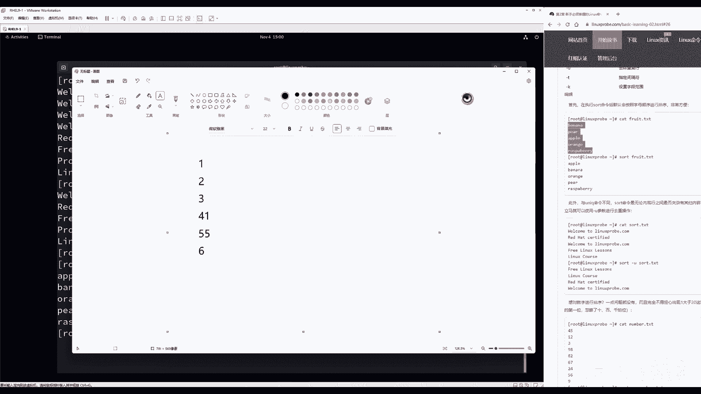

# 第2章 新手必须掌握的Linux命令（下）（Linux就该这么学） - P1 - 老刘努力不废话 - BV1yc411m7Pa

hello同学，欢迎大家继续来到咱们这个第六天的homo hc，真正九视频课程，今天继续来去学习一下，第二章节，2。6小节，2。7小节，对于文本文件的进行一个管理的操作啊，感觉很神奇啊。

第二章节我们居然讲了三天啊，这样的话同学们有时间来进行一个呃，充分的消化和吸收，我们的话呢讲课起来也非常的轻松了，这样有更多的时间把这个课程讲的细，不用再受到时间的约束，这种感觉非常的奇妙啊。

这要是以前在线培训的话，确实是不太敢讲这么多好，总之第三天吧继续来去学习一下第二章节，同学们翻开书2。6小节啊，同时打开试验机，前面这个实验吧比较简单，对应的都是单个的命令，其实同学们一边听课。

一边看视频啊对吧，一边打开试验机，我们一边就可以把它过掉了啊，然后后面的话就是自己复习了，所以我一边讲课的时候，同学们是可以一边进行操作的，加深一下印象来，首先登录这个服务器的时候，选择没有被列出。

not least啊，选择管理员的身份，root用户登录它，密码就是我们安装系统的时候所设定的，此时此刻的话呢，还是要使用管理员的身份来进行登录。

因为对于文件管理操作，涉及到一定的这个权限的影响，如果说您没有使用管理员的身份来进行登录，就有可能导致权限不足，而这个操作是吧，好那我们第五章节的时候会讲到用户的权限。

所以现在没有讲统一使用管理员的身份，来进行登录，这个使用管理员吧，没有什么不好，然后我们会在第五章节的时候，会讲到这个用户的身份，你就知道啊，这个到底有什么影响，然后以及会去学习到这个速度服务啊。

或者去使用到宿命，那就可以进行呃，呃那我们就可以对于我们这个用户身份，来进行一个自由的切换了，现在既然咱没有去学呢，啊，我们第五章节还我们还没有讲到呢，所以我们就先都使用管理员身份，登录这个服务器啊。

避免因为权限的问题，让因为第五章节的知识，然后让我们第二章节的这个实验出了错了。

所以现在统一登录管理员，然后打开这个terminal终端。

那接下来就可以去做这个实验了啊，我们第五章节的时候给大家细聊，没有必要，因为第五章节的知识接，让我们第二章节的这个实验做失败了，所以先是管理员不考虑这个权限，这个权限怎么回事，我们以后再给大家聊。

先去审核人员登录他，我说一些废话，主要是对目的是让同学们打开试验机，然后准备开始操作了，准备开始去敲命令了，如果准备好了，开始上课，如果没准备好，把视频暂停一下，准备开始上课，来啊，开始啊，2。6小节。

2。6小节，我先回忆一下，先回忆一下啊，就是我们2。42。5讲什么呢，我们是不是就学习了，对于这个文件的一个查找呢，以及我们对于我们的不同类型的文件来进行，一个定位的方式，就是啊并且我们去查看啊。

去那我们也可以去查看这个服务器，大概一个运行状态等等等等的啊，这是我们是不是学习的，如何去查找的一个文件呢，而我们要知道在LINUX里边一切都是文件，甚至来说硬件都是被映射成了文件的形式。

保存到我们服务器里面都有这么一个概念好，那么下面就要给大家提问了，我们现在也能够去找到一台服务器里面，对应的文件了，下一步干嘛呢，下一步就要去怎么样对他进行管理，也就是对它进行一个查看。

怎么样呢啊进行一个修改，进行一个删除等等这样的这个操作，我们简称对于数据库里面的，我们也会这样的这个操作叫这个增删改查，对于文件来讲的话呢，基本上也就是这个操作了对吧，我们要对对对它进行一个管理操作来。

首先第一个命令叫做cat命令，首先来去使用到这个IOS命令，查看一下目录当中有哪些文件，目录文件类型，第六章节会带大家去细讲，现在先简单有个概念，就是黑底蓝字是目录，黑底白字是文啊。

它叫的这个文本文件，这个文本文件嘛也叫一般文件，因为很多书里面啊，呃反正老刘的书里面会把它叫做一般文件，或者把它叫做这个文本文件，很多书里面这个叫法不一，这个作者的话呢可能根据你的喜好来去说。

比如我们会把这个呃，那比如说我们会把这个加目录对吧，我们可以去使用到CD一个波浪线叫加目录，还有作者把它叫做主目录等等的，这个说法不一，但是我们为了让大家更好的去适应其他作者啊，他们这个编写习惯。

我们给大家说一下啊，这叫一般文件，也叫文本文件啊，然后的话呢也叫配置文件，所以不同的书里面只要提到这个名字，基本上大差不差都提到的是这个东西啊。

在红包real9里面它是一个黑底白字的，在红包RO8里面也是一个黑底白字的，在红包六七里面，默认的终端是一个白底黑字的啊，反正我们总是看到这么一个东西，它就是一个文本文件。

然后当然也可以通过其他的方式去给大家看，比如说去使用到file命令，去查看他的这个配置信息，它会是说它是一个它会是一个文本文件啊，这么一个类型，总之先通过这个颜色进行一个初步的判别，那先向中医一下。

先去通过这个眼睛去看一下这个患者，然后通过触诊大概去判别一下好，总之这个是一个叫做文本文件，而这个黑底蓝字的话呢。

我们叫做目录文件，一定要加上这个目录文件，在windows里面它叫做目录，在我们的LINUX里面它叫目录文件，它都是文件吗，甚至我的命令文件，还有我们的配置文件，还有我们这个设备文件。

它都是要以这个这个啊，它都是什么什么文件结尾的好。

接下来我们去说一下，这个文件来进行查看的方法，就是可以去使用加cat，然后加上后面的文件名称，后面加一个文件名称，按一下回车就好了，记住有两个点再给大家强调一下啊，毕竟是第二章节啊。

我们出去第二章节这个刚刚开始学习啊，对于这个章节的这个尊重啊，再给大家再去强调一下什么呢，命令和参数或者对象之间要有空格去做间隔，参数和参数之间也要有空格去做间隔对吧，这是第一点。

第二点请同学们回答一下这个东西是什么，如果我告诉你这个是个命令，那么这个是什么，它是不是我们的参数吗，它不是参数，它是对象，它是我们命令的一个承受方，所以它是一个用来去查看的对象，它也就是啊。

他就那么它也就是一个对象啊，于是查看一下cat，一下就能够查看到这个文本里面的所有内容了，非常简单，就那个什么没有就没有，就没有什么难度啊，非常简单啊，非常easy，那么还有什么可以讲的啊，加个参数吧。

那否那么否则太水了，来加一个杠，小N参数代表就是查看这个文件里面的内容，同时加上行号来，于是按一下回车，于是就出来了，没什么可说的，谁看这个啊，太简单了啊，这太难了，就这么点事，那就是这个可以去使用。

要cat来继续查看一个文件，但是你有没有发现一个问题呢，我们去使用的cat，然后去查看到一个大文件的时候，这个文件是什么，不用管去看一下啊，当我们去查看到一个大文件的时候，会出现什么样的情，这个情形呢。

就会在屏幕上面是飞过很多很多的文字，虽然说很这个契合于我们对于黑客啊，这种啊数字流那种感觉，非常感觉非常的酷炫，但说实话其实我是一什么都没有看清楚，这样非常快速的滚动，我们什么都看不清。

那么这个时候的话呢，我们这个cat命令就不太合适了，它用来去看小文件比较合适，要想去看大文件，更推荐去使用的是一个more命令，他像看小说一样，可以一页一页的翻译。

也特别好去使用到more命令后面加上文件名称，也就是对象吧，要去查看的这个呃呃对象，文件名称A，下回车它会出现一个像小说一样的翻页界啊，但是这样的这样的一个功能页面，我们可以按下回车往下翻一行。

我们也可以按下空格往下翻一页，这样并且你可以看到了，它这个左下角会有一个阅读的进度条，可以知道大概已经阅读了多少了，并且我们可以往上往下可以进行一个翻阅，特别的方便，总之如果要想看大文件的时候啊。

推荐大家您就可以去使用到这个命令。

去使用到more去看它有一个翻页功能特别合适，但如果是一个小文件的话，那么则是使用到cat就比较方便了，那么现在有两个问题，第一个问题同学们会问说什么叫大文件，多大是大文件。

多小是小文件，大小文件如何进行界定，我们给大家建议，就是如果一个界面里面能够包含的下的。

我们把它叫小文件，比如说这个内容就一个页面或者一个页面。

多一点点好，叫做小文件，如果说咔咔翻页，翻了三四页了，叫大文件，这个我们这就是大家常的第一个问题，第二个问题，什么时候去使用的cat，什么时候去使用，more是建立在我们已经知道这个文件大小情况下。

我们再去使用的，如果说这个文件我都没有去看过呢，我也不知道它大还是小，这属于什么呢。

这叫做这个祖父悖论啊，那么如果我们还没有看到一个文件，在这个前提之下的话呢，那我们则统一的全都是使用到more就可以了，因为去使用到这个莫名令它既可以去看大文件，它也可以去看小文件。

也就是说当我们不确定这个文件大小的时候。

可以去使用到莫名来进行一个查看，那也是可以的，来下面一个命令就是没了，第二个命令我们一起一并给大家讲完了，非常简单，没什么可说，下面在下面第三个命令叫做head命令头命令。

这是用来去看这个文件的前面有多少行，比如说我想去看这个文件默认的前十行，就是使用的head，后面加上文件名称A1下回车啊，那么出来了这个文件的前十行空行也算哦，哇空行也算一行来。

那如果只想看这个文件的前五行的话，则是使用的CD，然后一杠杠N5，后面加上文件名称，就可以只看这个文件的前面的五行，就特别的方便啊，只看前面的五行，那么我们也可以只看后面的五行。

这个命令叫做tail命令，尾巴头看前面啊，跳看啊，后面啊这个尾巴去看后面后面的十行，也是后面追加文件名称，A下回车只看这个文件的后面的是这个十行，如果说只是想看后面的五行的话，则是跳杠N5。

后面的这个参数指定的是我们要去看的函数，后面你要告诉他我想要看多少行，比如说我写一个五，再按一下回车，也就是说这个杠N参数什么意思啊，同学们就是总会问说，这个杠N跟杠五什么关系呢，他们都是参数。

我们理解成就是在写数学题的时候，我们是不是要在啊，如果遇到一个比较大的一个题目啊，比如像这种解一个应用题是直接写答案吗，不啊其实也不，其实也不是啊，要先写一个解这个字，是他他要先写一个解这个字。

然后再来作答啊，假设啊这个怎么怎么怎么着对吧，那我们开始去做题，那这个解这个字如果你要是不写是不扣分啊，那那大概可能会他可能会扣你两分，或者他可能会扣你一分，但如果你光写个解字，你有分吗，你也没有。

所以这个是一个格式，要求我们要告诉系统，你要告诉这个命令要去查看的这个行数，前面就要加上这个解这个字，加上这个要想去指定它这个参数的参数啊，那么指定它行数的这个参数啊，这样那只看查这个最后的五行。

这样的方法进行查看，除此之外的话呢，还有一个玩法，就是这个tail命令，可以去持续去刷新一个文件里面去听的内容，我们去火车站去等车的时候，或者去飞机站去等车的时候，会有一个大屏幕。

它会实时滚动最新的航班信息啊，这个怎么去做到呢，它可以通过数据库来进行一个实践，也可以通过tail命令去查看一个文件，最后的几行，比如说我想要去持续去刷新某个文件，最后的这么一页内容。

那我们就可以加一个杠f fresh去持续去刷新，比如说我去刷新系统当中这个日志文件，来warm的啊，warm目录里面的log里面的message，文件内的这个对象名称A1下回车。

它就会开始去持续去刷新这个文件，大家可以看到左下角光标正在闪烁啊，我们可以这样子啊，打开另外一个窗口，我随便的去起呃，怎么样才能够去刷新日志呢，去重启一个服吧，假设说我现在去重新的去启动一个服务。

浴室可以看到了吗，是不是这个日志发生的变化再来一遍啊，同学们看好啊，123走，看到了吗，它发生了变化，也就是说，当我的这个系统日志发生了变化的情况下，他会第一时间体现在我们的屏幕上面。

因为在去使用到tag命令GF，进行一个持续刷新啊，占了一个玩法好，那我们也就是说你就能够去看大文件，小文件，长文件短文件啊，然后以及我们能够看到这个文件的，前面的这个十行。

后面以及文件后面的十行还有什么玩法呢，对于文件来进行批量的格式化转化啊，这个我们也可以去实现，这个我们叫tr命令，例如说这个文件里面同学们可以看到啊，这个里边有大写字母，小写字母，还有这个数字等等的。

我们能不能进行一个批量替换呢，就像老刘啊这些呃，就是因为我们这个啊国内书卖得不错，所以的话会有一些盗版的这个软件啊，或者这些盗版厂商，他会去防我们的网站和防我们的书籍。

那么就会把我们的名这个名字批量替换好，假设说我想要把这个里面的内容批量给大大啊，我们给他批量替换成大写，或者把里面的这个老刘的名字给他，批量替换成老李，这怎么去实现呢。

批量替换就可以去使用到transfer命令，它的这个英文的这个命令叫做tr命令，他本身没有能力去读取这个呃文件里面的内容，它需要有第三方的这个程序，然后来直接把这个呃信息传递给他。

所以我们要先去使用的cat，来去读取这个文件里面的内容，然后我们按一下回车啊，他是不是要原先要，就是我们按照正常情况下来讲，他会把信息输入到屏幕呢，好这个时候不要走，我们去使用到第三章节。

马上就要去学习到的一个叫管道符，按住shift，然后按一下回车上面那个键，输入一个呃这样一个嗯竖杠杆，那这个的作用就是将前面一个命令，原本要被去输出到屏幕的内容，交给后面的命令，再来进行一次二次处理。

这个命令就叫做tr命令，它会把前面一个命令的输出结果，当做后一个命令的输入结果进行一个二次处理，tr我们将然后再去取使用的这个通配符，也是以后给大家讲到的，下一章节给大家讲的。

将所有的这个小写字母A到Z，批量替换成大写字母A到Z，这样做完了之后，于是刷新一下，看到这个里面的文件内容，就变成了全都大写的这样的一个形式，同样的我们也可以在里面加关键词，把老刘大写在这里。

老底替换成这里，于是我的这个作品就被人替换了，就差不多是这样的一个效果，要想在那配置文件里面批量去替换某个关键词，就可以去使用到TR去做特别的方便啊，如果一个文件里面要有上百处需要修改的，这个点啊。

那我们就拿那我们一条命就可以把它完成了，特别方便，再往后的话呢就是这个文件的这个大小了，那提到文件大小，就不得不提到这个WC用来统计文件里面的行，数列数字节数的，假如一个文件很长。

我们想要想知道它里面有多少个行，那么就是一个小写L后面加上文件名称，标准的什么呢，命令参数对象的一个格式，命令参数对象就看这个之后非常的欣慰啊，没有比这个更标准的命令行的格式了，命令参数对象啊。

这个三折哎呀，乖乖的躺在这里，看起来非常舒服，对这种对于我这强迫症来讲特别的舒服，来按一下回车，命令参数对象三者都全了，按一下回车统计出来，这个文件里面总共有43行行数，列数能啊列数不能统计。

但我们能统计这个行数，还有单词数呢，单词是可以的，它可以，因为每个英文单词是用到空格做间隔吗，那么就是一个小写W，那大小写W按下回车统计，这个文件里面总共有了93个单词，93个单词，这个非常的方便。

还有什么呢，字节数统计多少个字，那我们就是一个小写CNA加回车978，要给大家讲两点，第一点，统计单词是不能对于中文文件来进行操作，因为中文的话他不知道哪个单词是哪个单词，这个属于人工智能了，这太难了。

它不能像英文单词一样，每个是一个空格，这个它啊这个命令是文它它它是做不了的，第二点，统计字结束的话，那这个呃，呃如果说统计的是一个中文的一个文件，那么你基本上要把它跟前要除以二。

因为这个啊因为根据这个X码的这个这个规定，每一个英文字母它占用的是一个字节，每一个中文字母占用两个字节，每一个标点占的是一个字节，所以如果统计中文的话，大概这个数字大概这个字节数除以二。

就是我们的文字数量啊，这大家知道一点就好了好，这是WC命令，再往后的话呢就是叫做这个state命令，在windows里面我们所知道的文件的这个时间，无非也就是最后的这个修改时间。

但是在LINUX里面它很难的，它里面分为三个时间，分为叫做访问时间和修改时间跟更改时间，其实windows里面也有，只不过我们不用啊，但是在这个LINUX里面，我们一切为了安全起见嘛。

还是要去了解一下了，这个命令叫做state，它可以去查看我们这个文件的三个时间来，分别叫做a time c tm time，给大家来细聊一下下啊。

细聊一下下，首先这个AHM的话呢叫做文件的访问时间，也叫做文件的最后访问时间，我算我给大家写下来吧，来啊这不给他偷懒了，原本想给大家口述一下，后来一想算了吧，啊给大家写出来来就是EMTIME。

这样的话同学们也好总结笔记吧，啊这个修改时间跟更改时间，同学们第一次听的时候是懵懵的啊，可能所在，所以在这个自学的时候，自认为自己已经明白了，其实也不太明白，好啊。

这可能对这个学习LINUX就是越学越觉得自己，越来越觉得自己菜了，来啊，这东西是这样的啊，最后呢就有三个时间在LINUX里边，第一个叫做a time，这个叫做叫做access a time。

就是文件的最后一次的访问时间，我给大家直接说了，口述，就是这个文，这个时间指的是最后一次去访问文，文件内容的时间，记住是内容，你去查看这个文件的属性什么的，不算好吧。

就是你最后一次去查看这个文件内容的时间，我们把它a time same time，更改时间，它指的是最后一次去修改文件权限的，这个以及属性的时间，比如说我修改这个文件上面的这个所有者。

所有组或者我修改了文件的时间，或者我去修改这个文件上面的一些呃，比如说像这个FC，或者我们家的这个FACL等等的，就是我们修改了这个文件，在这个属它本身内容没有变啊，就像我们在这个我啊。

我怕我怕大家不理解啊，所以我比较喜欢举例子啊，好比说我现在可能卖水果的，我现在有一些呃橙子，那我可能为了保鲜，为了好看，为了让它光鲜亮丽一点，可能会泡一下石蜡对吧，我看人家反正新闻里边有泡一下这个蜡。

请问我里面的内容有没有发生变化的，没有对吧，但是外边的话这个啊属性发生了变化，看起来更加的这个啊闪亮了，所以可能会啊他会他会有更好的品相，同样的就是这个same time。

它并不对于这个文件内容有进行的修改，它只是对于文件的属性来进行了修改，这个叫做这个same time，最后的话呢就做这个metime em time，指的是最后一次去修改文件时呃。

这个呃实际内容的这个时间，假如说我实际修改的文件在内的在这个内容，那么我们修改就是m ta，大家需要注意两点，第一点的话呢就是这个a time，a time呃，不是很准确。

有些时候我们去试过查看过a time，但是呃就查看过文件里面的这个内容，有些时候更新，有些时候不更新，这个取决于这个文件是否被占用啊，这个有时候不太准确啊，这是经验之谈，第二点的话，那就是提一个小问题。

I m time，如果我们修改了文件的内容，它是不是就会发生改变呢，肯定的对吧，因为我们修改文件的这个内容，所以time会随时发生改变，那么请问m time变了，或者我们修改文件内容的情况下。

c time会不会也跟着变呢，啊他想想这个问题，首先我们我们反过来说，你修改了same time，修改了属性m time是不变的，但是你修改了m time，也就是说你修改文件里面的内容了。

same time一定变，为什么，因为你的这个内容发生了变化，意味着什么呢，文件呢这个大小发生了变化，大小属于属性信息，所以i am time变c time必变，那大家就知道这么一点啊。

这玩意书上没有啊，这玩意儿书上没有，所以一定要记得这个书上面，那个一定要记得这个书上面来，继续来给大家去说，也不是说老刘故意骗钱，对不对，然后就是说书上面我们就故意不写上。

然后我们上课的时候给大家再去讲，来增加我们这个在线培训班的这么一个含金量，其实并不是的书上都写的话太多了，而且有些小白啊，他不愿意看，看完之后觉得太理论了，这这这东西只能是在这个上课的时候讲来。

接下来给大家去说啊，叫做这个gram命令，因为以前我已经给大家讲到了，他已经能够去看各种文件了，既然我们已经能够看各种文件了。

那我们是不是也可以在这个文件里面来进行，查找呢，之前学习的比如像这个locate funk等等的命令，他都是一起说，他都是在系统里面去找到一个文件，接下来我找到这个文件了，我如果在这个文件里面啊。

在具体的去查找到某一行呢，好比如说其实旧数据库里面查找功能吗，例如说这个文件里面有很多很多这个信息啊，这个呃能够看到很多统计出来行数40多行，我想要去过滤一下。

说过滤一下所有跟linux prop相关的，linux probe后面加文件名称去使用到grab命令，可按行去在文件里面进行搜索，搜索出来指定的关键词，诶你看不就出来了吗。

在这个文件里面这一行出现了一个我们的网址，这就是呃去使用的gram命令查看的一个方法，那大家也提问了啊，说什么呢，老刘这个这个文件里面有很多人大概有10万行，那这个啊里面确实搜到这个关键词了。

我怎么知道这个文件里面那个关键词，它在文件里面是第几行呢，可以加一个小写杠，N参数代表就是显示出来它所对应的函数啊，行号来走你啊，19行第十第19行出现在这个关键词，那么下面同学们再来提问。

说老师我能不能做反选呢，如果说我现在已经找到这个信息了，我想把它反选反选出来，所有没有包含这个微电子的行杠V叫做这个呃，这个话呢叫做反选啊，叫做反选啊，web对吧，我们来进行一个反选。

来我们来去进行一个反选啊，好像动词应该叫做这个呃，呃reservation reserve是吧，它叫这个反选对，让我们把它这个进行一个反选，反选过后得到了所有没有关键啊，没有包含这个关键词的行。

那接下来我们再来就是给大家提问了，那老刘有一个问题了，那我们今天也能够行进行了一个提取，那我们能不能按列来进行提取呢，比如说我想提取出来第几列的这个信息，能不可以啊，但是我们可以看到它里面这个关键词。

它里面的每一个这个行的分号，不过他那不他们个行的这么一个间隔符啊，实际上是个空格，我们给大家选一个比较简单的一个文件，更好给大家举个例子啊，比如说像etc目录里面的这个pad6D。

它是用来去保存文件属性信息的啊，这个大大家看一下就行了，这不是重点，第五章节会给大家去细聊，我先简单给大家过一遍啊，不要那么呃不要那么紧张，首先第一点第一列指的是文件的名称啊，不不不不啊。

讲错了啊啊首先来说第一列指的是用户的名称，第二列指的是用户有密码吗，这个它是在etc目录里面叫shadow的文件，那当前如果一个呃这个消息X代表是它有密码，这个这个指的是这个用户的UID。

这个指的是这个用户的GID，这个指的是用户的一个描述信息，这个指的是用户的家目录，这个指的是用户的一个终端，什么含义，不管他全不管它，就第一眼就看上去，您觉得什么东西，最多就是我们一眼看上去这个文件啊。

有个大概就跟相亲似的，哎我们一眼就看看有没有，这个第一眼的感觉是什么啊，第一眼感觉是什么乱，第二眼是什么呢，很多的冒号，大家有没有发现很多的冒号，冒号间隔了一个一个的字段，每一个字段有自己的特呃。

呃它有自己的含义，那么好了呃，总结一下这个文件，这个文件里面保存的是用户信息，这是啊第一个总结出来的，第二个总结出来的信息，第一列保存用户名称，然后第三啊每个字段的话用的是冒号做间隔。

现在给大家提需求就来了，就很就很非常简单，请问我如何提取出来，当前LINUX系统当中所有的用户名称，这个很啊，这我们可以去玩一下了，呃如何去提取出来，在我们当前LINUX里面所有的用户名称。

列一个用户名称表啊，单出来，那怎么办呢，去使用叫cat命令来进行一个提取，cat命令按列去提取，横是行，竖是列，cat做提取要加参数上来说，加上一个杠D指的是间隔符，以冒号为间隔符提取出来啊。

然后写一个小写app，提取出来第一列的这个字段信息，后面加上对象名称，要想提取的文件名称，按下回车，于是出来了，这就是去查看系统中所有用户名称的一个命令，这玩意哎呀讲就讲这个啊，特别的有意思啊。

同学们因为看来这个参数的话呢越来越长啊，已经能加两个参数了，我们多棒啊，啊一个命令行里面我们使用了两个参数，就非常的高级了高级了好，接下来再来啊，接下来再来给大家说一下，叫做这个命令，一听这个词。

老刘我知道啊，上学的时候学习过叫不同的啊，这个叫做有区别的，比如说我现在有两个文件，我想知道他两个文件是否相同，我一个数据库做了备份，另外一个数据库作为一个蜜罐啊，诱导一个骇客来对我进行攻击，攻击完了。

我们对这两个文件来进行比较，看看他修改了我哪些内容啊，比如说工资单我就放在这个桌上了啊，那我作为老板，一会儿可能过来一个员工改了个信息，他刚改了个谁的工资，于是我可以把新老文件一对比。

就知道他修改在哪一处了啊，好我们先来给大家准备出来这两个文件，同学们闭眼啊，先闭眼不要看，因为什么呢，因为我们现在新建出来这两个文件吧，这个使用的是这个文本编译命令，叫做这个呃。

呃这个是使用文件编译命令去完成的，现在的话呢没有去学啊，所以同学们先闭眼，不要去看，哎呀啊，不能复制吗，啊这个问题肯定是出在了，我这个虚拟机没有安装VR，VR truth这个工具安了啊。

但是能不能复制啊，那个很讨厌，我们现在没有去CBM，BM还第四章解说给大家去细聊呀，等等一下啊，同学们，我要重新装一下这个呃，这个呃，Where tooth，既没有安装这个软件，这个这个这个小插件。

导致他不能够复制，不能够复制，那可麻烦了，要一个一个手输的太慢了，等稍等一下，我倒杯水，待会把它敲一遍吧。

那我们继续来给大家继续说啊，已经已经解决了。

那直接就是往里面一复制就好了，准备两个文件，准备两个文件，同学们接着闭眼啊，不要看啊，否则会给大家增加压力来，首先来说把这个文件里面的内容往里面一复制，然后再往里面再新建出来，第二个文件。

两个不同的文件来进行一个比较，刚才怎么解决的是吧，刚才怎么解决的，我也不知道啊，刚才就是喝了杯茶，然后把这个熏鸡还原了一下，就能复制了，也不知道什么原因啊，因为我刚才检查了一下这个vm choose。

这个正常安装没有问题，还原一下虚拟机自己就好了，有些时候就是这样啊，我们可能学习这个LINUX或者学习这个IT技术，学到最后就是玄学好，我们最后再来了啊，然后我们来去查看一下这两个文件。

同学们现在想看一下这两个文件啊，同学们请看一下这两个文件内容是否相同，同学们看一下第一个文件A点text，然后去B点text，这两个文件的内容是否是相同的，大眼一看啊，肯定是不一样的，但是我们在一细看。

好像也有点相似之处，比如说第一句话的话，这个to变成to对吧，特别特别特别的长，但是我们可以看到的话呢，第二行跟这个文件里面的这个第三行是一样的，第四行的话呢，第四行跟这个行也也不太一样。

第五行多了个这么个东西，第六行第七行有还有都是一样的，所以也就是说这个文件里面的话有相同之处，也有不同之处，我们现在就可以对这个文件来作为样本，来进行一个学习，首先再来DFF直接来。

如果说我只想去看这两个文件是否是不一样的，那我们就可以加一个brief，只去看那个最简单的信息，只去看这两个文件是否相同，我不太关心具体不同的点是什么呢，就是A点text加B点text，我们多棒啊。

都已经会加两个对象了啊，已经有两个对象来按一下回车，可以看到了A点text跟B点text它是不一样的，非常好，那他会只告诉你说这两个文件是否是不同的，如果说我们想要去看具体的不同的点，怎么看呢。

就是加一个杠C1个小写参数杠C可以看到了，它总共是有五行，它总共是有七行不同的行，前面用到叹号做啊，还有我们做的标记就可以知道它具体有哪一行，是啊，它是有区别的，这特别的方便来它可以记一下啊。

DIFF命令它的方法，它的这个功能，顺便大家去查看两个文件不同之处，以及是否不同的，那非常简单，接下来第11个命令叫做unique，诶，听这个unique这个词，好像当同学们比较的眼熟啊。

UNIQUE是啥，优衣库是吧，这个有一个这个服装品牌，叫做这个优衣库就是了，他中文名字是什么意思呢，优衣库实际上就是独一无二的意思啊，虽然他的衣服谁的千篇一律，但是的话呢它的这个创作的初心。

实际上是让每个人穿上不同的衣服，以及廉价和舒适的衣服啊，有这么一个品牌，在GLINUX里面也有这么一个命令，叫做UNIQ，它也是独一无二的意思，假设说我们有一个文件叫做C点text。

同学必然来B不要去看这个文件怎么去新建的，我们第四章节会给大家讲，如何去新建这个文件里面的内容，呃，呃还没有去新系，别来闭眼，好不好意思啊，这个手有点滑，来睁眼，同学们看一下C点text。

看到这里面的话的内容，其中前四行有了一个重复的广告，那我们怎么样把它给合并呢，我只想要让某一个文件里面的某一行，那它就是一个唯一的去重啊，去掉重复，这个非常的实用，这个非常的实用，那怎么办呢。

就是非常简单，U n i q，然后的话呢后面写上这个文件的名称，C点text，自动帮我们去消除了，有些时候我们也会遇到这样的这个情况，说一下应用场景，在网站里面有些时候会发一些小礼物啊。

同学们可能怕自己提条命啊，可能怕自己没有提交成功，可能会重复的提交，那可能就会被重复发很多份礼物了呀，为了避免这样的情况，那可就要做一下查重对吧，我们把这个重复的这个呃信息给他进行合并。

每个人只发一份啊，每人都有这样的一个功能，我们就可以通过这个UNIQ来去做了，非常好记，但这个有一个致命的缺点是什么呢，这个命令看起来好，实际上它有一些缺点，就是它必须是两个相邻的内容。

如果说两个文件它是这样的啊，呃如果说有一个文件是这样的，内容是123，然后的话呢，然后四五比如说有这么一个文件，它前面的这个一一是这样的，然后会变成这样的，那如果说这样的这个文件它进行合并之后。

它会是这样的，123415，也就是说它只能够把这个相邻的两个内容，再进行合并了，那如果说它不是相邻的都可以，那它就不可以合并，那么我们怎么进行一个操作呢，肯定那肯定有这个解决方法啊。

叫做source来进行合，但它进行排列，我们先按照这个首字母或者按照大小，总之我们呢一下这样这样一个规则，针对它进行一个排序，把相同的内容的得先把相同的内容放到一起，然后再进行查重。

你说这玩意儿它就非常的就这个有这个啊，非常有逻辑啊，来首先来讲，第一个必须要把相邻的内容先放在一起啊，不把相同的内容放在一起，比如说有这么一个文件调D点text，同学们看好里面有一些水果的名字啊。

水果的名字我们是怎么样对它进行一个排序呢，通过英文单词的首字母，这个apple肯定反映这个banana前面好，通过这个首字母来进行排序，叫做sword，后面直接加文件名称。

默认情况下就通过这个首字母来进行排序，但是对于数字来排序又有问题，为什么呢，假设说是这样的。

如果说有一个数字，如果说有一个数字来等一下啊，嗯如果说有一个数字的排序是123456，这还好，这个没有问题，但是如果说我们的这个数字是这个样子的，那么它最后排完了之后也会是这个样子的。

因为他按照这个首字母排，但是众所周知啊，你欠人家六块钱，你不能还55块钱，六没有大于55啊，除非是高利贷，这个时候怎么办呢，你就要把它变成一个叫做数字类型，然后再进行排序了是吧，怎么办呢。

把这个六放到前面，1236，41和55这么排序。

假如变成数字的话，我们则使用的是一个杠U呃不呃，这个的话我们则使用的是一个看一下啊，那么这是一个杠N啊，SN加上一个数字，我先给大家写出来吧，ABCDE唐文再来啊，闭眼嗯，我新建一个文件出来，好睁眼来。

cat一点text，有这么一个文件经排序非常简单，不要用到首字母了，首字母的话，那么这个一肯定会放在最前面，12肯定会是小于到三，那肯定不对的对吧，来这就是sort，然后是杠N后面加上要去排序的对象。

把它强制变成一个变成一个数字，按一下回车走，你可以看到没有问题，通过这样的这个方式就能够对它进行一个排序，那也有方法来进行一个，那么也有方法对它来进行一个查重，那么就是在去加上一个杠U参数。

直接把这个两个命令进行一个合并，去掉重复的，那这个也可以去完成，所以所命令的自带有这个进行查重，这样的一个功能，把它去掉，重复的那这样的一个方式，那么还有一个方法非常的高级啊。

在这个三在线培训里面不敢讲是什么呢，我们能不能就是你看啊，现在我能够已经把这个sword，跟这个unique进行一个合并了，就是使用一个杠U两个命令进行合并，你先进行排序后进行查重大。

他他他他他他都可以完成，那假设说有这么一个文件，这个文件里面保存的还是用户的信息，刚给大家讲过的，那么这个第三列的话呢，叫做这个用户的UID号码，那也就是说用户的唯一标识符可以看到啊，五十九七十998。

然后81他这个U额UID号码，现在就是我们的身份证号码，那如何进行一个身份证号码的自动排序呢，也就是说我们能不能根据这个文件里面的，第三列的这个值来进行一个排序，这个就很难了，但是也可以去实现。

叫做大家看好了，叫做salt，然后的话呢我们将cat命令这个命令给他呃，也集合到一起，直接就是一个杠D1个冒号，它指的就是以冒号为间隔符，杠K3，以第三列的这个值为进行一个排序标准。

然后我们加一个杠N把它作为一个数字，否则42他就会去啊，大于111了对吧，就会有这种情况，所以我们现在加上这几个参数，后面再加上文件名称，我再给大家捋一遍啊，我知道大家有没有跟上。

首先去使用到所命令来去读取这个文件，读取对象叫etc目录里面的pass，WD里面保存用户信息，它以冒号为间隔符提取出来第三列的这个值，第三列的UID的这个值，以数字的方式来的这个类型来进行排序。

然后按一下回车出来了，嗯啊SGD啊，不好意思啊，它不是杠D了，在这个cat命令的一个呃，那我们要去使用的cat命令的话，则是刚D那为他指定间隔符，SD命令里面是gt啊，gt看来还得照着词儿说啊。

咱们刚才太过于激进了啊，没有看书，开始就有点这个脱稿了，应该是不同的命令，不同的参数，它的话应该是gt啊，太自信了，来按一下回车，可以看到，他就通过这样一个UID号码来进行排序。

每一个UID号码从大到往小来进行排序，并且的话呢没有什么，并且啊他是杠N了嘛，等于说他直接通过数字的方式来进行的，这么一个排序，好下面接下来给大家讲，就是能够去看文件了，下面一干嘛呢，增删改查吗。

我们要能增加啊，怎么去新建出来文件呢，文件有不同类型，不同的文件的类型对应的是不同的命令，就特别讨厌啊，它它它并没有一条通用的命令，可以新建出来所有的文件类型，这个很难来。

最后我们首先去想第一个叫做一般文件，就叫配置文件，那新建方法就是touch摸一下啊，我新建出一个文件，好比说叫哈哈呀，我们的意思就是说这个呃，假如说这个文件里面的内容，或者说这个文件名称无所谓的话。

我们就把那个哈哈吼吼什么的，避免说起的非常正式的一个名字，同学们好像比如说呃，嗯就是我们非常正式的名字，同学们会误以为是必须要用这个名字，大家能理解我说的这个意思啊，所以我干脆就是一个非常显著的啊。

可以明显就知道这是随便起的一个名字，来按一下哈哈，那按下回车，大家看一下啊，就多出来一个文件叫哈哈了，然后去查看一下这个文件上面的这个属性信息，于是会发现这个文件已经在我们当前目录当中，新建出来了。

叫做哈哈啊，这么一个文件在LINUX里面的后缀是无所谓的啊，同学们会问到说，老师为什么不设点TX结尾呢，后缀是无所谓的，无所谓啊，完全无所谓，在LINUX里面，它是通过文件的类型来去区别这个文件。

它的功能的，而在windows里面，它是通过文件的后缀来去判定这个文件的功能，以及文件类型的，大家要理解，windows里面看后缀啊，如果说你把一个图片改成一个呃。

这个呃改成另外一个这样一个这样一个后缀，他就打不开了，但是在这个LINUX它是文件类型来进行一个判别的，所以你即便是一个压缩包，你可以也把它改成，把随便改成什么样的一个文件类型。

理论上来讲它都可以打开的，或者你调用它的时候，使用到对应的命令也能够打开，没有问啊，是没有任何问题，好我们现在现在出来一个文件叫做哈哈，还有什么可讲的，没有可讲的，还有一个可以讲的。

就是刚才讲到一个叫做TCH命令呃，我刚才讲到一个叫做这个state命令，可以去查看这个文件的a time，c time和time3个时间，这个时间能不能修改呢，可以修改，我的意思是能不能把它给改回去呢。

可以改回去，我给大家举个例子啊，假如说现在是3。04分，有这么一个文件叫哈哈，没有问题吧，他的新建时间是三下午3。04分，我对于这个文件内容进行编辑，不管怎么编辑啊，不管他啊。

总之我对于这个文件内容进行了编辑，我是一名骇客啊，我对于这些数据库来进行了篡改，按一下回车修改吗，修改好了，再去查看一下这个文件文件的时间变成了这个，因为我们去查看文件的这个啊10号去修改的嘛。

于是可以看到了变成了03：05分了，也就是说我们随着内容的编，这个编辑这个时间也发生了变化，但是我不想让别人知道我编辑的这个文件时间，怎么办，比如说我们可以看到去查看这个文件的时候，已经变成了03：

05分了，怎么办呢，它是一个刚D，它可以修改time跟这个a time啊不啊，他可以去修改的是啊这个啊那啊对对对，我也没有说错啊，他可以去修改文件的这个最后的这个修改时间。

以及文件最后这个访问时间，m time和a time这两个时间可以去修改，而他不能够修改这个same time，same time是这个LINUX的最后的底线无法被修改啊，还是就保护一下这个文件。

这个文件最后修改时间啊，他这个文件属性修改时间杠B，比如说刚才是15：04分好了，我把这么着改回来，按下回车再去查看一下这个文件，会发现时间啊，他这个文件的最后的修改时间，这m time变成了3。

04分，同时文件的内容也确实是发生过变化的，我既做到黑客了，我又去把这个文件时间改回去了，让人家误以为我没有修改过这个文件，非常简单的一个小实验啊，让大家知道知己知彼，不让大家都去做黑客。

我的意思是让大家知道，他们是可以这样去做的啊，他们是可以这样去做的，好下面一点啊，下面一点我讲到了，在这个LINUX里面，不同的文件类型，用到不同的文件的命令来进行新建，下面叫做MKDL。

叫做make director啊，叫做新建目录啊，make directory啊，新建目录目录名称无所谓，叫做吼吼，好了啊，走你A1下，回收无所谓的东西啊，那有人那就让他彻底无所谓，好了。

来去查看一下当前目录中的文件，会发现一个黑底蓝字的一个东东出现了，叫做HH呃，还有什么可讲的呢，也有可讲的，就是要想去签到，要想去建立出来一个有签到关系的目录，比如说想要去新建出来一个新建出来一个目录。

里面的话呢是一里面的二，这个是我们的目录名称啊，新建出来一个目录，一一里面有个2345678，如果如果说我想一次性新建收来八个目录，并且这个八个目录有一个签到关系，有点像罗斯套娃一样。

这个时候他就会给我们报错了，他说因为你新建第八个目录的时候，没有第七个目录，新建第七个目录的时候没有第六个目录，以至于最后没有这个主目录，所以这个命令，所以这个目录就新建的是失败了，这个时候怎么办呢。

如果说我们确定要新建出来一个俄罗斯套娃，那我们就设一个杠P批量的记住这个词，批量的自动啊去创建出来一个有嵌套关系的，有依赖关系的，有父子关系的这么一套目录出来，A下回车新建出来了，训练好了之后。

我们可以再来去使用到CD，然后可以进入到这个目录当中，一里面的二，二里面的3345678，进到这个目录里面去，一长串自动新建出来，一次玩八个啊，并且八个有线的关系就是加一个杠P啊，加一个杠P。

要想去复制一个文件去使用的是叫copy命令，也叫做CP命令，哎，等一下啊，我问到自己的这个价目当中去使用到CP，假设说我想要复制一下这个哈哈的文件，是用一个CP原始文件名称哈哈要复制谁。

然后的话呢复制成什么呢，复制成哈哈吼吼嘿嘿啊嘿嘿，附上黑黑就这样去做，来查看一下哈哈的文件内容，查看一下黑黑的文件内容，原始文件和目标文件内容相同，复制成功叫CP命令。

那如果想要使用到CB来复制一个目录的话，则要加上一个将将需要加参数来给大家讲，我想复制一个目录叫ho啊，把ho的话呢复制成cc吧，比如说A1下回车，他告诉我们说它是一个目录，我们无法进行直接的复制。

你需要加递归操作，也就是杠杆操作来加一个杠R复制目录，加一个R操作C啊，然后按一下回车，目录新建成功，一个叫ho，一个叫信息都有了。

来给大家总结一下，就是去使用到CP去复制文件的时候，直接原始文件源文件，源文件以及目标文件直接去写就可以了，但是要想去复制目录的话，那么就是一个CP必须要加上一个杠，R叫递归操作，然后是原目录。

然后再加上一个，目标目录的名称才可以去完成，我给大家写全吧，同学们可以记下来，对于目录和文件的这个区别就是一个杠杆，那就是一个杠杆操作叫递归操作，对于目标来讲，它都需要进行一个递归操作。

比如说呃待会删除命令也要去使用到的，没有问题来。

没什么可说的，就这么简单啊，复制嘛就是来回来去复制，大家能分清复这个复制的这个人剪切的区别吗，复制的意思就是说源文件在不在在，新文件在不在也在啊，也就是说新浪文件都在，而剪切是什么意思呢。

剪切是说我们的原文件就没了，来把这个A点text，比如说啊我给大家修改成叫做哈哈点text，然后按一下回车，再去查看一下这个目录里面的文件列表，发现原文件就没了，新文件又有了。

于是就是说这是一个剪切操作，使用MV命令move啊，移动剪切，原文件没了，剪切到另外一个地方，变成了一个目标文件，新文件，那么现在给大家提个问题了，请问以我们为例。

当前在同一个目录当中进行的这个剪切操作，实际上是个什么操作，好先大家去思考这个问题啊，在同一个目录里面进行一个啊，剪切操作和粘贴操作，那我们实际上意味着什么样的一个，隐藏的这么一个功能，大家先去思啊。

思考着，我来给大家讲另外一点啊，怎么这个课有点紧凑，就是我们去使用MV进行剪切的时候，不区分文件还是目录，目录也是直接，比如说desktop这个目录直接dd走你啊，进行剪切剪切操作不用递归。

它直接默认递归，特别好，我反而比较喜欢这个剪切操作啊，当然分这个需求啊，分需求公布答案啊，顾不上一个答案是我们的在同一个目录里面，对于一个文件进行一个剪切，再进行一个粘贴的这个操作。

实际上是一个改名操作，也就是说有两个命令可以去改名，一个叫rename，还有一个就是MV，我个人比较喜欢用MV，那因为rename需要敲六个，需要敲六个字母，而使用MV只需要敲两个，比较省键盘啊。

毕竟自己买的东西比较爱惜，所以怎么省事怎么来啊，剪切B点test变成一个厚厚点test，就这么简单，改名吧，它就是一个改名操作，你可以把理解成就是一个剪切复制，也可以把它理解成一个改名，无所谓啊。

事实是这么个事儿啊，但是怎么说，怎么表述自己的这个方式，但是我们比较喜欢支持MV，进行剪切和这个改名都可以去做，接下来再来就是RM命令了，它的功能是用来进行一个删除的，有来有删吗。

这个增删改查都要有删除操作，例如说想去删除掉这个厚厚点test，直接RM啊，然后加上一个文件名称，按下回车走，你他问我们是否确定，当然大家都是成年人，我们对于自己的行为是负责任地。

于是我们按一下Y这个文件就消失了啊，没有问题，非常简单，那如果说我们要去删除100个文件，那么他就会问我们100次，每次每个文件都要进行一个二次确认，这个时候怎么办呢，我们就要去选一个杠app操作了。

比如说我想去删除掉这个哈哈点test的文件，哈哈点test看好了，我不希望你进行一个二次确认，我就加一个杠F叫false，强制的意思来按一下回车直接删除，不再进行询问，没有毛病吧啊。

再来删除掉一个目录呢，删除掉一个目录也是直接这样去写吗，没有不行，他要加一个递归操作，他说cannot remove download is a directory啊，就是它这是一个目录的意思。

那我们怎么办呢，加递归操作杠RDV操作DV操作删除一个目录，并且不带有二次学啊，他并没有一个二次询问，于是就这样去做，删除掉这个目录了，RM总结一下，删除它里面需要总结两点。

第一点RM RM直接删除一个文件，需要进行一个二次确认，比较麻烦，那于是我们可以加一个杠进行一个强制删除，后面加上文件名称也可以去RM，然后杠RF去删除这一个目录，但是一定要加一个杠杆操作。

叫做递归操作，于是可以记住就是删掉一个文件的话，默认情况下是一个杠F，如果删除掉一个目录的话，则是一个杠RF，记一下就好了，非常简单，下面一个小需求，同学们提问了啊，说到底。

但我现在已经会在这个CP命令来进行复制的，那我们能不能按照这个块来进行复制，什么意思啊，先喝口水，今天这个时间估计又得一小时，时间管理大师啊，咱们这个课虽然说第二章节被切了三段。

但是每一个章节的每一节课都在一小时左右，以前我们这个在线培训一节课讲完了好啊，当然够用了，够用了啊，并不是说在院培训有点快，主要是够用，没有那么必要，怎么细举啊，举个例子啊，举个例子，老刘啊。

这个生态管理期想，但是又过生日，假设说假就假设说啊嗯想买块蛋糕吃，吃不了一大个啊，怎么办呢，切小钱对吧，一个大这个蛋糕切小芽，那我这样就满足我的需求了，好了，我并且我可能听到我这个需求啊。

并且我可能需要这个蛋糕里面，那个草莓最多的那一块，我喜欢吃草莓好，假如说有这么一个需求，按块复制，这个怎么去做呢，可以去做叫dd命令，原先CP命令是你要买一整个CPU。

是买一整个你之前的文件是什么样子的，我就给你来一个一模一样的文件，新浪文件内容一模一样，百分百复来复制出来怎么办呢，吃不了啊，吃不了吃不了，这个时候就可以去使用到dd了，dd按块复制。

我可以只复制这个文件里面的一部分，我也可以去实现，例如这个文件的前十行，20行，甚至我可以来备份我的分区表都可以去做，我只需要一部分就来复制，一部分叫弟弟弟弟的这个词很难啊。

把这个命令有点有点难有点难啊，来我给大家总结一下他四个参数，第一个叫做IF啊，第二的话呢叫OF，第三叫做cat，第四叫做BS，来很多书里面啊，或者说这个很多上课的时候，如果有人把它叫if。

那就说明是这个学的肯定是看书的读者啊，要给大家讲一下，不要把它叫if off，我知道大家英文单词学的不错，但是这个两个是input file跟output file的一个缩写，所以同学们英文单词好。

同学也克制一下，自己不要读出来，它并不是if of，它是input file和output file，把它叫做F跟OF就可以了，这代表的是输入文件跟输出文件也就对标。

那对标来讲就是要从哪个文件来进行一个读取，要去输出到哪个文件里面，抗的代表就是计数取多少个块，BS代表的就是块大小，我们取多少块，然后以及框大小就能够呃，限定出来这个文件我们总共取多少个字节啊。

先讲例子之前，先讲这个实战之前再给大家一个举一个例子啊，之前看到一个格林童话是这么讲的，说有一个国王有一个漂亮的公主，想要找一个驸马爷，提了一个小问题，说给全国的人民出一道小难题啊。

谁能回答出来就可以取得这个公主啊，所以可以看得出来啊，这个西方社会当中曾经也出现过包办婚姻啊，原来也不靠这个爱情啊，是靠出题，有这么一道题，说有一个护城河，那这个护城河的话呢，长多少米，宽多少米。

里面装满了水，说给你一个勺，你需要排多少勺，能把这个呃这个呃里面的水给它快完啊，于是这个很多人都是啊发现都没有成功，废话嘛对吧，这不有病吗，后来有一个人说说我可以完成这道题目，但是你要告诉我勺子大小。

如果说这个勺子大小正巧等于这个护城河大小，那么我只需要一勺，而如果是这个啊，这个勺子的大小都要忘了说，如果这个勺子大小是这个合的1/10，那我就要快十勺啊，然后就这个国王也是疯了心了。

然后就把公主给他娶回去了，也不知道为什么这道题会这么说啊，也不知道为什么，第一次跟老丈人就是去刚了一下，然后老哥啊，然后最后还把公主娶回家了，总之就是有这么一个需求嘛。

你可以根据调整你的这个勺子大小来取，你最后取出来这个字节数的大小，能理解这个意思，就是我现在有一个勺，然后呢我去快我考多少次。

就意味着我取多少水，就这么一个东西啊来啊，然后首先来说这IF我们等写一个等号代表，就是呃我想要去从哪个文件里面来进行读取，假设说我读取的对象是这个文件啊，我从这个文件里面来去读取内容。

OF去输出到什么呢，输出到都用了啊，就叫叫叫这个老刘吧，然后呢我看了等于我取多少次，我只取一次，接下来我的这个BS我的12大小的话，12大小是50个字节，按下回车就这么去做，于是我就读取这个文件。

并且输出了一个大小为50个字节的一个文件，就这么厉害，非常简单，按需需分配，你这个勺子大小，那是50个字节，你蒯一勺就是50个字节的大小，你快两勺，那就是100个字节的内容，可以看到就这么简单啊。

非常有意思吧，非常有意思，还有什么呢，大家想这个功能好像没有他这个用处啊，虽然是有的啊，比如说我给大家再举一个例子，举一个技术上的一个例子啊，先举一个生活上的技术上的例子，也举一个。

假设说我们第六章节会去学习一个知识。

就是硬件的这一个划分，它根据UD微服务，以及根据LINUX里面的FHS协议，它的话呢我们的所有的硬件的这个数据，它都会保存在DV目录里面啊，比如说我们第一个硬盘叫做SDA，这个里面还会有分区。

假设说第一个分区叫做DV目录里面的SDA1，不管他啊，总之就知道就好了，我们的这个硬件的话呢，它总共它呃，它那我们这个硬盘，根据我们的MBR这个理论来讲，他第一个扇区大小，第一个扇区是多大呢。

大家知道这个在NBA里面扇区大小，主板12字节呃，其中的话呢前面的446个字节，它作为叫做主引导记录对吧，叫做MBR，后面的话呢64个字节，它是叫做这个分区表信息，然后后面的两个字节叫做这个结束符。

所以呃2+64加446，总共是512，这个大家可以去算一下啊，这个总共里边可以放四个，主分区信息的一个信息啊，把这个分区信息写入到第一个扇区里面的，叫做主分区信息，大家应该都知道这个理论对吧。

也就是说我们一个硬盘里面，最重要的就是第一个扇区的一个呃，前面那个呃他这么一个512的这个信息，把这个信息能不能备份一下，然后呢如果要是出了问题。

我们可以做恢复，有些时候我给大家讲啊，这个概率很小，出现过一台服务器预算好好的，就真的有这种情况啊，大家别说老六乌鸦嘴预计了好多年了，你接到手了，开开心心上人，第一天发现上面有好多土，就擦了一下。

发现这个电源被碰掉了，这个服器就起不来了，就这怎么就就就就这么神奇啊，服务器运行好几年，到你手里第一天坏了，就有可能是一个分区表信息丢了，怎么办呢，提前做一些小备份，然后这样的话呢，如果分区表丢失了。

我们也可以把它找回来，dd一个IF，那文件名称就是设备名称，DV目录里面的SA啊，输出到什么呢，输出叫做back up，或者说我们叫做这个随便哪个名称都无所谓，com等于是一取一份，大小是512字节。

就可以把这个设备的分区表给他备份出来了，就这么简单啊，以后这个可以很实用，备份出来，那可以备份出来，我们这个分区表信息512字节有了，你看包括这个呃，我们这个grab引导记录都有了，他有一个报错。

不管是备份出来了，我们可以把它读取出来了，还有的话那就是什么呢，就是我们在windows里面，可以对于系统镜像来进行刻录啊，这个的话在这个LINUX里面也是可以的。

比如说我想要把我们当前系统刻录成一个光盘，也可以的，比如说我想要把这个dd我现在挂载着一个光盘，我把这光盘把导出成一个镜像dd设呃，我们的光驱名称就是大家举一个例子啊，就是我现在有一个电脑，我电脑有工。

现在我要有，我现在有一个，现在是有一个光驱，我现在光驱里面放了一张系统盘，我现在把系统盘放里面之后，这个光驱就叫做DV目录里面的CDROM了，我给它导出表，把它把它变成叫做这个real点ISO。

我就可以把这个不用加这个count了啊，就不用加，我就可以把文章当前放在我供区里面的光盘，自动能转换成一张系统镜像了，并且系统系统镜像给别人了，电脑之后还能去安装这个特别的好使啊。

这个在windows里面，他们需要一些第三方的软件才能够去完成，而我们只需要这个dd命令，就可以把一张系统盘变成一个系统镜像，特别简单啊，好下面继续来给大家去说叫做file命令。

file命令的话呢是为了弥补了留下一个小缺憾，是什么呢，刚才给大家讲到了，黑底白字是一般文件，黑底蓝字是目录文件，他们叫这个我觉得很不严谨，烧油啊，这个太不严谨了对吧，那能通过颜色来进行划分的。

而且很多这个颜色是不一样的，就例如说你看这个文件里面什么色的都有，还有这个深黑色的，还有这种浅蓝色的，这玩意儿我们怎么去看呢，这个太乱了，这个东西还有这个什么，这是黄颜色吗，还是这种卡其色啊。

哎我觉得连凯我觉得连凯吉斯都知道，看来也是一个时尚潮男，好废啊，废话不多说，废话不多说，找回自己，然后才是这样的啊，去使用它file吧，你这颜色不嗯不太严谨了，没关系，就使用到fl啊。

后面加了一个文件名称，它就是一个文本文件，它是一个X码的文件嘛，它是一个文本文件，再来download，我解决这么一个目录没有了吗，删了stop desk top，等一下啊。

啊这两个文件刚才做实验的时候给删了，来不要紧嗯，file去查看一个文件，后面加上文件名称，就能够查看到这个文件所对应的一个类型了，他说告诉我们说这个directory啊，它是一个目录，查看一个文件。

所有的这个设备文件，它会把它叫做块文件，叫做block special，拿下的块文件就是叫做硬盘文件嘛，可以这么理解，光驱硬盘鼠标键盘它都是这个块文件，你可以看到，如果说你觉得这个颜色不严谨的情况下。

那么可以通过这个file命令来进行查看，你看这不就出来了嘛对吧，这个他告诉你，具体这个文件它是什么样的一个类型，但是要记住，脚本文件有些情况下会被识别成文本文件，配置文件也会变成文本文件。

所以在一些书里面叫一般文件也好，配置文件也好，文本文件也好，都是指的是这类文件，好吧，同学们这个他可能比较粗犷，它只是一个文件类型，就像在windows里面有一个这个可执行软件包。

你双开机之后不一定是QQ还是微信，对它就是一个类型啊，大概判别够用了啊，够用了，接下来再来叫做tar命令压缩包，最后大家继续说一下对于文件相关吧，我们就一鼓作气把它给打，就给他搞定了啊，叫tar命令。

在他们windows里面要想去打包一个文件，一般来说是压缩包的后缀是RAR文件或者点，zip文件。

在我们的电视里面的话呢，一般来讲是叫做tr g z或者T2点b z two，这个的话呢是两个比较常见的，这个压缩包的格式，打包的时候都是使用的是X命令去完成的，它的命令分为四个参数，C z v f。

C z v f，后面加上我们要去打包的这个文件的软件，包的名称啊，不不不，这是我们这个压缩包的名称，压缩包名称好比说叫做back up备份，它的后缀一般是点tn g z的结尾的一个文件。

而且后面再去加上我们要去打包的文件的，目录的名称，好比说是叫做一个随便一个哪个目录吧，好吧，我们给他写一个这个给他写一个目录名称，这样的话就可以对于这个目录来进行打包，打包之后的文件名称就是这个东西了。

我想给大家讲两点啊，其实这么讲就OK了，很多这个老师讲课的时候就是固定搭配，那大家还记得同学们C在VF基本上啊，下回就这么使就过去了，但是咱不能这么讲对吧，给大家细讲一下，扣两点，第一点CZVF是啥啊。

CZVFCZVF是C是打包啊，C是打包是代表的是把这个数据构造到一起，有压缩吗，没有压缩，这个同学们老是犯了一个错误，我问你个问题，同学们假设说你现在在收拾屋子啊，慢慢让我们收拾屋子了。

你把这个床上的东西很乱，把床上的东西归拢到一个呃，比如说归拢到了一个袋子里面，请问这个有压缩过程吗，你可能看到这个屋子确实是干净了，但是它实际上没有压缩过程对吧，Z是什么呢，Z台表示压缩呢。

但是比如说我们可以从一些小工具啊，比如说抽个真空什么的，这才是进行一个压缩过程的，所以C是打包，同学们来C是打包，Z是压缩压缩，V是什么呢，V是显示过程，有些时候啊，有些时候打包的过程或者解压的过程。

长达一个小时，那么你怎么知道他正在打包呢，还是服务器死机了啊，可能你打包过程当中服务器死机了，结果等了两个多小时白等了啊，非常的可惜，于是加一个V啊，显示打包过程或者显示压缩过程，F是什么呢。

F最后是压缩包的名称，我们来进行指令压缩包的名称，我们这样来去指定，下面就来给大家提第二个问题了，除了Z的压缩还有什么呢，Z为什么这是第二个问题了啊，第二点了，大家跟着我这个思路啊。

你要去使用到Z的压缩方式，那么他这个打包之后，它叫做T2点GZ的一个压缩格式，因为它使用的是GZIP的压缩的方的，这样的一个协议啊，也就是说你要加了Z的参数，那么压缩包的后缀就是tn g z。

因为你使用的是这个GZIP的压缩方式，如果说你使用的是G的话，那么它压缩包的后缀是T2点b z two，因为你使用的是b z IP two的一个压缩方式，如果说你要想去解压一个文件的话。

那么则是哎等一下啊，TXZVF后面带压缩包的名称，代表着代表着解压，X代表的是解压操作来解压操作，于是我们就知道了，压缩操作Z跟J跟X这三个势不两立，你要不就使用这个，要么就使用这个。

要么就使用这个三个，你不能又打包又解压，使就是冲突了啊，就是脑子里可能就冲突了啊，分裂了，那不行，嗯所以说同学们记一下压缩用这个解压，用这个听起来是不是很过瘾啊，因为很多书里面就直接给。

就给大家一个固定格式啊，就是啊how are you翻3克的油啊，虽然你已经这病也没毛病，但是这让我们知道每一个具体参数的作用了，您搭配起来是不是就更加灵活了，诶好了，我们更好来去适应工作场景。

打包一下tcz v f back up啊，同样给大家玩一下，TTGZ使用GZIP的压缩方式，所以使用的是Z参数，C打包V显示过程F压缩包的后缀名称，要想去打包的目录的名称写到后面etc走。

你打包这是所有的配置文件，可以看到因为java的参数，所以压缩包解压成功，它它会显示出来这个过程压缩成功，黑底红字压缩包的名称去使用到file去查看，他告诉我们他是一个等一下啊。

它是一个使用GZIP压缩的数据，可以看到没有任何问题啊，解压操作是tx z v f back up啊，按下回车走，你解压默认当前目录当中，如果要想指定压缩目录啊，如果想去指定解压目录。

则是一个大写C去完成好，今天就讲这么多，那同学们是不是感觉很过瘾，酣畅淋漓啊，第二章节给他搞定了，总结一下第二章节学习的LINUX里面前不着村，后不着调，一些独立的命令并不是全部。

因为我们会在后面的实验当中去讲到，那些能够在其他实验里面使用到的命令，我们放到后面去学，这样的话我们一边学就边给他用了，第二章节就是一些最基础的命令，前不着村，后不着店，必须要先来给大家打下一个基础。

第二点给大家讲，不要因为这个实验当中，可能看见这个命令不是很实用，就把大家选择性的学习了，不要这样，后面的这个可能要大城墙也好啊，可能要搬砖也好啊，那么是要盖别墅还是盖厕所，我们大家还不知道。

所以不要进行选择性的学习，都很有用，都要用到，所以在复习的时候不要跳着去学啊，比如我们第三章节，重新下环境变量，那下面就要把很多，您可能第一章节看起来不是那么重要的命令，就要进行一个搭配性的使用了。

特别厉害，前面的我们是学了什么，我们是学习了命令跟文件之间，进行一个有机的交互，我们去增删改查看文件都没啊，没有问题了，下面的一个操作就是，当命令和命令之间来进行一个有机的结合。

那么这时候就需要对第二章节的这个命令，同学们有一定的这么一个熟悉程度了啊，这个很重要，第三个来讲，就是如果说觉得第二章节的命令，学起来有点吃力了啊，那么多练，同时给大家推荐一本书啊。

这本书的话呢作者写的很好，叫做LINUX常用命令自学手册啊，这个作者的话也很用心呃，第二章节的命令我数了一下，大概几十条啊，然后并不是全部，这个作者的话呢，他选择了365条常用的命令，给大家总结好了。

里面有介绍，里面有参数的这个表格，里面还有这个参考的实例，放到桌上面啊，哪个命令不会用了，翻开一看就能有这个实力，10分钟之内就能够让大家知道毛病的，这个使用方法特别的方便啊，推荐大家有条件的啊。

如果着急就买一本啊，如果是不着急的话呢，就可以等考完试之后，老刘送一本，哎，恰巧这个作者也是我，所以给大家说明白了，就是如果说想着急想赶紧看这本书，那么就可以从淘宝上面去买一本，这个紫颜色皮的。

别买错了啊，密码上其他人的，然后的话呢如果要是不着急，考完红包认证之后，不是有那个红包大礼包吗，红包大礼包里面我们会给同学们去塞一本，因为大报名的时候没有送啊，所以我们等考完试之后，一人一本都有好。

