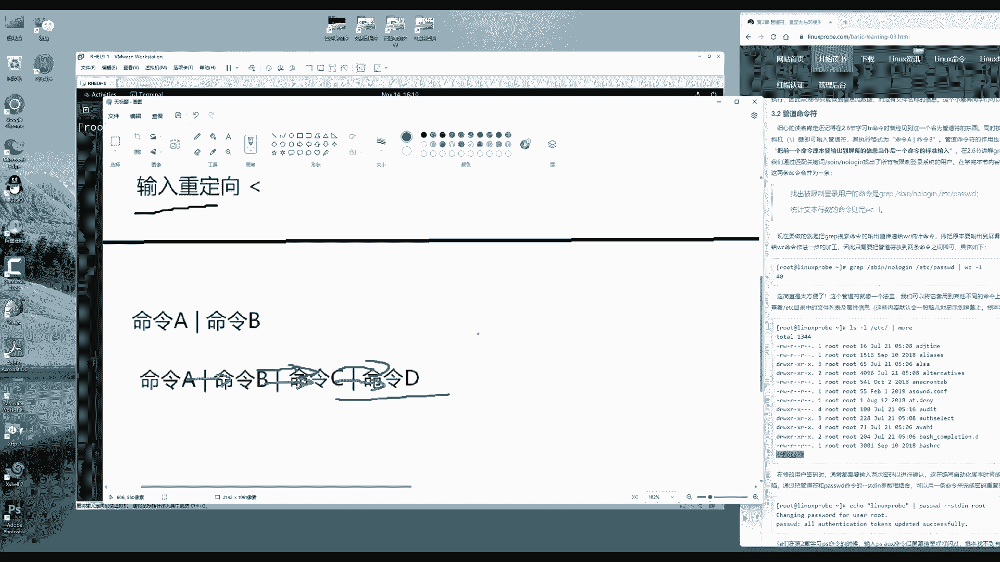

# 第3章 管道符、重定向与环境变量（上）（Linux就该这么学） - P1 - 老刘努力不废话 - BV1gj411W7yF

hello同学，欢迎大家继续回到咱们的红花HC1认证，九视频课程，今天第七天了，接下来去学习一下第三章节，我们把第三章节拆成两部分，第三章节我们讲的这个管道，不冲击下环境变量转移符。

今天我们先讲前面的一部分，学习一下这个重定向以及管道服，明天第八天的课程继续来去学习一下这个转移，符合环境变量，这样的话呢把课程的时间线拉长，同学们有更多时间进行一个消化。

但是不要被这个课程的数量吓到啊，咱们这套课估计有40多天的课，但是咱们这个课程的量显得更加扎实了啊，进度稍微慢一点，同学们也可以更好的进行一个消化吸收，好，废话不多说，同学们翻开书了。

那咱们打开咱们这个实验环境，我来给大家讲一下什么叫这个重定向，先来讲一下这个重定向，重定向分为两种，我们把它叫做输入重定向，以及叫做输出重定向。

假定来讲，我们之前去执行一条命令，他的话呢，这个命令的这个输出信息。

原本是要显示在终端上面的，那现在就可以进行一个深度的加工，把这个信息写在一个文件，或者可以直接从一个文件里面来去读取内容，接下来再把这个呃，接着再把这个内容传递给这个命令，来进行一次二次处理。

这样呢我们叫做重定向符，重建项目又分为了两个细分的分支，我们叫做错误的输出，以及叫做标准的输出，我来给大家解释一下笔记，同学们可以把这个呃叫做这个把这个笔记嘛，输出信息叫做输出重定向。

把这个笔记可以写到自己的书上面哦，我会给大家一个更加简练的这样的一个图表，这样的话您就知道我们这个输入和输出重定向，我们都可以去做哪些工作，然后以及哪些应用场景，哪些注意事项以及怎么去写。

首先来说叫做这个输出重定向的话呢，它这个写法就是一个大于号啊，它就是一个大于号，而且叫做这个输入重定向的话，它则是一个小于号，这个使用方法就是我可以直接去使用一个命令，命令后面加上一个大于号。

就会把这个命令原本要被去输出到屏幕上的，这个信息输出到一个文件里面，就可以这样来进行一个小操作了，我们把它因为它是相对于命令来讲的，所以它叫做这个输出重定向符，它对于这个文件来讲是一个输入的过程。

但是它依然叫做输出重定向，它是基于这个命令来说的，这个命令是第一人称，接下来就输入重定向，它是说我们可以读取一个文件，将这个文件读取的信息，然后交给这个命令的话来进行一个处理，有点像是比如说我们是啊。

那我们也可以去使用它这个cat，来去读取一个文件的方式，但是它有本质的区别，但是会给大家来举一个例子来去细聊啊，首先大家难道我们现在有这么一个概念啊，就是可以通过一个文件，通过一个输入重定向符。

把这个里面的信息直接传递给一个命令，这叫做输入重定向输入，输入数据对象的这个写法就是这么去写，它要被细分了一下，我们把它叫做标准输出，以及叫做错误输出，标准输出顾名思义就是正常的情况下。

他就这么去输出的，而错误的输出的话呢，则是输出的是错误的信息，我先把它写全啊，同学们待会来去进行一个对比，标准输出的话，我们做那么也是一个大于号，就可以这样去完成了好，那我们错误的输出的话呢。

它则是一个二一个大于号，它去输出的是一个错误的信息，这个除此之外还有一个我们叫做这个啊，覆盖写入以及叫做清空写入，我们待会给大家来细聊，叫做覆盖写入以及叫清空写入两种，那先给大家举第一个啊。

怕多了就有点乱，首先来说叫做标准输出。

这指的就是我们原先要想去查看一个，文件里面的信息，是不是我们可以去使用的IOS，然后去啊，那我们要想去查看一个文件的属性信息，可以去使用的IOS杠L使用到长格式的参数，就是我们去使用这个参数。

去查看这个文件里面的长格式，大家记住啊，这个消息ELO的话，那这个全称叫做呃GLAN，他这个英文翻译起来叫做长格式，他是去看文件的长歌时，他刚才有一个歧义，因为我们的文件参数里面，也分为短格式跟长格式。

此数啊，此处是使用的是IOS命令，去查看文件的这个长格式的一个参数，它也叫做查看文件的属性信息的一个参数，来后面接上文件的名称，如果说我们要想去看文件的属性信息，就可以这样去看。

看到的是文件的一个相关信息，基本没有问题，那如果说我先去看一个不存在的文件，例如说这个文件名称它是不存在的，叫哈哈哈，连CFG啊，一看就是老刘取的名字啊，非常的随意，他也去输出了一个信息。

乍一看看起来好像都是黑底白字的，输出的信息的一个回血内容都差不多，它本质性的区别，第一项指的是文件的一个正常回馈，那第二的话呢是程序的一个报错，那好吧，这两个实际上也被加以区分了。

我们前面那个叫做标准输出，下面叫做错误的输出，来给大家举个例子吧，我现在直接要把这个信息按照刚才那个理论，按照刚才那个理论基础命令一个大写，一个大于号，后面写一个文件名称。

就可以把这个信息去输出到一个文件里面，没有啊，没有问题吧，我来给大家叫做result吧，然后点test，我去把这个原本要被去输出在屏幕上的，这个内容输出到文件里面，按下回车，看到屏幕上面很清爽。

什么都没有，去查看一下文件，才发现内容在文件里面，这就叫做输出重定向，它是把屏幕上面的这个正常的输出信息，写在一个文件，所以它统称一下，再给它结合在一起啊，它又变成一个进化体，叫做标准输出重定向，好。

现在再来，我现在去查看一个不存在的文件，比如说叫做哈哈点CFG，那我再想把这个信息去写入到一个文件里面，这个时候他就失败了，因为在屏幕上面显示出来的信息，而在文件里面的话呢，什么都没有了，这个原因就是。

因为我们现在进行的叫做这标准的输入性向，而它显示出来的这个信息是一个报错信息，那我们就要去使用它一个二，一个大于号叫做什么呢，把错误的信息写入到文件里面，专业术语叫做错误五输出重定向符。

所以就是一个二大于号。

总之大家记下来就只有两种，第一种就是一个大于号，代表的就是将标准信息，将正常信息输入到一个文件，第二个是将错误信息输入到一个文件，这时候大家就要举手说老师。

我只想把这个信息去输出到这个文件里面，我在工作的时候，我不想加以区分，怎么办呢，就是我现在去跑一个命令或跑一个脚本，我想把里面所有的这个输入信息，不论是正常还是错误，都是我的亲孩子，我直接把它给去都啊。

都给它输入到一个文件里面，这个我们叫做合并输出，或者我们叫全部输出，它还是不加以区分，标准跟错误的，直接叫做全部输出，它使用的是一个和的符号，加一个大于号，这个叫做全部输出重定向。

那叫做啊合并输出定向吧，我们叫做这个叫做这个全部或者合并啊，合并输出重定向。

它就不会加以区分了，我们去查看一个文件的情况下，我不用关心他是在还是不在，他在不在，我们都不管，他都会把这个信息写入到这个文件当中，我们可以看到诶，然后里面的这个信息有没有问题。

去查看一个已经存在的文件啊，看一下我们去查看一个已经存在的文件，使用一个和的符号来进行一个输出，然后大家可以看到他还是有，那也就是说它进行一个合并输出了，它不再加以对啊。

那么它那它也就不再对于这个原本的输入信息，加以区分，判断是正常还是错误，这时候他也会发现另外一个问题，就是输出这样，这个信息在文件里面永远只保留一行，大家看到了我前面输出的一个错误信息，到了文件里面。

看到文件内容是这样的，要又去输出的一个呃，我们文件信息到了这个文件里面。

发现它还是这个样子的，这个怎么回事呢，这个我们又把它给进行一个区分，我们叫做清空写入，以及叫做这个追加写入的哦，不好意思啊，我这个写错了，覆盖跟清空是一个意思了，那实际上我们叫做清空写入。

以及叫做啊覆盖写入上层，哎，清空写入，呸呸呸呃，叫这个追加写入啊，不好意思啊，追加写入跟清空写入，追加写入的话呢，他则是两个大于号啊，叫做这个追加写入，它代表的是保留文件原始的内容。

再把这个信息写入到这个文件的这个呃，最后的末尾我们叫做追加写入，还有一个的话呢我们叫做清空写入，默认情况下就是清空写入，它会清空这个文件里面的内容，然后再进行一个写入这样的一个方式。

好我们给大家举一个例子啊，假定说我现在去看一个文件，假定说我现在去看一个文件里面的内容啊，不不不去看文件这个属性，然后看到里面这个啊信息显示出来了啊，我们会在第四章节。

第一小节会讲到如何去编辑这个文件啊，已经非常的激动了，想给大家讲第四章节了，来看一下啊，现在是显示出来一行信息，我把这行信息写入到某一个文件里面，假设这叫result in text，我们写入到里面去。

那我再去写入，再去写入，再去写入，再去写入，我们连续写入了五回啊，又去写入了五回，请问我们这个文件里面有几行，大家可以把这个视频暂停一下，然后仔细想一想，是一行还是五行，还是有多少行。

嗯好大家可以把视频暂停一下，让我们公布结果，result最后的这个函数是只有一行，因为我们每一次都进行了叫做清空写入，他每一次都会去清空我们原有的内容，这时候大家会发现说不对啊。

老师那这样的话我跑一个脚本，最后之后，那么他只会保留最后一行啊，我们像平时去银行存钱啊，我们最后存了一年，攒了一年钱，最后发现最后这个余额，只有最后一次存款的一个数字，那肯定是不对的，对不对。

那怎么办呢，我们可以进行一个叫做追加写入操作，来把这个信息，同样的你给它调回回出来，然后使用到追加写，我们再去多写个几遍，又往里面追加写入了四次，接下来同学们暂停视频去猜一下，里面现在一共有几行了。

验证一下自己的这个想法，来我去看一下，Result，按一下回车，最后里面发，但他会发现里面是有了5号，这个我们把它叫做追加写入重定向，如果要把它更完整，相对来说的话，那就叫做这个啊，追加写入正常的。

或者叫做标准输出信息，我们来进行一个写入操作，当然了，我们也可以把它前面加上一个二，大家可以进行一个辨识的操作，代表就是追加写入错误输出信息，或者我们叫做输出呃，写入错误重定向信息，这个大家可以来看到。

那这个时候我们敲下回车之后，会发生什么样的一个情形呢，同学们去想一下，他首先来说这个文件它是在不在的，它是在的，那我要想把这个错误信息追加写入，重定向到某一个文件里面，它是否归属到这一类呢。

它不在这个类里面，所以他会把这个信息还会去输出到屏幕上面，因为它不啊，因为它并不属于错误信息，只有说你再去看错误信息的时候，他才会把这个信息追加写入到一个文件里面，大家可以看到，所以说这个对于文件来讲。

它是标，那么它那么它是包含了标准跟错误，如果说你不想去区分的话，没关系啊，可以加一个核桃符号进行一个合并输出啊，就这样把这个信息不论是正常还是错误，全都去输出到屏幕里面，就这样去做啊。

去学习这个计算机的一个好处，就是它不像人一样啊，它非常的讲理啊，我们但每一步操作，它都会精准的给我们去来进行一个执行，并且呃会非常的这个严谨，并且不会出现太多的问题来，大家可以看一下嗯。

然后去给自己举几个例子，看看我们能不能好好去理解，大家一边想着我来给大家做一个演示，比如说我现在去使用的echo，然后我要去输出一个字符串啊，例如说linux prop到com输出一个广告到屏幕上面。

大家看这个是不是，也是原本要被输出到屏幕上面的内容呢，好了我把这个信息写入到一个文件里面，我们就行了，叫做清空写入重定向，那么提问同学们，我们敲下回车之后再去看文件里面的内容，它有几行，我数123了啊。

这个时候大家可以自己自助暂停一下视频来，如果没有这个考虑清楚的话，123哎看一下里面只有一行没有问题，他也就是将这个信息进行一个写入操作，我再来给大家举一个重定向的一个例子，再写两遍。

里面有几行好下面啊，它里面有三行，就这么简单，非常简单啊，同学们不要把这个问题想得特别复杂，就记住它，把它记住就好了，这叫做这个输出，重定向，就是要把文件里面，那么它就是要把命令的执行结果。

原本要被去输出到屏幕上面的内容，写不到一个文件，就这么简单啊，他只不过加以区分，判断这个文件的这个判断命令，这个执行结果是否正常啊，然后进行一个区分，以及写文件的时候进行一个清空，还是进行一个追加。

仅仅对于这个文件和命令进行两次判断而已，非常的简单啊，并不难。

那么什么叫做这个啊，标准输入呢，输入数定向它也很简单，他就是把我们的文件的内容直接传递给命令，来进行一次二次处理。

或者给大家举一个例子啊，统计函数是什么来着，WC命令它可以统计行数字节数，单词数，统计函数是什么，是一个小写L后面加上对象名称，命令参数对象，我特别喜欢这个命令，没有比这个命令更标准的了，命令参数对象。

命令还是一个格式啊啊并且参数还是一个格式，命令参数对象三者都齐全了，这个是什么东西，这个是命令，这个是什么，这是参数，这个是什么，这是对象，好按下回车，他告诉我们说文件有43行。

并且显示出的文件名称非常简单，第二章节的一个小命令，那我现在再给大家另外一种玩法，WC杠一个小于号叫做输入重定向，是把文件里面的内容再给大家传递进去，按一下回车，最后显示出来的43行。

从零乍一看好像说诶好像这两个差不太多，但是我们仔细观察一下，是不是第二个命令的输出，结果当中没有了命令名称呢，呃它并没有文件名称呢，大家仔细观察一下，这是为什么啊，很多同学一看书啊，看到这就过去了。

嗯觉得自己好像理解了，这个时候的话呢，我给大家讲一下，为什么第二个命令它没有一个文件名称，如果我们把它搞明白了，那么您就明白这个输出形象到底的本质，跟明明跟用命令直接去读取它有哪些区别了。

首先来讲一下上面第一条，刚才给大家讲到了，这是命令，这是参数，这是命令的承受方，它是被读取的一个关系，它是对象，没有问题，那它所以会输出的文件以及文件名称，他统计出来的这个信息。

接下来看一下这个这是什么呢，这是命令，这个是参数，这是什么呢，这是操作符，后面是读取的一个信息，可以把它归类也称作啊，把可以把它叫做这个参数或者选项，它并不是读取的对象，因为这个命令的这个对象是谁呢。

是这个命令，我是把这个文件里面的这个信息提取之后，我给了你了，你的命令是承受方，所以我只把信息理由传递进去了，而没有传递文件名称本身，所以我们最后只会显示出来这个文件的函数，而没有文件的名称。

就这么一回事，所以他可以先捋一下这个思路啊，叫做这个命令的重定向啊，里边分为叫做输入和输出，其中的话那99%我们平时过程当中啊，都是使用的叫做输出重定向，极少的会去使用到输入重定向。

但是如果要是使用到输入重定向的话，那我们大概有1%的这种可能性。

要明白他怎么回事，我之前给大家还举过一个例子，大家记得吗，tr命的第二章节的时候去使用过tr命令，没有那能力直接去读取文件的内容，我们当时是这么去做的，就是用一个cat去读取一个文件名称。

去使用到一个叫管道符的东东，然后去使用到tr，使用到这个通配符，小写的AWZ，大写的AWZ，第二章节第啊我们当时就去讲过，按一下回车把它批量做转换，小写字母的大写字母，它的话呢原本也就是说没有一个呃。

它是不能够直接来去读取文件里面的内容的，那我们现在就可以这样了，直接通过这个转头，直接通过输入图形相符，将我们的这个文件里面的内容进行一个输入，这样不也行了吗，你看这不就是一个玩法嘛对吧。

两个方法都可以，一个先用cat去读啊，读完了之后去喂给它，另外一种是直接通过这个输入重定向符，把这个文件里面的信息流传递给他，一样的效果一样嗯，这个就是一种玩法啊，这种玩法好。

接下来同学们就会有一个好奇心了，说老师，那什么叫做这个管道府呢，管道符的作用实际上就是刚刚讲的是啥呀，重定向符，重定向符，终归来说，就是把文件跟命令进行一个有机的结合，那么接下来就要讲一下管道符。

管道符是把命令和命令之间，进行一个有机的结合，它是可以将命令的输出结果交给第二个命令，我们进行一次二次处理，这个很难理解，我给大家举个例子啊。

另外同学们一定要记住了，很多同学考察是塞一种水货啊，很多同学都都没有明白，到就到他就到底什么是这个啊，重庆降幅什么叫管道府，再记住啊，这个终归来说就是重定向服，不论是输入还是输出。

它的这个本质都是把命令跟文件进行一个呃，连接对吧，我们可以把命令给这个文件，然后把文件里的信息给命令，总的来说是这样的，而管道服的话呢，它是把我们的命令和命令，进行一个这样一个有机的搭配。

我们可以更好的去复合工作，需要假定说有一个命令，他要把这个命令，要把这个原本的输出的信息交给第二个命令，来进行一次二次处理，那么就可以打一个这样的符号，我们叫管道符，同学们可以一起操作一下。

按住shift键按一下回车上面那个键打出一个，他可不是一啊，同学们，我之前讲的那个在线培训的时候啊，同学不会打，但是很着急啊，看同学又都打了，不想自己没面子，给我打了个一啊，然后还给我打个I，然后还打。

如果大写字母I的话，看着还挺像，那就短一截的，还有什么呢，大写L啊，我还有这个小写L，还有这个一，你看啊都不一样，这些他都不一样，这是什么呢，这是一个小书柜，这是一个小书柜，他就是把命令的这个之间啊。

加上这么一个小书柜，再说一遍啊，按住shift键按一下回车上面那个键就是那个顿号，大家知道吧，拿这个斜杠上面那个键，按住shift再去打它，就变成一个小书柜了，来他的这个作用的话。

是把命令A把前面一个命令的输出结果，基本命令B再来进行一次二次处理，大家吃过烤串没有啊啊他不就是说嗯对，然后这个要给大家引申出来，就是很多同学去呃学习这个的时候，感觉这个是不是只能执行一次呢。

其实并不是的，它可以执行很多次，它可以用很多次的嵌套，将命令A的处理结果给它，命令B将命令B的处理结果给了命令C，我突然间想到这么一个例子啊，就即兴发挥一下，还有什么呢，命令C啊，还可以再来进行处理。

给了命令D，我之前问过大家问这个问题，那说我们这个管道服能够用几次，你在同一个命令行当中可以用，可以用这个签到几次，这是没有上限的，没有上限的，就像比如说我们去吃烤串，还有一个流程对吧。

他会把前面一个人的命令，这个处理结果交给第二个命令来进行一次处理，有一人负责去采购，它，采购好了之后的话呢，有人负责去腌肉，有人负责去烤制，有人去负责去端上桌，他总是把前面一个人的命令的处理。

结果哪个肉不能说腌完之后就给倒掉对吧，他总是把前面一个人的处理的成果，交给第二个人再来进行一次处理，再将第二个人的这个处理结果交给第三个人，再进行一个处理，然后以此类推，最后交给了我们的成品。

如果说把这个生肉给了顾客肯定不满意，但是我们处理和腌制和烧烤过后端上桌了啊，加以这个服务啊，顾客就非常的满意了，是不是更好的去贴合于工作需求了呢，那这个我们把它叫做管道服。

另外再给大家看一个小视频啊，我特别喜欢的就是这个叫做啊管道。

这个叫做这个啊，有一个动画片，大家请看一下VCR啊，有一个小视频啊。

这是哆啦A梦里面的一个小片段啊，可以看到这个管道符啊，实际上就是一个传送门，大家看到了前面的话呢是啊大众在家里面，然后通过这个传送门，哆啦A梦一开门，哎，哎这些小朋友们就到了这个深山野林当中了啊。

过上了幸福快乐的生活，你看这个门实际上就是作为一个传递，他把这个人或者物。

然后传递到另外一个地方了，而现在的话也是同样的，那他是把我们的这个信息啊进行一个处理，例如说我现在再来去查看一个目录当中，有哪些文件，你看一看，嘎啦嘎啦，有这么多的文件啊，有这么多的文件的名称。

那我想统计一下，说这个文件里面啊，这个文件夹里面有哪些有多少个文件，可不可以啊，可以啊，一个IOS把我们原本要被去输出到屏幕的内容，交给后面的命令，再来进行一次处理，WC杠LAA再回车。

他统计出来说他总共有十个文件，他总共有十个文件，这时候大家举手了，说老刘不对的，WC杠了啊，是用来统计行数的，现在明明有两行，为什么他统计出来的是文件的个数，总共是有十个，而不是两行。

那它为什么是二不是十呢，大家去想这个问题，为什么是二而不是十，有时候我跟你讲，也就有时候啊大家会听到老刘讲课，特别的激动是吧，比比就比一般的这个讲师感觉都唉就是很气，就是感就感觉很有气氛。

有时候自己跟自己讲课都啊比较着急啊，就要感觉要打架似的，为什么同学们自己给自己出几道题，为什么明明两行统计出来了之后变成十行呢，啊自己跟自己打架怎么回事，原因就是我们所看到的这个信息，是经过了美化的啊。

就跟统计局一样啊，这个数字的话，这个数据是经过美化的，它的话呢实际上就是实行我们可以这样子啊，OS把这个原本要被句输入到屏幕里面，这个信息标准清空，写入重兵相符，你不用上了吗，啊写到一个文件里面。

哈哈点test查看文件的内容，发现它就是每一个文件名称是一行，它并不是两行，它并不是这样的一个，它也没有颜色着色。

这是经过美化的输出结果，所以我们是不是就可以把这个信息统计一下。

函数就统计出来了，这个文件它总共有多少行了，诶，挺有意思的啊，再来给大家举一个更有例啊，再给大家举一个更有意思的，这么一个呃这么一个小例子啊，我就大概会了啊，在总结最后再啰嗦最后最后一句嗯就是什么呢。

管道符的作用是啥，是把命令A的出这个处理结果交给命令B，交给后面的命令，再来进行一次二次处理，我们把它就把它叫做这个管道符，命令A给命令B，命令B把命令A的输出结果作为输出结果，再来进行一次啊。

作为一个信息来源，作为一个输入源进行一次处理，来举一个例子啊，修改用户密码，Pass wd，第五章节第一小节给大家细讲啊，先不用发愁，不担心来pass wd，修改用户密码。

请输入一下当前用户密码red height啊，请输入一下您的新密码啊，不啊，第一次第二次都是输入的新密码，它不需要验证的老密码，这还特海特来，我这样做完了之后没毛病，我把这个用户密码就给他重置了。

也有毛病啊，如果说我现在垫用的是一个脚本，我需要自动化去完成，那怎么的，我这个脚本可能需要办1000件事，我要等到第500件事的时候去重置密码的时候，再准备上线去输入新密码吗，太不高兴了。

怎么样能够让他通过异常命令去完成呢，用到这个管道服务，我可以把这个密码，当他需要的时候给他不就行了吗，对吧，这个我们叫做自动化脚本的时候，会给大家去讲一讲，那自动化脚本的时候会给大家去细聊去使用的。

Echo，将密码，将密码我给你不得了吗，将密码交给他，密码叫做red hat，那怎么把这个密码给他呢，这个是什么，这个是命令，这个是对象，这是一个命令行，我们要讲，那我们要将原本要被去输出到屏幕上面的。

这个密码交给第二个命令，再进行一次二次处理，所以就是一个管道符关服后面干嘛，一定要去要去用来去重置用户密码的，paw d的这个命令后面是什么呢，后面加了一个叫做呃呃STURINPUT。

我们这个叫做从管道符当中去接收用户密码的，这么一个参数，后面写上用户的名称，例如说给root用户去重置密码A1下，回车就重置成功了，就是我们可以通过这样的方式，就可以将这个用户密码就充值成功了。

并且不需要用户进行一个交互，但至于说至于说说老师，你这个密码写在这里不安全，那是另外一节课的事儿啊，那个是另外一节课的事，先把这个滚到玩明白就行了，不管安不安全，他当然也会同学们有疑问。

说这个是什么意思呀，哎好没关系，来讲一讲啊，去使用到第二章节第一小节讲到这个MMING对吧，有问题问男人嘛，问menu来去输入命令的名称，按下回车可以往下倒一倒，什么叫做STDN呀。

就搜索一下STDN搜索什么功能啊，这个搜索怎么搜索，不管第四章节第一小节给大家去玩，明白了，来搜索一下，可以看到有关于这个参数的一个介绍，这个参数只有长歌，是没有短格式。

This opinion is used to indedicate that password，就说这个参数是用来去指定密码的，你看这不就来了吗，跟我们相关，他说的话呢，这个新密码是读取的什么呢。

从标准输入当中进行一个读取的哦，大家看啊，就是说，如果我们要想从标准输入当中来进行读取，那么就可以，那么就必须要去使用这个参数来，有能力去接收它，但是什么叫标准输入呢，就是我们什么叫标准输入呢。

他又加了一个定语从句啊，他说这个可能是一个管道符pap诶，那你看这个可能是个管道，所以我们总结成人话来讲，就是你要想去使用的pass wd这个命令，来去接收从管道服传递过来的密码。

那么你就给我加上这个参数，就搞定了这么一回事啊，所以我们买把这个参数啊简单讲一下啊，不知道大家带着疑惑嗯，开始下一个章节是不是感觉很有意思啊，再来更有意思，给大家举一个例子啊。

第二章节当时就记过一个命令，叫做PS命令，当时同学们啊这个痛苦的经历可能已经忘记了，再给大家提个问题啊，在LINUX里面的这个进程分为哪几种，我们讲过有五个常用的，另外五个不常用的。

没讲五个常用的是什么来着，R对吧，还有什么呢，S还有什么呢，Z还有什么呢，T对吧，就是我们现在在这个系统当中，有五种常用的进程的状态，怎么查看呀，当时是不是有两个方式，第一种叫做P命令。

后面有一种叫做tom命令了，PS命令只看一次TM进行一个持续刷新，我们把它叫做windows里面的加强版的任务管理器，哎对吧，好，PS命令后面有三个参数，回忆一下比较常用的一个固定搭配啊。

固定搭配固定搭配，那并且给大家一个小提醒，是不是他还不用减号啊，他不用减号，那他可以省略它，分别是杠A杠优杠X这个命令，它允许我们少敲几个键啊，少敲几个按键，直接写上这个参数的短格式就可以了。

不用写这个减号来PX空啊空啊，空格AUX查看系统当中所有的发起的进程，括弧，包括系统发起的没有终端的也发啊，那么也显示出来，然后显示出来一边这个详细信息，P s a o x。

查看当前系统当中所有的这个进程信息，当时讲的时候夸就过去了，什么都没看清楚，后来我们就说这命令不好使用top吧啊，然后我们讲的这个top还记得那么一回事吗，现在讲一下好使了，为什么呢，有个管道服了。

这不就好使了吗，啊之前被我们雪藏的命令可以翻出来了，什么呢，管道符，将原本要被去输出到屏幕上面的一大坨啊，信息通过管道符进行一个过滤，过滤命令是什么呀，当时讲过第二章节讲过两个命令。

第一种是查看行的graph，按行做提取，第二是什么呢，按列举取提取cat来grab，按行做提取，我想获取关于进程当中，所有关于SH这么一个远程协议的进程信息，按一下回车不就来了吗，哎很简单。

我书中的这个信息千千万，但是我只看到诶，只有这么两条，看跟SH相关的，我再来是要跟网站相关的，有还是没有，我现在没有，但如果要有的话，你就能看到了哦，还有啊，我这个正好是我们搜索这个命令。

所以我们可以看到了，将前面的这个命令这个处理结果，我们就可以显示啊，指令显示出来某一条进行一个定向搜索，挺好啊，挺好玩，是不是再给大家举一个例子，是扫个屁啊，再给大家举一个例子，再给大家举一个例子。

我们最后一个例子啊，彻底把这个给他玩明白了，管道服接下来就不再讲了，什么呢，查看某一个目录，进入到某一个目录当中，看到里面有很多很多的文件，嘎嘎一顿数有点费劲，好，怎么统计行数来的呢。

IOS然后去WC刚I了，统计一下里面有多少个文件，它告诉我们238个好，这个已经讲过了是吧，这个已经讲过了，不能再讲这个例子啊，再讲话就相当于骗钱了，这同一个例子加两边显得很没有水平。

我们玩另外一种什么呢，统计一下这个呃，查看一下这个当前目录当中，文件以及文件属性信息啊，就这样看也太多了，咔咔往下，咱们就往上翻，我现在好，在我有鼠标啊，同学们，我可以往上翻呀，那假定你在工作的时候。

你没有图形化界面，你拿鼠标你翻不了了，怎么办呢，没关系啊，我们学习过看小文件，用CD看大文件用more，我们把它当做是文件不就好了吗，把它原本要被去输出到屏幕的这个信息，通过管道符。

将IOS杠L的这个处理结果当做输出，重定向符输入给我们，后面的命令作为标准输入信息进行二次处理，后面的命令叫做more翻页功能，按一下回车，于是我们就可以翻页，一页一页喝着茶，悠闲地看这个文件目录当中。

每一个文件的属性信息了，这就非常简单，这个我们叫做管道符，管道符好啊，不再多说，那管道服相信大家已经都玩的很透彻了，非常明白，我们接下来给大家说一下这个通配符，通配符通配符的话呢。

实际上就是说用户只是啊，只需要去输入命令的这个前面的一部分啊，我们就可以把这个命令给它补全，假设说老刘叫不叫老刘叫呃，呃这个呃呼伦贝尔啊，然后的话呢帅气无敌，老刘假设说名字特别的长。

那么我们又没有重名的这个案子的一个情况，那么你只需要去输入呼伦贝尔，然后我也不知道为什么取这么一个名字啊，可能就是地名吧，然后后面直接加了一个通配符，只要没有出名的这样的一个情况，都代表我啊。

把这个缩写成的老刘这么一个行星来啊，例子举的不太好，但是我刚拿一个这样的一个需求吧，假定说IOS啊，所以说老刘举的意思啊，也不是那么的稳定，发挥也不是那么的好，有时候举的也比较烂，来举例子啊。

看这个文件他在不在呢，他在啊，他干嘛用的，不管第六章节，第一小节根据FHS跟UDV服务会讲到，不管他，他在不在在好在不在也在在不在也还在，在不在不在在不在不在在不在不在。

DV目录里面有有三个SDA开头的文件，来举个例子，他们有什么呃，提个问题，他们有什么共同点，共同点就是他们都是在第一位目录下，他们都是SDA开头的第一个文件，它后面没有东西了，第二个的话它有一个一。

它有一个二好了，就以它为说，既然知道一个共同点了，假定他在工作的时候，他就SA十三十七二十五三十六，我只想显示出来，所以他开头的文件我们怎么去做，太难了，做不了了，我只能一个一个去试，从一试到1000。

然后发现诶17啊，还有25，这个可能是存在的太难了，怎么办呢，加星号，星号代表的就是通配符，按一下回车，我都佩服了啊，我都非常佩服，就叫这个通配符，把这个命令的啊，把文件的这个后面加上一个星号。

通配所有的以他开头了啊，它可以通配空值或者无穷多的值，我来给大家说一下啊。

它星号代表的是通配符，通配空值或无穷多的值，我给大家举一个例子啊，我给大家敲一敲这个windows，这个也是咱故意黑人家啊，真这个太难使了，这个画图工具可嗯可不像我们的LINUX啊，好来继续嗯。

嗯来写一个星号，代表的是通配符，它可以是空值空值空值哎呀讲课10分钟，我不知道为什么耽误时间了，老打错就老打错字，空纸盒无穷多的值，什么意思，它能不能通配没有东西呢，可以它能够通配没有的东西。

比如说DV目录里面的SDA讲戏了啊，超级同学们，这很特别值钱，直接加一个星号，它能不能通背出来SDA，它本身呢可以，它能不能通配出来DV目录里面的SDA1呢，可以它能不能通配出来DV目录里面的SDA。

巴拉巴拉巴拉巴拉，可以可以可以，星号代表的是空值和无穷多的整体空值啊，空值你也能够显示出来，同学们哎星号的作用，那么还有什么呢，问号问号代表的就是必须匹配一个值，我就我就简单写了啊，大家都是自己人啊。

一个只记这个笔记，如果觉得写的不太严谨的话，自己下课之后总结一下啊，大家都是自己人，我就稍微随意一点了，它是必须要通知到一个值的。

来写一下问号，先看一下什么效果，先看一下效果，它必须要匹配出来一个值，它能不能匹配空值呢，后面什么都没有，我写一个，它不可以来看一下DV目录里面到SDA一个问号。

他能不能匹配出来DV目录里面的SA呢不可以，问号必须要有一个东西，那它能不能匹配出来DV目录里面的SA1呢，可以，它能不能匹配出来DV目录里面的SAA呢，可以，它能不能匹配出来。

DV目录里面的SCABCDFG呢，不可以，它必须要有一位，这叫做问号，那老师不对呀，那我有需求啊，DV目录里面的SDABC，那你给我怎么着，我比那你给我进行一个比对，两个方法。

你要不然就DV目录里面的SDA星号，你要不然就DV目录里面的SDA问号，问号两位不就这么着吗，那三位呢三位四位呢四位啊，那五位五位好，这个讲的太骗钱了啊，感觉好水啊，是吧啊。

就总之你需要几个就打几个问号啊，需要几个就打，那就打几个问号啊，来啊就像我们跟女朋友聊天的时候啊，如果说哪句话让她生气了啊，他打的问号越多啊，生命才去生气啊，所以我们要去进行一个解释的这个啊。

内容就会就会越多一点，所以问号一个问号对应的就是一个值啊，他打几个问号，你就要倒几次见，这同样的道理啊，好老师不对呀，那还有什么需求呢，我只想匹配出来DV目录里面的SDA1。

我不相匹配出来SDAA怎么办呢，这个也能做，这个我们叫做数字比较好啊，数字匹配零杠九不就得了吗，啊匹配出来数字什么意思。

来这讲完了好像好好啊，好像讲完了，第一名目录里面的零杠九走，哎就匹配出来了，有一有二，对不对啊，未来有三有四，它也能帮他也能帮我们匹配出来，没有问题，他匹配出来一个数字。

还有什么呢，一个字母，这是A到Z1个小写字母，什么叫严谨，同学们，什么叫专业，大概A到Z来一个大写字母，唉这个录播课程啊，讲着讲着不过瘾啊，没有同学们跟我们捧场，就只能自己给自己嗯稍微的吆喝几声啊。

还给自己夸夸自己吧，寂寞啊，来是这样的啊，以前讲课的时候都会给大家互动的，比较多，看一下吧啊一个小写字母，一代一个大写字母，一个这个匹配出来数字就这么去做就很简单了，嗯怎么举例呢，没什么举例子吧。

就比如说我们DV目录里面SDA啊，我现在想匹配一下，那么就是一个小写的A到Z，只要你后面带有一个小写字母了，就帮我们显示出来啊，如果想匹配出来一个大写字母呢，就是一个大写的A到Z，我想一想啊。

突然想到另外一个另外一个这个需求场景了，就是我想进，我想进行一个精准的匹配。

它匹配出来是一个0~9，它匹配出来是一个小写和大写字母，我只是想去匹配出来某几位怎么办呢，第一那我也可以这样做，一个一逗号，三逗号五，到了这个精准匹配啊，指定的数字我必须是这几个数字才显示出来。

它既然已经有了一和二了，但是我不关心你的二啊，我只关心135哈，一逗号三逗号五按下回车显示出来了，好我们再来答两个常犯的错误，那错误第一个错误，135你怎么去写，又大部分情况下没太大毛病，但是不严谨了。

不严谨，因为你现在写的是135，我知道你匹配的是一有，你显示出来了，你怎么不是一和35呢，你怎么不吃13跟五呢，那你怎么不是135呢，同学们虽然说有些情况它是允许你这样去做的。

但是你一定会在未来的某一天吃了个大亏，所以一定要用到逗号间隔，你要去判断的每一个值一定要严谨，我们讲课的时候，就一切都是最从严的，这样的话呢在工作的时候您稍微犯点小错误，没关系。

一般情况下也能执行的下去，但是你要是学的时候，你就给我往松了一边去学，那到时候有这个大家吃苦的机会就很多了啊，好吧，同学们记住大家常犯的一个错误，给我把你要匹配的这个值全都到逗号，给我间隔开。

还也就养成好习惯啊，也是啊也成好习惯，最后一执行都叫的都非常的标准，第二个常犯的错误，很多同学用的是大括号给括起来了，这个可不可以呢，不算错，记住了，中括号括起来的值没有通配上，怎么样呢，没毛病。

它不显示出来报错，但是如果用大括号括起来的值没有退，没有被通，没上的情况下干嘛呢，报错唉，这个不算错啊，看您的需求啊，如果说大家这个之间过后啪啦啪啦，这屏幕上面全都是报错啊，那么就说明大括号了。

把它改成小括号，如果如果就为了看报错嗯，可以啊，那你就大括号中括号，大括号的区别给大家讲明白了，那么除了就看这个文件，我们也可以用它来批量去创建出来文件，怎么样能够批量创建出来的文件呢，很简单。

我们叫ABCDEFG，哎呀我敢这么讲啊，同学们就该骂街了啊，老师你这不是第二章节的命令吗，不都学过一遍了，又学一遍好，创建出来了六个七七个文件不重要了，但是如果说我想像。

那么如果说我想要创建出来的这个文件，它们有一部分是相同的，一部分是不相同的，假定说我想说来说是一个A点text，然后是B点text，然后C点text我都这么写啊，我都感觉有点儿啊没效率。

很啊很嗯很着急来假定我要重现出来这些文件，我先不敲回车，发现共同点了吗，共同点就是他们都有个点，他们都有个text，那么前面是不一样的通配符吗，怎么办呢，我现在没有执行的同学们啊，天怎么天地良心啊。

我刚才没有去执行回车啊，我按的是CTRLC把它给结束掉了啊，来touch什么呢，一个大括号哎，我们今天讲到了吗，我想看看谁知行失败了，然后给我们来个报错，那么就是A逗号B，那我们整个中华大括号都行啊。

BCDEFG没毛病吧，最后的结尾都是点test，把不同点写前面相点点啊，点到后面逐一进行一个匹配，我们叫做通配符，A1下回车走，你再去查看创建出来了，ABCDEF分别是text结尾的文件。

就这么批量去做，非常的有效率，嘎嘎响好呃，先讲这么多，今天那今天讲讲讲秃噜了，讲讲三，原本是放到明天去讲的，这个今天讲突突了啊，40分钟还好嗯，明天我们学习转义符，还有环境变量。

那么这个内容量就非常的少了，好同学们就这样了。

