# 第4章 Vim编辑器与Shell命令脚本（上）（Linux就该这么学） - P1 - 老刘努力不废话 - BV1m94y1M7PL

Hello，同学大家好，欢迎来到咱们的九版本的红马，HC1人称视频课程，今天是第九天，学习一下第四章节的VM编译器以及shell脚本命令，这个章节啊，我们原本要讲三个多小时啊，后来我一想。

这既然是一个视频课程，那我们就给大家说了，咱们这个课程，视频课程要讲一些书上没有的东西，要讲一些这个在线培训不敢讲的东西，时间线拉的比较长嘛，后来决定把这个第四章节分为了三部分，上中下。

我们今天只讲这个前面的4。1小节，就用一个半小时的时间把这个VM编译器给他玩，明白了到底是一个半小时，我们能学到什么东西呢，我们在这个LINUX里怎么去编辑文件呢，彻底把这个VNBAG啊。

从理论到实操到实验，我们给它吃透玩，明白了，看看它到底怎么回事，这样一个半小时之后啊，大家掐表了一个半小时之后，再在LINUX里面去编辑文件啊，你就再也不发愁了，来大家现在编辑啊，打开一下您的虚拟机。

准备一下实验环境，待会我会有很多很多好玩的这个实验啊，等着大家去操作，所以这个千万不要错过，俗话说得好，看书不如看实验，现在一定要准备好实验环境，然后我不知道大家的这个做这个，多久的心理建设才敢打开了。

咱们今天这个视频难度有点大啊，那反正我是距离上一次录制视频，已经过一个礼拜时间了，所以我简单回忆一下第三章节，我们讲了什么样的一个东西，然后简单进行一个知识的回忆，同学们准备一下实验环境，第三章节。

我们学习了这个命令和文件之间的，有机的这样的一个信息传递，有没有叫做输入啊，叫叫这个输入输入出镜像，我们可以将B的这个处理结果，也就是原本要被显示在屏幕上的内容，写入到一个文件里面进行保存。

这个操作我们叫做输出用项，那我们也可以把一个文件里面的内容，导入到一个命令里面来进行一次处理，这个的话我们叫输入储存箱，那我们也可以讲这个命令和命令之间java管道符。

将前一个命的这个原本要学去输出到屏幕上面，的标准输入内容，作为后一个命令的一个输入内容进行SARS处理，也就是说用户得到的这个处理结果，是被要原本去输出到屏幕上面的这个内容，进行过处理之后。

进行一个二次处理，甚至会有多次这样的一个嵌套处理之后，到手的更符合工作需求的这样的一个处理结果，这就是我们第三章节所学习的，这个叫做输入储能项，输入储能项，管道服务环境变量啊，这样的一个小知识啊。

好大家应该已经准备好了这个实验环境了吧，啊如果没有，没关系啊，就把这个视频给他暂停一下，准备好实验环境就要开始了，先来讲一下理论啊，先讲一下理论，这个vi编辑器的话，大家说都能详。

老版本的这个使用者都应该听说过，那么这个VM编译器是什么呢，这个M啊，我给大家写一下笔记啊。

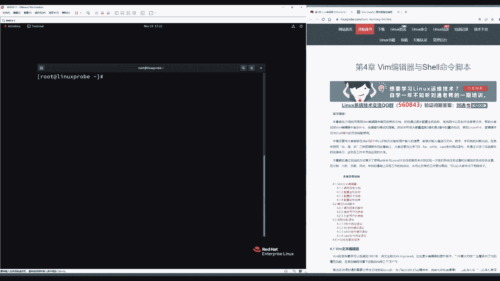

这个vi编辑器的话呢，是老版本的这个LINUX里面去编写文件，所使用的一个编译器的工具名称，而我们现在从红包ROO6开始啊，呃大概是从2012年开始，我们使用的编译器的话，那默认叫做VM编译器了。

这个也就大概有十多年时间了，VM编译器的话呢，对于这个vi编译器，最后那个M的这个英文的缩写叫做improve啊，就是这个叫做这个提升的意思，Improve，那，啊improve他就表示提升的意思。

差点折在了这个英文单词上面啊，幸亏老刘这个呃这个功底还是比较扎实，来这个M的话呢是提升的意思，然后对于这个记事本的话呢，以至于这个编译器的这个提升概念，实际上是很虚的，我们知道啊。

在一个在这个LINUX编辑编辑文件，实际上也会去使用一个windows，他们那种记事本一样的工具，那么对于记事本的提升，性能的提升实际上是很虚的概念，就像我们再去写一篇论文一样。

那如果说这篇论文写不出来，肯定不赖，那个word文档，肯定是我们自己没有思路啊，我们自己再去写一篇小说也好，或者在我们再去使用的记事本，去编辑一个文件也好，我没有感，我们从来没有感觉都在过卡顿嘛。

反正老刘这个手速已经是很厉害了，但是我们依然没有得到这个效率上的这个上限，还没有啊，我们还没有去触及过这个windows7日本的这个啊，性能的上限，那所以说对于这个记事本的性能的提升。

这实际上是说不过去的，但是vi编辑器的话呢，在这个官网上面，他只提到了对于vi编辑器的一个提升，他没有讲具体的呢在这个点啊，具体的点实际上就是这样叫做这个着色功能。

这个我们去使用vi编辑器的一个V的理由，并不是性能的提升，而是这个颜色的角色，大家有之前用过这个vi编辑器，这个同学应该知道啊，他就是一个纯黑底白字的这样的一个界面，或者他是一个白底黑字的一个界面。

根据我们这个操作系统版本不一样啊，它这个底色可能不一样，但是它都是同一个颜色，非常单调，我们去编辑一个配置文件的时候，如果说有一个参数写错了，再去写一个shell脚本，我想重启一下这个服务器。

我想写一个reboot，我这样写对了之后还没有太大问题，如果不小心我写错了，少写一个O或者我们这边啊就直接回啊，这样我们去打错了之后的话呢，它其实它并没有一个颜色的变化的。

我们完全就是一个白底黑字的这样的一个界面，很难发现自己有哪里写错，尤其是在去写一个上脚本好几百行的情况下，很容易就或者我们认为是百分百会出错，但是很难去定位到这个具体的错误的点，这就很让人发愁。

那我们就有了vi编辑器这样的一个好用工具，它可以将我们的关键词来进行着色，如果说你写对的话，会有一个颜色，就这样啊，它会占它会有一个，一般情况下会有一个颜色的回血，如果写错的话呢。

它甚至会有一个红颜色底，然后会有一个白颜色字，这样的一个非常啊清晰的一个反射啊，让我们这样我们可以很直观的发现，可能会产生一些错误的点，所以我给大家讲啊，就是老版本的服务器，我们去使用的是vi。

那我们只要有新版本的服务器，只要你有这个新版本的这个呃编译器，那么我们都推荐大家去使用的VM，因为它对于这个关键词汇一个着色的变化，更好的去帮助我们在编写过程当中。

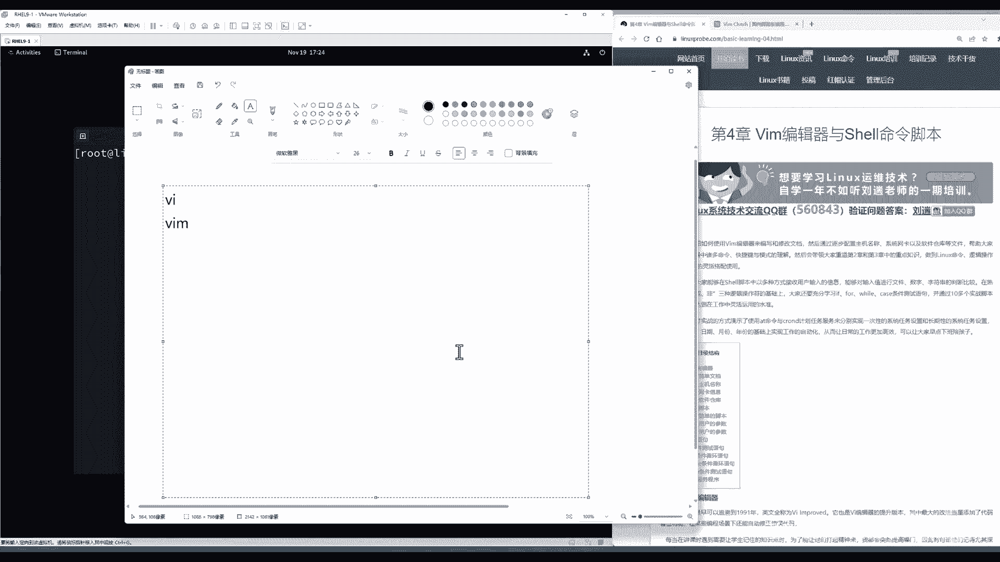

就找到这个一些关键词的错误，来给大家举一个例子啊，是这样的，我们在红包real9当中随便打开一个文件，文件内容不用管，不用关心它，大家看效果就好了。

随便打开一个叫做etc目录里面的file system type文件啊，这这个不用管它作用，按下回车进入到里面去，发现诶这里面会有一个颜色的变化，可以看到不同的关键词触发了不同的效果，这是不是很清晰啊。

一目了然，当我们去写错一个关键词的时候啊，大家看啊，假设说我现在去编辑这个文件，假定我现在随便去写错一个关键字，大家看到我们原先这个XFS文件系统，该改错了，改成一个不存在的一个文件系统了。

它会有这么一个变化对吧，然后然后我们这样去写的时候，大家会发现它会有一个很清晰的一个错误，原先你的键词触发的和这个一个颜色变化，没有了，这个如果你还看不出来的话，没关系，你能看得出来这个是有点问题。

我都已经变成红颜色了，就你看着报警了，所以这个还是一个非常好的一个呃提升点。

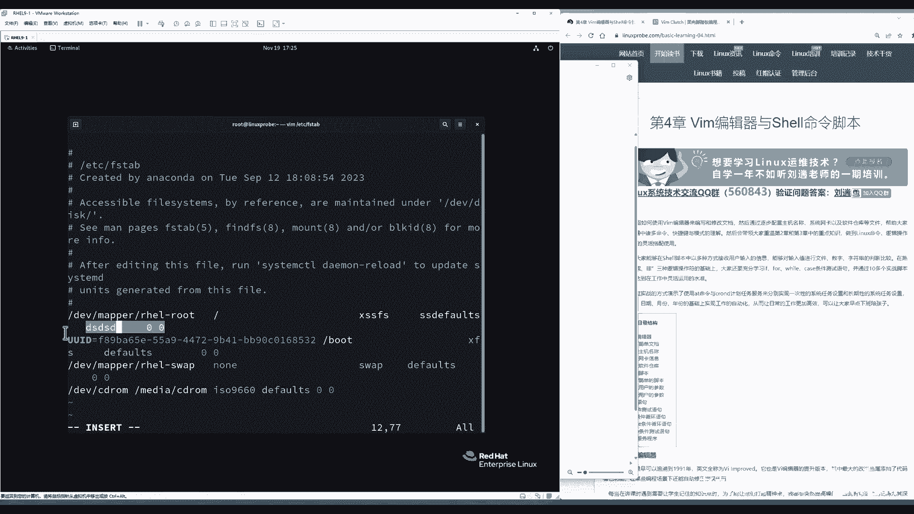

所以我们要给大家讲的就是，去使用到这个vi编辑器的话呢。

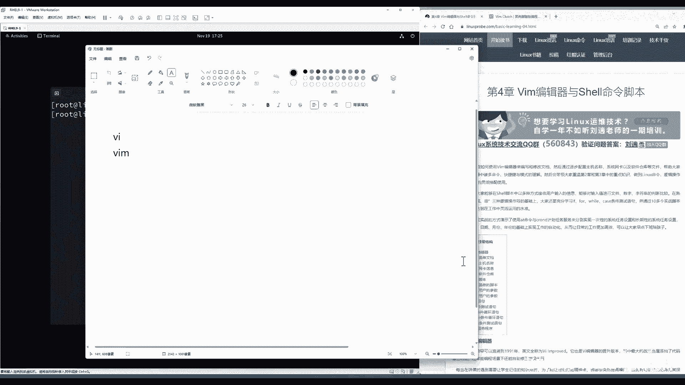

好处大大滴啊，有条件的话就用这个VM编译器，让我们对比一下这个啊，然后我们对比一下这个vi编辑器，同样去编辑这个文件，大家可以看到一个很惊讶的效果，就是什么呢，他们两个一模一样啊，为什么呢。

因为在红包六九当中已经没有vi编辑器了，这个太老了啊，或者的话呢，我们认为这个的话，它不适合编辑这个配置文件了，我们就在红包REO9当中去使用它man文档，去来问一下这个VR，可以看到实际上的话呢。

他已经是一个这个VM编译器了啊，可以看到啊，这个我不好意思啊，刚才老刘想了半天啊，想了我们四六级学习的所有单词，然后这个improved差点没拼出来，结果还忘了加上一个这个D啊。

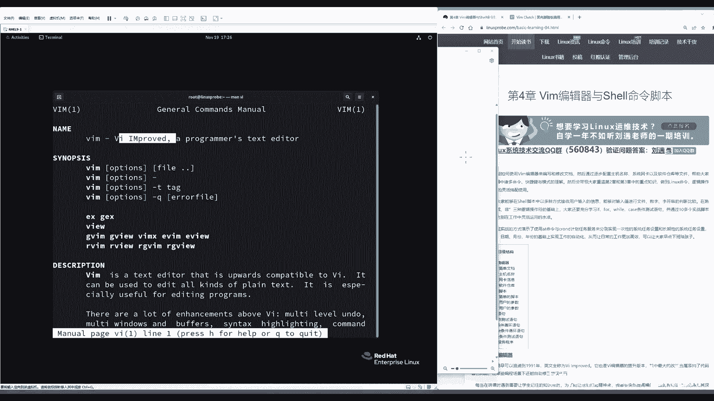

这个叫做这个improved啊，它就一个被动语态了对吧，它是一个被提升版本，非常严谨啊，improved来给大家写一下vi improved叫做VM来，总之啊刚才给大家简单说了一下。

就是我们为什么要去学习VM，这个标题为什么不叫vi编辑器，因为我们要需要在这个配置文件的时候。

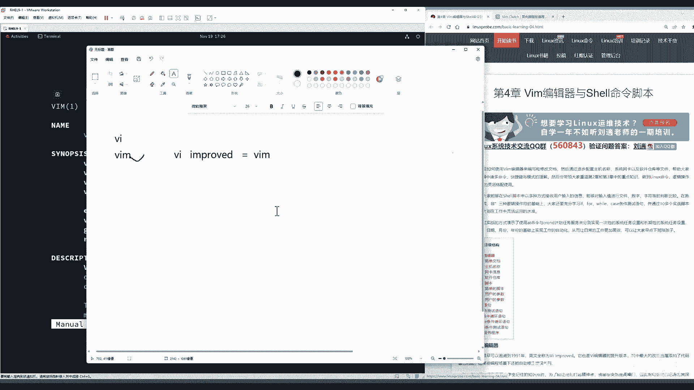

有一个呃，它会有一个颜色的变化，更好的去帮助我们找到这个问题和错误，好，总之啊讲了一下，用10分钟时间讲了一下，为什么要去学习VM，那接下来就讲一下VM呢，VM编译器的话呢，我们要学习一个半小时。

同学们就其实对于这个第二点，大概是比较的好奇的，就是一个windows里面的记事本啊，有什么可讲一个半小时的呢，它有很大的区别，我们对于他们的windows的记事本。

可以进行对于文件的批量的编辑修改替换查找，然后可以对于这个shell脚本的话，也可以进行自动的排版，都可以去实现，然后并且可以解啊，并且可以对于这个边境环境进行一个深度的，定制化的一个修改显示行数啊。

或者说我们进行一个呃，嗯对于多个文件进行一个合并，然后我们进行导入，然后我们甚至在这个编辑模式下，可以进行一些和谐键和这个命令的执行，这些他都可以去实现的啊，这都是他们windows里面是做不了的。

那么怎么去实现呢，就是要讲到vi编译器实际上有三个工作模式啊。

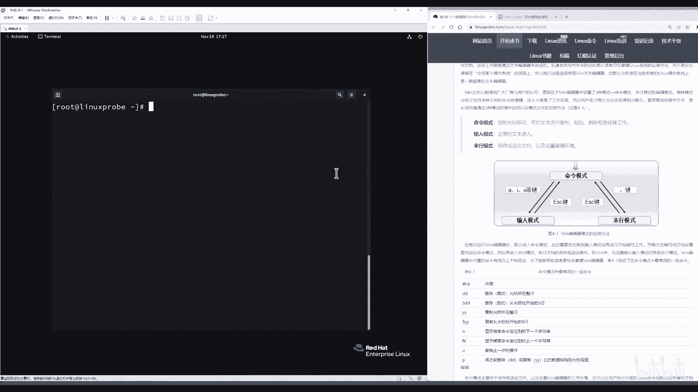

为什么这个一般要是啊丝毫啊就不会说很水啊，就这个啊丝毫不简单啊，非常的难，所以大家一定要记住这个啊金融注意力，我们再去使用到这个vi编辑器的时候，它之前是有三个工作模式，第一个我们叫做命令模式。

这个命令模式也是我们默认去打开一个文件，所处在的一个啊环境，那我们好比说现在啊举VM编译器，后面加一个文件名称，也就是对象吧，后面打开一个文件，好比说叫做read me点test。

比如说啊有这么一个文件，假定有这么一个文件对它进行一个编辑操作，Vm，然后是一个文件名称，那么我们默认情况下，所看到的这样的一个搜索模式，就叫做啊命令模式，命令模式的话呢。

它可以对于这个文件来进行一些基本的，比如说搜索呀，然后剪切啊，还有这个删除啊，剪切啊，然后这些还有这个粘贴等等等这样的这个操作，那我们不能够对于这个文件来进行直接的编辑。

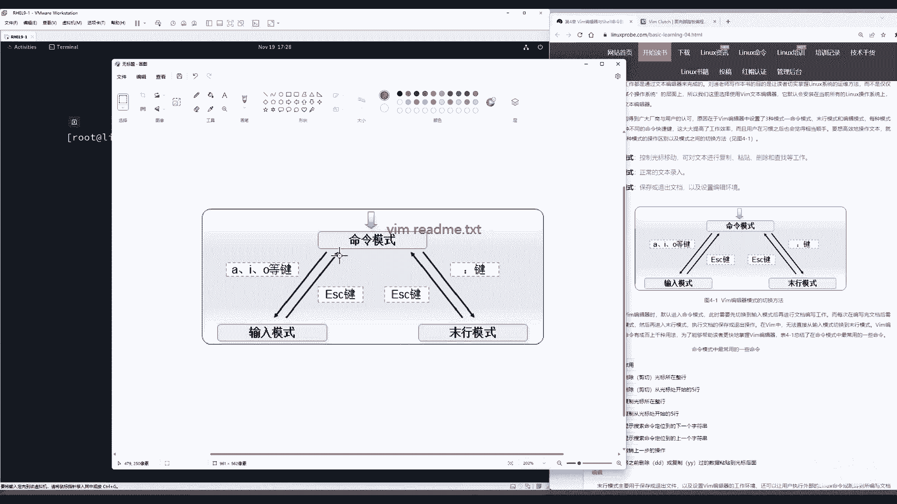

我们来举个例子啊，使用到VM编译器，随便打开一个文件好，我现在可以看到啊，大家可以一边去操作，打开这个文件之后，我们可以去敲键盘上的Q，比如说我现在敲，我现在敲十次，请问现在这个文本上面有没有变化呢。

没有变化，我现在敲十次这个小姐W，只有光标在跳位啊，但是他没有任何编辑上的内容对吧，我输入的W去哪里了呢，我再输入一下E可以看到，也没有任何变化，只是光标在变而已，然后呢我们去敲一下R啊，他只变了一位。

再敲十遍也没有用，大家听得到，我现在敲键盘对吧，在我敲一下T可以看到啊，也没有什么太多的变化，就是我们敲的这样的一个字符都去哪儿了呢，但默认情况下它是在命令模式下，命令模式下。

我们不能够像记事本一样去编辑文本内容的。

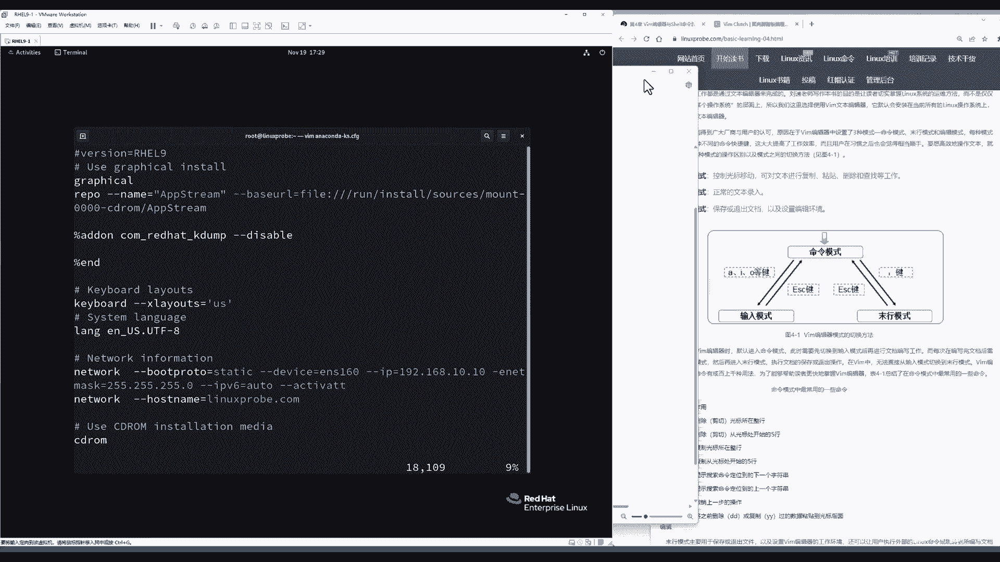

我们需要敲一下这个A或者I或者O这三个键，进入到输入模式下，我们才能够对于这个文件来进行一个编辑，另外不同的书籍有不同的叫法，我们这个以外叫做文本模式，有些书里面叫呃叫做这个输入模式更好。

还有些书原叫做这个文本模式，大家都知道啊，它都指的是这个模式一模一样的，还有什么呢，插入模式，因为这个insert嘛，他这个I的话叫做insert，也叫插入模式，总之这几种叫法都是用来去编辑哈。

或啊或者有些呃这个呃，呃一些年轻作者可能会把这个记事本模式好，我们不管啊，总之我们敲到A或者A或者O这三个键之后，进入到了这个模式，我们都可以用来去编辑文本里面的内容，然后我们当编辑好了之后的话呢。

需要敲一下我们键盘上的这个ESC键，返回到命令模式下，然后才能够进入到末行模式下，末行模式下的话，它是用来去保存和退出文件，它可以去保它，可以去保存这个文件，也可以不保存，直接退出这个文件。

都可以去使用这个模式来去完成，那我们要看到的就是从输入模式下，是不能够直接去跳转到拨号模式的，也就是说在编辑模式下，我们是不能够直接对应为这个文件来进行，保存和退出的，然后我们进入末行模式的方式的话。

那就是敲两个冒号啊，不啊，那我们只需要敲一个冒号啊，敲出两个点来就可以进行一个呃保存和退出了，我们叫做这个末行模式，这个末行模式的话呢，也有人叫它冒号模式无所谓啊，就是它都是指是同一个模式。

大家知道就好了，我们把它叫做这个输入模式，跟末行模式以及叫做命令模式，同一秒要以我们这个为准啊，这个也是一些对于这些术语的一些普及，那继续来给大家讲，也就是说再去使用到VM编译器的时候。

它默认有三个模式，我们在默认情况下进入的是这个命令模式，要想去编辑文件，需要敲A或A或O进行编辑，然后我们再返回到我们这个命令模式下，需要敲一下ESC键，然后想想保存和退出的话呢，我们需要敲一下冒号。

进入到冒号模式，然后去输入冒号模式的命令，再次进行保存，如果说我们又不想保存了，也需要像ENC键返回到命令模式下，总之我们要给大家提两点，提两点，第一就是这个命令模式它是不能够啊。

第一来讲就是这个输入模式，是不能直接跳转到问号模式的，大家要知道的啊，第二点的话就是在命令模式下是能够呃，它是不能够直接去编辑啊，他是嗯不能够呃进行自由的去编辑，输入模式里面的内容。

它只能对于文件来进行一个批量的搜索，替换和剪切删除这样的操作。

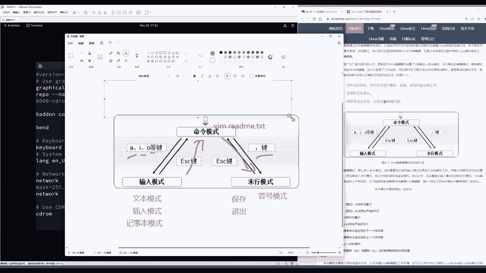

我们待会儿给大家举一些例子啊，我们只能够在里面去执行一些命令，那可以来看一下我们的表格，四杠一，一边列举的一些在命令模式下能用的一些命令，好，大家重新打开这个文件，这个文件它如果是在的情况下。

那么就打开它了，如果他不在的情况下的话呢，会生成出来一个临时文件，然后也可以进行一个编辑啊，最后把它保存了，这个文件也就有了，来编辑一下这个文件，大家看好啊，我们今天这个实验会非常有意思啊。

我到底要给大家讲明白这个啊，我们的vi编辑器它都能够去做哪些事情啊，非常有意思，来进入到这个VM编译器的啊，我们去使用到vi编辑器，进入到这个文件之后啊，你可以看到黑兔这个方向键啊。

来变更我们的光标所在位置，这个方向键就是我们平时玩游戏的时候啊，就是在这个右手边是一个上下，左右箭头来进行一个移动，好我先给大家举一个例子，看一下表格，四杠一，我想要去剪切掉当前所在这一行怎么操作呢。

看一下表格啊，四杠一四杠一来，我们要想去剪切掉这一行的话，实际上去敲两下dd就好了，dd啊，于是哎等一下啊，不好意思啊，弟弟我把它给删掉了，可以看到了吗，我们在这个光标所在行。

如果想想要去剪切掉某一行的话，那么就是敲dd就好了，好再去给大家做一个演示啊，火光标所在行是在这一行看到了吗，那我们猜一下dd来剪切走了，就非常简单啊，如果说我只剪切不啊，那我们没有粘贴的话。

它默认的情况下也就是把它给删除掉了，所以剪切和删除是同一个操作，它是它它们都是dd，在vi编辑器的命令模式下，是没有删除的快捷键的，它只有剪切一剪，切不粘，那不就是删除吗，那所以大家记住。

就是dd代表就是这个叫做剪切操作啊，一般叫做删除操作，要想强先去删除掉一行，也使用它就好了，那我再来我使用到dd把这个行业给它剪切掉，dd好剪切走了，不粘就是删除，那我想粘了怎么办呢，看一下表格。

四杠一，同样想要去粘的话，点一下P每点一次，P往下占一行，1234567好，我往下点了七次，于是他出来了七行，每点一次P代表一次粘贴，dd剪切P是粘贴好，那要想去复制贸易行的话呢，我们不想剪切走它。

我想保留它，然后我们进行复制，我以这行为例啊，字稍微少一点比较好看哈，这个行为例啊，宽容标所在行是在这个位置来点一下，YYYY代表的是复制光标所在行啊，然后我们还同样的是点一下P进行粘贴。

每点一次P往下占一行，我点了五次，往下复制了五行，那这样的一个效果，当然我们也可以进行批量复制，批量剪切，这不就是我们对比他这个啊，windows里面记日本的一个好处了吗。

好比说我现在想要去一次性的复制网下的三行，图标所在位置，在这里好，那我们就敲一下3YY代表就是往下复制三行，于是我找一个空白地啊，然后再在这个在最底下啊，点一下P，可以看到我们刚才把这个所对应的三行。

都一次性的给它复制出来了，当然了，我同样的我也可以再多粘几次，我每往下粘一次，往下就粘三行，同样的这个也是我想去把这两行剪切走，剪切到最底下去，那好了，就是一个2DD。

就是说我们可以通过前面加数字的方式，通过在这个啊dd跟YY前面加数字的方式，来对于这个文件来进行一个批量的剪切，跟批量的复制的操作，然后最后的结果都是按一下P，来进行一个粘贴操作，还有什么呢，就是N啊。

我们可以去啊，我们可以来进行一个搜索呃，搜索什么呢，搜索一个叫做linux pro吧，我们搜索这个关键词，它的方式是在我们的命令模式下输入一个斜杠，接下来输入一个关键词linux probe a。

下回车，就可以为我们去定位到某一个关键词，所在的位置了，那我要想去看到它下一处，因为这在在这个文件里面，他可能会出现很多次了，那我想要去找到他下一次所在位置，那么就敲一个小写N啊，没有了，很尴尬啊。

这个广告只出现了一次，那我于是再搜一下，比如说我搜OO这个词，可以看到这个关键词的话呢，在这个文件里面出现了很多次啊，我们可以每点一下小写的N会往下去找到它，下一次所出现的这一个位置。

然后有点像是他们windows里面那个啊，就是点击下一次啊，就是这个下一个啊查找到的位置，这样的一个效果看看，然后我们可以把这个输入法，调成一个大写字母N，然后我们往下，然后我们再去点。

每点一次它会把它，它会找到上一次这个构件词所出现的，这样的一个位置，这就是我们的N的这个效果，当我们都对于这个命令模式下编辑好的文件了，想要进行操作行啊，在这个时候突然间发现有一些操作操作失败了。

或者说我们可能写错了，我给大家举一个例子啊，这一行我现在想要把它给剪切走啊，然后的话呢我不小心点了YY了，然后我又不小心点了一个PPPPP了，这个时候怎么办呢，你有两个选择。

第一个选择就是一个4DD把它给删除，那你还有另外一个选择，就是点一下键盘上的U，每点一次U它会往会去撤回一次，然后大家可以看到这个效果，就是每点一次U它会往后去撤回一次，每点一次U他会往后去撤回。

直到点了N次O啊，然后啊直到点了很多次U了之后，他没有任何变化了，代表这个文件已经回归到了，它最初始的一个状态了，这就是在命令模式下，我们能够去使用的所有的快捷键了，大家再去回忆一下。

就是DDYYPNU，还有这个啊一个斜杠，这样进行一个搜索啊，这样的一个快捷键，这个不叫快捷键啊，这叫命令，因为在命令模式下，我们叫做这个它里边所执行的命令，那要想去编辑这个文件。

好比说我想在这里面去写入内容，怎么办呢，我需要敲一下A或者I或者O的三个键。

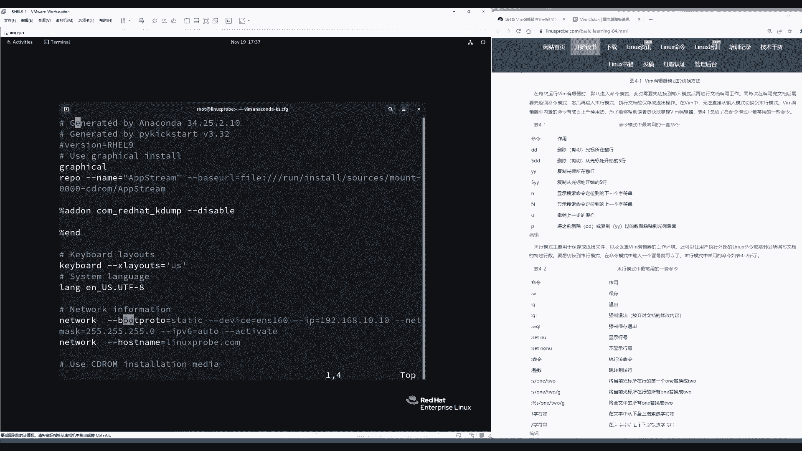

当中有一个，那么这三个有什么区别啊，这个叫做这个变更插入模式，或者叫变更输入模式的一个快捷键，大家看好啊，我现在光标所在位置是在这个B上面，大家看好啊，我现在是在光标所在位置是在这个呃by。

也就是这个B的上面，我点一下A键，大家看好啊，我点一下A这个键好，我点完了，大家发现变化了吗，第一个变化就是光标的位置往后去移了，移位啊，光标的位置是往后去移位移位，第二个变化就是。

我们可以开始去输入文件里面的内容了，这就是因为现在对于这个文件，我们已经进入到了插入模式啊，我们已经进入到插入模式了，好我现在点一下ESC键，返回到命令模式下啊，然后的话呢我们再来点一下I它这个键啊。

大家看一下变化好，我现在点一下ENC了，我点一下I，大家看看我光标所在位置的变化，点了不好，不好意思啊，点多了再来一遍啊，123走嗯啊不好意思，有点多了，这个因为话筒放到我的面前，每次一点手都划一下。

好在啊，不好意思啊啊不好意思啊，我再这样，我把这个光标组的位置放在这个C上面，好，我现在命令模式下，我点一下I这个键好，我点完了发现了吗，公标位置没有任何的变化。

第二点我们可以去编辑这个文件里面的内容了，这个就是这两个的区别了，A这个键叫做追加写入操作，实际上它就是在这个光标的后面的一处，开始进行一个追加写入操作，而这个I的话呢是叫做插入模式。

它是插入到工作所在位置前面那个字符的，然后开始进行一个输入操作，说实话啊，这两个没有任何本质性的区别，因为爱或者这个呃，其实你敲A和这个I吧没有任何的区别，因为你都可以通过这个方向键，就是你敲A的。

或者你敲A的之后，你自己用这个，那你可以通过这个方向键去调整嘛对吧，你这个你可以去进行一个呃这样进行一个调整，但是O这个键就有意思了啊，规模组的位置是在这个九，这个位置大概是在这啊。

看来这个是在E上面敲一下O的键，然后可以看到它是在我们光标所在行的下一行，来进行一个插入操作了，然后巴拉巴拉巴拉现在可以去写内容，这个是有意义的，这个就是在O是在我们的光标所在行的下一行。

来进行输入操作，我们再回忆一下啊，要想从命令模式下切换，进入到编辑模式下，我们可以叫AIO3个键，只有那种特别无聊的大学老师啊，那些特别不会出题的那些老师才会去出题，去考你A和I的区别。

本质上没有任何的区别，你手大，你敲那啊，因为有些女生可能会比较小，这个小拇指可能按这个A有点费劲，那你就点一下I，如果你手足够大的话，你A和I你随便啊，你想点哪个就点哪个，反正我喜欢点A啊。

如果大家写的话，也可以点I啊，这也无所谓，因为最后都可以通过这个光标来进行一个调整，而我们要主要注意的就是这个O这个键，还有比较有特色O这个键按完之后，它就在我们国标所在行的下一行进入到机器来。

进入到输入模式下，这个挺好玩的啊，省得我们老把它还需要去返回啊，就是一啊，我们需要去一直到这个啊某银行的这个结尾，然后去点一下A然后再点一下回车，这样来再去新建出来不就省事了吗，O这个键挺好玩的好。

这是进入到编辑模式下，编辑模式下就没什么可说的，这就是各种敲嘛啊，你想敲什么敲什么啊，这就没有这个没有，这没有什么啊，没有什么可以讲的东西啊，没有什么可说的，那我们要想编辑好了之后，想先保存怎么办呢。

看一下图里面讲到了，编辑模式下是不能够直接切换到末行模式的，那我们需要返回到命啊，我们先需要返回到命令模式下，需要敲一下键盘上的E这个E啊，现在要敲一下返回键啊，敲一下ESC键。

返回ESC返回到命令模式下了，然后干嘛呢，敲一下冒号，大家可以看一下我这个光标所在的位置啊。

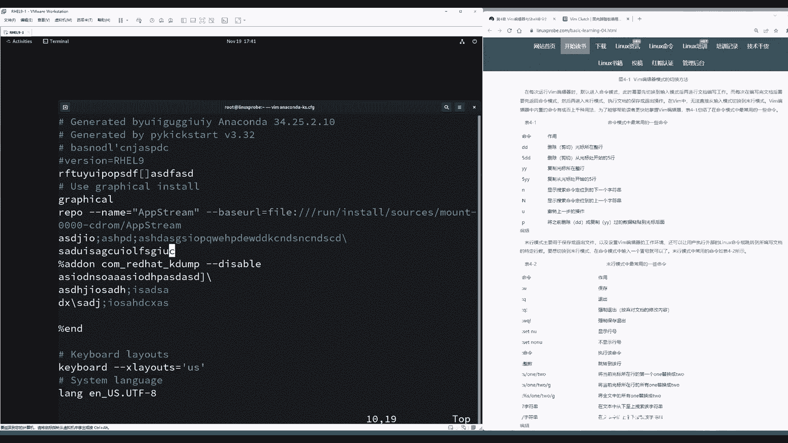

是在这儿对吧，我现在已经返回到了这个命令模式下，我们的界面的左下角，现在是没有任何的这个提示信息的好，我先掐一下冒号，进入到的就是末行模式啊，我们现在就可以进行一个保存了，W是保存，Q是退出。

WQ叹号是强制保存并退出来，我给大家做一个演示，我想保存这个文件就是一个W，我想退出这个文件，就是Q这个键，如果说有些情况下啊，两个可能性，第一个可能性，我们没有对于这个文件进行保存的一个权限，情况下。

但是我想进行一个强制保存，我们试一试行不行呢，我们试一把，那么就是WQ叹号强制保存并退出。

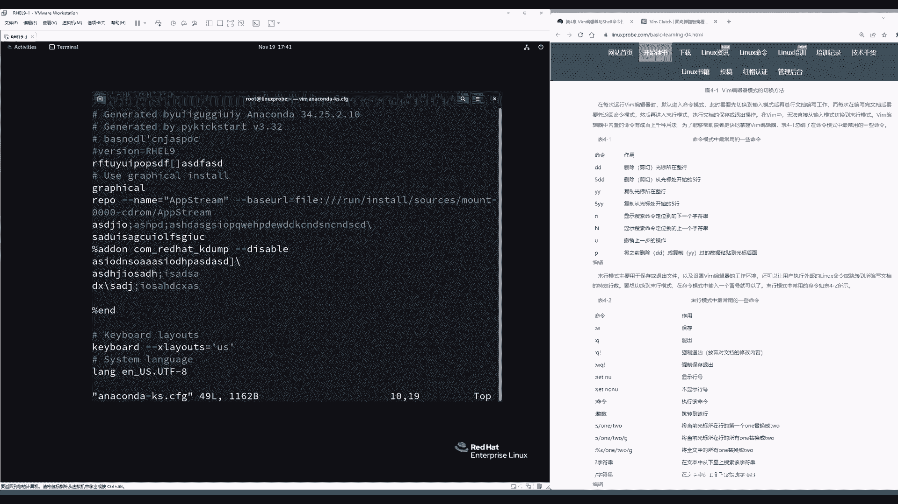

它会进行一次强制操作，看看能不能成功，第二个操作，我们对于这个文件进行了编辑操作了，但是的话呢临走的时候没有保存，他还问我说哎你这个是不是忘了保存呢，还会进行二次确认啊，我一般我不太喜欢让别人老问我。

就是大家都是成年人啊，然后你老翻来覆去问我，就是我们已经说过的问题，然后翻来覆去的问，就像说RM，然后去删除文件的时候，我一般情况下会使用一个一个小写f force，来进行一个强制删除，大家记得啊。

那么就可以进行一个Q叹号强制保存并退出，意思就是说我们去编辑过这个文件了，那么没有保存就直接强制保存并退啊，那么就进行一个强制退出，不要让他进行一次二次学问啊，这样的一个效果，我一般情况下的话。

那我这个一般会这么去试，如果我确定想要对这个文件来进行保存，那么就是一个呃W叹号，如果想要强制对于这个文件来进行一个退出，那么就是一个Q弹号，如果说我大部分的情况下。

我实际上我都是想要进行一个保存并退出，那么就是WQ叹号，这时候他会问了后面两个问题，第一个问题老刘你讲的不对啊，为什么呢，我的老师说过，命令模式下敲两个大写Z也可以进行保存，你为什么不讲啊。

你说命令模式下只能对文件进行编辑，你为什么不讲这个呢，因为我们刚刚还开始去学习，我们要给他一个呃最简单的模型，那我们要把这个每个模式最经典的功能，给大家说出来，就甚至我们在命令模式下，其实其其实来讲。

也可以对这个文件内容进行一个编辑，但是我们这样讲的话，大家要全乱了，我们最好就是呃非黑即白，一个人是好是坏，刚开始入门的时候就记住它最典型的功能，所以大家如果你知道，怎么在命令模式下进行保存并退出的话。

什么什么什么大写字母什么的，把它忘掉，那就记住了，它只能对于文件进行批量的编辑搜索，要想保存都去末行模式，先先养成这个习惯啊，然后这个也很方便，等你这个足够熟练了，你到时候你可以再用你的方式。

然后来进行一个编辑和退出啊，这都可以，然后我们的话呢还有第二个事情，就是同学们会问说，那如果我说我正常情况下，我会去保存并退出文件，我是WQ呢还是WQ叹号呢，我推荐大家都是WQ叹号啊。

如果说它需要你进行二次确认的时候，那么你就加一个叹号，没毛病，你就可以直接就过去了，如果他不需要你近似二次确认的话，那么你多打一个叹号也无伤大雅，那也是没太大问题的时候，他再去询问了。

所以老刘的习惯来讲，就是WQ叹号直接就是保存并退出呃，不论任何情况下，我都会这样去用啊，特别的方便，从来没有出过错，另外的话呢还有很多是啊，还有很多种方式，对于这个vi编译器技能性能性的一个提升。

大家后面去学习的时候会发现效率越来越高啊，大家在一些网络上也会看到一些，变编译器的一些脚本啊。

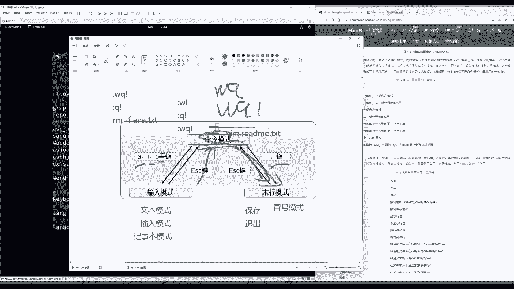

然后一些就用这个环境变量设置了一些教程啊，这个效率会越来越高，好比如说我现在想去显示一下这个啊，工作环境当中的行数好了，我想显示一下行数，这个时候也可以进入到末行模式下，然后敲一下SNU。

你可以看到显示出来，这个文件所对应的一个函数了，然后我们可以对它进行一个编辑和删除，什么的啊，不然我们可以用这个文件来进行一个，批量的搜索呀，替换什么的都可以去实现，还可以进行替换的。

那这个效率越来越高，我之前看过一个小的一个脚本啊，很有意思，跟大家分享一下，这个再去学习LINUX的时候，对于效率和这个稳定性和高可用的这个追求，是一个像一样的过程。

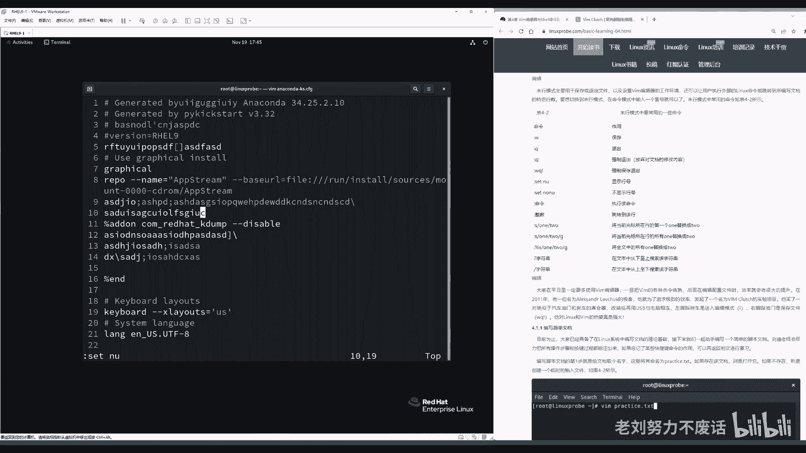

你会越来越上瘾的啊，然后的话就是我们看到之前网上一个脚本，这实际上是来自于国外的一个项目，我们有一个大神啊，最开始是一个国外版本啊，他把自己家的汽车给拆了，你说这不是有感觉。

就感觉很可能是可能是个富二代啊。

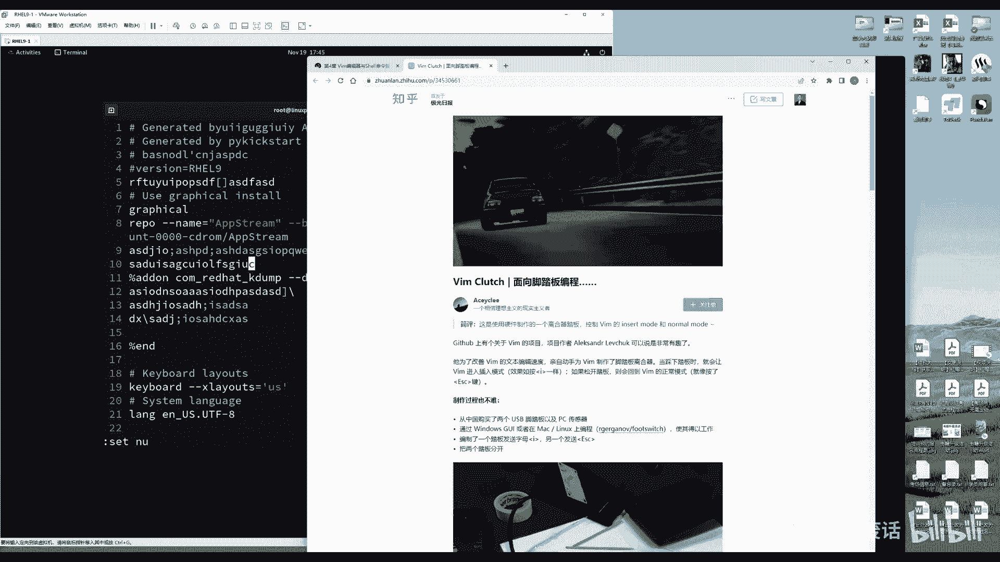

把自己家那个汽车啊，把自己家汽车汽车给拆了，把那个呃把自己这个刹车呀，然后离合呀，有油门啊给拆下来了，拆完之后的话呢，给他接到了自己的这个电脑上面，左脚是退出，右脚是保存，左右脚同时踩，是保存和退出啊。

可能他这一顿操作下来，你以为他要漂个移，实际上还是要保存个文件，然后后来这个项目的话在国内也有啊。

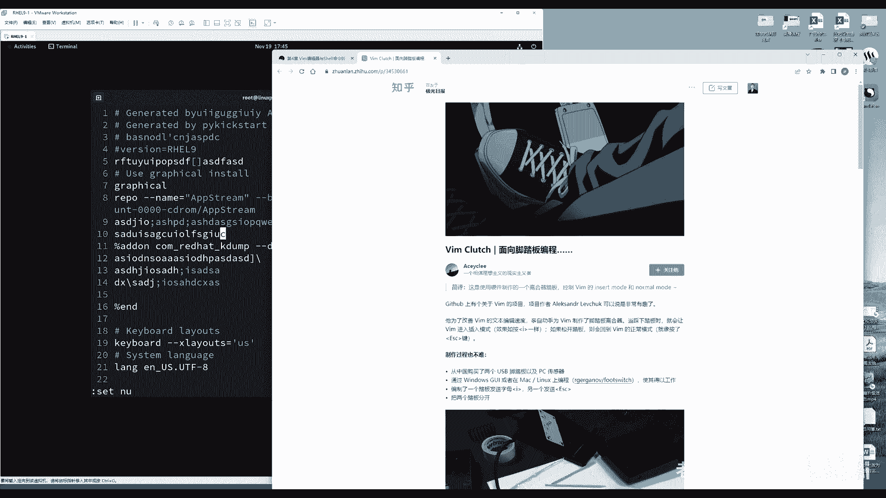

我刚啊，突然间就看到这么一个小的一个小实验啊，很厉害，可以看到啊，如果你想玩LINUX的话，你就要有一种饥渴精神不断去追求嘛，可以就是不用拆自己家汽车啊，没必要啊，没啊，没有必要去找这么一个盒子啊。

找这么一个小小，实在不行，找一个一个找一个老鼠夹也可以啊，找这么小一个小盒子，类似于踏板一样的一个形状，放一个单片机进去，然后开始编程，放到自己脚底下，特别的方便，我以后就要给大家出一个教程啊，什么呢。

往里面去写一个小程序，只要你想保存和退出这个文件，你就踩一下这个脚底板上这个嗯这个小踏板啊，这个小呃，这个呃这这么一个小油门啊。

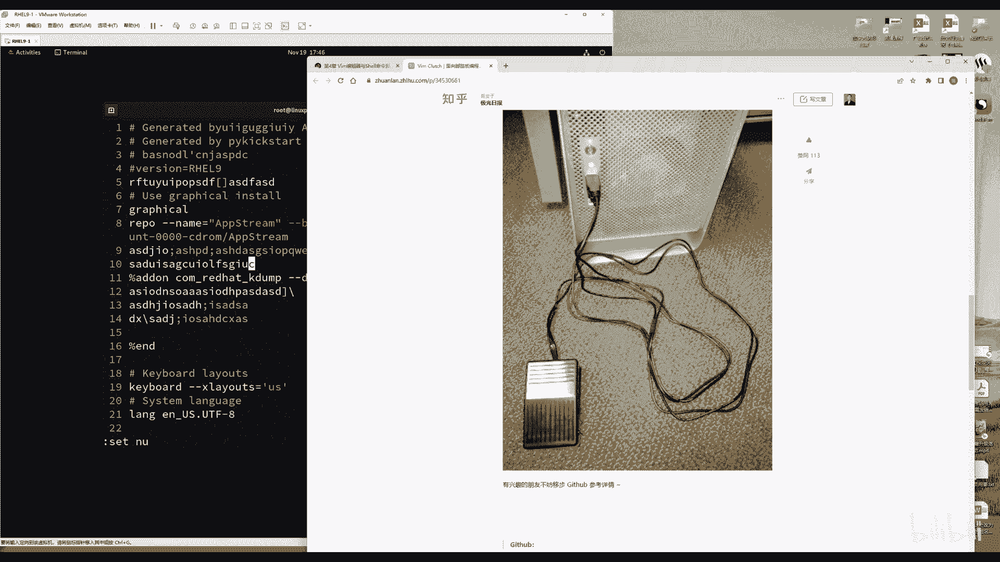

这样的话，那你就可以对这个文件进行一个保存并退出，特别好玩啊，这个特别好玩，而且我看了一下那个脚本一点都不难啊。

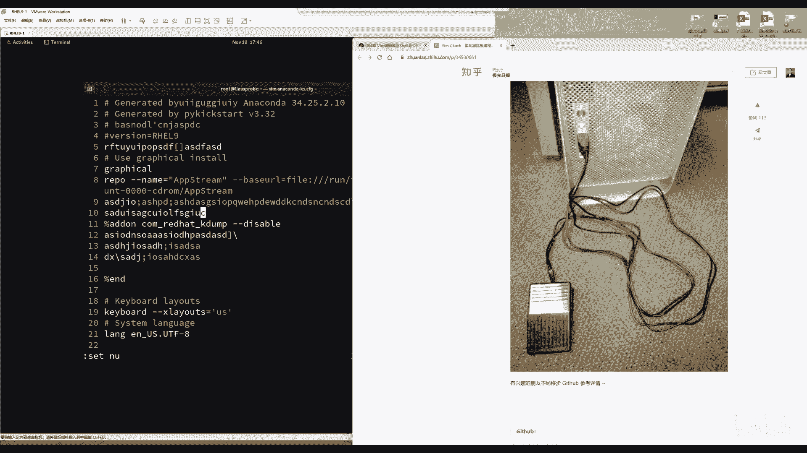

到时候我给大家出一个教程，同学们可以去试一试，好废话不多说啊，有点有点跑题了，我想跟大家说的就是，不要去用他们那个windows里面的记事本，老跟我们的VM编译器去对比，那个不是一个效率上的一个。

这个都不是一个等级啊，现在可能刚开始去学习一些基本的加减乘除，大家可能感觉不到这个编译器的一个嗯，效率有多么的疯狂啊，非常的魔性啊，后面越学大家也觉得哇这个太牛叉了啊，太厉害了。

来我现在给大家做一些简单的实验啊，还是今天打基础不会讲特别的难，先不上魔法呢，先上一些物理攻击，大家看一看啊，我想要第一步去编辑一个文件，我想要啊，我想要去编辑一个文件，这个文件它要是在的话。

我们就直接去打开这个文件就能够进行编辑了，刚才大家看我讲了三个模式啊，动手去做一下这个实验了，现在可以动手去做了啊，第二个的话呢，就是如果这个文件材料不存在的情况下，我们去编辑一个不存在的文件。

这个时候怎么办呢，首先你的第一步先去喝口水，稍等一下，第一步啊你要不喝口水啊，第一步你要先输入文件名称就可以了，他会去离世界出现一个临时文件，你要保存了，他就已经在了，你要不在的话，他要不在的话。

他一会儿就把它给它，他要不在的话，待会你要没有保存它就没有了，就是一个临时文件吧，但是缓存写入到这个内存里面的，唉已经干了半个小时了，同学们会发现老刘讲课越来越有精神啊，你怎么讲话就是这样的。

有时候说就是这个东西热爱嘛，就是喜欢讲，那没办法啊，讲着讲着有就自己跟自己都可以，就就跟自己都有点打架啊，有些时候自己讲不好啊，或者说这个讲的不干，就感觉哎没有讲到位的，自己都感觉自己说不过去啊。

跟自己跟自己打架，其实这就是自己家的培训，跟别人家的培训的一个区别，如果要是雇了一个讲师，那很尴尬啊，他可能一些点吧讲不太好，没办法啊，也没有太好去啊，也也不能去说什么，也再也再也再也再也没办法。

他老刘家自己家的培训就不是那么回事儿啊，自己家这个嗯产品自己家负责，自己家培训，自己心疼啊，所以哎特别喜欢讲吧，然后继续来编辑这个文件啊，打开这个文件啊，虽然文件名称无所谓，您可以用自己的名字来命名。

然后后缀都无所谓啊，因为在这个LINUX里面的后缀人家都不看啊，我就是我现在写一个text，只是为了照顾一下同学们，你们的小心脏啊，实际上我可以不写这个text，后缀是无所谓的，后缀是无所谓的。

来编辑这个文件，点一下A哎呀不行，我想给大家提个问题，但是会发现这是一个视频课程，同学们回答不了好，我们就把它当做是一个这个在线培训，好不好好，我现在提问的同学们，我现在默认情况下进入到的是哪一个模式。

我现在默认情况下，我进入到这个文件当中的是哪一个模式，同学回答我好啊，可以稍微的跨越时空的回答一下这个问题啊，快约一下时间来，好，没错啊，是命令模式好，我现在要想去进入到这个编辑模式下。

我可以敲什么键好听，有同学说这个A和I或者OC3个键对吧，嗯好A和I这两个键哪个更好一点呢，没有区别，但是O肯定不合适，因为我想从第一行开始编辑，就敲一下A这个键来，我敲完A了之后。

左下角出现了一个叫insert的一个词，叫做插入模式啊，我可以继续对这个文件来进行一个编辑了，呃写一个广告吧，welcome to啊，welcome to诶。

大家光知道每一个站叫linux probe是吧啊，点com啊，可以进入到我们的网站里面，还有一个另外一个我们的亲儿子啊，叫做这个LINUX库啊，也是第二本书嘛，那就是我们啊。

这个我们叫做这个LINUX常用命令大全啊，大家可以去看一下我们这这两个网站啊，当然了，如果您要是这个盗版视频，如果说您要是我们这个盗版视频的用户，可能从网上不知道哪儿找到了我们这个视频啊。

如果想要找到这个更全的工具，以及红帽的考题啊，也可以啊，啊去这个咱们的官网上面报个名，然后两两千四百块钱也不贵啊，报名单的培训进行进一步的学习，你要是不想花钱也没关系啊，我们给盗版的这个用户说一下。

那你就继续努努力，看看能不能从再再从网上找点，我们这种盗版的这个资料什么的啊，好我们都写好了之后，要想去返回到这个病历模式下，我们需要敲什么键呢，啊又是跨越时空的一个问题啊，已经给大家发过去了一个问题。

请问作答啊，我们敲敲一下键盘上的ESC键，返回到命令模式下，然后大家看一下左下角，insert这个词就会瞬间消失，因为进入到了末行，因为已经进入到了命令模式下，金融变量BD模式下。

至少要想进入到问号模式怎么办呢，唉需要敲一下什么的，两个猫需要加一个冒号啊，按住shift键敲一个冒号，进入到了末行模式，末行模式可以对于这个文件来进行什么操作，黑进行什么操作啊，保存退出什么呢。

设置编辑环境啊，呃好我们来呃，W保存right吗，q quit退出WQ叹号，保存并退出，强制保存并退出，按下回车走，你搞定了搞定了，大家查看一下这个文件啊，ANA点test查看一下文件的这个里面的内容。

第二章节里面的cat in就用上了，哎拿出来翻出来用一用，看到哎这个内容就写入成功了。

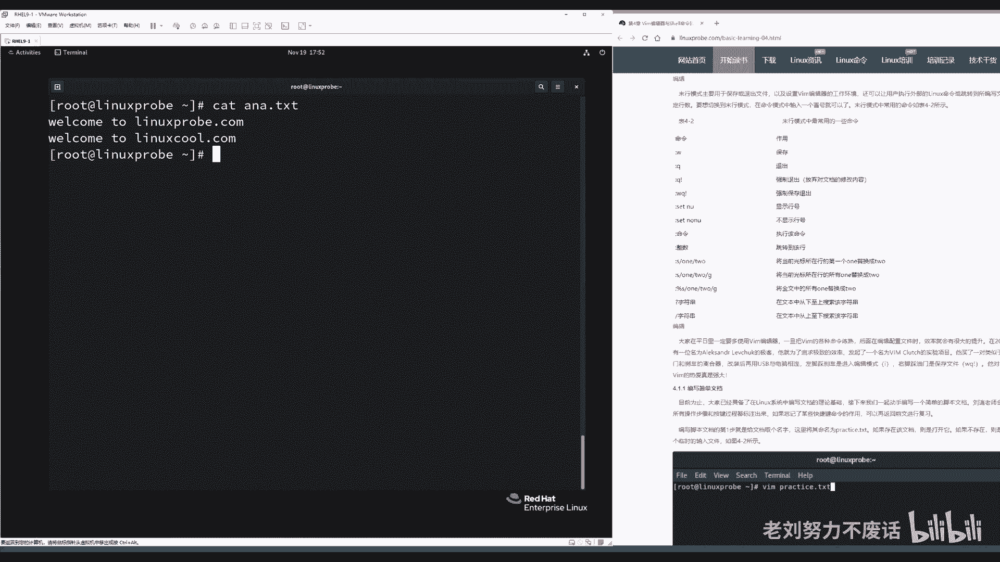

就这么简单，同学们还有多难呀，不就编辑一个文件吗，很简单。

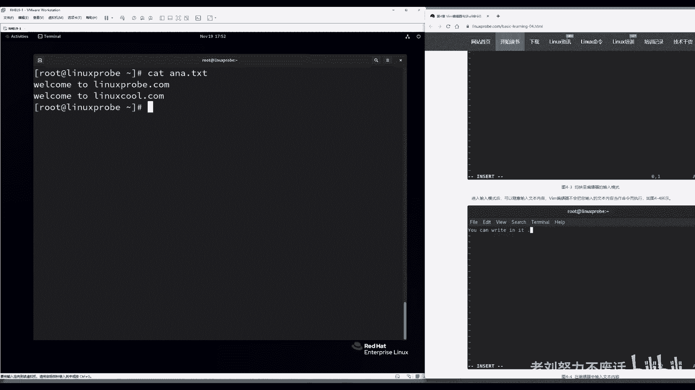

so easy啊，接下来第二个小实验啊，编辑一下这个主机的名称，我们要想编辑一下我们主机的名称怎么编辑呢，还是啊简单VM编译器后面找到对应的文件名称，也就是对象命令的对象，找到他啊。

甚至输入前面的一部分，可以按一下tab键补齐，只要没有重名啊，自动帮我们补齐，从红包REO7开始哎，就就是老刘非常的欣慰啊，就开始有一部分就是原先的只能通过命令，它只能够补齐命令跟文件啊。

那也就是说命令跟对象，但是的话从红包路由器开始，比如说那个firework gucm d命令，就可以来补齐参数了，其实那要是不能够补齐参数的话，那我告诉CMD那个命令，哎呀妈呀，那么长十多个字符。

谁记得住啊，后来好在从红包REO7开始，就能够支持tab键补齐参数了，我们看到红魔ROO9的时候更厉害了，大多数的命令他都支持参数补齐的，这个特别厉害，同学们更多LINUX的这个潜在的能力啊。

需要同学们你们自己去开发，多几下tab键，看看能补齐什么东西啊，能够大大提升我们的效率，A1下table a一下回车键走，你啊进入到这个文件里面了，好这个文件的话呢，里边已经默认有内容了。

那同学们可能跟我这个不一样啊，我已经准备好了一个广告等着大家呢，那如果我想把这个信息给它删除掉，我们怎么给它删除呢，首先脑子里要过一个电，就是什么呢，就是编辑一个文件的时候，默认情况下使用编。

那么使用到这个编编译器，进入到时这个文件里面的命令模式，命令模式能够对这个文件进行编辑吗，可以什么合适剪切操作合适来dd剪切掉这一行，粘不粘不粘，然后我们点一下A进入到插入模式下。

我会把我现在所想的每一个字符，都给大家去口述出来，您知道我在敲的是什么，这样我们做这个实验的时候没跟上，没关系，再听一遍就跟上了，来linus cool com，写一个广告，又写一个广告啊。

上了一个广告，又写了一个广告，来接下来是什么呢，看左下角是编辑模式，是插入模式，点E点ESC键返回到啊，这个我们当前这个命令模式下，然后冒号末行模式，WQ叹号搜，你搞定了吗，搞定了。

然后去查看一下house name，会发现没有变化，没关系，需要在cs重启过后就生效了啊，至于说怎么能够让它当前生效，我们不管它还是啊，他现在就报了一个旅行团啊，跟着导游走。

第一四章节我们就专门去玩这个VM，待会还要去编辑一下这个网卡配置文件呢，还有编辑一下我们这个当前鸿茅ROO9的这个，软件仓库的一个配置文件，它的功能和参数，同学们不要去管它，我们只去关心你的vb就行了。

那就只能编译成功就可以，至于说参数写不写作，我都不管啊，只要能够保存成功，这就是胜利了，那就是胜利的一天来继续，我想去编辑一下我的网卡信息，很简单。

我来编辑etc目录里边的这个network scripts，这个目录的话呢，呃等一下啊，System config，然后是network scripts，然后这个目录的话，同学们要记下来，要记下来。

因为在红包HCIC考试的时候，他要求我们去编，记得去这个编辑网卡的配置文件啊，里面会考到这个文件，但是同学们说如果说这个太难了，那记不住没关系，我会给大家一个另外一个方法啊。

一条命令不敲就能够让大家考过的方法真有，那所以这个大家会在这个考前辅导当中，会有一些小技巧教给大家，特别厉害，嗯就是在这个没有考研辅导这个东西吧，就会遇到就是说同学们看的这个考题，怎么看怎么眼熟。

但是就会发现老是找不到他，诶，我看一下啊，这个在红毛real9当中，我发现啊这个文件它已经不存在了，嗯我看一下啊，他说这个文件已经不是烂了，他他说这个现在文件的话呢，被转移到这个目录当中了，好了啊。

红包若举的一个小变化好了，那我们就这样CD，然后进入到这个目录当中，看一下我们的网卡配置信息的话，那现在这个ENS160现在是在这了啊，好没关系，不重要，编辑这个文件，现在就光讲怎么编辑文件嘛。

打ENO160啊，然后巴拉巴拉，然后按一下tab键自动补齐，编辑这个文件，假定说我想要把这个IP地址给它，编辑成另外一个，当然同学们，你们没有没关系啊，看我操作就可以了，只要你编辑另外一个字符就可以了。

好比如说我10。20，我现在把保存保存啊，叹号，然后我们现在去再去查看一下这个文件，可以看到这个就是识别二零就这么简单啊，不要管怎么能够去重启生效什么的，都不管它，现在只要你能够把这个配置文件。

毕竟成功就可以了，当时我们就啊写这本书的时候，为什么选择这几个文件呢，原因就是因为我想既然要去练习这个BM那个，那么就那么肯定就要做实验，那么既然要做实验，那啊那么我们既然要做实验。

那么干嘛不选择一些以后会用得到的，一些文件呢。

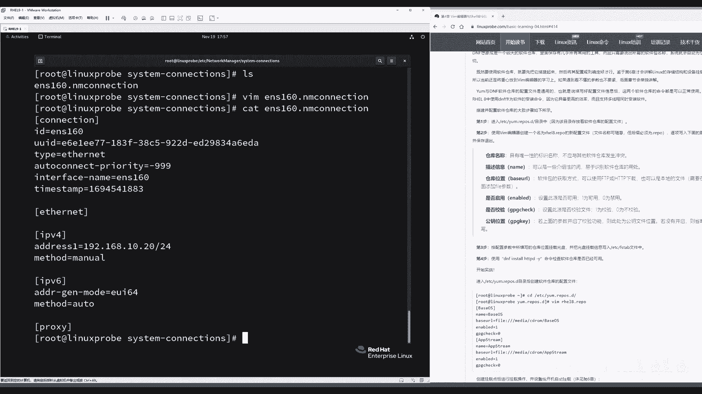

这样做一个例子啊，以后混个脸熟也好啊，所以我们才选择了这样的一个文件，但是同学们现在请让自己努力的克服一下自己。

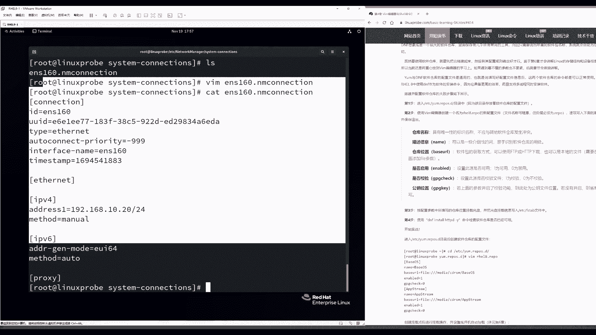

就是千万不要去关心这个参数的作用，你只去关心说有没有编译成功就好了，来我继续下一个文件，这个文件的话呢是用来创建软件仓库的，第一章节去学习过啊，我们要想在这个LINUX里面去编辑，好，想去编译软件。

那原先只能去编译源码包，后来的话有个rpm，再后来的话有一个叫YM现在去使用的这个DNF，记得吗啊这么一个软件仓库的一个技术存在，我们就进入到这个YM点rap点D的目录当中，可以看到里面会有两个文件。

它都是用来去呃，设定软件包仓库的这样的一个信息的，我先来给大家编辑一下，我们编一个哈哈点rap的一个文件，这个文件的话默认不存在，它会新建出一个临时文件，解读到内存里面。

如果说我们现在对于这个文件来进行编辑了，但是返回到命令模式以后之后啊，然后进入到这个啊，然后Q叹号强制保存，然后进行一个强制退出，如果说没有保存的情况下，这个文件是不会把它不会被保存的。

只有这个文件被保存了，它才会有这个文件，好，我来编辑这个文件，大家混个脸熟就可以了，不要关心里面的参数的作用，首先来讲就是命令模式下，不能够直接对于文件内容来进行直接的编辑啊，不对他不够自由。

我们需要点一下A或者I这个键，进入到插入模式下，然后我们去写了一个格式，接下来就可以随便去写了，里面的参数并不那么的重要，我给大家只是举一个例子啊，打个样，同学们以后会举呃。

以后会给大家细讲里面每一个参数的作用呢，哦先写一部分，然后这个信息的话呢，我们需要写两遍，所以我懒得去写了，怎么办呢，把光标移动到最上面，然后点一下5YY这个键，接下来到最底下，我想要去粘贴。

那么就点一下P这个键，好，没有问题，往下粘一行，这里面的这个信息啊，就随便去写就好了，我就我我我我给大家演示一下吧，但是同学们千万不要走心好吧，就看一下老刘，现在咱们给大家去敲了一下就可以了。

千万不要走心。

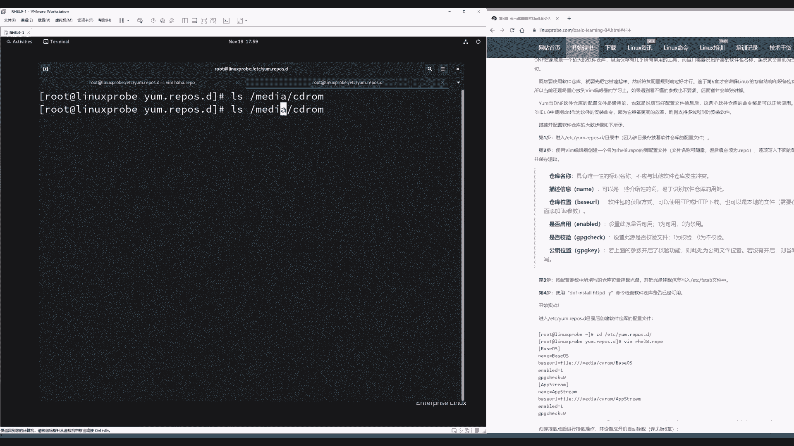

唉，光盘还没连上是吧。

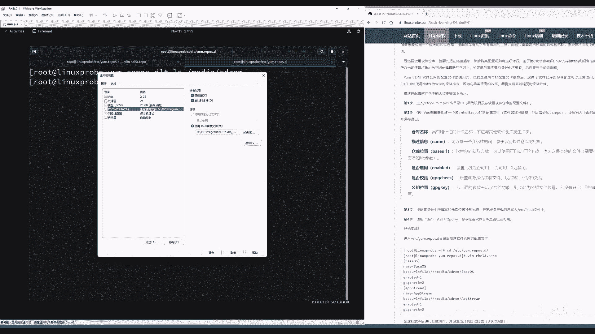

啊不要关心，不要关心我们在做什么，不要关心，只要关心我们的文件有没有编译成功就可以了，我只给大家换个小勺，因为后面会讲这个参数的，每一个作用都会给大家讲，所以现在你只要看一看，有这么个东西足够啊足够。

千万不要往心里去，往心里去了之后，你的编辑编译器就学杂了啊，现在只要能够编辑成功，能够保存成功，那我们就是第一名来media li们的，从这个红包热巴开始吧，这个软件仓库软件包越来越大。

现在有4000多个软件包了，原先红啊红包六六的时候才2000多个，然后怎么办呢，红包六七，红包roll8越来越多啊，从红毛肉八开始啊，后来一拍脑袋，然后那个然后那个红毛想，那这个软件包越来越多啊。

是不是要去掉一些没有用的呢，后来一看啊，红包没有这么做啊，而是把这个软件包越做越大啊，现在的话呢是把它变成了两个目录，里面保存了一个叫做这个基础，一个叫做软件包的一个呃，呃这么一个软件包流吧。

就是说你理解一下，就是说红包REO9的软件包啊，提供了一个特别大，特别庞大的一个软件包的仓库，它里面需要挂载两个软件仓库，然后能够才能够去使用里面所有的软件，原先放在一个目录里面，先放两个目录里面的。

所以我们需要写两遍好，那我们现在敲一下ESC键返回一下啊，返回到命令模式下，然后点一下这个WQ叹号保存并退出，强制保存并退出，还少啊，刚才我们不论是任何情况下，都是WQ叹号保存并退出。

其实我们现在直接敲WQ叹号啊，其实我们现在直接强保存并退出也行啊，只不过的话那这样的话会更加的安全一点，省得到时候他再进行一次二次询问啊，WQ叹号保存并退出，然后查看一下这个文件。

只要这个文件能够修改成功就没有问题啊，只要这个问题啊，只要这个文件能够编辑成功，就没有问题，来这个我们就给大家做个这个四个小实验啊，去学习这个vi编译器啊，原本我们原本想给大家讲一个半小时啊。

后来的话呢看了一下，没有那么难，讲了40分钟讲完了，但是东西也都不少，那我们后面的电话呢，就需要同学们动手去操作一下了啊，后面的时间就交给大家，把这个实验好好多做几遍。

然后您的话呢可以推荐大家啊编辑几个文件，比如说新建一个叫做ho点啊，就新建这么一个文件流传返回并退出，多做几个这样的实验，巩固一下今天所学习到的知识，好同学们，接下来时间就靠大家了啊，复习好。

复习好了之后，再点开下面一个视频，下面一个视频就不会再去讲VM了。

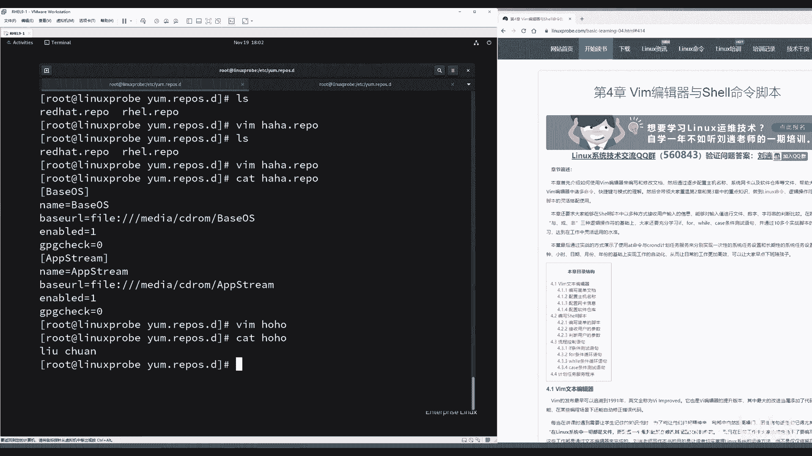

就开始去写shell脚本了。